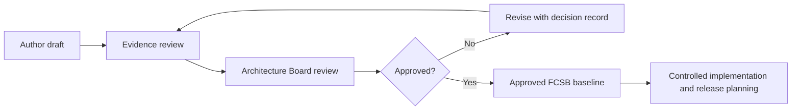

# FlowCraft Solution Blueprint — Series Index

The FlowCraft Solution Blueprint (FCSB) is the official solution-architecture series for FlowCraft Business OS. It translates approved product intent and implementation evidence into governed executive, business, application, data, integration, security, deployment, and operating-model guidance.

This index records publication identity and approval state. A document marked **Draft** or **Architecture Review Draft** is not an approved production baseline.

## Series register

| Document code | Volume title | Version | Status | Related implementation milestones | Approval status | Last updated | Dependencies | Next planned volume |
|---|---|---|---|---|---|---|---|---|
| FCSB-001 | [Volume 1 — Executive and Business Architecture](./FCSB-Volume-1-Executive-and-Business-Architecture.md) | 1.0 Draft | Architecture Review Draft | DBA-001, DBA-002, DBA-003, DBA-004 | Pending Architecture Board review | 2026-07-15 | Controlled FEAPB series; FEOM/EOR definitions; DBA implementation reports; repository release `v0.4-dba004-merged` | FCSB-002 — Application and Platform Architecture |

## Planned series structure

| Proposed code | Planned volume | Purpose | Status |
|---|---|---|---|
| FCSB-002 | Application and Platform Architecture | Application boundaries, services, runtime components, metadata execution, APIs, and extension model | Planned |
| FCSB-003 | Data and Information Architecture | Data ownership, master/transaction domains, effective dating, lineage, retention, analytics, and migration | Planned |
| FCSB-004 | Integration Architecture | Integration patterns, external systems, events, files, APIs, identity federation, and partner connectivity | Planned |
| FCSB-005 | Security and Trust Architecture | Security domains, threat model, access control, segregation of duties, audit, privacy, and assurance | Planned |
| FCSB-006 | Deployment and Operations Architecture | SaaS, private cloud, on-premise, observability, resilience, backup, recovery, and release operations | Planned |
| FCSB-007 | Manufacturing Solution Architecture | Planning, execution, material flow, quality, maintenance, costing, and shop-floor integration | Planned |
| FCSB-008 | Knowledge Graph and Governed AI Architecture | FKG semantics, governed context, model access, explainability, and AI operating controls | Future |

## Source and authority hierarchy

1. Approved governance decisions and controlled architecture documents.
2. Approved FCSB volumes.
3. Approved FEAPB and controlled framework documents.
4. Accepted DBA implementation milestones, migrations, tests, and release tags.
5. Repository README and implementation reports.
6. Draft roadmaps and proposals.

Where sources conflict, the most recently approved higher-authority source governs. Repository implementation evidence governs claims about what software exists today; a conceptual or planned capability must never be described as implemented solely because it appears in a blueprint.

## Approval workflow

## Repository evidence used by FCSB-001

- [Repository overview](../../README.md)
- [DBA-002 implementation report](../implementation/DBA-002-foundation-implementation.md)
- [DBA-003 implementation report](../implementation/DBA-003-enterprise-structure-implementation.md)
- [DBA-004 implementation report](../implementation/DBA-004-enterprise-master-data-implementation.md)
- [Current Prisma schema](../../apps/api/prisma/schema.prisma)
- [Enterprise Object Registry seed definitions](../../apps/api/prisma/seed.ts)

The repository does not contain standalone FEAPB, UMF, UFT, FOST, or FKG controlled source documents as of this index version. FCSB-001 therefore describes their business roles conceptually and identifies them as dependencies requiring controlled-document review before final approval.

## Change control

- Each volume has an independent version and approval history.
- Material changes require an architecture decision or change request.
- Implemented-status claims require repository evidence or an accepted release artifact.
- Draft content cannot silently redefine an approved FEAPB, FEOM, EOR, DBA, security, or database decision.
- Superseded versions remain discoverable for audit and historical interpretation.
