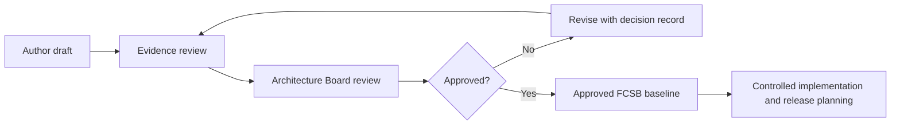

# FlowCraft Solution Blueprint — Series Index

The FlowCraft Solution Blueprint (FCSB) is the official solution-architecture series for FlowCraft Business OS. It translates approved product intent and implementation evidence into governed executive, business, application, data, integration, security, deployment, solution, and product-governance guidance.

This index records publication identity and approval state. A document marked **Draft** or **Architecture Review Draft** is not an approved production baseline.

## Series register

| Document code | Volume title | Version | Status | Related milestones | Approval status | Last updated | Dependencies |
|---|---|---|---|---|---|---|---|
| FCSB-001 | [Executive and Business Architecture](./FCSB-Volume-1-Executive-and-Business-Architecture.md) | 1.0 Draft | Architecture Review Draft | DBA-001, DBA-002, DBA-003, DBA-004 | Pending Architecture Board review | 2026-07-15 | Controlled FEAPB series; FEOM/EOR definitions; DBA reports; release `v0.4-dba004-merged` |
| FCSB-002 | [Application and Platform Architecture](./FCSB-Volume-2-Application-and-Platform-Architecture.md) | 1.0 Draft | Architecture Review Draft | DBA-002 Platform Foundation; DBA-003 Enterprise Structure; DBA-004 Enterprise Master Data | Pending Architecture Board review | 2026-07-15 | FCSB-001; controlled FEAPB/FEOM/EOR definitions; DBA reports; current application, schema, migrations, tests, and deployment configuration |
| FCSB-003 | [Enterprise Data and Information Architecture](./FCSB-Volume-3-Enterprise-Data-and-Information-Architecture.md) | 1.0 Draft | Architecture Review Draft | DBA-002 Platform Foundation; DBA-003 Enterprise Structure; DBA-004 Enterprise Master Data; preparation for DBA-005 Finance Foundation and DBA-006 Inventory Ledger | Pending Architecture Board review | 2026-07-15 | FCSB-001; FCSB-002; controlled FEAPB/FEOM/EOR/UMF/UFT definitions; accepted Prisma schema, migrations, seed, tests, and DBA reports |
| FCSB-004 | [Integration Architecture](./FCSB-Volume-4-Integration-Architecture.md) | 1.0 Draft | Architecture Review Draft | DBA-002 Platform Foundation; DBA-003 Enterprise Structure; DBA-004 Enterprise Master Data; preparation for future integration milestones | Pending Architecture Board review | 2026-07-16 | FCSB-001; FCSB-002; FCSB-003; controlled FEAPB/FEOM/EOR definitions; current API, authentication, import/export metadata, schema, tests, and deployment evidence |

**Next planned volume:** FCSB-005 — Security and Trust Architecture.

## Controlled 25-volume roadmap

Volume names are controlled at the roadmap level. A planned or future entry does not authorize implementation and may be refined only through the FCSB change-control process.

| Volume | Document code | Controlled title | Purpose boundary | Status |
|---:|---|---|---|---|
| 1 | FCSB-001 | Executive and Business Architecture | Product intent, business capabilities, operating model, governance, and roadmap | Drafted — Architecture Review Draft |
| 2 | FCSB-002 | Application and Platform Architecture | Application boundaries, platform services, metadata execution, APIs, runtime seams, and extension model | Drafted — Architecture Review Draft |
| 3 | FCSB-003 | Enterprise Data and Information Architecture | Data ownership, master and transaction domains, lineage, effective dating, retention, analytics, and migration | Drafted — Architecture Review Draft |
| 4 | FCSB-004 | Integration Architecture | Integration patterns, contracts, APIs, events, files, identity federation, and partner connectivity | Drafted — Architecture Review Draft |
| 5 | FCSB-005 | Security and Trust Architecture | Threat model, identity, authorization, segregation of duties, privacy, audit, and assurance | Planned |
| 6 | FCSB-006 | Deployment and Operations Architecture | Environments, topology, observability, resilience, backup, recovery, and release operations | Planned |
| 7 | FCSB-007 | Manufacturing Solution Architecture | Manufacturing planning, material flow, costing, execution, quality, maintenance, and shop-floor concerns | Planned |
| 8 | FCSB-008 | Knowledge Graph and Governed AI Architecture | FKG semantics, governed context, AI access, explainability, controls, and operating model | Future |
| 9 | FCSB-009 | Universal Transaction Framework | Common transaction semantics, lifecycle, posting effects, links, controls, and extension rules | Planned |
| 10 | FCSB-010 | Universal Document Framework | Common business-document identity, version, status, approval, output, correction, and archival behavior | Planned |
| 11 | FCSB-011 | Workflow Runtime Architecture | Workflow instances, approvals, timers, escalation, delegation, exceptions, and runtime audit | Planned |
| 12 | FCSB-012 | FlowCraft Studio Architecture | Governed builders, metadata publication, packages, comparison, promotion, testing, and rollback | Planned |
| 13 | FCSB-013 | Reporting and Analytics Architecture | Governed reporting, semantic measures, dashboards, exports, scheduling, and analytical consumption | Planned |
| 14 | FCSB-014 | Finance Solution Architecture | General ledger, subledgers, posting, tax, treasury, assets, close, and financial controls | Planned |
| 15 | FCSB-015 | Inventory and Warehouse Architecture | Inventory ledger, movements, reservations, availability, valuation, traceability, and warehouse execution | Planned |
| 16 | FCSB-016 | Sales and Customer Architecture | Opportunity-to-cash processes, pricing, order fulfillment, billing, returns, and customer controls | Planned |
| 17 | FCSB-017 | Procurement and Supplier Architecture | Source-to-pay processes, supplier governance, purchasing, receiving, invoicing, and controls | Planned |
| 18 | FCSB-018 | Manufacturing Execution Architecture | Production orders, dispatch, material issue, labor, completion, genealogy, and shop-floor execution | Future |
| 19 | FCSB-019 | Quality Management Architecture | Quality planning, inspection, holds, nonconformance, corrective action, and traceability | Future |
| 20 | FCSB-020 | Maintenance and Asset Reliability Architecture | Asset hierarchy, preventive and corrective work, reliability, spares, and maintenance costing | Future |
| 21 | FCSB-021 | Project and Service Management Architecture | Projects, services, resource delivery, field work, time, cost, billing, and profitability | Future |
| 22 | FCSB-022 | Mobile and Offline Architecture | Mobile experience, device controls, synchronization, conflict resolution, and offline operation | Future |
| 23 | FCSB-023 | Performance and Scalability Architecture | Performance budgets, workload models, capacity evidence, scaling, and large-data patterns | Future |
| 24 | FCSB-024 | Product Governance and Release Architecture | Product decisions, compatibility, packaging, quality gates, releases, support, and lifecycle governance | Planned |
| 25 | FCSB-025 | Product Roadmap and Future Vision | Sequenced product evolution, investment horizons, dependencies, outcomes, and future-state narrative | Future |

## Source and authority hierarchy

1. Approved governance decisions and controlled architecture documents.
2. Approved FCSB volumes.
3. Approved FEAPB and controlled framework documents.
4. Accepted DBA implementation milestones, migrations, tests, and release tags.
5. Repository README and implementation reports.
6. Draft roadmaps and proposals.

Where sources conflict, the most recently approved higher-authority source governs. Repository implementation evidence governs claims about what software exists today; a conceptual or planned capability must never be described as implemented solely because it appears in a blueprint.

## Approval workflow

## Repository evidence used by drafted volumes

- [Repository overview](../../README.md)
- [DBA-002 implementation report](../implementation/DBA-002-foundation-implementation.md)
- [DBA-003 implementation report](../implementation/DBA-003-enterprise-structure-implementation.md)
- [DBA-004 implementation report](../implementation/DBA-004-enterprise-master-data-implementation.md)
- [Current Prisma schema](../../apps/api/prisma/schema.prisma)
- [Application module composition](../../apps/api/src/app.module.ts)
- [Enterprise Object Registry seed definitions](../../apps/api/prisma/seed.ts)
- [Current web routes](../../apps/web/app)

The repository does not contain standalone FEAPB, UMF, UFT, FOST, or FKG controlled source documents at this baseline. Drafted FCSB volumes therefore describe their roles only where needed, record the limitation, and require controlled-source reconciliation before approval.

## Change control

- Each volume has an independent version and approval history.
- Material changes require an architecture decision or change request.
- Implemented-status claims require repository evidence or an accepted release artifact.
- Draft content cannot silently redefine an approved FEAPB, FEOM, EOR, DBA, security, or database decision.
- Volume titles and sequence are controlled through this index; additions, removals, or renaming require Architecture Board review.
- Superseded versions remain discoverable for audit and historical interpretation.
