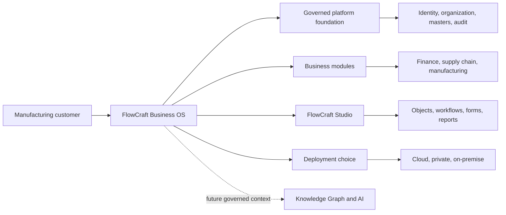
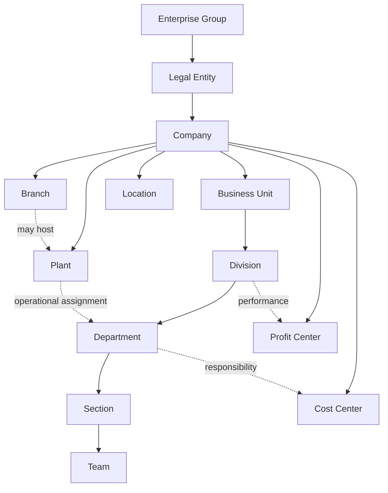
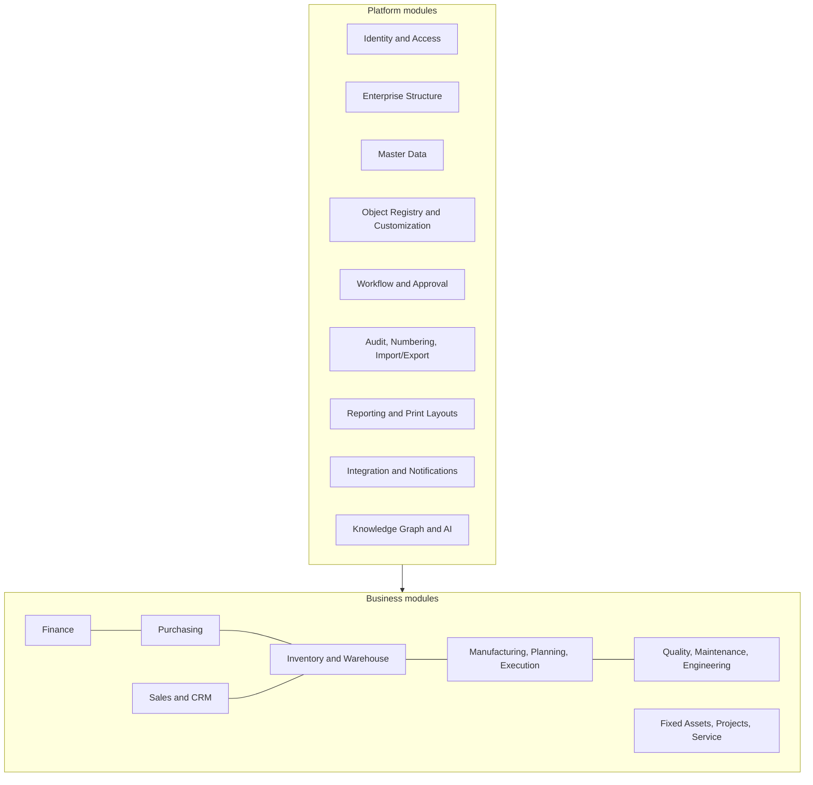
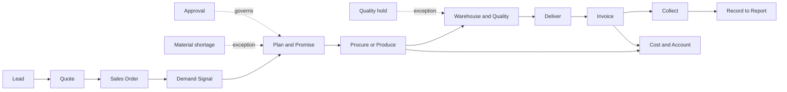
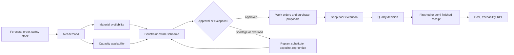
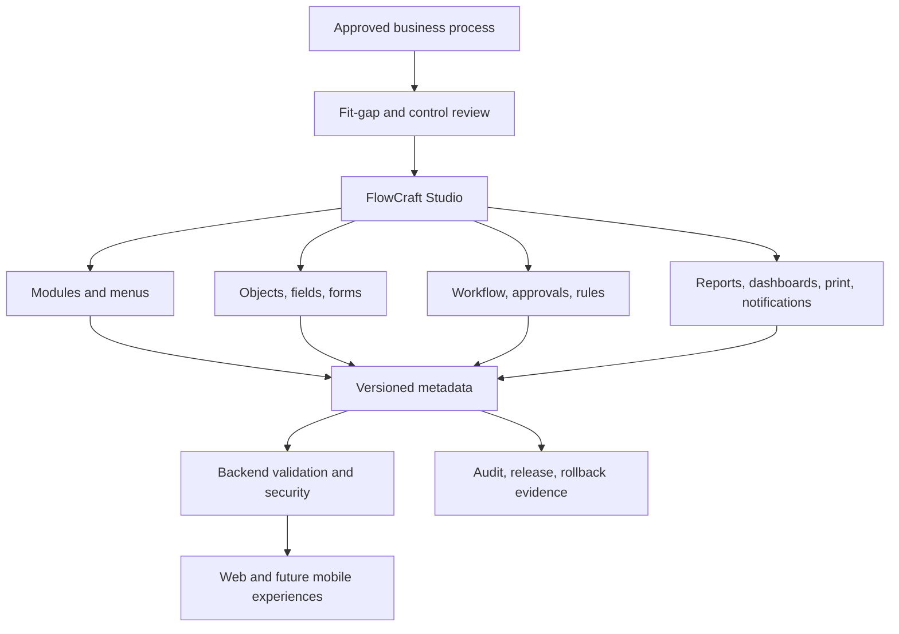
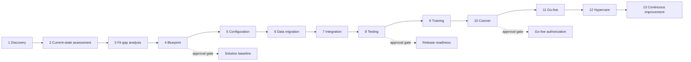
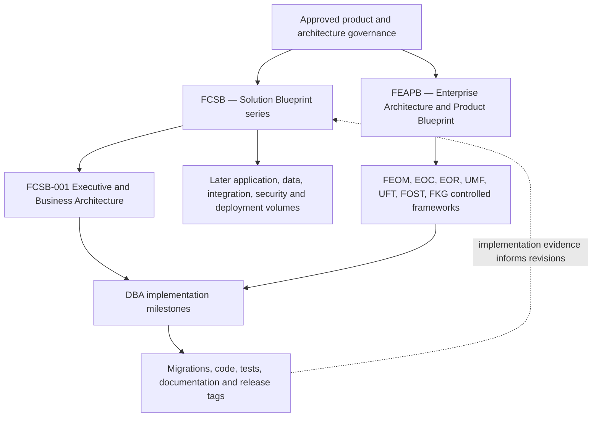

# FlowCraft Solution Blueprint

## Volume 1 — Executive and Business Architecture

| Document attribute | Value |
|---|---|
| Document code | FCSB-001 |
| Official series | FlowCraft Solution Blueprint |
| Version | 1.0 Draft |
| Status | Architecture Review Draft |
| Product | FlowCraft Business OS |
| Customer-facing shorthand | FlowCraft ERP |
| Evidence baseline | `v0.4-dba004-merged` / `6eba9c5` |
| Last updated | 2026-07-15 |
| Approval state | Pending Product Owner and Architecture Board review |
| Next planned volume | FCSB-002 — Application and Platform Architecture |

> **Authority notice:** This document is a review draft. It does not supersede an approved FEAPB, FEOM, EOR, DBA, database, or security decision. The repository contains no standalone controlled FEAPB, UMF, UFT, FOST, or FKG source documents at this baseline. Their descriptions here establish business context for review; canonical definitions must be reconciled with controlled sources before approval.

## How to read capability status

| Status | Meaning in this volume |
|---|---|
| **Implemented foundation** | Repository evidence shows working models or metadata, services/APIs, validation, tests, and where relevant administrative UI. It is a foundation, not necessarily a complete business module. |
| **In development** | Active implementation is evidenced but is not yet an accepted release. No capability is assigned this status without repository evidence. |
| **Planned** | Required target capability with an intended place in the architecture, but no complete domain implementation exists today. |
| **Future** | Longer-range capability dependent on earlier platform or business modules. |
| **Conceptual architecture** | Business design used to align decisions; it is not an implementation claim. |

---

# Chapter 1 — Executive Summary

FlowCraft Business OS is intended to be a configurable, manufacturing-oriented business operating system for organizations that need stronger control than spreadsheets and disconnected applications can provide, but require a more adaptable and budget-conscious path than many large enterprise suites offer. “FlowCraft ERP” may be used in customer communication; FlowCraft Business OS is the official product name because the intended scope combines ERP capabilities with workflow, metadata, governance, integration, analytics, and future governed intelligence.

The primary market is small and medium-sized manufacturers, including growing multi-company and multi-site organizations. The target customer may operate discrete, repetitive, continuous, fabrication, packaging, trading-plus-manufacturing, engineering, maintenance, or service processes. The common need is not merely transaction recording. Customers need a controlled way to represent their organization, masters, approvals, material and production flows, commercial commitments, audit history, and management information without creating a fragile customer-specific fork.

The product vision is to let a customer adopt an enterprise operating model progressively: establish identity and organization; govern master data; configure objects, workflows, numbering, layouts, and reports; migrate reliable data; then activate transactional modules as the business is ready. Its principal differentiators are manufacturing focus, metadata-driven configuration, historical preservation, backend-enforced security, deployment choice, upgrade-safe extension, and an explicit path toward a governed knowledge graph and AI assistance.

The commercial objective is a sustainable product and services business built around a core platform, modular capability adoption, implementation, migration, integration, training, support, and partner delivery. This volume proposes the model but does not set prices.

Current maturity is **platform foundation**. Accepted DBA-002 through DBA-004 releases implement identity/access foundations, enterprise structure, organization scope and inheritance, governed master data, the Enterprise Object Registry, Digital DNA, audit, number series, workflow definitions, basic report/print/custom-field metadata, administrative screens, and import/export job foundations. Full operational finance, procurement, sales, inventory ledger, planning, production execution, quality, maintenance, integration, analytics, knowledge graph, AI, mobile, and offline operation are not implemented.

Long-term ambition is a coherent, traceable operating platform in which every significant business object has a governed identity, every material decision can be authorized and audited, and every extension remains understandable across upgrades.

# Chapter 2 — Product Vision and Mission

## Vision

To make adaptable, enterprise-grade manufacturing operations accessible to organizations that need rigor, visibility, and growth capacity without surrendering their approved operating model or accepting unnecessary cost and complexity.

## Mission

FlowCraft Business OS will provide a modular platform that connects organization, people, master data, commercial activity, material flow, production, quality, maintenance, finance, reporting, and governance through explicit objects, configurable processes, secure APIs, and preserved history.

## Product promise

**FlowCraft must adapt to the customer’s approved business process without forcing the customer to redesign the organization around the ERP.**

This principle does not mean every existing process should be automated unchanged. Discovery and fit-gap work must identify legal, control, safety, data-quality, and product-standard constraints. The customer approves the future-state process; FlowCraft then expresses that process through standard configuration wherever possible and governed extensions only where justified.

## Customer value proposition

- Adopt capabilities incrementally instead of funding an all-at-once transformation.
- Represent multi-company, branch, plant, department, cost-center, and profit-center structures explicitly.
- Replace spreadsheet handoffs with visible, authorized process states.
- Preserve historical truth while allowing effective-dated change.
- Configure masters, fields, workflows, numbering, reports, layouts, and dashboards without losing upgradeability.
- Improve migration readiness and reduce dependence on undocumented custom code.
- Deploy in a model appropriate to customer economics, control, and connectivity.

Manufacturing is the anchor domain. The architecture must support make-to-stock, make-to-order, engineer-to-order, assemble/configure-to-order, hybrid, semi-finished, repetitive, and continuous scenarios over time. DBA-004 implements item strategy metadata and master foundations; it does not yet implement manufacturing planning or execution.

“Budget-friendly” means disciplined scope, modular adoption, efficient implementation, deployment choice, and avoidance of avoidable customization—not reduced control, security, auditability, or data integrity. Enterprise-grade ambition means that those controls are designed early even while business modules are delivered progressively.

# Chapter 3 — Market and Customer Segments

## Industry and operating segments

| Segment | Typical needs | FlowCraft relevance |
|---|---|---|
| Small manufacturers | Replace spreadsheets, basic purchasing/sales/stock, simple production visibility | Progressive platform and module adoption; planned operational modules |
| Medium manufacturers | Formal planning, approvals, costing, quality, maintenance, multiple sites | Primary target; enterprise structure and master foundation implemented |
| Multi-company manufacturers | Shared/global masters, local control, consolidation, intercompany governance | Organization foundation implemented; consolidation/intercompany planned |
| Discrete manufacturing | BOMs, routings, work orders, serial/batch traceability, WIP | Masters and registry scaffolding exist; planning/execution planned |
| Repetitive manufacturing | Rate-based plans, line capacity, recurring schedules | Conceptual target; planned |
| Continuous-process industries | Formula/process control, co-/by-products, yields, campaigns | Conceptual target; planned after core manufacturing |
| Packaging | Material variants, print/layout control, quality, high-volume scheduling | Strong target; operational capabilities planned |
| Food and beverage supply | Shelf life, batches, quality hold, expiry, traceability | Batch/expiry/status masters implemented; transactions and compliance planned |
| Engineering and fabrication | Projects, drawings, revisions, ETO/MTO, subcontracting | Item strategy foundation exists; engineering/projects planned |
| Trading plus manufacturing | Buy/sell/manufacture the same portfolio, flexible replenishment | Item flags and partner masters implemented; operational flow planned |
| Service and maintenance | Assets, requests, work execution, spares, service billing | Registry/transaction scaffolding exists; dedicated modules planned |

## Customer maturity levels

| Level | Characteristics | Recommended adoption pattern |
|---|---|---|
| Basic | Owner-led controls, spreadsheets, informal masters | Core platform, clean masters, basic finance/inventory first |
| Growing | Department roles, more orders, emerging production planning | Organization, approvals, purchasing/sales/inventory, simple production |
| Structured | Documented processes, quality controls, costing expectations | Full governance, planning, execution, quality, maintenance, analytics |
| Multi-site | Plants/branches, shared resources, local variations | Organization scope, common masters, site templates, integration |
| Enterprise | Multi-company governance, formal architecture, complex integration | Dedicated governance, segregation of duties, data platform, FKG/AI roadmap |

Customer qualification must consider process maturity, data quality, executive sponsorship, implementation capacity, connectivity, regulatory obligations, and appetite for standard configuration. Product fit is not determined by employee count alone.

# Chapter 4 — Business Problems FlowCraft Solves

| Business problem | Consequence | Intended FlowCraft response | Current evidence |
|---|---|---|---|
| Expensive enterprise suites | High entry cost and delayed value | Modular licensing and phased implementation | Commercial model proposed; not implemented in software |
| Rigid workflows | Workarounds and off-system approvals | Versioned object-aware workflow and approval architecture | Workflow definition foundation implemented; visual designer planned |
| Manual spreadsheets | Duplicate data and weak control | Governed masters, APIs, imports, reports, audit | Master-data foundation implemented; operations planned |
| Disconnected departments | Re-entry and inconsistent status | Shared objects and end-to-end process chains | Object/transaction scaffolding exists; domain flows planned |
| Weak production visibility | Late delivery and poor prioritization | Planning, execution, WIP, capacity, exception management | Planned |
| Poor material planning | Shortages, excess inventory, stoppage | Demand/supply planning, policies, inventory ledger, MRP | Item planning metadata implemented; engines planned |
| Unreliable costing | Weak margins and decisions | Item/operation/material costing tied to finance | Standard-cost field exists; costing engine planned |
| Difficult customization | Upgrade failures and vendor dependency | Configuration before governed extension | Metadata foundations implemented; full Studio planned |
| Poor migration support | Bad go-live data and lost history | Assessment, mapping, dry runs, reconciliation, sign-off | Import metadata/dry-run foundation implemented |
| Weak reporting | Slow and disputed decisions | Governed report definitions, exports, dashboards, drill-down | Basic report/dashboard foundation; advanced analytics planned |
| Limited auditability | Control and compliance risk | Immutable identity, append-only audit, effective dating | Implemented foundation |
| Weak multi-company support | Manual consolidation and access leakage | Explicit enterprise hierarchy and scope | Structure/scope implemented; intercompany/consolidation planned |
| Manufacturing inflexibility | ERP does not reflect real supply/production modes | Configurable strategies and modular planning/execution | Strategy masters implemented; operational modules planned |

FlowCraft cannot solve governance problems through software alone. Data owners, process owners, approval authorities, training, operating procedures, and change management remain customer responsibilities supported by the implementation method.

# Chapter 5 — Product Principles

1. **Configuration before customization.** Use approved metadata and module behavior before custom code.
2. **Metadata before hardcoding.** Object, field, workflow, layout, report, and policy definitions should be explicit and governable.
3. **Preserve historical truth.** Effective-dated and versioned records must keep prior meaning available.
4. **No destructive master-data changes.** Referenced masters are archived, not physically deleted; merges preserve lineage.
5. **Tenant isolation.** Tenant boundaries are mandatory and enforced in backend access paths.
6. **Audit by default.** Material configuration, access, master, workflow, and business changes should produce traceable events.
7. **Workflow-aware operations.** Authorization and state transitions are first-class business concerns.
8. **Upgrade-safe extension.** Customer adaptation must avoid ungoverned forks and retain a path to product upgrades.
9. **API-first architecture.** Business behavior is exposed through governed services; user interfaces are consumers, not security boundaries.
10. **Security enforced in the backend.** Hiding a control in the UI is not authorization.
11. **Mobile and web readiness.** Business services should support multiple experience channels; only the web experience exists today.
12. **Local and cloud parity.** Core business meaning should not change by deployment model; operational architecture may differ.
13. **Business-process transparency.** Users and owners should understand states, responsibilities, exceptions, and approvals.
14. **Data-migration readiness.** Importability, duplicate detection, reconciliation, and lineage are designed into masters and objects.
15. **AI with governed access.** Future AI uses authorized, explainable, purpose-limited context and never bypasses business controls.
16. **Composable but coherent.** Modules may be adopted progressively while sharing identity, organization, master, audit, and object semantics.
17. **Explicit ownership.** Every critical process, master, configuration, and decision has a business owner and steward.
18. **Evidence over aspiration.** Product documentation must distinguish implemented foundations from planned capabilities.

# Chapter 6 — FlowCraft Business Operating Model

FlowCraft represents the enterprise as both typed business records and a generalized hierarchy. The implemented foundation supports effective dates, hierarchy history, inherited settings, validated movement, organization access, and scopes such as VIEW, OPERATE, APPROVE, MANAGE, and ADMINISTER.

| Structure | Business purpose | Foundation status |
|---|---|---|
| Enterprise Group | Parent identity for related legal and operating entities | Implemented foundation |
| Legal Entity | Registered/tax-bearing organization | Implemented foundation |
| Company | Primary accounting and operating scope | Implemented foundation; full accounting planned |
| Branch | Local operating/administrative site | Implemented foundation |
| Plant | Manufacturing site and planning context | Implemented foundation |
| Business Unit | Strategic or operational line of business | Implemented foundation |
| Division | Major management segment | Implemented foundation |
| Department | Functional responsibility and access scope | Implemented foundation |
| Section and Team | Lower-level work organization | Implemented foundation |
| Location | Physical/logical place hierarchy | Implemented foundation |
| Cost Center | Cost responsibility | Master implemented; posting allocation planned |
| Profit Center | Profit responsibility | Master implemented; profitability calculation planned |

The hierarchy is not a substitute for legal, accounting, warehouse, or production structures. It supplies shared navigation, inheritance, scope, and responsibility; each business module must still apply its domain rules.

# Chapter 7 — Module Landscape

## Official module map

### Platform modules

| Module | Status | Evidence boundary |
|---|---|---|
| Identity and Access | Implemented foundation | JWT, users, roles, permissions, tenant/company/branch and organization scope |
| Enterprise Structure | Implemented foundation | Typed hierarchy, generalized nodes, history, inheritance, access, UI |
| Master Data | Implemented foundation | Geography, UOM, Item, Warehouse, Business Partner, terms, tax/governance masters |
| Workflow | Implemented foundation | Versioned definitions, steps/transitions, publication; no full visual designer/runtime orchestration |
| Approval | Implemented foundation | Models and generic request/history scaffolding; domain approval execution remains planned |
| Audit | Implemented foundation | Append-only service, redaction, trace IDs; broader operational coverage follows modules |
| Object Registry | Implemented foundation | FEOM/EOR object, field, relationship, capability, and permission registration |
| Number Series | Implemented foundation | Serializable generation and configuration |
| Reporting | Implemented foundation | Definitions, fields, filters, preview, financial/dashboard scaffolding; advanced engine planned |
| Print Layouts | Implemented foundation | Template/canvas/section metadata; full builder/render service planned |
| Customization | Implemented foundation | Module settings and custom fields; broader Studio planned |
| Import/Export | Implemented foundation | Jobs, mappings, row validation, dry run, metadata-ready export; binary file engine planned |
| Integration | Planned | No integration hub/event architecture implemented |
| Notifications | Planned | No notification service implemented |
| Knowledge Graph | Future | FKG is conceptual; no graph persistence/runtime implemented |
| AI Services | Future | Registry flags are not an AI implementation |

### Business modules

| Module | Status | Current boundary |
|---|---|---|
| Finance | Implemented foundation | Chart/journal structures and basic calculations exist; governed posting, periods, tax, AP/AR and consolidation are planned |
| Purchasing | Planned | Registry and generic transaction kinds exist; no dedicated procure-to-pay service |
| Sales | Planned | Customer/partner masters and generic transaction kinds exist; no quote/order/delivery/invoice service |
| Inventory | Planned | Item/status/batch/serial masters exist; no stock ledger or balance engine |
| Warehouse | Implemented foundation | Warehouse/zone/bin/status masters; no movements, allocation, picking, or put-away |
| Manufacturing | Planned | Item strategies and object/transaction scaffolding; no BOM/routing/planning/execution engine |
| Production Planning | Planned | Policies and plant structure exist; no demand/capacity/MRP scheduler |
| Production Execution | Planned | Generic work-order kinds only; no shop-floor runtime |
| Quality | Planned | Quality statuses/registry scaffolding; no inspection/release process |
| Maintenance | Planned | Registry/transaction scaffolding; no asset maintenance execution |
| Engineering | Planned | No controlled product/revision/change module |
| Fixed Assets | Planned | Registry code only; no lifecycle/accounting module |
| CRM | Planned | Business Partner/Customer foundation; no lead/opportunity/campaign module |
| HR and Payroll Integration | Future | No HR/payroll domain implementation |
| Projects | Future | No project accounting/execution module |
| Service Management | Future | No dedicated case/service-order/warranty execution module |

# Chapter 8 — End-to-End Business Process Architecture

The following chains define target business architecture. Except for platform/master foundations and generic transaction records, they are **conceptual/planned**, not evidence of completed operational modules.

| Process | Target chain | Status |
|---|---|---|
| Lead to Cash | Lead → opportunity → quote → order → fulfillment → invoice → receipt | Planned |
| Quote to Cash | Inquiry/quote → credit/approval → order → delivery → invoice → receipt | Planned |
| Order to Production | Sales demand → promise → production demand → plan → execute → receipt → delivery | Planned |
| Plan to Produce | Demand → material/capacity plan → schedule → work order → issue → execute → receive | Planned |
| Procure to Pay | Request → RFQ → quotation → order → receipt → invoice → payment | Planned |
| Inventory to Consumption | Receive → inspect/status → store → reserve → issue → consume → reconcile | Planned |
| Make to Stock | Forecast/reorder → plan → produce → stock → fulfill | Planned |
| Make to Order | Customer order → pegged supply → produce/procure → deliver | Planned |
| Forecast to Production | Forecast → consensus demand → supply plan → schedule → execute | Planned |
| Demand to Supply | Demand netting → availability → procurement/production/transfer proposals | Planned |
| Record to Report | Subledger events → controlled posting → ledger → close → statements | Finance foundation only |
| Asset to Retirement | Acquire → capitalize → depreciate → maintain → impair/transfer → retire | Planned |
| Maintenance Request to Closure | Request → assess → approve → plan → execute → verify → close | Planned |
| Quality Inspection to Release | Trigger → sample/test → decision → release/hold/reject → corrective action | Planned |
| Product Design to Production | Requirement → design/revision → approval → BOM/routing → readiness → release | Planned |
| Data Migration to Go-Live | Assess → map → cleanse → trial → reconcile → cutover → sign-off | Import foundation implemented; lifecycle procedural |

Every target process should publish ownership, entry criteria, states, approvals, exceptions, outputs, controls, KPIs, and records before configuration begins.

# Chapter 9 — Manufacturing Business Architecture

FlowCraft’s manufacturing architecture must serve several operating modes without reducing all factories to one planning assumption.

## Supported target modes

- **Discrete:** countable units, BOM/routing, work orders, serial/batch control.
- **Repetitive:** rate-based production, lines, recurring schedules, takt and capacity.
- **Continuous/process:** formulas, campaigns, yield, co-products, by-products, quality and process parameters.
- **Semi-finished:** multi-level supply with explicit intermediate identity, WIP, transfer, and costing.
- **MTS/MTO/ETO/ATO/CTO/HYBRID:** item and order policies determine planning, pegging, configuration, engineering, and fulfillment behavior.

The DBA-004 Item master already recognizes MTS, MTO, ATO, ETO, CTO, and HYBRID strategies plus replenishment, tracking, valuation, UOM, quality, batch, serial, shelf-life, lead-time, reorder, warehouse, and supplier attributes. These are policy foundations; they do not calculate a plan or post a movement.

## Target planning and execution behaviors

- Long-term bulk orders are represented as commercial commitments with delivery schedules, not as one undifferentiated due date.
- Partial deliveries preserve ordered, scheduled, produced, shipped, accepted, invoiced, and remaining quantities.
- Continuous planning reevaluates demand, supply, capacity, material status, and execution progress without rewriting historical commitments.
- Urgent reprioritization produces an impact preview covering displaced orders, material, setups, capacity, delivery promises, cost, and approval authority.
- Material shortages support alternatives such as substitution, transfer, split production, alternate routing, expedited purchase, revised promise, or controlled exception.
- Capacity planning distinguishes plant, line, work center, machine, labor/skill, tooling, calendar, setup, maintenance, and quality constraints.
- Shop-floor execution records start/stop, output, consumption, WIP, scrap, rework, downtime, labor/machine time, batch/serial genealogy, and completion evidence.
- Quality hold blocks inappropriate availability while retaining identity and traceability.
- Costing must eventually distinguish material, labor, machine, overhead, subcontracting, scrap, rework, by-product credits, and variance.

## Current implementation boundary

**Implemented foundation:** enterprise/plant structures; item, UOM, warehouse/zone/bin, stock-status, batch/serial and partner masters; strategy metadata; Digital DNA; EOR registration; generic transaction links; workflow/audit foundations.

**Planned:** BOM/formula, revision, routing, work center, calendar, demand planning, MRP, capacity planning, detailed scheduling, work-order execution, inventory ledger, reservations, material issue/return, WIP, genealogy, quality execution, costing, and operational dashboards.

**Future:** advanced optimization, machine/IoT integration, digital work instructions, predictive maintenance, graph-based impact analysis, and governed AI recommendations.

# Chapter 10 — Configurability and Customer Adaptation

FlowCraft Studio is the intended governed workspace through which authorized designers adapt the product. Today, separate settings and studio screens expose object registry, workflow, number-series, master, report/layout, module-setting, and custom-field foundations. A unified drag-and-drop Studio is planned.

| Adaptation area | Target behavior | Status |
|---|---|---|
| Module enablement | Enable capability by tenant/company and policy | Foundation implemented |
| Module removal | Disable visibility/use without destroying historical records | Planned; module setting is foundation |
| Field configuration | Add governed typed fields and validation | Foundation implemented |
| Form design | Arrange sections, fields, behavior, and context | Planned |
| Workflow design | Visual states, steps, transitions, roles, conditions | Definition foundation implemented; designer/runtime planned |
| Approval matrix | Amount/risk/object/organization authority | Schema foundation; comprehensive runtime planned |
| Number series | Scoped, safe, non-reused document numbering | Implemented foundation |
| Report builder | Select fields, filters, grouping, formulas, preview/export | Basic foundation; production engine planned |
| Print layout builder | Canvas, sections, binding, versions | Metadata foundation; full designer/rendering planned |
| Dashboard builder | Cards, KPIs, layout, drill-down | Planned; fixed dashboard exists |
| Menu builder | Permission-aware navigation composition | Planned |
| Notification builder | Event, audience, channel, template, escalation | Planned |
| Business rule builder | Governed conditions/actions with testability | Planned |
| Process mapping | Model current/future processes and bind to workflow/objects | Conceptual/planned |
| Client configuration | Package, version, promote, audit, compare, roll back | Planned |

Upgrade-safe customization requires configuration packages, stable extension points, compatibility checks, automated tests, versioned metadata, and prohibition of undocumented database changes. A customer-specific fork is an exception requiring architecture approval, ownership, support terms, and an explicit reintegration strategy.

# Chapter 11 — Universal Master and Object Architecture

The following framework terms describe the intended business semantics. The repository directly evidences FEOM/EOR-style object metadata, object codes, master-data services, Digital DNA, fields, relationships, capabilities, and permissions. Standalone controlled UMF, UFT, FOST, and FKG definitions are absent and require confirmation before this chapter is approved.

| Framework | Business-level purpose | Current evidence/status |
|---|---|---|
| **UMF — Universal Master Framework** | Common lifecycle, identity, ownership, effective dating, archive, governance, import/export, duplicate, and audit behavior for master records | Conceptual framework; substantial DBA-004 implementation foundation |
| **UFT — Universal Field Types** | Consistent business field meanings, validation, formatting, lookup, units, privacy, and UI behavior | Conceptual; custom/object field types provide an early foundation |
| **EOR — Enterprise Object Registry** | Governed catalog of business objects, ownership, capabilities, API paths, permissions, and relationships | Implemented foundation |
| **FEOM — FlowCraft Enterprise Object Model** | Common semantic model linking masters, transactions, fields, relationships, workflow, audit, reporting, and extension behavior | Implemented metadata foundation; controlled FEOM source reconciliation required |
| **EOC — Enterprise Object Code** | Stable human/governance identifier for an EOR object, distinct from a record ID | Implemented through `objectCode`; terminology requires controlled confirmation |
| **FOST — FlowCraft Object State and Transition model** | Shared language for object states, transitions, authority, effective rules, and history | Conceptual working definition; workflow/status foundations exist |
| **Digital DNA** | Immutable record identity used for traceability across migration, integration, audit, and future graph context | Implemented foundation on governed domains |
| **FKG — FlowCraft Knowledge Graph** | Governed semantic connections among objects, records, processes, decisions, people, documents, and evidence | Future; no graph runtime implemented |

At business level, these mechanisms prevent each module from inventing incompatible identity, field, status, permission, and history behavior. They are not a reason to force every object into one physical table or one workflow. Domain rules remain authoritative within each business module.

# Chapter 12 — Data Migration Business Strategy

Migration is a business transformation workstream, not a final technical upload. The target lifecycle is:

1. **ERP replacement scope:** define systems, entities, history horizon, attachments, balances, open transactions, ownership, and legal retention.
2. **Legacy assessment:** profile volume, quality, duplicates, missing relationships, invalid codes, and undocumented logic.
3. **Data mapping:** map source fields and values to EOR/UMF targets, UOMs, currencies, organizations, statuses, and Digital DNA rules.
4. **Master cleansing:** standardize names/codes, resolve duplicates, complete mandatory attributes, and assign stewards.
5. **Trial migration:** run repeatable extracts, transformations, validations, duplicate checks, and dry runs in a controlled environment.
6. **Opening balances:** reconcile inventory, receivables, payables, cash, fixed assets, WIP, and ledger opening positions when modules exist.
7. **Historical transactions:** decide summary versus detail, preserve reference codes, source identifiers, dates, status, and legal evidence.
8. **Attachments:** classify, scan, secure, hash, link, retain, and confirm accessibility; attachment infrastructure is planned.
9. **Validation and reconciliation:** compare record counts, control totals, sample genealogy, aged balances, and exception logs.
10. **Cutover:** freeze agreed source activity, execute final delta, reconcile, obtain approvals, and activate users/integrations.
11. **Rollback:** define time-bound decision criteria, restore points, source-system contingency, communication, and data captured after cutover.
12. **Customer sign-off:** business owners approve masters, balances, open items, history, controls, and residual exceptions.

DBA-004 provides import job/mapping/row, validation-only, dry-run, duplicate, error, summary, rollback-marker, and audit foundations. It does not provide a full Excel binary engine, attachment migration, finance opening-balance posting, or automated destructive merge. Those boundaries must be visible in every migration plan.

# Chapter 13 — Reporting and Decision Architecture

Reporting must turn governed business records into explainable decisions without creating a second, uncontrolled version of truth.

| Information product | Business purpose | Status |
|---|---|---|
| Operational reports | Daily queues, shortages, orders, receipts, WIP, quality, maintenance | Report-definition foundation; domain content planned |
| Management reports | Department, plant, customer, supplier, margin, service and execution performance | Dashboard/report foundation; governed KPIs planned |
| Financial reports | Trial balance, P&L, balance sheet, ledger, aging, cash, cost/profit centers | Basic model/calculation scaffolding; governed posting/reporting planned |
| Manufacturing reports | Plan attainment, OEE inputs, yield, scrap, WIP, shortages, variance | Planned |
| Quality reports | Inspection, release, rejection, defect, CAPA, genealogy | Planned |
| Maintenance reports | Backlog, downtime, MTBF/MTTR, schedule compliance, spares | Planned |
| Dashboards and KPIs | Role-based signals with targets, trends, exceptions, drill-down | Fixed dashboards exist; builder and governed KPI catalog planned |
| User-designed reports | Authorized selection, filtering, grouping, formulas and layouts | Basic definition/preview foundation |

The decision architecture should separate operational queries, governed reports, analytical models, and AI-generated narratives. Every KPI needs a name, owner, formula, grain, dimensional scope, data source, refresh rule, threshold, access policy, and reconciliation method. Drill-down must retain filter context from executive summary to source record and audit evidence.

Excel and PDF are target export formats; current report preview advertises them but a complete production-grade rendering/export engine is not evidenced. Scheduled distribution, subscriptions, bursting, Power BI integration, and semantic analytics are planned. Power BI should consume governed APIs or analytical models, not uncontrolled direct production-table access.

AI-generated insights are future. They must cite governed measures, expose assumptions, respect tenant/organization permissions, distinguish observation from recommendation, and never post or approve a transaction autonomously without an approved control design.

# Chapter 14 — Security and Governance at Business Level

Security expresses business accountability across data, process, organization, and time.

- **Tenant isolation:** a customer’s records, configuration, users, and audit context remain separated.
- **Company and branch scope:** users operate only in assigned legal/operating contexts.
- **Plant and department scope:** organization access can include a node and explicitly authorized descendants.
- **Role-based access:** roles grant object-action permissions such as view, create, edit, archive, approve, import, export, or configure.
- **Organization-based access:** authority depends on where the object belongs, not only on a generic role.
- **Approval authority:** business amount, risk, object type, company, plant, and responsibility determine who may authorize.
- **Segregation of duties:** incompatible request, approval, receipt, posting, payment, master, and administration duties must be identified and monitored.
- **Audit:** significant access, configuration, master, workflow, numbering, hierarchy, and future transaction events retain actor, time, scope, reason, before/after evidence, and trace context.
- **Historical records:** archives and effective dating preserve prior meaning; authorization to correct is not authorization to erase.
- **Data ownership:** process owners approve behavior; data owners define use and quality; stewards manage daily standards; system owners operate the platform.
- **Master-data governance:** creation, change, deactivation, duplicate review, merge metadata, import, and override follow controlled paths.

The repository implements JWT authentication, active/deleted-user enforcement, roles/permissions, tenant/company/branch scope, organization scope, Super Admin handling, append-only audit foundations, and master-data governance. A formal segregation-of-duties rules engine, privacy classification, identity federation, security operations, threat model, penetration evidence, and regulatory control catalog belong to the future Security and Trust Blueprint.

# Chapter 15 — Implementation Lifecycle

| Phase | Recommended deliverables | Approval gate |
|---|---|---|
| Discovery | Objectives, scope, stakeholders, value case, constraints, risks | Sponsor confirms mandate |
| Current-state assessment | Process, system, data, controls, pain points, volumes | Process/data owners confirm accuracy |
| Fit-gap analysis | Standard fit, configuration, extension, integration, organizational change | Architecture and Product Owners approve disposition |
| Blueprint | Future process, organization, objects, controls, reports, migration, cutover | Solution baseline approved |
| Configuration | Versioned configuration packages, unit evidence, decision log | Configuration owner approval |
| Data migration | Mapping, cleansing, trial loads, reconciliation, exceptions | Data owners sign off trial results |
| Integration | Interface contracts, security, error handling, monitoring, replay | Integration and security review |
| Testing | Unit, integration, process, security, performance, migration, UAT | Release readiness approval |
| Training | Role curriculum, procedures, exercises, support materials | Business readiness confirmation |
| Cutover | Runbook, freeze, final migration, reconciliation, rollback, communication | Go-live authorization |
| Go-live | Controlled activation and command center | Sponsor accepts service start |
| Hypercare | Triage, adoption, defects, reconciliations, stabilization metrics | Service acceptance |
| Continuous improvement | Backlog, releases, KPI review, configuration governance | Recurring change governance |

No phase is eliminated by an agile delivery method; evidence may be produced incrementally. Approval must be proportional to financial, operational, safety, privacy, and customer risk.

# Chapter 16 — Product Deployment Models

| Model | Business characteristics | Architectural status |
|---|---|---|
| Cloud SaaS | Vendor-operated service, subscription, shared operations, strong tenant isolation | Target model; production operations architecture planned |
| Private cloud | Dedicated environment managed by vendor/partner | Target model; planned |
| Customer cloud | Customer account/subscription with agreed shared responsibility | Target model; planned |
| On-premise | Customer-operated infrastructure and local control | Docker development packaging is foundation; production design planned |
| Hybrid | Selected local services/devices with cloud application or analytics | Future integration/operations design |
| Multi-tenant | Shared service with strict logical isolation and governance | Tenant model implemented; production assurance planned |
| Dedicated tenant | Isolated runtime/database for policy, scale, or contract reasons | Planned deployment option |
| Multi-company | One tenant operating several companies/plants with governed scope | Data/organization foundation implemented |
| Branch deployment | Central governance with branch/site access and operational context | Branch model implemented; distributed runtime planned |

Local and cloud parity means the same business object semantics, controls, workflow meanings, and historical rules should apply. It does not mean identical topology, scaling, monitoring, backup, or service responsibility.

Offline and low-connectivity scenarios require explicit conflict policy, local identity, encrypted storage, sequence strategy, synchronization, authorization freshness, operational limits, and audit reconciliation. No offline client or synchronization engine exists today; this remains planned/future and should not be promised in an implementation contract without an approved architecture.

Detailed topology, service levels, availability, backup/recovery, observability, capacity, patching, and disaster recovery belong in FCSB-006.

# Chapter 17 — Commercialization and Licensing Model

This chapter proposes packaging principles; it does not establish prices or contractual terms.

## Commercial components

- **Core platform:** identity/access, enterprise structure, object registry, audit, configuration governance, basic workflow/approval, number series, shared masters, and administration.
- **Module licensing:** Finance, Purchasing, Sales, Inventory/Warehouse, Manufacturing, Planning, Quality, Maintenance, Fixed Assets, CRM, Projects, Service, Analytics, Integration, and future AI as appropriate.
- **User tiers:** occasional/read/approval, standard operational, professional/planner, designer/administrator, and external/portal users.
- **Company/plant tiers:** packaging may reflect operating complexity while avoiding penalties for sensible legal/site modeling.
- **Cloud subscription:** recurring service covering licensed capability, hosting tier, operations, backups, and standard support.
- **On-premise licensing:** term or perpetual-use rights with annual maintenance, version/support policy, and customer operating obligations.
- **Implementation services:** discovery, blueprint, configuration, testing, cutover, and hypercare.
- **Customization services:** governed extensions priced separately with ownership, upgrade, support, and productization terms.
- **Support:** service tiers based on hours, response objectives, environments, criticality, and named contacts.
- **Training:** role-based enablement, administrator/designer certification, and train-the-trainer.
- **Migration and integration:** scoped by systems, objects, history, volume, quality, interfaces, and reconciliation.
- **Partner/reseller model:** certified delivery, territory/industry focus, quality controls, escalation, intellectual-property and customer-success obligations.

Pricing should be transparent, modular, and aligned to realized value and support cost. Commercial design must not encourage customers to hide legal entities, share named users, bypass controls, or create unsupported forks. Product telemetry used for licensing must be disclosed, purpose-limited, secure, and contractually governed.

# Chapter 18 — Product Governance

| Governance body/role | Accountability |
|---|---|
| Product Owner | Product vision, value, roadmap priority, acceptance and commercial coherence |
| Architecture Board | Cross-domain principles, blueprints, decisions, exceptions, technical debt and target-state integrity |
| Change Control | Scope, impact, funding, priority, release assignment and customer/configuration changes |
| Release Governance | Entry/exit criteria, regression, migration, security, documentation, rollback and communication |
| Blueprint Governance | Document identity, evidence, review, approval, versioning, supersession and traceability |
| Database Governance | Schema ownership, additive migration, historical preservation, backup, rollout and rollback strategy |
| Security Review | Threats, access, segregation, data protection, dependencies, operational controls and assurance |
| Module Approval | Business ownership, end-to-end fit, accounting/control consequences, tests and readiness |
| Documentation Approval | Accuracy, terminology, implementation status, operating procedures and user communication |
| Client Configuration Governance | Package ownership, segregation, test/promotion, version compatibility and exception management |

Every product change should connect requirement → architecture decision → EOR/object impact → data/migration impact → security/control impact → tests → documentation → release evidence. Emergency changes require retrospective review. Client configurations must be versioned independently from product releases while declaring compatibility.

Architecture exceptions require owner, rationale, scope, risk, mitigation, expiry/review date, and a decision on whether the change becomes a product feature, remains a supported extension, or is retired.

# Chapter 19 — Relationship with Existing FlowCraft Documents

| Document/framework | Relationship to FCSB-001 |
|---|---|
| FEAPB | Existing approved enterprise/product blueprint series. FCSB should align with it and identify conflicts; repository source is absent at this baseline. |
| DBA series | Accepted implementation milestones. They prove what foundations were delivered and constrain implementation-status claims. |
| FEOM | Object semantics connecting metadata, fields, relationships, workflow, audit, reporting and extensions. |
| EOC | Stable object code used to identify and govern an enterprise object; canonical terminology requires controlled confirmation. |
| EOR | Runtime/governance registry of enterprise objects and capabilities. |
| UMF | Proposed universal behavior for governed master records. |
| UFT | Proposed common field-type semantics and validation. |
| FOST | Proposed shared state/transition semantics for objects and processes. |
| FKG | Future governed knowledge graph connecting enterprise context and evidence. |
| FCSB | Official solution-architecture series linking executive intent to business, application, data, integration, security, deployment and operations architecture. |

FCSB does not replace implementation reports. It explains why capabilities exist, how they relate, which decisions govern them, and what remains to be delivered. Implementation reports document what a milestone changed and how it was validated.

# Chapter 20 — Current Product Status

## Milestone evidence

| Milestone | Evidence-based status | Principal outcome |
|---|---|---|
| DBA-001 — Foundation | Approved project context; implementation detail not separately documented in repository | Initial application/manufacturing UI and legacy models on which later DBAs build |
| DBA-002 — Platform Foundation | Accepted and tagged through subsequent merge history | Tenant, organization basics, currency/rates, roles/permissions, EOR/FEOM metadata, workflow definitions, numbering, audit, API/UI foundations |
| DBA-003 — Enterprise Structure | Accepted, migrated, tested and tagged `v0.3-dba003-merged` | Effective-dated enterprise hierarchy, history, inheritance, scope/access, APIs and UI |
| DBA-004 — Enterprise Master Data | Accepted, migrated, seeded twice, 76 tests at delivery, built and tagged `v0.4-dba004-merged` | Geography, UOM, Item, Warehouse, traceability, Business Partner, terms/tax, governance, import/export metadata, APIs and UI |

## Implemented platform today

- Next.js web and NestJS API in one npm workspace with PostgreSQL/Prisma and Docker development configuration.
- JWT authentication, active-user enforcement, roles, object permissions, tenant/company/branch and organization scope.
- Enterprise Group through Team/Location/Cost/Profit Center hierarchy with history and inheritance.
- Effective-dated governed master-data foundation with search, archive, duplicate, change-request, import/export metadata and audit.
- EOR objects, fields and relationships; Digital DNA; number series; workflow definition/version/publication; audit redaction and trace IDs.
- API-backed settings, enterprise tree, master dashboard, object registry, workflow and numbering screens.
- Basic report/print/custom-field/module-setting metadata and generic transaction/accounting scaffolding retained from the foundation.

## Current limitations

- The product is not yet a complete finance, purchasing, sales, inventory, manufacturing, quality, maintenance, fixed-asset, CRM, project, or service system.
- No authoritative stock ledger, reservations, valuation posting, MRP, capacity scheduler, BOM/routing engine, shop-floor execution, AP/AR, tax posting, bank, close, consolidation, or full subledgers exist.
- Workflow and approval foundations are not a complete visual process engine.
- Report/print/customization builders are partial foundations; some legacy services retain flexible untyped payloads.
- Import/export lacks full Excel binary/file-storage execution; attachment infrastructure is absent.
- Integration, notification, knowledge graph, AI, mobile and offline runtimes are absent.
- Standalone controlled FEAPB/UMF/UFT/FOST/FKG files are not available in the repository for reconciliation.

## Next planned architecture and module

The next architecture deliverable should be **FCSB-002 — Application and Platform Architecture**, establishing module boundaries, metadata execution, transactions, events, integration seams, configuration packages, runtime states, and non-functional controls. The recommended next implementation module is **Finance Foundation**, coordinated with an **Inventory Ledger** design so valuation, purchasing, sales and manufacturing events have an authoritative posting target.

# Chapter 21 — Roadmap

The roadmap is sequence-based, not date-based. Entry depends on approved architecture, capacity, customer validation, migration strategy, and quality gates.

| Sequence | Roadmap theme | Outcome |
|---:|---|---|
| 1 | Architecture Review | Approve FCSB-001; reconcile FEAPB/framework terms; create FCSB-002/003/security boundaries |
| 2 | Finance Foundation | Fiscal calendars/periods, governed COA, posting engine, journals, dimensions, tax/accounting policies, statements |
| 3 | Inventory Ledger | Immutable stock events, balances, status, location, batch/serial, reservations, transfers, valuation interface |
| 4 | Procurement | Request through order, receipt, invoice matching, returns, supplier controls and approvals |
| 5 | Sales | Inquiry/quote/order, schedules, credit, allocation, delivery, invoicing and returns |
| 6 | Manufacturing Planning | BOM/formula, routing, work centers, demand/supply, MRP, capacity, scheduling, shortage management |
| 7 | Production Execution | Work orders, issues/returns, WIP, output, scrap/rework, genealogy, labor/machine evidence |
| 8 | Quality | Plans/specifications, inspection, sampling, hold/release/reject, nonconformance and CAPA |
| 9 | Maintenance | Assets/equipment, preventive/corrective planning, work execution, spares, downtime and history |
| 10 | Fixed Assets | Capitalization, books, depreciation, transfer, impairment and retirement integrated with Finance |
| 11 | Integration | API/event/file hub, identity federation, monitoring, replay, partner connectors and shop-floor interfaces |
| 12 | Analytics | Governed semantic measures, warehouse/lake integration, Power BI, scheduled reports and performance models |
| 13 | Mobile | Role-focused responsive/PWA/native experiences with secure device and synchronization policy |
| 14 | Knowledge Graph and AI | FKG, governed retrieval, explainable insights, copilots and controlled recommendations |

Quality, security, documentation, migration, observability, performance, and upgrade automation are continuous workstreams across every sequence.

# Chapter 22 — Risks and Mitigations

| Risk | Business effect | Primary mitigation |
|---|---|---|
| Scope expansion | Delays, weak quality, incomplete modules | Outcome-based releases, architecture gates, explicit out-of-scope register |
| Over-customization | Expensive upgrades and customer forks | Configuration-first policy, extension review, productization decision |
| Inconsistent masters | Broken planning/reporting/integration | Owners/stewards, UMF rules, duplicate checks, effective dating, quality KPIs |
| Weak migration | Go-live disruption and disputed history | Profiling, trial migrations, reconciliation, rollback, sign-off |
| Poor test coverage | Regression and control failure | Test pyramid, process/UAT, migration/security/performance suites, release gates |
| Security gaps | Unauthorized access or data exposure | Backend enforcement, threat model, SoD, review, testing, monitoring |
| Data-volume growth | Slow operations and rising cost | Capacity models, indexes/partition/retention strategy, performance budgets |
| Performance degradation | User workarounds and failed planning | Representative load tests, observability, query governance, async design |
| Upgrade complexity | Frozen customers and fragmented product | Stable APIs/metadata, compatibility tests, configuration packages, deprecation policy |
| Customer-specific forks | Unsupportable code lines | Governed extension model and reintegration plan |
| Documentation drift | Incorrect implementation and sales commitments | Evidence-linked docs, owners, release checks, version/approval history |
| AI misuse | Wrong or unauthorized recommendations/actions | Governed context, permission filtering, citations, human authority, evaluation |
| Insufficient audit | Weak investigations and compliance | Audit-by-default policy, immutable retention, coverage tests and review |
| Weak change control | Unplanned impact and unstable releases | Decision register, impact analysis, release/change boards, rollback evidence |

# Chapter 23 — Executive Decision Register

| Decision ID | Decision | Rationale | Status | Owner | Related document | Implementation milestone |
|---|---|---|---|---|---|---|
| FCSB-DEC-001 | FlowCraft Business OS is manufacturing-oriented and modular, with FlowCraft ERP as customer shorthand | Maintains strategic focus while supporting platform scope | Approved product context | Product Owner | FCSB-001 Ch. 1–3 | DBA-001 onward |
| FCSB-DEC-002 | FlowCraft adapts to the customer’s approved future-state process | Avoids forcing organization around software while preserving control review | Approved principle | Product Owner | FCSB-001 Ch. 2 | Platform roadmap |
| FCSB-DEC-003 | Configuration precedes custom code | Protects upgradeability and product coherence | Approved principle | Architecture Board | FCSB-001 Ch. 5/10 | DBA-002 foundation |
| FCSB-DEC-004 | Metadata and the EOR govern enterprise objects | Creates common identity, capability and permission semantics | Implemented decision | Architecture Board | FEOM/EOR; FCSB-001 Ch. 11 | DBA-002/004 |
| FCSB-DEC-005 | Digital DNA is immutable | Preserves identity across history, migration, integration and future graph use | Implemented decision | Data Architecture Owner | FCSB-001 Ch. 11 | DBA-002/003/004 |
| FCSB-DEC-006 | Historical master and relationship truth is preserved | Prevents current-state changes from rewriting old business meaning | Implemented decision | Database Governance | FCSB-001 Ch. 5 | DBA-002/003/004 |
| FCSB-DEC-007 | Existing business models are extended rather than duplicated | Avoids parallel truth and unsafe migration | Implemented decision | Database Governance | DBA implementation reports | DBA-002/003/004 |
| FCSB-DEC-008 | Tenant and organization security are enforced in backend services | UI controls alone cannot protect data | Implemented decision | Security Owner | FCSB-001 Ch. 14 | DBA-002/003/004 |
| FCSB-DEC-009 | The first 50 FEOM-002 object codes remain stable | Protects approved object identity and compatibility | Implemented decision | EOR Steward | DBA-004 report | DBA-002/004 |
| FCSB-DEC-010 | Database changes use additive migrations; accepted history is not rewritten | Protects recoverability, audit, and deployed environments | Implemented decision | Database Governance | DBA reports | DBA-002/003/004 |
| FCSB-DEC-011 | Operational stock balances are excluded from the master-data milestone | Separates identity/governance from authoritative inventory events | Implemented scope decision | Product Owner | DBA-004 report | DBA-004 |
| FCSB-DEC-012 | AI capability flags do not constitute an AI implementation | Prevents unsupported product claims and preserves governance | Approved documentation decision | Architecture Board | FCSB-001 Ch. 7/13 | Future |
| FCSB-DEC-013 | FCSB becomes the official solution-architecture series | Establishes a governed bridge from executive intent to delivery | Proposed for approval | Architecture Board | FCSB Series Index | Architecture Review |
| FCSB-DEC-014 | Finance Foundation and Inventory Ledger architecture precede dependent operational modules | Provides authoritative accounting and material-event foundations | Recommended | Product Owner / Architecture Board | FCSB-001 Ch. 20/21 | Next DBAs |

# Chapter 24 — Glossary

| Term | Definition |
|---|---|
| Approval authority | Delegated right to authorize a business decision within defined amount, risk, object and organization scope. |
| Archive | Non-destructive retirement of a record while preserving identity and history. |
| ATO | Assemble-to-order; assemble from prepared components after demand is confirmed. |
| Business Partner | Shared identity representing a customer, supplier, both, or another commercial relationship type. |
| Company | Primary operating/accounting scope inside a tenant. |
| Configuration | Governed metadata or policy that adapts standard product behavior without a code fork. |
| CTO | Configure-to-order; configure an approved product model for a customer order. |
| Digital DNA | Immutable FlowCraft record identity used for traceability. |
| Discrete manufacturing | Production of countable units using components and operations. |
| DBA | FlowCraft database/application implementation milestone series. |
| Effective dating | Valid-from/valid-to representation that preserves changing business meaning over time. |
| Enterprise Group | Highest modeled grouping of related legal/operating entities. |
| EOC | Working term for the stable Enterprise Object Code stored in the EOR; controlled confirmation required. |
| EOR | Enterprise Object Registry, the governed catalog of business objects and capabilities. |
| ETO | Engineer-to-order; engineering/revision work is triggered by customer demand. |
| FEAPB | FlowCraft Enterprise Architecture & Product Blueprint, an existing controlled blueprint series. |
| FEOM | FlowCraft Enterprise Object Model, the semantic foundation for governed objects and related metadata. |
| FCSB | FlowCraft Solution Blueprint, the official proposed solution-architecture series. |
| FKG | FlowCraft Knowledge Graph, a future governed graph of enterprise context and evidence. |
| FOST | Working term for FlowCraft shared object state/transition semantics; controlled definition required. |
| Hybrid production | Use of more than one fulfillment/manufacturing strategy under controlled policy. |
| Master data | Relatively stable governed definitions reused by business transactions and processes. |
| Metadata | Data that defines objects, fields, rules, layouts, workflows, permissions or other behavior. |
| MTO | Make-to-order; supply is created in response to confirmed demand. |
| MTS | Make-to-stock; supply is created to forecast, policy, or target stock. |
| Organization scope | Access or responsibility boundary based on enterprise hierarchy. |
| Plant | Manufacturing operating site and planning/execution context. |
| Process owner | Accountable business role for an end-to-end process’s outcome and controls. |
| Profit Center | Management dimension responsible for revenue/cost/profit performance. |
| Cost Center | Management dimension responsible for costs and budget/control. |
| Semi-finished good | Intermediate manufactured item used by later production or transferable as stock. |
| Segregation of duties | Separation of incompatible responsibilities to reduce error or misuse. |
| Tenant | Top-level customer isolation boundary in the platform. |
| Transaction | Time-bound business event or document that references governed masters. |
| Traceability | Ability to follow identity, state, relationships, actors, material genealogy and evidence through time. |
| UFT | Universal Field Types, a proposed common field semantic/validation framework. |
| UMF | Universal Master Framework, a proposed common governance/lifecycle framework for masters. |
| UOM | Unit of measure used to express quantity and conversion. |
| WIP | Work in process: material/value currently undergoing production. |

# Chapter 25 — Approval and Version History

## Approval record

| Role | Name | Decision | Date | Notes |
|---|---|---|---|---|
| Author | Codex, prepared from repository evidence | Draft prepared | 2026-07-15 | Requires human architecture review |
| Product Owner | To be assigned | Pending | — | Confirm vision, market, module priority and commercialization principles |
| Architecture Board | To be assigned | Pending | — | Confirm document hierarchy, framework terminology, target architecture and decisions |
| Security Reviewer | To be assigned | Pending | — | Review Chapter 14 boundaries and future Security Blueprint dependencies |
| Data/Database Governance | To be assigned | Pending | — | Confirm UMF/UFT/FEOM/EOR terminology and historical-data principles |

## Version history

| Version | Date | Author | Reviewer | Status | Summary of changes |
|---|---|---|---|---|---|
| 1.0 Draft | 2026-07-15 | Codex | Pending | Architecture Review Draft | Initial FCSB Volume 1 created from repository baseline `v0.4-dba004-merged` |

## Approval conditions

Before approval, reviewers should:

1. Reconcile this volume with controlled FEAPB material.
2. Confirm canonical expansions and ownership for UMF, UFT, EOC, FOST, and FKG.
3. Confirm the module-status table against the product backlog and accepted releases.
4. Approve or amend the executive decision register.
5. Confirm Finance Foundation and Inventory Ledger sequencing.
6. Assign document, product, architecture, security, data, and glossary owners.
7. Record approval through the organization’s controlled document process.

---

## Repository evidence references

- [FCSB Series Index](./FCSB-Series-Index.md)
- [Repository README](../../README.md)
- [DBA-002 Foundation Implementation](../implementation/DBA-002-foundation-implementation.md)
- [DBA-003 Enterprise Structure Implementation](../implementation/DBA-003-enterprise-structure-implementation.md)
- [DBA-004 Enterprise Master Data Implementation](../implementation/DBA-004-enterprise-master-data-implementation.md)
- [Current Prisma schema](../../apps/api/prisma/schema.prisma)
- [Application module composition](../../apps/api/src/app.module.ts)
- [Enterprise Object Registry and seed definitions](../../apps/api/prisma/seed.ts)
- [Current web routes](../../apps/web/app)

This draft intentionally makes no claim that planned business processes, module names, registry flags, or conceptual frameworks are complete software implementations.
