# FlowCraft Solution Blueprint

## Volume 10 — Universal Document Framework

| Control | Value |
|---|---|
| Document code | FCSB-010 |
| Version | 1.0 Draft |
| Status | Architecture Review Draft |
| Date | 2026-07-16 |
| Owner | FlowCraft Architecture Board |
| Approval | Pending Architecture Board, Data Governance, Security, Privacy, Records Management, Legal, Reporting, Integration, and Operations Review |
| Dependencies | FCSB-001 through FCSB-009; current EOR capability metadata, report-definition preview, print-layout/customization metadata, generic transaction/link, number-series, workflow-definition, approval-schema, audit, scope, schema, test, dependency, and deployment evidence |
| Next volume | FCSB-011 — Workflow Runtime Architecture |

This volume is a governed target architecture, not an implementation claim. FlowCraft currently contains useful metadata scaffolds but no universal document runtime. Approval of this draft does not authorize production coding, select a storage vendor, establish a legal retention period, or certify electronic-signature compliance.

## Status vocabulary

- **Implemented** means repository evidence demonstrates an executable capability at this baseline.
- **Scaffold** means a schema, registry flag, route, preview, JSON configuration, or UI placeholder exists but does not constitute the full runtime.
- **Planned** means this volume defines required behavior for later governed design and delivery.
- **Future** means a provider, advanced feature, or specialization remains intentionally unselected.

# Chapter 1 — Purpose and Scope

The Universal Document Framework (UDF) defines how FlowCraft identifies, classifies, produces, receives, stores, versions, renders, searches, shares, protects, retains, archives and disposes of business documents. It covers generated outputs, uploaded attachments, external evidence, reports, forms, labels, images, office files, PDF, CAD and structured document packages. It also defines how those artifacts reference authoritative transactions, master records, workflow executions and external systems without replacing their ownership.

The framework applies across tenant, company, branch, plant, warehouse, project and other governed organizational scopes. It establishes common contracts for document type registration, identity, metadata, content versions, template versions, renditions, approval, signatures, confidentiality, retention, legal hold, audit, lineage, delivery and integration. Domain volumes retain authority over the meaning of invoices, purchase orders, sales orders, delivery notes, goods receipts, inspection reports, calibration certificates, compliance records, manufacturing drawings, maintenance manuals and import/export documents.

This volume does not define operational accounting, inventory, tax, manufacturing or workflow-instance rules; those belong to FCSB-009 and later domain volumes. It does not mandate a single physical database table or blob provider. It does not approve a qualified electronic-signature regime, legal retention schedule, records-disposal schedule, AI model, OCR engine, CAD viewer, office converter, print service or cloud vendor. Those choices require jurisdiction, risk, volume, cost, privacy and operational evidence.

The architectural outcome is one consistent document contract whose implementations can evolve without confusing a rendered page with business truth. The framework must support both cloud and on-premises deployments while preserving provider-neutral identity, authorization, integrity and lifecycle semantics.

# Chapter 2 — Executive Summary

FlowCraft needs documents everywhere but should not build a second transaction system inside document storage. An authoritative purchase order is the procurement aggregate and its controlled history; a PDF is a representation of a selected state. A supplier certificate may be immutable external evidence; its metadata and custody belong to the document service, while quality acceptance remains a quality transaction decision. This ownership boundary is the central design rule.

The present repository has `EnterpriseObject` flags such as `supportsAttachments`, `supportsReports` and `supportsPrint`; `PrintLayoutTemplate` and section JSON; `ReportDefinition` metadata and a generic preview that advertises PDF/XLSX formats; a customization page showing signature and QR layout elements; generic transaction/link, number-series, workflow-definition, approval-schema and audit foundations. These are scaffolds. There is no attachment aggregate, document/content/version model, repository service, object/blob store, renderer, PDF generator, OCR, signature, malware scan, legal hold, search index, print queue, scheduled delivery or provider SDK evidenced in the repository.

The target separates document metadata from immutable binary content, authoritative source data, templates, renditions and deliveries. Stable document identities survive new versions and regenerated outputs. Every content version receives an integrity digest, classification, provenance and storage reference. Every rendition records source data snapshot or query contract, template version, rendering engine version, locale, timezone and parameters so a report or form can be reproduced. Evidence is append-only; supersession never overwrites history.

Access combines tenant isolation, organizational scope, object/record authorization, document classification, purpose and channel policy. Retention, hold and disposition are explicit state machines. Search is security-trimmed. OCR and AI extraction are labelled, confidence-scored proposals and never authoritative facts until an authorized workflow validates and writes them to the owning domain. Provider adapters support future local filesystem only for development, on-premises object storage, Azure Blob Storage, Amazon S3, Google Cloud Storage and SharePoint without exposing provider keys or URLs as business identifiers.

# Chapter 3 — Non-Negotiable Document Principles

1. A document is never the source of truth for transaction or master state.
2. Authoritative transactions own business state, posting effects, quantities, monetary values and lifecycle decisions.
3. Generated documents represent a governed source state and should be regenerable when policy permits.
4. Transactions and master records survive document deletion, archival, corruption or provider outage.
5. Document history survives regeneration; a new output cannot erase a prior rendition or delivery.
6. Evidence content is immutable. Corrections create a new evidence item, version or superseding relationship.
7. Attachments are versioned; replacement never silently mutates bytes under the same version identity.
8. Reports are reproducible from a declared data snapshot or stable as-of/query contract.
9. AI-generated or AI-transformed documents are visibly labelled in metadata and rendered output.
10. OCR text is a non-authoritative derivative with engine, version, confidence and source coordinates.
11. A signature attests to an immutable content digest and context; applying a signature does not modify signed content.
12. Stable document identity is distinct from business number, filename, content version, template version and rendition.
13. Storage location is an implementation reference, never the public identity or authorization mechanism.
14. Authorization is evaluated on every upload, read, rendition, share, download, delivery, restore and disposition action.
15. Tenant isolation is mandatory in metadata, content paths, indexes, caches, jobs, logs and provider policies.
16. Confidentiality, privacy, retention and legal hold travel with every version, derivative and package.
17. File extension and user-supplied MIME type are untrusted; content inspection and malware controls govern acceptance.
18. Audit records describe actions and outcomes but do not substitute for immutable content, custody or cryptographic proof.
19. Template publication and document generation are governed, versioned, testable and reversible through supersession.
20. Failures are explicit: partial upload, render, sign, print, email, archive or restore cannot be reported as success.

# Chapter 4 — Current Repository Baseline

Repository inspection establishes a narrow factual baseline. The schema models print-layout templates and sections with JSON canvas, position, style, content and binding fields. Report definitions describe base entities, fields, filters and settings; preview returns recent generic transaction documents and advertises output formats. EOR capability flags and seeded registrations describe intent. The web customization route visually exposes layout elements. Generic audit, number-series, workflow-definition and approval records may become dependencies. None provides document custody or rendering by itself.

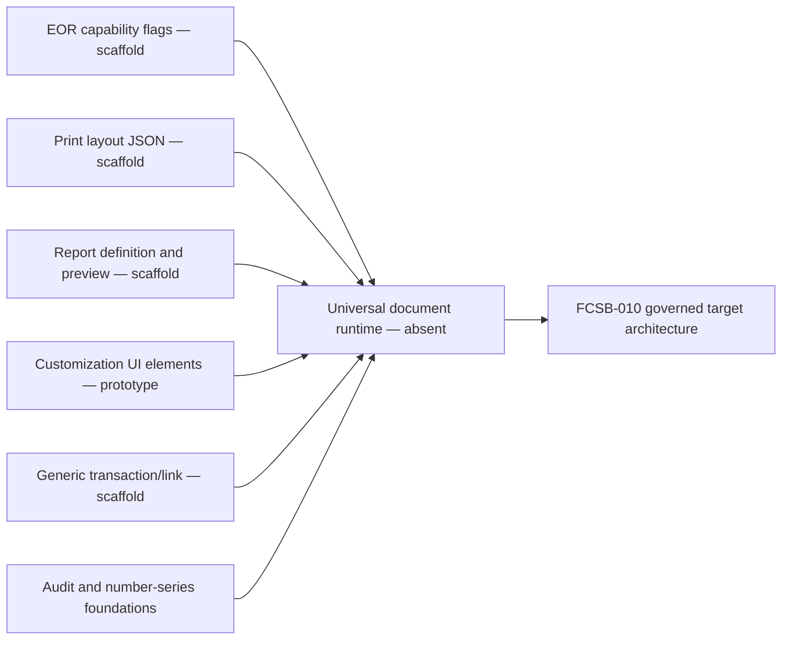

No repository model or service was found for document, attachment, content version, rendition, binary object, OCR result, signature, retention, legal hold, archive, secure share, delivery, print job or document search. The Compose topology provides PostgreSQL, API and web services, not object storage, conversion, search, queue, email or malware scanning. Dependency inspection shows no dedicated PDF, office conversion, OCR, signature, object-storage SDK or document-index technology. Existing source tests cover platform, organization and master-data behavior rather than a document runtime.

Therefore all UDF runtime capabilities in this volume are planned unless a row explicitly names a current scaffold or foundation. UI labels such as “Attachments placeholder,” export format strings and registry booleans are not acceptance evidence. Before implementation, teams must convert this logical architecture into approved models, DTOs, services, provider choices, failure contracts, migrations, operational controls and tests.

# Chapter 5 — Target Layered Architecture

The target has ten logical layers. Source domains own truth. The document control plane owns identity, policy and metadata. A content plane manages immutable bytes through provider adapters. Template and rendering services produce renditions. Evidence, signature and retention services apply custody rules. Search indexes permitted metadata and derivatives. Delivery services handle print, email, download and packages. Integration APIs and events expose stable contracts. Operations observe jobs, capacity, integrity and recovery. Governance controls types, policies and publication.

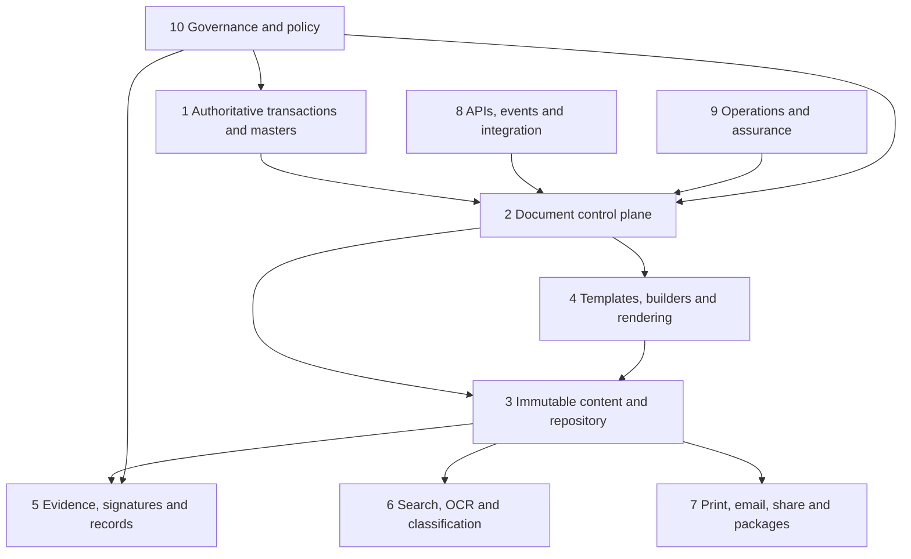

Layers are logical boundaries, not deployment mandates. A modular monolith may initially host control APIs and job orchestration, but content transfer must avoid routing large files through memory, and long-running rendering/scanning must not occupy request threads. Provider-neutral interfaces, transactional metadata/outbox patterns and idempotent workers allow later separation. Every layer accepts a correlation identifier, scope context and actor/service identity; logs exclude document bodies and secrets.

# Chapter 6 — Ownership and Authority Boundaries

Each document has one owning document type and steward, but the represented business facts retain a separate authority. The document framework may store a title, declared relationship, captured snapshot reference and searchable extraction. It cannot independently change an order total, approve a supplier, post a journal, release inventory, accept inspection results or alter a maintenance work order. Commands that imply business change are routed to the owning domain and return a new reference state.

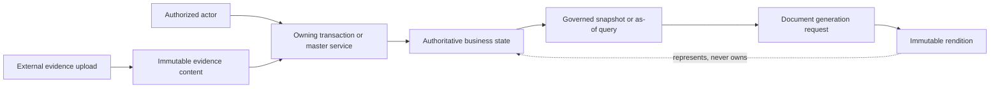

Ownership metadata records tenant, company where applicable, organizational scope, domain, EOR/object type, record identity, document type, steward and custodian. A document may reference multiple records, but a declared primary subject governs default policy. Cross-company packages require explicit export authorization; they do not weaken row-level or object-level controls. Shared services are custodians, not data owners.

Deletion of a rendition cannot delete the transaction. Deleting a source transaction is governed by that domain and normally impossible once evidence exists. When source data changes, existing generated documents remain historical representations; policy determines whether they are marked obsolete, superseded or still valid. Regeneration creates a new rendition linked to the prior one and declares whether the underlying business version changed.

# Chapter 7 — Document Families, Classes, and Types

The framework distinguishes family, class and type. Family expresses broad behavior: generated business form, generated analytical report, uploaded attachment, external evidence, controlled record, correspondence, label, certificate, technical file, package or transient working artifact. Class captures policy characteristics such as official record, supporting evidence, reference copy, controlled template or temporary output. Type is the governed executable registration, for example `PURCHASE_ORDER_OUTPUT`, `SUPPLIER_CERTIFICATE`, `INSPECTION_REPORT`, `CALIBRATION_CERTIFICATE`, `MANUFACTURING_DRAWING` or `MAINTENANCE_MANUAL`.

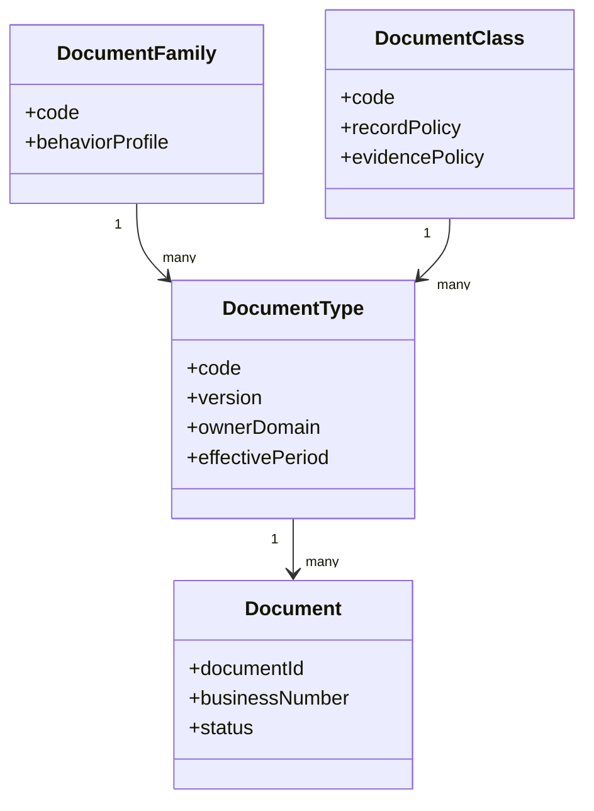

Type registration declares allowed media types, maximum size, required metadata, source relationships, permitted creation channels, version policy, default classification, retention schedule reference, signature/approval requirements, template family, rendition formats, OCR/index behavior, sharing channels and AI policy. Registrations are versioned and effective-dated. Publishing requires compatibility review and test evidence. A type cannot quietly relax a security or retention rule inherited from its class.

Unregistered uploads may enter quarantine only, never general availability. “Other” is not a permanent type; triage must classify or reject it. Domain-specific types extend the common contract without forking identity, content, access, audit or custody semantics.

# Chapter 8 — Taxonomy, Classification, and Metadata Governance

Taxonomy supports discovery; classification drives protection. A controlled vocabulary organizes domain, process, record series, subject, geography, product, customer/supplier and lifecycle concepts. Classification labels such as Public, Internal, Confidential and Restricted are policy identifiers, not decorative tags. Privacy, export-control, legal privilege, payment, health/safety and trade-secret markings may coexist as policy facets.

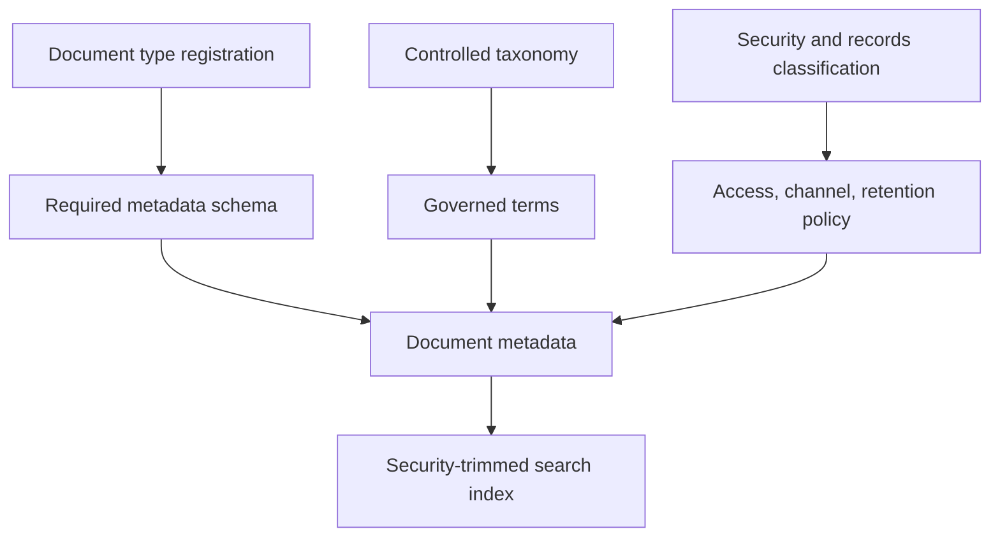

Common metadata includes stable identity, tenant, owner scope, type/version, class, title, description, language, business number, source, subjects, parties, dates, keywords, confidentiality, retention, legal-hold state, content/rendition counts, created/updated actors and timestamps. Domain extensions use registered namespaced fields with datatype, cardinality, validation, searchability, masking and lifecycle rules. Arbitrary JSON cannot bypass governance.

Metadata changes are versioned when evidentiary interpretation could change. Corrections require reason and actor; derived fields identify their source. Taxonomy terms have stable IDs, labels by language, hierarchy, synonyms, effectivity and deprecation links. Renaming a term does not rewrite historical meaning. Automated classification produces a proposal with model/rule version and confidence; a designated owner confirms sensitive or records-relevant outcomes.

# Chapter 9 — Identity, Digital DNA, and Numbering

A document has a globally stable internal ID independent of readable number, filename, storage key and content hash. Digital DNA is a governed human-verifiable identifier derived from an approved type/scope identity policy; it supplements, not replaces, the internal ID. Business numbers come from a scoped number-series policy when required and remain distinct from source transaction numbers. A generated PO PDF may display the PO number while retaining its own document and rendition IDs.

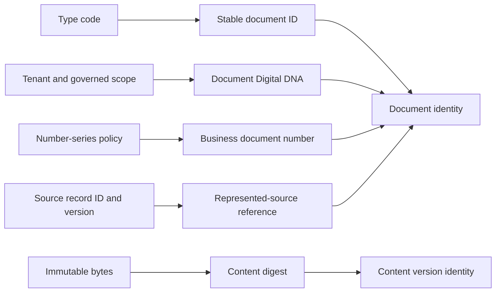

Uniqueness rules specify tenant and optional company/branch/type dimensions. Number allocation must be atomic, auditable and concurrency-safe; gaps are governed rather than concealed. External document numbers are stored with issuer and source-system namespace to prevent false uniqueness. Filenames are presentation metadata and may repeat.

The current number-series service is a useful foundation but is not integrated with documents. Current Digital DNA support covers selected objects and is not a universal document identity. Implementation must introduce a document-specific identity policy, collision tests, import mapping and non-reuse guarantees. Content hashes use an approved algorithm and canonical byte stream; changing metadata alone does not change the content digest.

# Chapter 10 — Document Aggregate and Hierarchy

The logical aggregate separates the stable document record from content versions, renditions, relationships, deliveries, signatures and retention actions. A document can be a container for multiple versioned source files and generated renditions. A compound document may have ordered child documents, while a package references members without transferring ownership. Hierarchies are explicit and cycle-free.

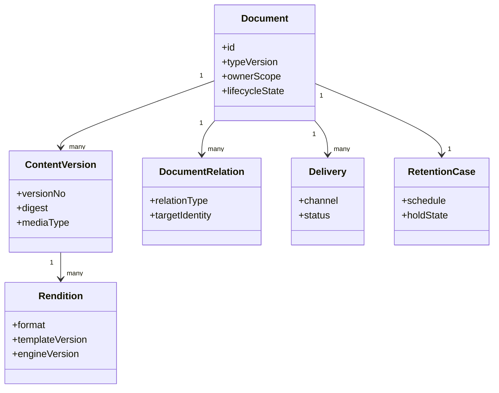

Aggregate invariants include one tenant, one registered type version at creation, valid scope, monotonic content versions, immutable finalized content, digest uniqueness within its context, no active delivery of quarantined content, no disposition under legal hold and no signature over mutable bytes. Large binary operations use staged metadata and finalization tokens rather than holding database transactions open.

Header and child collections expose explicit DTOs; `any` and unrestricted JSON are prohibited at trust boundaries. Extension bags are schema-validated. Optimistic version tokens protect metadata updates, while content finalization is idempotent. The logical model can be implemented across relational metadata, object storage and index infrastructure, but the API preserves aggregate semantics.

# Chapter 11 — Lifecycle and State Architecture

Document lifecycle is separate from the source transaction lifecycle. A document moves through Draft, Quarantined, InReview, Approved, Published, Superseded, Archived and Disposed states as permitted by type policy. Rejected and Failed are outcomes with recoverable transitions, not excuses to overwrite history. External evidence may begin in Quarantined and become Accepted; a generated rendition may begin in Rendering and become Available.

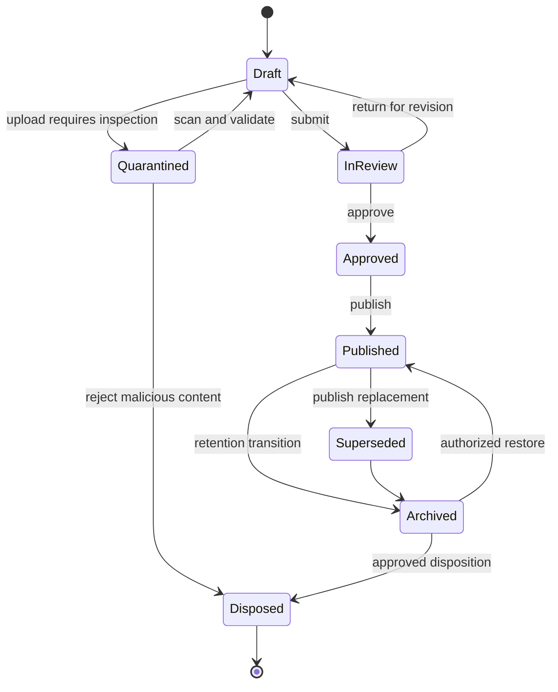

Transition policy declares actor permission, source state, guard, reason, approval/signature need, side effects and emitted event. Published content is immutable. A state change never rewrites earlier state history. Legal hold blocks disposition and may block supersession only where legal policy says so. Archive is a storage/lifecycle transition, not deletion. Restore creates a custody event and validates integrity before availability.

Status is multi-dimensional when necessary: lifecycle, scan, indexing, signature, retention, delivery and source-validity states should not be collapsed into one free-text field. APIs return each dimension and a derived availability decision. Domain status such as “invoice posted” is not copied into document lifecycle; it is referenced from the source or captured as generation provenance.

# Chapter 12 — Versioning, Revision, and Comparison

A document version identifies a controlled metadata/content revision. A rendition version identifies a generated representation of one content or source snapshot. A template version identifies layout logic. These counters never substitute for immutable IDs. Major/minor semantics are type policy: controlled drawings may use formal revisions, while an uploaded receipt may only have monotonic versions.

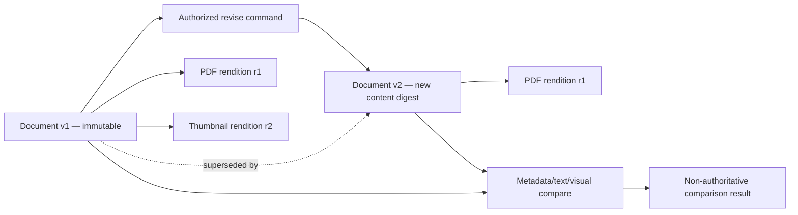

Revision requires reason, expected version, new bytes or metadata patch, and policy checks. It copies inherited classifications and holds unless an authorized policy change says otherwise. Comparison may operate on metadata, extracted text, structured fields, PDF pages, images or CAD metadata; results identify tool/version and limitations. Pixel or text differences do not prove business significance and never auto-approve a revision.

Version labels imported from external systems are preserved in a source namespace. Branching is normally prohibited for official records; controlled engineering documents may allow named branches only with merge/approval policy. A new template or renderer does not mutate a historical rendition. Regeneration records a new rendition with its own digest and lineage even when the visible output is identical.

# Chapter 13 — Relationships, References, and Lineage

Typed relationships connect documents to authoritative objects and to other documents. Supported semantics include Represents, Evidences, AttachedTo, GeneratedFrom, Supersedes, Amends, Translates, RenditionOf, SignedVersionOf, IncludedInPackage, RespondsTo and References. Direction, cardinality, effective interval, source system and confidence are explicit. Generic untyped links are insufficient for custody or inference.

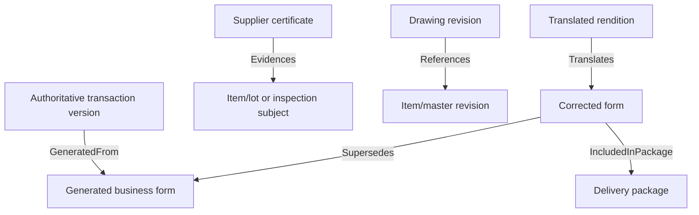

Lineage records the actor/service, source identities and versions, extraction or transformation steps, parameters, template, engine, locale, timestamps, hashes and outputs. It supports “why does this page exist?” and “which delivered artifacts used source version X?” A transaction reference persists after document archival or disposition; a tombstone retains permitted identity and lineage metadata without leaking deleted content.

Cross-tenant links are prohibited. Cross-company references require policy and are represented through authorized shared or external identities, not direct bypasses. External URLs are treated as references with trust and availability caveats. Circular Supersedes, RenditionOf and parent relationships fail validation. Link changes are audited, and evidentiary links may require approval.

# Chapter 14 — Template Architecture, Builders, and Inheritance

Templates are governed executable metadata, not arbitrary code. A template family defines document type, supported channels and base contract. Versions contain layout, bindings, conditions, styles, resources, accessibility rules and output profiles. Builders edit drafts; validators compile and test them; approvers publish immutable effective versions. Inheritance supports controlled brand, region, company, language and document-type layers.

```mermaid
flowchart LR
  BASE["Global base template"] --> REGION["Region policy layer"]
  REGION --> BRAND["Tenant/company brand layer"]
  BRAND --> TYPE["Document-type layout"]
  TYPE --> LANG["Language/RTL variant"]
  LANG --> DRAFT["Builder draft"]
  DRAFT --> VALIDATE["Schema, binding, accessibility and security validation"]
  VALIDATE --> TEST["Golden-data render tests"]
  TEST --> APPROVE["Approval and effective dating"]
  APPROVE --> PUBLISH["Immutable published template version"]
```

Inheritance resolves through a deterministic precedence graph and records the resolved dependency set. Child templates may override declared extension points only. Security headers, legal clauses, required identifiers and retention markings can be sealed against local override. Cycles and ambiguous precedence fail publication. Resources such as fonts, logos and translations are versioned assets with licensing and integrity metadata.

The current `PrintLayoutTemplate`/`PrintLayoutSection` JSON and customization UI are scaffolds that may inform a future builder; they have no evidenced compiler, publication workflow, renderer or safe expression language. Target bindings use an allow-listed schema and side-effect-free expression language. Templates cannot query databases, call networks, read secrets or execute arbitrary scripts. Publication packages include source, compiled artifact, dependency lock, test cases, preview outputs, compatibility level and approval record.

# Chapter 15 — Rendering Pipeline

Rendering converts an approved source snapshot and template version into immutable renditions. A request declares document type, source record/version or report contract, locale, timezone, currency display, output profile and idempotency key. The orchestrator authorizes, freezes inputs, resolves the template, validates bindings, renders in isolation, verifies output, stores content, records provenance and publishes availability.

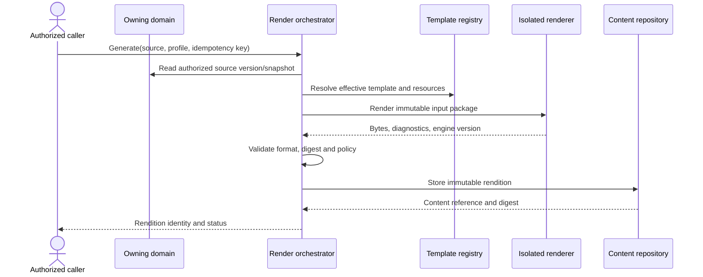

Rendering workers have no direct production database credentials. Input packages contain only authorized fields, and temporary files are encrypted and erased under policy. Network egress is denied unless a controlled converter requires an approved endpoint. Time, fonts, locale and engine versions are pinned for reproducibility. Active content, macros, external links and embedded resources are sanitized or rejected.

Synchronous rendering is limited to small bounded previews; official output is an asynchronous job with polling/event completion. Idempotency returns the same accepted result for an equivalent request. Retries cannot create duplicate official renditions. A failed render records stage, safe diagnostic, retryability and correlation ID without exposing content. Acceptance includes page count, media validation, required markings, font/resource resolution and deterministic golden tests.

# Chapter 16 — Generated Reports, Forms, and Reproducibility

Generated forms communicate one or more authoritative records. Reports answer a declared governed query. Both record data provenance, but reports additionally require parameter schema, as-of semantics, dataset/query version, security context, ordering, aggregation, currency/UOM conversions and reconciliation rules. “Latest data” is not reproducible unless a durable snapshot or exact temporal query contract exists.

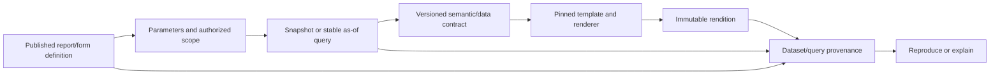

A generated document stores displayed source identities and versions, calculation policy references and generation timestamp. Monetary reports retain transaction, base and reporting currencies plus rate source/date/version. Localized display does not change stored values. Page headers identify company, report name, parameter summary, as-of time, confidentiality and generation identity. Draft and AI-assisted outputs are marked.

Current report definitions and preview over recent generic transactions are a scaffold, not a governed reporting engine; the advertised PDF/XLSX strings do not evidence export generation. FCSB-013 owns analytical semantics, dashboards and enterprise scheduling. UDF owns the resulting immutable artifact, provenance, delivery and retention. Reproduction may be exact bytes when dependencies are preserved or semantically equivalent output when technology changes; the assurance level is declared.

# Chapter 17 — Labels, Barcodes, and QR Codes

Labels are compact controlled documents with physical consequences. A label definition declares stock size, printer language/output profile, data contract, symbology, quiet zones, human-readable fallback, localization, copy limits and reprint policy. Barcode and QR payloads use registered schemas; they never embed secrets, bearer tokens or unrestricted personal data. Digital DNA or opaque lookup IDs are preferred to raw database URLs.

```mermaid
flowchart LR
  EVENT["Authorized business event"] --> LABELREQ["Label request with quantity and reason"]
  LABELREQ --> POLICY["Type, device, stock and reprint policy"]
  POLICY --> ENCODE["Validate barcode/QR payload schema"]
  ENCODE --> RENDER["Render printer/output profile"]
  RENDER --> VERIFY["Syntax, checksum and scan verification"]
  VERIFY --> QUEUE["Controlled print queue"]
  QUEUE --> AUDIT["Copies, device, operator and outcome"]
```

Identifiers use correct check digits and standards selected by domain governance. A QR may resolve through an authenticated application route, but authorization is evaluated after scanning. Offline payloads are signed only when required and must expose expiry and trust limits. Image-only verification is insufficient; test scanners and encoded-value inspection are required.

Reprints create delivery/print events linked to the same or a superseding label rendition, with reason and copy count. Void, duplicate and sample watermarks are policy-driven. Manufacturing, inventory, quality and logistics volumes define when a label is operationally valid. UDF defines generation and custody only.

# Chapter 18 — Printing, Queues, and Batch Control

Printing is an accountable delivery channel, not a browser side effect. A print request references an immutable rendition, target logical printer/profile, copies, duplex/color/media options, purpose and idempotency key. Policy authorizes the document, user, location, device and classification. A queue adapter submits to the print infrastructure and reconciles accepted, printing, completed, uncertain, failed and cancelled outcomes.

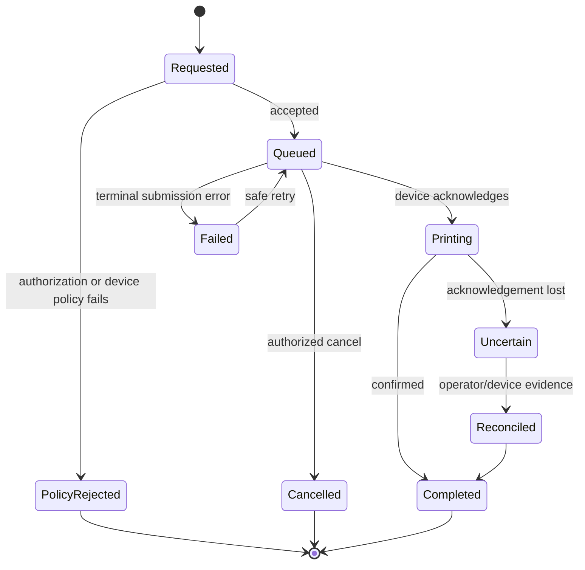

The service must not claim completion merely because a spooler accepted a job. Device capability, secure release, badge/PIN collection, retention of spool files and pull-print behavior are deployment policies. Restricted documents default to secure release and prohibit unattended shared printers. Print content is encrypted in transit when infrastructure supports it; temporary spool data follows classification and disposal rules.

Bulk printing creates one parent batch and deterministic child jobs. Limits protect printers and workers. Restart resumes safe child jobs without duplicating confirmed copies. Reprints and extra copies require reason where official forms, labels or certificates are controlled. Current repository code contains no print runtime or queue; the layout metadata is not print evidence.

# Chapter 19 — Email Delivery and Correspondence

Email delivery creates a durable delivery record linking recipients, channel policy, exact attachment/rendition identities, message-template version, sender identity, timestamp and provider outcome. Recipient addresses are validated and classified. The document service does not infer permission from an email address; source and document authorization plus external-disclosure policy must pass before packaging.

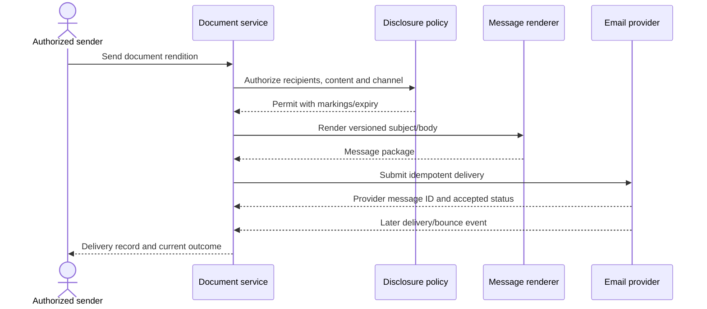

Message bodies may themselves be retained documents where correspondence policy applies. Embedded rendering uses a declared safe HTML/text profile; remote tracking, active content and untrusted links are governed. Attachments are immutable renditions; large or restricted content uses an expiring secure link rather than provider attachment, subject to policy. Passwords are never emailed with protected archives in the same channel.

Accepted by a provider is not delivered to a recipient. Bounce, rejection, complaint, expiry and uncertain outcomes remain visible. Retries reuse idempotency and do not produce duplicate correspondence. Incoming email ingestion, if selected later, must preserve original message, headers, attachments, transport evidence and malware/quarantine state while minimizing unnecessary personal data. No email delivery/storage runtime is evidenced today.

# Chapter 20 — Attachments, Evidence, Notes, and Custody

An attachment is a typed relationship between a versioned document and an authoritative subject. Evidence is content whose provenance and integrity support a business or compliance decision. A note is a versioned textual record with audience and classification. These concepts share storage controls but not evidentiary weight. Users cannot convert an informal note into approved evidence by renaming it.

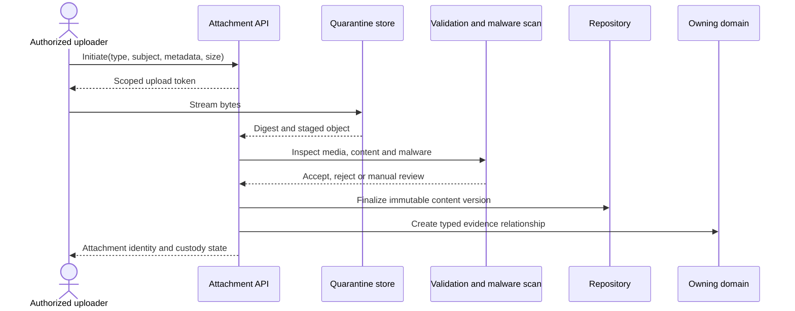

Upload is staged, size-limited and rate-limited. The server validates magic bytes, MIME, extension consistency, archive depth, encryption, macros and malware. Suspect files stay isolated and cannot be previewed, indexed, shared or downloaded except by controlled security tooling. A clean scan is time-bound evidence from a named engine/version, not proof of future safety; rescanning policy applies when intelligence changes.

Custody records source, uploader, acquisition method, timestamps, original filename, declared issuer, digest, transformations, access and transfers. Evidence versions are immutable. A corrected certificate is a new version or separate document linked by Supersedes; the original remains under retention. Notes have create/amend history and cannot silently mutate after decision use. Transaction access does not automatically grant every attachment—classification, party and purpose may narrow it.

# Chapter 21 — Content Formats and Specialized Files

The repository accepts formats only through a type-specific allow list. PDF profiles distinguish ordinary PDF, archival PDF and digitally signed containers. Images retain original bytes and safe derivatives; metadata such as EXIF location is preserved or removed by declared policy. Office files are treated as potentially active content, with macro, external-link and embedded-object controls. CAD drawings require native format/version metadata plus approved neutral renditions where feasible. Email uses original RFC message and normalized metadata. Safety data sheets and certificates preserve issuer and effective/expiry context.

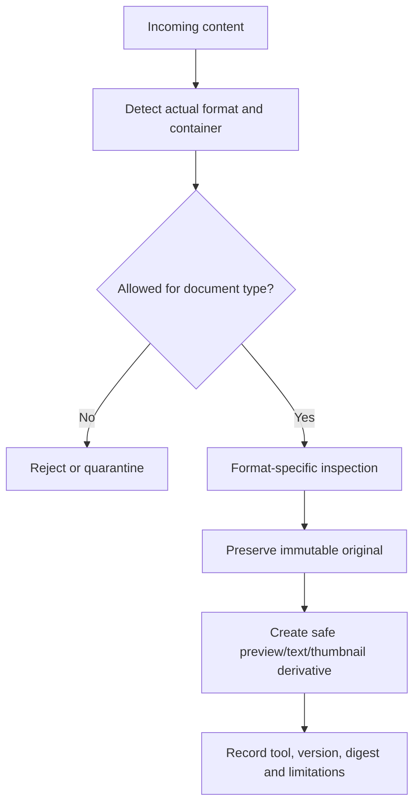

Original content is always distinguishable from normalized or converted content. Conversion does not erase the original and cannot silently claim semantic equivalence. PDF merge, image compression, office-to-PDF conversion, CAD neutralization and email extraction each create a derivative with lineage. Encrypted input is accepted only when policy and controlled decryption are available; user-supplied passwords are handled as secrets and never logged.

Previewers run isolated with patched parsers and resource limits. Unsupported files remain downloadable only if policy permits and risk controls pass. A derivative can be indexed or shared independently only when its inherited classification, retention and authorization are enforced. Accessibility checks and alternative text belong to published output quality. Domain owners approve whether a derivative can be the operational viewing copy.

# Chapter 22 — Repository and Storage Abstraction

Document metadata and content have different persistence characteristics. Relational metadata governs identity, relationships, lifecycle and policy. Immutable object storage holds bytes. A repository abstraction provides initiate, upload, finalize, read-range, verify, copy-to-tier, restore and disposition operations using opaque content references. Provider paths, buckets, account names and signed URLs never appear as stable public IDs.

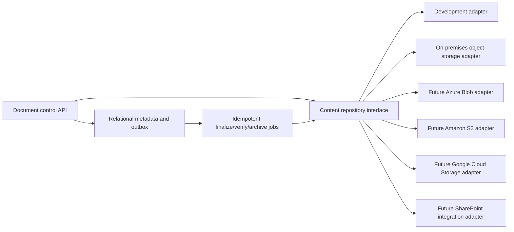

The adapter contract declares conditional create, version behavior, checksum support, range reads, server-side encryption, legal-hold compatibility, lifecycle tiers, event semantics and consistency assumptions. Capabilities are discovered at deployment and matched against policy; no least-common-denominator downgrade is silent. SharePoint may serve collaboration/integration use cases but is not presumed to meet immutable evidence or high-volume blob requirements. Azure Blob, AWS S3 and GCS remain future choices, not current dependencies.

Content keys are random, tenant-partitioned and non-guessable. Database and object finalization use staged state plus an outbox/saga; reconciliation detects orphan metadata and orphan objects. Replication, durability and backup claims require provider evidence. Development local storage is never production-approved. The current Docker topology has no content store, so provider selection, capacity, backup, recovery and migration remain open architecture decisions.

# Chapter 23 — Encryption, Keys, Confidentiality, and Watermarks

Content is encrypted in transit and at rest using approved platform controls. Envelope encryption permits tenant-, classification- or domain-scoped data-encryption keys where risk requires, backed by a managed key service or hardware security boundary. Key identifiers and rotations are metadata; keys and secrets never enter document records, URLs, source control or logs. Rotation should rewrap keys rather than mutate immutable content bytes.

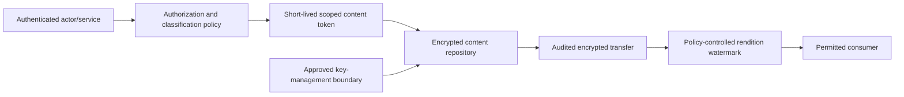

Classification determines channels, cache headers, offline use, secure-view need, watermark, download, print, share and geographical restrictions. Watermarks are derivatives or render-time overlays containing classification, copy status, recipient, time or purpose as policy allows. They do not alter the signed original; a watermarked copy has its own rendition digest and lineage. “Confidential” text alone is not access control.

Encryption does not replace authorization, malware controls, minimization or retention. Client-side encryption limits server-side preview/search and must be an explicit profile. Key loss is data loss, so recovery, rotation, separation of duties, access logging and break-glass are tested. Temporary decrypted files use restricted storage and deterministic cleanup. Backups inherit classification and cryptographic lifecycle. Cryptographic algorithm and key-length standards are maintained outside this blueprint under security governance.

# Chapter 24 — Authorization and Tenant Isolation

Authorization combines actor identity, tenant, organizational scope, object/record permission, document type, classification, relationship, purpose, lifecycle state and requested action. Create, metadata read, content read, upload new version, render, compare, approve, sign, print, email, share, restore, hold and dispose are separate permissions. A broad transaction role does not automatically grant restricted evidence.

```mermaid
flowchart TB
  REQ["Document action request"] --> TENANT{"Tenant matches?"}
  TENANT -- "No" --> DENY["Deny and audit"]
  TENANT -- "Yes" --> SCOPE{"Organization and subject scope?"}
  SCOPE -- "No" --> DENY
  SCOPE -- "Yes" --> OBJ{"Object/record permission?"}
  OBJ -- "No" --> DENY
  OBJ -- "Yes" --> CLASS{"Classification, purpose and channel allowed?"}
  CLASS -- "No" --> DENY
  CLASS -- "Yes" --> STATE{"Lifecycle action permitted?"}
  STATE -- "No" --> DENY
  STATE -- "Yes" --> ALLOW["Issue bounded operation grant"]
```

Every metadata query and search result is tenant-filtered before pagination or aggregation. Content keys, caches, queues, indexes and temporary workspaces carry tenant partitions. Workers receive narrow job grants, not user JWT reuse or unrestricted database/provider credentials. Signed upload/download URLs are short-lived, one-purpose, content-bound and generated only after policy evaluation.

Administrative support access is time-bound, approved, visible and audited. Break-glass cannot override legal prohibition and triggers review. Row-level and object-level controls must be enforced server-side even if UI hides actions. Current JWT, role and scope foundations are useful but do not evidence document-specific authorization. Threat and penetration tests must attempt cross-tenant IDs, provider keys, index leakage, cache leakage, job substitution and URL replay.

# Chapter 25 — Secure Sharing, Temporary Links, and Downloads

Sharing publishes a controlled access grant, never a raw storage URL. A grant identifies document/rendition version, recipient or audience, allowed actions, purpose, expiry, maximum uses, authentication requirement, geographic/device restrictions and revocation state. External recipients receive the least-capable experience consistent with the business need. Anonymous links are prohibited by default and require explicit low-risk policy.

```mermaid
sequenceDiagram
  actor O as Authorized owner
  participant D as Document service
  participant P as Sharing policy
  participant G as Grant service
  actor R as Recipient
  O->>D: Request share(version, audience, expiry)
  D->>P: Evaluate classification and purpose
  P-->>D: Allowed constraints
  D->>G: Create revocable scoped grant
  G-->>O: Non-secret notification reference
  R->>G: Authenticate and redeem grant
  G->>D: Re-evaluate current policy and state
  D-->>R: Stream permitted rendition
  D->>D: Audit access outcome
```

Temporary download URLs are generated just in time after grant redemption and expire quickly. They must be audience-bound where supported and never logged. Revocation prevents new redemption; already downloaded bytes cannot be recalled, so highly sensitive content may require secure viewing, watermarking or no-download policy. Download response headers prohibit unsafe inline rendering and unintended caching according to type.

Bulk downloads create a governed package asynchronously with member authorization evaluated at build and retrieval time. Package manifests list included identities, versions and digests. Members omitted for lost permission are reported without leaking titles. Rate limits, quotas and anomaly detection address scraping. Sharing actions, failed attempts, revocations and downloads are auditable with privacy-aware network/device context.

# Chapter 26 — Approvals, Electronic Signatures, and Certificates

Document approval confirms a governed decision about a fixed version. Electronic signature binds a signer identity, intent, signing time, policy context and content digest to evidence produced by an approved signing method. Approval and signature may coexist but are not synonyms. A scanned signature image is presentation, not cryptographic or legal proof. Jurisdiction and assurance level determine suitable mechanisms.

```mermaid
sequenceDiagram
  actor A as Approver or signer
  participant W as Workflow runtime
  participant D as Document service
  participant S as Signature provider
  participant E as Evidence repository
  W->>D: Lock immutable version for decision
  D-->>W: Version ID, digest and context
  W->>A: Present exact content and intent
  A->>S: Authenticate and sign digest/context
  S-->>W: Signature evidence and provider result
  W->>E: Store detached signature evidence
  W->>D: Record signed-version relationship
  D-->>W: Signed state without content mutation
```

Signatures are detached or stored in a container whose signed byte range is immutable. Adding a visible signature appearance creates or finalizes a signed rendition by a defined process; later watermarking creates a derivative and cannot pretend to remain the signed original. Certificate chain, timestamp, revocation-check result, provider transaction and validation policy are retained. Validation reports their evaluation time and limitations.

FCSB-011 owns workflow instances, routing, delegation, escalation and separation of duties. UDF owns immutable version locking, digest, signature evidence, signed relationships and verification. Provider selection requires legal, privacy, residency, availability and exit review. The current approval schema has no document signing runtime. No signature implementation claim is made.

# Chapter 27 — Retention, Legal Hold, Archive, Restore, and Disposition

Retention is policy-driven by document class/type, jurisdiction, company, event and effective policy version. A schedule declares trigger, minimum duration, review need and disposition action. Legal hold suspends disposition for relevant content and derivatives, including packages and backups as feasible. Holds are cases with authority, scope, reason, dates and custodians; casual tags are insufficient.

```mermaid
stateDiagram-v2
  [*] --> Active
  Active --> RetentionRunning: trigger occurs
  RetentionRunning --> Hold: legal hold applied
  Hold --> RetentionRunning: authorized release
  RetentionRunning --> Eligible: period expires
  Eligible --> Review: disposition approval required
  Review --> RetentionRunning: extend or reject
  Review --> Archived: archive record
  Review --> Disposed: approved secure disposition
  Archived --> Hold: hold applied
  Archived --> Restoring: authorized restore
  Restoring --> Archived: integrity verified and access copy created
  Disposed --> [*]
```

Archive moves content to an approved tier while retaining identity, metadata, relationships, policy and integrity evidence. Restore is asynchronous, idempotent and monitored; availability is not promised until digest verification succeeds. Access copies may be created without changing archive custody. Provider lifecycle rules cannot dispose content independently of UDF policy.

Disposition requires eligibility calculation, hold check, approval where required, provider deletion result, index/cache cleanup and durable disposition certificate/tombstone. Cryptographic erasure may supplement provider deletion. “Delete” in user interfaces maps to policy action, not immediate physical erasure. Privacy deletion requests are reconciled with legal/records obligations and minimization. Exact schedules remain open until Records Management and Legal approve them.

# Chapter 28 — Search, Indexing, OCR, and Discovery

Search indexes security-trimmed metadata and permitted derivatives. Index documents carry tenant, scope, classification, document/version IDs, type, lifecycle, language, taxonomy, dates and text segments. Query authorization is applied before and after retrieval to handle policy changes and index lag. Search snippets mask restricted fields; counts and facets must not reveal inaccessible records.

```mermaid
flowchart LR
  CONTENT["Immutable content version"] --> OCR["OCR/text extraction sandbox"]
  OCR --> DERIV["Labelled derivative with confidence and coordinates"]
  META["Authorized metadata"] --> INDEX["Tenant-partitioned search index"]
  DERIV --> INDEX
  QUERY["Authenticated scoped query"] --> FILTER["Security filter"]
  FILTER --> INDEX
  INDEX --> RECHECK["Current authorization recheck"]
  RECHECK --> RESULT["Masked results and snippets"]
```

OCR preserves source page/region coordinates, engine/model version, language, confidence and processing time. It never overwrites an authoritative field. Extraction of invoice numbers, quantities or certificate values creates reviewable proposals for the owning domain. Corrections to OCR are annotations or new derivative versions, not edits to original bytes. Handwriting, low-resolution images, tables and multilingual content carry explicit quality limits.

Indexing is asynchronous and eventually consistent. Lifecycle changes, permission revocation, holds and disposition generate priority index updates. Stale-index safeguards can suppress content retrieval even if a result briefly appears. Rebuilds are reproducible from metadata/content derivatives and do not become the system of record. Search provider selection, scale and disaster recovery remain future decisions; PostgreSQL alone is not assumed adequate or inadequate without workload evidence.

# Chapter 29 — Localization, Branding, Region, Currency, and RTL

Content language, user locale, legal region, company branding, timezone, number/date formats, currency and script direction are separate parameters. A source transaction stores values under domain rules; rendering selects display rules without changing them. Currency outputs show the correct code/symbol, decimal precision, rate context and rounding. Translated documents link to the source version and identify human, approved machine-assisted or unreviewed machine translation.

```mermaid
flowchart TB
  SOURCE["Authoritative invariant values"] --> CONTEXT["Render context"]
  CONTEXT --> LANG["Language and terminology pack"]
  CONTEXT --> RTL["LTR/RTL layout and font profile"]
  CONTEXT --> REGION["Regional legal and date/number policy"]
  CONTEXT --> BRAND["Company brand assets"]
  CONTEXT --> MONEY["Currency/UOM display rules"]
  LANG --> OUTPUT["Localized rendition"]
  RTL --> OUTPUT
  REGION --> OUTPUT
  BRAND --> OUTPUT
  MONEY --> OUTPUT
```

Right-to-left support covers reading order, alignment, table direction, mirrored layout where appropriate, bidirectional identifiers and font shaping; it is not a global CSS flip. Codes, numbers and barcodes may retain left-to-right semantics within RTL pages. Fonts are licensed, embedded where required and tested for glyph coverage. Accessibility and printable contrast are acceptance criteria.

Brand inheritance cannot override mandatory legal, confidentiality or source identity markings. Regional clauses and tax labels are effective-dated controlled resources. Timezone and locale used for generation are recorded. A translated rendition has its own digest and approval state; source updates may make it stale and trigger review. AI translation is labelled and cannot publish regulated text without designated approval.

# Chapter 30 — Transaction, Workflow, Object, and External References

Documents connect to business context through stable typed references. Transaction references include transaction ID, type, owning domain, version or as-of point and relationship. Workflow references include definition and future instance/task identities without storing workflow state in the document. EOR/object references provide governed type identity. External references include system namespace, immutable source ID, source version and import/custody metadata.

```mermaid
classDiagram
  class Document {
    +documentId
    +documentType
  }
  class SubjectReference {
    +objectType
    +recordId
    +recordVersion
    +relation
  }
  class TransactionReference {
    +transactionType
    +transactionId
    +asOf
  }
  class WorkflowReference {
    +definitionId
    +instanceId
    +taskId
  }
  class ExternalReference {
    +systemNamespace
    +sourceId
    +sourceVersion
  }
  Document "1" --> "many" SubjectReference
  SubjectReference <|-- TransactionReference
  SubjectReference <|-- WorkflowReference
  SubjectReference <|-- ExternalReference
```

References are resolved through authorized domain APIs, not polymorphic unrestricted database joins. Deleted or archived subjects retain permitted tombstones so document lineage remains interpretable. Import cannot reuse external IDs across namespaces. Reference validation may be strong during creation and asynchronously reconciled for disconnected imports; unresolved references are visible states.

FCSB-009 establishes that documents represent or evidence transactions but do not own effects. FCSB-011 will govern workflow execution. FCSB-008 informs semantic lineage and AI context. UDF provides the stable bridge without absorbing those runtimes. Current generic `TransactionLink` is not sufficient evidence for this typed, version-aware reference architecture.

# Chapter 31 — Domain Document Patterns

Domain documents specialize the common framework through registered types and policies. Supplier and customer documents include onboarding evidence, declarations, contracts, correspondence and certificates. Procurement and sales outputs include requests, quotations, purchase orders, sales orders, confirmations and amendments. Logistics includes delivery notes, packing lists, bills of lading and goods-receipt evidence. Finance includes invoice representations, statements, remittance notices and audit packages, while authoritative postings remain in Finance transactions.

```mermaid
flowchart TB
  UDF["Universal identity, versions, content, policy and custody"]
  UDF --> COMM["Customer/supplier/contracts/correspondence"]
  UDF --> TRADE["PO/SO/invoice/delivery note/goods receipt/import-export"]
  UDF --> QUALITY["Inspection reports/certificates/SDS/compliance"]
  UDF --> MFG["Drawings/work instructions/specifications/travellers"]
  UDF --> MAINT["Manuals/calibration/service and maintenance evidence"]
  UDF --> CORP["Policies/forms/reports/records packages"]
  COMM --> DOMAIN["Owning domain rules and authoritative transactions"]
  TRADE --> DOMAIN
  QUALITY --> DOMAIN
  MFG --> DOMAIN
  MAINT --> DOMAIN
```

Inspection reports link sample/lot/operation, specification revision, results and quality decision, but the quality system owns acceptance. Calibration certificates link instrument, calibration event, standard traceability, provider and validity, while Maintenance/Quality owns equipment status. Compliance certificates and safety data sheets preserve issuer, product, jurisdiction, effective/expiry dates and supersession. Manufacturing drawings, CAD, specifications and work instructions require revision/effectivity and released-copy controls; production execution owns which revision was consumed.

Maintenance manuals and service reports link asset/model/work order and dates. Import/export packages may combine invoices, packing lists, origin certificates, declarations and licenses under restricted classifications. Email and office attachments preserve originals. Each domain approves mandatory metadata, relationships, signature, retention and output rules. UDF does not invent legal meaning or a universal retention duration.

# Chapter 32 — APIs, Events, and Integration Contracts

APIs expose explicit versioned commands and queries: register draft, initiate upload, finalize content, create revision, generate rendition, submit/approve/publish, sign, compare, search, share, download, print, email, apply/release hold, archive, restore and dispose. Large transfers use scoped pre-signed operations or streaming; command bodies never accept provider paths. Every mutation accepts idempotency, expected aggregate version, correlation and reason where policy requires.

```mermaid
sequenceDiagram
  participant C as Client/domain service
  participant A as Document API
  participant M as Metadata transaction
  participant O as Outbox
  participant W as Idempotent worker
  participant P as Content/provider adapter
  C->>A: Versioned command + idempotency key
  A->>M: Validate scope, policy and expected version
  M->>O: Persist event/job atomically
  M-->>A: Accepted aggregate/job identity
  A-->>C: 202 Accepted or completed result
  O->>W: Deliver job/event
  W->>P: Execute provider operation conditionally
  P-->>W: Provider result and checksum
  W->>M: Reconcile outcome
```

Events describe facts such as DocumentCreated, ContentFinalized, ScanCompleted, RenditionAvailable, DocumentPublished, VersionSuperseded, SignatureRecorded, DeliveryChanged, HoldApplied, Archived, Restored and Disposed. They carry IDs, versions, scope, classification-safe metadata, causation/correlation and schema version—not content, secrets or signed URLs. Consumers deduplicate and tolerate ordering gaps.

Integration supports inbound uploads, outbound retrieval, repository migration and external record-management connectors. Contract tests verify tenancy, authorization, idempotency, optimistic concurrency, range transfer, checksum, failure mapping and backward compatibility. Webhooks are signed, replay-protected and minimized. Batch APIs cap members and return per-item outcomes. Current controllers accepting `any` are not a target pattern. Provider-specific APIs remain behind adapters so future SharePoint, Azure Blob, AWS S3 and GCS integrations do not leak into business contracts.

# Chapter 33 — Packages, ZIP, PDF Merge, Batch, and Scheduling

A document package is an immutable manifest plus referenced member versions and optional generated container renditions. ZIP and merged PDF outputs are derivatives, not new authority. The manifest records order, names, document/version IDs, digests, omissions, transforms, classification and generation policy. Member authorization is evaluated at package request and retrieval; inherited policy is at least as restrictive as the most restrictive member.

```mermaid
flowchart LR
  PLAN["Approved package/report schedule"] --> RESOLVE["Resolve member identities and versions"]
  RESOLVE --> AUTH["Authorize each member and channel"]
  AUTH --> MAN["Build immutable manifest"]
  MAN --> JOB["Bounded batch job"]
  JOB --> ZIP["ZIP with safe names and digest manifest"]
  JOB --> PDF["PDF merge with bookmarks and page lineage"]
  ZIP --> STORE["Store derivative and provenance"]
  PDF --> STORE
  STORE --> DELIVER["Authorized download/email/print delivery"]
```

ZIP builders prevent path traversal, zip bombs, unsafe encryption and name collisions. PDF merge preserves source ordering and page provenance; incompatible signatures are not represented as one newly signed document. A merged copy does not invalidate member signatures, but its own integrity and signature state are distinct. Password-protected packages use approved key exchange, never a password sent beside the archive.

Batch queues expose parent/child status, throttling, partial failure, safe retry, cancellation and reconciliation. Schedules reference published report/template versions, parameter policy, timezone/calendar, recipient groups and expiry. Changes create schedule versions. FCSB-013 owns analytical scheduling semantics; UDF owns output/package custody and delivery evidence. Large jobs enforce quotas and storage budgets. No queue or scheduler runtime exists in the current document baseline.

# Chapter 34 — Builders, Inheritance, Extensions, and Plug-ins

Document builders and extensions operate inside governed seams. Extension types may add validated metadata fields, bindings, renderer components, classifiers, storage adapters, delivery adapters or domain relationship resolvers. Every extension declares manifest identity, version, compatibility, permissions, resource limits, data handling, dependencies, failure behavior and rollback. Unsigned arbitrary code or template scripts are prohibited.

```mermaid
flowchart TB
  NEED["Approved extension need"] --> CONTRACT["Select governed extension contract"]
  CONTRACT --> BUILD["Build in isolated SDK/profile"]
  BUILD --> TEST["Schema, security, compatibility and failure tests"]
  TEST --> REVIEW["Architecture/security/domain review"]
  REVIEW --> PACKAGE["Signed versioned package"]
  PACKAGE --> STAGE["Stage and render golden cases"]
  STAGE --> PUBLISH["Publish with effective version"]
  PUBLISH --> OBSERVE["Observe, deprecate or roll forward"]
```

Inheritance is metadata composition, not runtime monkey-patching. Extension points have stable inputs/outputs and deny direct database/provider access. Rendering components receive bounded data and cannot call external networks by default. Storage adapters pass a conformance suite. Domain resolvers call approved APIs under service identity. Failure in an optional extension cannot corrupt core document state; required-extension failure blocks finalization visibly.

Tenant customizations are namespaced and cannot weaken sealed controls, legal markings, audit or retention. Promotion from development to test and production uses immutable packages, comparison, approval and environment configuration—not manual database edits. FCSB-012 will own Studio packaging/publication in detail. Current customization JSON and UI are a foundation concept only; no governed extension runtime is evidenced.

# Chapter 35 — Governed AI Document Capabilities

AI may assist classification, summarization, extraction, translation, redaction proposals, template suggestions, semantic search, duplicate detection and draft generation. Each capability has an approved purpose, model/provider, data classes, grounding sources, output schema, confidence/evaluation, human-review rule, retention and prohibited uses. AI reads only content the requesting actor could access and cannot widen scope through vector indexes, caches or tools.

```mermaid
flowchart LR
  USER["Authorized user and purpose"] --> POLICY["AI/document policy gate"]
  DOC["Permitted document versions"] --> RETRIEVE["Security-trimmed retrieval"]
  POLICY --> RETRIEVE
  RETRIEVE --> MODEL["Approved model/tool boundary"]
  MODEL --> OUTPUT["Labelled draft/extraction/summary/translation"]
  OUTPUT --> CITE["Document/version/page citations and confidence"]
  CITE --> REVIEW["Human or governed workflow review"]
  REVIEW --> DOMAIN["Explicit write to owning domain if approved"]
  REVIEW --> DERIV["Versioned document derivative if retained"]
```

Generated documents show a machine-generated or machine-assisted label in metadata and visible output according to policy. Summaries cite exact document versions and locations. Extraction retains field-level evidence coordinates and confidence. Translation retains source linkage and review state. Classification is a proposal. Redaction must be verified against underlying layers, metadata and recoverability; visual black boxes alone are unsafe.

AI cannot approve, sign, post, dispose, release legal hold, infer access or overwrite evidence. Prompt injection inside documents is treated as untrusted content; retrieved instructions do not become system authority. Training or provider retention is disabled unless explicitly approved. Current repository dependencies and services do not evidence document AI, OCR, vector search or model integration. FCSB-008 governs AI trust and knowledge boundaries; this volume applies them to documents.

# Chapter 36 — AI Security, Privacy, and Human Accountability

Document AI concentrates sensitive text, images and business context, so privacy and security review precede activation by type and use case. Data minimization selects only required pages/fields. Restricted classes may require local or private processing, zero provider retention, regional execution and contractual controls. Secrets, credentials, privileged communications, export-controlled data and personal data receive explicit handling; masking must not destroy evidence needed for authorized review.

The threat model includes prompt injection, malicious embedded instructions, retrieval leakage, cross-tenant vector contamination, training reuse, model inversion, hallucinated facts, manipulated OCR, unsafe generated macros/links, biased classification and automation complacency. Controls include content-as-data isolation, tool allow lists, output schemas, citation enforcement, policy-filtered retrieval, tenant-partitioned indexes, adversarial evaluations, rate limits and incident kill switches.

Human accountability is role-specific, not a generic checkbox. Reviewers see source, output, confidence, differences and known limitations. High-impact extraction requires dual verification or sampling policy. Acceptance writes an explicit decision record and never alters original evidence. Performance is monitored by language, format, domain and risk class; low-confidence or out-of-distribution input routes to manual handling.

AI audit records purpose, actor, input document/version references, model/provider/version, policy version, parameters class, output identity, citations, review and downstream action without logging entire sensitive prompts by default. Model upgrades require regression evaluation and may change reproducibility claims. AI-generated content has its own retention and discovery implications. Privacy, Legal, Security and AI Governance may suspend any use case independently.

# Chapter 37 — Operations, Reliability, and Continuity

Operations measure upload/finalize latency, scan backlog, render duration/error by template and engine, indexing lag, storage growth, restore time, provider errors, queue depth, delivery outcomes, integrity failures, access denials and disposition backlog. Service-level objectives are set only after workload evidence. Metrics exclude titles, filenames, document text, recipient addresses and signed URLs unless a separately approved diagnostic process needs them.

Jobs are idempotent, leased, heartbeat-monitored and dead-lettered with controlled replay. Poison documents are isolated. Backpressure protects API, renderer, scanner, index, email, printer and storage providers. Circuit breakers and quotas fail visibly. Correlation connects API request, metadata transaction, outbox event, worker attempt, provider operation and audit record. Operators can reconcile “metadata finalized, object missing” and “object present, metadata absent” without guessing.

Backup covers relational metadata, provider configuration, template packages, keys under their own regime and object content according to provider architecture. Recovery tests verify relationships, versions, digests, holds, policy, indexes and pending jobs—not just database startup. Search indexes and thumbnails may be rebuilt if source content and lineage survive. Recovery-point and recovery-time objectives differ by active, archived and derived content tier.

Provider outage must not corrupt transaction state. The owning domain can continue according to its continuity policy and queue document generation later. Upload may be suspended rather than accept unverifiable evidence. Multi-region, replication and immutable backup are future topology decisions. Runbooks cover malware incident, content leak, key compromise, renderer vulnerability, queue duplication, provider inconsistency, index leakage, corrupted archive and legal-hold failure.

# Chapter 38 — Security Threat Model and Assurance

Primary threats are cross-tenant access, insecure direct object reference, signed-URL leakage/replay, malicious files, parser compromise, macro/active content, oversized/decompression attacks, content substitution, hash ambiguity, metadata tampering, unauthorized version replacement, search/index leakage, cache leakage, printer/email disclosure, weak temporary storage, extension supply chain, insider misuse, key compromise, retention bypass and AI exfiltration.

Trust boundaries exist at client/API, upload quarantine, worker queues, renderer/converter, object provider, search index, email/print provider, signature provider, external share portal and administrative support. Each boundary uses authenticated service identity, least privilege, bounded tokens, validation, encryption, rate/resource limits, logging and failure isolation. Binary parsers and renderers are sandboxed and patched. Provider callbacks are authenticated and replay-protected.

Integrity assurance binds metadata to content identity, digest algorithm/version, size and provider checksum. Periodic scrubbing samples or verifies stored content. Chain-of-custody records transformations and transfers. Cryptographic signatures are verified independently of display. Audit trails are append-oriented and protected, but their current repository implementation is not claimed cryptographically immutable. Security events integrate with monitoring under privacy-safe payloads.

Assurance evidence includes architecture threat model, privacy impact assessment, records/legal review, dependency and container scanning, SAST, API authorization tests, malicious-file corpus, parser fuzzing where appropriate, cross-tenant penetration tests, URL replay tests, template expression tests, job/idempotency tests, backup/restore exercises, key rotation, provider conformance, disposition/hold tests and incident tabletop. Production approval requires residual-risk acceptance and named control owners.

# Chapter 39 — Capability, Risk, Responsibility, and Maturity

## Document capability matrix

“Current” distinguishes repository evidence from target intent. Priority is architectural sequence, not a delivery commitment.

| ID | Capability | Current baseline | Target outcome | Key dependency | Priority |
|---|---|---|---|---|---|
| DOC-CAP-001 | Document type registry | EOR flags only | Versioned/effective document registrations | EOR governance | P0 |
| DOC-CAP-002 | Stable document identity | Not implemented | Tenant-safe immutable identity | Identity policy | P0 |
| DOC-CAP-003 | Business numbering | Number-series foundation | Scoped optional document numbering | Number integration | P1 |
| DOC-CAP-004 | Digital DNA | Selected objects only | Governed document DNA | DNA policy | P1 |
| DOC-CAP-005 | Metadata schema | Layout/report JSON scaffolds | Typed common and domain metadata | Schema registry | P0 |
| DOC-CAP-006 | Taxonomy | Not implemented | Versioned multilingual taxonomy | Data governance | P1 |
| DOC-CAP-007 | Classification | Not implemented | Enforced security/records facets | Security/Records | P0 |
| DOC-CAP-008 | Content repository | Not implemented | Provider-neutral immutable content | Storage decision | P0 |
| DOC-CAP-009 | Upload staging | Not implemented | Bounded scoped resumable upload | Repository | P0 |
| DOC-CAP-010 | Format validation | Not implemented | Magic/MIME/container validation | Scanner sandbox | P0 |
| DOC-CAP-011 | Malware scanning | Not implemented | Quarantine and versioned scan evidence | Security tooling | P0 |
| DOC-CAP-012 | Content versions | Not implemented | Monotonic immutable versions | Aggregate model | P0 |
| DOC-CAP-013 | Renditions | Not implemented | Traceable derivative identities | Renderer/repository | P0 |
| DOC-CAP-014 | Document lifecycle | Not implemented | Guarded state machine/history | Policy engine | P0 |
| DOC-CAP-015 | Revision/compare | Not implemented | New-version and labelled comparisons | Format tools | P1 |
| DOC-CAP-016 | Source relationships | Generic transaction links | Typed version-aware references | Domain APIs | P0 |
| DOC-CAP-017 | Lineage | Audit foundation only | End-to-end generation/transformation lineage | Audit/events | P0 |
| DOC-CAP-018 | Template registry | Print-layout scaffold | Published immutable template packages | Studio governance | P0 |
| DOC-CAP-019 | Template inheritance | Not implemented | Sealed deterministic layers | Template compiler | P1 |
| DOC-CAP-020 | Template builder | UI/layout scaffold | Governed builder and validation | FCSB-012 | P2 |
| DOC-CAP-021 | Rendering | Not implemented | Isolated deterministic rendering | Engine decision | P0 |
| DOC-CAP-022 | PDF output | Format string only | Validated provenance-bound PDF | Rendering profile | P0 |
| DOC-CAP-023 | Office conversion | Not implemented | Sandboxed labelled conversion | Converter decision | P2 |
| DOC-CAP-024 | Image/thumbnail | Not implemented | Safe derivative pipeline | Image tooling | P1 |
| DOC-CAP-025 | CAD handling | Not implemented | Native custody and neutral rendition | CAD policy/tool | P2 |
| DOC-CAP-026 | Report artifacts | Generic preview scaffold | Reproducible governed report outputs | FCSB-013 | P1 |
| DOC-CAP-027 | Forms | Layout scaffold | Source-version-bound forms | Domain contracts | P1 |
| DOC-CAP-028 | Labels/barcodes/QR | UI elements/item barcode field | Validated controlled label output | Domain/device policy | P1 |
| DOC-CAP-029 | Print queue | Not implemented | Accountable device delivery | Queue/print adapter | P2 |
| DOC-CAP-030 | Bulk printing | Not implemented | Idempotent parent/child batches | Print queue | P2 |
| DOC-CAP-031 | Email delivery | Not implemented | Versioned correspondence outcomes | Email adapter | P2 |
| DOC-CAP-032 | Attachments | EOR flags/placeholders | Typed versioned subject attachments | Repository/security | P0 |
| DOC-CAP-033 | Evidence custody | Not implemented | Immutable provenance and custody | Records policy | P0 |
| DOC-CAP-034 | Notes | Not implemented | Versioned audience-controlled notes | Aggregate model | P1 |
| DOC-CAP-035 | Approval | Approval schema scaffold | Fixed-version governed decision | FCSB-011 | P1 |
| DOC-CAP-036 | Electronic signature | UI element only | Detached evidence and validation | Legal/provider | P2 |
| DOC-CAP-037 | Encryption | Platform transport assumptions only | Provider/key-policy encryption | Security architecture | P0 |
| DOC-CAP-038 | Watermark | Not implemented | Policy-bound derivative overlays | Rendering | P2 |
| DOC-CAP-039 | Document authorization | JWT/role/scope foundations | Object/row/class/action control | IAM/domain APIs | P0 |
| DOC-CAP-040 | Secure share | Not implemented | Revocable audience-bound grants | Grant portal | P2 |
| DOC-CAP-041 | Temporary download | Not implemented | Short-lived scoped retrieval | Repository adapter | P1 |
| DOC-CAP-042 | Retention | Not implemented | Effective-dated schedule engine | Records/Legal | P0 |
| DOC-CAP-043 | Legal hold | Not implemented | Case-based disposition suspension | Legal/Records | P0 |
| DOC-CAP-044 | Archive/restore | Not implemented | Verified tier/restore workflow | Provider capability | P1 |
| DOC-CAP-045 | Disposition | Not implemented | Approved deletion and tombstone | Hold/provider policy | P1 |
| DOC-CAP-046 | OCR | Not implemented | Labelled coordinate/confidence derivative | OCR decision | P2 |
| DOC-CAP-047 | Search | Not implemented | Tenant-partitioned security trimming | Search decision | P1 |
| DOC-CAP-048 | Localization/RTL | Web localization not evidenced | Versioned language/region output | Resource packs | P1 |
| DOC-CAP-049 | Packaging/ZIP | Not implemented | Manifested safe packages | Batch/repository | P2 |
| DOC-CAP-050 | PDF merge | Not implemented | Page-lineage derivative | PDF tooling | P2 |
| DOC-CAP-051 | Scheduling | Not implemented | Versioned report/delivery schedules | FCSB-013/queue | P2 |
| DOC-CAP-052 | APIs/events | Basic platform APIs only | Versioned commands, outbox and facts | Integration runtime | P0 |
| DOC-CAP-053 | Storage adapters | Not implemented | Conformant cloud/on-prem adapters | Provider choices | P0 |
| DOC-CAP-054 | Extensions | Customization scaffold | Signed governed extension seams | FCSB-012 | P2 |
| DOC-CAP-055 | AI document assist | Not implemented | Labelled grounded reviewable proposals | FCSB-008 | P3 |
| DOC-CAP-056 | Operations/assurance | Generic health/audit foundations | SLOs, reconciliation and recovery | Operations design | P0 |

## Document risk register

Direction indicates the expected change after target controls are implemented, not current acceptance.

| ID | Risk | Current exposure | Consequence | Required treatment | Owner | Direction |
|---|---|---|---|---|---|---|
| DOC-RSK-001 | Document treated as truth | Generic document naming | Divergent transactions | Enforce source authority and references | Domain Owner | Down |
| DOC-RSK-002 | Cross-tenant content access | No document runtime yet | Severe data breach | Partition metadata/content/index/jobs | Security | Down |
| DOC-RSK-003 | IDOR download | No bounded download contract | Unauthorized disclosure | Server authorization and opaque IDs | Security | Down |
| DOC-RSK-004 | Malicious upload | No quarantine/scan | Compromise and propagation | Inspect, isolate, scan, sandbox | Security | Down |
| DOC-RSK-005 | Content overwrite | No version contract | Evidence loss | Immutable versions and conditional create | Records Manager | Down |
| DOC-RSK-006 | Content/metadata mismatch | No repository saga | Corrupt custody | Digest binding and reconciliation | Engineering | Down |
| DOC-RSK-007 | Provider lock-in | Provider unselected | Cost/exit failure | Adapter contract and migration tests | Architecture | Down |
| DOC-RSK-008 | Storage loss | No document backup design | Irrecoverable records | Durability evidence and recovery tests | Operations | Down |
| DOC-RSK-009 | Key loss/compromise | Key model unselected | Loss or disclosure | Managed keys, rotation, recovery, SoD | Security | Down |
| DOC-RSK-010 | Signed URL leakage | No share design | Bypass authorization | Short expiry, scope, no logs, replay tests | Security | Down |
| DOC-RSK-011 | Search leakage | No index policy | Hidden-record disclosure | Tenant/security filtering and recheck | Search Owner | Down |
| DOC-RSK-012 | OCR accepted as fact | OCR absent but planned | Wrong operational decision | Label, confidence, coordinates, review | Data Steward | Down |
| DOC-RSK-013 | AI hallucination | AI absent but planned | False document claims | Citations, labels, human accountability | AI Governance | Down |
| DOC-RSK-014 | Prompt injection | No document AI controls | Tool/data exfiltration | Treat content as data; constrain tools | Security | Down |
| DOC-RSK-015 | Template code execution | JSON scaffold lacks target sandbox | Runtime compromise | Safe expressions and isolated renderer | Engineering | Down |
| DOC-RSK-016 | Non-reproducible report | Generic live preview | Audit/reconciliation failure | Snapshot/as-of and dependency lineage | Reporting Owner | Down |
| DOC-RSK-017 | Wrong template/effectivity | No publication runtime | Invalid external document | Effective immutable packages and tests | Template Owner | Down |
| DOC-RSK-018 | Uncontrolled reprint | No print service | Duplicate labels/forms | Copy/reprint policy and audit | Operations | Down |
| DOC-RSK-019 | Email misdelivery | No delivery control | Confidentiality breach | Recipient/channel policy and secure links | Business Owner | Down |
| DOC-RSK-020 | Signature misrepresentation | UI signature element only | Legal/control failure | Assurance policy and detached evidence | Legal | Down |
| DOC-RSK-021 | Retention too short | No schedule | Evidence spoliation | Approved effective schedules | Records Manager | Down |
| DOC-RSK-022 | Retention too long | No schedule | Privacy/cost exposure | Minimization and approved disposition | Privacy | Down |
| DOC-RSK-023 | Hold bypass | No hold model | Legal sanction | Case holds across content/derivatives | Legal | Down |
| DOC-RSK-024 | Archive not restorable | No archive design | Record unavailable | Restore drills and digest verification | Operations | Down |
| DOC-RSK-025 | Disposition incomplete | No delete reconciliation | Residual sensitive copies | Provider/index/cache/package cleanup | Records Manager | Down |
| DOC-RSK-026 | Classification drift | No controlled facets | Excess or insufficient access | Versioned policy and review | Data Governance | Down |
| DOC-RSK-027 | Metadata injection | Controllers use broad inputs | Query/render abuse | Explicit DTO/schema validation | Engineering | Down |
| DOC-RSK-028 | Oversized/archive bomb | No file limits | Resource exhaustion | Limits, depth inspection, quotas | Security | Down |
| DOC-RSK-029 | Parser vulnerability | Tools unselected | Worker compromise | Sandbox, patch, corpus and egress deny | Security | Down |
| DOC-RSK-030 | Job duplication | No queue/idempotency runtime | Duplicate outputs/deliveries | Idempotency and outcome reconciliation | Engineering | Down |
| DOC-RSK-031 | Partial batch hidden | No batch model | Missing customer/compliance output | Child outcomes and manifest | Operations | Down |
| DOC-RSK-032 | RTL/localization defect | No governed localization | Misread legal/business content | Native review and golden renders | Localization Owner | Down |
| DOC-RSK-033 | Currency display error | Report scaffold only | Misstated amount | Source values and versioned display policy | Finance Owner | Down |
| DOC-RSK-034 | CAD conversion loss | No CAD policy | Wrong production instruction | Preserve native, label neutral rendition | Manufacturing Owner | Down |
| DOC-RSK-035 | External reference collision | Generic links | Wrong lineage | Namespaced immutable source references | Integration Owner | Down |
| DOC-RSK-036 | Extension supply-chain attack | No extension framework | Platform compromise | Signed packages and conformance review | Security | Down |
| DOC-RSK-037 | Sensitive diagnostics | Generic logging | Privacy/security disclosure | Content-free logs and controlled debug | Operations | Down |
| DOC-RSK-038 | Premature implementation claim | Metadata and placeholders | Governance/release error | Evidence vocabulary and acceptance gates | Architecture Board | Down |

## RACI roles

Codes used below: **AR** Architecture Board, **DO** Domain Owner, **BO** Business/Document Owner, **RM** Records Manager, **DG** Data Governance/Steward, **SEC** Security, **PRV** Privacy, **LEG** Legal/Compliance, **TPL** Template/Report Designer, **APR** Approver/Signer, **ENG** Engineering, **OPS** Operations, **INT** Integration Owner, **AUD** Internal Audit, **LOC** Localization/Brand Owner and **AIG** AI Governance. This provides 16 distinct roles.

## RACI activity matrix

| ID | Activity | R | A | C | I |
|---|---|---|---|---|---|
| RAC-001 | Register document type | DG | AR | DO, RM, SEC | ENG, AUD |
| RAC-002 | Approve source ownership | DO | AR | BO, DG | ENG, INT |
| RAC-003 | Create/upload document | BO | DO | DG | AUD |
| RAC-004 | Classify content | DG | BO | SEC, PRV, RM | DO |
| RAC-005 | Validate and scan upload | ENG | SEC | OPS | BO |
| RAC-006 | Design template/report | TPL | BO | DO, LOC, SEC | ENG |
| RAC-007 | Publish template version | TPL | DO | AR, SEC, LOC | OPS, AUD |
| RAC-008 | Generate official rendition | ENG | DO | TPL, BO | AUD |
| RAC-009 | Review/approve document | APR | BO | DO, LEG | AUD |
| RAC-010 | Apply electronic signature | APR | LEG | SEC, BO | AUD |
| RAC-011 | Print/reprint controlled output | OPS | BO | DO, SEC | AUD |
| RAC-012 | Email external recipient | BO | DO | SEC, PRV, LEG | AUD |
| RAC-013 | Share temporary access | BO | DO | SEC, PRV | AUD |
| RAC-014 | Maintain search/OCR | ENG | DG | SEC, OPS | BO |
| RAC-015 | Correct/revise content | BO | DO | RM, APR | AUD |
| RAC-016 | Compare versions | BO | DO | TPL, DG | AUD |
| RAC-017 | Apply/release legal hold | RM | LEG | PRV, SEC | DO, AUD |
| RAC-018 | Archive and restore | OPS | RM | SEC, DO | AUD |
| RAC-019 | Approve disposition | RM | LEG | PRV, DO | AUD, OPS |
| RAC-020 | Operate storage/provider | OPS | ENG | SEC, RM | AR |
| RAC-021 | Approve integration/extension | INT | AR | ENG, SEC, DO | OPS, AUD |
| RAC-022 | Approve AI document use | AIG | AR | SEC, PRV, LEG, DO | AUD, BO |

## Current-versus-target maturity

**Implemented foundations:** authenticated API/platform structure, organization and master-data scope foundations, EOR metadata, number-series behavior for registered objects, audit recording with redaction behavior, and schema-backed report/layout records. These are dependencies, not a document service.

**Scaffolds and prototypes:** EOR attachment/report/print flags, seeded capability intent, print-layout JSON/sections, report definitions and generic preview, export format strings, customization UI elements, attachment tabs explicitly labelled as placeholders, generic transaction/link, workflow definitions and approval schema. They do not prove upload, storage, rendering, output, workflow instance, signature or records behavior.

**Planned/future:** every UDF capability beyond those named foundations, including document aggregate/content/rendition models, providers, scan/conversion, search/OCR, template publication, secure sharing, delivery queues, retention/hold/archive, signature, AI assistance and production operations. Provider and product choices remain open until approved through Chapter 40 gates.

# Chapter 40 — Decisions, Open Questions, Approval, and Roadmap

## Architecture decision register

“Proposed” records the draft direction requiring architecture approval; it does not claim an implemented ADR.

| ID | Decision | Status | Consequence |
|---|---|---|---|
| DOC-ADR-001 | Transactions and masters retain business authority. | Proposed | Documents only represent, evidence or communicate source state. |
| DOC-ADR-002 | Stable document ID is independent of number and filename. | Proposed | Renaming and numbering never break identity. |
| DOC-ADR-003 | Metadata and immutable content are separate logical planes. | Proposed | Each can use fit-for-purpose persistence. |
| DOC-ADR-004 | Content versions are immutable after finalization. | Proposed | Corrections create versions or superseding documents. |
| DOC-ADR-005 | Evidence is append-only and custody-recorded. | Proposed | Historical evidence cannot be silently replaced. |
| DOC-ADR-006 | Renditions have identities, digests and lineage. | Proposed | Regeneration preserves every historical output. |
| DOC-ADR-007 | Templates are versioned governed packages. | Proposed | Publication is testable, effective-dated and reversible by supersession. |
| DOC-ADR-008 | Rendering runs in an isolated bounded worker. | Proposed | Templates and files cannot reach production services directly. |
| DOC-ADR-009 | Reports declare snapshot or as-of reproducibility. | Proposed | Outputs can be explained and reconciled. |
| DOC-ADR-010 | Storage is accessed through a capability-aware adapter. | Proposed | Cloud/on-prem providers remain replaceable and policy-checked. |
| DOC-ADR-011 | Provider keys and URLs are never business identities. | Proposed | Migration and authorization remain service-controlled. |
| DOC-ADR-012 | Uploads enter staged quarantine before availability. | Proposed | Malicious or invalid content cannot become ordinary evidence. |
| DOC-ADR-013 | Format detection trusts inspected content, not extension. | Proposed | Type confusion is rejected or isolated. |
| DOC-ADR-014 | Search is tenant-partitioned and security-trimmed. | Proposed | Indexes cannot become an authorization bypass. |
| DOC-ADR-015 | OCR is a labelled non-authoritative derivative. | Proposed | Extracted values require governed validation. |
| DOC-ADR-016 | Signatures bind immutable digest and intent. | Proposed | Signing never mutates signed content. |
| DOC-ADR-017 | Approval and signature are distinct concepts. | Proposed | Legal assurance is not inferred from workflow approval. |
| DOC-ADR-018 | Watermarked copies are separate renditions. | Proposed | Signed originals remain byte-identical and verifiable. |
| DOC-ADR-019 | Retention and legal hold are explicit policy states. | Proposed | Provider lifecycle cannot dispose independently. |
| DOC-ADR-020 | Archive is not deletion and restore verifies digest. | Proposed | Cold content remains discoverable and trustworthy. |
| DOC-ADR-021 | Disposition leaves a permitted tombstone/certificate. | Proposed | Custody and action evidence survive content deletion. |
| DOC-ADR-022 | Shares are revocable grants, not raw provider URLs. | Proposed | Audience, expiry and purpose remain enforceable. |
| DOC-ADR-023 | Print and email are accountable deliveries. | Proposed | Accepted, completed, failed and uncertain outcomes remain distinct. |
| DOC-ADR-024 | Packages contain immutable manifests and member digests. | Proposed | ZIP/PDF merge preserves provenance and omissions. |
| DOC-ADR-025 | Long operations use idempotent jobs and outbox facts. | Proposed | Retries do not duplicate official output or delivery. |
| DOC-ADR-026 | API trust boundaries use explicit DTO/schema contracts. | Proposed | Arbitrary JSON cannot define executable policy. |
| DOC-ADR-027 | Classification follows versions and derivatives. | Proposed | Transformations cannot downgrade controls silently. |
| DOC-ADR-028 | Localization changes display, never authoritative values. | Proposed | Currency, dates and UOM remain reproducible. |
| DOC-ADR-029 | Extensions use signed restricted contracts. | Proposed | Customization cannot bypass core controls. |
| DOC-ADR-030 | AI outputs are labelled, cited and reviewable. | Proposed | AI cannot masquerade as authoritative evidence. |
| DOC-ADR-031 | AI cannot approve, sign, dispose or release hold. | Proposed | Human/governed accountability remains explicit. |
| DOC-ADR-032 | Current metadata/UI features remain classified as scaffolds. | Proposed | Architecture approval cannot be mistaken for runtime acceptance. |

## Open decisions

| ID | Decision needed | Why open | Required owners |
|---|---|---|---|
| DOC-OPEN-001 | Select initial production content provider/topology. | Volume, residency, cost, durability and deployment evidence needed. | Architecture, Security, Operations |
| DOC-OPEN-002 | Approve encryption/key hierarchy. | Tenant/class separation and recovery requirements are unresolved. | Security, Privacy, Operations |
| DOC-OPEN-003 | Select malware and content-disarm controls. | Format/risk/latency coverage needs evaluation. | Security, Operations |
| DOC-OPEN-004 | Select rendering and office/PDF conversion engines. | Fidelity, sandbox, licensing and reproducibility tests are required. | Architecture, Template Owner, Security |
| DOC-OPEN-005 | Define document Digital DNA and numbering policy. | Scope, display and legacy-import rules need governance. | Data Governance, Domain Owners |
| DOC-OPEN-006 | Approve classification taxonomy and access matrix. | Business, privacy and regulatory classes differ by region. | Security, Privacy, Legal, Data Governance |
| DOC-OPEN-007 | Approve retention schedules and disposition evidence. | Durations and triggers require jurisdictional authority. | Records Manager, Legal, Privacy |
| DOC-OPEN-008 | Select search/OCR technology and index partitioning. | Language, scale, residency and security evidence needed. | Architecture, Security, Data Governance |
| DOC-OPEN-009 | Define electronic-signature assurance profiles/providers. | Legal effect and identity proof differ by use case. | Legal, Security, Domain Owners |
| DOC-OPEN-010 | Define print/email providers and completion semantics. | Device/provider evidence and secure release are unresolved. | Operations, Security, Business Owners |
| DOC-OPEN-011 | Approve AI document use cases and model boundaries. | Evaluation, privacy, residency and accountability are unresolved. | AI Governance, Security, Privacy, Legal |
| DOC-OPEN-012 | Define legacy migration and repository exit strategy. | Source quality, duplicates, hashes, holds and cutover need discovery. | Integration, Records, Operations |

## Approval conditions and implementation gates

Architecture approval requires owner sign-off for authority boundaries, type/class model, identity, content/version/rendition aggregate, provider abstraction, authorization, classification, retention/hold, evidence/signature, integration and operational controls. Legal and Records Management must approve schedules and custody semantics; Security and Privacy must approve threat and data-handling models. Domain owners must approve source relationships and document-type contracts.

Implementation starts only with approved logical/physical models, typed APIs, threat model, provider decision record, key design, migration strategy, failure semantics and acceptance tests. A production pilot must prove tenant isolation, upload quarantine, immutable finalization, authorization, deterministic rendering, digest verification, idempotent retry, reconciliation, backup/restore, archive/restore, hold/disposition, audit and monitoring. Provider marketing statements are not test evidence.

No application, Prisma schema, migration, Docker, API, frontend or test change is authorized by this documentation task. FCSB-011 must define workflow instances before document routing is implemented; FCSB-012 must define Studio publication before open-ended builders/extensions; FCSB-013 must define analytical semantics before enterprise report scheduling. Domain volumes define legal and operational meaning.

## Sequenced roadmap

| Phase | Outcome | Entry gate | Exit evidence |
|---|---|---|---|
| 0 — Decisions | Providers, policies, aggregate and contracts approved | FCSB-010 review | ADRs and control ownership approved |
| 1 — Core custody | Identity, metadata, upload, scan, immutable versions, authorization | Physical design/threat model | Isolation, integrity and recovery tests |
| 2 — Output | Template publication, rendering, forms/reports/labels | Core custody accepted | Golden renders and provenance tests |
| 3 — Records | Classification, retention, hold, archive, restore, disposition | Legal/Records schedules | End-to-end custody exercises |
| 4 — Delivery/search | Search/OCR, print, email, share, packages and scheduling | Channel/index approvals | Leakage, retry and reconciliation tests |
| 5 — Extensions/AI | Governed builders, adapters and approved AI assists | FCSB-008/012/013 gates | Evaluations, rollback and audit evidence |

## Repository evidence reviewed

- [Current Prisma schema](../../apps/api/prisma/schema.prisma), including EOR capability metadata, report/layout, generic transaction/link, number-series, workflow-definition, approval and audit structures.
- [Application module composition](../../apps/api/src/app.module.ts), document-adjacent controllers/services, package manifests and current Compose topology.
- [Enterprise Object Registry seed definitions](../../apps/api/prisma/seed.ts) and current web customization/master-data routes.
- [FCSB Series Index](./FCSB-Series-Index.md), [FCSB-009](./FCSB-Volume-9-Universal-Transaction-Framework.md), earlier approved-draft volumes and DBA implementation reports.
- Repository searches confirming no standalone attachment/document repository, blob provider, renderer, PDF generator, OCR, signature, search, print/email queue, retention, legal-hold or archive runtime at this baseline.

## Known limitations and manual review

- Standalone FEAPB, UMF, UFT, FOST and FKG controlled source documents are absent from this repository baseline; reconciliation is required before final approval.
- Vendor, jurisdiction, retention, signature-assurance, capacity, recovery and cost choices remain unresolved.
- Mermaid diagrams are logical semantics and require visual review in the approval renderer.
- No application build/test was required for this documentation-only change; source and accepted-test evidence were inspected only to classify current capability.
- Counts, links, Mermaid fences, changed-file scope and Volume 1–9 hashes must be revalidated before commit and push.

## Version history

| Version | Date | Status | Change |
|---|---|---|---|
| 1.0 Draft | 2026-07-16 | Architecture Review Draft | Initial universal document framework architecture |

## Final approval record

Approval remains pending. An approved record must name decision authority, date, conditions, accepted residual risks and superseded version. Until then, this document is an architecture review draft and all target capabilities remain planned.
