# FlowCraft Solution Blueprint

## Volume 11 — Workflow Runtime Architecture

| Control | Value |
|---|---|
| Document code | FCSB-011 |
| Version | 1.0 Draft |
| Status | Architecture Review Draft |
| Date | 2026-07-16 |
| Owner | FlowCraft Architecture Board |
| Approval | Pending Architecture Board, Data Governance, Security, Internal Audit, Finance, Procurement, Sales, Manufacturing, Quality, Maintenance, Integration, and Operations Review |
| Dependencies | FCSB-001 through FCSB-010; current versioned workflow-definition/step/transition metadata, approval-rule/request/history schema, EOR flags, transaction/document scaffolds, identity, permissions, organization scope, audit, Digital DNA, tests, dependencies, and deployment evidence |
| Next volume | FCSB-012 — FlowCraft Studio Architecture |

This volume specifies a governed target runtime. It does not claim that a workflow engine, scheduler, execution queue, worker fleet, timer service, escalation engine, workflow migration service, orchestration layer, monitoring dashboard or distributed workflow runtime exists in the current repository. Approval of this draft does not select a workflow product or authorize operational coding.

## Status vocabulary

- **Implemented** means executable repository evidence demonstrates the capability at this baseline.
- **Scaffold** means metadata, schema, route, service, test, counter or UI representation exists without the full execution behavior.
- **Planned** means this volume defines target behavior requiring approved design and implementation.
- **Future** means advanced distribution, clustering, integration or optimization remains intentionally unselected.

# Chapter 1 — Purpose and Scope

The Workflow Runtime Architecture defines how FlowCraft starts, routes, pauses, resumes, retries, compensates, completes, cancels, archives and observes long-running business processes. It establishes common contracts for workflow definitions and versions, instances, tokens, tasks, approvals, variables, execution context, timers, queues, workers, rules, events, checkpoints, history and recovery. It applies to manual, automatic, service, approval, AI, notification, timer, escalation and subprocess work.

The runtime coordinates authoritative domains but does not absorb them. A procurement workflow may request purchase-order validation, approval or release, yet the procurement aggregate owns its state and commitments. A document approval binds an immutable document version; the document framework owns bytes, digests and signature evidence. A quality workflow can request disposition, but Quality owns the decision and Inventory enforces material availability. Workflow completion never proves a domain effect unless the owning domain confirms it.

Scope includes tenant, organization, company, branch, plant, warehouse and project execution boundaries; task assignment; sequential, parallel, majority, weighted and consensus approvals; gateways, loops and subprocesses; retries, timeouts, escalation and compensation; runtime persistence and distributed execution direction; authorization, isolation, audit and metrics; and integrations with FCSB-008, FCSB-009, FCSB-010 and external channels.

This volume does not design the visual authoring experience owned by FCSB-012. It does not define domain accounting, tax, inventory, manufacturing, legal-signature or records rules. It does not select a queue, scheduler, workflow engine, notification vendor, clustering technology or expression language. Those choices require workload, assurance, licensing, residency, operational and compatibility evidence.

# Chapter 2 — Executive Summary

FlowCraft currently stores `WorkflowDefinition`, `WorkflowStep` and `WorkflowTransition` metadata. Definitions are tenant-scoped, optionally company-scoped, related to an enterprise object, versioned, effective-dated and publishable. Published versions are immutable in the service and that behavior has one focused test. Controllers require workflow permissions. Publication records an audit event. A web page accurately calls this “versioned workflow metadata; visual studio editing comes later.”

The schema also contains `ApprovalRule`, `ApprovalStep`, `ApprovalRequest` and `ApprovalHistory` linked to generic transaction documents. These encode company/module/document type, simple conditions, sequential levels, legacy enum roles and amount bands. A dashboard counts pending requests. There is no evidenced approval controller/service that executes those records, no version binding, assignment resolution, parallel voting, delegation, escalation, timeout, separation-of-duties engine or digital-signature orchestration. These are scaffolds.

The target introduces immutable published definitions compiled to an executable graph, workflow instances pinned to one definition version, token-based routing, typed task instances, durable timers, idempotent commands, leased work queues, checkpoints and append-only histories. Workers call domain APIs through scoped service identities; they never mutate domain tables directly. Runtime state is persisted before acknowledgements. Optimistic concurrency, fencing tokens and deterministic scheduling prevent duplicate advancement.

Approvals are first-class tasks with policy, eligible population, assignment snapshot, quorum, decision, delegation, escalation and evidence. Business rules are side-effect-free and versioned. AI can recommend or perform a bounded AI task, but cannot self-approve, sign, post or bypass human accountability. Monitoring exposes lag, stuck work, retry, timeout, service-level and outcome metrics without exposing sensitive variables.

# Chapter 3 — Runtime Principles

1. Workflow coordinates work; authoritative domains own business truth and effects.
2. A published definition version is immutable and every instance is pinned to exactly one version.
3. Instance identity, business correlation, source identity and Digital DNA are distinct.
4. Execution is durable: an accepted transition survives process, host and network failure.
5. Each command, task completion and external callback is idempotent.
6. At-least-once delivery is assumed; business effects require idempotency at both runtime and domain boundaries.
7. Acknowledgement follows durable state/checkpoint persistence, never precedes it.
8. Manual, service, approval, AI, notification, timer and subprocess tasks have explicit contracts.
9. Workflow variables are typed, classified, size-bounded and versioned; documents and large payloads remain referenced.
10. Published expressions and decision tables are deterministic, side-effect-free and sandboxed.
11. Tenant and organization scope travel with every instance, token, task, timer, job, event and index record.
12. Assignment eligibility is revalidated at claim and completion, not trusted from a stale queue.
13. Approval binds the exact source/document version and becomes stale after material change.
14. Approval, signature, release, posting and business completion are separate decisions.
15. Segregation of duties overrides convenience, delegation and emergency routing.
16. Retries repeat a failed operation; compensation performs an explicit business correction. Neither rewinds history.
17. Cancellation stops future coordination but cannot erase completed domain effects.
18. Instance migration is explicit, mapped, tested, approved and reversible only by a new migration.
19. Runtime history is append-only and distinct from general audit and domain history.
20. AI output is labelled advice or bounded task output, never invisible authority.
21. Notifications inform; delivery success does not complete the underlying business task.
22. Queue, scheduler and provider choices remain behind universal runtime contracts.
23. Failures are explicit and observable; no “best effort” is reported as completion.
24. Future clustering must preserve the same fencing, tenancy, idempotency and recovery semantics.

# Chapter 4 — Current Repository Baseline

The current workflow module lists, creates, retrieves, updates, publishes and reorders definition metadata. `WorkflowStep.config` and transition `condition` are JSON. The service increments versions by workflow code, prevents update/reorder after publication and emits one publication audit record. There is no compiler or validation proving the graph has a start, end, reachable nodes, sound gateways or safe expressions. Step and transition creation APIs are not evidenced beyond reorder.

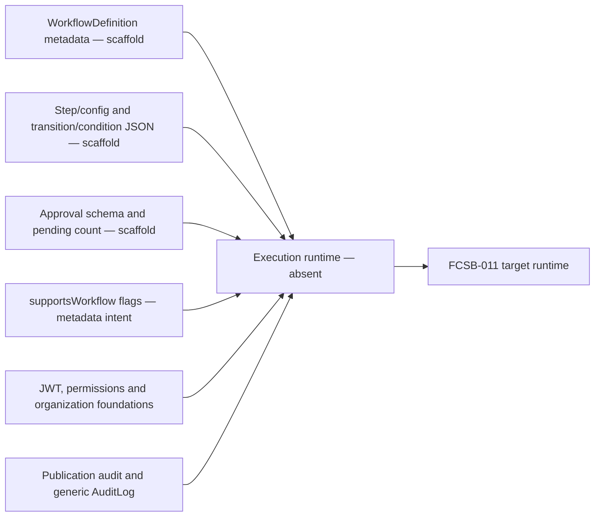

There is no `WorkflowInstance`, `TaskInstance`, execution token, variable, timer, lease, checkpoint, retry, compensation, delegation, escalation, migration or runtime-event model. No runtime controller/service, worker process, broker client, scheduler dependency, dead-letter handling or workflow monitoring route was found. Docker Compose runs PostgreSQL, API and web only. Searches found no Temporal, Camunda/Zeebe, BullMQ, RabbitMQ, Kafka or equivalent workflow infrastructure.

The organization hierarchy, user roles/permissions, company/branch defaults and `UserOrganizationAccess` are useful foundations, not a workflow assignment engine. Digital DNA supports selected objects but not workflow instances. Generic transaction/document and approval shapes lack typed domain authority and version-bound runtime behavior. The 76 declared source tests include publication immutability but no workflow execution test. All runtime behaviors below are planned unless explicitly classified otherwise.

# Chapter 5 — Target Logical Architecture

The target separates design-time governance from runtime execution. Definition governance owns draft, validation, compilation, publication and deprecation. The command layer starts and controls instances. The execution engine evaluates tokens and graph semantics. Task services manage human and automated work. Queue and scheduler deliver durable work. Persistence stores current state, checkpoints and history. Integration adapters call domains/channels. Observability provides operations and audit evidence.

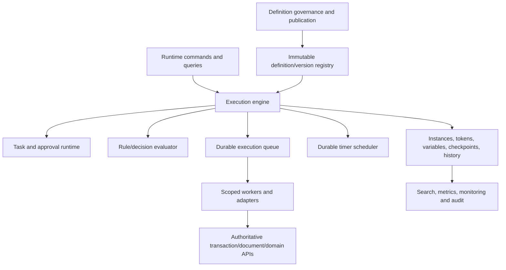

These are logical components. An initial modular implementation may use PostgreSQL-backed queues and scheduled claims if approved by workload evidence, while preserving adapter contracts for later dedicated infrastructure. Long-running work cannot depend on in-memory process state. Workers may scale independently and must be stateless between leased attempts. The engine itself remains deterministic and does not embed domain-specific posting logic.

Universal contracts define scope context, actor/service identity, correlation/causation, definition/instance/task version, idempotency, deadline, result and error. Components exchange IDs and bounded typed data, not unrestricted object graphs or secrets. Outbox/inbox patterns connect database facts with asynchronous delivery. Provider-specific delivery guarantees are translated into explicit accepted, running, completed, failed, uncertain and reconciled states.

# Chapter 6 — Definitions, Versions, and Publication

A workflow definition has stable identity, code, owner domain, enterprise object, scope policy and a series of immutable published versions. Each version includes graph nodes/edges, task schemas, variables, rules, assignments, timers, escalation, compensation, permissions, events, retention, compatibility and dependencies. Effective dates select versions for new instances; existing instances remain pinned unless migrated.

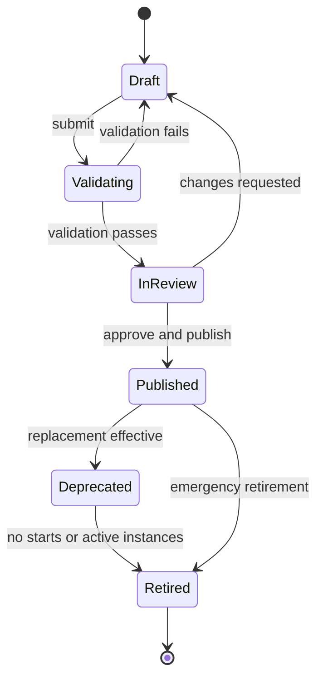

Publication validates one start contract, reachable completion/cancellation paths, gateway soundness, bounded loops, task type contracts, expression safety, assignment resolution, event schemas, timeout/escalation consistency, compensation availability, permissions, source-domain compatibility and test cases. Compilation produces a canonical executable package and digest. Dependency versions are locked. Publication records approvers and evidence.

The current definition model supplies a valuable code/version/publication/effectivity foundation but lacks executable-package identity, graph validation and most runtime contracts. Free JSON config/conditions cannot be accepted as executable without schemas and a sandboxed language. FCSB-012 will design authoring, comparison, promotion and visual Studio interaction; this volume defines only what a published package must guarantee to the runtime.

# Chapter 7 — Workflow Instance Aggregate

A workflow instance is one durable execution of one published definition version. Its header contains stable instance ID, optional Digital DNA, tenant/scope, definition/version/digest, status, business key, initiator, source references, start/end timestamps, priority, parent instance, correlation, expected version and retention class. Collections include execution tokens, task instances, variables, subscriptions, timers, incidents, migrations and history.

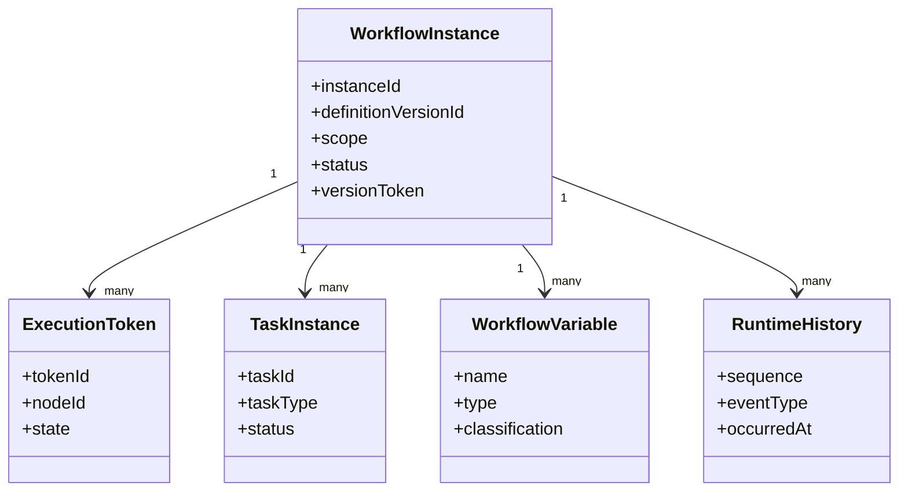

Aggregate invariants prohibit cross-tenant children, definition changes without migration, duplicate active token identity, completion with active non-detached tokens, disposal with retention/hold conflicts and state change without a monotonic version/history sequence. Starting an instance is idempotent by tenant, definition/use case and business key policy. Multiple instances for one source are allowed only when the definition declares cardinality.

Instance current state is an operational projection. History is append-only evidence of commands and results. Domain records store only stable workflow references where needed, not a copy of runtime internals. Purging or archiving workflow detail cannot delete source transactions/documents. Parent/subprocess cancellation propagation follows the published contract and preserves completed effects.

# Chapter 8 — Execution Context and Variables

Execution context combines immutable start context with versioned variables and derived runtime facts. Scope includes tenant, enterprise group/legal entity where applicable, company, branch, plant, warehouse, project and organization node. Actor context records initiator and current service/user identity. Business context uses typed source references with record version, not embedded mutable transaction payloads.

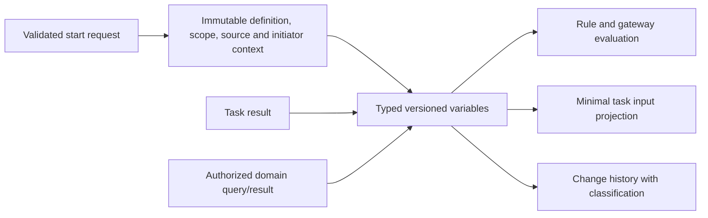

Variable definitions declare name, datatype, schema version, required/default, mutability, producer/consumer nodes, size, classification, masking, retention and whether values may appear in logs, search or events. Secrets are referenced from a secret service and never persisted as ordinary variables. Documents, files and large arrays are referenced by stable IDs. Money includes currency; quantity includes UOM; timestamps include timezone semantics.

Task completion validates output schema and expected instance/task versions. Writes are atomic with transition history. Conflicting parallel writes require an explicit merge policy; last-write-wins is prohibited for business decisions. Derived values record rule or service provenance. Variables do not become authoritative transaction state: an approved domain command returns a domain identity/version, and later workflow steps re-read permitted facts when freshness matters.

# Chapter 9 — Workflow State Machine

Workflow state describes coordination availability, not business outcome. Core states are Starting, Running, Waiting, Suspended, Cancelling, Compensating, Completed, Cancelled, Failed and Archived. Incidents annotate failures requiring intervention. A workflow can wait for tasks, timers, messages or child instances while remaining healthy. Terminal completion occurs only when graph tokens and required completion conditions are satisfied.

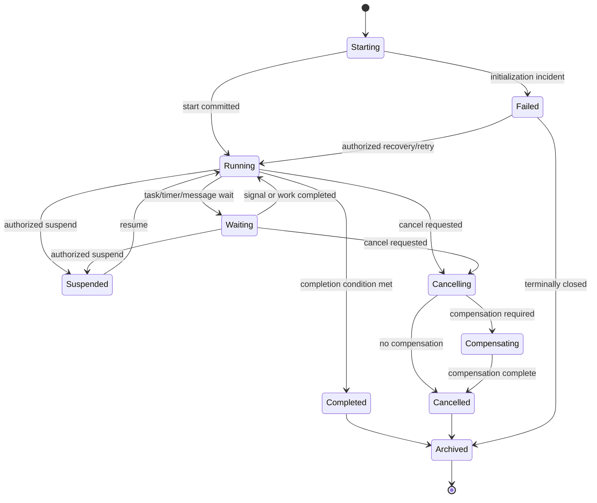

## Workflow state transition table

| From | Command/event | Guard | To | Required evidence |
|---|---|---|---|---|
| Starting | Initialize | Published/effective definition and valid scope | Running/Waiting | Start idempotency and context snapshot |
| Running | Create wait | Durable task/timer/subscription persisted | Waiting | Token and checkpoint |
| Waiting | Receive completion | Correlation, authorization and expected version valid | Running | Result/event identity |
| Running/Waiting | Suspend | Permission and non-terminal state | Suspended | Reason and actor |
| Suspended | Resume | Blockers resolved and permission valid | Running/Waiting | Resume checkpoint |
| Running/Waiting | Cancel | Cancellation policy permits | Cancelling | Reason and source impact |
| Cancelling | Compensate | Completed compensable effects exist | Compensating | Compensation plan |
| Running | Finish | No required active tokens/tasks | Completed | Completion summary |
| Terminal | Archive | Retention/archive policy permits | Archived | Archive manifest |

# Chapter 10 — Unified Task Model

Every unit of work is a task instance with type, definition node, input schema/version, status, eligible population or service identity, assignee/claim, priority, due/expiry time, attempt, lease/fencing token, idempotency key, output/error, source references and history. Task types share lifecycle semantics but apply specialized guards. Manual and approval tasks await people; service and AI tasks execute workers; notifications produce delivery outcomes; timers/escalations activate at scheduled instants.

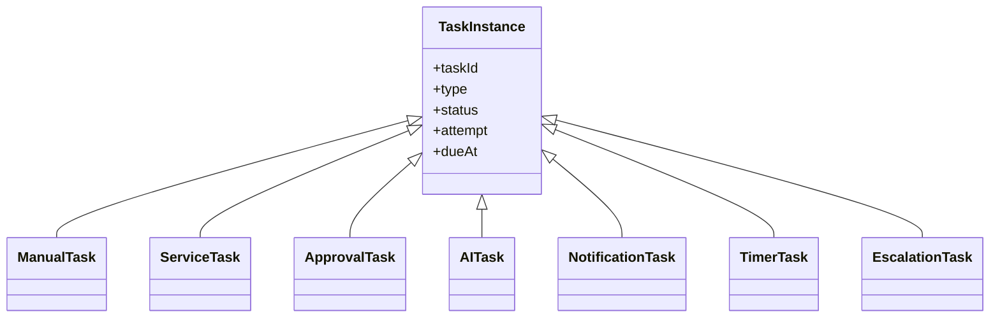

Task creation and token wait commit atomically. Completion is idempotent and checks task/instance state, claim/lease, permission, input binding and output schema. A stale completion returns its prior outcome or conflict; it never advances twice. Cancellation marks remaining work and invokes provider cancellation only when supported. Late callbacks are retained as ignored/reconciled history.

## Task state transition table

| From | Action | To | Guard |
|---|---|---|---|
| Created | Offer/enqueue/schedule | Ready/Scheduled | Assignment or execution contract valid |
| Ready | Claim/lease | Claimed/Running | Actor/worker eligible and token current |
| Claimed | Start | Running | Claim unexpired |
| Running | Complete | Completed | Output valid and idempotency current |
| Running | Retryable failure | RetryWaiting | Attempt policy permits |
| RetryWaiting | Due | Ready | Backoff elapsed |
| Any nonterminal | Cancel | Cancelled | Workflow/task cancellation policy |
| Ready/Claimed | Expire | TimedOut | Deadline reached and fencing succeeds |
| Failed/TimedOut | Escalate/reassign | Ready/Escalated | Published policy and SoD pass |

# Chapter 11 — Manual Tasks and Work Queues

Manual tasks represent human work other than a formal approval decision: review, data correction, investigation, inspection, reconciliation or physical confirmation. A definition declares candidate roles/groups, organization relationship, skills, location, workload policy, due calendar, form/schema, instructions, evidence requirements and completion outcomes. Assignment is resolved from current authorized identities within the instance scope.

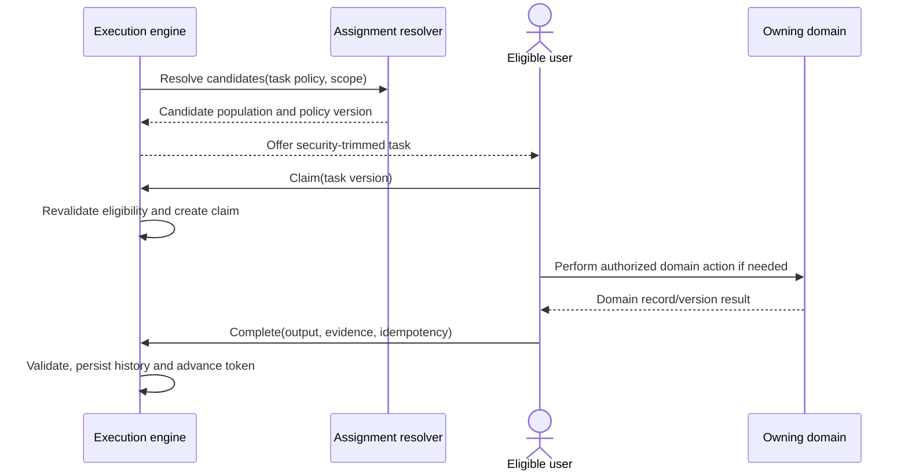

Candidate lists are not disclosure channels; title, source summary and variables are filtered to what each candidate may see. Claiming does not grant domain access. Exclusive claim, pooled work, push assignment and round-robin are policies. Stealing an active claim requires timeout or authorized reassignment. Offline work must use bounded task packages and conflict checks; full offline runtime belongs to FCSB-022.

Manual completion may require comment, reason, structured fields, document evidence or domain command result. “Complete” cannot directly set transaction status through arbitrary variables. The engine records actor, eligibility policy, claim, form version and output. Work queues support filters and priorities but recompute permission at retrieval and action time.

# Chapter 12 — Automatic and Service Tasks

Automatic tasks perform deterministic engine-local operations such as safe variable transformation or routing preparation. Service tasks call an approved domain or integration capability. A service-task contract specifies adapter, operation/version, input/output schemas, service identity, authorization scope, timeout, idempotency, retry classification, circuit policy, compensation reference and data classification. Arbitrary URLs or scripts are prohibited.

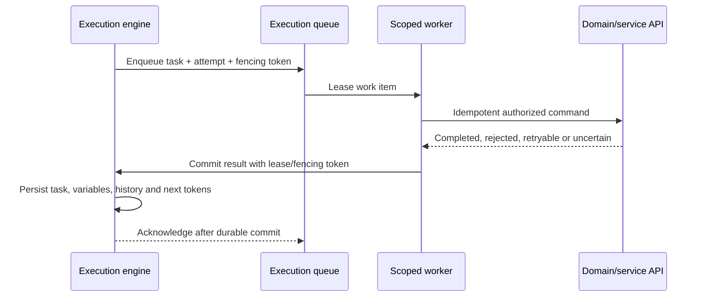

Workers never receive unrestricted user tokens, database credentials or whole workflow context. A workload identity obtains the minimum domain permission and tenant/scope grant. The domain revalidates business rules and source version. A timeout is an unknown outcome unless the target proves no effect; reconciliation precedes retry where duplicate effects would matter.

Automatic calculations use a sandboxed published function set and cannot read clocks, random values or networks unless those values are explicit inputs. Service failures map to typed retryable, business-rejected, unauthorized, conflict, unavailable, uncertain or terminal categories. Business rejection follows a modeled branch; infrastructure failure follows retry/incident policy. Service responses are bounded and sensitive fields masked.

# Chapter 13 — AI Tasks and Human-in-the-Loop

An AI task may classify, extract, summarize, recommend, translate, rank or draft within an approved use case. Its definition pins purpose, model gateway/profile, input document/data references, retrieval policy, output schema, confidence/evaluation, timeout, review rule, retention and prohibited actions. Input retrieval uses the instance actor/task purpose and tenant scope; the AI task gains no ambient access.

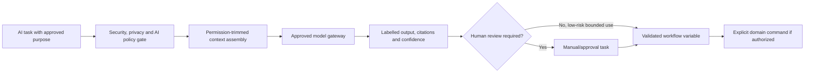

Prompt injection in source documents is untrusted data. Tool calls use allow lists and separate authorization. AI output cannot directly approve, sign, post, release stock, dispose records, cancel controls or change permissions. An AI recommendation may accompany an approval, but a named human owns the decision. The decision record distinguishes recommendation, reviewer reasoning and final action.

Retries may produce different AI output, so each attempt records model/profile, policy, input references, parameters class and output identity. Deterministic claims are not made where the provider cannot guarantee them. Low confidence, missing citation, out-of-distribution input or policy failure routes to human handling. FCSB-008 governs broader AI trust; no current AI workflow runtime exists.

# Chapter 14 — Notification Tasks and Channel Delivery

Notification tasks request delivery through governed channel adapters: in-application inbox, email, SMS, Microsoft Teams, WhatsApp or future channels. The task declares message template/version, recipients by role/party/reference, classification, locale, urgency, expiry and whether acknowledgement matters. It never embeds secrets or unrestricted workflow variables.

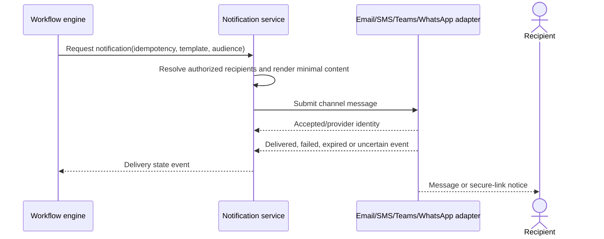

Provider acceptance is not recipient delivery, and delivery is not task/approval completion. A notification may create a separate acknowledgement task if business policy requires. Secure content uses authenticated links from the document framework rather than sensitive SMS or chat bodies. Recipient resolution is snapshotted for evidence but current authorization is checked at content access.

Retries reuse idempotency and channel/provider message identity. Failover across channels is explicit to avoid duplicate or contradictory notices. Opt-out, quiet hours, regional restrictions, emergency overrides, bounce/complaint and address hygiene are channel policies. Current repository has no notification module or email/SMS/Teams/WhatsApp adapters; all are planned.

# Chapter 15 — Timer Tasks and Durable Scheduler

Timers model an absolute instant, duration, business-calendar deadline, recurring schedule or event-relative timeout. On activation, the engine persists a timer with tenant, instance/task/token, due instant, timezone/calendar version, purpose, priority and fencing state. A scheduler claims due timers in bounded batches and emits idempotent timer-fired commands. In-memory timers are never authoritative.

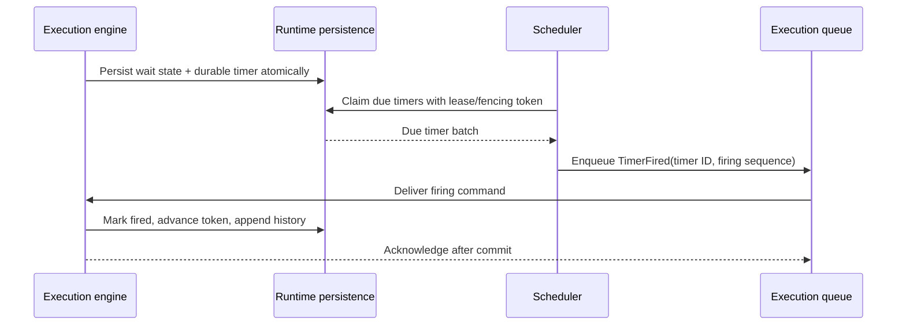

Business calendars are versioned and declare working days, holidays, shifts and timezone. The instance records which calendar version computed the due time; later calendar changes do not silently move existing deadlines unless a controlled recalculation policy says so. Daylight-saving ambiguity and missed-time behavior are explicit. Recurrence stores each firing identity and next calculation.

Clock skew, scheduler failover and duplicate scans are tolerated through database time, leases and unique firing sequences. A delayed firing is recorded with scheduled and actual time. Large catch-up backlogs are throttled by tenant and urgency. Cancellation/suspension marks timer disposition atomically. No scheduler, timer table or scheduled worker exists currently.

# Chapter 16 — Graph, Conditions, and Routing

The executable graph contains start, task, gateway, event, subprocess and end nodes connected by typed flows. A token arrives at a node, validates preconditions, performs or creates work, then advances along eligible outgoing flows. Conditional branches evaluate a published rule against a stable variable/source snapshot. Default paths are explicit; ambiguous or zero-match outcomes follow declared behavior.

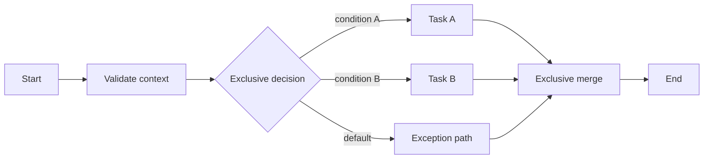

Conditions reference allow-listed typed fields. Evaluation records rule/version, input digest and result. Graph validation detects unreachable nodes, missing defaults, invalid cycles, illegal crossing of subprocess boundaries and incompatible joins. Conditions are not database queries or code snippets. A route that depends on current domain state uses an authorized service/rule task to obtain a versioned fact.

Multiple outgoing flows from a task require explicit gateway semantics rather than accidental fan-out. Merges never discard active tokens. End nodes specify ordinary completion, cancellation, error or terminate semantics. Terminate is highly restricted because it may cancel sibling tokens and tasks; it cannot undo domain effects.

# Chapter 17 — Gateways, Forks, Merges, and Parallelism

An exclusive gateway selects exactly one branch. An inclusive gateway selects one or more branches and waits only for those activated at the paired join. A parallel fork activates every branch and its join waits for all required tokens. An event gateway subscribes to competing messages/timers and consumes the first valid winner while cancelling remaining subscriptions. Gateway identity and pairing are compiled.

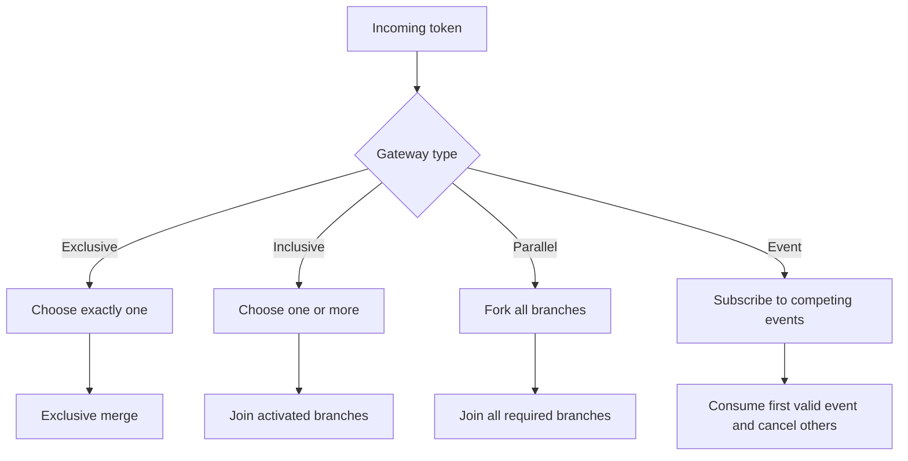

Parallel tasks have independent identities, claims and retries. A join stores arrival sets transactionally and advances once using fencing. Inclusive joins use activation lineage rather than guessing from current graph state. Event subscriptions are durable and correlation-scoped. Late events are ignored/reconciled in history; they do not reopen the path.

Parallel variable updates require declared aggregation: append with unique item identity, sum under typed units, unanimous value, first-success, all-results or custom approved merge. Shared mutable objects are prohibited. Cancellation and failure propagation specify fail-fast, wait-all, best-effort or compensating behavior. Runtime limits cap fan-out and active tokens to prevent accidental explosions.

# Chapter 18 — Loops, Retries, and Deadlock Prevention

Loops model repeated business work and declare entry condition, continuation/exit rule, maximum iteration, time budget, variable scope and optional delay. Multi-instance tasks declare collection identity, parallelism limit, completion threshold and result aggregation. Unbounded cycles fail publication unless an external cancellation/timeout and exceptional approval justify them.

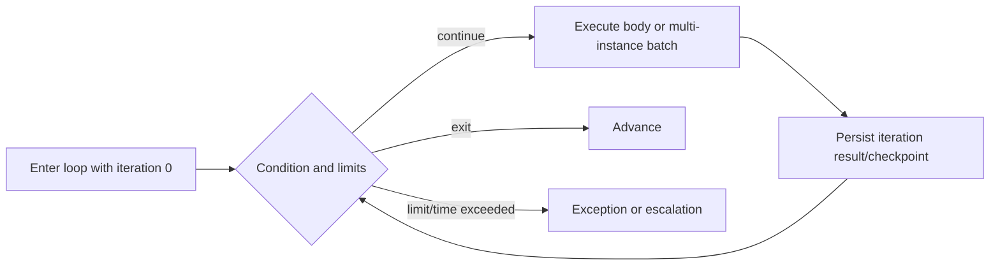

Task retry is not a graph loop. Retry repeats one failed attempt with the same logical task/idempotency contract and configured exponential/jittered backoff. Business rework is a modeled loop with new decision/evidence. Attempts are capped and categorized. A non-idempotent uncertain result enters reconciliation rather than blind retry.

Deadlock prevention combines graph soundness, ordered resource acquisition, short database transactions, optimistic concurrency, lease expiry, join diagnostics and watchdogs. Workers never hold database locks while calling external services. Instance updates use expected version and retry bounded conflicts. A stuck detector identifies tokens with no eligible work, unsatisfied joins, expired leases or missing subscriptions and raises an incident; it does not auto-skip controls.

# Chapter 19 — Subprocesses and Reusable Workflow Calls

An embedded subprocess scopes nodes and variables inside the same instance. A called workflow starts a child instance pinned to its own published definition version. The call contract maps typed inputs/outputs, scope, correlation, cancellation, error and compensation behavior. Reuse is through approved interfaces, not copying mutable node fragments.

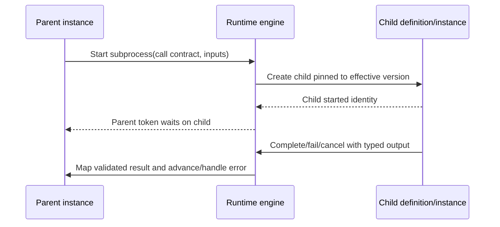

Child scope may be equal to or narrower than the parent; widening tenant or organizational access is prohibited. A cross-company orchestration uses explicit authorized domain integration, not inherited ambient scope. Parent suspension/cancellation propagation is configured. Detached children are exceptional and remain independently traceable.

Subprocess versions evolve independently. A parent package locks a compatible child contract range or exact version according to governance. Runtime selection is recorded. Recursive calls require a proven bound. Child history remains separate but linked by correlation and causation. Compensation can call a dedicated child workflow only with explicit effect references and idempotency.

# Chapter 20 — Execution Engine, Queue, and Workers

The execution engine applies one deterministic command to one expected aggregate version. It loads the instance and compiled definition, validates scope and command, advances tokens, creates tasks/timers/events, appends history and persists outbox messages atomically. It performs no long external call inside that transaction. Workers consume queued work and report typed outcomes.

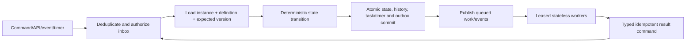

Queue items contain minimal references, attempt, due time, priority, tenant partition and fencing token. Claiming creates a lease; heartbeat extends within limits. Completion after lease loss is rejected or reconciled. Fairness prevents one tenant or high-fan-out instance from starving others. Dead letters are incidents with replay controls, not permanent data dumps.

Queue technology remains open. A database-backed implementation may be adequate initially but must demonstrate locking, polling load, visibility, recovery and scale. A broker-backed implementation must demonstrate ordering assumptions, deduplication and transaction boundaries. Workers are specialized by task adapter and deployment trust. Future distributed execution and clustering cannot change observable workflow semantics.

# Chapter 21 — Persistence, Checkpoints, Locking, and Concurrency

Runtime persistence stores instance headers, tokens, tasks, variables, timers, subscriptions, incidents, migration records, history and inbox/outbox facts. Relational constraints enforce tenant ownership, unique idempotency, monotonic history sequence and single active firing/claim where required. Current-state rows are optimized projections; append-only history supports explanation and rebuild within declared limits.

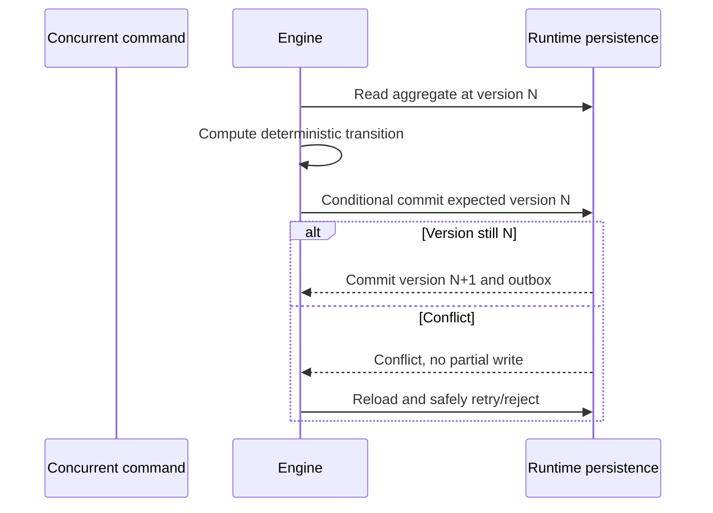

A checkpoint is a consistent boundary containing current token/task/timer state, variable versions, definition digest and last history sequence. Checkpoints occur after each engine transition and before acknowledging external delivery. Long tasks checkpoint only runtime wait state; domain work has its own transaction. Snapshots may accelerate archive/replay but never replace history required by policy.

Optimistic concurrency is default at instance level. Fine-grained token/task concurrency may be introduced only with invariant proof. Database locks are short and acquired in stable order. Leases use database time and fencing tokens. Duplicate callbacks are deduplicated by provider/event identity plus logical operation. Deadlock victims retry with jitter; repeated conflict becomes an incident. No current schema provides these runtime persistence constructs.

# Chapter 22 — Recovery, Resume, Restart, and Retry

Recovery begins from durable state, never guessed process memory. After worker or host failure, expired leases make tasks reclaimable. Inbox/outbox replay redelivers facts idempotently. Timer scans recover missed due work. Reconciliation compares runtime state with domain/provider outcomes for uncertain operations. An operator sees exact last checkpoint, active tokens, pending work, attempts and incidents.

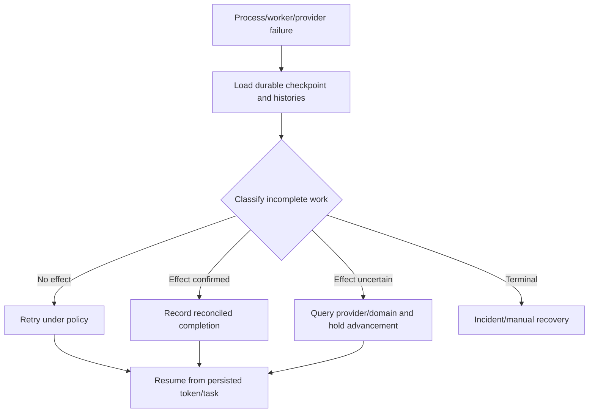

Resume continues a suspended/waiting instance from its checkpoint. Retry repeats a task attempt. Restart creates a new instance linked to the prior terminal/cancelled instance, optionally importing approved start context; it does not reset history. Recovery may inject a validated missing event, requeue a task, correct bounded metadata or execute an approved migration. Direct database edits are prohibited.

Recovery commands require elevated permission, reason, expected version, impact preview and audit. Four-eyes approval applies to high-risk financial, security or compliance workflows. Runbooks define lost queue message, duplicate delivery, stale lease, orphan timer, corrupt variable, unavailable definition package, provider uncertainty and domain conflict. Recovery tests intentionally terminate processes at every commit boundary.

# Chapter 23 — Suspension, Cancellation, Completion, and Archive

Suspension prevents new token advancement and task leasing while preserving state. Policy decides whether already running external work may finish and whether timers pause, continue or convert to remaining duration. Cancellation requests coordinated shutdown: cancel pending tasks/subscriptions/timers, wait or fence running work, then compensate declared effects if required. It cannot erase a posted journal, stock movement, sent email or signed document.

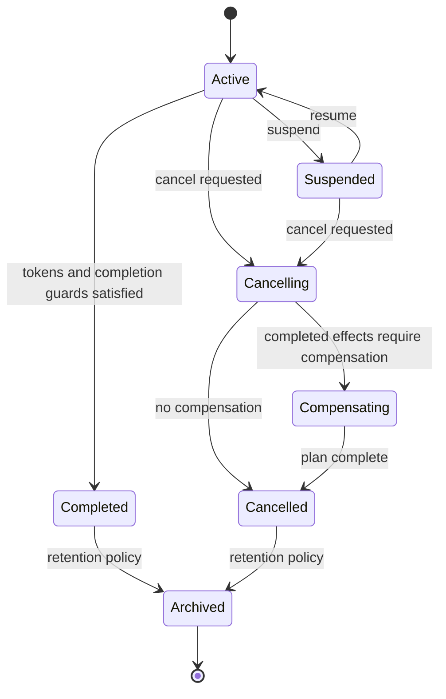

Completion records result status, source references/versions, final variables allowed by retention, child outcomes and unresolved nonblocking deliveries. Definitions may distinguish Completed, CompletedWithWarnings and BusinessRejected, but not hide failed required tasks. A workflow completion event is coordination evidence; consumers revalidate domain authority.

Archive removes active operational projections from hot paths only after history/checkpoint integrity and retention policy pass. Search retains permitted summary; detailed restore follows authorized records operations. Restart from archive creates a linked new instance. Workflow history, audit and domain records have separately governed retention. Legal hold on related documents or transactions may require preserving workflow evidence.

# Chapter 24 — Exceptions, Rollback, and Compensation

Exceptions are typed: business rejection, validation failure, authorization failure, concurrency conflict, dependency unavailable, timeout, uncertain external result, technical defect or policy violation. Definitions declare catch scopes and handler routes. Uncaught exceptions create incidents and suspend affected tokens; they do not silently choose a default branch.

```mermaid
flowchart LR
  WORK["Completed business steps A, B, C"] --> ERROR["Later failure/cancel"]
  ERROR --> PLAN["Resolve published compensation plan"]
  PLAN --> C3["Compensate C through owning domain"]
  C3 --> C2["Compensate B"]
  C2 --> C1["Compensate A if required"]
  C1 --> VERIFY["Verify compensating effect identities"]
  VERIFY --> END["Cancelled/failed with preserved histories"]
```

Database rollback applies only within one short runtime transaction before external effects. Business compensation is a new domain action such as reversal, release, cancellation request or correcting transaction. It requires explicit effect identity, domain permission, idempotency and potentially approval. The workflow cannot fabricate inverse accounting or inventory entries. Compensation failure becomes a high-priority incident and preserves partial outcomes.

Exception handlers may retry, route to manual investigation, escalate, compensate, cancel child work or terminate under policy. Error variables are structured and sanitized. Stack traces and secrets never enter business history. Operators cannot mark an uncertain effect successful without evidence. Compensation ordering follows dependency declarations rather than assumed reverse node order when parallel effects exist.

# Chapter 25 — Business Rules and Decision Tables

The business-rule layer evaluates conditions, expressions, decision tables, policies, validations, preconditions, postconditions and execution guards. Rules are versioned, typed, effective-dated and side-effect-free. They consume declared variables and authorized fact snapshots. Results include rule/version, input digest, matched rows, output and diagnostics. A rule never writes a transaction or sends a message.

```mermaid
flowchart TB
  INPUT["Typed variables and versioned domain facts"] --> PRE["Preconditions and validation rules"]
  PRE --> EXPR["Sandboxed conditions/expressions"]
  EXPR --> TABLE["Versioned decision table/policy"]
  TABLE --> GUARD{"Execution guard result"}
  GUARD -- "permit" --> ACTION["Create task or invoke authorized command"]
  GUARD -- "deny/route" --> ALT["Modeled rejection or alternative path"]
  ACTION --> POST["Postcondition against returned result"]
```

Expression language permits comparison, boolean logic, bounded collection operations, dates, money and UOM through approved functions. It forbids arbitrary code, database/network access, filesystem, reflection, nondeterministic clock/random and secrets. Time is supplied as a recorded evaluation input. Null, precision, locale and timezone semantics are explicit.

Decision tables declare hit policy: unique, first, priority, any, collect or aggregate. Overlap/gap analysis and golden cases are publication gates. Domain policies remain authoritative; workflow rules may decide routing or invoke a domain validation API, not replicate tax/posting logic. Rule changes create a new workflow/package dependency. FCSB-012 will define authoring UX, not these runtime guarantees.

# Chapter 26 — Approval Runtime and Decision Semantics

An approval task binds exact subject identity/version, decision policy, eligible approvers, assignment snapshot, quorum method, due/escalation policy, evidence requirements, SoD constraints and optional signature profile. Decisions are Approve, Reject, Abstain, RequestChanges or Cancel as the policy permits. A material source change invalidates or supersedes pending/approved decisions.

```mermaid
flowchart TB
  REQ["Version-bound approval request"] --> MODE{"Approval mode"}
  MODE --> SEQ["Sequential levels"]
  MODE --> PAR["Parallel all/quorum"]
  MODE --> MAJ["Majority"]
  MODE --> WEI["Weighted threshold"]
  MODE --> CON["Consensus"]
  MODE --> DYN["Dynamic policy-resolved"]
  SEQ --> DECIDE["Final governed decision"]
  PAR --> DECIDE
  MAJ --> DECIDE
  WEI --> DECIDE
  CON --> DECIDE
  DYN --> DECIDE
  DECIDE --> DOMAIN["Owning domain revalidates and applies separate action"]
```

Sequential approval activates the next level only after the prior level succeeds. Parallel all requires every required seat. Majority counts eligible cast votes under a tie rule. Weighted approval sums approved weights under a fixed denominator and conflict policy. Consensus requires all non-abstaining required participants or explicit unanimity. Dynamic approval resolves policy inputs at request creation and records the resolved plan.

Approval never posts or releases automatically unless a separately authorized domain task follows and revalidates. AI recommendation is evidence, not a vote. Digital signature is an optional separate attestation handled through FCSB-010. Current `ApprovalRule/Step/Request/History` offers a simple schema scaffold but not this engine.

## Approval method matrix

| Method | Completion rule | Suitable pattern | Mandatory safeguards |
|---|---|---|---|
| Sequential | Ordered required levels approve | Hierarchical/financial thresholds | No skipped level; stale-version invalidation |
| Parallel all | Every required seat approves | Cross-functional control | Independent seats and timeout handling |
| Majority | Approvals exceed defined vote threshold | Committee decision | Fixed electorate, tie/abstention rule |
| Weighted | Approved weight reaches threshold | Risk/ownership weighting | Immutable weights and denominator |
| Consensus | Required participants agree | High-impact policy/change | Explicit dissent and no silent default |
| Dynamic | Published rule resolves one above plan | Amount/risk/region-sensitive | Input snapshot and resolved-plan audit |

# Chapter 27 — Approver Resolution and Dynamic Assignment

Approver resolution supports named user, role, group, organization hierarchy, position/manager chain, financial authority, domain ownership and rule-selected candidates. Resolution receives tenant/scope, subject, amount/risk/category, initiator and effective time. It returns seats, candidate populations, weights, required order and policy version. A seat represents a control responsibility, not merely a person.

```mermaid
flowchart LR
  POLICY["Published approval assignment policy"] --> INPUT["Scope, subject, amount/risk and initiator"]
  INPUT --> RESOLVE["Resolve role/group/hierarchy/financial authority"]
  RESOLVE --> SOD["Remove conflicts and enforce independence"]
  SOD --> PLAN["Immutable approval-seat plan"]
  PLAN --> OFFER["Security-trimmed task offers"]
  OFFER --> CLAIM["Revalidate eligibility at decision"]
```

Hierarchy approval follows effective-dated organization/management relations and defines how far to climb, what happens at vacancy and whether the initiator chain is excluded. Financial authority uses approved currency conversion date/rate policy and cumulative exposure when required. Role/group approval records the resolved membership snapshot while eligibility is checked again when acting. Dynamic conditions cannot resolve an empty plan silently.

The current organization hierarchy and normalized role/permission models are foundations. They do not implement manager positions, approval authority limits or seat resolution. Legacy enum roles on `ApprovalStep` cannot express tenant-defined assignments. Implementation must define effective identity sources, vacancies, contractors, cross-company authority and deterministic fallback without granting super-admin as an automatic business approver.

# Chapter 28 — Delegation, Proxy, Vacation, and Reassignment

Delegation grants a bounded person authority to act for another for specified approval/task types, scope, amount/risk, dates and reason. Proxy may act as the principal in a defined operational context and requires stronger visibility. Vacation rules activate planned delegation. Reassignment transfers an individual task by policy or authorized intervention. None may bypass SoD or increase the principal's authority.

```mermaid
sequenceDiagram
  actor P as Principal
  participant G as Delegation governance
  actor D as Delegate/proxy
  participant W as Workflow runtime
  P->>G: Request bounded delegation(window, scope, authority)
  G->>G: Approve and conflict-check
  G-->>W: Effective delegation identity
  W-->>D: Offer eligible task with represented principal
  D->>W: Decide/complete as delegate
  W->>W: Revalidate both authorities and record representation
```

Delegation records principal, delegate, type, scope, validity, authority cap, exclusions, approval and revocation. At action time both principal authority at assignment and delegate identity/permission are evaluated under policy. The decision history names both. A delegate cannot redelegate unless expressly allowed. Self-delegation and circular chains fail.

Reassignment can result from workload, vacancy, loss of access, timeout or operator action. It preserves prior offers/claims and reason. In-flight form edits require conflict handling. Vacation expiry returns future tasks, not completed decisions. Emergency reassignment requires dual control for high-risk work. No delegation/proxy/vacation runtime exists today.

# Chapter 29 — Reminder, Escalation, Timeout, and Emergency Approval

Escalation policy attaches to a task/approval seat and uses versioned business calendars. Actions may remind, notify manager, add candidates, reassign, increase priority, activate a fallback seat, create an incident or terminate/reject under explicit legal/business policy. Silence never means approval. Timer firing and policy action are separate history events.

```mermaid
flowchart LR
  READY["Task ready at T0"] --> REM1["Reminder at due-offset"]
  REM1 --> DUE{"Completed by due time?"}
  DUE -- "Yes" --> END["Close escalation timers"]
  DUE -- "No" --> ESC1["Escalate/notify/reassign"]
  ESC1 --> TIMEOUT{"Hard timeout reached?"}
  TIMEOUT -- "No" --> WAIT["Continue under escalated policy"]
  TIMEOUT -- "Yes" --> EX["Business rejection, incident or emergency path"]
```

## Escalation matrix

| Trigger | Allowed action | Prohibited shortcut | Evidence |
|---|---|---|---|
| Reminder threshold | Notify current assignee/candidates | Auto-approve | Timer and delivery outcome |
| Due time missed | Manager notification or bounded reassignment | Broaden tenant/company scope | Original/new assignment and reason |
| Hard timeout | Reject, incident or modeled alternative | Silent completion | Published timeout rule |
| Approver unavailable | Activate approved delegate/fallback seat | Super-admin default approval | Availability and resolution evidence |
| Repeated service failure | Incident/circuit route | Infinite retry | Attempts and dependency state |
| Emergency business condition | Emergency approval path | Remove SoD/signature requirements silently | Emergency authority, reason and review |

Emergency approval is a distinct high-risk policy with eligible authority, shortened quorum only where legally/business-approved, mandatory reason, bounded scope, enhanced audit and retrospective review. It cannot legalize a prohibited action. Reminders and channel failures do not alter decision state. Current runtime has no timers, reminders or escalations.

# Chapter 30 — Authorization, Security, SoD, and Isolation

Workflow permissions distinguish definition view/create/edit/validate/publish, instance start/view/suspend/resume/cancel/migrate/recover/archive, task view/claim/complete/reassign, approval decide/delegate/emergency, incident operate and monitoring access. Permission is combined with tenant, organization, company, branch, plant, warehouse, project, object/record, task assignment, classification and action purpose.

```mermaid
flowchart TB
  REQ["Workflow/task/approval action"] --> TEN{"Tenant match?"}
  TEN -- "No" --> DENY["Deny and audit"]
  TEN -- "Yes" --> SCOPE{"Organization/company/branch/plant/warehouse/project scope?"}
  SCOPE -- "No" --> DENY
  SCOPE -- "Yes" --> PERM{"Action permission and assignment?"}
  PERM -- "No" --> DENY
  PERM -- "Yes" --> SOD{"SoD/conflict/authority valid?"}
  SOD -- "No" --> DENY
  SOD -- "Yes" --> VER{"Expected source/task/instance version?"}
  VER -- "No" --> DENY
  VER -- "Yes" --> ALLOW["Execute bounded action"]
```

SoD rules address requester/approver, creator/releaser, preparer/poster, administrator/business approver, developer/publisher, delegate/principal conflicts and conflicting approval seats. They evaluate direct and delegated roles, group memberships, prior actions and subject ownership. A workflow administrator can recover coordination but cannot approve a business decision by virtue of administration.

Service identities are task-specific, short-lived and least-privileged. Variables/events/logs exclude secrets and minimize sensitive data. Tenant partitions extend to database rows, queues, timers, caches, indexes, metrics labels and worker workspaces. Cross-tenant references are rejected. Current JWT refreshes active user roles/permissions per request and is a foundation; document/transaction/task-level policies remain planned.

# Chapter 31 — Universal Transaction Framework Integration

FCSB-009 owns transaction identity, versions, lifecycle, commands, effects, posting, correction and reversal. Workflow starts from or references an exact transaction identity/version and may coordinate validation, approval, fulfilment or exception handling. It invokes typed domain commands and stores returned effect identities. It never updates generic status, payload, amount or posting tables directly.

```mermaid
sequenceDiagram
  actor U as Authorized initiator
  participant T as Transaction domain
  participant W as Workflow runtime
  participant A as Approval runtime
  U->>T: Create/change transaction
  T->>W: Start workflow(transaction ID/version, idempotency)
  W->>A: Create version-bound approval task
  A-->>W: Approved decision evidence
  W->>T: Request release/post/action(expected transaction version)
  T->>T: Revalidate authority, readiness, SoD and business rules
  T-->>W: Domain result identity/version
  W-->>T: Workflow completion reference
```

A material transaction edit emits a version change that may invalidate pending approvals or route to reapproval. Approval does not post. Posting rechecks approval evidence, period, source coverage and expected version. Cancellation of workflow after domain effects requests domain compensation/reversal under FCSB-009. Domain rejection is a business outcome branch, not an engine fault.

Correlation cardinality is declared: one instance per transaction lifecycle, one per approval cycle or multiple subprocess instances. Current `TransactionDocument` and approval schema are scaffolds and lack typed domain behavior. Workflow implementation must not entrench them as universal authority merely because they exist.

# Chapter 32 — Universal Document Framework and Signature Integration

FCSB-010 owns document identity, immutable content versions, renditions, custody, retention and signature evidence. Workflow may request generation, review, approval, signature, delivery, archive or disposition through document APIs. A document task references the exact version/digest. New content invalidates a pending approval/signature step according to policy.

```mermaid
sequenceDiagram
  participant W as Workflow runtime
  participant D as Document framework
  actor A as Approver/signer
  participant S as Signature provider
  W->>D: Lock/read immutable document version and digest
  D-->>W: Version context and authorized rendition
  W-->>A: Present exact version and decision intent
  A->>W: Approve or initiate signature
  W->>S: Sign digest/context under approved profile
  S-->>D: Detached signature evidence
  D-->>W: Signed-version relationship and validation result
  W->>W: Complete approval/signature task without mutating content
```

Approval and digital signature remain separate task/results. A signature image is not signature evidence. Workflow records the document/signature identities and provider outcome, while document custody stores the evidence. Watermarked/translated/generated derivatives have separate identities. Workflow cancellation cannot delete a signed or retained document.

Document rendering, email and print may be long-running service tasks with accepted/delivered/uncertain states. Their provider outcome does not prove business approval. The current repository has no document runtime or signature engine; integration remains planned and depends on FCSB-010 implementation.

# Chapter 33 — Knowledge Graph and Governed AI Integration

FCSB-008 governs semantic identity, provenance, permission-aware retrieval, model access and human accountability. Workflow events and histories can contribute governed relationships such as instance-coordinates-object, task-decided-version and approval-supported-action, but the graph is a projection, not runtime authority. Graph unavailability must not corrupt execution state.

```mermaid
flowchart LR
  WF["Workflow instance/task/history"] --> EVENT["Minimized governed events"]
  EVENT --> FKG["Knowledge graph projection"]
  FKG --> RETRIEVE["Permission-aware contextual retrieval"]
  RETRIEVE --> AI["Approved AI task/recommendation"]
  AI --> REVIEW["Human/policy review"]
  REVIEW --> WF
  WF --> SOURCE["Authoritative transaction/document/domain"]
  FKG -. "explains and relates, never controls" .-> SOURCE
```

Semantic references use stable identities and version/effectivity. Retrieval filters tenant, organization, object and classification before context assembly. AI tasks retain citations to exact records/documents and model/policy versions. Knowledge-derived suggestions may choose a candidate route only through an approved rule/human decision; hidden graph inference cannot approve or post.

Workflow history may be too sensitive for unrestricted analytical ingestion. Event schemas minimize variables, mask decisions where required and preserve purpose/retention. The current repository has no knowledge graph or AI runtime, so these integrations are future/planned boundaries rather than present capabilities.

# Chapter 34 — External Integration and Channel Architecture

External interaction supports REST APIs, signed webhooks, queues/events, partner callbacks and notification adapters for email, SMS, Teams and WhatsApp. An integration task references a registered connector/operation, contract version, credentials alias, tenant/scope, timeout, retry/reconciliation and compensation policy. User-supplied endpoints or credentials are not executable workflow configuration.

```mermaid
flowchart TB
  WF["Workflow runtime"] --> REST["Registered REST adapter"]
  WF --> EVT["Queue/event adapter"]
  WF --> HOOK["Signed webhook subscription/callback"]
  WF --> NOTIFY["Notification service"]
  NOTIFY --> EMAIL["Email"]
  NOTIFY --> SMS["SMS"]
  NOTIFY --> TEAMS["Microsoft Teams"]
  NOTIFY --> WA["WhatsApp"]
  REST --> EXT["External systems"]
  EVT --> EXT
  HOOK --> EXT
```

Outbound requests use service identity, mTLS/OAuth/signature as approved, idempotency and correlation. Webhooks are signed, timestamped, replay-protected and schema-validated. Inbound callbacks resolve one tenant/instance/task subscription and cannot inject arbitrary variables. Queues/events assume duplicates and possible reordering; inbox processing records source event identity.

Data minimization and channel classification control payloads. WhatsApp, SMS and Teams availability, residency, consent and retention vary by tenant/region and require provider approval. External outages use circuit breaking and incidents. Unknown outcomes reconcile before retry. No connector, webhook, broker or messaging-channel workflow runtime is evidenced today.

# Chapter 35 — Workflow APIs, Events, and Universal Runtime Contracts

Runtime APIs separate commands from queries. Commands accept expected versions and idempotency: start, signal, suspend, resume, cancel, retry, restart, recover, migrate, claim, complete, decide, delegate, reassign and archive. Queries cover instance summary/history, tasks, approvals, incidents, search, metrics and definitions. Bulk operations are bounded and return per-item outcomes.

```mermaid
sequenceDiagram
  participant C as Authorized client/domain
  participant A as Runtime API
  participant I as Inbox/engine transaction
  participant O as Outbox
  participant X as Consumer/worker
  C->>A: Command(scope, expected version, idempotency)
  A->>I: Authenticate, authorize, deduplicate and apply
  I->>O: Persist state/history/event atomically
  I-->>A: Result or accepted operation
  A-->>C: Stable IDs and current version
  O->>X: Versioned minimized event/work item
  X-->>A: Idempotent result command
```

## Workflow API catalog

| API group | Representative operations | Required controls |
|---|---|---|
| Definitions | list/get published executable package metadata | Tenant/scope and publication visibility |
| Instances | start/get/search/suspend/resume/cancel/restart/archive | Idempotency, expected version, action permission |
| Tasks | inbox/get/claim/release/complete/fail | Assignment, source access, task version |
| Approvals | decide/abstain/request-changes/delegate/reassign | Seat eligibility, SoD, source version |
| Signals | correlate message/event/callback | Subscription, schema, replay protection |
| Operations | incidents/retry/recover/reconcile/migrate | Privileged permission, reason, dual control |
| Monitoring | health/metrics/lag/stuck summaries | Aggregation, masking, operations role |

## Workflow event catalog

| Event | Meaning | Minimum payload |
|---|---|---|
| WorkflowStarted | Instance durably initialized | IDs, definition version, scope, correlation |
| WorkflowStatusChanged | Coordination status changed | Instance/version, from/to, reason class |
| TaskCreated | Work became available/scheduled | Task/type/node, assignment-policy ID, due time |
| TaskClaimed | Eligible actor acquired claim | Task/version, actor, claim expiry |
| TaskCompleted | Valid result committed | Task/attempt, result class, output schema version |
| ApprovalDecided | One seat recorded decision | Request/seat, decision, represented principal |
| ApprovalCompleted | Quorum produced final outcome | Request/source version, method, outcome |
| TimerScheduled | Durable timer created | Timer/purpose, due/calendar version |
| TimerFired | One firing was committed | Timer/firing sequence, scheduled/actual time |
| IncidentRaised | Runtime requires intervention | Incident/category/severity, safe diagnostic |
| CompensationCompleted | Corrective domain result recorded | Step/effect/compensation identities |
| WorkflowCompleted | Completion guard satisfied | Instance/result, source references |
| WorkflowMigrated | Active state mapped to new version | From/to versions, plan and operator |
| WorkflowArchived | Active runtime moved to archive | Instance, archive manifest, retention class |

Events never contain secrets, unrestricted variables, document bodies or bearer credentials. Consumers treat them as facts about coordination, not authority to invent domain effects.

# Chapter 36 — Workflow Version Migration and Studio Boundary

New instances select the effective published version. Active instances normally finish on their pinned version. Migration is exceptional for defects, regulatory change, long-running process evolution or retired dependencies. A migration plan maps source nodes/tokens/tasks/variables/timers/subprocesses to a target definition version, declares transforms, cancelled/recreated work, approvals affected, compatibility and rollback-by-forward-plan.

```mermaid
flowchart LR
  ACTIVE["Active instance on definition v1"] --> PREVIEW["Migration impact preview"]
  PREVIEW --> VALID["Validate node/token/task/variable/timer mappings"]
  VALID --> TEST["Replay/simulation and domain compatibility tests"]
  TEST --> APPROVE["Architecture/domain/security approval"]
  APPROVE --> QUIESCE["Suspend and checkpoint instance"]
  QUIESCE --> APPLY["Atomic migration record + mapped state to v2"]
  APPLY --> VERIFY["Invariant and dependency verification"]
  VERIFY --> RESUME["Resume on v2 or incident"]
```

Migration cannot rewrite completed history or reclassify past approvals. Pending approvals become stale/recreated when semantics or source binding changes. Running service tasks must finish/reconcile or be safely fenced before migration. Timers preserve intended deadline unless the approved plan recalculates it. Batch migration uses canaries, quotas and per-instance results.

FCSB-012 FlowCraft Studio will own visual modeling, packages, comparison, validation UX, promotion and rollback governance. This volume does not design Studio. Studio must publish packages conforming to these runtime contracts; runtime never executes an editable draft. The current service versions/publishes definitions but has no migration engine or Studio compiler.

# Chapter 37 — Search, Monitoring, Metrics, Analytics, and Dashboard

Operational search locates instances/tasks/incidents by permitted IDs, status, definition, source, assignee, scope, dates and safe business keys. It is tenant- and permission-trimmed before counts/facets. Monitoring observes engine/queue/scheduler health and stuck execution. Metrics measure runtime behavior. Analytics examines process outcomes through governed projections. A dashboard combines them without becoming execution authority.

```mermaid
flowchart TB
  RUNTIME["Instances/tasks/timers/incidents/history"] --> OPS["Operational projections"]
  OPS --> SEARCH["Security-trimmed search"]
  OPS --> MON["Queue/scheduler/worker monitoring"]
  OPS --> METRIC["Latency, backlog, retry, timeout and SLA metrics"]
  OPS --> ANALYTIC["Governed process analytics"]
  SEARCH --> DASH["Role-aware workflow dashboard"]
  MON --> DASH
  METRIC --> DASH
  ANALYTIC --> DASH
```

Metrics include starts/completions/cancellations, cycle/wait/touch time, queue and timer lag, task age, claim churn, first-pass yield, retry/incident/dead-letter rates, approval duration/outcomes, escalation, compensation, service latency/errors and version adoption. Dimensions avoid high-cardinality IDs and sensitive variable values. Service-level deadlines use declared calendars and exclude/ include suspension explicitly.

Process analytics distinguish correlation from causation and workflow from domain outcome. Mining detailed paths requires privacy, retention and bias review. The current dashboard pending-approval count over generic requests is a scaffold, not workflow monitoring. No runtime search index, metrics or analytics service is evidenced.

# Chapter 38 — Operations, Distributed Execution, and Future Clustering

Operations run engine APIs, queue/scheduler, workers, persistence, definition registry, connectors and observability under explicit service objectives. Health differentiates process liveness, dependency readiness and functional probes. Capacity models instance starts, active tokens, tasks, timers, variable/history volume, fan-out, event rate and provider latency. Tenant quotas protect shared infrastructure.

```mermaid
flowchart LR
  API1["Runtime API replicas"] --> DB["Durable runtime persistence"]
  ENG1["Engine workers"] --> DB
  ENG2["Engine workers"] --> DB
  SCH1["Scheduler candidates"] --> LEADER["Leased partitions/fencing"]
  SCH2["Scheduler candidates"] --> LEADER
  LEADER --> DB
  DB --> Q["Queue adapter"]
  Q --> W1["Task worker pool A"]
  Q --> W2["Task worker pool B"]
  DB --> OBS["Monitoring, audit and recovery"]
```

Distributed execution partitions by tenant/instance while avoiding permanent hot partitions. Fencing prevents two schedulers or workers from committing the same logical result. Rolling deployment preserves event/API/package compatibility. Definition packages are cached by immutable digest. Backpressure stops starts or low-priority fan-out before persistence/queue collapse. Autoscaling reacts to lag and task class without assuming every external dependency can scale.

Backup/recovery covers runtime database, definition packages, configuration and necessary key references. Drills restore active tasks, timers, subscriptions, inbox/outbox and migration state and then reconcile external outcomes. Multi-region active/active, dedicated broker, sharding and clustering are future choices. Current Compose topology is a single PostgreSQL/API/web development baseline with no workflow worker or scheduler service.

# Chapter 39 — Capability, Risk, Examples, and Responsibility

## Workflow capability matrix

Priority expresses architectural sequence, not a delivery commitment. Current metadata and foundations are stated narrowly.

| ID | Capability | Current baseline | Target outcome | Priority |
|---|---|---|---|---|
| WFR-CAP-001 | Definition identity | Implemented metadata | Stable governed definition identity | P0 |
| WFR-CAP-002 | Definition versioning | Implemented metadata | Immutable executable versions/dependencies | P0 |
| WFR-CAP-003 | Publication/effectivity | Implemented foundation | Validated compiled publication lifecycle | P0 |
| WFR-CAP-004 | Graph validation | Not implemented | Sound reachable bounded graph | P0 |
| WFR-CAP-005 | Definition packages | Not implemented | Canonical signed/digested executable package | P0 |
| WFR-CAP-006 | Workflow instances | Not implemented | Durable version-pinned aggregate | P0 |
| WFR-CAP-007 | Execution tokens | Not implemented | Deterministic graph position/fork state | P0 |
| WFR-CAP-008 | Execution context | Not implemented | Typed scoped immutable start context | P0 |
| WFR-CAP-009 | Workflow variables | Step JSON only | Typed classified versioned variables | P0 |
| WFR-CAP-010 | Runtime history | Generic audit foundation | Append-only ordered execution history | P0 |
| WFR-CAP-011 | Manual tasks | Not implemented | Eligible claimed human work | P0 |
| WFR-CAP-012 | Automatic tasks | Not implemented | Sandboxed deterministic operation | P1 |
| WFR-CAP-013 | Service tasks | Not implemented | Authorized idempotent domain adapters | P0 |
| WFR-CAP-014 | Approval tasks | Approval schema scaffold | Version-bound governed decisions | P0 |
| WFR-CAP-015 | AI tasks | Not implemented | Labelled bounded reviewed AI work | P3 |
| WFR-CAP-016 | Notification tasks | Not implemented | Channel-independent delivery requests | P2 |
| WFR-CAP-017 | Timer tasks | Not implemented | Durable calendar-aware timers | P0 |
| WFR-CAP-018 | Escalation tasks | Not implemented | Timed policy-controlled escalation | P1 |
| WFR-CAP-019 | Task inbox | UI approvals link only | Permission-trimmed work queues | P1 |
| WFR-CAP-020 | Claim/lease | Not implemented | Fenced eligible task ownership | P0 |
| WFR-CAP-021 | Exclusive gateway | Transition conditions scaffold | Exactly-one deterministic routing | P0 |
| WFR-CAP-022 | Inclusive gateway | Not implemented | Activation-aware one-or-more routing | P1 |
| WFR-CAP-023 | Parallel fork/join | Not implemented | Token-safe concurrent paths | P0 |
| WFR-CAP-024 | Event gateway | Not implemented | Durable competing subscriptions | P1 |
| WFR-CAP-025 | Conditional branches | Condition JSON scaffold | Typed safe rule evaluation | P0 |
| WFR-CAP-026 | Loops/multi-instance | Not implemented | Bounded iterations and aggregation | P1 |
| WFR-CAP-027 | Subprocesses | Not implemented | Embedded/called versioned workflows | P1 |
| WFR-CAP-028 | Execution engine | Not implemented | Deterministic transactional transition engine | P0 |
| WFR-CAP-029 | Execution queue | Not implemented | Durable partitioned leased work | P0 |
| WFR-CAP-030 | Scheduler | Not implemented | Recoverable due-timer activation | P0 |
| WFR-CAP-031 | Workers | Not implemented | Stateless scoped adapter workers | P0 |
| WFR-CAP-032 | Runtime persistence | No runtime models | Instances/tasks/timers/inbox/outbox store | P0 |
| WFR-CAP-033 | Checkpoints | Not implemented | Durable resumable transition boundaries | P0 |
| WFR-CAP-034 | Optimistic concurrency | Not implemented | Expected-version aggregate commits | P0 |
| WFR-CAP-035 | Lock/lease fencing | Not implemented | Stale worker/scheduler result rejection | P0 |
| WFR-CAP-036 | Idempotency | Number-series concurrency only | Universal command/task/callback deduplication | P0 |
| WFR-CAP-037 | Retry/backoff | Not implemented | Typed bounded retry policies | P0 |
| WFR-CAP-038 | Recovery/reconciliation | Not implemented | Evidence-based uncertain-result repair | P0 |
| WFR-CAP-039 | Suspend/resume | Not implemented | Durable controlled pause/resume | P1 |
| WFR-CAP-040 | Cancel | Not implemented | Coordinated preserved cancellation | P0 |
| WFR-CAP-041 | Restart | Not implemented | Linked new-instance restart | P1 |
| WFR-CAP-042 | Compensation | Not implemented | Domain-owned corrective actions | P1 |
| WFR-CAP-043 | Exception handling | Not implemented | Typed catches/incidents/routes | P0 |
| WFR-CAP-044 | Completion | Not implemented | Guarded token/task completion summary | P0 |
| WFR-CAP-045 | Archive | Not implemented | Retained searchable runtime evidence | P2 |
| WFR-CAP-046 | Business conditions | Condition JSON scaffold | Sandboxed typed expressions | P0 |
| WFR-CAP-047 | Decision tables | Not implemented | Versioned tested hit policies | P1 |
| WFR-CAP-048 | Preconditions/guards | Not implemented | Recorded policy-gated execution | P0 |
| WFR-CAP-049 | Postconditions | Not implemented | Domain-result verification | P1 |
| WFR-CAP-050 | Sequential approval | Level schema scaffold | Ordered version-bound seats | P0 |
| WFR-CAP-051 | Parallel approval | Not implemented | All/quorum concurrent seats | P1 |
| WFR-CAP-052 | Majority approval | Not implemented | Fixed-electorate voting | P2 |
| WFR-CAP-053 | Weighted approval | Not implemented | Immutable weighted threshold | P2 |
| WFR-CAP-054 | Consensus approval | Not implemented | Explicit unanimity/dissent | P2 |
| WFR-CAP-055 | Dynamic approval | Condition/amount scaffold | Audited resolved approval plan | P1 |
| WFR-CAP-056 | Hierarchy approval | Organization foundation | Effective chain resolution | P1 |
| WFR-CAP-057 | Financial approval | Amount bands scaffold | Currency/risk authority policy | P0 |
| WFR-CAP-058 | Role/group approval | Legacy role schema | Tenant-defined seat resolution | P0 |
| WFR-CAP-059 | Delegation/proxy | Not implemented | Bounded represented authority | P1 |
| WFR-CAP-060 | Vacation/reassignment | Not implemented | Effective cover and preserved history | P1 |
| WFR-CAP-061 | Reminder/timeout | Not implemented | Calendar-based nonapproval handling | P1 |
| WFR-CAP-062 | Emergency approval | Not implemented | Enhanced controlled exception path | P2 |
| WFR-CAP-063 | AI recommendation | Not implemented | Labelled cited nonvoting advice | P3 |
| WFR-CAP-064 | Digital signature coordination | Not implemented | Digest-bound FCSB-010 integration | P2 |
| WFR-CAP-065 | Workflow authorization | Permission guard foundation | Object/task/action/scope authorization | P0 |
| WFR-CAP-066 | Segregation of duties | Not implemented | Conflict graph and dual control | P0 |
| WFR-CAP-067 | Tenant/org isolation | Identity/org foundations | End-to-end runtime partitioning | P0 |
| WFR-CAP-068 | Transaction integration | Generic transaction scaffold | Typed FCSB-009 commands/results | P0 |
| WFR-CAP-069 | Document integration | No document runtime | Version/signature/delivery contracts | P1 |
| WFR-CAP-070 | AI/knowledge integration | Not implemented | Permission-aware FCSB-008 context | P3 |
| WFR-CAP-071 | REST/webhook integration | Basic REST API only | Registered replay-safe connectors | P1 |
| WFR-CAP-072 | Event/queue integration | Not implemented | Versioned inbox/outbox contracts | P0 |
| WFR-CAP-073 | Email/SMS/Teams/WhatsApp | Not implemented | Governed notification adapters | P2 |
| WFR-CAP-074 | Workflow migration | Not implemented | Mapped approved active-version migration | P2 |
| WFR-CAP-075 | Runtime APIs/events | Definition API only | Versioned universal runtime contracts | P0 |
| WFR-CAP-076 | Search/monitoring | Pending approval count scaffold | Secure runtime operations views | P1 |
| WFR-CAP-077 | Metrics/analytics | Not implemented | Governed process measurements | P2 |
| WFR-CAP-078 | Distributed execution | Not implemented | Fenced scalable worker runtime | P2 |
| WFR-CAP-079 | Future clustering | Not implemented | Semantics-preserving clustered topology | P3 |
| WFR-CAP-080 | Studio integration | Definitions page scaffold | FCSB-012 package publication boundary | P2 |

## Workflow risk register

| ID | Risk | Current exposure | Required treatment | Owner |
|---|---|---|---|---|
| WFR-RSK-001 | Metadata mistaken for runtime | Definition/UI scaffolds | Evidence vocabulary and acceptance gates | Architecture |
| WFR-RSK-002 | Workflow owns domain truth | Generic document coupling | Typed domain commands and authority boundary | Domain Owner |
| WFR-RSK-003 | Cross-tenant execution | No runtime isolation yet | Partition all state/queues/indexes | Security |
| WFR-RSK-004 | Unauthorized task access | No task authorization | Server-side assignment and record permission | Security |
| WFR-RSK-005 | Self-approval | No SoD engine | Conflict rules and independent seats | Internal Audit |
| WFR-RSK-006 | Stale approval | No source version binding | Invalidate on material source change | Domain Owner |
| WFR-RSK-007 | Duplicate workflow start | No runtime idempotency | Scoped business-key idempotency | Engineering |
| WFR-RSK-008 | Duplicate domain effect | No worker runtime | End-to-end idempotency/reconciliation | Engineering |
| WFR-RSK-009 | Lost transition | No durable engine | Atomic state/history/outbox commit | Engineering |
| WFR-RSK-010 | Acknowledgement before persist | Runtime absent | Persist/checkpoint before acknowledgement | Engineering |
| WFR-RSK-011 | Stale worker completion | No leases/fencing | Lease plus fencing token | Engineering |
| WFR-RSK-012 | Timer loss | No scheduler | Durable timers and recovery scans | Operations |
| WFR-RSK-013 | Timer duplication | No firing identity | Unique firing sequence/idempotency | Engineering |
| WFR-RSK-014 | Infinite loop/fan-out | JSON graph unvalidated | Bounds, soundness and quotas | Architecture |
| WFR-RSK-015 | Gateway deadlock | No graph compiler | Activation lineage and validation | Engineering |
| WFR-RSK-016 | Parallel variable race | No variable model | Typed merge policies/versioning | Engineering |
| WFR-RSK-017 | Unsafe expression | Free condition JSON | Sandboxed allow-listed language | Security |
| WFR-RSK-018 | Replicated business rules drift | No rule ownership | Domain validation APIs and rule boundaries | Domain Owner |
| WFR-RSK-019 | Infinite retry | No retry policy | Typed capped backoff and incidents | Operations |
| WFR-RSK-020 | Retry after uncertain effect | No reconciliation | Query outcome before repeat | Domain Owner |
| WFR-RSK-021 | Compensation assumed rollback | No compensation model | Explicit domain corrective contracts | Domain Owner |
| WFR-RSK-022 | Partial compensation | No incident process | Ordered evidence and high-priority recovery | Operations |
| WFR-RSK-023 | Cancellation erases evidence | No runtime history | Preserve effects/tasks/history | Internal Audit |
| WFR-RSK-024 | Definition changed in flight | Published immutable foundation only | Pin version/digest per instance | Architecture |
| WFR-RSK-025 | Unsafe instance migration | No migration engine | Preview/test/approve/map/checkpoint | Architecture |
| WFR-RSK-026 | Orphaned task | No stuck detection | Token/task invariants and watchdog | Operations |
| WFR-RSK-027 | Empty approver resolution | Legacy role limitations | Fail closed with controlled fallback | Business Owner |
| WFR-RSK-028 | Delegation privilege expansion | No delegation model | Bounded authority and conflict checks | Security |
| WFR-RSK-029 | Super-admin business approval | Broad administrative role | Separate runtime admin/business seats | Internal Audit |
| WFR-RSK-030 | Emergency path abuse | Not implemented | Dual control, reason, review and limits | Compliance |
| WFR-RSK-031 | Notification misdelivery | No channel service | Recipient/channel policy and minimization | Privacy |
| WFR-RSK-032 | Provider acceptance treated delivery | Dashboard concepts only | Explicit delivery outcome model | Operations |
| WFR-RSK-033 | Webhook replay/spoofing | No webhook runtime | Signatures, timestamp and inbox dedupe | Security |
| WFR-RSK-034 | Queue starvation | No queue | Tenant fairness/priority quotas | Operations |
| WFR-RSK-035 | Queue/broker lock-in | Technology unselected | Universal adapter/conformance tests | Architecture |
| WFR-RSK-036 | Scheduler split brain | No scheduler | Leases, partitions and fencing | Engineering |
| WFR-RSK-037 | Sensitive variable leakage | No variable classification | Masking/minimization and bounded events | Privacy |
| WFR-RSK-038 | Search/count leakage | No runtime search | Security trimming before facets | Security |
| WFR-RSK-039 | AI self-approval | AI runtime absent | Nonvoting advice and human accountability | AI Governance |
| WFR-RSK-040 | Prompt injection/tool misuse | AI runtime absent | Content-as-data and tool allow lists | Security |
| WFR-RSK-041 | Knowledge graph used as authority | Graph absent | Projection-only boundary | Data Governance |
| WFR-RSK-042 | Digital signature misbound | Signature absent | Exact document digest/version/context | Legal |
| WFR-RSK-043 | Wrong financial authority | Amount scaffold simplistic | Currency/risk/effectivity policy | Finance |
| WFR-RSK-044 | Hierarchy drift | Organization effective data exists | Snapshot plus action-time revalidation | HR/Organization |
| WFR-RSK-045 | Worker overprivilege | No workers | Task-specific service identities | Security |
| WFR-RSK-046 | Recovery database edits | No recovery API | Approved commands and impact preview | Operations |
| WFR-RSK-047 | Runtime/archive evidence loss | No retention design | Checkpoint/history archive and restore tests | Records |
| WFR-RSK-048 | Metrics expose identities | No metrics | Low-cardinality privacy-safe dimensions | Privacy |
| WFR-RSK-049 | Distributed ordering assumption | No distributed runtime | Version/fencing/inbox semantics | Engineering |
| WFR-RSK-050 | Capacity collapse | No workload model | Quotas, backpressure and capacity tests | Operations |

## Workflow examples

These examples demonstrate reusable runtime patterns, not implemented business processes.

| ID | Workflow example | Principal pattern | Owning domain |
|---|---|---|---|
| WFR-EX-001 | Purchase order approval | Financial sequential/dynamic approval | Procurement |
| WFR-EX-002 | Purchase order amendment | Stale approval and reapproval | Procurement |
| WFR-EX-003 | Supplier onboarding | Parallel review and document evidence | Procurement/Master Data |
| WFR-EX-004 | Supplier bank change | Dual control and signature evidence | Finance/Master Data |
| WFR-EX-005 | Request for quotation | Parallel notifications and timer | Procurement |
| WFR-EX-006 | Sales quotation discount | Conditional financial authority | Sales |
| WFR-EX-007 | Sales order credit hold | Service task plus finance approval | Sales/Finance |
| WFR-EX-008 | Customer onboarding | KYC/document/manual tasks | Sales/Master Data |
| WFR-EX-009 | Customer credit limit change | Weighted or sequential approval | Finance |
| WFR-EX-010 | Invoice exception | Match rule and manual investigation | Finance/Procurement |
| WFR-EX-011 | Journal entry approval | Preparer/approver/poster SoD | Finance |
| WFR-EX-012 | Payment proposal | Parallel treasury/control seats | Finance |
| WFR-EX-013 | Emergency payment | Emergency policy and retrospective review | Finance |
| WFR-EX-014 | Period close checklist | Parallel manual/subprocess tasks | Finance |
| WFR-EX-015 | Stock adjustment | Reason/risk approval then domain command | Inventory |
| WFR-EX-016 | Stock status release | Quality approval and service task | Inventory/Quality |
| WFR-EX-017 | Warehouse transfer exception | Timeout/escalation and replan | Inventory |
| WFR-EX-018 | Cycle-count variance | Conditional approval/compensation | Inventory |
| WFR-EX-019 | Item creation | Data stewardship and enrichment tasks | Master Data |
| WFR-EX-020 | Master-data change request | Version-bound approval | Master Data |
| WFR-EX-021 | Duplicate merge review | Manual evidence and SoD | Master Data |
| WFR-EX-022 | Engineering change | Consensus and document revision | Engineering |
| WFR-EX-023 | BOM release | Parallel engineering/quality/cost review | Manufacturing |
| WFR-EX-024 | Production-order release | Material/capacity/quality gates | Manufacturing |
| WFR-EX-025 | Production deviation | Emergency approval and expiry | Manufacturing |
| WFR-EX-026 | Material shortage response | Inclusive branches/subprocesses | Manufacturing |
| WFR-EX-027 | Nonconformance | Investigation, disposition and CAPA child | Quality |
| WFR-EX-028 | Inspection approval | Manual task and version-bound decision | Quality |
| WFR-EX-029 | Certificate review | Document/signature integration | Quality |
| WFR-EX-030 | CAPA | Long-running tasks, reminders and evidence | Quality |
| WFR-EX-031 | Calibration due | Durable timer and escalation | Quality/Maintenance |
| WFR-EX-032 | Maintenance work approval | Risk/financial approval | Maintenance |
| WFR-EX-033 | Breakdown response | Event gateway and urgent subprocess | Maintenance |
| WFR-EX-034 | Preventive maintenance | Recurring timer and work confirmation | Maintenance |
| WFR-EX-035 | Project change request | Impact review and weighted approval | Projects |
| WFR-EX-036 | Service case escalation | SLA timer and reassignment | Service |
| WFR-EX-037 | Contract review | Parallel legal/finance/domain approval | Legal |
| WFR-EX-038 | Policy publication | Consensus, document signature and delivery | Corporate |
| WFR-EX-039 | User access request | Manager/owner/security SoD | Security |
| WFR-EX-040 | Privileged access elevation | Time-bounded emergency approval | Security |
| WFR-EX-041 | Data privacy request | Timers, evidence and legal exception | Privacy |
| WFR-EX-042 | Import exception review | Batch child tasks and reconciliation | Integration |
| WFR-EX-043 | Webhook failure recovery | Retry/circuit/manual incident | Integration |
| WFR-EX-044 | AI-extracted invoice review | AI task plus human validation | Finance |
| WFR-EX-045 | AI maintenance recommendation | Cited advice and planner decision | Maintenance |

## Workflow responsibility matrix

| Responsibility | Accountable owner | Runtime responsibility | Domain responsibility |
|---|---|---|---|
| Definition semantics | Domain Owner | Validate executable contract | Approve business meaning |
| Publication | Architecture Board | Compile/pin package | Approve dependency compatibility |
| Instance lifecycle | Runtime Product Owner | Persist/transition/recover | Supply start/cancel authority |
| Task assignment | Business Process Owner | Resolve/claim/revalidate | Define eligible authority |
| Approval policy | Business/Control Owner | Execute seats/quorum/history | Own threshold and decision effect |
| SoD | Security/Internal Audit | Enforce conflict policy | Define incompatible business duties |
| Rules | Domain/Data Governance | Safely evaluate published rule | Own authoritative validation |
| Timers/escalation | Process Owner | Schedule/fire/action reliably | Define calendar and consequences |
| Service tasks | Integration Owner | Lease/call/reconcile | Revalidate command/effect |
| Documents/signatures | Document/Legal Owner | Coordinate exact references | Custody and legal assurance |
| AI tasks | AI Governance | Enforce policy/citations/review | Own final human/domain action |
| Operations | Operations | SLO, capacity, incidents, recovery | Participate in business reconciliation |

## RACI roles

Codes: **AR** Architecture Board, **WPO** Workflow Product Owner, **DO** Domain Owner, **BPO** Business Process Owner, **BO** Business/Control Owner, **SEC** Security, **AUD** Internal Audit, **DG** Data Governance, **LEG** Legal/Compliance, **AIG** AI Governance, **ENG** Engineering, **OPS** Operations, **INT** Integration Owner, **DOC** Document/Records Owner, **ADM** Workflow Administrator and **USR** Business User/Approver. This provides 16 roles.

## Workflow RACI — 25 activities

| ID | Activity | R | A | C | I |
|---|---|---|---|---|---|
| WFR-RAC-001 | Define process/authority boundary | BPO | DO | AR, BO, DG | ENG, OPS |
| WFR-RAC-002 | Design definition contract | WPO | BPO | DO, ENG, SEC | OPS |
| WFR-RAC-003 | Validate graph/rules | ENG | WPO | DO, SEC | AR |
| WFR-RAC-004 | Publish definition version | WPO | AR | DO, SEC, AUD | OPS, ADM |
| WFR-RAC-005 | Start workflow instance | USR | DO | BPO | AUD |
| WFR-RAC-006 | Operate manual task | USR | BPO | DO | AUD |
| WFR-RAC-007 | Operate service task adapter | ENG | INT | DO, SEC, OPS | WPO |
| WFR-RAC-008 | Define approval policy | BO | DO | AUD, SEC, LEG | WPO |
| WFR-RAC-009 | Decide approval | USR | BO | DO | AUD |
| WFR-RAC-010 | Define delegation policy | BPO | BO | SEC, AUD | USR |
| WFR-RAC-011 | Reassign/escalate task | ADM | BPO | BO, AUD | USR |
| WFR-RAC-012 | Define SoD conflicts | SEC | AUD | DO, BO | WPO, ADM |
| WFR-RAC-013 | Define business rules | DO | BO | DG, ENG | WPO |
| WFR-RAC-014 | Define timers/calendars | BPO | BO | OPS, DO | USR |
| WFR-RAC-015 | Suspend/resume instance | ADM | BPO | DO, OPS | AUD |
| WFR-RAC-016 | Cancel/compensate instance | DO | BO | ADM, AUD, OPS | USR |
| WFR-RAC-017 | Recover/reconcile incident | ADM | OPS | ENG, DO, AUD | AR |
| WFR-RAC-018 | Migrate active instance | ENG | AR | WPO, DO, SEC, OPS | AUD |
| WFR-RAC-019 | Integrate document/signature | DOC | LEG | DO, SEC, ENG | AUD |
| WFR-RAC-020 | Approve AI task use | AIG | AR | SEC, LEG, DO | AUD, USR |
| WFR-RAC-021 | Operate queue/scheduler/workers | OPS | ENG | SEC, WPO | AR |
| WFR-RAC-022 | Monitor workflow runtime | OPS | WPO | ENG, BPO | AR |
| WFR-RAC-023 | Review workflow audit/SoD | AUD | BO | SEC, DO | AR |
| WFR-RAC-024 | Archive workflow evidence | DOC | LEG | OPS, AUD, DO | WPO |
| WFR-RAC-025 | Approve production readiness | AR | WPO | SEC, AUD, DO, OPS | All roles |

## Current-versus-target maturity

**Implemented foundations:** tenant/company-scoped workflow-definition records, versions, effective dates, publication status, step/transition metadata; create/list/get/update/publish/reorder services/controllers with permissions; published-version immutability and publication audit; normalized identity/permissions, organization structures and generic audit/Digital DNA foundations.

**Scaffolds:** free JSON step/transition configuration, EOR `supportsWorkflow` metadata, legacy approval rules/steps/requests/history, pending-approval dashboard count, generic transaction/document relationships and the workflow definition web page. They do not execute workflows or approvals.

**Planned/future:** instances, tasks, tokens, variables, rules, gateways, queues, scheduler, workers, timers, escalation, delegation, SoD, compensation, migration, monitoring, channel adapters, AI/knowledge integration and distributed/clustering runtime. Every corresponding capability row remains unimplemented until acceptance evidence exists.

# Chapter 40 — Decisions, Open Questions, Approval, and Roadmap

## Workflow architecture decision register

“Proposed” denotes draft architecture requiring approval; it is not an implemented decision record.

| ID | Decision | Status | Consequence |
|---|---|---|---|
| WFR-ADR-001 | Workflow coordinates; domains own business truth/effects. | Proposed | Runtime invokes typed domain commands only. |
| WFR-ADR-002 | Published definition versions are immutable. | Proposed | Changes create a new version and digest. |
| WFR-ADR-003 | Every instance pins one definition version. | Proposed | Execution remains interpretable and reproducible. |
| WFR-ADR-004 | Active-version migration is explicit and approved. | Proposed | No silent in-flight definition upgrade. |
| WFR-ADR-005 | Instance state is durable outside process memory. | Proposed | Host restart cannot lose accepted work. |
| WFR-ADR-006 | Engine transitions are deterministic transactions. | Proposed | External calls occur through queued tasks. |
| WFR-ADR-007 | State, history and outbox commit atomically. | Proposed | Advancement and emitted work cannot diverge. |
| WFR-ADR-008 | At-least-once delivery is assumed. | Proposed | All commands/results require idempotency. |
| WFR-ADR-009 | Expected version protects every instance/task mutation. | Proposed | Stale commands fail or return prior result. |
| WFR-ADR-010 | Leases use fencing tokens. | Proposed | Expired workers cannot commit late results. |
| WFR-ADR-011 | Timers are durable records. | Proposed | Scheduler failover and catch-up are recoverable. |
| WFR-ADR-012 | Variables are typed, classified and bounded. | Proposed | Arbitrary payload/secrets cannot pollute runtime. |
| WFR-ADR-013 | Documents/large data remain referenced. | Proposed | Runtime persistence stays controlled. |
| WFR-ADR-014 | Expressions/rules are side-effect-free and sandboxed. | Proposed | Routing cannot execute arbitrary code. |
| WFR-ADR-015 | Gateways compile to explicit token semantics. | Proposed | Fork/join/event behavior is deterministic. |
| WFR-ADR-016 | Loops and fan-out are bounded. | Proposed | Definitions cannot exhaust shared capacity silently. |
| WFR-ADR-017 | Retry and business rework are distinct. | Proposed | Attempts do not masquerade as process iterations. |
| WFR-ADR-018 | Compensation is an explicit domain corrective action. | Proposed | Runtime never fabricates rollback of business effects. |
| WFR-ADR-019 | Suspension, cancellation and archive preserve history. | Proposed | Control actions never erase evidence. |
| WFR-ADR-020 | Restart creates a linked new instance. | Proposed | Terminal history remains immutable. |
| WFR-ADR-021 | Approval binds exact subject version. | Proposed | Material edits invalidate stale decisions. |
| WFR-ADR-022 | Approval does not imply release/posting/signature. | Proposed | Each authority revalidates independently. |
| WFR-ADR-023 | Approval seats model control responsibilities. | Proposed | Dynamic assignment retains quorum meaning. |
| WFR-ADR-024 | SoD overrides assignment/delegation convenience. | Proposed | Self/conflicting approval fails closed. |
| WFR-ADR-025 | Delegation cannot expand principal authority. | Proposed | Scope, dates and limits remain bounded. |
| WFR-ADR-026 | Silence/timeout never means approval. | Proposed | Timeout uses explicit rejection/incident/escalation. |
| WFR-ADR-027 | Emergency approval is a separate reviewed policy. | Proposed | Exceptions are visible and bounded. |
| WFR-ADR-028 | AI advice is labelled and nonvoting. | Proposed | A human/governed policy owns decisions. |
| WFR-ADR-029 | Notifications do not complete business tasks. | Proposed | Delivery and business completion remain separate. |
| WFR-ADR-030 | Service identities are task-specific/least-privileged. | Proposed | Workers receive no ambient domain authority. |
| WFR-ADR-031 | Scope partitions all runtime infrastructure. | Proposed | Tenant isolation includes queues, indexes and timers. |
| WFR-ADR-032 | Runtime administration is not business approval authority. | Proposed | Recovery cannot bypass domain controls. |
| WFR-ADR-033 | APIs/events use versioned universal contracts. | Proposed | Providers and clients remain evolvable. |
| WFR-ADR-034 | Events contain minimized coordination facts. | Proposed | Consumers cannot infer unrestricted source content. |
| WFR-ADR-035 | Queue/scheduler technology stays behind adapters. | Proposed | Selection follows workload and conformance evidence. |
| WFR-ADR-036 | Operational search/metrics are security/privacy trimmed. | Proposed | Monitoring cannot become a disclosure path. |
| WFR-ADR-037 | FCSB-012 owns Studio authoring, not runtime semantics. | Proposed | Draft designs never execute directly. |
| WFR-ADR-038 | Current workflow/approval records remain scaffolds. | Proposed | Blueprint approval is not runtime acceptance. |

## Open decisions

| ID | Decision needed | Why open | Required owners |
|---|---|---|---|
| WFR-OPEN-001 | Select build-versus-adopt workflow engine strategy. | Capability, licensing, operations and migration evidence needed. | Architecture, Engineering, Operations |
| WFR-OPEN-002 | Select initial queue/broker implementation. | Throughput, transaction, ordering and deployment evidence needed. | Architecture, Operations |
| WFR-OPEN-003 | Select scheduler/timer persistence strategy. | Scale, accuracy, calendars and failover need tests. | Engineering, Operations |
| WFR-OPEN-004 | Approve physical runtime aggregate/history schema. | Volume, retention, indexing and replay requirements unresolved. | Data Governance, Engineering |
| WFR-OPEN-005 | Select expression and decision-table language. | Safety, determinism, tooling and skills require evaluation. | Architecture, Security, Domain Owners |
| WFR-OPEN-006 | Define definition-package format/signing. | Studio/runtime promotion and supply-chain contract unresolved. | Architecture, Security, FCSB-012 owners |
| WFR-OPEN-007 | Define assignment identity/manager/position sources. | Current organization model lacks complete manager authority semantics. | Organization, Security, Business Owners |
| WFR-OPEN-008 | Approve enterprise SoD conflict catalog. | Domain risks and legal duties require owner decisions. | Internal Audit, Security, Domain Owners |
| WFR-OPEN-009 | Approve financial/weighted/quorum policies. | Currency, exposure, vacancy and tie semantics are domain-specific. | Finance, Internal Audit, Legal |
| WFR-OPEN-010 | Define delegation/proxy/emergency rules. | Authority, jurisdiction and retrospective review remain unresolved. | Legal, Security, Business Owners |
| WFR-OPEN-011 | Select notification adapters/providers. | Email/SMS/Teams/WhatsApp consent, residency and reliability vary. | Integration, Privacy, Operations |
| WFR-OPEN-012 | Define document/signature provider profiles. | FCSB-010 implementation and legal assurance are pending. | Legal, Document Owner, Security |
| WFR-OPEN-013 | Approve AI workflow use cases/model profiles. | Evaluation, privacy, human review and residency are unresolved. | AI Governance, Privacy, Security |
| WFR-OPEN-014 | Define active-instance migration policy/tooling. | Long-running compatibility and rollback-by-forward evidence needed. | Architecture, Domain Owners, Operations |
| WFR-OPEN-015 | Set SLOs, retention, archive and recovery objectives. | Workload/business criticality and legal schedules needed. | Operations, Records, Domain Owners |
| WFR-OPEN-016 | Define coexistence/migration for current approval records. | Data usage, cutover, backfill and reconciliation require assessment. | Data Governance, Domain Owners, Engineering |

## Approval gates

Architecture approval requires agreement on authority boundaries, definition/package/version model, instance/task/variable aggregate, token/gateway semantics, persistence and transaction boundaries, idempotency, queue/scheduler/worker contracts, authorization/scope, SoD/approval semantics, recovery/compensation, event contracts, integration boundaries and current-state classification. Security and Internal Audit approve service identity, conflicts, delegation and emergency controls. Operations approves failure, capacity, backup and recovery direction. Domain owners approve command and compensation boundaries.

Design gate requires physical models, typed DTOs, expression schemas, error taxonomy, queue/scheduler choice record, service-identity design, threat model, privacy assessment, audit/history retention, migration/coexistence plan and test architecture. No implementation may use unrestricted `any`/JSON as executable policy or allow workers direct domain-table writes.

Pilot gate requires one low-risk workflow proving definition compilation/publication, idempotent start, manual/service tasks, expected-version concurrency, durable timer, safe retry, queue/worker recovery, authorization/scope, audit/history, monitoring, backup/restore and cancellation. An approval pilot additionally proves source-version invalidation, SoD, delegation, timeout and domain revalidation. Production gate adds load/failure tests, multi-tenant isolation penetration, operational runbooks, recovery exercises, residual-risk acceptance and support ownership.

## Implementation roadmap

| Phase | Outcome | Entry gate | Exit evidence |
|---|---|---|---|
| 0 — Decisions | Engine/queue/scheduler/schema/rule strategy | FCSB-011 review | Approved ADRs, threat model and ownership |
| 1 — Core runtime | Definition package, instance, token, variables, history | Physical design | Deterministic/idempotent/concurrency tests |
| 2 — Work execution | Manual/service tasks, queue, workers, timers | Core runtime accepted | Failure/recovery/authorization evidence |
| 3 — Approvals | Seats, assignment, SoD, delegation, escalation | Control matrices approved | Version/quorum/conflict/timeout tests |
| 4 — Integration | Transactions, documents, signatures, events, channels | FCSB-009/010 implementations | Contract/reconciliation/security tests |
| 5 — Operations | Search, dashboard, metrics, archive, migration | Workload/retention decisions | SLO, restore, migration and incident drills |
| 6 — Advanced | AI tasks, analytics, distribution/clustering | FCSB-008/012 gates and scale evidence | Evaluations, canaries and rollback evidence |

## Repository evidence reviewed

- [Current Prisma schema](../../apps/api/prisma/schema.prisma): workflow definitions/steps/transitions, approval rules/steps/requests/history, enterprise-object capability metadata, generic transaction/document, audit, identity and organization structures.
- [Workflow service](../../apps/api/src/workflows/workflows.service.ts), [controller](../../apps/api/src/workflows/workflows.controller.ts), DTO/module composition and current web workflow-definition page.
- [Application module composition](../../apps/api/src/app.module.ts), authentication/permission guards, audit/Digital DNA, organization hierarchy, dashboard and seed metadata.
- [FCSB-008](./FCSB-Volume-8-Knowledge-Graph-and-Governed-AI-Architecture.md), [FCSB-009](./FCSB-Volume-9-Universal-Transaction-Framework.md), [FCSB-010](./FCSB-Volume-10-Universal-Document-Framework.md), prior volumes and the [Series Index](./FCSB-Series-Index.md).
- [DBA-002 implementation report](../implementation/DBA-002-foundation-implementation.md), [DBA-003 implementation report](../implementation/DBA-003-enterprise-structure-implementation.md) and [DBA-004 implementation report](../implementation/DBA-004-enterprise-master-data-implementation.md).
- Package manifests, Docker Compose topology, Git history/tags and all 76 declared foundation/organization/master-data source tests, including the single published-workflow immutability test.
- Repository searches confirming no workflow instance/task runtime, execution engine, workers, queue/broker, scheduler/timers, escalation/delegation, migration, monitoring or distributed orchestration implementation.

## Known limitations and manual review

- Standalone FEAPB, UMF, UFT, FOST and FKG controlled sources remain absent from this repository baseline; reconciliation is required before final approval.
- Engine, queue, scheduler, expression, notification, signature, AI and clustering technologies are intentionally unselected.
- Current approval records may contain operational data; no destructive replacement/migration is recommended without inventory and reconciliation.
- Mermaid diagrams are logical and must be rendered/reviewed in the approval toolchain. Available local tooling may validate fences/types but not visual semantics.
- No application build/test is required for this documentation-only change; repository tests were inspected only as evidence and do not establish workflow runtime coverage.
- Volume 1–10 hashes, links, counts, fences, secrets and changed-file scope must be rechecked before commit.

## Version history

| Version | Date | Status | Change |
|---|---|---|---|
| 1.0 Draft | 2026-07-16 | Architecture Review Draft | Initial workflow runtime architecture |

## Final approval record

Approval remains pending. The final record must identify authority, date, approved conditions, technology decisions, accepted residual risks and superseded version. Until then, this volume is an Architecture Review Draft and every runtime capability beyond the explicitly listed foundations remains planned or future.
