# FlowCraft Solution Blueprint

## Volume 12 — FlowCraft Studio Architecture

| Control | Value |
|---|---|
| Document code | FCSB-012 |
| Version | 1.0 Draft |
| Status | Architecture Review Draft |
| Date | 2026-07-16 |
| Owner | FlowCraft Architecture Board and Studio Product Governance |
| Approval | Pending Architecture Board, Product Governance, Security, Data Governance, Domain Owners, Engineering, Operations, Internal Audit, AI Governance, and Release Management Review |
| Dependencies | FCSB-001 through FCSB-011; current EOR/object-field/relationship/capability/permission metadata, customization, report/layout/workflow/number-series scaffolds, administration routes, audit, Digital DNA, scope, tests, migrations, dependencies, and deployment evidence |
| Next volume | FCSB-013 — Reporting and Analytics Architecture |

This volume is a conceptual target architecture. The current repository does not contain a FlowCraft Studio compiler, package registry, signing service, dependency resolver, publication/promotion/install/rollback engine, collaborative editor, branch/merge/diff system, preview sandbox, plugin SDK, marketplace or production low-code runtime. Approval of this draft does not authorize implementation or select a technology.

## Status vocabulary

- **Implemented foundation** means executable repository evidence demonstrates a reusable platform capability.
- **Scaffold** means a schema, API, JSON record, preview, settings page or prototype exists without governed Studio lifecycle/runtime behavior.
- **Registered metadata only** means intent is recorded but not executed.
- **Partially implemented** means a bounded usable behavior exists but lacks the complete target contract.
- **Planned** means this volume defines target behavior requiring design and delivery.
- **Future** means an advanced product, ecosystem or deployment capability remains intentionally unselected.

# Chapter 1 — Purpose and Scope

FlowCraft Studio is the governed product-development platform for designing, validating, reviewing, compiling, packaging, promoting and retiring configurable FlowCraft artifacts. Its audience includes architecture, domain/product owners, metadata/workflow/report/integration designers, engineering, QA, security, data/AI governance, operations, release management, internal audit and controlled customer administrators. Studio is not merely a drag-and-drop screen editor; it is a change-control and supply-chain boundary for enterprise behavior.

Scope covers solutions, modules, enterprise objects, fields, relationships, forms, views, dashboards, workflows, approval policies, rules, transaction configuration, documents, reports, datasets, menus, security, APIs, integrations, notifications, number series, localization, themes, packages, dependencies, extensions, plug-ins, tests, preview, compilation, publication, promotion, installation, upgrade, rollback, deprecation and AI-assisted authoring.

FCSB-001 through FCSB-007 define business, platform, data, integration, security, operations and manufacturing authority. FCSB-008 governs AI/knowledge, FCSB-009 transactions, FCSB-010 documents and FCSB-011 workflow runtime. Studio authors compliant artifacts but cannot redefine those semantics. FCSB-013 will own reporting and analytics semantics; later Finance, Inventory, Sales, Procurement, Manufacturing, Quality, Maintenance, Mobile, Governance and Release volumes specialize their domains.

Out of scope are vendor selection, physical compiler/package formats, complete Studio UX, runtime domain implementation and unrestricted customer code. Studio architecture must be approved before low-code implementation so convenient authoring cannot bypass invariants, isolation, upgrades, audit or release control.

# Chapter 2 — Executive Summary

FlowCraft already has meaningful metadata foundations: the Enterprise Object Registry, fields, relationships, capability flags, permission mappings and module ownership; custom fields/values; workflow definitions; report and print-layout records; number series; audit/Digital DNA; tenant/organization structures; and API-backed settings pages. Some APIs use typed DTOs while customization/report/layout endpoints accept broad `any`/JSON. A generic report preview and customization canvas demonstrate direction. These are foundations or scaffolds, not a Studio platform.

The target introduces an authoritative design-time metadata repository, validators and policy gates, a deterministic compiler, canonical intermediate representation, immutable packages, explicit dependencies, review/approval, integrity protection, environment promotion, atomic installation/activation and evidence-based rollback. Runtime registries consume compiled packages only. Draft metadata cannot execute, and production cannot be edited directly.

Core, domain, industry, localization, customer and partner packages compose through sealed extension points. Customer packages do not modify core source. Compatibility is tested against platform/domain/runtime versions and active workflow, transaction and document contracts. The same digest-identical artifact moves from test through production; environment secrets remain external.

AI may generate drafts, tests, mappings, explanations or translations, but never publish, approve itself, weaken security, write production or bypass domain authority. Human review and provenance are mandatory. Current maturity is metadata foundation plus isolated scaffolds; compiler, packaging, promotion, plug-in and marketplace capabilities remain planned or future.

# Chapter 3 — Studio Architecture Principles

1. Metadata is governed design source, not automatically executable truth.
2. Draft metadata never executes in production.
3. Published packages are immutable and identity-protected.
4. Runtime consumes compiled packages, never editable drafts.
5. Domain invariants cannot be disabled by Studio configuration.
6. Tenant isolation and platform security hard controls cannot be weakened.
7. Security and plug-in capability are deny-by-default.
8. Customer extensions never modify core product source or packages.
9. Packages are versioned, dependency-aware and compatibility-declared.
10. Package and metadata identities are distinct and stable.
11. Every material design, review, publication, install and rollback is auditable.
12. The same immutable artifact is promoted across environments.
13. Rollback is controlled, evidence-based and may require forward correction.
14. Custom fields cannot hide authoritative ledger/effect facts only in JSON.
15. Generated APIs call domain services, not direct database CRUD.
16. Generated workflows comply with FCSB-011.
17. Generated transactions comply with FCSB-009.
18. Generated documents/templates comply with FCSB-010.
19. Generated AI configurations comply with FCSB-008.
20. Reports use governed datasets; arbitrary production SQL is prohibited.
21. Low-code rules are sandboxed; unrestricted scripts are prohibited by default.
22. AI creates visibly labelled drafts only and cannot publish or approve.
23. Human review and test evidence precede publication.
24. Production metadata has no direct edit path.
25. Customer-specific source forks require exceptional product governance.
26. Compatibility and extension conflicts are explicit before promotion.
27. Environment configuration and secrets never enter portable packages.
28. Activation is atomic; partial activation is failure.
29. Deprecation and retirement preserve identities, histories and dependencies.
30. Current settings/metadata scaffolds are never described as a complete Studio.

# Chapter 4 — Current Studio Baseline

The EOR stores global object code/name/type/category/family, owner module, framework, table/API hints, capabilities, status and version. Object fields record datatype, visibility, search/sort/filter flags, defaults, validation JSON and presentation hints. Relationships record source/target, type, cardinality and cascade rule. Permissions relate enterprise objects to actions. These are implemented metadata foundations, though their APIs do not constitute schema/compiler/runtime generation.

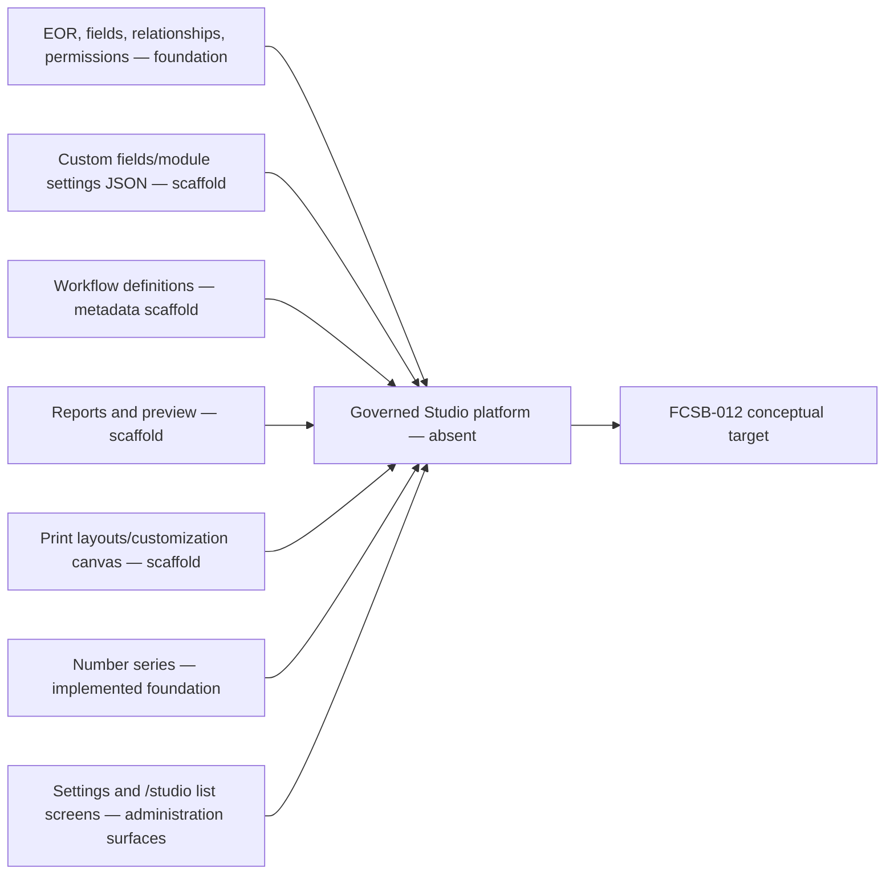

Workflow version publication/immutability, number-series concurrency, scope/permission guards, audit logging and Digital DNA are reusable foundations. Report preview reads 50 generic transaction records and advertises PDF/XLSX but is not a governed report engine. Print layouts store JSON sections without a renderer. The customization controller frequently accepts `any` and legacy roles. Web `/studio` currently lists object registry, workflow definitions and number series; the workflow page explicitly says visual editing comes later.

There is no compiler, package or promotion infrastructure and no metadata lifecycle beyond local record statuses/versions. Existing tests validate foundations, organization and master data—not Studio compilation, packages or preview isolation. Current Docker has PostgreSQL, API and web only.

# Chapter 5 — Target Studio Logical Architecture

Twelve logical layers separate authoring from execution. Experience provides role-specific designers. Design-time metadata stores governed drafts. Validation/policy enforces schemas and domain/security constraints. Compiler produces canonical runtime descriptors. Package/dependency resolves portable artifacts. Review/approval governs release. Publication/promotion moves immutable artifacts. Runtime registry activates descriptors. Extensions/plugins operate through sealed contracts. Test/preview proves behavior. Security/audit protects the supply chain. Operations/governance owns environments and lifecycle.

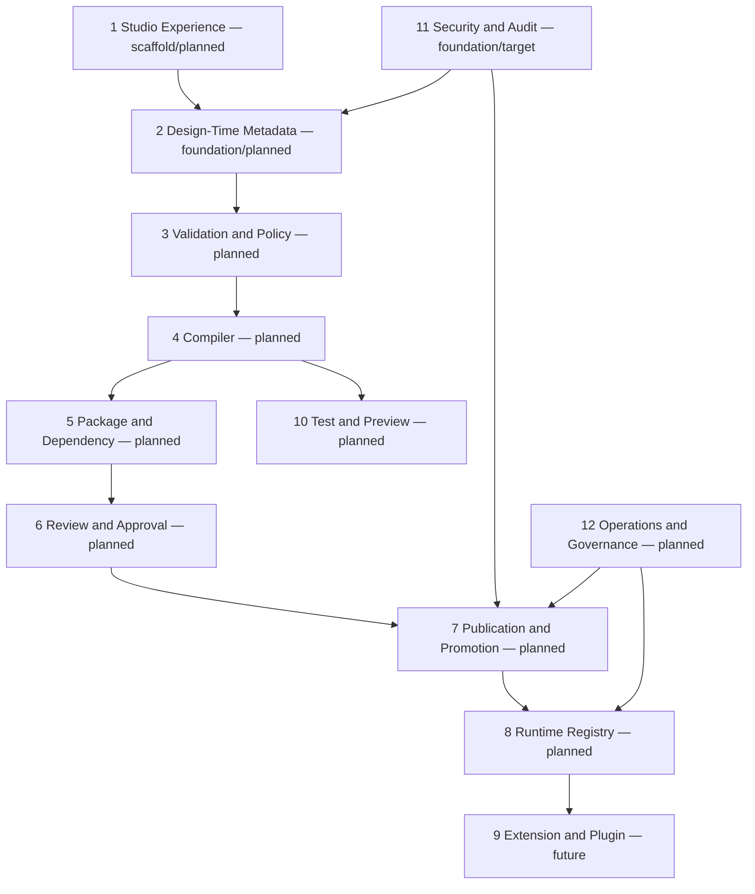

Layers are logical, not vendor or service mandates. An initial modular implementation may share deployment with the API, but compilation, preview and plug-in execution require isolation. Only runtime registries are read by production applications. Design repositories cannot be production configuration stores. Every boundary carries tenant/product scope, actor/service identity, correlation, artifact version, classification and audit context.

# Chapter 6 — Studio Product Model

The product model organizes intent from solution to executable artifact. A Solution contains Products/Modules; Modules contain Submodules/Features and export enterprise objects/contracts. Objects own fields and relationships and may reference forms, views, workflows, reports, dashboards, documents, menus, permissions, APIs, rules, notifications and AI policies. Packages capture selected immutable compiled versions; extensions depend on explicit package extension points.

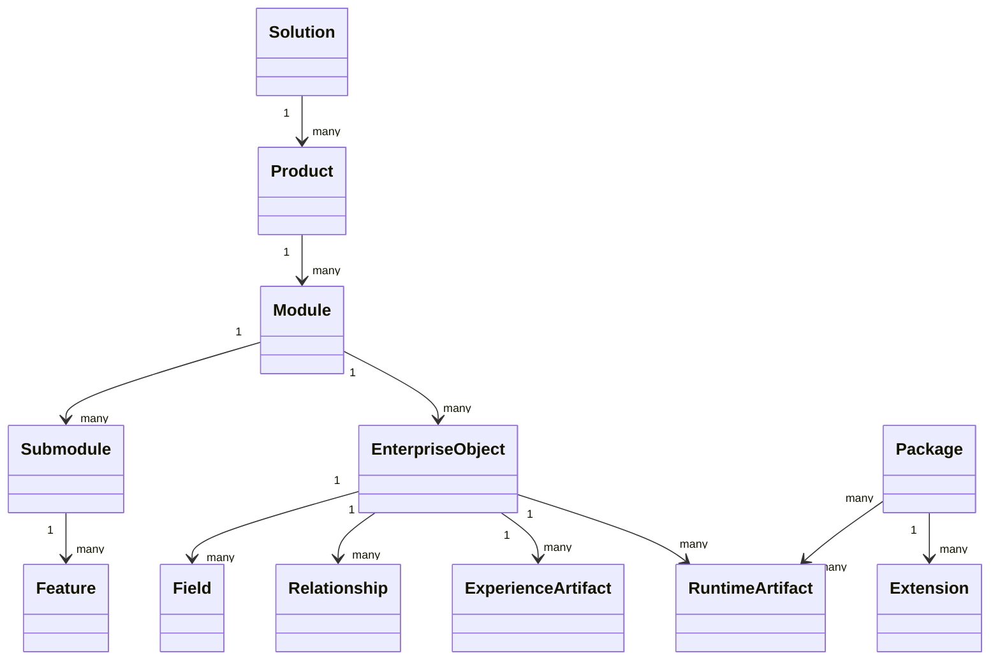

Artifact types include form, view, workflow, report, dashboard, document template, menu, permission, API, integration, rule, notification and AI policy. Each has stable type-specific schema, owner and authority reference. A package may group artifacts but does not own their business meaning. Products and modules declare release cadence, compatibility and supported deployment profiles. Naming and identity are governed to avoid collisions across core, customer and partner namespaces.

# Chapter 7 — Metadata Ownership and Authority

Platform metadata is owned by Platform/Product Governance; domain metadata by the relevant Domain Owner; customer metadata by a controlled Customer Administrator under platform/domain constraints; industry/localization metadata by appointed product specialists; security metadata by Security; integration metadata by Integration; AI metadata by AI Governance; runtime configuration by Operations/Product; environment configuration by Release/Operations.

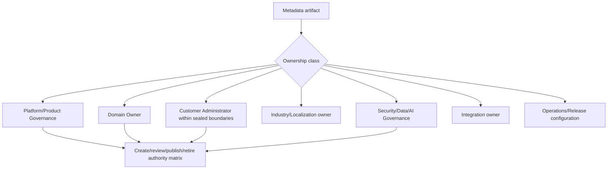

Create, review, approve, publish, install, override, deprecate and retire are distinct permissions. Customer administrators can author tenant packages only in exported extension points and cannot publish core/domain artifacts. Security owners may veto unsafe metadata. Release managers promote approved artifacts but are not domain approvers. Operations controls environment bindings without altering package content.

Ownership travels through derived and generated artifacts. AI has no ownership role. Cross-domain artifacts require one accountable owner and consulted owners. Override rules are explicit: local label/layout changes may be permitted, while ledger fields, transaction effects, security hard controls and mandatory legal clauses are sealed.

# Chapter 8 — Studio Metadata Repository

Every metadata artifact has stable technical ID, governed code/namespace, optional Digital DNA, artifact type, owner, scope, version/revision, lifecycle status, effective dates, classification, dependencies, package membership, source/provenance, checksum, audit and publication identity. Editable revision identity differs from immutable published version and package identity. Content uses typed schemas; unrestricted JSON is not a lifecycle contract.

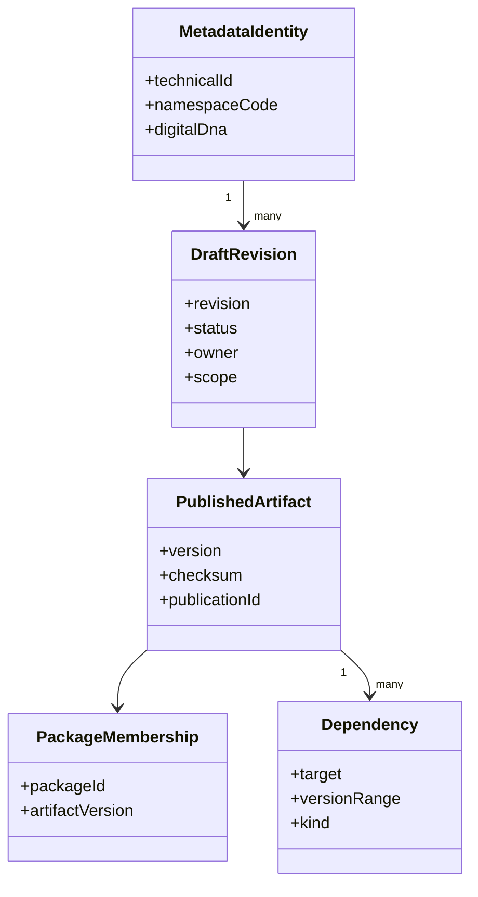

Draft storage supports optimistic concurrency, branches only if later approved, comments, validation results and review state. Published storage is append-only and addressable by content digest. Runtime artifacts reside in a separate registry/cache and point back to publication/package identity. Production cannot query draft tables for behavior.

Checksums cover canonical serialization and locked dependencies. Environment bindings and secrets are external references. Audit records material changes and decisions without storing secrets. Retention preserves published and installed history; abandoned drafts follow controlled retention. Physical repository technology and custom-field persistence remain open decisions.

# Chapter 9 — Studio Lifecycle

Lifecycle separates creative work, evidence, publication and environment deployment. Draft and InDevelopment are editable. ValidationFailed preserves diagnostics. Validated is eligible for review. Approved records human authority. Published creates immutable artifact versions. Packaged/signing produces portable artifacts. Promoted/Installed/Activated are environment facts. Deprecated/Superseded/Retired/Archived preserve history.

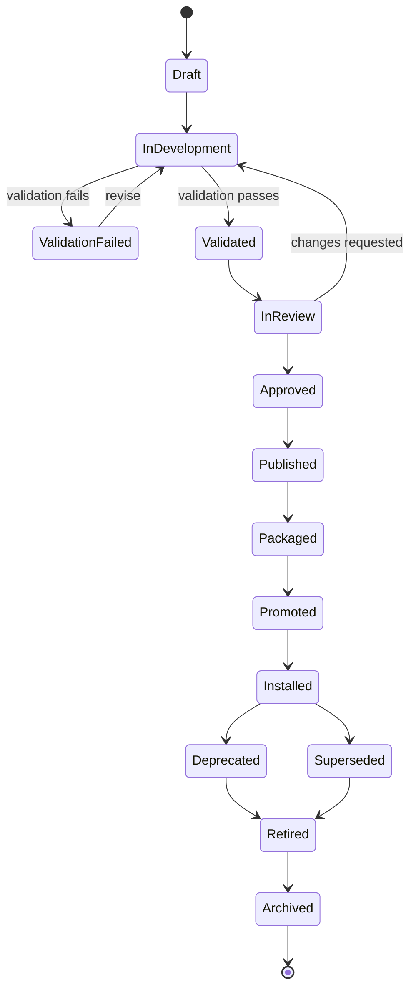

| From | Action | Guard | To | Evidence |
|---|---|---|---|---|
| InDevelopment | Validate | Schemas/dependencies/policies/tests execute | Validated/ValidationFailed | Diagnostics and test results |
| Validated | Submit review | Owner and required reviewers resolved | InReview | Review set and artifact digest |
| InReview | Approve | Required independent decisions complete | Approved | Decision history and fixed revision |
| Approved | Publish | Approval current; compatibility valid | Published | Immutable artifact/checksum |
| Published | Package | Manifest/dependencies resolve | Packaged | Package digest/integrity evidence |
| Packaged | Promote/install | Environment policy and same digest | Promoted/Installed | Deployment record and verification |
| Installed | Deprecate/retire | Impact and replacement/retention approved | Deprecated/Retired | Consumer and migration evidence |

# Chapter 10 — Solution and Module Architecture

The Core Solution contains platform modules and domain modules. Industry, localization, customer, partner, extension and experimental modules depend on exported contracts. Platform modules provide shared identity, metadata, audit and runtime seams. Domain modules own business invariants. Experimental modules never enter production without promotion to a governed type.

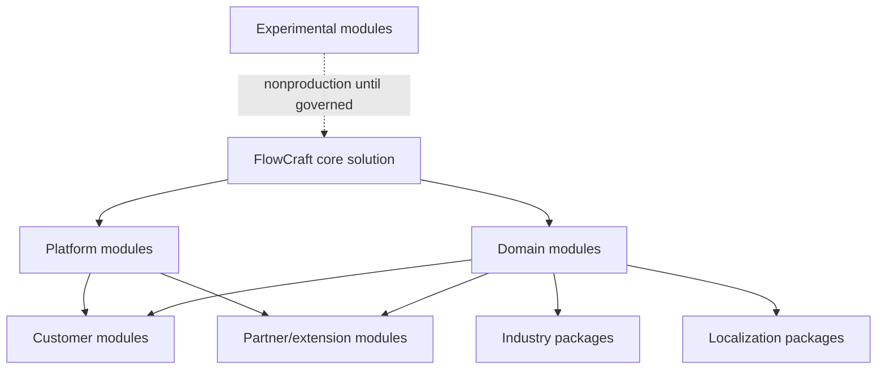

Modules declare namespace, owner, exports/imports, dependency ranges, permissions, feature flags, data/runtime contracts, extension points, release cadence and compatibility. Internal implementation is not an export. Dependencies flow from specialized to stable foundation layers; circular module dependencies are prohibited. Cross-domain operations use APIs/events defined by owning domains.

Core release cadence may differ from industry/customer packages, but support matrices bound compatibility. Customer modules cannot shadow core identities. Feature override is allowed only through sealed configuration/extension contracts. Retirement requires consumer inventory and migration. Package/install architecture later in this volume operationalizes these boundaries.

# Chapter 11 — Enterprise Object Designer

The target designer authors object identity, owner module/domain, classification, lifecycle, fields, relationships, capabilities, permissions, search/audit/Digital DNA/soft-delete/effective-date policies and controlled exposure to APIs, workflow, reporting, print and AI. It validates namespace uniqueness, ownership and compatibility with physical/domain implementations. Existing EOR CRUD and fields/relationships endpoints are foundations, not a visual designer or generator.

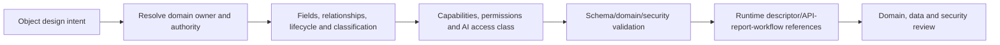

Capability flags express eligibility, not automatic runtime. `supportsWorkflow`, `supportsReports`, `supportsPrint` or `supportsAi` does not generate those services. An object is not exposed as unrestricted CRUD: command/query APIs, field/record authorization, invariants, tenant/organization scope, concurrency and audit remain domain-controlled. Physical tables require engineering/migration governance; metadata-only extensions use approved storage strategies.

Object retirement identifies records, APIs, reports, workflows, documents, packages and external consumers. Digital DNA and history remain stable. Studio prevents changing technical identity after use. Hard controls seal authoritative ledger/effect fields, tenant keys and security ownership.

# Chapter 12 — Field Designer

Fields declare datatype, length, precision/scale, cardinality, required/default, validation, lookup/reference, computed/derived behavior, effective dating, sensitivity/encryption, localization, UOM/money/quantity/time semantics, search/index visibility, API/report exposure and presentation hints. Defaults and validations are typed expressions, not scripts. Changing type/precision requires compatibility and migration analysis.

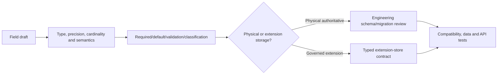

Core identity, tenant/company scope, money/quantity effects, posting facts, balances and regulatory fields require owned physical/domain models. Governed extension storage may hold low-risk customer attributes with schema, indexes, permissions and retention. JSON extension fields cannot hide authoritative ledger facts or evade reporting/security. Computed fields record source and calculation version; derived values are not silently editable.

Sensitive/encrypted fields require masking, purpose, export restrictions and key policy. Localized fields separate stable value identity from translations. Date/time records instant versus business date/timezone. UOM/money include units/currency. Field removal follows deprecation and consumer/data migration, never silent deletion.

# Chapter 13 — Relationship Designer

Relationships support one-to-one, one-to-many, many-to-many, parent-child, reference, composition, aggregation, effective-dated, cross-domain, external and knowledge-graph relationships. Each declares source/target, owner, direction, cardinality, requiredness, lifecycle/cascade, scope compatibility, authorization, history, API exposure and deletion behavior.

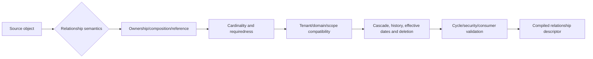

Cascade delete is deny-by-default and prohibited for authoritative/historical records without domain approval. Parent-child trees require cycle prevention and move history. Cross-domain links reference stable identities through approved contracts rather than foreign keys that transfer ownership. External links include system namespace/source version. Knowledge relationships follow FCSB-008 and do not become database authority.

The current EOR relationship model captures basic type/cardinality/cascade metadata but lacks full lifecycle, scope, security and history semantics. Studio must preview dependency/deletion impact. Relationship changes after data use require migration/reconciliation. Many-to-many junction ownership and permissions are explicit.

# Chapter 14 — Form and Page Designer

A form/page comprises sections, tabs, fields, grids, toolbars, actions, related lists, validation/help content and responsive layout. It binds to a governed object/query/command contract. States declare create/edit/read-only/review/approval/archived behavior. Localization, accessibility, classification and permission-aware rendering are compiled into runtime descriptors.

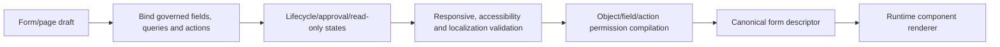

Hiding a field in UI is not authorization; the API enforces access. Form actions call domain commands and display structured errors. Client-side validation improves experience but server/domain validation governs. Draft/approval forms bind exact source versions where required. Related lists paginate and security-trim independently.

Component catalogs are versioned and accessibility-certified. Custom widgets require the future plug-in boundary. Preview uses synthetic or authorized masked data and cannot mutate production. Current `FoundationList`, master-data/settings screens and customization canvas are hand-built administrative surfaces, not a compiled form/page runtime.

# Chapter 15 — View and List Designer

View artifacts define list, grid, card, tree, timeline, calendar or Kanban presentation over a governed query. They specify columns/cards, filters, sorts, grouping, aggregates, paging, saved/personal/shared scope, export and bounded bulk actions. Every underlying field/action must be authorized and supported by query/runtime capabilities.


Personal views remain user-scoped and cannot alter shared package artifacts. Shared views require owner review. Trees define cycle-safe hierarchy contracts. Calendar/timeline use timezone semantics. Aggregates use governed data types/currency/UOM. Exports require a distinct permission, classification and row limit. Bulk actions call idempotent domain commands per selected identity and expose partial outcomes.

Studio validation rejects unindexed unbounded sorts, excessive joins, hidden sensitive exports and bulk actions without commands. Runtime cost limits protect tenants. Current lists implement selected API pagination/search/filter behavior but are not a generic view compiler.

# Chapter 16 — Dashboard Designer

Dashboards arrange widgets—KPI, chart, table, status, alert or link—over governed operational queries or analytical datasets. Each widget declares owner, metric/query version, scope, refresh/caching, filters, drill-down, display unit and security. Dashboard layout is responsive/accessibility-tested and cannot reveal inaccessible aggregate counts.

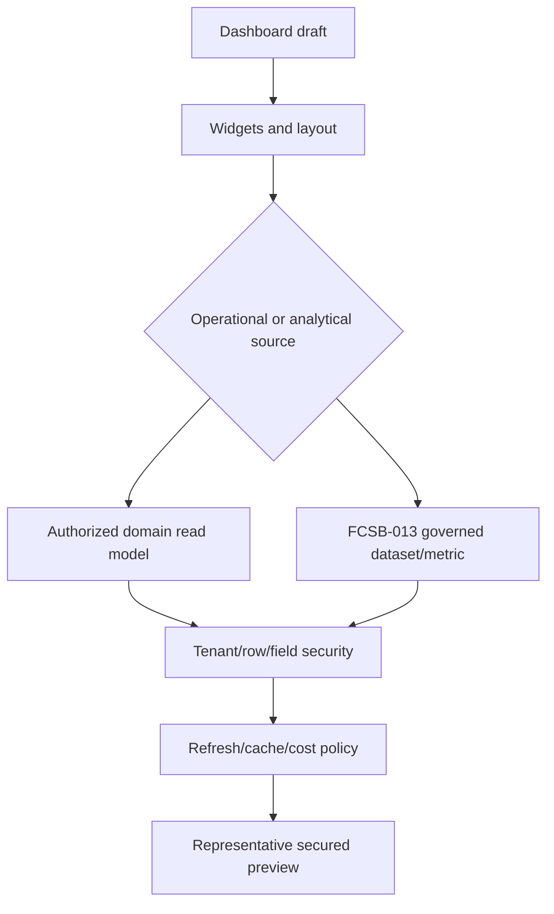

Operational widgets reflect current domain state and link to authorized actions. Analytical widgets follow FCSB-013 semantic measures, time/currency grain and certification. Studio designs presentation/binding but does not define financial truth. Drill-down maintains filters and permission. Cross-company views require explicit authority.

The current dashboard services/components and pending-approval counters are implemented screens over specific queries, not a dashboard builder. A future builder needs dataset certification, visualization safety, accessibility, caching, export and performance governance.

# Chapter 17 — Workflow Designer Boundary

Studio may author workflow definitions, nodes, transitions, gateways, manual/service/approval/AI/notification/timer/escalation tasks, variables, rules, subprocesses, retry and compensation references. It validates graph soundness and packages a canonical definition. FCSB-011 exclusively owns runtime instance, token, task, queue, timer, approval, recovery and execution semantics.

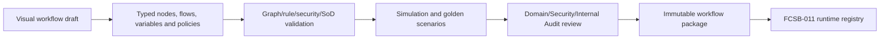

Studio never executes draft workflows or embeds arbitrary scripts. Service nodes reference registered domain commands/connectors. Compensation references domain corrective actions. Approval policies bind source versions and SoD. Definition publication cannot imply runtime activation until package installation succeeds.

Current workflow metadata supports versions, steps/transitions and immutable published records, but no visual designer/compiler/simulation/runtime exists. Existing free JSON requires typed schemas. FCSB-012 owns design/package governance; FCSB-011 owns execution.

# Chapter 18 — Approval Matrix Designer

The designer authors sequential, parallel, majority, weighted, consensus, hierarchy, role/group and dynamic approval policies with amount/risk thresholds, currency context, delegation, timeout/escalation, emergency path, SoD and effectivity. It resolves sample approval plans and validates empty seats, conflicts, quorum and fallback. Runtime execution remains FCSB-011.

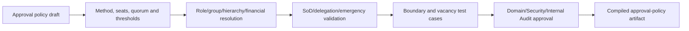

Amount thresholds specify currency/rate/exposure semantics; hierarchy policies specify effective source/fallback; weighted/majority policies freeze electorate/denominator; delegation never expands authority. Silence is not approval. Emergency policies are distinct and retrospectively reviewed. Studio administrators are not automatic business approvers.

Current approval schema models simple legacy role levels and amount bands linked to generic documents. It is a scaffold without a designer or runtime. Studio migration must assess existing data rather than overwrite it.

# Chapter 19 — Business Rule and Validation Designer

Rules include conditions, expressions, decision tables, validation, preconditions, postconditions, execution guards and localized error messages. Each has owner, scope, input/output schema, effective version, dependencies and tests. Rules are side-effect-free; actions occur through explicit domain commands after a rule result.

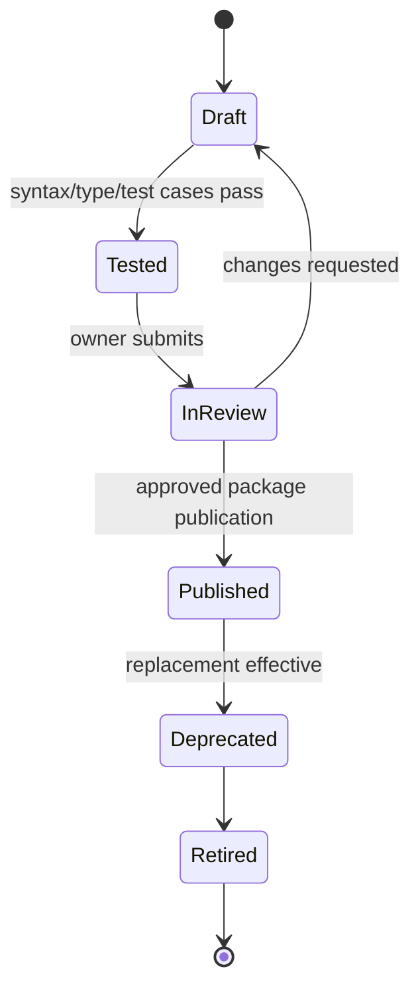

The safe language permits typed comparison, boolean logic, dates, money/UOM and bounded collections. It prohibits arbitrary code, SQL, filesystem, network, reflection and nondeterministic clock/random except explicit inputs. Decision tables declare hit policy and are checked for overlaps/gaps. Domain validation remains authoritative and cannot be copied into customer rules to bypass upgrades.

Rule testing includes boundaries, nulls, precision, localization, security and dependency versions. Errors have stable codes and translated text. Published runtime rules are compiled, immutable and provenance-linked. Existing JSON validation/condition fields are scaffolds, not a safe rule engine.

# Chapter 20 — Transaction Type Designer Boundary

Studio may configure registered transaction type presentation, approved header/line extensions, visible statuses/actions, workflow policy, number series, document outputs, events, permissions and reporting bindings. FCSB-009 owns identity, lifecycle, quantities, currency, taxes, effects, posting, reversal, idempotency and authoritative domain commands.

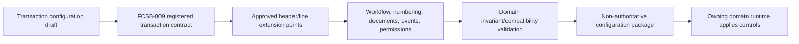

Studio cannot invent posting logic, store ledger facts in extension JSON, add arbitrary status transitions or expose domain tables as CRUD. Actions reference approved command identities and expected versions. Material extensions require migration and reporting compatibility. Generated events follow registered schemas.

The current generic `TransactionDocument`, links, approval records and metadata flags are scaffolds, not a universal transaction designer. Domain implementation and later solution volumes remain authoritative.

# Chapter 21 — Document and Template Designer Boundary

Studio authors business document, print, label, email and PDF templates with layout, localization, branding, watermark, barcode/QR, signature placement, safe binding and preview. Templates and resources are versioned and effective-dated. FCSB-010 owns document identity/content/rendition custody, rendering, signature evidence, retention and delivery semantics.

```mermaid
flowchart LR
  TEMPLATE["Template/layout draft"] --> BIND["Governed source bindings"]
  BIND --> LAYOUT["Layout, locale, brand and required markings"]
  LAYOUT --> SAFE["Expression/resource/security validation"]
  SAFE --> PREVIEW["Golden-data preview"]
  PREVIEW --> REVIEW["Domain/Legal/Brand review"]
  REVIEW --> PKG["Immutable template package"]
  PKG --> DOC["FCSB-010 rendering runtime"]
```

Bindings use approved schemas, never database queries. Mandatory legal/security fields can be sealed against customer override. Signature placement does not create a signature. Barcode/QR payload schemas prohibit secrets. Preview output is a non-authoritative derivative and records template/data versions.

Existing print-layout JSON/sections and customization UI elements are scaffolds with no compiler/renderer/publication. Reported PDF export formats do not prove document output. Studio must preserve historical template versions and detect stale source bindings.

# Chapter 22 — Report Designer

The report designer defines identity, owner, governed dataset, fields, parameters, filters, sorting, grouping, aggregation, drill-down, security, export, schedule reference, version, preview and certification. Studio owns design/package lifecycle; FCSB-013 owns semantic metrics, analytics, enterprise reporting architecture and certification policy.


Reports cannot query arbitrary tables or infer measures from labels. Currency/UOM/time grain and as-of rules are dataset semantics. Drill-down rechecks permission. Exports and schedules are distinct controls. Certification is version-specific and becomes stale on material dataset/report change.

Current `ReportDefinition/Field/Filter` and generic preview are scaffolds; broad `any` inputs, generic transaction rows and format strings are not a designer, semantic layer or export engine.

# Chapter 23 — Query and Dataset Designer

Datasets expose approved domain fields, joins, semantic attributes/measures, filters, aggregates, parameters, row security, tenant scope, query cost, pagination and freshness. Cross-domain composition uses governed semantic/data products and reconciliation rules. Arbitrary production SQL and uncontrolled cross-domain joins are prohibited.

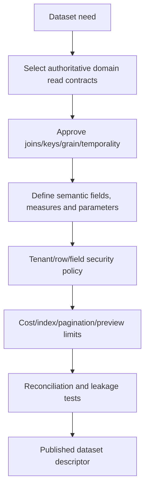

Each dataset declares grain, owner, source versions, temporal behavior, null/precision, currency/UOM and allowable consumers. Query compilation generates plans against approved read models, not transactional tables by user choice. Cost budgets reject Cartesian joins, unbounded scans and high-cardinality previews. Parameters are typed and cannot inject syntax.

FCSB-013 will detail physical semantic/reporting layers. Studio provides controlled authoring and packaging. Current report base-entity/field-path strings are insufficient evidence of governed datasets.

# Chapter 24 — Menu and Navigation Designer

Menu metadata defines navigation groups, routes, workspaces, shortcuts, feature visibility, tenant/role variants, localization, mobile visibility, contextual actions and deep links. Routes reference registered runtime pages/actions; Studio cannot create an unprotected endpoint merely by adding navigation.

```mermaid
flowchart LR
  MENU["Menu/workspace draft"] --> ROUTE["Registered route/action references"]
  ROUTE --> VIS["Role, feature, tenant and device visibility"]
  VIS --> LOCAL["Localization and ordering"]
  LOCAL --> VALID["Broken link/cycle/security validation"]
  VALID --> DESC["Compiled navigation descriptor"]
  DESC --> SHELL["Permission-aware application shell"]
```

Visibility is convenience, not authorization. Deep links recheck authentication, object/action and record scope. Contextual actions bind domain commands. Feature flags have owner, environment/tenant scope, expiry and fallback. Mobile visibility does not imply offline support. Customer menu extensions insert only at declared anchors and cannot replace security routes.

Current app-shell arrays and route files are implemented application code, not compiled menu metadata. A future designer must preserve deterministic ordering and upgrade-safe anchors.

# Chapter 25 — Security Designer

Security design covers roles, permissions, object actions, field visibility, record/organization scope, SoD, sensitive data, export, Studio roles, publication roles and environment access. Studio may author policy within platform constraints; hard controls such as tenant isolation, credential handling and domain authorization are sealed.

```mermaid
flowchart TB
  POLICY["Security policy draft"] --> SUBJECT["Roles/groups/service identities"]
  SUBJECT --> RESOURCE["Object/field/record/action/environment scope"]
  RESOURCE --> SOD["SoD/conflict and privileged-action rules"]
  SOD --> HARD["Platform hard-control validation"]
  HARD --> TEST["Positive/negative/tenant isolation tests"]
  TEST --> COMPILE["Runtime policy descriptors"]
```

Role creation differs from assignment; package policy can define permission codes but environment/tenant administrators assign identities under governance. Deny overrides allow where policy requires. Field hiding never replaces API enforcement. Publisher, release manager, Studio administrator and business approver are distinct duties. Package authors cannot grant themselves publication/production authority.

Current normalized roles/permissions and guards are implemented foundations; legacy role checks and incomplete object/record scope remain limitations. Studio security compilation depends on FCSB-005 and server enforcement.

# Chapter 26 — API Designer

The API designer defines resource, command, query, webhook and event contracts; DTO schemas, version, authentication, authorization, idempotency, rate limits, error model, OpenAPI, deprecation and tests. Generated implementations are adapters to domain services—not table CRUD or dynamic ORM exposure.

```mermaid
flowchart LR
  CONTRACT["API contract draft"] --> TYPE["Resource/command/query/webhook/event semantics"]
  TYPE --> DTO["Typed DTO and error schemas"]
  DTO --> CONTROL["Auth, permission, scope, idempotency and limits"]
  CONTROL --> BIND["Approved domain service binding"]
  BIND --> TEST["Contract/security/compatibility tests"]
  TEST --> SPEC["Versioned OpenAPI/event artifact"]
```

Commands expose business intent and expected versions; queries expose authorized read models. Webhooks are signed/replay-protected. Breaking changes require new version and migration. Rate limits are tenant/actor/operation-aware. Error contracts avoid data leakage. Generated test clients and docs retain artifact provenance.

Current Nest controllers mix typed DTOs with broad `any`; the latter are not templates for Studio generation. Studio cannot generate direct Prisma access in controllers. FCSB-004 and domain volumes retain API/integration authority.

# Chapter 27 — Integration Designer

Integration artifacts define connector, endpoint operation, versioned contract, authentication-profile reference, mapping/transformation, retry/reconciliation, schedule, webhook, file import/export, event subscription, error handling and environment binding. Packages contain credential aliases, never secrets or live endpoints unless declared non-secret configuration.

```mermaid
flowchart LR
  INT["Integration draft"] --> CON["Registered connector/contract"]
  CON --> MAP["Typed mapping and safe transformation"]
  MAP --> REL["Retry, idempotency and reconciliation"]
  REL --> ENV["Environment-specific endpoint/credential aliases"]
  ENV --> TEST["Mock/contract/security/failure tests"]
  TEST --> PKG["Portable integration artifact"]
  PKG --> RUNTIME["FCSB-004 governed integration runtime"]
```

Transformations are sandboxed and size-bounded. File schemas declare encoding, delimiters, validation and custody. Webhooks use signatures, timestamp/replay controls and correlation. Schedules use approved scheduler services. Unknown outcomes reconcile before retry. Connector privileges are least-privileged.

Current import/export job metadata supports bounded master-data behavior but is not a general integration designer or connector runtime. No broker/webhook/package infrastructure is evidenced.

# Chapter 28 — Notification Designer

Notifications support in-app, email, SMS, Teams, WhatsApp and push profiles with trigger, versioned template, audience resolution, locale, quiet hours, escalation, classification, delivery state, retry and secure-link policy. Studio authors the request contract; FCSB-011 and channel services execute it.

```mermaid
flowchart LR
  NOTICE["Notification draft"] --> TRIGGER["Registered event/workflow trigger"]
  TRIGGER --> AUDIENCE["Role/party/record audience policy"]
  AUDIENCE --> TEMPLATE["Localized channel templates"]
  TEMPLATE --> CLASS["Classification, quiet hours and secure links"]
  CLASS --> TEST["Preview, recipient and fallback tests"]
  TEST --> ART["Notification policy artifact"]
```

Recipient resolution cannot widen source access. Sensitive content uses authenticated document links. Provider acceptance differs from delivery; notification differs from task completion. Retry/idempotency and channel fallback prevent duplicates. Consent, opt-out and regional policy vary.

No email/SMS/Teams/WhatsApp/push workflow adapters exist today. Customization labels are not notification design evidence.

# Chapter 29 — Number-Series Designer

Number-series design covers identity, enterprise object/transaction type, tenant/company/branch/plant/fiscal scope, prefix/suffix, padding, reset, gap policy, reservation, concurrency, preview, audit and post-use immutability. It configures the implemented concurrency-safe numbering service through approved boundaries; it never allocates production numbers during preview.

```mermaid
stateDiagram-v2
  [*] --> Draft
  Draft --> Validated: scope/format/collision tests
  Validated --> Active: approve and activate
  Active --> InUse: first committed allocation
  InUse --> Deprecated: replacement selected
  Deprecated --> Retired: no future allocation
  Retired --> Archived
  Archived --> [*]
```

Preview uses synthetic sequence values and declares format only. Fiscal reset is calendar/version-bound. Reservations have expiry and reconciliation. Gaps are governed and never concealed by reuse. Scope collision analysis covers nullable dimensions and legacy numbers. Once used, identity/scope/format changes require a new series or explicit compatibility policy.

Current NumberSeries schema/service/UI is an implemented foundation, not a complete designer/package artifact. Plant scoping and advanced reservation/reset may remain planned.

# Chapter 30 — Localization and Translation Designer

Localization artifacts contain languages, regional formats, dates/times, currency/number/UOM labels, translated labels/messages/templates/reports/documents, RTL behavior, terminology packs and jurisdiction adapters. Stable message/term IDs separate meaning from display text. Localization packages depend on compatible base artifacts.

```mermaid
flowchart LR
  BASE["Published base artifact/messages"] --> EXTRACT["Extract stable translatable keys"]
  EXTRACT --> PACK["Language/region/terminology package"]
  PACK --> REVIEW["Linguistic/domain/legal review"]
  REVIEW --> TEST["Glyph, RTL, layout and fallback tests"]
  TEST --> RESOLVE["Resolve tenant/region language dependencies"]
  RESOLVE --> RUNTIME["Localized runtime descriptors/resources"]
```

RTL includes reading order, bidirectional codes and component behavior, not a CSS flip. Dates/timezones/currency values remain authoritative domain values; localization changes display. Jurisdiction adapters cannot override domain/legal rules without approved authority. Machine translation is labelled draft and reviewed.

Missing translations follow explicit fallback and are visible in validation. Package upgrades detect orphan/changed keys. Current UI localization infrastructure is not evidenced as a Studio designer.

# Chapter 31 — Theme and Design-System Architecture

Themes compose design tokens, typography, spacing, color, components, responsive behavior, accessibility, dark/light mode, brand, tenant/industry, print and mobile profiles. Core component semantics and accessibility contracts are sealed; customer themes override declared tokens/slots rather than component source.

```mermaid
flowchart TB
  CORE["Core accessible design system"] --> INDUSTRY["Industry theme layer"]
  CORE --> BRAND["Product/company brand layer"]
  INDUSTRY --> TENANT["Tenant token overrides"]
  BRAND --> TENANT
  TENANT --> MODE["Light/dark/mobile/print profiles"]
  MODE --> TEST["Contrast, focus, responsive and print tests"]
  TEST --> THEME["Versioned theme package"]
```

Tokens declare type, range and compatibility. Logos/fonts have integrity/licensing metadata. Themes cannot hide required actions, classification or error states. Accessibility checks cover contrast, keyboard, focus, zoom and assistive semantics. Print themes obey FCSB-010 markings. Mobile themes do not create offline capability.

Current CSS/theme toggle and hand-built components are implementation foundations, not a theme designer or package system. Upgrade-safe customization requires component/version compatibility and visual regression tests.

# Chapter 32 — Runtime Compilation Architecture

Compilation transforms approved, typed metadata plus locked dependencies into runtime object, form, view, menu, workflow, report, document, API, permission, event and notification descriptors. It is deterministic: identical canonical inputs, compiler version and dependencies produce the same intermediate/output digest. Compilation never queries production business data or embeds environment secrets.

```mermaid
flowchart LR
  INPUT["Approved metadata revisions"] --> VALID["Schema/domain/security validation"]
  VALID --> DEP["Resolve locked dependencies"]
  DEP --> IR["Canonical intermediate representation"]
  IR --> GEN["Generate typed runtime descriptors"]
  GEN --> TEST["Static/contract/security tests"]
  TEST --> OUT["Immutable output package + digest"]
  OUT --> CACHE["Digest-addressed registry/cache"]
  CACHE --> ACT["Atomic runtime activation"]
```

The intermediate representation normalizes identities, types, bindings, permissions, dependencies and compatibility. Compiler diagnostics reference source locations and stable codes. Failure produces no publishable output. Caches are keyed by package/compiler/runtime versions and can be rebuilt. Runtime activation verifies integrity and compatibility before switching an environment pointer atomically.

Compiler plug-ins, if future-approved, run sandboxed and version-pinned. Generated artifacts retain source mapping/provenance. Physical compiler technology and IR format remain open. Nothing in the current repository implements this pipeline.

# Chapter 33 — Package Architecture

Package types include platform, domain, industry, localization, customer, partner, extension, theme, workflow, report, integration, hotfix, patch and upgrade. A manifest records package identity/type/version, publisher, artifacts/exports/imports, direct/peer/optional dependencies, platform/runtime ranges, extension points, permissions, configuration schema, migrations, tests, checksum/signature and rollback/retirement constraints.

```mermaid
classDiagram
  class Package {
    +packageId
    +type
    +version
    +checksum
  }
  class Manifest
  class Artifact
  class Export
  class Dependency
  class MigrationRequirement
  class TestEvidence
  class SignatureEvidence
  Package "1" --> "1" Manifest
  Package "1" --> "many" Artifact
  Manifest "1" --> "many" Export
  Manifest "1" --> "many" Dependency
  Manifest "1" --> "many" MigrationRequirement
  Package "1" --> "many" TestEvidence
  Package "1" --> "1" SignatureEvidence
```

Package identity differs from artifact identity. Contents are canonical, immutable and environment-neutral. Secrets, live credentials and tenant data are excluded. Migrations are declared requirements/executables governed separately and cannot be generated/applied casually. Hotfix/patch packages obey the same integrity, testing and ownership controls.

Package signing or equivalent integrity protection is required but method remains open. Uninstall is not assumed safe: dependency/data/history analysis may require deactivation or forward migration. No current package format/registry exists.

# Chapter 34 — Dependency Management

Dependencies are direct, transitive, optional or peer with version ranges and compatibility attributes. A resolver builds the graph from the target environment inventory, selects compatible immutable versions under policy, rejects cycles/conflicts/missing peers and produces a lock file plus impact report. Optional capability absence must have a defined fallback.

```mermaid
flowchart LR
  REQUEST["Package install/upgrade request"] --> INVENTORY["Environment package/runtime inventory"]
  INVENTORY --> GRAPH["Build direct/transitive/optional/peer graph"]
  GRAPH --> CYCLE{"Cycle/conflict/missing dependency?"}
  CYCLE -- "Yes" --> FAIL["Block with explainable conflict"]
  CYCLE -- "No" --> RESOLVE["Select compatible immutable versions"]
  RESOLVE --> LOCK["Dependency lock and impact plan"]
  LOCK --> TEST["Compatibility and consumer tests"]
```

Resolution never downloads untrusted packages during production activation. Package registries and trust sources are approved beforehand. Version ranges follow a controlled compatibility policy, not assumed semantic versioning. A lock identifies exact digest, registry and signer. Upgrade preview shows changed transitive dependencies and affected artifacts/workflows/extensions.

Broken dependency leaves current activation untouched. Circular dependencies are prohibited, including hidden runtime/service cycles. Resolver/lock technology remains planned.

# Chapter 35 — Publication, Promotion, and Installation

Publication follows validate, review, approve, compile, test, package and integrity-protect. Promotion registers the same package digest through Development, Test, Integration, UAT, Staging and Production. Installation resolves dependencies, verifies trust/compatibility, stages descriptors/migrations, tests, atomically activates and verifies. Direct production editing or recompilation is prohibited.

```mermaid
flowchart LR
  DRAFT["Fixed approved revision"] --> VALID["Validate/compile/test"]
  VALID --> REVIEW["Required human approvals"]
  REVIEW --> PACKAGE["Build immutable package"]
  PACKAGE --> SIGN["Integrity/signature evidence"]
  SIGN --> PUBLISH["Publish to trusted registry"]
  PUBLISH --> INSTALL["Resolve/stage/install/verify"]
  INSTALL --> ACTIVE["Atomic activation"]
```

```mermaid
flowchart LR
  DEV["Development"] --> TEST["Test"]
  TEST --> INT["Integration"]
  INT --> UAT["UAT"]
  UAT --> STAGE["Staging"]
  STAGE --> PROD["Production"]
  ART["One immutable package digest"] --> DEV
  ART --> TEST
  ART --> INT
  ART --> UAT
  ART --> STAGE
  ART --> PROD
```

Environment bindings map aliases to endpoints, secrets and capacity without changing artifact bytes. Promotion gates attach environment-specific test/approval evidence. Installation has a plan, expected current inventory and idempotency. Partial activation is prohibited; staged changes remain invisible until all required components pass. Verification compares activated digest/contracts and performs safe probes.

No publication, registry, promotion or installer runtime exists today.

# Chapter 36 — Upgrade and Rollback Architecture

Upgrade preview evaluates platform/runtime/package ranges, changed exports/schemas, data/metadata migration, active workflow versions, transaction/document compatibility, customer extensions, security and rollback feasibility. The plan orders packages/migrations, defines maintenance/traffic strategy and validates on production-like masked data. Installation is atomic at the activation boundary.

```mermaid
flowchart LR
  TARGET["Requested upgrade packages"] --> INVENTORY["Current inventory and dependents"]
  INVENTORY --> COMPAT["Compatibility/dependency/security analysis"]
  COMPAT --> MIG["Metadata/data/active-workflow migration plan"]
  MIG --> REHEARSE["Production-like rehearsal and tests"]
  REHEARSE --> APPROVE["Release/domain/security approval"]
  APPROVE --> STAGE["Stage immutable artifacts/migrations"]
  STAGE --> ACT["Atomic activation and verification"]
```

```mermaid
flowchart LR
  FAIL["Install/activation verification fails"] --> CLASS{"Data/effects migrated?"}
  CLASS -- "No irreversible change" --> PREV["Reactivate previous compatible package set"]
  CLASS -- "Migration/effects present" --> FORWARD["Approved forward fix or compensating migration"]
  PREV --> VERIFY["Verify registry/runtime and preserve evidence"]
  FORWARD --> VERIFY
  VERIFY --> REVIEW["Incident and compatibility review"]
```

Rollback never deletes evidence and may be unsafe after irreversible data/domain effects. Previous artifact activation is allowed only when data/runtime compatibility remains. Otherwise a forward fix is required. Failed installation retains plan/logs/checksums and leaves prior active set intact. Active workflows follow FCSB-011 migration rules; documents/transactions retain their histories.

# Chapter 37 — Customer and Industry Extension Architecture

Core, domain, industry, localization, customer and partner packages layer through named extension points. Extensions may add fields, form sections, workflow fragments/called workflows, reports, documents, menu items, APIs or integrations only where contracts permit. Core packages remain unchanged and sealed invariants/security cannot be overridden.

```mermaid
flowchart TB
  CORE["Core platform package"] --> DOMAIN["Domain package"]
  DOMAIN --> INDUSTRY["Industry package"]
  DOMAIN --> LOCAL["Localization package"]
  DOMAIN --> CUSTOMER["Customer package"]
  INDUSTRY --> CUSTOMER
  LOCAL --> CUSTOMER
  CUSTOMER --> PARTNER["Partner extension"]
  SEAL["Sealed invariants/security/authorities"] --> CORE
  SEAL --> DOMAIN
```

Extension manifests name target point, version range, merge precedence, conflict policy, data needs and tests. Two extensions changing the same slot trigger deterministic conflict, not silent last-write-wins. Upgrades run compatibility/regression tests against installed extensions. Tenant packages are isolated and exportable only under authorization.

Customer-specific source forks are exceptional because they break product upgrade/security assurance; they require Architecture/Product Governance approval and reintegration plan. Current custom fields/settings are a limited scaffold, not this package model.

# Chapter 38 — Plugin and Component Architecture

Future plug-ins may provide widgets, workflow nodes, report renderers, connectors, validation functions, API providers or AI tools. Each needs stable identity, signed manifest, version/compatibility, requested capabilities, data classes, resource limits, sandbox profile, configuration schema, tests, publisher trust, revocation and marketplace certification.

```mermaid
flowchart LR
  PLUGIN["Untrusted plugin package"] --> VERIFY["Signature/publisher/certification verification"]
  VERIFY --> CAP["Deny-by-default capability grant"]
  CAP --> SANDBOX["Isolated runtime, resource and egress limits"]
  SANDBOX --> HOST["Versioned narrow host contract"]
  HOST --> AUDIT["Calls, failures, revocation and telemetry"]
  REVOKE["Security/release revocation"] --> SANDBOX
```

Plug-ins never receive database, tenant-wide, filesystem, network or secret access by default. Host APIs enforce authorization and tenant scope. Failure isolation prevents core state corruption. Custom AI tools follow FCSB-008. Marketplace publication requires supply-chain/security/privacy/license review and ongoing vulnerability response.

No plugin SDK, sandbox, component marketplace or remote registry exists. These are future capabilities, not commitments.

# Chapter 39 — Studio Testing and Preview Architecture

Testing includes metadata/schema validation, unit/rule tests, workflow simulation, form/report/document preview, API contract/security, accessibility/localization, dependency, upgrade/regression and package installation tests. A production-like sandbox uses synthetic or approved masked data and isolated services. Preview is evidence, never production authority.

```mermaid
flowchart LR
  REV["Fixed metadata revision"] --> STATIC["Schema/policy/dependency validation"]
  STATIC --> UNIT["Rule/component/unit tests"]
  UNIT --> SIM["Workflow/API/integration simulations"]
  SIM --> PREVIEW["Form/report/document/dashboard previews"]
  PREVIEW --> NONFUNC["Security/accessibility/localization/performance tests"]
  NONFUNC --> INSTALL["Package install/upgrade/regression rehearsal"]
  INSTALL --> EVID["Signed/linked test evidence"]
```

Test cases and expected results are versioned artifacts. Golden outputs declare tolerated differences. Workflow simulation follows runtime semantics but does not create domain effects. API/integration tests use mocks/contract environments. Tenant-isolation negative tests are mandatory. Preview data is minimized, classified and erased per policy.

Current generic report preview and UI screens are not a Studio test runner or isolated sandbox. Tooling and environment topology remain open.

# Chapter 40 — AI-Assisted Studio Architecture

AI may draft objects/fields/forms/workflows/reports/dashboards/APIs/tests/documentation/translations, suggest rules/permissions, analyze dependencies, explain validation errors and propose migration mappings. Each use case has approved model/provider, data classes, grounding, output schema, evaluation, retention and human reviewer. Output is visibly AI-generated draft with citations/provenance.

```mermaid
flowchart LR
  USER["Authorized author and purpose"] --> POLICY["AI/security/domain policy gate"]
  POLICY --> CONTEXT["Permission-trimmed architecture/metadata context"]
  CONTEXT --> MODEL["Approved model/tool boundary"]
  MODEL --> DRAFT["Labelled draft + citations/provenance"]
  DRAFT --> VALID["Deterministic Studio validators/tests"]
  VALID --> HUMAN["Mandatory human/domain/security review"]
  HUMAN --> LIFECYCLE["Ordinary metadata lifecycle"]
```

AI cannot publish, approve its own work, weaken security, bypass domain rules, run arbitrary SQL/scripts, modify production, create secrets or install plug-ins. Tools are deny-by-default and use narrow draft APIs. Prompt injection in repository/business documents is untrusted data. Suggestions for permission or migration receive heightened review.

No Studio AI generation runtime exists. FCSB-008 governs model gateway, retrieval, monitoring and accountability. AI unavailability must not block manual authoring.

# Chapter 41 — Studio Security, Operations, and Governance

Studio roles include developer, designer, reviewer, publisher, release manager, security reviewer, domain owner, administrator and auditor. Environment access and privileged actions are separately granted. Package signing, registry/promotion/install, plug-in certification and emergency rollback use strong service identities, separation of duties, audit and dual control where risk requires.

```mermaid
flowchart TB
  AUTHOR["Developer/Designer"] --> REVIEW["Domain/Security/Data/AI reviewers"]
  REVIEW --> PUB["Package Publisher"]
  PUB --> RELEASE["Release Manager"]
  RELEASE --> ENV["Environment promotion/install service"]
  ADMIN["Studio Administrator"] --> OPS["Operations/recovery"]
  AUD["Internal Audit"] --> TRACE["Immutable change/package/promotion evidence"]
  AUTHOR --> TRACE
  REVIEW --> TRACE
  PUB --> TRACE
  RELEASE --> TRACE
  OPS --> TRACE
```

Threats include production edits, privilege escalation, metadata/API overexposure, arbitrary code/SQL, compiler compromise, package substitution, signing-key theft, dependency confusion, malicious plug-ins, preview data leakage, tenant crossover, AI-insecure generation and rollback abuse. Controls combine isolated build/preview, trusted registries, provenance/integrity, least privilege, SAST/SCA/signing, approval gates, immutable artifacts, monitoring and incident response.

Operations back up draft/published repositories, package registry, audit and configuration while keys follow separate custody. Restore verifies digests/dependencies. Metrics cover validation/build time, queue/backlog, failures, package inventory, vulnerable dependencies, promotion lead time and rollback. Current topology has none of these Studio services; capacity/SLO/continuity remain planned.

# Chapter 42 — Decisions, Approval, Capability, Risk, and Roadmap

## Studio architecture decision register

Statuses distinguish repository evidence and draft direction. “Proposed” requires Architecture Board approval; it does not claim implementation.

| ID | Decision | Status | Consequence |
|---|---|---|---|
| STD-ADR-001 | Studio drafts are non-executable. | Proposed | Production runtime never reads editable metadata. |
| STD-ADR-002 | Published packages are immutable. | Proposed | Change creates a new version and digest. |
| STD-ADR-003 | Runtime consumes compiled packages only. | Proposed | Compiler and runtime responsibilities remain separate. |
| STD-ADR-004 | Domain invariants cannot be disabled. | Proposed | Studio configuration remains subordinate to owning domains. |
| STD-ADR-005 | Security hard controls cannot be overridden. | Proposed | Tenant isolation and authorization remain sealed. |
| STD-ADR-006 | Direct production metadata editing is prohibited. | Proposed | Every production change follows package promotion. |
| STD-ADR-007 | One immutable artifact moves across environments. | Proposed | Promotion never rebuilds per environment. |
| STD-ADR-008 | Package identity differs from metadata identity. | Proposed | Artifacts preserve independent lineage and reuse. |
| STD-ADR-009 | Packages require versioned manifests. | Proposed | Contents, compatibility and requirements are explicit. |
| STD-ADR-010 | Dependencies are explicit and locked. | Proposed | Install/upgrade results are reproducible. |
| STD-ADR-011 | Circular dependencies are prohibited. | Proposed | Module/package layering stays resolvable. |
| STD-ADR-012 | Customer extensions do not modify core packages. | Proposed | Upgrades and product assurance remain possible. |
| STD-ADR-013 | Authoritative ledger/effect facts cannot live only in extension JSON. | Proposed | Domain schemas retain accounting/operational truth. |
| STD-ADR-014 | Generated APIs call domain services. | Proposed | No generated direct database CRUD exposure. |
| STD-ADR-015 | Generated workflows follow FCSB-011. | Proposed | Studio cannot redefine runtime semantics. |
| STD-ADR-016 | Generated transaction configuration follows FCSB-009. | Proposed | Posting/effects/lifecycle stay domain-owned. |
| STD-ADR-017 | Generated documents follow FCSB-010. | Proposed | Rendering, signatures and custody stay governed. |
| STD-ADR-018 | Generated AI configurations follow FCSB-008. | Proposed | AI policy and human accountability remain consistent. |
| STD-ADR-019 | Reports use governed datasets. | Proposed | Semantic and row-security rules precede report design. |
| STD-ADR-020 | Studio rules are sandboxed and side-effect-free. | Proposed | Low-code conditions cannot execute arbitrary code. |
| STD-ADR-021 | Arbitrary production SQL is prohibited. | Proposed | Query authors use governed dataset contracts. |
| STD-ADR-022 | Arbitrary scripts are deny-by-default. | Proposed | Extensions use certified narrow plug-in contracts. |
| STD-ADR-023 | Publication requires validation, tests and human approval. | Proposed | Draft creativity cannot bypass governance. |
| STD-ADR-024 | Package activation is atomic. | Proposed | Runtime never sees mixed package state. |
| STD-ADR-025 | Failed activation leaves previous state active. | Proposed | Partial installation is prohibited. |
| STD-ADR-026 | Rollback preserves evidence. | Proposed | Release and migration history remains auditable. |
| STD-ADR-027 | Package integrity/signing is required. | Proposed | Runtime verifies trusted artifact provenance. |
| STD-ADR-028 | Plug-ins are deny-by-default. | Proposed | Capabilities require explicit grants and isolation. |
| STD-ADR-029 | Marketplace packages require certification. | Deferred | Marketplace/SDK technology is future. |
| STD-ADR-030 | AI outputs remain visibly labelled drafts. | Proposed | Human review precedes all publication. |
| STD-ADR-031 | AI cannot publish or approve. | Proposed | AI never becomes its own control authority. |
| STD-ADR-032 | Metadata history is retained. | Proposed | Revision, publication and install decisions remain explainable. |
| STD-ADR-033 | Deprecation precedes retirement. | Proposed | Consumers receive migration/replacement notice. |
| STD-ADR-034 | Environment secrets never enter packages. | Proposed | Portable artifacts remain safe and identical. |
| STD-ADR-035 | Tenant customization remains isolated. | Proposed | Customer artifacts cannot cross scope. |
| STD-ADR-036 | Runtime compatibility is tested before promotion. | Proposed | Unsupported packages cannot activate. |
| STD-ADR-037 | Active workflow compatibility is assessed. | Proposed | Upgrades respect FCSB-011 instance/version rules. |
| STD-ADR-038 | Extension conflicts are detected before install. | Proposed | Merge precedence never silently corrupts behavior. |
| STD-ADR-039 | Studio administrators are not business approvers. | Proposed | Administrative recovery cannot authorize domain decisions. |
| STD-ADR-040 | Production release requires linked test evidence. | Proposed | Promotion gates are evidence-based. |
| STD-ADR-041 | Current metadata/UI surfaces are scaffolds, not Studio. | Implemented | Current-state claims remain evidence-based. |
| STD-ADR-042 | Technology choices await approved requirements. | Open | No compiler/registry/vendor is selected by this draft. |
| STD-ADR-043 | Preview is isolated and non-authoritative. | Proposed | Test data/actions cannot become production truth. |
| STD-ADR-044 | Environment configuration is external to packages. | Proposed | Endpoint/secret changes do not alter package digest. |
| STD-ADR-045 | Uninstall is impact-governed, not assumed reversible. | Proposed | Data/history/dependency safety governs removal. |

## Open decisions

| ID | Decision needed | Why open | Required owners |
|---|---|---|---|
| STD-OPEN-001 | Physical Studio metadata repository design | Draft/published history, scale and isolation need design. | Architecture, Data, Engineering |
| STD-OPEN-002 | Draft storage model | Collaboration, revisions and retention are unresolved. | Studio Product, Engineering |
| STD-OPEN-003 | Canonical intermediate representation | Cross-artifact schemas and compatibility need prototyping. | Architecture, Engineering |
| STD-OPEN-004 | Compiler technology/topology | Determinism, isolation, performance and skills need evidence. | Architecture, Engineering, Operations |
| STD-OPEN-005 | Package format and extension | Portability, streaming and tooling are unselected. | Architecture, Release Management |
| STD-OPEN-006 | Package signing/integrity method | Key custody and offline verification need Security approval. | Security, Operations, Release Management |
| STD-OPEN-007 | Package registry architecture | Availability, tenancy, replication and trust need requirements. | Architecture, Operations, Security |
| STD-OPEN-008 | Dependency resolver/version policy | Range semantics and conflict handling need governance. | Product Governance, Engineering |
| STD-OPEN-009 | Studio authoring UI framework | Designer complexity, accessibility and extensibility need prototypes. | Studio Product, Engineering, UX |
| STD-OPEN-010 | Collaborative editing model | Locking, CRDT/OT and review semantics are unselected. | Architecture, Studio Product |
| STD-OPEN-011 | Metadata branching/merge | Conflict, identity and package alignment need design. | Product Governance, Engineering |
| STD-OPEN-012 | Preview sandbox topology | Isolation, masked data and service simulation need threat modeling. | Security, QA, Operations |
| STD-OPEN-013 | Plugin sandbox and SDK | Host contracts/capabilities/supply chain are future. | Architecture, Security |
| STD-OPEN-014 | Marketplace governance | Publisher trust, certification, licensing and support unresolved. | Product Governance, Security, Legal |
| STD-OPEN-015 | Customer extension model | Allowed overrides/precedence/export need product decisions. | Product Governance, Domain Owners |
| STD-OPEN-016 | Physical custom-field strategy | Relational, JSON or hybrid tradeoffs need workload/domain evidence. | Data Governance, Engineering, Domains |
| STD-OPEN-017 | Safe expression language | Types, determinism, tooling and migration need evaluation. | Architecture, Security, Domains |
| STD-OPEN-018 | Report query/dataset model | FCSB-013 semantics and physical architecture are pending. | Reporting, Data Governance |
| STD-OPEN-019 | Studio test framework | Simulation, golden outputs and package evidence need tooling. | QA, Engineering |
| STD-OPEN-020 | AI model/provider for Studio assistance | Privacy, provenance, evaluation and residency unresolved. | AI Governance, Security, Privacy |
| STD-OPEN-021 | Studio licensing/entitlement model | Authoring, runtime and marketplace tiers need product policy. | Product Governance, Commercial |
| STD-OPEN-022 | Offline authoring direction | Merge, secrets and package trust require FCSB-022 alignment. | Architecture, Security |
| STD-OPEN-023 | Environment promotion tooling | Deployment integration, approvals and inventory need selection. | Release Management, Operations |
| STD-OPEN-024 | Package rollback mechanics | Migrations, workflow instances and irreversible effects need design. | Architecture, Domains, Operations |

## Studio capability matrix

| Capability ID | Capability | Owner | Current status | Target maturity | Dependencies | Runtime consumer | Priority |
|---|---|---|---|---|---|---|---|
| STD-CAP-001 | Solution management | Studio Product | Not implemented | Governed solution identities/lifecycle | Repository, packages | Registry | P0 |
| STD-CAP-002 | Product management | Product Governance | Registered concept only | Versioned product composition | Solution model | Registry | P1 |
| STD-CAP-003 | Module management | Product Governance | Module enum/foundation | Owned exports/imports/releases | Dependency model | All runtimes | P0 |
| STD-CAP-004 | Submodule/feature management | Domain Owner | Not implemented | Versioned feature hierarchy | Module model | Menus/licensing | P2 |
| STD-CAP-005 | Namespace governance | Architecture | Object-code foundation | Collision-safe package namespaces | Identity service | Compiler | P0 |
| STD-CAP-006 | Metadata ownership | Data Governance | Partially implemented | Artifact-type authority matrix | IAM, repository | Review | P0 |
| STD-CAP-007 | Metadata Digital DNA | Data Governance | Selected objects only | Governed artifact DNA | Digital DNA policy | Audit/UI | P1 |
| STD-CAP-008 | Draft revisions | Studio Product | Not implemented | Optimistic versioned draft repository | Metadata store | Designers | P0 |
| STD-CAP-009 | Published metadata | Studio Product | Workflow only partial | Immutable published artifacts | Compiler/publication | Registry | P0 |
| STD-CAP-010 | Metadata classification | Security/Data | Not implemented | Enforced sensitivity/retention facets | Policy model | All Studio | P0 |
| STD-CAP-011 | Object registry design | Domain Owner | Implemented foundation | Governed visual/object authoring | EOR, compiler | Domain runtime | P0 |
| STD-CAP-012 | Object lifecycle design | Domain Owner | Status field only | Typed lifecycle/deprecation | Domain contracts | Domain runtime | P1 |
| STD-CAP-013 | Object capability design | Product Governance | Registered metadata only | Validated capability eligibility | Runtime contracts | Compiler | P1 |
| STD-CAP-014 | Object permission mapping | Security | Implemented foundation | Compiled action policy | Permission registry | API/UI | P0 |
| STD-CAP-015 | Object API exposure | Domain Owner | API path hint only | Command/query contract binding | API designer | API runtime | P1 |
| STD-CAP-016 | Object AI access class | AI Governance | Boolean flag only | Read/write/prohibited policy | FCSB-008 | AI gateway | P2 |
| STD-CAP-017 | Field design | Data Governance | Implemented metadata foundation | Typed governed field designer | EOR fields | Forms/APIs | P0 |
| STD-CAP-018 | Physical-field governance | Engineering | Prisma code only | Schema/migration gated design | Migration architecture | Domain data | P0 |
| STD-CAP-019 | Extension-field storage | Data Governance | Custom field scaffold | Typed secure indexed extensions | Storage decision | Domain/forms | P1 |
| STD-CAP-020 | Computed/derived fields | Domain Owner | Not implemented | Provenance/versioned calculation | Rule engine | Views/reports | P1 |
| STD-CAP-021 | Sensitive/encrypted fields | Security | Not implemented in metadata | Mask/export/key-aware descriptors | FCSB-005 | API/UI | P0 |
| STD-CAP-022 | Localized fields | Localization Owner | Not implemented | Stable value + translations | Localization packages | UI/docs | P2 |
| STD-CAP-023 | Money/UOM/quantity fields | Domain Owner | Domain models foundation | Semantic typed descriptors | Master data | Forms/reports | P0 |
| STD-CAP-024 | Relationship design | Data Governance | Implemented basic metadata | Full lifecycle/security relationships | Domain contracts | Compiler | P0 |
| STD-CAP-025 | Hierarchy relationship design | Domain Owner | Org hierarchy foundation | Cycle-safe effective relationships | History/scope | Tree runtime | P1 |
| STD-CAP-026 | Cross-domain relationships | Architecture | Not implemented in Studio | Approved stable-reference contracts | Integration | APIs/graph | P1 |
| STD-CAP-027 | Knowledge relationships | AI/Data Governance | Not implemented | FCSB-008 graph descriptors | Knowledge graph | AI/search | P3 |
| STD-CAP-028 | Cascade impact preview | Data Governance | Organization move preview only | Generic dependency/delete preview | Graph/index | Designers | P1 |
| STD-CAP-029 | Form design | Studio Product | Hand-built screens only | Compiled accessible forms | Object/field model | Web runtime | P1 |
| STD-CAP-030 | Page design | Studio Product | Not implemented | Governed responsive pages | Component catalog | Web runtime | P2 |
| STD-CAP-031 | Section/tab/grid design | Metadata Designer | Customization prototype | Typed layout descriptors | Form compiler | Web runtime | P1 |
| STD-CAP-032 | Action/toolbar design | Domain Owner | Hand-coded only | Domain-command-bound actions | API contracts | Web runtime | P1 |
| STD-CAP-033 | Permission-aware forms | Security | Hand-coded foundations | Compiled field/action policies | IAM | Web runtime | P0 |
| STD-CAP-034 | Accessibility validation | QA | Not implemented | Automated/manual conformance | Design system | Web runtime | P1 |
| STD-CAP-035 | List/grid design | Studio Product | FoundationList code | Governed view descriptors | Query model | Web runtime | P1 |
| STD-CAP-036 | Card/tree/timeline/calendar | Studio Product | Selected hard-coded trees | Typed view modes | Query/component catalog | Web runtime | P2 |
| STD-CAP-037 | Kanban design | Studio Product | Not implemented | Status/action-governed boards | Domain lifecycle | Web runtime | P3 |
| STD-CAP-038 | Saved/personal/shared views | Studio Product | Not implemented | Scoped versioned preferences | User/IAM | Web runtime | P2 |
| STD-CAP-039 | Bulk action design | Domain Owner | Selected imports only | Idempotent domain-command batches | APIs/queues | Domain runtime | P2 |
| STD-CAP-040 | Dashboard design | Reporting Owner | Hard-coded dashboard only | Governed widget composition | Datasets/FCSB-013 | Web runtime | P2 |
| STD-CAP-041 | KPI/widget catalog | Reporting Owner | Specific widgets only | Certified reusable components | Semantic metrics | Dashboard runtime | P2 |
| STD-CAP-042 | Dashboard drill-down | Reporting Owner | Hand-coded only | Permission-preserving navigation | Dataset/menu | Web runtime | P2 |
| STD-CAP-043 | Workflow design | Workflow Owner | Definition metadata scaffold | Visual validated packages | FCSB-011 | Workflow runtime | P0 |
| STD-CAP-044 | Gateway/task design | Workflow Owner | Step/transition JSON | Typed runtime-compliant nodes | Workflow compiler | Workflow runtime | P0 |
| STD-CAP-045 | Workflow simulation | QA/Workflow | Not implemented | Deterministic scenario simulation | FCSB-011 | Test sandbox | P1 |
| STD-CAP-046 | Approval design | Control Owner | Approval schema scaffold | Versioned matrix designer | FCSB-011, SoD | Approval runtime | P0 |
| STD-CAP-047 | Threshold/quorum design | Control Owner | Amount/level scaffold | Sequential/parallel/voting policies | Rule/IAM | Approval runtime | P1 |
| STD-CAP-048 | Delegation/emergency design | Security/Audit | Not implemented | Bounded reviewed policies | FCSB-011 | Approval runtime | P1 |
| STD-CAP-049 | Rule design | Domain Owner | JSON validation scaffold | Sandboxed typed rules | Expression language | All runtimes | P0 |
| STD-CAP-050 | Decision-table design | Domain Owner | Not implemented | Tested hit-policy tables | Rule engine | Workflow/domain | P1 |
| STD-CAP-051 | Validation-message design | Domain/Localization | Help/error strings only | Stable localized errors | Localization | UI/API | P1 |
| STD-CAP-052 | Rule dependency/versioning | Architecture | Not implemented | Locked governed dependencies | Package resolver | Compiler | P1 |
| STD-CAP-053 | Transaction configuration | Domain Owner | Generic scaffold/EOR flags | FCSB-009-safe extension designer | UTX registry | Domain runtime | P1 |
| STD-CAP-054 | Transaction header/line extensions | Domain Owner | Custom field scaffold | Typed approved extension slots | FCSB-009 | Domain runtime | P1 |
| STD-CAP-055 | Transaction action binding | Domain Owner | Not implemented | Command-only actions | API registry | Domain runtime | P0 |
| STD-CAP-056 | Document/template design | Document Owner | Print-layout scaffold | FCSB-010-safe templates | Renderer/contracts | Document runtime | P1 |
| STD-CAP-057 | Label/barcode/QR design | Operations/Domain | UI elements only | Validated output profiles | FCSB-010 | Document runtime | P2 |
| STD-CAP-058 | Email/PDF template design | Document Owner | Layout scaffold | Versioned secure templates | Document runtime | Delivery | P2 |
| STD-CAP-059 | Report design | Reporting Owner | Definition/preview scaffold | Governed certified reports | FCSB-013 | Report runtime | P1 |
| STD-CAP-060 | Report parameters/aggregates | Reporting Owner | Basic fields/filters | Semantic typed definitions | Dataset model | Report runtime | P1 |
| STD-CAP-061 | Report scheduling design | Reporting/Operations | Not implemented | Versioned delivery schedules | FCSB-013/queue | Scheduler | P2 |
| STD-CAP-062 | Query/dataset design | Data Governance | Base entity/path scaffold | Governed semantic datasets | FCSB-013 | Reports/dashboards | P0 |
| STD-CAP-063 | Join/grain governance | Data Governance | Not implemented | Approved temporal/reconciled joins | Domain read models | Query runtime | P0 |
| STD-CAP-064 | Query cost controls | Engineering | API paging foundations | Compile/preview/runtime budgets | Index/workload | Query runtime | P1 |
| STD-CAP-065 | Menu/navigation design | Studio Product | Hard-coded app shell | Compiled permission-aware menus | Route registry | Web shell | P1 |
| STD-CAP-066 | Workspace/deep links | Studio Product | Hard-coded routes | Governed contextual navigation | Menu/API registry | Web shell | P2 |
| STD-CAP-067 | Security policy design | Security | Role/permission foundation | Full object/field/record/SoD designer | FCSB-005 | API/UI | P0 |
| STD-CAP-068 | Environment access design | Security/Operations | Not Studio-managed | Separated author/release/admin roles | IAM | Studio services | P0 |
| STD-CAP-069 | API contract design | Integration/Domain | Hand-coded controllers | Typed command/query/event designer | FCSB-004 | API runtime | P1 |
| STD-CAP-070 | OpenAPI/event generation | Integration | Not implemented | Versioned specs from contracts | Compiler | Clients/gateway | P2 |
| STD-CAP-071 | API security/idempotency design | Security/Domain | Partial foundations | Compiled enforced policies | IAM/domain APIs | API runtime | P0 |
| STD-CAP-072 | Integration design | Integration Owner | Import metadata only | Connector/mapping/error designer | FCSB-004 | Integration runtime | P1 |
| STD-CAP-073 | Webhook/event subscription design | Integration Owner | Not implemented | Replay-safe versioned contracts | Event runtime | External systems | P2 |
| STD-CAP-074 | File import/export design | Integration/Data | Master metadata partial | Governed schema/custody pipelines | Document/integration | Import runtime | P2 |
| STD-CAP-075 | Notification design | Workflow/Comms | Not implemented | Multi-channel governed policies | FCSB-011 | Notification service | P2 |
| STD-CAP-076 | Email/SMS/Teams/WhatsApp | Integration/Privacy | Not implemented | Provider-neutral channel artifacts | Channel adapters | Recipients | P3 |
| STD-CAP-077 | Number-series design | Platform Owner | Implemented service/UI foundation | Packaged lifecycle designer | Number service | Domains | P1 |
| STD-CAP-078 | Fiscal/reset/reservation policy | Finance/Platform | Partially implemented | Audited immutable-in-use policies | Calendars | Number service | P1 |
| STD-CAP-079 | Localization package design | Localization Owner | Not implemented | Language/region/terminology packages | Package system | UI/docs/reports | P2 |
| STD-CAP-080 | RTL/jurisdiction adaptation | Localization/Legal | Not implemented | Tested governed variants | Design/document systems | UI/docs | P2 |
| STD-CAP-081 | Theme design | Studio Product | Theme toggle foundation | Token-based upgrade-safe themes | Design system | UI/print | P2 |
| STD-CAP-082 | Component/design-system registry | Studio Product | Hand-built components | Versioned certified catalog | Web architecture | Designers/runtime | P1 |
| STD-CAP-083 | Metadata validation | Architecture | Per-API validation partial | Cross-artifact schema/policy validation | Repository | Compiler | P0 |
| STD-CAP-084 | Metadata compiler | Engineering | Not implemented | Deterministic canonical compiler | IR/dependencies | Runtime registry | P0 |
| STD-CAP-085 | Canonical IR | Architecture | Not implemented | Versioned cross-artifact representation | Compiler design | Compiler/runtime | P0 |
| STD-CAP-086 | Runtime descriptor registry | Engineering | Not implemented | Digest-addressed activation registry | Packages | All runtimes | P0 |
| STD-CAP-087 | Package build/manifest | Release Management | Not implemented | Immutable typed package builder | Compiler | Installer | P0 |
| STD-CAP-088 | Package signing/integrity | Security | Not implemented | Trusted verification and provenance | Key management | Registry/installer | P0 |
| STD-CAP-089 | Package registry | Operations | Not implemented | Available trusted artifact inventory | Storage/trust | Promotion/installer | P0 |
| STD-CAP-090 | Dependency resolution | Architecture | Not implemented | Locking/conflict/impact resolver | Manifest/version policy | Installer | P0 |
| STD-CAP-091 | Publication/review | Product Governance | Workflow publication partial | Multi-artifact approval gates | IAM/audit | Registry | P0 |
| STD-CAP-092 | Environment promotion | Release Management | Git/process foundation only | Same-artifact gated promotion | Registry/IAM | Environments | P0 |
| STD-CAP-093 | Package installation/activation | Operations | Not implemented | Atomic staged verified activation | Resolver/registry | Runtime registries | P0 |
| STD-CAP-094 | Upgrade preview/migration | Architecture | Not implemented | Consumer/data/workflow compatibility plan | Inventory/tests | Installer | P1 |
| STD-CAP-095 | Rollback/forward fix | Release Management | Git deploy concepts only | Evidence-based activation recovery | Installer/migrations | Runtime | P1 |
| STD-CAP-096 | Customer/industry packages | Product Governance | Custom-field scaffold only | Sealed composable extensions | Extension model | Tenant runtime | P1 |
| STD-CAP-097 | Plugin SDK/sandbox | Architecture/Security | Not implemented | Certified least-capability SDK | Host contracts | Future runtime | P3 |
| STD-CAP-098 | Marketplace | Product Governance | Not implemented | Certified publisher/package ecosystem | Registry/plugins | Customers | P3 |
| STD-CAP-099 | Test/preview sandbox | QA/Security | Generic report preview only | Isolated production-like evidence runner | Sandbox/test framework | Publication | P1 |
| STD-CAP-100 | AI-assisted authoring | AI Governance | Not implemented | Labelled cited human-reviewed drafts | FCSB-008 | Designers | P3 |
| STD-CAP-101 | Metadata/package audit | Internal Audit | Generic audit foundation | End-to-end revision/release lineage | Audit service | Governance | P0 |
| STD-CAP-102 | Studio security operations | Security/Operations | Platform IAM foundation | Threat/incident/monitoring program | FCSB-005/006 | Studio services | P0 |
| STD-CAP-103 | Studio backup/restore | Operations | Generic DB volume only | Verified repository/registry recovery | Storage design | Studio services | P1 |
| STD-CAP-104 | Collaborative editing | Studio Product | Not implemented | Conflict-safe reviewed collaboration | Draft model | Designers | P3 |
| STD-CAP-105 | Metadata branch/merge/diff | Product Governance | Git docs only | Visual semantic comparison/merge | Repository/IR | Designers/review | P3 |

## Studio risk register

| Risk ID | Studio area | Risk | Current condition | Impact | Target mitigation | Owner | Residual-risk direction |
|---|---|---|---|---|---|---|---|
| STD-RSK-001 | Maturity | Metadata mistaken for runtime | Scaffolds/UI exist | False readiness and unsafe release | Evidence vocabulary/acceptance gates | Architecture | Down |
| STD-RSK-002 | Production | Direct production editing | No Studio control plane | Unreviewed outage/control bypass | Package-only immutable promotion | Release Management | Down |
| STD-RSK-003 | Object | Invalid object definition | Basic DTO validation only | Broken runtime/data contract | Typed schema/domain validation | Data Governance | Down |
| STD-RSK-004 | Relationship | Circular relationship | Basic EOR relation storage | Deadlock/recursive UI/delete failure | Cycle/cardinality validation | Data Governance | Down |
| STD-RSK-005 | Relationship | Unsafe cascade | Cascade string metadata | Historical/data loss | Deny-by-default impact review | Domain Owner | Down |
| STD-RSK-006 | Field | Weak validation | JSON rules/untyped customization | Bad data and inconsistent behavior | Safe typed rules/server enforcement | Domain Owner | Down |
| STD-RSK-007 | Field | Sensitive field exposure | No Studio classification | Privacy/security breach | Classification/masking/export policy | Security | Down |
| STD-RSK-008 | Query | Arbitrary SQL | No query designer | Injection/cross-domain leakage | Governed datasets only | Security | Down |
| STD-RSK-009 | Rules | Arbitrary script execution | JSON config broad | Remote execution/control bypass | Sandboxed language, deny scripts | Security | Down |
| STD-RSK-010 | Workflow | Workflow deadlock | Unvalidated graph JSON | Stuck business process | FCSB-011 graph validation/simulation | Workflow Owner | Down |
| STD-RSK-011 | Approval | Approval bypass | Schema scaffold only | Unauthorized commitment | Version-bound policy/SoD validation | Internal Audit | Down |
| STD-RSK-012 | Security | SoD weakening | No Studio SoD compiler | Fraud/self-approval | Sealed conflict policy and tests | Security | Down |
| STD-RSK-013 | Transaction | Invariant bypass | Generic transaction scaffold | Incorrect effects/posting | FCSB-009 command boundaries | Domain Owner | Down |
| STD-RSK-014 | Document | Document misbinding | Layout JSON scaffold | Wrong content/signature | Typed FCSB-010 bindings/version tests | Document Owner | Down |
| STD-RSK-015 | Reports | Report data leakage | Generic preview/field paths | Cross-scope disclosure | Governed datasets/row security | Reporting Owner | Down |
| STD-RSK-016 | Tenancy | Cross-tenant leakage | Foundations vary by module | Severe breach | End-to-end tenant validation/tests | Security | Down |
| STD-RSK-017 | API | Generated API overexposure | Some current `any` inputs | Mass assignment/direct CRUD | Domain-bound typed DTO compiler | Domain Owner | Down |
| STD-RSK-018 | Integration | Secret leakage | No package system | Credentials exported/logged | External secret aliases/scanning | Security | Down |
| STD-RSK-019 | Notification | Misdelivery | Channel runtime absent | Confidentiality/consent breach | Audience/classification tests | Privacy | Down |
| STD-RSK-020 | Numbering | Number-series collision | Service foundation | Duplicate legal/business numbers | Scope/collision/concurrency tests | Platform Owner | Down |
| STD-RSK-021 | Localization | Package conflict | No localization packages | Wrong legal/translated output | Key/dependency/effectivity validation | Localization Owner | Down |
| STD-RSK-022 | Theme | Accessibility failure | Hand-built themes | Exclusion/noncompliance | Token constraints and accessibility tests | Studio Product | Down |
| STD-RSK-023 | Compiler | Compiler defect | Compiler absent | Systemic invalid runtime artifacts | Determinism/golden/differential tests | Engineering | Down |
| STD-RSK-024 | Package | Package corruption | No package integrity | Installation compromise/failure | Digest/signature verification | Security | Down |
| STD-RSK-025 | Signing | Signature failure/key compromise | Signing absent | Untrusted artifact activation | Key custody/rotation/revocation | Security | Down |
| STD-RSK-026 | Dependency | Version conflict | Resolver absent | Install/upgrade failure | Lock and explainable resolver | Architecture | Down |
| STD-RSK-027 | Dependency | Circular dependency | No package graph | Unresolvable activation | Cycle prohibition at publication | Architecture | Down |
| STD-RSK-028 | Installation | Partial installation | Installer absent | Mixed inconsistent runtime | Stage plus atomic activation | Operations | Down |
| STD-RSK-029 | Rollback | Rollback failure | Engine absent | Extended outage/data mismatch | Preview, rehearsal, forward-fix policy | Release Management | Down |
| STD-RSK-030 | Upgrade | Upgrade incompatibility | No package compatibility | Broken customer/runtime | Consumer/workflow/data compatibility tests | Architecture | Down |
| STD-RSK-031 | Extension | Customer extension conflict | Custom fields uncoordinated | Wrong override/upgrade block | Named extension points/conflict analysis | Product Governance | Down |
| STD-RSK-032 | Core | Core package modification | No package boundaries | Unsupported fork/security drift | Immutable sealed core packages | Product Governance | Down |
| STD-RSK-033 | Customer | Unsupported source fork | Customization demand | Upgrade/support fragmentation | Exceptional governance/reintegration plan | Architecture | Down |
| STD-RSK-034 | Plugin | Malicious plug-in | SDK future | Data theft/runtime compromise | Signing/certification/sandbox/capabilities | Security | Down |
| STD-RSK-035 | Supply chain | Dependency compromise | Registry absent | Widespread compromise | Provenance/SCA/trusted registry/revocation | Security | Down |
| STD-RSK-036 | Marketplace | Marketplace malware | Marketplace future | Customer compromise/reputation loss | Certification/scanning/incident program | Product Governance | Down |
| STD-RSK-037 | Preview | Preview-production divergence | Generic preview only | False confidence | Same compiler/packages and prod-like sandbox | QA | Down |
| STD-RSK-038 | Testing | Missing coverage | No Studio test framework | Defects reach production | Required evidence by artifact/risk class | QA | Down |
| STD-RSK-039 | Audit | Audit gap | Generic audit not universal | Unexplained change/release | End-to-end immutable lineage | Internal Audit | Down |
| STD-RSK-040 | Privilege | Publisher abuse | Roles not designed | Malicious production package | SoD, dual control and signed artifacts | Security | Down |
| STD-RSK-041 | Promotion | Wrong environment/artifact | Tooling absent | Production drift/outage | Digest-locked environment gates | Release Management | Down |
| STD-RSK-042 | Secrets | Production secret in package | Package absent | Credential disclosure | Secret scanning and external binding | Security | Down |
| STD-RSK-043 | Workflow | Active instance incompatibility | Migration runtime absent | Stuck/corrupt execution | FCSB-011 impact/migration plan | Workflow Owner | Down |
| STD-RSK-044 | Migration | Data migration mismatch | No package migrations | Data loss/inconsistent behavior | Rehearsal/reconciliation/forward migration | Data Governance | Down |
| STD-RSK-045 | AI | AI-generated insecure metadata | Studio AI absent | Vulnerability/control bypass | Deterministic validators/human security review | AI Governance | Down |
| STD-RSK-046 | AI | Hallucinated field/rule | Studio AI absent | Invalid business logic | Citations/schemas/tests/domain review | Domain Owner | Down |
| STD-RSK-047 | AI | Permission weakening | Studio AI absent | Unauthorized access | Sealed controls/negative tests | Security | Down |
| STD-RSK-048 | AI | Generated SQL/script risk | Studio AI absent | Injection/execution | No SQL/scripts; safe draft APIs | Security | Down |
| STD-RSK-049 | AI | Unreviewed AI publication | Studio AI absent | Unaccountable change | AI cannot approve/publish | AI Governance | Down |
| STD-RSK-050 | Registry | Package registry outage | Registry absent | Release/install blocked | HA/cache/backup/restore/runbooks | Operations | Down |
| STD-RSK-051 | Availability | Studio outage | Studio absent | Authoring/release delay | SLO, graceful runtime independence | Operations | Down |
| STD-RSK-052 | Performance | Large metadata graph | Small current registry | Slow compile/impact analysis | Indexing/incremental bounded compile | Engineering | Down |
| STD-RSK-053 | Collaboration | Edit conflict | No collaboration | Lost/merged-wrong design | Optimistic concurrency/branch policy | Studio Product | Down |
| STD-RSK-054 | Drafts | Lost draft | No draft repository | Productivity/decision loss | Backup/version/autosave/recovery | Operations | Down |
| STD-RSK-055 | History | Metadata history corruption | No Studio history | Audit/rollback failure | Append-only checksums/backups | Internal Audit | Down |
| STD-RSK-056 | Lifecycle | Incorrect deprecation | Status conventions only | Consumer failure | Impact inventory/replacement gates | Product Governance | Down |
| STD-RSK-057 | Extension | Orphaned customization | Loose custom records | Hidden unsupported behavior | Package ownership/dependency inventory | Customer Admin | Down |
| STD-RSK-058 | Uninstall | Incomplete uninstall | No installer | Dangling data/config/security | Impact-governed deactivate/migrate | Operations | Down |
| STD-RSK-059 | Preview | Customer data exposure | Preview uses generic live rows | Privacy breach | Synthetic/masked isolated data | Privacy | Down |
| STD-RSK-060 | Export | Unauthorized package export | No package controls | IP/security/tenant leakage | Export permission/classification/audit | Product Governance | Down |
| STD-RSK-061 | Configuration | Environment drift | Manual config likely | Nonreproducible runtime | Inventory reconciliation/declarative bindings | Operations | Down |
| STD-RSK-062 | Identity | Metadata code collision | Global object code foundation | Wrong binding/package conflict | Namespaces/stable identities | Architecture | Down |
| STD-RSK-063 | Runtime cache | Stale descriptor activation | Registry absent | Old security/business behavior | Digest/version invalidation/atomic pointers | Engineering | Down |
| STD-RSK-064 | Licensing | Unauthorized package capability | Licensing unselected | Commercial/control breach | Signed entitlements separate from behavior | Product Governance | Down |
| STD-RSK-065 | Retirement | Historical artifact loss | No package archive | Audit/reproduction failure | Retained packages/manifests/test evidence | Records Owner | Down |

## Studio example catalog

| ID | Studio module | Owner | Artifact | Required review | Publication path | Runtime consumer | Main risk | Current status |
|---|---|---|---|---|---|---|---|---|
| STD-EX-001 | Object | Master Data | Custom master object | Domain, Data, Security | Customer package via UAT | Master runtime | Unrestricted CRUD | Planned |
| STD-EX-002 | Field | Item | Approved Item field | Manufacturing, Data | Domain extension package | Item API/forms | Invariant/storage drift | Custom-field scaffold |
| STD-EX-003 | Form | Customer | Customer form extension | Sales, Security, UX | Customer package | Web runtime | Sensitive exposure | Planned |
| STD-EX-004 | Workflow | Procurement | Supplier-onboarding workflow | Procurement, Security, Audit | Workflow package | FCSB-011 runtime | Approval/SoD bypass | Metadata scaffold |
| STD-EX-005 | Approval | Procurement | PO approval matrix | Procurement, Finance, Audit | Workflow package | Approval runtime | Wrong threshold | Approval scaffold |
| STD-EX-006 | Approval | Inventory | Inventory-adjustment approval | Inventory, Finance, Audit | Domain workflow package | Inventory/workflow | Effect bypass | Planned |
| STD-EX-007 | Form | Quality | Inspection form | Quality, Data, UX | Quality package | Quality web/API | Wrong specification binding | Planned |
| STD-EX-008 | Dashboard | Maintenance | Maintenance dashboard | Maintenance, Reporting | Report/dashboard package | Dashboard runtime | KPI misstatement | Planned |
| STD-EX-009 | Report | Manufacturing | Production-shortage report | Manufacturing, Inventory | Report package | Reporting runtime | Stale availability | Planned |
| STD-EX-010 | Document | Finance | Localized invoice template | Finance, Legal, Localization | Localization/document package | Document runtime | Legal misstatement | Layout scaffold |
| STD-EX-011 | Label | Inventory | Barcode stock label | Inventory, Operations | Document package | Print runtime | Duplicate/wrong payload | UI metadata only |
| STD-EX-012 | Package | Customer | Customer extension package | Product, Domain, Security | Test/UAT/Production | Runtime registries | Core conflict | Planned |
| STD-EX-013 | Package | Industry | Manufacturing industry package | Product, Manufacturing | Certified industry release | Domain runtimes | Overbroad assumptions | Planned |
| STD-EX-014 | Integration | Integration | Supplier field mapping | Procurement, Security | Integration package | Integration runtime | Mapping/data loss | Planned |
| STD-EX-015 | Integration | Integration | Webhook configuration | Domain, Security | Integration package | Webhook runtime | Replay/spoofing | Planned |
| STD-EX-016 | API | Sales | Sales-order command contract | Sales, Architecture, Security | Domain API package | API runtime | Direct CRUD/exposure | Planned |
| STD-EX-017 | Notification | Workflow | Approval reminder template | Process, Privacy | Workflow/notification package | Channel service | Misdelivery | Planned |
| STD-EX-018 | Security | Security | Role permission policy | Domain, Security, Audit | Security package | API/UI guards | Excess privilege | Permission foundation |
| STD-EX-019 | Numbering | Platform | Purchase-order number series | Procurement, Finance | Configuration package | Number service | Collision/gaps | Implemented foundation |
| STD-EX-020 | Mobile | Studio | Mobile form draft | Domain, Security, UX | Future mobile package | Mobile runtime | Offline conflict | Future |
| STD-EX-021 | AI | AI Governance | AI prompt/tool policy | AI, Security, Privacy | AI policy package | Model gateway | Injection/data leakage | Planned |
| STD-EX-022 | Knowledge | Data Governance | Item-supplier relationship | Domains, Data, Security | Knowledge package | FKG | False authority | Future |
| STD-EX-023 | Dataset | Reporting | Production dataset | Manufacturing, Data | Dataset/report package | FCSB-013 runtime | Wrong grain/join | Planned |
| STD-EX-024 | Release | QA | UAT package candidate | QA, Domain, Release | Registry to UAT | UAT runtimes | Wrong artifact | Planned |
| STD-EX-025 | Release | Engineering | Security hotfix | Security, QA, Release | Patch through all gates | Affected runtime | Untested urgency | Planned |
| STD-EX-026 | Upgrade | Customer | Customer package upgrade | Customer, Domain, QA | Preview/UAT/Production | Tenant runtime | Compatibility break | Planned |
| STD-EX-027 | Rollback | Release | Failed package recovery | Domain, Operations, Audit | Controlled rollback/forward fix | Runtime registry | Data mismatch | Planned |
| STD-EX-028 | Diff | Product | Compare package versions | Domain, Security, QA | Review evidence | Reviewers | Hidden semantic change | Future |
| STD-EX-029 | Test | Workflow | Workflow simulation | Domain, Audit, QA | Prepublication sandbox | Test runner | Preview/runtime divergence | Planned |
| STD-EX-030 | Preview | Document | Invoice document preview | Finance, Legal | Test sandbox only | Preview renderer | Mistaken authority | Scaffold |
| STD-EX-031 | Test | Security | Tenant-isolation test | Security, QA | Mandatory package gate | Test runner | Cross-tenant leak | Planned |
| STD-EX-032 | Object | Maintenance | Asset extension object | Maintenance, Data | Domain extension package | Maintenance runtime | Duplicate authority | Planned |
| STD-EX-033 | Field | Warehouse | Hazard classification field | Inventory, Safety, Security | Domain extension package | Warehouse API/UI | Sensitive/wrong use | Planned |
| STD-EX-034 | Relationship | Quality | Certificate-to-lot link | Quality, Inventory | Cross-domain package | Quality/document runtime | Wrong lot evidence | Planned |
| STD-EX-035 | Form | Procurement | Supplier bank-change form | Finance, Security | Customer/domain package | Web/API | Fraud/field exposure | Planned |
| STD-EX-036 | View | Inventory | Warehouse availability grid | Inventory, Security | View package | Web/query runtime | Leakage/performance | Planned |
| STD-EX-037 | View | Manufacturing | Production Kanban | Manufacturing, UX | View package | Web runtime | Invalid status action | Future |
| STD-EX-038 | Dashboard | Finance | Period-close dashboard | Finance, Audit, Reporting | Dashboard package | FCSB-013 runtime | Misleading completion | Planned |
| STD-EX-039 | Workflow | Quality | CAPA workflow | Quality, Audit | Workflow package | FCSB-011 runtime | Deadlock/late escalation | Planned |
| STD-EX-040 | Rule | Sales | Discount threshold table | Sales, Finance | Rule/domain package | Sales/workflow | Threshold drift | Planned |
| STD-EX-041 | Rule | Inventory | Stock-release guard | Inventory, Quality | Domain rule package | Inventory API | Invariant bypass | Planned |
| STD-EX-042 | Transaction | Procurement | PO output/action configuration | Procurement | Domain configuration package | Procurement runtime | Transaction semantic drift | Planned |
| STD-EX-043 | Document | Quality | Calibration certificate template | Quality, Legal | Document package | FCSB-010 runtime | Signature/version misbinding | Planned |
| STD-EX-044 | Report | Finance | Aging report | Finance, Reporting | Certified report package | FCSB-013 runtime | Currency/as-of error | Planned |
| STD-EX-045 | Query | Sales | Customer-order dataset | Sales, Data | Dataset package | Reports/dashboards | Uncontrolled join | Planned |
| STD-EX-046 | Menu | Maintenance | Technician workspace menu | Maintenance, Security | Menu package | Web shell | Hidden authorization assumption | Planned |
| STD-EX-047 | Theme | Customer | Tenant brand theme | Brand, Accessibility | Theme package | Web/document UI | Contrast/layout failure | Planned |
| STD-EX-048 | Localization | Localization | Arabic RTL package | Domain, Legal, UX | Localization package | UI/docs/reports | RTL/legal error | Planned |
| STD-EX-049 | API | Quality | Inspection result command | Quality, Security | API/domain package | Quality API | Mass assignment | Planned |
| STD-EX-050 | Integration | Finance | Bank statement import mapping | Finance, Security | Integration package | Import runtime | Duplicate/wrong posting | Planned |
| STD-EX-051 | Notification | Maintenance | Breakdown escalation Teams notice | Maintenance, Privacy | Notification package | Teams adapter | Sensitive misdelivery | Future |
| STD-EX-052 | Package | Localization | Regional tax labels package | Finance, Legal | Localization release | UI/docs/reports | Wrong jurisdiction | Planned |
| STD-EX-053 | Extension | Partner | Logistics connector extension | Integration, Security | Certified partner package | Integration runtime | Supply-chain risk | Future |
| STD-EX-054 | Plugin | Reporting | Custom chart widget | Security, Reporting, UX | Marketplace certification | Dashboard runtime | Malicious code | Future |
| STD-EX-055 | Plugin | Workflow | Custom service node | Workflow, Security | Certified plugin package | Workflow runtime | Overprivileged service | Future |
| STD-EX-056 | Test | API | Generated contract test | Domain, Security, QA | Publication gate | Test runner | False coverage | Planned |
| STD-EX-057 | Test | Upgrade | Active-workflow compatibility | Workflow, Operations | Upgrade rehearsal | Installer/runtime | Stuck instances | Planned |
| STD-EX-058 | AI | Studio | Generated object/form draft | Domain, Data, Security | Human-reviewed normal lifecycle | Designers | Hallucinated/insecure metadata | Future |
| STD-EX-059 | AI | QA | Suggested regression tests | QA, Domain | Human-reviewed test artifact | Test runner | Missing critical case | Future |
| STD-EX-060 | Retirement | Product | Retire obsolete customer package | Customer, Domain, Records | Deprecate/migrate/retire | Registry/runtime | Orphaned data/customization | Planned |

## Studio RACI roles

Codes: **AB** Architecture Board, **SPO** Studio Product Owner, **DO** Domain Owner, **SA** Solution Architect, **MD** Metadata Designer, **WD** Workflow Designer, **RD** Report Designer, **ID** Integration Designer, **SEC** Security, **DG** Data Governance, **AIG** AI Governance, **ENG** Engineering, **QA** Quality Assurance, **OPS** Operations, **RM** Release Manager, **PP** Package Publisher, **IA** Internal Audit and **CA** Customer Administrator. This provides 18 roles.

## Studio RACI matrix — 30 activities

| ID | Activity | R | A | C | I |
|---|---|---|---|---|---|
| STD-RAC-001 | Create solution | SPO | AB | SA, DO | ENG, RM |
| STD-RAC-002 | Create module | SA | SPO | DO, DG | ENG, QA |
| STD-RAC-003 | Create object | MD | DO | DG, SEC, SA | ENG |
| STD-RAC-004 | Add field | MD | DO | DG, SEC | ENG, RD |
| STD-RAC-005 | Add relationship | MD | DO | DG, SA, SEC | ENG |
| STD-RAC-006 | Design form | MD | DO | SEC, QA, CA | ENG |
| STD-RAC-007 | Design workflow | WD | DO | SEC, IA, QA | ENG |
| STD-RAC-008 | Design approval | WD | DO | SEC, IA | QA |
| STD-RAC-009 | Design report | RD | DO | DG, SEC | QA |
| STD-RAC-010 | Design document | MD | DO | SEC, RD, QA | OPS |
| STD-RAC-011 | Design API | ENG | DO | SA, SEC, ID | QA |
| STD-RAC-012 | Design integration | ID | DO | SEC, DG, OPS | QA |
| STD-RAC-013 | Design notification | WD | DO | SEC, ID | QA |
| STD-RAC-014 | Configure security | SEC | DO | IA, DG | MD, ENG |
| STD-RAC-015 | Configure number series | MD | DO | DG, IA | OPS |
| STD-RAC-016 | Create localization | MD | DO | DG, QA | CA |
| STD-RAC-017 | Create theme | MD | SPO | SEC, QA, CA | ENG |
| STD-RAC-018 | Validate metadata | ENG | SPO | DO, SEC, DG | MD |
| STD-RAC-019 | Review architecture | SA | AB | DO, SEC | SPO |
| STD-RAC-020 | Review security | SEC | AB | DO, IA | SPO, RM |
| STD-RAC-021 | Run tests | QA | SPO | DO, SEC, ENG | RM |
| STD-RAC-022 | Build package | ENG | PP | QA, SA | RM |
| STD-RAC-023 | Sign package | PP | SEC | RM, OPS | IA |
| STD-RAC-024 | Publish package | PP | SPO | AB, DO, SEC | RM, IA |
| STD-RAC-025 | Promote package | RM | SPO | QA, OPS, DO | IA |
| STD-RAC-026 | Install package | OPS | RM | ENG, SEC, QA | DO, IA |
| STD-RAC-027 | Upgrade package | OPS | RM | DO, ENG, QA, SEC | IA, CA |
| STD-RAC-028 | Roll back package | OPS | RM | DO, ENG, SEC, IA | SPO, CA |
| STD-RAC-029 | Approve AI-generated draft | DO | AIG | SEC, DG, QA | MD, IA |
| STD-RAC-030 | Retire package | PP | SPO | DO, RM, OPS, IA | CA |

## Approval roles and conditions

Architecture Board approves boundaries, identity, compiler/IR, package/dependency and extension principles. Product Governance/Studio Product Owner approves product/lifecycle/marketplace direction. Domain Owners approve artifacts and sealed invariants. Security, Data Governance, Internal Audit and AI Governance approve their policies. Engineering and QA approve feasibility/test architecture. Operations and Release Management approve environment, registry, signing, activation, recovery and support.

Approval of this blueprint does not authorize coding. Before Studio coding, approve physical repository/draft/published model, metadata schemas, IR/compiler strategy, package/manifest/signing/registry/resolver, security/threat model, author/reviewer/publisher roles, test/preview isolation, promotion/activation/rollback contracts, customer extension boundaries and coexistence with existing metadata. Prototype determinism and tenant isolation before production design.

Before FCSB-013, agree how Studio report/dashboard/dataset artifacts reference governed semantic identities, certification, row security, query cost, scheduling and analytical package dependencies. This volume intentionally leaves reporting truth and physical analytics to FCSB-013.

## Current-versus-target evidence matrix

| Area | Repository evidence today | Classification | Target boundary before production use |
|---|---|---|---|
| Enterprise objects | Global EOR records, fields, relationships, capabilities, versions and API endpoints | Implemented metadata foundation | Governed draft/publish/package lifecycle and domain validation |
| Permissions | Normalized object-action permissions, role mappings and request guards | Implemented foundation | Compiled field/record/environment/SoD policy with negative tests |
| Digital DNA | Immutable identities for selected platform/organization/master objects | Implemented foundation | Governed Studio metadata/package identity policy without reassignment |
| Audit | Append-oriented audit service with trace IDs and credential redaction | Implemented foundation | Complete design/review/compile/publish/promote/install/rollback lineage |
| Number series | Transactional concurrency-safe allocation and administration page | Implemented foundation | Versioned packaged designer, reset/reservation/collision governance |
| Workflows | Definition/step/transition metadata and immutable published versions | Scaffold/partial definition management | FCSB-011-compliant compiler, simulation, packages and runtime registry |
| Approvals | Rule/level/request/history schema and pending count | Scaffold | Version-bound matrix design, SoD, delegation and runtime integration |
| Custom fields | Company-scoped definitions/values using broad JSON/value contracts | Scaffold | Typed classified extension storage with indexes, migration and packages |
| Reports | Definitions, fields/filters and generic 50-row transaction preview | Scaffold | Governed datasets, certification, security, compiler and FCSB-013 runtime |
| Print layouts | Template/section JSON and customization canvas elements | Scaffold | FCSB-010-safe template compiler, resources, tests and immutable packages |
| Transactions/documents | Generic transaction/link and layout/report references | Scaffold | Configuration only through FCSB-009/010 registered authority contracts |
| Studio web routes | Object registry, workflow and number-series list/create screens | Administration surfaces | Role-specific integrated designers and nonproduction review workflow |
| API typing | Typed foundation DTOs mixed with `any` in customization/report/layout | Partial implementation | Explicit schemas at every trust boundary and generated domain adapters |
| Master-data governance | Registry allowlists, scope, validation, import dry run and audit | Implemented bounded domain foundation | Reusable contracts exposed as sealed Studio extension points |
| Compiler/packages | No corresponding models/services/dependencies/topology | Not implemented | Deterministic compiler, IR, manifest, resolver, registry and trust chain |
| Promotion/rollback | Git/deployment history only; no Studio artifact pipeline | Not implemented | Same-digest gated promotion, atomic activation and evidence-based recovery |
| Plugins/marketplace | No SDK, sandbox, registry or marketplace evidence | Future | Certified deny-by-default ecosystem only after product/security approval |
| AI authoring | No model gateway or Studio authoring integration | Future | FCSB-008-controlled draft assistance with citations and human approval |

This matrix is the governing interpretation of maturity for this version. A route label, capability flag, JSON field, preview response or planned blueprint does not elevate a capability to implemented. Future acceptance must cite executable services, persisted invariants, security controls, operational topology and tests proportional to risk.

## Required work before Studio coding

1. Inventory current EOR, custom-field, workflow, report, layout, numbering and permission records and identify any production-like consumers.
2. Approve the aggregate boundaries for metadata identity, editable revision, published artifact, package, environment inventory and installation record.
3. Define typed schemas and compatibility rules for every initially supported artifact; contain broad `any` and arbitrary JSON at trust boundaries.
4. Approve namespace, stable code, Digital DNA and package/artifact identity rules, including import and collision handling.
5. Decide physical draft/published storage, history, optimistic concurrency, retention, backup, restore and tenant partitioning.
6. Define the canonical intermediate representation and deterministic serialization/digest contract before selecting compiler tooling.
7. Specify compiler inputs, outputs, diagnostics, isolation, caching, reproducibility and supply-chain assurance.
8. Approve package manifest, version compatibility, export/import, dependency/lock, configuration and migration contracts.
9. Select an integrity/signing model with publisher identity, key custody, rotation, revocation and offline verification.
10. Design the trusted package registry, environment inventory, promotion gates, availability and disaster recovery.
11. Define staged installation and atomic activation so failure cannot expose a partially updated runtime package set.
12. Define upgrade preview, active workflow/transaction/document compatibility, migration rehearsal, rollback and forward-fix rules.
13. Publish sealed domain/security extension points and an explicit catalog of prohibited overrides.
14. Complete a threat model covering authoring, preview, compiler, registry, promotion, plug-ins, customer packages, secrets and AI.
15. Define author, reviewer, publisher, release, operator, customer-administrator and auditor roles with separation of duties.
16. Design a synthetic/masked-data preview sandbox that cannot call production effects or leak customer data.
17. Establish test evidence profiles for objects, forms, workflows, rules, reports, APIs, packages, upgrades and tenant isolation.
18. Plan coexistence/migration for current metadata records without rewriting accepted migrations or deleting historical identifiers.
19. Prototype one low-risk artifact end to end and prove identical package digest across Development, Test, UAT and Production-like staging.
20. Obtain Architecture, Product, Domain, Security, Data, AI, Engineering, QA, Operations, Release and Internal Audit approval before production implementation.

## Relationship to later volumes

| Later volume/domain | Authority retained outside Studio | Studio responsibility |
|---|---|---|
| FCSB-013 Reporting and Analytics | Semantic measures, analytical stores, certification and scheduling runtime | Governed report/dashboard/dataset authoring and packaging |
| Finance | Ledgers, subledgers, tax, treasury, close and financial controls | Approved extensions, forms, workflows, reports and outputs only |
| Inventory/Warehouse | Inventory ledger, movements, availability, valuation and traceability | Presentation/configuration around registered commands and datasets |
| Sales | Pricing, order fulfilment, billing, returns and customer controls | Governed forms, approvals, documents and customer-safe extensions |
| Procurement | Supplier governance, purchasing, receiving, invoicing and controls | Configured workflows/approvals/integrations within domain contracts |
| Manufacturing Execution | Orders, dispatch, issue, labor, completion and genealogy | Shop-floor forms/views/documents using sealed execution APIs |
| Quality | Inspection, holds, nonconformance, CAPA and disposition | Quality artifacts that cannot override acceptance authority |
| Maintenance | Assets, preventive/corrective work, reliability and cost | Forms, schedules, workflows and dashboards over owned services |
| Project/Service | Project/service delivery, time, cost, billing and profitability | Project/customer extensions and governed process artifacts |
| Mobile/Offline | Device trust, sync, conflict and offline execution | Mobile-target descriptors/themes/forms only when contracts exist |
| Performance/Scale | Workload models, budgets, capacity and scaling patterns | Compiler/package/runtime-descriptor performance evidence |
| Product Governance/Release | Compatibility, releases, support and product lifecycle | Package/change evidence and enforced promotion integration |
| Roadmap/Future Vision | Sequencing and investment decisions | Capability status and dependency evidence, not self-authorization |

Studio therefore remains a controlled authoring and delivery mechanism. It cannot use later-volume gaps as permission to invent domain behavior; unsupported artifact types stay unpublishable until their owning architecture and runtime contracts are approved.

## Implementation roadmap

| Phase | Outcome | Entry gate | Exit evidence |
|---|---|---|---|
| 0 — Decisions | Repository, IR, compiler, package, trust and UX choices | FCSB-012 review | Approved ADRs/threat model/ownership |
| 1 — Metadata governance | Draft/published repository, identities, validation, review | Physical model approved | History/isolation/permission tests |
| 2 — Compiler/packages | Deterministic compiler, manifest, dependencies, registry | Schemas/IR fixed | Reproducibility/integrity/conflict tests |
| 3 — Core designers | Object/field/form/view/workflow/rule designers | Runtime contracts available | Domain/security/accessibility tests |
| 4 — Promotion/runtime registry | Publish/promote/install/activate/rollback | Registry/signing approved | Atomicity/recovery/environment tests |
| 5 — Extensions/reporting | Customer/industry/localization/report/dataset artifacts | FCSB-013 and extension policy | Upgrade/tenant compatibility evidence |
| 6 — Advanced ecosystem | Plugins, marketplace, collaboration and AI assist | Security/product/scale evidence | Certification/evaluation/incident controls |

## Repository evidence reviewed

- [Repository overview](../../README.md), root/API/web package manifests, Docker Compose and Git history/tags through `v0.4-dba004-merged`.
- [Current Prisma schema](../../apps/api/prisma/schema.prisma), [seed](../../apps/api/prisma/seed.ts) and all three accepted additive migrations.
- [Application module composition](../../apps/api/src/app.module.ts), enterprise-object, customization, report, layout, workflow, transaction, audit, Digital DNA, authentication/common, organization and master-data modules.
- Current web app routes, settings/Studio pages, shared components and API client utilities.
- All 76 declared API source tests and the [DBA-002](../implementation/DBA-002-foundation-implementation.md), [DBA-003](../implementation/DBA-003-enterprise-structure-implementation.md) and [DBA-004](../implementation/DBA-004-enterprise-master-data-implementation.md) reports.
- [FCSB Series Index](./FCSB-Series-Index.md) and Volumes 1–11, especially [FCSB-008](./FCSB-Volume-8-Knowledge-Graph-and-Governed-AI-Architecture.md), [FCSB-009](./FCSB-Volume-9-Universal-Transaction-Framework.md), [FCSB-010](./FCSB-Volume-10-Universal-Document-Framework.md) and [FCSB-011](./FCSB-Volume-11-Workflow-Runtime-Architecture.md).
- Searches confirming absence of package/compiler/registry/signing/dependency/promotion/rollback/plugin/marketplace/collaboration/branching/diff/sandbox infrastructure.

## Known limitations and manual review recommendations

- Standalone FEAPB, UMF, UFT, FOST and FKG controlled sources are absent from this repository baseline; reconcile them before approval.
- Compiler, IR, package, registry, dependency, signing, promotion, sandbox, plug-in, collaboration and AI technologies remain unselected.
- Existing broad `any`/JSON metadata APIs require containment and typed migration; no destructive schema recommendation is made.
- Mermaid diagrams are logical and require visual review in the approval renderer. Local CLI validation may be unavailable.
- No application build/test is required for this documentation-only task; existing tests were inspected as evidence, not as Studio coverage.
- Manual architecture review should focus on domain authority, physical custom-field strategy, package atomicity/migrations, active workflow compatibility, security supply chain, customer extensions and FCSB-013 boundaries.

## Version history

| Version | Date | Status | Change |
|---|---|---|---|
| 1.0 Draft | 2026-07-16 | Architecture Review Draft | Initial FlowCraft Studio architecture |

## Final approval record

Approval remains pending. The final record must name authorities, date, conditions, selected technologies, accepted residual risks and superseded version. Until then, this is an Architecture Review Draft; current repository capabilities remain foundations/scaffolds, and the compiler, packaging, promotion, extension ecosystem and production low-code runtime remain planned or future.
