# FlowCraft Solution Blueprint

## Volume 15 — Inventory and Warehouse Architecture

| Attribute | Value |
|---|---|
| Document code | FCSB-015 |
| Version | 1.0 Draft |
| Status | Architecture Review Draft |
| Last updated | 2026-07-17 |
| Scope | Inventory quantity authority, warehouse operating model, cross-domain contracts, controls, reconciliation, and target runtime direction |
| Approval | Pending Architecture Board, Inventory, Warehouse, Supply Chain, Finance, Procurement, Sales, Manufacturing, Quality, Maintenance, Security, Data Governance, Reporting, Integration, Operations and Internal Audit Review |

This document is an architecture-review draft, not implementation authorization. “Implemented foundation” means that concrete repository evidence exists for a reusable master, service, route, migration, seed, or accepted test; it never means that an operational inventory ledger or warehouse execution runtime exists.

## Chapter 1 — Purpose and Scope

FCSB-015 defines the authoritative inventory operating model that FlowCraft needs before operational stock code is designed. Its audience is the Architecture Board, Inventory and Warehouse product owners, supply-chain leaders, Finance, Procurement, Sales, Manufacturing, Quality, Maintenance, Projects, Security, Data Governance, Reporting, Integration, Operations, Internal Audit, and implementation teams. It specifies ownership, movement and balance semantics, warehouse hierarchy, tracking, reservation, allocation, availability, physical execution, valuation contracts, controls, reconciliation, and evidence obligations.

The scope includes conceptual target architecture from stock-effect request through immutable movement, controlled balance projection, warehouse task confirmation, traceability, and Finance handoff. It excludes implementation, technology selection, detailed screen design, carrier execution, commercial order processing, production-order execution, quality-test execution, maintenance work management, journal posting, and autonomous AI action. FCSB-001 through FCSB-014 supply the business, platform, data, integration, security, operations, manufacturing, AI, transaction, document, workflow, Studio, reporting, and Finance constraints. FCSB-016 through FCSB-025 will consume these contracts without redefining quantity authority.

Inventory architecture must precede Sales, Procurement, and Manufacturing Execution because each domain needs the same answer to “what stock changed, where, in which status, under whose ownership, and by what evidence?” Implementing those domains first would create competing stock truths. Quantity authority is separated from Finance valuation authority because physical custody can change without a journal, and value can change through revaluation without physical movement. Each authority therefore reconciles through a versioned contract instead of sharing mutable balances.

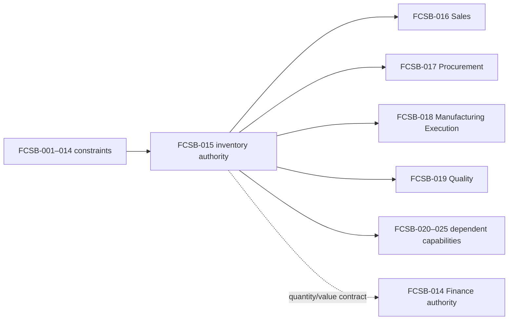
```mermaid
flowchart LR
  B["FCSB-001–014 constraints"] --> I["FCSB-015 inventory authority"]
  I --> S["FCSB-016 Sales"]
  I --> P["FCSB-017 Procurement"]
  I --> M["FCSB-018 Manufacturing Execution"]
  I --> Q["FCSB-019 Quality"]
  I --> X["FCSB-020–025 dependent capabilities"]
  I -. "quantity/value contract" .-> F["FCSB-014 Finance authority"]
```

## Chapter 2 — Executive Summary

FlowCraft currently has credible inventory master-data foundations: Item classifications and policy fields, effective-dated UOM conversions, company-scoped Warehouses, Warehouse Zones, Bins, Stock Statuses, Batch and Serial identities, organization scope, generic transaction links, workflow definitions, audit, Digital DNA, EOR metadata, reports, dashboards, and administration routes. These assets describe what may be stocked and where it may be governed. They do not record on-hand quantity, immutable movements, reservations, allocations, availability, cost layers, warehouse work, counts, or inventory-to-GL reconciliation.

The target operating model makes Inventory the sole writer of stock quantity, position, status, ownership, batch/serial movement, reservations, allocations, and movement history. Procurement, Sales, Manufacturing, Quality, Maintenance, and Projects submit intent and evidence. Inventory validates policy and posts movements; controlled projections provide availability. Warehouse execution turns approved effects into confirmed physical work. Finance consumes valuation inputs and remains the sole journal, period, valuation-posting, and financial-reconciliation authority.

Current maturity is “implemented master-data foundation with transaction and governance scaffolds,” evidenced by the accepted [DBA-004 migration](../../apps/api/prisma/migrations/20260714000000_enterprise_master_data_platform/migration.sql) and [master-data service](../../apps/api/src/master-data/master-data.service.ts). The next maturity step is not a picking screen; it is approval of movement grain, balance derivation, concurrency, correction, reservation, status, UOM, and reconciliation contracts. ATP, CTP, FEFO, mobile, costing, automation, and AI remain proposed or future until those contracts and acceptance evidence exist.

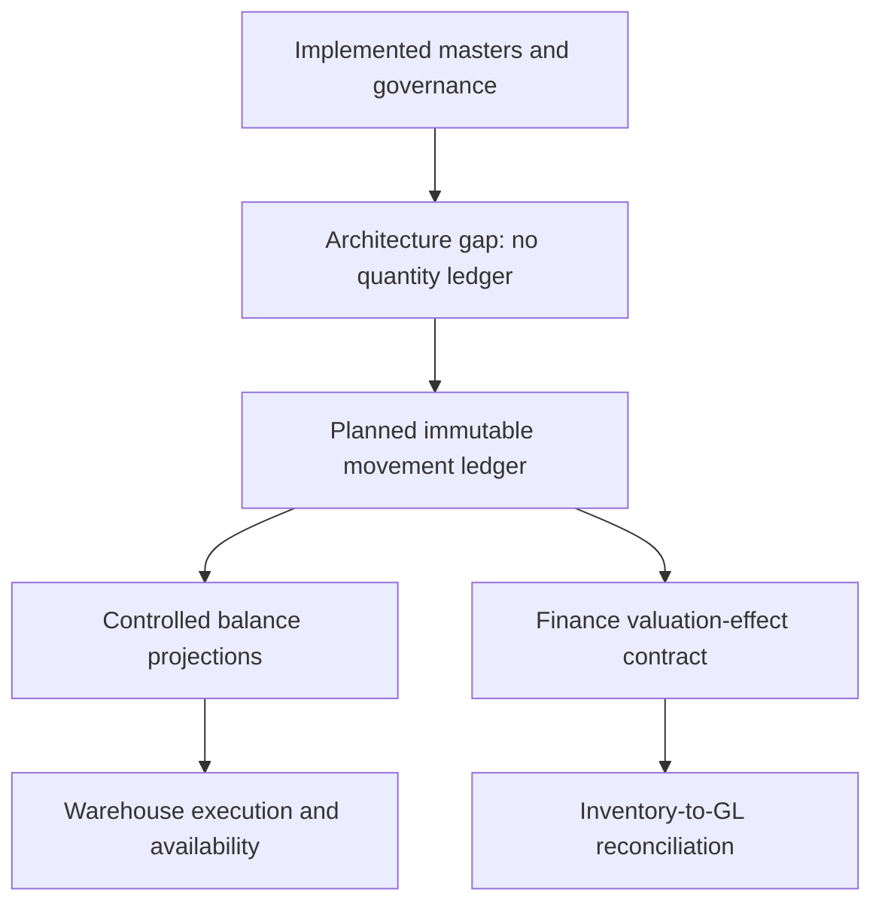
```mermaid
flowchart TB
  M["Implemented masters and governance"] --> G["Architecture gap: no quantity ledger"]
  G --> L["Planned immutable movement ledger"]
  L --> B["Controlled balance projections"]
  B --> W["Warehouse execution and availability"]
  L --> C["Finance valuation-effect contract"]
  C --> R["Inventory-to-GL reconciliation"]
```

## Chapter 3 — Inventory Architecture Principles

Inventory owns quantity truth; Finance owns financial-posting truth. Other domains may request effects but cannot write movement or balance records. Every stock effect creates an immutable movement, and posted movements cannot be edited or deleted. A correction is a linked reversal or compensating movement. Balance rows are derived or transactionally controlled projections and are never independent business evidence.

Warehouse, zone, location, bin, item, status, ownership, batch, serial, UOM, and base quantity are explicit at the applicable movement grain. Status changes are movements even when quantity and position stay constant. Batch and serial identities remain stable; UOM conversion versions and precision decisions are preserved with the event. Negative stock is rejected unless an approved scoped policy authorizes it. Reservations reduce reservable supply but do not move stock; allocations nominate eligible stock but do not create custody evidence. Availability formulas must name their exclusions and time horizon; ATP and CTP remain advisory until a proven runtime is accepted.

Quality owns disposition, Manufacturing owns production execution, Procurement owns purchase-order truth, Sales owns demand and customer commitment, Maintenance owns maintenance intent, and Projects own project demand. Inventory executes authorized stock effects. Finance validates valuation inputs and posts accounting. Cross-company movements use paired governance; company-, supplier-, customer-, and third-party-owned stock remain distinguishable. Reports are non-authoritative. Mobile and offline commands require least privilege, idempotent replay, and conflict handling. AI may explain or draft, but cannot reserve, allocate, release, move, adjust, scrap, transfer, or write off stock.

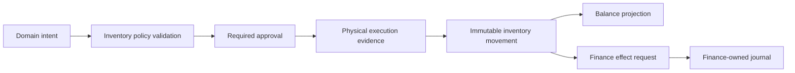
```mermaid
flowchart LR
  D["Domain intent"] --> V["Inventory policy validation"]
  V --> A["Required approval"]
  A --> E["Physical execution evidence"]
  E --> L["Immutable inventory movement"]
  L --> P["Balance projection"]
  L --> F["Finance effect request"]
  F --> J["Finance-owned journal"]
```

## Chapter 4 — Current Inventory Baseline

The accepted baseline is grounded in DBA-004 rather than inferred from labels. The [`Item` model](../../apps/api/prisma/schema.prisma#L1385) contains classification, base/purchase/sales/stock UOM references, manufacturing and replenishment strategies, tracking flags, shelf life, lead time, safety stock, minimum/maximum order quantity, reorder fields, default Warehouse/Supplier, and costing-policy attributes. The [`Warehouse` model](../../apps/api/prisma/schema.prisma#L818) carries company, branch, plant, location, parent hierarchy, virtual/negative-stock policy, default status, effective dates, and archive state. [`WarehouseZone`, `Bin`, `StockStatus`, `Batch`, and `SerialNumber`](../../apps/api/prisma/schema.prisma#L1807) establish governed identities and selected policy attributes.

The additive [DBA-004 migration](../../apps/api/prisma/migrations/20260714000000_enterprise_master_data_platform/migration.sql) creates those master tables and constraints. The [master-data registry](../../apps/api/src/master-data/master-data.registry.ts) exposes resources; the [service](../../apps/api/src/master-data/master-data.service.ts) validates hierarchy, UOM, tracking flags, company scope, dates, and archival; the [controller](../../apps/api/src/master-data/master-data.controller.ts) provides permission-checked generic endpoints. The [seed](../../apps/api/prisma/seed.ts) upserts representative warehouses, statuses, items, roles, permissions, and EOR registrations. The accepted [DBA-004 tests](../../apps/api/test/master-data.spec.ts) cover UOM precision/conversions, tracking consistency, warehouse scope/cycles, bin-zone consistency, and batch/serial identity. The [implementation report](../implementation/DBA-004-enterprise-master-data-implementation.md) explicitly says serial position fields are informational and no stock balance or movement is created.

Generic `TransactionDocument` and `TransactionLink` models, workflow-definition metadata, number series, audit logs, Digital DNA, reports, and dashboards are scaffolds for future composition. There is no Inventory module, movement model, balance model, reservation, allocation, availability, warehouse-task, cost-layer, landed-cost, or reconciliation engine in the accepted schema or service tree. Current settings routes administer masters; they are not proof of operational receipts, issues, transfers, counts, or mobile execution.

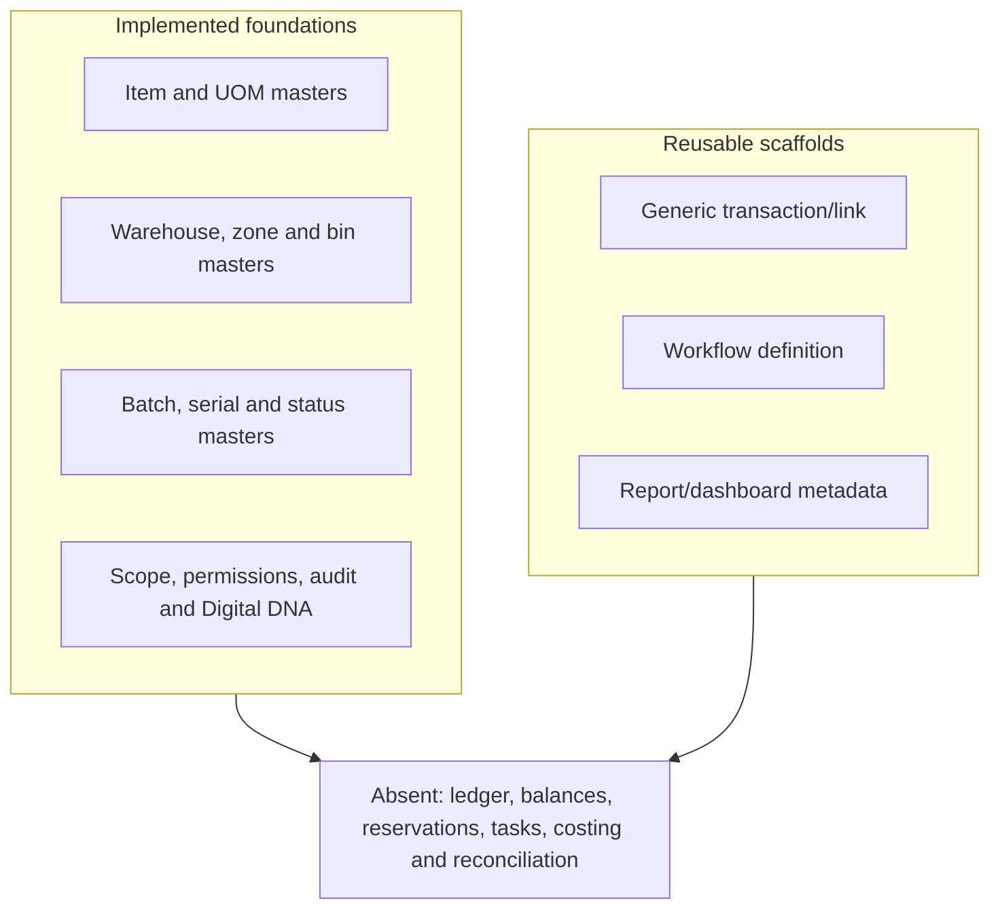
```mermaid
flowchart TB
  subgraph Implemented["Implemented foundations"]
    IT["Item and UOM masters"]
    WH["Warehouse, zone and bin masters"]
    TR["Batch, serial and status masters"]
    GOV["Scope, permissions, audit and Digital DNA"]
  end
  subgraph Scaffold["Reusable scaffolds"]
    TX["Generic transaction/link"]
    WF["Workflow definition"]
    RP["Report/dashboard metadata"]
  end
  GAP["Absent: ledger, balances, reservations, tasks, costing and reconciliation"]
  Implemented --> GAP
  Scaffold --> GAP
```

## Chapter 5 — Target Inventory Architecture

The target has twelve cooperating layers. Inventory Master Data governs item, UOM, warehouse topology, status, tracking, and ownership policies. Demand and Supply Intake normalizes Sales, Procurement, Manufacturing, Maintenance, Projects, and transfer requirements. Transaction Intake creates an idempotent stock-effect request. Validation and Policy checks scope, eligibility, dates, precision, controls, and evidence. Reservation and Allocation protect demand and select eligible supply without claiming movement.

The Inventory Movement Ledger is the durable quantity authority. Stock Balance Projections provide optimized views that can be rebuilt and reconciled. Warehouse Execution manages tasks and confirmations. Traceability and Genealogy connect batches, serials, sources, production, shipments, returns, and quality. The Valuation and Finance Contract sends accounting-effect inputs without creating journals. Reporting and Reconciliation prove internal and financial consistency. Security, Audit, and Operations protect every layer.

Master data, scope, authentication, audit, and metadata are current foundations. Transaction/workflow/report components are scaffolds. All inventory runtime layers are planned; mobile/offline, RFID, advanced optimization, and automation are future. No diagram box changes that status.

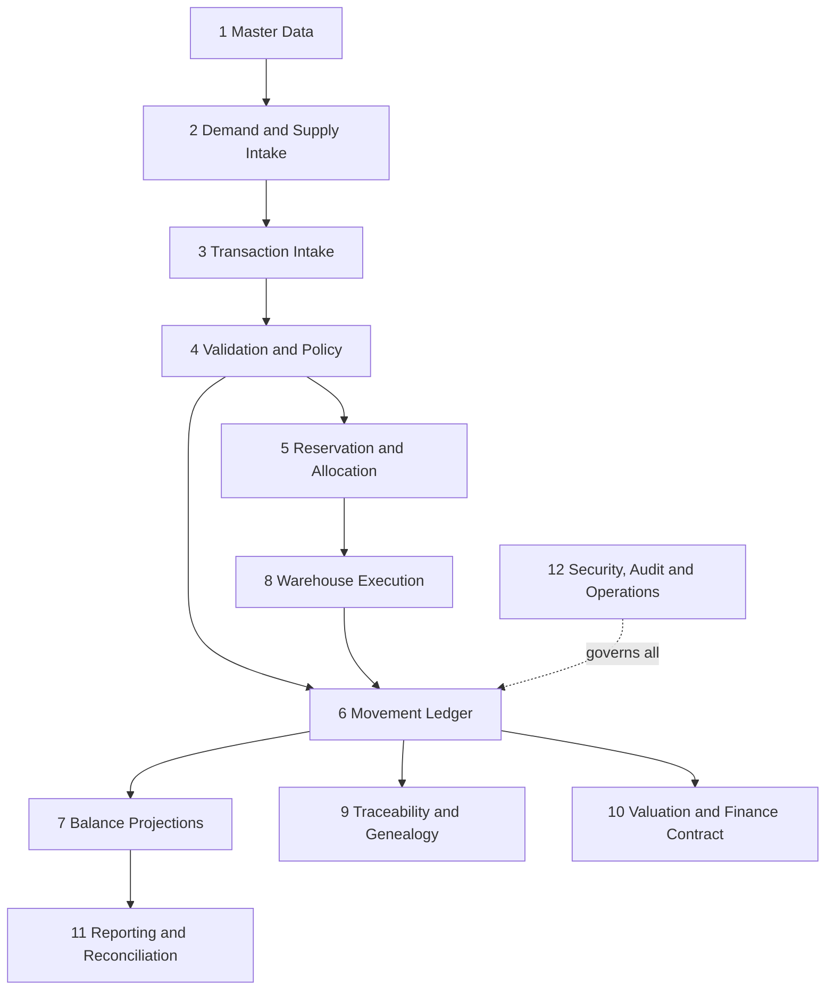
```mermaid
flowchart TB
  MD["1 Master Data"] --> DS["2 Demand and Supply Intake"]
  DS --> TI["3 Transaction Intake"] --> VP["4 Validation and Policy"]
  VP --> RA["5 Reservation and Allocation"]
  VP --> ML["6 Movement Ledger"]
  ML --> BP["7 Balance Projections"]
  RA --> WE["8 Warehouse Execution"] --> ML
  ML --> TG["9 Traceability and Genealogy"]
  ML --> VF["10 Valuation and Finance Contract"]
  BP --> RR["11 Reporting and Reconciliation"]
  SEC["12 Security, Audit and Operations"] -. "governs all" .-> ML
```

## Chapter 6 — Inventory Organization Model

Tenant is the isolation boundary; legal entity and company define ownership and financial responsibility; branch and plant provide operating scope. A Warehouse is a company-controlled custody node and may be linked to branch, plant, and Location. A warehouse zone groups operational areas. Storage location and bin provide progressively finer position identity. Dock and staging areas represent transient custody, while inspection, quarantine, production-staging, shipping-staging, consignment, transit, and virtual areas express controlled purposes.

The target does not assume every deployment needs every level. The approved hierarchy profile defines mandatory levels by warehouse type, but a posted movement records the finest authoritative position used at that time. A virtual warehouse cannot silently substitute for an unmodeled physical site. Transit is modeled explicitly so source issue and destination receipt can reconcile. Consignment areas add ownership status; they do not create legal conclusions.

Company owns warehouse authority, Inventory owns position master stewardship, Warehouse Operations owns physical use, Quality authorizes quality areas, and Security governs scope. Changes are effective-dated where identity/history matters. Capacity, hazardous-storage, temperature, and dock rules remain policy directions until requirements and operational evidence approve them.

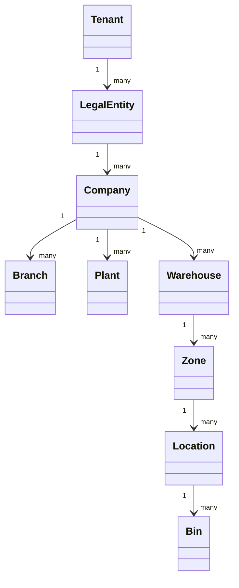
```mermaid
classDiagram
  class Tenant
  class LegalEntity
  class Company
  class Branch
  class Plant
  class Warehouse
  class Zone
  class Location
  class Bin
  Tenant "1" --> "many" LegalEntity
  LegalEntity "1" --> "many" Company
  Company "1" --> "many" Branch
  Company "1" --> "many" Plant
  Company "1" --> "many" Warehouse
  Warehouse "1" --> "many" Zone
  Zone "1" --> "many" Location
  Location "1" --> "many" Bin
```

## Chapter 7 — Warehouse Architecture

A Warehouse target record has immutable identity plus code, name, type, company, optional branch/plant/Location, parent, operational status, effective dates, owner, and security scope. Capability flags state whether receiving, shipping, production supply, quality handling, or consignment is allowed. Capacity and controlled-storage attributes are constraints only after approved units, measuring processes, and exception policies exist. Currency and valuation scope are references to Finance policy, never local journal authority.

Lifecycle states are Proposed, Active, Suspended, Closing, and Retired. Activation requires approved topology, status defaults, access, movement policy, open-task handling, and Finance mapping readiness. Suspension blocks new work but permits controlled evacuation and correction. Closing requires zero or explicitly transferred balances, resolved reservations/tasks, traceability retention, and reconciliation. Retirement preserves identity and historical references; deletion of a used warehouse is prohibited.

The implemented [`Warehouse` master](../../apps/api/prisma/schema.prisma#L818) already has company/branch/plant/location/parent, type, virtual, negative-stock, default-status, status, effective-date, and archive attributes. Receiving/shipping/production/quality capabilities, capacity enforcement, custody tasks, and lifecycle orchestration remain planned.

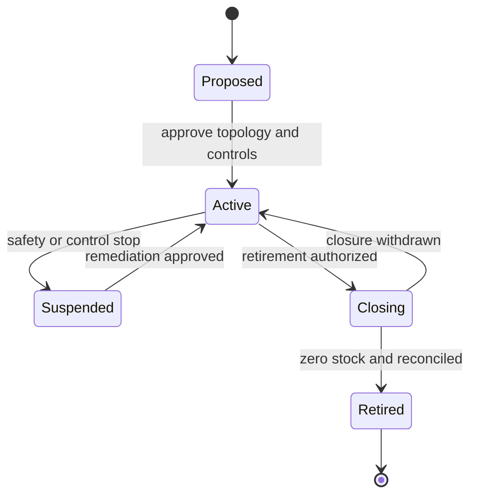
```mermaid
stateDiagram-v2
  [*] --> Proposed
  Proposed --> Active: approve topology and controls
  Active --> Suspended: safety or control stop
  Suspended --> Active: remediation approved
  Active --> Closing: retirement authorized
  Closing --> Active: closure withdrawn
  Closing --> Retired: zero stock and reconciled
  Retired --> [*]
```

## Chapter 8 — Zone, Location and Bin Architecture

Zone defines a warehouse subdivision such as receiving, bulk, picking, quality, return, scrap, production staging, or shipping. Aisle, rack, shelf, and bin form a configurable locator vocabulary below it. Dock and staging positions represent handoff queues; picking faces optimize issue work; bulk positions hold reserve stock. Blocked and quality positions restrict eligibility through status and location policy together, avoiding the assumption that a location name alone controls stock.

Target constraints include quantity, weight, volume, item class, ownership, batch/serial mixing, stock-status mixing, temperature, and approved hazard classification. Putaway priority favors eligible positions; picking priority sequences eligible supply after FEFO/FIFO and reservation constraints. Fixed-bin assignment provides stability while dynamic assignment improves utilization. Capacity failures create exceptions, never silent overfill.

DBA-004 implements Zone and Bin masters with hierarchy, type, selected temperature/capacity fields, pickable/receivable/blocked flags, and warehouse consistency checks. It does not implement location occupancy, mixed-stock validation, slotting, priority calculation, or bin-level stock. Those are planned runtime concerns.

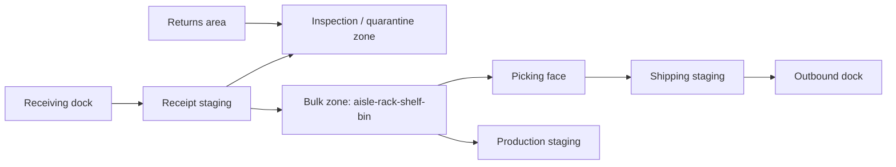
```mermaid
flowchart LR
  D["Receiving dock"] --> ST["Receipt staging"]
  ST --> Q["Inspection / quarantine zone"]
  ST --> B["Bulk zone: aisle-rack-shelf-bin"]
  B --> PF["Picking face"]
  PF --> SS["Shipping staging"]
  SS --> OD["Outbound dock"]
  B --> PS["Production staging"]
  R["Returns area"] --> Q
```

## Chapter 9 — Item Inventory Classification

Classification controls which inventory behaviors are meaningful. Stock items participate in quantity authority; non-stock items may appear on documents but cannot create on-hand. Raw materials and packaging feed production; semi-finished and finished goods may be received from production; consumables may issue to expense; spare parts and tools interact with Maintenance; services never create physical quantity. Co-products and by-products use independently identified receipts, while scrap requires controlled disposition.

Rework items preserve the link to original material. Phantom items are planning structures rather than stocked outputs. Subcontracted items require ownership-aware movements to and from suppliers. Consignment items separate custody from ownership. Customer-owned items remain visible and traceable but are excluded from company-owned valuation and availability unless policy permits their specific demand.

Item class does not choose a universal valuation or warehouse strategy. Policy profiles declare allowed receipts, issues, tracking, quality, ownership, and accounting-effect families by company/item class. A class change with historical movement requires effective-dated governance and impact assessment rather than rewriting old semantics.

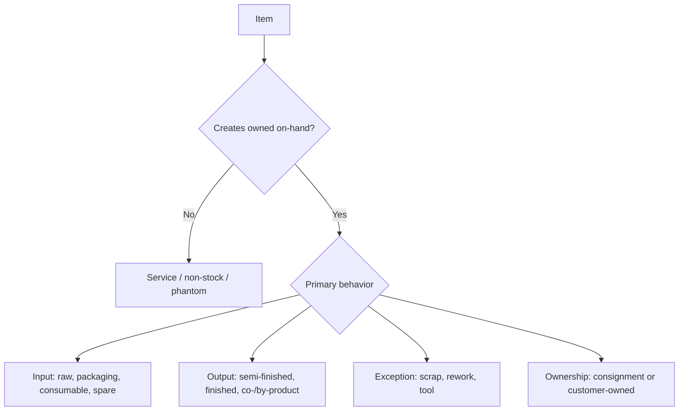
```mermaid
flowchart TB
  I["Item"] --> S{"Creates owned on-hand?"}
  S -- "No" --> NS["Service / non-stock / phantom"]
  S -- "Yes" --> P{"Primary behavior"}
  P --> IN["Input: raw, packaging, consumable, spare"]
  P --> OUT["Output: semi-finished, finished, co-/by-product"]
  P --> EX["Exception: scrap, rework, tool"]
  P --> OW["Ownership: consignment or customer-owned"]
```

## Chapter 10 — Tracking Method Architecture

No tracking records quantity by item and position. Batch tracking requires a stable internal batch identity and may retain supplier lot, manufacture date, expiry, retest date, quality status, and controlled attributes. Serial tracking requires company-scoped uniqueness and one-unit lifecycle evidence. Batch-plus-serial associates individually tracked units with a lot while preserving both identities; it is supported as master policy today but operational enforcement remains planned.

Tracking is decided from traceability obligation, recall granularity, shelf life, warranty/service need, quality sampling, production genealogy, and operational feasibility. Supplier lots are external references, not substitutes for internal identity. Customer lot references are aliases recorded at fulfillment. Serial corrections require exceptional approval and an auditable predecessor/successor relationship; they never rewrite posted history.

Expiry, manufacture, and retest dates influence eligibility only through approved policies. Quality status is owned by Quality, while Inventory posts authorized status and position effects. The target movement carries the tracking identity and validation outcome so later master changes cannot weaken historical evidence.

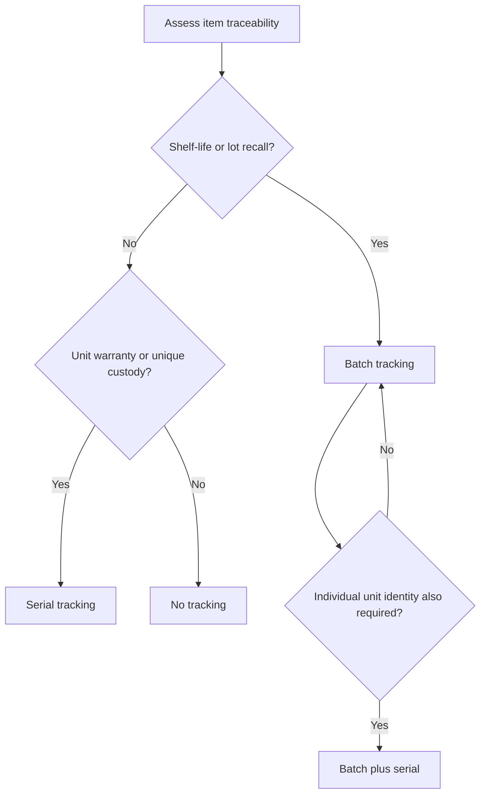
```mermaid
flowchart TD
  A["Assess item traceability"] --> E{"Shelf-life or lot recall?"}
  E -- "Yes" --> B["Batch tracking"]
  E -- "No" --> U{"Unit warranty or unique custody?"}
  U -- "Yes" --> S["Serial tracking"]
  U -- "No" --> N["No tracking"]
  B --> C{"Individual unit identity also required?"}
  C -- "Yes" --> BS["Batch plus serial"]
  C -- "No" --> B
```

## Chapter 11 — Inventory Status Architecture

Stock status is an authoritative eligibility dimension, not a display tag. Core target statuses include Available, Reserved, Allocated, Pending Inspection, Quality Hold, Quarantine, Blocked, Damaged, Expired, Rejected, In Transit, Consigned, Customer-owned, Supplier-owned, Scrap, Rework, and WIP. Ownership may ultimately remain an orthogonal dimension; the labels here describe business views, not a preselected physical schema.

Transitions require an actor and reason. Quality alone decides Pending Inspection, Hold, Quarantine, Accepted, Conditional Acceptance, or Rejected disposition. Inventory executes the authorized status movement. Expiry automation may propose or enforce blocking only under approved shelf-life policy. Reservation/allocation are preferably separate ledgers; presenting them as statuses must not lose demand linkage or double-reduce availability.

Available stock can enter Reserved/Allocated views without changing on-hand. Physical issue removes on-hand; transfer issue enters In Transit until paired receipt. Damaged, Expired, Rejected, and Blocked stock are non-nettable by default. Release from controlled states needs evidence and, where configured, approval. Direct status-field manipulation on a Batch or Serial master is not movement history.

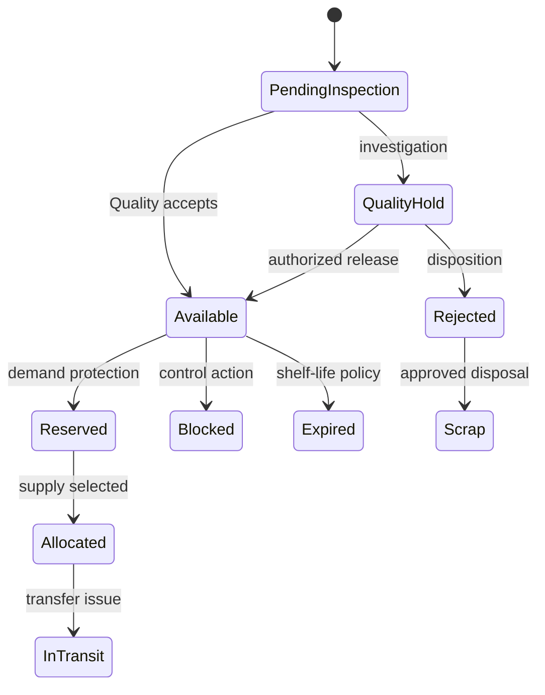
```mermaid
stateDiagram-v2
  [*] --> PendingInspection
  PendingInspection --> Available: Quality accepts
  PendingInspection --> QualityHold: investigation
  QualityHold --> Available: authorized release
  QualityHold --> Rejected: disposition
  Available --> Reserved: demand protection
  Reserved --> Allocated: supply selected
  Allocated --> InTransit: transfer issue
  Available --> Blocked: control action
  Available --> Expired: shelf-life policy
  Rejected --> Scrap: approved disposal
```

## Chapter 12 — Inventory Movement Ledger

The planned movement ledger is the single durable record of quantity change. A movement contains immutable ID and type; source domain, transaction and line; tenant/company; warehouse and position from/to; item; batch/serial; quantity, transaction UOM, base quantity and preserved conversion version; status from/to; ownership from/to; event and posting/effective dates; correlation/idempotency key; reversal/compensation link; actor/service identity; Digital DNA; audit reference; and Finance valuation reference.

A receipt has a positive effect at a destination; an issue has a negative effect at a source. A transfer is represented by balanced legs or linked issue/receipt with explicit transit, never an in-place warehouse overwrite. Status, ownership, batch split, and position changes record matched from/to effects even when net company quantity is zero. Ledger sequence and concurrency design remain open, but posting must be atomic at the approved consistency boundary.

Posted entries cannot be updated or deleted. Erroneous events are reversed with the original grain, then replaced when appropriate. The ledger rejects duplicate idempotency keys in their scope and retains source correlation. Audit describes the command and decision; the movement is the quantity evidence. Digital DNA identifies durable records but does not replace business keys or trace links.

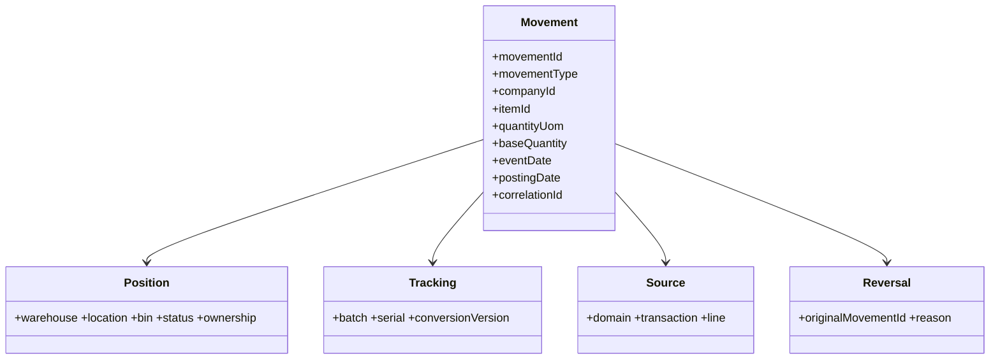
```mermaid
classDiagram
  class Movement {
    +movementId
    +movementType
    +companyId
    +itemId
    +quantityUom
    +baseQuantity
    +eventDate
    +postingDate
    +correlationId
  }
  class Position { +warehouse +location +bin +status +ownership }
  class Tracking { +batch +serial +conversionVersion }
  class Source { +domain +transaction +line }
  class Reversal { +originalMovementId +reason }
  Movement --> Position
  Movement --> Tracking
  Movement --> Source
  Movement --> Reversal
```

## Chapter 13 — Stock Balance Architecture

The balance grain is tenant, company, warehouse, finest authoritative location/bin, item, batch, serial, stock status, ownership, and base UOM. Views aggregate that grain to show on-hand, reserved, allocated, available, in transit, quality hold, blocked, WIP, consigned, customer-owned, or other policy-specific quantities. Null batch/serial/position values are meaningful only when the governing tracking or topology profile permits them.

On-hand is the signed sum of posted physical movements at the grain. Reserved and allocated come from their own active records. Available is a named formula, not a stored universal truth. Transit is derived from unmatched governed transfer legs. Quality and blocked views are status partitions. Ownership partitions prevent third-party custody from contaminating company-owned valuation.

The projection may be synchronous, asynchronous, or hybrid, but its watermark and staleness are visible. A rebuild replays immutable movements and active reservation/allocation events. Reconciliation compares ledger sums with projections by partition, reports unexplained deltas, and blocks certification when material thresholds fail. No administrator may “fix” a balance row directly.

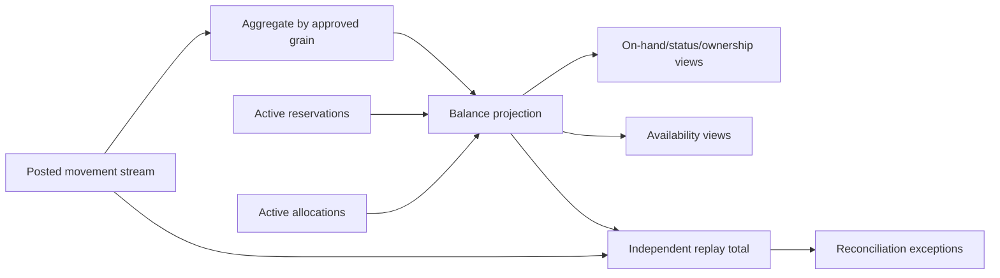
```mermaid
flowchart LR
  L["Posted movement stream"] --> A["Aggregate by approved grain"]
  R["Active reservations"] --> P["Balance projection"]
  X["Active allocations"] --> P
  A --> P
  P --> OH["On-hand/status/ownership views"]
  P --> AV["Availability views"]
  L --> RC["Independent replay total"]
  P --> RC
  RC --> EX["Reconciliation exceptions"]
```

## Chapter 14 — Inventory Transaction Types

Physical families are Receipt, Issue, Transfer, Adjustment, Return, Production Issue, Production Completion, Sales Delivery, Purchase Receipt, Subcontract Movement, Consignment Receipt/Issue, and Ownership Transfer. Control families are Reservation, Release, Allocation, Deallocation, Status Change, Batch Split, future Batch Merge, Serial Assignment/Correction, and Count Adjustment. Each family declares required source evidence, allowed positions/statuses, approval, quantity sign, tracking behavior, Finance effect, and reversal semantics.

Shared semantics make movement identity, UOM normalization, scope, idempotency, approval, execution confirmation, and audit consistent. Domain-specific semantics remain explicit: a purchase receipt references commercial order evidence; a production issue references production demand; a sales issue references fulfillment intent; a count adjustment references signed count variance. A generic `TransactionDocument` may carry intake metadata, but JSON payload alone cannot serve as the stock ledger.

Reservation and allocation are inventory transactions without on-hand movement. Batch split conserves total quantity while creating child identity. Ownership transfer changes who owns custody without assuming physical relocation. Cross-company transfer combines inventory, commercial, tax-direction, and Finance contracts and therefore cannot be reduced to a single warehouse change.

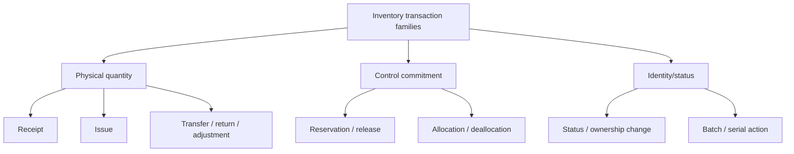
```mermaid
flowchart TB
  T["Inventory transaction families"] --> PH["Physical quantity"]
  T --> CT["Control commitment"]
  T --> ID["Identity/status"]
  PH --> RC["Receipt"]
  PH --> IS["Issue"]
  PH --> TR["Transfer / return / adjustment"]
  CT --> RS["Reservation / release"]
  CT --> AL["Allocation / deallocation"]
  ID --> ST["Status / ownership change"]
  ID --> BS["Batch / serial action"]
```

## Chapter 15 — Inventory Transaction Lifecycle

Draft captures intent without authority. Validated confirms master, scope, policy, UOM, tracking, availability, and duplicate checks at a point in time. Submitted requests approval; Approved authorizes the business exception or movement envelope. Released makes work eligible. In Execution records ongoing warehouse work; Partially Executed retains remaining quantity and exact confirmations. Executed means physical evidence is complete. Posted means immutable ledger effects are committed.

Approval and execution are deliberately separate: an approver authorizes, while a receiver, picker, counter, or service confirms what occurred. Cancelled Before Posting creates no movement. Failure preserves error and retry eligibility. Reversal occurs only after posting and links to the original effects. Closed requires all legs, exceptions, Finance-effect acknowledgements, and reconciliation obligations resolved. Archived retains discoverability under policy.

State transition commands carry expected version and idempotency key. Revalidation occurs when policy-sensitive time elapses between approval and execution. Partial execution cannot silently inflate the approved envelope. Failed posting is retried atomically or compensated; it does not leave an authoritative half-balance.

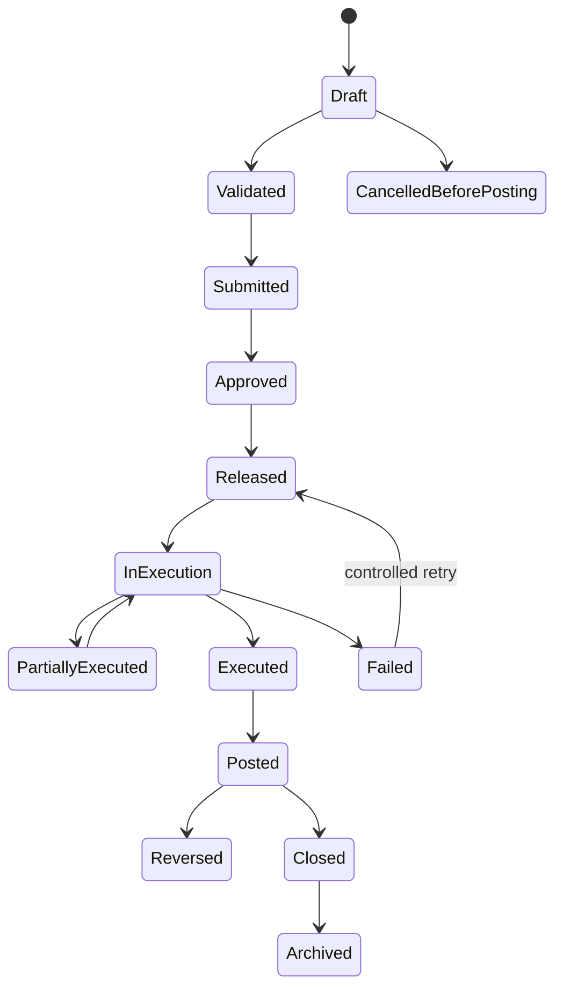
```mermaid
stateDiagram-v2
  [*] --> Draft
  Draft --> Validated
  Validated --> Submitted
  Submitted --> Approved
  Approved --> Released
  Released --> InExecution
  InExecution --> PartiallyExecuted
  PartiallyExecuted --> InExecution
  InExecution --> Executed
  Executed --> Posted
  Posted --> Reversed
  Draft --> CancelledBeforePosting
  InExecution --> Failed
  Failed --> Released: controlled retry
  Posted --> Closed
  Closed --> Archived
```

## Chapter 16 — Inventory Validation Architecture

Validation first resolves tenant, company, plant, branch, warehouse, location/bin, and ownership scope. It checks active/effective Item and Warehouse masters; transaction permission; warehouse capability; position status; stock status transition; item class; stock UOM and preserved conversion; decimal precision; batch/serial requirement and uniqueness; shelf life; expiry; Quality disposition; and any Manufacturing or Maintenance restriction.

It then evaluates quantity availability, active reservations and allocations, negative-stock policy, source transaction/line, event and posting dates, approval envelope, segregation of duties, cross-company pairing, valuation-reference completeness, and duplicate correlation. A stale availability read never substitutes for the posting-time concurrency check. Exceptions are categorized as correctable input, approval-required, policy violation, concurrency conflict, or non-retryable integrity failure.

Validation has two moments: preflight gives a user or integration actionable feedback; commit validation protects authority inside the posting transaction. The second check cannot be customized away. Customer extensions may add stricter rules but cannot bypass quantity, status, ownership, UOM, tracking, scope, approval, SoD, idempotency, or reconciliation controls.

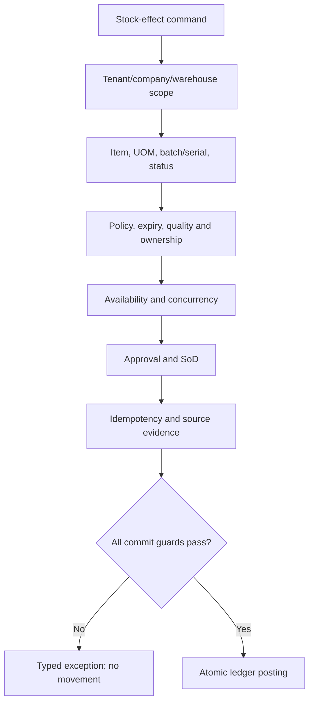
```mermaid
flowchart TD
  Q["Stock-effect command"] --> S["Tenant/company/warehouse scope"]
  S --> M["Item, UOM, batch/serial, status"]
  M --> P["Policy, expiry, quality and ownership"]
  P --> C["Availability and concurrency"]
  C --> A["Approval and SoD"]
  A --> D["Idempotency and source evidence"]
  D --> V{"All commit guards pass?"}
  V -- "No" --> E["Typed exception; no movement"]
  V -- "Yes" --> L["Atomic ledger posting"]
```

## Chapter 17 — Reservation Architecture

A reservation protects eligible supply for a named demand without changing on-hand. Its record identifies demand domain/document/line, company, item, requested and base quantity, warehouse or network scope, preferred batch/serial, priority, required date, firmness, expiry, partial-reservation rule, substitution policy, pegging, ownership requirement, status, and correlation. The reservation owner is Inventory; the source domain owns demand validity.

Soft reservations constrain planning or promising; firm reservations reduce available-to-reserve. Release returns protected supply when demand is cancelled, expired, fulfilled, or explicitly reprioritized. Reallocation links old and new supply selections rather than erasing history. Partial reservation exposes uncovered demand. A demand cannot reserve supplier- or customer-owned stock unless its ownership contract permits it.

Posting uses atomic availability checks to prevent over-reservation under concurrency. Reservation expiry is a controlled command, not a background deletion. A reservation may be pegged at item/warehouse level before batch or bin is known. It never creates a movement, shipment, production issue, or journal.

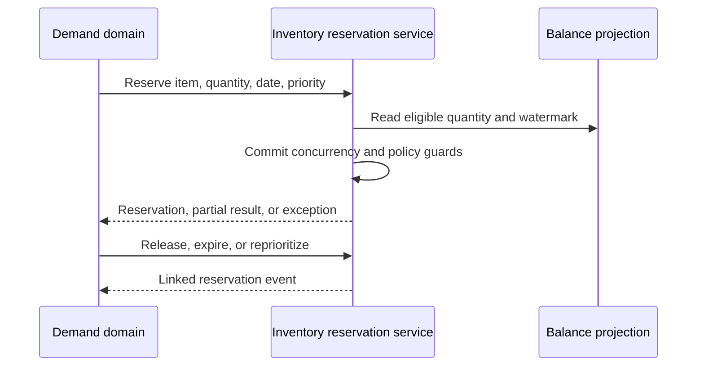
```mermaid
sequenceDiagram
  participant D as Demand domain
  participant I as Inventory reservation service
  participant B as Balance projection
  D->>I: Reserve item, quantity, date, priority
  I->>B: Read eligible quantity and watermark
  I->>I: Commit concurrency and policy guards
  I-->>D: Reservation, partial result, or exception
  D->>I: Release, expire, or reprioritize
  I-->>D: Linked reservation event
```

## Chapter 18 — Allocation Architecture

Allocation selects the supply intended to satisfy a reservation or released demand. Soft allocation nominates warehouse or batch; hard allocation binds batch, serial, location/bin, or handling unit. Production, customer-order, transfer, and wave allocations retain their source. Substitution records the approved alternate and reason. Reallocation and deallocation preserve links so shortage analysis can explain who displaced whom.

Allocation differs from reservation in grain and operational consequence: a reservation protects quantity; allocation chooses stock. It differs from movement because selected stock has not necessarily changed position or custody. An allocation becomes warehouse work only after release creates a task envelope with source position, required confirmation, priority, and exception route.

Allocation rules filter status, ownership, shelf life, batch/serial, quality, reservation, FEFO/FIFO, customer requirement, and position eligibility. Concurrent allocation uses locks or compare-and-set at the approved grain. Wave allocation may coordinate many demands, but cannot over-allocate or hide priority overrides.

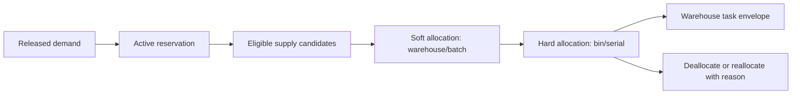
```mermaid
flowchart LR
  D["Released demand"] --> R["Active reservation"]
  R --> C["Eligible supply candidates"]
  C --> S["Soft allocation: warehouse/batch"]
  S --> H["Hard allocation: bin/serial"]
  H --> T["Warehouse task envelope"]
  H --> X["Deallocate or reallocate with reason"]
```

## Chapter 19 — Availability Architecture

Availability is a family of governed measures. On-hand is posted physical quantity. Available-to-reserve equals eligible on-hand minus firm reservations and policy exclusions. Available-to-pick further excludes unallocated, inaccessible, non-pickable, expired, held, or task-locked supply according to the picking policy. Available-to-ship requires confirmed picking/packing and shipping eligibility. Quality-approved availability excludes pending and held stock. Projected availability adds time-phased inbound and planned supply, demand, safety stock, and expiry.

One baseline formula is `ATR(t) = eligible on-hand(t) + eligible firm inbound(t) - firm demand(t) - safety stock(t) - non-nettable(t)`. Each view names whether inbound is posted, expected, or planned; which statuses/ownerships count; whether allocations are subtracted separately; its horizon; and its freshness watermark. Without that metadata, “available” is prohibited in authoritative interfaces.

Current Item safety-stock and reorder fields are inputs only. Current StockStatus flags are policy scaffolds only. No real-time availability runtime exists. Target queries are advisory until posting-time concurrency checks succeed, so a screen response never guarantees that later movement will post.

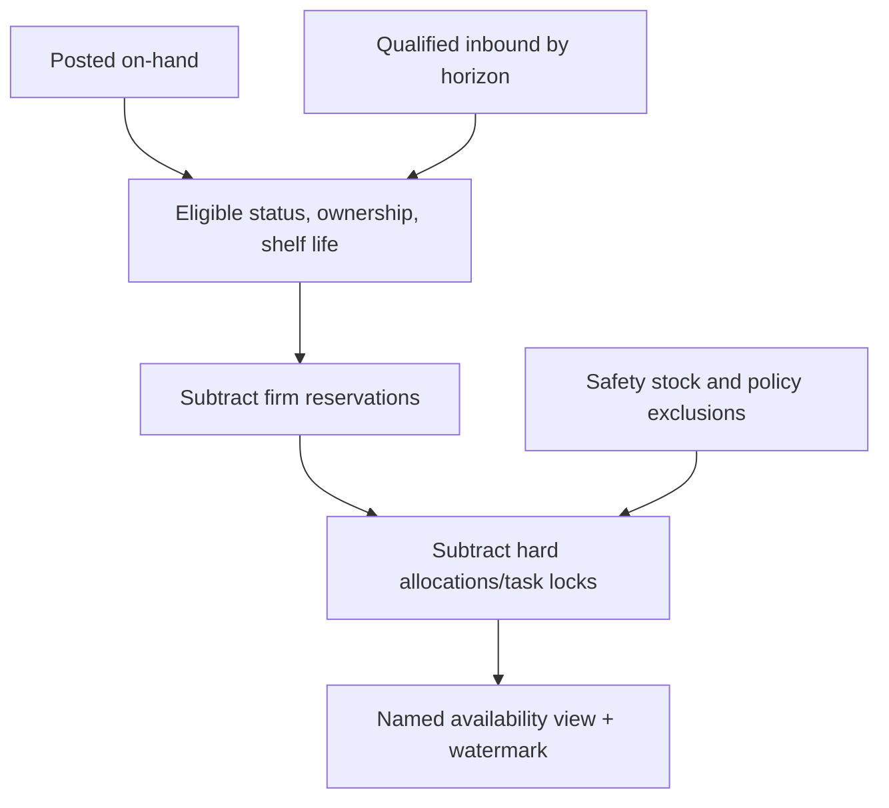
```mermaid
flowchart TB
  OH["Posted on-hand"] --> EL["Eligible status, ownership, shelf life"]
  IN["Qualified inbound by horizon"] --> EL
  EL --> R["Subtract firm reservations"]
  R --> A["Subtract hard allocations/task locks"]
  SS["Safety stock and policy exclusions"] --> A
  A --> V["Named availability view + watermark"]
```

## Chapter 20 — ATP and CTP Direction

ATP advises how much demand can be promised by date from qualified on-hand, firm supply, reservations, allocations, safety stock, time fences, lead times, and demand priority. CTP extends the question to production capacity, material feasibility, procurement lead time, approved calendars, and alternative supply. A confirmed quantity/date records assumptions and calculation version; it is not itself a stock reservation or production authorization.

Reconfirmation runs when supply, demand, priority, quality, expiry, capacity, or lead-time assumptions change. Exceptions expose shortfall, lateness, substitution, split delivery, and confidence. Sales owns the customer promise, Planning owns capacity and supply assumptions, Inventory owns on-hand/reservation inputs, and Manufacturing/Procurement own their firm-supply evidence.

FlowCraft has no ATP or CTP runtime. FCSB-015 defines only contracts and controls. Technology, horizon algorithms, capable-resource model, and optimization remain open and depend on FCSB-016 through FCSB-018.

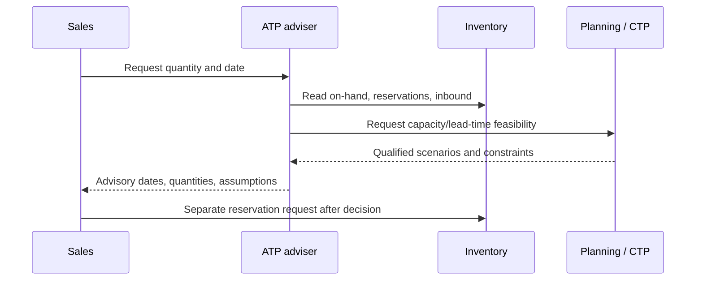
```mermaid
sequenceDiagram
  participant S as Sales
  participant A as ATP adviser
  participant I as Inventory
  participant P as Planning / CTP
  S->>A: Request quantity and date
  A->>I: Read on-hand, reservations, inbound
  A->>P: Request capacity/lead-time feasibility
  P-->>A: Qualified scenarios and constraints
  A-->>S: Advisory dates, quantities, assumptions
  S->>I: Separate reservation request after decision
```

## Chapter 21 — Goods Receipt Architecture

Receipt families include purchase, production, customer return, transfer, subcontract, and consignment. An expected receipt may originate from purchase order, advance-shipping notice, production completion, return authorization, or transfer shipment, but it is not on-hand. Receipt confirmation captures actual item, quantity/UOM, destination staging, ownership, batch/serial, dates, condition, source line, receiver, and variance evidence.

Over/under and damaged receipts follow tolerance and exception approval. Blind-receipt direction may conceal expected quantity from the receiver while retaining source matching for supervisors. Items requiring inspection enter Pending Inspection or approved staging and create a Quality request. Accepted goods create a putaway request. The movement emits a valuation-effect request; Finance decides accrual, clearing, tax, and journal effects.

Reversal references the original receipt and considers downstream putaway, allocation, issue, quality, and Finance state. A duplicate scan or integration replay returns the existing result. Purchase receipt does not prove supplier invoice acceptance, and production receipt does not prove production-order financial close.

```mermaid
sequenceDiagram
  participant P as Source domain
  participant R as Receiver
  participant I as Inventory
  participant Q as Quality
  participant F as Finance
  P->>I: Expected receipt evidence
  R->>I: Actual quantity, batch/serial, condition
  I->>I: Validate variance and idempotency
  I->>Q: Inspection request when required
  I->>I: Post staging receipt movement
  I->>F: Valuation-effect request
  I-->>R: Putaway request or controlled hold
```

## Chapter 22 — Putaway Architecture

Putaway starts with confirmed stock at dock or staging. The request identifies item, quantity, batch/serial, ownership, status, source position, handling constraints, and due time. Candidate rules consider zone purpose, bin receivability, capacity, fixed/dynamic assignment, consolidation, batch/serial mixing, temperature policy, approved hazard restrictions, quality state, and overflow hierarchy.

The engine direction ranks eligible destinations and explains exclusions. An operator confirms actual destination and quantity; a short, split, blocked, or substituted destination becomes an exception. Confirmation posts a position-transfer movement from staging to storage. A recommendation does not change stock, and an unconfirmed task cannot become authoritative.

Current Zone/Bin capacity and receivable flags are master-data foundations. There is no occupancy projection, slotting, putaway request, warehouse task, device flow, or confirmation runtime. Hazard and temperature behaviors remain conceptual until approved operational requirements exist.

```mermaid
flowchart TD
  P["Receipt in staging"] --> C["Build eligible destination set"]
  C --> K["Capacity and storage constraints"]
  K --> R["Rank fixed, consolidation, dynamic, overflow"]
  R --> T["Release putaway task"]
  T --> S{"Operator confirms destination?"}
  S -- "Exception" --> E["Supervisor resolution"]
  S -- "Yes" --> M["Post staging-to-bin movement"]
```

## Chapter 23 — Goods Issue Architecture

Issue families serve Sales, Manufacturing, Maintenance, Projects, expense consumption, supplier returns, scrap, and transfer. An issue command names source demand, approved quantity, item/UOM, source position, allocation, ownership, status, batch/serial, reason, event date, and recipient or destination context. It cannot infer a source that violates a hard allocation or tracking rule.

Over/under issue and substitution use domain-specific tolerances and approval. A production issue preserves order/operation and genealogy; a maintenance issue preserves work order/equipment; a project issue preserves project/cost dimensions; scrap requires disposition evidence; supplier return links the original receipt. Posting reduces on-hand and emits the applicable Finance-effect request without posting a journal.

Reversal returns the exact status/ownership/tracking grain when possible and records deviations when physical recovery differs. An issue may follow picking, or be directly confirmed for controlled point-of-use scenarios, but it always creates immutable movement evidence.

```mermaid
flowchart LR
  D["Approved domain demand"] --> A["Reservation/allocation check"]
  A --> P["Pick or point-of-use confirmation"]
  P --> V["Quantity, tracking, status, ownership validation"]
  V --> I["Post issue movement"]
  I --> G["Genealogy / fulfillment evidence"]
  I --> F["Finance-effect request"]
```

## Chapter 24 — Picking Architecture

Picking converts released allocations into confirmed removal from source positions. Single-order picking preserves one demand per task; batch and wave picking group work; zone picking hands work across areas; cluster picking separates multiple orders in one route. Selection policy may use FEFO for expiring stock, FIFO direction for non-expiring stock, serial eligibility, location sequence, handling constraints, and customer-specific shelf life.

A pick list is an instruction, not movement truth. The picker scans or identifies source, item, batch/serial, quantity, and destination staging/container. Short pick records actual quantity and cause. Substitution requires eligibility and approval. Wrong-location, damaged, missing, or held stock routes to an exception rather than silently changing allocation.

Confirmation may post a bin-to-pick-staging movement or retain a task-state custody view until issue, depending on the approved ledger model. Reversal restores traceable position and allocation state. Wave, zone, cluster, route optimization, and mobile picking are planned, not implemented.

```mermaid
sequenceDiagram
  participant W as Wave / order release
  participant A as Allocation
  participant O as Picker
  participant I as Inventory ledger
  W->>A: Group eligible demand
  A-->>O: Pick tasks by zone and sequence
  O->>O: Verify source, item, batch/serial
  O->>I: Confirm actual or short pick
  I-->>A: Movement and allocation consumption
  A-->>W: Completed or exception quantities
```

## Chapter 25 — Packing and Shipping Handoff

Packing assembles picked stock into package, carton, container, or handling unit at an identified station. The package records weight, volume, label and barcode references, batch/serial contents, shipment reference, seal, document package, partial-shipment partition, and pack exceptions. Physical measurements are evidence; declared carrier values and documents remain Logistics responsibilities.

Over/short pack is reconciled against picked and allocated quantities. A package cannot contain an unpicked serial or an incompatible ownership/status. Proof of dispatch marks carrier handoff evidence. Inventory owns the physical issue movement; Sales owns fulfillment intent and customer commitment; Logistics owns carrier planning and delivery evidence. Packing alone does not reduce on-hand unless the approved custody model posts a staging move.

The handoff contract prevents shipment confirmation without an Inventory issue and prevents an issue from masquerading as customer delivery. Partial shipment leaves explicit residual demand, reservation, and allocation state. Label/barcode generation direction is subject to FCSB-010 and future mobile/logistics design.

```mermaid
flowchart LR
  PS["Picked stock in shipping staging"] --> PK["Pack and verify contents"]
  PK --> HU["Package / carton / container identity"]
  HU --> SH["Sales/Logistics shipment handoff"]
  SH --> PD["Proof of dispatch"]
  PD --> IS["Inventory issue movement"]
  SH --> CF["Customer fulfillment update"]
```

## Chapter 26 — Transfer Architecture

Intra-warehouse transfer changes position; inter-warehouse, branch, or plant transfer changes custody scope; intercompany transfer changes legal ownership and requires paired commercial and Finance governance. A two-step transfer posts source issue into explicit transit and destination receipt out of transit. A one-step move is permitted only where custody and control risk justify atomic confirmation.

The transfer records source/destination company, warehouse, position, item, batch/serial, ownership, status, quantity/UOM, shipment, expected receipt, dates, and correlation. Partial receipt leaves open transit. Loss or damage in transit uses disposition and adjustment evidence, not a forced destination receipt. Currency, valuation, and tax direction are supplied to Finance/Tax contracts and are not decided by Inventory.

Reconciliation compares shipped, in-transit, received, rejected, lost, and reversed quantities. Cross-company completion requires both inventory legs and paired financial/commercial evidence. No user may overwrite the serial’s current warehouse to represent a transfer.

```mermaid
sequenceDiagram
  participant S as Source warehouse
  participant T as Transit control
  participant D as Destination warehouse
  participant F as Finance / intercompany
  S->>T: Transfer issue by batch/serial
  T->>F: Ownership/valuation event reference
  T->>D: Expected transfer receipt
  D->>T: Actual receipt, variance, damage
  T-->>S: Close or exception
  T-->>F: Reconciled paired-leg result
```

## Chapter 27 — Adjustment Architecture

Adjustment corrects proven quantity, status, batch, serial, ownership, or position variance. Positive and negative adjustments require reason taxonomy, source evidence, counting or incident context, requested/approved actors, event date, valuation-effect expectation, and linkage to affected stock. Status, identity, and location corrections use balanced from/to movements where possible.

No adjustment edits a balance. The request is validated against tracking, ownership, quality, scope, and period policy; approval thresholds depend on quantity, value exposure, reason, and actor relationship. Count-derived adjustments originate only from an approved variance. Batch or serial corrections must preserve lineage and avoid converting one identity into another invisibly.

Finance receives valuation input and posts any required journal. Reversal references the adjustment and restores the original grain or records an approved compensating outcome. Repeated adjustments to the same location/item trigger control review rather than normalizing poor operations.

```mermaid
flowchart TD
  E["Variance or identity evidence"] --> R["Adjustment request and reason"]
  R --> S["Scope, tracking, status, SoD checks"]
  S --> A{"Threshold approval?"}
  A -- "Reject" --> X["Investigate; no balance change"]
  A -- "Approve" --> M["Post compensating movement"]
  M --> F["Finance-effect request"]
  M --> C["Trend and root-cause review"]
```

## Chapter 28 — Return Architecture

Customer, supplier, production, material, maintenance, and project returns retain their original transaction, item, quantity/UOM, ownership, batch/serial, condition, and reason. Receipt of returned goods enters a controlled returns area rather than Available by default. Inspection determines restock, rework, repair, return-to-supplier, scrap, replacement, or another authorized disposition.

Customer returns separate physical custody from credit authorization; Sales and Finance own commercial/credit decisions. Supplier return is an issue linked to original receipt and Procurement authorization. Production/material returns restore unused stock with production genealogy. Maintenance and project returns preserve work or project dimensions and ownership.

Restock posts a return-area-to-eligible-position movement after Quality disposition when required. Replacement creates new demand rather than mutating the return. Specific risks include counterfeit serials, expired restock, ownership misclassification, duplicated credit, and loss of original genealogy.

```mermaid
flowchart TB
  RA["Authorized return"] --> RR["Receipt to returns area"]
  RR --> IN["Inspect identity and condition"]
  IN --> RS["Restock"]
  IN --> RW["Rework / repair"]
  IN --> SP["Supplier return"]
  IN --> SC["Scrap"]
  IN --> RP["Replacement demand"]
  RR -. "separate contract" .-> CR["Credit / financial decision"]
```

## Chapter 29 — Cycle Counting Architecture

Cycle counting targets selected stock while operations continue under a defined count policy. ABC class, movement volatility, risk, prior accuracy, value exposure, and shelf life drive frequency. The schedule identifies warehouse area, item/status/ownership scope, count window, counters, blind-count rule, tolerance, and freeze behavior.

Blind count withholds expected quantity. Live count uses a movement cutoff and replay; frozen count temporarily blocks relevant movements. First count, recount, and supervisor check remain separate evidence. Variance is analyzed at the authoritative grain, approved by someone other than the counter, and converted to a linked adjustment—not a direct balance edit.

Performance measures include count completion, first-pass accuracy, absolute variance, recurring-location defects, root-cause closure, and operational disruption. A high count-adjustment volume is a control signal, not an inventory-accuracy achievement.

```mermaid
stateDiagram-v2
  [*] --> Scheduled
  Scheduled --> Released
  Released --> Counting
  Counting --> RecountRequired: tolerance exceeded
  RecountRequired --> Counting
  Counting --> VarianceReview
  VarianceReview --> ApprovedAdjustment
  VarianceReview --> NoAdjustment
  ApprovedAdjustment --> Reconciled
  NoAdjustment --> Reconciled
  Reconciled --> [*]
```

## Chapter 30 — Physical Inventory Architecture

Physical inventory is a governed event with company/warehouse/area scope, cutoff, snapshot watermark, freeze policy, count sheets or mobile tasks, independent counters, blind-count controls, recount thresholds, and sign-off. It differs from cycle counting by breadth, formal closure, and potential financial-statement reliance.

The snapshot is a comparison baseline, not an editable balance. Movements near cutoff are queued, separately logged, or replayed according to the approved strategy. Multiple counters cannot see or overwrite one another’s submissions before review. Variances are analyzed by status, ownership, batch/serial, and position; approved adjustments reference the event and Finance effect.

Reopening a signed event requires exceptional approval, versioned scope, and preserved prior sign-off. Final reconciliation proves count submissions, adjustments, movement cutoffs, balance projections, and Inventory-to-GL impact. Mobile counting remains future and must satisfy offline replay and device controls.

```mermaid
flowchart LR
  S["Define scope and cutoff"] --> F["Freeze or controlled live policy"]
  F --> P["Snapshot ledger watermark"]
  P --> C1["Independent count 1"]
  P --> C2["Independent count 2 / recount"]
  C1 --> V["Variance analysis"]
  C2 --> V
  V --> A["Approved linked adjustments"]
  A --> R["Reconcile and sign off"]
```

## Chapter 31 — Replenishment Architecture

Replenishment methods include reorder point, min-max, safety stock, fixed quantity, lot-for-lot, future EOQ, period order quantity, Kanban, JIT, manual, internal transfer, purchase proposal, and production proposal. Policy uses lead time, MOQ, maximum order quantity, order multiple, review period, demand horizon, eligible availability, inbound supply, expiry, capacity direction, and exception thresholds.

The current Item master implements policy labels and several planning inputs, but there is no replenishment calculation or proposal runtime. Target calculation creates a dated, explainable proposal with source facts and policy version. Inventory may propose internal movement; Procurement owns conversion to purchase order; Planning/Manufacturing own conversion to production supply. No proposal is a reservation, movement, or order.

Exceptions identify shortage below safety stock, excess above maximum, invalid lead time, infeasible multiple/MOQ, stale availability, blocked inbound, expiring supply, and warehouse capacity concern. Kanban signals remain advisory until card/container identity, consumption, duplication, and replenishment-loop controls are approved.

```mermaid
flowchart TD
  P["Item/warehouse replenishment policy"] --> N["Net eligible stock and dated demand"]
  N --> M{"Method"}
  M --> RP["Reorder point / min-max"]
  M --> FQ["Fixed / lot-for-lot / period quantity"]
  M --> K["Kanban / JIT direction"]
  RP --> Q["Apply lead time, MOQ, multiple, limits"]
  FQ --> Q
  K --> Q
  Q --> O["Purchase, production, transfer, or manual proposal"]
```

## Chapter 32 — Shelf Life, Expiry and FEFO

Shelf-life governance derives expiry from approved manufacture date and shelf-life days when policy permits, while preserving supplied and calculated values plus rule version. Remaining shelf life is evaluated at receipt, reservation, allocation, pick, and shipment. Minimum receipt shelf life protects usable inbound; minimum customer shelf life protects customer commitments. Retest date is distinct from expiry and needs Quality disposition.

FEFO selects the earliest eligible expiry after status, ownership, reservation, customer rule, and batch restrictions. It never chooses held or non-nettable stock merely because it expires sooner. Expiry blocking changes eligibility through an authorized status movement. Near-expiry alerts identify action windows; reclassification, extension, destruction, scrap, and recall require owned decisions and evidence.

The current [`Item.shelfLifeDays`](../../apps/api/prisma/schema.prisma#L1419) and [`Batch` manufacture/expiry fields](../../apps/api/prisma/schema.prisma#L1878) are implemented foundations. No expiry scheduler, FEFO allocator, customer-shelf-life rule, retest workflow, alert, block, or recall runtime exists. An extension direction requires Quality approval and must never overwrite original expiry evidence.

```mermaid
flowchart LR
  RC["Receipt batch dates"] --> VL["Validate minimum receipt life"]
  VL --> EL["Eligible shelf-life inventory"]
  EL --> FE["FEFO candidate ordering"]
  CS["Customer minimum remaining life"] --> FE
  FE --> PK["Allocate/pick eligible batch"]
  EL --> NE["Near-expiry review"]
  NE --> BL["Block, reclassify, return, or scrap"]
```

## Chapter 33 — Batch and Serial Traceability

Traceability connects supplier batch, internal batch, future customer lot alias, serial identity, receipt, every movement, production consumption/output, quality result, warehouse position, shipment, return, rework, and scrap. Forward trace begins with a component or receipt and finds affected outputs and customers. Backward trace begins with a shipped output and identifies inputs, suppliers, processes, and quality evidence.

Batch split creates children whose total quantity and attributes reconcile to the parent; merge remains an open direction because identity and quality attributes may conflict. Serial lifecycle preserves creation, receipt, assignment, custody, issue, return, repair/rework, and retirement. A serial’s current position is a projection from movements, not an editable proof. Genealogy distinguishes physical transformation from simple co-location.

Recall analysis reports scope, confidence, missing links, quantities by status/position/ownership, shipments, returns, and disposition. Current Batch and Serial masters supply identifiers and selected dates/status references only. There is no movement genealogy or recall runtime, so present master records cannot prove where a batch traveled.

```mermaid
flowchart LR
  SB["Supplier batch"] --> RB["Internal receipt batch"]
  RB --> C1["Production component consumption"]
  C1 --> OB["Output batch"]
  OB --> S1["Serialized units"]
  OB --> SH["Customer shipment"]
  SH --> RT["Return / recall"]
  Q["Quality evidence"] -.-> RB
  Q -.-> OB
  RW["Rework genealogy"] --> OB
```

## Chapter 34 — Quality and Quarantine Boundary

Quality owns inspection definition, result interpretation, disposition, conditional-release direction, and authorization to accept, hold, quarantine, reject, rework, or scrap. Inventory owns the resulting authoritative stock-status and position movement. A Quality request references item, batch/serial, receipt/production source, quantity, sampling context, and current custody; it does not directly update inventory records.

Pending Inspection prevents normal allocation unless an explicit approved exception exists. Quality Hold preserves known position while blocking eligibility. Quarantine may also require movement to a controlled area. Release identifies the authorized disposition, evidence, quantity, identities, conditions, expiry, and approver. Inventory revalidates that the affected stock is still present before executing.

The present Batch `qualityStatus` and StockStatus flags are metadata foundations, not a Quality runtime. Direct Batch or Serial status updates cannot substitute for disposition plus movement history. Rejected or scrap stock remains traceable through disposal and Finance-effect requests.

```mermaid
sequenceDiagram
  participant I as Inventory
  participant Q as Quality
  participant W as Warehouse
  I->>Q: Inspection request with custody evidence
  Q-->>I: Hold / quarantine / accept / reject decision
  I->>I: Validate current batch/serial quantity
  I->>W: Authorized move or status task
  W->>I: Physical confirmation
  I-->>Q: Posted status/movement reference
```

## Chapter 35 — Manufacturing Material-Flow Boundary

Manufacturing requests reservation against production order and operation, production staging, material issue, backflush, actual consumption, return, completion receipt, co-product/by-product receipt, scrap, rework, and WIP-related effects. Inventory validates stock scope, eligibility, UOM, tracking, and quantity, then posts movements. Manufacturing never edits balances or marks material consumed by changing order JSON.

Backflush is a calculated request using accepted output, approved product-structure snapshot, yield/scrap, and prior actuals. Inventory still validates exact batch/serial or approved selection policy. Completion receipt records output identities and status; it does not financially settle the production order. Co-products and by-products have independent quantities and genealogy.

Reconciliation compares production requested, staged, issued, returned, consumed, scrapped, and completed quantities by order/operation and links Finance effects. WIP quantity/storage direction must be distinguished from Finance WIP value. Current manufacturing strategy fields and FCSB-007 are foundations and architecture, not production execution.

```mermaid
flowchart LR
  PO["Production order intent"] --> RS["Inventory reservation"]
  RS --> ST["Production staging"]
  ST --> IS["Material issue / backflush request"]
  IS --> EX["Manufacturing execution"]
  EX --> CP["Completion, co-/by-product receipt"]
  EX --> RT["Material return / scrap / rework"]
  IS --> RC["Order material reconciliation"]
  CP --> RC
  RT --> RC
```

## Chapter 36 — Procurement Receipt Boundary

Procurement owns purchase order, supplier, commercial quantity/price, delivery terms, approved variance envelope, and supplier-return authorization. An advance-shipping notice is future inbound evidence, not stock. Inventory owns expected-receipt matching, physical receipt, batch/serial capture, condition, status, staging, inspection handoff, putaway, and supplier-return movement.

Over/under receipt uses the purchase-order tolerance and Procurement approval. Consigned receipt records supplier ownership until an approved consumption or ownership-transfer trigger. Quality owns inspection disposition. Finance owns receipt accrual, clearing, AP three-way-match use, tax, currency, and journal decisions. Inventory passes order/line, receipt/line, quantity, ownership, and valuation references.

Procurement-to-Inventory reconciliation compares ordered, shipped-notified, received, rejected, returned, and open quantities. Inventory-to-AP reference allows invoice matching but does not approve the invoice. The current Business Partner/Supplier and delivery/payment masters are foundations only.

```mermaid
sequenceDiagram
  participant P as Procurement
  participant I as Inventory
  participant Q as Quality
  participant F as Finance / AP
  P->>I: PO line and expected receipt
  I->>I: Confirm actual receipt and variance
  I->>Q: Inspection request
  Q-->>I: Disposition
  I-->>P: Received/rejected/open quantities
  I->>F: Receipt/accrual and AP-match reference
```

## Chapter 37 — Sales Fulfillment Boundary

Sales owns sales order, customer commitment, requested date, substitution permission, delivery priority, shipment intent, and backorder decision. Inventory owns reservation, allocation, pick, pack custody, physical issue, batch/serial fulfillment, and stock return effects. Logistics owns carrier plan and proof beyond warehouse handoff.

Partial fulfillment consumes only confirmed allocations and leaves residual demand explicitly open, backordered, cancelled, or rescheduled. A short pick does not silently reduce the sales order. Customer-owned stock direction requires ownership-aware demand. Customer return receipt does not authorize credit; Sales and Finance decide commercial settlement.

Inventory sends issue quantity, movement, ownership, valuation version, and fulfillment correlation to Finance for COGS consideration. Sales-to-Inventory reconciliation compares ordered, reserved, allocated, picked, packed, issued, shipped, returned, and backordered quantities. Real-time promise and backorder runtimes remain planned.

```mermaid
flowchart LR
  SO["Sales order demand"] --> RS["Reserve"] --> AL["Allocate"]
  AL --> PI["Pick"] --> PA["Pack"] --> II["Inventory issue"]
  II --> SH["Logistics/customer shipment"]
  II --> CG["Finance COGS request"]
  PI --> BO["Short pick / backorder exception"]
  RT["Customer return"] --> IN["Inspect and disposition"]
```

## Chapter 38 — Maintenance and Project Boundary

Maintenance requests reservation and issue of spares, consumables, tools, repairable spares, and future rotable assets against a work order/equipment context. Inventory controls stock eligibility and movement. A repairable spare return retains serial, condition, removed/installed position, and repair disposition. Tool custody may need check-out/check-in rather than consumption; this remains an open transaction design.

Projects request material reservation, issue, return, and customer-owned material movement against project, task, cost center, and funding dimensions. Inventory owns quantity and position; Projects own demand and work attribution. Customer-owned project material is segregated from company-owned availability and valuation.

Finance effect requests carry work order/equipment or project/cost dimensions without letting Maintenance or Projects post journals. Reconciliation compares reserved, issued, installed/consumed, returned, repairable, lost, and scrapped quantities. Current `isMaintenanceSpare`, cost-center, profit-center, and organization fields are foundations, not these runtimes.

```mermaid
flowchart TB
  MW["Maintenance work intent"] --> SR["Spare/tool reservation"]
  PJ["Project task intent"] --> PR["Project material reservation"]
  SR --> IV["Inventory issue / return"]
  PR --> IV
  IV --> RR["Repairable/rotable custody direction"]
  IV --> OW["Customer-owned segregation"]
  IV --> FD["Finance dimensions and effect request"]
```

## Chapter 39 — Inventory Valuation Boundary

Inventory supplies authoritative quantity, movement identity, item, position/status/ownership, transaction UOM/base quantity, event date, and valuation-reference context. Finance owns valuation policy, cost calculation approval, posting, journals, periods, currencies, and financial reconciliation. The Item `valuationMethod`, `costingMethod`, and `standardCost` fields are policy scaffolds; they do not implement valuation.

Target options include standard cost, weighted average, moving average, FIFO, and specific identification. LIFO is not selected and requires explicit policy/legal review before consideration. Cost layers, effective dates, cost components, exchange-rate references, landed cost, revaluation, write-down, and obsolescence are Finance-governed inputs or results. No method is universal: approved scope may be company, ledger/book, item class, or other governed grain.

Physical movement may have no new journal, as with some intra-warehouse transfers. Revaluation changes value without quantity. Ownership controls whether custody enters company valuation. Inventory reports quantity and Finance-reconciled value as separately certified measures.

```mermaid
flowchart LR
  M["Inventory movement and quantity"] --> VI["Valuation input contract"]
  PM["Approved method and cost policy"] --> VE["Finance valuation engine"]
  VI --> VE
  LC["Landed cost / revaluation inputs"] --> VE
  VE --> J["Finance journal and cost layers"]
  J --> R["Quantity-value reconciliation"]
  M --> R
```

## Chapter 40 — Inventory-to-Finance Accounting Contract

Accounting-effect requests cover receipt, issue, transfer, adjustment, return, COGS, production consumption/completion, scrap, rework, revaluation, landed cost, ownership change, and intercompany movement. The contract carries immutable event and movement IDs, company, quantity, valuation version, amount when supplied by an approved valuation service, transaction/base currencies, account-determination context, dimensions, posting date request, source, reversal link, and correlation.

Inventory emits a complete idempotent fact after movement posting; Finance validates period, valuation, accounts, currency, tax/intercompany rules, and creates journals. A Finance rejection does not erase quantity truth. It produces a controlled exception queue whose resolution may correct mapping, valuation, posting date, or—only if the physical fact is wrong—request an Inventory reversal.

Reconciliation relates movement to valuation result and journal lines, detects missing, duplicated, rejected, or inconsistent effects, and certifies by company/period/movement family. Inventory cannot mark a journal posted, and Finance cannot alter stock quantity to force a match.

```mermaid
sequenceDiagram
  participant I as Inventory ledger
  participant C as Accounting contract
  participant F as Finance
  participant R as Reconciliation
  I->>C: Posted movement fact and valuation context
  C->>F: Idempotent accounting-effect request
  F->>F: Validate period, method, accounts, currency
  F-->>C: Journal reference or typed rejection
  C->>R: Movement-to-journal linkage
  R-->>I: Certified, pending, or exception status
```

## Chapter 41 — Landed Cost Architecture

Landed cost associates freight, duty, insurance, handling, brokerage, and other approved charges with shipment and receipt evidence. A cost document identifies provider/source, currency, provisional/final status, applicable receipts, allocation basis, approval, effective date, and reversal. Inventory supplies quantities, weights, volumes, and receipt identities; Finance owns cost eligibility, conversion, allocation result, valuation, and posting.

Allocation bases may be weight, volume, quantity, value, or approved manual percentage. Missing or invalid physical attributes create exceptions rather than a fabricated allocation. Provisional cost supports timely valuation; final cost calculates a delta and retains both versions. Reallocation and reversal preserve prior results and affected layers.

Landed cost never changes on-hand quantity. Inventory may display Finance-certified adjusted value but does not calculate or post it authoritatively. Current Item weight/volume and commercial term fields are inputs only; no landed-cost document or engine exists.

```mermaid
flowchart TB
  CD["Freight/duty/insurance cost document"] --> AB{"Approved allocation basis"}
  RC["Receipt quantities, weight, volume, value refs"] --> AB
  AB --> AL["Allocate provisional or final cost"]
  AL --> LY["Finance cost layers / journals"]
  AL --> EX["Missing attribute or rounding exception"]
  LY --> RV["Delta reallocation / reversal"]
```

## Chapter 42 — Inventory Revaluation and Obsolescence

Revaluation requests identify company, item/warehouse scope, current cost basis, proposed cost or rule, effective date, reason, supporting evidence, approval, and affected valuation layers. Write-down addresses impairment; write-up direction requires explicit Finance policy. Revaluation changes financial value only and references the Inventory quantity snapshot used.

Obsolescence direction evaluates slow movement, no-demand horizon, supersession, condition, expiry, and disposal probability. A reserve proposal remains Finance-owned and does not block stock by itself. If physical stock becomes unusable, Quality/Inventory status and disposition are separately authorized. Expiry and obsolescence are related but not interchangeable.

Finance posts revaluation or reserve journals and owns reversal. Reporting shows policy version, quantity basis, previous/new values, approvals, and exceptions. No revaluation, slow-moving policy, or obsolescence engine exists today.

```mermaid
flowchart LR
  Q["Certified quantity snapshot"] --> RR["Revaluation / reserve request"]
  AG["Aging, demand, expiry, condition evidence"] --> RR
  RR --> AP["Finance approval and effective date"]
  AP --> JV["Value-only journal"]
  AP --> ST["Separate stock-status action if needed"]
  JV --> RP["Revaluation/obsolescence reporting"]
```

## Chapter 43 — Consignment and Ownership Architecture

Ownership is explicit as company-owned, supplier-owned, customer-owned, consigned-in, consigned-out, or third-party-owned. Custody position and ownership are separate dimensions. Supplier-owned stock may be visible and reservable only for approved consumption; customer-owned stock may be used only for that customer/project/contract; consigned-out stock remains company-owned until the approved transfer trigger.

Ownership transfer records parties, contract trigger, quantity, item, batch/serial, custody position, event date, valuation/tax reference, and approval. Consumption or shipment may initiate a billing or settlement request, but Inventory does not decide price, invoice, tax, or journal. Movement without ownership change and ownership change without movement are both valid controlled events.

Reports and reconciliation partition on-hand and availability by owner and connect custody to Finance/off-balance treatment. The existing `BusinessPartner`, Warehouse, Batch, and Serial masters do not implement consignment. Contract interpretation remains subject to approved commercial and Finance requirements.

```mermaid
stateDiagram-v2
  [*] --> SupplierOwnedAtCompany
  SupplierOwnedAtCompany --> CompanyOwned: approved consumption/transfer
  CompanyOwned --> ConsignedOut: ship to consignee
  ConsignedOut --> CustomerOwned: approved ownership trigger
  CustomerOwned --> CompanyCustodyReturn: customer return custody
  CompanyCustodyReturn --> CustomerOwned: redelivery
  CompanyOwned --> ThirdPartyCustody: external warehouse movement
```

## Chapter 44 — Warehouse Execution and Mobile Direction

A warehouse task has immutable identity, type, source transaction, warehouse/zone, source/destination positions, item/tracking envelope, requested quantity, priority, due time, assignee/team, device/session, status, confirmation, exceptions, and supervisor actions. Task types include receive, inspect handoff, putaway, replenish, pick, pack, count, transfer, status move, and load direction. A task is not authoritative until validated confirmation posts the applicable movement.

Mobile direction uses least-privilege device enrollment, short-lived sessions, scan validation, barcode/QR standards, optional future RFID, local encryption, bounded offline queue, idempotency key, monotonic client sequence, server replay, conflict resolution, and remote revocation. An offline scan cannot override current hold, allocation, or warehouse policy when reconnected. Supervisor override states reason and never bypasses immutable controls.

Safety-critical and hazardous-storage workflows require separately approved requirements. Warehouse labor optimization, slotting, conveyors, AS/RS, robotics, and external WMS integration remain future. No mobile warehouse, barcode execution, RFID, offline, or task runtime exists in the repository.

```mermaid
sequenceDiagram
  participant D as Enrolled device
  participant Q as Offline queue
  participant W as Warehouse task service
  participant I as Inventory ledger
  D->>Q: Scan and signed task confirmation
  Q->>W: Replay idempotent command
  W->>W: Revalidate current policy and task version
  alt valid
    W->>I: Post movement
    I-->>D: Confirmation and watermark
  else conflict
    W-->>D: Typed exception for supervisor resolution
  end
```

## Chapter 45 — Inventory Reporting and Analytics

Operational reports include on-hand, available, reserved, allocated, in transit, movement history, batch/serial trace, near expiry, cycle-count work, warehouse utilization direction, pick/short-pick performance, and replenishment exceptions. Management analytics include aging, slow movement, stock turns, service level, inventory accuracy, material flow, and Finance-certified valuation. Each measure declares authority, grain, formula, as-of watermark, status/ownership exclusions, UOM, and currency context.

Inventory movement and balance sources remain authoritative; reports and dashboards do not post or correct stock. Drill-through reaches source movements, reservations, allocations, tasks, counts, quality decisions, and Finance reconciliation subject to permissions. Historical reporting uses preserved UOM conversion, organization, status, and ownership context instead of current-master reinterpretation.

FCSB-013 governs dataset, semantic, certification, export, security, lineage, scheduling, and performance patterns. Current report definitions, generic preview, and dashboard services are scaffolds. No inventory dataset, semantic measure, alerting, or real-time stock report exists.

```mermaid
flowchart LR
  ML["Movement ledger"] --> DS["Governed inventory datasets"]
  BP["Balance/reservation/allocation projections"] --> DS
  WH["Tasks and counts"] --> DS
  QF["Quality and Finance certifications"] --> DS
  DS --> OP["Operational stock views"]
  DS --> MG["Aging, turns, accuracy and performance"]
  DS --> RC["Traceability and reconciliation"]
```

## Chapter 46 — Inventory Security, SoD and Audit

Segregation separates Item policy maintenance from adjustment approval; Warehouse/Bin setup from movement posting; receiver from receipt-exception approval; picker from shipment issue confirmation where risk requires; counter from variance approval; Inventory custodian from write-off approval; Quality disposition from Inventory execution; and cross-company initiator from reciprocal acceptance. Batch/serial correction, ownership transfer, expiry override, revaluation, supervisor override, and break-glass actions receive heightened approval and review.

Authorization combines tenant, company, organization, warehouse, action, status, ownership, and device scope. Mobile sessions are least privilege. Exports respect row/field permissions and are audited. Digital DNA identifies governed master/transaction records; append-only audit captures actor, source, trace, reason, old/new command context, and approval. Audit cannot replace ledger immutability, nor may customer customization bypass controls.

Threats include direct database writes, cross-tenant access, forged integration replay, barcode substitution, compromised device, RFID spoofing direction, malicious override, count fraud, status manipulation, report leakage, automation compromise, and AI-generated fraudulent commands. Prevention, detection, containment, recovery, evidence preservation, and reconciliation are designed together.

```mermaid
flowchart TB
  U["User, device, integration, AI draft"] --> ID["Identity and tenant/company scope"]
  ID --> AZ["Permission, warehouse and task authorization"]
  AZ --> SD["SoD and approval controls"]
  SD --> IV["Immutable validation and posting"]
  IV --> AU["Audit, Digital DNA and trace"]
  AU --> DT["Detection and reconciliation"]
  T["Threat: replay, override, direct DB, substitution"] -.-> ID
  T -.-> IV
  T -.-> DT
```

## Chapter 47 — Inventory Capability, Risk, Example and Responsibility Models

The following models convert the architecture into reviewable ownership, evidence, control, and delivery records. A current status is deliberately narrower than its target maturity. “Registered metadata only” means an EOR or transaction-kind label exists but no domain runtime follows from that registration.

### Inventory capability matrix

| Capability ID | Capability | Owner | Current status | Target maturity | Dependencies | Authority | Priority |
|---|---|---|---|---|---|---|---|
| INV-CAP-001 | Item master identity | Data Governance | Implemented foundation — [`Item` keys and Digital DNA](../../apps/api/prisma/schema.prisma#L1385) | Governed effective identity | DBA-004 | Item master | P0 |
| INV-CAP-002 | Item group hierarchy | Data Governance | Implemented foundation — [registry hierarchy](../../apps/api/src/master-data/master-data.registry.ts#L26) | Approved classification tree | DBA-004 | Item master | P1 |
| INV-CAP-003 | Item category | Data Governance | Implemented foundation — [registry resource](../../apps/api/src/master-data/master-data.registry.ts#L27) | Governed behavioral category | DBA-004 | Item master | P1 |
| INV-CAP-004 | Inventory item flags | Inventory Product Owner | Implemented foundation — [`isStockItem` and domain flags](../../apps/api/prisma/schema.prisma#L1410) | Effective policy profile | Item governance | Item master | P0 |
| INV-CAP-005 | Tracking-method policy | Inventory Product Owner | Implemented foundation — [service consistency validation](../../apps/api/src/master-data/master-data.service.ts#L252) | Movement-enforced tracking | Ledger | Item master / Inventory | P0 |
| INV-CAP-006 | Manufacturing strategy | Manufacturing | Implemented foundation — [`manufacturingStrategy`](../../apps/api/prisma/schema.prisma#L1405) | Planning/execution integration | FCSB-007/018 | Manufacturing master | P1 |
| INV-CAP-007 | Replenishment policy fields | Inventory Product Owner | Implemented foundation — [`replenishmentPolicy` and quantities](../../apps/api/prisma/schema.prisma#L1406) | Item-warehouse policy versions | Replenishment runtime | Inventory | P0 |
| INV-CAP-008 | Lead-time field | Procurement / Planning | Implemented foundation — [`leadTimeDays`](../../apps/api/prisma/schema.prisma#L1420) | Source-specific effective lead time | Procurement/Planning | Source domain | P1 |
| INV-CAP-009 | Safety-stock field | Inventory Product Owner | Implemented foundation — [`safetyStockQuantity`](../../apps/api/prisma/schema.prisma#L1421) | Time-phased item-warehouse safety stock | Availability | Inventory | P0 |
| INV-CAP-010 | Reorder/min/max/MOQ inputs | Inventory Product Owner | Implemented foundation — [Item planning quantities](../../apps/api/prisma/schema.prisma#L1422) | Versioned planning policy | Replenishment | Inventory | P0 |
| INV-CAP-011 | Default Warehouse reference | Inventory Product Owner | Implemented foundation — [`defaultWarehouseId`](../../apps/api/prisma/schema.prisma#L1427) | Validated sourcing default | Warehouse policy | Item master | P1 |
| INV-CAP-012 | Default Supplier reference | Procurement | Implemented foundation — [`defaultSupplierId`](../../apps/api/prisma/schema.prisma#L1428) | Approved source selection input | FCSB-017 | Procurement master | P1 |
| INV-CAP-013 | Warehouse master | Inventory Product Owner | Implemented foundation — [`Warehouse` model](../../apps/api/prisma/schema.prisma#L818) | Governed custody node | Organization | Inventory | P0 |
| INV-CAP-014 | Warehouse hierarchy | Inventory Product Owner | Implemented foundation — [cycle-tested parent hierarchy](../../apps/api/test/master-data.spec.ts#L88) | Effective custody hierarchy | Ledger scope | Inventory | P0 |
| INV-CAP-015 | Warehouse zone master | Warehouse Manager | Implemented foundation — [`WarehouseZone`](../../apps/api/prisma/schema.prisma#L1807) | Operational zone policy | Warehouse runtime | Inventory | P0 |
| INV-CAP-016 | Bin master | Warehouse Manager | Implemented foundation — [`Bin`](../../apps/api/prisma/schema.prisma#L1832) | Occupancy-aware bin control | Balance/task runtime | Inventory | P0 |
| INV-CAP-017 | Bin capacity attributes | Warehouse Manager | Partial — fields exist; no occupancy enforcement in [`Bin`](../../apps/api/prisma/schema.prisma#L1842) | Quantity/weight/volume enforcement | Balance, tasks | Inventory | P1 |
| INV-CAP-018 | Location master | Organization | Implemented foundation — [`Location` model](../../apps/api/prisma/schema.prisma#L598) | Warehouse-position integration | DBA-003/004 | Organization / Inventory | P1 |
| INV-CAP-019 | Plant/branch/company scope | Organization | Implemented foundation — [Warehouse scope validation](../../apps/api/src/master-data/master-data.service.ts#L264) | Commit-time movement scope | Ledger | Organization / Inventory | P0 |
| INV-CAP-020 | UOM master | Data Governance | Implemented foundation — [UOM registry](../../apps/api/src/master-data/master-data.registry.ts#L24) | Precision-governed UOM | DBA-004 | Data Governance | P0 |
| INV-CAP-021 | UOM conversion history | Data Governance | Implemented foundation — [effective conversion model/migration](../../apps/api/prisma/migrations/20260714000000_enterprise_master_data_platform/migration.sql#L291) | Event-preserved conversion versions | Ledger | Data Governance | P0 |
| INV-CAP-022 | UOM precision validation | Data Governance | Implemented foundation — [accepted precision test](../../apps/api/test/master-data.spec.ts#L56) | Commit-time quantity precision | Ledger | Data Governance / Inventory | P0 |
| INV-CAP-023 | Stock-status master | Inventory Product Owner | Implemented foundation — [`StockStatus`](../../apps/api/prisma/schema.prisma#L1859) | Movement-enforced status policy | Ledger, Quality | Inventory | P0 |
| INV-CAP-024 | Batch identity | Inventory Product Owner | Implemented foundation — [company/item uniqueness](../../apps/api/prisma/schema.prisma#L1878) | Full movement genealogy | Ledger, Quality | Inventory | P0 |
| INV-CAP-025 | Serial identity | Inventory Product Owner | Implemented foundation — [company uniqueness](../../apps/api/prisma/schema.prisma#L1899) | Unit lifecycle genealogy | Ledger | Inventory | P0 |
| INV-CAP-026 | Batch manufacture/expiry fields | Quality | Partial — date validation exists in [service](../../apps/api/src/master-data/master-data.service.ts#L236); no expiry runtime | Shelf-life enforcement | Quality, allocation | Quality / Inventory | P0 |
| INV-CAP-027 | Serial current-position fields | Inventory Product Owner | Scaffold — informational only per [DBA-004 report](../implementation/DBA-004-enterprise-master-data-implementation.md#L84) | Ledger-derived projection | Movement ledger | Inventory | P0 |
| INV-CAP-028 | EOR inventory registrations | Architecture Board | Registered metadata only — [seed object codes](../../apps/api/prisma/seed.ts#L16) | Runtime-bound object contracts | EOR, ledger | Metadata governance | P1 |
| INV-CAP-029 | Generic transaction intake | Platform | Scaffold — [`TransactionDocument`](../../apps/api/prisma/schema.prisma#L1315) | Typed inventory aggregate | FCSB-009 | Inventory | P0 |
| INV-CAP-030 | Transaction links | Platform | Scaffold — [`TransactionLink`](../../apps/api/prisma/schema.prisma#L1354) | Enforced source/reversal links | FCSB-009 | Inventory | P0 |
| INV-CAP-031 | Workflow definitions | Platform | Scaffold — [workflow controller](../../apps/api/src/workflows/workflows.controller.ts) | Inventory approval instances | FCSB-011 | Domain owner | P1 |
| INV-CAP-032 | Number series | Platform | Implemented foundation — [`NumberSeries` model](../../apps/api/prisma/schema.prisma#L1330) and [service](../../apps/api/src/number-series/number-series.service.ts) | Inventory document numbering | FCSB-009 | Platform | P1 |
| INV-CAP-033 | Audit log | Security | Implemented foundation — [`AuditLog`](../../apps/api/prisma/schema.prisma#L1357) | Inventory command/movement audit | Ledger | Security / Inventory | P0 |
| INV-CAP-034 | Digital DNA | Data Governance | Implemented foundation — [Digital DNA service](../../apps/api/src/digital-dna/digital-dna.service.ts) | Durable inventory identity | Transaction design | Data Governance | P1 |
| INV-CAP-035 | Master-data permissions | Security | Implemented foundation — [permission-aware controller](../../apps/api/src/master-data/master-data.controller.ts) | Warehouse/action scope | Authorization design | Security | P0 |
| INV-CAP-036 | Master archival/effective dating | Data Governance | Implemented foundation — [archive service](../../apps/api/src/master-data/master-data.service.ts#L116) | Usage-aware retirement | Ledger references | Data Governance | P1 |
| INV-CAP-037 | Inventory movement ledger | Inventory Controller | Planned | Posted immutable authority | DBA-006, FCSB-009 | Inventory | P0 |
| INV-CAP-038 | Movement idempotency | Integration | Planned | Exactly-once business effect | Ledger, API contract | Inventory | P0 |
| INV-CAP-039 | Movement reversal | Inventory Controller | Planned | Linked reversal/compensation | Ledger | Inventory | P0 |
| INV-CAP-040 | Position-change movement | Warehouse Manager | Planned | Balanced from/to custody | Ledger, topology | Inventory | P0 |
| INV-CAP-041 | Status-change movement | Inventory Controller | Planned | Authorized from/to status | Ledger, Quality | Inventory | P0 |
| INV-CAP-042 | Ownership-change movement | Inventory Controller | Planned | Explicit owner transition | Consignment, Finance | Inventory | P0 |
| INV-CAP-043 | Stock-balance projection | Inventory Controller | Planned | Rebuildable controlled projection | Movement ledger | Inventory | P0 |
| INV-CAP-044 | Balance rebuild | Operations | Planned | Watermarked replay and compare | Ledger, operations | Inventory | P0 |
| INV-CAP-045 | On-hand query | Inventory Controller | Planned | Grain-aware current/as-of view | Balance projection | Inventory | P0 |
| INV-CAP-046 | Negative-stock control | Inventory Controller | Partial — Warehouse policy flag exists; no posting enforcement | Scoped commit-time rule | Ledger | Inventory | P0 |
| INV-CAP-047 | Receipt runtime | Warehouse Manager | Planned | Idempotent source-linked receipt | Ledger, source domains | Inventory | P0 |
| INV-CAP-048 | Purchase receipt | Procurement / Inventory | Registered metadata only — transaction labels do not post stock | PO/receipt contract | FCSB-017 | Inventory | P0 |
| INV-CAP-049 | Production receipt | Manufacturing / Inventory | Registered metadata only — finished-goods receipt seed label | Genealogy-linked output receipt | FCSB-018 | Inventory | P0 |
| INV-CAP-050 | Return receipt | Inventory Controller | Planned | Inspection-controlled custody | Ledger, Quality | Inventory | P1 |
| INV-CAP-051 | Issue runtime | Warehouse Manager | Planned | Allocation/source-linked issue | Ledger | Inventory | P0 |
| INV-CAP-052 | Sales issue | Sales / Inventory | Planned | Fulfillment-linked issue | FCSB-016 | Inventory | P0 |
| INV-CAP-053 | Production issue | Manufacturing / Inventory | Planned | Order/operation-linked issue | FCSB-018 | Inventory | P0 |
| INV-CAP-054 | Maintenance spare issue | Maintenance / Inventory | Planned | Work-order-linked issue | FCSB-020 | Inventory | P1 |
| INV-CAP-055 | Project material issue | Projects / Inventory | Planned | Project/task-linked issue | FCSB-021 | Inventory | P1 |
| INV-CAP-056 | Transfer runtime | Warehouse Manager | Registered metadata only — `STOCK_TRANSFER` seed kind; no ledger | Paired transfer legs | Ledger | Inventory | P0 |
| INV-CAP-057 | Intra-warehouse transfer | Warehouse Supervisor | Planned | Position-to-position movement | Bin balance | Inventory | P0 |
| INV-CAP-058 | Inter-warehouse transfer | Inventory Controller | Planned | Shipment/transit/receipt | Ledger | Inventory | P0 |
| INV-CAP-059 | Intercompany transfer | Finance / Inventory | Planned | Paired ownership/financial governance | Finance, tax direction | Inventory / Finance | P0 |
| INV-CAP-060 | In-transit control | Inventory Controller | Planned | Open-leg reconciliation | Transfer runtime | Inventory | P0 |
| INV-CAP-061 | Adjustment runtime | Inventory Controller | Registered metadata only — `STOCK_ADJUSTMENT` seed kind; no movement | Evidence/approval-based correction | Ledger, workflow | Inventory | P0 |
| INV-CAP-062 | Quantity adjustment | Inventory Controller | Planned | Compensating movement | Ledger | Inventory | P0 |
| INV-CAP-063 | Location correction | Warehouse Supervisor | Planned | Balanced position correction | Ledger | Inventory | P0 |
| INV-CAP-064 | Batch correction | Inventory Controller | Planned | Linked identity correction | Traceability | Inventory | P0 |
| INV-CAP-065 | Serial correction | Inventory Controller | Planned | Exceptional predecessor/successor | Traceability | Inventory | P0 |
| INV-CAP-066 | Reservation request | Inventory Product Owner | Planned | Demand-linked protected supply | Balance, concurrency | Inventory | P0 |
| INV-CAP-067 | Partial reservation | Inventory Product Owner | Planned | Explicit covered/uncovered demand | Reservation | Inventory | P0 |
| INV-CAP-068 | Reservation expiry/release | Inventory Product Owner | Planned | Audited lifecycle events | Scheduler direction | Inventory | P0 |
| INV-CAP-069 | Reservation pegging | Planning / Inventory | Planned | Demand/supply lineage | Reservation | Inventory | P1 |
| INV-CAP-070 | Soft allocation | Inventory Product Owner | Planned | Warehouse/batch nomination | Reservation, availability | Inventory | P0 |
| INV-CAP-071 | Hard allocation | Warehouse Manager | Planned | Bin/serial binding | Balance, tasks | Inventory | P0 |
| INV-CAP-072 | Reallocation/deallocation | Inventory Controller | Planned | Reasoned linked change | Allocation | Inventory | P0 |
| INV-CAP-073 | Substitution control | Source Domain / Inventory | Planned | Eligibility plus approval | Item alternates | Shared | P1 |
| INV-CAP-074 | On-hand availability | Inventory Product Owner | Planned | Formula-governed view | Balance | Inventory | P0 |
| INV-CAP-075 | Available-to-reserve | Inventory Product Owner | Planned | Status/owner/reservation aware | Reservation | Inventory | P0 |
| INV-CAP-076 | Available-to-pick | Warehouse Manager | Planned | Allocation/task/position aware | Allocation, tasks | Inventory | P0 |
| INV-CAP-077 | Available-to-ship | Sales / Inventory | Planned | Pack/issue-ready view | FCSB-016 | Inventory | P1 |
| INV-CAP-078 | Projected availability | Planning | Planned | Time-phased qualified supply/demand | Planning | Inventory / Planning | P1 |
| INV-CAP-079 | ATP advice | Sales / Planning | Planned | Explainable promise scenarios | FCSB-016/017 | Sales | P1 |
| INV-CAP-080 | CTP advice | Planning / Manufacturing | Future | Capacity/material promise scenarios | FCSB-018 | Planning | P2 |
| INV-CAP-081 | Backorder handling | Sales | Planned | Explicit residual demand | FCSB-016 | Sales | P1 |
| INV-CAP-082 | Putaway request | Warehouse Manager | Planned | Constraint-ranked destination | Receipt, balances | Inventory | P0 |
| INV-CAP-083 | Putaway task | Warehouse Supervisor | Planned | Confirmed staging-to-bin work | Task engine | Inventory | P0 |
| INV-CAP-084 | Picking request | Warehouse Manager | Planned | Allocation-released work | Allocation | Inventory | P0 |
| INV-CAP-085 | Single-order picking | Warehouse Supervisor | Planned | Scan-confirmed pick | Task/mobile | Inventory | P1 |
| INV-CAP-086 | Batch/wave picking | Warehouse Supervisor | Future | Controlled multi-demand wave | Wave engine | Inventory | P2 |
| INV-CAP-087 | Zone/cluster picking | Warehouse Supervisor | Future | Coordinated handoff/cluster | Task engine | Inventory | P2 |
| INV-CAP-088 | Short-pick exception | Warehouse Supervisor | Planned | Cause/approval/reallocation | Picking | Inventory | P0 |
| INV-CAP-089 | Packing | Warehouse Manager | Planned | Content-verified package | Picking, FCSB-010 | Inventory | P1 |
| INV-CAP-090 | Shipping handoff | Sales / Logistics | Planned | Dispatch-to-issue correlation | FCSB-016 | Shared | P1 |
| INV-CAP-091 | Cycle-count policy | Inventory Controller | Planned | Risk-based schedule | Balance | Inventory | P0 |
| INV-CAP-092 | Blind count | Internal Audit / Inventory | Planned | Expected-quantity concealment | Count runtime | Inventory | P0 |
| INV-CAP-093 | Recount | Inventory Controller | Planned | Independent threshold workflow | Count runtime | Inventory | P0 |
| INV-CAP-094 | Count variance approval | Inventory Controller | Planned | Counter/approver separation | Workflow | Inventory | P0 |
| INV-CAP-095 | Physical-inventory event | Inventory Controller | Planned | Scoped cutoff/snapshot/sign-off | Ledger, operations | Inventory | P0 |
| INV-CAP-096 | Inventory freeze | Warehouse Manager | Planned | Scoped movement gate | Physical inventory | Inventory | P0 |
| INV-CAP-097 | Count adjustment | Inventory Controller | Planned | Event-linked movement | Adjustment | Inventory | P0 |
| INV-CAP-098 | Replenishment calculation | Inventory Product Owner | Planned | Explainable item-warehouse proposal | Availability | Inventory | P1 |
| INV-CAP-099 | Min-max/reorder proposal | Inventory Product Owner | Planned | Lead-time/MOQ-aware proposal | Item policy | Inventory | P1 |
| INV-CAP-100 | Kanban signal | Manufacturing / Inventory | Future | Duplicate-safe loop signal | FCSB-018 | Shared | P2 |
| INV-CAP-101 | Internal replenishment | Warehouse Manager | Planned | Reserve-to-pick-face transfer | Balance/tasks | Inventory | P1 |
| INV-CAP-102 | FEFO candidate selection | Inventory Product Owner | Planned | Shelf-life/customer-rule aware | Batch, allocation | Inventory | P0 |
| INV-CAP-103 | Expiry block | Quality / Inventory | Planned | Authorized status movement | Scheduler, Quality | Shared | P0 |
| INV-CAP-104 | Near-expiry alert | Inventory Product Owner | Planned | Actionable policy window | Reporting | Inventory | P1 |
| INV-CAP-105 | Batch forward trace | Quality / Inventory | Planned | Component-to-customer graph | Movement/genealogy | Inventory | P0 |
| INV-CAP-106 | Batch backward trace | Quality / Inventory | Planned | Shipment-to-source graph | Movement/genealogy | Inventory | P0 |
| INV-CAP-107 | Serial lifecycle trace | Inventory Product Owner | Planned | Unit custody history | Movement ledger | Inventory | P0 |
| INV-CAP-108 | Recall workbench | Quality | Future | Scoped, evidence-complete recall | Traceability, FCSB-019 | Quality | P1 |
| INV-CAP-109 | Quality-hold intake | Quality / Inventory | Planned | Disposition-to-status contract | FCSB-019 | Quality / Inventory | P0 |
| INV-CAP-110 | Quarantine movement | Warehouse Manager | Planned | Authorized controlled position | Quality contract | Inventory | P0 |
| INV-CAP-111 | Production material flow | Manufacturing / Inventory | Planned | Order/operation genealogy | FCSB-018 | Inventory | P0 |
| INV-CAP-112 | Procurement receipt contract | Procurement / Inventory | Planned | PO/ASN/receipt reconciliation | FCSB-017 | Shared | P0 |
| INV-CAP-113 | Sales fulfillment contract | Sales / Inventory | Planned | Demand-to-issue reconciliation | FCSB-016 | Shared | P0 |
| INV-CAP-114 | Inventory valuation input | Finance / Inventory | Scaffold — Item policy fields only; no cost engine | Versioned movement valuation contract | FCSB-014 | Finance | P0 |
| INV-CAP-115 | Standard-cost valuation | Finance | Planned | Approved scope/version | Finance runtime | Finance | P1 |
| INV-CAP-116 | Weighted/moving average | Finance | Planned | Approved layer calculation | Finance runtime | Finance | P1 |
| INV-CAP-117 | FIFO/specific identification | Finance | Planned | Auditable layer consumption | Finance runtime | Finance | P1 |
| INV-CAP-118 | Landed cost | Finance | Planned | Provisional/final allocation | Receipts, AP | Finance | P1 |
| INV-CAP-119 | Inventory revaluation | Finance | Planned | Value-only approved event | Finance runtime | Finance | P1 |
| INV-CAP-120 | Obsolescence reserve | Finance | Planned | Policy/evidence-based reserve | Analytics, Finance | Finance | P2 |
| INV-CAP-121 | Consignment custody | Inventory Controller | Planned | Owner-partitioned stock | Commercial contracts | Inventory | P1 |
| INV-CAP-122 | Customer-owned stock | Inventory Controller | Planned | Restricted custody/availability | Sales/Projects | Inventory | P1 |
| INV-CAP-123 | Inventory-to-GL reconciliation | Finance / Inventory | Planned | Movement-to-journal certification | Ledger, Finance | Shared | P0 |
| INV-CAP-124 | Inventory reporting datasets | Reporting | Scaffold — generic report metadata only | Certified inventory semantics | FCSB-013, ledger | Reporting | P1 |
| INV-CAP-125 | Inventory audit review | Internal Audit | Partial — generic audit exists; no inventory movement evidence | End-to-end control evidence | Ledger, security | Internal Audit | P0 |
| INV-CAP-126 | Warehouse task engine | Warehouse Manager | Planned | Assign/execute/confirm/exception | Ledger, mobile | Inventory | P0 |
| INV-CAP-127 | Barcode execution | Warehouse Manager | Future | Governed scan standard | FCSB-022 | Inventory | P2 |
| INV-CAP-128 | RFID direction | Architecture Board | Future | Approved use-case and threat controls | FCSB-022 | Inventory / Security | P3 |
| INV-CAP-129 | Offline warehouse execution | Operations | Future | Encrypted idempotent replay | FCSB-022 | Inventory | P2 |
| INV-CAP-130 | AI inventory assistance | Inventory Product Owner | Future | Explain/draft only with human approval | FCSB-008 | Human domain authority | P3 |

### Current-versus-target evidence matrix

| Evidence area | Concrete current evidence | What it proves | What it does not prove | Target dependency |
|---|---|---|---|---|
| Item policy | [`Item`](../../apps/api/prisma/schema.prisma#L1385), service validation, accepted tests | Governed item/UOM/tracking/replenishment attributes | Stock, valuation, availability, planning execution | Ledger and policy versions |
| Warehouse topology | [`Warehouse`, Zone, Bin](../../apps/api/prisma/schema.prisma#L818) and hierarchy tests | Company-scoped custody masters and selected constraints | Occupancy, tasks, putaway, picking, capacity enforcement | Balance and task engines |
| Tracking masters | [`Batch`, `SerialNumber`](../../apps/api/prisma/schema.prisma#L1878) | Stable scoped identities and selected dates/status references | Movement genealogy, current-position authority, recall | Movement ledger and genealogy |
| Status metadata | [`StockStatus`](../../apps/api/prisma/schema.prisma#L1859) and seed values | Named eligibility flags | Authorized status transitions or quantity partitions | Status movements and Quality contract |
| Generic transactions | [`TransactionDocument`/links](../../apps/api/prisma/schema.prisma#L1315) | Reusable source/link scaffold | Inventory aggregate, immutable ledger, posting | FCSB-009 specialization |
| Workflow | Definition service and schema | Versioned approval-definition scaffold | Runtime inventory approval instances or tasks | FCSB-011 runtime |
| Audit/Digital DNA | DBA-002 schema/services | Cross-cutting identity and audit capability | Stock non-repudiation without movement evidence | Inventory command and ledger integration |
| Reports/dashboard | Generic report/dashboard services | Metadata and preview scaffolds | Certified on-hand, valuation, aging, availability | FCSB-013 datasets plus ledger |
| Seed/EOR | [Seed registrations](../../apps/api/prisma/seed.ts) | Discoverable object and transaction labels | Operational receipt/issue/transfer behavior | Domain services and acceptance tests |
| DBA-004 migration/tests | [Migration](../../apps/api/prisma/migrations/20260714000000_enterprise_master_data_platform/migration.sql), [tests](../../apps/api/test/master-data.spec.ts) | Accepted master-data persistence and validation | Inventory runtime or financial reconciliation | DBA-006 and later milestones |

### Inventory risk register

| Risk ID | Inventory area | Risk | Current condition | Impact | Target mitigation | Owner | Residual-risk direction |
|---|---|---|---|---|---|---|---|
| INV-RSK-001 | Ledger | Direct balance update | No ledger exists; future projection could be mistaken for writable truth | Unexplained stock and lost causality | Database/API deny direct writes; movement-only posting; replay reconciliation | Inventory Controller | Down after enforcement |
| INV-RSK-002 | Ledger | Missing movement history | Masters hold position/status hints without movement evidence | Custody and audit cannot be proven | Immutable movement grain, source links, retention and completeness tests | Inventory Controller | Down |
| INV-RSK-003 | Receipt | Duplicate receipt | Integration or repeated scan could replay the same PO receipt | On-hand and accrual overstated | Scoped idempotency key plus PO-line/receipt correlation | Warehouse Manager | Down |
| INV-RSK-004 | Issue | Duplicate issue | Mobile retry can repeat a confirmed production or sales issue | Negative stock, excess COGS, shortage | Confirmation identity, atomic posting and replay-safe response | Warehouse Manager | Down |
| INV-RSK-005 | Transfer | Duplicate transfer issue | Sender retry could create two transit legs | Source shortage and false transit | Transfer-leg uniqueness and shipment correlation | Inventory Controller | Down |
| INV-RSK-006 | Adjustment | Duplicate adjustment | Approval callback can replay an approved variance | Stock correction doubled | Adjustment/version idempotency and consumed approval token | Inventory Controller | Down |
| INV-RSK-007 | Organization | Wrong company | Generic transaction scaffold does not enforce inventory posting scope | Cross-company stock contamination | Commit-time tenant/company/item/warehouse consistency | Security | Down |
| INV-RSK-008 | Warehouse | Wrong warehouse | Similar codes or stale defaults can misroute custody | Availability and operational loss | Immutable IDs, company scope, scan/confirmation and exception review | Warehouse Supervisor | Down |
| INV-RSK-009 | Bin | Wrong bin | Bin master exists but no occupancy/task enforcement | Search time, short picks, count variance | Source/destination scan, task binding and bin-balance reconciliation | Warehouse Supervisor | Down |
| INV-RSK-010 | Item | Wrong item | Barcode or manual selection can substitute a look-alike SKU | Customer/production quality failure | Governed identifier mapping, scan verification and substitution approval | Data Governance | Down |
| INV-RSK-011 | UOM | Wrong UOM | Multiple Item UOM fields exist without movement snapshots | Quantity multiplied or divided incorrectly | Preserve conversion/version; dual quantity; precision acceptance tests | Data Governance | Down |
| INV-RSK-012 | Precision | Quantity rounding drift | UOM precision is master data but ledger rule is undecided | Reconciliation residuals accumulate | Base-quantity precision, rounding ownership and tolerance policy | Inventory Controller | Down |
| INV-RSK-013 | Availability | Accidental negative stock | Warehouse flag exists without atomic enforcement | Unfulfillable promises and misstated custody | Default deny, scoped approval, posting-time concurrency check | Inventory Product Owner | Down, exceptions remain |
| INV-RSK-014 | Reservation | Over-reservation | No reservation engine or atomic eligible-quantity guard | Multiple demands expect same stock | Serialized/optimistic concurrency at reservation grain | Inventory Product Owner | Down |
| INV-RSK-015 | Allocation | Over-allocation | Concurrent pick release could bind the same batch/bin | Duplicate work and short picks | Hard-allocation uniqueness and atomic consumption | Warehouse Manager | Down |
| INV-RSK-016 | Reservation | Reservation leak | Cancelled demand may retain protected quantity | Artificial shortage and excess replenishment | Expiry/release events, orphan monitor and source-state reconciliation | Inventory Product Owner | Down |
| INV-RSK-017 | Allocation | Allocation conflict | Priority change can displace lower-priority demand silently | Customer/service inequity | Reasoned reallocation with affected-demand notification | Sales / Inventory | Down |
| INV-RSK-018 | Availability | Stale availability | Projection lag may be hidden from user/integration | Promise or release based on consumed stock | Watermark/age disclosure and posting-time guard | Operations | Down, latency remains |
| INV-RSK-019 | ATP | Wrong promise | ATP formulas and supply firmness are not approved | Late delivery and customer penalty | Versioned assumptions, confidence, Sales confirmation and reconfirmation | Sales | Down, forecast uncertainty remains |
| INV-RSK-020 | Batch | Duplicate batch identity | External supplier lot could be reused across items/companies | Trace joins collapse unrelated material | Internal scoped key plus supplier-lot alias | Data Governance | Down |
| INV-RSK-021 | Serial | Duplicate serial | Company uniqueness exists but integration races remain possible | Warranty/custody ambiguity | Database uniqueness, idempotent creation and conflict workflow | Inventory Controller | Down |
| INV-RSK-022 | Batch | Missing required batch | Tracking policy is master-only; future intake could omit it | Recall and expiry evidence gap | Commit guard by effective tracking policy | Inventory Controller | Down |
| INV-RSK-023 | Serial | Missing required serial | Bulk quantity could post for serial-managed item | Unit custody cannot reconcile | One-unit serial lines or validated serialized set | Inventory Controller | Down |
| INV-RSK-024 | Shelf life | Expired stock issue | Batch expiry exists but no allocation/pick block | Unsafe or unacceptable fulfillment | Eligibility filter, expiry status event and override control | Quality | Down |
| INV-RSK-025 | FEFO | FEFO failure | No FEFO allocator; manual pick may choose later expiry | Waste and customer shelf-life breach | Explainable FEFO ranking and scan exception | Warehouse Manager | Down |
| INV-RSK-026 | Shelf life | Incorrect shelf-life calculation | Manufacture date may be missing or supplier date disputed | Premature block or late issue | Source provenance, rule version and Quality exception | Quality | Down |
| INV-RSK-027 | Quality | Quality-hold bypass | StockStatus flag alone cannot prevent direct future movement | Unreleased stock consumed or shipped | Quality-owned disposition plus immutable commit guard | Quality | Down |
| INV-RSK-028 | Quarantine | Quarantine bypass | Location naming may be treated as sufficient control | Contaminated stock mixes with available stock | Status and position enforcement, restricted task permissions | Quality | Down |
| INV-RSK-029 | Status | Status manipulation | Batch/Serial masters expose status-like fields without movement history | Eligibility altered without evidence | Status-change transaction; restrict direct field update | Inventory Controller | Down |
| INV-RSK-030 | Adjustment | Unapproved adjustment | Generic master permissions do not establish stock SoD | Theft or concealed process loss | Threshold workflow, custodian/approver separation and review | Inventory Controller | Down |
| INV-RSK-031 | Counting | Count manipulation | No blind-count or immutable submission runtime | Expected balance copied into result | Blind tasks, signed submissions, counter independence | Internal Audit | Down |
| INV-RSK-032 | Counting | Variance fraud | Counter could approve own stock gain/loss | Inventory theft or financial misstatement | Counter/approver SoD and value-based review | Internal Audit | Down |
| INV-RSK-033 | Transfer | Loss in transit | No paired-leg transit ledger exists | Stock disappears between warehouses | Explicit transit owner, shipment/receipt reconciliation and incident adjustment | Inventory Controller | Down |
| INV-RSK-034 | Transfer | In-transit mismatch | Partial receipts may close a transfer incorrectly | Transit remains overstated or shortage hidden | Quantity-by-line leg matching and close tolerances | Warehouse Manager | Down |
| INV-RSK-035 | Receipt | Partial receipt mismatch | Commercial remaining quantity may diverge from physical open quantity | Duplicate buying or AP mismatch | PO/receipt/open reconciliation and reasoned closure | Procurement | Down |
| INV-RSK-036 | Putaway | Putaway error | Capacity attributes exist but no destination validation | Misplaced, incompatible or over-capacity stock | Constraint ranking, destination scan and supervisor exception | Warehouse Supervisor | Down |
| INV-RSK-037 | Picking | Short pick | Projection may show stock that is absent or blocked | Shipment/production delay | Actual confirmation, cause code, reallocation and root-cause analysis | Warehouse Supervisor | Down |
| INV-RSK-038 | Picking | Wrong pick | Item/batch/serial may not match allocation | Recall, warranty or customer failure | Scan allocation binding and substitution approval | Warehouse Supervisor | Down |
| INV-RSK-039 | Packing | Package mismatch | Packed content can diverge from picked serials | Customer claim and traceability gap | Package-content verification and seal evidence | Warehouse Manager | Down |
| INV-RSK-040 | Shipping | Shipment without issue | Sales could mark shipped without Inventory movement | Physical and system stock diverge | Handoff contract requiring issue correlation | Sales | Down |
| INV-RSK-041 | Returns | Return misclassification | Returned damage may be restocked as Available | Defective stock recirculates | Returns-area receipt and inspection disposition | Quality | Down |
| INV-RSK-042 | Replenishment | Overstock proposal | Wrong max/MOQ or duplicated demand inflates proposal | Cash and capacity consumed | Input quality checks, explanation and buyer/planner approval | Inventory Product Owner | Down |
| INV-RSK-043 | Replenishment | Shortage proposal | Stale lead time or ignored safety stock under-orders | Production/customer disruption | Policy version, dated netting and exception simulation | Planning | Down |
| INV-RSK-044 | Replenishment | Wrong reorder data | Item-level field may not fit each warehouse | Systematic local shortage/excess | Item-warehouse effective policy and stewardship review | Data Governance | Down |
| INV-RSK-045 | Landed cost | Misallocation | Missing weight/volume can force arbitrary cost split | Item values and margin misstated | Validate basis completeness; approved fallback; rounding reconciliation | Finance | Down |
| INV-RSK-046 | Valuation | Wrong valuation method | Item default may be treated as universal posting authority | Inventory asset and COGS misstated | Finance-approved method by scope/version | Finance | Down |
| INV-RSK-047 | Reconciliation | Inventory/GL mismatch | No movement-to-journal contract exists | Financial statements unsupported | Idempotent accounting events and period certification | Finance | Down |
| INV-RSK-048 | Manufacturing | WIP mismatch | Physical WIP locations may be conflated with Finance WIP value | Order costs and material custody diverge | Separate quantity/value models and order reconciliation | Manufacturing / Finance | Down |
| INV-RSK-049 | Sales | COGS mismatch | Issue quantity may not map to correct valuation layer | Margin and earnings misstated | Issue-to-valuation/journal trace and exception queue | Finance | Down |
| INV-RSK-050 | Revaluation | Revaluation error | Quantity snapshot or effective date may be stale | Asset value applied to wrong stock | Certified snapshot, period control and reversible version | Finance | Down |
| INV-RSK-051 | Obsolescence | Reserve error | Slow movement may be inferred from incomplete history | Excess or insufficient reserve | Certified aging/demand evidence and Finance approval | Finance | Down, judgment remains |
| INV-RSK-052 | Ownership | Consignment error | Custody may be mistaken for ownership | Unauthorized consumption or wrong asset value | Ownership dimension, contract trigger and owner reconciliation | Inventory Controller | Down |
| INV-RSK-053 | Ownership | Customer stock misuse | Customer-owned material may enter general availability | Contract breach and customer loss | Restricted owner/demand matching and segregated reporting | Projects / Inventory | Down |
| INV-RSK-054 | Ownership | Supplier stock misuse | Consigned-in material may issue without consumption trigger | Unrecorded liability and dispute | Approved consumption event and Finance notification | Procurement / Inventory | Down |
| INV-RSK-055 | Intercompany | Wrong reciprocal company | Transfer destination may be another tenant/company | Legal ownership and books corrupted | Paired company identities, reciprocal acceptance and scope checks | Finance / Inventory | Down |
| INV-RSK-056 | Intercompany | Valuation mismatch | Source and destination may use inconsistent currency/cost basis | Due-to/due-from imbalance | Finance intercompany contract and paired reconciliation | Finance | Down |
| INV-RSK-057 | Genealogy | Batch genealogy gap | Production requests lack movement linkage today | Recall scope incomplete | Component/output movement graph completeness checks | Manufacturing / Quality | Down |
| INV-RSK-058 | Genealogy | Serial genealogy gap | Serial current fields cannot prove history | Wrong installed/shipped unit attribution | Immutable serial movement and transformation links | Inventory Controller | Down |
| INV-RSK-059 | Recall | Recall failure | No forward/backward trace runtime or completeness score | Affected customers/material missed | Rehearsed trace, missing-link report and recall sign-off | Quality | Down, source-data risk remains |
| INV-RSK-060 | Mobile | Replay duplication | Offline queue may resend after uncertain acknowledgment | Movement duplicated | Client command ID, server idempotency and durable receipt | Operations | Down |
| INV-RSK-061 | Mobile | Offline data loss | Device failure may discard unsubmitted work | Physical action lacks system evidence | Encrypted durable queue, sync status and recovery procedure | Operations | Down |
| INV-RSK-062 | Device | Compromised device | Stolen enrolled device can submit warehouse commands | Unauthorized movement or data exposure | Device binding, short session, remote revoke and anomaly detection | Security | Down |
| INV-RSK-063 | Barcode | Barcode substitution | Printed label may be moved to another item/bin | Wrong pick or receipt passes visual checks | Trusted label issuance, contextual scan and exception sampling | Warehouse Manager | Down |
| INV-RSK-064 | RFID | RFID spoofing | Future unattended reads may accept cloned tags | False custody events | Threat assessment, cryptographic/physical controls and confirmation policy | Security | Open until use case selected |
| INV-RSK-065 | Override | Supervisor abuse | Override could normalize policy violations | Fraud, unsafe movement or control erosion | Narrow override types, reason/evidence, expiry and independent review | Internal Audit | Down |
| INV-RSK-066 | Isolation | Cross-tenant access | Generic API defects could expose another tenant’s stock | Confidentiality and quantity corruption | Tenant predicates, authorization tests and database constraints | Security | Down |
| INV-RSK-067 | Export | Sensitive inventory export | Detailed stock/serial/warehouse data aids theft | Security and commercial exposure | Export permission, minimization, watermark and audit | Security | Down |
| INV-RSK-068 | Audit | Audit tampering | Application audit alone may be altered by privileged access | Investigation and certification weakened | Append-only controls, restricted DB roles and external monitoring | Security | Down |
| INV-RSK-069 | Database | Direct movement SQL | Privileged operator may bypass API controls | Irreconcilable stock and SoD breach | Separate posting role, deny manual DML, detection and break-glass process | Operations | Down |
| INV-RSK-070 | Integration | Replay/out-of-order event | Partner sends old transfer or receipt after correction | State regresses or duplicates | Contract version, sequence/idempotency and causal validation | Integration | Down |
| INV-RSK-071 | Operations | Balance rebuild exceeds window | High movement volume may delay projection recovery | Availability/report outage | Partitioned replay, checkpoints, tested RTO and read degradation | Operations | Down after load evidence |
| INV-RSK-072 | Concurrency | Posting deadlock | Multi-grain transfer/reservation locks may cycle | Throughput loss and retry storms | Deterministic lock order, bounded retry and telemetry | Engineering / Operations | Down |
| INV-RSK-073 | Reservation | Reservation race | Read-then-write without atomic guard oversubscribes stock | Conflicting customer/production commitments | Database atomicity or compare-and-set at eligibility grain | Inventory Product Owner | Down |
| INV-RSK-074 | Physical inventory | Freeze failure | Integration may continue posting during count cutoff | Variance cannot be explained | Central movement gate, queued commands and cutoff reconciliation | Warehouse Manager | Down |
| INV-RSK-075 | Customization | Control bypass | Customer rule/plugin could skip status, ownership or approval | Nonstandard and unaudited quantity truth | Immutable platform guards; extension conformance tests | Architecture Board | Down |
| INV-RSK-076 | AI | Fraudulent movement draft | AI may fabricate reason/source/quantity | Human may approve deceptive adjustment | Label draft, source citations, deterministic validation and approver accountability | Inventory Product Owner | Down, human risk remains |
| INV-RSK-077 | AI | Autonomous write-off attempt | Agent integration could call adjustment endpoint directly | Theft or asset misstatement | No autonomous permission; deny AI approval/posting; alert attempts | Security | Down |
| INV-RSK-078 | Automation | Warehouse automation compromise | Conveyor/ASRS adapter may send false confirmations | Physical injury, loss and stock corruption | Segmented trust, signed commands, safety interlock and manual isolation | Operations | Open until selected |
| INV-RSK-079 | Storage | Unsupported hazardous claim | Generic zone temperature fields may imply compliance | Safety/regulatory reliance without evidence | Label capability unapproved; require specialist requirements/certification | Operations | Avoid until approved |
| INV-RSK-080 | Certification | Premature implementation claim | Master pages may be described as real-time inventory | Decisions and controls rely on nonexistent runtime | Evidence matrix, acceptance gates and Architecture Board review | Architecture Board | Down |

### Inventory transaction and use-case example catalog

| ID | Example | Inventory owner | Source domain | Main transaction | Quantity/status effect | Finance effect request | Approval | Reconciliation | Specific risk | Current status |
|---|---|---|---|---|---|---|---|---|---|---|
| INV-EX-001 | Exact purchase receipt | Receiver | Procurement | Purchase receipt | +100 EA to Pending Inspection staging | Receipt/accrual input | Within PO tolerance | PO line to receipt | Duplicate supplier delivery scan | Planned |
| INV-EX-002 | Partial purchase receipt | Receiver | Procurement | Purchase receipt | +60 of 100 EA; 40 remains expected | Partial accrual input | Normal receipt | Ordered/received/open | Remaining quantity closed accidentally | Planned |
| INV-EX-003 | Approved over-receipt | Warehouse Supervisor | Procurement | Receipt exception | +105 against 100 EA | Accrual for accepted 105 | Procurement tolerance override | PO/receipt variance | Unauthorized excess liability | Planned |
| INV-EX-004 | Damaged inbound carton | Receiver | Procurement | Damaged receipt | +10 EA to Quarantine, not Available | Damaged-receipt valuation input | Supervisor/Quality | ASN, receipt, disposition | Damage restocked prematurely | Planned |
| INV-EX-005 | Production completion receipt | Warehouse Supervisor | Manufacturing | Production receipt | +500 KG output batch to Pending Inspection | Completion valuation input | Production/Quality gates | Order completion to receipt | Wrong output batch genealogy | Planned |
| INV-EX-006 | Transfer receipt short | Receiver | Inventory | Transfer receipt | +48 EA; 2 remain transit exception | Destination valuation leg | Supervisor exception | Shipped/received/transit | Transit loss concealed | Planned |
| INV-EX-007 | Customer return receipt | Receiver | Sales | Return receipt | +1 serialized unit to Returns Hold | Credit-review reference only | Return authorization | Shipment/return/credit | Counterfeit serial accepted | Planned |
| INV-EX-008 | Consigned-in receipt | Receiver | Procurement | Consignment receipt | +200 KG supplier-owned custody | No owned-asset posting; memorandum input | Contract/tolerance | Supplier statement to custody | Supplier stock valued as company-owned | Planned |
| INV-EX-009 | Standard putaway | Putaway Operator | Inventory | Position transfer | Staging −20 / Bin A +20, net zero | Usually none | Released task | Receipt to putaway completion | Wrong destination bin | Planned |
| INV-EX-010 | Cross-dock receipt | Warehouse Supervisor | Procurement/Sales | Receipt plus staging handoff | +30 to cross-dock status/area | Receipt effect; later issue separate | Cross-dock eligibility | Inbound to outbound demand | Stock bypasses inspection | Future |
| INV-EX-011 | Full sales issue | Warehouse Supervisor | Sales | Sales delivery issue | −12 EA allocated serials | COGS/asset relief input | Released fulfillment | Order/pick/issue/shipment | Shipment without exact serial issue | Planned |
| INV-EX-012 | Production material issue | Warehouse Supervisor | Manufacturing | Production issue | −250 KG component batch | WIP/consumption input | Released production order | Reservation/issue/consumption | Held material consumed | Planned |
| INV-EX-013 | Maintenance spare issue | Warehouse Supervisor | Maintenance | Maintenance issue | −1 bearing serial to work order | Maintenance-cost input | Work-order authorization | Reserved/issued/returned | Spare issued to wrong asset | Planned |
| INV-EX-014 | Project material issue | Warehouse Supervisor | Projects | Project issue | −40 M cable to project/task | Project-cost input | Project budget/work approval | Reservation/issue/project use | Customer-owned cable consumed | Planned |
| INV-EX-015 | Supplier return issue | Warehouse Supervisor | Procurement | Supplier return | −5 rejected EA from quarantine | Clearing/debit input | Procurement/Quality | Original receipt/return | Wrong supplier lot returned | Planned |
| INV-EX-016 | Approved scrap issue | Inventory Controller | Quality | Scrap issue | −25 KG Rejected batch | Scrap/write-off input | Quality disposition plus write-off approver | Held/rejected/scrapped | Custodian hides theft as scrap | Planned |
| INV-EX-017 | Transfer issue | Warehouse Supervisor | Inventory | Transfer issue | −100 source, +100 In Transit | Transfer valuation reference | Transfer release | Shipment/transit/receipt | Duplicate source issue | Planned |
| INV-EX-018 | Single-order pick | Picker | Sales | Pick confirmation | Bin −6 / pick staging +6 or task custody | None until issue | Released allocation | Allocation/pick/pack | Unallocated batch picked | Planned |
| INV-EX-019 | Short pick | Picker | Sales | Pick exception | 4 of 6 moved; 2 remain unfulfilled | None | Supervisor resolution | Allocation/actual/backorder | Shortage cause omitted | Planned |
| INV-EX-020 | Approved substitute pick | Picker | Sales | Substitute allocation/pick | Alternate item/batch selected and moved | Future COGS uses actual item | Sales/customer policy | Original demand/substitute/issue | Incompatible substitute | Planned |
| INV-EX-021 | Serialized pack | Packer | Sales | Package confirmation | No net quantity; serials bound to carton | None | Pack rules | Picked/packed/issued serials | Label-content mismatch | Planned |
| INV-EX-022 | Partial shipment | Warehouse Manager | Sales | Partial issue | −7 of 10; 3 remain reserved/backordered | COGS for 7 only | Sales partial permission | Order/issue/shipment/open | Residual demand lost | Planned |
| INV-EX-023 | Bin-to-bin move | Warehouse Supervisor | Inventory | Intra-warehouse transfer | Bin A −50 / Bin B +50 | None | Normal task | Paired positions | Source scan bypassed | Planned |
| INV-EX-024 | Inter-warehouse move | Inventory Controller | Inventory | Two-step transfer | Source −80, transit +80, destination later | Transfer-effect reference | Source/destination roles | Legs and transit | Destination closes 80 after receiving 78 | Planned |
| INV-EX-025 | Inter-branch move | Inventory Controller | Inventory | Branch transfer | Same company custody changes branch scope | Dimension update input | Branch approvers | Source/destination branches | Wrong branch reporting | Planned |
| INV-EX-026 | Inter-plant material move | Inventory Controller | Manufacturing | Plant transfer | Material enters receiving plant transit/staging | Plant dimension input | Plant/Inventory | Shipment/receipt/production demand | Revision-ineligible material received | Planned |
| INV-EX-027 | Intercompany transfer | Inventory Controller | Supply Chain | Paired ownership transfer | Company A −20; Company B +20 after receipt | Intercompany sale/purchase/journals | Dual-company and Finance | Inventory legs/intercompany docs | Quantity/value mismatch | Planned |
| INV-EX-028 | Two-step damaged transfer | Warehouse Supervisor | Inventory | Transfer receipt exception | 100 transit; 95 accepted, 5 damaged | Damage/claim input | Destination supervisor | Shipped/accepted/damaged | Transit damage written off silently | Planned |
| INV-EX-029 | Positive found-stock adjustment | Inventory Controller | Warehouse | Positive adjustment | +3 EA at counted bin/status | Inventory gain input | Independent approver | Evidence/count/adjustment | Fabricated gain hides prior issue | Planned |
| INV-EX-030 | Negative breakage adjustment | Inventory Controller | Warehouse | Negative adjustment | −2 EA damaged during handling | Loss/write-off input | Value threshold approver | Incident/adjustment/journal | Breakage reason abused | Planned |
| INV-EX-031 | Quality release status change | Inventory Controller | Quality | Status movement | Hold −100 / Available +100 | Usually no value change | Quality release authority | Decision to movement | Release quantity exceeds inspected lot | Planned |
| INV-EX-032 | Location correction | Warehouse Supervisor | Warehouse | Position correction | Wrong bin −1 / actual bin +1 | None | Supervisor with evidence | Scan/audit/balances | Correction conceals unrecorded pick | Planned |
| INV-EX-033 | Batch identity correction | Inventory Controller | Quality | Batch correction | Quantity moves old identity to approved successor | Valuation reference preserved | Quality/Data Governance | Original/new identity totals | Recall link broken | Planned |
| INV-EX-034 | Serial identity correction | Inventory Controller | Data Governance | Serial correction | Unit linked to successor serial identity | No value unless separately requested | Exceptional dual approval | Serial predecessor/successor | Duplicate active serial | Planned |
| INV-EX-035 | Ownership correction | Inventory Controller | Procurement | Ownership change | 50 EA company-owned to supplier-owned | Reverse/adjust asset recognition input | Procurement/Finance | Contract/custody/valuation | Physical stock incorrectly derecognized | Planned |
| INV-EX-036 | Customer return restock | Warehouse Supervisor | Sales/Quality | Return disposition | Returns Hold −1 / Available +1 | Credit separate; value restoration input | Quality restock | Original issue/return/disposition | Used unit sold as new | Planned |
| INV-EX-037 | Supplier return after inspection | Warehouse Supervisor | Procurement/Quality | Supplier return | −12 Rejected EA | Supplier debit/clearing input | Procurement | Receipt/inspection/return | Returned quantity exceeds receipt | Planned |
| INV-EX-038 | Production material return | Warehouse Supervisor | Manufacturing | Production return | +30 KG unused component, original batch | Reverse consumption input | Production confirmation | Issue/actual/return | Contaminated material restored | Planned |
| INV-EX-039 | Maintenance spare return | Warehouse Supervisor | Maintenance | Spare return | +1 unused serialized spare to inspection | Reverse maintenance cost input | Work-order owner | Issue/return/condition | Installed part falsely returned | Planned |
| INV-EX-040 | Scheduled cycle count | Inventory Controller | Inventory | Count event | No effect until approved variance | None until adjustment | Count release | Snapshot/count/movements | Cutoff movement omitted | Planned |
| INV-EX-041 | Blind high-value count | Inventory Controller | Internal Audit | Blind count | Counter submits serials without expected list | None | Audit-observed | Submission/expected/variance | Counter obtains expected balance | Planned |
| INV-EX-042 | Independent recount | Warehouse Supervisor | Inventory | Recount | Revalidates material variance | None | Recount assignment | Count1/count2 | Same counter repeats bias | Planned |
| INV-EX-043 | Annual physical inventory | Inventory Controller | Finance/Internal Audit | Physical inventory event | Warehouse snapshot and controlled freeze | Adjustment effects later | Formal sign-off | Cutoff/count/adjustments/GL | Freeze bypass by integration | Planned |
| INV-EX-044 | Count-derived adjustment | Inventory Controller | Inventory | Count adjustment | −8 EA linked to approved variance | Inventory loss input | Non-counter approver | Count/adjustment/journal | Value threshold split to avoid approval | Planned |
| INV-EX-045 | Reorder-point proposal | Inventory Product Owner | Inventory | Replenishment proposal | No quantity effect | None | Planner review | Inputs/proposal/order conversion | Stale demand triggers overbuy | Planned |
| INV-EX-046 | Min-max proposal | Inventory Product Owner | Inventory | Replenishment proposal | Suggest top-up from 40 to 100 | None | Planner review | On-hand/reservations/max | Inbound supply double-counted | Planned |
| INV-EX-047 | Kanban signal | Warehouse Supervisor | Manufacturing | Replenishment signal | No quantity until approved transfer | None | Loop policy | Consumption/card/proposal | Duplicate card scan | Future |
| INV-EX-048 | Pick-face replenishment | Warehouse Supervisor | Warehouse | Internal transfer | Bulk −200 / pick face +200 | None | Released task | Min/pick demand/transfer | Replenishment blocks urgent pick | Planned |
| INV-EX-049 | FEFO pick | Picker | Sales | Batch allocation/pick | Earliest eligible expiry batch selected | COGS later from actual batch | Normal allocation | Candidate ranking/actual | Customer shelf-life minimum ignored | Planned |
| INV-EX-050 | Automatic expiry block | Inventory Controller | Quality | Status change | Available −75 / Expired +75 | Write-down request may follow | Approved expiry policy | Batch dates/status movement | Incorrect manufacture date | Planned |
| INV-EX-051 | Near-expiry alert | Inventory Product Owner | Inventory | Advisory alert | No quantity/status effect | Possible reserve review only | Human disposition | Alert/action/outcome | Alert fatigue leaves stock untreated | Planned |
| INV-EX-052 | Batch forward trace | Quality | Inventory/Manufacturing | Trace query | No effect; lists outputs/customers | None | Incident access | Component/output/shipment | Missing subcontract link | Planned |
| INV-EX-053 | Batch backward trace | Quality | Sales/Manufacturing | Trace query | No effect; lists inputs/suppliers | None | Incident access | Shipment/output/components | Rework batch omitted | Planned |
| INV-EX-054 | Serial forward trace | Inventory Controller | Procurement/Sales | Trace query | No effect; receipt-to-customer custody | None | Authorized service user | Serial movements | Manual serial overwrite breaks history | Planned |
| INV-EX-055 | Serial backward trace | Inventory Controller | Maintenance/Sales | Trace query | No effect; installed/returned unit ancestry | None | Authorized investigation | Work/return/original receipt | Replacement serial confused with original | Planned |
| INV-EX-056 | Receipt quality hold | Inventory Controller | Quality | Status movement | Pending Inspection to Quality Hold | No value change by default | Quality decision | Receipt/inspection/hold | Hold applies to wrong batch | Planned |
| INV-EX-057 | Quality release | Inventory Controller | Quality | Status movement | Hold to Available for accepted quantity | None or approved valuation update | Quality approver | Result/release/movement | Partial sample releases full lot | Planned |
| INV-EX-058 | Quarantine transfer | Putaway Operator | Quality | Position/status transfer | Staging to quarantine, non-nettable | None | Quality instruction | Decision/task/movement | Quarantined stock remains pickable | Planned |
| INV-EX-059 | Quality rejection | Inventory Controller | Quality | Status movement | Hold to Rejected | Potential write-down input | Quality disposition | Inspection/rejection/disposal | Rejected stock issued before disposal | Planned |
| INV-EX-060 | Production staging | Warehouse Supervisor | Manufacturing | Internal transfer | Stores −500 KG / line staging +500 | Usually none | Released production demand | Reservation/stage/issue | Staged quantity double-issued | Planned |
| INV-EX-061 | Backflush request | Inventory Controller | Manufacturing | Production issue request | Calculated component reduction after output | Consumption/WIP input | Approved policy plus actual output | Standard/actual/prior issues | Wrong BOM revision | Planned |
| INV-EX-062 | Production completion | Warehouse Supervisor | Manufacturing | Output receipt | +1000 EA finished batch | Completion/variance input | Production and Quality gates | Order/output/receipt | Failed units included | Planned |
| INV-EX-063 | Co-product receipt | Warehouse Supervisor | Manufacturing | Co-product receipt | +200 KG independently identified output | Co-product valuation input | Production confirmation | Joint output quantities | Allocation basis conflated with quantity | Planned |
| INV-EX-064 | By-product receipt | Warehouse Supervisor | Manufacturing | By-product receipt | +50 KG recoverable material | Recovery valuation input | Disposition policy | Production/by-product/stock | Waste classified as saleable by-product | Planned |
| INV-EX-065 | WIP location move | Warehouse Supervisor | Manufacturing | WIP transfer direction | Physical WIP position changes; quantity conserved | No automatic WIP-value change | Production routing | Staging/operation/position | Physical and financial WIP conflated | Future |
| INV-EX-066 | Purchase receipt accrual request | Inventory Controller | Procurement | Accounting effect | No new quantity beyond receipt | GR/IR or accrual input | Finance validates | Receipt/journal/AP match | Duplicate accrual event | Planned |
| INV-EX-067 | Sales COGS request | Inventory Controller | Sales | Accounting effect | No new quantity beyond issue | COGS/inventory relief input | Finance validates | Issue/valuation/journal | Wrong cost layer | Planned |
| INV-EX-068 | Freight landed-cost allocation | Inventory Accountant | Finance/Procurement | Landed cost | Quantity unchanged | Allocate freight by approved weight | Finance approval | Cost document/receipts/layers | Missing weight forces bad split | Planned |
| INV-EX-069 | Standard-cost revaluation | Inventory Accountant | Finance | Revaluation | Quantity unchanged at certified snapshot | Value delta journal | Finance/controller approval | Quantity snapshot/value/journal | Backdated movement excluded | Planned |
| INV-EX-070 | Obsolescence reserve proposal | Inventory Accountant | Finance/Reporting | Reserve proposal | Quantity/status unchanged | Reserve journal after approval | Finance approval | Aging/demand/reserve | Incomplete movement history | Planned |
| INV-EX-071 | Consigned-in consumption | Inventory Controller | Manufacturing/Procurement | Ownership/issue | Supplier-owned −40; consumption recorded | Liability/purchase input | Contract trigger | Custody/consumption/supplier statement | Consumption not billed | Planned |
| INV-EX-072 | Consigned-out shipment | Warehouse Supervisor | Sales | Consignment issue | Company stock moves to consignee custody | No sale until ownership trigger | Consignment authorization | Shipment/custody/settlement | Revenue recognized at shipment incorrectly | Planned |
| INV-EX-073 | Customer-owned project move | Warehouse Supervisor | Projects | Ownership-preserving transfer | Customer-owned batch changes site/bin | Usually no company asset entry | Project/customer authorization | Owner/position/project | Stock used for another customer | Planned |
| INV-EX-074 | Mobile receipt | Receiver | Procurement | Mobile receipt | Same as receipt after server validation | Receipt effect after commit | Role/tolerance | Device command/server result | Offline duplicate replay | Future |
| INV-EX-075 | Mobile pick | Picker | Sales | Mobile pick | Confirm allocated source-to-staging | None until issue | Task authorization | Task/scan/movement | Compromised device picks wrong serial | Future |
| INV-EX-076 | Offline movement replay | Warehouse Operator | Inventory | Replayed command | Effect once after current-state validation | Event once if posted | Server policy | Client ID/server receipt | Stale hold bypass attempted | Future |
| INV-EX-077 | Barcode mismatch exception | Warehouse Supervisor | Warehouse | Scan exception | No movement until resolved | None | Supervisor investigation | Expected/actual label | Label substitution | Future |
| INV-EX-078 | Period Inventory reconciliation | Inventory Controller | Finance | Reconciliation | No quantity change | Certify movement-to-journal completeness | Inventory/Finance sign-off | Ledger/balance/journal | Material unresolved delta | Planned |
| INV-EX-079 | AI replenishment suggestion | Inventory Product Owner | Governed AI | Draft proposal | No quantity or order effect | None | Human planner | Sources/draft/decision | Hallucinated lead time | Future |
| INV-EX-080 | AI adjustment draft | Inventory Controller | Governed AI | Draft adjustment | No effect until deterministic validation and human approval | Draft financial effect only | Independent human approver | Evidence/draft/final movement | AI fabricates loss reason | Future |

### Inventory RACI

Legend: **R** responsible, **A** accountable, **C** consulted, **I** informed. Role abbreviations: AB Architecture Board; IPO Inventory Product Owner; IC Inventory Controller; WM Warehouse Manager; WS Warehouse Supervisor; RCV Receiver; PTO Putaway Operator; PIK Picker; PAK Packer; IA Inventory Accountant; FIN Finance; PROC Procurement; SAL Sales; MFG Manufacturing; QUAL Quality; MNT Maintenance; PRJ Projects; SEC Security; DG Data Governance; AUD Internal Audit; OPS Operations; CA Customer Administrator.

| Activity | AB | IPO | IC | WM | WS | RCV | PTO | PIK | PAK | IA | FIN | PROC | SAL | MFG | QUAL | MNT | PRJ | SEC | DG | AUD | OPS | CA |
|---|---|---|---|---|---|---|---|---|---|---|---|---|---|---|---|---|---|---|---|---|---|---|
| Define warehouse | C | A | C | R | C | I | I | I | I | C | C | I | I | C | C | C | C | C | R | I | C | I |
| Create location | I | C | C | A | R | I | C | C | C | I | I | I | I | C | C | I | I | C | R | I | C | I |
| Create bin | I | C | C | A | R | I | C | C | C | I | I | I | I | I | C | I | I | C | C | I | C | I |
| Configure item inventory policy | I | A | R | C | C | I | I | I | I | C | C | C | C | C | C | C | C | I | R | I | I | I |
| Configure tracking method | I | A | R | C | I | I | I | I | I | I | I | C | C | C | R | C | C | C | R | I | I | I |
| Configure stock status | C | A | R | C | C | I | I | I | I | C | I | I | I | I | R | I | I | C | C | C | I | I |
| Configure replenishment | I | A | R | C | C | I | I | I | I | I | C | R | C | R | I | C | C | I | C | I | I | I |
| Receive goods | I | I | C | A | R | R | I | I | I | I | I | C | I | I | C | I | I | I | I | I | I | I |
| Approve receipt exception | I | I | C | A | R | I | I | I | I | C | C | R | I | I | C | I | I | I | I | C | I | I |
| Put away stock | I | I | I | A | R | C | R | I | I | I | I | I | I | I | C | I | I | I | I | I | I | I |
| Reserve stock | I | A | R | C | I | I | I | I | I | I | I | C | C | C | I | C | C | I | I | I | I | I |
| Allocate stock | I | A | C | R | R | I | I | I | I | I | I | I | C | C | I | I | I | I | I | I | I | I |
| Pick stock | I | I | I | A | R | I | I | R | I | I | I | I | C | C | I | I | I | I | I | I | I | I |
| Approve short pick | I | C | C | A | R | I | I | I | I | I | I | I | C | C | I | I | I | I | I | I | I | I |
| Pack shipment | I | I | I | A | R | I | I | C | R | I | I | I | C | I | I | I | I | I | I | I | I | I |
| Confirm inventory issue | I | I | A | R | R | I | I | C | C | I | I | I | C | C | I | C | C | I | I | I | I | I |
| Transfer stock | I | I | A | R | R | I | C | C | I | I | I | I | I | C | I | I | I | I | I | I | I | I |
| Approve intercompany transfer | C | I | R | C | I | I | I | I | I | C | A | C | C | I | I | I | I | I | I | C | I | I |
| Adjust stock | I | I | A/R | C | R | I | I | I | I | C | I | I | I | I | C | I | I | I | I | I | I | I |
| Approve adjustment | I | I | A | C | I | I | I | I | I | R | C | I | I | I | C | I | I | I | I | C | I | I |
| Count stock | I | I | C | A | R | C | C | C | C | I | I | I | I | I | I | I | I | I | I | C | I | I |
| Approve variance | I | I | A | C | I | I | I | I | I | R | C | I | I | I | I | I | I | I | I | C | I | I |
| Freeze inventory | I | C | A | R | R | I | I | I | I | C | C | I | I | C | I | I | I | I | I | C | R | I |
| Release freeze | I | C | A | R | R | I | I | I | I | C | C | I | I | C | I | I | I | I | I | C | R | I |
| Change stock status | I | I | R | C | R | I | C | I | I | I | I | I | I | I | A | I | I | I | I | C | I | I |
| Approve Quality release | I | I | C | I | I | I | I | I | I | I | I | I | I | I | A/R | I | I | I | I | C | I | I |
| Create batch | I | I | A | C | R | R | I | I | I | I | I | C | I | C | C | I | I | I | C | I | I | I |
| Correct batch | I | I | A | C | R | I | I | I | I | I | I | I | I | C | R | I | I | I | C | C | I | I |
| Create serial | I | I | A | C | R | R | I | I | I | I | I | C | I | C | C | C | I | I | C | I | I | I |
| Correct serial | I | I | A | C | R | I | I | I | I | I | I | I | I | I | C | C | I | C | R | C | I | I |
| Run replenishment | I | A | R | C | C | I | I | I | I | I | I | C | C | C | I | C | C | I | I | I | I | I |
| Approve expiry override | I | I | C | C | I | I | I | I | I | I | I | I | C | C | A/R | I | I | C | I | C | I | I |
| Allocate landed cost | I | I | C | I | I | I | I | I | I | R | A | C | I | I | I | I | I | I | I | C | I | I |
| Approve revaluation | I | I | C | I | I | I | I | I | I | R | A | I | I | I | I | I | I | I | I | C | I | I |
| Reconcile Inventory to GL | I | I | R | I | I | I | I | I | I | R | A | I | I | I | I | I | I | I | I | C | C | I |
| Review traceability | I | I | A | C | R | I | I | I | I | I | I | C | C | C | R | C | C | I | C | C | I | I |
| Review audit | I | I | C | I | I | I | I | I | I | I | C | I | I | I | I | I | I | R | I | A/R | C | I |
| Investigate inventory incident | I | C | A | R | R | C | C | C | C | C | C | C | C | C | C | C | C | R | C | C | R | I |
| Approve AI-generated draft | I | A | R | C | I | I | I | I | I | C | C | C | C | C | C | C | C | C | I | C | I | I |
| Retire warehouse | A | R | R | R | C | I | I | I | I | C | C | I | I | C | C | I | I | C | R | C | R | I |

Customer Administrator is intentionally informed rather than responsible for authoritative movement, adjustment, counting, release, or reconciliation. Tenant-level configuration cannot confer a stock-posting role. The Architecture Board is accountable only for architecture and exceptional warehouse retirement governance, not daily custody. Finance and Inventory Accountant roles are deliberately separated from receiving, picking, counting, and physical adjustment execution.

```mermaid
flowchart LR
  OP["Receiver / putaway / picker / packer"] --> EV["Execution evidence"]
  EV --> CT["Inventory Controller authority"]
  EX["Supervisor exception"] --> CT
  Q["Quality disposition"] --> CT
  CT --> IA["Inventory Accountant reconciliation"]
  IA --> F["Finance journal authority"]
  AUD["Internal Audit independent review"] -.-> OP
  AUD -.-> CT
  AUD -.-> F
```

```mermaid
flowchart TB
  ML["Movement totals by company/period/family"] --> IB["Inventory balance certification"]
  RS["Reservations, allocations and transit"] --> IB
  IB --> AC["Accounting-effect completeness"]
  JL["Finance journals and valuation layers"] --> AC
  AC --> OK{"Material exceptions resolved?"}
  OK -- "No" --> EQ["Owned exception queue"]
  OK -- "Yes" --> SG["Inventory + Finance sign-off"]
```

## Chapter 48 — Decisions, Approval and Roadmap

### Inventory architecture decision register

“Approved” identifies a principle already established across the controlled blueprint direction; it does not make this draft an approved baseline. “Implemented” is used only where the cited repository artifact exists. Proposed decisions require FCSB-015 approval before implementation design may treat them as governing.

| Decision ID | Decision | Status | Inventory-specific rationale / consequence |
|---|---|---|---|
| INV-ADR-001 | Inventory owns authoritative quantity truth. | Approved | One domain must answer on-hand, position, status, tracking, reservation and allocation consistently. |
| INV-ADR-002 | Finance owns authoritative financial-posting truth. | Approved | Physical custody cannot confer journal or period authority. |
| INV-ADR-003 | Other domains request Inventory effects. | Approved | Sales, Procurement, Manufacturing, Quality, Maintenance and Projects retain intent without competing stock writers. |
| INV-ADR-004 | Direct stock-balance writes are prohibited. | Proposed | A projection without a causal movement cannot be audited or rebuilt. |
| INV-ADR-005 | Every stock effect creates a movement. | Proposed | Quantity, position, status and ownership changes need one evidence grammar. |
| INV-ADR-006 | Posted movements are immutable. | Proposed | Later master or operational edits cannot alter historical custody. |
| INV-ADR-007 | Posted movements cannot be deleted. | Proposed | Retention and reconciliation require complete posted history. |
| INV-ADR-008 | Corrections use linked reversal or compensation. | Proposed | The original error and corrective effect remain independently explainable. |
| INV-ADR-009 | Balance projections reconcile to movement totals. | Proposed | Query performance must not create a second stock truth. |
| INV-ADR-010 | Reservation does not change on-hand. | Proposed | Protected demand and physical custody are different facts. |
| INV-ADR-011 | Allocation does not equal movement. | Proposed | Selecting a batch/bin cannot prove that an operator moved it. |
| INV-ADR-012 | Availability definitions are explicit and watermarked. | Proposed | Users must know formula, horizon, exclusions and freshness. |
| INV-ADR-013 | ATP and CTP remain advisory until accepted runtimes exist. | Proposed | A calculation cannot silently create a customer promise or supply order. |
| INV-ADR-014 | Warehouse, location and bin identity are explicit. | Proposed | Position ambiguity prevents counting, task control and traceability. |
| INV-ADR-015 | Batch and serial identities remain stable. | Proposed | Recall and warranty history cannot survive identity overwrite. |
| INV-ADR-016 | Serial uniqueness is company-controlled. | Implemented | [`@@unique([companyId, serialNumber])`](../../apps/api/prisma/schema.prisma#L1918) prevents duplicate master identity in a company. |
| INV-ADR-017 | UOM conversion versions are preserved. | Implemented | [Effective-from uniqueness](../../apps/api/prisma/migrations/20260714000000_enterprise_master_data_platform/migration.sql#L291) supports historical conversion records. |
| INV-ADR-018 | Quantity precision is governed by UOM and ledger policy. | Proposed | Rounding drift otherwise accumulates across movement and reconciliation. |
| INV-ADR-019 | Negative stock is policy-controlled and default denied. | Proposed | Shortage must be visible and exceptional rather than accidental. |
| INV-ADR-020 | Stock status is an authoritative movement dimension. | Proposed | Editing a label cannot prove release, hold or expiry. |
| INV-ADR-021 | Quality owns disposition. | Approved | Inspection interpretation requires Quality accountability. |
| INV-ADR-022 | Inventory executes authorized Quality status/position effects. | Approved | Quality decisions must pass current custody and quantity validation. |
| INV-ADR-023 | Manufacturing requests material effects. | Approved | Production evidence supplies purpose; Inventory protects stock truth. |
| INV-ADR-024 | Procurement owns purchase-order truth. | Approved | Commercial order/tolerance authority remains outside Inventory. |
| INV-ADR-025 | Inventory owns goods-receipt movement. | Approved | Physical receipt evidence must update one quantity authority. |
| INV-ADR-026 | Sales owns customer demand and commitment. | Approved | Promise/fulfillment intent must not be inferred from movement alone. |
| INV-ADR-027 | Inventory owns sales-issue movement. | Approved | Shipment intent cannot directly decrement stock. |
| INV-ADR-028 | Maintenance requests spare/tool movements. | Proposed | Work context is Maintenance-owned while custody remains Inventory-owned. |
| INV-ADR-029 | Inventory owns warehouse execution effects. | Proposed | Task confirmation must converge on the same movement ledger. |
| INV-ADR-030 | Finance validates valuation inputs and posts journals. | Approved | Item cost fields are not posting authority. |
| INV-ADR-031 | Inventory-to-GL reconciliation is mandatory. | Proposed | Quantity and value truths need traceable completeness certification. |
| INV-ADR-032 | Valuation method is explicit by approved scope. | Proposed | A universal default could misstate company/item valuation. |
| INV-ADR-033 | Landed cost never changes quantity. | Proposed | Freight/duty allocation adjusts value layers only. |
| INV-ADR-034 | Revaluation never changes quantity. | Proposed | Value-only events must not fabricate physical movement. |
| INV-ADR-035 | Count adjustments require evidence and independent approval. | Proposed | A count must not provide a self-approved write-off channel. |
| INV-ADR-036 | Physical inventory never edits balances directly. | Proposed | Approved variances post linked compensating movements. |
| INV-ADR-037 | FEFO requires trustworthy shelf-life data and eligibility policy. | Proposed | Earliest expiry alone can select held or customer-ineligible stock. |
| INV-ADR-038 | Expired stock is excluded by policy. | Proposed | Any override must be explicit, Quality-owned and auditable. |
| INV-ADR-039 | Cross-company transfers require paired governance. | Proposed | Quantity, ownership, valuation and intercompany evidence must reconcile. |
| INV-ADR-040 | Ownership type is explicit and separate from custody. | Proposed | Supplier/customer stock may sit in a company warehouse without becoming its asset. |
| INV-ADR-041 | Consignment stock is distinct from company-owned stock. | Proposed | Availability, billing and valuation triggers differ. |
| INV-ADR-042 | Warehouse tasks become authoritative only when confirmed and posted. | Proposed | Assignment or a pick list cannot prove physical completion. |
| INV-ADR-043 | Offline actions require idempotent replay and revalidation. | Proposed | Reconnect must not duplicate or bypass a new hold. |
| INV-ADR-044 | Mobile devices receive least privilege. | Proposed | A compromised scanner must have bounded warehouse/action scope. |
| INV-ADR-045 | AI cannot move, adjust, scrap, release or write off stock. | Approved | Probabilistic output cannot exercise custody or asset-disposal authority. |
| INV-ADR-046 | AI cannot approve inventory exceptions. | Approved | Human accountable roles retain approval and SoD. |
| INV-ADR-047 | Reports and dashboards are non-authoritative. | Approved | Read models cannot become an alternate posting interface. |
| INV-ADR-048 | Direct database movement updates are prohibited. | Proposed | API-independent DML bypasses scope, approval, audit and reconciliation. |
| INV-ADR-049 | Current inventory masters are foundations, not runtime. | Implemented | [DBA-004 states no balances/movements](../implementation/DBA-004-enterprise-master-data-implementation.md#L84). |
| INV-ADR-050 | Inventory technology choices remain unselected. | Open | Volume 15 defines behavior and evidence before engines, WMS, mobile or automation products. |
| INV-ADR-051 | FCSB-015 does not authorize implementation. | Proposed | Architecture approval, open-decision closure and milestone scope remain required. |
| INV-ADR-052 | FCSB-016 depends on approved reservation, allocation and fulfillment contracts. | Proposed | Sales cannot promise or issue against undefined stock semantics. |
| INV-ADR-053 | Transit is explicit for two-step transfers. | Proposed | Open source/destination legs must remain measurable and owned. |
| INV-ADR-054 | Status and ownership changes use balanced from/to effects. | Proposed | Net-zero company quantity still requires auditable dimension movement. |
| INV-ADR-055 | Customer customization may tighten but never bypass inventory controls. | Approved | Quantity, tracking, ownership, SoD and reconciliation are platform invariants. |

### Open decisions

| Open ID | Decision required | Decision-specific evidence required | Accountable reviewers |
|---|---|---|---|
| INV-OPEN-001 | Physical movement-ledger architecture | Workload grain, transaction boundaries, immutability proof, partition and replay prototype | Architecture Board, Inventory, Data |
| INV-OPEN-002 | Stock-balance projection model | Consistency SLO, query shapes, rebuild experiment and failure semantics | Inventory, Operations, Reporting |
| INV-OPEN-003 | Balance rebuild strategy | Representative movement volume, checkpoint design, RTO/RPO and reconciliation results | Operations, Inventory |
| INV-OPEN-004 | Warehouse hierarchy depth | Site archetypes, reporting/security needs and move/retirement cases | Inventory, Warehouse, Data Governance |
| INV-OPEN-005 | Zone/location/bin model | Receiving, storage, quality, production and shipping walkthroughs | Warehouse, Quality, Manufacturing |
| INV-OPEN-006 | Bin-capacity model | Units, occupancy source, mixed-stock rules, tolerances and exception trials | Warehouse, Operations |
| INV-OPEN-007 | Negative-stock policy | Domain scenarios, legal/company controls, timing cause and approval thresholds | Inventory, Finance, Internal Audit |
| INV-OPEN-008 | Reservation model | Concurrency test, priority rules, partial/expiry lifecycle and demand-source contracts | Inventory, Sales, Manufacturing |
| INV-OPEN-009 | Allocation model | Soft/hard grain, reallocation policy, batch/bin/serial locking and wave cases | Inventory, Warehouse, Sales |
| INV-OPEN-010 | ATP architecture | Promise scenarios, firmness rules, horizons, formula validation and customer policy | Sales, Planning, Inventory |
| INV-OPEN-011 | CTP architecture | Capacity/resource model, material feasibility, procurement lead time and performance | Planning, Manufacturing, Procurement |
| INV-OPEN-012 | Availability formulas | Named consumer use cases, status/owner exclusions, safety stock and watermark SLO | Inventory, Sales, Planning |
| INV-OPEN-013 | UOM precision policy | Commodity examples, conversion chains, rounding ownership and reconciliation tolerance | Data Governance, Inventory, Finance |
| INV-OPEN-014 | Batch-plus-serial enforcement | Regulated/operational use cases, cardinality and scan workload | Quality, Inventory, Warehouse |
| INV-OPEN-015 | Batch split/merge policy | Genealogy conservation, attribute conflicts, Quality disposition and recall tests | Quality, Inventory, Manufacturing |
| INV-OPEN-016 | Serial correction policy | Mislabel, replacement, duplicate and warranty scenarios with audit requirements | Inventory, Data Governance, Internal Audit |
| INV-OPEN-017 | FEFO policy | Customer/receipt shelf-life rules, held stock, tie-breaker and exception acceptance | Quality, Sales, Inventory |
| INV-OPEN-018 | Shelf-life rules | Manufacture/source provenance, retest, timezone/date boundary and extension authority | Quality, Data Governance |
| INV-OPEN-019 | Quality-status integration | Disposition contract, partial quantity, stale custody and reversal scenarios | Quality, Inventory |
| INV-OPEN-020 | Warehouse-task model | Task taxonomy, assignment, split/merge, confirmation, exception and cancellation cases | Warehouse, Operations |
| INV-OPEN-021 | Putaway strategy | Fixed/dynamic/overflow ranking, constraints, utilization and operator trials | Warehouse, Inventory |
| INV-OPEN-022 | Picking strategy | FEFO/FIFO, route, short/substitute pick, zone handoff and service targets | Warehouse, Sales, Quality |
| INV-OPEN-023 | Wave-planning direction | Order volumes, cutoffs, carrier/production priorities and cancellation stress cases | Warehouse, Sales, Manufacturing |
| INV-OPEN-024 | Mobile/offline architecture | Device threat model, disconnection durations, conflict set and replay test | Security, Operations, Warehouse |
| INV-OPEN-025 | Barcode standard | Item/bin/serial/package identifier needs, symbology trials and label governance | Warehouse, Data Governance, Security |
| INV-OPEN-026 | RFID direction | Business value, read accuracy, tag security, privacy and physical-safety assessment | Architecture Board, Security, Operations |
| INV-OPEN-027 | Inventory valuation methods | Company/item reporting needs, accounting policy, cost-layer examples and period impacts | Finance, Inventory Accountant |
| INV-OPEN-028 | Cost-layer architecture | Volume, correction, backdating, negative-stock and trace performance prototype | Finance, Architecture Board |
| INV-OPEN-029 | Landed-cost allocation | Charge types, provisional/final timing, bases, rounding and AP examples | Finance, Procurement |
| INV-OPEN-030 | Revaluation model | Scope, snapshot, effective date, approval, reversal and statement-certification cases | Finance, Internal Audit |
| INV-OPEN-031 | Consignment model | Contract triggers, ownership/custody states, billing, tax direction and supplier statements | Procurement, Sales, Finance, Inventory |
| INV-OPEN-032 | Intercompany transfer model | Legal-entity pairs, transit, currency, pricing/tax direction and reciprocal close | Finance, Inventory, Tax review |
| INV-OPEN-033 | Inventory-to-Finance event contract | Event schema, idempotency, account context, rejection and reversal round trips | Finance, Inventory, Integration |
| INV-OPEN-034 | Reconciliation engine | Completeness keys, tolerances, exception ownership, sign-off and rerun evidence | Finance, Inventory, Internal Audit |
| INV-OPEN-035 | Physical inventory approach | Freeze/live options, cutoff volumes, mobile/manual counts and audit reliance | Inventory, Warehouse, Internal Audit |
| INV-OPEN-036 | Cycle-count strategy | ABC/risk inputs, frequency, tolerances, recount and accuracy outcome data | Inventory Controller, Internal Audit |
| INV-OPEN-037 | Warehouse automation direction | Throughput/safety requirements, manual fallback, interface threat and vendor neutrality | Operations, Security, Warehouse |
| INV-OPEN-038 | Inventory retention policy | Audit, recall, legal/business periods, volume forecast and archive retrieval SLO | Data Governance, Legal review, Operations |
| INV-OPEN-039 | AI use-case boundary | Source quality, explainability, false-action tests, approval design and monitoring | AI Governance, Inventory, Security |
| INV-OPEN-040 | Hazardous/controlled storage claims | Specialist requirements, jurisdictional review, certification evidence and operating procedures | Operations, Quality, Security |

### Approval roles and conditions

The Architecture Board approves boundary coherence and the decision/open-decision disposition. Inventory Product Owner and Inventory Controller approve quantity, reservation, allocation, availability, movement, correction, count, and reconciliation semantics. Warehouse leadership validates executable custody flows and RACI. Finance approves valuation inputs, methods, accounting events, periods, landed cost, revaluation, and Inventory-to-GL certification. Procurement, Sales, Manufacturing, Quality, Maintenance, and Projects approve their request/response contracts without gaining stock-write authority.

Security approves authorization, tenant isolation, SoD, device, integration, export, audit, and AI boundaries. Data Governance approves identity, UOM, tracking, effective-date, ownership, lineage, retention, and data-quality rules. Reporting validates non-authoritative semantic measures and reconciliation displays. Integration validates idempotency and contract evolution. Operations validates failure handling, projection rebuild, monitoring, backup/recovery, and future device/automation safety. Internal Audit reviews evidence completeness and independence.

Approval is conditional on closing or formally deferring P0 open decisions; proving a ledger/balance concurrency design; specifying reversal and reconciliation contracts; defining status/ownership/UOM grains; accepting cross-domain schemas; documenting threat/SoD controls; producing representative performance and recovery evidence; and maintaining all runtime claims as planned until accepted tests and migrations exist.

### Required work before Inventory coding

1. Approve movement aggregate, signs, grains, source links, effective/posting dates, idempotency, reversal, and immutable retention.
2. Approve balance projection consistency, concurrency, rebuild, negative-stock, availability, and reconciliation design with representative load evidence.
3. Approve reservation/allocation lifecycles and atomic contention behavior for Sales and Manufacturing demand.
4. Approve Warehouse/Zone/Location/Bin topology, task model, status/ownership transitions, and receipt/issue/transfer/count exception rules.
5. Approve UOM precision/version, batch/serial, shelf-life/FEFO, Quality disposition, and genealogy completeness tests.
6. Approve Finance event, valuation input, cost-layer direction, landed cost, revaluation, and period certification contracts.
7. Approve security, SoD, tenant/company/warehouse scope, audit, direct-database denial, integration replay, and operational recovery gates.
8. Define migrations, acceptance tests, rollout/backfill, observability, reconciliation, and rollback without altering accepted migration history.

### Required work before FCSB-016

FCSB-016 may proceed as architecture only after it consumes named availability formulas, reservation and allocation semantics, customer-owned stock restrictions, pick/pack/issue and partial-fulfillment contracts, backorder direction, ATP advisory boundaries, customer-return custody, COGS event inputs, and Sales-to-Inventory reconciliation. It must not redefine on-hand, post stock, or treat shipment status as movement authority.

### Roadmap and volume relationships

| Horizon | Inventory outcome | Exit evidence | Related volumes |
|---|---|---|---|
| Architecture closure | P0 decisions and contracts approved or formally deferred | Signed decision/open-decision record | FCSB-003, 005, 009, 011, 014 |
| Quantity foundation | Immutable movement ledger and controlled projections | Migration, service/API, concurrency/reversal/rebuild tests | DBA-006 direction |
| Core operations | Receipt, issue, transfer, adjustment, reservation, allocation and counts | Domain acceptance and reconciliation evidence | FCSB-016, 017, 018 |
| Trace and quality | Status, expiry, FEFO, batch/serial genealogy and Quality handoff | Recall and disposition acceptance | FCSB-019 |
| Extended demand | Maintenance spares, project material and consignment | Ownership and work/project reconciliation | FCSB-020, 021 |
| Warehouse execution | Tasks, putaway, picking, packing and shipping handoff | Operational, performance and SoD acceptance | FCSB-016, 017, 022 |
| Mobile/automation | Governed devices, offline replay and selected automation | Security, safety, replay and recovery evidence | FCSB-022, 023 |
| Optimization/AI | Explainable replenishment/ATP advice and human-approved drafts | Monitored quality and no-autonomy controls | FCSB-008, 025 |

```mermaid
flowchart LR
  D["Approve FCSB-015 decisions"] --> L["Ledger and balance evidence"]
  L --> C["Core inventory operations"]
  C --> S["Sales / Procurement / Manufacturing contracts"]
  C --> Q["Quality and traceability"]
  C --> F["Finance valuation and reconciliation"]
  S --> W["Warehouse execution"]
  Q --> W
  F --> W
  W --> M["Mobile / automation after separate approval"]
```

### Version history

| Version | Date | Status | Change |
|---|---|---|---|
| 1.0 Draft | 2026-07-17 | Architecture Review Draft | Initial evidence-based Inventory and Warehouse architecture for multi-domain review |

No implementation is authorized by this version. FCSB-016 is the next planned volume; FCSB-017 through FCSB-025 remain controlled roadmap entries. Master was neither modified nor merged as part of this documentation work.
