# FlowCraft Solution Blueprint

## Volume 16 — Sales and Customer Architecture

| Attribute | Value |
|---|---|
| Document code | FCSB-016 |
| Version | 1.0 Draft |
| Status | Architecture Review Draft |
| Last updated | 2026-07-17 |
| Scope | Customer authority, opportunity-to-cash operating model, cross-domain contracts, controls, reconciliation and target runtime direction |
| Approval | Pending Architecture Board, Sales, Customer Service, Finance, Credit Control, Inventory, Warehouse, Manufacturing, Procurement, Tax, Data Governance, Security, Integration, Reporting, Operations and Internal Audit Review |

This document is an architecture-review draft, not implementation authorization. “Implemented foundation” denotes a concrete model, migration, service/controller, seed registration, route or accepted test. It never denotes an operational CRM, pricing, order, fulfillment, billing or returns runtime.

## Chapter 1 — Purpose and Scope

FCSB-016 defines the commercial operating model FlowCraft needs before Sales implementation. Its audience includes the Architecture Board, Sales and Customer Service leadership, Pricing, Credit Control, Finance, Inventory, Warehouse, Logistics, Manufacturing, Procurement, Tax, Data Governance, Security, Integration, Reporting, Operations, Internal Audit and delivery teams. Scope runs from governed customer identity through prospect/opportunity direction, quotation, pricing, contract, order, promise, fulfillment intent, billing request, return intent, service cases and cross-domain reconciliation.

The volume excludes runtime implementation, technology selection, detailed UI, autonomous customer engagement, physical stock execution, Finance invoice/receipt/refund posting, authoritative tax calculation, carrier execution and supplier purchasing. FCSB-001 through FCSB-015 supply business, platform, data, integration, security, operations, transaction, document, workflow, reporting, Finance and Inventory constraints. FCSB-017 through FCSB-025 will consume Sales contracts without redefining customer demand or commercial commitment.

Sales architecture follows Finance and Inventory because an order can promise commercially without moving stock or posting a receivable. Sales owns customer intent and commitment; Inventory owns quantity and physical issue; Finance owns invoices, receivables, receipts, refunds, revenue and COGS journals. Governed contracts preserve that separation while allowing one traceable opportunity-to-cash chain.

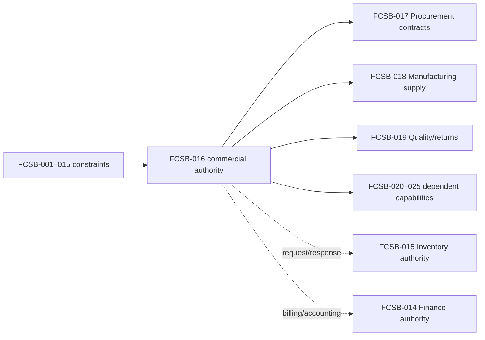

## Chapter 2 — Executive Summary

FlowCraft currently has credible customer foundations: BusinessPartner and Customer records, customer groups, addresses and contacts, credit/payment/delivery terms, CreditProfile, PriceList headers, currency/exchange rates, tax masters, Item/UOM, organization scope, generic transactions/links, workflow definitions, number series, audit, Digital DNA, reports, dashboards and administrative pages. Sales Inquiry, Quotation, Order, Delivery Note and Invoice names are registered metadata only. No accepted lead, opportunity, quote, pricing determination, order, credit exposure, promise, reservation, fulfillment, billing, return or customer-service runtime exists.

The target model makes Sales authoritative for demand, offer, contract, order, requested delivery, customer promise and return intent. Deterministic pricing and time-bound Credit Control precede release. Inventory answers availability/reservation/allocation requests and confirms physical issue. Finance converts billing evidence into invoices and owns receivables, tax postings, receipts, refunds, revenue and COGS. Reconciliation connects the Sales commercial chain to both authorities without letting Sales update either ledger.

Current maturity is governed customer/commercial master data plus reusable transaction and workflow scaffolds. The immediate direction is to approve customer-role, pricing, order, credit, promise, fulfillment, billing and correction contracts before building screens. CRM, channel, mobile, forecasting, subscription and AI capabilities remain planned or future.

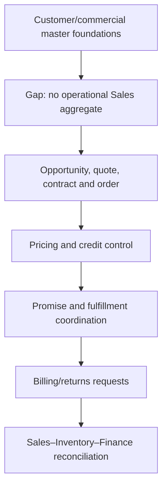

## Chapter 3 — Sales Architecture Principles

Sales owns customer demand and commercial commitments; Inventory owns quantity, reservation/allocation execution and movement truth; Finance owns financial-posting truth. Domains interact only through governed contracts. A quote does not reserve by default, an order is not a delivery, a delivery request is not physical issue, shipment handoff is not an invoice and billing request is not a posted receivable. Sales cannot directly write Inventory or Finance records.

Sold-to, ship-to, bill-to and payer roles are explicit. Price, discount, contract, tax, currency/rate and promise calculation versions are preserved. Credit checks are time-bound; independent approval governs overrides. Order change revalidates price, credit, promise, tax facts and approval. Partial confirmation, fulfillment, billing and backorder remain explicit rather than inferred from a terminal status.

Returns retain original order/delivery/invoice lineage; commercial credit, Finance credit note and refund are separate. Intercompany, drop-ship and consignment flows retain ownership and source links. Customer personal data is server-restricted. Reports remain non-authoritative. AI may explain or draft but cannot approve price, discount, margin, credit, order, shipment, invoice, credit note or refund.

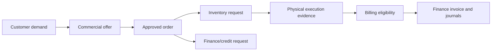

## Chapter 4 — Current Sales and Customer Baseline

The accepted baseline is concrete. [`BusinessPartner`](../../apps/api/prisma/schema.prisma#L1923) stores tenant/company identity, type, registration/tax references, currency, payment/credit terms, PriceList, territory, approval, Digital DNA, effective dates and archive state. [`Customer`](../../apps/api/prisma/schema.prisma#L1485) is a company-scoped specialization with group, credit-profile, territory, account-manager and default delivery/billing/contact references. [`CustomerGroup`, BusinessPartnerAddress and BusinessPartnerContact`](../../apps/api/prisma/schema.prisma#L1956) provide hierarchies and effective role links; [`CreditProfile`, PriceList and tax masters`](../../apps/api/prisma/schema.prisma#L2063) provide policy inputs.

The [DBA-004 migration](../../apps/api/prisma/migrations/20260714000000_enterprise_master_data_platform/migration.sql), [master-data registry](../../apps/api/src/master-data/master-data.registry.ts), [service](../../apps/api/src/master-data/master-data.service.ts), [controller](../../apps/api/src/master-data/master-data.controller.ts), [seed](../../apps/api/prisma/seed.ts) and [accepted tests](../../apps/api/test/master-data.spec.ts) prove persistence, scope, validation, registrations, seed records and administration. Currency/exchange rates, Item/UOM, generic `TransactionDocument`/links, workflows, number series, audit, reports and dashboard are reusable foundations or scaffolds.

The repository has no Sales module or models/services for Lead, Opportunity, Quote lines, pricing conditions, Sales Contract, Sales Order aggregate, credit exposure, ATP/CTP, fulfillment, BillingRequest, customer invoice runtime, RMA, refund or case. Seed registrations such as `SALES_QUOTATION`, `SALES_ORDER`, `DELIVERY_NOTE`, `SALES_INVOICE` and `RECEIPT` are metadata only. PriceList has no price lines or determination engine; the [DBA-004 report](../implementation/DBA-004-enterprise-master-data-implementation.md#L150) explicitly excludes pricing lines and accounting postings.

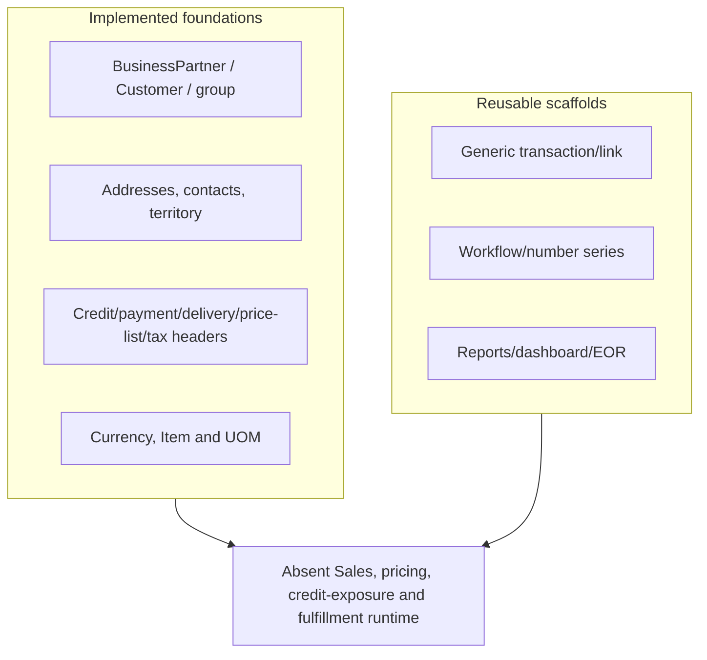

## Chapter 5 — Target Sales Architecture

The target has twelve layers. Customer and Sales Master Data governs identity, roles, hierarchy, organization and commercial defaults. Prospect and Opportunity Intake captures pre-order demand. Commercial Offer and Pricing produces explainable versioned offers. Contract and Order Management freezes commitments and revisions. Credit and Commercial Control determines release eligibility. Promise, Reservation and Allocation Coordination consumes Inventory/Planning evidence.

Fulfillment Orchestration manages commercial intent and exceptions; Delivery and Shipment Handoff coordinates Warehouse/Logistics without claiming physical issue. Billing and Finance Contract provides invoice eligibility and facts. Returns and Customer Service governs post-sale intent and resolution. Reporting and Reconciliation provides non-authoritative analytics and control proof. Security, Audit and Operations protect every layer.

Customer/commercial masters and cross-cutting services are current foundations; generic transactions/workflows/reports are scaffolds. All domain runtime layers are planned. Portal/EDI/e-commerce/mobile/offline, subscription, advanced forecasting and autonomous optimization are future.

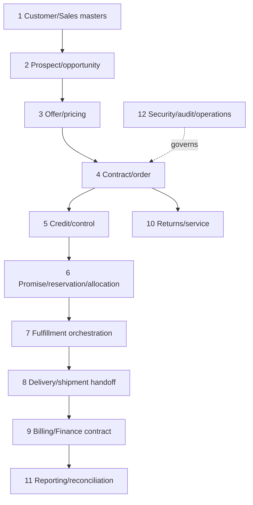

## Chapter 6 — Sales Organization Model

Tenant isolates data; legal entity/company owns commercial and financial responsibility. A target Sales Organization represents selling authority within a company; Sales Office and Sales Group support operational ownership; Territory partitions coverage; Distribution Channel distinguishes direct, distributor, portal or other approved routes; Division groups product/service responsibility. Branch, plant and preferred warehouse link commercial demand to operating scope without conferring stock authority.

Salesperson owns assigned pursuits, Account Manager owns customer relationship, and Customer Service team owns post-sale coordination. Profit and cost centers are Finance/organization dimensions, not Sales-maintained balances. Current Branch, Plant, Division, Department, Territory, CostCenter and ProfitCenter masters provide partial organization foundations; Sales Organization, office, group and channel models remain planned.

Assignments are effective-dated and company-scoped. Territory change cannot rewrite old quotes/orders. Salesperson absence/delegation is governed separately from customer ownership. Organization access combines tenant, company and role, while Inventory and Finance requests carry the appropriate operating and accounting dimensions.

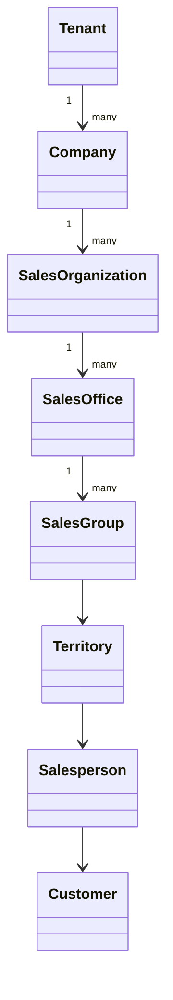

## Chapter 7 — Business Partner and Customer Architecture

Business Partner is the governed legal/commercial identity. Customer is the company-specific selling role. Prospect is a pre-customer commercial subject with limited data and consent; conversion links rather than overwrites it. Sold-to owns demand, ship-to receives goods/services, bill-to receives invoice, and payer settles. Contact identifies a person and role without becoming the customer identity.

Corporate account, distributor, dealer, reseller, agent and intercompany customer are explicit partner roles. Government, consumer, marketplace and one-time-customer patterns remain directions pending privacy, tax, identity and retention requirements. A single partner may hold customer and supplier roles but their company-specific controls remain separate.

Customer code is a scoped business key, not a primary key. Role assignment records validity, source, approval and status. Commercial documents snapshot the chosen parties and addresses. Changing a default never alters historical order or invoice evidence.

Party resolution must also handle role substitution explicitly. A sold-to may nominate several ship-to parties, but only relations valid for the selling company and commercial date are candidates. A payer change after credit approval invalidates the check because exposure ownership may change. One-time customers need a separately approved model for identity, tax, privacy, duplicate and retention controls; a free-text name is insufficient. Intercompany partners require reciprocal company mapping and cannot share customer records across tenant boundaries.

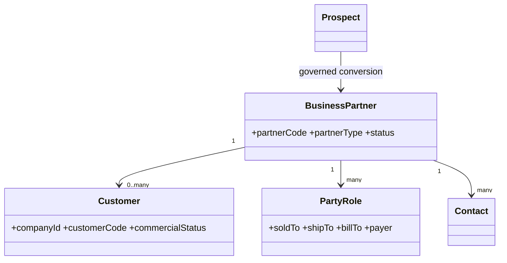

## Chapter 8 — Customer Hierarchy Architecture

Customer hierarchy supports parent account, subsidiary, head office, branch customer and buying group. Billing, credit, pricing, reporting and contract hierarchies may differ; one generic parent field cannot safely drive all effects. A global-account direction coordinates cross-company relationships only after legal, privacy and commercial rules are approved.

Each hierarchy relation states type, parent/child, company or global scope, valid dates, status, reason and owner. Historical queries resolve the relation applicable to the commercial event date. Credit aggregation and pricing inheritance require explicit policies; a reporting parent cannot silently become a payer or credit guarantor.

Current `CustomerGroup` supports a group hierarchy, but Customer has no parent-customer relation and there are no billing/credit/pricing/contract hierarchy runtimes. Target design therefore separates classification from legally consequential relationships.

Hierarchy inheritance is deny-by-default. A child receives a parent price, contract, bill-to or credit treatment only when the relationship type and policy explicitly permit it. Conflicting parents produce a controlled exception rather than priority by insertion order. Moving a customer requires preview of active quotes, contracts, orders, exposure aggregation and reports; the effective-dated move changes future resolution while historical documents continue to point at their captured hierarchy evidence.

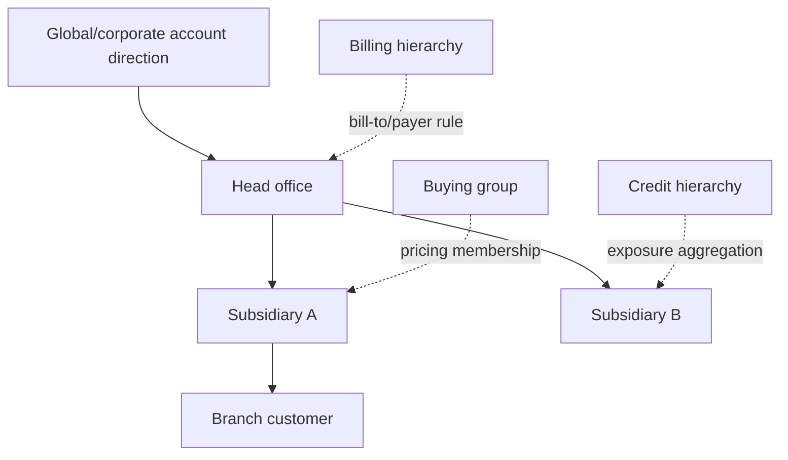

## Chapter 9 — Customer Address and Contact Architecture

Address roles include registered, billing, shipping, service and tax. Contact roles identify buyer, accounts-payable, receiving, service, executive or other approved functions. Each link retains validity, default flag, verification status, language, time zone, preferred channel, consent reference and restrictions. Delivery instructions are controlled operational data, not a place for secrets or sensitive personal notes.

Default selection is role-, company- and date-aware. Order creation snapshots the selected address/contact. Address override requires permission, reason and—where risk demands—approval. A one-time delivery address is transaction evidence and does not silently update the master. Verification and consent technologies remain unselected.

Current `Address`, `ContactPerson` and effective `BusinessPartnerAddress`/`Contact` links are foundations. Consent, verification, customer-specific time zone, restricted-field policy and address-override workflow remain planned.

Address acceptance separates syntactic completeness, external verification direction and business confirmation. A verified postal address can still be commercially unauthorized for a customer role. Contact preference is evaluated at communication time and records the consent version used. Returned mail, failed delivery and changed ownership create review tasks rather than silent master replacement. Search and export should minimize address/contact fields, while audit retains who viewed or changed restricted fields under approved monitoring policy.

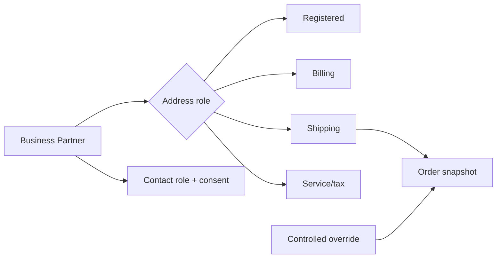

## Chapter 10 — Customer Lifecycle and Governance

The target lifecycle is Prospect, Onboarding, Pending Review, Active, Credit Hold, Order Hold, Delivery Hold, Billing Hold, Dormant, Blocked, Closed and Archived. Holds are orthogonal control states where practical: credit may block release without closing the customer, while delivery or billing holds target specific downstream actions.

Onboarding validates identity, company role, duplicates, addresses/contacts, consent direction, terms, tax facts and required approvals. Due-diligence depth remains a policy decision and no legal compliance is implied. Master change requests govern sensitive fields. Closure resolves open orders, deliveries, returns, receivables references and retention; archive preserves identity and historical documents.

Current BusinessPartner approval/status/effective/archive fields and generic duplicate/change-request services are foundations only. No customer lifecycle workflow or automatic block engine exists.

Hold precedence must be deterministic. A Credit Hold may coexist with Delivery Hold, and clearing one must not clear the other. Dormancy is an inactivity classification, not permission to delete. Block reason, scope, start, expiry, authorizer and affected actions are retained. Reopening a closed customer requires review of identity, consent, terms, tax facts and outstanding Finance references. Closure jobs must report unresolved cross-domain obligations instead of forcibly changing their state.

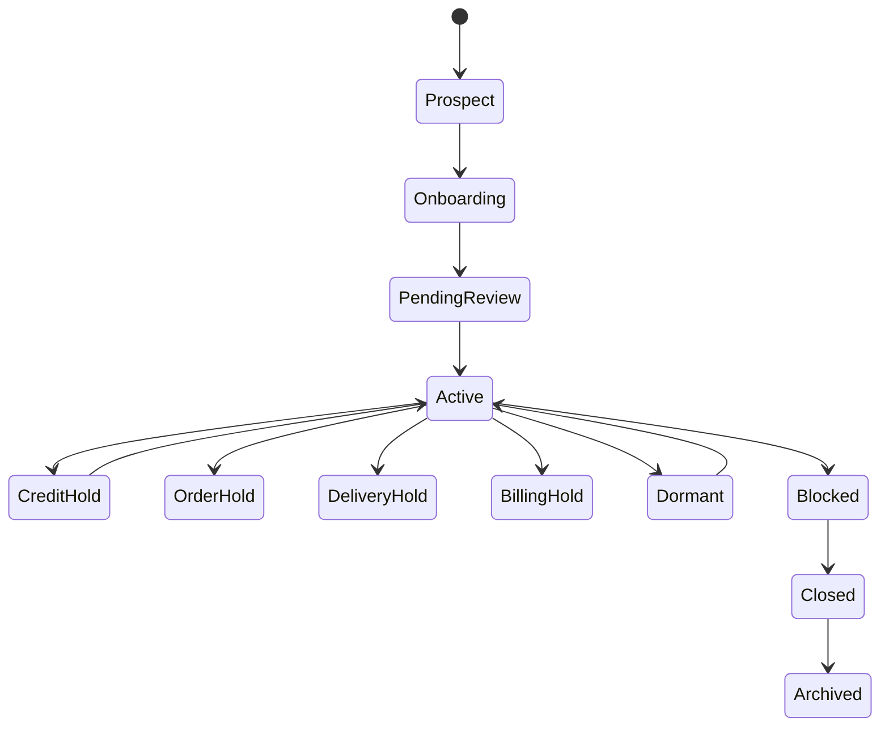

## Chapter 11 — Lead and Prospect Direction

A Lead is an unqualified expression of interest with source, campaign direction, owner, territory, product interest, estimated value, consent basis, score, status and retention clock. Qualification determines fit, need, authority, timing and duplicate relationship. Disqualification captures reason without keeping unnecessary personal data.

Conversion creates or links a governed Prospect/Business Partner and optionally an Opportunity; it never duplicates a known customer. Lead scoring is advisory and versioned. Campaign attribution, enrichment and consent mechanisms remain open. Ownership transfer preserves activity and access history.

No Lead or CRM runtime exists. The target must minimize pre-customer data, enforce tenant/company access and prevent a marketing lead from becoming an approved customer without onboarding controls.

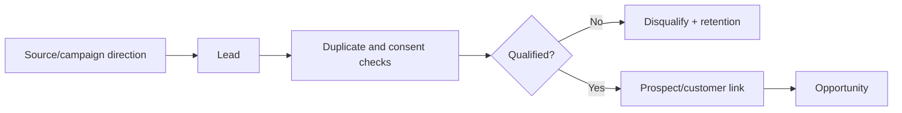

## Chapter 12 — Opportunity Architecture

Opportunity records customer/prospect, stage, probability, estimated value/currency, expected close, products/services, sales team, activities, risks, competitor direction, next action and forecast category. Value is a commercial estimate, not revenue. Probability is stage- or evidence-governed and manual override is visible.

Stage transitions require minimum evidence: discovery, qualified need, solution fit, proposal readiness, negotiation, won or lost. Win records accepted commercial path and conversion references; loss captures reason and competitor direction without exposing confidential data unnecessarily. Quote/order conversion freezes the source opportunity version.

Forecast categories aggregate evidence but remain non-authoritative for financial reporting. No Opportunity, pipeline or forecast runtime exists; generic transaction amounts and dashboard sales totals cannot be treated as opportunity evidence.

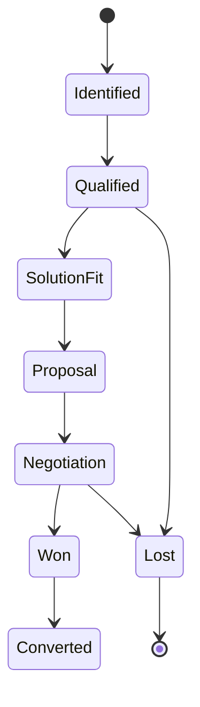

## Chapter 13 — Sales Activity Architecture

Sales Activity represents a call, meeting, email, visit, task, follow-up, demonstration, sample, proposal, note or attachment linked to customer/prospect, contact and optionally lead/opportunity/quote/order. It carries owner, date/time, channel, outcome, next action, visibility, consent/privacy category and audit reference.

An activity documents engagement, not acceptance of a quote or authorization of an order. Email content and attachments follow FCSB-010 retention and security. Private notes cannot conceal price, credit or delivery decisions. Samples create an Inventory request when physical stock is involved.

No engagement-history or activity runtime exists. Target APIs must restrict personal data, prevent cross-account leakage and preserve corrections rather than rewriting history.

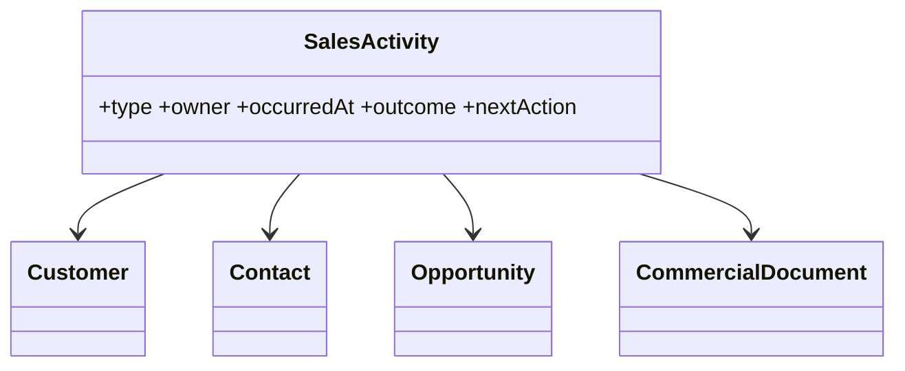

## Chapter 14 — Quotation Architecture

A Quote header identifies company/sales area, quote number/version, sold-to/ship-to/bill-to/payer, currency, validity, delivery/payment terms, Incoterm direction, requested dates, tax estimate context, approval and source opportunity. Lines identify item/service, description snapshot, quantity/UOM, price source/version, discounts, tax estimate, alternative/substitute direction, availability indication and schedule.

Availability is timestamped advice, not reservation. Revision creates a new immutable commercial version with changed fields and reason. Approval covers commercial envelope; issue creates customer-visible evidence; acceptance records customer response and controlled conversion intent. Rejection/expiry prevents new conversion unless revalidated and revised.

The `SALES_QUOTATION` EOR seed is registration only. No Quote header/line, revision, pricing, approval instance, rendering or acceptance runtime exists.

Quote totals preserve calculation components rather than only a final number: gross price, each condition/discount, freight direction, tax estimate, rounding and net amount. Optional lines and alternatives remain distinguishable from committed offer lines. Customer-facing output is reproducible from the issued snapshot and includes the exact validity and revision. A later availability or tax estimate can be communicated as new evidence without changing an already issued commercial version; material change requires revision and reissue.

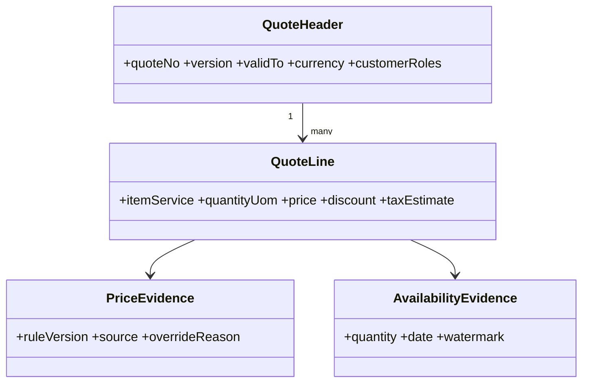

## Chapter 15 — Quotation Lifecycle

Draft supports composition; Pricing captures deterministic results; Pending Approval awaits commercial authority; Approved freezes the approvable envelope; Issued records the customer-facing version; Negotiation may produce Revised; Accepted records customer agreement; Rejected and Expired stop normal conversion; Converted links the resulting contract/order; Cancelled applies before acceptance; Archived retains evidence.

Acceptance never posts stock or Finance effects. Conversion rechecks customer status, validity, current price policy where required, credit direction, UOM, tax facts and promise assumptions. A revised quote supersedes but does not delete the issued version. Partial acceptance identifies accepted lines/quantities and unresolved terms explicitly.

Quote lifecycle is planned and depends on FCSB-009 transaction semantics, FCSB-010 documents and FCSB-011 workflow runtime.

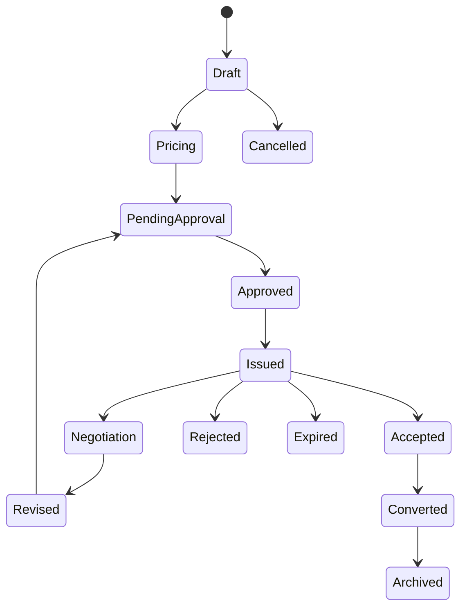

## Chapter 16 — Pricing Architecture

Target pricing sources include base PriceList, customer/customer-group, channel, contract, quantity-break, date-effective, region/territory, Item-group, promotion, minimum price, future cost-plus/formula and controlled manual price. Each condition identifies company/sales area, applicability keys, amount/rate, currency, UOM, validity, priority, exclusion, approval status and version.

Resolution selects deterministic candidates, converts UOM/currency only with preserved versions, applies priority and fallback, and returns a full explanation. A manual price never overwrites the master; it creates an order/quote-level override with reason and authority. Price simulation is non-posting and labels assumptions.

Current `PriceList` is a versioned header with currency/type/tax-inclusive attributes and BusinessPartner may reference it. There are no PriceList lines, conditions, quantity breaks, customer prices, formulas or pricing service. Therefore the present PriceList is a master scaffold, not a price engine.

Condition governance separates authoring, approval, publication and retirement. Overlapping validity at the same priority is either rejected or resolved by an explicit tie-breaker proven in tests. Retroactive publication identifies impacted unconverted quotes and open orders but never rewrites them. Rounding is assigned by component and currency; negative or zero prices require an authorized business type. Bulk imports run collision and simulation checks before publication, with rollback to the prior published version.

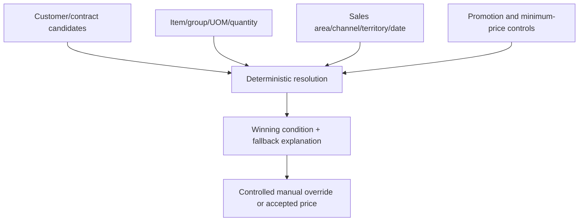

## Chapter 17 — Discount and Promotion Architecture

Discounts may apply to line, header, customer, group or quantity. Promotion direction may include campaign price, coupon, bundle or free goods, while settlement discounts remain a Finance/payment-term boundary. Each rule states basis, rate/amount, currency/UOM where relevant, validity, customer/item/channel scope, maximum, stacking group, exclusion, funding direction and approval threshold.

Stacking is deny-by-default unless a published sequence permits combinations. Header allocation back to lines preserves tax and margin explanation. Free goods create priced commercial lines and separate Inventory demand rather than disappearing from order quantity. Manual discounts require reason, actor, threshold approval and before/after margin evidence.

No discount, promotion, coupon, bundle, free-goods or rebate runtime exists. PaymentTerm discount fields are settlement inputs only and cannot be reused as Sales promotional logic.

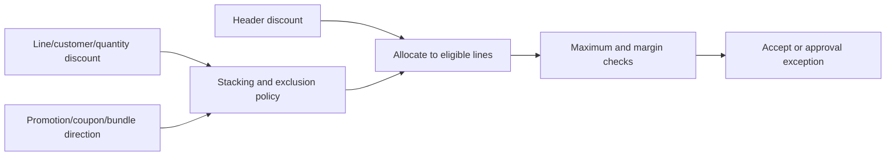

## Chapter 18 — Pricing Determination

Determination inputs are company, sales organization, customer/group, item/group, quantity/UOM, currency, pricing date, channel, territory, contract, promotion, delivery terms and payment terms. The engine resolves eligible versioned conditions in published priority order, applies conversion/rounding, exclusions and authorized stacking, and produces line and document totals with trace.

A simulation uses the same rules but cannot persist authoritative commercial value. Explanation lists candidates considered, rejection reasons, selected source, conversions, rounding and override. An order revision re-runs determination under the approved repricing policy; it never silently mutates an accepted customer price.

Technology and condition technique remain open. Determinism, reproducibility, performance and security of confidential conditions are acceptance requirements, not evidence of a current engine.

Resolution acceptance needs golden scenarios spanning customer/group precedence, contract and promotion collisions, quantity breaks at boundaries, alternate UOM, currency conversion, tax-inclusive lists, expired rules, manual overrides and header allocation. Identical inputs and version set must produce identical outputs. Cache keys include every applicability field and version watermark; stale cache is not allowed to change a price silently. Explanation must be safe for its audience, revealing customer-facing calculation without exposing confidential costs or unrelated customer conditions.

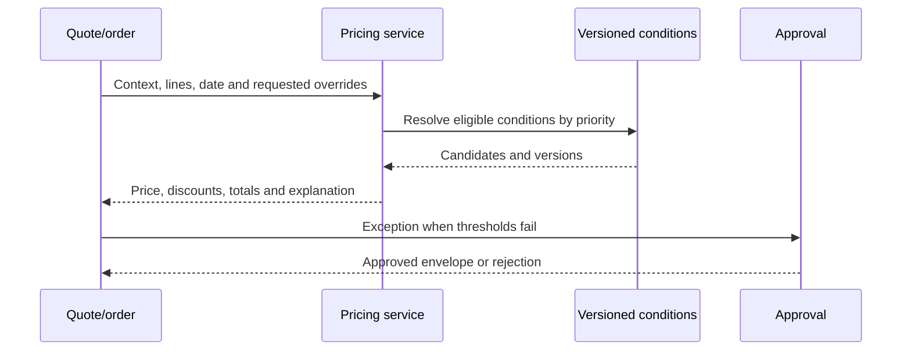

## Chapter 19 — Margin and Commercial Control

Margin control compares proposed net revenue with a Finance/Inventory-approved cost reference and permitted freight estimate. Expected gross margin is advisory until Finance defines recognized cost and currency treatment; contribution margin and commission remain future directions. Sales cannot alter standard cost, valuation layers or Finance cost truth.

Minimum price and margin thresholds vary by company, product/customer segment and authority level. Exceptions expose price, discounts, currency effect, freight estimate, cost-reference date/version and reason without disclosing confidential cost to unauthorized users. Approval freezes an envelope; subsequent quantity, mix, delivery or currency changes recheck it.

Current Item `standardCost` is a master field and PriceList lacks lines. There is no margin engine, commission calculation or approval runtime. Target simulations must separate commercial estimates from certified financial margin.

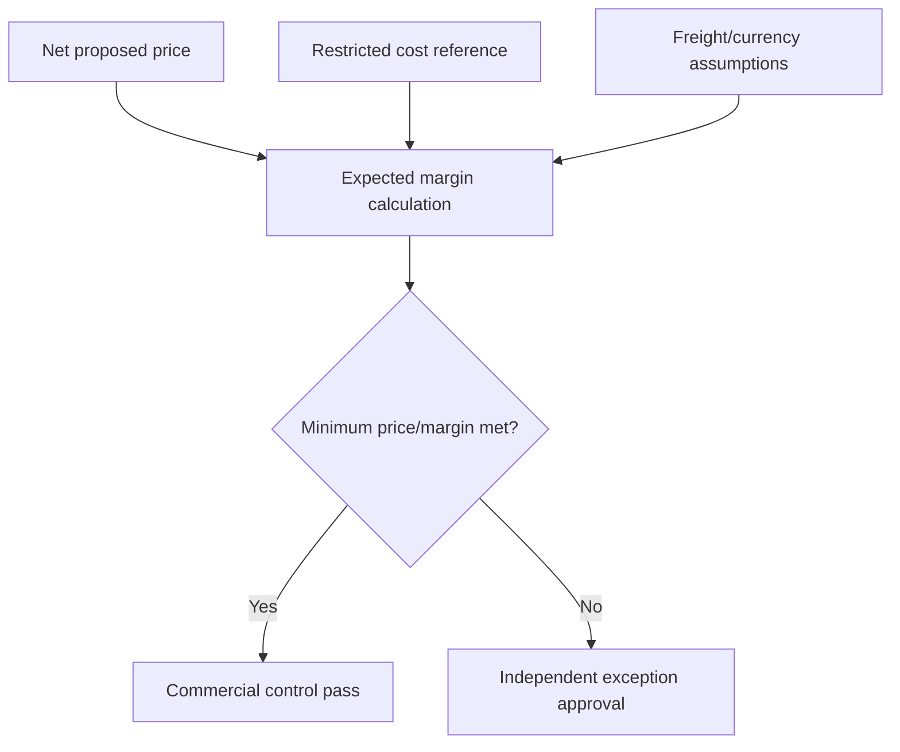

## Chapter 20 — Sales Contract Architecture

A Sales Contract identifies customer hierarchy/roles, company/sales area, contract number/version, validity, item/service scope, prices, quantity/value commitments, delivery schedule, payment/credit terms, rebate direction, renewals, approvals and governing references. Consumption is measured against released orders, not by editing the commitment.

Amendment creates a new effective version with impact on open quotes/orders and remaining commitment. Suspension prevents new release while preserving existing evidence; termination defines handling of open obligations. Renewal is explicit and cannot extend expired pricing automatically. Rebate direction requires a separate accrual/settlement design with Finance.

No Sales Contract model or runtime exists. Generic transaction and workflow scaffolds may later host it, but contract identity, version, consumption and release controls require domain models and tests.

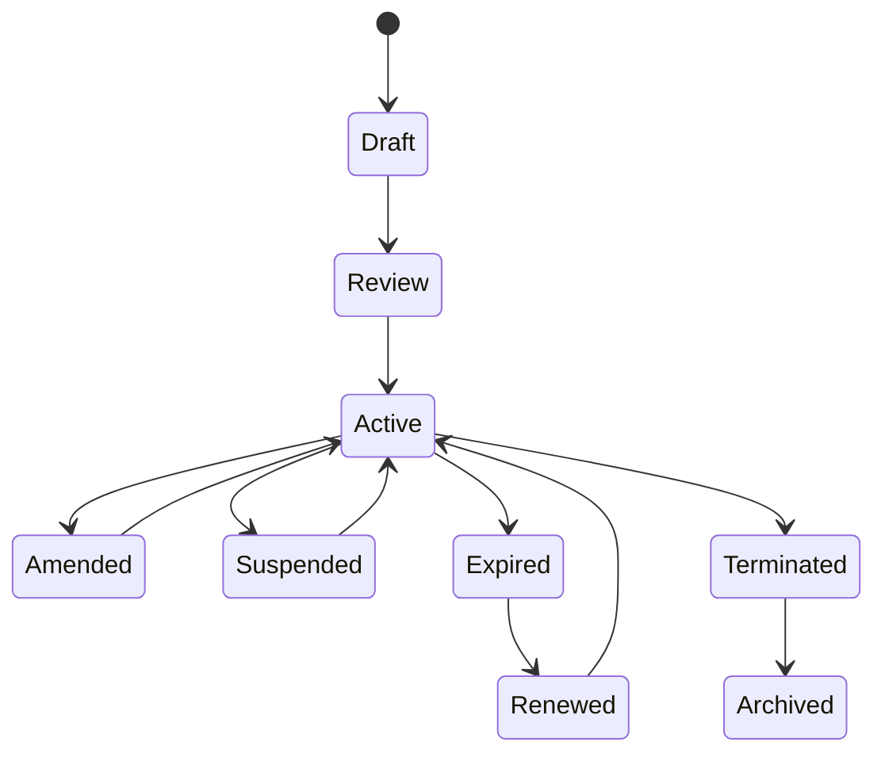

## Chapter 21 — Blanket and Scheduled Sales Agreements

Blanket orders and quantity/value contracts authorize later release within validity and remaining commitment. Scheduling agreements add forecast and firm schedules, call-offs, cumulative quantity and delivery cadence. A release order references the exact agreement version and consumes commitment only at the approved event, with cancellation/restoration rules.

Over-release is blocked or independently approved; under-consumption at expiry is reported, not fabricated as an order. Forecast schedules advise supply; firm schedules create governed demand. Cumulative reconciliation compares agreement, releases, cancellations, deliveries, billings and returns by UOM/currency.

These models remain planned. They depend on order, pricing, promise and reconciliation designs and must not be inferred from generic `SALES_ORDER` registration.

```mermaid
flowchart LR
  A["Blanket/quantity/value agreement"] --> R["Release or call-off"]
  FS["Forecast schedule"] --> CF["Firm schedule"]
  CF --> R
  R --> O["Sales order/schedule line"]
  O --> C["Consume cumulative commitment"]
  C --> RC["Remaining/over-release reconciliation"]
```

## Chapter 22 — Sales Order Architecture

An Order header records company/sales area, order type, customer purchase order, sold-to/ship-to/bill-to/payer, currency, terms, shipping direction, requested dates, source quote/contract and version. Lines record item/service, quantity/UOM, price/discount/tax evidence, plant and warehouse preference, rejection/hold reason and source links. Schedule lines carry requested and confirmed quantity/date partitions.

Revision preserves the accepted commercial snapshot: customer roles/addresses, item description, UOM conversion, price conditions, tax facts, currency context, promise evidence and approval envelope. A service line may not request stock. Warehouse preference guides Inventory but does not select or move stock authoritatively.

No Sales Order model exists; `SALES_ORDER` seed registration and generic TransactionDocument are metadata/scaffold only. The target aggregate requires typed invariants, optimistic versioning, idempotency, lifecycle and cross-domain result links.

Order identity and customer PO are distinct: one is FlowCraft-controlled, the other is customer evidence with scoped duplicate rules. Header defaults copy into lines/schedules only through documented resolution and retain their source. Mixed physical, service and project lines may coexist only if lifecycle/billing rules can explain each line independently. Derived totals and statuses are projections from versioned lines, controls and domain responses; they cannot be directly patched by an integration or administrator.

```mermaid
classDiagram
  class SalesOrder { +orderNo +revision +orderType +customerRoles +currency }
  class OrderLine { +itemService +quantityUom +commercialValues }
  class ScheduleLine { +requestedDate +confirmedDate +confirmedQty }
  class ControlEvidence { +priceVersion +creditCheck +taxContext +approval }
  SalesOrder "1" --> "many" OrderLine
  OrderLine "1" --> "many" ScheduleLine
  SalesOrder --> ControlEvidence
```

## Chapter 23 — Sales Order Lifecycle

Draft permits entry; Validated confirms master/commercial rules; Submitted begins approval; Credit Review obtains time-bound exposure decision; Pending Approval covers non-credit exceptions; Approved freezes the envelope; Released permits promise/fulfillment coordination. Partially Confirmed and Confirmed reflect promise results; Partially Fulfilled/Fulfilled derive from Inventory issue and Logistics evidence; Partially Billed/Billed derive from Finance results.

On Hold records credit, customer, delivery, compliance-direction or billing control without losing prior state. Cancellation before execution creates no physical/financial reversal; after downstream effects it closes remaining demand and requests domain corrections. Closed requires quantity, billing, return and exception reconciliation; Archived preserves evidence.

Any change to customer role, quantity, item, price, discount, currency, terms, date, plant/warehouse preference or source contract triggers relevant revalidation and a new revision. Sales cannot assert fulfillment or billing merely by setting status.

```mermaid
stateDiagram-v2
  [*] --> Draft
  Draft --> Validated --> Submitted --> CreditReview
  CreditReview --> PendingApproval --> Approved --> Released
  Released --> PartiallyConfirmed --> Confirmed
  Confirmed --> PartiallyFulfilled --> Fulfilled
  Fulfilled --> PartiallyBilled --> Billed --> Closed
  Released --> OnHold
  OnHold --> CreditReview
  Draft --> CancelledBeforeExecution
  Closed --> Archived
```

## Chapter 24 — Sales Order Validation

Validation resolves tenant/company, customer roles/status, address validity, item sales eligibility, quantity/UOM/precision, price/discount explanation, currency/rate context, tax facts, requested/confirmed dates, payment/delivery terms, minimum order, contract eligibility, plant/warehouse preference and duplicate customer PO. Restricted-item and export/trade directions require approved specialist rules; this volume makes no compliance claim.

Control validation checks Credit result/freshness, ATP/CTP evidence, approval thresholds, SoD, change version, idempotency and source quote/contract. Preflight gives actionable errors; commit-time checks protect state. A previously valid order is revalidated after material change or expired evidence.

Customer customization may add stricter commercial checks but cannot bypass identity, price, credit, tax, inventory, Finance, approval, SoD, idempotency or reconciliation invariants.

```mermaid
flowchart TD
  O["Order revision"] --> C["Customer/company/roles"]
  C --> I["Item/UOM/quantity/dates"]
  I --> P["Price/discount/contract/currency"]
  P --> T["Tax facts and terms"]
  T --> CR["Credit and promise evidence"]
  CR --> A["Approval, SoD, duplicate PO"]
  A --> V{"All controls current?"}
  V -- "No" --> X["Typed hold/exception"]
  V -- "Yes" --> R["Release-eligible revision"]
```

## Chapter 25 — Credit Management Architecture

Finance/Credit Control owns policy and authoritative exposure calculation. A Credit Profile identifies customer/company/segment direction, risk category, credit limit, temporary limit/expiry, tolerance, block rules, review date and override policy. Exposure may include open orders, deliveries, invoices, unapplied receipts and approved guarantees/insurance direction according to an explicit formula and watermark.

Sales consumes a signed decision: available credit, check time, inputs, outcome, reason and expiry. Sales cannot change exposure or release itself. Customer hierarchy aggregation requires a separately approved guarantee/credit relation; group classification is insufficient.

Current `CreditProfile`, `CreditTerm` and Customer credit fields are policy foundations with validation for nonnegative/temporary limits. There is no exposure engine, hold/release service, AR integration or authoritative credit calculation.

```mermaid
flowchart TB
  LIM["Approved limit / temporary limit"] --> EX["Credit exposure"]
  OO["Open orders and deliveries"] --> EX
  AR["Finance invoices/receipts"] --> EX
  GU["Guarantee/insurance direction"] --> EX
  EX --> AV["Available credit + watermark"]
  AV --> DC["Pass, warning or hold decision"]
```

## Chapter 26 — Credit Check and Release

Credit can be checked at quote direction, order create/change/release, delivery request, shipment direction and billing direction. Policy chooses checkpoints and materiality; every check records order revision, exposure version, amount, currency, decision, expiry and policy. Hard block prevents progression, soft warning requires acknowledgement, and partial release states quantity/value envelope.

Temporary release requires independent Credit Controller authority, reason, limit, validity and recheck trigger. Change, elapsed time, new exposure or customer block invalidates stale release. Sales Manager cannot approve their own commercial request and credit override where SoD requires separation.

No Credit check/release runtime exists. Target integration must tolerate Finance unavailability by holding new risk rather than treating missing exposure as approval.

Exposure calculation must state whether taxes, unbilled deliveries, disputed invoices, credit notes, deposits and unallocated receipts count, and how foreign currency is converted. A check captures those component totals so Credit Control can reproduce the outcome. High-volume recalculation requires concurrency tests against simultaneous order, delivery, invoice and receipt events. Manual review queues show cause and age, while emergency release is narrow, expiring and independently reported to Internal Audit.

```mermaid
sequenceDiagram
  participant S as Sales order
  participant C as Credit Control
  participant F as Finance exposure
  participant A as Independent approver
  S->>C: Check revision and requested exposure
  C->>F: Obtain authoritative exposure watermark
  F-->>C: Exposure components and available credit
  C-->>S: Pass, warning or hold with expiry
  S->>A: Override request when permitted
  A-->>S: Bounded release or rejection
```

## Chapter 27 — Order Promising Architecture

Sales owns the customer promise; Inventory owns current availability/reservation evidence; Planning, Manufacturing and Procurement own future supply/capacity assumptions. A promise records requested and confirmed quantity/date, ATP/CTP calculation version, time fence, supply type, priority, split schedule, substitution, confidence, expiry and exception.

Partial confirmation creates explicit schedule lines. Reconfirmation occurs after order change, supply disruption, reservation loss, quality hold or evidence expiry. ATP does not move stock; CTP remains advisory until capacity/procurement runtimes exist. A promise without preserved assumptions cannot be presented as authoritative.

FlowCraft has no ATP/CTP or order-promising runtime. FCSB-015 defines Inventory availability direction; FCSB-016 governs how Sales consumes and communicates results.

Promise policy distinguishes requested, planned, confirmed and customer-accepted dates. Calendar, cutoff, transport lead-time direction, safety stock and priority assumptions are part of evidence rather than hidden constants. When a promise worsens, the system retains old/new results, reason and communication outcome. Better supply does not automatically pull a delivery forward if the customer or warehouse cannot accept it. Bulk reconfirmation prioritizes affected commitments and never bypasses credit or order-change controls.

```mermaid
sequenceDiagram
  participant S as Sales
  participant I as Inventory ATP
  participant P as Planning CTP
  S->>I: Request quantity/date scenario
  I-->>S: Available quantities, dates, watermark
  S->>P: Request capacity/supply scenario if short
  P-->>S: Advisory dates and assumptions
  S->>S: Create customer promise evidence
  S->>I: Separate reservation request
```

## Chapter 28 — Reservation and Allocation Boundary

Sales sends reservation requests with order/schedule, item, quantity/UOM, required date, priority, warehouse preference, ownership and batch/serial preference. Inventory returns covered/uncovered quantity, reservation identity, firmness, expiry and reason. Allocation requests ask Inventory to select eligible supply; results identify warehouse/batch/bin/serial according to FCSB-015.

Soft/firm reservation policy, customer priority, reallocation and release remain Inventory-controlled. Sales may request cancellation or reprioritization but cannot edit reservation or allocation records. An order cancellation is incomplete until Inventory acknowledges released commitments or reports downstream execution.

There is no reservation/allocation runtime. The target contract is idempotent, versioned and reconciles order demand with Inventory-owned records.

```mermaid
flowchart LR
  O["Released order schedule"] --> RR["Sales reservation request"]
  RR --> IR["Inventory reservation result"]
  IR --> AR["Sales allocation request"]
  AR --> IA["Inventory allocation result"]
  IA --> FH["Fulfillment handoff"]
  CH["Order change/cancel"] --> RL["Inventory release/reallocation request"]
```

## Chapter 29 — Backorder Architecture

A Backorder is explicit unconfirmed or unfulfilled order quantity with shortage reason, priority, original/required date, latest promise, aging, customer notification status and escalation. It is not a deleted schedule line or a generic order status. Partial fulfillment leaves the remainder linked to original demand.

Reconfirmation considers alternative date, item substitution, plant/warehouse, purchase or production supply direction and customer tolerance. Sales owns customer communication and cancellation; Inventory/Planning own supply facts. Priority changes are reasoned and cannot silently displace other customers.

Backorder aging, exception queues and service metrics remain planned. Reconciliation compares ordered, confirmed, reserved, allocated, issued, cancelled and backordered quantities.

```mermaid
flowchart TD
  U["Unconfirmed/unfulfilled quantity"] --> B["Backorder record"]
  B --> RC["Reconfirmation"]
  RC --> AD["Alternative date"]
  RC --> SU["Substitute/item or warehouse"]
  RC --> NS["New supply direction"]
  RC --> CA["Customer cancel"]
  AD --> CP["Customer promise update"]
  SU --> CP
```

## Chapter 30 — Fulfillment Orchestration

Fulfillment orchestration evaluates approved order revision, customer/credit/quality/delivery holds, confirmed schedules, reservations, allocations and commercial partial/split/consolidation rules. It creates delivery intent and coordinates Inventory/Warehouse/Logistics responses without claiming movement or carrier completion.

Partial fulfillment partitions quantity and retains residual demand. Split delivery divides schedules by date/warehouse/customer permission; consolidation combines compatible demand without losing order-line lineage. Replanning responds to shortage, failed delivery or hold. Completion requires Inventory issue, shipment handoff and order reconciliation.

No orchestration runtime exists. Target state is derived from authoritative domain events, uses idempotent commands and exposes owned exceptions rather than a mutable “fulfilled” flag.

Orchestration needs a correlation model for repeated partial deliveries, cross-warehouse splits, substitutions and cancellations arriving out of order. It consumes events with versions and rejects a response for an obsolete order revision unless explicitly reconciled. Holds are evaluated before task creation and again before irreversible issue where policy requires. Operational dashboards distinguish waiting on Sales, Credit, Inventory, Warehouse, Logistics or customer decision so exceptions have accountable owners rather than a generic failed state.

```mermaid
flowchart TB
  O["Approved order"] --> E["Eligibility: credit/holds/promise"]
  E --> R["Reservation/allocation readiness"]
  R --> D["Delivery intent"]
  D --> WH["Warehouse/Inventory handoff"]
  D --> LG["Logistics direction"]
  WH --> PF["Partial/full physical result"]
  PF --> RP["Residual demand or completion"]
```

## Chapter 31 — Delivery Request Architecture

A Delivery Request identifies order/schedule revision, customer and ship-to snapshot, item, requested quantity/UOM, preferred warehouse, requested ship date, method/carrier direction, priority, batch/serial preference, packing/document direction, partial permission, hold and correlation. It is a Sales fulfillment instruction, not a stock movement.

Inventory validates availability/allocation, actual source, status, ownership and warehouse execution. It returns accepted, partially accepted, rejected or completed quantity plus movement/issue references. Cancellation is allowed only before protected execution or through a controlled compensation path.

Export documentation and carrier rules remain future specialist designs. `DELIVERY_NOTE` registration does not implement a delivery request or issue.

```mermaid
sequenceDiagram
  participant S as Sales fulfillment
  participant I as Inventory
  participant W as Warehouse
  S->>I: Delivery request with schedule and ship-to
  I->>I: Validate allocation and stock policy
  I->>W: Pick/pack/issue task direction
  W-->>I: Actual/short/exception confirmation
  I-->>S: Accepted quantity and issue evidence
```

## Chapter 32 — Picking, Packing and Shipment Handoff

Sales supplies fulfillment intent and customer requirements; Inventory owns reservation, allocation, pick/pack stock confirmation and physical issue; Warehouse executes tasks; Logistics direction owns carrier planning and delivery evidence. A pick request derives from Inventory allocation, short pick returns an exception, and substitution requires commercial/customer permission plus Inventory eligibility.

Pack confirmation binds actual item/batch/serial to package. Shipment reference and dispatch proof connect physical issue to carrier handoff; proof of delivery remains Logistics direction. Sales customer status is derived from responses. Reversal links order, issue, shipment and return rather than changing a Sales flag.

No picking, packing, shipment or POD runtime exists. FCSB-015 controls physical semantics; FCSB-016 controls customer communication and fulfillment reconciliation.

```mermaid
sequenceDiagram
  participant S as Sales
  participant I as Inventory
  participant W as Warehouse
  participant L as Logistics
  S->>I: Fulfillment and customer requirements
  I->>W: Allocated pick/pack tasks
  W-->>I: Actual, short or substitution result
  I-->>S: Physical issue confirmation
  I->>L: Shipment handoff package
  L-->>S: Dispatch/POD direction
```

## Chapter 33 — Customer Delivery and Fulfillment Status

Customer-visible fulfillment states are Awaiting Allocation, Ready to Pick, Picking, Partially Picked, Packed, Dispatched, Partially Delivered, Delivered, Delivery Failed, Returned, Cancelled and Closed. Each is derived from authoritative reservation/allocation, Warehouse task, Inventory issue and Logistics evidence; Sales cannot directly assert physical completion.

The public status may simplify internal detail but retains timestamp, quantity partition and source watermark. “Dispatched” requires issue and handoff evidence; “Delivered” requires approved POD direction; “Returned” references accepted return custody. Partial quantities remain visible, while sensitive warehouse, credit or security details are withheld.

No customer-status service or portal exists. Target subscriptions and notifications must tolerate out-of-order events and show pending reconciliation instead of inventing a definitive state.

```mermaid
stateDiagram-v2
  [*] --> AwaitingAllocation
  AwaitingAllocation --> ReadyToPick
  ReadyToPick --> Picking
  Picking --> PartiallyPicked
  PartiallyPicked --> Picking
  Picking --> Packed
  Packed --> Dispatched
  Dispatched --> PartiallyDelivered
  PartiallyDelivered --> Delivered
  Dispatched --> DeliveryFailed
  Delivered --> Returned
  Delivered --> Closed
```

## Chapter 34 — Billing Request Architecture

A Billing Request carries eligible source order/delivery/milestone/service-acceptance references, bill-to/payer snapshots, quantities, commercial prices/discounts, tax facts, currency, requested billing date, partial/consolidated/split rule, hold state and correlation. It is Sales evidence sent to Finance, not an invoice.

Eligibility may depend on issue, dispatch, delivery, milestone or service acceptance according to an approved billing policy. Consolidation retains all source lines; split billing explains partition. Sales may cancel before Finance acceptance; after invoice creation, correction uses Finance credit/rebill processes.

Finance returns accepted, rejected or posted invoice reference. Sales reconciles request quantities/value with results. No BillingRequest model or service exists; `SALES_INVOICE` registration does not confer invoice authority.

Billing quantity is accumulated per source line and trigger, preventing a delivered unit or milestone from being requested twice. Credit/rebill and cancellation reserve or restore eligibility only through Finance acknowledgements. Consolidated billing checks compatible bill-to, payer, currency, terms, tax context and requested date; incompatibility produces separate requests. A rejected request retains actionable Finance reason, and correcting commercial facts creates a new request version rather than editing the rejected payload.

```mermaid
flowchart LR
  O["Order/commercial evidence"] --> EL["Billing eligibility policy"]
  D["Inventory issue/delivery evidence"] --> EL
  M["Milestone/service acceptance direction"] --> EL
  EL --> BR["Billing request"]
  BR --> F["Finance validation/invoice"]
  F --> RS["Accepted, rejected or posted reference"]
```

## Chapter 35 — Customer Invoice Boundary

Sales supplies billing evidence; Finance creates the invoice, allocates invoice number, recognizes receivable/revenue/tax, applies currency/rate and payment terms, determines due date and controls posting. Invoice lines reference the Sales request and delivery/service evidence. E-invoicing remains future and Finance/Tax governed.

Sales cannot create receivables, post invoices, change invoice balances or mark payment. A price, quantity or tax correction after posting becomes a Finance credit/debit/rebill path with original linkage. Reversal is Finance-owned and may request Sales/Inventory corrections only when commercial or physical evidence is wrong.

Current schema contains legacy finance scaffolds and `SALES_INVOICE` metadata, but no authoritative customer-invoice/AR runtime accepted for this Sales architecture. Reconciliation proves each billing request’s Finance result.

```mermaid
sequenceDiagram
  participant S as Sales
  participant F as Finance invoicing
  participant AR as Receivables
  participant R as Reconciliation
  S->>F: Billing request and source evidence
  F->>F: Validate tax, currency, period and numbering
  F->>AR: Post invoice/receivable
  F-->>S: Invoice reference or rejection
  S->>R: Billing-request result
  AR->>R: Invoice and reversal evidence
```

## Chapter 36 — Revenue and COGS Boundary

Sales requests accounting consideration for commercial revenue, discounts, freight and tax facts; Inventory provides physical issue and valuation input; Finance owns revenue, inventory relief, COGS, deferred revenue/contract liability direction, warranties, project/service billing and journals. One Sales order may yield multiple accounting events, and one invoice may combine eligible sources.

Return, cancellation and price correction create linked reversal/adjustment requests without Sales choosing accounts. Timing is policy-specific: issue, dispatch, delivery, acceptance or milestone may differ. This volume does not select revenue-recognition policy or assert regulatory treatment.

Sales margin reports use Finance-certified revenue/COGS where available and label estimates otherwise. There is no revenue/COGS request runtime or reconciliation engine today.

```mermaid
flowchart TB
  SE["Sales commercial evidence"] --> FC["Finance accounting contract"]
  IM["Inventory issue/valuation input"] --> FC
  FC --> RV["Revenue/discount/freight/tax"]
  FC --> CG["Inventory relief and COGS"]
  FC --> DR["Deferral/contract-liability direction"]
  RV --> RC["Sales–Finance reconciliation"]
  CG --> RC
```

## Chapter 37 — Customer Deposit and Advance Boundary

Sales may request a deposit or advance linked to customer, order/contract, currency, required amount/date and purpose. Finance owns advance invoice direction, receipt, unapplied advance, allocation, tax treatment, partial use, cancellation and refund. A customer promise of payment is not a receipt.

Allocation consumes Finance-confirmed available advance against eligible invoice/order references and returns remaining amount. Credit exposure may consume the Finance result according to approved policy. Expiry/escheatment or legal handling remains outside this volume pending specialist requirements.

No deposit, advance or allocation runtime exists. Customer bank/payment details remain Finance-restricted and are never copied into Sales notes or documents.

```mermaid
sequenceDiagram
  participant S as Sales
  participant F as Finance
  participant C as Credit Control
  S->>F: Deposit/advance request linked to order
  F-->>S: Invoice/payment instruction direction
  F->>F: Record receipt and unapplied balance
  S->>F: Request allocation to eligible source
  F-->>S: Applied and remaining amounts
  F-->>C: Exposure-relevant result
```

## Chapter 38 — Returns and RMA Architecture

A Return Request records original order/delivery/invoice references, reason, requested quantity/UOM, batch/serial, condition claim, customer evidence and desired resolution. Approved Return Merchandise Authorization defines return window, destination, shipping direction and inspection requirement. Authorization does not create Inventory quantity or Finance credit.

Inventory receives to a controlled return position and Quality/authorized inspection decides restock, rework, repair, supplier route or scrap. Sales owns commercial return intent and replacement/credit request; Finance owns credit/refund; Inventory owns physical effects. Closure reconciles requested, authorized, received, inspected, disposed, replaced, credited and refunded quantities/values.

No returns/RMA runtime exists. Customer returns require original lineage unless an exceptional no-reference policy is explicitly approved with fraud controls.

Return eligibility evaluates sold quantity, prior returns, warranty/policy direction, elapsed time, serial/batch, customer and channel. It separates customer claim from observed receipt condition. Cross-shipped replacement, advanced replacement and no-return remedies are future policies with deposit/fraud implications. The return location is supplied by Inventory, not chosen from a Sales default. A return received after RMA expiry enters an exception state and is not automatically rejected, restocked or credited.

```mermaid
stateDiagram-v2
  [*] --> Requested
  Requested --> Authorized
  Requested --> Rejected
  Authorized --> InTransit
  InTransit --> Received
  Received --> Inspected
  Inspected --> Restock
  Inspected --> Rework
  Inspected --> Scrap
  Inspected --> ReplacementOrCredit
  ReplacementOrCredit --> Closed
```

## Chapter 39 — Credit Note, Refund and Replacement Boundary

A Commercial Credit Request proposes price/quantity/tax reason and original invoice linkage; Finance decides and posts a Credit Note. A Refund Request asks Finance to return settled funds; the refund is a Finance payment with bank/security controls. A Replacement Order is a Sales order—free or priced according to approved policy—and requests Inventory fulfillment independently.

Credit does not prove refund, and refund does not change returned stock. Return-required/no-return exceptions, warranty direction, goodwill and price correction need distinct reason and approval. Fraud controls compare customer, original shipment/invoice, batch/serial, prior credits/refunds/replacements and authority limits.

No credit-note, refund or replacement runtime exists. Reconciliation links commercial request, Finance document/payment, replacement issue and RMA disposition.

```mermaid
flowchart TB
  R["Return/price/quantity issue"] --> D{"Requested remedy"}
  D --> CR["Sales credit request"] --> CN["Finance credit note"]
  D --> RF["Sales refund request"] --> FP["Finance refund payment"]
  D --> RO["Replacement order"] --> IF["Inventory fulfillment"]
  CN --> RC["Cross-domain reconciliation"]
  FP --> RC
  IF --> RC
```

## Chapter 40 — Customer Complaint and Case Direction

A Complaint/Service Case carries category, severity, customer/contact, order/delivery/invoice, product/item, batch/serial, owner, SLA direction, investigation evidence, root cause, resolution, escalation and closure. Customer Service owns coordination; Quality, Inventory, Sales, Finance or Manufacturing owns domain findings and effects.

Case resolution may request replacement, credit, refund, repair or information, but cannot post those effects. Severity and SLA models remain configurable directions; this volume makes no consumer-protection or warranty commitment. Restricted personal and product-safety data receive scoped access and retention.

No customer service/case runtime exists. Target escalation must preserve chronology and prevent closure while mandatory domain requests remain unresolved.

```mermaid
stateDiagram-v2
  [*] --> Open
  Open --> Triaged
  Triaged --> Investigating
  Investigating --> AwaitingCustomer
  AwaitingCustomer --> Investigating
  Investigating --> Escalated
  Escalated --> ResolutionProposed
  Investigating --> ResolutionProposed
  ResolutionProposed --> Resolved
  Resolved --> Closed
  Closed --> Reopened
```

## Chapter 41 — Special Sales Models

Intercompany sales pairs external/customer-facing and internal supplying-company records. Drop shipment links customer order, supplier purchase direction and direct delivery. Third-party fulfillment preserves external custody and issue evidence. Consignment sales separates company ownership, consignee custody and billing trigger. Make-to-order, configure-to-order and engineer-to-order link Sales demand to Manufacturing without making Sales the production authority.

Project and service sales link milestones/time/service acceptance to Projects/Service domains. Subscription and recurring billing remain Finance/product directions. Counter sales needs immediate inventory/payment coordination; e-commerce and marketplace directions require channel identity, idempotency and reconciliation.

No special-model runtime exists. Every pattern retains Sales commercial authority, Inventory custody/movement authority, Procurement supplier-order authority, Manufacturing execution authority and Finance posting authority.

Special models require line-level fulfillment and billing classification rather than a document-wide shortcut. A mixed order may contain company-stock, drop-ship and service lines, each with different evidence and exception ownership. Configure-to-order retains configuration/revision evidence for promise and production. Marketplace settlement is not a customer receipt; subscription renewal is not an order unless an approved schedule creates it. Counter sales still requires customer/tax/payment and Inventory controls appropriate to its risk.

```mermaid
flowchart TB
  S["Special Sales models"] --> IC["Intercompany"]
  S --> DS["Drop ship / third-party fulfillment"]
  S --> CS["Consignment"]
  S --> MO["MTO/CTO/ETO"]
  S --> PS["Project/service"]
  S --> SR["Subscription/recurring direction"]
  S --> CH["Counter/e-commerce/marketplace direction"]
```

## Chapter 42 — Intercompany Sales Architecture

The selling company owns the external customer order and price; supplying company owns internal supply acceptance; Inventory owns physical movement; Finance/Tax owns transfer price direction, paired billing, currency, tax and intercompany reconciliation. Internal customer/supplier identities are explicit and company-scoped.

External order links the intercompany order, delivery, Inventory issue/receipt where applicable, external invoice and paired internal billing. Mismatched quantity, price, currency or period enters an owned exception queue. Returns and cancellation reverse both chains in dependency order rather than deleting one side.

No intercompany Sales runtime exists. Target design must avoid a shared mutable order across companies and must enforce reciprocal access boundaries.

```mermaid
sequenceDiagram
  participant A as Selling company
  participant B as Supplying company
  participant I as Inventory
  participant F as Finance/Tax
  A->>B: Paired intercompany demand
  B->>I: Supply/issue request
  I-->>A: External fulfillment evidence
  B->>F: Internal billing facts
  A->>F: External billing facts
  F-->>A: Paired reconciliation or mismatch
```

## Chapter 43 — Sales Tax and Regulatory Boundary

Sales supplies customer tax profile reference, sold-to/ship-to/bill-to, ship-from, item/service tax category, exemption evidence reference, commercial/tax dates, quantity/value, currency, inclusive/exclusive flag and delivery terms. Tax/Finance owns authoritative jurisdiction, rule, rate, exemption validation, rounding, posting and reporting.

Quote tax is an estimate; order rechecks changed facts; billing performs authoritative determination under Finance/Tax policy. Overrides require specialist authority and evidence. Export/trade and e-invoicing directions remain unselected and cannot be inferred from country or Incoterm masters.

Current TaxCategory/TaxCode and tax identifiers are master foundations only. There is no customer tax determination or e-invoicing runtime.

```mermaid
flowchart LR
  CU["Customer/role/tax profile"] --> TF["Sales tax facts"]
  SF["Ship-from/to and item/service category"] --> TF
  DT["Commercial/tax date, currency, terms"] --> TF
  TF --> TX["Tax/Finance determination"]
  TX --> QE["Quote estimate"]
  TX --> BI["Billing authority/posting"]
```

## Chapter 44 — Sales Reporting and Analytics

Sales reporting covers future pipeline, quote conversion, order intake/backlog, confirmed backlog, backorder, bookings, billings, fulfillment, on-time delivery, returns, credits, salesperson/territory performance and forecast. Revenue, margin, customer profitability and credit exposure use Finance-certified sources or are clearly labelled estimates. Inventory availability and issue use Inventory-certified sources.

Every measure defines grain, formula, currency/UOM, as-of watermark, status exclusions, revision handling and authority. Drill-through connects opportunity, quote, order, reservation, issue, billing request, invoice and return subject to permissions. Reports cannot approve, release or correct transactions.

FCSB-013 governs datasets, semantics, certification and distribution. Current ReportDefinition, generic preview and dashboard totals are scaffolds; no certified Sales dataset or forecast runtime exists.

```mermaid
flowchart LR
  OP["Opportunity/quote/order facts"] --> DS["Governed Sales datasets"]
  IV["Inventory promise/issue facts"] --> DS
  FN["Finance invoice/revenue/credit facts"] --> DS
  DS --> PL["Pipeline/conversion/backlog"]
  DS --> FU["Fulfillment/returns"]
  DS --> FM["Certified billings/margin direction"]
  DS --> RC["Cross-domain reconciliation"]
```

## Chapter 45 — Customer Portal, Integration and Mobile Direction

Portal direction includes catalog, quote request, order submission/status, shipment/invoice visibility and return request through governed APIs. EDI, e-commerce and marketplace adapters map external identities, UOM, item, customer PO, prices and revisions into controlled intake. They never write order, stock or Finance tables directly.

Mobile/offline direction supports draft opportunity/quote/order capture with device binding, encryption, least privilege, client command ID, replay, conflict and server revalidation. Offline approval, credit override, promise, shipment, invoice or refund is prohibited. Portal impersonation is time-bound, reasoned and audited.

No portal, EDI, e-commerce, marketplace, mobile or offline Sales runtime exists. Technology, authentication federation, consent, rate limits and channel contracts require separate approval.

Channel intake stores raw message reference, normalized payload version, mapping version and response so disputes can be replayed without exposing credentials. External status is a controlled projection and cannot reveal internal credit or security reasons. Rate limiting is customer/partner-aware and avoids duplicate creation during retry. Mapping changes are tested against retained samples and promoted independently. A suspended partner/channel can query prior authorized records where policy permits but cannot submit new commercial commitments.

```mermaid
sequenceDiagram
  participant C as Portal/channel/device
  participant G as Governed API
  participant S as Sales intake
  participant X as Domain services
  C->>G: Authenticated idempotent request
  G->>S: Normalized draft/command
  S->>S: Customer, price, credit and duplicate checks
  S->>X: Inventory/Finance request when eligible
  X-->>S: Authoritative result
  S-->>C: Versioned status and exceptions
```

```mermaid
flowchart LR
  D["Offline draft queue"] --> SY["Authenticated synchronization"]
  SY --> ID["Idempotency and client sequence"]
  ID --> RV["Server revalidation"]
  RV --> OK["Accepted new revision"]
  RV --> CF["Conflict: customer/price/credit/order changed"]
  CF --> HR["Human resolution"]
```

## Chapter 46 — Sales Security, SoD and Audit

Segregation separates customer creator from approver; price maintainer from discount/manual-price approver; salesperson from exception/order approval; Credit Controller from Sales; shipment intent from Inventory issue; billing request from Finance invoice; return approval from refund payment. Credit, delivery and billing hold release, sensitive address changes, customer bank-data access, supervisor override and break-glass receive heightened control.

Authorization combines tenant, company, sales area, customer assignment, action, document state, field classification and channel/device. Personal/contact data and cost/margin data use server-side field restrictions. Export, cross-company access and portal impersonation are audited. Digital DNA and audit identify actions but do not replace transaction version or Finance/Inventory evidence.

Threats include duplicate/fraudulent customer/order, price/discount manipulation, stale credit, portal takeover, EDI/offline replay, cross-tenant access, direct Inventory/Finance writes, malicious customization and AI-generated fraud. Controls combine prevention, detection, containment, correction and reconciliation.

Break-glass use is time-limited, purpose-bound and cannot combine customer, price, credit, shipment and refund authority in one session. Detection correlates unusual customer/address change with rush order, manual price, credit override or refund attempts. Incident containment can suspend a channel or customer action without deleting evidence. Recovery revalidates affected orders and domain requests, and post-incident review proves that Inventory and Finance records were neither directly changed nor left unreconciled.

```mermaid
flowchart TB
  U["Sales user/channel/AI draft"] --> ID["Identity, tenant and company"]
  ID --> AZ["Customer/document/field authorization"]
  AZ --> SD["SoD, approval and credit controls"]
  SD --> API["Governed Inventory/Finance APIs"]
  API --> AU["Audit, version and Digital DNA"]
  TH["Threat: price, replay, portal, direct write"] -.-> AZ
  TH -.-> API
  AU --> DE["Detection and reconciliation"]
```

## Chapter 47 — Sales Capability, Risk, Example and Responsibility Models

The models below convert the target architecture into reviewable evidence, ownership and delivery controls. Current status never expands a master field or EOR label into an operational Sales claim.

### Sales capability matrix

| Capability ID | Capability | Owner | Current status | Target maturity | Dependencies | Authority | Priority |
|---|---|---|---|---|---|---|---|
| SAL-CAP-001 | Business Partner identity | Data Governance | Implemented foundation — [`BusinessPartner`](../../apps/api/prisma/schema.prisma#L1923) | Governed multi-role identity | DBA-004 | Data Governance | P0 |
| SAL-CAP-002 | Customer specialization | Data Governance | Implemented foundation — [`Customer`](../../apps/api/prisma/schema.prisma#L1485) | Company-specific selling role | Partner governance | Sales master | P0 |
| SAL-CAP-003 | Customer scoped code | Data Governance | Implemented foundation — [company/code uniqueness](../../apps/api/prisma/schema.prisma#L1507) | Stable scoped business key | Customer master | Data Governance | P0 |
| SAL-CAP-004 | Customer group hierarchy | Sales Product Owner | Implemented foundation — [`CustomerGroup`](../../apps/api/prisma/schema.prisma#L1956) | Classification hierarchy | DBA-004 | Sales master | P1 |
| SAL-CAP-005 | Partner role validation | Data Governance | Implemented foundation — [specialization service](../../apps/api/src/master-data/master-data.service.ts#L273) | Effective customer-role governance | Customer lifecycle | Data Governance | P0 |
| SAL-CAP-006 | Customer status | Sales Product Owner | Partial — status field exists; no lifecycle engine in [`Customer`](../../apps/api/prisma/schema.prisma#L1501) | Governed hold/lifecycle states | Workflow | Sales | P0 |
| SAL-CAP-007 | Business Partner approval | Data Governance | Partial — approval field exists; no approval runtime in [`BusinessPartner`](../../apps/api/prisma/schema.prisma#L1941) | Workflow-backed onboarding | FCSB-011 | Data Governance | P0 |
| SAL-CAP-008 | Business Partner effective dates | Data Governance | Implemented foundation — [effective/archive fields](../../apps/api/prisma/schema.prisma#L1943) | Historical role applicability | Master governance | Data Governance | P1 |
| SAL-CAP-009 | Customer address defaults | Customer Administrator | Implemented foundation — [delivery/billing references](../../apps/api/prisma/schema.prisma#L1498) | Validity/verification-aware defaults | Address governance | Sales master | P0 |
| SAL-CAP-010 | Address master | Data Governance | Implemented foundation — [`Address`](../../apps/api/prisma/schema.prisma#L1596) | Verified role-specific address | Consent/verification | Data Governance | P0 |
| SAL-CAP-011 | Partner address roles | Data Governance | Implemented foundation — [`BusinessPartnerAddress`](../../apps/api/prisma/schema.prisma#L1998) | Effective role links and snapshots | Customer/order | Data Governance | P0 |
| SAL-CAP-012 | Contact master | Data Governance | Implemented foundation — [`ContactPerson`](../../apps/api/prisma/schema.prisma#L1623) | Consent/restriction-aware contact | Privacy policy | Data Governance | P1 |
| SAL-CAP-013 | Partner contact roles | Data Governance | Implemented foundation — [`BusinessPartnerContact`](../../apps/api/prisma/schema.prisma#L2011) | Effective contact-role links | Customer governance | Data Governance | P1 |
| SAL-CAP-014 | Territory hierarchy | Sales Director | Implemented foundation — [`Territory`](../../apps/api/prisma/schema.prisma#L1568) | Effective Sales assignment | Sales organization | Sales | P1 |
| SAL-CAP-015 | Account Manager reference | Sales Manager | Implemented foundation — [`accountManagerUserId`](../../apps/api/prisma/schema.prisma#L1497) | Effective assignment/delegation | Identity | Sales | P1 |
| SAL-CAP-016 | Customer hierarchy | Sales Product Owner | Scaffold — group hierarchy only; no customer parent/type | Typed billing/credit/pricing relationships | Customer model | Sales | P1 |
| SAL-CAP-017 | Customer duplicate detection | Data Governance | Implemented foundation — [duplicate-check service](../../apps/api/src/master-data/master-data.service.ts#L143) | Governed matching/merge | Master governance | Data Governance | P0 |
| SAL-CAP-018 | Customer change request | Data Governance | Implemented foundation — [change-request registry](../../apps/api/src/master-data/master-data.registry.ts#L54) | Sensitive-field workflow | FCSB-011 | Data Governance | P1 |
| SAL-CAP-019 | Customer permissions | Security | Implemented foundation — [resource authorization](../../apps/api/src/master-data/master-data.controller.ts#L51) | Field/action/sales-area scope | Security design | Security | P0 |
| SAL-CAP-020 | Customer administration routes | Customer Administrator | Implemented foundation — [web customer route](../../apps/web/app/settings/customers/page.tsx) | Governed onboarding workspace | API/runtime | Customer Admin | P1 |
| SAL-CAP-021 | Credit terms | Credit Controller | Implemented foundation — [`CreditTerm`](../../apps/api/prisma/schema.prisma#L2044) | Effective credit policy input | Finance/Credit | Credit Control | P0 |
| SAL-CAP-022 | Credit profile | Credit Controller | Implemented foundation — [`CreditProfile`](../../apps/api/prisma/schema.prisma#L2063) | Segment/exposure-integrated profile | Finance | Credit Control | P0 |
| SAL-CAP-023 | Temporary credit limit | Credit Controller | Implemented foundation — [expiry validation test](../../apps/api/test/master-data.spec.ts#L135) | Approved bounded override | Workflow | Credit Control | P0 |
| SAL-CAP-024 | Credit risk rating | Credit Controller | Implemented foundation — [`riskRating`](../../apps/api/prisma/schema.prisma#L2076) | Governed risk category/version | Credit policy | Credit Control | P1 |
| SAL-CAP-025 | Payment terms | Finance | Implemented foundation — [`PaymentTerm`](../../apps/api/prisma/schema.prisma#L2024) | Invoice/payment schedule input | Finance runtime | Finance | P0 |
| SAL-CAP-026 | Delivery terms | Sales Product Owner | Implemented foundation — [`DeliveryTerm`](../../apps/api/prisma/schema.prisma#L2088) | Order/logistics policy input | Fulfillment | Sales | P1 |
| SAL-CAP-027 | Incoterm master | Procurement / Sales | Implemented foundation — [`Incoterm`](../../apps/api/prisma/schema.prisma#L2103) | Versioned specialist application | Trade direction | Shared | P2 |
| SAL-CAP-028 | PriceList header | Pricing Manager | Implemented foundation — [`PriceList`](../../apps/api/prisma/schema.prisma#L2118) | Versioned price source with lines | Pricing engine | Pricing | P0 |
| SAL-CAP-029 | Partner PriceList default | Pricing Manager | Implemented foundation — [`priceListId`](../../apps/api/prisma/schema.prisma#L1938) | Determination input | Pricing engine | Pricing | P1 |
| SAL-CAP-030 | Currency master | Finance | Implemented foundation — [`Currency`](../../apps/api/prisma/schema.prisma#L129) | Commercial currency control | Finance | Finance | P0 |
| SAL-CAP-031 | Exchange-rate history | Finance | Implemented foundation — [`ExchangeRate`](../../apps/api/prisma/schema.prisma#L153) | Preserved pricing/billing rates | Finance contract | Finance | P0 |
| SAL-CAP-032 | Tax category/code masters | Tax | Implemented foundation — [`TaxCategory`/`TaxCode`](../../apps/api/prisma/schema.prisma#L2139) | Versioned determination inputs | Tax runtime | Tax | P0 |
| SAL-CAP-033 | Item sales eligibility | Sales Product Owner | Implemented foundation — [`isSalesItem`/sales UOM](../../apps/api/prisma/schema.prisma#L1403) | Effective sales policy | Item governance | Data Governance | P0 |
| SAL-CAP-034 | UOM/conversion history | Data Governance | Implemented foundation — [`UomConversion`](../../apps/api/prisma/schema.prisma#L1669) | Price/order conversion snapshots | Pricing/order | Data Governance | P0 |
| SAL-CAP-035 | Generic transaction intake | Platform | Scaffold — [`TransactionDocument`](../../apps/api/prisma/schema.prisma#L2321) | Typed Sales aggregates | FCSB-009 | Sales | P0 |
| SAL-CAP-036 | Transaction links | Platform | Scaffold — [`TransactionLink`](../../apps/api/prisma/schema.prisma#L2345) | Enforced conversion/reversal lineage | FCSB-009 | Sales | P0 |
| SAL-CAP-037 | Sales EOR registrations | Architecture Board | Registered metadata only — [seed codes](../../apps/api/prisma/seed.ts#L24) | Runtime-bound object contracts | EOR/domain services | Metadata | P1 |
| SAL-CAP-038 | Workflow definitions | Platform | Scaffold — [workflow service](../../apps/api/src/workflows/workflows.service.ts) | Sales approval instances | FCSB-011 | Domain owner | P1 |
| SAL-CAP-039 | Number series | Platform | Implemented foundation — [`NumberSeries`](../../apps/api/prisma/schema.prisma#L1330) | Quote/order/return numbering | Domain aggregates | Platform | P1 |
| SAL-CAP-040 | Audit log | Security | Implemented foundation — [`AuditLog`](../../apps/api/prisma/schema.prisma#L1357) | Sales command/evidence audit | Domain runtime | Security | P0 |
| SAL-CAP-041 | Digital DNA | Data Governance | Implemented foundation — [Digital DNA service](../../apps/api/src/digital-dna/digital-dna.service.ts) | Durable commercial identity | Domain design | Data Governance | P1 |
| SAL-CAP-042 | Sales report definitions | Reporting | Scaffold — [`ReportDefinition`](../../apps/api/prisma/schema.prisma#L1226) | Certified Sales datasets/reports | FCSB-013 | Reporting | P1 |
| SAL-CAP-043 | Sales dashboard total | Reporting | Partial — generic transaction sum in [dashboard service](../../apps/api/src/dashboard/dashboard.service.ts) | Certified bookings/billings measures | Sales/Finance datasets | Reporting | P2 |
| SAL-CAP-044 | Prospect | Sales Product Owner | Planned | Consent-aware pre-customer identity | Customer governance | Sales | P1 |
| SAL-CAP-045 | Lead | Sales Manager | Planned | Qualified lifecycle and conversion | CRM scope | Sales | P1 |
| SAL-CAP-046 | Lead source/campaign | Sales Manager | Future | Governed attribution | Campaign direction | Sales | P2 |
| SAL-CAP-047 | Lead scoring | Sales Manager | Future | Explainable versioned score | Data/AI governance | Sales | P3 |
| SAL-CAP-048 | Opportunity | Sales Manager | Planned | Versioned pursuit aggregate | Lead/customer | Sales | P1 |
| SAL-CAP-049 | Opportunity stages | Sales Director | Planned | Evidence-gated lifecycle | Opportunity | Sales | P1 |
| SAL-CAP-050 | Opportunity products/value | Salesperson | Planned | Currency/UOM-aware estimate | Item/currency | Sales | P1 |
| SAL-CAP-051 | Opportunity activities | Salesperson | Planned | Chronological engagement record | Privacy/docs | Sales | P2 |
| SAL-CAP-052 | Opportunity forecast | Sales Director | Future | Evidence-category forecast | Analytics | Sales | P2 |
| SAL-CAP-053 | Sales activity | Salesperson | Planned | Customer/contact-linked activity | Customer/privacy | Sales | P2 |
| SAL-CAP-054 | Sales organization | Sales Director | Planned | Company selling authority | Organization | Sales | P1 |
| SAL-CAP-055 | Sales office/group | Sales Director | Planned | Effective operational assignment | Sales organization | Sales | P2 |
| SAL-CAP-056 | Distribution channel | Sales Product Owner | Planned | Governed channel dimension | Pricing/order | Sales | P1 |
| SAL-CAP-057 | Salesperson assignment | Sales Manager | Planned | Effective territory/account ownership | Identity/territory | Sales | P1 |
| SAL-CAP-058 | Quotation header/lines | Sales Manager | Registered metadata only — `SALES_QUOTATION`; no aggregate | Versioned commercial offer | Pricing/docs | Sales | P0 |
| SAL-CAP-059 | Quote revision | Sales Manager | Planned | Immutable issued versions | Quote | Sales | P0 |
| SAL-CAP-060 | Quote approval | Sales Director | Planned | Threshold/workflow authorization | Pricing/margin | Sales | P0 |
| SAL-CAP-061 | Quote acceptance | Sales Manager | Planned | Customer response evidence | Document/identity | Sales | P0 |
| SAL-CAP-062 | Quote conversion | Sales Manager | Planned | Controlled contract/order request | Order | Sales | P0 |
| SAL-CAP-063 | PriceList lines | Pricing Manager | Planned | Versioned item/customer conditions | PriceList | Pricing | P0 |
| SAL-CAP-064 | Base price | Pricing Manager | Planned | Date/UOM/currency condition | Pricing engine | Pricing | P0 |
| SAL-CAP-065 | Customer/group pricing | Pricing Manager | Planned | Scoped precedence rules | Customer hierarchy | Pricing | P0 |
| SAL-CAP-066 | Contract pricing | Pricing Manager | Planned | Contract-version condition | Contract | Pricing | P1 |
| SAL-CAP-067 | Quantity-break pricing | Pricing Manager | Planned | Deterministic tier selection | Pricing engine | Pricing | P1 |
| SAL-CAP-068 | Channel/territory pricing | Pricing Manager | Planned | Sales-area applicability | Organization | Pricing | P2 |
| SAL-CAP-069 | Pricing determination | Pricing Manager | Planned | Deterministic explained resolution | Conditions | Pricing | P0 |
| SAL-CAP-070 | Price simulation | Pricing Manager | Planned | Non-posting reproducible scenario | Pricing engine | Pricing | P2 |
| SAL-CAP-071 | Manual price override | Sales Director | Planned | Reasoned threshold approval | Pricing/SoD | Sales | P0 |
| SAL-CAP-072 | Line/header discount | Pricing Manager | Planned | Versioned controlled application | Pricing | Pricing | P0 |
| SAL-CAP-073 | Discount stacking | Pricing Manager | Planned | Published sequence/exclusion | Discount model | Pricing | P0 |
| SAL-CAP-074 | Promotion | Pricing Manager | Planned | Time/channel/item rule | Pricing | Pricing | P1 |
| SAL-CAP-075 | Coupon/bundle/free goods | Pricing Manager | Future | Governed promotional constructs | Promotion/Inventory | Pricing | P3 |
| SAL-CAP-076 | Rebate direction | Finance / Sales | Future | Accrual/settlement contract | Finance | Finance | P3 |
| SAL-CAP-077 | Minimum price/margin | Sales Director | Planned | Restricted cost-reference control | Finance/pricing | Sales | P0 |
| SAL-CAP-078 | Margin exception | Sales Director | Planned | Independent bounded approval | Workflow | Sales | P0 |
| SAL-CAP-079 | Cost visibility | Finance | Planned | Field-restricted cost reference | Security | Finance | P0 |
| SAL-CAP-080 | Sales contract | Sales Director | Planned | Versioned commitment aggregate | Pricing/order | Sales | P1 |
| SAL-CAP-081 | Contract amendment | Sales Director | Planned | Effective superseding version | Contract | Sales | P1 |
| SAL-CAP-082 | Contract consumption | Sales Manager | Planned | Release-to-commitment reconciliation | Order | Sales | P1 |
| SAL-CAP-083 | Blanket agreement | Sales Manager | Planned | Controlled release envelope | Contract/order | Sales | P2 |
| SAL-CAP-084 | Scheduling agreement | Sales Manager | Planned | Forecast/firm schedules | Planning/order | Sales | P2 |
| SAL-CAP-085 | Sales Order aggregate | Sales Manager | Registered metadata only — `SALES_ORDER`; no aggregate | Versioned typed order | Quote/pricing/credit | Sales | P0 |
| SAL-CAP-086 | Order validation | Sales Product Owner | Planned | Commit-time commercial controls | Masters/pricing | Sales | P0 |
| SAL-CAP-087 | Order revision/change | Sales Manager | Planned | Revalidation and immutable history | Order aggregate | Sales | P0 |
| SAL-CAP-088 | Order approval | Sales Director | Planned | Threshold/SoD workflow | FCSB-011 | Sales | P0 |
| SAL-CAP-089 | Duplicate customer PO | Sales Manager | Planned | Scoped configurable detection | Order intake | Sales | P0 |
| SAL-CAP-090 | Credit exposure | Credit Controller | Planned | Finance-sourced watermarked calculation | AR/order/delivery | Credit Control | P0 |
| SAL-CAP-091 | Credit check | Credit Controller | Planned | Time-bound checkpoint decision | Exposure | Credit Control | P0 |
| SAL-CAP-092 | Credit hold/release | Credit Controller | Planned | Independent bounded lifecycle | Workflow | Credit Control | P0 |
| SAL-CAP-093 | ATP request/result | Sales / Inventory | Planned | Evidence-preserving promise input | FCSB-015 | Inventory/Sales | P0 |
| SAL-CAP-094 | CTP request/result | Sales / Planning | Future | Advisory capacity scenario | FCSB-018 | Planning/Sales | P2 |
| SAL-CAP-095 | Reservation request | Sales / Inventory | Planned | Idempotent order-schedule contract | Inventory runtime | Inventory | P0 |
| SAL-CAP-096 | Allocation request | Sales / Inventory | Planned | Eligible supply response | Inventory runtime | Inventory | P0 |
| SAL-CAP-097 | Reallocation/release | Sales / Inventory | Planned | Reasoned request/acknowledgement | Reservation/allocation | Inventory | P0 |
| SAL-CAP-098 | Backorder | Sales Manager | Planned | Explicit quantity/date lifecycle | Promise | Sales | P0 |
| SAL-CAP-099 | Backorder reconfirmation | Sales Manager | Planned | Customer/supply exception process | Planning/Inventory | Sales | P1 |
| SAL-CAP-100 | Fulfillment orchestration | Sales Product Owner | Planned | Event-derived commercial coordination | Order/Inventory | Sales | P0 |
| SAL-CAP-101 | Delivery request | Sales Manager | Registered metadata only — `DELIVERY_NOTE`; no request runtime | Schedule-linked instruction | Inventory | Sales | P0 |
| SAL-CAP-102 | Picking handoff | Inventory / Warehouse | Planned | Allocation-linked response | FCSB-015 | Inventory | P0 |
| SAL-CAP-103 | Packing handoff | Inventory / Warehouse | Planned | Package-content confirmation | FCSB-015 | Inventory | P0 |
| SAL-CAP-104 | Shipment handoff | Logistics / Sales | Planned | Issue-to-dispatch correlation | Inventory/logistics | Shared | P0 |
| SAL-CAP-105 | Proof of delivery | Logistics | Future | Trusted delivery evidence | Logistics direction | Logistics | P2 |
| SAL-CAP-106 | Customer fulfillment status | Customer Service | Planned | Event-derived quantity status | Fulfillment events | Sales | P1 |
| SAL-CAP-107 | Billing request | Sales / Finance | Planned | Eligibility/source fact contract | Finance | Sales | P0 |
| SAL-CAP-108 | Customer invoice boundary | Finance | Registered metadata only — `SALES_INVOICE`; no AR runtime | Finance-owned invoice | FCSB-014 | Finance | P0 |
| SAL-CAP-109 | Revenue request | Finance | Planned | Source-linked accounting input | Billing | Finance | P0 |
| SAL-CAP-110 | COGS request | Finance / Inventory | Planned | Issue/valuation-linked input | Inventory/Finance | Finance | P0 |
| SAL-CAP-111 | Customer deposit | Finance | Planned | Order-linked receipt request | AR/cash | Finance | P1 |
| SAL-CAP-112 | Advance allocation | Finance | Planned | Finance-confirmed application | Deposit/invoice | Finance | P1 |
| SAL-CAP-113 | Return request | Customer Service | Planned | Original-line commercial intent | Order/delivery | Sales | P0 |
| SAL-CAP-114 | RMA | Customer Service | Planned | Authorized return envelope | Inventory/Quality | Sales | P0 |
| SAL-CAP-115 | Return inspection handoff | Quality / Inventory | Planned | Disposition response | FCSB-015/019 | Quality/Inventory | P0 |
| SAL-CAP-116 | Credit request | Sales / Finance | Planned | Original-invoice correction request | Finance | Sales | P0 |
| SAL-CAP-117 | Refund request | Sales / Finance | Planned | Finance payment request | Finance/security | Finance | P0 |
| SAL-CAP-118 | Replacement order | Customer Service | Planned | Controlled new fulfillment demand | Order/Inventory | Sales | P1 |
| SAL-CAP-119 | Complaint | Customer Service | Planned | Severity/owner/evidence lifecycle | Customer/order | Customer Service | P1 |
| SAL-CAP-120 | Service case | Customer Service | Planned | Cross-domain resolution workflow | Quality/Finance/etc. | Customer Service | P1 |
| SAL-CAP-121 | Intercompany Sales | Finance / Sales | Planned | Paired company records | Inventory/Finance/Tax | Shared | P1 |
| SAL-CAP-122 | Drop shipment | Sales / Procurement | Planned | Customer-supplier-delivery lineage | FCSB-017 | Shared | P1 |
| SAL-CAP-123 | Consignment Sales | Sales / Inventory | Planned | Explicit custody/ownership trigger | Inventory/Finance | Shared | P2 |
| SAL-CAP-124 | Project/service Sales | Sales / Projects | Planned | Milestone/service acceptance boundary | FCSB-021 | Shared | P2 |
| SAL-CAP-125 | Subscription/recurring billing | Finance / Sales | Future | Approved schedule/billing model | Finance/product | Finance | P3 |
| SAL-CAP-126 | Customer portal/API | Security / Sales | Planned | Governed scoped self-service | Integration/auth | Sales | P2 |
| SAL-CAP-127 | EDI/e-commerce/marketplace | Integration | Planned | Idempotent normalized intake | Channel contracts | Sales | P2 |
| SAL-CAP-128 | Mobile/offline Sales | Operations | Future | Encrypted replay-safe drafts | FCSB-022 | Sales | P3 |
| SAL-CAP-129 | Sales reconciliation | Sales / Finance / Inventory | Planned | Order-to-issue-to-invoice certification | Domain runtimes | Shared | P0 |
| SAL-CAP-130 | Governed AI Sales assistance | Sales Product Owner | Future | Draft/explain only with human authority | FCSB-008 | Human authority | P3 |

### Current-versus-target evidence matrix

| Evidence area | Concrete current evidence | What it proves | What it does not prove | Target dependency |
|---|---|---|---|---|
| Customer identity | [`BusinessPartner`/`Customer`](../../apps/api/prisma/schema.prisma#L1485) | Scoped customer master and partner specialization | CRM, onboarding workflow, hierarchy, engagement | Customer aggregate/lifecycle |
| Address/contact | [Role-link models](../../apps/api/prisma/schema.prisma#L1998) | Effective defaultable master relationships | Verification, consent, transaction overrides | Privacy and order snapshots |
| Credit | [`CreditProfile`](../../apps/api/prisma/schema.prisma#L2063) and validation tests | Credit-policy fields and temporary-limit validation | Exposure, hold, release or AR integration | Finance/Credit runtime |
| Pricing | [`PriceList`](../../apps/api/prisma/schema.prisma#L2118) | Versioned header, currency, type, tax flag | Price lines, conditions, discounts, resolution | Pricing engine design |
| Tax/currency | Tax and exchange-rate masters | Governed input records | Customer tax determination or posting | Tax/Finance contracts |
| EOR/transactions | [Sales seed registrations](../../apps/api/prisma/seed.ts#L24), generic document/link | Discoverable labels and reusable storage scaffold | Typed quote/order/delivery/invoice behavior | FCSB-009 specialization |
| Workflow/numbering | Workflow definitions and NumberSeries | Design/publication and numbering foundations | Sales approval instances or lifecycle | FCSB-011 runtime |
| Audit/security | AuditLog, permissions, organization scope | Cross-cutting control foundation | Sales-specific SoD or non-repudiation alone | Sales services and tests |
| Reporting/dashboard | ReportDefinition and generic transaction totals | Metadata/summary scaffolds | Certified pipeline, backlog, bookings or revenue | FCSB-013 datasets |
| DBA-004 acceptance | [Migration](../../apps/api/prisma/migrations/20260714000000_enterprise_master_data_platform/migration.sql), [tests](../../apps/api/test/master-data.spec.ts) | Customer/commercial master persistence and validation | Operational opportunity-to-cash runtime | Future Sales milestones |

### Sales risk register

| Risk ID | Sales area | Risk | Current condition | Impact | Target mitigation | Owner | Residual-risk direction |
|---|---|---|---|---|---|---|---|
| SAL-RSK-001 | Customer | Duplicate customer | Generic duplicate rules exist but no customer match strategy | Split exposure, pricing and history | Scoped matching, stewardship review and reference-preserving merge | Data Governance | Down |
| SAL-RSK-002 | Hierarchy | Wrong customer hierarchy | Only group hierarchy exists; consequential hierarchy types are absent | Credit, price or reporting applied to wrong account | Typed effective relations with owner-specific approval | Sales Product Owner | Down |
| SAL-RSK-003 | Parties | Wrong bill-to | Defaults may be stale or overridden without order snapshot rules | Invoice reaches wrong legal party | Role/date validation, controlled override and immutable snapshot | Customer Administrator | Down |
| SAL-RSK-004 | Parties | Wrong ship-to | Similar addresses can be selected without verification | Misdelivery and customer claim | Verified role selection, confirmation and restricted override | Customer Service | Down |
| SAL-RSK-005 | Onboarding | Unauthorized activation | Approval field exists without lifecycle runtime | Unvetted customer receives order/credit access | Workflow gate and creator/approver separation | Data Governance | Down |
| SAL-RSK-006 | Privacy | Missing consent | Contact records have no consent model | Unapproved engagement and retention | Purpose/channel consent record and suppression enforcement | Security | Down |
| SAL-RSK-007 | Privacy | Customer-data leakage | Generic master access may expose contacts across assignments | Privacy and commercial harm | Field/row scope, export control and audit | Security | Down |
| SAL-RSK-008 | Lead | Duplicate lead | No Lead identity/deduplication exists | Repeated contact and inflated funnel | Customer/contact match before create/conversion | Sales Manager | Down |
| SAL-RSK-009 | Opportunity | Stage manipulation | No evidence-gated opportunity lifecycle | Forecast intentionally advanced | Transition criteria, audit and manager review | Sales Director | Down |
| SAL-RSK-010 | Pipeline | Pipeline inflation | Estimated value/probability controls are absent | Misleading capacity and revenue expectations | Evidence categories, aging and duplicate/opportunity review | Sales Director | Down |
| SAL-RSK-011 | Quote | Version confusion | No immutable issued Quote revisions | Customer accepts superseded terms | Versioned issue/acceptance and supersession rules | Sales Manager | Down |
| SAL-RSK-012 | Quote | Expired acceptance | Validity enforcement runtime is absent | Unapproved price/terms committed | Conversion-time validity and full control recheck | Sales Manager | Down |
| SAL-RSK-013 | Pricing | Wrong price | PriceList has no lines or deterministic resolution | Revenue/margin leakage and dispute | Versioned conditions, deterministic trace and tests | Pricing Manager | Down |
| SAL-RSK-014 | Pricing | Wrong currency | Customer/PriceList/order currencies may conflict | Incorrect commercial value | Explicit currency priority and preserved conversion context | Finance | Down |
| SAL-RSK-015 | Pricing | Wrong UOM price | Item conversion may not be snapshotted with price | Unit price multiplied incorrectly | Price UOM, conversion version and rounding control | Pricing Manager | Down |
| SAL-RSK-016 | Pricing | Unauthorized manual price | No override workflow exists | Concealed discount or fraud | Role/threshold/reason approval with immutable override | Sales Director | Down |
| SAL-RSK-017 | Discount | Excess discount | Discount limits and authority are undefined | Margin erosion | Published maximums and independent approval | Pricing Manager | Down |
| SAL-RSK-018 | Discount | Unsafe stacking | Multiple promotions may combine unexpectedly | Negative price or unintended benefit | Stacking groups, exclusions, sequence and simulation | Pricing Manager | Down |
| SAL-RSK-019 | Margin | Margin leakage | Cost reference and minimum-margin checks do not exist | Unprofitable orders released | Restricted cost feed, thresholds and recheck on change | Sales Director | Down |
| SAL-RSK-020 | Security | Cost-data exposure | Item standard cost could be shown through generic payloads | Confidential cost disclosed | Field classification, server masking and access audit | Finance | Down |
| SAL-RSK-021 | Contract | Over-consumption | No remaining-commitment ledger exists | Customer exceeds agreed quantity/value | Release-level atomic consumption and reconciliation | Sales Manager | Down |
| SAL-RSK-022 | Contract | Expired contract use | No validity check at order release | Obsolete price/terms accepted | Version/date check and amendment/renewal gate | Sales Director | Down |
| SAL-RSK-023 | Order | Duplicate Sales order | Channel retry can create repeated demand | Duplicate fulfillment and billing | Idempotency key and source correlation | Sales Manager | Down |
| SAL-RSK-024 | Order | Duplicate customer PO | No scoped duplicate policy exists | Same customer demand entered twice | Customer/company/PO normalization and review | Sales Manager | Down |
| SAL-RSK-025 | Scope | Wrong company | Generic transaction intake is company-based but Sales rules absent | Cross-company commercial contamination | Tenant/company/customer/sales-area commit checks | Security | Down |
| SAL-RSK-026 | Order | Wrong item | Free text or stale catalog may select ineligible item | Wrong promise, delivery or tax facts | Active sales-item validation and controlled substitution | Sales Product Owner | Down |
| SAL-RSK-027 | Order | Wrong quantity | Precision/UOM checks are not order-specific | Overcommitment or incorrect billing | Base/transaction quantity and UOM precision validation | Sales Manager | Down |
| SAL-RSK-028 | Promise | Wrong requested date | Time zone/calendar semantics are undefined | Late promise and priority distortion | Customer/site date policy and explicit cutoff evidence | Sales Product Owner | Down |
| SAL-RSK-029 | Change | Unauthorized order change | Generic update could bypass commercial revision controls | Approved price/credit/promise invalidated | Immutable revision, field authority and reapproval | Sales Director | Down |
| SAL-RSK-030 | Approval | Approval bypass | Workflow definitions are not Sales runtime | Exception order released directly | Server transition guard with consumed approval evidence | Internal Audit | Down |
| SAL-RSK-031 | Credit | Credit-check bypass | CreditProfile fields do not enforce order release | Bad debt exposure accepted | Mandatory checkpoint and fail-closed release | Credit Controller | Down |
| SAL-RSK-032 | Credit | Stale exposure | No AR/order/delivery exposure calculation exists | Limit decision ignores new obligations | Watermarked Finance exposure and expiry | Credit Controller | Down |
| SAL-RSK-033 | Credit | Unauthorized override | Temporary limit fields lack approval runtime | Sales self-releases high-risk order | Independent bounded override and audit | Credit Controller | Down |
| SAL-RSK-034 | ATP | Overpromise | No availability/promise runtime exists | Customer commitment exceeds supply | Inventory evidence, reservation and reconfirmation | Sales Manager | Down |
| SAL-RSK-035 | CTP | Capacity overpromise | Production/procurement capacity assumptions are unimplemented | Impossible future date promised | Advisory label, source assumptions and planner review | Manufacturing | Down |
| SAL-RSK-036 | Reservation | Reservation race | Future concurrent requests could protect same stock | Conflicting customer commitments | Inventory atomic reservation contract | Inventory | Down |
| SAL-RSK-037 | Allocation | Allocation conflict | Reprioritization may displace another order silently | Short pick and customer inequity | Inventory reasoned reallocation plus Sales notification | Inventory | Down |
| SAL-RSK-038 | Backorder | Backorder loss | Residual quantity could disappear in status transition | Demand never fulfilled or communicated | Explicit backorder record and quantity reconciliation | Sales Manager | Down |
| SAL-RSK-039 | Priority | Wrong priority | Salesperson may elevate an order without authority | Other customers/production displaced | Priority policy, reason and manager approval | Sales Director | Down |
| SAL-RSK-040 | Delivery | Delivery without approval | Delivery request may ignore order/credit/hold state | Unauthorized warehouse work | Fulfillment eligibility token tied to revision | Sales Manager | Down |
| SAL-RSK-041 | Shipment | Shipment without issue | Sales/Logistics status may precede Inventory movement | Stock and customer status diverge | Dispatch requires Inventory issue correlation | Inventory | Down |
| SAL-RSK-042 | Picking | Short pick not communicated | Warehouse exception may not update Sales | Customer receives false promise | Typed short-pick event and backorder/replan path | Customer Service | Down |
| SAL-RSK-043 | Packing | Packing mismatch | Package contents may differ from order/issue | Wrong goods or serial delivered | Inventory package verification and Sales reconciliation | Warehouse | Down |
| SAL-RSK-044 | Shipment | Wrong customer shipment | Ship-to snapshot may mismatch package/shipment | Data and goods disclosed to wrong party | Handoff compares order, ship-to and package identity | Logistics | Down |
| SAL-RSK-045 | Fulfillment | Partial mismatch | Sales may close full order after partial issue | Residual demand and billing lost | Quantity-by-schedule reconciliation | Sales Manager | Down |
| SAL-RSK-046 | Billing | Billing without eligibility | Request could precede delivery/milestone policy | Premature invoice and dispute | Source-event policy and Finance validation | Finance | Down |
| SAL-RSK-047 | Billing | Duplicate billing request | Retry may ask Finance twice for same source quantity | Duplicate invoice/receivable | Request/source-line idempotency and billed-quantity ledger | Finance | Down |
| SAL-RSK-048 | Billing | Wrong billed quantity | Partial issue/return may not flow into request | Customer over/under-billed | Eligible quantity calculation and cross-domain compare | AR Accountant | Down |
| SAL-RSK-049 | Tax | Wrong tax facts | Ship-to/item/date context can change after quote | Incorrect billing determination | Versioned facts and order/billing rechecks | Tax | Down |
| SAL-RSK-050 | Currency | Wrong rate context | Quote/order/billing dates may use different rates | Value and margin inconsistency | Preserve rate purpose/date/version per stage | Finance | Down |
| SAL-RSK-051 | Accounting | Revenue/COGS mismatch | Sales and Inventory events lack Finance contract | Margin and statements cannot reconcile | Billing/issue-to-journal linkage and certification | Finance | Down |
| SAL-RSK-052 | Deposit | Deposit misallocation | No unapplied balance/allocation runtime | Wrong order/invoice receives funds | Finance-controlled allocation and remaining-balance proof | AR Accountant | Down |
| SAL-RSK-053 | Advance | Advance misuse | Sales could treat requested advance as paid | Order released without funds | Consume Finance-confirmed receipt only | Credit Controller | Down |
| SAL-RSK-054 | Return | Missing original reference | Return may not link shipped item/batch/invoice | Fraud and broken reversals | Original-line requirement or exceptional approval | Customer Service | Down |
| SAL-RSK-055 | Return | Fraudulent return | Customer may submit counterfeit/duplicate serial | Loss and inventory contamination | RMA history, serial/quantity and identity checks | Customer Service | Down |
| SAL-RSK-056 | Return | Wrong disposition | Returned damage may be treated as saleable | Defective stock recirculated | Inventory/Quality inspection response | Quality | Down |
| SAL-RSK-057 | Credit | Unauthorized credit request | Salesperson may request goodwill beyond authority | Revenue leakage | Reason/threshold approval and original invoice linkage | Sales Director | Down |
| SAL-RSK-058 | Refund | Unauthorized refund | Sales could attempt payment without Finance controls | Cash theft | Finance-only refund, payee verification and SoD | Finance | Down |
| SAL-RSK-059 | Replacement | Duplicate replacement | Case/RMA retry may create multiple free orders | Excess stock issue and cost | Remedy idempotency and prior-resolution check | Customer Service | Down |
| SAL-RSK-060 | Case | Complaint not escalated | No severity/SLA workflow exists | Safety/service issue unresolved | Severity rules, overdue alerts and owned escalation | Customer Service | Down |
| SAL-RSK-061 | Intercompany | Paired-record mismatch | No reciprocal Sales/Finance runtime | Quantity/value/period imbalance | Correlated company records and exception close | Finance | Down |
| SAL-RSK-062 | Drop ship | Visibility gap | Supplier delivery evidence may not reach Sales | Customer status/billing wrong | PO/customer/order/shipment lineage and acknowledgements | Procurement | Down |
| SAL-RSK-063 | Consignment | Ownership error | Custody may be mistaken for sale | Premature billing/revenue | Inventory ownership event as billing trigger | Inventory | Down |
| SAL-RSK-064 | Portal | Customer account takeover | No portal identity/security architecture exists | Fraudulent orders and data exposure | Strong authentication, scoped session and anomaly response | Security | Down |
| SAL-RSK-065 | EDI | Replay | Partner resends accepted order message | Duplicate demand | Partner message ID, signature and idempotent response | Integration | Down |
| SAL-RSK-066 | Marketplace | Duplicate order | Marketplace retry/reference mapping may collide | Repeated fulfillment | Channel/source/order uniqueness and reconciliation | Integration | Down |
| SAL-RSK-067 | Offline | Duplicate mobile order | Uncertain sync causes resubmission | Duplicate promise/credit/fulfillment | Client command ID and server replay receipt | Operations | Down |
| SAL-RSK-068 | Mobile | Device compromise | Stolen device exposes customers or submits drafts | Privacy loss and fraudulent orders | Device binding, encryption, revoke and least privilege | Security | Down |
| SAL-RSK-069 | Isolation | Cross-tenant customer access | Generic endpoint defect could leak records | Confidentiality and commercial breach | Tenant predicates, negative tests and database scope | Security | Down |
| SAL-RSK-070 | Export | Sensitive export | Customer/contact/cost data may leave controlled system | Privacy and competitive harm | Field minimization, export permission/watermark/audit | Security | Down |
| SAL-RSK-071 | Audit | Audit tampering | Privileged access may alter application evidence | Investigation and approval proof weakened | Append-only controls, restricted DB roles and monitoring | Security | Down |
| SAL-RSK-072 | Boundary | Direct Inventory write | Future Sales customization could decrement stock | Quantity truth corrupted | Inventory-only credentials/API and conformance tests | Architecture Board | Down |
| SAL-RSK-073 | Boundary | Direct Finance write | Sales workflow could create invoice/receipt row | Receivable/journal truth corrupted | Finance-only API and denied Sales database role | Architecture Board | Down |
| SAL-RSK-074 | Customization | Control bypass | Customer extension may skip price/credit/tax/SoD | Noncompliant and unaudited commitment | Immutable platform guards and package certification | Architecture Board | Down |
| SAL-RSK-075 | Performance | Slow confirmation | Pricing/credit/ATP dependencies may exceed response target | Abandoned orders or duplicate retries | SLOs, timeouts, cached evidence policy and async status | Operations | Down |
| SAL-RSK-076 | Concurrency | Order conflict | Two actors/channels update same revision | Lost quantity/price/customer change | Optimistic versioning and conflict comparison | Sales Manager | Down |
| SAL-RSK-077 | AI | Fraudulent quote | AI fabricates customer terms or source evidence | Deceptive offer issued | Draft label, citations, deterministic controls and human issue | Sales Product Owner | Down |
| SAL-RSK-078 | AI | Unauthorized discount | Agent proposes/executes exception above authority | Margin leakage | AI denied approval/release; threshold alert | Security | Down |
| SAL-RSK-079 | AI | Credit/shipment attempt | Agent calls release or fulfillment endpoint | Bad debt or unauthorized delivery | No AI permissions; block and audit attempted action | Security | Down |
| SAL-RSK-080 | Trade direction | Unsupported compliance claim | Country/Incoterm fields may imply export clearance | Legal reliance without approved capability | Label unimplemented; require specialist design/evidence | Tax / Compliance review | Avoid until approved |

### Sales transaction and use-case example catalog

| ID | Example | Sales owner | Source/channel | Main transaction | Commercial effect | Inventory request | Finance request | Approval | Reconciliation | Specific risk | Current status |
|---|---|---|---|---|---|---|---|---|---|---|---|
| SAL-EX-001 | New customer onboarding | Customer Administrator | Internal | Customer application | Creates pending selling role | None | Credit/tax profile review | Customer approver | Partner/customer/profile | Duplicate identity | Planned |
| SAL-EX-002 | Parent-account update | Account Manager | Internal | Hierarchy change | Future pricing/report relationship | None | Credit aggregation review | Data Governance | Old/new effective relation | Reporting parent becomes payer | Planned |
| SAL-EX-003 | New ship-to | Customer Service | Customer request | Address-role change | Adds verified delivery destination | None | Tax-fact review direction | Sensitive-change approver | Master/snapshot use | Fraudulent redirect | Planned |
| SAL-EX-004 | Credit profile setup | Credit Controller | Finance policy | Credit profile | Establishes limit/terms/risk | None | Exposure-policy input | Independent credit approver | Profile/check results | Excess limit | Foundation only |
| SAL-EX-005 | Lead creation | Salesperson | Web inquiry | Lead | Records unqualified interest | None | None | Consent/source policy | Lead/customer match | Duplicate contact | Planned |
| SAL-EX-006 | Lead qualification | Sales Manager | Sales review | Lead transition | Creates qualified prospect path | None | None | Qualification owner | Criteria/conversion | Inflated qualification | Planned |
| SAL-EX-007 | Opportunity creation | Salesperson | Qualified lead | Opportunity | Opens estimated pursuit | None | None | Manager visibility | Lead/opportunity | Duplicated pipeline | Planned |
| SAL-EX-008 | Opportunity stage change | Sales Manager | Internal | Stage transition | Changes probability/forecast category | None | None | Evidence-gated manager | Stage/activity evidence | Unsupported advance | Planned |
| SAL-EX-009 | Opportunity won | Account Manager | Customer acceptance | Win transition | Freezes conversion source | None | None | Sales Manager | Opportunity/quote/order | Win without accepted terms | Planned |
| SAL-EX-010 | Opportunity lost | Salesperson | Customer response | Loss transition | Removes active forecast; records reason | None | None | Manager review | Stage/loss reason | Confidential competitor note | Planned |
| SAL-EX-011 | Customer meeting | Salesperson | Direct | Sales activity | Adds outcome and next action | Sample request if needed | None | Normal role | Activity/customer/opportunity | Personal-data overcollection | Planned |
| SAL-EX-012 | Standard quote | Salesperson | Direct | Quotation | Offers 100 EA under versioned terms | Availability indication only | Tax estimate direction | Pricing thresholds | Opportunity/quote version | Wrong price source | Planned |
| SAL-EX-013 | Revised quote | Sales Manager | Negotiation | Quote revision | Supersedes issued commercial version | Refresh availability | Refresh tax facts | Reapprove changed margin | Version chain | Customer accepts old version | Planned |
| SAL-EX-014 | Expired quote conversion | Salesperson | Customer response | Conversion exception | No order until revalidated revision | New ATP direction | New credit/tax check | Sales Manager | Expired/new quote | Obsolete terms used | Planned |
| SAL-EX-015 | Customer-specific price | Pricing Manager | Price policy | Pricing condition | Overrides base source for scope/date | None | Currency context | Price publication | Condition/quote | Wrong customer match | Planned |
| SAL-EX-016 | Quantity discount | Pricing Manager | Price policy | Discount determination | Applies tier for 500 EA | None | Margin input | Published rule | Quantity/UOM/tier | UOM selects wrong tier | Planned |
| SAL-EX-017 | Promotional discount | Pricing Manager | Campaign direction | Promotion | Applies dated channel benefit | Free-goods demand if relevant | Margin/tax facts | Promotion approval | Promotion/order | Expired campaign applied | Planned |
| SAL-EX-018 | Manual price override | Sales Manager | Negotiation | Price exception | Replaces calculated line price with reason | None | Margin reference | Sales Director | Calculated/override/approval | Hidden discount | Planned |
| SAL-EX-019 | Margin exception | Sales Director | Quote review | Commercial approval | Authorizes bounded below-margin offer | None | Restricted cost reference | Independent approver | Price/cost assumption | Cost data leaked | Planned |
| SAL-EX-020 | Sales contract | Account Manager | Negotiation | Contract | Commits terms, validity and quantity | Future releases only | Billing/credit terms reference | Legal/commercial direction | Contract/releases | Unapproved commitment | Planned |
| SAL-EX-021 | Contract amendment | Sales Director | Customer change | Contract revision | Changes future price/commitment | None | Finance impact review | Contract approver | Old/new/open orders | Open order silently repriced | Planned |
| SAL-EX-022 | Blanket agreement | Sales Manager | Customer agreement | Blanket contract | Authorizes releases up to ceiling | None until release | None until billing | Sales Director | Commitment/releases | Over-release | Planned |
| SAL-EX-023 | Scheduling release | Account Manager | Customer schedule | Call-off | Converts firm schedule into order demand | Promise/reservation request | Credit check | Agreement rules | Cumulative/release | Forecast treated as firm | Planned |
| SAL-EX-024 | Standard Sales order | Salesperson | Direct | Sales Order | Creates approved customer demand | ATP then reservation | Credit/tax/billing later | Threshold workflow | Quote/order/results | Duplicate PO | Planned |
| SAL-EX-025 | Rush order | Sales Manager | Customer escalation | Priority order | Sets urgent date/priority with reason | Expedited ATP/allocation | Credit recheck | Manager priority | Priority/supply impact | Displaces other customer | Planned |
| SAL-EX-026 | Future-dated order | Salesperson | Contract release | Scheduled order | Records demand for later horizon | Time-phased ATP | Credit timing policy | Normal order | Requested/confirmed schedule | Promise evidence expires | Planned |
| SAL-EX-027 | Partial order confirmation | Sales Manager | ATP response | Schedule split | Confirms 60 now, 40 later | Reservations by schedule | Exposure for confirmed policy | Customer acceptance direction | Ordered/confirmed | Remainder lost | Planned |
| SAL-EX-028 | Backorder | Customer Service | Shortage event | Backorder | Retains 25 unconfirmed EA | Reconfirmation/reallocation | None | Priority policy | Demand/reservation/issue | Backorder omitted | Planned |
| SAL-EX-029 | Order quantity change | Salesperson | Customer amendment | Order revision | Raises 100 to 130 EA | Re-run ATP/reservation | Re-run credit/tax/margin | Reapproval | Revision/results | Old approval reused | Planned |
| SAL-EX-030 | Order cancellation | Customer Service | Customer request | Cancellation | Cancels remaining demand only | Release reservation/allocation | Cancel unbilled request | Execution-aware approval | Order/release/issue | Executed quantity cancelled | Planned |
| SAL-EX-031 | Duplicate PO check | Sales Manager | EDI/manual | Intake validation | Holds same customer PO reference | None | None | Reviewer resolves | Existing/new order | Legitimate repeat blocked | Planned |
| SAL-EX-032 | Credit hold | Credit Controller | Finance exposure | Control decision | Prevents order/delivery release | No new fulfillment | Exposure snapshot | Credit policy | Order/exposure/hold | Stale exposure | Planned |
| SAL-EX-033 | Temporary credit override | Credit Controller | Sales request | Credit release | Authorizes bounded value until expiry | May resume fulfillment | Override evidence | Independent Credit approver | Limit/order/invoice | Sales self-approval | Planned |
| SAL-EX-034 | Full ATP confirmation | Sales Manager | Inventory | Promise | Confirms requested quantity/date | Reserve after customer decision | None | Promise policy | ATP/order/reservation | Availability mistaken for reservation | Planned |
| SAL-EX-035 | Partial ATP | Customer Service | Inventory | Promise split | Offers two confirmed schedules | Reservations per accepted split | None | Customer acceptance | Requested/confirmed | Second schedule hidden | Planned |
| SAL-EX-036 | CTP request | Sales Manager | Planning | Advisory scenario | Offers capacity-based later date | Future material availability | None | Planner review | Assumptions/promise | Capacity overpromise | Future |
| SAL-EX-037 | Reservation request | Sales fulfillment | Released order | Inventory contract | Protects confirmed demand commercially | Reserve 40 EA | Exposure already checked | Policy | Order/reservation | Race oversubscribes | Planned |
| SAL-EX-038 | Allocation request | Sales fulfillment | Delivery horizon | Inventory contract | Prepares eligible supply | Allocate warehouse/batch | None | Inventory policy | Reservation/allocation | Wrong ownership stock | Planned |
| SAL-EX-039 | Reallocation request | Customer Service | Priority change | Inventory contract | Moves protection with reason | Inventory reallocation | None | Manager priority | Old/new allocation | Other customer displaced silently | Planned |
| SAL-EX-040 | Delivery request | Sales fulfillment | Confirmed schedule | Delivery intent | Authorizes fulfillment attempt | Pick/pack/issue process | None | Credit/hold pass | Order/delivery/issue | Request treated as issue | Planned |
| SAL-EX-041 | Split delivery | Sales Manager | Multi-warehouse promise | Delivery partition | Splits 100 across dates/sites | Separate Inventory requests | Billing per policy | Customer permission | Schedules/issues | Duplicate residual | Planned |
| SAL-EX-042 | Consolidated delivery | Customer Service | Multiple orders | Consolidation | Groups compatible customer demand | Consolidated pick/pack | Consolidated billing direction | Policy | Source lines/package | Cross-customer mix | Planned |
| SAL-EX-043 | Short pick | Customer Service | Warehouse | Fulfillment exception | Reduces current fulfillment; opens remainder | Reallocate/backorder | Adjust billing eligibility | Supervisor result | Allocation/pick/order | Customer not notified | Planned |
| SAL-EX-044 | Substitute item | Sales Manager | Shortage | Order revision | Replaces item with customer-approved alternate | Validate/reserve alternate | Reprice/tax facts | Customer/manager | Original/substitute | Incompatible product | Planned |
| SAL-EX-045 | Pack confirmation | Customer Service | Inventory | Fulfillment response | Marks exact package ready | Inventory confirms contents | None | Warehouse control | Pick/package/order | Serial mismatch | Planned |
| SAL-EX-046 | Partial shipment | Sales Manager | Inventory/Logistics | Shipment handoff | Fulfills 7 of 10; retains 3 | Issue 7 only | Billing eligibility for 7 | Partial policy | Order/issue/shipment | Full order closed | Planned |
| SAL-EX-047 | Dispatch | Customer Service | Logistics | Dispatch evidence | Customer status becomes Dispatched | Requires issue reference | Billing trigger only if policy | Handoff control | Issue/dispatch | Dispatch without issue | Planned |
| SAL-EX-048 | Delivery failure | Customer Service | Carrier direction | Fulfillment exception | Reopens delivery decision | Return-to-custody direction | Billing/credit hold review | Supervisor | Dispatch/failure/return | Goods location unknown | Future |
| SAL-EX-049 | Proof of delivery | Customer Service | Carrier direction | POD evidence | Derives Delivered state | None | Billing trigger direction | Trusted evidence policy | Shipment/POD | Forged POD | Future |
| SAL-EX-050 | Billing request | Sales billing | Eligible delivery | Billing request | Requests full commercial invoice | None | Create invoice/AR | Billing eligibility | Delivery/request/invoice | Duplicate billing | Planned |
| SAL-EX-051 | Partial billing | Sales billing | Partial issue | Billing request | Bills only eligible 60 of 100 | None | Partial invoice | Billing policy | Issue/request/invoice | Overbilling | Planned |
| SAL-EX-052 | Consolidated billing | Sales billing | Period close | Billing request | Combines eligible deliveries with lineage | None | Consolidated invoice | Customer policy | Sources/invoice | Cross-payer consolidation | Planned |
| SAL-EX-053 | Billing hold | Customer Service | Dispute | Billing control | Prevents new billing request | None | Hold Finance processing direction | Authorized role | Order/delivery/hold | Hold bypass | Planned |
| SAL-EX-054 | Revenue request | Sales billing | Billing evidence | Accounting request | Supplies revenue/discount facts | None | Finance posting | Finance validation | Request/journal | Wrong timing | Planned |
| SAL-EX-055 | COGS request | Sales billing | Inventory issue | Accounting request | Correlates commercial fulfillment | Issue/valuation evidence | Finance COGS posting | Finance validation | Issue/invoice/journal | Wrong cost layer | Planned |
| SAL-EX-056 | Customer deposit | Account Manager | Contract/order | Deposit request | Makes deposit commercially required | None | Finance receipt process | Terms approval | Request/receipt/order | Requested treated as paid | Planned |
| SAL-EX-057 | Advance allocation | Customer Service | Finance result | Allocation request | Applies confirmed advance to eligible order/invoice | None | Finance allocation | Finance | Receipt/application | Wrong customer funds | Planned |
| SAL-EX-058 | Customer return request | Customer Service | Portal/call | Return intent | Requests return of 2 serialized units | None until RMA receipt | Potential credit later | Return policy | Shipment/request | Duplicate return | Planned |
| SAL-EX-059 | RMA approval | Customer Service Manager | Return review | RMA | Authorizes return route/window | Expected return direction | No credit yet | RMA approver | Request/RMA | Ineligible expired return | Planned |
| SAL-EX-060 | Return inspection | Customer Service | Quality/Inventory | Disposition response | Determines remedy eligibility | Inspect/restock/rework/scrap | Credit facts | Quality authority | RMA/receipt/result | Wrong condition | Planned |
| SAL-EX-061 | Restock return | Customer Service | Inventory | Return result | Marks accepted return resolved | Return to Available per Quality | Value reversal direction | Quality/Inventory | Issue/return/restock | Used unit resold | Planned |
| SAL-EX-062 | Scrap return | Customer Service | Quality | Return result | Resolves non-saleable returned quantity | Scrap movement | Write-off input | Quality/write-off roles | Return/scrap | Fraud hidden as damage | Planned |
| SAL-EX-063 | Credit request | Sales Manager | RMA/dispute | Commercial credit | Requests invoice adjustment | None | Finance credit note | Sales threshold | Request/invoice/credit | Excess goodwill | Planned |
| SAL-EX-064 | Refund request | Customer Service | Finance credit | Refund request | Requests cash return after eligibility | None | Finance payment/refund | Finance SoD | Credit/refund | Wrong payee | Planned |
| SAL-EX-065 | Replacement order | Customer Service | Approved remedy | Sales Order | Creates traceable free/priced demand | ATP/reserve/issue | Value policy | Remedy approval | RMA/replacement | Duplicate free shipment | Planned |
| SAL-EX-066 | Price correction | Sales Manager | Billing dispute | Credit/rebill request | Corrects commercial unit price | None | Credit/debit/rebill | Pricing/Finance | Order/invoice/correction | Original price evidence lost | Planned |
| SAL-EX-067 | Quantity correction | Customer Service | Delivery dispute | Correction request | Corrects billed/fulfilled quantity claim | Inventory investigation | Finance correction | Cross-domain | Issue/POD/invoice | Sales edits stock | Planned |
| SAL-EX-068 | Complaint | Customer Service | Customer call | Complaint | Opens severity/owner/response | Investigation if item involved | Remedy later | Triage | Complaint/orders | Safety issue under-classified | Planned |
| SAL-EX-069 | Service case | Customer Service | Portal | Case | Coordinates diagnosis and next action | Spare/return direction | Service billing direction | SLA/escalation | Case/domain results | Case closed prematurely | Planned |
| SAL-EX-070 | Intercompany sale | Sales Director | Group demand | Paired orders | External/internal commitments linked | Supplying-company issue | Paired invoices | Both companies | Orders/issues/invoices | Currency mismatch | Planned |
| SAL-EX-071 | Drop shipment | Account Manager | Customer order | Drop-ship order | Commits direct supplier delivery | No company-stock issue unless ownership requires | Billing after evidence | Procurement/Sales | SO/PO/delivery | Supplier status gap | Planned |
| SAL-EX-072 | Consignment shipment | Sales Manager | Agreement | Consignment delivery | Moves custody without sale until trigger | Ownership-aware issue | Billing on consumption trigger | Contract | Custody/trigger/invoice | Premature revenue | Planned |
| SAL-EX-073 | Project sale | Account Manager | Project bid | Project order | Links commercial value to milestones | Project material requests | Milestone billing | Project/Sales | Order/project/billing | Milestone not accepted | Planned |
| SAL-EX-074 | Service sale | Account Manager | Service request | Service order direction | Commits service scope/date | Parts direction | Service acceptance billing | Service owner | Service/acceptance/invoice | Time billed twice | Planned |
| SAL-EX-075 | Portal order | Customer Administrator | Portal | Order submission | Creates authenticated customer draft | None until validation | Credit check later | Server controls | Portal/order | Account takeover | Future |
| SAL-EX-076 | EDI order | Integration Owner | EDI | Order intake | Maps partner message to order draft | None until release | Credit/tax later | Partner contract | Message/order | Replay | Planned |
| SAL-EX-077 | Marketplace order | Integration Owner | Marketplace | Channel intake | Normalizes marketplace customer/order | Fulfillment after mapping | Settlement/billing direction | Channel policy | Marketplace/order | Duplicate source reference | Future |
| SAL-EX-078 | Offline mobile order | Salesperson | Mobile | Draft sync | Creates server-validated revision once | None offline | No offline credit override | Server revalidation | Client/server IDs | Duplicate sync | Future |
| SAL-EX-079 | Sales reconciliation | Sales Controller | Period review | Reconciliation | Certifies ordered/issued/billed/returned chain | Inventory issue totals | Finance invoice totals | Sales/Inventory/Finance | Cross-domain keys | Unresolved material delta | Planned |
| SAL-EX-080 | AI quote/pricing draft | Sales Manager | Governed AI | Draft quotation | Suggests cited offer only | Advisory availability input | No financial posting | Human pricing/issue approval | Sources/draft/final | Hallucinated condition | Future |

### Sales RACI

Legend: **R** responsible, **A** accountable, **C** consulted, **I** informed. AB Architecture Board; SPO Sales Product Owner; SD Sales Director; SM Sales Manager; SP Salesperson; AM Account Manager; CS Customer Service; PM Pricing Manager; CC Credit Controller; FIN Finance; AR AR Accountant; INV Inventory; WH Warehouse; LOG Logistics; MFG Manufacturing; PROC Procurement; TAX Tax; DG Data Governance; SEC Security; AUD Internal Audit; OPS Operations; CA Customer Administrator.

| Activity | AB | SPO | SD | SM | SP | AM | CS | PM | CC | FIN | AR | INV | WH | LOG | MFG | PROC | TAX | DG | SEC | AUD | OPS | CA |
|---|---|---|---|---|---|---|---|---|---|---|---|---|---|---|---|---|---|---|---|---|---|---|
| Define customer model | A | R | C | C | I | C | C | I | C | C | I | I | I | I | I | I | C | R | C | C | I | C |
| Create customer | I | C | I | I | I | R | C | I | I | I | I | I | I | I | I | I | I | C | I | I | I | A |
| Approve customer | I | C | I | I | I | I | I | I | C | I | I | I | I | I | I | I | C | A | C | C | I | R |
| Change hierarchy | I | A | C | R | I | R | I | I | C | C | I | I | I | I | I | I | I | R | I | C | I | I |
| Create address | I | I | I | I | I | C | R | I | I | I | I | I | I | I | I | I | C | C | I | I | I | A |
| Approve sensitive address change | I | I | I | A | I | C | R | I | I | I | I | I | I | I | I | I | C | C | R | C | I | I |
| Configure credit profile | I | I | I | I | I | C | I | I | A | C | R | I | I | I | I | I | I | C | C | C | I | I |
| Approve credit limit | I | I | I | I | I | I | I | I | A | C | R | I | I | I | I | I | I | I | I | C | I | I |
| Create lead | I | I | I | A | R | C | I | I | I | I | I | I | I | I | I | I | I | I | C | I | I | I |
| Qualify lead | I | I | I | A | R | C | I | I | I | I | I | I | I | I | I | I | I | I | I | I | I | I |
| Create opportunity | I | I | I | A | R | R | I | I | I | I | I | I | I | I | I | I | I | I | I | I | I | I |
| Change opportunity stage | I | I | A | R | R | C | I | I | I | I | I | I | I | I | I | I | I | I | I | C | I | I |
| Create quote | I | C | I | A | R | R | I | C | I | I | I | C | I | I | C | I | C | I | I | I | I | I |
| Approve quote | I | C | A | R | I | C | I | C | C | I | I | I | I | I | I | I | C | I | I | C | I | I |
| Configure price list | I | A | I | I | I | I | I | R | I | C | I | I | I | I | I | I | C | C | C | C | I | I |
| Approve manual price | I | I | A | R | I | C | I | R | I | C | I | I | I | I | I | I | I | I | I | C | I | I |
| Approve discount | I | I | A | R | I | C | I | R | I | C | I | I | I | I | I | I | C | I | I | C | I | I |
| Create contract | I | C | A | R | I | R | I | C | C | C | I | I | I | I | I | I | C | I | I | C | I | I |
| Amend contract | I | C | A | R | I | R | I | C | C | C | I | I | I | I | I | I | C | I | I | C | I | I |
| Create order | I | C | I | A | R | R | C | C | I | I | I | C | I | I | I | I | C | I | I | I | I | I |
| Approve order | I | C | A | R | I | C | I | C | C | I | I | I | I | I | I | I | C | I | I | C | I | I |
| Run credit check | I | I | I | I | I | I | I | I | A | C | R | I | I | I | I | I | I | I | I | C | I | I |
| Release credit hold | I | I | I | I | I | I | I | I | A | C | R | I | I | I | I | I | I | I | C | C | I | I |
| Request ATP | I | I | I | A | R | C | C | I | I | I | I | R | I | I | C | I | I | I | I | I | I | I |
| Request reservation | I | I | I | A | R | C | C | I | I | I | I | R | I | I | I | I | I | I | I | I | I | I |
| Request allocation | I | I | I | A | I | I | R | I | I | I | I | R | C | I | I | I | I | I | I | I | I | I |
| Create delivery request | I | C | I | A | I | I | R | I | C | I | I | C | C | C | I | I | I | I | I | I | I | I |
| Approve delivery exception | I | I | A | R | I | I | R | I | C | I | I | C | C | C | I | I | I | I | I | C | I | I |
| Confirm shipment handoff | I | I | I | C | I | I | A | I | I | I | I | R | R | R | I | I | I | I | I | I | I | I |
| Create billing request | I | I | I | A | I | R | R | I | I | C | C | I | I | I | I | I | C | I | I | I | I | I |
| Approve billing exception | I | I | I | C | I | I | R | I | I | A | R | I | I | I | I | I | C | I | I | C | I | I |
| Create return request | I | I | I | A | I | C | R | I | I | I | I | C | I | I | I | I | I | I | I | I | I | I |
| Approve RMA | I | I | I | A | I | I | R | I | I | I | I | C | C | I | I | I | I | I | I | C | I | I |
| Approve credit request | I | I | A | R | I | C | R | C | I | C | I | I | I | I | I | I | C | I | I | C | I | I |
| Approve refund request | I | I | I | I | I | I | C | I | I | A | R | I | I | I | I | I | C | I | R | C | I | I |
| Review customer complaint | I | I | I | A | I | C | R | I | I | I | I | C | C | C | C | I | I | I | I | C | I | I |
| Reconcile Sales to Inventory | I | C | I | A | I | I | R | I | I | C | I | R | C | C | I | I | I | I | I | C | C | I |
| Reconcile Sales to Finance | I | C | I | R | I | I | C | I | C | A | R | I | I | I | I | I | C | I | I | C | C | I |
| Review audit | I | I | I | C | I | I | I | I | C | C | I | I | I | I | I | I | I | I | R | A | C | I |
| Investigate Sales incident | I | C | A | R | C | C | R | C | C | C | C | C | C | C | C | C | C | C | R | C | R | I |
| Approve AI-generated draft | I | C | A | R | I | C | I | C | C | C | I | I | I | I | I | I | C | I | C | C | I | I |
| Retire customer | A | R | C | R | I | R | C | I | C | C | C | I | I | I | I | I | C | R | C | C | R | R |

Sales owns commercial creation and intent; Pricing and Credit retain independent approvals; Inventory/Warehouse/Logistics confirm physical facts; Finance/AR create financial effects; Customer Service coordinates returns and cases. Customer Administrator cannot approve credit, price, order, shipment or refund. Every activity has explicit responsible and accountable ownership.

```mermaid
flowchart LR
  SP["Salesperson/Account Manager"] --> CO["Commercial draft"]
  PM["Pricing Manager"] --> PC["Price/discount control"]
  CC["Credit Controller"] --> CR["Credit decision"]
  CO --> SM["Sales Manager/Director approval"]
  PC --> SM
  CR --> SM
  SM --> INV["Inventory fulfillment response"]
  SM --> FIN["Finance billing response"]
  AUD["Internal Audit"] -. "independent review" .-> SM
```

```mermaid
flowchart TB
  O["Order demand/revisions"] --> SI["Sales–Inventory quantity reconciliation"]
  I["Reservations, allocations and issues"] --> SI
  SI --> SF["Sales–Finance billing reconciliation"]
  B["Billing requests"] --> SF
  F["Invoices, credits, receipts and journals"] --> SF
  SF --> X{"Material exceptions resolved?"}
  X -- "No" --> Q["Owned exception queue"]
  X -- "Yes" --> C["Cross-domain certification"]
```

## Chapter 48 — Decisions, Approval and Roadmap

### Sales architecture decision register

“Approved” marks a cross-volume authority principle already established in the blueprint direction; this document remains a draft. “Implemented” is reserved for cited repository evidence. Every proposed decision rejects an unsafe shortcut specific to Sales.

| Decision ID | Decision | Status | Sales-specific rationale and rejected unsafe alternative |
|---|---|---|---|
| SAL-ADR-001 | Sales owns customer demand and commercial commitment. | Approved | A single commercial authority prevents Inventory or Finance status from rewriting customer intent. |
| SAL-ADR-002 | Inventory owns physical stock and movement. | Approved | Sales shipment intent cannot safely decrement quantity or select custody. |
| SAL-ADR-003 | Finance owns receivables and accounting. | Approved | Billing evidence cannot safely become invoice, payment or journal by Sales action. |
| SAL-ADR-004 | Sales cannot directly write Inventory or Finance records. | Proposed | Shared-table shortcuts would bypass domain validation, SoD and reconciliation. |
| SAL-ADR-005 | Quote does not reserve stock by default. | Proposed | Unaccepted offers must not consume scarce availability unless explicit policy requests protection. |
| SAL-ADR-006 | Quote acceptance creates a controlled conversion request. | Proposed | Acceptance cannot safely create an order without price, credit, date and master revalidation. |
| SAL-ADR-007 | Order does not equal delivery. | Proposed | Commercial demand is not evidence that goods moved. |
| SAL-ADR-008 | Delivery request does not equal stock issue. | Proposed | Warehouse intent cannot replace Inventory confirmation. |
| SAL-ADR-009 | Billing request does not equal invoice. | Proposed | Sales eligibility lacks Finance period, tax, numbering and receivable authority. |
| SAL-ADR-010 | Shipment does not imply billing unless approved policy says so. | Proposed | Delivery, milestone and acceptance models need explicit billing triggers. |
| SAL-ADR-011 | Sold-to, ship-to, bill-to and payer are explicit. | Proposed | A single customer field can misdirect goods, invoices and credit exposure. |
| SAL-ADR-012 | Customer hierarchies are typed and effective-dated. | Proposed | A reporting parent must not silently drive pricing, billing or credit. |
| SAL-ADR-013 | Customer codes are scoped business keys, not primary keys. | Implemented | [`Customer.id` and company/code uniqueness](../../apps/api/prisma/schema.prisma#L1485) separate identity from mutable human code. |
| SAL-ADR-014 | Pricing is versioned. | Proposed | Recomputing old offers from current conditions destroys customer evidence. |
| SAL-ADR-015 | Pricing resolution is deterministic and explainable. | Proposed | Hidden or order-dependent rules create disputes and irreproducible totals. |
| SAL-ADR-016 | Manual prices require reason and authority. | Proposed | Free-form edits are indistinguishable from unauthorized discounts. |
| SAL-ADR-017 | Discount stacking is governed. | Proposed | Combining individually valid discounts can create an invalid net price. |
| SAL-ADR-018 | Minimum-price and margin exceptions need approval. | Proposed | Sales cannot self-authorize commercial loss. |
| SAL-ADR-019 | Cost information is restricted. | Proposed | Broad Sales access exposes confidential valuation and negotiation leverage. |
| SAL-ADR-020 | Contract amendments create versions. | Proposed | Editing an active contract would rewrite release and customer evidence. |
| SAL-ADR-021 | Order changes trigger control revalidation. | Proposed | Old price, credit, tax and promise approval is unsafe after material change. |
| SAL-ADR-022 | Duplicate customer-PO detection is required. | Proposed | Channel/manual retries otherwise create duplicate demand with valid-looking data. |
| SAL-ADR-023 | Credit checks are time-bound. | Proposed | Exposure changes after a check, so an indefinite pass is unsafe. |
| SAL-ADR-024 | Credit overrides require independent approval. | Proposed | Sales self-release combines incentive and risk authority. |
| SAL-ADR-025 | ATP evidence is preserved. | Proposed | A promised date without inputs/watermark cannot be explained or reconfirmed. |
| SAL-ADR-026 | CTP remains advisory until accepted. | Proposed | Capacity scenarios must not silently become firm commitments or production orders. |
| SAL-ADR-027 | Reservations remain Inventory-owned. | Approved | Sales demand cannot safely mutate protected stock. |
| SAL-ADR-028 | Allocations remain Inventory-owned. | Approved | Sales preference cannot choose ineligible batch, serial or position authoritatively. |
| SAL-ADR-029 | Backorders are explicit records. | Proposed | Hiding residual demand in status text loses quantity and customer obligations. |
| SAL-ADR-030 | Partial fulfillment is explicit by schedule/quantity. | Proposed | A binary fulfilled flag misstates residual demand and billing eligibility. |
| SAL-ADR-031 | Sales cannot confirm physical issue. | Approved | Commercial users lack warehouse custody evidence. |
| SAL-ADR-032 | Inventory confirms stock issue. | Approved | Only the quantity authority can attest item/status/ownership/tracking effects. |
| SAL-ADR-033 | Sales owns fulfillment intent. | Approved | Inventory movement alone does not define customer commitment or residual demand. |
| SAL-ADR-034 | Delivery status derives from authoritative events. | Proposed | Manual status entry can claim dispatch/delivery without issue or POD evidence. |
| SAL-ADR-035 | Finance creates customer invoices. | Approved | Invoice numbering, period, receivable and tax posting are financial controls. |
| SAL-ADR-036 | Sales cannot create receivables. | Approved | A commercial order/request cannot be an accounting balance. |
| SAL-ADR-037 | Finance owns customer receipts. | Approved | Payment settlement and bank evidence cannot reside in Sales. |
| SAL-ADR-038 | Finance owns refunds. | Approved | Cash-out authority must remain separate from return/customer-service approval. |
| SAL-ADR-039 | Returns preserve original lineage. | Proposed | Unlinked returns defeat fraud checks, quantity reversal and tax/credit correction. |
| SAL-ADR-040 | Credit Note and refund are separate. | Proposed | Reducing receivable is not evidence of returned cash. |
| SAL-ADR-041 | Intercompany Sales uses paired records. | Proposed | One shared order would violate company ownership, access and reconciliation. |
| SAL-ADR-042 | Drop shipment preserves supplier/customer/source lineage. | Proposed | Direct delivery must not hide Procurement evidence or customer obligation. |
| SAL-ADR-043 | Consignment ownership is explicit. | Proposed | Custody shipment is not necessarily sale or revenue trigger. |
| SAL-ADR-044 | Tax is recalculated at required control points. | Proposed | Quote estimates become stale when parties, dates, values or delivery facts change. |
| SAL-ADR-045 | Currency/rate versions are preserved. | Proposed | Current-rate recomputation would change historical offer and billing explanation. |
| SAL-ADR-046 | Reports are non-authoritative. | Approved | Dashboard corrections cannot safely change opportunity, order or invoice state. |
| SAL-ADR-047 | Customer privacy is server-enforced. | Proposed | UI hiding alone cannot prevent API/export exposure. |
| SAL-ADR-048 | Portal/channel actions use governed APIs. | Proposed | Direct persistence bypasses customer, price, credit and duplicate controls. |
| SAL-ADR-049 | Offline orders require idempotent replay and revalidation. | Proposed | Reconnect cannot safely trust stale customer/price/credit context. |
| SAL-ADR-050 | AI may draft quotes/orders only. | Approved | Probabilistic output can assist but cannot bind the customer. |
| SAL-ADR-051 | AI cannot approve pricing/discount exceptions. | Approved | Commercial exception accountability remains human and independent. |
| SAL-ADR-052 | AI cannot override credit. | Approved | Model output cannot assume bad-debt authority. |
| SAL-ADR-053 | AI cannot release shipment. | Approved | Physical release requires authorized humans and Inventory evidence. |
| SAL-ADR-054 | AI cannot issue invoice, credit note or refund. | Approved | Financial document/cash authority remains Finance-owned. |
| SAL-ADR-055 | Current customer masters are foundations, not Sales runtime. | Implemented | [DBA-004 explicitly limits scope](../implementation/DBA-004-enterprise-master-data-implementation.md#L150), rejecting the unsafe assumption that admin pages implement O2C. |
| SAL-ADR-056 | FCSB-016 does not authorize implementation. | Proposed | Open aggregate, pricing, credit and contract choices require approval and evidence first. |
| SAL-ADR-057 | FCSB-017 depends on approved supplier/drop-ship contracts. | Proposed | Procurement cannot safely fulfill Sales intent through undefined paired semantics. |
| SAL-ADR-058 | Customer master changes never rewrite commercial snapshots. | Proposed | Updating address/terms must not alter issued quote or order evidence. |
| SAL-ADR-059 | Customer customization may tighten but not bypass controls. | Approved | Tenant flexibility cannot defeat identity, price, credit, tax, Inventory, Finance or SoD invariants. |

### Open decisions

| Open ID | Decision required | Decision-specific evidence required | Accountable reviewers |
|---|---|---|---|
| SAL-OPEN-001 | Customer identity model | Legacy/customer datasets, role cardinality, code changes and merge/reference cases | Data Governance, Sales |
| SAL-OPEN-002 | Business Partner role model | Customer/supplier/both/distributor/agent lifecycles and company scope | Data Governance, Procurement, Sales |
| SAL-OPEN-003 | Customer hierarchy types | Billing, credit, pricing, contract and reporting scenarios with legal responsibility | Sales, Finance, Credit |
| SAL-OPEN-004 | Duplicate strategy | Name/address/tax/contact samples, false-match tolerances and merge controls | Data Governance |
| SAL-OPEN-005 | Address verification | Countries/channels, validation source, override, outage and privacy requirements | Data Governance, Security |
| SAL-OPEN-006 | Consent model | Purposes, channels, jurisdictions, withdrawal, evidence and retention requirements | Security, Legal/privacy review |
| SAL-OPEN-007 | CRM scope | Lead/opportunity/activity personas, volumes, integrations and separation from cases | Sales Product Owner |
| SAL-OPEN-008 | Lead scoring | Historical outcomes, explainability, bias testing and manual override policy | Sales, AI Governance |
| SAL-OPEN-009 | Opportunity stages | Sales motions, evidence gates, probability and win/loss definitions | Sales Director |
| SAL-OPEN-010 | Forecast model | Category definitions, horizon, snapshots, accuracy and management use | Sales, Reporting |
| SAL-OPEN-011 | Sales organization model | Company/office/group/channel/division assignment and authorization cases | Sales, Organization Governance |
| SAL-OPEN-012 | Territory model | Geographic/account/product overlays, conflict resolution and history | Sales Director, Data Governance |
| SAL-OPEN-013 | Quotation model | Header/line/version/partial acceptance, output and conversion examples | Sales, Pricing |
| SAL-OPEN-014 | Pricing-engine architecture | Condition volumes, latency, explainability, simulation and reproducibility prototype | Pricing, Architecture Board |
| SAL-OPEN-015 | Pricing priority | Customer/contract/channel/promotion fallback cases and collision tests | Pricing Manager |
| SAL-OPEN-016 | Discount stacking | Line/header/promotion/free-goods combinations, caps and tax/margin outcomes | Pricing, Tax, Finance |
| SAL-OPEN-017 | Promotion model | Campaign/channel/item/customer scope, funding, cancellation and audit cases | Pricing, Sales |
| SAL-OPEN-018 | Rebate direction | Accrual basis, eligibility, settlement timing, returns and Finance treatment | Finance, Sales |
| SAL-OPEN-019 | Margin-control method | Cost source/version, freight, currency, thresholds and confidentiality tests | Finance, Sales Director |
| SAL-OPEN-020 | Cost visibility | Roles, fields, masking, export and incident scenarios | Finance, Security |
| SAL-OPEN-021 | Contract model | Agreement types, amendments, commitment grain, suspension and renewal cases | Sales, Finance |
| SAL-OPEN-022 | Scheduling-agreement model | Forecast/firm horizon, call-off, cumulative reconciliation and over-release | Sales, Planning |
| SAL-OPEN-023 | Sales Order aggregate | Transaction boundaries, line/schedule grain, idempotency and concurrency prototype | Sales, Architecture Board |
| SAL-OPEN-024 | Order-change versioning | Field-specific repricing/recredit/repromise rules and customer evidence | Sales, Pricing, Credit |
| SAL-OPEN-025 | Customer-PO duplicate policy | Normalization, scope, repeat-PO exceptions and channel examples | Sales, Customer Service |
| SAL-OPEN-026 | Credit exposure architecture | Open-order/delivery/AR components, hierarchy, currency, watermark and performance | Finance, Credit Control |
| SAL-OPEN-027 | Credit-check timing | Quote/order/change/release/delivery/billing checkpoints and materiality | Credit Control, Sales |
| SAL-OPEN-028 | Credit override policy | Authority tiers, amount/duration, recheck triggers and SoD evidence | Credit Control, Internal Audit |
| SAL-OPEN-029 | ATP integration | Formula/source, freshness, time fences, split/substitution and outage behavior | Inventory, Sales |
| SAL-OPEN-030 | CTP integration | Capacity/material/procurement assumptions, confidence and planner approval | Manufacturing, Procurement, Sales |
| SAL-OPEN-031 | Reservation contract | Order schedule, firmness, expiry, partial/release and concurrency tests | Inventory, Sales |
| SAL-OPEN-032 | Allocation contract | Warehouse/batch/serial preferences, reallocation and short-pick cases | Inventory, Warehouse, Sales |
| SAL-OPEN-033 | Backorder strategy | Priorities, aging, reconfirmation, customer communication and cancellation | Sales, Inventory |
| SAL-OPEN-034 | Fulfillment orchestration | Hold, split/consolidate, exception, event ordering and completion scenarios | Sales, Inventory, Logistics |
| SAL-OPEN-035 | Delivery-document model | Request vs note vs shipment identities, revision/cancellation and evidence | Sales, Inventory, Logistics |
| SAL-OPEN-036 | Shipment/POD integration | Carrier identity, handoff/POD trust, failure/return and replay cases | Logistics, Integration |
| SAL-OPEN-037 | Billing-request contract | Eligibility, quantity/value facts, consolidation/split, cancellation and rejection | Sales, Finance, Tax |
| SAL-OPEN-038 | Returns/RMA model | Original linkage, no-reference exceptions, inspection, remedy and closure | Customer Service, Inventory, Quality |
| SAL-OPEN-039 | Refund model | Credit vs refund, payee verification, methods, timing and fraud controls | Finance, Security |
| SAL-OPEN-040 | Intercompany-Sales model | Paired companies/orders/billings, transfer price, currency, returns and close | Finance, Sales, Tax |
| SAL-OPEN-041 | Drop-shipment model | SO/PO/supplier delivery, ownership, status, billing and returns | Sales, Procurement, Finance |
| SAL-OPEN-042 | Consignment-Sales model | Ownership/custody triggers, consumption evidence, billing and reconciliation | Sales, Inventory, Finance |
| SAL-OPEN-043 | Portal architecture | Identity, customer users, impersonation, catalog/order/return scope and rate limits | Security, Sales, Integration |
| SAL-OPEN-044 | EDI/e-commerce integration | Partner/channel identifiers, mappings, signatures, replay and error ownership | Integration, Sales |
| SAL-OPEN-045 | Mobile/offline architecture | Device threat model, offline scope, conflict set, encryption and sync trials | Security, Operations, Sales |
| SAL-OPEN-046 | Sales reconciliation engine | Order/issue/billing keys, tolerances, exception owners and certification | Sales, Inventory, Finance |
| SAL-OPEN-047 | Sales retention policy | Lead/contact/activity/quote/order/case periods, privacy and retrieval SLO | Data Governance, Security |
| SAL-OPEN-048 | AI use-case boundary | Source quality, hallucination/adversarial tests, draft labels, approvals and monitoring | AI Governance, Sales, Security |

### Approval roles and conditions

The Architecture Board approves domain boundaries and decision disposition. Sales Product Owner/Director approve customer, quote, order, promise, fulfillment and return intent. Pricing approves determination/discount rules; Credit Control approves exposure/hold/override; Customer Service approves service coordination. Inventory and Warehouse approve reservation, allocation, pick/pack and issue contracts. Finance/AR approve billing, invoice, receipt, refund, revenue/COGS and reconciliation; Tax approves determination facts and checkpoints.

Data Governance approves identity, hierarchy, UOM, effective dating, lineage and retention. Security approves privacy, field/row access, SoD, portal/channel/device and AI restrictions. Integration approves idempotency/versioning. Reporting approves semantics/certification. Operations approves SLOs, recovery and monitoring. Internal Audit validates independence and evidence.

Approval requires P0 decisions closed or formally deferred; typed customer, quote/order and correction aggregates; deterministic pricing evidence; Credit/Inventory/Finance contracts; privacy/threat/SoD controls; representative concurrency/performance/recovery tests; reconciliation design; and continued planned/future labels until accepted code, migrations and tests exist.

### Required work before Sales coding

1. Approve customer roles, hierarchy, lifecycle, duplicate, address/contact, consent and effective-date contracts.
2. Approve quote/order aggregates, revisions, statuses, validation, customer-PO idempotency and correction semantics.
3. Approve price conditions, precedence, UOM/currency, discount stacking, margin control, explanation and restricted cost access.
4. Approve credit exposure/check/hold/override contracts and fail-closed behavior.
5. Approve ATP/CTP evidence, reservation/allocation, backorder, fulfillment and delivery-request contracts with Inventory.
6. Approve billing, invoice, revenue/COGS, deposit, credit/refund and reconciliation contracts with Finance/Tax.
7. Approve returns/RMA, complaint/case and special-model boundaries.
8. Define migrations, acceptance/concurrency/security tests, observability, rollout/backfill and rollback without rewriting accepted history.

### Required work before FCSB-017

FCSB-017 may proceed as architecture after it consumes supplier identity boundaries and approved Sales-to-Procurement contracts for drop shipment, direct delivery, expected supply, customer status, returns and intercompany direction. It must not let Sales create purchase orders or Procurement alter customer commitments.

### Roadmap and relationships

| Horizon | Outcome | Exit evidence | Related volumes |
|---|---|---|---|
| Architecture closure | P0 decisions/contracts approved or deferred | Signed decision and review record | FCSB-009–016 |
| Customer foundation | Customer roles/lifecycle/hierarchy/privacy accepted | Migration, service and governance tests | FCSB-003, 005 |
| Commercial core | Quote, pricing, contract and order accepted | Determinism, revision, approval and concurrency tests | FCSB-009–012 |
| Control integration | Credit, ATP, reservation/allocation contracts | Cross-domain acceptance evidence | FCSB-014, 015 |
| Fulfillment/billing | Delivery handoff and Finance billing contract | Order-to-issue-to-invoice reconciliation | FCSB-013–015 |
| Returns/service | RMA, remedies, cases and Quality handoff | Fraud, lineage and closure tests | FCSB-019, 021 |
| Special/channel | Intercompany, drop ship, portal/EDI/mobile direction | Security, replay and paired reconciliation | FCSB-017, 022 |
| Analytics/AI | Certified Sales semantics and governed drafting | Quality monitoring and no-autonomy controls | FCSB-008, 013, 025 |

```mermaid
flowchart LR
  A["Approve FCSB-016 decisions"] --> C["Customer and commercial aggregates"]
  C --> P["Pricing and credit controls"]
  P --> O["Order and promise"]
  O --> I["Inventory fulfillment contract"]
  O --> F["Finance billing contract"]
  I --> R["Returns and reconciliation"]
  F --> R
  R --> CH["Channels/mobile/AI after separate approval"]
```

### Version history

| Version | Date | Status | Change |
|---|---|---|---|
| 1.0 Draft | 2026-07-17 | Architecture Review Draft | Initial evidence-based Sales and Customer architecture for multi-domain review |

No implementation is authorized by this version. FCSB-017 remains the next planned volume and was not started. Master was neither modified nor merged by this documentation work.
