# FlowCraft Solution Blueprint

## Volume 17 — Procurement and Supplier Architecture

| Attribute | Value |
|---|---|
| Document code | FCSB-017 |
| Version | 1.0 Draft |
| Status | Architecture Review Draft |
| Last updated | 2026-07-18 |
| Primary owners | Procurement Product Owner; Procurement Director; Supplier Management |
| Required reviewers | Architecture Board; Procurement; Supplier Management; Finance; Accounts Payable; Inventory; Warehouse; Quality; Manufacturing; Maintenance; Projects; Tax; Data Governance; Security; Integration; Reporting; Operations; Internal Audit |
| Implementation authority | None. Approval of this draft does not authorize Procurement coding or production use. |

This volume uses precise maturity language. **Implemented foundation** means a cited model, field, migration, service, controller, seed registration, route or accepted test exists. **Partial** means a bounded fragment exists but the named business capability is incomplete. **Scaffold** means generic infrastructure can carry metadata or payloads without enforcing Procurement semantics. **Registered metadata only** means a code exists in the Enterprise Object Registry without a domain aggregate. **Planned**, **Future** and **Conceptual target architecture** describe no current runtime.

## Chapter 1 — Purpose and Scope

FCSB-017 defines the operating contracts, ownership boundaries and review decisions required before FlowCraft implements supplier governance or source-to-pay execution. Its audience is the Architecture Board, Procurement and supplier-management leaders, Finance and Accounts Payable, Inventory and Warehouse, Quality, Manufacturing, Maintenance, Projects, Tax, Security, Data Governance, Integration, Reporting, Operations, Internal Audit and delivery teams. The scope begins with prospective-supplier identity and ends with Procurement-to-Inventory and Procurement-to-Finance reconciliation; it includes sourcing, requisition, contract, purchase-order, receipt requests, match coordination, returns, claims and special procurement models.

Operational code, technology selection, country-specific compliance, supplier banking, payment execution, inventory movements, quality disposition and accounting posting are out of scope. Volumes [1](./FCSB-Volume-1-Executive-and-Business-Architecture.md) through [13](./FCSB-Volume-13-Reporting-and-Analytics-Architecture.md) supply enterprise, platform, data, integration, security, deployment, transaction, document, workflow, Studio and reporting rules. [Finance](./FCSB-Volume-14-Finance-Solution-Architecture.md), [Inventory](./FCSB-Volume-15-Inventory-and-Warehouse-Architecture.md) and [Sales](./FCSB-Volume-16-Sales-and-Customer-Architecture.md) establish the authority borders that Procurement must respect. Volumes 18–25 will elaborate manufacturing execution, quality, maintenance, projects, mobile/offline, performance, product governance and roadmap decisions.

Procurement architecture follows those borders because a supplier promise is neither physical receipt nor quality acceptance nor a financial liability. Procurement owns commercial intent and requests effects; Inventory records quantity and custody, Quality decides disposition, and Finance/AP owns invoices, liabilities, payments and journals. That separation prevents a buyer from turning an order directly into stock or cash movement.

## Chapter 2 — Executive Summary

The accepted repository contains useful supplier foundations: a shared Business Partner, a Supplier specialization, supplier-group hierarchy, effective-dated partner address/contact links, commercial terms, currencies and rates, tax masters, purchase-aware Item fields, organization scope, numbering, audit and Digital DNA. Generic transaction, workflow, approval, reporting and dashboard structures can host metadata or demonstration payloads. Procurement object codes are seeded. None of those facts constitutes an operational source-to-pay runtime.

The target model governs supplier identity and lifecycle, qualification and approved sources, risk and performance, sourcing events and sealed bids, requisitions and demand consolidation, contracts and purchase orders, receipt and inspection requests, commercial matching, returns and claims. Inventory remains authoritative for physical receipt and movement; Quality for inspection and disposition; Finance/AP for invoices, authoritative accounting match, liabilities, advances, landed-cost posting and payment. Reconciliation detects lost, duplicated or contradictory cross-domain effects rather than hiding them in shared tables.

Current maturity is therefore foundation/scaffold with isolated metadata registrations. The desired direction is a sequence of typed aggregates and idempotent contracts, introduced only after open decisions on supplier identity, purchasing organization, sourcing confidentiality, PO versioning, budget integration, receipt and invoice contracts, match ownership and special procurement models are approved. Portal, EDI, marketplace, mobile/offline and AI capabilities remain future directions; AI may prepare labelled drafts but cannot approve suppliers, awards, POs, invoices or payments.

## Chapter 3 — Procurement Architecture Principles

Procurement owns supplier commercial commitment: sourcing scope, bid evaluation evidence, supplier selection, contract and PO intent. Inventory owns goods-receipt quantity, stock status, warehouse movement, batch/serial capture and physical return. Quality owns inspection, hold, acceptance, rejection and release. Finance/AP owns supplier invoices, tax/accounting interpretation, liabilities, authoritative match result when posting-relevant, advances, payments, landed-cost posting and financial reconciliation. Cross-domain interaction occurs through governed requests and immutable results, never direct table writes.

A requisition is demand intent, not a PO; a PO is a supplier commitment, not a receipt; an expected receipt and supplier acknowledgement are not physical receipt; receipt is not quality acceptance or invoice; invoice capture is not posting; a match is not payment approval. Supplier approval never waives transaction approval. Ordering, invoicing, remit-to, manufacturer, carrier and subcontractor roles must be explicit. Supplier changes, commercial terms and purchase conditions are versioned; closed bids are immutable, clarifications are append-only, evaluation is evidence-based, and award approval is separated from evaluation where risk requires it.

Partial receipt, remaining quantity and over/under tolerances are explicit. PO changes revalidate price, budget direction, source approval and downstream impact. Returns preserve PO, receipt, inspection and invoice lineage; debit request, Finance debit note, supplier credit and refund remain separate. Currency, exchange-rate and tax facts are snapshotted. Intercompany, drop-ship, subcontract and consignment flows preserve paired ownership. Reports never become transaction authority. AI can draft an RFQ, comparison or PO proposal, but every resulting action passes normal permission, approval, audit and segregation controls.

## Chapter 4 — Current Procurement and Supplier Baseline

The repository directly evidences a shared [`BusinessPartner`](../../apps/api/prisma/schema.prisma#L1923), legacy-compatible [`Supplier`](../../apps/api/prisma/schema.prisma#L1459), hierarchical [`SupplierGroup`](../../apps/api/prisma/schema.prisma#L1977), and effective-dated partner [`Address`](../../apps/api/prisma/schema.prisma#L1998) and [`Contact`](../../apps/api/prisma/schema.prisma#L2011) links. Supplier specialization compatibility is enforced by the [master-data service](../../apps/api/src/master-data/master-data.service.ts#L240) and covered by an [accepted supplier test](../../apps/api/test/master-data.spec.ts#L120). The Supplier row carries company-scoped code, group, rating, purchase currency, payment term, default address/contact, approval-like status and active status; it lacks full lifecycle, due-diligence and risk aggregates.

Purchase-aware Item inputs include purchase UOM, purchase eligibility, subcontract flag, quality-inspection flag, lead time, minimum/maximum order quantities, replenishment quantities and a default-supplier identifier in [`Item`](../../apps/api/prisma/schema.prisma#L1385). Currency/rate, payment/credit/delivery terms and tax masters exist. Generic [`TransactionDocument`](../../apps/api/prisma/schema.prisma#L2321) and [`TransactionLink`](../../apps/api/prisma/schema.prisma#L2345) can store untyped payloads and lineage; the seed registers purchase request, RFQ, supplier quotation, PO, goods receipt, supplier invoice and payment [object codes](../../apps/api/prisma/seed.ts#L21). Generic workflow, number-series, audit, Digital DNA and report/dashboard services are foundations or scaffolds only. The [DBA-004 report](../implementation/DBA-004-enterprise-master-data-implementation.md#L150) explicitly excludes inventory movements, quality transactions and accounting postings.

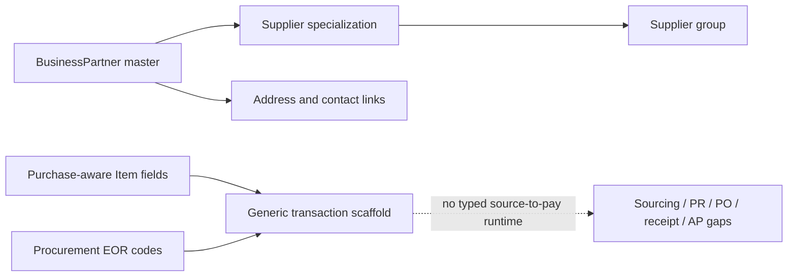
```mermaid
flowchart LR
  BP["BusinessPartner master"] --> SUP["Supplier specialization"]
  SUP --> SG["Supplier group"]
  BP --> AC["Address and contact links"]
  ITEM["Purchase-aware Item fields"] --> GEN["Generic transaction scaffold"]
  SEED["Procurement EOR codes"] --> GEN
  GEN -. "no typed source-to-pay runtime" .-> GAP["Sourcing / PR / PO / receipt / AP gaps"]
```

## Chapter 5 — Target Procurement Architecture

The target separates twelve layers with explicit maturity. Current master-data foundations occupy supplier identity, terms, item inputs and organization context. Planned layers govern onboarding, sourcing, requisition, contracts/POs, commercial control, receipt/quality coordination, invoice/match coordination, returns/claims, reporting/reconciliation and control operations. Future layers cover partner channels and advanced special models after requirements and threat analysis.

Each layer publishes contracts rather than sharing ownership. Supplier governance publishes an approved commercial identity and scoped qualification. Sourcing produces a versioned award decision. Demand intake produces approved requisition quantities and account-assignment requests. Contract/PO management produces a supplier commitment and expected-receipt schedule. Inventory and Quality return authoritative receipt and disposition facts. Finance/AP accepts invoice and matching inputs, then returns posting, liability, payment and settlement references. Returns and claims retain all antecedents. Reconciliation compares identifiers, quantities, amounts, statuses and versions without mutating the source domains.

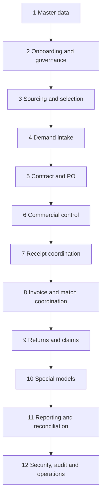
```mermaid
flowchart TB
  M["1 Master data"] --> G["2 Onboarding and governance"] --> S["3 Sourcing and selection"]
  S --> D["4 Demand intake"] --> O["5 Contract and PO"] --> C["6 Commercial control"]
  C --> R["7 Receipt coordination"] --> I["8 Invoice and match coordination"] --> X["9 Returns and claims"]
  X --> P["10 Special models"] --> A["11 Reporting and reconciliation"] --> K["12 Security, audit and operations"]
```

## Chapter 6 — Procurement Organization Model

Procurement authority is evaluated in organizational context. Tenant isolates customers of the platform; legal entity and company define the contracting and accounting party. A planned purchasing organization owns procurement policy across one or more companies, while purchasing office provides local administration, purchasing group provides category or operational responsibility, and Buyer is the accountable user assignment. Category Manager owns sourcing strategy; Supplier Manager owns relationship governance. These purchasing structures are not present as typed repository models and require an effective-dated design linked to identity and organization access.

Branch, plant and warehouse identify delivery context but cannot grant Procurement permission to move stock. Cost center, profit center, project and maintenance location are consuming/account-assignment dimensions governed by their owning domains. Requesting department states demand origin. A buyer may act only for approved company, purchasing organization, category and location intersections; delegation must be time-bound and audited. Cross-company purchasing requires explicit agency rules and cannot silently substitute the buyer's default company.

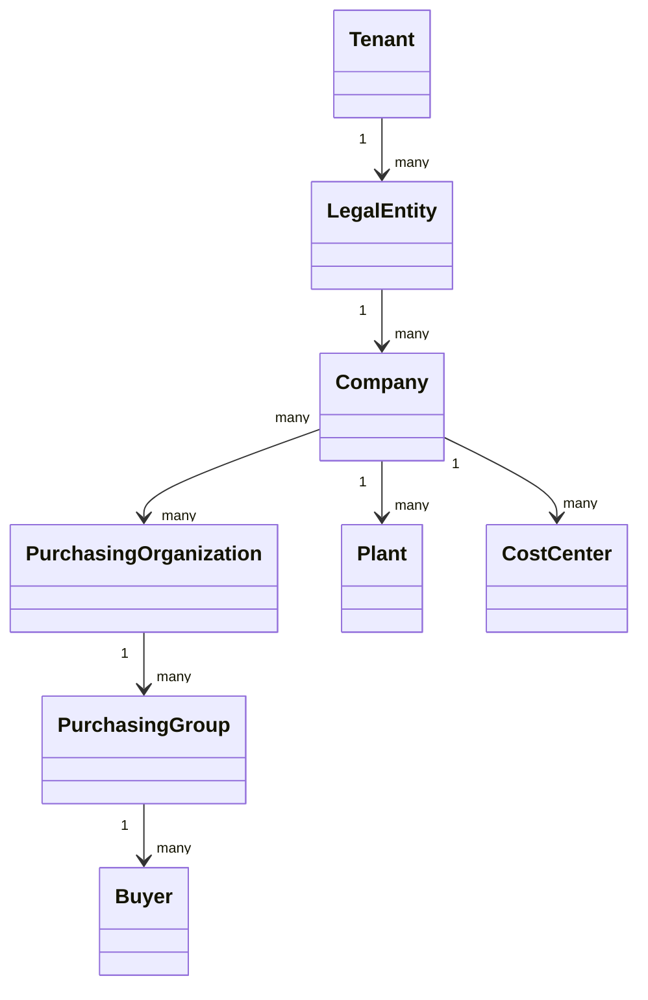
```mermaid
classDiagram
  class Tenant
  class LegalEntity
  class Company
  class PurchasingOrganization
  class PurchasingGroup
  class Buyer
  class Plant
  class CostCenter
  Tenant "1" --> "many" LegalEntity
  LegalEntity "1" --> "many" Company
  Company "many" --> "many" PurchasingOrganization
  PurchasingOrganization "1" --> "many" PurchasingGroup
  PurchasingGroup "1" --> "many" Buyer
  Company "1" --> "many" Plant
  Company "1" --> "many" CostCenter
```

## Chapter 7 — Business Partner and Supplier Architecture

Business Partner is the durable legal/commercial identity; Supplier is a company-specific purchasing role. A prospective supplier can provide onboarding evidence without becoming orderable. Ordering supplier receives the PO, invoicing supplier presents the invoice, and remit-to party is Finance-controlled payment direction. Manufacturer identifies product origin; carrier, service provider, contractor, subcontractor and consignor express distinct performance and custody relationships. Intercompany supplier links a group counterparty to a legal entity. One-time and marketplace supplier models remain future until identity, tax, privacy, fraud and retention rules are approved.

The target uses typed, effective-dated role assignments rather than a single free-form supplier type. Every order snapshots the relevant supplier-role identifiers and validated addresses; downstream systems do not infer remit-to or manufacturer from the ordering party. Supplier code remains a scoped human business key, never the immutable identifier. The current specialization link is optional for legacy compatibility, so migration must identify unlinked suppliers before strict role rules are enforced.

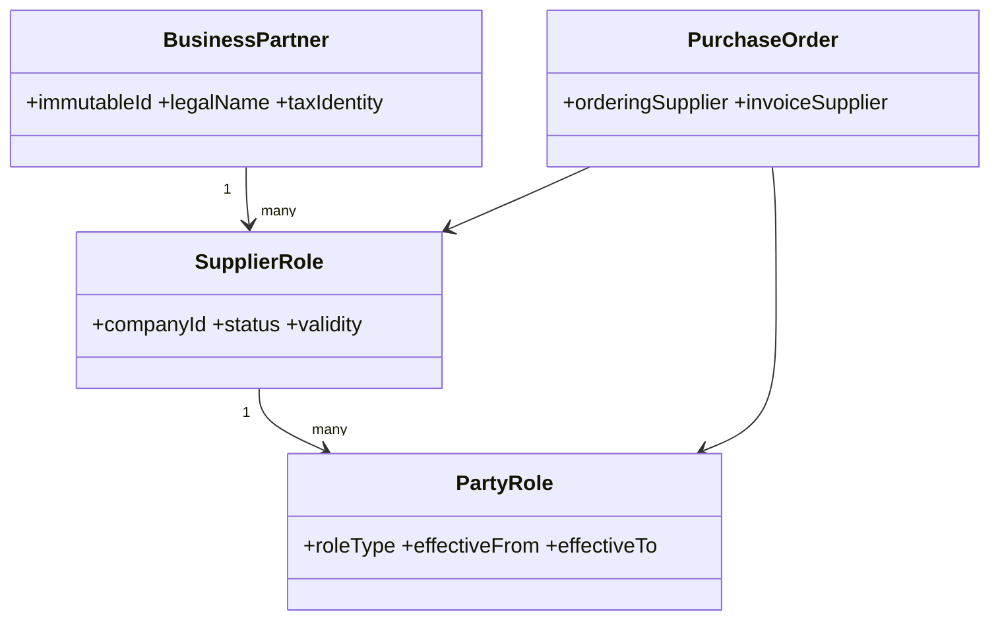
```mermaid
classDiagram
  class BusinessPartner { +immutableId +legalName +taxIdentity }
  class SupplierRole { +companyId +status +validity }
  class PartyRole { +roleType +effectiveFrom +effectiveTo }
  class PurchaseOrder { +orderingSupplier +invoiceSupplier }
  BusinessPartner "1" --> "many" SupplierRole
  SupplierRole "1" --> "many" PartyRole
  PurchaseOrder --> SupplierRole
  PurchaseOrder --> PartyRole
```

## Chapter 8 — Supplier Hierarchy Architecture

Supplier hierarchy is not one tree. Corporate parent/subsidiary and head-office/branch relations describe legal or operational structure; buying-group membership affects negotiated leverage; contract hierarchy determines agreement inheritance; payment hierarchy is Finance-owned; risk hierarchy aggregates exposure; reporting hierarchy supports analytics; manufacturer/distributor links explain supply provenance. The existing SupplierGroup hierarchy is useful classification evidence, but it must not be misrepresented as all supplier relationships.

Target relations carry type, direction, company scope, effective interval, source evidence, approver and supersession. Historical queries resolve the relationship valid at the PO, receipt or invoice date. A supplier may belong to multiple non-conflicting hierarchies, while cycles are prohibited within hierarchical relation types. A parent cannot inherit qualification, payment destination or approved-source status unless the relevant authority explicitly permits it. Changes affecting contracts, risk aggregation or remittance trigger impact review instead of rewriting prior documents.

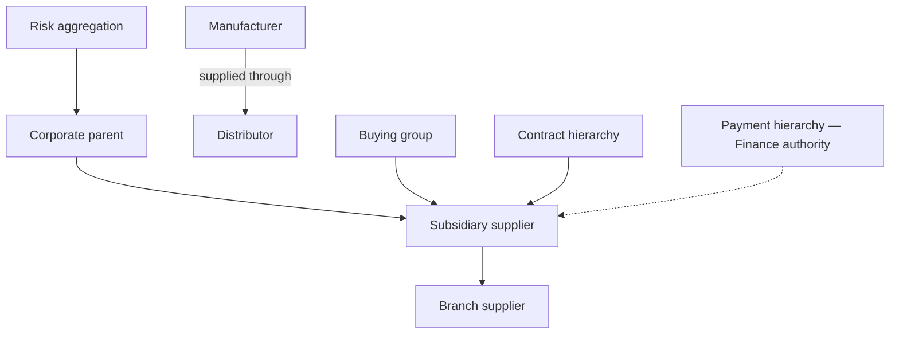
```mermaid
flowchart TB
  P["Corporate parent"] --> S1["Subsidiary supplier"]
  S1 --> B["Branch supplier"]
  M["Manufacturer"] -->|"supplied through"| D["Distributor"]
  BG["Buying group"] --> S1
  CH["Contract hierarchy"] --> S1
  RH["Risk aggregation"] --> P
  PH["Payment hierarchy — Finance authority"] -.-> S1
```

## Chapter 9 — Supplier Address and Contact Architecture

Registered, ordering, remit-to, pickup, service and tax addresses serve different decisions. Contact roles distinguish commercial, quality, logistics, invoice-query, security and escalation contacts; each carries preferred channel, language, time zone, validity and verification evidence. The current generic Address and ContactPerson masters plus effective-dated partner links provide a foundation, but no consent, verification or Procurement-specific address-override workflow is evidenced.

PO issue resolves only an active ordering address and snapshots it. Pickup and service locations are checked against the relevant delivery model. Remit-to address may inform invoice routing but cannot alter supplier bank data. Bank accounts, bank-change evidence and payment destinations remain Finance-restricted and are neither stored nor approved by Procurement. Personal contact exports require purpose, field minimization and audit. An address override records reason, source, approver and affected PO revision; it never silently updates the supplier master.

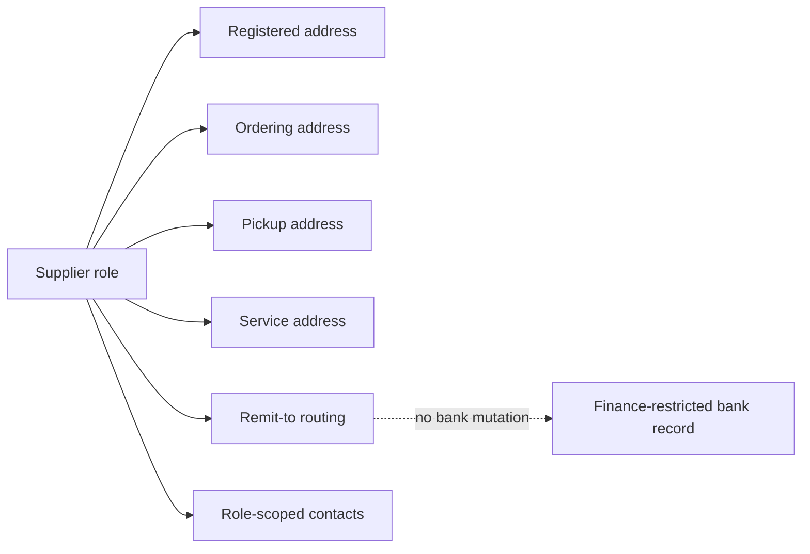
```mermaid
flowchart LR
  SUP["Supplier role"] --> REG["Registered address"]
  SUP --> ORD["Ordering address"]
  SUP --> PICK["Pickup address"]
  SUP --> SERV["Service address"]
  SUP --> REM["Remit-to routing"]
  REM -. "no bank mutation" .-> FIN["Finance-restricted bank record"]
  SUP --> CON["Role-scoped contacts"]
```

## Chapter 10 — Supplier Lifecycle and Governance

The conceptual lifecycle begins at Prospect, moves through Invited, Onboarding and Pending review, and may reach Qualified, Approved, Conditionally approved and Active. Operational exceptions use On hold, Blocked or Suspended; inactivity uses Dormant; termination uses Closed; retention uses Archived. Statuses have distinct allowed actions: qualification does not make a supplier orderable, approval does not bypass approved-source or PO controls, and archive is not deletion.

Creation starts with tenant/company duplicate search against legal name, registration/tax identifiers and normalized contacts. Due-diligence checks are configurable evidence requests, not a claim of legal or sanctions capability. Approval separates requester, supplier steward and approver. Sensitive changes to legal identity, tax data, addresses or roles create versioned change requests. Suspension blocks new commitments while preserving open-document resolution; closure requires review of contracts, open POs, receipts, claims, invoices and retention obligations. The current status and approval-like fields are inputs only because no lifecycle transition engine is evidenced.

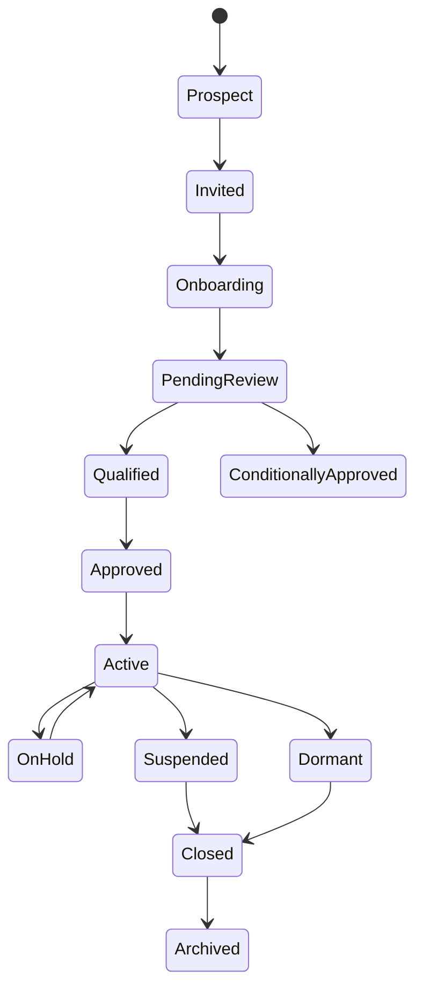
```mermaid
stateDiagram-v2
  [*] --> Prospect
  Prospect --> Invited
  Invited --> Onboarding
  Onboarding --> PendingReview
  PendingReview --> Qualified
  Qualified --> Approved
  Approved --> Active
  PendingReview --> ConditionallyApproved
  Active --> OnHold
  OnHold --> Active
  Active --> Suspended
  Suspended --> Closed
  Active --> Dormant
  Dormant --> Closed
  Closed --> Archived
```

## Chapter 11 — Supplier Qualification Architecture

Qualification is a scoped, expiring decision, not a permanent supplier attribute. A request identifies category or commodity, item/service family, company, plant/site and intended role. Evidence may address capability, capacity direction, certification direction, financial-risk input, quality systems, delivery ability, cybersecurity/privacy expectations and ESG direction. These are review topics; the platform makes no legal, regulatory or certification-verification claim without separately approved services and jurisdictional requirements.

Each evidence item records issuer, received date, validity, reviewer, confidentiality and decision. Mandatory criteria can fail the request; conditional approval creates constraints and review dates. Requalification begins before expiry and does not overwrite prior evidence. Exceptions name the unmet criterion, compensating control, approver and expiry. Quality, Security, Finance and domain specialists retain authority over their assessments; Procurement assembles the commercial qualification decision. An expired qualification cannot remain silently available to new sourcing or ordering.

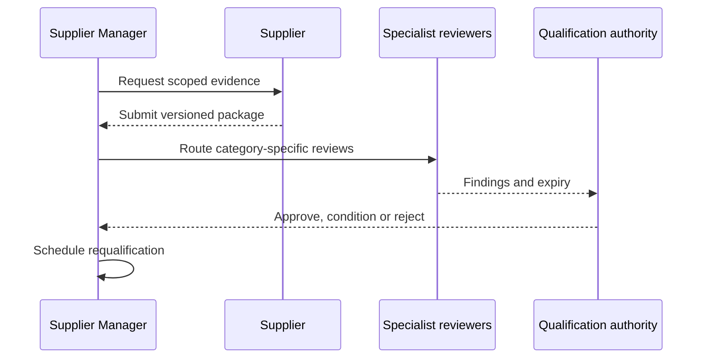
```mermaid
sequenceDiagram
  participant SM as Supplier Manager
  participant SUP as Supplier
  participant SPEC as Specialist reviewers
  participant GOV as Qualification authority
  SM->>SUP: Request scoped evidence
  SUP-->>SM: Submit versioned package
  SM->>SPEC: Route category-specific reviews
  SPEC-->>GOV: Findings and expiry
  GOV-->>SM: Approve, condition or reject
  SM->>SM: Schedule requalification
```

## Chapter 12 — Approved Supplier and Source List Direction

The approved-source list determines whether a qualified supplier may supply a specific item, category or service into a company/plant during an effective interval. Its grain includes supplier role, source scope, site, status, priority and restrictions. Preferred, alternate, sole and emergency sources are explicit classifications; “default supplier” on Item is merely a planning hint until reconciled with this governed list.

Eligibility checks supplier lifecycle, qualification expiry, quality restriction, commercial restriction and effective dates. Sole-source status requires documented rationale and periodic challenge. Emergency override is transaction-scoped, time-limited and approved independently; it does not modify the permanent source list. A Quality restriction can prohibit receipt acceptance even when commercial approval remains. Source-list changes preserve history so a PO proves which rule was valid at validation time.

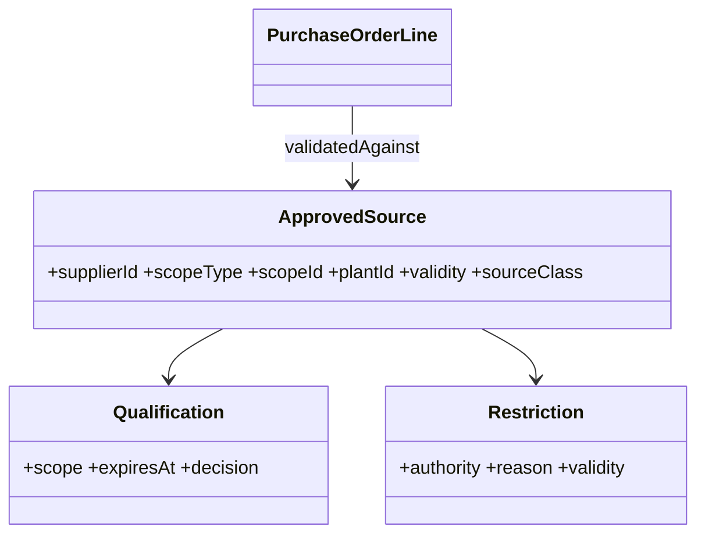
```mermaid
classDiagram
  class ApprovedSource { +supplierId +scopeType +scopeId +plantId +validity +sourceClass }
  class Qualification { +scope +expiresAt +decision }
  class Restriction { +authority +reason +validity }
  class PurchaseOrderLine
  ApprovedSource --> Qualification
  ApprovedSource --> Restriction
  PurchaseOrderLine --> ApprovedSource : validatedAgainst
```

## Chapter 13 — Supplier Risk Architecture

Supplier risk is a governed portfolio of observations rather than a single rating. Categories include financial direction, delivery, quality, capacity, geographic direction, cybersecurity direction, dependency concentration and single-source exposure. Critical-supplier designation is based on operational impact and substitutability, not spend alone. The current Supplier rating field has no evidence model, weighting, review workflow or history, so it is only partial master data.

Each assessment records scope, source, observation date, confidence, owner, next review and mitigation. Incidents can raise exposure and trigger sourcing restriction, heightened approval or suspension, but risk reviewers cannot directly alter Quality disposition or Finance payment. Concentration aggregates parent relationships and commodities to avoid understating dependency. Monitoring thresholds create review work, not automated adverse action. Geographic, cyber and financial topics remain directional until approved evidence providers and policies exist.

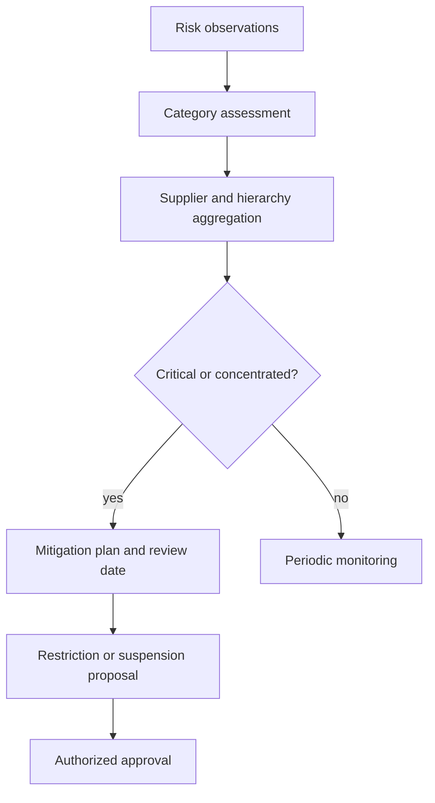
```mermaid
flowchart TD
  OBS["Risk observations"] --> CAT["Category assessment"]
  CAT --> AGG["Supplier and hierarchy aggregation"]
  AGG --> CRIT{"Critical or concentrated?"}
  CRIT -->|"yes"| MIT["Mitigation plan and review date"]
  CRIT -->|"no"| MON["Periodic monitoring"]
  MIT --> ESC["Restriction or suspension proposal"]
  ESC --> APP["Authorized approval"]
```

## Chapter 14 — Supplier Performance Architecture

Performance measures combine authoritative evidence: on-time and in-full delivery from Inventory events, acceptance/rejection from Quality, lead-time adherence from PO schedule versus receipt, purchase-price variance from governed commercial and Finance facts, responsiveness from supplier interactions, corrective-action closure from Quality, invoice accuracy from AP and service performance from service owners. Procurement cannot rewrite source facts to improve a score.

A scorecard defines rating period, population, formula, weighting, missing-data treatment, owner and approval. Late delivery caused by an approved buyer change is separated from supplier lateness. Disputes retain original result, supplier statement, evidence and resolution; recalculation is versioned. Improvement plans identify actions, owners and due dates without pretending to be legal remedies. Scorecards support sourcing judgment but do not autonomously suspend, award or order.

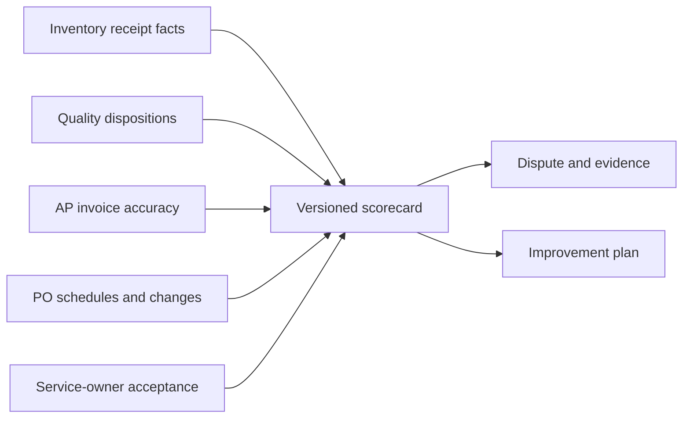
```mermaid
flowchart LR
  INV["Inventory receipt facts"] --> SCORE["Versioned scorecard"]
  Q["Quality dispositions"] --> SCORE
  AP["AP invoice accuracy"] --> SCORE
  PO["PO schedules and changes"] --> SCORE
  SRV["Service-owner acceptance"] --> SCORE
  SCORE --> DISP["Dispute and evidence"]
  SCORE --> PLAN["Improvement plan"]
```

## Chapter 15 — Procurement Category and Commodity Architecture

Category, commodity and subcategory form an effective-dated classification hierarchy for sourcing strategy and spend analysis. Each node defines item/service scope, Category Manager, risk level, preferred sourcing approach, contract-coverage target and review cadence. Item category remains master-data classification; Procurement category may aggregate items and services differently and therefore requires an explicit mapping rather than reusing one code silently.

Strategy records market assumptions, approved sources, competition approach, contract direction and dependency concerns. Savings baseline and market-intelligence concepts remain directional until measurement and evidence rules are approved. Responsible-procurement topics are policy placeholders, not verified ESG or compliance claims. Reclassification assesses open events, contracts, requisitions and POs; historical documents retain the category version used when approved.

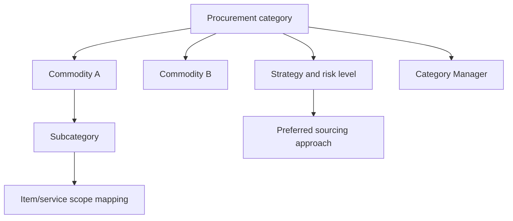
```mermaid
flowchart TB
  CAT["Procurement category"] --> COM1["Commodity A"]
  CAT --> COM2["Commodity B"]
  COM1 --> SUB["Subcategory"]
  SUB --> MAP["Item/service scope mapping"]
  CAT --> STRAT["Strategy and risk level"]
  CAT --> OWN["Category Manager"]
  STRAT --> SRC["Preferred sourcing approach"]
```

## Chapter 16 — Sourcing Event Architecture

A sourcing request states the business need, category, sponsor, scope and desired outcome before an event is created. Event type distinguishes RFI, RFQ, RFP and a future auction direction. The event contains lots, participants, timeline, question periods, attachments, commercial and technical terms, evaluation plan, confidentiality classification, amendments, award direction and cancellation reason. Supplier inclusion is checked against lifecycle, qualification and conflict constraints without implying that every approved supplier must be invited.

Publication freezes the event version and evaluation criteria. Questions are visible according to an approved disclosure policy; answers and amendments are versioned and distributed consistently. Submission closure uses server time and records accepted/rejected attempts. Event cancellation preserves all notices and evidence. Sourcing creates recommendation and award records but never a PO or payment by itself.

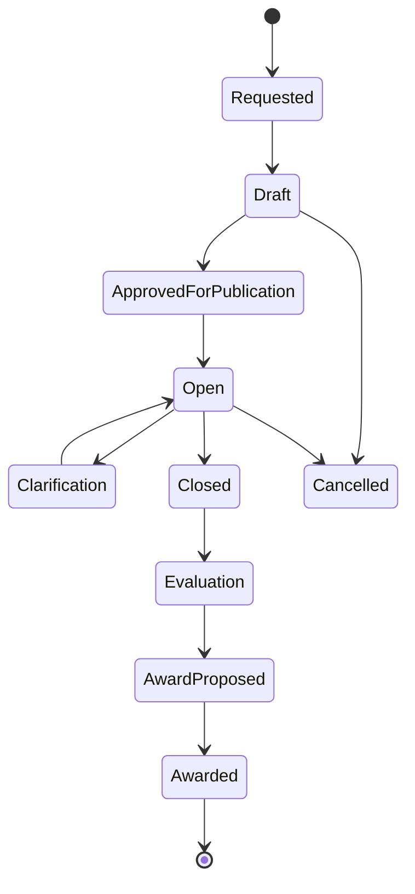
```mermaid
stateDiagram-v2
  [*] --> Requested
  Requested --> Draft
  Draft --> ApprovedForPublication
  ApprovedForPublication --> Open
  Open --> Clarification
  Clarification --> Open
  Open --> Closed
  Closed --> Evaluation
  Evaluation --> AwardProposed
  AwardProposed --> Awarded
  Draft --> Cancelled
  Open --> Cancelled
  Awarded --> [*]
```

## Chapter 17 — RFI Architecture

An RFI gathers capability information without commercial commitment. Its question set can request service coverage, manufacturing capability, capacity direction, qualification evidence or integration readiness, but must avoid collecting unnecessary confidential or personal data. Responses identify supplier, event version, question version, attachments, submitter and timestamp. Clarifications append to the original response; they do not edit the submitted answer.

Shortlisting criteria are published before closure and may combine completeness, relevance and specialist review. RFI evaluation produces observations and a shortlist recommendation, not price acceptance, contract or PO. Deadline extensions create a new event version and equal notification. Confidentiality rules separate responses among suppliers and restrict evaluator access. Closure retains the event, responses, clarifications, evaluation and decision evidence under the approved retention policy.

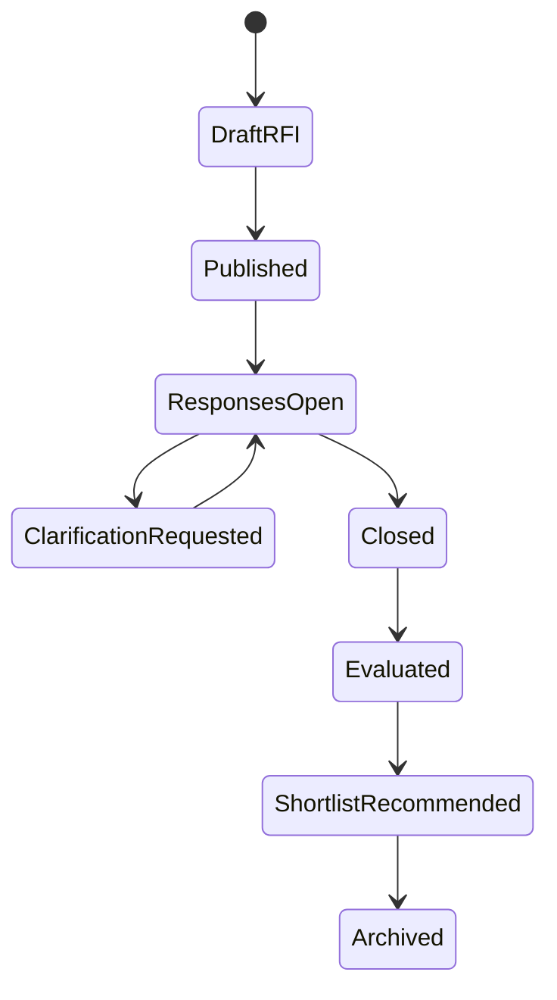
```mermaid
stateDiagram-v2
  [*] --> DraftRFI
  DraftRFI --> Published
  Published --> ResponsesOpen
  ResponsesOpen --> ClarificationRequested
  ClarificationRequested --> ResponsesOpen
  ResponsesOpen --> Closed
  Closed --> Evaluated
  Evaluated --> ShortlistRecommended
  ShortlistRecommended --> Archived
```

## Chapter 18 — RFQ and RFP Architecture

RFQ is appropriate when requirements are sufficiently precise for comparable commercial offers; RFP allows solution, method and commercial proposals. Both use a versioned request header, lots and lines with item/service, quantity, UOM, delivery schedule and location. They snapshot currency, tax facts, commercial terms, technical requirements, Incoterm direction, validity, bid instructions and attachment hashes. Supplier responses always reference the request and amendment version received.

Amendments identify changed fields, reason, approver and impact on deadlines. Material changes require suppliers to acknowledge the new version and may invalidate earlier drafts. Clarifications cannot alter evaluation criteria after bid visibility. Alternative bids are accepted only when the event explicitly permits them and remain distinguishable from compliant bids. Neither RFQ nor RFP commits funds; award and subsequent contract/PO approvals remain separate.

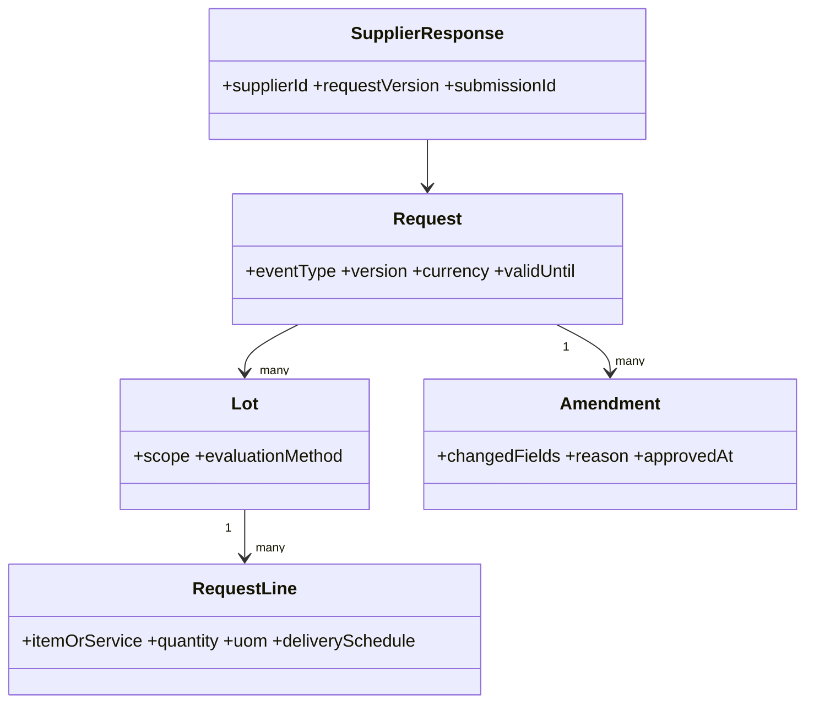
```mermaid
classDiagram
  class Request { +eventType +version +currency +validUntil }
  class Lot { +scope +evaluationMethod }
  class RequestLine { +itemOrService +quantity +uom +deliverySchedule }
  class Amendment { +changedFields +reason +approvedAt }
  class SupplierResponse { +supplierId +requestVersion +submissionId }
  Request "1" --> "many" Lot
  Lot "1" --> "many" RequestLine
  Request "1" --> "many" Amendment
  SupplierResponse --> Request
```

## Chapter 19 — Supplier Bid Architecture

A bid header identifies event, supplier role, request version, bid revision, submission state and validity. Bid lines state price, quantity, purchase UOM, currency, lead time, schedule, tax/duty direction, freight, minimum quantity, alternatives, exceptions and technical response. Attachments are hashed and classified. The system records draft, submitted, withdrawn and superseded revisions without overwriting any accepted submission.

Before closure a supplier may submit a new revision or withdraw according to policy. At closure, the accepted envelope becomes immutable and access remains restricted until the authorized opening point. A clarification is a separate signed response tied to a question and cannot silently replace the bid. Late attempts are recorded and rejected unless an approved, event-specific exception rule exists. Commercial values are sensitive bid data and are never exposed in architecture examples or logs.

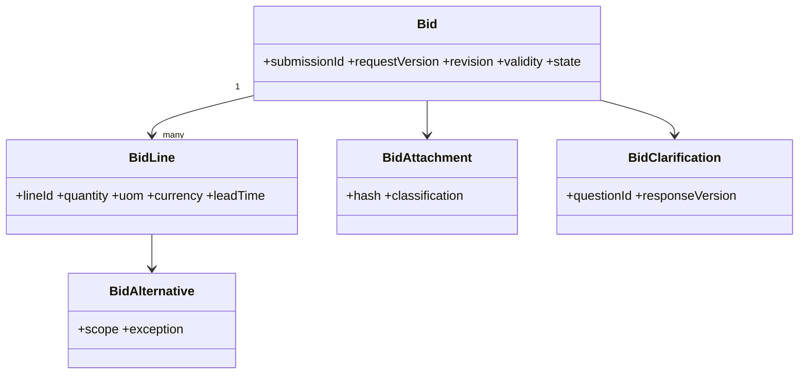
```mermaid
classDiagram
  class Bid { +submissionId +requestVersion +revision +validity +state }
  class BidLine { +lineId +quantity +uom +currency +leadTime }
  class BidAlternative { +scope +exception }
  class BidAttachment { +hash +classification }
  class BidClarification { +questionId +responseVersion }
  Bid "1" --> "many" BidLine
  BidLine --> BidAlternative
  Bid --> BidAttachment
  Bid --> BidClarification
```

## Chapter 20 — Bid Evaluation and Supplier Selection

Evaluation combines independently governed commercial, technical, Quality, delivery and risk views. Mandatory criteria are pass/fail; weighted criteria use the method published before closure. Total-cost direction may consider freight, duty, lifecycle or service inputs, but formula and evidence require approval before implementation. Exclusions record the criterion, reviewer and evidence. Conflict-of-interest declarations and recusal are captured before evaluators access bids.

Clarifications resolve ambiguity without bargaining inside the evaluation record. Each score retains evaluator, criterion version, rationale and evidence reference. The evaluation team produces a recommendation; an authorized award body decides approve, reject, split or return for rework. Where policy requires, evaluator and award approver are distinct. Regret-notification direction discloses only approved information. An award is commercial selection evidence, not an invoice, payment or automatic PO.

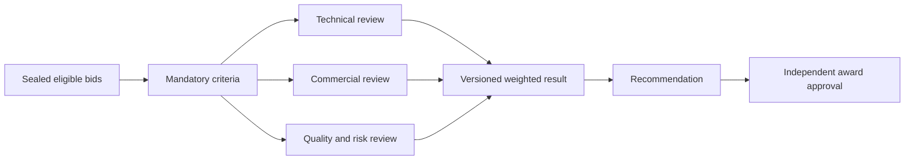
```mermaid
flowchart LR
  B["Sealed eligible bids"] --> M["Mandatory criteria"]
  M --> T["Technical review"]
  M --> C["Commercial review"]
  M --> Q["Quality and risk review"]
  T --> W["Versioned weighted result"]
  C --> W
  Q --> W
  W --> REC["Recommendation"]
  REC --> APP["Independent award approval"]
```

## Chapter 21 — Procurement Contract Architecture

The Procurement contract aggregate represents a supplier agreement version, not a document attachment alone. It identifies contracting company and supplier roles, contract number, validity, category/item/service scope, commercial conditions, quantity or value commitments, delivery schedules, payment-term reference, Quality terms, service levels, renewal, suspension and termination rules. Consumption is derived from approved releases and cannot exceed governed ceilings without amendment.

Activation requires approved legal/commercial review roles determined outside this architecture; FCSB-017 does not claim electronic-signature or legal-contract capability. Amendments create a new effective version and state whether open requisitions, POs or releases are grandfathered or revalidated. Suspension prevents new releases but preserves resolution of open commitments. Termination records effective date and close obligations. Contract price is a source for PO pricing, never an instruction to Finance to post.

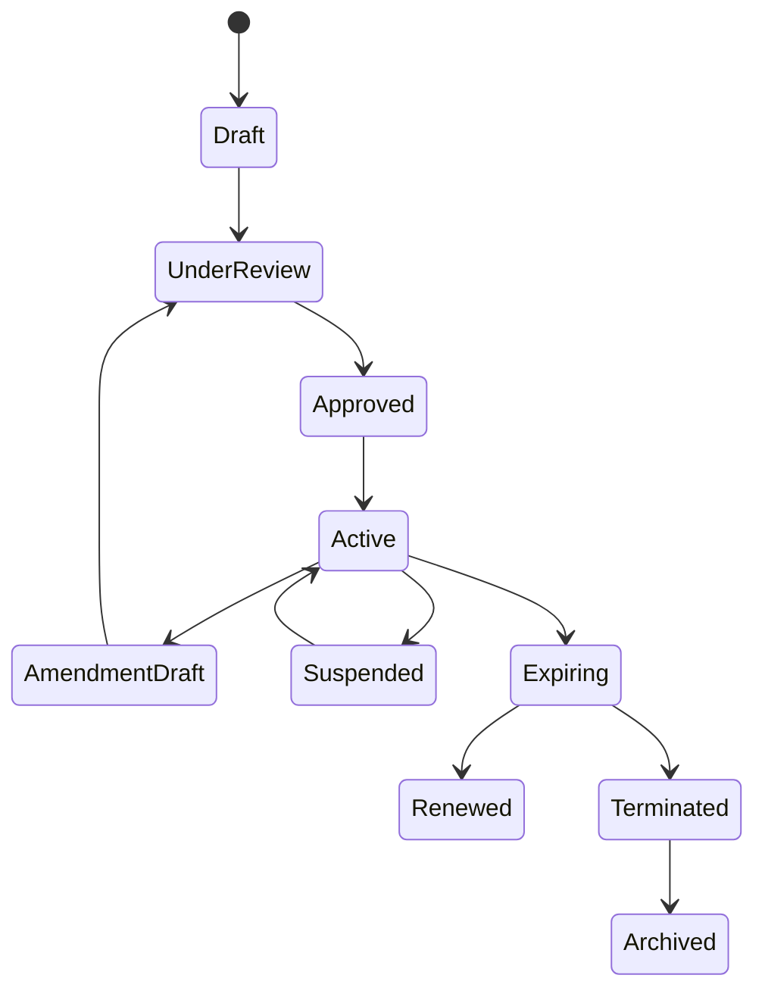
```mermaid
stateDiagram-v2
  [*] --> Draft
  Draft --> UnderReview
  UnderReview --> Approved
  Approved --> Active
  Active --> AmendmentDraft
  AmendmentDraft --> UnderReview
  Active --> Suspended
  Suspended --> Active
  Active --> Expiring
  Expiring --> Renewed
  Expiring --> Terminated
  Terminated --> Archived
```

## Chapter 22 — Blanket and Scheduling Agreements

A blanket agreement authorizes releases within value, quantity, category and time bounds; quantity and value contracts use different consumption measures. A scheduling agreement adds forecast and firm schedule lines. Release order or call-off converts an approved demand portion into a supplier commitment while preserving agreement, requisition and schedule lineage. Forecast schedules communicate planning intent and do not equal firm releases.

Cumulative released, received, invoiced and cancelled quantities are tracked separately. Remaining commitment is computed from the agreement version and approved releases, not edited manually. Over-release requires explicit exception approval; under-consumption is reported and may trigger renegotiation but never creates fictitious receipt. Expiry blocks new releases while allowing controlled close of open ones. Agreement-to-release reconciliation detects duplicate or missing consumption.

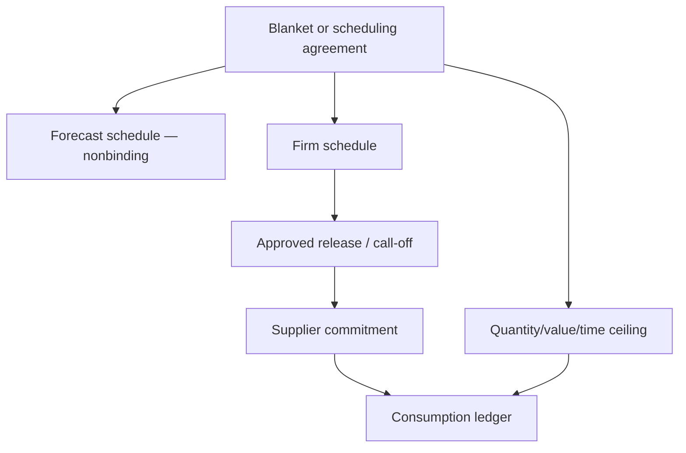
```mermaid
flowchart TD
  AGR["Blanket or scheduling agreement"] --> LIM["Quantity/value/time ceiling"]
  AGR --> FC["Forecast schedule — nonbinding"]
  AGR --> FIRM["Firm schedule"]
  FIRM --> REL["Approved release / call-off"]
  REL --> PO["Supplier commitment"]
  PO --> CONS["Consumption ledger"]
  LIM --> CONS
```

## Chapter 23 — Purchase Requisition Architecture

A Purchase Requisition records internal demand before supplier commitment. Header context identifies requester, company, department, plant, cost center, project or maintenance reference, source, priority and justification. Lines identify item/service, purchase eligibility, quantity/UOM, required date, delivery location, suggested supplier, estimate currency, attachments and budget reference. Suggested supplier and estimated value guide processing but do not bypass sourcing, source approval or final pricing.

Each line can follow a different outcome: rejected, sourced, contracted, partially converted, cancelled or closed. Account-assignment references remain requests to Finance/owning domains until validated. Sensitive attachments are classified. A stable idempotency key prevents repeated offline or integration submission. The aggregate retains requester changes, validation results and approvals, and never directly creates inventory, AP or journal records.

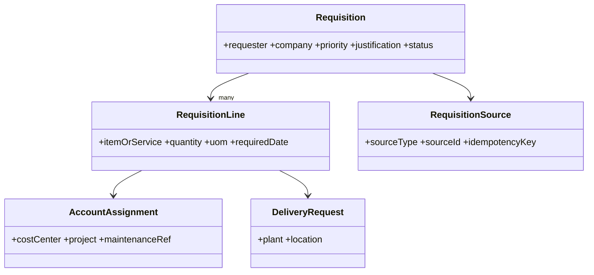
```mermaid
classDiagram
  class Requisition { +requester +company +priority +justification +status }
  class RequisitionLine { +itemOrService +quantity +uom +requiredDate }
  class AccountAssignment { +costCenter +project +maintenanceRef }
  class DeliveryRequest { +plant +location }
  class RequisitionSource { +sourceType +sourceId +idempotencyKey }
  Requisition "1" --> "many" RequisitionLine
  RequisitionLine --> AccountAssignment
  RequisitionLine --> DeliveryRequest
  Requisition --> RequisitionSource
```

## Chapter 24 — Purchase Requisition Lifecycle

Draft permits requester edits. Validated means structural and policy checks passed at that moment. Submitted freezes a version and enters Pending approval. Approvers may Approve, Reject or Return for correction with reasons. Approved demand may become Sourcing required, Partially converted or Converted; conversion is never automatic unless a separately approved policy explicitly authorizes a controlled path. Cancelled stops remaining demand, Closed confirms no further action, and Archived applies retention.

Every edit after submission creates a revision or returns the requisition to validation. Approval records the version, scope and thresholds considered. Partial conversion tracks line quantity and target references, leaving an explicit residual. Cancellation evaluates linked events and POs instead of deleting them. Status is derived from line states where necessary and cannot be set by a free-form client field.

```mermaid
stateDiagram-v2
  [*] --> Draft
  Draft --> Validated
  Validated --> Submitted
  Submitted --> PendingApproval
  PendingApproval --> Approved
  PendingApproval --> Rejected
  PendingApproval --> ReturnedForCorrection
  ReturnedForCorrection --> Draft
  Approved --> SourcingRequired
  Approved --> PartiallyConverted
  PartiallyConverted --> Converted
  Approved --> Cancelled
  Converted --> Closed
  Closed --> Archived
```

## Chapter 25 — Requisition Validation and Approval

Validation confirms authenticated requester and allowed company, item/service identity, purchase eligibility, UOM conversion and quantity precision, required date, delivery location, account assignment, estimate currency and attachment policy. It asks Inventory for available-stock direction, Procurement for existing contracts and approved sources, and Finance for budget direction; these responses are versioned facts, not direct shared-table queries. Duplicate-demand and split-requisition checks produce review evidence, not opaque automatic rejection.

Approval routing considers value band, category, company, project/maintenance context, emergency flag and exceptions. Requester cannot approve their own demand where SoD policy forbids it. An approver sees the validated version and prior decisions. Any material change invalidates approval. Budget approval does not make Procurement or the Budget Owner an accounting authority, and requisition approval alone does not create a PO.

```mermaid
flowchart TD
  PR["Submitted requisition version"] --> ID["Requester and company scope"]
  ID --> ITEM["Item/service, UOM and quantity"]
  ITEM --> NEED["Date, location and duplicate demand"]
  NEED --> EXT["Stock / contract / source / budget requests"]
  EXT --> RISK{"Exceptions or split risk?"}
  RISK -->|"yes"| ROUTE["Enhanced approval route"]
  RISK -->|"no"| STD["Standard approval route"]
  ROUTE --> DEC["Version-bound decision"]
  STD --> DEC
```

## Chapter 26 — Procurement Demand Consolidation

Consolidation groups compatible approved requisition quantities without erasing their origin. Candidate rules can consider item/service, plant or delivery location, need-date window, category, approved supplier, contract and currency. Quantity aggregation may create sourcing lots or proposed PO lines. Split sourcing allocates demand across suppliers; partial conversion leaves a measured residual against each source line.

The consolidation workspace exposes requester, urgency and constraints so bulk efficiency does not override operational need. Cancellation of one source line removes only its uncommitted quantity. A consolidation decision records included lines, rejected candidates, grouping rule version and Buyer. The resulting event or PO maintains line-level links back to every requisition, enabling requester visibility and reconciliation.

```mermaid
flowchart LR
  R1["Approved PR line A"] --> C{"Compatibility window"}
  R2["Approved PR line B"] --> C
  R3["Urgent PR line C"] --> EX["Excluded / separate path"]
  C --> LOT["Consolidated sourcing lot"]
  LOT --> SPLIT["Supplier allocation"]
  SPLIT --> P1["PO proposal 1"]
  SPLIT --> P2["PO proposal 2"]
  P1 --> LIN["Preserved source-line links"]
  P2 --> LIN
```

## Chapter 27 — Purchase Order Architecture

The PO aggregate expresses an approved commercial commitment to a supplier. Header fields include type, company, purchasing organization/group, ordering/invoicing roles, supplier reference, currency, payment and delivery terms, Incoterm direction, tax facts, delivery location, Buyer, originating contract/event and status. Lines identify item/service, purchase UOM, quantity, price condition result, schedules, tolerances, Quality requirements and account-assignment request. Attachments and clauses reference versioned documents.

Every issued version is immutable. A mutable draft can be revalidated; approval binds a content hash and authority context. Schedule lines separate requested, confirmed, received, rejected, returned and open quantities. The PO requests receipts and invoice matching but never writes stock, inspection, AP or journal records. Supplier acknowledgement is a response linked to the issued revision, not permission to alter it.

```mermaid
classDiagram
  class PurchaseOrder { +poId +revision +company +supplierRole +currency +status }
  class POLine { +itemOrService +quantity +uom +priceConditionRef }
  class POSchedule { +requestedDate +confirmedDate +openQuantity }
  class QualityRequirement { +inspectionRequired +specificationRef }
  class SourceLineage { +requisitionLine +contract +award }
  PurchaseOrder "1" --> "many" POLine
  POLine "1" --> "many" POSchedule
  POLine --> QualityRequirement
  POLine --> SourceLineage
```

## Chapter 28 — Purchase Order Lifecycle

Draft POs can change without supplier effect. Validated POs pass source, price, tax-fact, budget-direction and SoD checks. Submitted enters Pending approval; Approved is internally authorized but not yet communicated; Issued creates the immutable supplier-facing version. Acknowledged, Partially confirmed and Confirmed describe supplier response, not receipt. Partially received and Received derive from Inventory facts; Partially invoiced and Invoiced derive from Finance/AP facts.

On hold prevents specified actions while retaining open obligations. Cancellation before execution requires no receipt or invoice effect; later termination uses change, close and return/credit processes. Closed means all commercial, quantity, claim and financial reconciliation conditions are resolved. Archive follows retention. Status transitions consume trusted domain results, and no generic client may mark a PO received or invoiced.

```mermaid
stateDiagram-v2
  [*] --> Draft
  Draft --> Validated
  Validated --> Submitted
  Submitted --> PendingApproval
  PendingApproval --> Approved
  Approved --> Issued
  Issued --> Acknowledged
  Acknowledged --> PartiallyConfirmed
  PartiallyConfirmed --> Confirmed
  Confirmed --> PartiallyReceived
  PartiallyReceived --> Received
  Received --> PartiallyInvoiced
  PartiallyInvoiced --> Invoiced
  Invoiced --> Closed
  Issued --> OnHold
  Draft --> CancelledBeforeExecution
  Closed --> Archived
```

## Chapter 29 — Purchase Order Validation

PO validation resolves supplier lifecycle and approved-source eligibility for company, plant, item/category and date. It verifies item/service purchase eligibility, UOM conversion and precision, quantity and schedule, price source, currency, tax facts, commercial terms, delivery location, tolerances, contract/requisition links and duplicate supplier reference. Restricted categories and emergency sources invoke specialist approval. Budget and commitment checks are requests to Finance, not Procurement calculations of authoritative availability.

The validator records every input version: supplier, qualification/source record, Item/UOM, contract/award, currency/rate context, tax facts and approval policy. A failed or unavailable dependency yields a controlled hold rather than a guessed value. Any material revision reruns all applicable checks. SoD prevents the Buyer from self-approving beyond delegated policy, and duplicate detection cannot be bypassed by changing display text.

```mermaid
flowchart TD
  PO["PO draft revision"] --> SUP["Supplier and approved source"]
  SUP --> LINE["Item/service, UOM, quantity, schedule"]
  LINE --> COM["Price, currency, terms and tax facts"]
  COM --> SRC["PR, award and contract lineage"]
  SRC --> EXT["Budget / restriction requests"]
  EXT --> DUP["Duplicate and supplier-reference check"]
  DUP --> SOD["Approval and SoD evaluation"]
  SOD --> HASH["Validated content hash"]
```

## Chapter 30 — Purchase Order Change and Acknowledgement

A PO change request identifies the issued revision, changed fields, initiator, reason and desired effective point. Quantity, price, date, terms, supplier role, location or Quality changes produce a proposed revision; impact analysis examines open receipts, inspection, invoices, commitments and supplier acknowledgements. Reapproval follows the changed risk, not merely the original route. Reissue gives the supplier an immutable new version and explicitly supersedes the prior one.

Acknowledgement captures accepted, rejected and counterproposed lines with supplier reference and timestamps. Partial acknowledgement leaves unresolved lines visible. A counterproposal never edits the PO; the Buyer accepts it through a governed revision or rejects it. Cancellation evaluates executed quantities and financial effects. Concurrency control prevents two Buyers from issuing competing revisions from the same base.

```mermaid
sequenceDiagram
  participant B as Buyer
  participant PO as PO service
  participant APV as Approver
  participant S as Supplier channel
  B->>PO: Propose change from revision N
  PO->>PO: Check receipts, invoices and concurrent version
  PO->>APV: Route material change
  APV-->>PO: Approve revision N+1
  PO->>S: Issue immutable revision N+1
  S-->>PO: Accept, reject or counterpropose by line
  PO-->>B: Record acknowledgement without rewriting PO
```

## Chapter 31 — Pricing and Commercial Conditions

Purchase pricing resolves eligible conditions in an explainable order: contract or awarded quote, supplier-specific condition, quantity break, effective date, currency, purchase UOM and agreed freight or surcharge. Discounts, rebates, duties and formula/escalation directions remain separately typed; they are not flattened into an unexplained net price. Minimum-order constraints and price tolerances are evaluated against the exact condition version.

Manual price requires reason, source evidence and delegated approval, with restricted visibility of comparison or cost data. UOM conversion and exchange-rate context are preserved so later matching can reproduce the commercial value. Price changes never rewrite an issued PO. Rebate and formula pricing remain future until accrual, settlement and data-source ownership are approved. Procurement owns commercial determination; Finance owns posting, tax accounting and variance recognition.

```mermaid
flowchart LR
  CT["Contract / award condition"] --> DET["Deterministic price resolution"]
  SP["Supplier condition"] --> DET
  QB["Quantity break"] --> DET
  UOM["Purchase UOM conversion"] --> DET
  FX["Currency context"] --> DET
  FRT["Freight / surcharge"] --> DET
  DET --> TRACE["Explained condition trace"]
  MAN["Manual override"] --> APP["Reason and approval"] --> TRACE
```

## Chapter 32 — Budget, Commitment and Encumbrance Boundary

Procurement supplies requisition estimate, PO commitment proposal, account assignment, currency, date and organizational context to a Finance-owned budget service. Finance decides budget availability and defines commitment or encumbrance semantics. Receipt accrual direction, invoice consumption, releases on cancellation and period/currency treatment likewise remain Finance responsibilities. No current repository evidence establishes budget, commitment or encumbrance runtime.

The contract distinguishes advisory, reservation and blocking responses; Procurement cannot convert an unavailable response into approval. PO changes submit deltas, not full duplicate commitments. Cancellation and close request releases tied to the original commitment identifier. Cost center, project and account assignment are validated by their authorities. Over-budget exception identifies Budget Owner and Finance approval separately from PO commercial approval, preventing a Buyer from authorizing both demand and funding.

```mermaid
sequenceDiagram
  participant PR as Requisition/PO
  participant FIN as Finance budget authority
  participant BO as Budget Owner
  PR->>FIN: Check estimate or commitment delta
  FIN-->>PR: Available, blocked or advisory response
  alt over-budget exception
    PR->>BO: Request business exception
    BO-->>FIN: Approved business rationale
    FIN-->>PR: Authoritative exception result
  end
  PR->>FIN: Release or consume original commitment reference
```

## Chapter 33 — Goods Receipt Boundary

The PO publishes an expected-receipt schedule and Procurement may request receiving, but Inventory creates the authoritative goods receipt. The request carries PO/line/schedule, supplier delivery-note reference, expected quantity/UOM, warehouse/location, tracking and Quality requirements. Warehouse personnel record actual, damaged and rejected-at-door quantities plus batch/serial identities where required. Over- or under-delivery is evaluated against PO tolerance and may require Procurement exception approval, yet the recorded physical fact is never changed to fit the order.

Inventory owns putaway, stock status, movement history and receipt reversal. Quality receives an inspection request when policy applies and returns disposition separately. Procurement consumes receipt identifiers to update open commercial quantity and investigate discrepancies. Finance receives an accrual/match fact through its contract. Reversal cites the original receipt and triggers downstream review; it cannot delete history.

```mermaid
sequenceDiagram
  participant PO as Procurement PO
  participant INV as Inventory/Warehouse
  participant Q as Quality
  participant FIN as Finance
  PO->>INV: Expected-receipt request with tolerances
  INV->>INV: Record physical quantity, tracking and movement
  INV-->>PO: Authoritative receipt fact
  INV->>Q: Inspection request when required
  Q-->>INV: Hold, accept or reject disposition
  INV-->>FIN: Receipt/accrual fact
```

## Chapter 34 — Service Receipt and Acceptance Boundary

A service PO describes period, milestone, deliverable, quantity or hours and acceptance criteria. The service provider or requester may submit a service entry, but the designated Service Owner verifies evidence and records accepted, rejected or partially accepted performance. Procurement owns the commercial order and variance discussion; the Service Owner owns performance confirmation. Inventory has no goods movement unless a separate material flow exists.

Acceptance references deliverables, timesheets or milestone evidence without embedding restricted content unnecessarily. Partial acceptance leaves measurable open quantity. Rejection records defect and required correction. Retention direction is a commercial/Finance input, not a withheld payment executed by Procurement. Finance/AP uses the accepted service fact for invoice eligibility and authoritative matching. Reversal preserves the prior acceptance, approver and reason.

```mermaid
sequenceDiagram
  participant SUP as Service supplier
  participant OWN as Service Owner
  participant PROC as Procurement
  participant AP as Finance/AP
  SUP->>OWN: Submit service entry and evidence
  OWN-->>PROC: Accept, partially accept or reject
  PROC-->>SUP: Commercial discrepancy response
  OWN-->>AP: Authoritative accepted-service fact
  AP-->>PROC: Invoice eligibility/match status
```

## Chapter 35 — Quality Inspection Boundary

Inspection requirement originates from Item, supplier/source qualification, PO line or Quality plan. Inventory records receipt and places affected quantity in the applicable stock status; Quality creates an inspection reference for item, batch/serial, receipt and sampling direction. Quality alone decides pending, accepted, conditionally accepted direction, rejected, rework, hold or release. Procurement cannot change disposition to satisfy delivery performance.

A rejection can initiate nonconformance, corrective-action direction, supplier return intent or commercial claim, but those remain linked records with their own owners. Inventory executes authorized movement after Quality disposition. Evidence includes specification version, observation, inspector, decision and time. Procurement uses results for supplier performance and resolution; Finance/AP uses them only where the approved four-way match requires acceptance.

```mermaid
flowchart LR
  GR["Inventory goods receipt"] --> HOLD["Inspection stock status"]
  HOLD --> INS["Quality inspection"]
  INS --> ACC["Accepted / released"]
  INS --> COND["Conditional direction"]
  INS --> REJ["Rejected / rework"]
  ACC --> INV["Inventory movement authority"]
  REJ --> NCR["Nonconformance / return request"]
  NCR --> PROC["Procurement commercial resolution"]
```

## Chapter 36 — Invoice Matching Architecture

Matching compares versioned commercial and operational facts without transferring ownership. Two-way match compares PO to supplier invoice and suits approved categories where receipt evidence is not required. Three-way match adds authoritative goods or service receipt. Four-way match also requires Quality acceptance. Quantity, price, tax and freight variances are classified separately; tolerance definitions are effective-dated by company, category and risk. Partial matching allocates invoice lines to specific PO and receipt quantities.

Procurement owns commercial discrepancy investigation—wrong PO price, missing acknowledgement or claim—while Finance/AP owns invoice capture, authoritative posting decision, block/release and accounting match result. A Procurement recommendation cannot post or release an invoice. Overrides name variance, evidence, approvers, tolerance policy and residual risk. The match trail preserves every compared version and prevents a later PO edit from changing a completed result.

```mermaid
flowchart LR
  PO2["PO terms"] --> M2{"Two-way match"}
  INV2["Supplier invoice"] --> M2
  M2 --> R2["Variance / eligible result"]
```

```mermaid
flowchart LR
  PO3["PO quantity and price"] --> M3{"Three-way match"}
  GR3["Goods/service receipt"] --> M3
  INV3["Supplier invoice"] --> M3
  M3 --> R3["AP block, exception or eligible result"]
```

```mermaid
flowchart LR
  PO4["PO"] --> M4{"Four-way match"}
  GR4["Receipt"] --> M4
  QA4["Quality acceptance"] --> M4
  INV4["Supplier invoice"] --> M4
  M4 --> R4["Finance-authoritative match result"]
```

## Chapter 37 — Supplier Invoice Boundary

Finance/AP owns the Supplier Invoice aggregate. It identifies supplier and company, supplier invoice number, PO and receipt/service references, invoice/posting dates, currency and rate, line quantity/price, tax, freight, discount, due date, payment terms, match result and block. Credit note and reversal are separate document types linked to the original. Procurement can submit commercial references or discrepancy responses but cannot create an AP liability.

Invoice capture validates duplicate supplier number within defined supplier/company scope and preserves source image/hash according to document policy. Posting date and tax/account determination remain Finance decisions. A blocked invoice stays visible to Procurement for resolution without exposing supplier bank details. Changes use correction or reversal, never mutation of a posted invoice. No current SupplierInvoice/AP runtime is evidenced; the EOR code and generic transaction kind are metadata/scaffold only.

```mermaid
sequenceDiagram
  participant SRC as Invoice channel
  participant AP as Accounts Payable
  participant PROC as Procurement
  participant GL as Finance posting
  SRC->>AP: Submit supplier invoice
  AP->>AP: Duplicate, tax and reference validation
  AP->>PROC: Request commercial variance resolution
  PROC-->>AP: Evidence-backed recommendation
  AP->>GL: Post, block or reverse under Finance authority
  GL-->>PROC: Status reference only
```

## Chapter 38 — Accounts Payable and Payment Boundary

AP liability, due date, payment proposal, method, bank destination, remittance, settlement discount, withholding direction, payment block, partial payment, netting and reversal are Finance/Treasury responsibilities. Procurement may confirm commercial resolution or supplier contact but cannot maintain bank data, approve its own supplier payment, create settlement entries or release a payment block. Supplier bank data is excluded from Procurement models, screens, exports and examples.

Payment approval is separate from supplier, PO and invoice approval and applies dual control according to Finance policy. The payment service references posted AP items and verified Finance-owned bank instructions. Remittance communicates executed settlement; it does not modify PO receipt status. Reconciliation links payment to liability and bank result. Procurement sees only the minimal status needed to manage the supplier relationship.

```mermaid
flowchart TD
  AP["Posted AP liability"] --> PROP["Finance payment proposal"]
  PROP --> BANK["Finance-restricted bank instruction"]
  BANK --> DUAL["Independent payment approval"]
  DUAL --> EXEC["Treasury/payment execution"]
  EXEC --> REC["Bank and AP reconciliation"]
  PROC["Procurement"] -. "commercial status only" .-> AP
  PROC -. "cannot approve or execute" .-> DUAL
```

## Chapter 39 — Supplier Advance and Prepayment Boundary

Procurement may request an advance against an approved contract or PO, stating business purpose, amount/currency, due condition and guarantee direction. Finance validates policy, exposure, payment authority and bank destination, then executes or rejects payment. The request does not itself create an asset, liability or cash movement. Approval separates commercial sponsor, Budget Owner where relevant and Finance payment approvers.

An advance record tracks unapplied amount, allocation to eligible invoices, partial use, refund request, expiry direction and reconciliation. Allocation references the original advance and posted invoice; Procurement cannot mark it consumed. Cancellation after payment requires Finance reversal or supplier refund processing. Credit-exposure direction remains a Finance decision. No current advance runtime is evidenced.

```mermaid
sequenceDiagram
  participant PROC as Procurement
  participant FIN as Finance
  participant PAY as Payment control
  participant AP as AP allocation
  PROC->>FIN: Request advance linked to contract/PO
  FIN->>PAY: Validate and route dual approval
  PAY-->>FIN: Executed or rejected result
  FIN-->>PROC: Status reference
  AP->>AP: Allocate advance to posted invoice
  AP-->>FIN: Unapplied balance and reconciliation
```

## Chapter 40 — Returns to Supplier Architecture

A supplier return begins with intent linked to original PO, Inventory receipt, Quality decision and, when applicable, supplier invoice. The request states reason, quantity, UOM, batch/serial, condition, proposed return location and desired commercial outcome. Procurement approves supplier communication and return terms; Quality owns disposition; Inventory owns physical issue and movement. A warehouse cannot invent a supplier debit, and Procurement cannot reduce stock directly.

Supplier acknowledgement may accept replacement, credit or investigation. Replacement supply remains a new expected receipt linked to the return. Debit request and supplier credit are Finance-facing but distinct. Closure requires physical return evidence, commercial resolution and financial reconciliation. Fraud controls prevent quantity above eligible received/owned stock and require tracking identity where applicable.

```mermaid
flowchart LR
  ORIG["PO + receipt + inspection + invoice lineage"] --> RR["Supplier return request"]
  RR --> Q["Quality disposition"]
  Q --> APP["Procurement approval"]
  APP --> MOV["Inventory physical return movement"]
  MOV --> SUP["Supplier acknowledgement"]
  SUP --> OUT["Replacement / debit request / credit"]
  OUT --> REC["Quantity and Finance reconciliation"]
```

## Chapter 41 — Supplier Debit, Credit and Claim Boundary

A commercial debit request states Procurement's claim; a Finance debit note is an accounting document; a supplier credit note is supplier-issued evidence; a supplier refund is cash settlement; replacement supply is a logistics outcome. They cannot share one ambiguous status. Claims distinguish price, quantity, Quality and freight grounds and cite PO, receipt, inspection, invoice and communication evidence.

Procurement owns commercial negotiation and proposed resolution. Quality owns defect findings, Inventory owns quantity/movement facts, and Finance approves debit/credit posting and refund settlement. Penalty direction requires approved contract and legal policy and is not asserted by this blueprint. Reconciliation ensures claimed quantity/value is neither duplicated across credit, refund and replacement nor left unresolved after close.

```mermaid
flowchart TB
  CLAIM["Commercial supplier claim"] --> TYPE{"Resolution type"}
  TYPE --> DR["Procurement debit request"]
  TYPE --> REP["Replacement supply"]
  TYPE --> CR["Supplier credit note"]
  TYPE --> RF["Supplier refund"]
  DR --> FN["Finance debit note decision"]
  CR --> FIN["Finance posting"]
  RF --> CASH["Finance cash reconciliation"]
  REP --> INV["Inventory receipt lineage"]
```

## Chapter 42 — Landed Cost and Freight Boundary

Landed-cost evidence groups shipment, PO and receipt references with freight, duty, insurance, brokerage and handling components. Procurement supplies contracts, carrier invoices and commercial allocation context. Inventory supplies received items and quantities; Finance defines allowable cost components, provisional/final treatment, allocation basis, posting, reallocation and reversal. No landed-cost runtime is currently evidenced.

Allocation bases may include quantity, weight, volume or approved value, but must be reproducible and handle partial receipts. Provisional cost never changes physical quantity. Finalization compares provisional and actual components and posts Finance-owned adjustments with period control. Carrier and supplier invoice references remain separate. Reconciliation proves every component was allocated once to eligible receipts and that reversals preserve history.

```mermaid
flowchart LR
  SHIP["Shipment / PO evidence"] --> POOL["Landed-cost component pool"]
  FRT["Freight / insurance / handling"] --> POOL
  DUTY["Duty direction"] --> POOL
  GR["Inventory receipt facts"] --> BASIS["Approved allocation basis"]
  POOL --> BASIS
  BASIS --> POST["Finance valuation/posting"]
  POST --> RECON["Provisional-to-final reconciliation"]
```

## Chapter 43 — Drop-Shipment Architecture

Drop shipment links a customer Sales order to a Procurement requisition and supplier PO with a customer ship-to location. Sales owns customer promise, pricing and billing criteria; Procurement owns supplier commitment; the supplier provides acknowledgement and delivery evidence; Inventory defines whether and how a non-stock receipt fact is represented; Finance owns supplier invoice and customer accounting. Direct delivery never allows Procurement to mark the Sales order fulfilled unilaterally.

Cancellation coordinates both commitments and records which party accepted the change. Supplier delivery evidence is validated before any Sales billing trigger approved by FCSB-016. Returns distinguish customer claim, supplier return and replacement. Reconciliation compares customer quantity, supplier commitment, delivery evidence, Sales status and AP status while protecting customer address data from unnecessary supplier or user exposure.

```mermaid
sequenceDiagram
  participant SALES as Sales order
  participant PROC as Procurement
  participant SUP as Supplier
  participant INV as Inventory contract
  participant FIN as Finance/AP
  SALES->>PROC: Drop-ship demand request
  PROC->>SUP: Issue linked PO
  SUP-->>PROC: Acknowledge and provide delivery evidence
  PROC->>INV: Request approved non-stock receipt representation
  INV-->>SALES: Authoritative delivery/receipt fact
  SUP->>FIN: Supplier invoice
```

## Chapter 44 — Subcontracting Architecture

Subcontracting combines a service/commercial PO with company-owned or supplier-owned material and a manufactured output. Procurement owns supplier agreement, price and dates. Manufacturing owns operation, yield and production semantics. Inventory owns component issue, custody transfer, consumption and output receipt. Quality owns input/output inspection and disposition. Batch/serial genealogy links issued components, supplier site, output and scrap.

The PO identifies supplied components, ownership, expected consumption, output quantity, service charge and reconciliation tolerances. Supplier-reported consumption cannot directly reduce stock. Scrap requires reason and Manufacturing/Inventory/Quality treatment. Invoice eligibility uses approved service and output facts under Finance control. FCSB-018 cannot implement subcontract execution until these material-supply, genealogy and authority contracts are approved.

```mermaid
flowchart LR
  PO["Subcontract PO"] --> PLAN["Manufacturing operation semantics"]
  PLAN --> ISSUE["Inventory component issue"]
  ISSUE --> SUP["Supplier custody / processing"]
  SUP --> OUT["Inventory output receipt"]
  OUT --> Q["Quality disposition"]
  ISSUE --> GEN["Batch/serial genealogy"]
  OUT --> GEN
  SUP --> SCRAP["Scrap evidence"] --> REC["Material reconciliation"]
```

## Chapter 45 — Consignment and Intercompany Procurement

Consigned-in stock remains supplier-owned while the company holds custody. Procurement defines commercial terms and replenishment request; Inventory records receipt, location, custody, consumption and return with ownership status. Ownership transfer and settlement trigger are explicit events, not assumed at physical receipt. Finance/AP invoices only from the approved consumption/transfer basis. Reconciliation compares custody quantity, consumed quantity, supplier statement and settlement.

Intercompany procurement uses paired purchase and Sales documents between legal entities. Each company retains its own approval, currency, tax facts and accounting. A shared group identity does not permit direct mutation across company boundaries. Pairing uses stable correlation and reciprocal references; cancellation, quantity, price and status discrepancies are reconciled rather than overwritten. Transfer-pricing and tax treatment remain Finance/Tax directions pending approved policy.

```mermaid
flowchart LR
  SUP["Supplier ownership"] --> CUST["Company custody receipt"]
  CUST --> STOCK["Consignment stock status"]
  STOCK --> USE["Consumption / ownership-transfer event"]
  USE --> SET["Finance settlement eligibility"]
  STOCK --> RET["Return to supplier"]
  SET --> CREC["Custody-consumption reconciliation"]
```

```mermaid
sequenceDiagram
  participant A as Company A Procurement
  participant S as Company B Sales
  participant IA as Company A Inventory
  participant IB as Company B Inventory
  participant F as Finance/Tax
  A->>S: Paired intercompany PO request
  S-->>A: Correlated Sales order
  IB-->>IA: Authorized shipment/receipt facts
  A->>F: Purchase-side accounting request
  S->>F: Sales-side accounting request
  F-->>A: Reconciliation status
```

## Chapter 46 — Supplier Portal, Integration and Mobile Direction

Future supplier channels may support registration, qualification evidence, RFQ response, PO acknowledgement, advance-shipping-notice direction, invoice submission, status inquiry and claims. Every portal, API, EDI or marketplace action calls governed domain commands with supplier identity, tenant/company scope, idempotency key, schema version and audit context. Authentication, rate limiting, malware scanning, confidentiality and replay defense are prerequisites. A channel never writes Procurement, Inventory, Quality or AP tables directly.

Mobile Buyer functions are limited by permission and device posture. Offline mode may store encrypted requisition drafts; replay revalidates identity, policy, item, budget direction and duplicates. Conflicts do not use last-write-wins for approved or issued documents. Technology, protocol and vendor choices remain open. No portal, EDI, marketplace, mobile Procurement or offline synchronization runtime is claimed.

```mermaid
flowchart LR
  PORT["Supplier portal"] --> GATE["Authenticated command gateway"]
  API["Partner API / EDI"] --> GATE
  MARKET["Marketplace adapter"] --> GATE
  MOB["Mobile Buyer"] --> GATE
  GATE --> PROC["Procurement commands"]
  GATE --> DOC["Governed document intake"]
  PROC --> EVT["Audited results/events"]
  DOC --> EVT
```

```mermaid
sequenceDiagram
  participant DEV as Offline device
  participant SYNC as Replay gateway
  participant PR as Requisition service
  DEV->>DEV: Create encrypted labelled draft
  DEV->>SYNC: Replay with idempotency key and base version
  SYNC->>PR: Revalidate scope, duplicates and policy
  alt accepted
    PR-->>SYNC: Stable requisition identifier
  else conflict or expired context
    PR-->>SYNC: Reviewable conflict; no silent overwrite
  end
  SYNC-->>DEV: Authoritative result
```

## Chapter 47 — Procurement Reporting and Analytics

Procurement analytics distinguishes operational facts from certified measures. Candidate domains include spend by supplier/category/company, requisition/sourcing/PO cycle time, contract coverage, maverick-spend direction, savings direction, price variance, open and past-due PO, receipt performance, supplier Quality, match exceptions, concentration, risk, returns and claims. Every measure names grain, event time, currency conversion, inclusion rules, late-arriving treatment and owner in alignment with [FCSB-013](./FCSB-Volume-13-Reporting-and-Analytics-Architecture.md).

Inventory supplies receipt and movement truth, Quality supplies disposition, Finance supplies posted spend/AP/payment and Procurement supplies commercial documents. Dashboard totals over generic transaction amounts are not certified spend. Reports are read models and cannot close, approve or release transactions. Procurement-to-Finance reconciliation compares award/contract/PO/receipt/invoice relationships and preserves exceptions until resolved.

```mermaid
flowchart TB
  PR["Procurement commercial facts"] --> SEM["Certified Procurement semantic layer"]
  INV["Inventory receipt facts"] --> SEM
  Q["Quality disposition facts"] --> SEM
  FIN["Finance/AP posted facts"] --> SEM
  SEM --> KPI["Cycle, coverage, variance and performance measures"]
  SEM --> RECON["Cross-domain reconciliation"]
  KPI --> DASH["Non-authoritative reports/dashboards"]
```

## Chapter 48 — Procurement Security, SoD and Audit

Security separates supplier creator/approver, requisition requester/approver, Buyer/PO approver, bid evaluator/award approver, price maintainer/PO approver, receiver/PO creator, Quality inspector/receipt owner, match reviewer/invoice poster, Procurement/payment approver and return/debit approver. Supplier bank changes are Finance-restricted. Emergency and sole-source overrides require explicit authority, reason, duration and retrospective review. Cross-company scope, portal impersonation, sensitive export, supervisor override and break-glass use are logged and reviewed.

Tenant isolation and object/action permissions apply at server boundaries; organization scope constrains company and operational context. Audit records commands, decisions, versions, before/after values with redaction and trace identifiers; Digital DNA supports durable master identity but does not replace authorization. Threats include stolen supplier credentials, bid leakage/tampering, replayed EDI, malicious attachments, insider price change, direct Inventory/AP write and AI-generated fraudulent recommendation. AI output is labelled, non-authoritative and blocked from approvals or releases.

```mermaid
flowchart LR
  CRE["Supplier creator"] -->|"submits"| SAP["Supplier approver"]
  BUY["Buyer / price input"] -->|"submits PO"| PAP["Independent PO approver"]
  REC["Warehouse receiver"] --> INV["Inventory receipt authority"]
  INS["Quality inspector"] --> QD["Quality disposition"]
  MAT["Match reviewer"] --> POST["Independent AP poster"]
  PROC["Procurement"] -. "excluded" .-> PAY["Payment approval"]
```

```mermaid
flowchart TD
  ACT["Authenticated actor"] --> CMD["Scoped Procurement command"]
  CMD --> PERM["Permission + organization + SoD"]
  PERM --> POL["Policy and version validation"]
  POL --> AUD["Append-only audit and trace"]
  AUD --> DOM["Owned-domain result"]
  BG["Break-glass"] --> REV["Immediate review"] --> AUD
```

```mermaid
flowchart LR
  EXT["Supplier channel attacker"] --> TAKE["Account takeover / replay"]
  INS["Insider"] --> BID["Bid or price manipulation"]
  FILE["Malicious attachment"] --> GATE["Procurement gateway"]
  AI["Untrusted AI suggestion"] --> GATE
  TAKE --> GATE
  BID --> GATE
  GATE --> CTRL["MFA, confidentiality, validation, SoD, scanning"]
  CTRL --> AUD["Audit, alert and incident response"]
  CTRL -. "prohibit direct writes" .-> X["Inventory / Quality / AP"]
```

## Chapter 49 — Procurement Capability, Risk, Example and Responsibility Models

The following registers translate the architecture into reviewable ownership and delivery evidence. A row-level current status is deliberately narrower than its target maturity. Foundation models, generic services and metadata registrations are not promoted to operational Procurement capability.

### Procurement capability matrix

| Capability ID | Capability | Owner | Current status | Target maturity | Dependencies | Authority | Priority |
|---|---|---|---|---|---|---|---|
| PRC-CAP-001 | Business Partner identity | Data Governance | Implemented foundation — [`BusinessPartner`](../../apps/api/prisma/schema.prisma#L1923) | Durable multi-role supplier identity | DBA-004 | Data Governance | P0 |
| PRC-CAP-002 | Supplier specialization | Supplier Manager | Implemented foundation — [`Supplier`](../../apps/api/prisma/schema.prisma#L1459) | Company-specific purchasing role | Partner governance | Procurement | P0 |
| PRC-CAP-003 | Supplier scoped code | Data Governance | Implemented foundation — [company/code uniqueness](../../apps/api/prisma/schema.prisma#L1481) | Stable scoped business key | Supplier identity | Data Governance | P0 |
| PRC-CAP-004 | Supplier group | Supplier Manager | Implemented foundation — [`SupplierGroup`](../../apps/api/prisma/schema.prisma#L1977) | Effective classification hierarchy | DBA-004 | Procurement | P1 |
| PRC-CAP-005 | Supplier-group hierarchy | Supplier Manager | Implemented foundation — [parent group relation](../../apps/api/prisma/schema.prisma#L1977) | Governed typed grouping | Supplier group | Procurement | P1 |
| PRC-CAP-006 | Supplier role validation | Data Governance | Implemented foundation — [specialization validation](../../apps/api/src/master-data/master-data.service.ts#L240) | Effective supplier-role governance | Partner model | Data Governance | P0 |
| PRC-CAP-007 | Supplier administration API | Supplier Manager | Implemented foundation — [resource registry](../../apps/api/src/master-data/master-data.registry.ts#L43) | Governed supplier workspace | Master-data service | Procurement | P1 |
| PRC-CAP-008 | Supplier permissions | Security | Implemented foundation — [object/action guard](../../apps/api/src/master-data/master-data.controller.ts#L51) | Field/action/company scope | Identity and scope | Security | P0 |
| PRC-CAP-009 | Default purchase currency | Procurement | Implemented foundation — [`defaultPurchaseCurrencyId`](../../apps/api/prisma/schema.prisma#L1470) | Effective commercial default | Currency policy | Procurement | P1 |
| PRC-CAP-010 | Payment terms | Finance | Implemented foundation — [`PaymentTerm`](../../apps/api/prisma/schema.prisma#L2024) | Versioned PO/invoice term input | Finance runtime | Finance | P0 |
| PRC-CAP-011 | Credit terms | Finance | Implemented foundation — [`CreditTerm`](../../apps/api/prisma/schema.prisma#L2044) | Governed supplier-credit input | Finance policy | Finance | P2 |
| PRC-CAP-012 | Delivery terms | Procurement | Implemented foundation — [`DeliveryTerm`](../../apps/api/prisma/schema.prisma#L2088) | Versioned delivery condition | PO runtime | Procurement | P1 |
| PRC-CAP-013 | Address master | Data Governance | Implemented foundation — [`Address`](../../apps/api/prisma/schema.prisma#L1596) | Verified purpose-specific address | Address policy | Data Governance | P0 |
| PRC-CAP-014 | Supplier address roles | Data Governance | Implemented foundation — [`BusinessPartnerAddress`](../../apps/api/prisma/schema.prisma#L1998) | Effective ordering/remit/pickup roles | Supplier/PO | Data Governance | P0 |
| PRC-CAP-015 | Contact master | Data Governance | Implemented foundation — [`ContactPerson`](../../apps/api/prisma/schema.prisma#L1623) | Privacy-aware contact identity | Privacy policy | Data Governance | P1 |
| PRC-CAP-016 | Supplier contact roles | Data Governance | Implemented foundation — [`BusinessPartnerContact`](../../apps/api/prisma/schema.prisma#L2011) | Effective commercial/quality roles | Supplier governance | Data Governance | P1 |
| PRC-CAP-017 | Currency master | Finance | Implemented foundation — [`Currency`](../../apps/api/prisma/schema.prisma#L129) | Controlled purchasing currencies | Finance | Finance | P0 |
| PRC-CAP-018 | Exchange-rate history | Finance | Implemented foundation — [`ExchangeRate`](../../apps/api/prisma/schema.prisma#L153) | Reproducible PO/match rates | Finance contract | Finance | P0 |
| PRC-CAP-019 | Tax category | Tax | Implemented foundation — [`TaxCategory`](../../apps/api/prisma/schema.prisma#L2139) | Procurement tax-fact input | Tax runtime | Tax | P0 |
| PRC-CAP-020 | Tax code | Tax | Implemented foundation — [`TaxCode`](../../apps/api/prisma/schema.prisma#L2155) | Effective tax determination | Tax policy | Tax | P0 |
| PRC-CAP-021 | Item purchase eligibility | Data Governance | Implemented foundation — [`isPurchaseItem`](../../apps/api/prisma/schema.prisma#L1411) | Effective purchase policy | Item governance | Data Governance | P0 |
| PRC-CAP-022 | Purchase UOM | Data Governance | Implemented foundation — [`purchaseUomId`](../../apps/api/prisma/schema.prisma#L1402) | Validated PO UOM snapshots | UOM conversion | Data Governance | P0 |
| PRC-CAP-023 | Supplier lead-time input | Planning | Implemented foundation — [`leadTimeDays`](../../apps/api/prisma/schema.prisma#L1420) | Supplier/item/site lead-time version | Planning design | Planning | P1 |
| PRC-CAP-024 | Order-quantity inputs | Planning | Implemented foundation — [minimum/maximum quantities](../../apps/api/prisma/schema.prisma#L1422) | Source-specific MOQ and multiple | Source list | Planning | P1 |
| PRC-CAP-025 | Replenishment inputs | Planning | Implemented foundation — [reorder fields](../../apps/api/prisma/schema.prisma#L1417) | Demand-source recommendations | Inventory/planning | Planning | P1 |
| PRC-CAP-026 | Default supplier reference | Procurement | Partial — identifier field only in [`Item`](../../apps/api/prisma/schema.prisma#L1428) | Approved-source-aware preference | Source-list model | Procurement | P0 |
| PRC-CAP-027 | Supplier rating | Supplier Manager | Partial — unversioned [`supplierRating`](../../apps/api/prisma/schema.prisma#L1469) | Evidence-backed scorecard | Performance model | Procurement | P1 |
| PRC-CAP-028 | Supplier approval indicator | Supplier Manager | Partial — free-form [`approvedSupplierStatus`](../../apps/api/prisma/schema.prisma#L1474) | Workflow-backed scoped approval | Lifecycle/workflow | Procurement | P0 |
| PRC-CAP-029 | Supplier lifecycle status | Supplier Manager | Partial — generic [`status`](../../apps/api/prisma/schema.prisma#L1475) | Governed lifecycle state machine | Supplier aggregate | Procurement | P0 |
| PRC-CAP-030 | Company context | Finance | Implemented foundation — [`Company`](../../apps/api/prisma/schema.prisma#L178) | Contracting/accounting party | DBA-003 | Finance | P0 |
| PRC-CAP-031 | Plant context | Operations | Implemented foundation — [`Plant`](../../apps/api/prisma/schema.prisma#L383) | Receiving/manufacturing scope | DBA-003 | Operations | P0 |
| PRC-CAP-032 | Warehouse context | Inventory | Implemented foundation — [`Warehouse`](../../apps/api/prisma/schema.prisma#L818) | Receipt/custody authority | FCSB-015 | Inventory | P0 |
| PRC-CAP-033 | Cost-center context | Finance | Implemented foundation — [`CostCenter`](../../apps/api/prisma/schema.prisma#L638) | Validated account assignment | Finance | Finance | P0 |
| PRC-CAP-034 | Profit-center context | Finance | Implemented foundation — [`ProfitCenter`](../../apps/api/prisma/schema.prisma#L670) | Reporting/account assignment | Finance | Finance | P1 |
| PRC-CAP-035 | Generic transaction intake | Platform | Scaffold — [`TransactionDocument`](../../apps/api/prisma/schema.prisma#L2321) | Typed Procurement aggregates | FCSB-009 | Procurement | P0 |
| PRC-CAP-036 | Transaction lineage | Platform | Scaffold — [`TransactionLink`](../../apps/api/prisma/schema.prisma#L2345) | Line-level enforced lineage | FCSB-009 | Platform | P0 |
| PRC-CAP-037 | Purchase request registration | Architecture Board | Registered metadata only — [seed code](../../apps/api/prisma/seed.ts#L21) | Typed requisition aggregate | EOR/UFT | Procurement | P0 |
| PRC-CAP-038 | RFQ registration | Architecture Board | Registered metadata only — [seed code](../../apps/api/prisma/seed.ts#L22) | Versioned sourcing event | Sourcing design | Procurement | P0 |
| PRC-CAP-039 | Supplier quotation registration | Architecture Board | Registered metadata only — [seed code](../../apps/api/prisma/seed.ts#L22) | Sealed bid aggregate | Bid design | Procurement | P0 |
| PRC-CAP-040 | Purchase order registration | Architecture Board | Registered metadata only — [seed code](../../apps/api/prisma/seed.ts#L23) | Typed PO aggregate | PO design | Procurement | P0 |
| PRC-CAP-041 | Goods receipt registration | Architecture Board | Registered metadata only — [seed code](../../apps/api/prisma/seed.ts#L23) | Inventory-owned receipt contract | FCSB-015 | Inventory | P0 |
| PRC-CAP-042 | Supplier invoice registration | Architecture Board | Registered metadata only — [seed code](../../apps/api/prisma/seed.ts#L23) | AP-owned invoice contract | FCSB-014 | Finance/AP | P0 |
| PRC-CAP-043 | Payment registration | Architecture Board | Registered metadata only — [seed code](../../apps/api/prisma/seed.ts#L24) | Finance-owned settlement | Treasury design | Finance | P0 |
| PRC-CAP-044 | Workflow definitions | Platform | Scaffold — [versioned workflow service](../../apps/api/src/workflows/workflows.service.ts#L20) | Procurement workflow instances | FCSB-011 | Domain owner | P1 |
| PRC-CAP-045 | Approval records | Platform | Scaffold — [`ApprovalRequest`](../../apps/api/prisma/schema.prisma#L1304) | Policy-routed Procurement approvals | FCSB-011 | Domain owner | P0 |
| PRC-CAP-046 | Number series | Platform | Implemented foundation — [`NumberSeries`](../../apps/api/prisma/schema.prisma#L1330) | PR/RFQ/PO/claim numbering | Typed aggregates | Platform | P1 |
| PRC-CAP-047 | Audit log | Security | Implemented foundation — [`AuditLog`](../../apps/api/prisma/schema.prisma#L1357) | Procurement decision/evidence audit | Domain runtime | Security | P0 |
| PRC-CAP-048 | Digital DNA | Data Governance | Implemented foundation — [Digital DNA service](../../apps/api/src/digital-dna/digital-dna.service.ts) | Durable supplier/document identity | Domain design | Data Governance | P1 |
| PRC-CAP-049 | Report definitions | Reporting | Scaffold — [`ReportDefinition`](../../apps/api/prisma/schema.prisma#L1226) | Certified Procurement datasets | FCSB-013 | Reporting | P1 |
| PRC-CAP-050 | Purchase dashboard total | Reporting | Partial — generic module sum in [dashboard service](../../apps/api/src/dashboard/dashboard.service.ts#L109) | Certified spend and commitments | Finance/Procurement facts | Reporting | P2 |
| PRC-CAP-051 | Prospective supplier | Supplier Manager | Planned | Pre-approval supplier identity | Partner governance | Procurement | P1 |
| PRC-CAP-052 | Supplier duplicate strategy | Data Governance | Planned | Legal/contact/fuzzy matching | Supplier identity | Data Governance | P0 |
| PRC-CAP-053 | Supplier onboarding | Supplier Manager | Planned | Evidence-driven onboarding case | Workflow/docs | Procurement | P0 |
| PRC-CAP-054 | Due-diligence direction | Supplier Manager | Planned | Policy-specific evidence requests | Legal/compliance review | Procurement | P1 |
| PRC-CAP-055 | Supplier qualification | Supplier Manager | Planned | Scoped expiring qualification | Specialist reviews | Procurement | P0 |
| PRC-CAP-056 | Supplier requalification | Supplier Manager | Planned | Expiry-triggered reassessment | Qualification | Procurement | P1 |
| PRC-CAP-057 | Approved-source list | Category Manager | Planned | Item/category/plant eligibility | Qualification/Quality | Procurement | P0 |
| PRC-CAP-058 | Emergency source override | Procurement Director | Planned | Time-bound transaction exception | Approval/SoD | Procurement | P0 |
| PRC-CAP-059 | Supplier risk register | Supplier Manager | Planned | Evidence/date/mitigation model | Risk policy | Procurement | P1 |
| PRC-CAP-060 | Critical-supplier designation | Procurement Director | Planned | Impact/substitutability decision | Risk/category | Procurement | P1 |
| PRC-CAP-061 | Supplier incident | Supplier Manager | Planned | Linked event and mitigation | Risk/workflow | Procurement | P1 |
| PRC-CAP-062 | Supplier scorecard | Supplier Manager | Planned | Source-backed versioned score | Inventory/Quality/AP | Procurement | P1 |
| PRC-CAP-063 | Improvement plan | Supplier Manager | Planned | Action/owner/due-date tracking | Scorecard/workflow | Procurement | P2 |
| PRC-CAP-064 | Procurement category | Category Manager | Planned | Effective sourcing taxonomy | Item/service mapping | Procurement | P1 |
| PRC-CAP-065 | Commodity hierarchy | Category Manager | Planned | Governed nested commodities | Category model | Procurement | P1 |
| PRC-CAP-066 | Category strategy | Category Manager | Planned | Versioned sourcing direction | Risk/analytics | Procurement | P2 |
| PRC-CAP-067 | Purchasing organization | Procurement Director | Planned | Company-spanning authority | Organization model | Procurement | P0 |
| PRC-CAP-068 | Purchasing office/group | Procurement Manager | Planned | Effective operational scope | Purchasing organization | Procurement | P1 |
| PRC-CAP-069 | Buyer assignment | Procurement Manager | Planned | Category/company delegation | Identity/scope | Procurement | P0 |
| PRC-CAP-070 | Sourcing request | Category Manager | Planned | Approved event initiation | Demand/category | Procurement | P0 |
| PRC-CAP-071 | Sourcing event | Category Manager | Planned | Versioned event aggregate | FCSB-010/011 | Procurement | P0 |
| PRC-CAP-072 | RFI | Category Manager | Planned | Nonbinding information event | Event model | Procurement | P1 |
| PRC-CAP-073 | RFQ | Buyer | Planned | Comparable commercial request | Event/bid model | Procurement | P0 |
| PRC-CAP-074 | RFP | Category Manager | Planned | Solution and commercial proposal | Event/bid model | Procurement | P1 |
| PRC-CAP-075 | Reverse auction | Category Manager | Future | Governed competitive event | Auction requirements | Procurement | P3 |
| PRC-CAP-076 | Bid submission | Supplier channel | Planned | Confidential immutable envelope | Identity/docs/security | Procurement | P0 |
| PRC-CAP-077 | Bid revision/withdrawal | Supplier channel | Planned | Pre-close version control | Bid aggregate | Procurement | P0 |
| PRC-CAP-078 | Bid clarification | Category Manager | Planned | Append-only question/response | Bid/event | Procurement | P1 |
| PRC-CAP-079 | Commercial evaluation | Buyer | Planned | Criterion/evidence scoring | Bid/evaluation | Procurement | P0 |
| PRC-CAP-080 | Technical evaluation | Domain specialist | Planned | Independent technical decision | Evaluation model | Domain owner | P0 |
| PRC-CAP-081 | Quality evaluation | Quality | Planned | Quality-owned assessment | Quality contract | Quality | P0 |
| PRC-CAP-082 | Supplier award | Procurement Director | Planned | Approved selection record | Evaluation/SoD | Procurement | P0 |
| PRC-CAP-083 | Procurement contract | Category Manager | Planned | Versioned agreement aggregate | Document/workflow | Procurement | P0 |
| PRC-CAP-084 | Contract amendment | Category Manager | Planned | Effective superseding version | Contract impact | Procurement | P0 |
| PRC-CAP-085 | Blanket agreement | Category Manager | Planned | Governed value/quantity ceiling | Contract/release | Procurement | P1 |
| PRC-CAP-086 | Scheduling agreement | Buyer | Planned | Forecast/firm schedule control | Planning/supplier | Procurement | P1 |
| PRC-CAP-087 | Release order/call-off | Buyer | Planned | Agreement-bound commitment | Agreement/PO | Procurement | P0 |
| PRC-CAP-088 | Supplier catalog | Category Manager | Future | Approved versioned catalog | Pricing/content | Procurement | P2 |
| PRC-CAP-089 | Punchout/guided buying | Procurement Product Owner | Future | Governed external selection | Portal/integration | Procurement | P3 |
| PRC-CAP-090 | Purchase requisition | Requester | Planned | Typed demand aggregate | UFT/workflow | Procurement | P0 |
| PRC-CAP-091 | Requisition validation | Procurement Manager | Planned | Versioned rule results | Master/budget/source | Procurement | P0 |
| PRC-CAP-092 | Requisition approval | Department Manager | Planned | Threshold/exception workflow | Workflow/SoD | Business owner | P0 |
| PRC-CAP-093 | Demand consolidation | Buyer | Planned | Source-line-preserving lotting | Approved requisitions | Procurement | P1 |
| PRC-CAP-094 | Purchase order | Buyer | Planned | Typed commercial aggregate | UFT/docs/workflow | Procurement | P0 |
| PRC-CAP-095 | PO validation | Procurement Manager | Planned | Full source/price/policy trace | Master/contracts | Procurement | P0 |
| PRC-CAP-096 | PO approval | Procurement Director | Planned | Content-hash-bound authority | Workflow/SoD | Procurement | P0 |
| PRC-CAP-097 | PO issue | Buyer | Planned | Immutable supplier version | Documents/channel | Procurement | P0 |
| PRC-CAP-098 | Supplier acknowledgement | Buyer | Planned | Line-level response aggregate | Supplier channel | Procurement | P0 |
| PRC-CAP-099 | PO change control | Buyer | Planned | Revision/impact/reapproval | Downstream contracts | Procurement | P0 |
| PRC-CAP-100 | Purchase pricing | Category Manager | Planned | Explained condition resolution | Contract/bid/UOM/FX | Procurement | P0 |
| PRC-CAP-101 | Manual price override | Procurement Director | Planned | Reasoned delegated exception | Pricing/SoD | Procurement | P0 |
| PRC-CAP-102 | Budget availability request | Finance | Planned | Finance-owned response contract | FCSB-014 | Finance | P0 |
| PRC-CAP-103 | Commitment/encumbrance | Finance | Planned | Finance-owned lifecycle | Budget/accounting | Finance | P0 |
| PRC-CAP-104 | Goods receipt request | Buyer | Planned | Expected-receipt contract | FCSB-015 | Procurement | P0 |
| PRC-CAP-105 | Physical goods receipt | Inventory | Planned | Inventory-owned movement fact | Inventory ledger | Inventory | P0 |
| PRC-CAP-106 | Service entry | Requester | Planned | Evidence-backed service claim | Service owner | Business owner | P1 |
| PRC-CAP-107 | Service acceptance | Department Manager | Planned | Service-owner performance fact | Workflow/docs | Business owner | P0 |
| PRC-CAP-108 | Quality inspection | Quality | Planned | Quality-owned disposition | FCSB-019 | Quality | P0 |
| PRC-CAP-109 | Two-way match | Accounts Payable | Planned | PO/invoice comparison | AP invoice | Finance/AP | P1 |
| PRC-CAP-110 | Three-way match | Accounts Payable | Planned | PO/receipt/invoice comparison | Inventory/AP | Finance/AP | P0 |
| PRC-CAP-111 | Four-way match | Accounts Payable | Planned | PO/receipt/Quality/invoice match | Quality/AP | Finance/AP | P1 |
| PRC-CAP-112 | Match tolerance | Finance | Planned | Effective governed tolerance | Match policy | Finance | P0 |
| PRC-CAP-113 | Commercial variance resolution | Buyer | Planned | Evidence-backed recommendation | Match/claim | Procurement | P0 |
| PRC-CAP-114 | Supplier invoice | Accounts Payable | Planned | Finance-owned invoice aggregate | FCSB-014 | Finance/AP | P0 |
| PRC-CAP-115 | AP liability | Accounts Payable | Planned | Posted payable subledger | Finance runtime | Finance/AP | P0 |
| PRC-CAP-116 | Supplier payment | Finance | Planned | Dual-controlled settlement | Treasury/bank | Finance | P0 |
| PRC-CAP-117 | Supplier advance | Finance | Planned | Approved prepayment/allocation | AP/payment | Finance | P1 |
| PRC-CAP-118 | Supplier return request | Buyer | Planned | Lineage-preserving commercial intent | Inventory/Quality | Procurement | P0 |
| PRC-CAP-119 | Physical supplier return | Inventory | Planned | Inventory-owned issue/movement | Inventory ledger | Inventory | P0 |
| PRC-CAP-120 | Debit request | Buyer | Planned | Commercial claim proposal | Claims/Finance | Procurement | P1 |
| PRC-CAP-121 | Supplier credit note | Accounts Payable | Planned | Finance-owned credit document | AP invoice | Finance/AP | P0 |
| PRC-CAP-122 | Supplier refund | Finance | Planned | Cash settlement/reconciliation | Treasury/AP | Finance | P1 |
| PRC-CAP-123 | Supplier claim | Supplier Manager | Planned | Evidence/resolution aggregate | PO/receipt/Quality/AP | Procurement | P1 |
| PRC-CAP-124 | Landed cost | Finance | Planned | Finance-owned allocation/posting | Receipt/invoices | Finance | P1 |
| PRC-CAP-125 | Drop shipment | Procurement Product Owner | Planned | Sales/Procurement/Inventory lineage | FCSB-016 | Shared | P2 |
| PRC-CAP-126 | Subcontracting | Procurement Product Owner | Planned | Material/genealogy-aware model | FCSB-018 | Shared | P0 |
| PRC-CAP-127 | Consignment | Procurement Product Owner | Planned | Explicit custody/ownership/settlement | Inventory/Finance | Shared | P2 |
| PRC-CAP-128 | Intercompany procurement | Finance | Planned | Paired company transactions | Sales/Finance/Tax | Shared | P2 |
| PRC-CAP-129 | Supplier portal | Procurement Product Owner | Future | Governed supplier self-service | Identity/security/docs | Procurement | P3 |
| PRC-CAP-130 | EDI procurement | Integration | Future | Versioned replay-safe exchange | FCSB-004 | Integration | P3 |
| PRC-CAP-131 | Marketplace purchasing | Procurement Product Owner | Future | Governed external channel | Identity/tax/integration | Procurement | P3 |
| PRC-CAP-132 | Mobile/offline requisition | Operations | Future | Encrypted idempotent draft replay | FCSB-022 | Operations | P3 |
| PRC-CAP-133 | Procurement reporting | Reporting | Planned | Certified semantic measures | FCSB-013 | Reporting | P1 |
| PRC-CAP-134 | Procurement reconciliation | Finance / Procurement | Planned | Cross-domain exception engine | UFT/Inventory/AP | Shared | P0 |
| PRC-CAP-135 | Governed Procurement AI | AI Governance | Future | Labelled draft-only assistance | FCSB-008/security | Human authority | P3 |

### Current-versus-target evidence matrix

| Area | Current repository evidence | Correct current classification | Target boundary |
|---|---|---|---|
| Supplier identity | [`BusinessPartner`](../../apps/api/prisma/schema.prisma#L1923), [`Supplier`](../../apps/api/prisma/schema.prisma#L1459) and [`SupplierGroup`](../../apps/api/prisma/schema.prisma#L1977) models | Implemented foundation / partial lifecycle | Typed supplier roles and governed lifecycle |
| Supplier addresses | [`Address`](../../apps/api/prisma/schema.prisma#L1596), [`ContactPerson`](../../apps/api/prisma/schema.prisma#L1623) and effective [partner links](../../apps/api/prisma/schema.prisma#L1998) | Implemented foundation | Verified purpose-specific supplier links |
| Commercial terms | [`PaymentTerm`](../../apps/api/prisma/schema.prisma#L2024), [`CreditTerm`](../../apps/api/prisma/schema.prisma#L2044), [`DeliveryTerm`](../../apps/api/prisma/schema.prisma#L2088), currency and tax masters | Implemented foundation | Versioned PO and AP snapshots |
| Purchase item inputs | [`Item` purchase UOM, eligibility, lead time, quantities and default supplier fields](../../apps/api/prisma/schema.prisma#L1402) | Implemented foundation / partial source preference | Approved-source and supplier-item model |
| Organization | [`Company`](../../apps/api/prisma/schema.prisma#L178), [`Plant`](../../apps/api/prisma/schema.prisma#L383), [`Warehouse`](../../apps/api/prisma/schema.prisma#L818), cost and profit centers | Implemented foundation | Purchasing organization and Buyer assignment |
| Procurement transactions | Generic TransactionDocument and TransactionLink | Scaffold | Typed PR, sourcing, contract and PO aggregates |
| Procurement object codes | Purchase request, RFQ, quotation, PO, receipt, invoice and payment seed codes | Registered metadata only | Runtime-bound EOR contracts |
| Approval | Approval schema and workflow-definition service | Scaffold | Version-bound Procurement workflow instances |
| Receipt and Quality | Warehouse, stock-status and traceability masters | Foundation only | Inventory receipt and Quality disposition runtimes |
| Invoice and payment | Generic supplier-invoice/payment kinds; finance scaffolds | Registered metadata/scaffold | AP subledger and dual-controlled settlement |
| Reporting | Report metadata, generic preview and transaction sums | Scaffold / partial | Certified Procurement semantic datasets |
| Channels and AI | Capability metadata flags only | Future | Governed portal, EDI, offline and draft-only AI |

### Procurement risk register

| Risk ID | Procurement area | Risk | Current condition | Impact | Target mitigation | Owner | Residual-risk direction |
|---|---|---|---|---|---|---|---|
| PRC-RSK-001 | Supplier identity | Duplicate supplier | Exact-code checks do not define legal-name, registration or contact matching | Spend, exposure and history split across identities | Scoped match rules, steward review and reference-preserving merge | Data Governance | Down |
| PRC-RSK-002 | Supplier hierarchy | Wrong supplier hierarchy | SupplierGroup cannot express legal, payment, risk and contract relations separately | Terms or risk aggregate to the wrong entity | Typed effective relations with cycle and inheritance controls | Supplier Manager | Down |
| PRC-RSK-003 | Supplier lifecycle | Unauthorized supplier activation | Free-form approval/status fields lack transition authority | Unreviewed party becomes orderable | Workflow-gated lifecycle and creator/approver separation | Supplier Manager | Down |
| PRC-RSK-004 | Banking boundary | Supplier bank-change fraud | Procurement supplier fields could be mistaken for payment authority | Funds directed to an attacker | Exclude bank data; Finance-only verified change process and dual control | Finance | Avoid in Procurement |
| PRC-RSK-005 | Privacy | Supplier personal-data leakage | Contact records lack purpose/consent and export-specific restriction | Unnecessary disclosure of personal details | Field minimization, purpose controls, scoped export and audit | Security | Down |
| PRC-RSK-006 | Qualification | Expired qualification | No qualification aggregate or expiry enforcement exists | Unqualified supplier receives new commitment | Scoped expiry, pre-expiry review and hard source check | Supplier Manager | Down |
| PRC-RSK-007 | Source list | Wrong approved source | Item default supplier is not plant/date/category eligibility | PO uses commercially or technically invalid source | Effective approved-source list and validation trace | Category Manager | Down |
| PRC-RSK-008 | Sourcing | Sole-source abuse | No rationale, periodic review or alternate-source evidence model | Competition bypass and dependency increase | Independent approval, expiry and concentration review | Procurement Director | Down |
| PRC-RSK-009 | Supplier risk | Supplier risk not reviewed | Supplier rating has no source, review date or owner | Deteriorating risk remains invisible | Evidence-backed assessments and overdue escalation | Supplier Manager | Down |
| PRC-RSK-010 | Performance | Supplier performance manipulation | One mutable rating can be edited without measure lineage | Biased awards and unreliable improvement decisions | Source-owned facts, versioned formulas and dispute trail | Supplier Manager | Down |
| PRC-RSK-011 | Category | Category miscoding | Procurement taxonomy and item classification are not separated | Wrong approver, contract or analytics population | Governed mapping, effective dates and change impact | Category Manager | Down |
| PRC-RSK-012 | Sourcing security | Sourcing-event leakage | No confidential event workspace or participant access model | Supplier gains unfair information | Event-scoped access, disclosure policy, monitoring and sanctions process direction | Security | Down |
| PRC-RSK-013 | Bids | Bid tampering | Generic JSON payload provides no sealed immutable envelope | Evaluation uses altered commercial response | Hash, server receipt, immutable submission and restricted opening | Procurement Manager | Down |
| PRC-RSK-014 | Bids | Late bid accepted | No authoritative event deadline or attempt log exists | Unequal supplier treatment | Server-time closure, rejected-attempt record and exception approval | Category Manager | Down |
| PRC-RSK-015 | Bids | Bid version confusion | Request amendments and supplier revisions lack explicit linkage | Evaluators compare incompatible submissions | Request-version acknowledgement and accepted-revision marker | Buyer | Down |
| PRC-RSK-016 | Ethics direction | Conflict of interest | Evaluator declarations and recusals are not modeled | Undisclosed influence compromises selection | Pre-access declaration, recusal and independent award review | Internal Audit | Down |
| PRC-RSK-017 | Evaluation | Biased evaluation | Criteria and weights could change after bids are visible | Award cannot be defended | Freeze evaluation plan before closure and audit every score | Procurement Director | Down |
| PRC-RSK-018 | Award | Unauthorized award | Recommendation and approval are not distinct aggregates | Supplier selected outside delegated authority | Version-bound award approval and evaluator/approver SoD | Procurement Director | Down |
| PRC-RSK-019 | Contract | Contract over-consumption | No value/quantity consumption ledger exists | Releases exceed negotiated ceiling | Atomic release reservation and agreement reconciliation | Category Manager | Down |
| PRC-RSK-020 | Contract | Expired contract use | Price/default fields do not enforce agreement validity | PO inherits invalid conditions | PO-time validity check and controlled grandfather policy | Buyer | Down |
| PRC-RSK-021 | Requisition | Duplicate requisition | No typed aggregate or idempotency key exists | Demand is purchased twice | Source key, similarity check and requester review | Procurement Manager | Down |
| PRC-RSK-022 | Requisition | Split requisition to avoid approval | No cross-request threshold analysis exists | Approval limit is deliberately bypassed | Time/requester/category aggregation and enhanced approval | Department Manager | Down |
| PRC-RSK-023 | Scope | Wrong company | Generic document company may use user default without contract-party validation | Commitment made by incorrect legal entity | Explicit company selection, access validation and content-hash approval | Procurement Manager | Down |
| PRC-RSK-024 | Account assignment | Wrong cost center | Requisition can carry an unchecked identifier | Cost ownership and budget routing are wrong | Finance-owned validation and effective-date check | Finance | Down |
| PRC-RSK-025 | Projects | Wrong project | Project reference semantics are not implemented | Purchase is charged or delivered to wrong project | Project-owned eligibility and requester confirmation | Projects | Down |
| PRC-RSK-026 | Demand | Wrong item or service | Free-form payload may bypass governed master identity | Unusable material or ambiguous service is ordered | Typed line, active master lookup and service specification | Requester | Down |
| PRC-RSK-027 | Quantity | Wrong quantity | No precision, sign or demand-bound validation exists | Overbuy, shortage or unusable rounding | UOM-aware precision, limits and approval of exceptions | Buyer | Down |
| PRC-RSK-028 | UOM | Wrong purchase UOM | Purchase UOM field lacks transaction conversion snapshot | Supplier quantity differs from internal expectation | Effective conversion validation and immutable snapshot | Data Governance | Down |
| PRC-RSK-029 | Schedule | Wrong required date | No calendar or lead-time validation is evidenced | Production or maintenance demand is missed | Calendar/lead-time checks and requester acceptance | Procurement Manager | Down |
| PRC-RSK-030 | Budget | Budget-check bypass | No Finance budget integration exists | Commitment proceeds without funding authority | Mandatory Finance response and fail-closed policy | Budget Owner | Down |
| PRC-RSK-031 | Purchase order | Duplicate PO | Generic document number uniqueness does not detect repeated demand conversion | Same requisition is committed twice | Conversion reservation, source-quantity ledger and duplicate review | Procurement Manager | Down |
| PRC-RSK-032 | Supplier reference | Duplicate supplier reference | Supplier acknowledgement/invoice references have no scoped uniqueness model | Duplicate shipment or invoice appears legitimate | Supplier/company/type uniqueness plus exception workflow | Buyer | Down |
| PRC-RSK-033 | PO change | Unauthorized PO change | Generic payload can be edited without issued-revision control | Supplier and internal parties follow different terms | Immutable issue, revision, reapproval and reissue | Procurement Director | Down |
| PRC-RSK-034 | Approval | Approval bypass | Workflow definitions do not provide Procurement runtime enforcement | PO is issued without valid decision | Command gate verifies version-bound approval before issue | Security | Down |
| PRC-RSK-035 | Pricing | Wrong purchase price | No condition engine or award/contract precedence exists | Commercial leakage and dispute | Deterministic resolution with explained source trace | Category Manager | Down |
| PRC-RSK-036 | Currency | Wrong currency | Supplier, quote, contract and PO currencies can diverge | Incorrect commitment and match value | Explicit precedence and preserved conversion context | Finance | Down |
| PRC-RSK-037 | Tax | Wrong tax facts | Tax masters exist without Procurement determination | Invoice/posting exception and incorrect treatment | Tax-owned fact contract and PO snapshot | Tax | Down |
| PRC-RSK-038 | Pricing | Excess price variance | Match tolerance rules are not defined | Material overcharge may pass or valid invoice may block | Effective tolerance by category/risk and Finance approval | Finance | Down |
| PRC-RSK-039 | Demand | Over-ordering | MOQ/reorder inputs can be mistaken for approved demand | Excess inventory or commitment | Demand-lineage check, open-order visibility and exception reason | Procurement Manager | Down |
| PRC-RSK-040 | Emergency buy | Unauthorized emergency purchase | Emergency flags and expiry controls are absent | Normal sourcing and approval are bypassed indefinitely | Event-specific authority, reason, expiry and retrospective review | Procurement Director | Down |
| PRC-RSK-041 | Source compliance | PO without approved supplier | Supplier approval field is not source-list eligibility | Unqualified source receives category/plant order | Hard source check with approved exception path | Category Manager | Down |
| PRC-RSK-042 | Receipt | Receipt without PO | Generic GRN kind can be created without typed reference | Stock enters without commercial authorization | Inventory receipt contract requires PO or approved exception type | Inventory | Down |
| PRC-RSK-043 | Receipt | Over-receipt | No PO tolerance/open-quantity contract exists | Excess stock and liability exposure | Atomic open-quantity check and Procurement exception | Warehouse | Down |
| PRC-RSK-044 | Receipt | Under-receipt hidden | PO could be marked received from any generic status | Shortage is concealed and supplier performance distorted | Derive open quantity from Inventory receipt facts | Inventory | Down |
| PRC-RSK-045 | Receipt | Duplicate receipt | No source event idempotency contract is evidenced | Quantity and accrual duplicated | Supplier-note/event key and idempotent Inventory command | Warehouse | Down |
| PRC-RSK-046 | Warehouse | Wrong warehouse | Delivery location may not match company/plant scope | Misrouted custody and inaccurate availability | Organization/warehouse compatibility and receiver confirmation | Inventory | Down |
| PRC-RSK-047 | Traceability | Wrong batch or serial | Generic payload cannot enforce tracking rules | Genealogy and recall evidence break | Inventory-owned batch/serial validation at receipt | Inventory | Down |
| PRC-RSK-048 | Quality | Quality-hold bypass | Stock status foundation lacks inspection execution contract | Rejected material becomes available | Quality-owned release token enforced by Inventory | Quality | Down |
| PRC-RSK-049 | Services | Service accepted without evidence | No service-entry/owner model exists | Invoice eligible for unperformed work | Named Service Owner, deliverable evidence and versioned acceptance | Department Manager | Down |
| PRC-RSK-050 | Invoice | Invoice without PO | AP runtime and non-PO policy are absent | Liability created without commercial reference | Finance-controlled invoice type and delegated exception route | Accounts Payable | Down |
| PRC-RSK-051 | Invoice | Invoice without receipt | Three-way policy is not implemented | Unreceived goods or services may be paid | Match policy requires authoritative receipt where applicable | Accounts Payable | Down |
| PRC-RSK-052 | Invoice | Duplicate supplier invoice | EOR registration has no duplicate-invoice runtime | Duplicate liability and payment | Supplier/company/number/date fingerprint plus manual review | Accounts Payable | Down |
| PRC-RSK-053 | Matching | Wrong invoice quantity | No allocation to receipt and PO schedule exists | Overbilling or residual quantities are wrong | Line-level allocation and open-match quantity ledger | Accounts Payable | Down |
| PRC-RSK-054 | Matching | Wrong invoice price | Invoice can differ from issued PO condition trace | Excess liability or supplier dispute | Compare immutable PO version and classify variance | Accounts Payable | Down |
| PRC-RSK-055 | Invoice tax | Wrong invoice tax | Procurement cannot determine accounting tax | Incorrect tax liability/recovery | Tax/AP validation against preserved transaction facts | Tax | Down |
| PRC-RSK-056 | Tolerance | Tolerance abuse | No owner, scope or cumulative-use control exists | Repeated small variances evade scrutiny | Effective policy, cumulative analytics and independent override | Finance | Down |
| PRC-RSK-057 | Match override | Match override abuse | Generic approval cannot bind exact variance and versions | Blocked invoice is released without evidence | Variance-specific request, SoD and immutable match trail | Internal Audit | Down |
| PRC-RSK-058 | Invoice block | Invoice posted while blocked | No AP posting gate is evidenced | Liability recognized despite unresolved exception | Finance command enforces active block state | Accounts Payable | Down |
| PRC-RSK-059 | Payment | Payment without approval | Payment is only a generic kind/EOR code | Unauthorized cash movement | Finance payment aggregate, dual approval and bank result | Finance | Down |
| PRC-RSK-060 | Payment bank | Wrong supplier bank account | Procurement data could be trusted as remittance instruction | Payment reaches wrong beneficiary | Finance-owned verified bank identity and change cooling controls | Finance | Down |
| PRC-RSK-061 | Payment | Duplicate payment | No AP-item settlement reservation exists | Same liability settles more than once | Atomic settlement lock, bank idempotency and reconciliation | Finance | Down |
| PRC-RSK-062 | Advance | Advance misuse | No contract/PO-linked prepayment policy exists | Cash leaves without recoverable commercial basis | Finance validation, guarantee direction and exposure tracking | Finance | Down |
| PRC-RSK-063 | Advance | Advance not recovered | No unapplied balance or allocation ledger exists | Asset remains stranded while invoice is fully paid | Mandatory allocation/reconciliation and aging escalation | Accounts Payable | Down |
| PRC-RSK-064 | Returns | Fraudulent supplier return | No eligibility link to receipt, ownership or condition exists | Goods leave custody without valid claim | Receipt/stock/Quality lineage and independent approval | Inventory | Down |
| PRC-RSK-065 | Returns | Wrong return quantity | Open eligible quantity is not calculated | Excess material returned or credit overstated | Inventory quantity check and tracked-identity validation | Warehouse | Down |
| PRC-RSK-066 | Claims | Supplier claim without evidence | No structured commercial claim aggregate exists | Debit or negotiation cannot be substantiated | Required PO/receipt/inspection/invoice evidence package | Supplier Manager | Down |
| PRC-RSK-067 | Debit | Debit-note abuse | Procurement commercial request could be confused with Finance posting | Unapproved reduction of supplier liability | Separate request and Finance debit document with SoD | Finance | Down |
| PRC-RSK-068 | Landed cost | Landed-cost misallocation | No component pool or approved basis is implemented | Inventory valuation and margin are distorted | Finance-owned eligible pool, reproducible basis and reconciliation | Finance | Down |
| PRC-RSK-069 | Drop shipment | Drop-ship status gap | Sales, supplier and receipt evidence have no correlation model | Customer billed late/early or supplier obligation missed | Stable cross-domain identifiers and exception reconciliation | Procurement Product Owner | Down |
| PRC-RSK-070 | Subcontracting | Subcontract material loss | Supplier custody and component issue/consumption are not modeled | Company-owned material disappears | Inventory custody ledger and supplier/material reconciliation | Manufacturing | Down |
| PRC-RSK-071 | Subcontracting | Subcontract genealogy gap | Output is not linked to issued batches/serials | Traceability and Quality evidence fail | Manufacturing/Inventory genealogy contract | Quality | Down |
| PRC-RSK-072 | Consignment | Consignment ownership error | Warehouse stock model does not define supplier-owned custody | Liability or availability recognized at wrong event | Explicit ownership status and consumption transfer event | Inventory | Down |
| PRC-RSK-073 | Intercompany | Intercompany mismatch | Paired purchase/Sales records are not implemented | Entities report inconsistent quantity, currency or status | Correlated paired documents and bilateral reconciliation | Finance | Down |
| PRC-RSK-074 | Portal | Supplier portal takeover | No supplier identity, MFA or session-risk model exists | Attacker changes bids or acknowledgements | Strong identity, step-up authentication and anomaly response | Security | Down |
| PRC-RSK-075 | Integration | EDI replay | No partner message idempotency or sequence policy exists | Duplicate PO, acknowledgement or invoice | Partner/message key, signature and replay window | Integration | Down |
| PRC-RSK-076 | Marketplace | Marketplace duplicate PO | Cart/order callbacks may retry without correlation | Same external demand becomes multiple commitments | External-order idempotency and source reconciliation | Procurement Manager | Down |
| PRC-RSK-077 | Offline | Offline requisition duplication | Device replay has no stable command identity | Reconnected drafts create repeated demand | Device-scoped idempotency and server duplicate review | Operations | Down |
| PRC-RSK-078 | Mobile | Mobile device compromise | Procurement mobile security is undefined | Unauthorized supplier or PO action from lost device | Managed device posture, token revocation and minimal offline data | Security | Down |
| PRC-RSK-079 | Tenancy | Cross-tenant supplier access | Legacy Supplier lacks tenant field and relies on company scope | Supplier data exposed across tenant boundary | Company-to-tenant validation on every service operation | Security | Down |
| PRC-RSK-080 | Export | Sensitive Procurement export | Generic export capability lacks bid/price/contact policy | Confidential commercial data leaves controlled context | Dataset classification, field policy, approval and watermark/audit | Security | Down |
| PRC-RSK-081 | Audit | Audit tampering | Domain-specific Procurement audit completeness is unproven | Award, PO or override cannot be reconstructed | Append-only event requirements and independent monitoring | Internal Audit | Down |
| PRC-RSK-082 | Domain boundary | Direct Inventory write | Generic customization could target stock-related storage | Procurement bypasses physical movement controls | Service ownership, database privilege separation and contract tests | Inventory | Avoid |
| PRC-RSK-083 | Domain boundary | Direct Finance/AP write | Generic transaction payload could be mistaken for liability | Procurement bypasses invoice/posting/payment controls | Finance-only commands, schema ownership and reconciliation | Finance | Avoid |
| PRC-RSK-084 | Extensibility | Customization bypass | Metadata could publish an action without invariant mapping | Client-specific flow avoids approval, source or match control | Compile-time policy gates and non-overridable core invariants | Architecture Board | Down |
| PRC-RSK-085 | Operations and AI | Concurrent or AI-driven unauthorized decision | Long evaluations, concurrent PO edits and AI recommendations lack governed execution | Stale award, lost PO revision or automated fraudulent action | Optimistic versioning, resumable review, labelled AI draft and human authority | Operations | Down |
| PRC-RSK-086 | Sourcing operations | Long-running sourcing evaluation | Reviewer work has no resumable case or stale-evidence check | Award uses expired qualification or obsolete bid context | Persist review checkpoints and revalidate dependencies before award | Procurement Manager | Down |
| PRC-RSK-087 | PO concurrency | Concurrent PO change | Two editors can base changes on the same issued revision | One approved change silently replaces another | Optimistic revision token and explicit merge/restart review | Procurement Manager | Down |
| PRC-RSK-088 | AI award | AI fraudulent award recommendation | Generated comparison can invent scores or omit adverse evidence | Human reviewer is steered toward an unsupported supplier | Retrieval provenance, deterministic recomputation and mandatory human evaluation | AI Governance | Down |
| PRC-RSK-089 | AI supplier | AI unauthorized supplier approval | Capability metadata could be misread as permission to execute approval | Supplier becomes active without accountable decision | Prohibit AI approval commands and require human signed workflow result | Security | Avoid |
| PRC-RSK-090 | AI purchase order | AI PO-release attempt | Drafting agent may call a generic transaction endpoint | Unapproved commitment is communicated to supplier | Draft-only gateway, command deny-list and independent PO approval | Procurement Director | Avoid |
| PRC-RSK-091 | AI invoice | AI invoice-approval attempt | Model-generated match explanation may be treated as authoritative | AP block is released on hallucinated evidence | Finance-owned match engine and non-actionable labelled AI commentary | Accounts Payable | Avoid |
| PRC-RSK-092 | Compliance direction | Unsupported compliance claim | Qualification fields may imply sanctions, ESG or legal certification | Users rely on capability the platform has not verified | Label directional fields, require approved specialist evidence and legal review | Architecture Board | Avoid until approved |

### Procurement transaction and use-case example catalog

| ID | Example | Procurement owner | Source/requester | Main transaction | Commercial effect | Inventory request | Quality request | Finance request | Approval | Reconciliation | Specific risk | Current status |
|---|---|---|---|---|---|---|---|---|---|---|---|---|
| PRC-EX-001 | New supplier onboarding | Supplier Manager | Category team | Onboarding case | Creates no commitment; proposes company supplier role | None | Capability review if relevant | Finance review of commercial defaults only | Supplier approver | Partner-to-Supplier link | Duplicate or unreviewed identity | Planned |
| PRC-EX-002 | Supplier hierarchy update | Supplier Manager | Supplier steward | Hierarchy change | Changes future aggregation, not prior documents | None | None | Payment hierarchy remains Finance-owned | Data Governance | Effective relation history | Wrong parent inheritance | Planned |
| PRC-EX-003 | New ordering address | Supplier Manager | Buyer | Address-role request | Changes future PO destination for communications | None | None | No bank-data effect | Address approver | Issued-PO snapshots versus master | Fraudulent address override | Foundation plus planned control |
| PRC-EX-004 | Supplier qualification | Supplier Manager | Category Manager | Qualification request | Enables scoped sourcing eligibility only | None | Quality capability assessment | Financial-risk input direction | Specialist and supplier approvers | Evidence/expiry to source list | Unsupported qualification claim | Planned |
| PRC-EX-005 | Supplier requalification | Supplier Manager | Expiry monitor | Requalification case | Renews or restricts future eligibility | None | Updated Quality assessment | Updated risk input direction | Supplier approver | Prior versus renewed scope | Expired evidence reused | Planned |
| PRC-EX-006 | Supplier suspension | Supplier Manager | Risk incident | Lifecycle change | Blocks new commitments while open work resolves | Review open expected receipts | Review held material | Review open invoices/payments | Procurement Director | Supplier status to open documents | Uncontrolled cancellation cascade | Planned |
| PRC-EX-007 | Approved-source setup | Category Manager | Qualification decision | Source-list entry | Authorizes item/category/plant sourcing window | None | Apply Quality restriction | None | Source approver | Qualification to source eligibility | Wrong scope grain | Planned |
| PRC-EX-008 | Emergency-source override | Procurement Director | Operations | Source exception | Permits one bounded nonstandard purchase | Expected-receipt warning | Enhanced inspection request | Budget/tax checks unchanged | Independent emergency approver | Exception to resulting PO | Permanent bypass from temporary override | Planned |
| PRC-EX-009 | Supplier risk review | Supplier Manager | Monitoring event | Risk assessment | May raise approval or sourcing restriction | None | Consume Quality trend | Consume Finance risk input | Risk owner | Observation to mitigation | Stale risk accepted | Planned |
| PRC-EX-010 | Supplier scorecard | Supplier Manager | Period close | Scorecard version | Influences future sourcing, not current liability | Receipt-performance facts | Acceptance/rejection facts | Invoice-accuracy facts | Supplier performance owner | Measure source completeness | Manual score manipulation | Planned |
| PRC-EX-011 | Category creation | Category Manager | Procurement Product Owner | Category master | Establishes sourcing and approval scope | None | Quality consultation | Spend mapping consultation | Procurement Product Owner | Category-to-item/service mapping | Misclassified restricted demand | Planned |
| PRC-EX-012 | Sourcing request | Category Manager | Business sponsor | Sourcing request | Starts competition without commitment | Demand context only | Technical/Quality requirements | Budget direction request | Procurement Manager | Request to event | Event started without approved need | Planned |
| PRC-EX-013 | RFI | Category Manager | Category strategy | Information event | Creates no price acceptance or commitment | None | Capability questions | None | Event publisher | Responses to shortlist | RFI response treated as binding offer | Planned |
| PRC-EX-014 | RFQ | Buyer | Approved sourcing request | RFQ event | Requests comparable commercial offers | Delivery requirements | Inspection terms | Currency/tax-fact inputs | Event approver | Request versions to bids | Unequal amendment distribution | Metadata only plus planned runtime |
| PRC-EX-015 | RFP | Category Manager | Complex service need | RFP event | Requests solution and commercial proposal | Material interface direction | Technical evaluation | Commercial-term input | Event approver | Criteria to recommendation | Solution criteria changed after opening | Planned |
| PRC-EX-016 | Bid submission | Supplier channel owner | Invited supplier | Bid envelope | Records offer without commitment | None | Technical response attachment | Currency/tax direction only | Supplier submitter authentication | Receipt timestamp and hash | Bid tampering | Planned |
| PRC-EX-017 | Bid revision | Supplier channel owner | Bidder | Bid revision | Supersedes prior pre-close offer | None | Revised technical response | Revised currency context | Policy-controlled submission | Revision chain | Evaluator uses superseded revision | Planned |
| PRC-EX-018 | Bid clarification | Category Manager | Evaluator | Clarification exchange | Explains offer without silent price mutation | None | Specialist question if needed | None | Clarification owner | Question to immutable bid | Clarification becomes hidden negotiation | Planned |
| PRC-EX-019 | Commercial evaluation | Buyer | Evaluation team | Commercial score | Produces recommendation input only | Delivery comparison | None | Total-cost direction input | Evaluation lead | Criterion scores to bid lines | Weighting bias | Planned |
| PRC-EX-020 | Technical evaluation | Category Manager | Engineering specialist | Technical score | Qualifies proposal suitability, not award | Interface assessment | Quality consultation | None | Technical authority | Findings to published criteria | Reviewer conflict undisclosed | Planned |
| PRC-EX-021 | Supplier award | Procurement Director | Evaluation committee | Award decision | Selects source but creates no PO | Planned supply signal only | Quality conditions retained | Commitment still absent | Independent award approver | Recommendation to award | Unauthorized selection | Planned |
| PRC-EX-022 | Procurement contract | Category Manager | Approved award | Contract version | Establishes governed terms and ceilings | Schedule direction | Quality terms | Payment-term reference | Contract authorities | Award to active agreement | Unapproved clause or scope | Planned |
| PRC-EX-023 | Contract amendment | Category Manager | Supplier/Buyer | Amendment version | Changes future effective terms after impact review | Open schedule impact | Quality-term impact | Commitment/payment-term impact | Contract reapprover | Old/new versions to open POs | Retroactive price rewrite | Planned |
| PRC-EX-024 | Blanket agreement | Category Manager | Category strategy | Blanket agreement | Sets bounded quantity/value authority | Expected release direction | Quality conditions | Commitment direction | Contract approver | Releases to ceiling | Over-consumption | Planned |
| PRC-EX-025 | Scheduling agreement | Buyer | Planning | Schedule agreement | Separates forecast from firm supplier commitment | Future receipt schedules | Inspection schedule direction | Commitment for firm lines only | Procurement Manager | Cumulative release/receipt | Forecast mistaken for firm order | Planned |
| PRC-EX-026 | Standard requisition | Requester | Department | Purchase requisition | Requests ordinary demand without supplier commitment | Stock-availability inquiry | None unless item requires | Budget-direction request | Department Manager | Approved quantity to conversion | Duplicate demand | Planned |
| PRC-EX-027 | Service requisition | Requester | Service Owner | Service requisition | Requests defined deliverable and period | None | None | Cost-center/budget request | Service Owner and Budget Owner | Service scope to PO | Ambiguous acceptance criteria | Planned |
| PRC-EX-028 | Maintenance requisition | Maintenance | Maintenance work | Maintenance PR | Requests material/service for work reference | Availability and delivery request | Part inspection if required | Maintenance account assignment | Maintenance Manager | Work order to PR/PO | Wrong maintenance asset reference | Planned |
| PRC-EX-029 | Project requisition | Projects | Project task | Project PR | Requests project-funded demand | Delivery-to-project direction | Project Quality need | Project budget/account assignment | Project Manager | Project commitment to PO | Wrong project charged | Planned |
| PRC-EX-030 | Urgent requisition | Procurement Manager | Operations incident | Urgent PR | Accelerates routing without waiving controls | Expedited availability request | Risk-based inspection retained | Emergency budget direction | Authorized urgent approver | Incident to eventual PO | Urgency used to bypass sourcing | Planned |
| PRC-EX-031 | Requisition rejection | Department Manager | Approver | Rejection decision | Stops demand before commitment | Cancel availability inquiry | None | Release advisory reservation | Department approver | Decision to source line | Rejection lacks actionable reason | Planned |
| PRC-EX-032 | Consolidated requisition | Buyer | Multiple departments | Consolidation record | Aggregates compatible demand with source lineage | Combined delivery plan | Common requirements | Consolidated commitment request | Procurement Manager | Every source line to output | One requester quantity lost | Planned |
| PRC-EX-033 | Standard PO | Buyer | Approved PR/award | Purchase order | Creates supplier commitment when issued | Expected receipt request | Inspection requirement | Budget commitment request | Independent PO approver | PR/award/PO lineage | PO issued without approval | Planned |
| PRC-EX-034 | Contract release PO | Buyer | Blanket agreement | Release order | Consumes agreement ceiling | Expected receipt schedule | Inherited Quality terms | Commitment delta | Release approver | Release to agreement consumption | Ceiling exceeded | Planned |
| PRC-EX-035 | Rush PO | Buyer | Urgent approved PR | Rush PO | Commits accelerated delivery with explicit exception | Priority receipt notice | Inspection not waived | Budget/commitment request | Procurement Director | Urgent PR to PO | Expedited terms unreviewed | Planned |
| PRC-EX-036 | Future-dated PO | Buyer | Planning demand | Scheduled PO | Commits delivery in a later period | Future expected receipt | Future inspection requirement | Period/currency commitment request | PO approver | Schedule to future receipt | Supplier qualification expires before delivery | Planned |
| PRC-EX-037 | Partial PO | Buyer | Approved requisition | Partial conversion | Commits part of requested quantity | Expected partial receipt | Proportional inspection | Partial commitment | PO approver | Residual PR quantity | Remaining demand silently closed | Planned |
| PRC-EX-038 | PO change | Buyer | Requester/supplier | PO revision | Changes commitment after revalidation | Update expected receipt delta | Reassess changed requirement | Commitment delta | Change approver | Revision to acknowledgements/effects | Concurrent revision lost | Planned |
| PRC-EX-039 | PO cancellation | Procurement Manager | Buyer/requester | Cancellation request | Stops unexecuted commitment or initiates close | Cancel open expected receipt | Review inspected stock | Release commitment/review invoices | Procurement Director | PO to all downstream states | Cancellation despite receipt/invoice | Planned |
| PRC-EX-040 | Supplier acknowledgement | Buyer | Supplier | Acknowledgement | Confirms or rejects supplier-facing terms | Confirmed-date update request | None | No posting effect | Buyer review | Issued revision to response | Acknowledgement treated as receipt | Planned |
| PRC-EX-041 | Supplier counterproposal | Buyer | Supplier | Counterproposal | Proposes changed date/quantity/term without altering PO | Proposed schedule only | Recheck changed Quality term | Recheck commitment/terms | PO change approver | Counterproposal to accepted revision | Supplier response silently edits PO | Planned |
| PRC-EX-042 | Purchase-price override | Category Manager | Buyer | Price exception | Replaces determined condition for one approved scope | None | None | Variance visibility | Procurement Director | Reason to PO price trace | Buyer self-approves higher price | Planned |
| PRC-EX-043 | Budget exception direction | Budget Owner | Requisition/PO | Budget exception request | Allows business demand only if Finance accepts funding result | None | None | Authoritative exception decision | Budget Owner plus Finance | Exception to commitment | Procurement assumes budget authority | Planned |
| PRC-EX-044 | Expected receipt | Buyer | Issued PO schedule | Receipt request | Communicates expected supply; no stock effect | Create expected-receipt task | Create inspection intent | Accrual not yet created | None beyond PO | PO schedule to Inventory task | Expected quantity counted as on-hand | Planned |
| PRC-EX-045 | Partial goods receipt | Inventory | Warehouse receiver | Goods receipt | Satisfies part of supplier quantity commercially | Record actual movement | Inspect received part | Receipt/accrual fact | Inventory authority | Open PO quantity | Full PO marked received | Planned |
| PRC-EX-046 | Over-receipt | Procurement Manager | Warehouse | Receipt exception | Accepts or rejects quantity beyond tolerance | Hold excess quantity | Inspect excess if retained | Adjust accrual eligibility | Independent exception approver | Excess to PO open quantity | Receiver normalizes unauthorized excess | Planned |
| PRC-EX-047 | Damaged receipt | Supplier Manager | Warehouse | Damage record | Initiates claim/return without changing ordered price | Segregate damaged stock | Inspect and disposition | Block affected invoice quantity | Quality/Procurement resolution | Damage to claim and return | Damage hidden in usable receipt | Planned |
| PRC-EX-048 | Batch-controlled receipt | Inventory | Warehouse | Batch receipt | Records tracked supply against PO | Capture batch and movement | Batch inspection request | Receipt fact | Inventory authority | PO line to batch identity | Wrong batch entered | Planned |
| PRC-EX-049 | Serialized receipt | Inventory | Warehouse | Serial receipt | Records individual units under supplier commitment | Capture unique serial movement | Serial-specific inspection | Receipt fact | Inventory authority | PO quantity to serials | Duplicate serial accepted | Planned |
| PRC-EX-050 | Service entry | Requester | Supplier/Service Owner | Service entry | Claims delivered service before acceptance | None | None | Not invoice-eligible yet | Service Owner | Entry to PO milestone | Unsupported hours submitted | Planned |
| PRC-EX-051 | Partial service acceptance | Department Manager | Service Owner | Acceptance result | Accepts only verified deliverable portion | None | None | Eligible accepted portion | Service Owner | Accepted/open service quantity | Entire milestone released | Planned |
| PRC-EX-052 | Quality hold | Quality | Inspection | Disposition | Prevents commercial completion pending decision | Hold stock status | Maintain inspection case | Maintain invoice block input | Quality authority | Receipt to held quantity | Procurement bypasses hold | Planned |
| PRC-EX-053 | Quality acceptance | Quality | Inspector | Acceptance decision | Allows accepted receipt to progress | Release authorized stock | Close inspection evidence | Match eligibility fact | Quality authority | Accepted quantity to match | Acceptance recorded without test evidence | Planned |
| PRC-EX-054 | Quality rejection | Quality | Inspector | Rejection decision | Starts commercial resolution for rejected supply | Move/segregate as authorized | Record defect/nonconformance | Block rejected quantity | Quality authority | Rejection to return/claim | Rejected stock consumed | Planned |
| PRC-EX-055 | Two-way match | Accounts Payable | Supplier invoice | Match case | Compares invoice with PO where receipt is not required | None | None | Finance match result | AP match reviewer | Invoice lines to PO | Wrong policy uses two-way match | Planned |
| PRC-EX-056 | Three-way match | Accounts Payable | Supplier invoice | Match case | Compares PO, receipt and invoice | Authoritative receipt fact | None | Finance block/release | AP match reviewer | PO/GR/invoice allocations | Receipt omitted | Planned |
| PRC-EX-057 | Four-way match | Accounts Payable | Supplier invoice | Match case | Adds Quality acceptance to commercial comparison | Receipt fact | Acceptance fact | Finance block/release | AP match reviewer | PO/GR/Quality/invoice | Held material becomes payable | Planned |
| PRC-EX-058 | Match variance | Buyer | AP exception | Variance case | Recommends commercial resolution without posting | Verify receipt quantity | Verify disposition if relevant | Retain authoritative block | Procurement and Finance per variance | Evidence to match result | Override lacks reason | Planned |
| PRC-EX-059 | Supplier invoice | Accounts Payable | Supplier channel | Supplier invoice | Proposes AP liability under Finance authority | Receipt reference | Acceptance reference if required | Validate/post/block | AP poster | Invoice to PO/receipt | Duplicate supplier invoice | Metadata only plus planned runtime |
| PRC-EX-060 | Partial supplier invoice | Accounts Payable | Supplier | Partial invoice | Bills only allocated eligible quantity | Partial receipt reference | Accepted portion | Post partial liability | AP poster | Remaining uninvoiced quantity | Invoice consumes future receipt | Planned |
| PRC-EX-061 | Duplicate invoice check | Accounts Payable | Invoice intake | Duplicate review | Prevents repeated liability creation | None | None | Compare supplier/company/reference fingerprint | AP reviewer | Candidate to prior invoices | False negative from formatting change | Planned |
| PRC-EX-062 | Invoice block | Accounts Payable | Match engine | Block decision | Stops posting/payment progression for exception | Receipt evidence request | Quality evidence request | Maintain Finance block | Finance authority | Block reason to resolution | Procurement releases block directly | Planned |
| PRC-EX-063 | Supplier advance | Procurement Manager | Contract sponsor | Advance request | Requests prepayment without executing cash | None | None | Finance exposure/payment processing | Finance dual control | Advance to contract/PO | Advance lacks recovery basis | Planned |
| PRC-EX-064 | Advance allocation | Accounts Payable | Posted invoice | Allocation | Applies prior prepayment to eligible liability | None | None | Reduce unapplied advance | AP authority | Advance to invoice | Advance applied twice | Planned |
| PRC-EX-065 | Supplier return | Buyer | Quality/Warehouse | Return request | Seeks replacement, credit or refund | Execute approved physical return | Disposition evidence | Debit/credit request | Return approver | PO/receipt/return/invoice | Return exceeds eligible stock | Planned |
| PRC-EX-066 | Quality-driven return | Supplier Manager | Quality | Return from rejection | Resolves rejected material commercially | Physical issue after approval | Rejection/nonconformance | Block/credit direction | Quality plus Procurement | Inspection to return | Quality reason altered by Buyer | Planned |
| PRC-EX-067 | Debit request | Buyer | Claim resolution | Commercial debit request | Proposes supplier liability reduction | None | Evidence as applicable | Finance debit-note decision | Procurement then Finance | Claim to accounting document | Request mistaken for posting | Planned |
| PRC-EX-068 | Supplier credit note | Accounts Payable | Supplier | Credit document | Reduces liability after Finance validation | Return reference if applicable | Defect reference if applicable | Post credit | AP authority | Credit to invoice/claim | Credit applied to wrong invoice | Planned |
| PRC-EX-069 | Supplier refund | Finance | Supplier/AP | Refund settlement | Returns cash for resolved supplier balance | None | None | Bank and AP reconciliation | Finance dual control | Refund to credit/advance | Refund destination mismatch | Planned |
| PRC-EX-070 | Price claim | Supplier Manager | Match variance | Commercial claim | Seeks correction for agreed price difference | None | None | Debit/credit direction | Procurement authority | PO condition to resolution | Unsupported price evidence | Planned |
| PRC-EX-071 | Quantity claim | Supplier Manager | Inventory discrepancy | Commercial claim | Seeks replacement/credit for shortage | Receipt recount | None | Credit direction | Procurement authority | PO/receipt/claim | Quantity fact edited outside Inventory | Planned |
| PRC-EX-072 | Freight claim | Supplier Manager | Logistics evidence | Freight claim | Seeks recovery under agreed delivery responsibility | Delivery evidence | Damage evidence if relevant | Credit/refund direction | Procurement authority | Incoterm/contract to claim | Responsibility inferred incorrectly | Planned |
| PRC-EX-073 | Landed-cost allocation | Finance | Shipment invoices | Allocation case | Distributes eligible ancillary cost without changing quantity | Receipt quantities/weights | None | Post provisional/final allocation | Finance authority | Cost pool to receipt lines | Component allocated twice | Planned |
| PRC-EX-074 | Drop-shipment PO | Buyer | Sales order | Drop-ship PO | Commits supplier direct delivery for customer demand | Approved non-stock receipt request | Inspection direction if applicable | Supplier invoice contract | PO approver | Sales/PO/delivery/AP | Customer status gap | Planned |
| PRC-EX-075 | Drop-shipment cancellation | Procurement Manager | Sales cancellation | Coordinated cancellation | Stops supplier commitment subject to execution state | Reverse expected non-stock event | None | Review invoice/commitment | Sales and Procurement authorities | Customer and supplier documents | One side cancels alone | Planned |
| PRC-EX-076 | Subcontract issue | Buyer | Manufacturing order | Subcontract material request | Starts supplier service commitment | Issue company-owned components | Input inspection direction | Commitment only | PO approver | PO to material issue | Material custody untracked | Planned |
| PRC-EX-077 | Subcontract receipt | Procurement Manager | Supplier output | Subcontract output receipt | Satisfies output schedule after owned-domain facts | Receive output and record genealogy | Inspect output | Receipt/service match fact | Inventory/Quality authorities | Issues to outputs | Output lacks component lineage | Planned |
| PRC-EX-078 | Subcontract scrap | Supplier Manager | Supplier/Manufacturing | Scrap report | Creates commercial/material variance | Record authorized scrap adjustment | Determine Quality cause | Claim/cost direction | Manufacturing and Inventory | Issued material to scrap | Supplier-reported loss accepted blindly | Planned |
| PRC-EX-079 | Consignment receipt | Buyer | Supplier replenishment | Consignment receipt | Creates custody, not ownership or AP liability | Record supplier-owned stock | Inspect if required | No invoice at receipt | Inventory authority | Supplier statement to custody | Receipt incorrectly capitalized | Planned |
| PRC-EX-080 | Consignment consumption | Procurement Manager | Inventory usage | Ownership-transfer event | Triggers settlement eligibility for consumed quantity | Record consumption/ownership change | None | Create AP eligibility input | Inventory then Finance | Custody to consumed settlement | Unconsumed stock invoiced | Planned |
| PRC-EX-081 | Intercompany purchase | Buyer | Group demand | Intercompany PO | Creates paired entity commitment | Correlated shipment/receipt | Quality as required | Entity-specific accounting | Both-company authorities | Purchase to Sales pair | Currency/status mismatch | Planned |
| PRC-EX-082 | Supplier portal acknowledgement | Buyer | Supplier portal | Acknowledgement command | Records supplier response without changing PO | Confirmed-date request | None | No direct effect | Authenticated supplier plus Buyer review | Portal command to PO revision | Account takeover | Future |
| PRC-EX-083 | EDI PO | Integration | Approved PO | Outbound EDI message | Communicates immutable commitment version | None | None | No posting effect | Existing PO approval | Message ID to delivery receipt | Replay duplicates supplier order | Future |
| PRC-EX-084 | Offline requisition | Requester | Mobile device | Offline PR draft | Creates no commitment until server replay succeeds | None before replay | None | Budget request after replay | Normal online approval | Device command to server PR | Reconnect duplication | Future |
| PRC-EX-085 | Procurement reconciliation | Procurement Manager | Scheduled control | Reconciliation case | Identifies unresolved commercial/physical/financial differences | Receipt/open-quantity facts | Disposition facts | Invoice/payment facts | Exception owner | PR/PO/GR/Quality/AP chain | Exceptions auto-cleared | Planned |
| PRC-EX-086 | AI RFQ draft | Category Manager | Human prompt | Labelled draft artifact | Suggests request text; creates no event | None | Human validates requirements | None | Human event approver | Draft provenance to final version | Invented requirement | Future |
| PRC-EX-087 | AI bid-comparison draft | Procurement Director | Authorized evaluator | Labelled comparison draft | Summarizes evidence; cannot score or award authoritatively | None | Quality verifies cited facts | Finance verifies cost inputs | Human evaluation and award | Source citations to accepted bid versions | Omitted adverse evidence | Future |

### Procurement RACI

Role abbreviations: AB Architecture Board; PPO Procurement Product Owner; PD Procurement Director; PM Procurement Manager; CM Category Manager; BUY Buyer; SM Supplier Manager; REQ Requester; DM Department Manager; BO Budget Owner; FIN Finance; AP Accounts Payable; INV Inventory; WH Warehouse; Q Quality; MFG Manufacturing; MNT Maintenance; PROJ Projects; TAX Tax; DG Data Governance; SEC Security; AUD Internal Audit; OPS Operations. Every activity assigns accountability and execution to different roles; no combined A/R cell is permitted.

| Activity | AB | PPO | PD | PM | CM | BUY | SM | REQ | DM | BO | FIN | AP | INV | WH | Q | MFG | MNT | PROJ | TAX | DG | SEC | AUD | OPS |
|---|---|---|---|---|---|---|---|---|---|---|---|---|---|---|---|---|---|---|---|---|---|---|---|
| Define supplier model | A | R | I | C | I | I | C | I | I | I | I | I | I | I | I | I | I | I | I | C | C | I | I |
| Create supplier | I | I | I | C | I | I | A | I | I | I | I | I | I | I | I | I | I | I | I | R | C | I | I |
| Approve supplier | I | I | A | I | I | I | R | I | I | I | I | I | I | I | I | I | I | I | I | C | C | C | I |
| Change supplier hierarchy | I | A | I | I | I | I | R | I | I | I | C | I | I | I | I | I | I | I | I | C | I | C | I |
| Create supplier address | I | I | I | I | I | C | A | I | I | I | I | I | I | I | I | I | I | I | I | R | C | I | I |
| Approve sensitive supplier change | I | I | A | I | I | I | C | I | I | I | C | I | I | I | I | I | I | I | I | R | C | C | I |
| Maintain supplier qualification | I | I | I | I | C | R | A | I | I | I | C | I | I | I | C | I | I | I | I | I | C | I | I |
| Approve supplier qualification | I | I | A | I | C | I | R | I | I | I | C | I | I | I | C | I | I | I | I | I | C | I | I |
| Maintain approved-source list | I | I | I | I | A | R | C | I | I | I | I | I | I | I | C | C | I | I | I | I | I | I | I |
| Approve emergency source | I | I | A | R | C | I | I | I | I | I | C | I | I | I | C | I | I | I | I | I | I | C | I |
| Review supplier risk | I | I | A | I | C | I | R | I | I | I | C | I | I | I | C | I | I | I | I | I | C | I | I |
| Review supplier performance | I | I | I | A | I | C | R | I | I | I | I | C | C | I | C | I | I | I | I | I | I | I | I |
| Create sourcing event | I | I | I | I | A | R | C | C | I | I | I | I | I | I | C | C | I | I | I | I | I | I | I |
| Approve sourcing event | I | I | A | R | C | I | I | I | I | I | C | I | I | I | I | I | I | I | I | I | C | C | I |
| Receive bid | I | I | I | A | I | C | I | I | I | I | I | I | I | I | I | I | I | I | I | I | C | C | R |
| Evaluate bid | I | I | I | I | A | R | I | I | I | I | C | I | I | I | C | C | C | C | C | I | I | C | I |
| Approve supplier award | I | I | A | R | C | I | I | I | I | I | C | I | I | I | C | I | I | I | I | I | I | C | I |
| Create procurement contract | I | I | I | C | A | R | I | I | I | I | C | I | I | I | C | I | I | I | C | I | I | I | I |
| Amend procurement contract | I | I | A | C | R | C | I | I | I | I | C | I | I | I | C | I | I | I | I | I | I | C | I |
| Create requisition | I | I | I | I | I | I | I | R | A | C | I | I | I | I | I | C | C | C | I | I | I | I | I |
| Approve requisition | I | I | I | C | I | I | I | C | R | A | C | I | I | I | I | I | I | I | I | I | I | I | I |
| Consolidate requisitions | I | I | I | A | C | R | I | C | C | C | I | I | I | I | I | I | I | I | I | I | I | I | I |
| Create PO | I | I | I | A | C | R | I | I | I | C | C | I | I | I | C | I | I | I | C | I | I | I | I |
| Approve PO | I | I | A | R | C | I | I | I | I | C | C | I | I | I | I | I | I | I | I | I | I | C | I |
| Issue PO | I | I | I | A | I | R | I | I | I | I | I | I | I | I | I | I | I | I | I | I | C | I | C |
| Accept supplier acknowledgement | I | I | I | A | I | R | I | C | I | I | I | I | C | I | I | C | I | I | I | I | I | I | I |
| Approve PO change | I | I | A | R | C | I | I | I | I | C | C | I | C | I | C | I | I | I | I | I | I | I | I |
| Approve manual price | I | I | A | C | R | C | I | I | I | I | C | I | I | I | I | I | I | I | I | I | I | C | I |
| Request budget check | I | I | I | C | I | R | I | I | C | A | C | I | I | I | I | I | I | I | I | I | I | I | I |
| Request goods receipt | I | I | I | A | I | R | I | I | I | I | I | I | C | C | C | I | I | I | I | I | I | I | I |
| Confirm physical receipt | I | I | I | I | I | C | I | I | I | I | I | C | A | R | C | I | I | I | I | I | I | I | I |
| Perform Quality inspection | I | I | I | I | I | I | C | I | I | I | I | I | C | C | R | C | I | I | I | I | I | I | A |
| Accept service receipt | I | I | I | C | I | I | I | R | A | I | C | C | I | I | I | I | I | I | I | I | I | I | I |
| Review invoice match | I | I | I | I | I | C | I | I | I | I | A | R | C | I | C | I | I | I | C | I | I | I | I |
| Resolve commercial variance | I | I | I | A | I | R | C | I | I | I | C | C | C | I | C | I | I | I | I | I | I | I | I |
| Post supplier invoice | I | I | I | I | I | C | I | I | I | I | A | R | I | I | I | I | I | I | C | I | I | C | I |
| Approve supplier payment | I | I | I | C | I | I | I | I | I | I | A | R | I | I | I | I | I | I | I | I | C | C | I |
| Request supplier advance | I | I | I | A | I | R | I | I | I | C | C | C | I | I | I | I | I | I | I | I | I | I | I |
| Approve supplier return | I | I | I | A | I | C | R | I | I | I | I | C | C | C | C | I | I | I | I | I | I | I | I |
| Approve debit request | I | I | A | I | I | C | R | I | I | I | C | C | I | I | C | I | I | I | I | I | I | I | I |
| Reconcile Procurement to Inventory | I | I | I | A | I | C | I | I | I | I | C | I | R | C | C | I | I | I | I | I | I | C | I |
| Reconcile Procurement to Finance | I | I | I | R | I | C | I | I | I | I | A | C | C | I | I | I | I | I | C | I | I | C | I |
| Review audit | I | C | C | I | I | I | I | I | I | I | C | I | I | I | I | I | I | I | I | I | R | A | C |
| Investigate Procurement incident | I | I | C | C | I | I | C | I | I | I | C | I | C | I | C | I | I | I | I | I | A | C | R |
| Approve AI-generated draft | I | I | A | C | R | C | I | I | I | I | I | I | I | I | I | I | I | I | I | I | C | C | I |
| Retire supplier | I | I | A | C | I | C | R | I | I | I | C | C | C | I | C | I | I | I | I | C | I | C | I |

```mermaid
flowchart LR
  PR["Approved requisition quantities"] --> REC["Procurement reconciliation case"]
  PO["Issued PO and open quantities"] --> REC
  GR["Inventory receipts and returns"] --> REC
  Q["Quality dispositions"] --> REC
  AP["Invoices, credits and payments"] --> REC
  REC --> E1["Missing or duplicate link"]
  REC --> E2["Quantity/status mismatch"]
  REC --> E3["Commercial/financial variance"]
  E1 --> OWN["Owned exception and evidence-based closure"]
  E2 --> OWN
  E3 --> OWN
```

## Chapter 50 — Decisions, Approval and Roadmap

“Approved” in this register records a proposed FCSB authority principle for Architecture Board ratification; it does not imply production implementation. “Implemented” is used only where the rationale links concrete repository evidence. Proposed and Open decisions still require the named review gates. Deferred decisions are intentionally outside the first Procurement runtime.

### Procurement architecture decision register

| ADR | Decision | Status | Procurement-specific rationale and rejected unsafe alternative |
|---|---|---|---|
| PRC-ADR-001 | Procurement owns supplier commercial commitment. | Approved | Preserves accountable sourcing and PO intent; rejects shared ownership that lets receiving or AP alter supplier terms. |
| PRC-ADR-002 | Inventory owns physical receipt and movement. | Approved | Keeps quantity and custody authoritative; rejects Procurement updating stock to make a PO appear complete. |
| PRC-ADR-003 | Quality owns inspection disposition. | Approved | Keeps acceptance and hold independent; rejects Buyer release of rejected material. |
| PRC-ADR-004 | Finance/AP owns invoice, liability and accounting truth. | Approved | Protects posting and close controls; rejects Procurement creating payable balances from commercial payloads. |
| PRC-ADR-005 | Procurement cannot directly write Inventory, Quality or Finance records. | Approved | Forces governed requests, results and reconciliation; rejects cross-domain database shortcuts. |
| PRC-ADR-006 | Supplier party roles are explicit. | Proposed | Prevents ordering, invoicing, remit-to and manufacturer ambiguity; rejects inference from one generic supplier field. |
| PRC-ADR-007 | Supplier codes are scoped business keys, not primary keys. | Implemented | [`Supplier.id` and company/code uniqueness](../../apps/api/prisma/schema.prisma#L1459) preserve identity when human codes change, rejecting code-as-identity coupling. |
| PRC-ADR-008 | Supplier hierarchies are typed and effective-dated. | Proposed | Supports legal, contract, payment and risk views independently; rejects one overloaded tree. |
| PRC-ADR-009 | Supplier bank data remains Finance-restricted. | Approved | Reduces payment-redirection fraud; rejects bank fields or approval in Procurement screens. |
| PRC-ADR-010 | Supplier onboarding is governed. | Proposed | Makes evidence, changes and approval reconstructable; rejects direct creation of an active orderable supplier. |
| PRC-ADR-011 | Qualification is scoped and expiring. | Proposed | Prevents one assessment from authorizing every category/site forever; rejects permanent boolean qualification. |
| PRC-ADR-012 | Approved-source status is item/category/plant-aware. | Proposed | Aligns eligibility with actual supply use; rejects treating Item.defaultSupplierId as authorization. |
| PRC-ADR-013 | Supplier approval does not guarantee transaction approval. | Approved | Retains value, budget and exception controls per commitment; rejects blanket authority from master status. |
| PRC-ADR-014 | Sourcing events preserve immutable versions. | Proposed | Proves what suppliers received and evaluators reviewed; rejects in-place request edits. |
| PRC-ADR-015 | Closed bids are immutable. | Approved | Protects competitive integrity; rejects post-deadline overwrite of submitted responses. |
| PRC-ADR-016 | Bid clarification cannot silently alter submission. | Approved | Separates explanation from offer revision; rejects hidden negotiation inside evaluation notes. |
| PRC-ADR-017 | Evaluation criteria are frozen before bid closure. | Approved | Makes scoring defensible; rejects weights tailored after commercial visibility. |
| PRC-ADR-018 | Award approval is separated from evaluation where required. | Approved | Reduces evaluator self-dealing; rejects one user scoring and authorizing selection. |
| PRC-ADR-019 | Requisition does not equal Purchase Order. | Approved | Separates internal need from external commitment; rejects demand approval as supplier obligation. |
| PRC-ADR-020 | Requisition approval creates no automatic PO unless controlled policy permits. | Proposed | Preserves supplier, price and source validation; rejects unconditional background conversion. |
| PRC-ADR-021 | Consolidation preserves source-requisition lineage. | Approved | Keeps requester quantity and residual demand visible; rejects lossy aggregate lines. |
| PRC-ADR-022 | Purchase Order does not equal receipt. | Approved | Prevents expected supply from becoming stock; rejects PO-status-driven quantity creation. |
| PRC-ADR-023 | Supplier acknowledgement does not equal receipt. | Approved | Distinguishes promise from physical event; rejects confirmed dates as on-hand inventory. |
| PRC-ADR-024 | Expected receipt does not equal goods receipt. | Approved | Protects warehouse evidence; rejects planning records as movement truth. |
| PRC-ADR-025 | Inventory alone creates authoritative goods receipt. | Approved | Centralizes quantity, location and tracking invariants; rejects Buyer-created GRN payloads. |
| PRC-ADR-026 | Quality alone accepts or rejects inspected supply. | Approved | Maintains independent disposition; rejects commercial pressure changing inspection status. |
| PRC-ADR-027 | Service receipt requires Service Owner acceptance. | Proposed | Grounds invoice eligibility in performance evidence; rejects Buyer-only service confirmation. |
| PRC-ADR-028 | PO changes create revisions and revalidation. | Approved | Protects supplier and downstream consistency; rejects editing an issued order in place. |
| PRC-ADR-029 | Purchase price and conditions are versioned. | Proposed | Reproduces commitment and matching; rejects mutable current-price lookup. |
| PRC-ADR-030 | Manual price requires reason and authority. | Approved | Makes exceptional commercial value reviewable; rejects untraceable Buyer override. |
| PRC-ADR-031 | Budget availability remains Finance-owned. | Approved | Preserves funding and accounting policy; rejects Procurement calculating authoritative availability. |
| PRC-ADR-032 | Commitment and encumbrance semantics are explicit. | Open | Prevents double reservation and inconsistent release; rejects ambiguous amount fields. |
| PRC-ADR-033 | Invoice receipt does not equal invoice approval. | Approved | Separates capture from liability decision; rejects channel submission as posting authorization. |
| PRC-ADR-034 | Two-, three- and four-way matches are distinct. | Approved | Applies evidence appropriate to category and risk; rejects one opaque match flag. |
| PRC-ADR-035 | Finance/AP owns supplier-invoice posting. | Approved | Keeps tax, period and subledger controls authoritative; rejects Procurement posting liabilities. |
| PRC-ADR-036 | Procurement owns commercial discrepancy resolution. | Approved | Assigns supplier-term interpretation to the commercial owner; rejects AP rewriting POs. |
| PRC-ADR-037 | Match tolerances are effective and governed. | Proposed | Controls category-specific variance consistently; rejects per-user hidden thresholds. |
| PRC-ADR-038 | Payment approval is independent of Procurement. | Approved | Enforces cash dual control; rejects Buyer or Supplier Manager releasing payment. |
| PRC-ADR-039 | Procurement cannot edit supplier bank details. | Approved | Removes a critical fraud path; rejects convenience maintenance beside supplier contacts. |
| PRC-ADR-040 | Supplier advances require Finance execution. | Approved | Preserves exposure and cash authority; rejects advance request as payment instruction. |
| PRC-ADR-041 | Returns preserve PO, receipt, Quality and invoice lineage. | Approved | Supports quantity and financial resolution; rejects standalone negative quantity documents. |
| PRC-ADR-042 | Debit request, debit note, credit note and refund are separate. | Approved | Prevents commercial intent from becoming accounting or cash automatically; rejects one overloaded claim result. |
| PRC-ADR-043 | Landed-cost allocation never changes physical quantity. | Approved | Separates valuation from custody; rejects cost allocation as inventory movement. |
| PRC-ADR-044 | Finance owns landed-cost posting. | Approved | Keeps allocation and period policy controlled; rejects Procurement capitalization entries. |
| PRC-ADR-045 | Drop shipment preserves Sales/Procurement/Inventory lineage. | Proposed | Coordinates customer and supplier promises; rejects direct status copying between orders. |
| PRC-ADR-046 | Subcontracting preserves component/output genealogy. | Proposed | Protects company material and traceability; rejects treating subcontracting as an ordinary service PO. |
| PRC-ADR-047 | Consignment ownership is explicit. | Proposed | Distinguishes custody from owned inventory and liability; rejects receipt-time ownership assumption. |
| PRC-ADR-048 | Intercompany procurement uses paired records. | Proposed | Preserves each entity's approvals and accounting; rejects one shared cross-company document. |
| PRC-ADR-049 | Reports and dashboards are non-authoritative. | Approved | Prevents analytical corrections from changing transactions; rejects report-driven status mutation. |
| PRC-ADR-050 | Portal, API and EDI actions use governed commands. | Proposed | Applies identical invariants to every channel; rejects partner writes to domain tables. |
| PRC-ADR-051 | Offline requisitions use idempotent replay. | Proposed | Prevents reconnect duplication and stale approval; rejects last-write-wins synchronization. |
| PRC-ADR-052 | Direct Procurement database writes to Inventory/AP are prohibited. | Approved | Makes domain bypass detectable and testable; rejects stored-procedure shortcuts across owners. |
| PRC-ADR-053 | AI may draft RFQs, comparisons and POs only. | Deferred | Limits assistance to reviewable artifacts; rejects autonomous commercial action before governance evidence. |
| PRC-ADR-054 | AI cannot approve suppliers. | Approved | Preserves accountable identity and risk decision; rejects model output as lifecycle authority. |
| PRC-ADR-055 | AI cannot select suppliers autonomously. | Approved | Retains human conflict and evidence review; rejects black-box award decisions. |
| PRC-ADR-056 | AI cannot approve or release POs. | Approved | Protects delegated commitment authority; rejects agents calling generic transaction creation as issue. |
| PRC-ADR-057 | AI cannot approve supplier invoices. | Approved | Keeps matching, tax and AP judgment human/system governed; rejects generated explanations as release. |
| PRC-ADR-058 | AI cannot initiate payments. | Approved | Keeps cash execution under dual control; rejects any model-to-bank instruction path. |
| PRC-ADR-059 | Current Supplier masters are foundations, not Procurement runtime. | Implemented | [DBA-004 scope and limitations](../implementation/DBA-004-enterprise-master-data-implementation.md#L150) reject the unsafe assumption that admin records deliver source-to-pay. |
| PRC-ADR-060 | FCSB-017 authorizes no implementation. | Approved | Requires open decisions and review gates before coding; rejects treating draft publication as delivery approval. |
| PRC-ADR-061 | FCSB-018 depends on approved subcontract material contracts. | Proposed | Prevents Manufacturing Execution from inventing supplier custody/genealogy; rejects isolated subcontract workflow design. |

### Open decisions

| Open ID | Decision required | Decision-specific evidence required | Accountable forum |
|---|---|---|---|
| PRC-OPEN-001 | Supplier identity model | Legacy-link inventory, duplicate samples, immutable-key and merge-impact analysis | Data Governance |
| PRC-OPEN-002 | Business Partner role model | Ordering/invoicing/remit/manufacturer scenarios and role-validity rules | Architecture Board |
| PRC-OPEN-003 | Supplier hierarchy types | Legal, contract, payment, risk and reporting examples with inheritance prohibitions | Supplier Management |
| PRC-OPEN-004 | Supplier duplicate strategy | Match-field precision/recall test set and steward false-positive tolerance | Data Governance |
| PRC-OPEN-005 | Address verification | Country coverage, evidence sources, override cases and privacy assessment | Data Governance |
| PRC-OPEN-006 | Supplier bank-data ownership | Finance fraud-control design, access matrix and verified-change procedure | Finance/Security |
| PRC-OPEN-007 | Supplier onboarding scope | Evidence checklist by supplier/category risk and lifecycle transition map | Procurement Product Owner |
| PRC-OPEN-008 | Qualification model | Category/site scope examples, expiry policy and specialist decision ownership | Supplier Management |
| PRC-OPEN-009 | Approved-source-list grain | Item/category/plant/company use cases and emergency exception volume | Category Management |
| PRC-OPEN-010 | Supplier risk model | Risk taxonomy, source reliability, review frequency and suspension thresholds | Procurement Director |
| PRC-OPEN-011 | Supplier scorecard model | Authoritative source mapping, weighting simulations and dispute examples | Supplier Management |
| PRC-OPEN-012 | Category hierarchy | Current spend taxonomy, item/service mappings and reclassification impact | Category Management |
| PRC-OPEN-013 | Purchasing organization model | Company coverage, central/local authority and cross-company agency cases | Procurement Director |
| PRC-OPEN-014 | Buyer assignment | Category/company delegation matrix, substitution and expiry requirements | Procurement Manager |
| PRC-OPEN-015 | Sourcing-event model | Event-volume profile, amendment scenarios, confidentiality and retention needs | Procurement Product Owner |
| PRC-OPEN-016 | RFI/RFQ/RFP scope | Representative events showing distinct questions, lines and evaluation methods | Category Management |
| PRC-OPEN-017 | Bid confidentiality | Evaluator population, opening ceremony, encryption/key-custody and incident analysis | Security/Internal Audit |
| PRC-OPEN-018 | Bid amendment policy | Deadline-change cases, materiality thresholds and supplier-notification evidence | Procurement Director |
| PRC-OPEN-019 | Evaluation model | Mandatory/weighted criteria samples, scoring calibration and tie resolution | Procurement Director |
| PRC-OPEN-020 | Award approval | Value/risk/category thresholds, evaluator conflicts and split-award examples | Architecture Board |
| PRC-OPEN-021 | Procurement contract model | Agreement families, clause/version needs and consumption scenarios | Category Management |
| PRC-OPEN-022 | Blanket agreement model | Quantity/value ceiling, release concurrency and over-consumption test cases | Procurement Manager |
| PRC-OPEN-023 | Scheduling agreement model | Forecast/firm horizons, cumulative quantities and supplier confirmation samples | Planning/Procurement |
| PRC-OPEN-024 | Requisition aggregate | Header/line/account-assignment examples and partial-conversion rules | Procurement Product Owner |
| PRC-OPEN-025 | Requisition approval model | Threshold matrix, self-approval restrictions, delegation and escalation evidence | Budget Owners |
| PRC-OPEN-026 | Demand consolidation | Compatibility rules, urgency exceptions and residual-demand scenarios | Procurement Manager |
| PRC-OPEN-027 | Purchase Order aggregate | PO type inventory, schedule/tolerance examples and source-lineage contract | Procurement Product Owner |
| PRC-OPEN-028 | PO change versioning | Change-materiality matrix, downstream impact and concurrent-edit tests | Procurement Director |
| PRC-OPEN-029 | Supplier acknowledgement | Line response/counterproposal samples and channel identity requirements | Procurement Manager |
| PRC-OPEN-030 | Purchase pricing model | Condition precedence, UOM/currency examples and reproducibility tests | Category Management |
| PRC-OPEN-031 | Price tolerance policy | Category/amount variance history and cumulative-abuse simulations | Finance/Procurement |
| PRC-OPEN-032 | Budget-check integration | Finance API semantics, unavailable-service behavior and delta/release cases | Finance |
| PRC-OPEN-033 | Commitment/encumbrance model | Accounting definitions, period behavior and PR/PO/receipt/invoice transition examples | Finance |
| PRC-OPEN-034 | Goods-receipt contract | Inventory command/result schema, tolerances, reversal and idempotency tests | Inventory |
| PRC-OPEN-035 | Service-receipt model | Service families, milestone/hour evidence and owner-acceptance scenarios | Operations |
| PRC-OPEN-036 | Quality-inspection contract | Inspection triggers, stock-status transitions and disposition authority tests | Quality |
| PRC-OPEN-037 | Two-/three-/four-way match | Category policy matrix and representative PO/receipt/Quality/invoice datasets | Accounts Payable |
| PRC-OPEN-038 | Match tolerance model | Quantity/price/tax/freight variance cases and override SoD requirements | Finance |
| PRC-OPEN-039 | Supplier-invoice contract | Duplicate scope, correction/reversal, tax and posting-period scenarios | Accounts Payable |
| PRC-OPEN-040 | Supplier advance model | Guarantee, approval, allocation, refund and aging requirements | Finance |
| PRC-OPEN-041 | Returns/debit/credit model | End-to-end quantity/Quality/invoice/settlement scenarios and ownership map | Procurement/Finance |
| PRC-OPEN-042 | Landed-cost contract | Eligible component policy, allocation-basis samples and finalization journals | Finance |
| PRC-OPEN-043 | Drop-shipment model | Sales/PO/delivery/billing/cancellation sequences and privacy threat review | Sales/Procurement |
| PRC-OPEN-044 | Subcontracting model | Component custody, consumption, output, scrap and genealogy datasets | Manufacturing/Inventory |
| PRC-OPEN-045 | Consignment model | Ownership-transfer events, stock statuses and supplier-statement reconciliation | Inventory/Finance |
| PRC-OPEN-046 | Intercompany procurement model | Paired entity flows, currency/tax direction and mismatch resolution | Finance/Tax |
| PRC-OPEN-047 | Supplier portal architecture | Supplier identity, tenancy, functions, threat model and support operating model | Security/Procurement |
| PRC-OPEN-048 | EDI/marketplace integration | Partner protocols, schemas, replay keys, versioning and error ownership | Integration |
| PRC-OPEN-049 | Mobile/offline architecture | Device posture, encrypted data set, replay conflicts and loss response | Security/Operations |
| PRC-OPEN-050 | Procurement reconciliation engine | Identifier/quantity/status rules, ownership SLA and exception-volume estimate | Procurement/Finance |
| PRC-OPEN-051 | Procurement retention policy | Document classes, jurisdiction review, legal holds and deletion/anonymization needs | Data Governance |
| PRC-OPEN-052 | AI use-case boundary | Approved tasks, evaluation set, provenance, prompt-data threat model and human review | AI Governance |

### Approval roles and conditions

Architecture Board approval requires explicit acceptance of domain ownership, current-versus-target classifications, direct-write prohibitions and the 52 open decisions as governed backlog rather than hidden implementation assumptions. Procurement and Supplier Management approve commercial lifecycles, sourcing, contracts and PO semantics. Inventory, Warehouse and Quality approve receipt, movement, tracking and disposition contracts. Finance, AP and Tax approve budget, commitments, invoice/match, landed cost, payment and tax boundaries. Security, Data Governance, Integration, Reporting, Operations and Internal Audit approve access, privacy, channels, evidence, observability, retention and assurance.

No approval may be inferred from silence. Conditional approval identifies blocking decisions, owner, evidence and expiry. Any proposed implementation must trace requirements to an approved ADR/open-decision outcome and demonstrate that extensions cannot bypass supplier, source, price, budget, receipt, Quality, match, Finance, SoD or reconciliation controls.

### Required work before Procurement coding

Before operational coding, approve the supplier identity/lifecycle and purchasing-organization models; publish sourcing confidentiality and bid-version rules; define typed requisition, event, contract, PO and claim aggregates; agree Finance budget/commitment and AP match contracts; agree Inventory receipt/return and Quality inspection contracts; define security/SoD, idempotency, audit, retention and reconciliation acceptance tests; select no portal, EDI, marketplace, OCR, mobile or AI technology until requirements and threat models are approved. Migration must assess legacy Supplier links and default-supplier references without rewriting accepted identities.

### Required work before FCSB-018

Manufacturing Execution may proceed with ordinary material-demand interfaces only after Item/UOM and Inventory contracts are approved. Subcontracting requires specific agreement on supplied-component ownership, custody transfer, issue/consumption/output/scrap events, batch/serial genealogy, Quality disposition, service acceptance and reconciliation. FCSB-018 must consume these contracts and cannot invent Procurement or supplier authority.

### Roadmap and relationships

FCSB-017 is the Procurement gate for Manufacturing Execution (FCSB-018), Quality (FCSB-019), Maintenance (FCSB-020), Projects and Services (FCSB-021), Mobile/Offline (FCSB-022), performance/scalability (FCSB-023), product governance (FCSB-024) and roadmap (FCSB-025). Finance, Inventory and Sales volumes remain authoritative for their domains. Delivery should sequence supplier governance, requisition/PO core, receipt/Quality contracts, AP matching, returns/reconciliation, then optional channels and special models. Each stage needs measurable contract tests and operational evidence before later automation.

```mermaid
flowchart TB
  D["FCSB-017 Architecture Review Draft"] --> REV["Cross-domain review and open-decision evidence"]
  REV --> ADR["Approved ADRs and typed contracts"]
  ADR --> G1["Supplier governance gate"]
  G1 --> G2["Requisition, sourcing, contract and PO gate"]
  G2 --> G3["Inventory, Quality and Finance integration gate"]
  G3 --> G4["Returns, reconciliation and operations gate"]
  G4 --> FUT["Optional portal, channels, mobile and AI"]
  G2 --> F18["FCSB-018 subcontract/material contracts"]
```

### Version history

| Version | Date | Status | Change |
|---|---|---|---|
| 1.0 Draft | 2026-07-18 | Architecture Review Draft | Initial evidence-based Procurement and Supplier architecture reference; no implementation authorization. |
