# FlowCraft Solution Blueprint

## Volume 18 — Manufacturing Execution Architecture

| Attribute | Value |
|---|---|
| Document code | FCSB-018 |
| Version | 1.0 Draft |
| Status | Architecture Review Draft |
| Last updated | 2026-07-18 |
| Required reviewers | Architecture Board; Manufacturing; Production Planning; Inventory; Warehouse; Quality; Maintenance; Finance; Cost Accounting; Procurement; Sales; Engineering; Data Governance; Security; Integration; Reporting; Operations; Internal Audit |
| Implementation authority | None; this draft does not authorize MES coding or production use. |

Maturity vocabulary: **Implemented foundation** requires linked repository evidence; **Partial** identifies incomplete fragments; **Scaffold** is generic infrastructure without MES invariants; **Registered metadata only** is an EOR/type code without runtime; **Planned**, **Future** and **Conceptual target architecture** describe no current capability.


## Chapter 1 — Purpose and Scope

FCSB-018 defines the reviewable operating model for production execution before any MES runtime is built. Its audience spans the Architecture Board, Manufacturing, Planning, Engineering, Inventory, Warehouse, Quality, Maintenance, Finance, Cost Accounting, Procurement, Sales, Projects, Security, Data Governance, Integration, Reporting, Operations and Internal Audit. Scope begins with an approved production-order proposal and ends with technical close plus cross-domain reconciliation. Planning, stock movements, Quality disposition, Maintenance state, accounting, payroll, regulated electronic records and technology selection remain outside Manufacturing authority. Volumes 1–17 supply enterprise, platform, transaction, document, workflow, reporting, Finance, Inventory, Sales and Procurement contracts; Volumes 19–25 elaborate Quality, Maintenance, Projects, mobile, performance and product governance.

## Chapter 2 — Executive Summary

Current evidence is limited to linked [Item/UOM masters](../../apps/api/prisma/schema.prisma#L1385), [transaction registrations](../../apps/api/prisma/seed.ts#L26) and generic scaffolds. No production-order, BOM/routing execution, dispatch, material movement, confirmation, genealogy, costing, OEE, terminal or machine-integration runtime exists. The target uses typed order and operation aggregates, explicit dispatch, domain requests, attributable labor and machine evidence, immutable genealogy and reconciled completion. Optional device, offline, IoT and AI directions follow approved contracts and threats.

## Chapter 3 — Manufacturing Execution Principles

Manufacturing owns released-order execution, dispatch priority, operation evidence, work instructions, confirmation, scrap/rework intent, operational WIP, yield and genealogy. Planning owns demand, MRP, planned orders and capacity assumptions; Inventory owns reservation, staging, issue, consumption and receipts; Quality owns inspection and disposition; Maintenance owns equipment readiness; Finance owns valuation, variance, settlement and journals. An order is not an issue, dispatch is not completion, expected consumption is not movement, confirmation is not finished-goods receipt, labor is not payroll, machine time is not Maintenance state, and completion is not settlement. Versions, partial quantities, corrections and domain results remain explicit. AI can draft only and cannot execute authority.

## Chapter 4 — Current Manufacturing Execution Baseline

Repository evidence includes [`Item`](../../apps/api/prisma/schema.prisma#L1385) manufacturing strategy, manufactured/subcontract/inspection flags, planning values and standard cost; [`UnitOfMeasure`](../../apps/api/prisma/schema.prisma#L1648), [`Plant`](../../apps/api/prisma/schema.prisma#L383), [`Warehouse`](../../apps/api/prisma/schema.prisma#L818), [`Batch`](../../apps/api/prisma/schema.prisma#L1878), [`SerialNumber`](../../apps/api/prisma/schema.prisma#L1899) and [`StockStatus`](../../apps/api/prisma/schema.prisma#L1859). BOM, routing, work-center, plan, work-order, material-issue, production-entry, inspection and finished-receipt codes are [seed registrations](../../apps/api/prisma/seed.ts#L26), while [`TransactionDocument`](../../apps/api/prisma/schema.prisma#L2321) is generic. DBA-004 explicitly creates [no stock movements, Quality transactions or postings](../implementation/DBA-004-enterprise-master-data-implementation.md#L150).

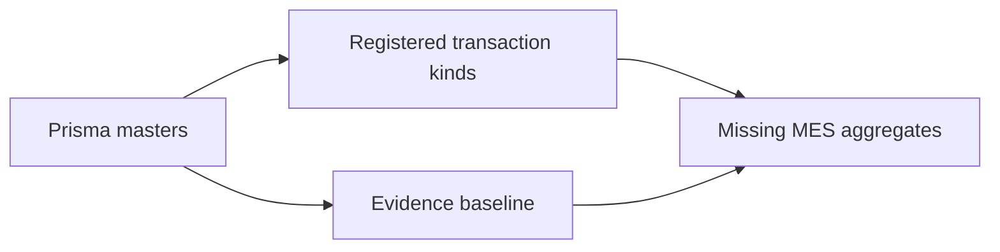

## Chapter 5 — Target Manufacturing Execution Architecture

The target has twelve layers: engineering/master context; production orders; scheduling and dispatch; work-center operations; material coordination; labor and machine capture; Quality and Maintenance coordination; completion, yield and genealogy; costing coordination; shop-floor/device experience; reporting/reconciliation; and security/audit/operations. Existing masters occupy only part of layer one. Typed execution layers are planned, and mobile, RFID, IoT, PLC/SCADA and AI are future until requirements select no premature technology. Every inter-layer effect uses a stable command/result contract with idempotency, version, authority and reconciliation rather than shared writes.


## Chapter 6 — Manufacturing Organization Model

Tenant isolates platform clients; legal entity and company define accountable business scope; plant is the primary execution boundary. Planned production area, line, work center and work cell locate operations without replacing warehouse custody. Machine, labor team, shift, supervisor and Operator define attributable resources; staging area remains an Inventory location. Cost and profit centers are Finance-owned references. Assignments are effective-dated by plant and shift, and cross-plant work requires explicit delegation. A production supervisor may sequence released work but cannot grant Inventory, Quality, Maintenance or Finance authority.

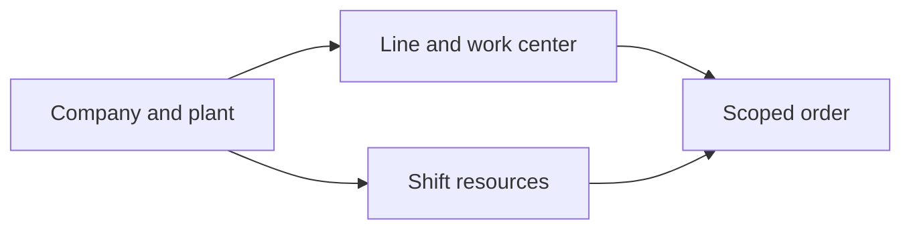

## Chapter 7 — Manufacturing Master-Data Boundary

[`Item` and UOM](../../apps/api/prisma/schema.prisma#L1385), [`Plant`](../../apps/api/prisma/schema.prisma#L383), warehouse, batch/serial and standard-cost fields are implemented foundations. BOM, routing, work center, resource, machine, tool, line, shift, calendar, change and instruction versions are conceptual targets. Engineering owns product/process definitions; Manufacturing consumes approved versions; Inventory owns material identities; Quality owns inspection requirements; Maintenance owns equipment condition; Finance owns cost references. Orders snapshot selected versions so later changes never rewrite execution history.


## Chapter 8 — BOM Architecture

A BOM is a versioned engineering definition with parent item, components, quantity/UOM, fixed or variable basis, scrap allowance, validity and approval. Alternate and phantom directions require explicit explosion rules; co-products and by-products are outputs, not negative components. Engineering change creates a new effective version and an impact decision for unreleased or active orders. Production never resolves the latest BOM implicitly after release, and historical consumption remains tied to the frozen component version.

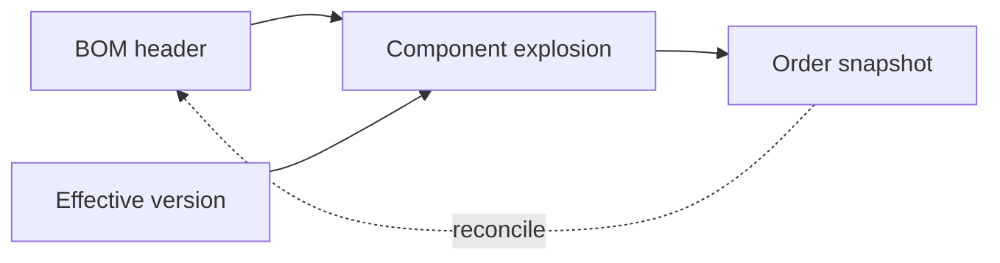

## Chapter 9 — Routing Architecture

Routing versions define ordered, parallel or alternate operations with work center, setup/run/queue/move/wait time, labor/resource needs, inspection points and subcontract flags. Approval and validity are independent from BOM approval. An operation instance snapshots its routing step and predecessor rules. Alternate-operation selection records reason and authority; parallel branches maintain join conditions. A routing edit cannot change an active order silently, and subcontract steps retain Procurement ownership of supplier commitment.

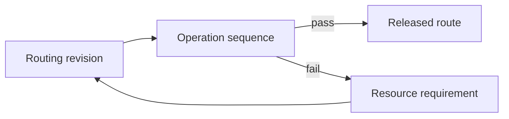

## Chapter 10 — Work Center and Resource Architecture

A work center groups capacity and execution responsibility; work cell, machine, labor resource and tool assignments refine actual execution. Calendar, shift, efficiency and queue are dated inputs, not evidence of availability. Maintenance supplies machine release/hold, Engineering supplies qualification requirements, and Finance supplies cost references. Resource status distinguishes administratively active, schedulable, released and unavailable states. Work-center queues hold operation references but never become production confirmations.

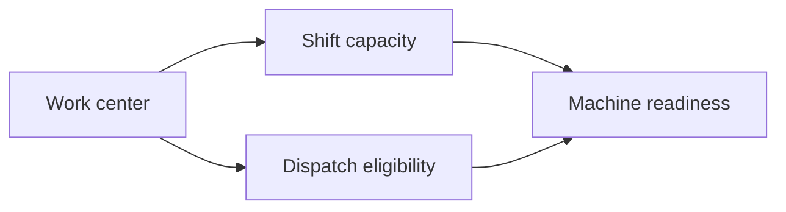

## Chapter 11 — Production Order Architecture

The order header identifies type, company, plant, product, quantity/UOM, planned dates, frozen BOM/routing versions, Sales/planned-order/project lineage, priority, tracking policy, cost object, status and revision. Operations and material requirements are typed children. Attachments reference governed documents. An immutable order identity survives revisions; approval binds a content hash. The aggregate expresses Manufacturing intent and requests external effects but stores no stock balance, Quality decision, Maintenance release or journal.


## Chapter 12 — Production Order Lifecycle

Draft, Validated, Submitted, Pending approval, Approved, Released and Dispatched precede setup and processing. Partially confirmed, Confirmed, Partially completed and Completed reflect Manufacturing evidence; On hold and Suspended retain obligations; cancellation before execution requires no irreversible effects. Technical close verifies operational completeness, while Financially settled is a Finance result. Archive follows retention. Material changes create revisions and revalidation rather than free-form status updates.

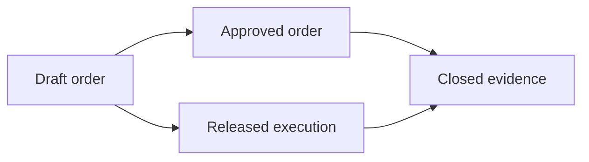

## Chapter 13 — Production Order Validation

Validation checks manufactured Item eligibility, plant, approved BOM/routing versions, quantity/UOM precision, dates, source lineage, tracking and cost references. It requests material availability from Inventory, capacity assumptions from Planning, inspection readiness from Quality, tooling and machine readiness from Engineering/Maintenance, and rejects unavailable or stale responses. Operator qualification is directional until an approved identity model exists. Approval and SoD bind the validated revision; a client cannot bypass failed checks through payload fields.


## Chapter 14 — Production Order Release

Release requires an approved revision, valid engineering versions, work instructions, material-readiness result, work-center/tooling readiness, Quality-plan readiness and Maintenance release where applicable. The release token records dependencies, issuer, time and expiry. Dependency changes can hold or invalidate release. Partial release is allowed only for defined operations/quantities with independent readiness and preserved residual. Safety topics remain directional and require specialist approval; release never authorizes stock movement.

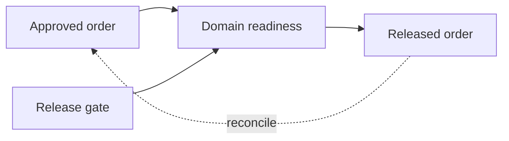

## Chapter 15 — Production Scheduling Boundary

Planning owns supply proposals, MRP and capacity assumptions; Manufacturing converts released work into executable sequence. The execution schedule considers priority, due date, setup grouping, material, machine, labor, Quality readiness and Maintenance windows. Frozen-horizon direction prevents casual disruption while allowing authorized incidents. Finite/infinite capacity methods remain open. Replanning preserves original priority and reason, and never changes customer, project or Procurement commitments directly.

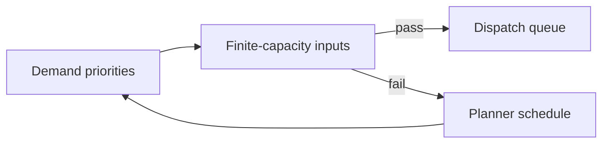

## Chapter 16 — Dispatch Architecture

Dispatch lists ready operation instances by work center and shift. Readiness incorporates predecessor completion, material/tool/operator availability, equipment release and Quality holds. The supervisor selects sequence within delegated rules and records start permission; the Operator acknowledges dispatch before setup. Missing dependencies create visible holds and owned escalations. Re-dispatch preserves prior queue position and reason. Dispatch is authorization to begin a scoped operation, not confirmation of quantity or time.

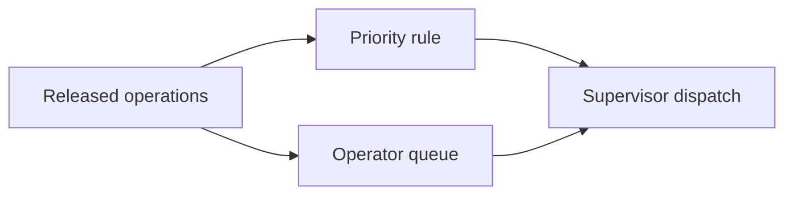

## Chapter 17 — Operation Execution Architecture

An operation instance links order, routing step, work center, Operator, machine and frozen instruction. Commands start setup, start run, pause, resume, partially confirm and complete with attributable timestamps. Good, rejected, rework and scrap quantities remain separate. Setup, runtime and downtime evidence carries manual/device origin and correction lineage. Exceptions name affected quantity and dependency. Operation execution requests material and inspection effects but cannot write their authoritative records.


## Chapter 18 — Operation Lifecycle

Not ready becomes Ready only after predecessor and dependency gates. Dispatched, Setup started/completed and Running represent executable progression. Paused differs from Blocked: pause is operational, block has an external owner such as Quality or Maintenance. Partial confirmation preserves remaining quantity; Confirmed records operation evidence; Rework required routes governed work; Completed satisfies routing rules. Cancellation and Close require impact review. Every transition verifies base version and actor authority.

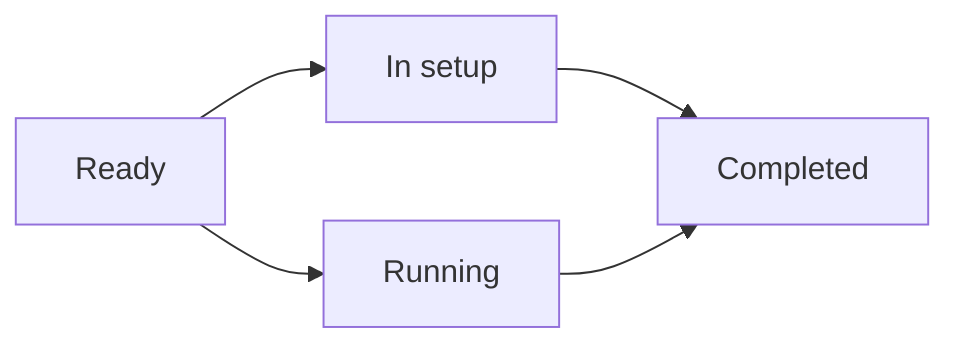

## Chapter 19 — Digital Work Instructions

Instructions are governed documents scoped to product, operation and work center with language, media, parameters, Quality checkpoints, safety direction, attachments, validity and revision. The terminal presents the exact released version and records Operator acknowledgement. Offline caching is future and must detect expiry. An instruction update triggers impact review for dispatched operations. Acknowledgement is not proof that work was performed. No electronic-batch-record, device-history-record or regulated signature claim is made.


## Chapter 20 — Material Requirement Architecture

Order component demand derives from the frozen BOM version and order quantity, applying fixed/variable basis, scrap allowance, UOM conversion, requirement date, staging location, substitute/phantom direction and tracking/Quality constraints. Open quantity distinguishes planned, requested, reserved, issued, consumed, returned and cancelled amounts. Recalculation creates a reasoned requirement revision and never rewrites prior issues. A requirement is Manufacturing demand, not Inventory reservation or movement.


## Chapter 21 — Material Availability Boundary

Manufacturing asks Inventory for a dated availability result covering available, reserved, held, supplier-owned and WIP quantities plus alternative warehouse or approved substitute options. The response carries a watermark and expiry because stock changes concurrently. Shortage is visible; it cannot be hidden by expected receipts or planning values. Manufacturing may reprioritize work, but Inventory remains authoritative for availability and quantity.

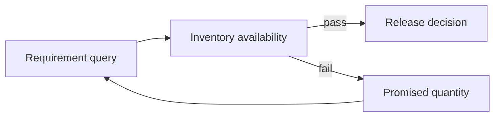

## Chapter 22 — Material Reservation and Staging Boundary

A reservation request references order requirement, plant, needed quantity/date and acceptable tracking/status constraints. Inventory returns reservation/allocation identifiers or shortage. Staging requests then ask Inventory to move authorized material to a controlled location and produce kit/partial-kit results. Release, reallocation and cancellation reference the original reservation. Manufacturing records coordination status only and cannot create reservations, allocations, staging movements or stock history.

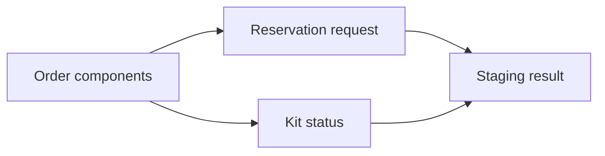

## Chapter 23 — Material Issue Boundary

The issue request identifies order, operation, component, quantity/UOM, source warehouse/location, ownership, stock status and requested batch/serial criteria. Inventory validates on-hand, reservation, tracking, negative-stock policy and actual movement; its result supplies issued identity and quantity. Partial issue and reversal preserve original links. A return is a separate Inventory movement. Manufacturing cannot manufacture an issue by marking a generic document complete.


## Chapter 24 — Material Consumption Architecture

Planned and actual consumption are separate. Actual operation/order consumption references authoritative issue or approved direct-consumption movement, batch/serial identity, substitute, scrap and return. Under- or over-consumption remains visible and reasons/approval apply above policy. Reconciliation compares requirements, issues, consumption, returns and output without editing Inventory. Consumption evidence feeds genealogy and Finance requests but never posts value itself.

```mermaid
flowchart LR
  A24["Issue results"] --> B24["Measured usage"]
  A24 --> C24["Consumption record"]
  B24 --> D24["Quantity balance"]
  C24 --> D24
```

## Chapter 25 — Backflush Architecture

Backflush is an Inventory-controlled policy triggered by an accepted Manufacturing quantity. The rule identifies eligible components, BOM basis, output, scrap factor, timing, tracking restrictions and negative-stock prohibition. Inventory revalidates stock and creates movements; partial completion backflushes only accepted quantity. Exceptions produce shortages or manual review, not invented consumption. Reversal references both confirmation and movement. Manufacturing cannot use backflush to bypass batch/serial or substitution governance.

```mermaid
flowchart LR
  A25["Eligible component"] -->|accepted| B25["Backflush proposal"]
  A25 -->|exception| D25["Movement result"]
  B25 --> C25["Inventory validation"]
  C25 --> D25
```

## Chapter 26 — Labor Reporting Architecture

Labor evidence identifies Operator/team, shift, operation, setup/run/indirect interval, source and correction chain. Overtime and skill/certification are directional pending approved workforce policy. Attendance and payroll remain outside MES scope; Manufacturing requests cost application from Finance using approved time categories. Privacy minimizes personal fields and limits exports. Supervisor correction never deletes original evidence and cannot self-approve where thresholds require separation.

```mermaid
flowchart LR
  A26["Named operator"] --> C26["Supervisor correction"]
  B26["Work interval"] --> C26
  C26 --> D26["Cost evidence"]
  D26 -. reconcile .-> A26
```

## Chapter 27 — Machine and Resource Reporting

Machine evidence records resource, operation, setup/run/idle/downtime, speed/count/cycle, timestamp and manual or automatic origin. Energy and meter inputs remain directional. Device events are untrusted until identity, clock, sequence and plausibility validation. Corrections retain raw event and reviewer. Machine reporting describes execution evidence; Maintenance alone changes equipment condition and Finance alone posts machine cost.

```mermaid
flowchart LR
  A27["Machine identity"] --> B27["Validated event"]
  B27 -->|pass| D27["Maintenance correlation"]
  B27 -->|fail| C27["Operation duration"]
  C27 --> A27
```

## Chapter 28 — Downtime and Production Exception Architecture

Downtime distinguishes planned window, breakdown, starvation, blockage, material shortage, Quality stop, tooling issue, labor shortage and utility interruption. Each interval has reason, owner, start/end, affected operation and recovery evidence. Breakdown triggers Maintenance, Quality stop triggers Quality, and shortage triggers Inventory/Planning; Manufacturing records production impact. Escalation does not clear the external hold. Corrections retain the original classification for audit and OEE recomputation.

```mermaid
flowchart LR
  A28["Equipment event"] --> B28["Downtime class"]
  A28 --> D28["Recovered capacity"]
  B28 --> C28["Escalation owner"]
  D28 --> C28
```

## Chapter 29 — Production Confirmation Architecture

Confirmation binds order/operation revision, good/rejected/rework/scrap quantities, labor, machine, material evidence, tracking identity, shift, Operator and timestamp. Partial and final confirmations use idempotency keys; correction produces a superseding record and approval where material. Confirmation validates operation sequence and cannot exceed remaining quantity without exception. It requests Inventory receipt/consumption and Finance costing, but is neither a movement nor posting.

```mermaid
flowchart LR
  A29["Operation quantities"] --> B29["Evidence checks"]
  B29 --> C29["Accepted confirmation"]
  C29 --> D29["Order totals"]
  D29 -. exception .-> B29
```

## Chapter 30 — Partial Completion and Split Execution

Partial confirmation and partial order completion preserve remaining product, residual material, open routing and pending inspections. Split batches or serial populations receive explicit genealogy branches; they are not collapsed into one status. Partial receipt and cost requests reference only accepted output. Replanning may move residual work without rewriting completed evidence. Cancellation names what remains and closure requires every branch to be resolved or governed as exception.

```mermaid
flowchart LR
  A30["Accepted partial"] --> B30["Residual quantity"]
  A30 --> C30["Split operation"]
  B30 --> D30["Final balance"]
  C30 --> D30
```

## Chapter 31 — Finished-Goods Receipt Boundary

Manufacturing requests receipt for confirmed product, quantity/UOM, batch/serial, plant, proposed warehouse/location/status, order and operation. Inventory validates tracking, duplicate request, quantity and location then creates the physical receipt or rejection result. Quality hold/release remains Quality-owned and influences stock status. Co-/by-product receipts are distinct lines. Partial receipt and reversal retain lineage. Manufacturing completion cannot mark finished goods on hand.

```mermaid
flowchart LR
  A31["Accepted completion"] -->|accepted| B31["Receipt request"]
  A31 -->|exception| D31["Order reconciliation"]
  B31 --> C31["Inventory receipt"]
  C31 --> D31
```

## Chapter 32 — Scrap Architecture

Scrap intent identifies component, operation output or finished product, planned/unplanned reason, quantity/UOM, tracking identity and evidence. Quality may own disposition; Inventory performs physical scrap or return movement; Finance owns cost effect. Approval thresholds separate recorder and approver. Reversal does not erase prior scrap. Analytics distinguish process loss from damaged inventory and prevent unrecorded or inflated scrap from distorting yield.

```mermaid
flowchart LR
  A32["Scrap observation"] --> C32["Movement request"]
  B32["Reason and approval"] --> C32
  C32 --> D32["Loss evidence"]
  D32 -. reconcile .-> A32
```

## Chapter 33 — Rework Architecture

Rework begins from a governed decision linked to source batch/serial, defect and Quality disposition where applicable. A rework order or operation freezes instructions, additional materials, labor and machine needs. Manufacturing executes; Inventory moves added/returned material; Quality reinspects and releases; Finance receives cost evidence. Loops are bounded and escalated. Completion either restores acceptable output or creates scrap/other disposition while preserving genealogy.

```mermaid
flowchart LR
  A33["Quality disposition"] --> B33["Rework order"]
  B33 -->|pass| D33["Disposition closure"]
  B33 -->|fail| C33["Rework execution"]
  C33 --> A33
```

## Chapter 34 — Yield and Loss Architecture

Yield formulas version numerator, denominator, UOM conversion and treatment of good output, rework, scrap, normal and abnormal process loss. Operation, order and batch yield use authoritative material/output facts. Tolerances produce review, not retroactive quantity edits. Abnormal-loss direction requires Finance/Quality policy and is not a compliance claim. Reports show formula version and missing evidence; Manufacturing computes operational yield while Finance owns valuation.

```mermaid
flowchart LR
  A34["Input quantity"] --> B34["Good output"]
  A34 --> D34["Versioned yield"]
  B34 --> C34["Scrap and loss"]
  D34 --> C34
```

## Chapter 35 — Co-Product and By-Product Architecture

The order explicitly declares main, co-product and by-product outputs with planned/actual quantities, tracking and receipt requests. Co-products have intentional joint production; by-products use separate ownership and value policy. Inventory owns each receipt and reversal; Quality owns disposition; Finance approves cost split and any revenue treatment. Genealogy links all outputs to inputs and operation. Negative BOM lines are rejected as an unsafe substitute for output modeling.

```mermaid
flowchart LR
  A35["Joint process input"] --> B35["Output allocation"]
  B35 --> C35["Co-product receipt"]
  C35 --> D35["By-product disposition"]
  D35 -. exception .-> B35
```

## Chapter 36 — Work-in-Progress Architecture

Operational WIP represents order/operation quantity and state—queued, waiting, running, held, rework or partially complete—without pretending to be an Inventory balance or Finance valuation. Location may identify a work center while custody remains governed. Age derives from trusted transitions and supports escalation. Manufacturing-to-Inventory reconciliation compares issued/consumed/output quantities; Finance independently calculates closing WIP value.

```mermaid
flowchart LR
  A36["Open order evidence"] --> B36["Issued material"]
  A36 --> C36["Accepted output"]
  B36 --> D36["WIP control total"]
  C36 --> D36
```

## Chapter 37 — Batch and Serial Genealogy

Genealogy forms immutable edges from issued input batch/serial through order and operation to output, co-/by-product, split, rework, scrap and subcontract results. Inventory owns the tracked identities and movements; Manufacturing owns execution relationships; Quality adds inspection references. Merge direction requires explicit many-to-many semantics. Corrections supersede edges without deletion. Recall tracing is a directional use case, not a regulatory capability claim.

```mermaid
flowchart LR
  A37["Input lots and serials"] -->|accepted| B37["Transformation event"]
  A37 -->|exception| D37["Recall trace"]
  B37 --> C37["Output identities"]
  C37 --> D37
```

## Chapter 38 — Discrete Manufacturing Execution

Discrete execution covers fabrication, assembly, make-to-stock/order, serial-controlled work, ordered operations, component issue, subassembly, final assembly and testing direction. Each unit or lot retains operation and material lineage. Completion requests finished receipt after required checks. It does not assume process-formula semantics or continuous reporting. Finance costing remains a downstream request, and Inventory/Quality keep their authorities.

```mermaid
flowchart LR
  A38["Discrete order"] --> C38["Serialized assembly"]
  B38["Unit operations"] --> C38
  C38 --> D38["Completion"]
  D38 -. reconcile .-> A38
```

## Chapter 39 — Process Manufacturing Execution

Process direction models formula version, batch, variable yield, concentration/potency direction, campaign/vessel, co-/by-products and process loss separately from discrete BOM assumptions. Material quantities and output may require measured conversions with approved precision. Batch genealogy and Quality checkpoints remain explicit. This architecture makes no pharmaceutical, food-safety or regulated-record claim and selects no electronic batch technology.

```mermaid
flowchart LR
  A39["Formula batch"] --> B39["Process parameters"]
  B39 -->|pass| D39["Batch output"]
  B39 -->|fail| C39["Yield and loss"]
  C39 --> A39
```

## Chapter 40 — Repetitive Manufacturing Direction

Repetitive production uses line/rate schedule, reporting points, shift/daily output, takt direction, backflush direction, scrap, downtime and operational WIP. Repetition cannot remove released-order, material, Quality, Maintenance, identity or reconciliation evidence. Aggregated confirmation must retain traceable time buckets and formula versions. Inventory validates every movement; Finance accepts summarized evidence only under approved granularity. Runtime remains future.

```mermaid
flowchart LR
  A40["Rate schedule"] --> B40["Cycle evidence"]
  A40 --> D40["Control reconciliation"]
  B40 --> C40["Periodic backflush"]
  D40 --> C40
```

## Chapter 41 — Make-to-Order and Configure-to-Order Execution

MTO preserves Sales-order/line allocation through production and finished receipt. CTO also freezes customer configuration version and records derived BOM/routing direction. Sales owns customer promise and configuration acceptance; Engineering approves derivation; Manufacturing executes; Inventory owns allocation and receipt. Change/cancellation impact is assessed across Sales, material and active operations. Customer-specific attributes are minimized on the shop floor.

```mermaid
flowchart LR
  A41["Sales configuration"] --> B41["Configured order"]
  B41 --> C41["Variant execution"]
  C41 --> D41["Customer lineage"]
  D41 -. exception .-> B41
```

## Chapter 42 — Engineer-to-Order Boundary

ETO links project, Engineering revision, design/BOM/routing release, long-lead Procurement demand, order, work instruction, Quality needs and cost collection. Engineering approval governs technical revision; Projects owns project scope; Procurement owns suppliers; Manufacturing cannot execute unreleased design. Change impact identifies affected material, operations and completed output. Customer acceptance direction remains Sales/Projects-owned. Historical orders retain the exact Engineering baseline.

```mermaid
flowchart LR
  A42["Engineering revision"] --> B42["Project demand"]
  A42 --> C42["Milestone operation"]
  B42 --> D42["Project evidence"]
  C42 --> D42
```

## Chapter 43 — Subcontract Manufacturing Execution

A subcontract operation links Procurement PO, Manufacturing order/operation, supplied and supplier-owned components, Inventory issue/custody, supplier consumption/output/scrap, Quality disposition, service acceptance and Finance invoice eligibility. Procurement owns supplier commitment; Inventory owns movements; Manufacturing owns production semantics/genealogy; Quality owns release. Supplier-reported quantities remain untrusted until reconciled. FCSB-017 boundaries are preserved.

```mermaid
flowchart LR
  A43["Purchase order"] -->|accepted| B43["Supplier components"]
  A43 -->|exception| D43["Returned output"]
  B43 --> C43["External operation"]
  C43 --> D43
```

## Chapter 44 — Quality Coordination Boundary

Manufacturing requests incoming dependency checks, in-process/first-piece/patrol/final inspections and consumes Quality results. Quality alone records hold, release, rejection, deviation/nonconformance disposition and controlled rework approval. A production stop references the Quality decision and cannot be cleared by Manufacturing. Evidence ties plan/version, sample, batch/serial, operation and result. FCSB-019 must define the inspection and nonconformance runtime.

```mermaid
flowchart LR
  A44["Inspection request"] --> C44["Disposition result"]
  B44["Quality hold"] --> C44
  C44 --> D44["Execution gate"]
  D44 -. reconcile .-> A44
```

## Chapter 45 — Maintenance Coordination Boundary

Manufacturing requests machine readiness and reports breakdown/production impact. Maintenance owns preventive windows, holds, corrective work order, equipment release, temporary-workaround authority and reliability evidence. Restart requires current Maintenance release plus Manufacturing readiness; a supervisor cannot clear a Maintenance hold. Tool condition and meter direction are inputs only. Reconciliation compares production downtime with Maintenance events without modifying either source.

```mermaid
flowchart LR
  A45["Readiness request"] --> B45["Maintenance hold"]
  B45 -->|pass| D45["Operation gate"]
  B45 -->|fail| C45["Release decision"]
  C45 --> A45
```

## Chapter 46 — Tooling, Mold and Fixture Direction

Tool, fixture, mold, die and gauge identities require revision, location, condition, availability, calibration direction, Maintenance relationship, usage count/life limit, assignment, return and replacement. Engineering owns technical suitability; Maintenance/Quality own condition or calibration authority; Manufacturing records usage against operation. Missing or expired tooling blocks dispatch under policy. No tooling runtime exists, and this direction claims no calibration compliance.

```mermaid
flowchart LR
  A46["Tool requirement"] --> B46["Available tool"]
  A46 --> D46["Operation assignment"]
  B46 --> C46["Life and calibration"]
  D46 --> C46
```

## Chapter 47 — Production Costing Boundary

Manufacturing supplies authoritative operational evidence for material consumption, labor/machine/setup time, subcontract service, scrap, rework, output and co-/by-product relationship. Finance/Cost Accounting owns rates, overhead, valuation, journal, variance and settlement. Requests carry order, operation, quantity, time, source version and idempotency. Manufacturing never calculates posted cost from standardCost alone and cannot change a journal to match completion.

```mermaid
flowchart LR
  A47["Production evidence"] --> B47["Costing request"]
  B47 --> C47["Finance calculation"]
  C47 --> D47["Posted result"]
  D47 -. exception .-> B47
```

## Chapter 48 — WIP Valuation and Variance Boundary

Finance defines WIP valuation, actual/standard cost, material/labor/machine/overhead/usage/yield/scrap/rate variances, period, closing WIP and settlement. Manufacturing explains operational drivers and corrects execution evidence through history-preserving records. A variance request references frozen quantities and rates but does not post. Technical close can precede financial settlement; period close never forces Manufacturing to invent confirmation.

```mermaid
flowchart LR
  A48["Quantity reconciliation"] --> B48["WIP valuation"]
  A48 --> C48["Variance analysis"]
  B48 --> D48["Settlement gate"]
  C48 --> D48
```

## Chapter 49 — OEE and Manufacturing Performance

OEE direction combines availability, performance and Quality rate using versioned planned time, runtime, ideal cycle time, total/good count, downtime and loss taxonomy. Data-source ownership and clock quality are explicit; planned stops and rework treatment require approval. OEE is a non-authoritative analytical measure and cannot release equipment, alter production or pay incentives. Current dashboard placeholders are not OEE runtime.

```mermaid
flowchart LR
  A49["Availability facts"] -->|accepted| B49["Performance facts"]
  A49 -->|exception| D49["OEE report"]
  B49 --> C49["Quality facts"]
  C49 --> D49
```

## Chapter 50 — Shop-Floor Experience, Barcode and Device Direction

Future operator/work-center terminals present released work, instruction version and permitted commands with individual session attribution. Barcode/QR and RFID direction may identify order, operation, material, batch/serial or tool but never authorizes movement by scan alone. Device identity, scanner/printer/label, offline queue, errors, accessibility, supervisor override and audit require approved design. Shared terminals reauthenticate sensitive actions. No device technology is selected.

```mermaid
flowchart LR
  A50["Named session"] --> C50["Validated command"]
  B50["Barcode scan"] --> C50
  C50 --> D50["Operator feedback"]
  D50 -. reconcile .-> A50
```

## Chapter 51 — IoT, PLC and Machine Integration Direction

Machine adapters may accept PLC, SCADA, sensor, counter, cycle and downtime events through a buffered gateway. OPC UA, MQTT and other protocols remain unselected directions. Each event carries device identity, sequence, timestamp, source clock and signature direction; validation detects replay, gaps, drift and implausible counts. Device commands cannot issue stock, complete orders, release Quality/Maintenance holds or post costs. Raw and accepted events are retained separately.

```mermaid
flowchart LR
  A51["Machine signal"] --> B51["Gateway validation"]
  B51 -->|pass| D51["Trusted evidence"]
  B51 -->|fail| C51["MES correlation"]
  C51 --> A51
```

## Chapter 52 — Manufacturing Reporting and Reconciliation

Certified reporting covers order/dispatch status, output, scrap, rework, yield, labor, machine, downtime, WIP, variance direction, OEE direction, on-time completion and genealogy. Manufacturing-to-Inventory compares requirements, issues, consumption, returns and receipts; Manufacturing-to-Finance compares evidence, WIP, variance and settlement; Manufacturing-to-Quality compares inspection requests, holds and dispositions. Reports follow FCSB-013 and never mutate sources.

```mermaid
flowchart LR
  A52["Order control totals"] --> B52["Domain results"]
  A52 --> D52["Certified close"]
  B52 --> C52["Exception case"]
  D52 --> C52
```

## Chapter 53 — Manufacturing Security, SoD and Audit

Controls separate order creator/approver, dispatcher/Operator, Operator/correction approver, Manufacturing/Inventory movement, Manufacturing/Quality release, Manufacturing/Maintenance release and Manufacturing/Finance posting. Scrap, rework, substitutions and manual confirmations require scoped authority. Shared-terminal attribution, device impersonation, cross-plant access, supervisor override, break-glass, tenant isolation and sensitive instruction export are threat cases. Audit and Digital DNA preserve identity/evidence; AI is denied execution commands.

```mermaid
flowchart LR
  A53["User and device"] --> B53["Policy enforcement"]
  B53 --> C53["Immutable audit"]
  C53 --> D53["Incident review"]
  D53 -. exception .-> B53
```

## Chapter 54 — Manufacturing Capability, Risk, Example and Responsibility Models

The following registers translate the target architecture into individually classified capabilities, specific failure conditions, realistic execution examples and separated responsibilities. Current foundations are cited; generic transactions and EOR codes remain scaffold or metadata. Planned and future rows confer no implementation status.


### Required semantic diagrams beyond chapter flows

#### BOM lifecycle

```mermaid
stateDiagram-v2
  [*] --> BOMDraft
  BOMDraft --> BOMApproved
  BOMApproved --> BOMEffective
  BOMEffective --> BOMSuperseded
  BOMSuperseded --> [*]
```

#### Production-order lifecycle

```mermaid
stateDiagram-v2
  [*] --> OrderDraft
  OrderDraft --> Released
  Released --> InProcess
  InProcess --> TechnicallyClosed
  TechnicallyClosed --> FinanciallySettled
```

#### Material-availability interaction

```mermaid
sequenceDiagram
  participant M as Manufacturing
  participant I as Inventory
  M->>I: Availability/reservation/staging request
  I-->>M: Versioned quantity result
```

#### Material-issue interaction

```mermaid
sequenceDiagram
  participant O as Operation
  participant I as Inventory
  O->>I: Issue/consumption request
  I-->>O: Movement identity and quantity
```

#### Batch genealogy

```mermaid
flowchart LR
  INB["Input batches"] --> OP["Operation lineage"] --> OUTB["Output batches"]
  OP --> SCR["Scrap/rework branches"]
```

#### Serial genealogy

```mermaid
flowchart LR
  INS["Input serials"] --> UNIT["Unit operation history"] --> OUTS["Output serials"]
  UNIT --> CORR["Superseding correction"]
```

#### Configure-to-order derivation

```mermaid
flowchart LR
  CFG["Sales configuration"] --> ENG["Engineering derivation"] --> CTO["CTO execution order"]
  CTO --> ALLOC["Customer allocation"]
```

#### Machine-event validation

```mermaid
flowchart LR
  EVT["Raw machine event"] --> ID["Identity/sequence/clock checks"] --> ACC["Accepted evidence"]
  ID --> QUAR["Quarantined anomaly"]
```

#### Finance evidence interaction

```mermaid
sequenceDiagram
  participant M as Manufacturing
  participant F as Finance
  M->>F: WIP/variance evidence
  F-->>M: Posted valuation/settlement reference
```

#### Offline replay

```mermaid
flowchart LR
  DEV["Offline terminal"] --> KEY["Idempotent replay"] --> MES["MES validation"]
  MES --> CON["Conflict review"]
```

#### Cross-domain authority

```mermaid
flowchart LR
  MAN["Manufacturing"] -->|"request"| INV["Inventory authority"]
  MAN -->|"request"| QUA["Quality authority"]
  MAN -->|"request"| MAI["Maintenance authority"]
  MAN -->|"request"| FIN["Finance authority"]
```

#### Manufacturing segregation of duties

```mermaid
flowchart TD
  USER["Attributed shop-floor actor"] --> SCOPE["Plant/work-center scope"] --> SOD["SoD and command gate"] --> AUD["Audit"]
```

#### Manufacturing threat flow

```mermaid
flowchart LR
  ATT["Device/insider/AI threat"] --> GATE["Validation and deny rules"] --> ALERT["Incident evidence"]
  GATE -. "no direct cross-domain writes" .-> OWN["Owned services"]
```

### Manufacturing capability matrix

| Capability ID | Capability | Owner | Current status | Target maturity | Dependencies | Authority | Priority |
|---|---|---|---|---|---|---|---|
| MFG-CAP-001 | Item identity | Manufacturing | Implemented foundation — [`Item`](../../apps/api/prisma/schema.prisma#L1385) | Governed | Manufacturing contract | Manufacturing | P0 |
| MFG-CAP-002 | Item manufacturing strategy | Manufacturing | Implemented foundation — [`manufacturingStrategy`](../../apps/api/prisma/schema.prisma#L1405) | Governed | Manufacturing contract | Manufacturing | P0 |
| MFG-CAP-003 | Manufactured-item eligibility | Manufacturing | Implemented foundation — [`isManufacturedItem`](../../apps/api/prisma/schema.prisma#L1413) | Governed | Manufacturing contract | Manufacturing | P0 |
| MFG-CAP-004 | Subcontracted-item flag | Manufacturing | Implemented foundation — [`isSubcontractedItem`](../../apps/api/prisma/schema.prisma#L1414) | Governed | Manufacturing contract | Manufacturing | P0 |
| MFG-CAP-005 | Quality-inspection flag | Quality | Implemented foundation — [`isQualityInspectionRequired`](../../apps/api/prisma/schema.prisma#L1417) | Governed | Quality contract | Quality | P0 |
| MFG-CAP-006 | Item tracking policy | Manufacturing | Implemented foundation — [tracking fields](../../apps/api/prisma/schema.prisma#L1409) | Governed | Manufacturing contract | Manufacturing | P0 |
| MFG-CAP-007 | Item lead time | Manufacturing | Implemented foundation — [`leadTimeDays`](../../apps/api/prisma/schema.prisma#L1420) | Governed | Manufacturing contract | Manufacturing | P0 |
| MFG-CAP-008 | Item planning inputs | Manufacturing | Implemented foundation — [reorder fields](../../apps/api/prisma/schema.prisma#L1424) | Governed | Manufacturing contract | Manufacturing | P0 |
| MFG-CAP-009 | Item standard cost input | Finance | Implemented foundation — [`standardCost`](../../apps/api/prisma/schema.prisma#L1430) | Governed | Finance contract | Finance | P0 |
| MFG-CAP-010 | Item group | Manufacturing | Implemented foundation — [`ItemGroup`](../../apps/api/prisma/schema.prisma#L1688) | Governed | Manufacturing contract | Manufacturing | P0 |
| MFG-CAP-011 | Item category | Manufacturing | Implemented foundation — [`ItemCategory`](../../apps/api/prisma/schema.prisma#L1713) | Governed | Manufacturing contract | Manufacturing | P0 |
| MFG-CAP-012 | Base UOM | Manufacturing | Implemented foundation — [`UnitOfMeasure`](../../apps/api/prisma/schema.prisma#L1648) | Governed | Manufacturing contract | Manufacturing | P0 |
| MFG-CAP-013 | Stock UOM | Inventory | Implemented foundation — [`stockUomId`](../../apps/api/prisma/schema.prisma#L1404) | Governed | Inventory contract | Inventory | P0 |
| MFG-CAP-014 | UOM conversion | Manufacturing | Implemented foundation — [`UomConversion`](../../apps/api/prisma/schema.prisma#L1669) | Governed | Manufacturing contract | Manufacturing | P0 |
| MFG-CAP-015 | Plant | Manufacturing | Implemented foundation — [`Plant`](../../apps/api/prisma/schema.prisma#L383) | Governed | Manufacturing contract | Manufacturing | P0 |
| MFG-CAP-016 | Company | Manufacturing | Implemented foundation — [`Company`](../../apps/api/prisma/schema.prisma#L178) | Governed | Manufacturing contract | Manufacturing | P0 |
| MFG-CAP-017 | Warehouse | Inventory | Implemented foundation — [`Warehouse`](../../apps/api/prisma/schema.prisma#L818) | Governed | Inventory contract | Inventory | P0 |
| MFG-CAP-018 | Warehouse zone | Inventory | Implemented foundation — [`WarehouseZone`](../../apps/api/prisma/schema.prisma#L1807) | Governed | Inventory contract | Inventory | P0 |
| MFG-CAP-019 | Warehouse bin | Inventory | Implemented foundation — [`WarehouseBin`](../../apps/api/prisma/schema.prisma#L1832) | Governed | Inventory contract | Inventory | P0 |
| MFG-CAP-020 | Stock status | Inventory | Implemented foundation — [`StockStatus`](../../apps/api/prisma/schema.prisma#L1859) | Governed | Inventory contract | Inventory | P0 |
| MFG-CAP-021 | Batch identity | Inventory | Implemented foundation — [`Batch`](../../apps/api/prisma/schema.prisma#L1878) | Governed | Inventory contract | Inventory | P0 |
| MFG-CAP-022 | Serial identity | Inventory | Implemented foundation — [`SerialNumber`](../../apps/api/prisma/schema.prisma#L1899) | Governed | Inventory contract | Inventory | P0 |
| MFG-CAP-023 | Cost center | Finance | Implemented foundation — [`CostCenter`](../../apps/api/prisma/schema.prisma#L638) | Governed | Finance contract | Finance | P0 |
| MFG-CAP-024 | Profit center | Manufacturing | Implemented foundation — [`ProfitCenter`](../../apps/api/prisma/schema.prisma#L670) | Governed | Manufacturing contract | Manufacturing | P0 |
| MFG-CAP-025 | Generic transaction document | Manufacturing | Scaffold — generic repository structure only | Governed | Manufacturing contract | Manufacturing | P0 |
| MFG-CAP-026 | Transaction lineage | Manufacturing | Scaffold — generic repository structure only | Governed | Manufacturing contract | Manufacturing | P0 |
| MFG-CAP-027 | BOM transaction kind | Engineering | Partial — bounded field/kind/UI fragment; no MES invariant | Governed | Engineering contract | Engineering | P0 |
| MFG-CAP-028 | Work-order transaction kind | Manufacturing | Partial — bounded field/kind/UI fragment; no MES invariant | Governed | Manufacturing contract | Manufacturing | P0 |
| MFG-CAP-029 | Material-issue transaction kind | Manufacturing | Partial — bounded field/kind/UI fragment; no MES invariant | Governed | Manufacturing contract | Manufacturing | P0 |
| MFG-CAP-030 | Production-entry transaction kind | Manufacturing | Partial — bounded field/kind/UI fragment; no MES invariant | Governed | Manufacturing contract | Manufacturing | P0 |
| MFG-CAP-031 | Quality-inspection transaction kind | Quality | Partial — bounded field/kind/UI fragment; no MES invariant | Governed | Quality contract | Quality | P0 |
| MFG-CAP-032 | Finished-goods-receipt kind | Inventory | Partial — bounded field/kind/UI fragment; no MES invariant | Governed | Inventory contract | Inventory | P0 |
| MFG-CAP-033 | Bill-of-materials registration | Manufacturing | Registered metadata only — [seed registration](../../apps/api/prisma/seed.ts#L26) | Governed | Manufacturing contract | Manufacturing | P0 |
| MFG-CAP-034 | Routing registration | Engineering | Registered metadata only — [seed registration](../../apps/api/prisma/seed.ts#L26) | Governed | Engineering contract | Engineering | P0 |
| MFG-CAP-035 | Work-center registration | Manufacturing | Registered metadata only — [seed registration](../../apps/api/prisma/seed.ts#L26) | Governed | Manufacturing contract | Manufacturing | P0 |
| MFG-CAP-036 | Production-plan registration | Manufacturing | Registered metadata only — [seed registration](../../apps/api/prisma/seed.ts#L26) | Governed | Manufacturing contract | Manufacturing | P0 |
| MFG-CAP-037 | Work-order registration | Manufacturing | Registered metadata only — [seed registration](../../apps/api/prisma/seed.ts#L26) | Governed | Manufacturing contract | Manufacturing | P0 |
| MFG-CAP-038 | Material-issue registration | Manufacturing | Registered metadata only — [seed registration](../../apps/api/prisma/seed.ts#L26) | Governed | Manufacturing contract | Manufacturing | P0 |
| MFG-CAP-039 | Production-entry registration | Manufacturing | Registered metadata only — [seed registration](../../apps/api/prisma/seed.ts#L26) | Governed | Manufacturing contract | Manufacturing | P0 |
| MFG-CAP-040 | Quality-inspection registration | Quality | Registered metadata only — [seed registration](../../apps/api/prisma/seed.ts#L26) | Governed | Quality contract | Quality | P0 |
| MFG-CAP-041 | Finished-goods-receipt registration | Inventory | Registered metadata only — [seed registration](../../apps/api/prisma/seed.ts#L26) | Governed | Inventory contract | Inventory | P0 |
| MFG-CAP-042 | Workflow definitions | Manufacturing | Scaffold — generic repository structure only | Governed | Manufacturing contract | Manufacturing | P0 |
| MFG-CAP-043 | Approval records | Manufacturing | Scaffold — generic repository structure only | Governed | Manufacturing contract | Manufacturing | P0 |
| MFG-CAP-044 | Number series | Manufacturing | Implemented foundation — [`NumberSeries`](../../apps/api/prisma/schema.prisma#L1330) | Governed | Manufacturing contract | Manufacturing | P0 |
| MFG-CAP-045 | Audit log | Security | Implemented foundation — [`AuditLog`](../../apps/api/prisma/schema.prisma#L1357) | Governed | Security contract | Security | P0 |
| MFG-CAP-046 | Digital DNA | Manufacturing | Implemented foundation — [Digital DNA service](../../apps/api/src/digital-dna/digital-dna.service.ts) | Governed | Manufacturing contract | Manufacturing | P0 |
| MFG-CAP-047 | Report definitions | Manufacturing | Scaffold — generic repository structure only | Governed | Manufacturing contract | Manufacturing | P0 |
| MFG-CAP-048 | Production dashboard count | Manufacturing | Partial — bounded field/kind/UI fragment; no MES invariant | Governed | Manufacturing contract | Manufacturing | P0 |
| MFG-CAP-049 | Manufacturing permissions | Security | Partial — bounded field/kind/UI fragment; no MES invariant | Governed | Security contract | Security | P0 |
| MFG-CAP-050 | Organization scope | Manufacturing | Partial — bounded field/kind/UI fragment; no MES invariant | Governed | Manufacturing contract | Manufacturing | P0 |
| MFG-CAP-051 | BOM header | Engineering | Planned | Governed | Engineering contract | Engineering | P1 |
| MFG-CAP-052 | BOM version | Engineering | Planned | Governed | Engineering contract | Engineering | P1 |
| MFG-CAP-053 | BOM component | Engineering | Planned | Governed | Engineering contract | Engineering | P1 |
| MFG-CAP-054 | BOM effective dating | Engineering | Planned | Governed | Engineering contract | Engineering | P1 |
| MFG-CAP-055 | Alternate BOM | Engineering | Planned | Governed | Engineering contract | Engineering | P1 |
| MFG-CAP-056 | Phantom component | Manufacturing | Planned | Governed | Manufacturing contract | Manufacturing | P1 |
| MFG-CAP-057 | Fixed component quantity | Manufacturing | Planned | Governed | Manufacturing contract | Manufacturing | P1 |
| MFG-CAP-058 | Variable component quantity | Manufacturing | Planned | Governed | Manufacturing contract | Manufacturing | P1 |
| MFG-CAP-059 | BOM scrap factor | Engineering | Planned | Governed | Engineering contract | Engineering | P1 |
| MFG-CAP-060 | BOM approval | Engineering | Planned | Governed | Engineering contract | Engineering | P1 |
| MFG-CAP-061 | Engineering change | Engineering | Planned | Governed | Engineering contract | Engineering | P1 |
| MFG-CAP-062 | Routing header | Engineering | Planned | Governed | Engineering contract | Engineering | P1 |
| MFG-CAP-063 | Routing version | Engineering | Planned | Governed | Engineering contract | Engineering | P1 |
| MFG-CAP-064 | Routing operation | Engineering | Planned | Governed | Engineering contract | Engineering | P1 |
| MFG-CAP-065 | Parallel operation | Manufacturing | Planned | Governed | Manufacturing contract | Manufacturing | P1 |
| MFG-CAP-066 | Alternate operation | Manufacturing | Planned | Governed | Manufacturing contract | Manufacturing | P1 |
| MFG-CAP-067 | Routing approval | Engineering | Planned | Governed | Engineering contract | Engineering | P1 |
| MFG-CAP-068 | Work center | Manufacturing | Planned | Governed | Manufacturing contract | Manufacturing | P1 |
| MFG-CAP-069 | Work-cell hierarchy | Manufacturing | Planned | Governed | Manufacturing contract | Manufacturing | P1 |
| MFG-CAP-070 | Machine resource | Manufacturing | Planned | Governed | Manufacturing contract | Manufacturing | P1 |
| MFG-CAP-071 | Labor resource | Manufacturing | Planned | Governed | Manufacturing contract | Manufacturing | P1 |
| MFG-CAP-072 | Shift | Manufacturing | Planned | Governed | Manufacturing contract | Manufacturing | P1 |
| MFG-CAP-073 | Manufacturing calendar | Manufacturing | Planned | Governed | Manufacturing contract | Manufacturing | P1 |
| MFG-CAP-074 | Production line | Manufacturing | Planned | Governed | Manufacturing contract | Manufacturing | P1 |
| MFG-CAP-075 | Tool identity | Manufacturing | Planned | Governed | Manufacturing contract | Manufacturing | P1 |
| MFG-CAP-076 | Tool assignment | Manufacturing | Planned | Governed | Manufacturing contract | Manufacturing | P1 |
| MFG-CAP-077 | Tool life counter | Manufacturing | Planned | Governed | Manufacturing contract | Manufacturing | P1 |
| MFG-CAP-078 | Operator qualification | Manufacturing | Planned | Governed | Manufacturing contract | Manufacturing | P1 |
| MFG-CAP-079 | Production order | Manufacturing | Planned | Governed | Manufacturing contract | Manufacturing | P1 |
| MFG-CAP-080 | Production-order revision | Manufacturing | Planned | Governed | Manufacturing contract | Manufacturing | P1 |
| MFG-CAP-081 | Order validation | Manufacturing | Planned | Governed | Manufacturing contract | Manufacturing | P1 |
| MFG-CAP-082 | Order approval | Manufacturing | Planned | Governed | Manufacturing contract | Manufacturing | P1 |
| MFG-CAP-083 | Order release | Manufacturing | Planned | Governed | Manufacturing contract | Manufacturing | P1 |
| MFG-CAP-084 | Partial order release | Manufacturing | Planned | Governed | Manufacturing contract | Manufacturing | P1 |
| MFG-CAP-085 | Production schedule | Manufacturing | Planned | Governed | Manufacturing contract | Manufacturing | P1 |
| MFG-CAP-086 | Dispatch queue | Manufacturing | Planned | Governed | Manufacturing contract | Manufacturing | P1 |
| MFG-CAP-087 | Operation dispatch | Manufacturing | Planned | Governed | Manufacturing contract | Manufacturing | P1 |
| MFG-CAP-088 | Operation instance | Manufacturing | Planned | Governed | Manufacturing contract | Manufacturing | P1 |
| MFG-CAP-089 | Operation lifecycle | Manufacturing | Planned | Governed | Manufacturing contract | Manufacturing | P1 |
| MFG-CAP-090 | Setup execution | Manufacturing | Planned | Governed | Manufacturing contract | Manufacturing | P1 |
| MFG-CAP-091 | Runtime execution | Manufacturing | Planned | Governed | Manufacturing contract | Manufacturing | P1 |
| MFG-CAP-092 | Operation pause/resume | Manufacturing | Planned | Governed | Manufacturing contract | Manufacturing | P1 |
| MFG-CAP-093 | Operation confirmation | Manufacturing | Planned | Governed | Manufacturing contract | Manufacturing | P1 |
| MFG-CAP-094 | Production correction | Manufacturing | Planned | Governed | Manufacturing contract | Manufacturing | P1 |
| MFG-CAP-095 | Digital work instruction | Engineering | Planned | Governed | Engineering contract | Engineering | P1 |
| MFG-CAP-096 | Instruction acknowledgement | Engineering | Planned | Governed | Engineering contract | Engineering | P1 |
| MFG-CAP-097 | Material requirement | Manufacturing | Planned | Governed | Manufacturing contract | Manufacturing | P1 |
| MFG-CAP-098 | Material availability request | Manufacturing | Planned | Governed | Manufacturing contract | Manufacturing | P1 |
| MFG-CAP-099 | Reservation request | Manufacturing | Planned | Governed | Manufacturing contract | Manufacturing | P1 |
| MFG-CAP-100 | Allocation request | Manufacturing | Planned | Governed | Manufacturing contract | Manufacturing | P1 |
| MFG-CAP-101 | Staging request | Manufacturing | Planned | Governed | Manufacturing contract | Manufacturing | P1 |
| MFG-CAP-102 | Kit status | Manufacturing | Planned | Governed | Manufacturing contract | Manufacturing | P1 |
| MFG-CAP-103 | Material issue request | Inventory | Planned | Governed | Inventory contract | Inventory | P1 |
| MFG-CAP-104 | Physical material issue | Inventory | Planned | Governed | Inventory contract | Inventory | P1 |
| MFG-CAP-105 | Material return request | Manufacturing | Planned | Governed | Manufacturing contract | Manufacturing | P1 |
| MFG-CAP-106 | Actual consumption | Inventory | Planned | Governed | Inventory contract | Inventory | P1 |
| MFG-CAP-107 | Over-consumption exception | Inventory | Planned | Governed | Inventory contract | Inventory | P1 |
| MFG-CAP-108 | Under-consumption evidence | Inventory | Planned | Governed | Inventory contract | Inventory | P1 |
| MFG-CAP-109 | Material substitution | Manufacturing | Planned | Governed | Manufacturing contract | Manufacturing | P1 |
| MFG-CAP-110 | Backflush policy | Manufacturing | Planned | Governed | Manufacturing contract | Manufacturing | P1 |
| MFG-CAP-111 | Backflush movement request | Manufacturing | Planned | Governed | Manufacturing contract | Manufacturing | P1 |
| MFG-CAP-112 | Labor setup reporting | Manufacturing | Planned | Governed | Manufacturing contract | Manufacturing | P1 |
| MFG-CAP-113 | Labor runtime reporting | Manufacturing | Planned | Governed | Manufacturing contract | Manufacturing | P1 |
| MFG-CAP-114 | Indirect labor | Manufacturing | Planned | Governed | Manufacturing contract | Manufacturing | P1 |
| MFG-CAP-115 | Labor correction | Manufacturing | Planned | Governed | Manufacturing contract | Manufacturing | P1 |
| MFG-CAP-116 | Machine setup reporting | Manufacturing | Planned | Governed | Manufacturing contract | Manufacturing | P1 |
| MFG-CAP-117 | Machine runtime reporting | Manufacturing | Planned | Governed | Manufacturing contract | Manufacturing | P1 |
| MFG-CAP-118 | Machine-event validation | Manufacturing | Planned | Governed | Manufacturing contract | Manufacturing | P1 |
| MFG-CAP-119 | Downtime reporting | Manufacturing | Planned | Governed | Manufacturing contract | Manufacturing | P1 |
| MFG-CAP-120 | Breakdown escalation | Manufacturing | Planned | Governed | Manufacturing contract | Manufacturing | P1 |
| MFG-CAP-121 | Production confirmation | Manufacturing | Planned | Governed | Manufacturing contract | Manufacturing | P2 |
| MFG-CAP-122 | Partial confirmation | Manufacturing | Planned | Governed | Manufacturing contract | Manufacturing | P2 |
| MFG-CAP-123 | Final confirmation | Manufacturing | Planned | Governed | Manufacturing contract | Manufacturing | P2 |
| MFG-CAP-124 | Partial completion | Manufacturing | Planned | Governed | Manufacturing contract | Manufacturing | P2 |
| MFG-CAP-125 | Finished-goods receipt request | Inventory | Planned | Governed | Inventory contract | Inventory | P2 |
| MFG-CAP-126 | Physical finished-goods receipt | Inventory | Planned | Governed | Inventory contract | Inventory | P2 |
| MFG-CAP-127 | Component scrap intent | Manufacturing | Planned | Governed | Manufacturing contract | Manufacturing | P2 |
| MFG-CAP-128 | Output scrap intent | Manufacturing | Planned | Governed | Manufacturing contract | Manufacturing | P2 |
| MFG-CAP-129 | Scrap movement request | Manufacturing | Planned | Governed | Manufacturing contract | Manufacturing | P2 |
| MFG-CAP-130 | Rework order | Manufacturing | Planned | Governed | Manufacturing contract | Manufacturing | P2 |
| MFG-CAP-131 | Rework completion | Manufacturing | Planned | Governed | Manufacturing contract | Manufacturing | P2 |
| MFG-CAP-132 | Yield calculation | Manufacturing | Planned | Governed | Manufacturing contract | Manufacturing | P2 |
| MFG-CAP-133 | Process-loss classification | Manufacturing | Planned | Governed | Manufacturing contract | Manufacturing | P2 |
| MFG-CAP-134 | Co-product output | Manufacturing | Planned | Governed | Manufacturing contract | Manufacturing | P2 |
| MFG-CAP-135 | By-product output | Manufacturing | Planned | Governed | Manufacturing contract | Manufacturing | P2 |
| MFG-CAP-136 | Operational WIP | Manufacturing | Planned | Governed | Manufacturing contract | Manufacturing | P2 |
| MFG-CAP-137 | WIP aging | Manufacturing | Planned | Governed | Manufacturing contract | Manufacturing | P2 |
| MFG-CAP-138 | Batch genealogy | Inventory | Planned | Governed | Inventory contract | Inventory | P2 |
| MFG-CAP-139 | Serial genealogy | Inventory | Planned | Governed | Inventory contract | Inventory | P2 |
| MFG-CAP-140 | Discrete manufacturing | Manufacturing | Planned | Governed | Manufacturing contract | Manufacturing | P2 |
| MFG-CAP-141 | Process manufacturing | Manufacturing | Future | Governed | Manufacturing contract | Manufacturing | P2 |
| MFG-CAP-142 | Repetitive manufacturing | Manufacturing | Future | Governed | Manufacturing contract | Manufacturing | P2 |
| MFG-CAP-143 | Make-to-order execution | Manufacturing | Planned | Governed | Manufacturing contract | Manufacturing | P2 |
| MFG-CAP-144 | Configure-to-order execution | Manufacturing | Planned | Governed | Manufacturing contract | Manufacturing | P2 |
| MFG-CAP-145 | Engineer-to-order execution | Manufacturing | Planned | Governed | Manufacturing contract | Manufacturing | P2 |
| MFG-CAP-146 | Subcontract execution | Manufacturing | Planned | Governed | Manufacturing contract | Manufacturing | P2 |
| MFG-CAP-147 | In-process Quality request | Quality | Planned | Governed | Quality contract | Quality | P2 |
| MFG-CAP-148 | Quality hold consumption | Quality | Planned | Governed | Quality contract | Quality | P2 |
| MFG-CAP-149 | Maintenance readiness request | Manufacturing | Planned | Governed | Manufacturing contract | Manufacturing | P2 |
| MFG-CAP-150 | Maintenance hold consumption | Inventory | Planned | Governed | Inventory contract | Inventory | P2 |

### Current-versus-target evidence matrix

| Area | Current evidence | Classification | Target |
|---|---|---|---|
| Item and UOM | [`Item` and UOM models](../../apps/api/prisma/schema.prisma#L1385) | Implemented foundation | Frozen engineering/execution snapshots |
| Organization | [`Company`, plant and warehouse models](../../apps/api/prisma/schema.prisma#L178) | Implemented foundation | Production areas, lines, work centers and shifts |
| BOM/routing/work center | Seed codes only | Registered metadata only | Versioned approved engineering aggregates |
| Execution transactions | Generic document and transaction kinds | Scaffold / partial | Typed order, operation and confirmation aggregates |
| Traceability | [`Batch` and serial identities](../../apps/api/prisma/schema.prisma#L1878), no movement genealogy | Implemented foundation / partial | Immutable movement-plus-execution genealogy |
| Quality/Maintenance/Finance | Flags, generic kinds and accounting scaffolds | Partial / scaffold | Owned contracts and authoritative runtimes |
| Shop floor and devices | Static UI examples only | Future | Attributed terminals and validated adapters |

### Manufacturing risk register

| Risk ID | Manufacturing area | Risk | Current condition | Impact | Target mitigation | Owner | Residual-risk direction |
|---|---|---|---|---|---|---|---|
| MFG-RSK-001 | Engineering | Wrong BOM version | Effective-version checks do not block Wrong BOM version | Wrong BOM version can obsolete released instructions | Snapshot revisions and reject Wrong BOM version conflicts | Manufacturing | Down |
| MFG-RSK-002 | Engineering | Wrong routing version | Effective-version checks do not block Wrong routing version | Wrong routing version can obsolete released instructions | Snapshot revisions and reject Wrong routing version conflicts | Manufacturing | Down |
| MFG-RSK-003 | Engineering | Unauthorized engineering change | Effective-version checks do not block Unauthorized engineering change | Unauthorized engineering change can obsolete released instructions | Snapshot revisions and reject Unauthorized engineering change conflicts | Manufacturing | Down |
| MFG-RSK-004 | Manufacturing | Invalid work center | No typed invariant detects Invalid work center | Invalid work center can leave Manufacturing evidence unreconciled | Assign an invariant, owner and exception for Invalid work center | Manufacturing | Down |
| MFG-RSK-005 | Manufacturing | Invalid machine | Readiness checks do not block Invalid machine | Invalid machine can create unsafe or false capacity evidence | Validate Maintenance readiness and Invalid machine events | Maintenance | Down |
| MFG-RSK-006 | Manufacturing | Unqualified operator | Identity or shift controls do not block Unqualified operator | Unqualified operator weakens labor or safety accountability | Require named sessions and approve Unqualified operator corrections | Manufacturing | Down |
| MFG-RSK-007 | Manufacturing | Wrong shift | Identity or shift controls do not block Wrong shift | Wrong shift weakens labor or safety accountability | Require named sessions and approve Wrong shift corrections | Manufacturing | Down |
| MFG-RSK-008 | Manufacturing | Duplicate production order | State guards do not block Duplicate production order | Duplicate production order can mis-scope or duplicate production | Apply versioned idempotent commands against Duplicate production order | Manufacturing | Down |
| MFG-RSK-009 | Manufacturing | Wrong production quantity | State guards do not block Wrong production quantity | Wrong production quantity can mis-scope or duplicate production | Apply versioned idempotent commands against Wrong production quantity | Manufacturing | Down |
| MFG-RSK-010 | Manufacturing | Wrong UOM | State guards do not block Wrong UOM | Wrong UOM can mis-scope or duplicate production | Apply versioned idempotent commands against Wrong UOM | Manufacturing | Down |
| MFG-RSK-011 | Manufacturing | Wrong plant | State guards do not block Wrong plant | Wrong plant can mis-scope or duplicate production | Apply versioned idempotent commands against Wrong plant | Manufacturing | Down |
| MFG-RSK-012 | Manufacturing | Wrong priority | State guards do not block Wrong priority | Wrong priority can mis-scope or duplicate production | Apply versioned idempotent commands against Wrong priority | Manufacturing | Down |
| MFG-RSK-013 | Manufacturing | Order release without approval | State guards do not block Order release without approval | Order release without approval can mis-scope or duplicate production | Apply versioned idempotent commands against Order release without approval | Manufacturing | Down |
| MFG-RSK-014 | Manufacturing | Release without material readiness | Inventory validation does not block Release without material readiness | Release without material readiness can corrupt balance or genealogy | Reconcile idempotent Inventory results for Release without material readiness | Inventory | Down |
| MFG-RSK-015 | Quality | Release without Quality readiness | Disposition evidence does not block Release without Quality readiness | Release without Quality readiness can misstate conformity or loss | Require Quality disposition and reconcile Release without Quality readiness quantities | Quality | Down |
| MFG-RSK-016 | Manufacturing | Release while machine unavailable | Readiness checks do not block Release while machine unavailable | Release while machine unavailable can create unsafe or false capacity evidence | Validate Maintenance readiness and Release while machine unavailable events | Maintenance | Down |
| MFG-RSK-017 | Manufacturing | Dispatch conflict | State guards do not block Dispatch conflict | Dispatch conflict can mis-scope or duplicate production | Apply versioned idempotent commands against Dispatch conflict | Manufacturing | Down |
| MFG-RSK-018 | Manufacturing | Concurrent operation start | State guards do not block Concurrent operation start | Concurrent operation start can mis-scope or duplicate production | Apply versioned idempotent commands against Concurrent operation start | Manufacturing | Down |
| MFG-RSK-019 | Manufacturing | Wrong operation sequence | State guards do not block Wrong operation sequence | Wrong operation sequence can mis-scope or duplicate production | Apply versioned idempotent commands against Wrong operation sequence | Manufacturing | Down |
| MFG-RSK-020 | Engineering | Missing work instruction | Effective-version checks do not block Missing work instruction | Missing work instruction can obsolete released instructions | Snapshot revisions and reject Missing work instruction conflicts | Manufacturing | Down |
| MFG-RSK-021 | Engineering | Outdated work instruction | Effective-version checks do not block Outdated work instruction | Outdated work instruction can obsolete released instructions | Snapshot revisions and reject Outdated work instruction conflicts | Manufacturing | Down |
| MFG-RSK-022 | Manufacturing | Material-shortage concealment | Inventory validation does not block Material-shortage concealment | Material-shortage concealment can corrupt balance or genealogy | Reconcile idempotent Inventory results for Material-shortage concealment | Inventory | Down |
| MFG-RSK-023 | Manufacturing | Reservation race | Inventory validation does not block Reservation race | Reservation race can corrupt balance or genealogy | Reconcile idempotent Inventory results for Reservation race | Manufacturing | Down |
| MFG-RSK-024 | Manufacturing | Wrong staged material | Inventory validation does not block Wrong staged material | Wrong staged material can corrupt balance or genealogy | Reconcile idempotent Inventory results for Wrong staged material | Inventory | Down |
| MFG-RSK-025 | Manufacturing | Wrong component issue | Inventory validation does not block Wrong component issue | Wrong component issue can corrupt balance or genealogy | Reconcile idempotent Inventory results for Wrong component issue | Manufacturing | Down |
| MFG-RSK-026 | Inventory | Wrong batch | Inventory validation does not block Wrong batch | Wrong batch can corrupt balance or genealogy | Reconcile idempotent Inventory results for Wrong batch | Inventory | Down |
| MFG-RSK-027 | Inventory | Wrong serial | Inventory validation does not block Wrong serial | Wrong serial can corrupt balance or genealogy | Reconcile idempotent Inventory results for Wrong serial | Inventory | Down |
| MFG-RSK-028 | Manufacturing | Over-issue | Inventory validation does not block Over-issue | Over-issue can corrupt balance or genealogy | Reconcile idempotent Inventory results for Over-issue | Manufacturing | Down |
| MFG-RSK-029 | Manufacturing | Under-issue | Inventory validation does not block Under-issue | Under-issue can corrupt balance or genealogy | Reconcile idempotent Inventory results for Under-issue | Manufacturing | Down |
| MFG-RSK-030 | Manufacturing | Unapproved substitution | Inventory validation does not block Unapproved substitution | Unapproved substitution can corrupt balance or genealogy | Reconcile idempotent Inventory results for Unapproved substitution | Manufacturing | Down |
| MFG-RSK-031 | Inventory | Consumption without issue | Inventory validation does not block Consumption without issue | Consumption without issue can corrupt balance or genealogy | Reconcile idempotent Inventory results for Consumption without issue | Manufacturing | Down |
| MFG-RSK-032 | Inventory | Backflush over-consumption | Inventory validation does not block Backflush over-consumption | Backflush over-consumption can corrupt balance or genealogy | Reconcile idempotent Inventory results for Backflush over-consumption | Manufacturing | Down |
| MFG-RSK-033 | Inventory | Negative-stock attempt | Inventory validation does not block Negative-stock attempt | Negative-stock attempt can corrupt balance or genealogy | Reconcile idempotent Inventory results for Negative-stock attempt | Inventory | Down |
| MFG-RSK-034 | Manufacturing | Incorrect labor time | Identity or shift controls do not block Incorrect labor time | Incorrect labor time weakens labor or safety accountability | Require named sessions and approve Incorrect labor time corrections | Manufacturing | Down |
| MFG-RSK-035 | Manufacturing | Shared-terminal identity loss | Identity or shift controls do not block Shared-terminal identity loss | Shared-terminal identity loss weakens labor or safety accountability | Require named sessions and approve Shared-terminal identity loss corrections | Manufacturing | Down |
| MFG-RSK-036 | Manufacturing | Unauthorized overtime direction | Identity or shift controls do not block Unauthorized overtime direction | Unauthorized overtime direction weakens labor or safety accountability | Require named sessions and approve Unauthorized overtime direction corrections | Manufacturing | Down |
| MFG-RSK-037 | Manufacturing | Incorrect machine time | Readiness checks do not block Incorrect machine time | Incorrect machine time can create unsafe or false capacity evidence | Validate Maintenance readiness and Incorrect machine time events | Maintenance | Down |
| MFG-RSK-038 | Manufacturing | False machine event | Readiness checks do not block False machine event | False machine event can create unsafe or false capacity evidence | Validate Maintenance readiness and False machine event events | Maintenance | Down |
| MFG-RSK-039 | Manufacturing | Clock drift | Trust controls do not reject Clock drift | Clock drift can spoof or duplicate execution evidence | Verify identity, time, nonce and replay for Clock drift | Manufacturing | Down |
| MFG-RSK-040 | Manufacturing | Downtime misclassification | Readiness checks do not block Downtime misclassification | Downtime misclassification can create unsafe or false capacity evidence | Validate Maintenance readiness and Downtime misclassification events | Manufacturing | Down |
| MFG-RSK-041 | Manufacturing | Breakdown not escalated | Readiness checks do not block Breakdown not escalated | Breakdown not escalated can create unsafe or false capacity evidence | Validate Maintenance readiness and Breakdown not escalated events | Maintenance | Down |
| MFG-RSK-042 | Manufacturing | Production confirmed without evidence | No typed invariant detects Production confirmed without evidence | Production confirmed without evidence can leave Manufacturing evidence unreconciled | Assign an invariant, owner and exception for Production confirmed without evidence | Manufacturing | Down |
| MFG-RSK-043 | Manufacturing | Duplicate confirmation | State guards do not block Duplicate confirmation | Duplicate confirmation can mis-scope or duplicate production | Apply versioned idempotent commands against Duplicate confirmation | Manufacturing | Down |
| MFG-RSK-044 | Manufacturing | Completion exceeds order quantity | State guards do not block Completion exceeds order quantity | Completion exceeds order quantity can mis-scope or duplicate production | Apply versioned idempotent commands against Completion exceeds order quantity | Manufacturing | Down |
| MFG-RSK-045 | Manufacturing | Partial completion loses residual | State guards do not block Partial completion loses residual | Partial completion loses residual can mis-scope or duplicate production | Apply versioned idempotent commands against Partial completion loses residual | Manufacturing | Down |
| MFG-RSK-046 | Inventory | Finished receipt without confirmation | State guards do not block Finished receipt without confirmation | Finished receipt without confirmation can mis-scope or duplicate production | Apply versioned idempotent commands against Finished receipt without confirmation | Inventory | Down |
| MFG-RSK-047 | Inventory | Duplicate production receipt | State guards do not block Duplicate production receipt | Duplicate production receipt can mis-scope or duplicate production | Apply versioned idempotent commands against Duplicate production receipt | Inventory | Down |
| MFG-RSK-048 | Manufacturing | Scrap not recorded | Disposition evidence does not block Scrap not recorded | Scrap not recorded can misstate conformity or loss | Require Quality disposition and reconcile Scrap not recorded quantities | Manufacturing | Down |
| MFG-RSK-049 | Manufacturing | Scrap inflated | Disposition evidence does not block Scrap inflated | Scrap inflated can misstate conformity or loss | Require Quality disposition and reconcile Scrap inflated quantities | Manufacturing | Down |
| MFG-RSK-050 | Manufacturing | Scrap movement without approval | Disposition evidence does not block Scrap movement without approval | Scrap movement without approval can misstate conformity or loss | Require Quality disposition and reconcile Scrap movement without approval quantities | Manufacturing | Down |
| MFG-RSK-051 | Quality | Rework without Quality decision | Disposition evidence does not block Rework without Quality decision | Rework without Quality decision can misstate conformity or loss | Require Quality disposition and reconcile Rework without Quality decision quantities | Quality | Down |
| MFG-RSK-052 | Manufacturing | Rework loop | Disposition evidence does not block Rework loop | Rework loop can misstate conformity or loss | Require Quality disposition and reconcile Rework loop quantities | Manufacturing | Down |
| MFG-RSK-053 | Manufacturing | Yield miscalculation | Disposition evidence does not block Yield miscalculation | Yield miscalculation can misstate conformity or loss | Require Quality disposition and reconcile Yield miscalculation quantities | Manufacturing | Down |
| MFG-RSK-054 | Manufacturing | Process-loss concealment | Disposition evidence does not block Process-loss concealment | Process-loss concealment can misstate conformity or loss | Require Quality disposition and reconcile Process-loss concealment quantities | Manufacturing | Down |
| MFG-RSK-055 | Manufacturing | Co-product quantity error | Disposition evidence does not block Co-product quantity error | Co-product quantity error can misstate conformity or loss | Require Quality disposition and reconcile Co-product quantity error quantities | Manufacturing | Down |
| MFG-RSK-056 | Manufacturing | By-product ownership error | Disposition evidence does not block By-product ownership error | By-product ownership error can misstate conformity or loss | Require Quality disposition and reconcile By-product ownership error quantities | Manufacturing | Down |
| MFG-RSK-057 | Manufacturing | WIP quantity mismatch | State guards do not block WIP quantity mismatch | WIP quantity mismatch can mis-scope or duplicate production | Apply versioned idempotent commands against WIP quantity mismatch | Manufacturing | Down |
| MFG-RSK-058 | Manufacturing | WIP aging | No typed invariant detects WIP aging | WIP aging can leave Manufacturing evidence unreconciled | Assign an invariant, owner and exception for WIP aging | Manufacturing | Down |
| MFG-RSK-059 | Inventory | Batch genealogy gap | Inventory validation does not block Batch genealogy gap | Batch genealogy gap can corrupt balance or genealogy | Reconcile idempotent Inventory results for Batch genealogy gap | Inventory | Down |
| MFG-RSK-060 | Inventory | Serial genealogy gap | Inventory validation does not block Serial genealogy gap | Serial genealogy gap can corrupt balance or genealogy | Reconcile idempotent Inventory results for Serial genealogy gap | Inventory | Down |
| MFG-RSK-061 | Manufacturing | Genealogy tampering | No typed invariant detects Genealogy tampering | Genealogy tampering can leave Manufacturing evidence unreconciled | Assign an invariant, owner and exception for Genealogy tampering | Manufacturing | Down |
| MFG-RSK-062 | Manufacturing | MTO linkage loss | Disposition evidence does not block MTO linkage loss | MTO linkage loss can misstate conformity or loss | Require Quality disposition and reconcile MTO linkage loss quantities | Manufacturing | Down |
| MFG-RSK-063 | Manufacturing | CTO configuration mismatch | No typed invariant detects CTO configuration mismatch | CTO configuration mismatch can leave Manufacturing evidence unreconciled | Assign an invariant, owner and exception for CTO configuration mismatch | Manufacturing | Down |
| MFG-RSK-064 | Engineering | ETO engineering revision mismatch | Effective-version checks do not block ETO engineering revision mismatch | ETO engineering revision mismatch can obsolete released instructions | Snapshot revisions and reject ETO engineering revision mismatch conflicts | Manufacturing | Down |
| MFG-RSK-065 | Manufacturing | Subcontract material loss | Inventory validation does not block Subcontract material loss | Subcontract material loss can corrupt balance or genealogy | Reconcile idempotent Inventory results for Subcontract material loss | Inventory | Down |
| MFG-RSK-066 | Manufacturing | Subcontract output mismatch | No typed invariant detects Subcontract output mismatch | Subcontract output mismatch can leave Manufacturing evidence unreconciled | Assign an invariant, owner and exception for Subcontract output mismatch | Manufacturing | Down |
| MFG-RSK-067 | Quality | Quality-hold bypass | Disposition evidence does not block Quality-hold bypass | Quality-hold bypass can misstate conformity or loss | Require Quality disposition and reconcile Quality-hold bypass quantities | Quality | Down |
| MFG-RSK-068 | Manufacturing | Maintenance-hold bypass | Readiness checks do not block Maintenance-hold bypass | Maintenance-hold bypass can create unsafe or false capacity evidence | Validate Maintenance readiness and Maintenance-hold bypass events | Maintenance | Down |
| MFG-RSK-069 | Manufacturing | Tooling unavailable | Readiness checks do not block Tooling unavailable | Tooling unavailable can create unsafe or false capacity evidence | Validate Maintenance readiness and Tooling unavailable events | Maintenance | Down |
| MFG-RSK-070 | Manufacturing | Uncalibrated tool direction | Readiness checks do not block Uncalibrated tool direction | Uncalibrated tool direction can create unsafe or false capacity evidence | Validate Maintenance readiness and Uncalibrated tool direction events | Maintenance | Down |
| MFG-RSK-071 | Finance | Cost evidence incomplete | Reconciliation does not block Cost evidence incomplete | Cost evidence incomplete can misstate WIP, expense or variance | Finance calculates Cost evidence incomplete after quantity reconciliation | Finance | Down |
| MFG-RSK-072 | Finance | WIP valuation mismatch | Reconciliation does not block WIP valuation mismatch | WIP valuation mismatch can misstate WIP, expense or variance | Finance calculates WIP valuation mismatch after quantity reconciliation | Finance | Down |
| MFG-RSK-073 | Finance | Production variance misstatement | Reconciliation does not block Production variance misstatement | Production variance misstatement can misstate WIP, expense or variance | Finance calculates Production variance misstatement after quantity reconciliation | Finance | Down |
| MFG-RSK-074 | Manufacturing | OEE manipulation | Editable inputs permit OEE manipulation | OEE manipulation can distort performance incentives | Version formula and source lineage for OEE manipulation | Manufacturing | Down |
| MFG-RSK-075 | Manufacturing | IoT spoofing | Trust controls do not reject IoT spoofing | IoT spoofing can spoof or duplicate execution evidence | Verify identity, time, nonce and replay for IoT spoofing | Security | Down |
| MFG-RSK-076 | Manufacturing | PLC replay | Trust controls do not reject PLC replay | PLC replay can spoof or duplicate execution evidence | Verify identity, time, nonce and replay for PLC replay | Security | Down |
| MFG-RSK-077 | Manufacturing | Device compromise | Trust controls do not reject Device compromise | Device compromise can spoof or duplicate execution evidence | Verify identity, time, nonce and replay for Device compromise | Security | Down |
| MFG-RSK-078 | Manufacturing | Offline duplicate confirmation | Trust controls do not reject Offline duplicate confirmation | Offline duplicate confirmation can spoof or duplicate execution evidence | Verify identity, time, nonce and replay for Offline duplicate confirmation | Manufacturing | Down |
| MFG-RSK-079 | Manufacturing | Cross-plant execution | State guards do not block Cross-plant execution | Cross-plant execution can mis-scope or duplicate production | Apply versioned idempotent commands against Cross-plant execution | Manufacturing | Down |
| MFG-RSK-080 | Manufacturing | Cross-tenant data leakage | Authorization does not yet prevent Cross-tenant data leakage | Cross-tenant data leakage can bypass authority or confidentiality | Enforce policy and retain denial evidence for Cross-tenant data leakage | Security | Down |
| MFG-RSK-081 | Engineering | Sensitive work-instruction export | Authorization does not yet prevent Sensitive work-instruction export | Sensitive work-instruction export can bypass authority or confidentiality | Enforce policy and retain denial evidence for Sensitive work-instruction export | Security | Down |
| MFG-RSK-082 | Security | Audit tampering | Authorization does not yet prevent Audit tampering | Audit tampering can bypass authority or confidentiality | Enforce policy and retain denial evidence for Audit tampering | Security | Down |
| MFG-RSK-083 | Manufacturing | Direct Inventory write | Authorization does not yet prevent Direct Inventory write | Direct Inventory write can bypass authority or confidentiality | Enforce policy and retain denial evidence for Direct Inventory write | Inventory | Down |
| MFG-RSK-084 | Quality | Direct Quality write | Disposition evidence does not block Direct Quality write | Direct Quality write can misstate conformity or loss | Require Quality disposition and reconcile Direct Quality write quantities | Quality | Down |
| MFG-RSK-085 | Manufacturing | Direct Maintenance write | Readiness checks do not block Direct Maintenance write | Direct Maintenance write can create unsafe or false capacity evidence | Validate Maintenance readiness and Direct Maintenance write events | Maintenance | Down |
| MFG-RSK-086 | Manufacturing | Direct Finance write | Reconciliation does not block Direct Finance write | Direct Finance write can misstate WIP, expense or variance | Finance calculates Direct Finance write after quantity reconciliation | Finance | Down |
| MFG-RSK-087 | Manufacturing | Customization bypass | Authorization does not yet prevent Customization bypass | Customization bypass can bypass authority or confidentiality | Enforce policy and retain denial evidence for Customization bypass | Security | Down |
| MFG-RSK-088 | Manufacturing | Long-running dispatch failure | State guards do not block Long-running dispatch failure | Long-running dispatch failure can mis-scope or duplicate production | Apply versioned idempotent commands against Long-running dispatch failure | Security | Down |
| MFG-RSK-089 | Manufacturing | Concurrent order revision | State guards do not block Concurrent order revision | Concurrent order revision can mis-scope or duplicate production | Apply versioned idempotent commands against Concurrent order revision | Manufacturing | Down |
| MFG-RSK-090 | Manufacturing | AI unauthorized release | Authorization does not yet prevent AI unauthorized release | AI unauthorized release can bypass authority or confidentiality | Enforce policy and retain denial evidence for AI unauthorized release | Security | Down |
| MFG-RSK-091 | Manufacturing | AI dispatch attempt | Authorization does not yet prevent AI dispatch attempt | AI dispatch attempt can bypass authority or confidentiality | Enforce policy and retain denial evidence for AI dispatch attempt | Security | Down |
| MFG-RSK-092 | Manufacturing | AI material-issue attempt | Inventory validation does not block AI material-issue attempt | AI material-issue attempt can corrupt balance or genealogy | Reconcile idempotent Inventory results for AI material-issue attempt | Inventory | Down |
| MFG-RSK-093 | Manufacturing | AI production-confirmation attempt | Authorization does not yet prevent AI production-confirmation attempt | AI production-confirmation attempt can bypass authority or confidentiality | Enforce policy and retain denial evidence for AI production-confirmation attempt | Security | Down |
| MFG-RSK-094 | Quality | AI Quality-release attempt | Disposition evidence does not block AI Quality-release attempt | AI Quality-release attempt can misstate conformity or loss | Require Quality disposition and reconcile AI Quality-release attempt quantities | Quality | Down |
| MFG-RSK-095 | Manufacturing | AI Maintenance-release attempt | Readiness checks do not block AI Maintenance-release attempt | AI Maintenance-release attempt can create unsafe or false capacity evidence | Validate Maintenance readiness and AI Maintenance-release attempt events | Maintenance | Down |
| MFG-RSK-096 | Finance | AI cost-posting attempt | Reconciliation does not block AI cost-posting attempt | AI cost-posting attempt can misstate WIP, expense or variance | Finance calculates AI cost-posting attempt after quantity reconciliation | Finance | Down |
| MFG-RSK-097 | Manufacturing | Unsupported regulated-industry claim | Authorization does not yet prevent Unsupported regulated-industry claim | Unsupported regulated-industry claim can bypass authority or confidentiality | Enforce policy and retain denial evidence for Unsupported regulated-industry claim | Security | Down |
| MFG-RSK-098 | Manufacturing | Duplicate material return | Inventory validation does not block Duplicate material return | Duplicate material return can corrupt balance or genealogy | Reconcile idempotent Inventory results for Duplicate material return | Inventory | Down |
| MFG-RSK-099 | Manufacturing | Operation correction tampering | State guards do not block Operation correction tampering | Operation correction tampering can mis-scope or duplicate production | Apply versioned idempotent commands against Operation correction tampering | Manufacturing | Down |
| MFG-RSK-100 | Manufacturing | Technical close with open effects | No typed invariant detects Technical close with open effects | Technical close with open effects can leave Manufacturing evidence unreconciled | Assign an invariant, owner and exception for Technical close with open effects | Manufacturing | Down |
| MFG-RSK-101 | Manufacturing | Settlement before reconciliation | Reconciliation does not block Settlement before reconciliation | Settlement before reconciliation can misstate WIP, expense or variance | Finance calculates Settlement before reconciliation after quantity reconciliation | Finance | Down |
### Manufacturing transaction and use-case example catalog

| ID | Example | Manufacturing owner | Source | Main transaction | Execution effect | Inventory request | Quality request | Maintenance request | Finance request | Approval | Reconciliation | Specific risk | Current status |
|---|---|---|---|---|---|---|---|---|---|---|---|---|---|
| MFG-EX-001 | Standard production order | Production Planner | Planning | Standard production order | Create or change governed order | None | Policy checkpoint | Readiness consumed | Accepted quantity evidence | Planner creates; manager releases | Demand + order revision | Wrong standard production order scope or revision | Future |
| MFG-EX-002 | Make-to-stock order | Production Planner | Planning | Make-to-stock order | Create or change governed order | None | Policy checkpoint | Readiness consumed | Accepted quantity evidence | Planner creates; manager releases | Demand + order revision | Wrong make-to-stock order scope or revision | Future |
| MFG-EX-003 | Make-to-order order | Production Planner | Sales | Make-to-order order | Create or change governed order | None | Policy checkpoint | Readiness consumed | Accepted quantity evidence | Planner creates; manager releases | Demand + order revision | Wrong make-to-order order scope or revision | Future |
| MFG-EX-004 | Configure-to-order order | Production Planner | Sales | Configure-to-order order | Create or change governed order | None | Policy checkpoint | Readiness consumed | Accepted quantity evidence | Planner creates; manager releases | Demand + order revision | Wrong configure-to-order order scope or revision | Future |
| MFG-EX-005 | Engineer-to-order order | Production Planner | Engineering | Engineer-to-order order | Bind approved engineer-to-order order revision | None | Policy checkpoint | Readiness consumed | Accepted quantity evidence | Engineering approval before release | Order snapshot + revision | Obsolete engineer-to-order order selected | Future |
| MFG-EX-006 | Rework order | Production Supervisor | Planning | Rework order | Record measured rework order | Request movements only | Quality owns disposition | None | Approved loss/output evidence | Quality and supervisor separation | Input + good + scrap + loss | Unapproved or misstated rework order | Future |
| MFG-EX-007 | Subcontract order | Production Planner | Procurement | Subcontract execution reference | Track subcontract order against purchase lineage | Inventory executes issue/receipt | Quality inspects returned output | Supplier equipment out of scope | Movement evidence feeds cost | Procurement retains supplier authority | PO + order + movement | Supplier lineage loss in subcontract order | Future |
| MFG-EX-008 | Urgent production order | Production Planner | Planning | Urgent production order | Create or change governed order | None | Policy checkpoint | Readiness consumed | Accepted quantity evidence | Planner creates; manager releases | Demand + order revision | Wrong urgent production order scope or revision | Future |
| MFG-EX-009 | Future-dated order | Production Planner | Planning | Future-dated order | Create or change governed order | None | Policy checkpoint | Readiness consumed | Accepted quantity evidence | Planner creates; manager releases | Demand + order revision | Wrong future-dated order scope or revision | Future |
| MFG-EX-010 | Partial release | Production Planner | Planning | Partial release | Create or change governed order | None | Policy checkpoint | Readiness consumed | Accepted quantity evidence | Planner creates; manager releases | Demand + order revision | Wrong partial release scope or revision | Future |
| MFG-EX-011 | Order change | Production Planner | Planning | Order change | Create or change governed order | None | Policy checkpoint | Readiness consumed | Accepted quantity evidence | Planner creates; manager releases | Demand + order revision | Wrong order change scope or revision | Future |
| MFG-EX-012 | Order cancellation | Production Planner | Planning | Order cancellation | Create or change governed order | None | Policy checkpoint | Readiness consumed | Accepted quantity evidence | Planner creates; manager releases | Demand + order revision | Wrong order cancellation scope or revision | Future |
| MFG-EX-013 | BOM version selection | Production Planner | Engineering | BOM version selection | Bind approved bom version selection revision | None | Policy checkpoint | Readiness consumed | Accepted quantity evidence | Engineering approval before release | Order snapshot + revision | Obsolete bom version selection selected | Future |
| MFG-EX-014 | Routing version selection | Production Planner | Engineering | Routing version selection | Bind approved routing version selection revision | None | Policy checkpoint | Readiness consumed | Accepted quantity evidence | Engineering approval before release | Order snapshot + revision | Obsolete routing version selection selected | Future |
| MFG-EX-015 | Work-center dispatch | Production Supervisor | Manufacturing | Operation event | Apply work-center dispatch state transition | None | Policy checkpoint | Readiness consumed | Accepted quantity evidence | Supervisor approves exception | Order + operation + sequence | Invalid work-center dispatch transition | Future |
| MFG-EX-016 | Operation setup | Operator | Manufacturing | Operation event | Apply operation setup state transition | None | Policy checkpoint | Readiness consumed | Accepted quantity evidence | Supervisor approves exception | Order + operation + sequence | Invalid operation setup transition | Future |
| MFG-EX-017 | Operation start | Operator | Manufacturing | Operation event | Apply operation start state transition | None | Policy checkpoint | Readiness consumed | Accepted quantity evidence | Supervisor approves exception | Order + operation + sequence | Invalid operation start transition | Future |
| MFG-EX-018 | Operation pause | Operator | Manufacturing | Operation event | Apply operation pause state transition | None | Policy checkpoint | Readiness consumed | Accepted quantity evidence | Supervisor approves exception | Order + operation + sequence | Invalid operation pause transition | Future |
| MFG-EX-019 | Operation resume | Operator | Manufacturing | Operation event | Apply operation resume state transition | None | Policy checkpoint | Readiness consumed | Accepted quantity evidence | Supervisor approves exception | Order + operation + sequence | Invalid operation resume transition | Future |
| MFG-EX-020 | Operation completion | Production Supervisor | Manufacturing | Production confirmation | Accept operation completion with good/scrap quantities | Receipt remains separate | Disposition required when flagged | No state write | Completion evidence, no posting | Supervisor correction approval | Order totals + confirmations | Duplicate or excess operation completion | Future |
| MFG-EX-021 | Parallel operation | Production Supervisor | Manufacturing | Operation event | Apply parallel operation state transition | None | Policy checkpoint | Readiness consumed | Accepted quantity evidence | Supervisor approves exception | Order + operation + sequence | Invalid parallel operation transition | Future |
| MFG-EX-022 | Alternate operation | Production Supervisor | Manufacturing | Operation event | Apply alternate operation state transition | None | Policy checkpoint | Readiness consumed | Accepted quantity evidence | Supervisor approves exception | Order + operation + sequence | Invalid alternate operation transition | Future |
| MFG-EX-023 | Digital work instruction | Production Planner | Engineering | Digital work instruction | Bind approved digital work instruction revision | None | Policy checkpoint | Readiness consumed | Accepted quantity evidence | Engineering approval before release | Order snapshot + revision | Obsolete digital work instruction selected | Future |
| MFG-EX-024 | Material availability check | Production Supervisor | Manufacturing | Material request | Update requirement evidence only | Request material availability check; Inventory executes | No disposition change | None | Inventory result feeds costing | Released-order authority | Order component + Inventory result | Wrong item, quantity or tracking for material availability check | Future |
| MFG-EX-025 | Reservation request | Production Supervisor | Manufacturing | Material request | Update requirement evidence only | Request reservation request; Inventory executes | No disposition change | None | Inventory result feeds costing | Released-order authority | Order component + Inventory result | Wrong item, quantity or tracking for reservation request | Future |
| MFG-EX-026 | Staging request | Production Supervisor | Manufacturing | Material request | Update requirement evidence only | Request staging request; Inventory executes | No disposition change | None | Inventory result feeds costing | Released-order authority | Order component + Inventory result | Wrong item, quantity or tracking for staging request | Future |
| MFG-EX-027 | Partial kit | Production Supervisor | Manufacturing | Material request | Update requirement evidence only | Request partial kit; Inventory executes | No disposition change | None | Inventory result feeds costing | Released-order authority | Order component + Inventory result | Wrong item, quantity or tracking for partial kit | Future |
| MFG-EX-028 | Material issue | Production Supervisor | Manufacturing | Material request | Update requirement evidence only | Request material issue; Inventory executes | No disposition change | None | Inventory result feeds costing | Released-order authority | Order component + Inventory result | Wrong item, quantity or tracking for material issue | Future |
| MFG-EX-029 | Batch-controlled issue | Production Supervisor | Manufacturing | Material issue request | Bind requirement to selected batch | Inventory validates status and issues batch | Require releasable batch disposition | None | Tracked issue feeds actual cost | Supervisor requests; Warehouse confirms | Requirement + batch + movement | Expired or held batch issued | Future |
| MFG-EX-030 | Serial-controlled issue | Production Supervisor | Manufacturing | Material issue request | Bind requirement to selected serial | Inventory validates and issues serial | Require releasable serial disposition | None | Tracked issue feeds actual cost | Supervisor requests; Warehouse confirms | Requirement + serial + movement | Wrong or duplicate serial issued | Future |
| MFG-EX-031 | Material return | Production Supervisor | Manufacturing | Material request | Update requirement evidence only | Request material return; Inventory executes | No disposition change | None | Inventory result feeds costing | Released-order authority | Order component + Inventory result | Wrong item, quantity or tracking for material return | Future |
| MFG-EX-032 | Substitute component | Production Supervisor | Manufacturing | Material request | Update requirement evidence only | Request substitute component; Inventory executes | Validate status/disposition | None | Inventory result feeds costing | Independent exception approval | Order component + Inventory result | Wrong item, quantity or tracking for substitute component | Future |
| MFG-EX-033 | Over-consumption | Production Supervisor | Manufacturing | Material request | Update requirement evidence only | Request over-consumption; Inventory executes | No disposition change | None | Inventory result feeds costing | Independent exception approval | Order component + Inventory result | Wrong item, quantity or tracking for over-consumption | Future |
| MFG-EX-034 | Under-consumption | Production Supervisor | Manufacturing | Material request | Update requirement evidence only | Request under-consumption; Inventory executes | No disposition change | None | Inventory result feeds costing | Released-order authority | Order component + Inventory result | Wrong item, quantity or tracking for under-consumption | Future |
| MFG-EX-035 | Backflush | Production Supervisor | Manufacturing | Material request | Update requirement evidence only | Request backflush; Inventory executes | No disposition change | None | Inventory result feeds costing | Released-order authority | Order component + Inventory result | Wrong item, quantity or tracking for backflush | Future |
| MFG-EX-036 | Labor setup time | Operator | Manufacturing | Labor report | Capture labor setup time by person/shift | None | None | None | Approved duration evidence only | Supervisor corrects; Payroll separate | Person + operation + interval | Unattributed or overlapping labor setup time | Future |
| MFG-EX-037 | Labor runtime | Operator | Manufacturing | Labor report | Capture labor runtime by person/shift | None | None | None | Approved duration evidence only | Supervisor corrects; Payroll separate | Person + operation + interval | Unattributed or overlapping labor runtime | Future |
| MFG-EX-038 | Indirect labor | Operator | Manufacturing | Labor report | Capture indirect labor by person/shift | None | None | None | Approved duration evidence only | Supervisor corrects; Payroll separate | Person + operation + interval | Unattributed or overlapping indirect labor | Future |
| MFG-EX-039 | Machine setup | Operator | Manufacturing | Equipment event | Capture machine setup against operation | None | Policy checkpoint | Consume equipment readiness | Approved runtime evidence | Supervisor classifies; Maintenance releases | Asset + operation + event | False or unsafe machine setup evidence | Future |
| MFG-EX-040 | Machine runtime | Operator | Manufacturing | Equipment event | Capture machine runtime against operation | None | Policy checkpoint | Consume equipment readiness | Approved runtime evidence | Supervisor classifies; Maintenance releases | Asset + operation + event | False or unsafe machine runtime evidence | Future |
| MFG-EX-041 | Planned downtime | Operator | Manufacturing | Equipment event | Capture planned downtime against operation | None | Policy checkpoint | Consume equipment readiness | Approved runtime evidence | Supervisor classifies; Maintenance releases | Asset + operation + event | False or unsafe planned downtime evidence | Future |
| MFG-EX-042 | Unplanned downtime | Operator | Manufacturing | Equipment event | Capture unplanned downtime against operation | None | Policy checkpoint | Consume equipment readiness | Approved runtime evidence | Supervisor classifies; Maintenance releases | Asset + operation + event | False or unsafe unplanned downtime evidence | Future |
| MFG-EX-043 | Breakdown | Operator | Manufacturing | Equipment event | Capture breakdown against operation | None | Policy checkpoint | Request Maintenance decision for breakdown | Approved runtime evidence | Supervisor classifies; Maintenance releases | Asset + operation + event | False or unsafe breakdown evidence | Future |
| MFG-EX-044 | Production confirmation | Production Supervisor | Manufacturing | Production confirmation | Accept production confirmation with good/scrap quantities | Receipt remains separate | Disposition required when flagged | No state write | Completion evidence, no posting | Supervisor correction approval | Order totals + confirmations | Duplicate or excess production confirmation | Future |
| MFG-EX-045 | Partial confirmation | Production Supervisor | Manufacturing | Production confirmation | Accept partial confirmation with good/scrap quantities | Receipt remains separate | Disposition required when flagged | No state write | Completion evidence, no posting | Supervisor correction approval | Order totals + confirmations | Duplicate or excess partial confirmation | Future |
| MFG-EX-046 | Final confirmation | Production Supervisor | Manufacturing | Production confirmation | Accept final confirmation with good/scrap quantities | Receipt remains separate | Disposition required when flagged | No state write | Completion evidence, no posting | Supervisor correction approval | Order totals + confirmations | Duplicate or excess final confirmation | Future |
| MFG-EX-047 | Partial completion | Production Supervisor | Manufacturing | Production confirmation | Accept partial completion with good/scrap quantities | Receipt remains separate | Disposition required when flagged | No state write | Completion evidence, no posting | Supervisor correction approval | Order totals + confirmations | Duplicate or excess partial completion | Future |
| MFG-EX-048 | Finished-goods receipt | Production Supervisor | Manufacturing | Finished-goods receipt request | Reference accepted completion | Inventory receives finished-goods receipt | Release/status supplied by Quality | None | Inventory result feeds valuation | Inventory controls physical receipt | Completion + Inventory receipt | Finished quantity received before confirmation | Future |
| MFG-EX-049 | Batch receipt | Production Supervisor | Manufacturing | Finished-goods receipt request | Reference accepted completion | Inventory receives batch receipt | Release/status supplied by Quality | None | Inventory result feeds valuation | Inventory controls physical receipt | Completion + Inventory receipt | Batch receipt omits lot identity or disposition | Future |
| MFG-EX-050 | Serial receipt | Production Supervisor | Manufacturing | Finished-goods receipt request | Reference accepted completion | Inventory receives serial receipt | Release/status supplied by Quality | None | Inventory result feeds valuation | Inventory controls physical receipt | Completion + Inventory receipt | Serial receipt duplicates unit identity | Future |
| MFG-EX-051 | Scrap component | Production Supervisor | Manufacturing | Output exception | Record measured scrap component | Request movements only | Quality owns disposition | None | Approved loss/output evidence | Quality and supervisor separation | Input + good + scrap + loss | Unapproved or misstated scrap component | Future |
| MFG-EX-052 | Scrap operation output | Production Supervisor | Manufacturing | Output exception | Record measured scrap operation output | Request movements only | Quality owns disposition | None | Approved loss/output evidence | Quality and supervisor separation | Input + good + scrap + loss | Unapproved or misstated scrap operation output | Future |
| MFG-EX-053 | Finished-product scrap | Production Supervisor | Manufacturing | Output exception | Record measured finished-product scrap | Request movements only | Quality owns disposition | None | Approved loss/output evidence | Quality and supervisor separation | Input + good + scrap + loss | Unapproved or misstated finished-product scrap | Future |
| MFG-EX-054 | Rework initiation | Production Supervisor | Manufacturing | Rework order | Record measured rework initiation | Request movements only | Quality owns disposition | None | Approved loss/output evidence | Quality and supervisor separation | Input + good + scrap + loss | Unapproved or misstated rework initiation | Future |
| MFG-EX-055 | Rework completion | Production Supervisor | Manufacturing | Rework order | Record measured rework completion | Request movements only | Quality owns disposition | None | Approved loss/output evidence | Quality and supervisor separation | Input + good + scrap + loss | Unapproved or misstated rework completion | Future |
| MFG-EX-056 | Yield calculation | Production Supervisor | Manufacturing | Yield calculation | Record measured yield calculation | Request movements only | Quality owns disposition | None | Approved loss/output evidence | Quality and supervisor separation | Input + good + scrap + loss | Unapproved or misstated yield calculation | Future |
| MFG-EX-057 | Abnormal loss direction | Production Supervisor | Manufacturing | Yield calculation | Record measured abnormal loss direction | Request movements only | Quality owns disposition | None | Approved loss/output evidence | Quality and supervisor separation | Input + good + scrap + loss | Unapproved or misstated abnormal loss direction | Future |
| MFG-EX-058 | Co-product receipt | Production Supervisor | Manufacturing | Output exception | Record measured co-product receipt | Request movements only | Quality owns disposition | None | Approved loss/output evidence | Quality and supervisor separation | Input + good + scrap + loss | Unapproved or misstated co-product receipt | Future |
| MFG-EX-059 | By-product receipt | Production Supervisor | Manufacturing | Output exception | Record measured by-product receipt | Request movements only | Quality owns disposition | None | Approved loss/output evidence | Quality and supervisor separation | Input + good + scrap + loss | Unapproved or misstated by-product receipt | Future |
| MFG-EX-060 | WIP transfer direction | Production Manager | Manufacturing | Finance evidence request | Aggregate governed wip transfer direction facts | Consume posted movement facts | Consume accepted quality facts | Consume downtime facts | Finance owns wip transfer direction result | Cost accountant/manager review | Order evidence + domain facts | Incomplete inputs distort wip transfer direction | Future |
| MFG-EX-061 | WIP hold | Production Manager | Manufacturing | Finance evidence request | Aggregate governed wip hold facts | Consume posted movement facts | Consume accepted quality facts | Consume downtime facts | Finance owns wip hold result | Cost accountant/manager review | Order evidence + domain facts | Incomplete inputs distort wip hold | Future |
| MFG-EX-062 | Batch genealogy | Production Supervisor | Manufacturing | Genealogy record | Link input batches through transformation to outputs | Consume authoritative batch movements | Consume lot dispositions | None | Traceable quantity evidence | Supervisor corrects by superseding event | Input lots + operation + output lots | Batch split or merge lineage gap | Future |
| MFG-EX-063 | Serial genealogy | Production Supervisor | Manufacturing | Genealogy record | Link input serials to unit operations and outputs | Consume authoritative serial movements | Consume unit dispositions | None | Traceable unit evidence | Supervisor corrects by superseding event | Input serials + operations + outputs | Serial transformation edge omitted | Future |
| MFG-EX-064 | Discrete assembly | Production Supervisor | Manufacturing | Production confirmation | Confirm unit assembly and component lineage | Request component issue and unit receipt | Apply in-process checkpoints | Consume station readiness | Unit quantity and time evidence | Supervisor approves correction | Order + units + movements | Component-to-unit lineage missing | Future |
| MFG-EX-065 | Process batch | Production Supervisor | Manufacturing | Process-batch confirmation | Confirm formula batch, parameters, yield and loss | Request bulk issues and batch receipt | Apply sample and release decisions | Consume vessel readiness | Batch yield and duration evidence | Supervisor and Quality review exceptions | Formula inputs + batch outputs | Formula yield hides process loss | Future |
| MFG-EX-066 | Repetitive production | Production Supervisor | Manufacturing | Rate-schedule confirmation | Aggregate cycles by governed reporting interval | Request periodic backflush and receipts | Reconcile rejected cycle quantity | Consume line readiness and downtime | Interval quantity and runtime evidence | Manager approves interval correction | Schedule + cycles + movements | Aggregation conceals duplicate cycles | Future |
| MFG-EX-067 | Sales-order-linked production | Production Planner | Sales | Sales-order-linked production | Create or change governed order | None | Policy checkpoint | Readiness consumed | Accepted quantity evidence | Planner creates; manager releases | Demand + order revision | Wrong sales-order-linked production scope or revision | Future |
| MFG-EX-068 | Project-linked production | Production Planner | Projects | Project-linked production order | Preserve project and WBS execution lineage | Request project-scoped movements | Apply project Quality plan | Consume project equipment readiness | Project cost-object evidence | Project owner concurs with release | Project + order + cost object | Production posted to wrong project | Future |
| MFG-EX-069 | Subcontract component issue | Production Planner | Procurement | Subcontract execution reference | Track subcontract component issue against purchase lineage | Inventory executes issue/receipt | Quality inspects returned output | Supplier equipment out of scope | Movement evidence feeds cost | Procurement retains supplier authority | PO + order + movement | Supplier lineage loss in subcontract component issue | Future |
| MFG-EX-070 | Subcontract output receipt | Production Planner | Procurement | Subcontract execution reference | Track subcontract output receipt against purchase lineage | Inventory executes issue/receipt | Quality inspects returned output | Supplier equipment out of scope | Movement evidence feeds cost | Procurement retains supplier authority | PO + order + movement | Supplier lineage loss in subcontract output receipt | Future |
| MFG-EX-071 | Subcontract scrap | Production Planner | Procurement | Subcontract execution reference | Track subcontract scrap against purchase lineage | Inventory executes issue/receipt | Quality inspects returned output | Supplier equipment out of scope | Movement evidence feeds cost | Procurement retains supplier authority | PO + order + movement | Supplier lineage loss in subcontract scrap | Future |
| MFG-EX-072 | In-process inspection request | Production Supervisor | Quality | Quality request/result | Block or resume affected execution | Consume stock disposition | Quality decides in-process inspection request | None | Hold affects settlement timing | Quality role only | Order/lot + Quality decision | Quality authority bypass during in-process inspection request | Future |
| MFG-EX-073 | Quality hold | Production Supervisor | Quality | Quality request/result | Block or resume affected execution | Consume stock disposition | Quality decides quality hold | None | Hold affects settlement timing | Quality role only | Order/lot + Quality decision | Quality authority bypass during quality hold | Future |
| MFG-EX-074 | Quality release | Production Planner | Quality | Quality request/result | Block or resume affected execution | Consume stock disposition | Quality decides quality release | None | Hold affects settlement timing | Quality role only | Order/lot + Quality decision | Quality authority bypass during quality release | Future |
| MFG-EX-075 | Maintenance hold | Production Supervisor | Maintenance | Readiness request/result | Block or resume equipment operation | None | None | Maintenance decides maintenance hold | Downtime evidence only | Maintenance role only | Asset + operation + readiness decision | Unsafe execution despite maintenance hold | Future |
| MFG-EX-076 | Maintenance release | Production Planner | Maintenance | Readiness request/result | Block or resume equipment operation | None | None | Maintenance decides maintenance release | Downtime evidence only | Maintenance role only | Asset + operation + readiness decision | Unsafe execution despite maintenance release | Future |
| MFG-EX-077 | Tool assignment | Operator | Manufacturing | Tool assignment | Capture tool assignment against operation | None | Policy checkpoint | Request Maintenance decision for tool assignment | Approved runtime evidence | Supervisor classifies; Maintenance releases | Asset + operation + event | False or unsafe tool assignment evidence | Future |
| MFG-EX-078 | Tool replacement | Operator | Manufacturing | Tool assignment | Capture tool replacement against operation | None | Policy checkpoint | Request Maintenance decision for tool replacement | Approved runtime evidence | Supervisor classifies; Maintenance releases | Asset + operation + event | False or unsafe tool replacement evidence | Future |
| MFG-EX-079 | Labor-cost request | Cost Accountant | Manufacturing | Finance evidence request | Aggregate governed labor-cost request facts | Consume posted movement facts | Consume accepted quality facts | Consume downtime facts | Finance owns labor-cost request result | Cost accountant/manager review | Order evidence + domain facts | Incomplete inputs distort labor-cost request | Future |
| MFG-EX-080 | Machine-cost request | Cost Accountant | Manufacturing | Finance evidence request | Aggregate governed machine-cost request facts | Consume posted movement facts | Consume accepted quality facts | Consume downtime facts | Finance owns machine-cost request result | Cost accountant/manager review | Order evidence + domain facts | Incomplete inputs distort machine-cost request | Future |
| MFG-EX-081 | WIP valuation request | Cost Accountant | Manufacturing | Finance evidence request | Aggregate governed wip valuation request facts | Consume posted movement facts | Consume accepted quality facts | Consume downtime facts | Finance owns wip valuation request result | Cost accountant/manager review | Order evidence + domain facts | Incomplete inputs distort wip valuation request | Future |
| MFG-EX-082 | Variance request | Cost Accountant | Manufacturing | Finance evidence request | Aggregate governed variance request facts | Consume posted movement facts | Consume accepted quality facts | Consume downtime facts | Finance owns variance request result | Cost accountant/manager review | Order evidence + domain facts | Incomplete inputs distort variance request | Future |
| MFG-EX-083 | OEE calculation | Production Manager | Manufacturing | OEE calculation | Calculate availability, performance and quality factors | Read output movement totals | Read good and rejected quantities | Read planned and unplanned downtime | No posting; cost context only | Production Manager certifies formula version | Calendar + machine events + quality totals | Edited factors inflate OEE | Future |
| MFG-EX-084 | Barcode operation start | Operator | Device/Integration | Device event | Validate then apply barcode operation start | None | No autonomous release | None | Validated evidence only | Supervisor reviews rejected event | Device + user + nonce + operation | Spoofed or replayed barcode operation start | Future |
| MFG-EX-085 | Barcode material issue request | Operator | Device/Integration | Device event | Validate then apply barcode material issue request | Request Inventory action | No autonomous release | None | Validated evidence only | Supervisor reviews rejected event | Device + user + nonce + operation | Spoofed or replayed barcode material issue request | Future |
| MFG-EX-086 | Offline operation confirmation | Operator | Device/Integration | Device event | Validate then apply offline operation confirmation | None | No autonomous release | None | Validated evidence only | Supervisor reviews rejected event | Device + user + nonce + operation | Spoofed or replayed offline operation confirmation | Future |
| MFG-EX-087 | IoT machine event | Operator | Device/Integration | Device event | Validate then apply iot machine event | None | No autonomous release | Correlate equipment only | Validated evidence only | Supervisor reviews rejected event | Device + user + nonce + operation | Spoofed or replayed iot machine event | Future |
| MFG-EX-088 | PLC cycle count | Operator | Device/Integration | Device event | Validate then apply plc cycle count | None | No autonomous release | Correlate equipment only | Validated evidence only | Supervisor reviews rejected event | Device + user + nonce + operation | Spoofed or replayed plc cycle count | Future |
| MFG-EX-089 | Production reconciliation | Production Manager | Manufacturing | Reconciliation case | Compare production reconciliation control totals | Read movement totals | Read disposition totals | Read readiness facts | Read posting totals | Domain owners close exceptions | Period + plant + order totals | Unresolved difference in production reconciliation | Future |
| MFG-EX-090 | Inventory reconciliation | Production Manager | Inventory | Reconciliation case | Compare inventory reconciliation control totals | Read movement totals | Read disposition totals | Read readiness facts | Read posting totals | Domain owners close exceptions | Period + plant + order totals | Unresolved difference in inventory reconciliation | Future |
| MFG-EX-091 | Finance reconciliation | Production Manager | Finance | Reconciliation case | Compare finance reconciliation control totals | Read movement totals | Read disposition totals | Read readiness facts | Read posting totals | Domain owners close exceptions | Period + plant + order totals | Unresolved difference in finance reconciliation | Future |
| MFG-EX-092 | Quality reconciliation | Production Manager | Quality | Reconciliation case | Compare quality reconciliation control totals | Read movement totals | Read disposition totals | Read readiness facts | Read posting totals | Domain owners close exceptions | Period + plant + order totals | Unresolved difference in quality reconciliation | Future |
| MFG-EX-093 | AI schedule draft | Production Planner | AI draft | Draft proposal | Human reviews ai schedule draft; no command | No Inventory command | No Quality decision | No Maintenance decision | No Finance posting | Named human approval | Prompt + model + draft + approver | Automation bias in ai schedule draft | Future |
| MFG-EX-094 | AI work-instruction draft | Production Planner | AI draft | Draft proposal | Human reviews ai work-instruction draft; no command | No Inventory command | No Quality decision | No Maintenance decision | No Finance posting | Named human approval | Prompt + model + draft + approver | Automation bias in ai work-instruction draft | Future |
| MFG-EX-095 | AI downtime-classification draft | Production Planner | AI draft | Draft proposal | Human reviews ai downtime-classification draft; no command | No Inventory command | No Quality decision | No Maintenance decision | No Finance posting | Named human approval | Prompt + model + draft + approver | Automation bias in ai downtime-classification draft | Future |
### Manufacturing RACI

Roles: AB Architecture Board; MPO Manufacturing Product Owner; MD Manufacturing Director; PM Production Manager; PP Production Planner; PS Production Supervisor; OP Operator; ENG Engineering; WCO Work-Center Owner; INV Inventory; WH Warehouse; Q Quality Manager; QI Quality Inspector; MNT Maintenance Manager; MT Maintenance Technician; FIN Finance; CA Cost Accountant; PROC Procurement; SALES Sales; PROJ Projects; DG Data Governance; SEC Security; INT Integration; REP Reporting; AUD Internal Audit; OPS Operations. Every row assigns separate accountable and responsible roles.

| Activity | AB | MPO | MD | PM | PP | PS | OP | ENG | WCO | INV | WH | Q | QI | MNT | MT | FIN | CA | PROC | SALES | PROJ | DG | SEC | INT | REP | AUD | OPS |
| --- | --- | --- | --- | --- | --- | --- | --- | --- | --- | --- | --- | --- | --- | --- | --- | --- | --- | --- | --- | --- | --- | --- | --- | --- | --- | --- |
| Define manufacturing model | I | A | I | R | I | I | I | I | I | C | I | C | I | C | I | C | I | I | I | I | I | C | I | I | I | I |
| Maintain BOM | I | I | I | I | I | R | I | A | I | C | I | C | I | C | I | C | I | I | I | I | I | C | I | I | I | I |
| Approve BOM | I | R | I | I | I | I | I | A | I | C | I | C | I | C | I | C | I | I | I | I | I | C | I | I | I | I |
| Maintain routing | I | I | I | I | I | R | I | A | I | C | I | C | I | C | I | C | I | I | I | I | I | C | I | I | I | I |
| Approve routing | I | R | I | I | I | I | I | A | I | C | I | C | I | C | I | C | I | I | I | I | I | C | I | I | I | I |
| Maintain work center | I | A | I | R | I | I | I | I | I | C | I | C | I | C | I | C | I | I | I | I | I | C | I | I | I | I |
| Approve machine readiness | I | I | I | I | I | I | I | I | I | C | I | C | I | A | R | C | I | I | I | I | I | C | I | I | I | I |
| Create production order | I | I | I | A | I | R | I | I | I | C | I | C | I | C | I | C | I | I | I | I | I | C | I | I | I | I |
| Approve production order | I | I | A | I | I | R | I | I | I | C | I | C | I | C | I | C | I | I | I | I | I | C | I | I | I | I |
| Release production order | I | I | A | I | I | R | I | I | I | C | I | C | I | C | I | C | I | I | I | I | I | C | I | I | I | I |
| Schedule production | I | I | I | A | R | I | I | I | I | C | I | C | I | C | I | C | I | I | I | I | I | C | I | I | I | I |
| Dispatch operation | I | I | I | I | I | A | R | I | I | C | I | C | I | C | I | C | I | I | I | I | I | C | I | I | I | I |
| Start setup | I | I | I | I | I | A | R | I | I | C | I | C | I | C | I | C | I | I | I | I | I | C | I | I | I | I |
| Complete setup | I | I | I | I | I | A | R | I | I | C | I | C | I | C | I | C | I | I | I | I | I | C | I | I | I | I |
| Start operation | I | I | I | I | I | A | R | I | I | C | I | C | I | C | I | C | I | I | I | I | I | C | I | I | I | I |
| Pause operation | I | I | I | I | I | A | R | I | I | C | I | C | I | C | I | C | I | I | I | I | I | C | I | I | I | I |
| Resume operation | I | I | I | I | I | A | R | I | I | C | I | C | I | C | I | C | I | I | I | I | I | C | I | I | I | I |
| Confirm operation | I | I | I | I | I | A | R | I | I | C | I | C | I | C | I | C | I | I | I | I | I | C | I | I | I | I |
| Approve production correction | I | A | I | R | I | I | I | I | I | C | I | C | I | C | I | C | I | I | I | I | I | C | I | I | I | I |
| Maintain work instruction | I | I | I | I | I | R | I | A | I | C | I | C | I | C | I | C | I | I | I | I | I | C | I | I | I | I |
| Approve work instruction | I | R | I | I | I | I | I | A | I | C | I | C | I | C | I | C | I | I | I | I | I | C | I | I | I | I |
| Request material availability | I | I | I | I | I | A | R | I | I | C | I | C | I | C | I | C | I | I | I | I | I | C | I | I | I | I |
| Request reservation | I | I | I | I | I | A | R | I | I | C | I | C | I | C | I | C | I | I | I | I | I | C | I | I | I | I |
| Request staging | I | I | I | I | I | A | R | I | I | C | I | C | I | C | I | C | I | I | I | I | I | C | I | I | I | I |
| Request material issue | I | I | I | I | I | A | R | I | I | C | I | C | I | C | I | C | I | I | I | I | I | C | I | I | I | I |
| Confirm physical issue | I | I | I | I | I | I | I | I | I | A | R | C | I | C | I | C | I | I | I | I | I | C | I | I | I | I |
| Request material return | I | I | I | I | I | A | R | I | I | C | I | C | I | C | I | C | I | I | I | I | I | C | I | I | I | I |
| Record consumption | I | I | I | I | I | A | R | I | I | C | I | C | I | C | I | C | I | I | I | I | I | C | I | I | I | I |
| Approve substitution | I | A | I | R | I | I | I | I | I | C | I | C | I | C | I | C | I | I | I | I | I | C | I | I | I | I |
| Approve over-consumption | I | I | I | I | I | A | R | I | I | C | I | C | I | C | I | C | I | I | I | I | I | C | I | I | I | I |
| Record labor | I | I | I | I | I | A | R | I | I | C | I | C | I | C | I | C | I | I | I | I | I | C | I | I | I | I |
| Approve labor correction | I | I | I | I | I | A | R | I | I | C | I | C | I | C | I | C | I | I | I | I | I | C | I | I | I | I |
| Record machine time | I | I | I | I | I | A | R | I | I | C | I | C | I | C | I | C | I | I | I | I | I | C | I | I | I | I |
| Record downtime | I | I | I | I | I | A | R | I | I | C | I | C | I | C | I | C | I | I | I | I | I | C | I | I | I | I |
| Escalate breakdown | I | I | I | I | I | I | I | I | I | C | I | C | I | A | R | C | I | I | I | I | I | C | I | I | I | I |
| Confirm partial completion | I | I | I | I | I | A | R | I | I | C | I | C | I | C | I | C | I | I | I | I | I | C | I | I | I | I |
| Confirm final completion | I | I | I | I | I | A | R | I | I | C | I | C | I | C | I | C | I | I | I | I | I | C | I | I | I | I |
| Request finished-goods receipt | I | A | I | R | I | I | I | I | I | C | I | C | I | C | I | C | I | I | I | I | I | C | I | I | I | I |
| Confirm physical receipt | I | I | I | I | I | I | I | I | I | A | R | C | I | C | I | C | I | I | I | I | I | C | I | I | I | I |
| Record scrap | I | I | I | I | I | A | R | I | I | C | I | C | I | C | I | C | I | I | I | I | I | C | I | I | I | I |
| Approve scrap | I | I | I | I | I | A | R | I | I | C | I | C | I | C | I | C | I | I | I | I | I | C | I | I | I | I |
| Create rework order | I | A | I | R | I | I | I | I | I | C | I | C | I | C | I | C | I | I | I | I | I | C | I | I | I | I |
| Approve rework | I | A | I | R | I | I | I | I | I | C | I | C | I | C | I | C | I | I | I | I | I | C | I | I | I | I |
| Perform Quality inspection | I | I | I | I | I | I | I | I | I | C | I | A | R | C | I | C | I | I | I | I | I | C | I | I | I | I |
| Release Quality hold | I | I | I | I | I | I | I | I | I | C | I | A | R | C | I | C | I | I | I | I | I | C | I | I | I | I |
| Release Maintenance hold | I | I | I | I | I | I | I | I | I | C | I | C | I | A | R | C | I | I | I | I | I | C | I | I | I | I |
| Reconcile Manufacturing to Inventory | I | I | I | A | I | I | I | I | I | R | I | C | I | C | I | C | I | I | I | I | I | C | I | I | I | I |
| Reconcile Manufacturing to Finance | I | I | I | R | I | I | I | I | I | C | I | C | I | C | I | A | I | I | I | I | I | C | I | I | I | I |
| Reconcile Manufacturing to Quality | I | I | I | A | I | I | I | I | I | C | I | R | I | C | I | C | I | I | I | I | I | C | I | I | I | I |
| Review audit | I | I | I | I | I | I | I | I | I | C | I | C | I | C | I | C | I | I | I | I | I | R | I | I | A | I |
| Investigate Manufacturing incident | I | I | I | I | I | I | I | I | I | C | I | C | I | C | I | C | I | I | I | I | I | A | I | I | I | R |
| Approve AI-generated draft | I | A | I | R | I | I | I | I | I | C | I | C | I | C | I | C | I | I | I | I | I | C | I | I | I | I |
| Close production order | I | I | A | I | I | R | I | I | I | C | I | C | I | C | I | C | I | I | I | I | I | C | I | I | I | I |


## Chapter 55 — Decisions, Approval and Roadmap

This chapter governs decisions. Draft status authorizes no code or compliance claim; FCSB-019 must consume approved Quality contracts.

### Manufacturing architecture decision register

Statuses govern design only; “Approved” does not mean runtime delivery.

| ADR | Decision | Status | Manufacturing rationale and rejected unsafe alternative |
|---|---|---|---|
| MFG-ADR-001 | Manufacturing owns production execution intent | Approved | Manufacturing owns production execution intent preserves accountable authority; reject shared-table writes that obscure who accepted the result. |
| MFG-ADR-002 | Planning owns planned orders | Approved | Planning owns planned orders preserves accountable authority; reject shared-table writes that obscure who accepted the result. |
| MFG-ADR-003 | Inventory owns all stock movements | Approved | Inventory owns all stock movements preserves accountable authority; reject shared-table writes that obscure who accepted the result. |
| MFG-ADR-004 | Quality owns disposition | Approved | Quality owns disposition preserves accountable authority; reject shared-table writes that obscure who accepted the result. |
| MFG-ADR-005 | Maintenance owns equipment readiness | Approved | Maintenance owns equipment readiness preserves accountable authority; reject shared-table writes that obscure who accepted the result. |
| MFG-ADR-006 | Finance owns production accounting | Approved | Finance owns production accounting preserves accountable authority; reject shared-table writes that obscure who accepted the result. |
| MFG-ADR-007 | Manufacturing cannot directly write Inventory, Quality, Maintenance or Finance records | Approved | Manufacturing cannot directly write Inventory, Quality, Maintenance or Finance records protects stock authority and genealogy; reject Manufacturing-created movement records or inferred balances. |
| MFG-ADR-008 | Production order does not equal material issue | Approved | Production order does not equal material issue keeps lifecycle evidence independently reconcilable; reject collapsing distinct commitments into one status change. |
| MFG-ADR-009 | Dispatch does not equal completion | Approved | Dispatch does not equal completion keeps lifecycle evidence independently reconcilable; reject collapsing distinct commitments into one status change. |
| MFG-ADR-010 | Operation confirmation does not equal finished-goods receipt | Approved | Operation confirmation does not equal finished-goods receipt keeps lifecycle evidence independently reconcilable; reject collapsing distinct commitments into one status change. |
| MFG-ADR-011 | Material requirement does not equal reservation | Approved | Material requirement does not equal reservation keeps lifecycle evidence independently reconcilable; reject collapsing distinct commitments into one status change. |
| MFG-ADR-012 | Reservation and allocation remain Inventory-owned | Approved | Reservation and allocation remain Inventory-owned preserves accountable authority; reject shared-table writes that obscure who accepted the result. |
| MFG-ADR-013 | Staging movement remains Inventory-owned | Approved | Staging movement remains Inventory-owned preserves accountable authority; reject shared-table writes that obscure who accepted the result. |
| MFG-ADR-014 | Backflush remains Inventory-controlled | Approved | Backflush remains Inventory-controlled protects stock authority and genealogy; reject Manufacturing-created movement records or inferred balances. |
| MFG-ADR-015 | Labor reporting does not post payroll | Open | Labor reporting does not post payroll creates auditable manufacturing evidence; reject implicit behavior that cannot be approved, replayed or reconciled. |
| MFG-ADR-016 | Machine reporting does not change Maintenance state | Proposed | Machine reporting does not change Maintenance state keeps safety readiness authoritative; reject production events that silently change Maintenance state. |
| MFG-ADR-017 | Scrap intent and scrap movement are separate | Approved | Scrap intent and scrap movement are separate keeps lifecycle evidence independently reconcilable; reject collapsing distinct commitments into one status change. |
| MFG-ADR-018 | Rework requires governed Quality disposition where applicable | Proposed | Rework requires governed Quality disposition where applicable prevents execution from self-releasing nonconformance; reject a Manufacturing override of Quality evidence. |
| MFG-ADR-019 | Production completion and technical close are separate | Approved | Production completion and technical close are separate keeps lifecycle evidence independently reconcilable; reject collapsing distinct commitments into one status change. |
| MFG-ADR-020 | Technical close and financial settlement are separate | Approved | Technical close and financial settlement are separate keeps lifecycle evidence independently reconcilable; reject collapsing distinct commitments into one status change. |
| MFG-ADR-021 | BOM versions are preserved | Approved | BOM versions are preserved makes released execution reproducible; reject in-place mutation that rewrites historical instructions. |
| MFG-ADR-022 | Routing versions are preserved | Approved | Routing versions are preserved makes released execution reproducible; reject in-place mutation that rewrites historical instructions. |
| MFG-ADR-023 | Engineering changes do not rewrite active orders silently | Proposed | Engineering changes do not rewrite active orders silently creates auditable manufacturing evidence; reject implicit behavior that cannot be approved, replayed or reconciled. |
| MFG-ADR-024 | Work instructions are versioned | Approved | Work instructions are versioned makes released execution reproducible; reject in-place mutation that rewrites historical instructions. |
| MFG-ADR-025 | Material substitutions are governed | Proposed | Material substitutions are governed protects stock authority and genealogy; reject Manufacturing-created movement records or inferred balances. |
| MFG-ADR-026 | Over-consumption requires reason and authority | Proposed | Over-consumption requires reason and authority creates auditable manufacturing evidence; reject implicit behavior that cannot be approved, replayed or reconciled. |
| MFG-ADR-027 | Partial completion is explicit | Proposed | Partial completion is explicit creates auditable manufacturing evidence; reject implicit behavior that cannot be approved, replayed or reconciled. |
| MFG-ADR-028 | WIP is explicit | Proposed | WIP is explicit keeps valuation independently controlled; reject production-side journals or settlement from unreconciled quantities. |
| MFG-ADR-029 | Yield formulas are versioned | Approved | Yield formulas are versioned makes released execution reproducible; reject in-place mutation that rewrites historical instructions. |
| MFG-ADR-030 | Co-products and by-products are explicit | Proposed | Co-products and by-products are explicit creates auditable manufacturing evidence; reject implicit behavior that cannot be approved, replayed or reconciled. |
| MFG-ADR-031 | Batch/serial genealogy is immutable | Approved | Batch/serial genealogy is immutable makes released execution reproducible; reject in-place mutation that rewrites historical instructions. |
| MFG-ADR-032 | Production corrections preserve history | Proposed | Production corrections preserve history makes released execution reproducible; reject in-place mutation that rewrites historical instructions. |
| MFG-ADR-033 | Finished-goods receipt is Inventory-owned | Approved | Finished-goods receipt is Inventory-owned preserves accountable authority; reject shared-table writes that obscure who accepted the result. |
| MFG-ADR-034 | Quality release is Quality-owned | Approved | Quality release is Quality-owned preserves accountable authority; reject shared-table writes that obscure who accepted the result. |
| MFG-ADR-035 | Equipment release is Maintenance-owned | Approved | Equipment release is Maintenance-owned preserves accountable authority; reject shared-table writes that obscure who accepted the result. |
| MFG-ADR-036 | Production cost posting is Finance-owned | Approved | Production cost posting is Finance-owned preserves accountable authority; reject shared-table writes that obscure who accepted the result. |
| MFG-ADR-037 | OEE reports are non-authoritative | Proposed | OEE reports are non-authoritative creates auditable manufacturing evidence; reject implicit behavior that cannot be approved, replayed or reconciled. |
| MFG-ADR-038 | Machine events are untrusted until validated | Proposed | Machine events are untrusted until validated resists spoofing and replay; reject trusting endpoint payloads as completed business transactions. |
| MFG-ADR-039 | Device commands cannot directly issue stock or complete orders | Approved | Device commands cannot directly issue stock or complete orders protects stock authority and genealogy; reject Manufacturing-created movement records or inferred balances. |
| MFG-ADR-040 | Offline execution uses idempotent replay | Proposed | Offline execution uses idempotent replay resists spoofing and replay; reject trusting endpoint payloads as completed business transactions. |
| MFG-ADR-041 | Shared-terminal sessions are individually attributable | Proposed | Shared-terminal sessions are individually attributable resists spoofing and replay; reject trusting endpoint payloads as completed business transactions. |
| MFG-ADR-042 | Cross-plant execution is prohibited without authority | Approved | Cross-plant execution is prohibited without authority creates auditable manufacturing evidence; reject implicit behavior that cannot be approved, replayed or reconciled. |
| MFG-ADR-043 | Subcontracting preserves Procurement ownership | Open | Subcontracting preserves Procurement ownership preserves accountable authority; reject shared-table writes that obscure who accepted the result. |
| MFG-ADR-044 | Make-to-order preserves Sales-order lineage | Proposed | Make-to-order preserves Sales-order lineage creates auditable manufacturing evidence; reject implicit behavior that cannot be approved, replayed or reconciled. |
| MFG-ADR-045 | Engineer-to-order preserves Engineering revision | Proposed | Engineer-to-order preserves Engineering revision makes released execution reproducible; reject in-place mutation that rewrites historical instructions. |
| MFG-ADR-046 | Process-manufacturing formulas remain separate from discrete BOM assumptions | Approved | Process-manufacturing formulas remain separate from discrete BOM assumptions keeps lifecycle evidence independently reconcilable; reject collapsing distinct commitments into one status change. |
| MFG-ADR-047 | Repetitive manufacturing does not bypass control evidence | Proposed | Repetitive manufacturing does not bypass control evidence creates auditable manufacturing evidence; reject implicit behavior that cannot be approved, replayed or reconciled. |
| MFG-ADR-048 | Direct database writes across domains are prohibited | Approved | Direct database writes across domains are prohibited protects domain invariants and SoD; reject privileged shortcuts that bypass commands, audit and reconciliation. |
| MFG-ADR-049 | Customization cannot bypass execution, Inventory, Quality, Maintenance, Finance, SoD or reconciliation controls | Approved | Customization cannot bypass execution, Inventory, Quality, Maintenance, Finance, SoD or reconciliation controls protects stock authority and genealogy; reject Manufacturing-created movement records or inferred balances. |
| MFG-ADR-050 | AI may draft schedules and instructions only | Open | AI may draft schedules and instructions only retains named-human accountability; reject autonomous commands whose evidence and authority cannot be certified. |
| MFG-ADR-051 | AI cannot release production orders | Approved | AI cannot release production orders retains named-human accountability; reject autonomous commands whose evidence and authority cannot be certified. |
| MFG-ADR-052 | AI cannot dispatch operations autonomously | Approved | AI cannot dispatch operations autonomously retains named-human accountability; reject autonomous commands whose evidence and authority cannot be certified. |
| MFG-ADR-053 | AI cannot issue or consume materials | Approved | AI cannot issue or consume materials protects stock authority and genealogy; reject Manufacturing-created movement records or inferred balances. |
| MFG-ADR-054 | AI cannot confirm production | Approved | AI cannot confirm production retains named-human accountability; reject autonomous commands whose evidence and authority cannot be certified. |
| MFG-ADR-055 | AI cannot release Quality holds | Approved | AI cannot release Quality holds prevents execution from self-releasing nonconformance; reject a Manufacturing override of Quality evidence. |
| MFG-ADR-056 | AI cannot clear Maintenance holds | Approved | AI cannot clear Maintenance holds keeps safety readiness authoritative; reject production events that silently change Maintenance state. |
| MFG-ADR-057 | AI cannot post costs or settlement | Approved | AI cannot post costs or settlement keeps valuation independently controlled; reject production-side journals or settlement from unreconciled quantities. |
| MFG-ADR-058 | Current manufacturing masters are foundations, not MES runtime | Proposed | Current manufacturing masters are foundations, not MES runtime prevents architecture prose from overstating delivery; reject implementation or compliance claims without accepted evidence. |
| MFG-ADR-059 | FCSB-018 does not authorize implementation | Approved | FCSB-018 does not authorize implementation prevents architecture prose from overstating delivery; reject implementation or compliance claims without accepted evidence. |
| MFG-ADR-060 | FCSB-019 depends on approved inspection/nonconformance contracts | Proposed | FCSB-019 depends on approved inspection/nonconformance contracts prevents architecture prose from overstating delivery; reject implementation or compliance claims without accepted evidence. |
| MFG-ADR-061 | Order revisions require optimistic concurrency | Proposed | Order revisions require optimistic concurrency makes released execution reproducible; reject in-place mutation that rewrites historical instructions. |
| MFG-ADR-062 | Corrections use reversal and replacement events | Proposed | Corrections use reversal and replacement events creates auditable manufacturing evidence; reject implicit behavior that cannot be approved, replayed or reconciled. |
| MFG-ADR-063 | Technical close waits for cross-domain reconciliation | Proposed | Technical close waits for cross-domain reconciliation protects domain invariants and SoD; reject privileged shortcuts that bypass commands, audit and reconciliation. |
| MFG-ADR-064 | Manufacturing evidence has a governed retention schedule | Proposed | Manufacturing evidence has a governed retention schedule creates auditable manufacturing evidence; reject implicit behavior that cannot be approved, replayed or reconciled. |
| MFG-ADR-065 | Regulated-industry controls require approved profiles | Deferred | Regulated-industry controls require approved profiles prevents architecture prose from overstating delivery; reject implementation or compliance claims without accepted evidence. |
| MFG-ADR-066 | Production quantities use explicit UOM snapshots | Proposed | Production quantities use explicit UOM snapshots makes released execution reproducible; reject in-place mutation that rewrites historical instructions. |

### Required open decisions

An item closes only after its named evidence is reviewed.

| Open ID | Decision | Decision-specific evidence required |
|---|---|---|
| MFG-OPEN-001 | Manufacturing order aggregate | Manufacturing order aggregate: state-transition cases, concurrency volumes, override authority and service-level targets. |
| MFG-OPEN-002 | Production-order types | Production-order types: state-transition cases, concurrency volumes, override authority and service-level targets. |
| MFG-OPEN-003 | BOM model | BOM model: sample revisions, effective-date conflicts, Engineering approval and active-order replay. |
| MFG-OPEN-004 | BOM versioning | BOM versioning: sample revisions, effective-date conflicts, Engineering approval and active-order replay. |
| MFG-OPEN-005 | Alternate BOM | Alternate BOM: sample revisions, effective-date conflicts, Engineering approval and active-order replay. |
| MFG-OPEN-006 | Phantom items | Phantom items: sample revisions, effective-date conflicts, Engineering approval and active-order replay. |
| MFG-OPEN-007 | Routing model | Routing model: sample revisions, effective-date conflicts, Engineering approval and active-order replay. |
| MFG-OPEN-008 | Routing versioning | Routing versioning: sample revisions, effective-date conflicts, Engineering approval and active-order replay. |
| MFG-OPEN-009 | Parallel operations | Parallel operations: sample revisions, effective-date conflicts, Engineering approval and active-order replay. |
| MFG-OPEN-010 | Alternate operations | Alternate operations: sample revisions, effective-date conflicts, Engineering approval and active-order replay. |
| MFG-OPEN-011 | Work-center hierarchy | Work-center hierarchy: plant hierarchy, capacity calendars, qualification/readiness owners and exception history. |
| MFG-OPEN-012 | Machine/resource model | Machine/resource model: plant hierarchy, capacity calendars, qualification/readiness owners and exception history. |
| MFG-OPEN-013 | Labor-resource model | Labor-resource model: plant hierarchy, capacity calendars, qualification/readiness owners and exception history. |
| MFG-OPEN-014 | Shift/calendar model | Shift/calendar model: plant hierarchy, capacity calendars, qualification/readiness owners and exception history. |
| MFG-OPEN-015 | Production-line model | Production-line model: plant hierarchy, capacity calendars, qualification/readiness owners and exception history. |
| MFG-OPEN-016 | Tooling model | Tooling model: plant hierarchy, capacity calendars, qualification/readiness owners and exception history. |
| MFG-OPEN-017 | Production-order release criteria | Production-order release criteria: state-transition cases, concurrency volumes, override authority and service-level targets. |
| MFG-OPEN-018 | Scheduling ownership | Scheduling ownership: state-transition cases, concurrency volumes, override authority and service-level targets. |
| MFG-OPEN-019 | Dispatch algorithm | Dispatch algorithm: state-transition cases, concurrency volumes, override authority and service-level targets. |
| MFG-OPEN-020 | Priority rules | Priority rules: state-transition cases, concurrency volumes, override authority and service-level targets. |
| MFG-OPEN-021 | Operation-state model | Operation-state model: state-transition cases, concurrency volumes, override authority and service-level targets. |
| MFG-OPEN-022 | Work-instruction model | Work-instruction model: sample revisions, effective-date conflicts, Engineering approval and active-order replay. |
| MFG-OPEN-023 | Material-requirement model | Material-requirement model: Inventory API contract, UOM/tracking cases, idempotency keys and shortage races. |
| MFG-OPEN-024 | Availability contract | Availability contract: Inventory API contract, UOM/tracking cases, idempotency keys and shortage races. |
| MFG-OPEN-025 | Reservation contract | Reservation contract: Inventory API contract, UOM/tracking cases, idempotency keys and shortage races. |
| MFG-OPEN-026 | Staging contract | Staging contract: Inventory API contract, UOM/tracking cases, idempotency keys and shortage races. |
| MFG-OPEN-027 | Material-issue contract | Material-issue contract: Inventory API contract, UOM/tracking cases, idempotency keys and shortage races. |
| MFG-OPEN-028 | Consumption model | Consumption model: Inventory API contract, UOM/tracking cases, idempotency keys and shortage races. |
| MFG-OPEN-029 | Backflush policy | Backflush policy: Inventory API contract, UOM/tracking cases, idempotency keys and shortage races. |
| MFG-OPEN-030 | Material-substitution policy | Material-substitution policy: Inventory API contract, UOM/tracking cases, idempotency keys and shortage races. |
| MFG-OPEN-031 | Labor-reporting model | Labor-reporting model: plant hierarchy, capacity calendars, qualification/readiness owners and exception history. |
| MFG-OPEN-032 | Machine-reporting model | Machine-reporting model: plant hierarchy, capacity calendars, qualification/readiness owners and exception history. |
| MFG-OPEN-033 | Downtime taxonomy | Downtime taxonomy: option paper, representative transactions, owner sign-off and exception evidence. |
| MFG-OPEN-034 | Production-confirmation model | Production-confirmation model: quantity equations, reversal cases, disposition links and Finance reconciliation samples. |
| MFG-OPEN-035 | Partial-completion model | Partial-completion model: quantity equations, reversal cases, disposition links and Finance reconciliation samples. |
| MFG-OPEN-036 | Finished-goods-receipt contract | Finished-goods-receipt contract: quantity equations, reversal cases, disposition links and Finance reconciliation samples. |
| MFG-OPEN-037 | Scrap model | Scrap model: quantity equations, reversal cases, disposition links and Finance reconciliation samples. |
| MFG-OPEN-038 | Rework model | Rework model: quantity equations, reversal cases, disposition links and Finance reconciliation samples. |
| MFG-OPEN-039 | Yield model | Yield model: quantity equations, reversal cases, disposition links and Finance reconciliation samples. |
| MFG-OPEN-040 | Co-product/by-product model | Co-product/by-product model: quantity equations, reversal cases, disposition links and Finance reconciliation samples. |
| MFG-OPEN-041 | WIP model | WIP model: quantity equations, reversal cases, disposition links and Finance reconciliation samples. |
| MFG-OPEN-042 | Batch-genealogy model | Batch-genealogy model: batch/serial split-merge scenarios, retention need, correction rules and recall trace test. |
| MFG-OPEN-043 | Serial-genealogy model | Serial-genealogy model: batch/serial split-merge scenarios, retention need, correction rules and recall trace test. |
| MFG-OPEN-044 | Discrete-manufacturing scope | Discrete-manufacturing scope: representative product flows, volume, ownership boundaries and accepted end-to-end scenarios. |
| MFG-OPEN-045 | Process-manufacturing scope | Process-manufacturing scope: representative product flows, volume, ownership boundaries and accepted end-to-end scenarios. |
| MFG-OPEN-046 | Repetitive-manufacturing scope | Repetitive-manufacturing scope: representative product flows, volume, ownership boundaries and accepted end-to-end scenarios. |
| MFG-OPEN-047 | MTO/CTO/ETO model | MTO/CTO/ETO model: representative product flows, volume, ownership boundaries and accepted end-to-end scenarios. |
| MFG-OPEN-048 | Subcontract-execution model | Subcontract-execution model: representative product flows, volume, ownership boundaries and accepted end-to-end scenarios. |
| MFG-OPEN-049 | Quality-inspection contract | Quality-inspection contract: inspection, hold, release and nonconformance command schemas approved by Quality. |
| MFG-OPEN-050 | Maintenance-readiness contract | Maintenance-readiness contract: readiness, hold, breakdown and release schemas approved by Maintenance. |
| MFG-OPEN-051 | Costing contract | Costing contract: Finance calculation rules, posting boundary, close timing and reconciled order examples. |
| MFG-OPEN-052 | WIP-valuation contract | WIP-valuation contract: quantity equations, reversal cases, disposition links and Finance reconciliation samples. |
| MFG-OPEN-053 | Variance model | Variance model: Finance calculation rules, posting boundary, close timing and reconciled order examples. |
| MFG-OPEN-054 | OEE model | OEE model: formula definitions, planned-loss policy, source clocks and benchmark calculations. |
| MFG-OPEN-055 | Shop-floor terminal architecture | Shop-floor terminal architecture: threat model, device inventory, latency/offline tests and signed replay results. |
| MFG-OPEN-056 | Barcode/RFID model | Barcode/RFID model: threat model, device inventory, latency/offline tests and signed replay results. |
| MFG-OPEN-057 | Mobile/offline architecture | Mobile/offline architecture: plant hierarchy, capacity calendars, qualification/readiness owners and exception history. |
| MFG-OPEN-058 | IoT/machine-integration architecture | IoT/machine-integration architecture: plant hierarchy, capacity calendars, qualification/readiness owners and exception history. |
| MFG-OPEN-059 | Manufacturing reconciliation engine | Manufacturing reconciliation engine: control totals, tolerances, case ownership, aging targets and close certification. |
| MFG-OPEN-060 | Manufacturing retention policy | Manufacturing retention policy: legal schedules, privacy classes, purge holds and audit retrieval tests. |
| MFG-OPEN-061 | AI use-case boundary | AI use-case boundary: approved use cases, model-risk review, human gates and prohibited-command tests. |

### Governance and approval flow

```mermaid
flowchart LR
    E["Decision owner submits evidence pack"] --> D{"Cross-domain contract affected?"}
    D -->|Inventory| I["Inventory validates movement authority"]
    D -->|Quality| Q["Quality validates disposition authority"]
    D -->|Maintenance| M["Maintenance validates readiness authority"]
    D -->|Finance| F["Finance validates accounting authority"]
    D -->|No| R["Manufacturing architecture review"]
    I --> S["Security and Integration verify controls"]
    Q --> S
    M --> S
    F --> S
    R --> S
    S --> A{"Architecture Board decision"}
    A -->|Approve| B["Baseline ADR and acceptance evidence"]
    A -->|Revise| C["Return decision-specific gaps"]
    A -->|Defer| O["Retain open owner and review date"]
```

### Approval roles and conditions

| Approval | Accountable role | Required concurrence | Gate condition |
|---|---|---|---|
| Manufacturing aggregate and lifecycle | Manufacturing Product Owner | Manufacturing Director, Architecture Board | State invariants, correction rules and concurrency tests are accepted |
| Material command contracts | Inventory | Manufacturing, Warehouse, Integration | Inventory remains movement authority; replay and tracking cases pass |
| Inspection and disposition contracts | Quality | Manufacturing, Inventory | Hold, release, deviation and nonconformance authority is explicit |
| Equipment readiness contracts | Maintenance | Manufacturing, Security | Readiness, breakdown, hold and release semantics are approved |
| Costing, WIP and variance contracts | Finance | Cost Accountant, Manufacturing | Quantity reconciliation precedes calculation, posting and settlement |
| Shop-floor device architecture | Security | Operations, Integration, Manufacturing | Identity, offline, spoofing, replay and revocation threat tests pass |
| Cross-domain release for build | Architecture Board | All affected domain owners | ADRs are baselined and unresolved P0 decisions have named owners |

### Work required before Manufacturing Execution coding

1. Approve order and operation aggregates, concurrency, reversals and idempotency.
2. Approve typed Inventory movement contracts and tracking cases.
3. Approve executable Quality and Maintenance hold/release contracts.
4. Approve Finance inputs without granting Manufacturing posting authority.
5. Version BOM, routing, instruction, resource, qualification and calendar models.
6. Test device identity, offline replay, clock and key controls.
7. Define reconciliation totals, tolerances, aging and close certification.
8. Authorize implementation stories, migrations, tests and rollout separately.

### Work required before FCSB-019

FCSB-019 requires Quality-approved inspection, sampling, hold, disposition, deviation, nonconformance, release and audit contracts. It must preserve Inventory status authority and identify blocked production states.

### Delivery roadmap

| Stage | Outcome | Exit evidence |
|---|---|---|
| A — Contract baseline | Domain commands and results are signed off | Approved schemas and ADR links |
| B — Aggregate design | Order, operation and evidence invariants are testable | State models and concurrency scenarios |
| C — Foundation implementation | Typed masters and execution services exist | Migrations, services, controllers and accepted tests |
| D — Cross-domain integration | Inventory, Quality, Maintenance and Finance boundaries operate | Idempotency, failure and reconciliation tests |
| E — Controlled pilot | One plant and bounded product family execute | Cutover, support, security and control certification |
| F — Scale decision | Additional modes and plants are authorized | Pilot KPIs, residual risks and Architecture Board approval |

### Approval statement

Approval accepts target architecture and a decision backlog only. It changes no capability status; coding, FCSB-019 and regulated claims require separate evidence and authorization.

### Version history

| Version | Status | Change |
|---|---|---|
| 0.1 | Architecture Review Draft | Initial Manufacturing Execution architecture, evidence baseline and governance registers |
