# FlowCraft Solution Blueprint

## Volume 18 — Manufacturing Execution Architecture

| Attribute | Value |
|---|---|
| Document code | FCSB-018 |
| Version | 1.0 Draft |
| Status | Architecture Review Draft |
| Last updated | 2026-07-18 |
| Required reviewers | Architecture Board; Manufacturing; Production Planning; Inventory; Warehouse; Quality; Maintenance; Finance; Cost Accounting; Procurement; Sales; Engineering; Data Governance; Security; Integration; Reporting; Operations; Internal Audit |
| Implementation authority | None; this draft does not authorize MES coding or production use. |

Maturity vocabulary: **Implemented foundation** requires linked repository evidence; **Partial** identifies incomplete fragments; **Scaffold** is generic infrastructure without MES invariants; **Registered metadata only** is an EOR/type code without runtime; **Planned**, **Future** and **Conceptual target architecture** describe no current capability.


## Chapter 1 — Purpose and Scope

FCSB-018 defines the reviewable operating model for production execution before any MES runtime is built. Its audience spans the Architecture Board, Manufacturing, Planning, Engineering, Inventory, Warehouse, Quality, Maintenance, Finance, Cost Accounting, Procurement, Sales, Projects, Security, Data Governance, Integration, Reporting, Operations and Internal Audit. Scope begins with an approved production-order proposal and ends with technical close plus cross-domain reconciliation. Planning, stock movements, Quality disposition, Maintenance state, accounting, payroll, regulated electronic records and technology selection remain outside Manufacturing authority. Volumes 1–17 supply enterprise, platform, transaction, document, workflow, reporting, Finance, Inventory, Sales and Procurement contracts; Volumes 19–25 elaborate Quality, Maintenance, Projects, mobile, performance and product governance.

## Chapter 2 — Executive Summary

Current evidence is limited to linked [Item/UOM masters](../../apps/api/prisma/schema.prisma#L1385), [transaction registrations](../../apps/api/prisma/seed.ts#L26) and generic scaffolds. No production-order, BOM/routing execution, dispatch, material movement, confirmation, genealogy, costing, OEE, terminal or machine-integration runtime exists. The target uses typed order and operation aggregates, explicit dispatch, domain requests, attributable labor and machine evidence, immutable genealogy and reconciled completion. Optional device, offline, IoT and AI directions follow approved contracts and threats.

## Chapter 3 — Manufacturing Execution Principles

Manufacturing owns released-order execution, dispatch priority, operation evidence, work instructions, confirmation, scrap/rework intent, operational WIP, yield and genealogy. Planning owns demand, MRP, planned orders and capacity assumptions; Inventory owns reservation, staging, issue, consumption and receipts; Quality owns inspection and disposition; Maintenance owns equipment readiness; Finance owns valuation, variance, settlement and journals. An order is not an issue, dispatch is not completion, expected consumption is not movement, confirmation is not finished-goods receipt, labor is not payroll, machine time is not Maintenance state, and completion is not settlement. Versions, partial quantities, corrections and domain results remain explicit. AI can draft only and cannot execute authority.

## Chapter 4 — Current Manufacturing Execution Baseline

Repository evidence includes [`Item`](../../apps/api/prisma/schema.prisma#L1385) manufacturing strategy, manufactured/subcontract/inspection flags, planning values and standard cost; [`UnitOfMeasure`](../../apps/api/prisma/schema.prisma#L1648), [`Plant`](../../apps/api/prisma/schema.prisma#L383), [`Warehouse`](../../apps/api/prisma/schema.prisma#L818), [`Batch`](../../apps/api/prisma/schema.prisma#L1878), [`SerialNumber`](../../apps/api/prisma/schema.prisma#L1899) and [`StockStatus`](../../apps/api/prisma/schema.prisma#L1859). BOM, routing, work-center, plan, work-order, material-issue, production-entry, inspection and finished-receipt codes are [seed registrations](../../apps/api/prisma/seed.ts#L26), while [`TransactionDocument`](../../apps/api/prisma/schema.prisma#L2321) is generic. DBA-004 explicitly creates [no stock movements, Quality transactions or postings](../implementation/DBA-004-enterprise-master-data-implementation.md#L150).

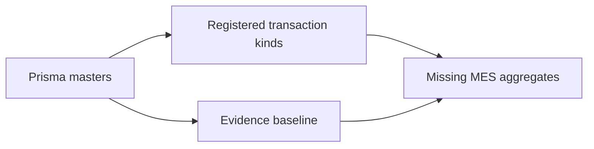

## Chapter 5 — Target Manufacturing Execution Architecture

The target has twelve layers: engineering/master context; production orders; scheduling and dispatch; work-center operations; material coordination; labor and machine capture; Quality and Maintenance coordination; completion, yield and genealogy; costing coordination; shop-floor/device experience; reporting/reconciliation; and security/audit/operations. Existing masters occupy only part of layer one. Typed execution layers are planned, and mobile, RFID, IoT, PLC/SCADA and AI are future until requirements select no premature technology. Every inter-layer effect uses a stable command/result contract with idempotency, version, authority and reconciliation rather than shared writes.


## Chapter 6 — Manufacturing Organization Model

Tenant isolates platform clients; legal entity and company define accountable business scope; plant is the primary execution boundary. Planned production area, line, work center and work cell locate operations without replacing warehouse custody. Machine, labor team, shift, supervisor and Operator define attributable resources; staging area remains an Inventory location. Cost and profit centers are Finance-owned references. Assignments are effective-dated by plant and shift, and cross-plant work requires explicit delegation. A production supervisor may sequence released work but cannot grant Inventory, Quality, Maintenance or Finance authority.

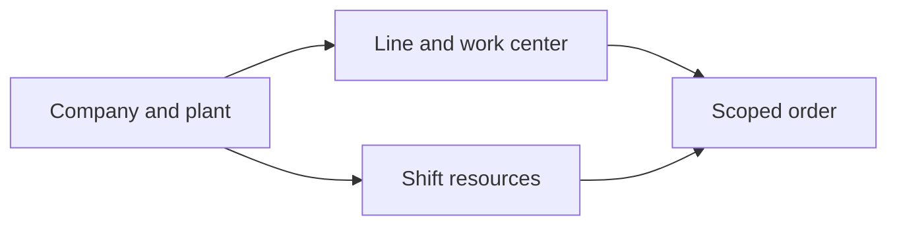

## Chapter 7 — Manufacturing Master-Data Boundary

[`Item` and UOM](../../apps/api/prisma/schema.prisma#L1385), [`Plant`](../../apps/api/prisma/schema.prisma#L383), warehouse, batch/serial and standard-cost fields are implemented foundations. BOM, routing, work center, resource, machine, tool, line, shift, calendar, change and instruction versions are conceptual targets. Engineering owns product/process definitions; Manufacturing consumes approved versions; Inventory owns material identities; Quality owns inspection requirements; Maintenance owns equipment condition; Finance owns cost references. Orders snapshot selected versions so later changes never rewrite execution history.


## Chapter 8 — BOM Architecture

A BOM is a versioned engineering definition with parent item, components, quantity/UOM, fixed or variable basis, scrap allowance, validity and approval. Alternate and phantom directions require explicit explosion rules; co-products and by-products are outputs, not negative components. Engineering change creates a new effective version and an impact decision for unreleased or active orders. Production never resolves the latest BOM implicitly after release, and historical consumption remains tied to the frozen component version.

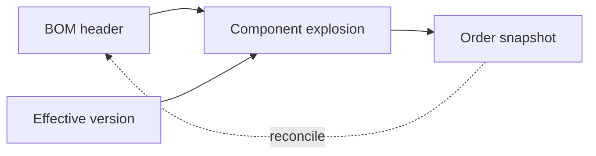

## Chapter 9 — Routing Architecture

Routing versions define ordered, parallel or alternate operations with work center, setup/run/queue/move/wait time, labor/resource needs, inspection points and subcontract flags. Approval and validity are independent from BOM approval. An operation instance snapshots its routing step and predecessor rules. Alternate-operation selection records reason and authority; parallel branches maintain join conditions. A routing edit cannot change an active order silently, and subcontract steps retain Procurement ownership of supplier commitment.

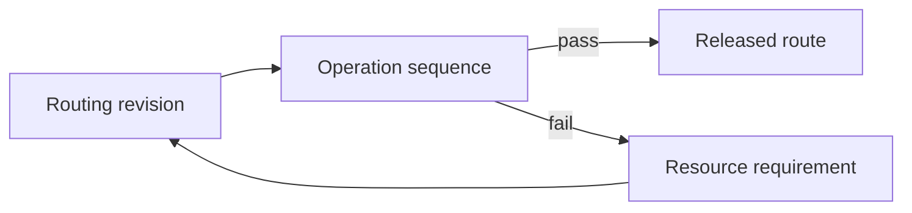

## Chapter 10 — Work Center and Resource Architecture

A work center groups capacity and execution responsibility; work cell, machine, labor resource and tool assignments refine actual execution. Calendar, shift, efficiency and queue are dated inputs, not evidence of availability. Maintenance supplies machine release/hold, Engineering supplies qualification requirements, and Finance supplies cost references. Resource status distinguishes administratively active, schedulable, released and unavailable states. Work-center queues hold operation references but never become production confirmations.

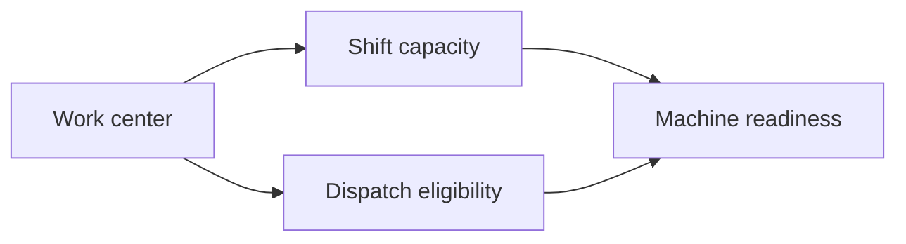

## Chapter 11 — Production Order Architecture

The order header identifies type, company, plant, product, quantity/UOM, planned dates, frozen BOM/routing versions, Sales/planned-order/project lineage, priority, tracking policy, cost object, status and revision. Operations and material requirements are typed children. Attachments reference governed documents. An immutable order identity survives revisions; approval binds a content hash. The aggregate expresses Manufacturing intent and requests external effects but stores no stock balance, Quality decision, Maintenance release or journal.

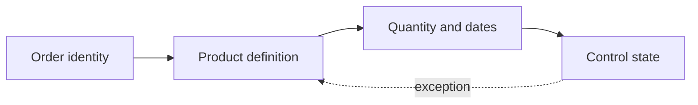

## Chapter 12 — Production Order Lifecycle

Draft, Validated, Submitted, Pending approval, Approved, Released and Dispatched precede setup and processing. Partially confirmed, Confirmed, Partially completed and Completed reflect Manufacturing evidence; On hold and Suspended retain obligations; cancellation before execution requires no irreversible effects. Technical close verifies operational completeness, while Financially settled is a Finance result. Archive follows retention. Material changes create revisions and revalidation rather than free-form status updates.

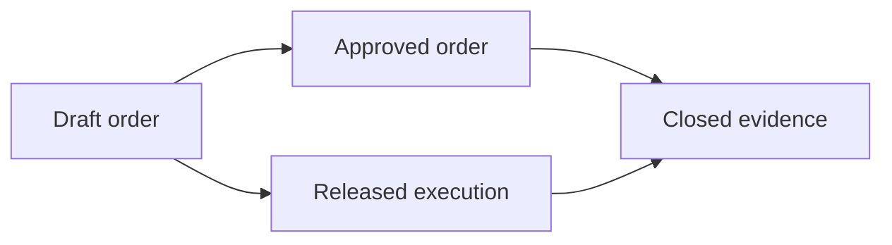

## Chapter 13 — Production Order Validation

Validation checks manufactured Item eligibility, plant, approved BOM/routing versions, quantity/UOM precision, dates, source lineage, tracking and cost references. It requests material availability from Inventory, capacity assumptions from Planning, inspection readiness from Quality, tooling and machine readiness from Engineering/Maintenance, and rejects unavailable or stale responses. Operator qualification is directional until an approved identity model exists. Approval and SoD bind the validated revision; a client cannot bypass failed checks through payload fields.


## Chapter 14 — Production Order Release

Release requires an approved revision, valid engineering versions, work instructions, material-readiness result, work-center/tooling readiness, Quality-plan readiness and Maintenance release where applicable. The release token records dependencies, issuer, time and expiry. Dependency changes can hold or invalidate release. Partial release is allowed only for defined operations/quantities with independent readiness and preserved residual. Safety topics remain directional and require specialist approval; release never authorizes stock movement.

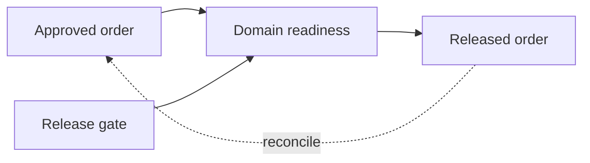

## Chapter 15 — Production Scheduling Boundary

Planning owns supply proposals, MRP and capacity assumptions; Manufacturing converts released work into executable sequence. The execution schedule considers priority, due date, setup grouping, material, machine, labor, Quality readiness and Maintenance windows. Frozen-horizon direction prevents casual disruption while allowing authorized incidents. Finite/infinite capacity methods remain open. Replanning preserves original priority and reason, and never changes customer, project or Procurement commitments directly.

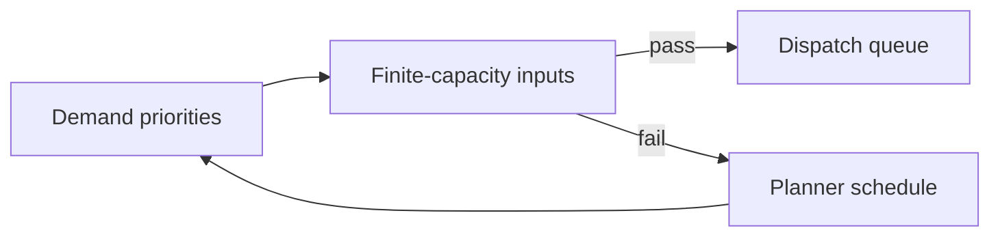

## Chapter 16 — Dispatch Architecture

Dispatch lists ready operation instances by work center and shift. Readiness incorporates predecessor completion, material/tool/operator availability, equipment release and Quality holds. The supervisor selects sequence within delegated rules and records start permission; the Operator acknowledges dispatch before setup. Missing dependencies create visible holds and owned escalations. Re-dispatch preserves prior queue position and reason. Dispatch is authorization to begin a scoped operation, not confirmation of quantity or time.

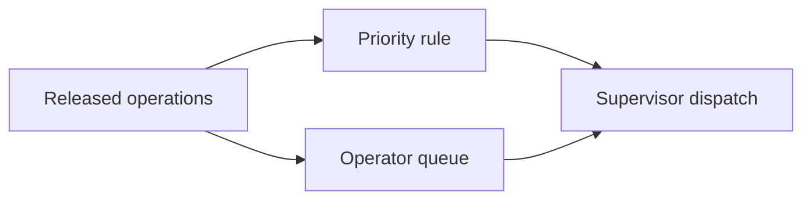

## Chapter 17 — Operation Execution Architecture

An operation instance links order, routing step, work center, Operator, machine and frozen instruction. Commands start setup, start run, pause, resume, partially confirm and complete with attributable timestamps. Good, rejected, rework and scrap quantities remain separate. Setup, runtime and downtime evidence carries manual/device origin and correction lineage. Exceptions name affected quantity and dependency. Operation execution requests material and inspection effects but cannot write their authoritative records.


## Chapter 18 — Operation Lifecycle

Not ready becomes Ready only after predecessor and dependency gates. Dispatched, Setup started/completed and Running represent executable progression. Paused differs from Blocked: pause is operational, block has an external owner such as Quality or Maintenance. Partial confirmation preserves remaining quantity; Confirmed records operation evidence; Rework required routes governed work; Completed satisfies routing rules. Cancellation and Close require impact review. Every transition verifies base version and actor authority.

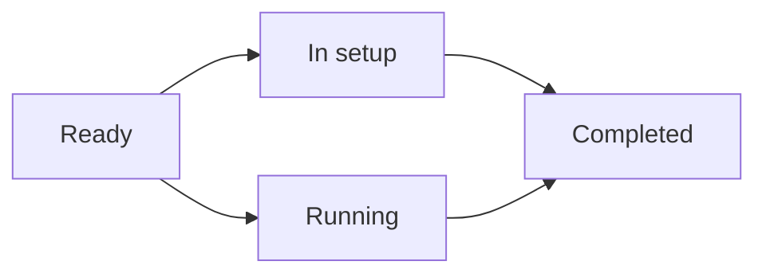

## Chapter 19 — Digital Work Instructions

Instructions are governed documents scoped to product, operation and work center with language, media, parameters, Quality checkpoints, safety direction, attachments, validity and revision. The terminal presents the exact released version and records Operator acknowledgement. Offline caching is future and must detect expiry. An instruction update triggers impact review for dispatched operations. Acknowledgement is not proof that work was performed. No electronic-batch-record, device-history-record or regulated signature claim is made.


## Chapter 20 — Material Requirement Architecture

Order component demand derives from the frozen BOM version and order quantity, applying fixed/variable basis, scrap allowance, UOM conversion, requirement date, staging location, substitute/phantom direction and tracking/Quality constraints. Open quantity distinguishes planned, requested, reserved, issued, consumed, returned and cancelled amounts. Recalculation creates a reasoned requirement revision and never rewrites prior issues. A requirement is Manufacturing demand, not Inventory reservation or movement.


## Chapter 21 — Material Availability Boundary

Manufacturing asks Inventory for a dated availability result covering available, reserved, held, supplier-owned and WIP quantities plus alternative warehouse or approved substitute options. The response carries a watermark and expiry because stock changes concurrently. Shortage is visible; it cannot be hidden by expected receipts or planning values. Manufacturing may reprioritize work, but Inventory remains authoritative for availability and quantity.

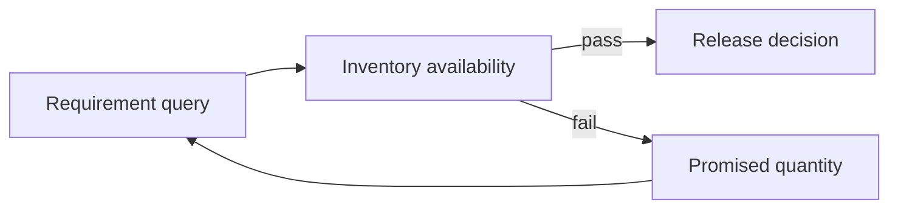

## Chapter 22 — Material Reservation and Staging Boundary

A reservation request references order requirement, plant, needed quantity/date and acceptable tracking/status constraints. Inventory returns reservation/allocation identifiers or shortage. Staging requests then ask Inventory to move authorized material to a controlled location and produce kit/partial-kit results. Release, reallocation and cancellation reference the original reservation. Manufacturing records coordination status only and cannot create reservations, allocations, staging movements or stock history.

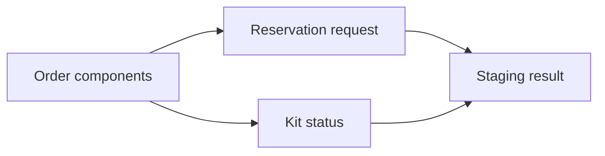

## Chapter 23 — Material Issue Boundary

The issue request identifies order, operation, component, quantity/UOM, source warehouse/location, ownership, stock status and requested batch/serial criteria. Inventory validates on-hand, reservation, tracking, negative-stock policy and actual movement; its result supplies issued identity and quantity. Partial issue and reversal preserve original links. A return is a separate Inventory movement. Manufacturing cannot manufacture an issue by marking a generic document complete.


## Chapter 24 — Material Consumption Architecture

Planned and actual consumption are separate. Actual operation/order consumption references authoritative issue or approved direct-consumption movement, batch/serial identity, substitute, scrap and return. Under- or over-consumption remains visible and reasons/approval apply above policy. Reconciliation compares requirements, issues, consumption, returns and output without editing Inventory. Consumption evidence feeds genealogy and Finance requests but never posts value itself.

```mermaid
flowchart LR
  A24["Issue results"] --> B24["Measured usage"]
  A24 --> C24["Consumption record"]
  B24 --> D24["Quantity balance"]
  C24 --> D24
```

## Chapter 25 — Backflush Architecture

Backflush is an Inventory-controlled policy triggered by an accepted Manufacturing quantity. The rule identifies eligible components, BOM basis, output, scrap factor, timing, tracking restrictions and negative-stock prohibition. Inventory revalidates stock and creates movements; partial completion backflushes only accepted quantity. Exceptions produce shortages or manual review, not invented consumption. Reversal references both confirmation and movement. Manufacturing cannot use backflush to bypass batch/serial or substitution governance.

```mermaid
flowchart LR
  A25["Eligible component"] -->|accepted| B25["Backflush proposal"]
  A25 -->|exception| D25["Movement result"]
  B25 --> C25["Inventory validation"]
  C25 --> D25
```

## Chapter 26 — Labor Reporting Architecture

Labor evidence identifies Operator/team, shift, operation, setup/run/indirect interval, source and correction chain. Overtime and skill/certification are directional pending approved workforce policy. Attendance and payroll remain outside MES scope; Manufacturing requests cost application from Finance using approved time categories. Privacy minimizes personal fields and limits exports. Supervisor correction never deletes original evidence and cannot self-approve where thresholds require separation.

```mermaid
flowchart LR
  A26["Named operator"] --> C26["Supervisor correction"]
  B26["Work interval"] --> C26
  C26 --> D26["Cost evidence"]
  D26 -. reconcile .-> A26
```

## Chapter 27 — Machine and Resource Reporting

Machine evidence records resource, operation, setup/run/idle/downtime, speed/count/cycle, timestamp and manual or automatic origin. Energy and meter inputs remain directional. Device events are untrusted until identity, clock, sequence and plausibility validation. Corrections retain raw event and reviewer. Machine reporting describes execution evidence; Maintenance alone changes equipment condition and Finance alone posts machine cost.

```mermaid
flowchart LR
  A27["Machine identity"] --> B27["Validated event"]
  B27 -->|pass| D27["Maintenance correlation"]
  B27 -->|fail| C27["Operation duration"]
  C27 --> A27
```

## Chapter 28 — Downtime and Production Exception Architecture

Downtime distinguishes planned window, breakdown, starvation, blockage, material shortage, Quality stop, tooling issue, labor shortage and utility interruption. Each interval has reason, owner, start/end, affected operation and recovery evidence. Breakdown triggers Maintenance, Quality stop triggers Quality, and shortage triggers Inventory/Planning; Manufacturing records production impact. Escalation does not clear the external hold. Corrections retain the original classification for audit and OEE recomputation.

```mermaid
flowchart LR
  A28["Equipment event"] --> B28["Downtime class"]
  A28 --> D28["Recovered capacity"]
  B28 --> C28["Escalation owner"]
  D28 --> C28
```

## Chapter 29 — Production Confirmation Architecture

Confirmation binds order/operation revision, good/rejected/rework/scrap quantities, labor, machine, material evidence, tracking identity, shift, Operator and timestamp. Partial and final confirmations use idempotency keys; correction produces a superseding record and approval where material. Confirmation validates operation sequence and cannot exceed remaining quantity without exception. It requests Inventory receipt/consumption and Finance costing, but is neither a movement nor posting.

```mermaid
flowchart LR
  A29["Operation quantities"] --> B29["Evidence checks"]
  B29 --> C29["Accepted confirmation"]
  C29 --> D29["Order totals"]
  D29 -. exception .-> B29
```

## Chapter 30 — Partial Completion and Split Execution

Partial confirmation and partial order completion preserve remaining product, residual material, open routing and pending inspections. Split batches or serial populations receive explicit genealogy branches; they are not collapsed into one status. Partial receipt and cost requests reference only accepted output. Replanning may move residual work without rewriting completed evidence. Cancellation names what remains and closure requires every branch to be resolved or governed as exception.

```mermaid
flowchart LR
  A30["Accepted partial"] --> B30["Residual quantity"]
  A30 --> C30["Split operation"]
  B30 --> D30["Final balance"]
  C30 --> D30
```

## Chapter 31 — Finished-Goods Receipt Boundary

Manufacturing requests receipt for confirmed product, quantity/UOM, batch/serial, plant, proposed warehouse/location/status, order and operation. Inventory validates tracking, duplicate request, quantity and location then creates the physical receipt or rejection result. Quality hold/release remains Quality-owned and influences stock status. Co-/by-product receipts are distinct lines. Partial receipt and reversal retain lineage. Manufacturing completion cannot mark finished goods on hand.

```mermaid
flowchart LR
  A31["Accepted completion"] -->|accepted| B31["Receipt request"]
  A31 -->|exception| D31["Order reconciliation"]
  B31 --> C31["Inventory receipt"]
  C31 --> D31
```

## Chapter 32 — Scrap Architecture

Scrap intent identifies component, operation output or finished product, planned/unplanned reason, quantity/UOM, tracking identity and evidence. Quality may own disposition; Inventory performs physical scrap or return movement; Finance owns cost effect. Approval thresholds separate recorder and approver. Reversal does not erase prior scrap. Analytics distinguish process loss from damaged inventory and prevent unrecorded or inflated scrap from distorting yield.

```mermaid
flowchart LR
  A32["Scrap observation"] --> C32["Movement request"]
  B32["Reason and approval"] --> C32
  C32 --> D32["Loss evidence"]
  D32 -. reconcile .-> A32
```

## Chapter 33 — Rework Architecture

Rework begins from a governed decision linked to source batch/serial, defect and Quality disposition where applicable. A rework order or operation freezes instructions, additional materials, labor and machine needs. Manufacturing executes; Inventory moves added/returned material; Quality reinspects and releases; Finance receives cost evidence. Loops are bounded and escalated. Completion either restores acceptable output or creates scrap/other disposition while preserving genealogy.

```mermaid
flowchart LR
  A33["Quality disposition"] --> B33["Rework order"]
  B33 -->|pass| D33["Disposition closure"]
  B33 -->|fail| C33["Rework execution"]
  C33 --> A33
```

## Chapter 34 — Yield and Loss Architecture

Yield formulas version numerator, denominator, UOM conversion and treatment of good output, rework, scrap, normal and abnormal process loss. Operation, order and batch yield use authoritative material/output facts. Tolerances produce review, not retroactive quantity edits. Abnormal-loss direction requires Finance/Quality policy and is not a compliance claim. Reports show formula version and missing evidence; Manufacturing computes operational yield while Finance owns valuation.

```mermaid
flowchart LR
  A34["Input quantity"] --> B34["Good output"]
  A34 --> D34["Versioned yield"]
  B34 --> C34["Scrap and loss"]
  D34 --> C34
```

## Chapter 35 — Co-Product and By-Product Architecture

The order explicitly declares main, co-product and by-product outputs with planned/actual quantities, tracking and receipt requests. Co-products have intentional joint production; by-products use separate ownership and value policy. Inventory owns each receipt and reversal; Quality owns disposition; Finance approves cost split and any revenue treatment. Genealogy links all outputs to inputs and operation. Negative BOM lines are rejected as an unsafe substitute for output modeling.

```mermaid
flowchart LR
  A35["Joint process input"] --> B35["Output allocation"]
  B35 --> C35["Co-product receipt"]
  C35 --> D35["By-product disposition"]
  D35 -. exception .-> B35
```

## Chapter 36 — Work-in-Progress Architecture

Operational WIP represents order/operation quantity and state—queued, waiting, running, held, rework or partially complete—without pretending to be an Inventory balance or Finance valuation. Location may identify a work center while custody remains governed. Age derives from trusted transitions and supports escalation. Manufacturing-to-Inventory reconciliation compares issued/consumed/output quantities; Finance independently calculates closing WIP value.

```mermaid
flowchart LR
  A36["Open order evidence"] --> B36["Issued material"]
  A36 --> C36["Accepted output"]
  B36 --> D36["WIP control total"]
  C36 --> D36
```

## Chapter 37 — Batch and Serial Genealogy

Genealogy forms immutable edges from issued input batch/serial through order and operation to output, co-/by-product, split, rework, scrap and subcontract results. Inventory owns the tracked identities and movements; Manufacturing owns execution relationships; Quality adds inspection references. Merge direction requires explicit many-to-many semantics. Corrections supersede edges without deletion. Recall tracing is a directional use case, not a regulatory capability claim.

```mermaid
flowchart LR
  A37["Input lots and serials"] -->|accepted| B37["Transformation event"]
  A37 -->|exception| D37["Recall trace"]
  B37 --> C37["Output identities"]
  C37 --> D37
```

## Chapter 38 — Discrete Manufacturing Execution

Discrete execution covers fabrication, assembly, make-to-stock/order, serial-controlled work, ordered operations, component issue, subassembly, final assembly and testing direction. Each unit or lot retains operation and material lineage. Completion requests finished receipt after required checks. It does not assume process-formula semantics or continuous reporting. Finance costing remains a downstream request, and Inventory/Quality keep their authorities.

```mermaid
flowchart LR
  A38["Discrete order"] --> C38["Serialized assembly"]
  B38["Unit operations"] --> C38
  C38 --> D38["Completion"]
  D38 -. reconcile .-> A38
```

## Chapter 39 — Process Manufacturing Execution

Process direction models formula version, batch, variable yield, concentration/potency direction, campaign/vessel, co-/by-products and process loss separately from discrete BOM assumptions. Material quantities and output may require measured conversions with approved precision. Batch genealogy and Quality checkpoints remain explicit. This architecture makes no pharmaceutical, food-safety or regulated-record claim and selects no electronic batch technology.

```mermaid
flowchart LR
  A39["Formula batch"] --> B39["Process parameters"]
  B39 -->|pass| D39["Batch output"]
  B39 -->|fail| C39["Yield and loss"]
  C39 --> A39
```

## Chapter 40 — Repetitive Manufacturing Direction

Repetitive production uses line/rate schedule, reporting points, shift/daily output, takt direction, backflush direction, scrap, downtime and operational WIP. Repetition cannot remove released-order, material, Quality, Maintenance, identity or reconciliation evidence. Aggregated confirmation must retain traceable time buckets and formula versions. Inventory validates every movement; Finance accepts summarized evidence only under approved granularity. Runtime remains future.

```mermaid
flowchart LR
  A40["Rate schedule"] --> B40["Cycle evidence"]
  A40 --> D40["Control reconciliation"]
  B40 --> C40["Periodic backflush"]
  D40 --> C40
```

## Chapter 41 — Make-to-Order and Configure-to-Order Execution

MTO preserves Sales-order/line allocation through production and finished receipt. CTO also freezes customer configuration version and records derived BOM/routing direction. Sales owns customer promise and configuration acceptance; Engineering approves derivation; Manufacturing executes; Inventory owns allocation and receipt. Change/cancellation impact is assessed across Sales, material and active operations. Customer-specific attributes are minimized on the shop floor.

```mermaid
flowchart LR
  A41["Sales configuration"] --> B41["Configured order"]
  B41 --> C41["Variant execution"]
  C41 --> D41["Customer lineage"]
  D41 -. exception .-> B41
```

## Chapter 42 — Engineer-to-Order Boundary

ETO links project, Engineering revision, design/BOM/routing release, long-lead Procurement demand, order, work instruction, Quality needs and cost collection. Engineering approval governs technical revision; Projects owns project scope; Procurement owns suppliers; Manufacturing cannot execute unreleased design. Change impact identifies affected material, operations and completed output. Customer acceptance direction remains Sales/Projects-owned. Historical orders retain the exact Engineering baseline.

```mermaid
flowchart LR
  A42["Engineering revision"] --> B42["Project demand"]
  A42 --> C42["Milestone operation"]
  B42 --> D42["Project evidence"]
  C42 --> D42
```

## Chapter 43 — Subcontract Manufacturing Execution

A subcontract operation links Procurement PO, Manufacturing order/operation, supplied and supplier-owned components, Inventory issue/custody, supplier consumption/output/scrap, Quality disposition, service acceptance and Finance invoice eligibility. Procurement owns supplier commitment; Inventory owns movements; Manufacturing owns production semantics/genealogy; Quality owns release. Supplier-reported quantities remain untrusted until reconciled. FCSB-017 boundaries are preserved.

```mermaid
flowchart LR
  A43["Purchase order"] -->|accepted| B43["Supplier components"]
  A43 -->|exception| D43["Returned output"]
  B43 --> C43["External operation"]
  C43 --> D43
```

## Chapter 44 — Quality Coordination Boundary

Manufacturing requests incoming dependency checks, in-process/first-piece/patrol/final inspections and consumes Quality results. Quality alone records hold, release, rejection, deviation/nonconformance disposition and controlled rework approval. A production stop references the Quality decision and cannot be cleared by Manufacturing. Evidence ties plan/version, sample, batch/serial, operation and result. FCSB-019 must define the inspection and nonconformance runtime.

```mermaid
flowchart LR
  A44["Inspection request"] --> C44["Disposition result"]
  B44["Quality hold"] --> C44
  C44 --> D44["Execution gate"]
  D44 -. reconcile .-> A44
```

## Chapter 45 — Maintenance Coordination Boundary

Manufacturing requests machine readiness and reports breakdown/production impact. Maintenance owns preventive windows, holds, corrective work order, equipment release, temporary-workaround authority and reliability evidence. Restart requires current Maintenance release plus Manufacturing readiness; a supervisor cannot clear a Maintenance hold. Tool condition and meter direction are inputs only. Reconciliation compares production downtime with Maintenance events without modifying either source.

```mermaid
flowchart LR
  A45["Readiness request"] --> B45["Maintenance hold"]
  B45 -->|pass| D45["Operation gate"]
  B45 -->|fail| C45["Release decision"]
  C45 --> A45
```

## Chapter 46 — Tooling, Mold and Fixture Direction

Tool, fixture, mold, die and gauge identities require revision, location, condition, availability, calibration direction, Maintenance relationship, usage count/life limit, assignment, return and replacement. Engineering owns technical suitability; Maintenance/Quality own condition or calibration authority; Manufacturing records usage against operation. Missing or expired tooling blocks dispatch under policy. No tooling runtime exists, and this direction claims no calibration compliance.

```mermaid
flowchart LR
  A46["Tool requirement"] --> B46["Available tool"]
  A46 --> D46["Operation assignment"]
  B46 --> C46["Life and calibration"]
  D46 --> C46
```

## Chapter 47 — Production Costing Boundary

Manufacturing supplies authoritative operational evidence for material consumption, labor/machine/setup time, subcontract service, scrap, rework, output and co-/by-product relationship. Finance/Cost Accounting owns rates, overhead, valuation, journal, variance and settlement. Requests carry order, operation, quantity, time, source version and idempotency. Manufacturing never calculates posted cost from standardCost alone and cannot change a journal to match completion.

```mermaid
flowchart LR
  A47["Production evidence"] --> B47["Costing request"]
  B47 --> C47["Finance calculation"]
  C47 --> D47["Posted result"]
  D47 -. exception .-> B47
```

## Chapter 48 — WIP Valuation and Variance Boundary

Finance defines WIP valuation, actual/standard cost, material/labor/machine/overhead/usage/yield/scrap/rate variances, period, closing WIP and settlement. Manufacturing explains operational drivers and corrects execution evidence through history-preserving records. A variance request references frozen quantities and rates but does not post. Technical close can precede financial settlement; period close never forces Manufacturing to invent confirmation.

```mermaid
flowchart LR
  A48["Quantity reconciliation"] --> B48["WIP valuation"]
  A48 --> C48["Variance analysis"]
  B48 --> D48["Settlement gate"]
  C48 --> D48
```

## Chapter 49 — OEE and Manufacturing Performance

OEE direction combines availability, performance and Quality rate using versioned planned time, runtime, ideal cycle time, total/good count, downtime and loss taxonomy. Data-source ownership and clock quality are explicit; planned stops and rework treatment require approval. OEE is a non-authoritative analytical measure and cannot release equipment, alter production or pay incentives. Current dashboard placeholders are not OEE runtime.

```mermaid
flowchart LR
  A49["Availability facts"] -->|accepted| B49["Performance facts"]
  A49 -->|exception| D49["OEE report"]
  B49 --> C49["Quality facts"]
  C49 --> D49
```

## Chapter 50 — Shop-Floor Experience, Barcode and Device Direction

Future operator/work-center terminals present released work, instruction version and permitted commands with individual session attribution. Barcode/QR and RFID direction may identify order, operation, material, batch/serial or tool but never authorizes movement by scan alone. Device identity, scanner/printer/label, offline queue, errors, accessibility, supervisor override and audit require approved design. Shared terminals reauthenticate sensitive actions. No device technology is selected.

```mermaid
flowchart LR
  A50["Named session"] --> C50["Validated command"]
  B50["Barcode scan"] --> C50
  C50 --> D50["Operator feedback"]
  D50 -. reconcile .-> A50
```

## Chapter 51 — IoT, PLC and Machine Integration Direction

Machine adapters may accept PLC, SCADA, sensor, counter, cycle and downtime events through a buffered gateway. OPC UA, MQTT and other protocols remain unselected directions. Each event carries device identity, sequence, timestamp, source clock and signature direction; validation detects replay, gaps, drift and implausible counts. Device commands cannot issue stock, complete orders, release Quality/Maintenance holds or post costs. Raw and accepted events are retained separately.

```mermaid
flowchart LR
  A51["Machine signal"] --> B51["Gateway validation"]
  B51 -->|pass| D51["Trusted evidence"]
  B51 -->|fail| C51["MES correlation"]
  C51 --> A51
```

## Chapter 52 — Manufacturing Reporting and Reconciliation

Certified reporting covers order/dispatch status, output, scrap, rework, yield, labor, machine, downtime, WIP, variance direction, OEE direction, on-time completion and genealogy. Manufacturing-to-Inventory compares requirements, issues, consumption, returns and receipts; Manufacturing-to-Finance compares evidence, WIP, variance and settlement; Manufacturing-to-Quality compares inspection requests, holds and dispositions. Reports follow FCSB-013 and never mutate sources.

```mermaid
flowchart LR
  A52["Order control totals"] --> B52["Domain results"]
  A52 --> D52["Certified close"]
  B52 --> C52["Exception case"]
  D52 --> C52
```

## Chapter 53 — Manufacturing Security, SoD and Audit

Controls separate order creator/approver, dispatcher/Operator, Operator/correction approver, Manufacturing/Inventory movement, Manufacturing/Quality release, Manufacturing/Maintenance release and Manufacturing/Finance posting. Scrap, rework, substitutions and manual confirmations require scoped authority. Shared-terminal attribution, device impersonation, cross-plant access, supervisor override, break-glass, tenant isolation and sensitive instruction export are threat cases. Audit and Digital DNA preserve identity/evidence; AI is denied execution commands.

```mermaid
flowchart LR
  A53["User and device"] --> B53["Policy enforcement"]
  B53 --> C53["Immutable audit"]
  C53 --> D53["Incident review"]
  D53 -. exception .-> B53
```

## Chapter 54 — Manufacturing Capability, Risk, Example and Responsibility Models

The following registers translate the target architecture into individually classified capabilities, specific failure conditions, realistic execution examples and separated responsibilities. Current foundations are cited; generic transactions and EOR codes remain scaffold or metadata. Planned and future rows confer no implementation status.


### Required semantic diagrams beyond chapter flows

#### BOM lifecycle

```mermaid
stateDiagram-v2
  [*] --> BOMDraft
  BOMDraft --> BOMApproved
  BOMApproved --> BOMEffective
  BOMEffective --> BOMSuperseded
  BOMSuperseded --> [*]
```

#### Production-order lifecycle

```mermaid
stateDiagram-v2
  [*] --> OrderDraft
  OrderDraft --> Released
  Released --> InProcess
  InProcess --> TechnicallyClosed
  TechnicallyClosed --> FinanciallySettled
```

#### Material-availability interaction

```mermaid
sequenceDiagram
  participant M as Manufacturing
  participant I as Inventory
  M->>I: Availability/reservation/staging request
  I-->>M: Versioned quantity result
```

#### Material-issue interaction

```mermaid
sequenceDiagram
  participant O as Operation
  participant I as Inventory
  O->>I: Issue/consumption request
  I-->>O: Movement identity and quantity
```

#### Batch genealogy

```mermaid
flowchart LR
  INB["Input batches"] --> OP["Operation lineage"] --> OUTB["Output batches"]
  OP --> SCR["Scrap/rework branches"]
```

#### Serial genealogy

```mermaid
flowchart LR
  INS["Input serials"] --> UNIT["Unit operation history"] --> OUTS["Output serials"]
  UNIT --> CORR["Superseding correction"]
```

#### Configure-to-order derivation

```mermaid
flowchart LR
  CFG["Sales configuration"] --> ENG["Engineering derivation"] --> CTO["CTO execution order"]
  CTO --> ALLOC["Customer allocation"]
```

#### Machine-event validation

```mermaid
flowchart LR
  EVT["Raw machine event"] --> ID["Identity/sequence/clock checks"] --> ACC["Accepted evidence"]
  ID --> QUAR["Quarantined anomaly"]
```

#### Finance evidence interaction

```mermaid
sequenceDiagram
  participant M as Manufacturing
  participant F as Finance
  M->>F: WIP/variance evidence
  F-->>M: Posted valuation/settlement reference
```

#### Offline replay

```mermaid
flowchart LR
  DEV["Offline terminal"] --> KEY["Idempotent replay"] --> MES["MES validation"]
  MES --> CON["Conflict review"]
```

#### Cross-domain authority

```mermaid
flowchart LR
  MAN["Manufacturing"] -->|"request"| INV["Inventory authority"]
  MAN -->|"request"| QUA["Quality authority"]
  MAN -->|"request"| MAI["Maintenance authority"]
  MAN -->|"request"| FIN["Finance authority"]
```

#### Manufacturing segregation of duties

```mermaid
flowchart TD
  USER["Attributed shop-floor actor"] --> SCOPE["Plant/work-center scope"] --> SOD["SoD and command gate"] --> AUD["Audit"]
```

#### Manufacturing threat flow

```mermaid
flowchart LR
  ATT["Device/insider/AI threat"] --> GATE["Validation and deny rules"] --> ALERT["Incident evidence"]
  GATE -. "no direct cross-domain writes" .-> OWN["Owned services"]
```

### Manufacturing capability matrix

| Capability ID | Capability | Owner | Current status | Target maturity | Dependencies | Authority | Priority |
|---|---|---|---|---|---|---|---|
| MFG-CAP-001 | Item identity | Data Governance | Implemented foundation — [`Item`](../../apps/api/prisma/schema.prisma#L1385) | Governed | Item master governance | Data Governance | P0 |
| MFG-CAP-002 | Item manufacturing strategy | Manufacturing | Implemented foundation — [`manufacturingStrategy`](../../apps/api/prisma/schema.prisma#L1405) | Governed | Manufacturing contract | Manufacturing | P0 |
| MFG-CAP-003 | Manufactured-item eligibility | Manufacturing | Implemented foundation — [`isManufacturedItem`](../../apps/api/prisma/schema.prisma#L1413) | Governed | Manufacturing contract | Manufacturing | P0 |
| MFG-CAP-004 | Subcontracted-item flag | Manufacturing | Implemented foundation — [`isSubcontractedItem`](../../apps/api/prisma/schema.prisma#L1414) | Governed | Manufacturing contract | Manufacturing | P0 |
| MFG-CAP-005 | Quality-inspection flag | Quality | Implemented foundation — [`isQualityInspectionRequired`](../../apps/api/prisma/schema.prisma#L1417) | Governed | Quality contract | Quality | P0 |
| MFG-CAP-006 | Item tracking policy | Inventory | Implemented foundation — [tracking fields](../../apps/api/prisma/schema.prisma#L1409) | Governed | Inventory tracking policy | Inventory | P0 |
| MFG-CAP-007 | Item lead time | Production Planning | Implemented foundation — [`leadTimeDays`](../../apps/api/prisma/schema.prisma#L1420) | Governed | Planning policy | Production Planning | P0 |
| MFG-CAP-008 | Item planning inputs | Production Planning | Implemented foundation — [reorder fields](../../apps/api/prisma/schema.prisma#L1424) | Governed | Planning policy | Production Planning | P0 |
| MFG-CAP-009 | Item standard cost input | Finance | Implemented foundation — [`standardCost`](../../apps/api/prisma/schema.prisma#L1430) | Governed | Finance contract | Finance | P0 |
| MFG-CAP-010 | Item group | Data Governance | Implemented foundation — [`ItemGroup`](../../apps/api/prisma/schema.prisma#L1688) | Governed | Item master governance | Data Governance | P0 |
| MFG-CAP-011 | Item category | Data Governance | Implemented foundation — [`ItemCategory`](../../apps/api/prisma/schema.prisma#L1713) | Governed | Item master governance | Data Governance | P0 |
| MFG-CAP-012 | Base UOM | Data Governance | Implemented foundation — [`UnitOfMeasure`](../../apps/api/prisma/schema.prisma#L1648) | Governed | UOM governance | Data Governance | P0 |
| MFG-CAP-013 | Stock UOM | Inventory | Implemented foundation — [`stockUomId`](../../apps/api/prisma/schema.prisma#L1404) | Governed | Inventory contract | Inventory | P0 |
| MFG-CAP-014 | UOM conversion | Data Governance | Implemented foundation — [`UomConversion`](../../apps/api/prisma/schema.prisma#L1669) | Governed | UOM governance | Data Governance | P0 |
| MFG-CAP-015 | Plant | Data Governance | Implemented foundation — [`Plant`](../../apps/api/prisma/schema.prisma#L383) | Governed | Enterprise-structure governance | Data Governance | P0 |
| MFG-CAP-016 | Company | Data Governance | Implemented foundation — [`Company`](../../apps/api/prisma/schema.prisma#L178) | Governed | Enterprise-structure governance | Data Governance | P0 |
| MFG-CAP-017 | Warehouse | Inventory | Implemented foundation — [`Warehouse`](../../apps/api/prisma/schema.prisma#L818) | Governed | Inventory contract | Inventory | P0 |
| MFG-CAP-018 | Warehouse zone | Inventory | Implemented foundation — [`WarehouseZone`](../../apps/api/prisma/schema.prisma#L1807) | Governed | Inventory contract | Inventory | P0 |
| MFG-CAP-019 | Warehouse bin | Inventory | Implemented foundation — [`WarehouseBin`](../../apps/api/prisma/schema.prisma#L1832) | Governed | Inventory contract | Inventory | P0 |
| MFG-CAP-020 | Stock status | Inventory | Implemented foundation — [`StockStatus`](../../apps/api/prisma/schema.prisma#L1859) | Governed | Inventory contract | Inventory | P0 |
| MFG-CAP-021 | Batch identity | Inventory | Implemented foundation — [`Batch`](../../apps/api/prisma/schema.prisma#L1878) | Governed | Inventory contract | Inventory | P0 |
| MFG-CAP-022 | Serial identity | Inventory | Implemented foundation — [`SerialNumber`](../../apps/api/prisma/schema.prisma#L1899) | Governed | Inventory contract | Inventory | P0 |
| MFG-CAP-023 | Cost center | Finance | Implemented foundation — [`CostCenter`](../../apps/api/prisma/schema.prisma#L638) | Governed | Finance contract | Finance | P0 |
| MFG-CAP-024 | Profit center | Finance | Implemented foundation — [`ProfitCenter`](../../apps/api/prisma/schema.prisma#L670) | Governed | Finance organization contract | Finance | P0 |
| MFG-CAP-025 | Generic transaction document | Architecture Board | Scaffold — generic repository structure only | Governed | Platform transaction scaffold | Architecture Board | P0 |
| MFG-CAP-026 | Transaction lineage | Data Governance | Scaffold — generic repository structure only | Governed | Cross-domain lineage policy | Data Governance | P0 |
| MFG-CAP-027 | BOM transaction kind | Engineering | Registered metadata only — [transaction kind enum](../../apps/api/prisma/schema.prisma#L66) | Governed | Engineering contract | Engineering | P0 |
| MFG-CAP-028 | Work-order transaction kind | Manufacturing | Registered metadata only — [transaction kind enum](../../apps/api/prisma/schema.prisma#L66) | Governed | Manufacturing contract | Manufacturing | P0 |
| MFG-CAP-029 | Material-issue transaction kind | Inventory | Registered metadata only — [transaction kind enum](../../apps/api/prisma/schema.prisma#L66) | Governed | Inventory contract | Inventory | P0 |
| MFG-CAP-030 | Production-entry transaction kind | Manufacturing | Registered metadata only — [transaction kind enum](../../apps/api/prisma/schema.prisma#L66) | Governed | Manufacturing contract | Manufacturing | P0 |
| MFG-CAP-031 | Quality-inspection transaction kind | Quality | Registered metadata only — [transaction kind enum](../../apps/api/prisma/schema.prisma#L66) | Governed | Quality contract | Quality | P0 |
| MFG-CAP-032 | Finished-goods-receipt kind | Inventory | Registered metadata only — [transaction kind enum](../../apps/api/prisma/schema.prisma#L66) | Governed | Inventory contract | Inventory | P0 |
| MFG-CAP-033 | Bill-of-materials registration | Engineering | Registered metadata only — [seed registration](../../apps/api/prisma/seed.ts#L26) | Governed | Engineering metadata contract | Engineering | P0 |
| MFG-CAP-034 | Routing registration | Engineering | Registered metadata only — [seed registration](../../apps/api/prisma/seed.ts#L26) | Governed | Engineering contract | Engineering | P0 |
| MFG-CAP-035 | Work-center registration | Manufacturing | Registered metadata only — [seed registration](../../apps/api/prisma/seed.ts#L26) | Governed | Manufacturing contract | Manufacturing | P0 |
| MFG-CAP-036 | Production-plan registration | Production Planning | Registered metadata only — [seed registration](../../apps/api/prisma/seed.ts#L26) | Governed | Planning metadata contract | Production Planning | P0 |
| MFG-CAP-037 | Work-order registration | Manufacturing | Registered metadata only — [seed registration](../../apps/api/prisma/seed.ts#L26) | Governed | Manufacturing contract | Manufacturing | P0 |
| MFG-CAP-038 | Material-issue registration | Inventory | Registered metadata only — [seed registration](../../apps/api/prisma/seed.ts#L26) | Governed | Inventory metadata contract | Inventory | P0 |
| MFG-CAP-039 | Production-entry registration | Manufacturing | Registered metadata only — [seed registration](../../apps/api/prisma/seed.ts#L26) | Governed | Manufacturing contract | Manufacturing | P0 |
| MFG-CAP-040 | Quality-inspection registration | Quality | Registered metadata only — [seed registration](../../apps/api/prisma/seed.ts#L26) | Governed | Quality contract | Quality | P0 |
| MFG-CAP-041 | Finished-goods-receipt registration | Inventory | Registered metadata only — [seed registration](../../apps/api/prisma/seed.ts#L26) | Governed | Inventory contract | Inventory | P0 |
| MFG-CAP-042 | Workflow definitions | Manufacturing | Scaffold — generic repository structure only | Governed | Manufacturing contract | Manufacturing | P0 |
| MFG-CAP-043 | Approval records | Manufacturing | Scaffold — generic repository structure only | Governed | Manufacturing contract | Manufacturing | P0 |
| MFG-CAP-044 | Number series | Manufacturing | Implemented foundation — [`NumberSeries`](../../apps/api/prisma/schema.prisma#L1330) | Governed | Manufacturing contract | Manufacturing | P0 |
| MFG-CAP-045 | Audit log | Security | Implemented foundation — [`AuditLog`](../../apps/api/prisma/schema.prisma#L1357) | Governed | Security contract | Security | P0 |
| MFG-CAP-046 | Digital DNA | Data Governance | Implemented foundation — [Digital DNA service](../../apps/api/src/digital-dna/digital-dna.service.ts) | Governed | Digital DNA contract | Data Governance | P0 |
| MFG-CAP-047 | Report definitions | Reporting | Scaffold — generic repository structure only | Governed | Reporting contract | Reporting | P0 |
| MFG-CAP-048 | Production dashboard count | Reporting | Partial — bounded field/kind/UI fragment; no MES invariant | Governed | Dashboard read-model contract | Reporting | P0 |
| MFG-CAP-049 | Manufacturing permissions | Security | Partial — bounded field/kind/UI fragment; no MES invariant | Governed | Security contract | Security | P0 |
| MFG-CAP-050 | Organization scope | Data Governance | Partial — bounded field/kind/UI fragment; no MES invariant | Governed | Organization-scope policy | Data Governance | P0 |
| MFG-CAP-051 | BOM header | Engineering | Planned | Governed | Engineering contract | Engineering | P1 |
| MFG-CAP-052 | BOM version | Engineering | Planned | Governed | Engineering contract | Engineering | P1 |
| MFG-CAP-053 | BOM component | Engineering | Planned | Governed | Engineering contract | Engineering | P1 |
| MFG-CAP-054 | BOM effective dating | Engineering | Planned | Governed | Engineering contract | Engineering | P1 |
| MFG-CAP-055 | Alternate BOM | Engineering | Planned | Governed | Engineering contract | Engineering | P1 |
| MFG-CAP-056 | Phantom component | Engineering | Planned | Governed | BOM contract | Engineering | P1 |
| MFG-CAP-057 | Fixed component quantity | Engineering | Planned | Governed | BOM contract | Engineering | P1 |
| MFG-CAP-058 | Variable component quantity | Engineering | Planned | Governed | BOM contract | Engineering | P1 |
| MFG-CAP-059 | BOM scrap factor | Engineering | Planned | Governed | Engineering contract | Engineering | P1 |
| MFG-CAP-060 | BOM approval | Engineering | Planned | Governed | Engineering contract | Engineering | P1 |
| MFG-CAP-061 | Engineering change | Engineering | Planned | Governed | Engineering contract | Engineering | P1 |
| MFG-CAP-062 | Routing header | Engineering | Planned | Governed | Engineering contract | Engineering | P1 |
| MFG-CAP-063 | Routing version | Engineering | Planned | Governed | Engineering contract | Engineering | P1 |
| MFG-CAP-064 | Routing operation | Engineering | Planned | Governed | Engineering contract | Engineering | P1 |
| MFG-CAP-065 | Parallel operation | Engineering | Planned | Governed | Routing contract | Engineering | P1 |
| MFG-CAP-066 | Alternate operation | Engineering | Planned | Governed | Routing contract | Engineering | P1 |
| MFG-CAP-067 | Routing approval | Engineering | Planned | Governed | Engineering contract | Engineering | P1 |
| MFG-CAP-068 | Work center | Manufacturing | Planned | Governed | Manufacturing contract | Manufacturing | P1 |
| MFG-CAP-069 | Work-cell hierarchy | Manufacturing | Planned | Governed | Manufacturing contract | Manufacturing | P1 |
| MFG-CAP-070 | Machine resource | Manufacturing | Planned | Governed | Manufacturing contract | Manufacturing | P1 |
| MFG-CAP-071 | Labor resource | Manufacturing | Planned | Governed | Manufacturing contract | Manufacturing | P1 |
| MFG-CAP-072 | Shift | Manufacturing | Planned | Governed | Manufacturing contract | Manufacturing | P1 |
| MFG-CAP-073 | Manufacturing calendar | Manufacturing | Planned | Governed | Manufacturing contract | Manufacturing | P1 |
| MFG-CAP-074 | Production line | Manufacturing | Planned | Governed | Manufacturing contract | Manufacturing | P1 |
| MFG-CAP-075 | Tool identity | Engineering | Planned | Governed | Tool master contract | Engineering | P1 |
| MFG-CAP-076 | Tool assignment | Manufacturing | Planned | Governed | Manufacturing contract | Manufacturing | P1 |
| MFG-CAP-077 | Tool life counter | Maintenance | Planned | Governed | Tool condition contract | Maintenance | P1 |
| MFG-CAP-078 | Operator qualification | Manufacturing | Planned | Governed | Manufacturing contract | Manufacturing | P1 |
| MFG-CAP-079 | Production order | Manufacturing | Planned | Governed | Manufacturing contract | Manufacturing | P1 |
| MFG-CAP-080 | Production-order revision | Manufacturing | Planned | Governed | Manufacturing contract | Manufacturing | P1 |
| MFG-CAP-081 | Order validation | Manufacturing | Planned | Governed | Manufacturing contract | Manufacturing | P1 |
| MFG-CAP-082 | Order approval | Manufacturing | Planned | Governed | Manufacturing contract | Manufacturing | P1 |
| MFG-CAP-083 | Order release | Manufacturing | Planned | Governed | Manufacturing contract | Manufacturing | P1 |
| MFG-CAP-084 | Partial order release | Manufacturing | Planned | Governed | Manufacturing contract | Manufacturing | P1 |
| MFG-CAP-085 | Production schedule | Manufacturing | Planned | Governed | Planning demand and capacity assumptions | Manufacturing | P1 |
| MFG-CAP-086 | Dispatch queue | Manufacturing | Planned | Governed | Manufacturing contract | Manufacturing | P1 |
| MFG-CAP-087 | Operation dispatch | Manufacturing | Planned | Governed | Manufacturing contract | Manufacturing | P1 |
| MFG-CAP-088 | Operation instance | Manufacturing | Planned | Governed | Manufacturing contract | Manufacturing | P1 |
| MFG-CAP-089 | Operation lifecycle | Manufacturing | Planned | Governed | Manufacturing contract | Manufacturing | P1 |
| MFG-CAP-090 | Setup execution | Manufacturing | Planned | Governed | Manufacturing contract | Manufacturing | P1 |
| MFG-CAP-091 | Runtime execution | Manufacturing | Planned | Governed | Manufacturing contract | Manufacturing | P1 |
| MFG-CAP-092 | Operation pause/resume | Manufacturing | Planned | Governed | Manufacturing contract | Manufacturing | P1 |
| MFG-CAP-093 | Operation confirmation | Manufacturing | Planned | Governed | Manufacturing contract | Manufacturing | P1 |
| MFG-CAP-094 | Production correction | Manufacturing | Planned | Governed | Manufacturing contract | Manufacturing | P1 |
| MFG-CAP-095 | Digital work instruction | Engineering | Planned | Governed | Engineering contract | Engineering | P1 |
| MFG-CAP-096 | Instruction acknowledgement | Manufacturing | Planned | Governed | Engineering instruction contract | Manufacturing | P1 |
| MFG-CAP-097 | Material requirement | Manufacturing | Planned | Governed | Manufacturing contract | Manufacturing | P1 |
| MFG-CAP-098 | Material availability request | Manufacturing | Planned | Governed | Manufacturing contract | Manufacturing | P1 |
| MFG-CAP-099 | Reservation request | Manufacturing | Planned | Governed | Manufacturing contract | Manufacturing | P1 |
| MFG-CAP-100 | Allocation request | Manufacturing | Planned | Governed | Manufacturing contract | Manufacturing | P1 |
| MFG-CAP-101 | Staging request | Manufacturing | Planned | Governed | Manufacturing contract | Manufacturing | P1 |
| MFG-CAP-102 | Kit status | Manufacturing | Planned | Governed | Manufacturing contract | Manufacturing | P1 |
| MFG-CAP-103 | Material issue request | Manufacturing | Planned | Governed | Inventory issue contract | Manufacturing | P1 |
| MFG-CAP-104 | Physical material issue | Inventory | Planned | Governed | Inventory contract | Inventory | P1 |
| MFG-CAP-105 | Material return request | Manufacturing | Planned | Governed | Manufacturing contract | Manufacturing | P1 |
| MFG-CAP-106 | Actual consumption | Inventory | Planned | Governed | Inventory contract | Inventory | P1 |
| MFG-CAP-107 | Over-consumption exception | Manufacturing | Planned | Governed | Inventory consumption contract | Manufacturing | P1 |
| MFG-CAP-108 | Under-consumption evidence | Manufacturing | Planned | Governed | Inventory consumption contract | Manufacturing | P1 |
| MFG-CAP-109 | Material substitution | Engineering | Planned | Governed | Quality applicability and Inventory issue contract | Engineering | P1 |
| MFG-CAP-110 | Backflush policy | Inventory | Planned | Governed | Manufacturing confirmation and Inventory policy | Inventory | P1 |
| MFG-CAP-111 | Backflush movement request | Manufacturing | Planned | Governed | Inventory backflush contract | Manufacturing | P1 |
| MFG-CAP-112 | Labor setup reporting | Manufacturing | Planned | Governed | Manufacturing contract | Manufacturing | P1 |
| MFG-CAP-113 | Labor runtime reporting | Manufacturing | Planned | Governed | Manufacturing contract | Manufacturing | P1 |
| MFG-CAP-114 | Indirect labor | Manufacturing | Planned | Governed | Manufacturing contract | Manufacturing | P1 |
| MFG-CAP-115 | Labor correction | Manufacturing | Planned | Governed | Manufacturing contract | Manufacturing | P1 |
| MFG-CAP-116 | Machine setup reporting | Manufacturing | Planned | Governed | Manufacturing contract | Manufacturing | P1 |
| MFG-CAP-117 | Machine runtime reporting | Manufacturing | Planned | Governed | Manufacturing contract | Manufacturing | P1 |
| MFG-CAP-118 | Machine-event validation | Manufacturing | Planned | Governed | Manufacturing contract | Manufacturing | P1 |
| MFG-CAP-119 | Downtime reporting | Manufacturing | Planned | Governed | Manufacturing contract | Manufacturing | P1 |
| MFG-CAP-120 | Breakdown escalation | Manufacturing | Planned | Governed | Manufacturing contract | Manufacturing | P1 |
| MFG-CAP-121 | Production confirmation | Manufacturing | Planned | Governed | Manufacturing contract | Manufacturing | P2 |
| MFG-CAP-122 | Partial confirmation | Manufacturing | Planned | Governed | Manufacturing contract | Manufacturing | P2 |
| MFG-CAP-123 | Final confirmation | Manufacturing | Planned | Governed | Manufacturing contract | Manufacturing | P2 |
| MFG-CAP-124 | Partial completion | Manufacturing | Planned | Governed | Manufacturing contract | Manufacturing | P2 |
| MFG-CAP-125 | Finished-goods receipt request | Manufacturing | Planned | Governed | Inventory receipt contract | Manufacturing | P2 |
| MFG-CAP-126 | Physical finished-goods receipt | Inventory | Planned | Governed | Inventory contract | Inventory | P2 |
| MFG-CAP-127 | Component scrap intent | Manufacturing | Planned | Governed | Manufacturing contract | Manufacturing | P2 |
| MFG-CAP-128 | Output scrap intent | Manufacturing | Planned | Governed | Manufacturing contract | Manufacturing | P2 |
| MFG-CAP-129 | Scrap movement request | Manufacturing | Planned | Governed | Manufacturing contract | Manufacturing | P2 |
| MFG-CAP-130 | Rework order | Manufacturing | Planned | Governed | Manufacturing contract | Manufacturing | P2 |
| MFG-CAP-131 | Rework completion | Manufacturing | Planned | Governed | Manufacturing contract | Manufacturing | P2 |
| MFG-CAP-132 | Yield calculation | Manufacturing | Planned | Governed | Manufacturing contract | Manufacturing | P2 |
| MFG-CAP-133 | Process-loss classification | Manufacturing | Planned | Governed | Manufacturing contract | Manufacturing | P2 |
| MFG-CAP-134 | Co-product output | Manufacturing | Planned | Governed | Manufacturing contract | Manufacturing | P2 |
| MFG-CAP-135 | By-product output | Manufacturing | Planned | Governed | Manufacturing contract | Manufacturing | P2 |
| MFG-CAP-136 | Operational WIP | Manufacturing | Planned | Governed | Manufacturing contract | Manufacturing | P2 |
| MFG-CAP-137 | WIP aging | Manufacturing | Planned | Governed | Manufacturing contract | Manufacturing | P2 |
| MFG-CAP-138 | Batch genealogy | Manufacturing | Planned | Governed | Inventory batch identities and movements | Manufacturing | P2 |
| MFG-CAP-139 | Serial genealogy | Manufacturing | Planned | Governed | Inventory serial identities and movements | Manufacturing | P2 |
| MFG-CAP-140 | Discrete manufacturing | Manufacturing | Planned | Governed | Manufacturing contract | Manufacturing | P2 |
| MFG-CAP-141 | Process manufacturing | Manufacturing | Future | Governed | Manufacturing contract | Manufacturing | P2 |
| MFG-CAP-142 | Repetitive manufacturing | Manufacturing | Future | Governed | Manufacturing contract | Manufacturing | P2 |
| MFG-CAP-143 | Make-to-order execution | Manufacturing | Planned | Governed | Manufacturing contract | Manufacturing | P2 |
| MFG-CAP-144 | Configure-to-order execution | Manufacturing | Planned | Governed | Manufacturing contract | Manufacturing | P2 |
| MFG-CAP-145 | Engineer-to-order execution | Manufacturing | Planned | Governed | Manufacturing contract | Manufacturing | P2 |
| MFG-CAP-146 | Subcontract execution | Manufacturing | Planned | Governed | Manufacturing contract | Manufacturing | P2 |
| MFG-CAP-147 | In-process Quality request | Manufacturing | Planned | Governed | Quality inspection contract | Manufacturing | P2 |
| MFG-CAP-148 | Quality hold consumption | Manufacturing | Planned | Governed | Quality hold and release results | Manufacturing | P2 |
| MFG-CAP-149 | Maintenance readiness request | Manufacturing | Planned | Governed | Maintenance readiness contract | Manufacturing | P2 |
| MFG-CAP-150 | Maintenance hold consumption | Manufacturing | Planned | Governed | Maintenance hold and release results | Manufacturing | P2 |
| MFG-CAP-151 | Production costing | Finance | Planned | Governed | Reconciled operational evidence | Finance | P2 |
| MFG-CAP-152 | WIP valuation | Finance | Planned | Governed | Inventory movements and operational WIP | Finance | P2 |
| MFG-CAP-153 | Production variance | Finance | Planned | Governed | Frozen standards and reconciled actuals | Finance | P2 |
| MFG-CAP-154 | OEE read model | Reporting | Planned | Governed | Validated events, Quality counts and calendar | Reporting | P2 |
| MFG-CAP-155 | Manufacturing report certification | Reporting | Planned | Governed | Governed semantic models and source lineage | Reporting | P2 |
| MFG-CAP-156 | Production reconciliation | Manufacturing | Planned | Governed | Inventory, Quality, Maintenance and Finance results | Manufacturing | P2 |
| MFG-CAP-157 | Inventory reconciliation | Inventory | Planned | Governed | Manufacturing requirements and Inventory movements | Inventory | P2 |
| MFG-CAP-158 | Quality reconciliation | Quality | Planned | Governed | Manufacturing checkpoints and Quality dispositions | Quality | P2 |
| MFG-CAP-159 | Finance reconciliation | Finance | Planned | Governed | Technical close, valuation and posting references | Finance | P2 |
| MFG-CAP-160 | Maintenance reconciliation | Maintenance | Planned | Governed | Machine use, downtime, holds and work orders | Maintenance | P2 |
| MFG-CAP-161 | Shop-floor terminal | Manufacturing | Future | Governed | Identity, device and execution command contracts | Manufacturing | P3 |
| MFG-CAP-162 | Barcode and RFID requests | Manufacturing | Future | Governed | Inventory tracking and Security device policy | Manufacturing | P3 |
| MFG-CAP-163 | Offline replay | Integration | Future | Governed | Idempotency, device identity and conflict handling | Integration | P3 |
| MFG-CAP-164 | IoT event ingestion | Integration | Future | Governed | Device trust and machine-event validation | Integration | P3 |
| MFG-CAP-165 | PLC adapter | Integration | Future | Governed | Protocol selection and sequence controls | Integration | P3 |
| MFG-CAP-166 | AI drafting | Manufacturing | Future | Governed | Human approval and prohibited-command policy | Manufacturing | P3 |
| MFG-CAP-167 | Manufacturing operations monitoring | Operations | Planned | Governed | Telemetry, runbooks and incident ownership | Operations | P2 |

### Current-versus-target evidence matrix

| Area | Current evidence | Classification | Target |
|---|---|---|---|
| Item and UOM | [`Item` and UOM models](../../apps/api/prisma/schema.prisma#L1385) | Implemented foundation | Frozen engineering/execution snapshots |
| Organization | [`Company`, plant and warehouse models](../../apps/api/prisma/schema.prisma#L178) | Implemented foundation | Production areas, lines, work centers and shifts |
| BOM/routing/work center | Seed codes only | Registered metadata only | Versioned approved engineering aggregates |
| Execution transactions | Generic document and transaction kinds | Scaffold / partial | Typed order, operation and confirmation aggregates |
| Traceability | [`Batch` and serial identities](../../apps/api/prisma/schema.prisma#L1878), no movement genealogy | Implemented foundation / partial | Immutable movement-plus-execution genealogy |
| Quality/Maintenance/Finance | Flags, generic kinds and accounting scaffolds | Partial / scaffold | Owned contracts and authoritative runtimes |
| Shop floor and devices | Static UI examples only | Future | Attributed terminals and validated adapters |

### Manufacturing risk register

| Risk ID | Manufacturing area | Risk | Current condition | Impact | Target mitigation | Owner | Residual-risk direction |
|---|---|---|---|---|---|---|---|
| MFG-RSK-001 | Engineering | Wrong BOM version | Overlapping validity dates let release resolve the latest BOM instead of its approved snapshot | Changed components or quantities conflict with staged material and work instructions | Freeze BOM identity at validation; Engineering reviews effectivity conflicts and active-order impact | Engineering | Lower; future-dated overlaps remain under Engineering review |
| MFG-RSK-002 | Engineering | Wrong routing version | Release selects a superseded route or ignores a plant-specific effective revision | Operators receive wrong sequence, times, resources or inspection points | Snapshot approved routing and plant applicability; compare revision hash again at release | Engineering | Lower; alternate-route selection still requires approval |
| MFG-RSK-003 | Engineering | Unauthorized engineering change | A revision becomes effective without approval or active-order impact assessment | In-process work diverges from drawings, BOM, routing and inspection evidence | Require Engineering approval, immutable change lineage and explicit retain-or-replan decisions per active order | Engineering | Lower; emergency changes retain independent retrospective review |
| MFG-RSK-004 | Manufacturing | Invalid work center | An operation references a closed, cross-plant or non-capable work center | Dispatch misroutes labor, tooling, capacity and cost-center evidence | Validate plant, capability, effective dates and delegated scope when the operation is released | Manufacturing | Lower; temporary capacity transfers remain supervised |
| MFG-RSK-005 | Manufacturing | Invalid machine | Dispatch names an asset outside the work center or under Maintenance hold | Work may run on unsafe equipment and machine history attaches to the wrong asset | Match machine assignment to operation capability and consume Maintenance readiness immediately before start | Maintenance | Lower; late readiness changes can still interrupt work |
| MFG-RSK-006 | Manufacturing | Unqualified operator | A shared queue permits start without current skill or certification evidence | Safety, product conformity and personal accountability become unverifiable | Bind named operator, qualification version, expiry and supervised exception to each start event | Manufacturing | Lower; qualification-source outages require controlled fallback |
| MFG-RSK-007 | Manufacturing | Wrong shift | An event uses a stale roster, timezone or shift boundary | Labor ownership, overtime, capacity and performance totals fall into the wrong period | Resolve shift from plant calendar and event time; supervisor approves boundary corrections | Manufacturing | Lower; overnight boundaries remain reconciliation items |
| MFG-RSK-008 | Manufacturing | Duplicate production order | Retry or concurrent demand conversion creates two orders for one supply intent | Materials and capacity are committed twice and output can exceed demand | Use source-demand uniqueness, client idempotency key and duplicate review before release | Manufacturing | Lower; intentionally split supply needs explicit lineage |
| MFG-RSK-009 | Manufacturing | Wrong production quantity | Order quantity is mistyped, rounded incorrectly or copied from stale demand | Component demand, capacity, receipts and WIP are systematically misstated | Validate demand balance, precision, tolerances and independent approval for quantity changes | Manufacturing | Lower; approved overproduction remains visible |
| MFG-RSK-010 | Manufacturing | Wrong UOM | Order or confirmation uses an incompatible unit or an obsolete conversion | Requirements and output quantities scale incorrectly across Inventory and Finance | Snapshot order UOM and conversion version; reject dimensions or precision that do not reconcile | Manufacturing | Lower; conversion rounding remains measured |
| MFG-RSK-011 | Manufacturing | Wrong plant | Demand conversion or copy creates an order in an unauthorized plant | Stock, capacity, tax and cost objects are requested from the wrong organization | Bind source demand, item extension, work centers and user scope to one plant | Manufacturing | Lower; cross-plant delegation remains exceptional |
| MFG-RSK-012 | Manufacturing | Wrong priority | Manual override bypasses due-date, customer or safety sequencing rules | Urgent work is displaced and dispatch decisions cannot be defended | Version priority rules; record override reason, approver, expiry and displaced operations | Production Planning | Lower; competing emergencies require manager judgment |
| MFG-RSK-013 | Manufacturing | Order release without approval | A direct status request releases a draft or changed order revision | Unreviewed definitions become executable and downstream readiness requests begin | Require approval hash for the exact revision and invalidate it after material changes | Manufacturing | Lower; emergency release uses a separately audited route |
| MFG-RSK-014 | Manufacturing | Release without material readiness | Release consumes an expired availability response or ignores shortages | Operators wait, substitute informally or start an incomplete kit | Require fresh Inventory readiness by component, location and quantity for the released scope | Manufacturing | Lower; stock may change after release and triggers shortage handling |
| MFG-RSK-015 | Quality | Release without Quality readiness | Required inspection plan, sampling rule or hold policy is absent | Production starts without defined acceptance evidence or disposition route | Quality returns a versioned readiness decision before affected operations are released | Quality | Lower; Quality may subsequently impose a hold |
| MFG-RSK-016 | Manufacturing | Release while machine unavailable | Maintenance changes readiness after scheduling but before release | Unsafe or unavailable capacity enters the dispatch queue and delays work | Recheck asset release token at order release and operation start; hold on revocation | Maintenance | Lower; breakdown after start remains an operational exception |
| MFG-RSK-017 | Manufacturing | Dispatch conflict | Two supervisors assign the same operation or resource for overlapping time | Operators receive competing instructions and resource history becomes ambiguous | Use atomic queue claim, resource interval conflict detection and visible reassignment reason | Manufacturing | Lower; manual recovery is needed after network partitions |
| MFG-RSK-018 | Manufacturing | Concurrent operation start | Two terminals start one operation before either event is visible | Labor and machine intervals duplicate and completion evidence forks | Accept one start against operation version; quarantine later starts for supervisor resolution | Manufacturing | Lower; offline starts remain conflict-prone |
| MFG-RSK-019 | Manufacturing | Wrong operation sequence | A successor starts before mandatory predecessors or branch joins complete | Required processing or inspection is skipped and genealogy loses causal order | Evaluate predecessor graph and Quality gates against accepted events before start | Manufacturing | Lower; approved alternate paths require explicit selection |
| MFG-RSK-020 | Engineering | Missing work instruction | Released operation has no accessible instruction revision or attachment | Operator improvises method and acknowledgment cannot prove controlled execution | Block dispatch until the approved instruction is available and cached for the terminal | Engineering | Lower; document-service outages use controlled copies |
| MFG-RSK-021 | Engineering | Outdated work instruction | Terminal cache displays a superseded instruction after Engineering revision | Work follows obsolete steps despite the order carrying a newer definition | Compare cached hash to order snapshot at open; purge superseded copies and record acknowledgment | Engineering | Lower; active orders may retain an explicitly approved older revision |
| MFG-RSK-022 | Manufacturing | Material-shortage concealment | Planner substitutes expected receipts or edits kit status to hide a shortage | Production starts without physical components and informal substitutions follow | Display Inventory shortage facts unchanged; require owned exception and revised dispatch decision | Manufacturing | Lower; forecast uncertainty remains visible |
| MFG-RSK-023 | Manufacturing | Reservation race | Concurrent orders receive availability before either reservation is committed | Both appear ready although only one can obtain the stock | Inventory atomically reserves by item, location, batch policy and request key | Inventory | Lower; allocation priority disputes require planning resolution |
| MFG-RSK-024 | Manufacturing | Wrong staged material | Warehouse stages an item, quantity or location that differs from the kit request | Operator may issue an incorrect component and the kit falsely appears complete | Scan staging result against order requirement, reservation and approved substitute before acceptance | Inventory | Lower; mixed containers require additional verification |
| MFG-RSK-025 | Manufacturing | Wrong component issue | Issue request references the wrong BOM line, item or operation consumption point | Inventory moves valid stock to an unrelated requirement and costing follows the error | Carry immutable requirement identity and have Inventory verify item, UOM, location and open quantity | Inventory | Lower; approved substitutions keep separate lineage |
| MFG-RSK-026 | Inventory | Wrong batch | Scanned staged batch differs from reservation or has blocked status or expiry | Genealogy becomes false and expired or held material can enter production | Inventory validates scan against reservation, stock status, expiry, location and order requirement | Inventory | Lower; approved batch reassignment remains recorded |
| MFG-RSK-027 | Inventory | Wrong serial | A serial is duplicated, already consumed, held or assigned to another order | Unit genealogy forks and Inventory custody no longer matches physical use | Inventory verifies uniqueness, lifecycle, location and reservation before issuing the serial | Inventory | Lower; serial relabeling requires governed correction |
| MFG-RSK-028 | Manufacturing | Over-issue | Requested issue exceeds open component demand because of retries or wrong conversion | Stock and WIP are overstated and excess material may be lost at the cell | Inventory enforces remaining quantity and tolerance; supervisor approves reasoned excess separately | Inventory | Lower; legitimate process allowance remains monitored |
| MFG-RSK-029 | Manufacturing | Under-issue | Partial issue is treated as a complete kit or requirement closure | Operation starts short and later consumption cannot reconcile to issue history | Return issued and residual quantities separately; keep kit incomplete until policy permits release | Inventory | Lower; approved partial kits retain shortage exposure |
| MFG-RSK-030 | Manufacturing | Unapproved substitution | Operator scans an alternate item not approved for product or order revision | Product specification, Quality plan and cost basis can change silently | Require Engineering substitution rule, Quality applicability and Inventory-controlled issue of the alternate | Engineering | Lower; emergency deviation expires with the order |
| MFG-RSK-031 | Inventory | Consumption without issue | Confirmation attempts to consume stock lacking an accepted issue or backflush basis | Negative or unexplained movement breaks custody and WIP reconciliation | Inventory requires issue lineage or an approved backflush rule before recording consumption | Inventory | Lower; timing differences remain open reconciliation cases |
| MFG-RSK-032 | Inventory | Backflush over-consumption | Duplicate confirmations or wrong yield basis calculate component use twice | Inventory falls below physical stock and material variance is exaggerated | Inventory calculates once per accepted quantity using frozen BOM basis and idempotency key | Inventory | Lower; actual-versus-standard variance remains |
| MFG-RSK-033 | Inventory | Negative-stock attempt | Issue or backflush quantity exceeds available releasable stock at posting time | System balance becomes impossible and shortage is hidden from production control | Inventory rejects the movement, returns shortage detail and opens a dispatch exception | Inventory | Lower; physical count errors require investigation |
| MFG-RSK-034 | Manufacturing | Incorrect labor time | Manual duration overlaps another job, includes breaks or has reversed timestamps | Capacity, labor-cost input and productivity measures are distorted | Correlate named start-stop intervals, shift calendar and overlaps; supervisor approves corrections | Manufacturing | Lower; offline clock uncertainty remains flagged |
| MFG-RSK-035 | Manufacturing | Shared-terminal identity loss | Operators reuse an unlocked session or badge handoff obscures the actor | Execution, correction and acknowledgment evidence cannot be attributed | Require badge reauthentication per sensitive event and short idle lock with supervisor recovery | Security | Lower; shoulder-surfing remains an operational concern |
| MFG-RSK-036 | Manufacturing | Unauthorized overtime direction | Supervisor extends work beyond roster or policy without labor authority | Safety, labor compliance and payroll expectations diverge from execution evidence | Record overtime direction separately and require authorized workforce approval before scheduling | Operations | Lower; emergency work retains post-event review |
| MFG-RSK-037 | Manufacturing | Incorrect machine time | Duplicate start-stop pairs, clock drift or overlapping assignments inflate duration | Capacity, costing, OEE and Maintenance utilization all consume false machine evidence | Correlate device and operator events to one released operation; bound drift and approve corrections | Manufacturing | Lower; sensor outages require estimated intervals marked as such |
| MFG-RSK-038 | Manufacturing | False machine event | Gateway accepts a fabricated cycle or state change from an unknown source | Production quantity or downtime appears without physical execution | Authenticate device, validate sequence and plausibility, and correlate event to assigned operation | Security | Lower; compromised trusted devices remain detectable through anomaly review |
| MFG-RSK-039 | Manufacturing | Clock drift | PLC, terminal and server timestamps disagree beyond the allowed offset | Event order, labor overlap, downtime and genealogy sequence become unreliable | Measure source-clock offset, retain receive time and quarantine events outside tolerance | Integration | Lower; brief synchronization loss remains visible |
| MFG-RSK-040 | Manufacturing | Downtime misclassification | Operator selects planned, breakdown, changeover or starvation code incorrectly | OEE loss analysis and Maintenance response target the wrong cause | Use reason hierarchy, contextual prompts and supervisor review for material duration or class changes | Manufacturing | Lower; judgment between adjacent causes remains |
| MFG-RSK-041 | Manufacturing | Breakdown not escalated | A machine stop is recorded as pause or minor downtime without Maintenance notification | Unsafe restart risk grows and reliability history misses the failure | Trigger Maintenance case from breakdown reason or duration threshold and block readiness until decision | Maintenance | Lower; intermittent faults may need technician diagnosis |
| MFG-RSK-042 | Manufacturing | Production confirmed without evidence | Confirmation lacks operation completion, actor, time, quantity or required inspection references | Good output is asserted without a defensible execution trail | Require completed prerequisite events and Quality results before accepting the confirmation | Manufacturing | Lower; approved evidence waivers remain exceptional |
| MFG-RSK-043 | Manufacturing | Duplicate confirmation | Client retry or offline replay submits the same good and scrap quantities twice | Order totals, receipt eligibility and cost evidence are doubled | Deduplicate on operation, event identity and payload hash; return the original acceptance result | Manufacturing | Lower; materially different retries require review |
| MFG-RSK-044 | Manufacturing | Completion exceeds order quantity | Cumulative good, scrap and prior completions exceed authorized quantity or tolerance | Excess receipt, material use and WIP relief can be created | Lock cumulative quantity atomically and require approved overproduction revision before excess | Manufacturing | Lower; measured process overrun remains explicit |
| MFG-RSK-045 | Manufacturing | Partial completion loses residual | Partial close overwrites remaining quantity, operations or component demand | Unfinished obligations disappear and technical close can occur early | Calculate residual from immutable accepted events and retain every open branch | Manufacturing | Lower; cancellation of residual needs separate authority |
| MFG-RSK-046 | Inventory | Finished receipt without confirmation | Inventory receives output lacking accepted Manufacturing completion and Quality disposition | Stock becomes available before production and acceptance evidence exist | Inventory requires completion identity, quantity balance and applicable Quality release | Inventory | Lower; integration latency can delay legitimate receipts |
| MFG-RSK-047 | Inventory | Duplicate production receipt | Retry creates a second Inventory receipt for one completion | Finished stock and valuation are overstated while production quantity is unchanged | Inventory keys receipt to completion and output identity and returns prior movement on replay | Inventory | Lower; split receipts require unique child identities |
| MFG-RSK-048 | Manufacturing | Scrap not recorded | Operator omits damaged component or rejected output from the operation event | Yield looks better and physical loss cannot reconcile to Inventory or Finance | Capture scrap quantity, point, reason and disposition before affected operation closure | Manufacturing | Lower; latent defects may be discovered later |
| MFG-RSK-049 | Manufacturing | Scrap inflated | Scrap quantity is exaggerated to conceal theft, process failure or good-output error | Material variance and loss expense rise while usable output may disappear | Compare scrap to issues, counts and yield tolerance; require independent approval for exceptions | Manufacturing | Lower; unusual legitimate loss remains investigated |
| MFG-RSK-050 | Manufacturing | Scrap movement without approval | Inventory movement is requested before scrap intent and disposition are approved | Material leaves custody without confirmed reason, destination or financial treatment | Inventory accepts movement only with approved scrap identity and Quality disposition where required | Inventory | Lower; urgent safety disposal retains retrospective audit |
| MFG-RSK-051 | Quality | Rework without Quality decision | Manufacturing opens rework before Quality defines disposition, scope or acceptance criteria | Nonconforming output may be altered without preserving the original defect decision | Require Quality disposition identity and approved rework route before release | Quality | Lower; emergent defects can expand the authorized scope |
| MFG-RSK-052 | Manufacturing | Rework loop | Failed reinspection repeatedly returns the same unit to rework without escalation | Cost, lead time and genealogy grow while chronic defect cause is hidden | Count rework cycles by unit or lot and require Quality escalation at threshold | Quality | Lower; exceptional salvage may need additional approved cycles |
| MFG-RSK-053 | Manufacturing | Yield miscalculation | Formula uses wrong input basis, output class, UOM or effective version | Loss, productivity and expected consumption are reported inaccurately | Snapshot formula version and reconcile measured input, good output, scrap and defined loss | Manufacturing | Lower; measurement precision remains disclosed |
| MFG-RSK-054 | Manufacturing | Process-loss concealment | Evaporation, trim or abnormal loss is folded into standard consumption or scrap | Process capability and financial loss cannot be distinguished from expected behavior | Classify normal and abnormal loss with measured basis, reason and approval | Manufacturing | Lower; estimated loss remains clearly labeled |
| MFG-RSK-055 | Manufacturing | Co-product quantity error | Joint output is measured with wrong split, UOM or production basis | Inventory receipts and shared process-cost allocation diverge from actual outputs | Confirm each co-product independently and reconcile total output to governed process balance | Manufacturing | Lower; allocation method remains Finance-owned |
| MFG-RSK-056 | Manufacturing | By-product ownership error | Reusable residual is treated as scrap or received under the primary product owner | Custody, disposition and financial credit attach to the wrong item or domain | Define by-product identity and owner; request separate Inventory receipt and Finance treatment | Inventory | Lower; marketability changes require master-data review |
| MFG-RSK-057 | Manufacturing | WIP quantity mismatch | Issued material, accepted output and open residual do not satisfy the order balance | Operational WIP disagrees with Inventory movements and Finance valuation inputs | Reconcile order-level quantity equation before technical close and assign every difference | Manufacturing | Lower; timing differences remain aged exceptions |
| MFG-RSK-058 | Manufacturing | WIP aging | Released or suspended orders retain material and cost evidence beyond expected cycle time | Stale obligations hide shortages, blocked work and settlement delay | Age by last authoritative event; route thresholds to production, Inventory, Quality and Finance owners | Manufacturing | Lower; long-cycle orders use approved aging profiles |
| MFG-RSK-059 | Inventory | Batch genealogy gap | An input lot split, merge, return or output link lacks a movement identity | Recall trace cannot prove which material reached each output batch | Join Inventory batch movements to operation transformations and block close on missing edges | Inventory | Lower; legacy supplier trace may remain external |
| MFG-RSK-060 | Inventory | Serial genealogy gap | A unit operation omits an input or output serial transition | As-built history cannot support containment, warranty or rework trace | Require serial scan at defined transformation points and reconcile issued to produced identities | Manufacturing | Lower; scan exceptions need supervised recovery |
| MFG-RSK-061 | Manufacturing | Genealogy tampering | A user edits or deletes accepted transformation links after completion | Recall scope and correction history can be falsified | Make lineage append-only; corrections supersede prior edges with actor, reason and approval | Security | Lower; privileged misuse is monitored by independent audit |
| MFG-RSK-062 | Manufacturing | MTO linkage loss | Production order revision drops its Sales order line or customer allocation reference | Finished output may be allocated to general stock and demand remains open | Preserve immutable demand lineage through splits, completion and Inventory receipt request | Manufacturing | Lower; authorized reassignment needs Sales approval |
| MFG-RSK-063 | Manufacturing | CTO configuration mismatch | Order BOM or routing is derived from configuration different from the approved Sales selection | Manufactured variant can violate customer specification and component planning | Store configuration hash and verify derived engineering snapshot before release and change | Engineering | Lower; late customer changes require a new approved revision |
| MFG-RSK-064 | Engineering | ETO engineering revision mismatch | Project order executes drawings or routing from a superseded design milestone | Unique product is built against obsolete project requirements | Bind project baseline and Engineering revision; impact-review every active-order change | Engineering | Lower; field changes remain controlled project exceptions |
| MFG-RSK-065 | Manufacturing | Subcontract material loss | Components issued to supplier do not reconcile to returned output, scrap or balance | Supplier custody and Inventory ownership become uncertain | Track PO, subcontract operation and supplier-held movement; reconcile accepted output and residual | Procurement | Lower; supplier count disputes remain case-managed |
| MFG-RSK-066 | Manufacturing | Subcontract output mismatch | Supplier receipt differs from ordered item, quantity, revision or service operation | Wrong output may enter stock and invoice eligibility may be triggered | Match PO line, production operation, revision and Quality disposition before acceptance | Procurement | Lower; approved supplier deviation remains explicit |
| MFG-RSK-067 | Quality | Quality-hold bypass | Dispatch, confirmation or receipt proceeds while an applicable lot or operation hold is active | Nonconforming material can continue or become available stock | Consume Quality hold scope at each gate and require Quality-owned release identity | Quality | Lower; newly issued holds may interrupt active work |
| MFG-RSK-068 | Manufacturing | Maintenance-hold bypass | Operator starts or resumes equipment after Manufacturing clears its own pause only | Unsafe asset use occurs without Maintenance release | Check Maintenance hold at dispatch and start; only Maintenance release restores eligibility | Maintenance | Lower; hold propagation latency remains monitored |
| MFG-RSK-069 | Manufacturing | Tooling unavailable | Required mold, fixture or gauge is missing, reserved elsewhere or beyond life limit | Setup cannot meet process conditions and schedule becomes infeasible | Verify tool identity, location, assignment, remaining life and readiness before dispatch | Manufacturing | Lower; tool failure during execution remains possible |
| MFG-RSK-070 | Manufacturing | Uncalibrated tool direction | Instruction permits a gauge or tool whose calibration status is expired or unknown | Measurements and product acceptance may be unreliable | Quality or Maintenance supplies calibration readiness; Manufacturing blocks use and records tool identity | Quality | Lower; calibration-system outage requires controlled alternative |
| MFG-RSK-071 | Finance | Cost evidence incomplete | Labor, machine, material, scrap or output references are missing at settlement input | Finance cannot derive complete production cost or explain variance | Reconcile required operational evidence and domain movements before sending cost package | Finance | Lower; approved estimates are separately identified |
| MFG-RSK-072 | Finance | WIP valuation mismatch | Finance values a quantity or stage different from operational WIP and Inventory movement totals | Balance-sheet WIP and production records cannot be certified | Reconcile order quantity, cost stage, cut-off and movement watermark before valuation | Finance | Lower; period-end timing differences are aged |
| MFG-RSK-073 | Finance | Production variance misstatement | Standard, actual or volume basis uses wrong revision, UOM or accepted quantities | Material, labor and overhead variance is allocated to the wrong cause | Finance calculates from frozen standard and reconciled evidence with reason-level review | Finance | Lower; model assumptions remain disclosed |
| MFG-RSK-074 | Manufacturing | OEE manipulation | Planned time, ideal cycle, downtime, total count or good count is manually biased | Performance appears improved without operational change and incentives are distorted | Version formula; source factors from validated events, Quality results and approved calendar exclusions | Reporting | Lower; OEE remains non-authoritative management information |
| MFG-RSK-075 | Manufacturing | IoT spoofing | Gateway accepts telemetry carrying forged device identity or implausible measurements | False cycles, states or conditions contaminate machine evidence | Use device credentials, signed transport, plausibility rules and quarantine before MES correlation | Security | Lower; stolen valid credentials require rapid revocation |
| MFG-RSK-076 | Manufacturing | PLC replay | Captured cycle messages are resent after reconnect or malicious interception | Counts and operation progress duplicate while physical production is unchanged | Track device sequence, nonce and retained watermark; reject previously accepted events | Integration | Lower; controller reset needs an approved sequence-recovery procedure |
| MFG-RSK-077 | Manufacturing | Device compromise | Terminal or gateway malware changes scans, operator identity or queued commands | Execution evidence and cross-domain requests can be fabricated at scale | Harden endpoints, attest software, restrict command scope and revoke compromised device identity | Security | Lower; zero-day compromise remains incident risk |
| MFG-RSK-078 | Manufacturing | Offline duplicate confirmation | Terminal replays a confirmation already accepted through another device or manual recovery | Good, scrap and completion quantities are counted twice | Use global event identity and operation version; quarantine conflicting payloads after reconnect | Integration | Lower; genuine concurrent offline work needs supervisor adjudication |
| MFG-RSK-079 | Manufacturing | Cross-plant execution | User dispatches or records work against resources outside the order plant | Organization scope, Inventory locations and cost objects cross improperly | Enforce plant on order, resource, actor and domain requests; require delegated transfer workflow | Security | Lower; authorized interplant support remains traceable |
| MFG-RSK-080 | Manufacturing | Cross-tenant data leakage | Shared query, cache or device session returns another tenant's order or instruction | Confidential product and production information crosses customer boundaries | Enforce tenant predicate at service and storage layers; isolate caches and test denial paths | Security | Lower; privileged platform access remains audited |
| MFG-RSK-081 | Engineering | Sensitive work-instruction export | Operator downloads controlled drawings or instructions to unmanaged storage | Product design and process know-how leave governed access and retention controls | Classify documents, watermark exports, restrict devices and log approved offline copies | Security | Lower; authorized recipients still require handling controls |
| MFG-RSK-082 | Security | Audit tampering | Privileged user alters actor, timestamp, payload or denial history | Investigations and certifications cannot rely on execution evidence | Use append-only audit storage, integrity chaining, restricted administration and independent review | Internal Audit | Lower; platform administrators remain subject to monitoring |
| MFG-RSK-083 | Manufacturing | Direct Inventory write | Customization inserts issue, consumption or receipt rows outside Inventory service | Balances and genealogy change without reservation, status or idempotency controls | Deny database paths; expose owned Inventory commands and reconcile rejected attempts | Inventory | Lower; privileged database access is independently monitored |
| MFG-RSK-084 | Quality | Direct Quality write | Manufacturing code changes inspection, hold or release fields directly | Disposition authority is lost and nonconformance history can be bypassed | Restrict writes to Quality service and consume signed decision results only | Quality | Lower; emergency Quality administration retains dual review |
| MFG-RSK-085 | Manufacturing | Direct Maintenance write | Production integration clears equipment hold or changes readiness state | Unsafe dispatch can follow a non-authoritative equipment decision | Maintenance alone publishes readiness; deny shared-table mutation and audit attempted overrides | Maintenance | Lower; urgent release still requires named Maintenance authority |
| MFG-RSK-086 | Manufacturing | Direct Finance write | Execution service creates cost, variance, settlement or journal records | Financial posting bypasses reconciliation, period and approval controls | Send operational evidence to Finance APIs; prohibit Manufacturing posting credentials and tables | Finance | Lower; interface failures remain queued without local posting |
| MFG-RSK-087 | Manufacturing | Customization bypass | Extension skips lifecycle, SoD, domain authority or reconciliation checks | Site-specific behavior can invalidate the entire control model | Allow extensions only at governed hooks with policy tests and architecture approval | Architecture Board | Lower; approved extensions require recurring regression evidence |
| MFG-RSK-088 | Manufacturing | Long-running dispatch failure | Queue claim succeeds but downstream device delivery or acknowledgment never completes | Operation remains locked, operators wait and capacity appears occupied | Use expiring lease, delivery acknowledgment, retry state and supervisor-visible recovery | Operations | Lower; partition recovery may reorder low-priority work |
| MFG-RSK-089 | Manufacturing | Concurrent order revision | Planner edits quantity or definitions while supervisor releases the prior version | Execution and material requests refer to different order content | Use optimistic version check and invalidate approval or readiness on conflicting revision | Manufacturing | Lower; urgent changes require coordinated hold |
| MFG-RSK-090 | Manufacturing | AI unauthorized release | Model-generated recommendation is executed as release without named human decision | Unapproved order becomes executable and triggers readiness dependencies | Expose AI output as draft only; release endpoint requires human role and revision approval | Manufacturing | Lower; automation bias remains a reviewer concern |
| MFG-RSK-091 | Manufacturing | AI dispatch attempt | Optimization agent assigns operation or resource directly to shop-floor queue | Priority, readiness and supervisor accountability can be bypassed | Constrain AI to ranked proposals; supervisor issues the actual dispatch command | Manufacturing | Lower; proposal quality requires monitoring |
| MFG-RSK-092 | Manufacturing | AI material-issue attempt | Agent converts shortage or schedule context into an Inventory movement command | Stock can move without operator verification, reservation or tracking scan | Block AI credentials from Inventory commands; permit explanatory material-request drafts only | Inventory | Lower; human reviewers may still accept poor suggestions |
| MFG-RSK-093 | Manufacturing | AI production-confirmation attempt | Model infers good quantity from telemetry and submits completion | Unverified counts create receipt and costing eligibility | Require attributable human confirmation or approved deterministic device rule; AI remains advisory | Manufacturing | Lower; inferred anomalies may assist review only |
| MFG-RSK-094 | Quality | AI Quality-release attempt | Model classifies inspection evidence and clears a hold | Nonconforming output may proceed without Quality accountability | Quality professional owns release; AI may summarize evidence but has no disposition permission | Quality | Lower; model bias is reviewed in advisory use |
| MFG-RSK-095 | Manufacturing | AI Maintenance-release attempt | Agent interprets sensor recovery as equipment readiness | Asset can restart before technician verification and work-order closure | Maintenance role alone releases hold; AI may propose diagnostics without state authority | Maintenance | Lower; sensor interpretation remains advisory |
| MFG-RSK-096 | Finance | AI cost-posting attempt | Model estimates production cost and creates Finance posting or settlement | Unreconciled or opaque values enter financial records | Finance-approved deterministic calculation and posting controls remain mandatory; AI drafts analysis only | Finance | Lower; analytical suggestions require Finance review |
| MFG-RSK-097 | Manufacturing | Unsupported regulated-industry claim | Draft architecture is presented as validated GMP, aerospace or other compliance | Customers may rely on controls and evidence that were never assessed | Require industry-specific profile, specialist review and accepted validation evidence before any claim | Architecture Board | Lower; generic architecture remains explicitly non-certified |
| MFG-RSK-098 | Manufacturing | Duplicate material return | Retry returns the same unused component quantity to Inventory twice | Stock is overstated and order consumption becomes negative or unexplained | Key return to issue line and event identity; Inventory enforces remaining returnable quantity | Inventory | Lower; split containers need distinct return identities |
| MFG-RSK-099 | Manufacturing | Operation correction tampering | Correction overwrites original time, quantity or actor instead of superseding it | Audit, genealogy and downstream reconciliation lose the initially accepted fact | Append reversal and replacement events with reason, approver and affected-domain references | Internal Audit | Lower; privileged correction patterns remain reviewed |
| MFG-RSK-100 | Manufacturing | Technical close with open effects | Order closes while issues, receipts, inspections, breakdowns or corrections remain unresolved | Residual WIP and domain obligations disappear from operational attention | Gate close on reconciled control totals and zero unowned exception cases | Manufacturing | Lower; explicitly waived exceptions retain owners and due dates |
| MFG-RSK-101 | Manufacturing | Settlement before reconciliation | Finance settles before completion, movement, Quality and WIP totals agree | Cost and variance become final against incomplete production evidence | Finance consumes certified reconciliation watermark and blocks settlement on unresolved differences | Finance | Lower; approved period-end accruals remain separately reversed |
### Manufacturing transaction and use-case example catalog

| ID | Example | Manufacturing owner | Source | Main transaction | Execution effect | Inventory request | Quality request | Maintenance request | Finance request | Approval | Reconciliation | Specific risk | Current status |
|---|---|---|---|---|---|---|---|---|---|---|---|---|---|
| MFG-EX-001 | Standard production order | Production Planner | Planning | Production order | Create draft for approved item, quantity, plant and frozen definitions | Check component availability only | Return required inspection-plan readiness | Return resource readiness where applicable | Receive order cost-object references only | Planner creates; Production Manager approves | Demand proposal to order revision | Wrong plant, quantity or definition snapshot | Future |
| MFG-EX-002 | Make-to-stock order | Production Planner | Planning | Stock-replenishment order | Convert net replenishment proposal into planned finished-stock output | Provide availability without customer allocation | Apply item inspection policy | Confirm line and machine capacity assumptions | Receive standard-cost reference; no posting | Planner proposes; Production Manager releases | MRP proposal to unrestricted receipt | Duplicate replenishment exceeds stock target | Future |
| MFG-EX-003 | Make-to-order order | Production Planner | Sales | Sales-linked production order | Bind order quantity and due date to one Sales order line | Reserve components; preserve future output allocation | Return customer-specific inspection requirements | Confirm resource readiness for committed date | Receive customer/order cost-object lineage | Sales confirms demand; Manufacturing approves release | Sales line to production and allocated receipt | Sales lineage lost during split or change | Future |
| MFG-EX-004 | Configure-to-order order | Production Planner | Sales configuration | Configured production order | Freeze approved configuration and derived BOM/routing hashes | Check variant component availability | Validate configuration-specific checkpoints | Confirm capable variant resources and tools | Receive configured order evidence | Sales approves configuration; Engineering approves derivation | Configuration to definitions and output | Derived variant differs from customer selection | Future |
| MFG-EX-005 | Engineer-to-order order | Production Planner | Projects and Engineering | Project production order | Bind project, WBS, design milestone and unique routing revision | Check project-scoped materials and custody | Apply project Quality plan and hold points | Confirm project equipment readiness | Receive WBS and cost-object evidence | Project owner and Engineering approve baseline | Project revision to order, output and cost | Active order uses superseded design milestone | Future |
| MFG-EX-006 | Rework order | Production Supervisor | Quality | Rework production order | Create bounded route for identified nonconforming units or lot | Request extra issue and any scrap or return movement | Supply disposition, reinspection and acceptance criteria | Confirm equipment suitability for rework route | Receive additional labor, machine and material evidence | Quality authorizes scope; Manufacturing releases work | Source nonconformance to rework and final disposition | Rework proceeds beyond Quality-authorized scope | Future |
| MFG-EX-007 | Subcontract order | Production Planner | Procurement | Subcontract production reference | Attach external operation to supplier PO and production order lineage | Track supplier-held components and returned output | Define incoming inspection and disposition | No supplier equipment state requested | Receive accepted service and movement evidence | Procurement approves supplier commitment | PO, component custody, service and output | External custody cannot be reconciled | Future |
| MFG-EX-008 | Urgent production order | Production Manager | Operations | Expedited production order | Create high-priority revision with reason, expiry and displaced work | Refresh shortages and reservation effects | Confirm no Quality gate is skipped | Recheck machine readiness before resequencing | Receive unchanged accounting rules despite urgency | Manufacturing Director approves override | Override to displaced queue and order outcome | Urgency bypasses approval or readiness | Future |
| MFG-EX-009 | Future-dated order | Production Planner | Planning | Future production order | Create draft with later effectivity and no current execution eligibility | Return projected availability, not reservation | Return inspection policy effective on planned date | Return future calendar and planned maintenance conflicts | Receive planned cost reference only | Planner approves dates; release remains separate | Future demand to later release revision | Premature release uses stale readiness | Future |
| MFG-EX-010 | Partial release | Production Manager | Manufacturing | Partial order release | Release named operations and quantity while preserving unreleased residual | Check and reserve only released-scope components | Confirm gates for released operations only | Confirm resources for the released branch | Receive cost evidence only for executed scope | Manager approves scope and residual plan | Released branch, residual quantity and dependencies | Unreleased operations or quantity become executable | Future |
| MFG-EX-011 | Order change | Production Planner | Planning | Production-order revision | Create new revision and invalidate stale approval or readiness when material | Recalculate affected reservations and shortages | Reassess changed inspection or tracking needs | Recheck changed resource or tool needs | Receive revised cost-object inputs; no repost | Planner proposes; approver accepts exact revision | Old revision to new impact decisions | Change silently rewrites active execution | Future |
| MFG-EX-012 | Order cancellation | Production Manager | Planning | Cancellation decision | Stop unstarted scope and identify executed, residual and irreversible effects | Release reservations; govern returns for issued material | Disposition in-process or held output | Release future capacity but retain breakdown cases | Receive closure evidence after quantity reconciliation | Manager approves; domain owners close effects | Cancelled scope to movements, WIP and demand | Cancellation hides issued material or open WIP | Future |
| MFG-EX-013 | BOM version selection | Production Planner | Engineering | Order definition snapshot | Select approved effective BOM for item, plant and order date | Use frozen components for availability requests | Read component-specific inspection requirements | No equipment state change | Receive standard basis tied to BOM revision | Engineering approves BOM; order approver accepts snapshot | BOM revision to requirement and issue lines | Overlapping effectivity selects wrong components | Future |
| MFG-EX-014 | Routing version selection | Production Planner | Engineering | Routing snapshot | Select approved plant route with sequence, times and inspection points | Use operation assignments for material timing | Read routing inspection gates | Check referenced work centers and tooling | Receive setup and runtime basis | Engineering approves route; Manufacturing accepts order use | Routing revision to operation instances | Superseded route changes sequence or resources | Future |
| MFG-EX-015 | Work-center dispatch | Production Supervisor | Manufacturing | Dispatch command | Claim one released operation into the selected work-center queue | No movement; show staged-kit status | Confirm no active operation hold | Confirm assigned machine remains released | Receive no financial transaction | Supervisor owns priority; Operator only accepts | Queue claim to operation and resource interval | Two work centers claim the same operation | Future |
| MFG-EX-016 | Operation setup | Operator | Manufacturing | Setup-start and setup-complete events | Record named operator, tool, machine and elapsed setup interval | Request setup material issue if defined | Capture setup inspection result where required | Consume machine and tool readiness | Receive approved setup duration as cost input | Supervisor approves setup correction | Setup interval to resource and next state | Setup completion recorded without required checks | Future |
| MFG-EX-017 | Operation start | Operator | Manufacturing | Operation-start event | Move dispatched operation to running with actor and resource assignments | Verify required issues or kit status | Verify predecessor inspections and holds | Recheck machine release at start time | Receive no posting; start anchors duration | Operator starts; supervisor resolves conflicts | Dispatch, readiness and unique start event | Concurrent starts duplicate labor and machine time | Future |
| MFG-EX-018 | Operation pause | Operator | Manufacturing | Operation-pause event | Stop active interval with reason while preserving remaining work | No movement unless material return is separately requested | Raise Quality hold request for defect-related pause | Escalate equipment-related reason to Maintenance | Receive bounded runtime interval | Operator records; supervisor reviews material pauses | Running interval to pause reason and open residual | Pause reason conceals breakdown or defect | Future |
| MFG-EX-019 | Operation resume | Operator | Manufacturing | Operation-resume event | Open a new interval after hold and readiness checks clear | Recheck staged material if pause was prolonged | Require Quality release when Quality caused pause | Require Maintenance release when equipment caused pause | Receive resumed interval separately | Supervisor authorizes exceptional resume | Pause cause, releases and new interval | Resume bypasses an unresolved hold | Future |
| MFG-EX-020 | Operation completion | Operator | Manufacturing | Operation-complete event | Close operation interval and record good, scrap and remaining quantities | Request movements separately from completion | Submit required inspection result or request | Close equipment use interval; do not alter readiness | Receive accepted duration and quantities | Supervisor approves corrections, not routine record | Start, intervals, quantities and successors | Completion skips predecessor or quantity evidence | Future |
| MFG-EX-021 | Parallel operation | Production Supervisor | Manufacturing | Parallel-branch dispatch | Open approved branches independently and retain their join condition | Stage branch-specific components | Track inspections per branch and at join | Confirm resources do not conflict across branches | Receive branch labor and machine evidence | Supervisor dispatches within routing rule | Branch starts, outputs and join completion | Join advances before every mandatory branch | Future |
| MFG-EX-022 | Alternate operation | Production Supervisor | Engineering | Alternate-route selection | Replace planned step with approved alternate and record reason | Recalculate operation-specific material timing | Apply alternate inspection requirements | Confirm alternate resource and tool readiness | Receive alternate time and cost basis | Engineering rule permits; supervisor selects | Primary step, alternate choice and downstream route | Unapproved alternate changes process outcome | Future |
| MFG-EX-023 | Digital work instruction | Operator | Engineering | Instruction acknowledgment | Display order-bound revision and capture named acknowledgment before work | No Inventory action | Present embedded Quality checkpoints | Present safety and equipment prerequisites | No Finance action | Engineering approves content; operator acknowledges | Instruction hash, order operation and actor | Terminal displays cached superseded instruction | Future |
| MFG-EX-024 | Material availability check | Production Supervisor | Manufacturing | Availability request | Record dated readiness result without changing order or stock | Return releasable quantity by item, location and policy | Return held-status constraints | No Maintenance action | No Finance action | Inventory owns result; supervisor decides schedule | Requirement to availability watermark and expiry | Expired response is treated as current stock | Future |
| MFG-EX-025 | Reservation request | Production Supervisor | Manufacturing | Reservation command | Associate accepted reservation result with the component requirement | Atomically reserve item, quantity, location and tracking policy | Exclude Quality-held stock | No Maintenance action | No Finance action until movement | Inventory accepts or rejects reservation | Requirement, reservation and later issue | Concurrent orders reserve the same quantity | Future |
| MFG-EX-026 | Staging request | Production Supervisor | Manufacturing | Staging command | Mark kit progress only from returned warehouse movement evidence | Move reserved components to governed staging location | Preserve stock status and hold restrictions | No Maintenance action | Movement later informs WIP timing | Warehouse performs; Inventory authorizes movement | Reservation, pick, scan and staging result | Wrong item or batch reaches production cell | Future |
| MFG-EX-027 | Partial kit | Production Supervisor | Inventory | Kit-readiness result | Keep operation shortage-visible while allowing only policy-approved partial release | Return staged and residual quantities per component | Identify held components separately | No Maintenance action | No Finance action | Supervisor approves partial-work exception | Requirements, staged quantities and shortage list | Incomplete kit is falsely marked ready | Future |
| MFG-EX-028 | Material issue | Production Supervisor | Manufacturing | Material-issue request | Attach accepted movement to the exact order component and operation | Validate open demand and move physical quantity | Verify material status permits use | No Maintenance action | Issue becomes actual-cost evidence | Supervisor requests; Warehouse confirms physical issue | Requirement, request, scan and movement | Issue posts to wrong component or order | Future |
| MFG-EX-029 | Batch-controlled issue | Production Supervisor | Manufacturing | Tracked issue request | Bind requirement and requested quantity to scanned batch result | Validate reservation, status, expiry, location and issue batch | Reject held or unsuitable lot | No Maintenance action | Tracked issue feeds actual cost | Supervisor requests; Warehouse scans and confirms | Requirement, batch, movement and genealogy edge | Expired or unreserved batch enters production | Future |
| MFG-EX-030 | Serial-controlled issue | Production Supervisor | Manufacturing | Serialized issue request | Attach each accepted serial to order and consuming operation | Validate uniqueness, lifecycle, location and reservation | Reject held serial identity | No Maintenance action | Serialized issue feeds unit cost evidence | Supervisor requests; Warehouse confirms identities | Requirement, serial movements and unit lineage | Duplicate or wrong serial is consumed | Future |
| MFG-EX-031 | Material return | Production Supervisor | Manufacturing | Material-return request | Reduce cell-held quantity while preserving original issue lineage | Validate returnable balance and move to governed location/status | Determine status for damaged or opened material | No Maintenance action | Return adjusts material-cost evidence through Inventory | Supervisor requests; Warehouse receives | Issue line, return event and remaining consumption | Same unused quantity is returned twice | Future |
| MFG-EX-032 | Substitute component | Production Supervisor | Engineering | Substitution decision and issue request | Record approved alternate against original requirement without rewriting BOM history | Issue alternate item under Inventory controls | Confirm deviation and inspection applicability | No Maintenance action | Finance receives alternate movement for variance | Engineering and Quality approve; Inventory issues | Original requirement, approval, alternate and movement | Unauthorized alternate violates product definition | Future |
| MFG-EX-033 | Over-consumption | Production Supervisor | Manufacturing | Consumption exception | Record excess quantity, reason and affected operation above frozen requirement | Post only within approved tolerance or exception | Assess defect or abnormal-loss implication | No Maintenance action | Finance receives classified excess for variance | Independent manager approves excess | Requirement, issue, use, excess reason and posting | Excess hides loss, theft or wrong conversion | Future |
| MFG-EX-034 | Under-consumption | Production Supervisor | Manufacturing | Residual-consumption evidence | Record unused requirement quantity and whether work remains or material returns | Retain residual or process return movement | Assess whether quantity affects acceptance | No Maintenance action | Finance receives actual-versus-standard difference | Supervisor records; manager reviews unusual residual | Requirement, consumption, return and final output | Residual disappears when order closes | Future |
| MFG-EX-035 | Backflush | Production Supervisor | Manufacturing | Backflush trigger | Send accepted output quantity and frozen BOM basis without creating movement | Calculate eligible components and post idempotent consumption | Exclude held or tracking-restricted components | No Maintenance action | Finance consumes Inventory result, not trigger | Inventory governs posting; supervisor resolves exception | Confirmation, rule version and movement identities | Duplicate confirmation consumes components twice | Future |
| MFG-EX-036 | Labor setup time | Operator | Manufacturing | Labor interval | Record named setup interval against operation and shift | No Inventory request | No Quality request unless setup check required | No Maintenance state change | Send approved duration as costing input only | Supervisor approves overlaps or corrections | Actor, shift, setup events and duration | Break or parallel work is charged as setup | Future |
| MFG-EX-037 | Labor runtime | Operator | Manufacturing | Labor interval | Record productive start-stop segments for named operator | No Inventory request | No Quality request | No Maintenance state change | Send accepted runtime as costing input only | Supervisor approves corrected intervals | Actor, operation, shift and non-overlap | Operator time overlaps another job | Future |
| MFG-EX-038 | Indirect labor | Production Supervisor | Manufacturing | Indirect-time record | Classify cleaning, meeting or support time outside direct operation runtime | No Inventory request | No Quality request | No Maintenance request | Provide approved indirect category to Finance or Payroll boundary | Supervisor approves category and interval | Actor, shift, reason and excluded direct time | Indirect entry conceals unproductive or overtime hours | Future |
| MFG-EX-039 | Machine setup | Operator | Manufacturing | Machine interval | Record assigned asset's setup start-stop and tool context | No Inventory request except defined setup material | Capture setup acceptance if required | Consume readiness; do not change asset state | Send approved setup duration evidence | Supervisor approves correction | Asset, operation, setup events and tool | Asset is simultaneously assigned elsewhere | Future |
| MFG-EX-040 | Machine runtime | Operator | Manufacturing | Machine interval | Correlate validated machine and operator run segments to operation | No direct Inventory action | No direct Quality action | Send usage evidence without changing readiness | Provide accepted duration for costing input | Supervisor reviews conflicting segments | Device events, operator events and operation | Duplicate events inflate machine duration | Future |
| MFG-EX-041 | Planned downtime | Production Supervisor | Planning | Planned-loss interval | Exclude approved maintenance, break or no-demand window under formula policy | No Inventory request | No Quality request | Correlate planned Maintenance window | Provide no posting; support reporting only | Production Manager approves calendar exclusion | Calendar window, reason and machine events | Discretionary loss is labeled planned | Future |
| MFG-EX-042 | Unplanned downtime | Operator | Manufacturing | Downtime event | Stop run interval and classify unexpected loss with start and end | No Inventory request | Raise Quality concern if product exposure exists | Notify Maintenance based on cause and threshold | Provide validated duration for variance analysis | Supervisor confirms classification | Machine state, operation and downtime reason | Wrong reason distorts OEE and response | Future |
| MFG-EX-043 | Breakdown | Operator | Manufacturing | Breakdown escalation | Hold affected operation and identify machine, symptom and in-process material | No movement unless material protection is needed | Assess exposed product if required | Create Maintenance case and await release | Provide lost-time evidence only | Maintenance owns diagnosis and equipment release | Breakdown, work order, hold and resume | Operator restarts before Maintenance release | Future |
| MFG-EX-044 | Production confirmation | Production Supervisor | Manufacturing | Production confirmation | Accept good, scrap and remaining quantities for completed operation scope | Do not receipt automatically; request movements separately | Require inspection result where configured | Close usage interval but not asset readiness | Send accepted quantity and time evidence | Supervisor approves correction, not routine operator record | Operation events, quantities and prior confirmations | Confirmation lacks execution or inspection support | Future |
| MFG-EX-045 | Partial confirmation | Production Supervisor | Manufacturing | Partial confirmation | Accept bounded good and scrap quantity while keeping residual operation open | Request only proportional movements or backflush | Apply inspection to confirmed lot or serial subset | Retain resource availability independently | Send evidence for accepted portion only | Supervisor approves quantity correction | Accepted portion, residual and tracked identities | Residual work is lost or double-confirmed | Future |
| MFG-EX-046 | Final confirmation | Production Supervisor | Manufacturing | Final confirmation | Mark no further operation quantity expected after balance checks | Request final movement effects separately | Require outstanding inspections resolved | End resource interval without clearing holds | Send complete execution evidence package | Supervisor confirms finality; manager handles overrun | All partials, final quantity and residual zero | Final flag hides open quantity or exception | Future |
| MFG-EX-047 | Partial completion | Production Manager | Manufacturing | Partial order completion | Complete named quantity or branches while preserving remaining operations and demand | Request receipt only for accepted output | Carry pending inspections on remaining or completed lots | Keep resource and breakdown cases scoped | Send cost evidence only for completed portion | Manager approves branch and residual treatment | Completed outputs, open branches and WIP balance | Order appears complete while residual remains | Future |
| MFG-EX-048 | Finished-goods receipt | Production Supervisor | Manufacturing | Receipt request | Reference accepted completion without creating stock | Inventory validates item, quantity, location, status and tracking | Supply release or hold disposition | No Maintenance action | Inventory result becomes valuation evidence | Inventory confirms physical receipt | Completion, Quality result and receipt movement | Output becomes available before confirmation or release | Future |
| MFG-EX-049 | Batch receipt | Production Supervisor | Manufacturing | Batch receipt request | Reference completed lot quantity and proposed batch attributes | Create batch identity or validate supplier/production lot, location and status | Set release, quarantine or hold disposition | No Maintenance action | Receipt movement feeds batch valuation | Inventory receives; Quality controls disposition | Completion lot, batch identity, status and movement | Receipt uses wrong batch identity or release status | Future |
| MFG-EX-050 | Serial receipt | Production Supervisor | Manufacturing | Serial receipt request | Reference completed unit identities without creating stock | Validate serial uniqueness and receive each unit | Apply unit or lot disposition | No Maintenance action | Serialized receipt feeds unit valuation evidence | Inventory confirms identities and location | Completion serials, Quality status and movements | Duplicate serial creates two inventory units | Future |
| MFG-EX-051 | Scrap component | Operator | Manufacturing | Component-scrap intent | Record issued component loss at operation with quantity and cause | Move or consume scrap only after approved request | Decide disposition when defect-related | No Maintenance request unless tool caused loss | Receive classified material-loss evidence | Supervisor approves; Quality decides applicable disposition | Issue, scrap intent, movement and order balance | Component loss is hidden or charged to wrong reason | Future |
| MFG-EX-052 | Scrap operation output | Operator | Manufacturing | Operation-output scrap intent | Separate rejected intermediate output from good quantity and residual | Move scrapped WIP under Inventory authority | Inspect or disposition affected output | Check equipment cause when indicated | Receive stage-specific loss evidence | Supervisor and Quality approve exception | Operation input, good, scrap and next-stage quantity | Rejected output advances as good WIP | Future |
| MFG-EX-053 | Finished-product scrap | Production Manager | Manufacturing | Finished-output scrap intent | Remove completed quantity from receipt eligibility while preserving production evidence | Move or dispose finished item under stock controls | Quality owns rejection and disposal direction | Maintenance investigates equipment cause when relevant | Receive final-product loss evidence | Quality disposition plus manager approval | Completion, rejected quantity, movement and financial effect | Finished scrap is received as saleable stock | Future |
| MFG-EX-054 | Rework initiation | Production Supervisor | Quality | Rework initiation | Hold identified lot or serial and open approved rework scope | Reserve extra components and preserve source custody | Provide disposition, route constraints and reinspection plan | Confirm required equipment readiness | Receive new rework cost-object lineage | Quality authorizes; Manufacturing releases rework | Nonconformance, source identity and rework order | Rework starts without preserving original defect | Future |
| MFG-EX-055 | Rework completion | Production Supervisor | Manufacturing | Rework completion | Record added material, labor, machine time, accepted output, scrap and residual | Post extra issues, returns and any receipt adjustments | Reinspect and decide final acceptance or rejection | Confirm equipment intervals and any breakdown effects | Receive incremental rework evidence | Quality accepts output; supervisor closes execution | Source batch/serial, rework events and final genealogy | Additional inputs or failed units disappear from trace | Future |
| MFG-EX-056 | Yield calculation | Production Manager | Manufacturing | Yield calculation | Apply frozen formula to measured input, good output, scrap and defined loss | Read authoritative issue and receipt quantities | Read accepted and rejected quantities | No readiness request; use downtime only for analysis | Send result as non-posting performance evidence | Manager certifies formula version and exceptions | Formula version and balanced quantities | New formula rewrites historical yield | Future |
| MFG-EX-057 | Abnormal loss direction | Production Manager | Manufacturing | Loss-classification decision | Separate unexpected loss from normal process allowance with cause and scope | Request related scrap, consumption or adjustment movements | Review defect or deviation contribution | Review equipment failure contribution | Receive approved abnormal-loss evidence | Manager approves with Quality or Maintenance concurrence | Measured balance, cause and domain results | Abnormal loss is buried in standard consumption | Future |
| MFG-EX-058 | Co-product receipt | Production Supervisor | Manufacturing | Co-product receipt request | Confirm each joint output item and quantity from one process order | Receive co-products as separate movements and identities | Apply output-specific inspection status | No Maintenance action | Send output quantities for Finance allocation | Inventory receives; Quality disposes | Common input, process batch and every co-product | One co-product quantity is assigned to another | Future |
| MFG-EX-059 | By-product receipt | Production Supervisor | Manufacturing | By-product receipt request | Record reusable residual separately from good primary output and scrap | Receive by-product to owned item, location and status | Determine acceptance or waste disposition | No Maintenance action | Send quantity for Finance credit or treatment | Inventory confirms; owner approves classification | Process balance, by-product identity and movement | Residual is misclassified as scrap or primary product | Future |
| MFG-EX-060 | WIP transfer direction | Production Supervisor | Manufacturing | WIP-transfer request | Record handoff between governed production stages without claiming stock movement | Inventory performs location or custody movement if required | Carry inspection status and pending hold | Carry machine-independent execution state | Provide stage and quantity evidence for valuation | Receiving supervisor acknowledges; Inventory moves custody | Source stage, output identity, destination and movement | Transferred WIP exists in both stages | Future |
| MFG-EX-061 | WIP hold | Production Manager | Manufacturing | Operational WIP hold | Stop dispatch and completion for scoped orders, operations, lots or units | Preserve custody and stock status | Quality may add independent hold or disposition | Maintenance may hold affected equipment separately | Delay valuation or settlement without posting | Manager records cause; domain owners retain authority | Hold scope, open quantities and release decisions | Local hold is mistaken for Quality or Inventory status | Future |
| MFG-EX-062 | Batch genealogy | Production Supervisor | Manufacturing | Batch transformation event | Link issued input lots through operation, split and merge to produced batches | Provide authoritative batch movement identities | Provide lot disposition identities | No Maintenance state change | Receive traceable quantity evidence only | Supervisor approves superseding correction | Input lots, transformations, outputs and movements | Missing split or merge edge narrows recall scope | Future |
| MFG-EX-063 | Serial genealogy | Production Supervisor | Manufacturing | Serial transformation event | Link each issued serial to unit operations, replacements and output serial | Provide authoritative serial custody events | Provide unit disposition identities | No Maintenance state change | Receive as-built evidence only | Supervisor approves replacement correction | Input serials, operation events and output unit | A component serial attaches to multiple units | Future |
| MFG-EX-064 | Discrete assembly | Production Supervisor | Manufacturing | Unit production confirmation | Record component-to-unit assembly steps and completed unit quantity | Issue serialized or lot components and receive units | Execute in-process and final inspections | Confirm station and tool readiness | Receive unit labor, machine and material evidence | Supervisor confirms; Quality releases output | Order, unit genealogy, movements and inspections | Component-to-unit lineage is incomplete | Future |
| MFG-EX-065 | Process batch | Production Supervisor | Manufacturing | Process-batch confirmation | Record formula charge, parameters, yield, normal loss and joint outputs | Issue bulk inputs and receive batch outputs | Sample, inspect and disposition the batch | Confirm vessel readiness and cleaning status | Receive batch duration and quantity evidence | Supervisor confirms; Quality releases batch | Formula inputs, process batch, losses and outputs | Process loss is hidden by formula rounding | Future |
| MFG-EX-066 | Repetitive production | Production Manager | Manufacturing | Rate-schedule confirmation | Aggregate governed cycle intervals while retaining source counts and exceptions | Post periodic backflush and output receipts through Inventory | Reconcile rejected count and sampling results | Reconcile planned and unplanned line downtime | Receive interval-level operational evidence | Manager certifies reporting interval | Schedule, cycles, movements, rejects and downtime | Aggregation duplicates cycles or conceals stoppages | Future |
| MFG-EX-067 | Sales-order-linked production | Production Planner | Sales | Sales-linked completion | Preserve Sales line and allocation through order splits and output | Reserve components and allocate finished receipt to demand | Apply customer-specific inspection where defined | No Maintenance request beyond normal readiness | Receive Sales and cost-object lineage | Sales approves reassignment; Manufacturing executes | Sales demand, production quantity and allocated receipt | Finished output loses customer allocation | Future |
| MFG-EX-068 | Project-linked production | Production Planner | Projects | Project production order | Preserve project, WBS and milestone across operations and revisions | Request project-scoped material movements | Apply project Quality plan | Confirm project equipment readiness | Send WBS and project cost-object evidence | Project owner concurs with release and change | Project baseline, order, output and cost object | Execution posts to wrong project or milestone | Future |
| MFG-EX-069 | Subcontract component issue | Production Planner | Procurement | Supplier-custody issue request | Reference subcontract operation and PO without transferring supplier authority | Move components to supplier-held custody and track balance | Apply outbound status requirements | No supplier equipment readiness requested | Send custody movement for subcontract cost evidence | Procurement authorizes supplier; Inventory issues | PO, operation, supplier custody and component balance | Material leaves without supplier or PO lineage | Future |
| MFG-EX-070 | Subcontract output receipt | Production Planner | Procurement | Subcontract output receipt | Match supplier output to external operation, revision and service quantity | Receive output and reconcile supplier-held components | Inspect output and decide disposition | No supplier equipment state accepted | Send service-acceptance evidence for invoice eligibility | Procurement accepts service; Quality disposes product | PO, component custody, output, inspection and invoice gate | Invoice becomes eligible for rejected or unmatched output | Future |
| MFG-EX-071 | Subcontract scrap | Production Planner | Procurement | Supplier scrap decision | Record supplier-reported component or output loss against subcontract operation | Adjust supplier custody only after accepted evidence | Quality decides disposition or evidence sufficiency | No supplier Maintenance state requested | Receive approved loss and responsibility evidence | Procurement and Quality approve claim | PO custody, supplier evidence, scrap movement and charge | Supplier loss is accepted without proof | Future |
| MFG-EX-072 | In-process inspection request | Production Supervisor | Manufacturing | Inspection request | Pause or gate the defined operation quantity pending Quality decision | No movement unless sample custody is required | Create inspection and return acceptance, rejection or hold | No Maintenance action | No Finance action until disposition affects quantity | Quality performs; Manufacturing consumes result | Operation, sample or lot and inspection decision | Production advances before inspection result | Future |
| MFG-EX-073 | Quality hold | Production Supervisor | Quality | Quality hold result | Block scoped dispatch, confirmation or receipt while preserving execution history | Apply corresponding stock status only through Inventory | Quality defines hold scope and reason | No Maintenance state change | Delay settlement for affected quantity | Quality Manager is accountable | Hold identity, lot or operation scope and blocked actions | Hold scope is not propagated to active work | Future |
| MFG-EX-074 | Quality release | Production Supervisor | Quality | Quality release result | Resume only actions covered by the released hold and current order state | Inventory changes stock status under its authority | Quality records release evidence and remaining restrictions | No Maintenance state change | Release allows later financial processing, not posting | Quality Manager approves; Inspector records evidence | Hold, inspection, disposition and released scope | Manufacturing resumes more quantity than Quality released | Future |
| MFG-EX-075 | Maintenance hold | Production Supervisor | Maintenance | Equipment-hold result | Remove affected machine operations from dispatch and stop active work safely | No stock movement; protect exposed material separately | Assess product exposure if breakdown affects quality | Maintenance owns hold, diagnosis and work order | Provide downtime evidence only | Maintenance Manager is accountable | Asset, affected operations, downtime and work order | Held machine remains eligible in another queue | Future |
| MFG-EX-076 | Maintenance release | Production Supervisor | Maintenance | Equipment-release result | Restore dispatch eligibility after required repair and readiness evidence | No Inventory action | Consume any Quality restriction on exposed product | Maintenance records tests, release and remaining limits | Provide resolved downtime interval only | Maintenance Manager approves after technician work | Hold, work order, readiness test and release | Production restarts on unverified repair | Future |
| MFG-EX-077 | Tool assignment | Production Supervisor | Manufacturing | Tool assignment | Bind approved tool identity and remaining life to setup and operation | No Inventory movement unless tool custody is stocked | Consume calibration status from Quality where applicable | Consume condition and availability from Maintenance | Provide usage evidence, not posting | Supervisor assigns within Engineering rule | Tool, operation, life counter and readiness | Wrong or expired tool is used | Future |
| MFG-EX-078 | Tool replacement | Production Supervisor | Manufacturing | Tool replacement event | End prior tool use and attach replacement with reason during operation | Record custody movement separately if needed | Recheck calibration and product impact | Confirm replacement condition and remaining life | Provide separate usage segments | Supervisor approves; Quality reviews affected output | Old tool, replacement, interval and affected units | Replacement severs trace to produced quantity | Future |
| MFG-EX-079 | Labor-cost request | Cost Accountant | Manufacturing | Labor evidence package | Submit approved direct and indirect intervals by operation and actor | No Inventory action | No Quality action | No Maintenance action | Finance applies rates, periods and posting controls | Supervisor certifies corrections; Finance calculates | Labor events, approvals and Finance result | Overlapping or unapproved time enters cost | Future |
| MFG-EX-080 | Machine-cost request | Cost Accountant | Manufacturing | Machine evidence package | Submit validated setup, runtime and downtime intervals by asset | No Inventory action | No Quality action | Provide Maintenance correlation without changing state | Finance applies machine rates and allocation rules | Supervisor certifies intervals; Finance calculates | Machine events, operation and Finance result | Duplicate duration inflates production cost | Future |
| MFG-EX-081 | WIP valuation request | Cost Accountant | Manufacturing | WIP evidence package | Submit open quantity, stage, issued inputs and accepted outputs at cut-off | Provide movement totals and watermark | Provide held and accepted quantity | Provide open breakdown effects | Finance values WIP and owns posting | Production and domain owners certify totals | Order balance, cut-off and valuation result | Finance values different quantity than operations | Future |
| MFG-EX-082 | Variance request | Cost Accountant | Manufacturing | Variance evidence package | Submit frozen standards and reconciled actual quantity, time and loss reasons | Provide actual material movements | Provide rejected and scrap disposition | Provide downtime and machine evidence | Finance calculates and posts classified variance | Cost Accountant reviews; Finance approves posting | Standard version, actuals, reasons and journal | Wrong basis assigns variance to incorrect cause | Future |
| MFG-EX-083 | OEE calculation | Production Manager | Reporting | OEE read-model calculation | Calculate availability, performance and quality from versioned factors | Read output movements only as source evidence | Read good and rejected counts | Read validated downtime and planned calendar exclusions | No posting; management information only | Production Manager certifies formula version | Planned time, downtime, ideal cycle, total and good count | Edited factor or exclusion inflates OEE | Future |
| MFG-EX-084 | Barcode operation start | Operator | Shop-floor device | Validated start command | Translate badge, operation and work-center scans into attributable start request | No Inventory movement | Check active Quality holds | Check machine readiness when scanned | No Finance action | Operator submits; supervisor resolves rejection | Device, user, scans, operation version and result | Replayed or wrong-order scan starts work | Future |
| MFG-EX-085 | Barcode material issue request | Operator | Shop-floor device | Tracked material request | Translate order, component, location and item scans into request only | Warehouse and Inventory validate and issue material | Reject held batch or serial status | No Maintenance action | Movement result later feeds cost | Operator requests; Warehouse confirms physical issue | Device, user, scans, reservation and movement | Barcode scan directly posts wrong stock | Future |
| MFG-EX-086 | Offline operation confirmation | Operator | Offline terminal | Replayed confirmation command | Queue quantity and event evidence against base operation version | Request movements only after server acceptance | Do not infer Quality release while disconnected | Do not infer Maintenance release while disconnected | Send accepted event to Finance later | Supervisor resolves conflicting replay | Device, user, local sequence, base version and server result | Reconnect duplicates or applies stale confirmation | Future |
| MFG-EX-087 | IoT machine event | Operator | Machine gateway | Validated machine event | Correlate signed cycle or state evidence to assigned released operation | No direct Inventory command | No Quality decision | Correlate asset identity without altering readiness | Provide validated duration or count evidence only | Supervisor reviews quarantined anomalies | Device identity, sequence, clock, operation and acceptance | Spoofed signal creates false cycle evidence | Future |
| MFG-EX-088 | PLC cycle count | Production Supervisor | PLC gateway | Cycle-count evidence | Aggregate accepted monotonic cycles within operation and reset boundaries | No automatic receipt or consumption | Compare rejects from Quality source separately | Correlate machine assignment and downtime | No posting; count supports confirmation review | Supervisor confirms business quantity | Controller sequence, resets, cycles and operation | Replay or reset doubles total count | Future |
| MFG-EX-089 | Production reconciliation | Production Manager | Manufacturing | Manufacturing control totals | Compare order quantity, operation states, labor, machine, scrap and residual | Read linked movement identities | Read inspection and hold outcomes | Read readiness and breakdown cases | Provide certified operational totals | Production Manager owns exceptions | Order-level evidence and unresolved cases | Technical close hides incomplete execution | Future |
| MFG-EX-090 | Inventory reconciliation | Production Manager | Inventory | Movement reconciliation | Compare requirements, accepted issues, returns, consumption and receipts by order | Inventory supplies authoritative movement totals | Include stock-status effects | No Maintenance action | Send reconciled quantities for valuation | Inventory owns movement exceptions | Order evidence, movement IDs and quantity balance | MES and stock histories disagree | Future |
| MFG-EX-091 | Finance reconciliation | Production Manager | Finance | Financial reconciliation | Compare technically closed orders with valuation, variance and settlement references | Use reconciled Inventory totals | Use Quality loss and hold evidence | Use machine and downtime evidence | Finance owns posting and settlement exceptions | Finance certifies financial completion | Operational close, cost package and journal references | Settlement finalizes incomplete production evidence | Future |
| MFG-EX-092 | Quality reconciliation | Production Manager | Quality | Quality reconciliation | Compare required checkpoints, inspections, dispositions and released quantities | Verify related stock-status outcomes | Quality owns missing or conflicting decisions | No Maintenance action | Provide accepted and scrap quantities to Finance | Quality Manager certifies disposition completeness | Order operations, lots, inspections and statuses | Output lacks final disposition or hold closure | Future |
| MFG-EX-093 | AI schedule draft | Production Planner | AI advisory | Schedule proposal | Rank released-order candidates with stated assumptions; change no queue | Read shortage summaries only | Read hold constraints only | Read readiness constraints only | No financial action | Planner reviews and issues any schedule change | Prompt, model version, proposal and human decision | Automation bias suppresses urgent or constrained work | Future |
| MFG-EX-094 | AI work-instruction draft | Engineering | AI advisory | Instruction draft | Generate editable procedure text with source references; publish nothing | No Inventory command | Quality reviews inspection language | Maintenance reviews equipment safety content | No Finance action | Engineering author approves controlled revision | Prompt, sources, draft, edits and approval | Hallucinated step enters released instruction | Future |
| MFG-EX-095 | AI downtime-classification draft | Production Supervisor | AI advisory | Downtime suggestion | Suggest reason from events while leaving recorded class unchanged | No Inventory action | Flag potential product impact for human review | Maintenance reviews breakdown implication | No posting; reporting waits for approved class | Supervisor accepts or rejects suggestion | Events, model version, suggestion and human class | Model masks breakdown as planned downtime | Future |
### Manufacturing RACI

Roles: AB Architecture Board; MPO Manufacturing Product Owner; MD Manufacturing Director; PM Production Manager; PP Production Planner; PS Production Supervisor; OP Operator; ENG Engineering; WCO Work-Center Owner; INV Inventory; WH Warehouse; Q Quality Manager; QI Quality Inspector; MNT Maintenance Manager; MT Maintenance Technician; FIN Finance; CA Cost Accountant; PROC Procurement; SALES Sales; PROJ Projects; DG Data Governance; SEC Security; INT Integration; REP Reporting; AUD Internal Audit; OPS Operations. Every row assigns separate accountable and responsible roles.

| Activity | AB | MPO | MD | PM | PP | PS | OP | ENG | WCO | INV | WH | Q | QI | MNT | MT | FIN | CA | PROC | SALES | PROJ | DG | SEC | INT | REP | AUD | OPS |
| --- | --- | --- | --- | --- | --- | --- | --- | --- | --- | --- | --- | --- | --- | --- | --- | --- | --- | --- | --- | --- | --- | --- | --- | --- | --- | --- |
| Define manufacturing model | I | A | I | R | I | I | I | I | I | C | I | C | I | C | I | C | I | I | I | I | I | C | I | I | I | I |
| Maintain BOM | I | I | I | I | I | R | I | A | I | C | I | C | I | C | I | C | I | I | I | I | I | C | I | I | I | I |
| Approve BOM | I | R | I | I | I | I | I | A | I | C | I | C | I | C | I | C | I | I | I | I | I | C | I | I | I | I |
| Maintain routing | I | I | I | I | I | R | I | A | I | C | I | C | I | C | I | C | I | I | I | I | I | C | I | I | I | I |
| Approve routing | I | R | I | I | I | I | I | A | I | C | I | C | I | C | I | C | I | I | I | I | I | C | I | I | I | I |
| Maintain work center | I | A | I | R | I | I | I | I | I | C | I | C | I | C | I | C | I | I | I | I | I | C | I | I | I | I |
| Approve machine readiness | I | I | I | I | I | I | I | I | I | C | I | C | I | A | R | C | I | I | I | I | I | C | I | I | I | I |
| Create production order | I | I | I | A | I | R | I | I | I | C | I | C | I | C | I | C | I | I | I | I | I | C | I | I | I | I |
| Approve production order | I | I | A | I | I | R | I | I | I | C | I | C | I | C | I | C | I | I | I | I | I | C | I | I | I | I |
| Release production order | I | I | A | I | I | R | I | I | I | C | I | C | I | C | I | C | I | I | I | I | I | C | I | I | I | I |
| Schedule production | I | I | I | A | R | I | I | I | I | C | I | C | I | C | I | C | I | I | I | I | I | C | I | I | I | I |
| Dispatch operation | I | I | I | A | I | R | I | I | I | C | I | C | I | C | I | C | I | I | I | I | I | C | I | I | I | I |
| Start setup | I | I | I | I | I | A | R | I | I | C | I | C | I | C | I | C | I | I | I | I | I | C | I | I | I | I |
| Complete setup | I | I | I | I | I | A | R | I | I | C | I | C | I | C | I | C | I | I | I | I | I | C | I | I | I | I |
| Start operation | I | I | I | I | I | A | R | I | I | C | I | C | I | C | I | C | I | I | I | I | I | C | I | I | I | I |
| Pause operation | I | I | I | I | I | A | R | I | I | C | I | C | I | C | I | C | I | I | I | I | I | C | I | I | I | I |
| Resume operation | I | I | I | I | I | A | R | I | I | C | I | C | I | C | I | C | I | I | I | I | I | C | I | I | I | I |
| Confirm operation | I | I | I | I | I | A | R | I | I | C | I | C | I | C | I | C | I | I | I | I | I | C | I | I | I | I |
| Approve production correction | I | A | I | R | I | I | I | I | I | C | I | C | I | C | I | C | I | I | I | I | I | C | I | I | I | I |
| Maintain work instruction | I | I | I | I | I | R | I | A | I | C | I | C | I | C | I | C | I | I | I | I | I | C | I | I | I | I |
| Approve work instruction | I | R | I | I | I | I | I | A | I | C | I | C | I | C | I | C | I | I | I | I | I | C | I | I | I | I |
| Request material availability | I | I | I | I | I | A | R | I | I | C | I | C | I | C | I | C | I | I | I | I | I | C | I | I | I | I |
| Request reservation | I | I | I | I | I | A | R | I | I | C | I | C | I | C | I | C | I | I | I | I | I | C | I | I | I | I |
| Request staging | I | I | I | I | I | A | R | I | I | C | I | C | I | C | I | C | I | I | I | I | I | C | I | I | I | I |
| Request material issue | I | I | I | I | I | A | R | I | I | C | I | C | I | C | I | C | I | I | I | I | I | C | I | I | I | I |
| Confirm physical issue | I | I | I | I | I | I | I | I | I | A | R | C | I | C | I | C | I | I | I | I | I | C | I | I | I | I |
| Request material return | I | I | I | I | I | A | R | I | I | C | I | C | I | C | I | C | I | I | I | I | I | C | I | I | I | I |
| Record consumption | I | I | I | I | I | A | R | I | I | C | I | C | I | C | I | C | I | I | I | I | I | C | I | I | I | I |
| Approve substitution | I | A | I | R | I | I | I | I | I | C | I | C | I | C | I | C | I | I | I | I | I | C | I | I | I | I |
| Approve over-consumption | I | I | I | A | I | R | I | I | I | C | I | C | I | C | I | C | I | I | I | I | I | C | I | I | I | I |
| Record labor | I | I | I | I | I | A | R | I | I | C | I | C | I | C | I | C | I | I | I | I | I | C | I | I | I | I |
| Approve labor correction | I | I | I | A | I | R | I | I | I | C | I | C | I | C | I | C | I | I | I | I | I | C | I | I | I | I |
| Record machine time | I | I | I | I | I | A | R | I | I | C | I | C | I | C | I | C | I | I | I | I | I | C | I | I | I | I |
| Record downtime | I | I | I | I | I | A | R | I | I | C | I | C | I | C | I | C | I | I | I | I | I | C | I | I | I | I |
| Escalate breakdown | I | I | I | I | I | I | I | I | I | C | I | C | I | A | R | C | I | I | I | I | I | C | I | I | I | I |
| Confirm partial completion | I | I | I | I | I | A | R | I | I | C | I | C | I | C | I | C | I | I | I | I | I | C | I | I | I | I |
| Confirm final completion | I | I | I | I | I | A | R | I | I | C | I | C | I | C | I | C | I | I | I | I | I | C | I | I | I | I |
| Request finished-goods receipt | I | A | I | R | I | I | I | I | I | C | I | C | I | C | I | C | I | I | I | I | I | C | I | I | I | I |
| Confirm physical receipt | I | I | I | I | I | I | I | I | I | A | R | C | I | C | I | C | I | I | I | I | I | C | I | I | I | I |
| Record scrap | I | I | I | I | I | A | R | I | I | C | I | C | I | C | I | C | I | I | I | I | I | C | I | I | I | I |
| Approve scrap | I | I | I | A | I | R | I | I | I | C | I | C | I | C | I | C | I | I | I | I | I | C | I | I | I | I |
| Create rework order | I | I | I | A | I | R | I | I | I | C | I | C | I | C | I | C | I | I | I | I | I | C | I | I | I | I |
| Approve rework | I | I | I | I | I | I | I | I | I | C | I | A | R | C | I | C | I | I | I | I | I | C | I | I | I | I |
| Perform Quality inspection | I | I | I | I | I | I | I | I | I | C | I | A | R | C | I | C | I | I | I | I | I | C | I | I | I | I |
| Release Quality hold | I | I | I | I | I | I | I | I | I | C | I | A | R | C | I | C | I | I | I | I | I | C | I | I | I | I |
| Release Maintenance hold | I | I | I | I | I | I | I | I | I | C | I | C | I | A | R | C | I | I | I | I | I | C | I | I | I | I |
| Reconcile Manufacturing to Inventory | I | I | I | A | I | I | I | I | I | R | I | C | I | C | I | C | I | I | I | I | I | C | I | I | I | I |
| Reconcile Manufacturing to Finance | I | I | I | R | I | I | I | I | I | C | I | C | I | C | I | A | I | I | I | I | I | C | I | I | I | I |
| Reconcile Manufacturing to Quality | I | I | I | A | I | I | I | I | I | C | I | R | I | C | I | C | I | I | I | I | I | C | I | I | I | I |
| Review audit | I | I | I | I | I | I | I | I | I | C | I | C | I | C | I | C | I | I | I | I | I | R | I | I | A | I |
| Investigate Manufacturing incident | I | I | I | I | I | I | I | I | I | C | I | C | I | C | I | C | I | I | I | I | I | A | I | I | I | R |
| Approve AI-generated draft | I | A | I | R | I | I | I | I | I | C | I | C | I | C | I | C | I | I | I | I | I | C | I | I | I | I |
| Close production order | I | I | A | R | I | I | I | I | I | C | I | C | I | C | I | C | I | I | I | I | I | C | I | I | I | I |


## Chapter 55 — Decisions, Approval and Roadmap

This chapter governs decisions. Draft status authorizes no code or compliance claim; FCSB-019 must consume approved Quality contracts.

### Manufacturing architecture decision register

Statuses govern design only; “Approved” does not mean runtime delivery.

| ADR | Decision | Status | Manufacturing rationale and rejected unsafe alternative |
|---|---|---|---|
| MFG-ADR-001 | Manufacturing owns production execution intent | Approved | Manufacturing decides how an approved order is performed and records its operating exceptions. Planning may propose supply, but letting it mutate released execution would erase supervisor accountability and disrupt Inventory and Quality coordination. |
| MFG-ADR-002 | Planning owns planned orders | Approved | Planned orders express demand and capacity assumptions before execution commitment. Manufacturing consumes the approved proposal; creating planning supply inside MES would duplicate MRP intent and make demand-to-order reconciliation ambiguous. |
| MFG-ADR-003 | Inventory owns all stock movements | Approved | Manufacturing requests material effects but Inventory validates custody, location, status, quantity and tracking. Direct MES movements would bypass reservations and genealogy, leaving physical stock and financial valuation irreconcilable. |
| MFG-ADR-004 | Quality owns disposition | Approved | Quality alone accepts, rejects, holds or releases inspected product. A Manufacturing override would let the producing function clear its own nonconformance and invalidate stock status, rework and release evidence. |
| MFG-ADR-005 | Maintenance owns equipment readiness | Approved | Maintenance determines whether an asset may safely run after inspection or repair. Treating a machine event as self-release could dispatch work onto held equipment and corrupt reliability history. |
| MFG-ADR-006 | Finance owns production accounting | Approved | Manufacturing supplies quantities, time and exception evidence; Finance applies valuation, periods and posting controls. MES-created journals would combine operational recording with financial approval and defeat settlement reconciliation. |
| MFG-ADR-007 | Manufacturing cannot directly write Inventory, Quality, Maintenance or Finance records | Approved | Execution services may issue typed requests only. Shared-table mutation would evade each domain's validation, approvals and audit trail, so no authoritative result could be certified across domains. |
| MFG-ADR-008 | Production order does not equal material issue | Approved | An order authorizes manufacturing intent, not transfer of custody. Auto-issuing at release would move stock before picking, tracking and location validation and would overstate WIP when work is delayed. |
| MFG-ADR-009 | Dispatch does not equal completion | Approved | Dispatch grants an eligible operator permission to start; it creates no good quantity, labor finish, consumption, receipt or cost evidence. Equating it with completion would fabricate downstream Inventory and Finance facts. |
| MFG-ADR-010 | Operation confirmation does not equal finished-goods receipt | Approved | Confirmation states Manufacturing's accepted output and scrap. Inventory still controls location, status, batch or serial identity and physical receipt; merging them would make rejected or unreceived output available. |
| MFG-ADR-011 | Material requirement does not equal reservation | Approved | A requirement is BOM-derived demand at an operation, whereas reservation commits specific available stock. Treating expected demand as reserved would conceal shortages and cause competing orders to claim the same quantity. |
| MFG-ADR-012 | Reservation and allocation remain Inventory-owned | Approved | Inventory arbitrates scarce stock using location, status, customer and tracking constraints. MES allocation would create a second promise ledger and make warehouse fulfillment and shortage priority inconsistent. |
| MFG-ADR-013 | Staging movement remains Inventory-owned | Approved | Manufacturing can request a kit at the cell, but Warehouse and Inventory record the physical transfer. Letting dispatch imply staging would report material at production before it was scanned or moved. |
| MFG-ADR-014 | Backflush remains Inventory-controlled | Approved | Manufacturing supplies accepted output and frozen BOM basis; Inventory computes and posts eligible consumption. MES-side backflush could ignore stock status, serial rules, duplicate confirmations or negative-stock policy. |
| MFG-ADR-015 | Labor reporting does not post payroll | Open | Execution captures attributable setup and run intervals, not pay entitlement, overtime rates or deductions. Sending those events directly to payroll would bypass workforce approval and confuse productive time with compensation. |
| MFG-ADR-016 | Machine reporting does not change Maintenance state | Proposed | Cycle, runtime and downtime events describe use, while Maintenance owns condition, hold and release. Inferring readiness from telemetry could clear an unresolved breakdown and distort asset reliability evidence. |
| MFG-ADR-017 | Scrap intent and scrap movement are separate | Approved | Manufacturing records where and why loss occurred; Quality may dispose and Inventory moves the material. A single scrap button that posts stock would let the recorder authorize custody loss and financial effect. |
| MFG-ADR-018 | Rework requires governed Quality disposition where applicable | Proposed | Rework changes nonconforming output under defined acceptance criteria. Manufacturing-initiated repair without Quality disposition would alter defect evidence, bypass reinspection and weaken product genealogy. |
| MFG-ADR-019 | Production completion and technical close are separate | Approved | Completion records finished execution quantity, but technical close proves residual operations, materials, inspections and corrections are resolved. Closing on quantity alone would hide open WIP and domain obligations. |
| MFG-ADR-020 | Technical close and financial settlement are separate | Approved | Technical close certifies operational completeness; Finance settles only after valuation and period controls. Combining them would let Manufacturing finalize cost before Inventory and variance totals reconcile. |
| MFG-ADR-021 | BOM versions are preserved | Approved | A released order must retain the exact component quantities and effectivity used for planning and issue. Resolving the newest BOM later would rewrite material expectations and invalidate historical variance analysis. |
| MFG-ADR-022 | Routing versions are preserved | Approved | Operation sequence, resources, times and inspection points must remain tied to the released route. Replacing it in place would make labor, machine and Quality evidence incomparable with what operators followed. |
| MFG-ADR-023 | Engineering changes do not rewrite active orders silently | Proposed | A change needs explicit impact review, retain-or-replan decision and new order revision. Automatic propagation could alter instructions mid-process while staged material and completed operations reflect the former design. |
| MFG-ADR-024 | Work instructions are versioned | Approved | Operator acknowledgment must identify the procedure actually displayed at execution time. Mutable documents would prevent Engineering or Quality from proving whether obsolete steps caused a defect. |
| MFG-ADR-025 | Material substitutions are governed | Proposed | An alternate component can change fit, inspection, cost and customer specification. Allowing a warehouse or operator swap without Engineering and Quality authority would sever BOM and genealogy traceability. |
| MFG-ADR-026 | Over-consumption requires reason and authority | Proposed | Excess use may reflect process loss, damage, wrong UOM or theft. Posting it as ordinary consumption would hide root cause and inflate Inventory variance without supervisor review. |
| MFG-ADR-027 | Partial completion is explicit | Proposed | Good quantity, remaining work, residual material and pending inspections continue independently after a partial event. A binary completed flag would discard open obligations or make unbuilt quantity receipt-eligible. |
| MFG-ADR-028 | WIP is explicit | Proposed | Operational WIP is the reconciled state of issued inputs, accepted outputs and unresolved work. Deriving it only from order status would omit partial movement timing and mislead Finance valuation. |
| MFG-ADR-029 | Yield formulas are versioned | Approved | Formula revisions change how good output, scrap and normal loss are interpreted. Historical confirmations retain their formula so period comparisons and Finance variance are not recalculated under newer assumptions. |
| MFG-ADR-030 | Co-products and by-products are explicit | Proposed | Joint and residual outputs have independent items, quantities, custody and financial treatment. Modeling them as negative components would obscure receipt authority and distort shared process-cost allocation. |
| MFG-ADR-031 | Batch/serial genealogy is immutable | Approved | Recall and as-built trace depend on preserved transformation edges from issued identities to outputs. Editable lineage would allow later users to narrow exposure or conceal a wrong component. |
| MFG-ADR-032 | Production corrections preserve history | Proposed | A correction reverses and replaces an accepted event while retaining actor, reason and approval. Overwriting the original would prevent audit, Inventory and Finance from reconstructing what changed. |
| MFG-ADR-033 | Finished-goods receipt is Inventory-owned | Approved | Manufacturing requests receipt using accepted completion, but Inventory assigns location, status and tracked identity. MES-created stock would bypass physical confirmation and could expose unreleased output. |
| MFG-ADR-034 | Quality release is Quality-owned | Approved | Only Quality may remove a hold after evaluating inspection or deviation evidence. Supervisor release would collapse producer and approver duties and could unblock both execution and stock incorrectly. |
| MFG-ADR-035 | Equipment release is Maintenance-owned | Approved | Maintenance confirms repair, testing and readiness before removing an asset hold. Operator or scheduler release would prioritize throughput over safety and leave the work-order state inconsistent. |
| MFG-ADR-036 | Production cost posting is Finance-owned | Approved | Labor, machine, material and output facts are inputs, not accounting entries. Manufacturing posting would skip standard versions, overhead policy, open periods and independent approval. |
| MFG-ADR-037 | OEE reports are non-authoritative | Proposed | OEE combines planned time, validated downtime, ideal cycle, total count and good count for performance analysis. Using it as a movement, Quality or accounting fact would propagate formula choices into authoritative records. |
| MFG-ADR-038 | Machine events are untrusted until validated | Proposed | Device identity, sequence, replay, drift, duplicate cycles and operation assignment are checked before correlation. Accepting raw PLC traffic as production would let noise or spoofing create quantity and downtime evidence. |
| MFG-ADR-039 | Device commands cannot directly issue stock or complete orders | Approved | A scan or machine signal is input to an attributable business command, not authority itself. Direct device effects would bypass user scope, state guards, Inventory custody and supervisor correction. |
| MFG-ADR-040 | Offline execution uses idempotent replay | Proposed | Disconnected terminals preserve event identity, device, user, local sequence and base version. Blind replay after reconnect would duplicate confirmations or apply stale work against a revised operation. |
| MFG-ADR-041 | Shared-terminal sessions are individually attributable | Proposed | Each sensitive event rebinds to a named operator even when hardware is communal. A persistent team login would make instruction acknowledgment, labor time and corrections impossible to assign. |
| MFG-ADR-042 | Cross-plant execution is prohibited without authority | Approved | Order, resource, user and material requests normally share one plant. Allowing silent cross-plant work would bypass organizational scope and mix Inventory locations, calendars and cost objects. |
| MFG-ADR-043 | Subcontracting preserves Procurement ownership | Open | Manufacturing tracks the external operation, while Procurement owns supplier commitment and service acceptance. MES-created supplier obligations would break PO, custody, invoice and output reconciliation. |
| MFG-ADR-044 | Make-to-order preserves Sales-order lineage | Proposed | Every split, revision, completion and receipt retains the originating Sales line and allocation. Dropping that link would leave customer demand open while finished output enters unrestricted stock. |
| MFG-ADR-045 | Engineer-to-order preserves Engineering revision | Proposed | Project-specific execution binds the approved design milestone and WBS context. Selecting a generic latest revision would build unique output against an unapproved configuration and misstate project cost. |
| MFG-ADR-046 | Process-manufacturing formulas remain separate from discrete BOM assumptions | Approved | Formula batches need potency, yield, loss and joint-output semantics that unit assembly does not. Forcing both through a discrete BOM would misrepresent quantities and genealogy. |
| MFG-ADR-047 | Repetitive manufacturing does not bypass control evidence | Proposed | Rate or interval confirmation may aggregate cycles, but it still retains formula version, downtime, Quality and Inventory results. Bulk posting without those controls would conceal duplicate cycles and losses. |
| MFG-ADR-048 | Direct database writes across domains are prohibited | Approved | Only owned services enforce state, tenant, idempotency and approval invariants. Database shortcuts would create records that no domain command accepted and that reconciliation cannot explain. |
| MFG-ADR-049 | Customization cannot bypass execution, Inventory, Quality, Maintenance, Finance, SoD or reconciliation controls | Approved | Extensions operate at governed hooks and inherit denial paths. Site code with privileged writes would make core safeguards optional and invalidate Architecture Board assurance. |
| MFG-ADR-050 | AI may draft schedules and instructions only | Open | AI can rank alternatives or prepare text for human review without changing state. Allowing it to execute would assign authority to an unaccountable model and obscure why a decision occurred. |
| MFG-ADR-051 | AI cannot release production orders | Approved | Release binds an approved revision and cross-domain readiness to a named role. Model-triggered release could start work from stale or incomplete context without accountable acceptance. |
| MFG-ADR-052 | AI cannot dispatch operations autonomously | Approved | Dispatch weighs local conditions, conflicts and supervisor responsibility. An optimizer may recommend sequence, but direct queue assignment could ignore a newly held machine or urgent shop-floor exception. |
| MFG-ADR-053 | AI cannot issue or consume materials | Approved | Inventory commands require custody, status, tracking and physical verification. A model cannot attest what was picked or used, so autonomous movement would create unverifiable stock history. |
| MFG-ADR-054 | AI cannot confirm production | Approved | Good, scrap and residual quantities require attributable execution evidence. Model inference from sensors could make unverified output eligible for receipt and cost relief. |
| MFG-ADR-055 | AI cannot release Quality holds | Approved | Quality release is a professional disposition based on controlled inspection evidence. A model decision would remove independent accountability and could pass nonconforming product. |
| MFG-ADR-056 | AI cannot clear Maintenance holds | Approved | Equipment release follows technician assessment and repair evidence. Sensor interpretation alone cannot prove safe readiness, so an AI state change is rejected. |
| MFG-ADR-057 | AI cannot post costs or settlement | Approved | Finance posting requires transparent rules, reconciled quantities, period control and approval. Opaque model estimates cannot become journals or final production settlement. |
| MFG-ADR-058 | Current manufacturing masters are foundations, not MES runtime | Proposed | Item, UOM, plant and tracking fields support future contracts but do not implement orders or movements. Calling them MES would overstate repository evidence and bypass acceptance testing. |
| MFG-ADR-059 | FCSB-018 does not authorize implementation | Approved | This volume records target boundaries and open decisions only. Treating review-draft prose as build approval would begin schemas and services before domain owners accept contracts. |
| MFG-ADR-060 | FCSB-019 depends on approved inspection/nonconformance contracts | Proposed | Manufacturing needs explicit inspection, hold, disposition and release results from Quality. Starting the next volume without those interfaces would force both architectures to invent conflicting authority. |
| MFG-ADR-061 | Order revisions require optimistic concurrency | Proposed | Planner changes and supervisor release must compare the same order version. Last-write-wins editing could release stale quantity or definitions while material requests use newer content. |
| MFG-ADR-062 | Corrections use reversal and replacement events | Proposed | Downstream domains need the original fact, negating effect and corrected value linked together. In-place edits would leave Inventory movements, genealogy and Finance evidence unmatched. |
| MFG-ADR-063 | Technical close waits for cross-domain reconciliation | Proposed | Close occurs only when material, receipt, Quality, Maintenance and correction cases have owners or resolution. Ignoring open effects would make residual WIP disappear from operational control. |
| MFG-ADR-064 | Manufacturing evidence has a governed retention schedule | Proposed | Orders, events, genealogy, approvals and device data have different audit and privacy value. Indefinite retention increases exposure, while premature deletion breaks recall and reconciliation. |
| MFG-ADR-065 | Regulated-industry controls require approved profiles | Deferred | Generic architecture does not prove sector validation, signatures or record controls. Marketing it as compliant without specialist evidence would create unsupported legal and customer reliance. |
| MFG-ADR-066 | Production quantities use explicit UOM snapshots | Proposed | Every requirement, movement request and confirmation retains unit and conversion version. Recomputing historical quantities from mutable conversions would alter balances, yield and costing. |

### Required open decisions

An item closes only after its named evidence is reviewed.

| Open ID | Decision | Decision-specific evidence required |
|---|---|---|
| MFG-OPEN-001 | Manufacturing order aggregate | State-boundary proposal covering header, operations, requirements, revisions, idempotency, correction and concurrency scenarios. |
| MFG-OPEN-002 | Production-order types | Approved type catalog with lifecycle differences, numbering, source lineage, accounting intent and prohibited transitions. |
| MFG-OPEN-003 | BOM model | Engineering entity design for parent, components, quantities, UOM, scrap, outputs, plant applicability and approval. |
| MFG-OPEN-004 | BOM versioning | Effectivity-conflict tests, revision approval, active-order impact choices and immutable snapshot examples. |
| MFG-OPEN-005 | Alternate BOM | Selection authority, priority, validity, substitution limits and variance behavior for representative alternate structures. |
| MFG-OPEN-006 | Phantom items | Explosion timing, traceability, costing and exception cases proving when a phantom may omit an order level. |
| MFG-OPEN-007 | Routing model | Operation graph design with sequence, timing, work centers, resources, inspections, subcontract steps and joins. |
| MFG-OPEN-008 | Routing versioning | Plant effectivity, change approval, active-operation protection and historical route replay tests. |
| MFG-OPEN-009 | Parallel operations | Predecessor and join semantics, resource conflicts, partial branch completion and cancellation examples. |
| MFG-OPEN-010 | Alternate operations | Engineering eligibility rule, supervisor selection authority, reason codes and downstream inspection or costing effects. |
| MFG-OPEN-011 | Work-center hierarchy | Plant-area-line-cell hierarchy, effective dates, queue ownership, cost references and cross-level reporting needs. |
| MFG-OPEN-012 | Machine/resource model | Asset versus capacity-resource definitions, assignments, readiness source, concurrent-use rule and lifecycle ownership. |
| MFG-OPEN-013 | Labor-resource model | Named-person and team representation, qualifications, shift assignment, privacy boundary and overlap controls. |
| MFG-OPEN-014 | Shift/calendar model | Timezone, overnight boundary, breaks, holidays, overtime, capacity and event-attribution test cases. |
| MFG-OPEN-015 | Production-line model | Line membership, rate capacity, shared resources, changeover and repetitive-production requirements. |
| MFG-OPEN-016 | Tooling model | Tool, mold and fixture identity, revision, custody, life, calibration, assignment and replacement evidence. |
| MFG-OPEN-017 | Production-order release criteria | Signed gate matrix for approval, definitions, material, Quality, Maintenance, tooling and expiry behavior. |
| MFG-OPEN-018 | Scheduling ownership | RACI distinguishing MRP and capacity assumptions from Manufacturing sequence, dispatch and override authority. |
| MFG-OPEN-019 | Dispatch algorithm | Queue claim, priority, readiness, resource conflict, lease expiry and supervisor-recovery simulation results. |
| MFG-OPEN-020 | Priority rules | Due-date, customer, safety, campaign and urgency hierarchy with override approval and displacement examples. |
| MFG-OPEN-021 | Operation-state model | Permitted transition graph for setup, run, pause, hold, confirmation, correction and terminal states. |
| MFG-OPEN-022 | Work-instruction model | Revision, approval, attachment, cache, acknowledgment, offline access and supersession requirements. |
| MFG-OPEN-023 | Material-requirement model | BOM-derived identity, operation timing, fixed or variable basis, UOM, residual and substitution semantics. |
| MFG-OPEN-024 | Availability contract | Inventory response schema for releasable quantities, locations, status, watermark, expiry and shortage alternatives. |
| MFG-OPEN-025 | Reservation contract | Atomic command/result, tracking policy, priority conflict, idempotency, release and partial-reservation behavior. |
| MFG-OPEN-026 | Staging contract | Warehouse movement, scan verification, staging location, kit progress, reversal and custody acceptance cases. |
| MFG-OPEN-027 | Material-issue contract | Requirement identity, item, UOM, tracking, location, quantity tolerance, movement result and replay tests. |
| MFG-OPEN-028 | Consumption model | Actual-use evidence, issue lineage, timing, residual quantity, correction and Inventory posting boundary. |
| MFG-OPEN-029 | Backflush policy | Eligibility, frozen BOM basis, accepted output trigger, tracking exclusions, negative-stock and reversal cases. |
| MFG-OPEN-030 | Material-substitution policy | Engineering alternates, Quality applicability, Inventory issue, approval expiry and cost-variance treatment. |
| MFG-OPEN-031 | Labor-reporting model | Actor, shift, interval, setup versus run, overlap, correction and Payroll separation requirements. |
| MFG-OPEN-032 | Machine-reporting model | Asset assignment, operator-device correlation, setup/run intervals, correction and Maintenance boundary cases. |
| MFG-OPEN-033 | Downtime taxonomy | Planned, breakdown, starvation, blocking and changeover definitions with thresholds and OEE treatment. |
| MFG-OPEN-034 | Production-confirmation model | Good, scrap, residual, operation evidence, inspection gates, idempotency and cumulative-quantity rules. |
| MFG-OPEN-035 | Partial-completion model | Branch and quantity residual equations, tracked identities, pending effects and final-close examples. |
| MFG-OPEN-036 | Finished-goods-receipt contract | Completion reference, item, quantity, batch or serial, Quality status, location and duplicate prevention. |
| MFG-OPEN-037 | Scrap model | Component and output loss points, reasons, approval, Quality disposition, movement and Finance evidence. |
| MFG-OPEN-038 | Rework model | Source nonconformance, bounded route, extra inputs, reinspection, genealogy, cycle threshold and closure. |
| MFG-OPEN-039 | Yield model | Versioned formula definitions with UOM, good output, scrap, normal loss, rounding and comparison samples. |
| MFG-OPEN-040 | Co-product/by-product model | Joint-output identities, quantity balance, receipt authority, ownership and Finance allocation inputs. |
| MFG-OPEN-041 | WIP model | Operational quantity equation across issues, outputs, scrap, residual operations, holds and cut-off. |
| MFG-OPEN-042 | Batch-genealogy model | Lot split, merge, consumption, output, return, correction and recall-query acceptance scenarios. |
| MFG-OPEN-043 | Serial-genealogy model | Unit transformation, replacement, rework, custody, superseding correction and uniqueness tests. |
| MFG-OPEN-044 | Discrete-manufacturing scope | Representative assembly products, unit tracking, routing complexity, volumes and explicit exclusions. |
| MFG-OPEN-045 | Process-manufacturing scope | Formula, potency, loss, batch, joint-output, vessel and regulatory-profile requirements before inclusion. |
| MFG-OPEN-046 | Repetitive-manufacturing scope | Rate schedule, interval confirmation, cycle aggregation, periodic backflush and exception-control evidence. |
| MFG-OPEN-047 | MTO/CTO/ETO model | Demand, configuration, Engineering revision, allocation and project-lineage scenarios for each mode. |
| MFG-OPEN-048 | Subcontract-execution model | PO and operation linkage, supplier custody, service acceptance, Quality receipt and invoice eligibility. |
| MFG-OPEN-049 | Quality-inspection contract | Inspection request, sample, result, hold, acceptance, rejection, deviation and release schemas approved by Quality. |
| MFG-OPEN-050 | Maintenance-readiness contract | Asset readiness, hold, breakdown, work order, release, expiry and operation-scope schemas approved by Maintenance. |
| MFG-OPEN-051 | Costing contract | Operational evidence package, standard version, labor, machine, overhead, scrap and Finance acceptance response. |
| MFG-OPEN-052 | WIP-valuation contract | Quantity cut-off, stage, Inventory watermark, Quality hold, cost layers and Finance posting controls. |
| MFG-OPEN-053 | Variance model | Material, labor, machine, overhead, volume and yield cause rules tied to frozen standards and actuals. |
| MFG-OPEN-054 | OEE model | Planned time, validated downtime, ideal cycle, total count, good count, exclusions and formula-version benchmark. |
| MFG-OPEN-055 | Shop-floor terminal architecture | Named-user flow, shared device lock, command UX, instruction cache, error recovery and threat model. |
| MFG-OPEN-056 | Barcode/RFID model | Supported identifiers, scan sequence, duplicate handling, tracking validation, custody boundary and device trust. |
| MFG-OPEN-057 | Mobile/offline architecture | Permitted offline commands, local encryption, base versions, replay ordering, conflicts and remote revocation. |
| MFG-OPEN-058 | IoT/machine-integration architecture | Protocol options, gateway trust, device identity, sequence, clock drift, buffering and quarantine tests. |
| MFG-OPEN-059 | Manufacturing reconciliation engine | Control totals, watermarks, tolerances, case routing, aging, certification and technical-close gate. |
| MFG-OPEN-060 | Manufacturing retention policy | Record classes, legal and operational need, privacy limits, holds, purge proof and retrieval service levels. |
| MFG-OPEN-061 | AI use-case boundary | Approved drafting scenarios, prohibited commands, model logging, human gates, bias review and kill switch. |

### Governance and approval flow

```mermaid
flowchart LR
    E["Decision owner submits evidence pack"] --> D{"Cross-domain contract affected?"}
    D -->|Inventory| I["Inventory validates movement authority"]
    D -->|Quality| Q["Quality validates disposition authority"]
    D -->|Maintenance| M["Maintenance validates readiness authority"]
    D -->|Finance| F["Finance validates accounting authority"]
    D -->|No| R["Manufacturing architecture review"]
    I --> S["Security and Integration verify controls"]
    Q --> S
    M --> S
    F --> S
    R --> S
    S --> A{"Architecture Board decision"}
    A -->|Approve| B["Baseline ADR and acceptance evidence"]
    A -->|Revise| C["Return decision-specific gaps"]
    A -->|Defer| O["Retain open owner and review date"]
```

### Approval roles and conditions

| Approval | Accountable role | Required concurrence | Gate condition |
|---|---|---|---|
| Manufacturing aggregate and lifecycle | Manufacturing Product Owner | Manufacturing Director, Architecture Board | State invariants, correction rules and concurrency tests are accepted |
| Material command contracts | Inventory | Manufacturing, Warehouse, Integration | Inventory remains movement authority; replay and tracking cases pass |
| Inspection and disposition contracts | Quality | Manufacturing, Inventory | Hold, release, deviation and nonconformance authority is explicit |
| Equipment readiness contracts | Maintenance | Manufacturing, Security | Readiness, breakdown, hold and release semantics are approved |
| Costing, WIP and variance contracts | Finance | Cost Accountant, Manufacturing | Quantity reconciliation precedes calculation, posting and settlement |
| Shop-floor device architecture | Security | Operations, Integration, Manufacturing | Identity, offline, spoofing, replay and revocation threat tests pass |
| Cross-domain release for build | Architecture Board | All affected domain owners | ADRs are baselined and unresolved P0 decisions have named owners |

### Work required before Manufacturing Execution coding

1. Approve order and operation aggregates, concurrency, reversals and idempotency.
2. Approve typed Inventory movement contracts and tracking cases.
3. Approve executable Quality and Maintenance hold/release contracts.
4. Approve Finance inputs without granting Manufacturing posting authority.
5. Version BOM, routing, instruction, resource, qualification and calendar models.
6. Test device identity, offline replay, clock and key controls.
7. Define reconciliation totals, tolerances, aging and close certification.
8. Authorize implementation stories, migrations, tests and rollout separately.

### Work required before FCSB-019

FCSB-019 requires Quality-approved inspection, sampling, hold, disposition, deviation, nonconformance, release and audit contracts. It must preserve Inventory status authority and identify blocked production states.

### Delivery roadmap

| Stage | Outcome | Exit evidence |
|---|---|---|
| A — Contract baseline | Domain commands and results are signed off | Approved schemas and ADR links |
| B — Aggregate design | Order, operation and evidence invariants are testable | State models and concurrency scenarios |
| C — Foundation implementation | Typed masters and execution services exist | Migrations, services, controllers and accepted tests |
| D — Cross-domain integration | Inventory, Quality, Maintenance and Finance boundaries operate | Idempotency, failure and reconciliation tests |
| E — Controlled pilot | One plant and bounded product family execute | Cutover, support, security and control certification |
| F — Scale decision | Additional modes and plants are authorized | Pilot KPIs, residual risks and Architecture Board approval |

### Approval statement

Approval accepts target architecture and a decision backlog only. It changes no capability status; coding, FCSB-019 and regulated claims require separate evidence and authorization.

### Version history

| Version | Date | Status | Change |
|---|---|---|---|
| 1.0 Draft | 2026-07-18 | Architecture Review Draft | Refined risk, decision, example, ownership and SoD semantics for Architecture Board review |
