# FlowCraft Solution Blueprint

## Volume 2 — Application and Platform Architecture

| Control | Value |
|---|---|
| Document code | FCSB-002 |
| Version | 1.0 Draft |
| Status | Architecture Review Draft |
| Owner | FlowCraft Architecture Board |
| Related milestones | DBA-002 Platform Foundation; DBA-003 Enterprise Structure; DBA-004 Enterprise Master Data |
| Baseline release | `v0.4-dba004-merged` |
| Last updated | 2026-07-15 |
| Predecessor | [FCSB-001 — Executive and Business Architecture](./FCSB-Volume-1-Executive-and-Business-Architecture.md) |
| Next planned volume | FCSB-003 — Enterprise Data and Information Architecture |

> **Authority notice:** FCSB-002 is an architecture review draft. It does not supersede approved FEAPB, FEOM, EOR, DBA, database, security, or release decisions. Repository evidence is authoritative for current implementation claims. Target, planned, future, and conceptual statements require approval and delivery evidence before they become an implemented baseline.

## Status vocabulary

| Status | Meaning |
|---|---|
| **Implemented foundation** | Working repository capability accepted through DBA-002, DBA-003, or DBA-004; it may still need hardening or broader domain adoption. |
| **Partially implemented** | Some model, API, UI, or service behavior exists, but the complete governed runtime described here does not. |
| **Planned** | Intended next-horizon capability with no accepted complete implementation. |
| **Future** | Longer-horizon capability that depends on architecture and product decisions not yet completed. |
| **Conceptual target** | A design direction for review, not a delivery commitment or assertion of running software. |

# Chapter 1 — Purpose and Scope

FCSB-002 is the application-level reference for how FlowCraft Business OS is divided, composed, secured, configured, and evolved. It converts the product and business direction in [FCSB-001](./FCSB-Volume-1-Executive-and-Business-Architecture.md) into boundaries that can govern implementation work. Its audience is the Architecture Board, product and engineering leaders, domain owners, security and data architects, developers, testers, implementation partners, and operations teams.

The volume covers the current monorepo, Next.js web application, NestJS API, Prisma/PostgreSQL persistence, platform and domain services, metadata direction, application security, consistency, events, background work, reporting, extensions, observability, performance direction, and container runtime boundaries. It establishes seams for Finance, Inventory, Procurement, Sales, Manufacturing, Quality, Maintenance, Integration, Analytics, and governed AI without claiming those operational domains exist today.

Detailed enterprise data design belongs to FCSB-003; integration contracts to FCSB-004; deep security and threat analysis to FCSB-005; infrastructure and operations to FCSB-006; manufacturing solution design to FCSB-007; and the full Universal Transaction, Universal Document, Workflow Runtime, and FlowCraft Studio specifications to FCSB-009 through FCSB-012. This volume does not authorize source-code restructuring, microservice extraction, a new event platform, or a customer-specific product fork.

FEAPB supplies controlled enterprise/product intent; FEOM supplies object semantics; EOR is the implemented object registry foundation; DBA reports provide accepted delivery evidence; and FKG remains a future governed knowledge-graph direction. Standalone controlled FEAPB, UMF, UFT, FOST, and FKG source files are not present in this repository, so their canonical definitions must be reconciled before approval. The first 50 FEOM object codes remain a compatibility constraint evidenced by the seed and DBA reports.

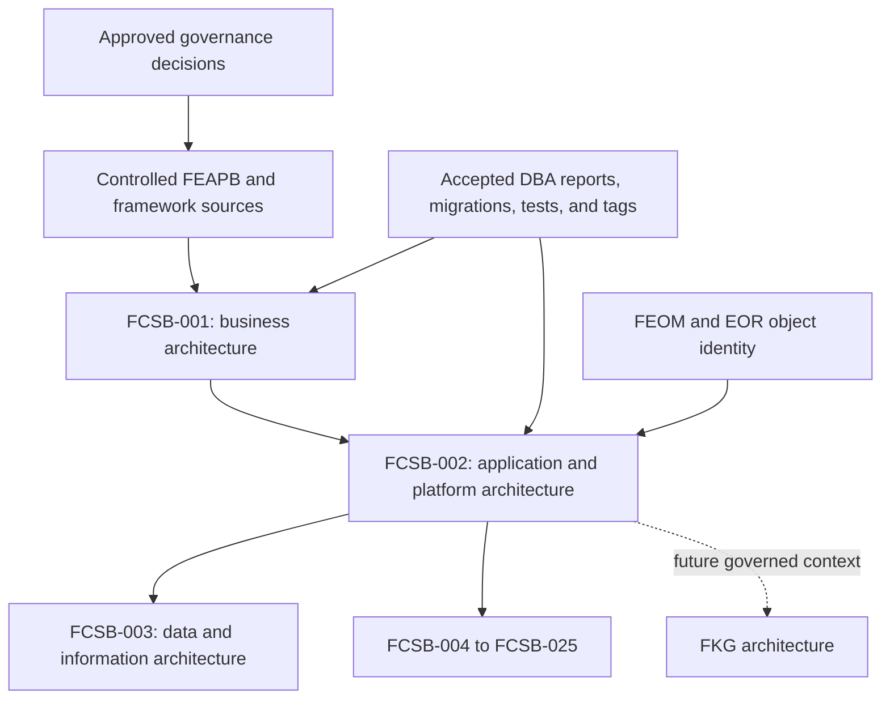

# Chapter 2 — Architecture Executive Summary

FlowCraft currently uses an npm-workspace monorepo with a Next.js App Router web application, a NestJS modular-monolith API, a Prisma 6.19.3 data-access layer, and PostgreSQL 16 in the supplied Docker Compose development topology. The web application calls the API over HTTP; it has no direct database access. The API composes platform and domain-oriented NestJS modules into one process and applies a global `/api/v1` prefix and validation pipe. Prisma owns schema mapping and accepted additive migrations.

The accepted implementation is a **platform foundation**, not a complete ERP runtime. DBA-002 implements identity/access, tenant/company/branch context, EOR/FEOM metadata, Digital DNA, workflow definitions, number series, audit, and basic customization/report/layout/transaction foundations. DBA-003 adds effective-dated enterprise structure, hierarchy history, inheritance, and organization access. DBA-004 adds governed enterprise master data, resource registration, validation, duplicate checks, import/export job metadata, organization-aware access, audit, and administrative routes.

Manufacturing is the product anchor, but current item strategies, warehouses, batches, serials, transaction types, and illustrative dashboard content are foundations or demonstrations. They are not an inventory ledger, MRP engine, production execution runtime, financial posting engine, quality system, or maintenance system. Likewise, no production event bus, queue, distributed cache, workflow-instance engine, knowledge graph, or governed AI runtime is evidenced.

The target is a governed modular platform: domain modules own business rules; neutral platform services provide identity, scope, object metadata, workflow, numbering, audit, reporting, and configuration; synchronous invariants remain local and transactional; versioned events and queues are introduced only with operational need; and metadata moves through explicit edit, validation, publication, promotion, execution, and rollback states. Service splitting must follow measured coupling, scale, resilience, or team-ownership evidence rather than fashion.

# Chapter 3 — Architecture Principles

| Principle | Official rule | Why it matters to FlowCraft |
|---|---|---|
| Modular monolith first | Continue one deployable NestJS API while enforcing internal module contracts. | Current scale and maturity favor transactional simplicity and rapid domain learning. |
| Domain boundaries before service splitting | Define ownership, commands, queries, data, and events before any extraction. | A network boundary cannot repair unclear business ownership. |
| Backend-enforced security | The API must authenticate, authorize, and scope every protected operation. | Browser controls can be bypassed; tenant and organization isolation cannot depend on UI state. |
| API-first behavior | Supported application behavior is exposed through governed API contracts. | Web, mobile, integrations, automation, and future services need one policy-enforcing entry point. |
| Metadata-driven configuration | Governed metadata should control approved variation where semantics are stable. | Customers need adaptation without source forks. |
| Historical preservation | Published versions, effective dates, identities, and business history are retained. | Manufacturing, finance, quality, and audit decisions must remain explainable. |
| Additive database evolution | Accepted migrations are immutable; change proceeds by reviewed forward migration. | Deployed databases and historical evidence cannot be reconstructed safely from rewritten history. |
| Upgrade-safe extension | Extensions use controlled fields, objects, workflows, reports, layouts, APIs, and packages. | Product upgrades must not depend on untracked customer code changes. |
| Tenant and organization awareness | Tenant is mandatory; company, branch, and organization scope are explicit where relevant. | Multi-company manufacturing requires isolation plus delegated operating scope. |
| Observable operations | Requests, jobs, integrations, and events must become diagnosable by correlation and metrics. | Operational ERP failures require support evidence, not guesswork. |
| Idempotent processing | Retried commands, seeds, imports, webhooks, and event consumers must avoid duplicate effects. | Networks, operators, and schedulers retry work. |
| Transactional consistency | Business invariants use explicit transaction boundaries and concurrency controls. | Numbers, postings, inventory, approvals, and genealogy cannot tolerate silent partial writes. |
| Event-ready, not event-assumed | Domain outcomes should be expressible as versioned events without claiming a bus exists. | This preserves an evolution path while avoiding premature infrastructure. |
| No direct frontend database access | Next.js communicates through the API only. | It keeps authorization, validation, audit, and data ownership on the server. |
| No ungoverned customer forks | Customer-specific code requires architecture approval, ownership, compatibility tests, and a versioned package. | Forks multiply security and upgrade risk. |

These principles are review criteria. A feature proposal that violates one must record the reason, alternatives, consequences, owner, and sunset or remediation path in an architecture decision.

# Chapter 4 — Current Logical Architecture

The current solution is a three-runtime application in its supplied Compose topology. The browser renders the Next.js application and stores the current bearer token and user summary in browser local storage. Client components call a shared fetch wrapper or direct `fetch`. The NestJS API authenticates protected requests, composes modules, applies DTO validation where DTOs exist, and accesses PostgreSQL through an injected Prisma service. Migrations and the idempotent seed live with the API schema; root workspace scripts orchestrate generation, build, test, migration, and seed commands.

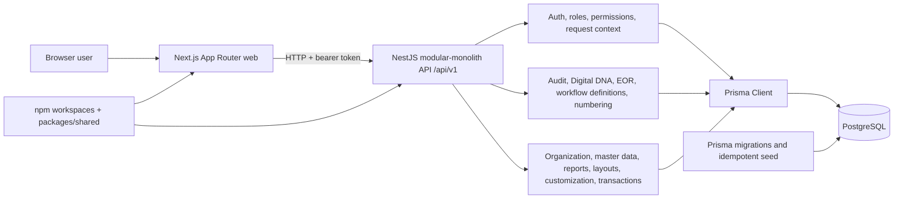

Current shared code is small: `packages/shared` exports module constants, manufacturing-flow labels, and related types. It is not yet a comprehensive contract or domain package. Authentication, platform modules, organization, and master data have stronger DTO/service patterns than the preserved legacy reports, layouts, customization, and transaction services, which still accept flexible `any` payloads. Docker Compose supplies PostgreSQL, API, and web services, but it is a development-oriented topology rather than a complete production operations design.

# Chapter 5 — Target Logical Architecture

The target is a layered logical model within the modular monolith first. Layers are responsibilities, not mandatory processes or repositories.

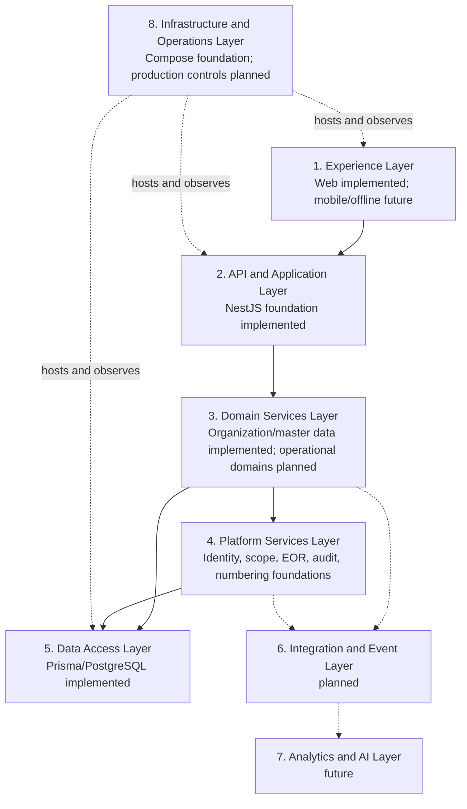

| Layer | Responsibility | Maturity at this baseline |
|---|---|---|
| Experience | Web, future mobile/offline, navigation, forms, visualization, accessibility | Web administrative foundation; operational experiences planned |
| API and Application | Controllers, commands, queries, DTOs, guards, orchestration, versioned contracts | Implemented foundation with uneven typing and error conventions |
| Domain Services | Domain invariants, lifecycle, calculations, approvals, posting decisions | Organization/master data partial; operational ERP domains planned |
| Platform Services | Cross-domain neutral capabilities and governed metadata | Several implemented foundations; publication/execution runtime partial or planned |
| Data Access | Persistence mapping, transactions, migrations, query performance | Prisma/PostgreSQL implemented foundation |
| Integration and Event | Adapters, webhooks, messaging, files, external contracts | File job metadata partial; runtime planned |
| Analytics and AI | Semantic analytics, FKG, governed AI, model controls | Future |
| Infrastructure and Operations | Containers, configuration, telemetry, resilience, delivery | Development Compose and health foundation; production depth planned |

Dependencies should point downward or through explicit application contracts. Experience code must not import Prisma. Domain modules may consume neutral platform interfaces but must not move business rules into platform services. Integration adapters translate external contracts at the edge.

# Chapter 6 — Monorepo Architecture

The root package defines npm workspaces for `apps/*` and `packages/*`. `apps/web` owns the Next.js experience; `apps/api` owns NestJS, Prisma schema, migrations, seed, and API tests; `packages/shared` owns a small cross-application constant/type surface. Root scripts fan out development, build, lint, test, Prisma generation, migration, and seed operations. Prisma configuration at the root resolves the API schema, migration directory, and seed command. Both Dockerfiles use the repository root as build context and install workspace dependencies before building the relevant application.

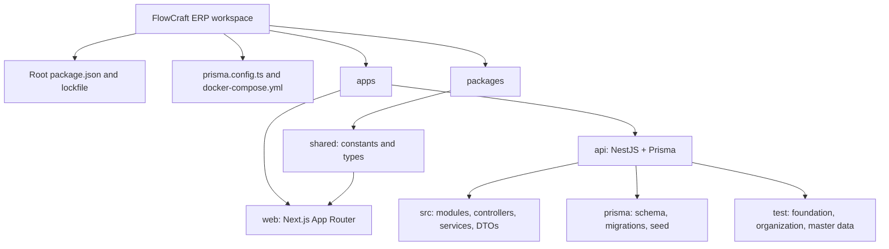

The monorepo provides atomic changes, consistent tooling, one dependency graph, and easy sharing. Risks are broad build context, unintended cross-domain imports, dependency version drift, and a shared package becoming an unowned dumping ground. Boundary rules are therefore:

- application code imports shared public contracts, never another application's internal files;
- API domain modules do not reach into another module's Prisma entities as a substitute for an application contract;
- generated Prisma types remain server-side unless deliberately mapped to transport types;
- shared packages contain stable, versionable contracts or utilities with named ownership;
- build and test scripts remain runnable per workspace and at root;
- schema generation precedes code that consumes generated Prisma types.

Without restructuring now, a future workspace may add `packages/contracts` for versioned API/event schemas, `packages/ui` for governed design-system components, `packages/testing` for fixtures, and `packages/config` for shared lint/TypeScript rules. Domain packages should be added only when ownership and reuse justify them; moving every module into a package would create ceremony without isolation.

# Chapter 7 — Frontend Application Architecture

The web application uses the Next.js App Router. Current routes are filesystem pages for login, dashboard, customization, settings, and studio areas; the accepted build reported 64 static routes. There are no evidenced dynamic record route segments. `AppShell` supplies desktop navigation, header, and theme control. Client components use React `useState`, `useEffect`, `useMemo`, and `useCallback`; native forms and browser prompts handle many edits. `apiFetch` centralizes base URL, JSON headers, bearer token, no-store behavior, and a generic failure, although several callers currently pass an already versioned path while the client also prefixes `/api/v1`. That inconsistency must be normalized.

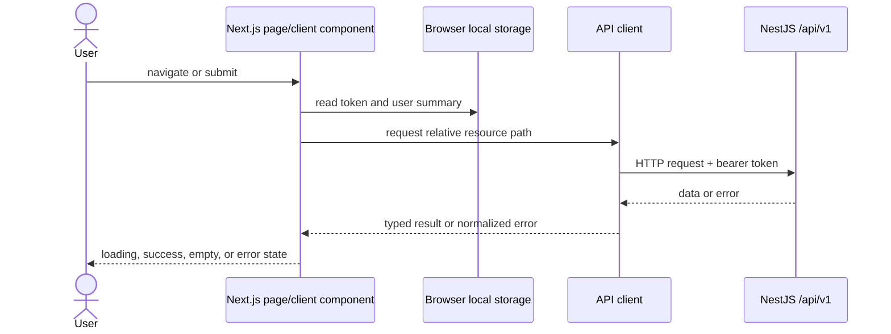

Current settings and master-data screens demonstrate search, filters, pagination, create/edit/archive actions, loading, error, and empty states. Some controls inspect locally stored roles and permissions to hide actions. This improves usability but is not authorization; the API remains authoritative. The dashboard and customization showcase contain static illustrative business values and local-only interactions and must not be represented as live operational modules.

The target frontend architecture should provide:

- one authenticated API client with exactly one version-prefix convention, typed request/response mapping, standard error objects, correlation display, cancellation, and retry rules;
- an app-level session boundary with expiry/logout behavior and a reviewed token strategy; browser local storage is the current implementation, not the final security decision;
- route groups and layouts by experience/domain, with dynamic detail routes only when URL ownership and access checks are defined;
- shared form primitives, schema-derived validation where appropriate, dirty-state protection, accessible labels, keyboard operation, focus management, and field-level errors;
- predictable loading, error, empty, forbidden, not-found, and stale-data states;
- permission-aware navigation and actions as convenience, always backed by server checks;
- responsive table/card alternatives for manufacturing workstations and smaller screens;
- a governed state approach: local component state by default, server-state caching only when its invalidation model is explicit, and no global store without cross-route need.

# Chapter 8 — Backend Application Architecture

`AppModule` composes the API from NestJS modules. Controllers define HTTP routes, guards, parameters, and DTO binding; services contain persistence orchestration and business checks; Prisma is injected through `PrismaModule`. `main.ts` enables CORS, the global `/api/v1` prefix, and a whitelist/transform/forbid-non-whitelisted validation pipe. Foundation, organization, EOR, workflow, and number-series areas use explicit DTOs and guards. Master data uses a validated wrapper with a governed internal field registry but accepts resource-shaped objects. Preserved report, layout, customization, and transaction endpoints still contain `any` payloads and require typed follow-up.

The JWT guard verifies the bearer token, reloads the active non-deleted user and assignments from PostgreSQL, and builds the request user context. Permission and role guards enforce route metadata. Tenant context and organization scope services apply further checks; DBA-003/004 services enforce tenant/company/node scope in application services. Audit is called explicitly by relevant services. There is not yet a global request-correlation middleware, uniform exception envelope, full OpenAPI bootstrap, or general repository abstraction.

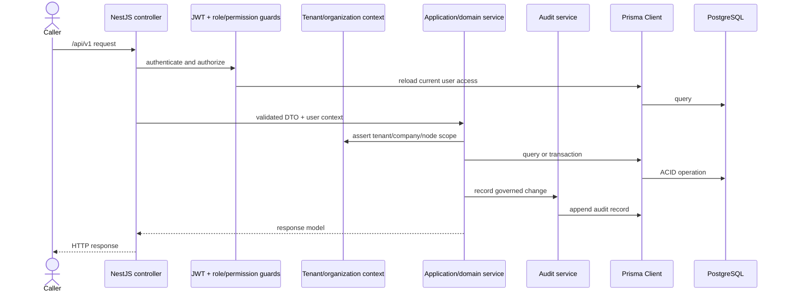

Target rules are: controllers remain thin; domain/application services own invariants; DTOs are explicit and versioned at external boundaries; request context is immutable after authentication; tenant and organization scope is required by construction; cross-module writes use application contracts; exceptions map to one error shape; and API deprecation is deliberate. A repository layer is optional, not dogma: introduce it where aggregate persistence, test substitution, or provider independence brings value, while avoiding pass-through abstractions over every Prisma call.

# Chapter 9 — Domain Boundary Model

Domain ownership separates business meaning from reusable mechanics. A shared kernel should contain only stable primitives such as identifiers, money/value semantics once approved, effective-period concepts, actor/context types, error contracts, and versioned integration envelopes. Prisma models are not automatically shared-kernel contracts.

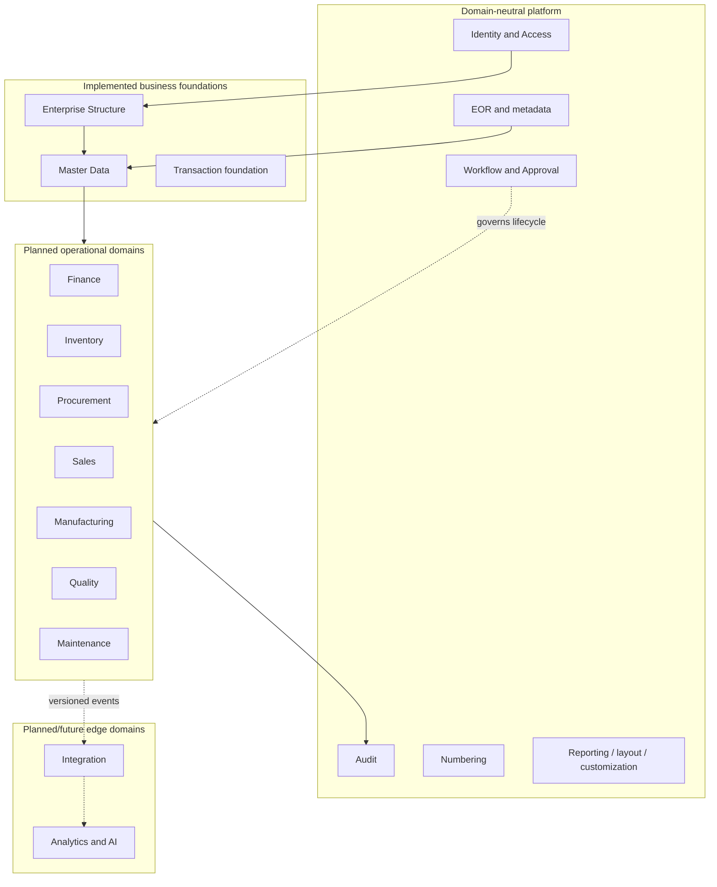

| Boundary | Owns | Current state |
|---|---|---|
| Identity and Access | users, roles, permissions, assignments, authentication context | Implemented foundation |
| Enterprise Structure | typed organization records, hierarchy, effective relationships, inheritance, access scope | Implemented foundation |
| Master Data | governed geography, UOM, items, warehouses, partners, terms, tax and governance services | Implemented foundation |
| Workflow and Approval | definitions/versions now; instances, tasks and escalation later | Definition foundation; runtime planned |
| Audit | append-only business-change evidence and redaction | Implemented foundation |
| Numbering | governed, serializable sequence allocation | Implemented foundation |
| Reporting, Print Layout, Customization | definitions and basic APIs | Partial foundations |
| Transactions | generic documents and links | Partial/conceptual foundation; not an operational UFT |
| Finance, Inventory, Procurement, Sales | operational rules, posting, ledgers, fulfillment | Planned |
| Manufacturing, Quality, Maintenance | planning/execution, inspection, reliability | Planned |
| Integration | external contracts, adapters, events and file exchange | Planned |
| Analytics and AI | analytical models, FKG, governed AI consumption | Future |

Each domain owns its rules, lifecycle, write APIs, and event vocabulary. A shared platform service may supply workflow or audit mechanics but must not decide, for example, whether an inventory receipt is postable or a production order may close. Those decisions belong to the operational domain.

# Chapter 10 — Platform Services Architecture

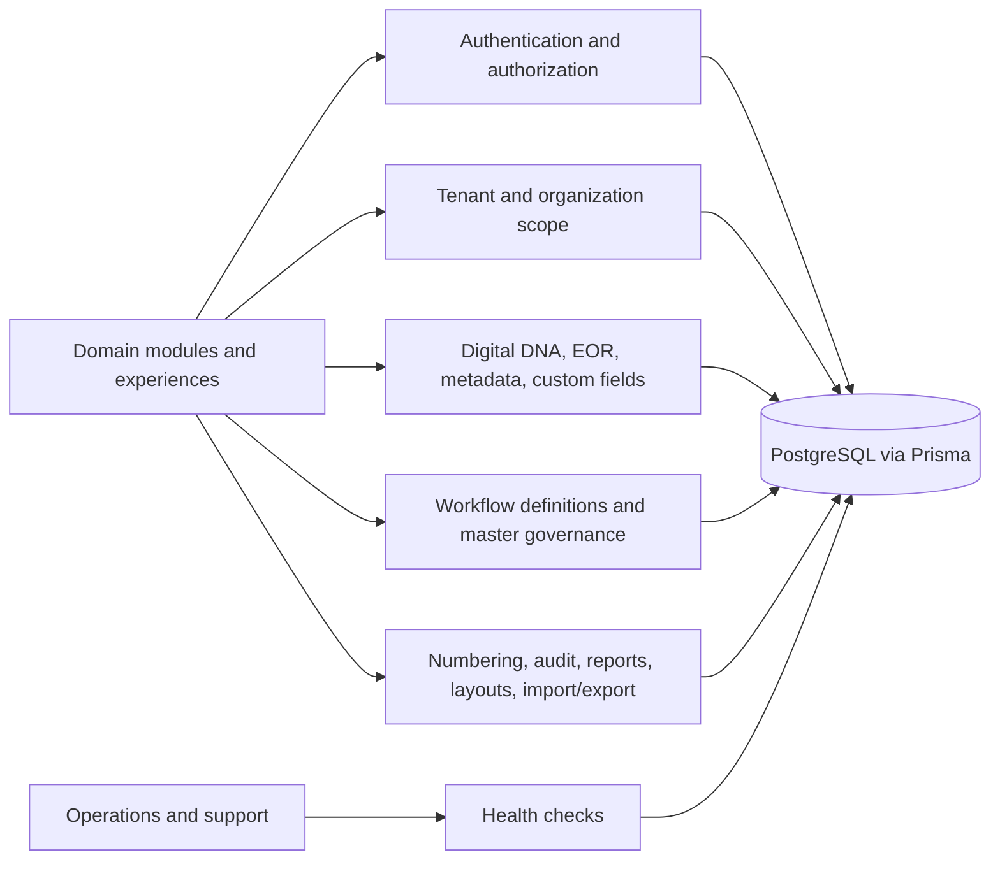

| Service | Purpose | Current status | Consumers | Ownership | Future direction |
|---|---|---|---|---|---|
| Authentication | Verify credentials and issue JWT access | Implemented foundation | Web and API callers | Identity and Access | Session policy, MFA, SSO/OIDC, service identities |
| Authorization | Resolve roles/permissions and guard actions | Implemented foundation | Protected API modules | Identity and Access | Policy composition, segregation-of-duties controls |
| Tenant context | Require tenant and constrain company/branch context | Implemented foundation | Foundation and domain services | Platform Security | Context-by-construction and automated isolation tests |
| Organization scope | Enforce effective node access and descendants | Implemented foundation | Organization and master data | Enterprise Structure / Security | Reusable policy integration across operational domains |
| Digital DNA | Generate immutable cross-lifecycle identity | Implemented foundation | Tenant, organization and master services | Data Governance | Canonical coverage and external-reference rules |
| Enterprise Object Registry | Register objects, fields, relations, capabilities and routes | Implemented foundation | Studio, permissions, governance, future runtimes | EOR Steward | Published registry versions and runtime resolution |
| Workflow definitions | Version definitions, steps/transitions and publication | Implemented definition foundation | Governed objects and future transactions | Workflow Platform | Runtime instances, tasks, timers and exception handling |
| Metadata | Represent object/configuration definitions | Partial | EOR, customization, future Studio | Platform Architecture | Publication, caching, promotion, rollback and runtime APIs |
| Custom fields | Define fields and store values | Partial | Customization and selected records | Customization Platform | Typed validation, indexing, versioning and package ownership |
| Number series | Configure and allocate concurrent numbers | Implemented foundation | Numbered objects and future documents | Platform Services | Reservation/recovery policies and period-aware sequences |
| Audit | Append governed changes with trace identity and redaction | Implemented foundation | Organization, workflow, numbering, master data | Audit Platform | Request correlation, retention, export and security-event integration |
| Reporting definitions | Define fields/filters and preview recent transactions | Partial foundation | Administrative reporting UI/API | Reporting Platform | Secure semantic queries, drill-down, scheduling and rendering |
| Print-layout metadata | Store templates, sections and bindings | Partial foundation | Customization and future documents | Document Experience | Renderer, version lifecycle, preview, storage and audit |
| Import/export jobs | Record validation/dry-run rows and export metadata | Partial foundation | Master data | Data Movement | Binary parsing, durable files, async execution, cancellation and rollback orchestration |
| Master-data governance | Validate, archive, detect duplicates, record requests/merges | Implemented foundation | Operational domains | Master Data | Workflow-backed stewardship, survivorship and governed merge execution |
| Health checks | Confirm API and database query viability | Implemented basic check | Operators and Compose users | Operations | Liveness/readiness separation, dependency detail and telemetry |

Platform neutrality is a hard boundary. A neutral service can answer “does this actor have permission?” or “allocate the next number”; it must not answer domain questions such as “may this invoice post?” unless the Finance domain supplies that policy.

# Chapter 11 — Enterprise Object Registry Runtime

The EOR is the common catalog for enterprise object identity. `EnterpriseObject` records hold stable object code/name, type, category, family, owner module, framework, table and API hints, lifecycle status, version, and support flags. `ObjectField` records describe field code, label, data type, required/unique/search/filter/sort/display behavior, default and validation metadata. `ObjectRelationship` links source and target objects with relationship name, type, cardinality, requirement, and cascade rule. Capabilities indicate whether an object is expected to support workflow, audit, attachments, custom fields, import, export, reports, print, or AI. Object-action `Permission` records connect this catalog to authorization.

The seed registers the first 50 foundation objects plus DBA-003 and DBA-004 additions, and uses upsert/duplicate-safe operations to preserve code identity. API paths and owner modules make governance and discovery possible. Object family groups related semantics; framework and FEOM codes protect cross-release references. Codes must not be repurposed when implementation changes. A renamed display label may evolve, but a published object identity remains stable or is superseded explicitly.

Current runtime use includes object/field/relationship CRUD, registry browsing, permission generation, workflow references, audit references, number-series references, and master-data governance. Governance use includes capability review, ownership assignment, route discovery, change impact, and future package compatibility. However, registry metadata does **not** automatically create a database table, secure controller, business service, form, validation runtime, workflow instance, report, or integration. The current EOR is an implemented metadata foundation, not a complete low-code runtime engine.

Target publication should distinguish draft metadata from an immutable published registry version. A consuming runtime must resolve a published version, validate compatibility, cache safely, and emit the version used in audit or execution evidence.

# Chapter 12 — Metadata Execution Architecture

FlowCraft metadata is intended to describe objects, fields, validations, forms, workflows, reports, print layouts, permissions, menus, notifications, and business rules. Execution must never mean “interpret arbitrary JSON everywhere.” Every metadata family needs a schema, validator, owner, publication state, compatibility policy, execution adapter, security model, and evidence trail.

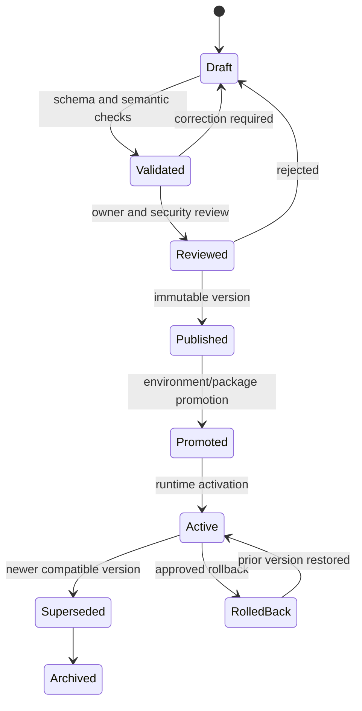

| Concern | Required target behavior | Current evidence |
|---|---|---|
| Definition | Typed schemas identify owner, target object, scope, version, dependencies, and effective period | Object/workflow/report/layout/custom-field models exist; conventions vary |
| Publication | Approval freezes an immutable version separate from editable draft | Workflow publication exists; generalized metadata publication is planned |
| Execution | Named adapters convert published metadata into bounded runtime behavior | Partial bespoke consumption; no universal executor |
| Caching | Cache keys include tenant, scope, metadata identity and version; invalidation follows activation | Planned; no distributed cache evidenced |
| Versioning | Compatible and breaking changes are classified; running records retain used version | Workflow versions exist; broader metadata versioning partial |
| Promotion | Signed/versioned packages move through environments after validation | Planned |
| Rollback | Activation pointer can return to a known compatible version without deleting history | Planned |

Object metadata may guide standard CRUD and discovery, but domain commands still enforce business rules. Field metadata may render or validate a configured field, but cannot bypass server DTO and domain validation. Menu metadata may hide unavailable destinations, but cannot grant permission. Notification metadata defines recipients/templates/channels, while delivery uses a governed asynchronous service. Business-rule metadata must use a constrained expression model with deterministic inputs, resource limits, versioning, test cases, and no arbitrary server code.

# Chapter 13 — Universal Transaction Architecture Foundation

Future FlowCraft transactions should share a recognizable envelope while preserving domain ownership. The conceptual envelope includes transaction identity and Digital DNA where approved; header and lines; source and destination references; lifecycle status; workflow and approval state; actor/time audit; attachments and notes; amounts and currency; tenant/company/branch/organization scope; accounting and inventory impacts; event publication; reporting projections; and integration references.

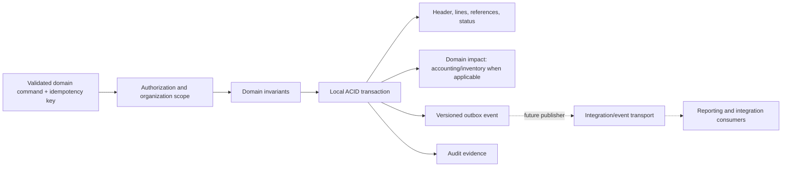

The existing `TransactionDocument` and `TransactionLink` models provide generic document identity, status, amount/currency, JSON payload, creator, links, and approval associations. The API can list/create documents and upsert links. This is a **partial foundation**, not proof of a governed universal transaction runtime: it lacks line models, idempotency, explicit organization scope, posting orchestration, event outbox, typed per-kind commands, and complete permission/audit enforcement.

The common envelope must not become a “god table” that hides domain constraints in opaque payloads. Finance owns posting and ledger invariants; Inventory owns movement and availability; Procurement owns purchasing lifecycle; Manufacturing owns production consumption/completion and genealogy. Shared transaction services should coordinate identifiers, links, lifecycle evidence, and cross-domain references. FCSB-009 will formalize the Universal Transaction Framework, including identity, state machines, links, corrections, posting effects, events, and extensibility.

# Chapter 14 — Universal Document Architecture Foundation

A universal document model is the common lifecycle for governed business documents and master-record evidence. Its target attributes are document number, Digital DNA where applicable, version, revision, status, effective date, owner, approval, workflow version/instance, notes, attachments, print-layout version, history, cancellation, correction, reversal, and archival state.

Transaction documents use this model when they represent an operational commitment or posting. Master records use compatible identity, effective dating, approval, notes/attachments, and history but are not transactions. A purchase order may be revised or cancelled; a posted invoice requires correction or reversal rather than destructive editing; an item master may be archived while historical transaction references remain valid. These semantics must remain explicit rather than collapsing every lifecycle into one status list.

Current evidence includes number series, Digital DNA services, effective-dated masters and organization relations, workflow definitions, approval tables, report/print definitions, audit history, transaction documents/links, and archive behavior. Attachments, full revision control, generalized corrections/reversals, archival policy, and render-version binding are planned. FCSB-010 will define the Universal Document Framework and its relation to transactions, masters, records, files, signatures, and retained outputs.

# Chapter 15 — Workflow Definition and Runtime Direction

The current workflow foundation stores tenant/company/object-aware definitions, versions, steps, transitions, published status, effective dates, and creator/updater identity. Services create a new incremented version, reject edits to a published version, publish with an audit record, and reorder draft steps. Permissions govern view/create/edit/approve/configure routes. This is valuable definition governance.

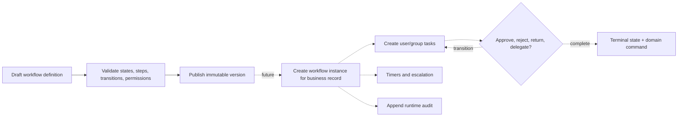

Target definitions include named states, entry/exit rules, ordered or conditional steps, authorized transitions, publication approval, effective periods, and version compatibility. Runtime introduces instances bound to the exact published definition; tasks; actor/group assignment; serial and parallel approvals; delegation; timers; escalation; reminders; exception and retry handling; cancellation; compensation hooks; and append-only decision evidence. The workflow engine coordinates process, but a domain service validates and executes business state changes.

No repository evidence shows a general workflow-instance/task engine, timer scheduler, delegation service, parallel approval runtime, escalation worker, or exception queue. Existing approval models are schema foundations and illustrative screens are not proof of runtime. FCSB-011 must define these semantics before broad operational adoption.

# Chapter 16 — FlowCraft Studio Platform Direction

FlowCraft Studio is the future governed environment for product and customer configuration. It is not simply a collection of editors. It must separate draft editing from validation, security review, publication, packaging, promotion, activation, comparison, and rollback.

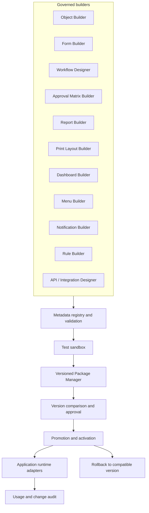

The Object Builder governs objects, fields, relationships and capabilities. Form Builder governs layouts, controls and accessibility. Workflow and Approval Matrix builders govern definitions and authority. Report, Print Layout, Dashboard, Menu, Notification, and Rule builders govern their bounded metadata types. API/Integration Designer governs contracts and mappings, not arbitrary credentials. Package Manager binds dependencies and compatibility, while comparison shows semantic differences before approval. Promotion moves an immutable version through environments. Rollback changes activation to a previously validated compatible version. Test Sandbox runs metadata against isolated fixtures and security scenarios.

Current studio routes expose object registry, workflow, and number-series administration; customization/report/print screens show early builder concepts. The customization showcase contains local-only interactions, and no universal publication/package/promotion/rollback runtime exists. FlowCraft Studio is therefore a **future governed platform direction** built on partial implemented foundations.

# Chapter 17 — API Architecture

All current controllers inherit the global `/api/v1` prefix. Resource-oriented routes exist for authentication, companies, branches, users, roles, currencies, exchange rates, enterprise objects, workflows, number series, organization, master data, customization, reports, print layouts, transactions, dashboard, and health. List DTOs support page, page size, search, status, sort field, and sort order in several modules. The global validation pipe strips/forbids unknown properties for typed DTOs. Master data supplies a route document at `/api/v1/master-data/openapi`; the application does not currently bootstrap a general Swagger/OpenAPI document.

Target API standards are:

| Area | Standard |
|---|---|
| Resources and commands | Use nouns for resources and explicit command endpoints for lifecycle operations such as `publish`, `archive`, `post`, `reverse`, or `preview`. |
| DTO validation | Every external payload has typed validation; metadata polymorphism uses discriminated, versioned schemas rather than `any`. |
| Pagination/filter/sort/search | One response envelope and allowlisted fields/operators; stable sort includes a deterministic tie-breaker. |
| Errors | One versioned error shape with code, message, field details, correlation ID, retryability, and safe context. |
| Idempotency | Required for externally retryable create/post/import commands; scope keys by tenant, operation and actor/client. |
| Authentication/authorization | Bearer or future service identity; permission and organization checks precede business effects. |
| Audit | Record governed intent and outcome without leaking secrets; do not confuse operational logs with audit. |
| Versioning/deprecation | `/api/v1` remains stable; breaking change requires new version or compatible evolution, published notice, and telemetry-backed retirement. |
| Rate limiting | Planned at public/auth/integration boundaries with tenant-aware policies. |
| Correlation IDs | Accept or create a validated identifier, propagate it to logs, audit, jobs, events, and responses. |
| Bulk APIs | Explicit per-item outcome, limits, validation mode and idempotency; never unbounded generic arrays. |
| Async APIs | Return a durable job identity, accepted state, status/progress URL, cancellation policy and result/error reference. |

Current gaps include generic error handling in the web client, uneven DTO typing, no evidenced global rate limiter, no general correlation middleware, and no governed async worker runtime. API callers should pass an unversioned resource path to one shared client; today some web calls include `/api/v1` twice by construction risk, so path ownership needs a single tested convention.

# Chapter 18 — Application Security Architecture

Current login compares bcrypt password hashes, rejects inactive/deleted/non-active users, records last login, and issues a signed JWT. The JWT guard verifies the token and reloads the current user, active role assignments, and allowed permissions from PostgreSQL on each protected request. The request context carries tenant, default company/branch, roles, permissions, and Super Admin state. Permission and role guards protect controllers; tenant and organization services enforce deeper scope. Super Admin bypass is explicit and the login payload omits redundant permissions to constrain header size.

Company, branch, and organization scope are related but not interchangeable. Tenant isolation is mandatory. Company/branch defaults provide basic context. Explicit `CompanyAccess`, `BranchAccess`, and effective `UserOrganizationAccess` records support authorization scope. Descendant access is deliberate. Operational domains must call scope policy before queries and writes, not filter after retrieving data.

The frontend currently stores the JWT and user summary in local storage. It hides some actions based on stored permissions, but this is neither current-state revocation authority nor a secure authorization boundary. Session expiry is governed by JWT configuration; the UI does not yet evidence a complete expiry, refresh, idle timeout, or centralized logout strategy. Security owners must review token storage, XSS defenses, CORS, cookie alternatives, CSRF implications, and browser session behavior in FCSB-005.

MFA and SSO/OIDC are future. Service-to-service identity is planned and must use separate principals, audience-restricted credentials, rotation, and least privilege rather than reusing user tokens. Secrets belong in environment/secret-management facilities and must never enter source, metadata packages, logs, events, or audit snapshots. Current audit sanitization redacts credential-like keys; deep security logging, threat modeling, key management, privacy, and assurance remain for FCSB-005.

# Chapter 19 — Data Access Architecture

Prisma Client 6.19.3 is the primary ORM and schema contract. `PrismaService` is globally available through the API's Prisma module. Controllers generally delegate to services; accepted DBA-003/004 controllers do not query Prisma directly. Services build scoped queries, use explicit includes/selects, translate known uniqueness conflicts, and apply transactions where multi-record invariants require them.

Transaction boundaries are visible in hierarchy creation/moves, paginated list/count operations, step reordering, and number generation. Number allocation uses a serializable Prisma transaction. Future posting, inventory movement, costing, approval completion, and outbox creation require deliberate transactions around all strongly consistent effects.

Current schema patterns include UUID identities, foreign keys, compound unique constraints, search/scope indexes, soft deletion for governed entities, effective dates and relationship history, and JSON/JSONB-compatible Prisma `Json` fields for bounded metadata/payloads. JSON is appropriate for versioned flexible metadata, snapshots, and extension values; it must not hide frequently constrained, joined, indexed, or financially authoritative fields. FCSB-003 will define canonical ownership, lineage, retention, effective dating, history, JSON boundaries, indexing, and partitioning.

Migrations are append-only accepted artifacts. DBA-003 and DBA-004 migrations are additive; DBA-004 contains no dropped accepted table/column. Seeds use upsert and duplicate-safe creation and create no stock balances. Raw SQL is appropriate only for justified database features, performance-critical reviewed queries, migration/backfill work, or health checks such as the current `SELECT 1`; it requires parameter safety, tests, explain-plan evidence where relevant, and ownership. Controllers must not gain direct Prisma access, and services should not reach across domains through another domain's tables when an application contract is required.

# Chapter 20 — Consistency and Transaction Management

Strong consistency is required inside a domain invariant: unique master identities, number allocation, workflow transition plus authoritative status, financial journal balance and posting, inventory movement plus on-hand effect, production issue/completion and genealogy, quality hold/release state, and effective organization changes. These should complete atomically in one PostgreSQL transaction while they share the current database.

Cross-domain processes should not expand one database transaction indefinitely. A local transaction commits the owning domain state, audit reference, and future outbox event. Other domains respond idempotently. An outbox pattern is **planned**, not implemented: the business write and event record commit together; a governed publisher later delivers the versioned event. Consumers store event/idempotency identity before effects and use bounded retries.

| Mechanism | Use |
|---|---|
| ACID/local transaction | Invariants within one owning domain and database boundary |
| Idempotency key | Prevent duplicate command or integration effects under retry |
| Retry | Transient failure only, with bounded exponential policy and observability |
| Compensation | A new governed action that counteracts a completed distributed step |
| Correction | Preserve original record and issue an authorized correcting record |
| Reversal | Negate a posted accounting/inventory effect with linked evidence |
| Saga | Coordinate long cross-domain sequences through explicit states and compensations; use only when justified |
| Eventual consistency | Read models, notifications, analytics, and non-critical cross-domain propagation |

Manufacturing and finance require special discipline. Ledger posting, inventory quantity/value effects, serial/batch uniqueness, production consumption/completion, and journal balance remain strongly consistent at their authoritative boundary. Dashboards, search indexes, notifications, external acknowledgements, and analytical projections may lag with a visible freshness contract. A workflow may coordinate domains, but it must not conceal partial completion; every step needs state, idempotency, timeout, and recovery semantics.

# Chapter 21 — Business Event Architecture Direction

FlowCraft should distinguish event purpose. **Domain events** record an outcome inside a bounded context. **Integration events** expose an approved subset to other contexts or external systems. **Audit events** preserve governed actor/change evidence. **Notification events** request human or channel communication. **Analytical events** feed authorized projections and metrics. One occurrence may cause several event types, but they have different schemas, retention, access, and consumers.

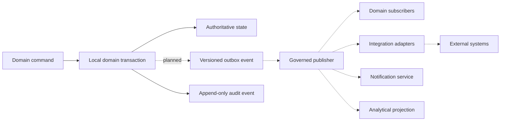

Every future event envelope should carry event ID, event type, schema name/version, occurred timestamp, recorded timestamp, actor/service principal, tenant, relevant organization scope, aggregate/object identity and version, correlation ID, causation ID, and a classified payload. Replay requires idempotent consumers, version-aware upcasters or compatibility policy, retention rules, authorization, and clear distinction between reprocessing and repeating a business action. Sensitive fields are minimized; audit is not reconstructed solely from a transient event stream.

Illustrative domain outcomes include `SalesOrderCreated`, `PurchaseOrderApproved`, `MaterialShortageDetected`, `ProductionScheduleReprioritized`, `InventoryReceiptPosted`, `QualityHoldApplied`, and `InvoicePosted`. Names and schemas are proposals until their owning domain volume approves them. For example, `InventoryReceiptPosted` should follow the atomic inventory posting, not merely a UI click; `InvoicePosted` should reference balanced immutable accounting evidence.

No production event bus, Kafka, Redis Streams, broker, outbox publisher, or event consumer runtime exists in the repository. The target is event-ready architecture, not an implemented event platform. Transport selection belongs to evidence-based integration/operations decisions.

# Chapter 22 — Background Processing Architecture

Long-running, scheduled, compute-heavy, or externally retried work should leave request threads and run as durable jobs. Candidate workloads are imports and exports, large reports, notifications, MRP, capacity planning, cost calculation, reconciliation, integration polling, document rendering, data-quality scans, and package validation/promotion.

A governed job has job type/version, tenant and organization scope, requester, permission snapshot or execution principal, correlation/idempotency identity, input reference, priority, status, progress, attempt count, timestamps, cancellation policy, result reference, classified errors, and audit links. Workers claim work with visibility/lease semantics, heartbeat long tasks, checkpoint only at safe boundaries, and never assume “at least once” delivery means “execute effects more than once.” Retries are bounded and error-classified. Exhausted work enters a dead-letter or operator-review state with safe replay controls.

Cancellation is cooperative: it prevents future checkpoints or effects but does not pretend committed work disappeared. MRP and planning should record the exact master, demand, supply, calendar, parameter, and software/configuration versions used. Cost calculation and reconciliation need deterministic input snapshots and reviewed publication of results.

Current master import/export records provide job metadata, validation-only/dry-run state, row outcomes, counts, rollback marker, audit, and export-ready metadata. They execute synchronously in the request path and do not evidence a queue, scheduler, worker fleet, durable file engine, cancellation runtime, or dead-letter handling. Background processing is planned and its transport must be selected with FCSB-004/FCSB-006 input.

# Chapter 23 — Reporting and Print Runtime Architecture

Current report definitions store module, base entity, fields, filters, grouping/aggregation/formula metadata, and settings. The report API lists/creates definitions and previews up to 50 recent transaction documents. It advertises spreadsheet and PDF formats but does not implement a complete export renderer. Print-layout definitions store document type, name, version, default flag, canvas metadata, sections, positions, styles, bindings, and content. The API stores/lists layouts; the customization UI illustrates a designer. This is a **partial foundation**.

The target report runtime resolves an approved definition, authorizes the report and every underlying data domain, constrains tenant/organization scope, validates filter/operator types, produces a query plan against approved semantic fields, enforces row/time/export limits, and records definition/data-freshness versions. Preview, drill-down, export, and scheduling must apply the same security. Excel and PDF generation run through durable background jobs for large outputs; stored outputs are encrypted/classified, time-limited, tenant-scoped, and audited.

The target print runtime binds a published template version to a document version, resolves approved data bindings, renders deterministically, supports preview, PDF and printer-appropriate output, stores retained outputs where business rules require, and records who generated or sent them. A layout cannot execute arbitrary code or query unrestricted tables. Cancellation, correction, and reprint behavior preserve the document and template versions used.

Reporting ownership is split deliberately: operational domains own facts and security; the reporting platform owns definition/runtime mechanics; data architecture owns semantic consistency; and business owners approve metrics. FCSB-013 will define analytical models, dashboards, schedules, exports, lineage, and governed self-service in depth.

# Chapter 24 — Customization and Extension Architecture

Extension depth increases risk. Configuration should be preferred, then governed metadata, then integration or plugin, with customer-specific source code as the exceptional last tier.

| Extension category | Governance and isolation | Versioning and compatibility | Security and testing | Promotion, rollback and ownership |
|---|---|---|---|---|
| Configuration | Allowlisted values scoped by tenant/company/organization | Schema and default version; compatibility checked on upgrade | Validate ranges, permissions and tenant isolation | Promote in package; revert value/version; business configuration owner |
| Custom field | Registered against a stable object; values isolated by tenant/record | Immutable field identity; type changes treated as migration | Server validation, field permission, indexing/load tests | Package metadata and data migration; Customization owner |
| Custom object | EOR identity and explicit persistence/runtime adapter; no shared-table ambiguity | Object/field/relationship versions and deprecation rules | Generated CRUD is insufficient without authorization, validation and threat tests | Package with migrations and rollback plan; EOR/domain owner |
| Custom workflow | Published definition bound to object/domain commands | Immutable published versions; running instances retain version | Transition authority, separation-of-duties and exception tests | Activate approved version; restore compatible predecessor; Workflow owner |
| Custom report | Approved semantic fields only; scoped query execution | Definition and metric versions | Row/field security, injection, volume and export tests | Promote definition; rollback activation; Reporting/business owner |
| Custom print layout | Sandboxed binding/rendering | Template/version bound to document output | No arbitrary code; sensitive-field and rendering tests | Promote template; revert default pointer; Document Experience owner |
| Custom API | Explicit edge adapter or approved domain command; namespace isolation | Contract/schema version and deprecation policy | Authentication, authorization, validation, rate and abuse tests | Deploy/version independently where justified; Integration + domain owner |
| Plugin | Capability manifest, sandbox/process boundary where needed, least privilege | Signed package, platform compatibility range and dependencies | Supply-chain, permission, isolation, upgrade and failure tests | Controlled registry, staged rollout, disable/rollback; Platform owner plus publisher |
| External service | Adapter shields domain from vendor contract | Adapter contract version and provider portability decision | Service identity, secrets, data classification, timeout/circuit tests | Environment-controlled rollout and fallback; Integration owner |
| Customer-specific code | Architecture exception; no modification of accepted core files | Versioned package/fork policy with explicit supported baseline | Full security, regression, upgrade and ownership evidence | Customer-controlled release and exit plan; named commercial and technical owner |

All extension artifacts require identity, owner, tenant scope, dependencies, change history, status, test evidence, and support classification. Promotion must be immutable and environment-aware; production editing is not the publication process. Rollback restores a compatible prior artifact and never deletes historical evidence. Customer packages may extend approved seams but cannot redefine core object codes, bypass guards, rewrite accepted migrations, or access another tenant.

# Chapter 25 — Integration Seams

The application should expose stable seams without embedding external-system assumptions in domain services.

| Seam | Architecture boundary | Current state |
|---|---|---|
| REST APIs | Versioned synchronous commands/queries through NestJS | Implemented foundation |
| Webhooks | Signed, idempotent outbound notifications with delivery evidence | Planned |
| Event bus | Versioned integration events from governed outbox | Planned; no bus exists |
| File import/export | Validated mappings, jobs, files, row outcomes and retention | Job metadata partial; binary/file runtime planned |
| EDI | Canonical document mapping and partner agreement profiles | Future |
| Bank APIs | Finance-owned payment/statement adapters with strong identity and reconciliation | Future |
| Government APIs | Jurisdiction adapters for tax, invoice, customs, or labor obligations | Future |
| Power BI | Governed read/semantic model, not direct uncontrolled transactional access | Future |
| MES | Manufacturing command/event adapter with production identity and sequencing | Future |
| PLC/IoT | Edge gateway isolates protocols, timing, safety and device identity | Future |
| Barcode/RFID | Device/input adapter validates labels, scans, object identity and location context | Planned/future |
| Email | Notification adapter with template, recipient, consent and delivery status | Planned |
| Identity federation | OIDC/SAML or approved federation behind Identity and Access | Future |

Domain modules publish or consume canonical application contracts; adapters translate REST, file, EDI, device, or vendor formats at the edge. No adapter may write Prisma tables directly. Timeout, retry, idempotency, correlation, rate, security, data classification, mapping version, and reconciliation are mandatory seam concerns. Detailed protocols, canonical models, gateway topology, and partner onboarding belong to FCSB-004.

# Chapter 26 — Observability Architecture

Current foundations are a database-backed `/api/v1/health` check, append-only business audit records with trace IDs, and standard framework/container output. Audit sanitizes credential-like keys. There is no evidenced structured logging standard, request correlation middleware, distributed tracing, metrics registry, readiness/liveness split, queue telemetry, centralized error monitoring, or support-diagnostics package.

Operational logging and audit have different purposes. Logs explain runtime behavior and may be sampled/retained operationally; audit proves governed actor/business change and must be access-controlled and append-only. A correlation ID joins request, logs, audit, jobs, events, and external calls, while a trace ID models distributed spans when tracing exists. Neither should contain business secrets.

Target observability includes:

- structured JSON logs with timestamp, severity, service/version, environment, tenant-safe context, correlation/trace/span IDs, route/operation, outcome and duration;
- metrics for request rate/latency/error, authentication failures, database pool/query behavior, job age/retries/dead letters, event lag, integration health, report duration, and planning workloads;
- liveness for process viability and readiness for dependencies/ability to serve safely;
- database monitoring for connections, locks, slow queries, bloat, storage, replication when introduced, and migration state;
- security events for suspicious login, authorization denials, privilege/configuration change, secret access and unusual export activity;
- user-support diagnostics that expose safe correlation, version, environment, feature/package versions and recent operation state without credentials or unrestricted data;
- performance telemetry with percentiles and workload dimensions, not averages alone.

Alerting should map to user/business impact and an owned runbook. FCSB-006 will define tooling, retention, dashboards, alerts, on-call response and production readiness.

# Chapter 27 — Performance and Scalability Direction

No accepted capacity benchmark supports numeric claims about concurrent users, latency, planning scale, or ledger volume. Baseline budgets must therefore be established by measured workload tests before approval for production. Recommended budget categories are interactive API p50/p95/p99 latency, page shell and largest-content rendering, search/list response under scoped datasets, background-job completion, import throughput, planning runtime, database utilization, and error/timeout rates.

Large lists require server pagination, allowlisted sorting/filtering, deterministic order and indexed scope predicates. Search should begin with evidence-based PostgreSQL capabilities and move to a separate index only when relevance, language, scale, or workload isolation requires it. Caches need explicit source of truth, key scope, TTL/invalidation, version, stale behavior, and tenant isolation; no Redis or distributed cache is implemented today.

Index changes require query evidence and write-cost review. Partitioning is considered for large append-heavy ledgers/audit/events after access patterns and operational procedures are known. Read replicas may serve approved read workloads but cannot authorize or make decisions on stale state. Queues isolate long/burst workloads once a durable job architecture is approved. API containers should remain stateless aside from external dependencies before horizontal scaling; current browser and JWT behavior generally supports this direction, but jobs and files need external durable stores.

Large imports should stream/partition work, validate in bounded batches, checkpoint, expose progress, and avoid a single enormous transaction. Million-record ledgers require purpose-built posting tables, indexed dimensions, periods, reconciliation, archival/partition strategy and measured reporting projections—not a generic JSON transaction payload. Manufacturing planning needs workload models for item-location combinations, BOM depth, demand horizons, calendars, constraints and replanning frequency. FCSB-023 will turn evidence into approved budgets and scaling decisions.

# Chapter 28 — Deployment Runtime Boundaries

The supplied Compose file defines PostgreSQL 16 Alpine, API, and web services. The database publishes host port 5433 to container port 5432 and uses a named volume plus a readiness health check. The API build uses the root context, generates Prisma Client, builds NestJS, and runs the compiled main entry on port 4000 after PostgreSQL is healthy. The web build uses the root context, receives the public API URL as a build argument, builds Next.js, and runs on port 3000 after the API service dependency. Compose provides an internal service network by default.

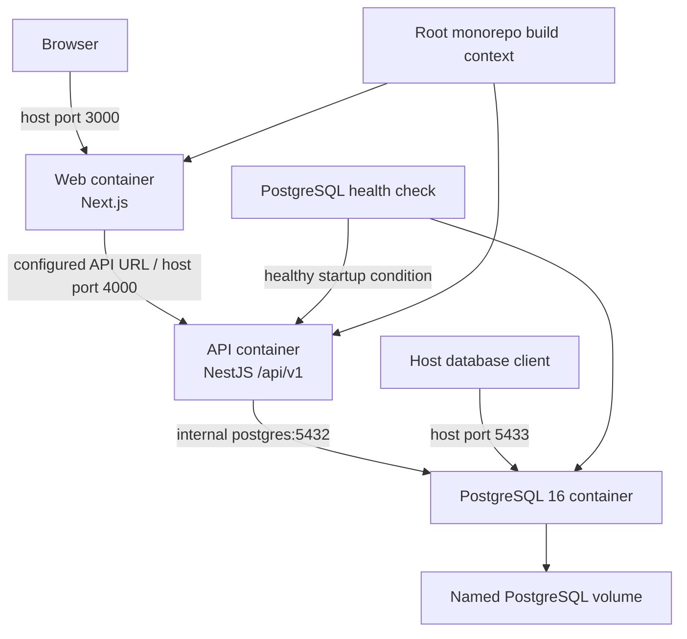

Environment configuration supplies database URL, JWT settings, port, and public API URL. The repository includes development defaults; production must provide managed secrets and environment-specific validated configuration. Build images currently install from the broad root context and copy full source into builder stages. This is functional but increases context, cache, and supply-chain scope.

Development may use Compose, local hot reload, migration development, and explicit seed data. Production should use immutable images, locked dependencies, least-privilege runtime users, external secret management, managed durable storage, separate readiness/liveness, controlled ingress/TLS, database backup/recovery, and deployment evidence. Migration execution must be an explicit release step with status/preflight, backup/rollback-forward plan, and one authorized runner—not an uncontrolled replica startup side effect. Seed execution is explicit and environment-governed; development seed identities/data are not a production bootstrap contract. Infrastructure depth belongs to FCSB-006.

# Chapter 29 — Application Architecture Risks

| Risk | Evidence or trigger | Mitigation |
|---|---|---|
| Growing modular-monolith complexity | Module count and future operational domains increase | Enforce domain ownership, dependency tests, ADRs, module APIs and periodic coupling review |
| Shared-service coupling | Neutral services may accumulate domain decisions | Publish narrow interfaces; keep domain policies in owning modules; review consumer changes |
| Ungoverned metadata | Flexible JSON and builders can bypass lifecycle/security | Typed schemas, publication states, owners, validation, packages, activation and audit |
| Over-generalized transaction model | Generic payload can hide domain invariants | Keep typed domain aggregates/effects; use common envelope only for stable semantics |
| Direct Prisma access spreading | Service convenience can cross domain ownership | Ban controllers; review cross-module table access; introduce application contracts/repositories where valuable |
| Insufficient event boundaries | Future cross-domain calls may become synchronous chains | Define outcomes and ownership now; introduce outbox/events only with governed schemas and need |
| Weak async processing | Imports and heavy work execute in request path | Define durable jobs, queue selection, idempotency, progress, retries and operator recovery |
| Large Docker build context | Both images copy/build from repository root | Add reviewed ignore/context strategy, reproducible dependency install and minimal runtime images |
| Authentication persistence | Local-storage token and incomplete expiry/logout experience | Security review, centralized session handling, XSS controls, expiry/refresh decision and safe logout |
| Frontend duplication | Repeated route configs/forms and inconsistent API path ownership | Shared typed API client, design/form primitives, generated-safe metadata mapping and route tests |
| Generic endpoints hide domain rules | Dynamic master/transaction payloads can become universal CRUD | Restrict registries, type high-risk commands, validate in domain services, forbid arbitrary delegate exposure |
| Untyped payloads | Reports/layouts/customization/transactions use `any` | Introduce discriminated DTOs and schema versions with compatibility tests |
| Customer forks | Direct customer code changes threaten upgrades | Versioned packages, extension seams, exception approval, ownership and exit plan |
| Missing observability | Basic health/audit cannot diagnose runtime behavior | Correlation, structured logs, metrics, tracing plan, error monitoring and runbooks |
| Premature microservices | Extraction before stable boundaries adds distributed failure | Require measurable scale, resilience, regulatory, deployment or team-ownership evidence |
| Security-scope inconsistency | Different modules use role, permission, tenant, company or organization checks unevenly | One policy model, reusable scope contracts, negative isolation tests and security review |
| Static/demo UI mistaken for operations | Dashboard/customization surfaces show illustrative values | Label demos, bind only to governed APIs, acceptance-test real states before operational claims |
| Metadata/runtime drift | Registry capabilities may promise behavior no executor provides | Capability certification, runtime-adapter version and automated conformance checks |

Risks are owned work, not disclaimers. Architecture review should convert high-impact items into dated decisions or backlog controls before operational finance/inventory/manufacturing expands the consistency surface.

# Chapter 30 — Decisions, Approval, and Roadmap

## Application architecture decision register

| Decision ID | Decision | Status | Rationale / evidence | Owner |
|---|---|---|---|---|
| FCSB2-ADR-001 | Modular monolith is the current implementation model. | Implemented | One composed NestJS API and PostgreSQL transaction boundary are evidenced. | Application Architecture |
| FCSB2-ADR-002 | Microservices require evidence-based scale, resilience, regulatory, deployment, or ownership need. | Approved | Prevents distributed complexity before boundaries mature. | Architecture Board |
| FCSB2-ADR-003 | NestJS owns backend application and business-rule enforcement. | Implemented | Controllers/services/guards and accepted DBA modules enforce server behavior. | Backend Architecture |
| FCSB2-ADR-004 | Next.js is an experience layer, not an authorization boundary. | Approved | Stored UI permissions and hidden controls are bypassable. | Security Architecture |
| FCSB2-ADR-005 | PostgreSQL is the authoritative system of record for current application state. | Implemented | Prisma schema/migrations and Compose topology use PostgreSQL. | Data Architecture |
| FCSB2-ADR-006 | Prisma 6 remains the primary ORM for this baseline. | Implemented | Repository uses Prisma 6.19.3; no ORM replacement is authorized. | Data Access Owner |
| FCSB2-ADR-007 | Supported application APIs use `/api/v1`. | Implemented | Global NestJS prefix is configured in `main.ts`. | API Owner |
| FCSB2-ADR-008 | Domain modules own business rules and authoritative lifecycle decisions. | Approved | Protects meaning from generic platform CRUD. | Domain Architecture Council |
| FCSB2-ADR-009 | Shared platform services remain domain-neutral. | Approved | Prevents hidden coupling and conflicting policy ownership. | Platform Architecture |
| FCSB2-ADR-010 | Accepted migrations are immutable; change uses reviewed forward migrations. | Implemented | DBA history is additive and preserved. | Database Governance |
| FCSB2-ADR-011 | Events use versioned schemas and correlation/causation identity. | Proposed | Required before event consumers or external publication. | Integration Architecture |
| FCSB2-ADR-012 | Async processing uses governed durable queues/jobs with idempotent workers. | Proposed | No queue exists; selection follows workload and operations review. | Platform Operations |
| FCSB2-ADR-013 | Metadata publication is distinct from metadata editing. | Approved | Runtime must consume reviewed immutable versions, not mutable drafts. | Configuration Governance |
| FCSB2-ADR-014 | Customer extensions require versioned packages and compatibility evidence. | Approved | Protects tenant isolation, upgrades and supportability. | Product Governance |
| FCSB2-ADR-015 | A transactional outbox is the preferred future bridge from local commit to event publication. | Proposed | Preserves atomic domain outcome/event intent without distributed transactions. | Application Architecture |
| FCSB2-ADR-016 | Browser token/session strategy requires FCSB-005 security decision before production assurance. | Open | Local storage is implemented but not an approved final security posture. | Security Architecture |
| FCSB2-ADR-017 | Production queue, event transport, cache, search and file-storage technologies remain unselected. | Deferred | Workload, operations and integration evidence is not yet sufficient. | Architecture Board |
| FCSB2-ADR-018 | Legacy `any` API payloads must move to versioned discriminated schemas before broad operational use. | Proposed | Reports/layouts/customization/transactions currently lack strong external typing. | API Owner |

## Open decisions

Open review items are browser session/token handling; canonical API error and correlation contracts; metadata package format/signing; cross-domain command/event envelope; workflow-instance persistence; job/queue selection criteria; durable file/object storage; report semantic/query model; and the boundary between generic transaction/document foundations and typed domain aggregates. Technology selection should follow approved requirements and measured workloads.

## Approval roles

| Role | Approval concern | Status |
|---|---|---|
| Architecture Board | Principles, boundaries, decisions, exceptions, and series alignment | Pending |
| Product Owner | Manufacturing-first priorities and capability-status accuracy | Pending |
| Application Architecture | Module/layer/API/extension feasibility | Pending |
| Data and Database Governance | Prisma/PostgreSQL, transaction, history and FCSB-003 handoff | Pending |
| Security Architecture | Identity, authorization, token/session, tenant and organization controls | Pending |
| Integration Architecture | Event readiness, seams, async and FCSB-004 handoff | Pending |
| Operations Architecture | Observability, deployment, performance and FCSB-006 handoff | Pending |
| Domain Owners | Finance, inventory, procurement, sales and manufacturing ownership boundaries | Pending |

## Conditions for approval

1. Reconcile FEAPB, FEOM, EOR, UMF, UFT, FOST, and FKG terminology with controlled sources unavailable in this repository.
2. Confirm domain ownership and allowed dependencies, especially generic transaction/report/customization services.
3. Approve the canonical API path, error, idempotency, pagination, and correlation conventions.
4. Record the security decision for browser sessions and production identity integration.
5. Approve metadata publication/package semantics before FlowCraft Studio expands.
6. Define the DBA-005 consistency boundary and ensure Finance and Inventory Ledger designs do not create conflicting posting authority.
7. Convert high architecture risks into owned controls with acceptance evidence.
8. Validate Mermaid rendering, relative links, and document control metadata in the governed documentation pipeline.

## Recommended architecture work before DBA-005

- Choose the DBA-005 domain scope and name its aggregate, invariants, organization scope, permission model, audit events, and transaction boundaries.
- Define a typed command/DTO standard and remove `any` from any legacy endpoint DBA-005 will consume or extend.
- Specify canonical API errors, correlation propagation, and idempotency behavior.
- Define local transaction plus outbox tables/contracts conceptually if DBA-005 creates cross-domain effects; do not deploy an event bus without an approved consumer need.
- Resolve Finance posting versus Inventory movement authority, reversal/correction semantics, currencies, periods, and number series before implementation.
- Establish dependency rules so DBA-005 consumes Master Data and Organization through owned services/policies.
- Add negative tenant/company/organization security tests and concurrency/retry tests for the new boundary.
- Establish initial workload tests and observability acceptance criteria rather than unsupported capacity targets.

FCSB-003 is the immediate architecture dependency. It must define authoritative data domains, aggregate identities, ownership, lineage, effective dating, history, retention, classification, JSON boundaries, ledger data principles, analytics projections, migration, and database evolution. FCSB-002 governs how applications consume those decisions; it does not pre-empt their detailed data design.

## Version history

| Version | Date | Author | Reviewer | Status | Change summary |
|---|---|---|---|---|---|
| 1.0 Draft | 2026-07-15 | FlowCraft Architecture | Pending | Architecture Review Draft | Initial evidence-based application and platform architecture baseline |

## Repository evidence references

- [FCSB Series Index](./FCSB-Series-Index.md)
- [FCSB-001 — Executive and Business Architecture](./FCSB-Volume-1-Executive-and-Business-Architecture.md)
- [Repository README](../../README.md)
- [Root workspace configuration](../../package.json)
- [API workspace configuration](../../apps/api/package.json)
- [Web workspace configuration](../../apps/web/package.json)
- [Docker Compose topology](../../docker-compose.yml)
- [API Dockerfile](../../apps/api/Dockerfile)
- [Web Dockerfile](../../apps/web/Dockerfile)
- [Prisma configuration](../../prisma.config.ts)
- [Prisma schema](../../apps/api/prisma/schema.prisma)
- [Prisma migrations](../../apps/api/prisma/migrations)
- [Idempotent seed and EOR registry](../../apps/api/prisma/seed.ts)
- [NestJS module composition](../../apps/api/src/app.module.ts)
- [NestJS bootstrap](../../apps/api/src/main.ts)
- [Common request and security services](../../apps/api/src/common)
- [Authentication implementation](../../apps/api/src/auth)
- [Audit implementation](../../apps/api/src/audit)
- [Digital DNA implementation](../../apps/api/src/digital-dna)
- [Enterprise Object Registry implementation](../../apps/api/src/enterprise-objects)
- [Workflow definition implementation](../../apps/api/src/workflows)
- [Organization implementation](../../apps/api/src/organization)
- [Master-data implementation](../../apps/api/src/master-data)
- [Reports implementation](../../apps/api/src/reports)
- [Print-layout implementation](../../apps/api/src/layouts)
- [Customization implementation](../../apps/api/src/customization)
- [Transaction foundation](../../apps/api/src/transactions)
- [Current web application routes](../../apps/web/app)
- [Current web components](../../apps/web/components)
- [Current web API client](../../apps/web/lib/api.ts)
- [API tests](../../apps/api/test)
- [DBA-002 implementation report](../implementation/DBA-002-foundation-implementation.md)
- [DBA-003 implementation report](../implementation/DBA-003-enterprise-structure-implementation.md)
- [DBA-004 implementation report](../implementation/DBA-004-enterprise-master-data-implementation.md)
