# FlowCraft Solution Blueprint

## Volume 3 — Enterprise Data and Information Architecture

| Control | Value |
|---|---|
| Document code | FCSB-003 |
| Version | 1.0 Draft |
| Status | Architecture Review Draft |
| Owner | FlowCraft Architecture Board |
| Related milestones | DBA-002 Platform Foundation; DBA-003 Enterprise Structure; DBA-004 Enterprise Master Data; preparation for DBA-005 Finance Foundation and DBA-006 Inventory Ledger |
| Evidence baseline | `v0.4-dba004-merged` |
| Last updated | 2026-07-15 |
| Predecessors | [FCSB-001](./FCSB-Volume-1-Executive-and-Business-Architecture.md); [FCSB-002](./FCSB-Volume-2-Application-and-Platform-Architecture.md) |
| Next planned volume | FCSB-004 — Integration Architecture |

> **Authority notice:** FCSB-003 is an Architecture Review Draft. Repository evidence governs current-state claims. Planned ledgers, posting interfaces, events, analytical stores, FKG, AI, and scale patterns are target architecture only until accepted implementation evidence exists. This volume does not supersede controlled FEAPB, FEOM, EOR, DBA, database, security, retention, or legal decisions.

## Status vocabulary

| Status | Meaning |
|---|---|
| **Implemented foundation** | Accepted, working data capability evidenced by DBA-002, DBA-003, or DBA-004. |
| **Partially implemented** | Some schema or service behavior exists, but the governed data capability is incomplete. |
| **Planned** | Intended near-horizon design with no accepted complete implementation. |
| **Future** | Longer-horizon capability dependent on unresolved product or architecture decisions. |
| **Conceptual target** | A rule or design for review, not a claim of running software. |

# Chapter 1 — Purpose and Scope

FCSB-003 defines how FlowCraft Business OS owns, identifies, structures, changes, protects, retains, migrates, reconciles, reports, and evolves enterprise data. Its audience is the Architecture Board, product and domain owners, data/database/security/integration architects, engineers, testers, migration teams, reporting teams, implementation partners, auditors, and operational stewards.

The scope covers reference, enterprise-structure, master, transaction, ledger, workflow, audit, integration, analytical, and future knowledge-graph data. It establishes identity, ownership, temporal behavior, history, classification, quality, lineage, retention, migration, reporting projections, and database-evolution rules. Detailed application/service boundaries remain in [FCSB-002](./FCSB-Volume-2-Application-and-Platform-Architecture.md); detailed integration is reserved for FCSB-004; security controls for FCSB-005; operations for FCSB-006; and formal Universal Transaction, Universal Master, reporting, Finance, and Inventory frameworks for their later controlled volumes.

[FCSB-001](./FCSB-Volume-1-Executive-and-Business-Architecture.md) supplies product and business context. FEAPB provides controlled enterprise intent; FEOM and EOR provide object semantics and stable registry identity; UMF and UFT describe future common master and transaction semantics; FOST is a controlled framework dependency whose canonical repository source is absent; and FKG is a future governed semantic graph. Standalone controlled FEAPB, UMF, UFT, FOST, and FKG documents are not present in this repository, so terminology requires reconciliation before approval.

Data architecture must precede DBA-005 Finance Foundation and DBA-006 Inventory Ledger because those milestones create authoritative, high-consequence facts. Journal and inventory effects require agreed ownership, identifiers, currency/quantity types, posting states, immutable entries, periods, reversals, source traceability, reconciliation, tenant/organization isolation, and migration controls. Implementing tables first would risk competing truths that later application architecture cannot safely repair.

# Chapter 2 — Data Architecture Executive Summary

The current operational store is PostgreSQL 16, modeled through Prisma 6.19.3. Accepted foundation, organization, and master-data models generally use UUID primary keys, foreign keys, scoped unique constraints, indexes, soft archive fields, effective periods, Digital DNA on selected identities, and JSON fields for bounded metadata or migration artifacts. Three accepted migrations are additive and contain no `DROP TABLE` or `DROP COLUMN`; DBA-004 uses deterministic backfills before making selected legacy columns required. The idempotent seed preserves codes and creates reference/master examples but explicitly creates no operational stock balances.

Current maturity is an **implemented data foundation**, not a complete operational data platform. Reference data, enterprise structure, access, EOR metadata, workflow definitions, audit, and DBA-004 master data are evidenced. Generic `TransactionDocument`/`TransactionLink` and legacy `ChartOfAccount`/`JournalEntry`/`JournalLine` tables are scaffolding with preserved CUID identifiers and limited lifecycle rules. They do not constitute a posted Finance ledger or Inventory ledger.

The target assigns one authoritative owner to each business fact. Master data changes through governed lifecycle and effective dates. Transactions preserve source identity and typed domain facts. Posted ledgers are append-only: correction and reversal add linked evidence rather than editing history. Audit records actor/change evidence but never replace temporal domain history or ledger truth. Digital DNA is immutable where applied; it is not yet universal. Migration retains source, mapping, transformation, actor, result, and reconciliation evidence.

Operational reporting consumes authorized read models or governed views; analytical models remain non-authoritative and reconcile to source ledgers. Future evolution may add outbox/integration data, warehouse/lake structures, slowly changing dimensions, and FKG nodes, but none currently exists. Scale choices—partitioning, replicas, materialized views, archival tables—follow measured workloads, not unsupported capacity claims.

# Chapter 3 — Data Architecture Principles

| Principle | Official rule and reason |
|---|---|
| One authoritative owner per domain | A named domain controls each fact's lifecycle and write interface; shared ownership produces conflicting truth. |
| One source of truth per fact | Derived balances and reports identify their authoritative entries and calculation version. |
| No cross-domain direct writes | Domains request effects through owned interfaces; direct table writes bypass invariants and reconciliation. |
| Immutable posted ledgers | A posted entry is evidence; mutation would destroy financial, quantity, cost, or genealogy history. |
| Correction and reversal | Errors create linked correcting/reversing records, never destructive edits to posted truth. |
| Effective dating | Business meaning that changes over time records valid periods so historical decisions use historical context. |
| Stable identity | Technical and business identity cannot be silently repurposed; labels and attributes may change under governance. |
| Digital DNA where approved | Applied Digital DNA is immutable and portable across migration/integration; coverage expands only through governed design. |
| Tenant isolation | Every tenant-owned fact carries or derives tenant identity and is filtered before access. |
| Organization scope | Company, branch, plant, and organization node are explicit dimensions where business authority requires them. |
| Additive schema evolution | Accepted migrations are immutable; forward changes preserve deployed data and history. |
| Referential integrity | Foreign keys and validated references prevent orphaned authoritative relationships where feasible. |
| Explicit lineage | Derived or migrated facts identify source, transformation, actor, version, and result. |
| Data minimization | Persist and expose only data required for an approved purpose. |
| Sensitivity and criticality classification | Protection, availability, testing, retention, and change control reflect both confidentiality and business consequence. |
| Governed metadata | Metadata can configure bounded behavior but cannot hide critical ledger, quantity, tax, scope, or security facts. |
| Bounded JSON | JSON holds flexible versioned structures, not normalized authoritative facts that require joins, constraints, or reconciliation. |
| Reconciliation by design | Cross-domain effects carry shared identity and statuses so differences are detectable and recoverable. |
| Analytics separated from authority | Reports, projections, warehouse/lake, and AI may derive facts but never become the write authority for operations. |
| Governed retention and deletion | Archive, purge, anonymization, and legal hold follow approved policy, evidence, and referential safety. |
| Migration evidence preserved | Source extracts, mappings, exceptions, counts, sign-off, and reconciliation remain discoverable after cutover. |

These are review gates for DBA-005/006. An exception requires a recorded decision, owner, risks, compensating controls, and remediation or sunset plan.

# Chapter 4 — Current Physical Data Architecture

PostgreSQL 16 is the database engine in the supplied Compose topology. Prisma maps the application schema and generates the client used by the NestJS API. The Compose database uses an internal `postgres:5432` endpoint, publishes host port 5433 for local access, and persists files in a named volume. The API is the supported application writer; the web application has no direct database path.

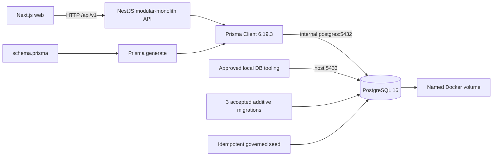

The schema contains UUID-based foundation/master models and preserved legacy CUID transaction/accounting scaffolds. Relations use Prisma foreign keys; compound unique constraints scope codes and versions by tenant/company/parent; indexes commonly lead with tenant/company/status/history dates. Prisma `Json` maps to PostgreSQL JSON-compatible storage and is used for metadata, validation, layouts, settings, audit snapshots, import rows/mappings, filters, and generic transaction payloads.

Migration `20260711000000_foundation_platform_schema` creates the initial foundation and preserved business scaffolds. `20260712143659_enterprise_structure_model` adds typed organizations, generalized hierarchy, relationship history, inheritance, and access. `20260714000000_enterprise_master_data_platform` adds 39 master/governance tables, extends accepted models, and backfills Item/Warehouse/Supplier/Customer fields before constraints. Accepted history is not rewritten.

# Chapter 5 — Target Logical Data Architecture

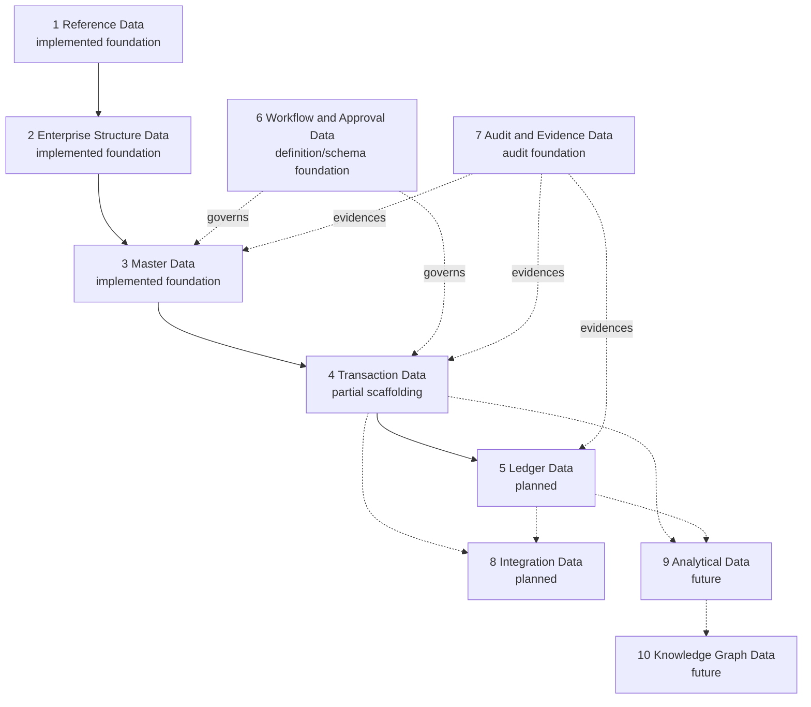

Reference data defines shared codes and measures. Enterprise structure establishes legal and operating scope. Master data identifies reusable entities and policies. Transactions capture business intent and lifecycle. Ledgers record authoritative posted effects. Workflow/approval records govern decisions; audit/evidence records preserve actor/change evidence. Integration data carries external identities, messages, mappings, and reconciliation. Analytical data provides non-authoritative projections. Knowledge-graph data may later connect governed semantics and evidence without replacing source domains.

# Chapter 6 — Data Domain Ownership Model

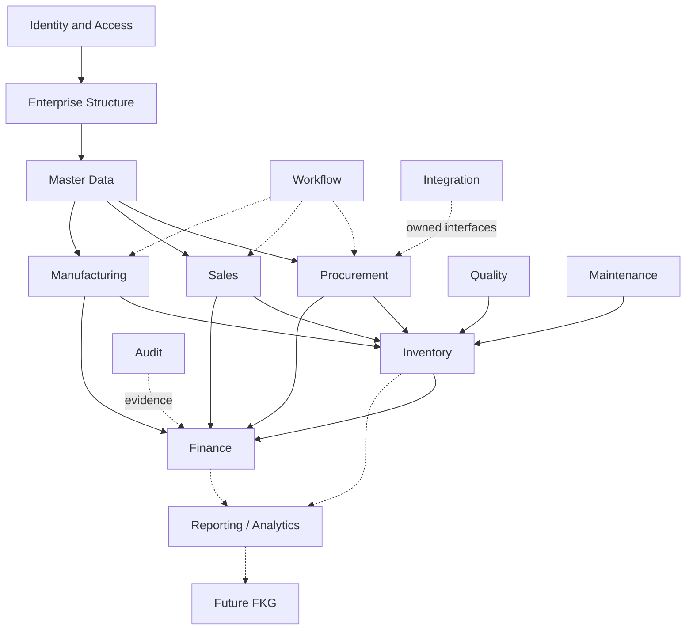

| Domain | Authoritative owner | Read consumers | Write permission/interface | External interface | Historical policy |
|---|---|---|---|---|---|
| Identity and Access | IAM owner | All protected modules, audit | IAM services only | Auth/federation APIs | Assignment/status history and security retention policy |
| Enterprise Structure | Organization owner | All scoped domains | Organization services | Organization API | Effective hierarchy and relationship history retained |
| Master Data | Master Data owner/stewards | All operational domains | Governed master APIs | Master API/import | Archive/effective history; merge lineage retained |
| Finance | Finance owner | Reporting, domains needing posting status | Finance commands only | Posting/statement interfaces | Posted journals/ledger immutable |
| Inventory | Inventory owner | Sales, Procurement, Manufacturing, Finance, Quality | Inventory posting/reservation commands | Movement/availability interfaces | Movements immutable; balance derived |
| Procurement | Procurement owner | Inventory, Finance, reporting | Procurement commands | Supplier/integration APIs | Document lifecycle and revisions retained |
| Sales | Sales owner | Inventory, Finance, reporting | Sales commands | Customer/integration APIs | Commitment/lifecycle history retained |
| Manufacturing | Manufacturing owner | Inventory, Quality, Maintenance, Finance | Manufacturing commands | MES/shop-floor interfaces | Order, consumption, output, genealogy retained |
| Quality | Quality owner | Inventory, Manufacturing, reporting | Quality commands | Inspection/device interfaces | Holds, results, dispositions and corrections retained |
| Maintenance | Maintenance owner | Inventory, Finance, Manufacturing | Maintenance commands | Asset/IoT interfaces | Work, meter and reliability history retained |
| Workflow | Workflow Platform owner | Governed domains, audit | Definition/runtime APIs | Task/action APIs | Published versions and runtime decisions retained |
| Audit | Audit Platform owner | Security, support, assurance | Append-only audit service | Governed export | Immutable under policy; not editable by domains |
| Reporting | Reporting Platform plus metric owner | Authorized users | Definition APIs; facts remain read-only | Report/export APIs | Definition/output versions policy-governed |
| Integration | Integration owner | Domain adapters/support | Adapter/message APIs | REST/event/file/EDI | Message/mapping/reconciliation evidence retained |
| Analytics | Data/Analytics owner | Management, governed AI | Controlled pipelines only | Semantic/BI interfaces | Rebuildable projections plus lineage/snapshots as approved |
| FKG | Future Knowledge Governance | Governed search/AI | Future graph ingestion policy | Governed graph API | Provenance and source-version references mandatory |

## Required data ownership matrix

| Data object | Authoritative domain | Current implementation status | Mutable / immutable | Effective-dated | Retention class owner | Primary write interface | Read consumers |
|---|---|---|---|---|---|---|---|
| Tenant | Identity/Platform Governance | Implemented foundation | Mutable attributes; stable identity | No | Security/Product Governance | Tenant service/controlled bootstrap | All tenant-aware domains |
| User | Identity and Access | Implemented foundation | Mutable; archived not deleted operationally | No | Security | User/IAM API | Guards, audit, workflow |
| Role | Identity and Access | Implemented foundation | Mutable definition; assignments governed | No | Security | Role/permission API | Guards, administration |
| Organization Node | Enterprise Structure | Implemented foundation | Current row mutable; relationship history retained | Yes | Organization Governance | Organization API | All scoped domains |
| Company | Enterprise Structure | Implemented foundation | Mutable; soft archive; identity stable | Yes | Organization Governance | Company/organization API | All company domains |
| Item | Master Data | Implemented foundation | Mutable under governance; archive | Yes | Master Data | Master-data API | Inventory, Procurement, Sales, Manufacturing, Finance |
| Warehouse | Master Data / Inventory reference | Implemented master foundation | Mutable master; no quantity truth | Yes | Master Data | Master-data API | Inventory, Manufacturing, Quality |
| Business Partner | Master Data | Implemented foundation | Mutable; archive/merge metadata | Yes | Master Data | Master-data API | Sales, Procurement, Finance |
| UOM | Master Data / Reference | Implemented foundation | Mutable under governance | Conversion effective-dated | Master Data | Master-data API | All quantity domains |
| Currency | Reference Data | Implemented foundation | Stable code; attributes controlled | Rates versioned separately | Finance/Data Governance | Currency/exchange-rate API | Finance and commercial domains |
| Workflow Definition | Workflow | Implemented definition foundation | Draft mutable; published version immutable | Yes | Workflow Governance | Workflow API | Governed domains |
| Transaction Document | Owning operational domain / UFT | Partial generic foundation | Draft mutable; posted semantics undefined | No | Domain owner | Transaction API currently; typed domain commands target | Workflow, reporting, linked domains |
| Journal | Finance | Legacy scaffold only | Target: posted immutable | No current period/version model | Finance | Future Finance posting API | Finance/reporting/source domains |
| Inventory Movement | Inventory | Planned; no model/ledger | Target: posted immutable | Posting timestamp, not effective master period | Inventory | Future Inventory posting API | Finance, availability, reporting |
| Production Order | Manufacturing | Planned; enum/demo references only | Lifecycle-controlled | Revision/effective references target | Manufacturing | Future Manufacturing API | Inventory, Quality, Finance |
| Quality Inspection | Quality | Planned; transaction-kind scaffold only | Results controlled; corrections linked | Target depends on plan/spec versions | Quality | Future Quality API | Inventory, Manufacturing, reporting |
| Maintenance Work Order | Maintenance | Planned; transaction-kind scaffold only | Lifecycle-controlled | Target plan revisions | Maintenance | Future Maintenance API | Inventory, Finance, Manufacturing |
| Audit Log | Audit | Implemented foundation | Append-only | No; timestamped event | Security/Audit Governance | Audit service | Assurance, support, security |
| Import Job | Master Data / Data Movement | Partial foundation | Status mutable; row evidence retained | No | Data Migration Governance | Master-data import API | Stewards, support, audit |
| Report Definition | Reporting | Partial foundation | Mutable; target published versions | No current effective version | Reporting Governance | Reports API | Authorized users |
| Analytical Dataset | Analytics | Future | Rebuildable/versioned projection | Snapshot/as-of target | Data/Analytics Governance | Controlled pipeline | BI, management, governed AI |
| FKG Node | FKG | Future | Derived/governed with provenance | Source-version aware target | Knowledge Governance | Future graph ingestion | Governed search and AI |

# Chapter 7 — Shared Kernel and Canonical Data Types

The shared kernel contains only stable meanings used across domains. It does not contain domain aggregates, Prisma models, broad status enums, or generic JSON payloads.

| Concept | Canonical direction |
|---|---|
| UUID | Technical identifier for new governed records; legacy CUID scaffolds require compatibility/migration decisions. |
| Digital DNA | Immutable approved cross-lifecycle identifier, distinct from primary key and display code. |
| Tenant / Company / Organization node ID | Typed scope identifiers; never interchangeable strings. |
| Currency | ISO-style governed code plus currency identity; money always carries currency. |
| Money | Decimal amount, currency, precision/rounding context; never binary float. |
| Quantity / UOM | Decimal quantity with UOM and conversion/version context. |
| Percentage | Decimal with explicit scale and meaning (rate versus factor). |
| Date / Time / Timestamp | Separate business date, local time, and UTC instant semantics. |
| Effective period | Inclusive start and explicit exclusive/inclusive end convention approved in FCSB-003 follow-up. |
| Status / Approval status | Domain-owned state types; shared only where semantics are genuinely identical. |
| Document number | Human/business identifier allocated in scope; not the primary key. |
| External reference | Source-system namespace, type, value, and optional version. |
| Correlation / Causation ID | Trace a process and the immediate cause across commands, jobs, events, and postings. |
| Actor | User or service principal plus tenant/scope and source. |
| Source system | Controlled system code and environment/instance identity. |
| Version | Positive immutable artifact/record version with defined compatibility semantics. |

The shared kernel may provide validated value objects and serialized contracts. It must not expose writable Prisma entities, Finance account rules, Inventory availability logic, manufacturing routing semantics, or customer-specific fields.

# Chapter 8 — Identity Architecture

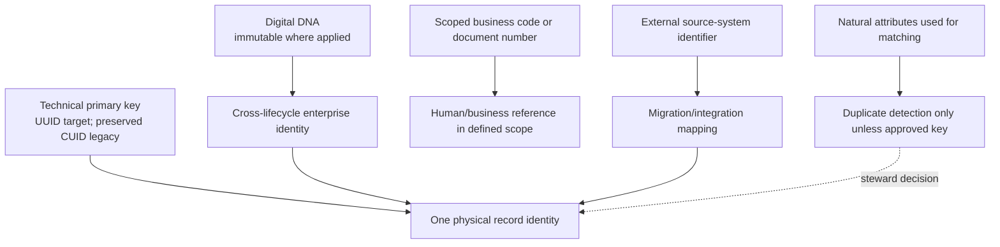

Technical primary keys are storage/API identities and should be opaque. New governed models use UUID; accepted legacy TransactionDocument, transaction links, approvals, accounting, reports/layouts, and some customization models retain CUIDs to avoid unsafe migration scope. UUID is the target standard, not a false statement that every current key is UUID.

Business codes and document numbers are meaningful within explicit tenant/company/parent/fiscal scopes. They are not primary keys and may have formatting/version rules. Natural keys help matching but are often unstable or non-unique. Composite constraints enforce scope, such as tenant/company/item code, company/document number, tenant/workflow/version, and item/batch identity. External legacy IDs require source-system namespace to prevent collision.

Immutable identities include technical ID after creation, applied Digital DNA, posted ledger entry ID, and published artifact version. Changeable attributes include display names, descriptions, contact data, and governed status. Merge never reassigns one physical ID silently: a steward selects the survivor, records source/target and preserved references, redirects only approved consumers, and retains lineage. Current DBA-004 records merge metadata but does not execute destructive automated merge.

# Chapter 9 — Digital DNA Architecture

Digital DNA gives selected enterprise identities a durable, recognizable reference across history, migration, integration, audit, and future FKG use. The current service builds prefixed values from an approved object type, optional sanitized context, and a random UUID-derived segment; currencies use a deterministic code-based form. `assertUnchanged` rejects replacement. Schema uniqueness provides collision protection for covered models.

Coverage includes currencies, companies, branches, users, typed organization structures, organization nodes, selected geography/contact/UOM/classification/manufacturer/brand/warehouse structures, Item, and Business Partner. Coverage is not universal: batches, serials, many commercial masters, governance jobs, transaction/accounting scaffolds, and audit records do not all have Digital DNA.

Migration must preserve an existing approved Digital DNA or allocate one once under a governed rule, recording the source mapping. Integration may expose it as a stable FlowCraft reference when classification permits, but internal UUIDs and tenant scope remain required. Audit should record Digital DNA alongside record ID when available. Future FKG nodes may reference it as a stable semantic anchor but must retain source domain and version.

Collision handling is fail-closed: a uniqueness conflict stops creation, is investigated, and never triggers silent mutation of an existing identity. External visibility is object-policy specific. A DNA must not encode personal, secret, or sensitive business meaning; prefixes/context segments are allowlisted and sanitized. Possession of a DNA grants no access.

# Chapter 10 — Tenant, Company, and Organization Data Isolation

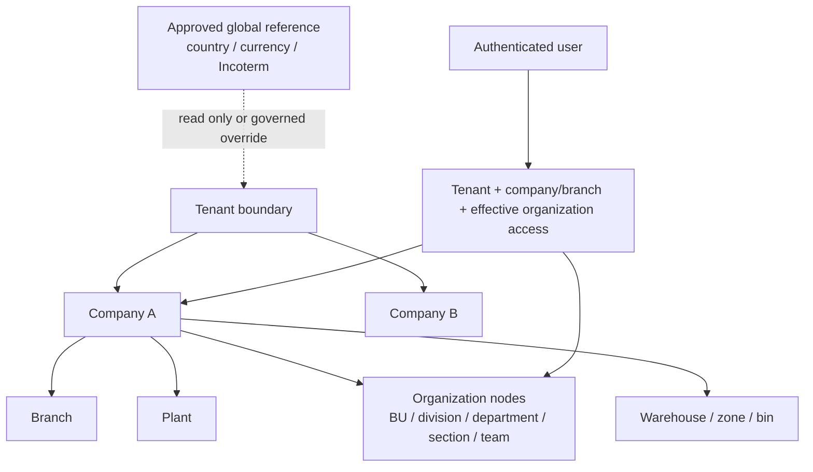

Tenant is the primary isolation boundary for tenant-owned data. Tenant identity must be present or unambiguously derived through an enforced parent relation. Company defines legal/financial/operating ownership for company facts. Branch and plant further locate operations; they must belong to the selected company. `OrganizationNode` supplies generalized effective access and descendant scope for departments, teams, locations, cost/profit centers, and other typed structures.

Global reference data is exceptional and explicitly classified. Countries/currencies/Incoterms may be global; UOM, statuses, terms, brands, and similar references may be global-or-tenant according to the resource definition. Tenant overrides must be separate scoped records or versioned overlay policy, never an edit to a shared row that changes other tenants.

Cross-company reads require explicit assignment and a use case such as group reporting. Cross-company writes remain in the owning company. Future intercompany processes create paired, linked transactions under each company's authority; they do not bypass scope. Every query filters before returning data, every reference validates parent scope, and exports/search/reporting inherit the same rules. Tests must include cross-tenant ID guessing, cross-company references, descendant access, expired access, global/tenant overlays, Super Admin policy, and aggregation leakage.

# Chapter 11 — Reference Data Architecture

Reference data supplies controlled codes used by many domains. Current models include Country, State, City, Currency, UnitOfMeasure, Incoterm, and configurable category/status/term records. Countries, states, and cities form a referential geography chain. Currencies have stable code/Digital DNA; ExchangeRate stores tenant, currency pair, date, type, version, replacement link, and status. UOM categories are governed strings today; UOM and item-specific/general conversions are modeled. Incoterms are globally keyed by code and version year.

| Reference family | Scope direction | Version/effective rule | Governance concern |
|---|---|---|---|
| Countries/states/cities | Global foundation | Controlled status; future source-release metadata | Code stability, localization, boundary changes |
| Currency | Global identity; tenant use | Stable currency code; rate history separately versioned | Precision, active status, source and rate type |
| UOM/category | Global-or-tenant | Conversion effective periods; category policy version | Dimension compatibility, precision and rounding |
| Incoterm | Global by code/version year | New version retained, not overwritten semantically | Controlled publication source and tenant adoption |
| Tax/geographic regulatory references | Global/tenant/company as designed | Effective periods required | Jurisdiction source, review and impact |

Localization adds translated labels without changing code identity. Regulatory updates require source, publication/effective date, reviewer, impacted tenants/domains, and supersession behavior; this draft does not claim any specific regulation or legal duration. Tenant overrides cannot mutate the global base. They layer an approved scoped value or adoption policy and retain the base version used.

# Chapter 12 — Master Data Architecture

Master data identifies reusable business entities and policies: enterprise structures; Item and classification; Warehouse/Zone/Bin; Business Partner with Customer/Supplier specialization; geography/address/contact; UOM/conversion; commercial terms; tax; Batch/Serial identity; and Cost/Profit Centers. DBA-003/004 implement substantial schema, API, validation, scope, archive, duplicate, import, and audit foundations. They do not create operational balances, postings, or production execution.

```mermaid
stateDiagram-v2
  [*] --> Draft
  Draft --> Active: validate and approve
  Active --> Inactive: temporarily unavailable
  Inactive --> Active: approved reactivation
  Active --> Superseded: replacement becomes effective
  Active --> Archived: end use; retain references
  Inactive --> Archived
  Draft --> Archived: abandoned with evidence
  Active --> Merged: steward selects survivor
  Merged --> Archived: source retained as lineage
  Superseded --> Archived: policy permits
```

This common lifecycle is the UMF direction. `Draft` is editable but not operationally selectable; `Active` is valid in scope/effective period; `Inactive` is temporarily blocked; `Archived` is retained and excluded from normal selection; `Superseded` points to a replacement; `Merged` points to a surviving identity with lineage. Current status strings vary and not all models implement all states. DBA-004 chiefly supports active/status and archive behavior, effective dates on selected masters, change-request/duplicate/merge metadata, and audit. A universal lifecycle engine is not implemented.

Batch and Serial are master-like traceability identities today, not inventory quantity records. Warehouse is a governed location master, not on-hand truth. Cost and Profit Centers are organization/accounting dimensions, not ledger balances.

# Chapter 13 — Master Data Change and Governance

A data owner defines policy; a steward performs review and remediation; domain users propose changes through permitted interfaces. High-impact changes use a change request carrying object, record, proposed values, reason, actor, approval state, and future workflow reference. Approval confirms policy and effective date; it does not waive validation or scope.

Duplicate rules identify candidate matches using governed fields/thresholds. Exact code/name checks exist in DBA-004. Steward review decides distinct/merge/reject. Survivorship chooses each retained attribute and records source. `MasterDataMergeHistory` stores source, target, reason, actor, time, and preserved-reference metadata; it deliberately does not mutate or delete source/target records.

Automated destructive merge is prohibited because generic code cannot safely rewrite every foreign key, historical document, audit snapshot, external reference, analytical projection, or future graph edge. A future merge workflow must enumerate consumers, lock conflicting changes, validate survivor scope, produce a reference-rewrite plan, reconcile counts, preserve aliases/lineage, and provide forward recovery.

Archive ends normal use without breaking references. Effective dating preserves changing meaning. Correction updates an unposted/current master under audit or creates a new effective version where historical meaning matters. Imports use the same validation, ownership, duplicate, audit, and approval rules as interactive writes. Data-quality KPIs include completeness, valid references, uniqueness exceptions, stale records, unresolved change requests, failed rows, and time to stewardship resolution; current DBA-004 dashboard score is a simple partial foundation, not a certified enterprise score.

# Chapter 14 — Transaction Data Architecture

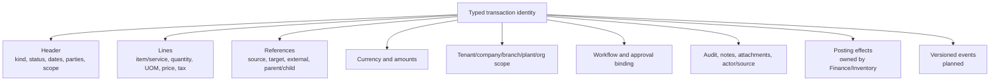

Every future transaction defines header, typed lines, references, lifecycle status, money/quantity values, organization scope, approval/workflow version, audit, notes/attachments, source, posting effects, and event identity. Domain types own semantics: a purchase-order line, inventory movement line, and journal line are not interchangeable merely because each has quantity or amount.

Current `TransactionDocument` has CUID identity, company, module/kind enum, document number, status, one amount, currency string, JSON payload, creator, timestamps, links, and approvals. The service accepts `any`, can create/list documents, and upserts parent/child links. It lacks tenant ID directly, typed line models, organization-node scope, idempotency, effective version bindings, attachments, posting states, immutable-posted enforcement, outbox, and complete audit/permission logic. It is a partial generic scaffold, not UFT completion or proof of operational Procurement/Sales/Manufacturing.

# Chapter 15 — Ledger Architecture Principles

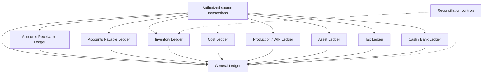

| Ledger | Owner | Posting source | Balance/correction/reconciliation | Status |
|---|---|---|---|---|
| General Ledger | Finance | Approved posting interface | Account/dimension/period sums; linked reversal/correction; reconcile subledgers | Planned; Journal scaffold only |
| Accounts Receivable | Finance | Billing, receipts, adjustments | Open-item derivation; allocation/reversal; reconcile GL/control accounts | Planned |
| Accounts Payable | Finance | Supplier invoices, payments, adjustments | Open-item derivation; allocation/reversal; reconcile GL/control accounts | Planned |
| Inventory Ledger | Inventory | Receipts, issues, transfers, adjustments, production | Item/location/status/batch/serial quantity sums; linked reversal; reconcile on-hand | Planned |
| Cost Ledger | Finance/Costing | Valuation, production cost, adjustments | Cost-element/object sums; correcting entries; reconcile GL/inventory/WIP | Planned |
| Production/WIP Ledger | Manufacturing with Finance policy | Material/labor/overhead/output effects | Order/operation cost and quantity; reversal; reconcile inventory/cost/GL | Planned |
| Asset Ledger | Finance | Capitalization, depreciation, disposal | Asset-book balance; adjustment/reversal; reconcile GL | Planned |
| Tax Ledger | Finance/Tax owner | Taxable source/posting | Jurisdiction/code/period totals; adjustment; reconcile GL/documents | Planned |
| Cash/Bank Ledger | Finance/Treasury | Receipts, payments, statements | Account/value-date balance; reversal; bank/GL reconciliation | Planned |

All posted entries are immutable, period controlled, source linked, tenant/company scoped, auditable, and reportable. Balances are derived or maintained as verified projections from entries; no domain directly edits a balance. Current accounting tables lack posted status, period controls, subledgers, reversal links, batch, dimensions, currency layers, and reconciliation. No InventoryMovement or stock-ledger model exists.

# Chapter 16 — Finance Data Ownership

Finance owns Chart of Accounts, Fiscal Calendar, Fiscal Period, Journal, Journal Line, Posting Batch, Ledger Entry, financial Dimensions, Account Determination, finance-governed exchange-rate use, tax posting, and Financial Statement mapping. Current `ChartOfAccount`, `JournalEntry`, and `JournalLine` are preserved scaffolds: company-scoped account/entry numbers, hierarchy, posting flag, posting date, memo/source document, debit/credit and free-text cost center. Fiscal periods, batches, immutable posting, dimensions, account determination, multi-currency ledger entries, mappings, and posting service are not implemented.

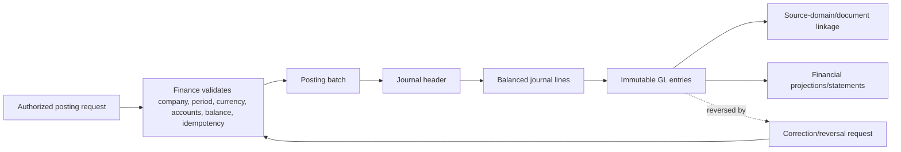

Mandatory rules are binding target decisions: Finance alone writes journals and GL entries; other domains submit governed posting requests. Posted journals are immutable. Corrections use linked reversing or correcting entries. Fiscal-period status controls posting date. Every posting retains source domain, source document/line, posting request/idempotency identity, actor, correlation, rules/account-determination version, currency/rate context, and reversal lineage. Financial statements read governed mappings/projections and reconcile to GL.

# Chapter 17 — Inventory Data Ownership

Inventory owns Inventory Movement, Stock Ledger Entry, Reservation, Availability projection, On-hand Balance projection, transfer lifecycle, stock ownership/consignment, and valuation layers. Warehouse/Zone/Bin, Batch, Serial, Stock Status, Item, and UOM are governed masters consumed by Inventory. They do not themselves record quantity truth.

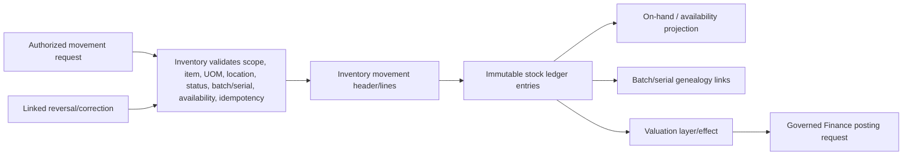

No other domain updates on-hand balances or stock entries directly. Procurement requests a receipt/return, Sales an issue/return/reservation, Manufacturing consumption/output, Quality a status/hold effect, and Maintenance a spare issue/return. Inventory validates and posts the quantity fact. Entries are immutable; reversals and corrections link original/replacement. Batch/serial genealogy preserves source/destination and split/merge transformations. Valuation layers identify method, quantity, cost, currency and source; approved valuation effects go to Finance through the posting interface.

Current DBA-004 validates Warehouse hierarchy, Bin/Zone consistency, Item tracking flags, Batch dates/identity, Serial uniqueness, and stock-status masters. The seed creates no balances. Reservation, availability, movement, on-hand, consignment, transfer, valuation, genealogy, and ledger runtime are planned for DBA-006 and later domain work.

# Chapter 18 — Finance and Inventory Interaction

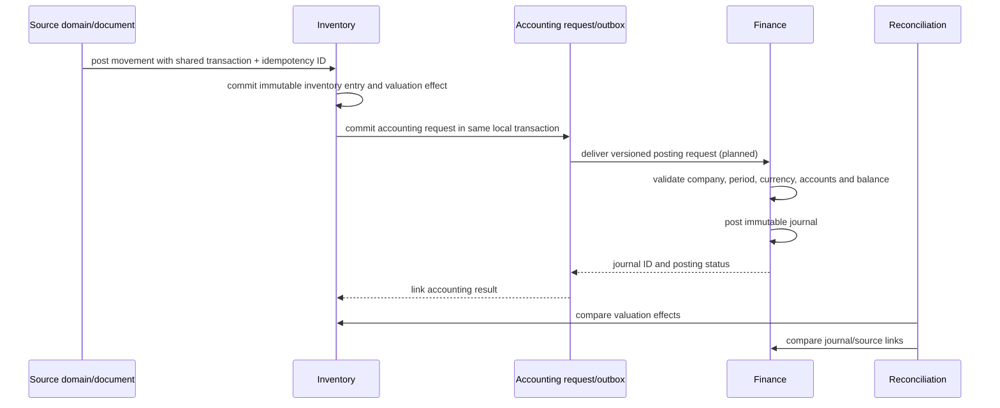

This runtime does **not** exist today. Target interaction is: Inventory posting → immutable inventory effect → accounting request/outbox record → Finance validation → journal posting → reconciliation link. A shared transaction identity connects source document, inventory movement, valuation effect, request, and journal without making one table own all domains.

The accounting request has tenant/company, source domain/object/document/line, inventory posting ID, idempotency key, posting date proposal, currency/rate context, balanced account-intent lines or typed valuation facts, schema version, correlation/causation, and status. Duplicate delivery returns the prior result. Transient failures retry; semantic failures become actionable rejected status, never silent loss. A closed-period mismatch requires authorized next-period or reopen policy. Currency/rate or valuation mismatch stops Finance posting and exposes reconciliation detail. Reversal order is source reversal, Inventory linked reversal, then Finance linked reversal; compensating status handles partial asynchronous progress.

# Chapter 19 — Procurement Data Ownership

Procurement will own requisition, RFQ, supplier quotation, purchase order, schedule lines, receipt request/reference, return request/reference, invoice-match reference, and supplier-performance facts. It owns commercial commitment and supplier selection, not stock or accounting truth.

Inventory owns the posted goods receipt/return movement and sends its immutable identity/status back. Finance owns supplier invoice, payable, payment, tax and GL posting; Procurement supplies PO/receipt/match references and discrepancy decisions. Master Data owns supplier identity/terms/UOM/Item. Direct writes from Procurement to inventory balances, journals, supplier masters, or tax tables are prohibited. Current `TransactionKind` values and generic documents are scaffolds only; no governed Procurement aggregate is implemented.

# Chapter 20 — Sales Data Ownership

Sales will own lead/opportunity reference where adopted, quotation, sales order, delivery schedule, credit-decision request/result reference, allocation request/reference, delivery request/reference, return request/reference, billing reference, and customer commitment. Sales owns commercial promise and order lifecycle, not stock movement, credit ledger, invoice posting, or cash truth.

Inventory owns reservations, allocation feasibility, delivery/return movement and availability. Finance owns credit exposure decision policy/result, customer invoice, receivable, tax and GL. Master Data owns customer/partner, price list, terms, Item and UOM. Sales stores durable references and statuses returned by those domains. Current dashboards and transaction enums do not evidence a Sales runtime.

# Chapter 21 — Manufacturing Data Ownership

Manufacturing will own BOM/formula and revision, routing, Work Center, Production Line, Machine production reference, calendars, demand, supply proposals, Production Order, material/capacity requirements, consumption/output requests and references, WIP operational state, scrap/rework, genealogy, yield, co-product and by-product definitions/results.

Inventory owns posted material consumption, returns, output receipts, stock status, batch/serial quantity and valuation layers. Quality owns plans, inspections, holds, dispositions and release decisions. Maintenance owns asset condition and maintenance work. Finance owns WIP/cost/variance/GL entries and period controls. Manufacturing references approved Item/UOM/Warehouse/organization masters and exact BOM/routing/calendar versions used.

Planning proposals are not postings. A released production order freezes or references governed versions according to policy. Consumption/output requests become fact only after Inventory posts them. Genealogy links input stock entries/batches/serials to outputs and transformations. Current Item manufacturing strategy fields, transaction kinds, warehouse/batch/serial masters, and illustrative UI are foundations; BOM, routing, planning, execution, WIP, genealogy, yield, co-/by-product runtime are planned.

# Chapter 22 — Effective Dating and Temporal Data

Valid time answers “when was this true in the business?” Transaction time answers “when did FlowCraft record or change it?” `effectiveFrom`/`effectiveTo` implement a valid period on many organization/master models; `createdAt`/`updatedAt` are transaction-time indicators but do not alone preserve every prior row version.

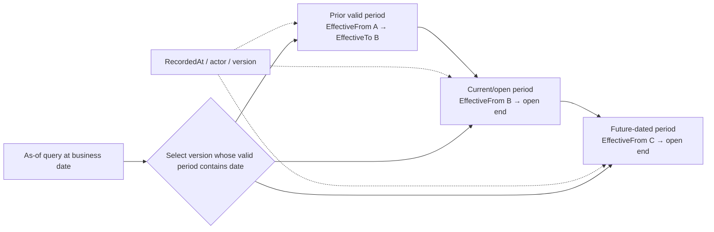

Open-ended periods use null end in current schema. The exact interval convention—recommended start-inclusive/end-exclusive—must be approved and applied consistently. Overlaps are prevented by service validation and, where practical, database exclusion/unique constraints. Gaps may be permitted only by domain policy. Future-dated changes are created/approved before activation. Backdated correction requires authority, impact analysis, reason, and downstream re-evaluation; it never silently changes posted ledgers.

Historical hierarchy uses `OrganizationRelationshipHistory` and as-of tree resolution. UOM conversions, tax codes, price lists, credit profiles, exchange rates, and future account determination need as-of selection tied to transaction/posting dates. A historical document stores or can resolve the exact version/rate/rule used. Changing current master data must not rewrite old transaction meaning.

# Chapter 23 — History, Versioning, and Audit

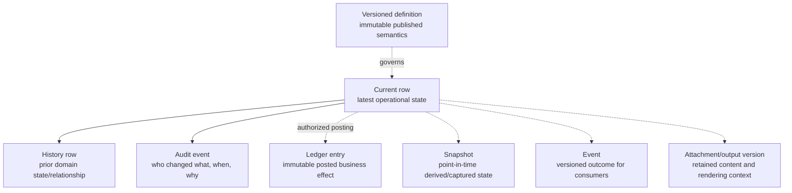

| Record type | Required when | Authority |
|---|---|---|
| Current row | Fast access to latest mutable entity state | Authoritative for current unposted/master state |
| History row | Prior business state/relationship must be queried | Authoritative for domain history/as-of meaning |
| Versioned definition | Published rules/configuration must remain reproducible | Authoritative semantics for bound execution |
| Audit event | Actor/change/reason evidence is required | Evidence, not business-state reconstruction alone |
| Ledger entry | A posting changes financial, quantity, cost or other ledger truth | Authoritative posted effect |
| Snapshot | A costly/volatile view must be preserved at a point | Derived unless policy declares a signed evidence artifact |
| Event | Consumers need an outcome outside the local transaction | Notification/integration contract, not replacement for source state |
| Attachment/output version | File/rendered evidence must be retained | Content evidence linked to source/version |

Audit cannot substitute for domain history because a redacted old/new snapshot may omit structure, validity, or relational semantics. Audit cannot substitute for a ledger because it does not enforce balanced posting, quantities, periods, currencies, reversals, or reconciliation. Conversely, ledger entries do not prove every administrative actor/configuration change; audit remains separate.

# Chapter 24 — Soft Delete, Archive, Purge, and Legal Hold

| Action | Allowed use | Approval/evidence | Retention and referential behavior |
|---|---|---|---|
| Soft delete | Hide an erroneous/non-operational mutable record while retaining row | Domain permission, actor, time, reason | References remain; excluded by default; restoration policy explicit |
| Archive | End normal selection/use of a legitimate record | Owner/steward approval and reason | Identity/history retained; historical references resolve |
| Deactivate | Temporarily block new use | Authorized owner; effective date where needed | Row remains; reactivation possible under policy |
| Supersede | Replace meaning with a new identity/version | Owner approval and replacement link | Old record remains queryable and valid for historical dates |
| Merge | Select survivor for duplicates | Steward decision, survivorship and impact plan | Source retained as alias/lineage; references changed only by governed process |
| Purge | Irreversibly remove data after purpose/retention ends | Retention owner, security/legal policy and recorded execution | Blocked by legal hold/references; proof retains non-sensitive counts/IDs as approved |
| Anonymize | Remove or irreversibly transform identifying attributes while preserving allowed statistics/relationships | Privacy/security policy and tested method | Must not corrupt ledgers, reconciliation, audit obligations or re-identify through other fields |
| Legal hold | Suspend purge/anonymization for identified matter | Authorized legal/governance instruction | Hold scope, start/release, custodian and evidence retained; no duration invented here |

Current Company, Branch, User, organization and selected master models implement soft-delete/archive/effective fields unevenly. Services generally archive instead of delete. No enterprise purge, anonymization, or legal-hold engine exists. Policies must be configurable by data class, jurisdiction/contract where confirmed, tenant, and environment; this volume defines no statutory duration.

# Chapter 25 — JSON and Extensible Data Boundaries

Current JSON fields support organization metadata/settings, custom-field definitions/values, EOR defaults/validation, workflow configuration/conditions, report/layout metadata, audit snapshots, allowed values, commercial installment definitions, change/duplicate/merge metadata, import mappings/rows/errors, export filters, and generic transaction payloads. These are valid only when bounded by schema, owner, version, size, classification, and query expectations.

**Appropriate JSON uses:** versioned metadata, validation definitions, UI configuration, immutable snapshots, extension values, import mappings, bounded external payloads, and sparse non-authoritative options. Every write should validate a named schema/version; readers must handle compatibility; sensitive keys are classified/redacted; size is bounded; fields queried regularly receive reviewed expression/GIN indexes or migrate to normalized columns.

**Prohibited authoritative JSON uses:** ledger lines, core quantities, core monetary amounts, tax bases, inventory movement facts, normalized search-critical masters, frequently joined relationships, tenant/organization security scope, period status, or account/balance dimensions. Such facts require typed columns, precision, constraints, foreign keys, indexes, lineage, and reconciliation. The generic `TransactionDocument.payload` must not become the storage strategy for DBA-005/006 ledgers.

Trade-off: JSON accelerates bounded extension but weakens compile-time typing, referential integrity, explainable query plans, and safe migrations. Promotion from JSON to normalized structure must be supported by additive backfill and compatibility read paths.

# Chapter 26 — Data Quality Architecture

Quality dimensions are completeness (required values present), validity (rules/types/ranges), uniqueness (no prohibited duplicates), consistency (facts agree across fields/domains), timeliness (available within defined need), accuracy (matches verified reality), referential integrity (valid relationships), and conformity (approved code/format/units). Criticality determines control rigor.

| Operating role | Responsibility |
|---|---|
| Data owner | Defines meaning, acceptable quality, criticality, policy and funding |
| Data steward | Reviews exceptions, duplicates, change requests, certification and remediation |
| Domain service | Prevents invalid writes and emits actionable rule codes |
| Data quality service/process | Profiles, scores, schedules rules and tracks exceptions |
| Migration owner | Proves source/target counts, transformations and reconciliation |
| Assurance/reviewer | Samples evidence and confirms certification gates |

A quality rule has ID/version, owner, object/field/scope, dimension, severity, expression/implementation, effective period, threshold, sampling/schedule, exception route, and remediation evidence. An exception carries affected identity, observed value, rule version, status, assignee, due policy, resolution and audit. Scores are weighted, reproducible summaries—not a substitute for individual critical failures. Certification binds object/scope/time, rule set, results, exceptions accepted, approver, and expiry/review date.

DBA-004 provides validation, duplicate checks, import row errors, pending requests and a simple dashboard score. A general scheduled quality engine, enterprise score model, certification and remediation workflow are planned.

## Data classification model

Sensitivity and criticality are independent labels; a record can be Internal and Safety/Quality Critical, or Highly Restricted and Security Critical.

| Sensitivity class | Example use | Handling direction |
|---|---|---|
| Public | Approved product documentation/reference labels | Approved publication; integrity/version controls still apply |
| Internal | Non-sensitive operational configuration | Authenticated access; tenant/scope control and normal logging |
| Confidential | Commercial terms, internal performance, partner contacts | Need-to-know, controlled export, encryption and masking review |
| Restricted | Personal data, bank/tax details, sensitive contracts | Strong least privilege, monitored access, masked non-production use |
| Highly Restricted | Authentication secrets, private keys, exceptional protected datasets | Dedicated secret/security controls, minimal exposure, no routine logs/metadata packages |

| Criticality class | Consequence focus | Control direction |
|---|---|---|
| Reference | Shared code consistency | Controlled source, version and adoption |
| Operational | Order/execution continuity | Availability, validation, recoverability |
| Financial | Monetary position and statements | Posting integrity, periods, reconciliation, immutable evidence |
| Safety/Quality Critical | Product/process safety and conformity | Strong traceability, approval, change control and retention policy |
| Security Critical | Identity, authorization, secrets and scope | Least privilege, tamper evidence, monitoring, recovery |
| Legal/Regulatory | Confirmed obligation evidence | Policy/legal ownership; jurisdiction-specific rules only when confirmed |

# Chapter 27 — Data Lineage and Traceability

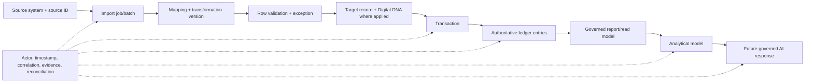

Lineage identity includes source system/instance, source object and ID, extract/import batch, file/object hash where approved, mapping and transformation version, row number, actor/service, timestamps, tenant/company, target ID/Digital DNA, correlation/causation, validation evidence, and reconciliation outcome. Each downstream projection names its upstream objects and refresh version/time.

Current import models retain file metadata, mapping JSON, raw/normalized row, validation errors, duplicate matches, imported record ID, requester, summary and rollback marker. This is a useful partial chain. They do not yet provide durable source files, transformation packages, transaction/ledger/report lineage, warehouse/lake catalog, or AI provenance. A future AI response must identify governed retrieval sources, versions, model/prompt policy, correlation, and limitations; it never becomes an authoritative write without an approved domain command.

# Chapter 28 — Data Migration Architecture

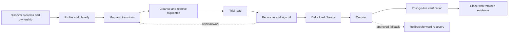

Discovery inventories sources, owners, volumes, quality, classification, dependencies and business cutoff. Profiling measures types, nulls, distributions, duplicates and referential breaks. Mapping defines source-to-target identity, units, currencies, dates, statuses and transformations. Cleansing is approved and repeatable; duplicate resolution is steward-led. Trial loads run in isolated environments with counts, rule results and performance evidence.

Delta strategy identifies changed records and freeze windows. Opening balances require domain-approved derivation and reconcile to source statements/control totals; they are posted through Finance/Inventory interfaces, never inserted as untraceable balances. Open transactions retain source identity and lifecycle. Historical transactions may be fully migrated, summarized with retained archive, or externally retained only by approved policy. Attachments preserve content hash, classification, owner and source link.

Sign-off records owners, counts/amounts/quantities, accepted exceptions, reconciliation and go/no-go. Cutover has runbook, responsibilities and checkpoints. Rollback is realistic only before irreversible new business; otherwise forward recovery is used. Post-go-live verifies samples, totals, access, reports, performance and downstream interfaces.

Current DBA-004 offers CSV/XLSX job metadata, dry-run/validation, row outcomes, duplicate checks, mappings, summary, rollback marker and audit; XLSX binary parsing, durable files, broad transformations, opening balances, attachments, delta orchestration and cutover tooling are not implemented.

# Chapter 29 — Analytical and Reporting Data Architecture

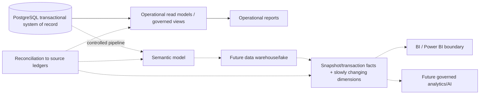

PostgreSQL operational tables and future ledgers remain authoritative. Operational read models support current screens/search without cross-domain writes. Governed reporting views expose approved columns and organization filters. A semantic model defines measures, dimensions, currency/quantity treatment, owner, formula version and freshness. A warehouse/lake is future; it may contain transaction/snapshot facts and slowly changing dimensions but cannot post business effects.

KPI ownership belongs to a business/domain owner, with Data/Analytics implementing the approved definition. Every report exposes as-of/freshness and source version. Financial/inventory metrics reconcile to ledger totals and document differences. Power BI or another BI tool consumes governed semantic endpoints/extracts/read replicas as approved—not uncontrolled credentials against production tables. Direct production-table access risks scope bypass, load instability, schema coupling and inconsistent metrics.

Current ReportDefinition/Field/Filter and preview are partial metadata/runtime foundations. No governed semantic layer, warehouse/lake, Power BI connector, slowly changing dimension process, or analytical pipeline exists.

# Chapter 30 — Retention, Archival, and Data Lifecycle

This volume defines retention classes and owners, not legal durations. Policy records purpose, sensitivity/criticality, trigger, minimum/maximum where confirmed, tenant/jurisdiction/contract applicability, archive tier, access, hold behavior, purge/anonymization method, proof and reviewer.

| Data class | Policy owner | Lifecycle direction |
|---|---|---|
| Security/authentication | Security | Minimize; retain events/assignments per security policy; secrets follow secret lifecycle |
| Audit | Audit/Security Governance | Append-only, protected archive, policy-governed export/purge subject to hold |
| Master data | Domain owner/Data Governance | Active → inactive/superseded/merged/archive; retain historical references |
| Transaction documents | Domain owner | Lifecycle retention tied to business/ledger/contract needs |
| Financial ledgers | Finance/Legal Governance | Immutable posted history; archive without breaking statements/reconciliation |
| Inventory ledgers | Inventory/Finance Governance | Immutable movement/valuation history; preserve on-hand reconciliation |
| Production genealogy | Manufacturing/Quality Governance | Preserve traceability per approved product/process policy |
| Quality records | Quality/Legal Governance | Preserve plan/result/disposition/correction evidence |
| Maintenance records | Maintenance/Asset Governance | Preserve work, meter, condition and cost history as approved |
| Reports/outputs | Reporting plus source owner | Retain definitions; outputs by evidence purpose and sensitivity |
| Attachments | Owning domain | Content-addressed/versioned retention aligned to parent and hold |
| Imports/exports | Migration/Data Movement owner | Retain mapping, counts, exceptions and evidence; files by classification |
| Integration messages | Integration owner | Retain delivery/reconciliation evidence; minimize payload duplication |
| Analytical data | Data/Analytics | Refresh/archive/purge as projection policy permits; retain lineage |
| AI prompts/responses | AI/Security/Data Governance | Future policy: minimize, classify, bind sources, control training/reuse and purge |

# Chapter 31 — Database Evolution, Performance, and Scale Direction

Accepted migrations are immutable. Change uses expand-and-contract: add nullable/new structure, deploy compatible reads/writes, backfill deterministically with checkpoints and reconciliation, validate constraints, switch consumers, then remove obsolete structure only in a later reviewed forward migration. Backfills record code/version, scope, counts, failures and restart position.

Constraints begin non-disruptively where supported and are validated after cleanup. Large indexes may use PostgreSQL online/concurrent approaches through reviewed migration operations when Prisma-generated SQL is insufficient; transaction limitations and recovery must be documented. Partitioning or archival tables are considered for measured ledger, audit, event or history volume and require partition-key alignment, uniqueness/FK implications, backup, query, retention and operational plans.

Query performance uses representative data, `EXPLAIN` evidence, scoped indexes, stable pagination and slow-query telemetry. Search-critical normalized fields remain typed/indexed. Materialized views are non-authoritative projections with refresh/freshness/reconciliation. Read replicas are for approved stale reads and never posting/authorization decisions. No partitioning, replica, warehouse/lake, or materialized-view runtime is evidenced today.

Backup/recovery design accounts for migration duration, WAL/storage, point-in-time goals, encryption, restore testing and ledger consistency. Non-production uses synthetic or masked production-derived data under policy; masking must preserve test relationships without exposing restricted values. Test fixtures cover tenant/company boundaries, temporal overlaps, decimal rounding, reversal/idempotency, large histories, migration restart, and reconciliation. No unsupported record/user/latency capacity is asserted.

# Chapter 32 — Decisions, Approval, and Roadmap

## Data architecture decision register

| Decision ID | Decision | Status | Rationale / current boundary | Owner |
|---|---|---|---|---|
| FCSB3-ADR-001 | PostgreSQL is the authoritative operational system of record. | Implemented | Current Prisma/Compose/API data path. | Data Architecture |
| FCSB3-ADR-002 | Prisma 6.19.3 remains the primary ORM at this baseline. | Implemented | Accepted repository implementation; no upgrade/replacement authorized here. | Data Access Owner |
| FCSB3-ADR-003 | UUID is the technical primary-key standard for new governed models. | Approved | DBA foundations use UUID; preserved CUID scaffolds are explicit legacy exceptions. | Database Governance |
| FCSB3-ADR-004 | Digital DNA is immutable where applied. | Implemented | Service assertion and unique schema coverage; not universal. | Data Governance |
| FCSB3-ADR-005 | Business codes are scope-specific and are not technical primary keys. | Approved | Compound unique constraints evidence scoped identities. | Domain Data Owners |
| FCSB3-ADR-006 | Tenant ownership is mandatory for tenant data. | Approved | Tenant/service scope exists; future models must carry or derive it safely. | Security/Data Architecture |
| FCSB3-ADR-007 | Posted ledger entries are immutable. | Approved | Target rule; current ledgers are not implemented. | Finance and Inventory Owners |
| FCSB3-ADR-008 | Corrections use linked reversal/correction records. | Approved | Preserves posting evidence and reconciliation. | Domain Data Owners |
| FCSB3-ADR-009 | Finance owns journals and General Ledger entries. | Approved | Prevents competing monetary truth. | Finance Owner |
| FCSB3-ADR-010 | Inventory owns stock movements and on-hand truth. | Approved | Warehouse/Item masters do not own balances. | Inventory Owner |
| FCSB3-ADR-011 | Domains do not directly write another domain's authoritative tables. | Approved | Owned interfaces preserve invariants. | Architecture Board |
| FCSB3-ADR-012 | Finance/Inventory interaction uses a governed posting interface. | Proposed | Exact request/outbox contract requires DBA-005/006 design. | Finance + Inventory Architecture |
| FCSB3-ADR-013 | Effective dating is required for changing business meaning. | Approved | Organization/master patterns provide foundation. | Data Governance |
| FCSB3-ADR-014 | Audit does not replace domain history or a ledger. | Approved | Evidence purposes and invariants differ. | Audit/Data Governance |
| FCSB3-ADR-015 | JSON cannot store authoritative ledger facts. | Approved | Typed precision, constraints, joins and reconciliation are mandatory. | Database Governance |
| FCSB3-ADR-016 | Accepted migrations remain immutable. | Implemented | Three accepted additive migrations are preserved. | Database Governance |
| FCSB3-ADR-017 | Analytics is non-authoritative. | Approved | Projections reconcile to operational owners. | Data/Analytics Governance |
| FCSB3-ADR-018 | Migration lineage must be retained. | Approved | Current import metadata is partial foundation. | Migration Governance |
| FCSB3-ADR-019 | Purge requires approved retention/legal policy and hold checks. | Proposed | No enterprise lifecycle engine exists. | Data/Security/Legal Governance |
| FCSB3-ADR-020 | Production-derived data must be masked or replaced in non-production. | Approved | Protects restricted data without weakening representative tests. | Security/Data Operations |
| FCSB3-ADR-021 | Outbox, ledger physical models, temporal interval convention and partition strategy remain unselected. | Open | Require domain/workload decisions. | Architecture Board |
| FCSB3-ADR-022 | Warehouse/lake, FKG, AI data stores and production BI technology are deferred. | Deferred | No accepted requirements or runtime evidence. | Product/Data Architecture |

## Open decisions

Open decisions are Finance and Inventory aggregate/entry schemas; source/posting identity; fiscal calendar/period ownership; money/quantity rounding; exchange-rate selection; dimensions/account determination; inventory valuation and negative-stock policy; temporal interval and overlap enforcement; outbox contract; reconciliation states; legacy CUID transition; retention catalog/hold process; analytical semantic technology; and measured scale thresholds.

## Required decisions before DBA-005 Finance Foundation

1. Approve Chart of Accounts, fiscal calendar/period, posting batch, journal and immutable ledger-entry aggregates.
2. Define balanced multi-currency money types, precision/rounding, exchange-rate source/version and base/reporting currency layers.
3. Define period states, authorization, backdating, correction/reversal and source traceability.
4. Define account dimensions/determination and financial statement mapping ownership.
5. Define idempotent posting request/result and reconciliation contracts without allowing direct domain writes.
6. Decide compatibility/migration for existing CUID accounting scaffolds and prove additive migration/backfill.
7. Specify tenant/company/organization security, audit, classification, retention and negative tests.

## Required decisions before DBA-006 Inventory Ledger

1. Approve Movement, Stock Ledger Entry, Reservation, Availability/On-hand projection and Valuation Layer aggregates.
2. Define item/location/status/batch/serial/UOM identity, quantity precision, conversions and genealogy.
3. Define posting, reversal/correction, transfer, ownership/consignment and negative-stock policies.
4. Define valuation methods, cost/currency layers and the governed Finance posting interface.
5. Define source-domain request/idempotency, async failure/retry and reconciliation states.
6. Establish workload tests, indexing/partition decision triggers and ledger/audit retention owners.
7. Prove the seed/migration creates no untraceable opening balance and provide controlled opening-load design.

## Approval roles and conditions

| Role | Approval concern | Status |
|---|---|---|
| Architecture Board | Ownership, principles, decisions, exceptions and sequencing | Pending |
| Data/Database Governance | Identity, temporal, integrity, migration and evolution | Pending |
| Finance Owner | Journal/ledger/currency/period/reconciliation rules | Pending |
| Inventory Owner | Movement/quantity/valuation/genealogy rules | Pending |
| Security Architecture | Isolation, classification, masking, retention and hold controls | Pending |
| Domain Owners | Procurement/Sales/Manufacturing/Quality/Maintenance boundaries | Pending |
| Reporting/Analytics | Semantic ownership, freshness and reconciliation | Pending |
| Integration Architecture | External IDs, lineage, posting/event contracts and FCSB-004 handoff | Pending |

Approval requires controlled-framework reconciliation; closure or ownership of open DBA-005/006 decisions; validated ownership and classification matrices; agreement that existing transaction/accounting tables are scaffolds; canonical temporal/identity/money/quantity rules; retention/legal review without invented durations; and conversion of critical risks into acceptance tests.

FCSB-004 will define API, file, webhook, event, EDI and partner integration contracts using this volume's ownership, identity, classification, lineage, idempotency and reconciliation rules. It cannot authorize direct external writes to authoritative tables or promote integration data into operational truth.

## Version history

| Version | Date | Author | Reviewer | Status | Change summary |
|---|---|---|---|---|---|
| 1.0 Draft | 2026-07-15 | FlowCraft Architecture | Pending | Architecture Review Draft | Initial evidence-based enterprise data and information architecture baseline |

## Repository evidence references

- [FCSB Series Index](./FCSB-Series-Index.md)
- [FCSB-001 — Executive and Business Architecture](./FCSB-Volume-1-Executive-and-Business-Architecture.md)
- [FCSB-002 — Application and Platform Architecture](./FCSB-Volume-2-Application-and-Platform-Architecture.md)
- [Repository README](../../README.md)
- [Root workspace configuration](../../package.json)
- [Prisma configuration](../../prisma.config.ts)
- [Prisma schema](../../apps/api/prisma/schema.prisma)
- [Accepted Prisma migrations](../../apps/api/prisma/migrations)
- [Idempotent seed and EOR registrations](../../apps/api/prisma/seed.ts)
- [Prisma service](../../apps/api/src/prisma)
- [Digital DNA service](../../apps/api/src/digital-dna)
- [Audit service](../../apps/api/src/audit)
- [Enterprise Object Registry](../../apps/api/src/enterprise-objects)
- [Organization domain](../../apps/api/src/organization)
- [Master-data domain](../../apps/api/src/master-data)
- [Transaction scaffold](../../apps/api/src/transactions)
- [Report definitions/runtime foundation](../../apps/api/src/reports)
- [Print-layout foundation](../../apps/api/src/layouts)
- [Customization foundation](../../apps/api/src/customization)
- [Workflow definition foundation](../../apps/api/src/workflows)
- [API tests](../../apps/api/test)
- [DBA-002 implementation report](../implementation/DBA-002-foundation-implementation.md)
- [DBA-003 implementation report](../implementation/DBA-003-enterprise-structure-implementation.md)
- [DBA-004 implementation report](../implementation/DBA-004-enterprise-master-data-implementation.md)
- [Docker topology](../../docker-compose.yml)
