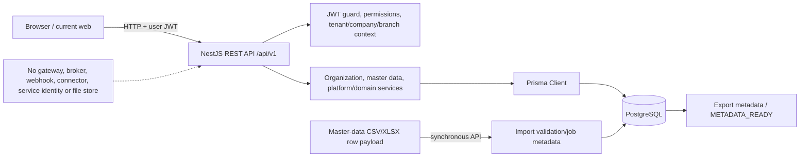
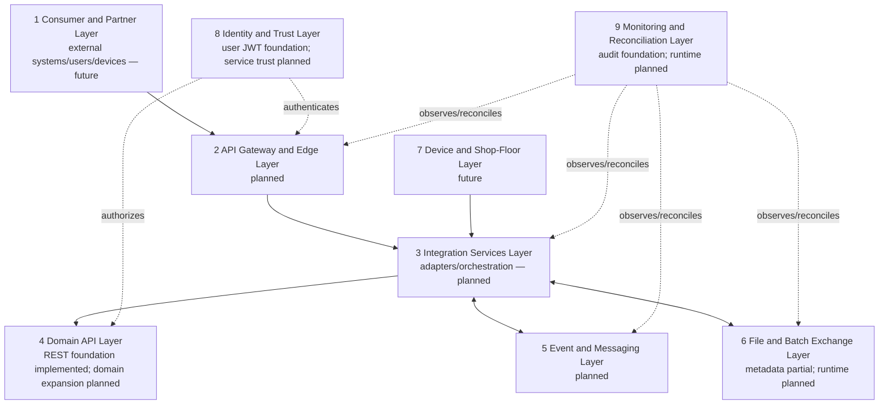
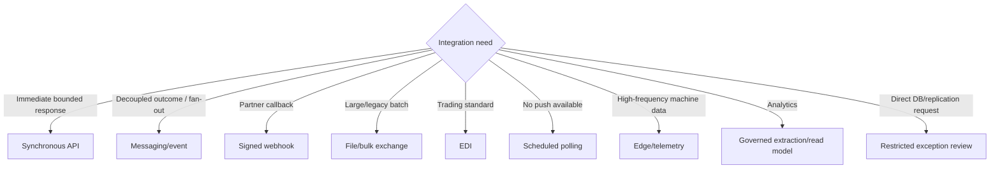
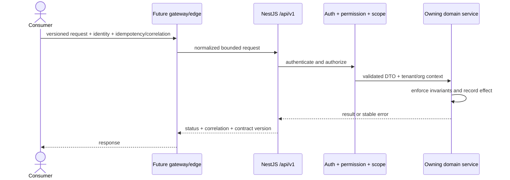
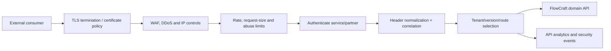
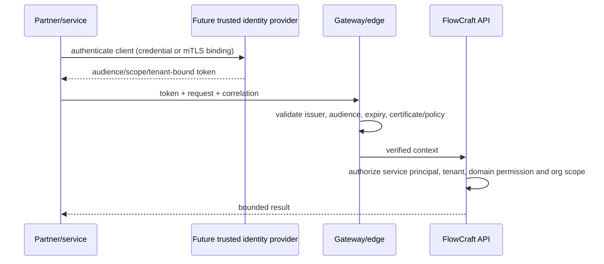
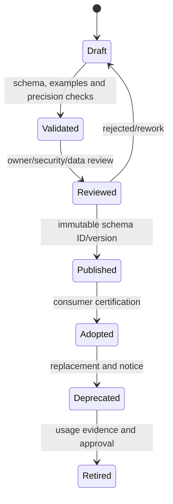

# FlowCraft Solution Blueprint

## Volume 4 — Integration Architecture

| Control | Value |
|---|---|
| Document code | FCSB-004 |
| Version | 1.0 Draft |
| Status | Architecture Review Draft |
| Owner | FlowCraft Architecture Board |
| Related milestones | DBA-002 Platform Foundation; DBA-003 Enterprise Structure; DBA-004 Enterprise Master Data; preparation for future integration milestones |
| Evidence baseline | `v0.4-dba004-merged` |
| Last updated | 2026-07-16 |
| Predecessors | [FCSB-001](./FCSB-Volume-1-Executive-and-Business-Architecture.md); [FCSB-002](./FCSB-Volume-2-Application-and-Platform-Architecture.md); [FCSB-003](./FCSB-Volume-3-Enterprise-Data-and-Information-Architecture.md) |
| Next planned volume | FCSB-005 — Security and Trust Architecture |

> **Authority notice:** This is an Architecture Review Draft. Repository evidence governs current-state claims. Gateway, service identity, broker, queue, outbox, webhook, durable file exchange, EDI, banking, government, ecommerce, analytics, identity-provider, mobile, and shop-floor connectors are target designs only until accepted implementation evidence exists.

## Status vocabulary

| Status | Meaning |
|---|---|
| **Implemented foundation** | Working, accepted capability evidenced by DBA-002 through DBA-004. |
| **Partially implemented** | Some contract, metadata, schema, or synchronous behavior exists, but not the full runtime. |
| **Planned** | Near-horizon design without accepted complete implementation. |
| **Future** | Longer-horizon connector or platform capability dependent on customer and architecture decisions. |
| **Conceptual target** | Review direction, not a claim of deployed software. |

# Chapter 1 — Purpose and Scope

FCSB-004 defines how FlowCraft Business OS exchanges commands, queries, files, events, acknowledgements, telemetry, and evidence with external systems, devices, partners, future internal services, and analytical consumers. Its audience is the Architecture Board, product/domain/security/data/integration/operations owners, engineers, testers, implementation partners, support teams, partner managers, and customer integration teams.

The scope includes API, gateway/edge, identity/trust, contracts, canonical models, domain boundaries, events/outbox/messaging, webhooks, files, EDI, banks, government portals, ecommerce, CRM/HR/payroll, analytics, MES/PLC/IoT, barcode/RFID, error handling, reconciliation, observability, security, onboarding, and runtime governance. It does not select a broker, gateway, EDI standard, bank, government schema, commerce vendor, identity provider, analytics platform, or device technology.

FCSB-001 supplies business intent; FCSB-002 supplies application boundaries and event-ready direction; FCSB-003 supplies authoritative ownership, identity, classification, lineage, and reconciliation rules. FCSB-005 will deepen trust/security; FCSB-006 deployment/operations; later domain volumes own operational contract semantics. Integration architecture must precede large operational modules and connectors so external convenience cannot create direct database writes, duplicate postings, conflicting truth, weak tenant scope, untraceable transformations, or unreconciled failures.

# Chapter 2 — Integration Architecture Executive Summary

FlowCraft currently has an API-first foundation: NestJS sets `/api/v1`, exposes REST controllers, validates typed DTOs where defined, and applies JWT user authentication, roles/permissions, tenant/company/branch context, and organization scope. The Next.js client calls the API over HTTP. DBA-004 implements synchronous master-data import validation/dry-run and export job metadata for CSV/XLSX, including mappings, row outcomes, counts, duplicate indicators, requester, audit, and a file-reference placeholder. A master-data endpoint returns a partial OpenAPI 3.1 path document.

There is no production integration runtime: no API gateway, service principal/OAuth/OIDC, message broker, event bus, queue worker, transactional outbox, webhook delivery engine, durable object/file storage, SFTP, EDI engine, partner registry, connector, or device gateway. Generic transaction/report/customization foundations are not external integration contracts.

The target operating model is contract-first and domain-owned. Edge controls authenticate and constrain callers; adapters translate external representations; domain APIs validate every authoritative effect; events/outbox handle justified asynchronous outcomes; batch/file services preserve manifests and row evidence; reconciliation proves completion. Idempotency, correlation/causation, security classification, observability, retry safety, partner onboarding/certification, and versioned packaging are mandatory. Technology selection follows workload, support, regional, security, and cost evidence.

# Chapter 3 — Integration Principles

| Principle | Rule and rationale |
|---|---|
| No direct external database writes | External callers use owned APIs/files/messages; table writes bypass invariants, scope and audit. |
| API and contract first | A versioned approved contract precedes implementation and partner mapping. |
| Preserve domain ownership | Integration requests effects; the authoritative domain validates and writes them. |
| Backend security authoritative | Gateway/UI checks supplement, never replace, NestJS/domain authorization and scope. |
| Idempotency by default | Any retryable command identifies one logical request and one result. |
| Explicit correlation and causation | Cross-system chains remain traceable and diagnosable. |
| Versioned contracts | Schemas evolve compatibly or through explicit versions/deprecation. |
| Secure transport | TLS and approved trust are default; plaintext is prohibited across untrusted boundaries. |
| Least-privilege service identity | Each connector/partner receives bounded scopes, tenant and audience. |
| Retry only when safe | Technical transient failures retry; business rejection requires correction or human decision. |
| Reconciliation by design | Counts, amounts, quantities, statuses and acknowledgements expose missing/duplicate effects. |
| No silent data loss | Every accepted request reaches success, explicit rejection, retry, dead-letter or operator action. |
| Selective canonical models | Canonical primitives reduce mapping only where semantics are stable; no universal payload. |
| Adapter isolation | Vendor/protocol details remain at the edge, outside domain logic. |
| Event-ready, not event-assumed | Model outcomes now; introduce a broker only with approved consumers and operations. |
| Human approval for high-risk actions | Payments, regulatory submissions, sensitive changes and dangerous commands require domain policy. |
| Retain integration evidence | Contract/mapping version, actor, payload reference, result and reconciliation remain discoverable. |
| Package customer integrations | Connectors are versioned, compatible, owned, tested, promotable and reversible. |

# Chapter 4 — Current Integration Baseline

Current evidence is `/api/v1`, REST controllers, CORS, global validation, JWT-protected APIs, current-user access reload, permission/role guards, scoped services, and audit calls. Pagination/search/filter/sort exist in several list APIs. OpenAPI is partial: `/api/v1/master-data/openapi` constructs master-data list/create paths; there is no application-wide Swagger bootstrap or contract registry.

DBA-004 accepts `CSV`/`XLSX` labels and row objects, then validates synchronously, stores raw/normalized JSON and errors, optionally creates non-duplicate records, and records summary/audit. Export records filters, fields, count and `fileReference`, but the service returns `METADATA_READY`; it does not render or store a file. No binary parser/object store/SFTP runtime exists. Package dependencies and Compose evidence no gateway, broker, queue, webhook, OAuth/OIDC, service identity, or external connector.

# Chapter 5 — Target Integration Architecture

The edge terminates external transport and enforces coarse controls. Integration services translate, validate envelopes, route, and reconcile without owning business truth. Domain APIs remain the only authoritative command boundary. Messaging distributes committed outcomes. File/batch handles durable large exchanges. Device/edge isolates shop-floor protocols and safety. Trust binds identities/scopes. Monitoring/reconciliation proves operational completion.

# Chapter 6 — Integration Styles

| Style | Use when | Avoid when |
|---|---|---|
| Synchronous request/response | Caller needs immediate validation/result and work is bounded | Long jobs, fan-out, fragile dependency chains |
| Asynchronous messaging | Committed outcomes need decoupling, retry or multiple consumers | Strong immediate consistency is required without recovery design |
| Webhook | FlowCraft notifies a registered partner of selected outcomes | Consumer cannot verify/sign/deduplicate or lacks availability handling |
| File exchange | High volume, legacy, scheduled or audited batch | Interactive commands or near-real-time safety needs |
| EDI | Trading partners have governed message agreements | One-off simple API integration without standard/customer need |
| Bulk import | Controlled many-record validation/creation | Unbounded request payloads or ledger posting without domain interface |
| Scheduled polling | Source offers no push/event and freshness tolerates interval | High-frequency load, strict immediacy or rate constraints |
| Device telemetry | Edge buffers time-series measurements/status | ERP is expected to perform real-time safety control |
| Command/control | Approved business command to domain/device boundary | Unsafe machine control or ambiguous acknowledgement |
| Analytical extraction | Governed projections and freshness are acceptable | Operational writes or authorization decisions on stale data |
| Database replication | Exceptional controlled read/recovery topology | Partner integration, domain writes, uncontrolled BI access |

# Chapter 7 — API Architecture for Integrations

`/api/v1` remains the current version. Resource APIs retrieve/manage state; explicit command endpoints represent publish, archive, post, reverse, approve or import actions. List contracts standardize cursor/page strategy, limits, allowlisted filtering/sorting/search and deterministic order. Bulk APIs bound item count/size and return per-item result. Async APIs return durable job ID, status/progress location, cancellation policy and result reference.

Retryable commands require an idempotency key scoped by tenant, consumer and operation. Correlation IDs are accepted/generated and returned; causation identifies the triggering request/event. A standard error carries stable code, message, field details, correlation, retryability and safe context. Rate limits, deprecation notices, compatibility policy, consumer contracts, an application-wide OpenAPI document, contract tests and partner sandbox are planned. Current APIs do not evidence rate limiting, a standard error envelope, idempotency middleware or sandbox.

# Chapter 8 — API Gateway and Edge Direction

The target edge performs routing, TLS termination, authentication, rate limiting, optional IP policy, request-size limits, WAF/DDoS integration, header normalization, correlation creation/propagation, API analytics, tenant/version routing and certificate lifecycle. It must not make domain authorization or silently transform authoritative meaning. Backend guards revalidate identity, tenant, scope and permissions.

No production API gateway is implemented. Compose exposes web/API host ports directly. Product choice, hosted/on-prem topology, availability, data residency, certificate ownership and operational support belong to FCSB-005/006 decisions.

# Chapter 9 — Identity and Service-to-Service Trust

Current identity is user login/JWT; no separate service principal exists. Target service identities are distinct records with owner, purpose, tenant, scopes, allowed audiences, credential/certificate references, status, rotation and audit. OAuth 2.0 client credentials is the default conceptual machine flow; OIDC governs user federation; mTLS may bind high-trust partners. API keys are allowed only when unavoidable, hashed/referenced, narrowly scoped, rotated and never accepted as tenant authority alone.

Tokens validate issuer, audience, expiry, scope and tenant binding. Certificates have owner, issuer, serial/fingerprint, purpose, validity, rotation/revocation and alerting. Partner identity maps to approved organization/contract and cannot impersonate a user. Secrets are stored in approved secret facilities, not metadata/source/logs. FCSB-005 will define MFA, SSO/OIDC, credential assurance, key/certificate management and threat controls.

# Chapter 10 — Contract and Schema Governance

A contract has owner/domain, schema ID, semantic version, purpose, transport, direction, sensitivity, tenant behavior, required/optional fields, enum policy, decimal precision/rounding, timestamps/timezone, currency/UOM rules, error schema, compatibility class, deprecation dates/process, consumers, fixtures and approval evidence. Required fields are added only compatibly or in a new major version. Enums use documented unknown-value handling; free-form strings cannot hide controlled semantics.

Compatibility is tested producer-to-old-consumer and old-producer-to-new-consumer where promised. A future contract registry stores immutable schemas, examples, owners, dependencies, adoption and retirement evidence; it does not generate domain behavior automatically. Consumer impact analysis covers mappings, storage, security, reconciliation and support. Current DTOs/EOR/OpenAPI provide foundations, not a governed enterprise registry.
