# FlowCraft Solution Blueprint

## Volume 5 — Security and Trust Architecture

| Document control | Value |
|---|---|
| Document code | FCSB-005 |
| Version | 1.0 Draft |
| Status | Architecture Review Draft |
| Approval status | Pending Architecture Board and Security Review |
| Last updated | 2026-07-16 |
| Related milestones | DBA-002 Platform Foundation; DBA-003 Enterprise Structure; DBA-004 Enterprise Master Data; security gates for DBA-005 Finance Foundation, DBA-006 Inventory Ledger, and production deployment |
| Dependencies | FCSB-001 through FCSB-004; controlled FEAPB/FEOM/EOR definitions; accepted schema, migrations, seed, tests, application, web-session, and deployment evidence |
| Next planned volume | FCSB-006 — Deployment and Operations Architecture |

This draft is an architecture reference, not evidence of production readiness, certification, legal compliance, or implementation of proposed controls.

## Status vocabulary

| Status | Meaning in this volume |
|---|---|
| Implemented | Directly evidenced in the accepted repository baseline through `v0.4-dba004-merged`. |
| Partial | A useful foundation exists, but coverage or production assurance is incomplete. |
| Approved | Architecture direction accepted by this draft subject to board approval; implementation may not exist. |
| Proposed | Recommended target requiring review, design, implementation, and evidence. |
| Open | A material choice or risk has not been resolved. |
| Deferred | Deliberately left to a later volume, milestone, or evidence-based selection. |
| Future | Directional capability outside the current implementation baseline. |

# Chapter 1 — Purpose and Scope

FCSB-005 defines how FlowCraft Business OS protects human and machine identity, browser sessions, APIs, tenant and organization boundaries, authoritative business data, infrastructure, integrations, metadata, extensions, audit evidence, operational access, and future AI capability. Its audience is the Architecture Board, Security Review authority, product and domain owners, engineering, operations, data and integration owners, internal audit, implementation partners, and customer security teams.

Scope includes threat and trust models; identity, authentication, session, authorization, segregation-of-duties (SoD), privileged-access, isolation, API/web/data/encryption/secrets/key security, audit/detection/incident response, vulnerability and software-supply-chain management, database/container/integration/device/privacy controls, assurance, and production security gates. Detailed deployment topology, availability, backup execution, disaster recovery, and on-call operations remain for FCSB-006. This volume does not select an identity provider, secrets manager, KMS/HSM, WAF, SIEM, SOC provider, scanner, certificate authority, orchestration platform, or compliance framework implementation.

[FCSB-001](./FCSB-Volume-1-Executive-and-Business-Architecture.md) supplies business intent; [FCSB-002](./FCSB-Volume-2-Application-and-Platform-Architecture.md) supplies application/runtime boundaries; [FCSB-003](./FCSB-Volume-3-Enterprise-Data-and-Information-Architecture.md) supplies ownership, classification, lineage, retention, and authority; [FCSB-004](./FCSB-Volume-4-Integration-Architecture.md) supplies integration contracts and trust seams. FCSB-006 must turn these controls into deployable operational evidence. Later domain, AI, mobile, and governance volumes refine their own risks without weakening this baseline.

Security architecture precedes production assurance and operational Finance, Inventory, Procurement, Sales, and Manufacturing modules because those domains create financially authoritative postings, stock evidence, approvals, partner obligations, personal data, and machine-facing actions. A feature-complete module is not trusted until its identities, permissions, SoD, immutable evidence, isolation, monitoring, recovery, and release controls are verified.

# Chapter 2 — Security Architecture Executive Summary

The implemented foundation comprises username/password login, bcrypt hashes, environment-configured JWT signing and expiry, active/deleted/status enforcement, normalized role and object-action permissions, tenant/company/branch context, effective-dated organization access, explicit Super Admin behavior, service-layer scoping, Digital DNA, audit snapshots, credential-field redaction, and 76 accepted tests at the DBA-004 baseline. The JWT guard verifies the bearer token and reloads current user, role, and permission state from PostgreSQL for protected requests.

The current browser stores the bearer JWT and user summary in `localStorage`; there is no refresh-token, server session, revocation list, idle timeout, device inventory, or complete logout evidence. CORS reflects request origins while allowing credentials. Authentication has no throttling, lockout, MFA, federation, service principal, or step-up control. Protection is controller/route based rather than a global deny-by-default policy, and some preserved controllers use authentication or legacy roles without object permissions. Audit is a useful application foundation, not tamper-proof non-repudiation or a substitute for domain history and ledgers.

The target is zero-trust in the practical sense: authenticate every actor and workload, authorize every operation and scope at the backend, minimize implicit trust, verify context continuously, and record high-risk evidence. Defense in depth combines identity assurance, safe sessions, edge controls, application authorization, tenant isolation, data protection, integration trust, hardened infrastructure, detection/response, secure development, and governance. Current maturity is development foundation; production trust is conditional on the Chapter 34 gates.

# Chapter 3 — Security Principles

The following principles are normative for target architecture:

1. Never trust solely because a request originates on an internal network.
2. Authenticate and authorize explicitly; backend decisions are authoritative.
3. Enforce least privilege, deny by default, and fail closed when identity or scope is uncertain.
4. Isolate every tenant and enforce company, branch, plant, and organization scope at every relevant query and effect.
5. Separate high-risk duties and require stronger controls for privileged, posting, approval, payment, export, and configuration actions.
6. Give every human, service, integration partner, and device a unique accountable identity; shared user accounts are prohibited.
7. Use secure session handling, short-lived authority, revocation, and step-up assurance appropriate to risk.
8. Apply defense in depth, secure defaults, security by design, privacy by design, and upgrade-safe controls.
9. Minimize sensitive data and encrypt it in transit and at rest according to classification and threat.
10. Keep secrets outside source, metadata, packages, logs, audit payloads, exports, and backups unless the backup itself is an approved encrypted secret-store backup.
11. Audit important identity, access, configuration, approval, posting, export, and privileged actions.
12. Preserve immutable financial and inventory evidence; corrections are linked compensating actions, not destructive rewrites.
13. Do not use shared accounts or permanent emergency access; break-glass access is exceptional, time-limited, reviewed, and auditable.
14. Customer extensions and integration adapters receive no security exemption.
15. AI never bypasses permissions, tenant scope, SoD, approval, posting, or immutable-evidence rules.

# Chapter 4 — Current Security Baseline

| Capability | Evidence-backed state | Security interpretation |
|---|---|---|
| Password authentication | Implemented | Login compares bcrypt hashes; user creation and seed hashing use a cost factor of 12. No full password-policy lifecycle is evidenced. |
| JWT | Implemented foundation | Configurable signing secret and expiry; default development expiry is one day. Claims include subject, email, roles, permissions, tenant/client, company, and branch. |
| Current-access refresh | Implemented | Guard verifies the token, reloads active/non-deleted user and current active role permissions, and constructs request context. |
| Authorization | Partial | Permission, role, tenant, and organization guards/services exist; coverage is route-specific and preserved controllers vary. |
| Tenant/organization isolation | Partial | Tenant-scoped queries, company/branch checks, and effective-dated organization access exist with negative tests; no database RLS or comprehensive isolation suite exists. |
| Super Admin | Implemented foundation | Explicit guard bypass exists; production eligibility, assignment workflow, step-up, time limits, and monitoring do not. |
| Audit | Partial | Application writes before/after snapshots, actor/context and trace ID with credential-like field redaction. No immutable log store or SIEM exists. |
| CORS | Partial/risky | API currently reflects origins and enables credentials; a production allowlist is not implemented. |
| Browser session | Partial/risky | Bearer token and user summary are stored in `localStorage`; no refresh/revocation/idle-session design exists. |
| Development identities | Development only | Seeded admin and prefilled login defaults exist in repository configuration/UI; they are not acceptable production credentials. |
| Public routes | Implemented | Login and database-backed health are public. The current health response requires exposure review and separation into liveness/readiness. |
| Production controls | Not implemented | MFA, SSO/OIDC/SAML, service principals, mTLS, gateway/WAF/DDoS, SIEM/SOC, managed secrets, HSM/KMS, centralized certificates, DLP, SoD engine, access certification, and production incident automation are absent. |

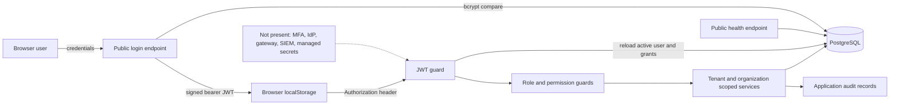

# Chapter 5 — Target Security Architecture

| Layer | Target responsibility | Current status |
|---:|---|---|
| 1. User and Device | Managed browser/device posture, secure user experience, phishing-resistant options, safe local state | Partial |
| 2. Identity Provider and Authentication | Human federation, MFA, recovery, lifecycle, service/workload/device identity | Proposed |
| 3. Edge and Network Security | TLS termination, allowlisted CORS, WAF/rate controls, ingress policy, segmentation | Proposed; no gateway/WAF exists |
| 4. Application Authorization | Deny-default authentication, RBAC plus scoped/context policy, step-up and SoD hooks | Partial |
| 5. Domain and Data Security | Domain invariants, classification, field/record/export controls, immutable evidence | Partial foundation |
| 6. Integration Trust | Separate principals, scoped contracts, mTLS/OAuth where approved, signing and replay controls | Proposed |
| 7. Infrastructure and Platform | Hardened runtime, least-privilege database, managed secrets/keys, encrypted storage | Proposed |
| 8. Monitoring, Detection, and Response | Structured security telemetry, SIEM/SOC ownership, alerting, response evidence | Proposed |
| 9. Governance, Risk, and Assurance | Control catalog, risk/exception ownership, testing, review, customer evidence | Proposed |

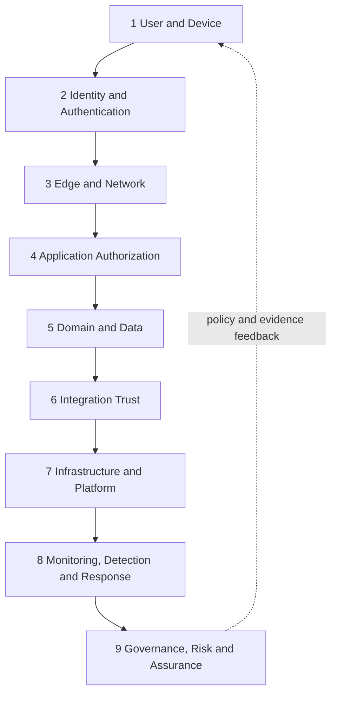

# Chapter 6 — Threat Model

FlowCraft uses STRIDE as a structured design aid, not as certification. Threat actors include external attackers, malicious insiders, compromised users or administrators, compromised service accounts, supply-chain attackers, compromised integration partners, ransomware actors, accidental users, and misconfigured customer environments. Protected assets include credentials, sessions, tenant boundaries, financial/inventory/manufacturing data, customer/supplier/personal data, audit evidence, configuration metadata, source, backups, secrets, and certificates.

```mermaid
flowchart LR
  subgraph Actors
    A1["External attacker"]
    A2["Insider or compromised user"]
    A3["Compromised admin or service"]
    A4["Supplier or partner compromise"]
    A5["Ransomware or misconfiguration"]
  end
  subgraph STRIDE
    S["Spoofing"]
    T["Tampering"]
    R["Repudiation"]
    I["Information disclosure"]
    D["Denial of service"]
    E["Elevation of privilege"]
  end
  subgraph Assets
    X1["Identity and sessions"]
    X2["Tenant and ERP data"]
    X3["Audit and configuration"]
    X4["Secrets, keys and backups"]
    X5["Source and runtime"]
  end
  Actors --> STRIDE --> Assets
```

Threat analysis is repeated per feature and trust boundary: identify asset/owner, entry point, actor capability, abuse case, existing control, gap, target mitigation, verification, residual risk, and acceptance authority. Privacy harm, fraud, safety impact, recovery cost, and cross-tenant blast radius influence priority even when a technical severity score is similar.

# Chapter 7 — Trust Boundaries

The browser/web, web/API, API/database, external consumer/edge, edge/domain API, service/service, tenant/tenant, company/company, user/organization, API/background worker, application/file store, application/analytics, ERP/shop-floor, and production/non-production seams are explicit trust boundaries. Identity and authorization context must be revalidated when crossing one; network adjacency, a prior UI decision, or a foreign key supplied by a caller is insufficient.

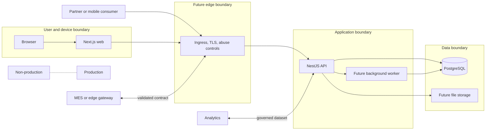

Tenant, company, and organization are logical boundaries inside shared services and storage. Cache keys, job leases, files, search indexes, exports, logs, metrics labels, and analytics datasets must carry the same isolation semantics as primary queries. Production identities, secrets, data, and control planes are never reused in non-production.

# Chapter 8 — Identity Architecture

Current identity represents human users in PostgreSQL with tenant, active/deleted/status, default company/branch, role assignments, company/branch access, and effective-dated organization-node access. Administrators are roles on those users. There is no separate service principal, workload identity, partner federation identity, or device identity model.

Target identity classes are: workforce/customer human, privileged administrator, emergency local identity, service principal, workload identity, external partner, and device/edge gateway. Each has immutable ID, tenant/realm, owner, purpose, proofing/registration evidence, status, assurance level, credentials held by an approved facility, scopes, lifecycle timestamps, review cadence, and revocation path. A partner or device never impersonates a human.

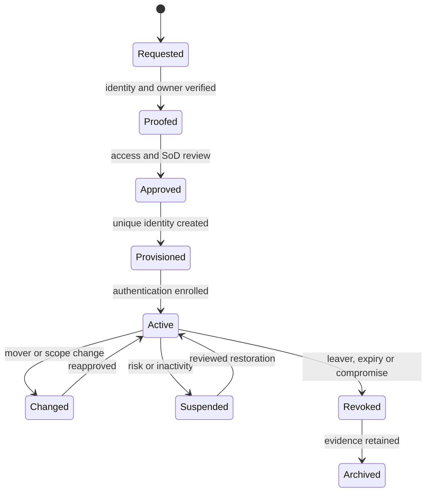

Joiner/mover/leaver events are authoritative, timely, and reconciled. Managers/domain owners approve business access; Security owns identity policy; Operations owns production identity execution; service/device owners attest purpose and use. Shared accounts are prohibited. Local emergency identities are few, disabled or strongly protected when idle, excluded from normal work, monitored on use, and rotated after activation.

# Chapter 9 — Authentication Architecture

The current username/password flow validates an email-shaped identifier, enforces an eight-character DTO minimum, performs bcrypt comparison, returns one generic invalid-credential response for missing/inactive/deleted/non-active users or a bad password, and signs a JWT. It does not evidence password history, breached-password screening, complexity beyond minimum length, login rate limiting, lockout, MFA, recovery, device risk, or federation.

Production authentication is Proposed: federation through an approved OIDC provider where possible; SAML only for customer compatibility; MFA for privileged and high-risk access; step-up for role/security changes, sensitive exports, payment release, posting overrides, secret/key operations, break-glass, and other risk-defined actions. Passwordless and phishing-resistant authenticators are future options. Local passwords require approved length, screening, secure recovery, retry throttling, suspicious-login telemetry, and no security questions. Recovery must not be weaker than enrollment.

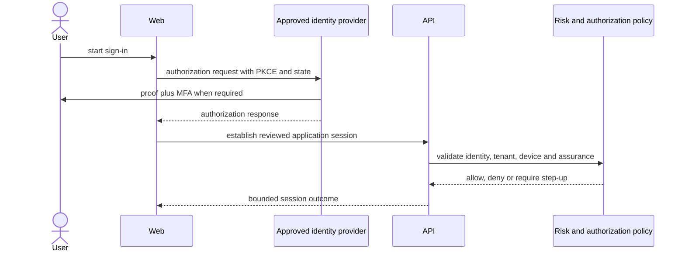

Service authentication uses separate non-human principals with approved OAuth client credentials, workload federation, or mTLS as appropriate; static API keys are exceptional, hashed/referenced, scoped, rotated, and never sufficient as tenant authority alone. Identity-provider, protocol, factor, rate, and recovery selections remain Open pending risk and deployment design.

# Chapter 10 — Session and Token Security

Current state: the API returns one bearer JWT, normally expiring according to `JWT_EXPIRES_IN` (development default one day); the web stores it in `localStorage` and sends it in the `Authorization` header. JWT claims include subject, email, roles, permissions, tenant/client, company, and branch, but the guard trusts only the verified subject for lookup and rebuilds current access context. No issuer, audience, JTI/session ID, refresh token, rotation, revocation store, idle timeout, concurrent-session inventory, remember-me policy, or emergency global invalidation is evidenced. XSS can expose `localStorage` tokens.

The Proposed production pattern is a backend-for-frontend or equivalent reviewed session: a short-lived access token remains server-side or in protected memory; a rotated refresh/session credential uses `Secure`, `HttpOnly`, appropriately scoped `SameSite` cookies; CSRF tokens and origin checks protect state-changing cookie-authenticated requests. Cookie use reduces script-readable token theft but creates CSRF obligations and does not replace CSP/XSS controls.

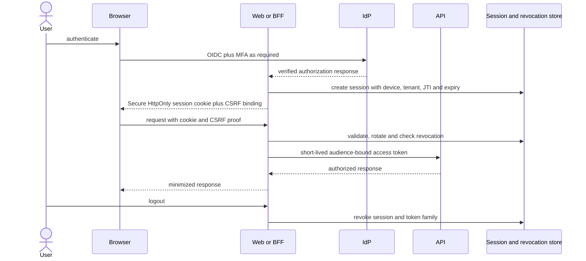

Access and refresh/session credentials have separate short and bounded lifetimes; rotation detects reuse and revokes the token family. Idle and absolute timeouts, logout, password/role/status-change revocation, concurrent-session policy, device/session inventory, clock-skew tolerance, issuer/audience validation, JTI/session correlation, and emergency tenant/global revocation are required. “Remember me” is disabled for privileged access and otherwise risk-approved. Exact lifetimes and architecture remain Open until threat, IdP, web topology, and user-experience review.

# Chapter 11 — Authorization Architecture

Current authorization combines RBAC object-action permission codes, role checks, tenant identity, default company/branch context, explicit company/branch validation, effective-dated organization-node access levels (`VIEW` through `ADMINISTER`), descendant inclusion, and an explicit Super Admin bypass. The web hides some actions using stored permissions, but the UI is not an authorization boundary. Some legacy controllers use JWT-only or enum-role protection, so policy consistency is Partial.

Target authorization is RBAC plus scoped ABAC: role/permission answers “may this principal attempt this action?” while attributes and context constrain tenant, company, branch, plant, organization node, record ownership, lifecycle state, amount/risk threshold, approval authority, time, device assurance, delegation, and temporary access. Record-level policies belong to the owning domain and are applied before query or mutation. Explicit denies, suspension, scope mismatch, SoD conflict, expired delegation, and insufficient step-up override allows.

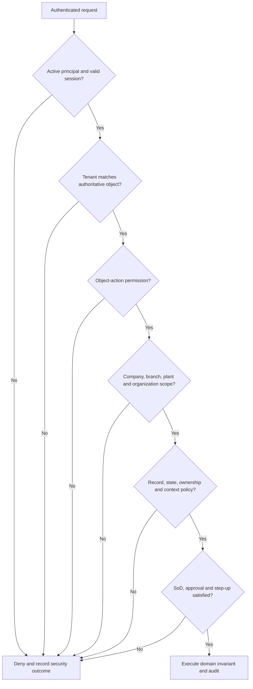

Delegation is explicit, purpose-bound, scoped, start/end dated, approved, revocable, and visible in audit. Temporary access auto-expires. Super Admin is not routine operational authority and must still respect immutable posting, safety, privacy, and evidentiary rules unless a separately approved recovery procedure says otherwise.

# Chapter 12 — Segregation of Duties

A formal SoD engine is not currently implemented. Roles and permissions provide primitives, workflows provide publication/approval foundations, and audit provides evidence, but there is no conflict-rule catalog, assignment-time prevention, transaction-time SoD evaluation, automated certification, or compensating-control workflow.

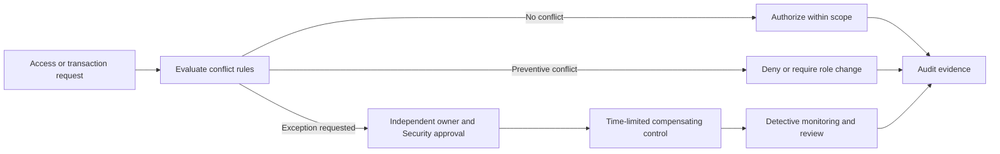

Preventive controls block conflicting assignment or action; detective controls analyze access, transactions, overrides, and unusual combinations; compensating controls require independent review, reduced limits, time bounds, enhanced monitoring, and documented risk acceptance. Conflicts span user/role administration, master creation/approval, supplier/payment, customer credit/order, purchase/receipt/invoice/payment, journal prepare/post, bank setup/release, inventory adjustment, production issue/completion, quality inspect/release, maintenance request/approve/close, configuration edit/publish, and developer/production access. The practical matrix appears in Chapter 34.

# Chapter 13 — Privileged Access Management

Privileged identities include Super Admin, Tenant Admin, Security Admin, Database Admin, Operations Admin, developers with production access, support personnel, and break-glass custodians. Current evidence has only ordinary users/roles plus an explicit Super Admin guard bypass; it does not evidence a PAM vault, just-in-time elevation, privileged session recording, step-up MFA, dual control, or periodic certification.

Target privileged access is uniquely assigned, separately authenticated, MFA-protected, purpose-limited, ticket/approval linked, just in time, time boxed, monitored, and revoked automatically. Normal work uses a non-privileged identity. Support access requires customer/tenant authorization, scoped troubleshooting purpose, minimized data, and expiry. Database and operations access use separate identities and do not inherit application Super Admin.

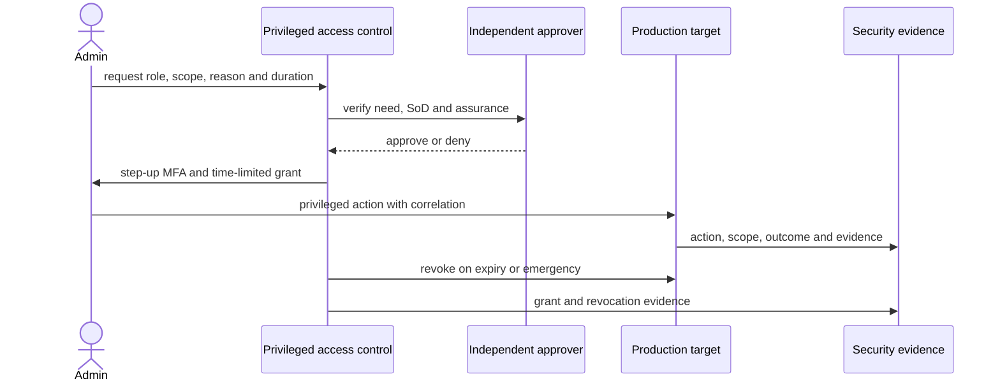

Super Admin is exceptional, not a support convenience. Assignment requires dual approval, risk justification, short duration where feasible, alerts on activation/use, complete audit, and post-use review. Break-glass credentials are vaulted, tested, rotated after use, and never permanent personal access. Session recording is Future and subject to privacy, storage, and legal review; command/action evidence is mandatory even when recording is unavailable.

# Chapter 14 — Tenant and Organization Isolation

Tenant isolation is a mandatory invariant. Current services commonly place `tenantId` in queries and validate company/branch relationships; DBA-003 adds effective-dated organization-node access with descendant scope. Negative tests cover selected cross-tenant/company and organization cases. Gaps include no database row-level security, no universal repository abstraction, incomplete legacy coverage, no cache/job/file isolation implementation, and no broad adversarial IDOR suite.

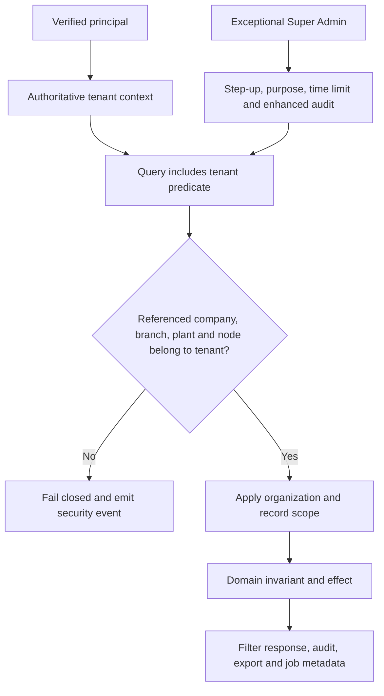

Every foreign identifier is re-resolved under the authoritative tenant before use; opaque IDs do not prevent guessing. Aggregations, counts, search, autocomplete, errors, exports, imports, audit queries, caches, durable jobs, file keys, object storage prefixes, observability labels, analytics datasets, and backups must preserve isolation. Cache keys start with environment and tenant; job/file ownership is checked on every read and effect. Cross-company consolidation uses explicit authorized semantics, never omission of scope predicates.

Required tests include cross-tenant ID substitution for every route class, indirect relationship mismatch, count/search/error leakage, export/job/file retrieval, stale-cache keys, descendant-access expiry, company/branch/plant mismatch, bulk mixed-tenant input, and exceptional Super Admin use. Database RLS is an Open defense-in-depth assessment, not a substitute for application policy.

# Chapter 15 — API Security

Current API foundations are `/api/v1`, bearer JWT guards, role/permission decorators, global class-validator transformation with whitelist and forbidden extra DTO properties, service-layer tenant checks, generic authentication errors, and partial OpenAPI for master data. The login and health endpoints are public. Some legacy endpoints use inline/dynamic payloads, authentication-only or legacy-role authorization; there is no global authentication policy, request-size standard, rate limiter, gateway, uniform correlation middleware, or hardened error filter evidenced.

Target API controls are:

- global deny-default protection with an explicit, reviewed public-route marker;
- object-action and record/scope authorization at controller and domain service boundaries;
- typed DTOs, allowlisted fields, bounded strings/arrays/nesting/files, content-type checks, and output allowlists;
- parameterized Prisma access plus validation against injection, unsafe dynamic delegates, filters, sorting, and report expressions;
- mass-assignment resistance through DTO-to-command mapping rather than spreading untrusted objects into privileged fields;
- tenant-aware throttling, credential-stuffing protection, quotas, timeouts, pagination, export limits, and async job controls;
- idempotency keys for retryable commands and correlation/causation IDs across request, audit, jobs, and integrations;
- production CORS allowlists, CSRF defense for cookie sessions, safe error codes without internal stack/schema disclosure, and controlled OpenAPI exposure;
- versioned contracts, supported deprecation windows, consumer evidence, and security review of public/bulk/file/async APIs.

Health is split into minimal public liveness and restricted readiness/diagnostics. File uploads require extension-independent type inspection, size limits, malware scanning, quarantine, encrypted tenant-scoped storage, safe names, and asynchronous parsing. OpenAPI never publishes internal-only operations or examples containing sensitive data.

# Chapter 16 — Web Application Security

The web is an experience layer, not an authorization boundary. Current `localStorage` token/user state, action hiding, generic fetch errors, prefilled development login values, and lack of evidenced centralized route/session protection are development limitations. API authorization remains authoritative.

Production web controls include output encoding, safe DOM APIs, dependency review, a restrictive Content Security Policy, nonce/hash governance, frame-ancestor/clickjacking protection, MIME sniffing protection, referrer policy, permissions policy, secure cookies, CSRF binding, safe redirects, no sensitive browser caching, and deliberate clipboard/download/autofill behavior. Trusted Types is Future where browser/platform compatibility supports it. Inline scripts/styles and third-party content require explicit inventory and exception review.

Sensitive data is minimized in browser state, never placed in URLs or client logs, cleared on logout/session expiry, and protected from back-forward cache where necessary. Permission-aware UI improves usability but cannot grant. Routes redirect unauthenticated users and handle expiry centrally. Errors reveal actionable user guidance without stack, query, tenant, or authorization detail. Production builds disable unnecessary source maps and debug tools or protect them as approved operational artifacts.

# Chapter 17 — Data Security and Classification

FCSB-003 classification is extended with security handling:

| Class | Examples/intent | Minimum handling direction |
|---|---|---|
| Public | Approved public product/help material | Integrity and publication approval; no confidential context |
| Internal | Routine operating metadata not intended for public release | Authenticated access, controlled sharing and retention |
| Confidential | Customer/supplier/commercial and ordinary personal data | Need-to-know scope, encryption, controlled export, masked non-production copies |
| Restricted | Financial details, payroll, credentials-related records, high-impact configuration | Strong approval, field/export limits, enhanced audit, encryption and short retention where applicable |
| Highly Restricted | Private keys, root/break-glass material, regulated/high-consequence secrets or safety-sensitive commands | Dedicated custody, dual control, strongest isolation, no ordinary logging/export/AI use |

Data owners classify datasets and fields; domain owners enforce purpose and access; Security defines minimum controls; Privacy/Legal provides jurisdiction-specific advice; Operations preserves storage/backup controls. Criticality classes are: C1 supporting, C2 operational, C3 authoritative, C4 safety/financial/identity critical. Classification governs confidentiality; criticality governs integrity/availability. A dataset can be both Confidential and C4.

Masking, export, logging, retention, analytics, backup, migration, and AI rules follow the highest contributing field classification. Non-production receives synthetic or irreversibly masked production data under approved exceptions. Analytics gets governed datasets with row/field security. AI access is opt-in by approved object/field and provider, never inferred from ordinary user access.

# Chapter 18 — Encryption Architecture

Production encryption infrastructure is not evidenced. Development HTTP endpoints and PostgreSQL Compose storage must not be represented as production-safe. The target requires modern TLS across untrusted boundaries and service/database links according to deployment risk, encrypted databases/volumes/object stores/backups, and field/application encryption only where threat and access separation justify its operational cost.

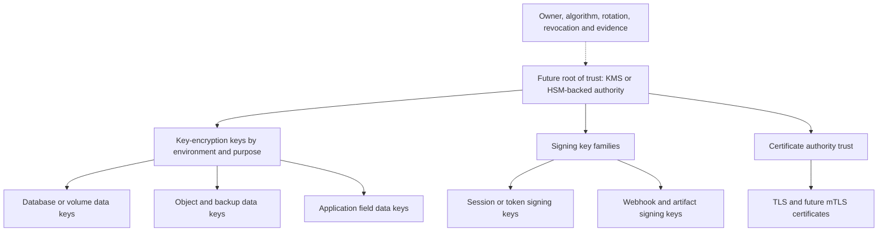

Keys and data are separated by storage, access role, and audit. Enveloping allows rotation of key-encryption keys without rewriting all data; data-key rotation follows risk and cryptoperiod. Multi-tenant options include shared service keys with tenant-bound access context or per-tenant keys for contractual/isolation requirements; selection is Open. Algorithms, modes, key sizes, protocols, and libraries come from an approved current cryptographic standard and are centrally inventoried. Custom cryptography and weak/obsolete protocols are prohibited. Certificate hostname, chain, expiry, revocation status where supported, and intended usage are validated—never bypassed for convenience.

# Chapter 19 — Secrets Management

Current configuration reads database and JWT values from environment variables; `.env` files are ignored, examples contain development placeholders/defaults, and Docker Compose supplies development fallbacks. The JWT module also has a code fallback intended for development. This is a Partial local foundation, not a production secrets architecture.

Production secrets use an approved managed secrets facility with workload identity, least-privilege policy, environment/tenant separation where required, versioning, audit, rotation, revocation, availability design, and break-glass recovery. Covered material includes database credentials, JWT/session signing references, API/OAuth credentials, webhook keys, certificates, private keys, encryption keys, and vendor tokens. Applications receive short-lived or mounted/injected values without baking them into images.

Secrets never appear in source, metadata, extension packages, logs, traces, error responses, audit snapshots, test fixtures, screenshots, exports, issue trackers, or ordinary backups. Redaction is defense in depth, not permission to log a secret. Automated secret scanning covers commits, build artifacts, images, and release packages; detections trigger containment, revocation/rotation, history and exposure assessment, evidence preservation, and owner notification. Exact platform and rotation periods remain Open.

# Chapter 20 — Key and Certificate Management

Signing keys, encryption keys, TLS certificates, and future mTLS certificates have named business/technical owners, purpose, environment, algorithm/policy, issuer, subject/audience, storage reference, activation, expiry, rotation/renewal window, revocation status, dependencies, and compromise procedure. Private material is non-exportable where feasible; no single person should both authorize and extract Highly Restricted key material.

Issuance follows verified identity and approved naming. Automated renewal is preferred with expiry alerts and tested rollover overlap. Verification supports current and prior public keys for the bounded period needed to validate historical signatures; retired private keys cannot create new signatures. Compromise handling revokes trust, rotates affected credentials, identifies dependent sessions/integrations/data, preserves evidence, and communicates through incident procedures. Certificate Transparency is used where applicable to publicly trusted certificates; internal PKI requires its own issuance log and monitoring. Central certificate management and HSM/KMS are Proposed, not implemented.

# Chapter 21 — Audit and Non-Repudiation

Current `AuditService` creates database records containing tenant, optional company/branch/object, record and Digital DNA, action, before/after snapshots, reason, actor, network/user-agent fields when provided, trace ID, request source, and timestamps from the schema. Credential-like keys are recursively redacted by JSON serialization. Services call audit explicitly. There is no audit update/delete endpoint, but database-level immutability, universal coverage, signed events, centralized export, and tamper-evident storage are not evidenced.

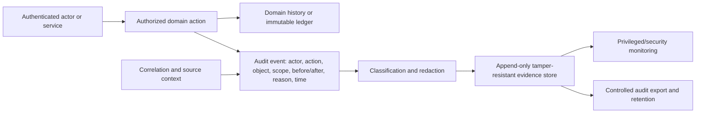

Target audit covers authentication/recovery, session creation/revocation, authorization denial, access/role/SoD changes, privileged actions, configuration publication, imports/exports, integrations, approvals, postings/corrections, and security incidents. Events use synchronized time and immutable identity, correlation and source. Access to audit is itself audited. Retention follows classification, domain evidence, customer contract, and applicable reviewed obligations.

Audit supports accountability but cannot prove human intent by itself, cannot replace domain history or financial/inventory ledgers, and is not cryptographic non-repudiation without identity assurance, key custody, tamper resistance, trusted timestamps, and verification procedures. Digital signatures are Future and used only where a defined evidentiary requirement justifies them.

# Chapter 22 — Logging, Monitoring, and Detection

Operational logs explain runtime behavior; security logs support detection; audit records governed business/security actions. Current evidence is framework/container output, a database health check, and application audit with generated trace IDs. There is no structured logging standard, correlation middleware, metrics platform, SIEM integration, SOC operation, centralized alerting, or formal retention/access design.

Target telemetry is structured and includes timestamp, environment, service/version, severity, event code, outcome, safe tenant context, actor/principal reference, route/operation, correlation/trace IDs, duration, source category, and classification—never credentials or sensitive payloads. Detection cases cover authentication failure/credential stuffing, authorization denials, privilege and configuration changes, unusual exports, tenant-scope violations, mass/bulk behavior, integration signature/replay failure, dependency/container alerts, and audit-pipeline failure.

Metrics and alerts have owner, threshold or analytic rationale, runbook, severity, suppression rule, test evidence, retention, and access policy. False positives are measured and tuned without hiding real events. Security/SOC ownership, tool selection, dashboards, alert routes, and log retention are Open for FCSB-006; SIEM and SOC are targets, not current facts.

# Chapter 23 — Incident Response

The response lifecycle is preparation, detection, triage, containment, eradication, recovery, evidence preservation, communication, post-incident review, and verified lessons learned. Playbooks cover account/session compromise, cross-tenant exposure, malicious export, secret/key leak, vulnerable dependency, ransomware, database/backup compromise, partner/webhook abuse, and device/shop-floor events.

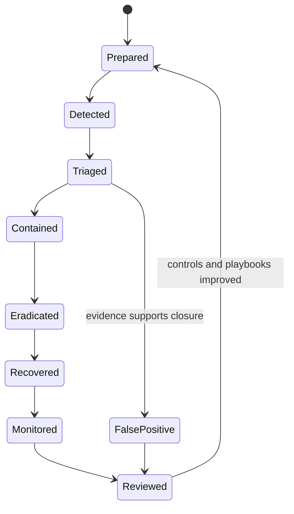

| Severity | Directional definition | Coordination |
|---|---|---|
| SEV-1 Critical | Confirmed or highly credible cross-tenant, privileged, material financial/inventory, widespread ransomware, key-root, or safety-adjacent compromise | Incident commander, Security, Operations, executive/domain owners; continuous response |
| SEV-2 High | Significant scoped compromise, sensitive exposure, or production disruption with bounded blast radius | Security-led response with affected owners and frequent updates |
| SEV-3 Medium | Exploitable weakness or contained event without confirmed material impact | Assigned owner, bounded response plan, monitored remediation |
| SEV-4 Low | Low-impact event, policy deviation, or intelligence item | Normal risk/vulnerability workflow |

Roles include incident commander, Security lead, Operations lead, forensic/evidence custodian, affected domain/tenant owner, communications owner, and Legal/Privacy advisers where applicable. Containment may revoke credentials/tokens, disable accounts/integrations, isolate workloads, block routes, rotate keys, or pause high-risk processes. Recovery verifies clean artifacts, restores trusted data, reconciles transactions, monitors recurrence, and preserves chain of custody. Customer and regulatory/legal communication follows contracts and qualified advice; this blueprint invents no notification deadline.

# Chapter 24 — Vulnerability Management

The repository documents `npm audit` with zero findings at accepted milestones. That is a limited point-in-time dependency check, not a vulnerability-management program, exploitability assessment, container/OS scan, SAST, DAST, penetration test, or production assurance.

Target practice maintains an asset and owner inventory; scans dependencies, source, secrets, containers, operating systems, infrastructure, and exposed applications; creates an SBOM; accepts customer reports; and tracks each finding through validation, severity, exploitability/context, affected versions/tenants, remediation, exception, compensating control, retest, and closure. CVSS may inform but does not replace business, tenant, exposure, exploit availability, financial/safety, and data sensitivity assessment.

Patch policy uses risk-based service objectives approved outside this draft. Exceptions have owner, expiry, rationale, affected assets, monitoring, and independent approval. Penetration testing is required before production trust and after material boundary changes, but no test evidence currently exists. A responsible-disclosure process, intake channel, safe-harbor wording, triage ownership, and coordinated disclosure policy are Future and require legal/security review.

# Chapter 25 — Secure Software Development Lifecycle

Security is a release property supported by evidence, not a final testing phase. Each change identifies assets, actors, trust boundaries, abuse cases, classification, tenant/organization effects, permissions, SoD, audit, failure behavior, dependency and migration risk. Architecture/Security reviews are proportionate to risk and mandatory for identity, session, authorization, cryptography, multi-tenant, posting, payment, export, integration, file, device, AI, and privileged-operation changes.

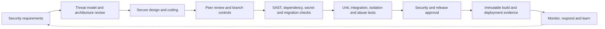

Secure coding requires typed/allowlisted input, safe output, parameterized data access, no trust in client scope, bounded resource use, consistent errors, secret hygiene, safe logging, and tests for allow and deny paths. Peer review separates author and approver for high-risk code and migrations. Branch protection, required checks, signed/controlled release intent, migration review, environment separation, production-access restriction, rollback/forward-fix plans, and security sign-off are target controls. Exact CI/CD design is deferred to FCSB-006/Product Governance.

# Chapter 26 — Software Supply-Chain Security

Current foundations are npm workspaces, a committed lockfile, explicit package versions/ranges, Dockerfiles, and documented npm audit. Builds currently use broad repository contexts, install dependencies in image stages, do not evidence frozen/offline reproducibility, SBOM generation, provenance, image scanning, artifact signing, or non-root runtime users.

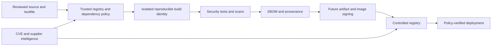

Target controls pin and review dependencies and base images, use trusted registries, minimize lifecycle scripts and transitive exposure, isolate CI identity/secrets, review third-party actions, generate SBOM/provenance, scan source/dependencies/images, and promote the same immutable artifact. Artifact/container/package signing is Proposed; no infrastructure is claimed. Customer extensions/plugins are versioned packages with declared permissions/dependencies, signature direction, compatibility tests, tenant isolation, support owner, update/rollback policy, and revocation. Emergency dependency updates remain reviewed and traceable.

# Chapter 27 — Database Security

Current NestJS services access Prisma through one configured database URL; application scoping is expressed in queries/services. Docker development publishes PostgreSQL to the host and uses development defaults. There is no evidenced separation of application, migration, reporting, backup, and DBA identities; database TLS, RLS, centralized query/security audit, non-production masking, or managed restore authorization.

Production uses distinct least-privilege identities: application runtime (only required DML), migration runner (time-limited DDL), governed read-only reporting, backup/restore service, monitoring, and break-glass DBA. Schema ownership is separate from runtime. Network rules allow only approved workloads/admin paths; direct user, partner, connector, report, or BI writes are prohibited. TLS and credential rotation follow Chapters 18–20.

Prisma migrations are immutable reviewed release artifacts run once by authorized automation with preflight, backup/recovery plan, status evidence, and forward-correction strategy. Query logging is classified, access-controlled, bounded, and must not capture sensitive parameters. Non-production data is synthetic or masked. Restore requires dual authorization for sensitive environments, isolated validation, tenant/data integrity checks, and audit. PostgreSQL RLS remains an Open defense-in-depth option evaluated against connection pooling, migrations, testability, operations, and application policy—not a replacement for scoped services.

# Chapter 28 — Infrastructure and Container Security

Current Compose is a development topology that exposes web, API, and PostgreSQL host ports. Images use Node Alpine stages but do not declare a non-root `USER`; base images are tagged rather than digest-pinned; dependency installation and full-context copies broaden supply-chain scope. No production orchestration, network segmentation, runtime scanner, managed ingress, or secrets injection platform is evidenced.

Target containers run as non-root with minimal images, digest/approved-version pinning, patched dependencies, read-only filesystems where feasible, dropped Linux capabilities, no privilege escalation, resource limits, temporary writable mounts, defined health probes, and no Docker socket access. Networks separate edge, application, workers, data, management, and observability. Host ports expose only approved ingress; database and management planes remain private. Secrets arrive through approved runtime facilities, never layers or build arguments.

Production and non-production use separate accounts/projects, networks, identities, secrets, keys, databases, storage, observability, and release approvals. Runtime scanning and policy enforcement are Proposed. FCSB-006 owns orchestration, topology, scaling, health/readiness, resilience, backup/restore, operational monitoring, patch rollout, and release execution; this chapter sets security constraints only.

# Chapter 29 — Integration and Partner Security

FCSB-004 establishes API-first, no-direct-database-write, versioned contract, idempotency, reconciliation, and future event/file/device directions. The current repository has user JWT authentication and synchronous import/export metadata; it does not have service principals, OAuth client credentials, mTLS, gateway, webhook engine/signing, SFTP/object storage, EDI, bank/government, commerce, or device connectors.

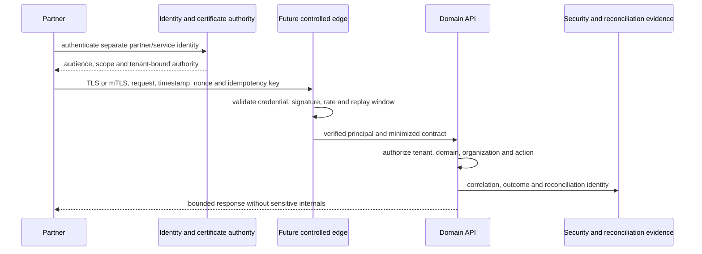

Partner onboarding records sponsor, legal/contract reference, data purpose/classification, environments, endpoints, IP/network assumptions, identity owner, scopes, tenant/organization mapping, certificate/key custody, rate/volume limits, support, test/certification, monitoring, incident contacts, expiry, and offboarding. Payloads are minimized; idempotency, nonce/timestamp/replay windows, correlation, and reconciliation are mandatory by risk.

OAuth/OIDC, workload federation, and mTLS are selected per identity and threat; API keys are exceptional and not tenant authority. Webhooks are signed over canonical payload plus timestamp/identifier, secret/key versioned, replay-protected, retried safely, and auditable. Files use malware scanning, tenant quarantine, encryption/signing where required, verified SFTP/managed transfer, checksums, manifest/control totals, and retention. EDI, banking, and government adapters get dedicated principals, dual approval for bank/payment setup and release, strong signing where mandated by reviewed contracts, and rapid revocation. Partner compromise triggers suspension, key/certificate rotation, replay/reconciliation, scope review, and coordinated incident handling.

# Chapter 30 — Shop-Floor, Device, and IoT Security

No MES, PLC/SCADA, OPC UA, MQTT, barcode/RFID, device certificate, or edge-gateway connector is implemented. FlowCraft ERP does not own machine safety, safety PLC logic, emergency stops, or deterministic machine control.

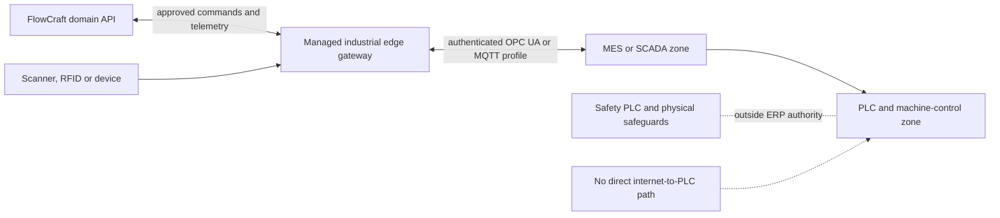

Target design gives each gateway/device a registered identity, owner, model/firmware, certificate or protected credential, allowed topics/operations, zone, lifecycle, patch status, and revocation. Industrial networks are segmented; internet and user-browser traffic never reach PLCs directly. The edge gateway validates schema, range, sequence, time, device identity, and command authorization; buffers safely offline; rejects replay; and reconciles on reconnect. OPC UA/MQTT security profiles, certificate trust, broker/gateway choice, and offline semantics are Open.

Firmware and remote support require vendor provenance, maintenance windows, approval, time-limited access, monitoring, and rollback. Physical access, tamper controls, trusted time, inventory, and decommissioning are part of device assurance. ERP commands remain bounded business intent; local control/safety systems decide whether physical action is safe. Barcode/RFID input is untrusted data and never an authorization credential by itself.

# Chapter 31 — Privacy and Data Protection

Privacy architecture follows purpose limitation, data minimization, accuracy, access limitation, retention, security, and demonstrable accountability without making unsupported legal claims. A personal-data inventory maps field/dataset, purpose, subject category, source, tenant/customer responsibility, recipients, location/residency, retention, classification, owner, processors/providers, and deletion/anonymization constraints.

Customer and FlowCraft controller/processor roles, instructions, cross-border transfers, residency commitments, consent needs, data-subject access/correction handling, breach obligations, and legal holds are contractually and jurisdictionally defined with qualified advice. This draft sets no universal role or deadline. Exports and support access are purpose-scoped and audited; deletion is reconciled with financial, inventory, security, legal-hold, and backup evidence requirements. Anonymization must resist practical re-identification; pseudonymization remains protected personal data where linkage exists.

Privacy impact assessment is required for large/sensitive profiling, workforce monitoring, cross-tenant analytics, new external providers, device telemetry tied to people, and AI features. AI prompts, retrieval context, responses, provider retention/training, and human-review data are included in inventories and contracts. Production data is not used for model training unless explicitly authorized, minimized, protected, and legally/contractually reviewed.

# Chapter 32 — AI and Knowledge-Graph Security Direction

No FlowCraft Knowledge Graph (FKG) or governed AI runtime exists. References in current metadata/master-data foundations express future readiness only. AI and FKG security is Future and cannot be used to imply current automated reasoning, access filtering, or transaction execution.

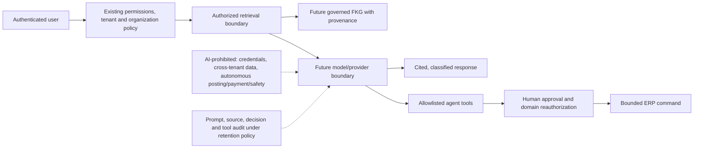

Every object/field is classified as AI-readable, AI-writable through a controlled command, or AI-prohibited. Retrieval reapplies current backend authorization to each source and preserves tenant/organization/field scope; embeddings, indexes, caches, prompts, and conversations are tenant-isolated. Responses cite authorized sources and expose uncertainty. Prompt injection, indirect instructions in documents, tool abuse, data exfiltration, model/provider compromise, training retention, and poisoned knowledge are threat-modeled.

Agents receive narrowly allowlisted tools and short-lived delegated authority; each tool call is reauthorized. AI may draft or recommend but cannot independently approve/post financial or inventory effects, release payments, change security, bypass SoD, or issue safety-critical commands. Local versus cloud models, provider contracts, prompt/response retention, red-team tests, provenance, and AI audit are Open for the future FKG/AI volume.

# Chapter 33 — Security Assurance and Compliance Direction

Assurance maps architecture decisions to a control catalog with owner, implementation status, evidence, test, frequency, exception, risk, and approval. Evidence includes reviewed configuration, code/tests, deployment manifests, access reviews, scan results, incident exercises, restore tests, logs/audit samples, partner/device records, and independent assessments. Evidence freshness and environment relevance are explicit.

Architecture and Security reviews occur at baseline and for material change. Internal audit remains independent from control operation. External assessment, penetration testing, customer assurance, and supplier assurance are planned according to risk and contracts. SOC 2 and ISO/IEC 27001 are directions for control/evidence alignment only; FlowCraft does not claim certification or conformity at this draft baseline.

A secure-configuration baseline covers identity, host/container, database, network, application, browser, integration, logging, backup, and cloud services. Deviations enter a risk/exception register with owner, justification, compensating control, expiry, review, and acceptance authority. Security continuously improves through incidents, tests, threat intelligence, customer findings, architecture changes, and measured control performance.

# Chapter 34 — Decisions, Approval, and Roadmap

## Security architecture decision register

| Decision ID | Decision | Status | Rationale / condition | Owner |
|---|---|---|---|---|
| FCSB5-ADR-001 | Backend authentication, authorization, scope, and domain rules remain authoritative; UI state never grants access. | Implemented | Guards/services evidence the foundation; coverage standardization remains required. | Security Architecture / Application Architecture |
| FCSB5-ADR-002 | Security policy denies by default and public routes require explicit review. | Proposed | Current protection is controller-specific rather than global. | Security Architecture |
| FCSB5-ADR-003 | Tenant isolation is mandatory for queries, effects, jobs, files, caches, exports, logs, and analytics. | Approved | Multi-tenant blast radius makes omission unacceptable. | Security Architecture / Data Architecture |
| FCSB5-ADR-004 | Shared human accounts are prohibited. | Approved | Unique identity is necessary for accountability and revocation. | Identity and Access Owner |
| FCSB5-ADR-005 | MFA is required for privileged production access and risk-defined high-impact actions. | Approved | No MFA exists; implementation and factor choice remain work. | Security Architecture |
| FCSB5-ADR-006 | Super Admin is exceptional, strongly authenticated, time-bounded where feasible, alerted, and audited. | Approved | Current bypass is too broad for routine production work. | Security / Tenant Governance |
| FCSB5-ADR-007 | Browser `localStorage` bearer JWT is not approved as the final production session model. | Approved | Script-readable tokens amplify XSS impact. | Security Architecture / Web Architecture |
| FCSB5-ADR-008 | Secure HttpOnly cookie or equivalent reviewed BFF/session architecture is the preferred production direction. | Proposed | Requires CSRF, topology, IdP, and user-experience design. | Security Architecture / Web Architecture |
| FCSB5-ADR-009 | Access and refresh/session credentials have separate lifetimes, rotation, reuse detection, and revocation. | Approved | Limits replay duration and supports emergency response. | Identity and Access Owner |
| FCSB5-ADR-010 | Service, workload, partner, and device identities are separate from human user identities. | Approved | Prevents impersonation and enables independent lifecycle/scope. | Integration / Security Architecture |
| FCSB5-ADR-011 | Secrets are stored outside source, metadata, packages, images, and logs. | Approved | Production managed-secret platform selection is Open. | Security / Operations |
| FCSB5-ADR-012 | TLS is mandatory across untrusted boundaries; internal TLS/mTLS follows threat and deployment review. | Approved | Development HTTP is not a production precedent. | Security / Operations |
| FCSB5-ADR-013 | Sensitive production data is synthetic or irreversibly masked before non-production use. | Approved | Reduces unnecessary exposure and support/developer privilege. | Data Governance / Privacy |
| FCSB5-ADR-014 | Posted financial and inventory evidence is immutable; correction uses linked compensating transactions. | Approved | Protects integrity and auditability. | Finance / Inventory Domain Owners |
| FCSB5-ADR-015 | SoD controls are required for high-risk access and processes. | Approved | Formal SoD engine is not currently implemented. | Security / Domain Control Owners |
| FCSB5-ADR-016 | Audit cannot replace domain history, subledgers, or ledgers. | Approved | Audit describes action; domain evidence proves business state/effect. | Data / Domain Architecture |
| FCSB5-ADR-017 | Customer extensions and packages follow the same identity, isolation, secret, review, test, and audit controls as core. | Approved | Extensibility cannot become a bypass. | Product Governance |
| FCSB5-ADR-018 | External systems, reports, and connectors cannot write FlowCraft databases directly. | Approved | Domain APIs own validation, authorization, audit, and reconciliation. | Integration / Data Architecture |
| FCSB5-ADR-019 | PLC safety and deterministic machine control remain outside ERP authority. | Approved | ERP business commands cannot supersede engineered safety controls. | Manufacturing / OT Security |
| FCSB5-ADR-020 | AI never bypasses permission, tenant scope, SoD, approval, posting, or safety controls. | Approved | No governed AI runtime exists. | AI Governance / Security |
| FCSB5-ADR-021 | Production release requires current security evidence and explicit risk acceptance for unresolved high risks. | Approved | Feature or test completion alone is insufficient. | Release Authority / Security |
| FCSB5-ADR-022 | Identity provider, PAM, secrets, KMS/HSM, WAF, SIEM, scanner, PKI, and security-operation vendors remain unselected. | Deferred | Select through requirements, threat, operational, residency, cost, and exit analysis. | Architecture Board |
| FCSB5-ADR-023 | PostgreSQL RLS is assessed as defense in depth, not assumed or rejected. | Open | Requires prototypes for pooling, migrations, operations, and policy consistency. | Data / Security Architecture |

## Security control matrix

| Control ID | Security domain | Control objective | Current status | Target control | Owner | Evidence | Testing method | Priority |
|---|---|---|---|---|---|---|---|---|
| FSC-001 | Authentication | Protect stored user credentials | Implemented foundation | Approved bcrypt/password standard and migration policy | Identity owner | [Auth service](../../apps/api/src/auth/auth.service.ts) | Unit vectors, configuration and upgrade review | P0 |
| FSC-002 | Authentication | Resist brute force and credential stuffing | Not implemented | Per-identity/source/tenant throttling, progressive response and detection | Security / API owner | No rate-limit dependency or middleware evidenced | Abuse and distributed retry tests | P0 |
| FSC-003 | Authentication | Strengthen privileged/high-risk identity assurance | Not implemented | MFA and step-up with recovery controls | Identity owner | Repository has no MFA/IdP flow | Enrollment, bypass, recovery and phishing tests | P0 |
| FSC-004 | Session | Prevent script-readable production session theft | Partial/risky | Reviewed BFF or Secure HttpOnly cookie session with CSRF controls | Web / Security | [Login page](../../apps/web/app/login/page.tsx) | XSS/CSRF/session architecture penetration tests | P0 |
| FSC-005 | Session | Revoke compromised or changed authority | Not implemented | Rotation, reuse detection, session inventory and emergency revocation | Identity owner | JWT guard reloads access but no session store exists | Role-disable, token-family replay and global-revoke tests | P0 |
| FSC-006 | Authorization | Enforce object-action permissions | Partial | One deny-default policy model across every route/domain | Application / Security | [Permission guard](../../apps/api/src/common/permissions.guard.ts) | Route inventory and allow/deny tests | P0 |
| FSC-007 | Authorization | Enforce organization scope | Implemented foundation | Consistent company/branch/plant/node/record policy | Domain owners | [Organization scope](../../apps/api/src/organization/organization-scope.service.ts) | Descendant, expiry, mismatch and IDOR tests | P0 |
| FSC-008 | Isolation | Prevent cross-tenant access | Partial | Mandatory tenant predicates plus relationship, cache/job/file isolation | Data / Application | [Request context](../../apps/api/src/common/request-context.ts) | Cross-tenant matrix and fuzzed identifier substitution | P0 |
| FSC-009 | SoD | Prevent or detect conflicting duties | Not implemented | Rule catalog, assignment/transaction enforcement, review and exceptions | Security / Domain owners | Roles/workflows only provide primitives | Conflict assignment/action simulations | P0 |
| FSC-010 | Privileged access | Control Super Admin and production privilege | Partial/risky | PAM/JIT, MFA, dual approval, time bounds, alerts and review | Security / Operations | Explicit Super Admin bypass in guards | Elevation, expiry, break-glass and evidence exercises | P0 |
| FSC-011 | API | Reject malformed or excessive input | Partial | Typed DTOs, allowlists and uniform size/nesting/file limits | API owner | [Global validation setup](../../apps/api/src/main.ts) | Boundary, property, payload and parser tests | P0 |
| FSC-012 | API | Restrict cross-origin browser access | Partial/risky | Environment-specific exact origin/method/header allowlist | Web / API owner | [CORS setup](../../apps/api/src/main.ts) | Origin, preflight, credential and null-origin tests | P0 |
| FSC-013 | Web | Reduce XSS impact | Not evidenced | Restrictive CSP, encoding, safe DOM and future Trusted Types review | Web / Security | No CSP configuration found | CSP reporting, DOM XSS and dependency tests | P0 |
| FSC-014 | Encryption | Protect data in transit | Development only | Managed TLS at ingress and approved internal boundaries | Operations / Security | Development endpoints are HTTP | Protocol/cipher/certificate and redirect tests | P0 |
| FSC-015 | Encryption | Protect stored databases/files/backups | Not evidenced | Managed at-rest encryption with key/access separation | Operations / Data | Compose volume has no production control evidence | Configuration, key-access and restore verification | P0 |
| FSC-016 | Secrets | Keep production secrets out of code/artifacts | Partial local | Managed secrets platform and workload retrieval | Operations / Security | [Environment example](../../.env.example) and ignored `.env` | Repository/image/log scan and access tests | P0 |
| FSC-017 | Key management | Rotate and revoke keys/certificates safely | Not implemented | Inventory, owners, overlap, alerts, revocation and compromise playbook | Security / Operations | No KMS/HSM/certificate manager | Rollover and compromise simulation | P0 |
| FSC-018 | Audit | Record governed actions without credentials | Partial | Coverage catalog, tamper resistance, retention and access audit | Domain / Security | [Audit service](../../apps/api/src/audit/audit.service.ts) | Event completeness, redaction and tamper tests | P0 |
| FSC-019 | Detection | Detect identity, scope and privilege abuse | Not implemented | Structured security events, correlation, alerts and SIEM integration | Security Operations | Audit/console foundation only | Detection engineering tests and purple-team exercise | P0 |
| FSC-020 | Incident response | Contain and recover from security events | Not implemented | Owned playbooks, evidence custody, exercises and lessons tracking | Security / Operations | No formal runtime/process evidence | Tabletop and technical simulation | P0 |
| FSC-021 | Vulnerability | Find, prioritize and close weaknesses | Partial | Multi-source scanning, triage, remediation, exceptions and retest | Security / Engineering | Accepted reports cite npm audit only | Seeded-vulnerability and closure sampling | P1 |
| FSC-022 | Supply chain | Detect vulnerable dependencies | Partial | Lockfile enforcement, registry policy, continuous dependency scanning | Engineering / Security | [Root package](../../package.json) and lockfile | CI policy and known-vulnerable package test | P1 |
| FSC-023 | Container | Reduce runtime privilege and attack surface | Partial/risky | Non-root minimal pinned images, dropped capability/read-only policy | Operations | [API Dockerfile](../../apps/api/Dockerfile) | Image/config scan and runtime policy test | P0 |
| FSC-024 | Database | Enforce least-privilege database access | Not implemented | Separate runtime/migration/reporting/backup/DBA identities and private network | Data / Operations | One database URL pattern in current config | Privilege enumeration and negative SQL tests | P0 |
| FSC-025 | Backup | Protect backup confidentiality and restoration authority | Not evidenced | Encryption, separate access, immutability options and dual-control restore | Operations / Data | No production backup architecture exists | Theft scenario and isolated restore exercise | P0 |
| FSC-026 | Data | Prevent sensitive production data in non-production | Not implemented | Synthetic/masked datasets with approval and verification | Data Governance / Privacy | No masking pipeline exists | Re-identification and field sampling | P0 |
| FSC-027 | Integration | Give partners least-privilege non-human identity | Not implemented | Separate principal, tenant/audience/scope, expiry and offboarding | Integration / Security | User JWT only | Partner onboarding, scope and revocation tests | P1 |
| FSC-028 | Webhook | Authenticate callbacks and reject replay | Not implemented | Signature, timestamp/nonce, key rotation and idempotency | Integration owner | No webhook engine exists | Spoof, mutation, replay and rollover tests | P1 |
| FSC-029 | Device/OT | Isolate devices and machine-control networks | Not implemented | Device identity, edge gateway, segmentation and lifecycle | OT Security / Manufacturing | No device connector exists | Lab segmentation, command and revocation tests | P1 |
| FSC-030 | AI | Preserve authorization and approval in AI use | Future | Per-source retrieval authorization, tool allowlists and human approval | AI Governance / Security | No FKG/AI runtime exists | Prompt injection, leakage and tool-abuse evaluation | P1 |
| FSC-031 | API | Prevent mass assignment and output leakage | Partial | Explicit command mapping and response schemas | Domain/API owners | DTO whitelist exists; dynamic legacy payloads remain | Hidden-field and over-posting tests | P0 |
| FSC-032 | Export | Prevent malicious or excessive data export | Partial | Field/row policy, approval, watermark/reference, expiry and anomaly detection | Domain / Data owner | DBA-004 export metadata foundation | Scope, volume, field and retrieval tests | P0 |
| FSC-033 | Privacy | Process personal data for defined purpose | Not formalized | Inventory, privacy assessment, retention and request handling | Privacy / Data owner | FCSB-003 classification foundation | Inventory/evidence sampling and scenario tests | P1 |
| FSC-034 | Release assurance | Block production release without security evidence | Not implemented | Automated and manual security gates with explicit risk acceptance | Release authority / Security | Current builds/tests are development acceptance | Gate bypass and evidence-freshness audit | P0 |

## Threat register

| Threat ID | Asset | Threat | Attack path | Existing control | Gap | Target mitigation | Owner | Residual-risk direction |
|---|---|---|---|---|---|---|---|---|
| FST-001 | User accounts | Credential stuffing | Reused credentials against public login | Generic invalid response, bcrypt | No throttle/MFA/detection | Rate controls, breached-password screening, MFA, alerts | Identity / Security | Reduce |
| FST-002 | User accounts | Brute force | Repeated guesses against login | Bcrypt, DTO validation | No lockout/rate policy | Progressive throttling, risk scoring, monitoring | Identity / API | Reduce |
| FST-003 | Sessions | JWT theft | Browser/device or log compromise | Bearer verification and expiry | No revocation/session binding | Short access life, protected refresh, rotation, revocation | Identity / Web | Reduce |
| FST-004 | Sessions | XSS token theft | Script reads `localStorage` | Framework encoding foundation | Token is script-readable; no CSP evidence | HttpOnly/BFF pattern, CSP, XSS testing | Web / Security | Reduce |
| FST-005 | Privilege | Privilege escalation | Role/permission/config mutation or legacy route gap | Permission/role guards, audit | Inconsistent coverage, no SoD/step-up | Global policy, SoD, step-up, negative tests | Application / Security | Reduce |
| FST-006 | Tenant data | Cross-tenant data access | Substitute foreign tenant-owned identifier | Tenant-scoped services and tests | Coverage not comprehensive; no RLS | Isolation standard, IDOR suite, optional RLS assessment | Data / Application | Minimize |
| FST-007 | Records | IDOR | Guess object/company/job/file IDs | Service lookups often include tenant | Legacy and future artifact gaps | Re-resolve ownership and scope on every access | Domain owners | Reduce |
| FST-008 | Database/data | SQL or query injection | Unsafe dynamic filter/report/metadata input | Prisma parameterization, DTO whitelist | Dynamic delegates/legacy payload review incomplete | Allowlisted query DSL, SAST/DAST and abuse tests | API / Data | Reduce |
| FST-009 | Privileged fields | Mass assignment | Submit status, tenant, approval or audit fields | Global whitelist for DTOs | Dynamic JSON/legacy spread risk | Command mapping, field allowlists, hidden-field tests | Domain owners | Reduce |
| FST-010 | Confidential data | Malicious export | Authorized account exports beyond purpose/scope | Permission and DBA-004 metadata | No volume approval/anomaly/secure file engine | Row/field policy, step-up, limits, monitored delivery | Data / Security | Reduce |
| FST-011 | Production identity | Seed credential misuse | Development bootstrap retained/shared in production | Environment overrides documented | Defaults also visible/prefilled; no production block | Prohibit production seed defaults, bootstrap rotation and checks | Operations / Identity | Eliminate |
| FST-012 | All tenant data | Compromised administrator | Broad Super Admin bypass | Active-user reload and audit calls | No MFA/PAM/JIT/complete monitoring | Exceptional access, dual approval, step-up, alerts | Security / Tenant owner | Minimize |
| FST-013 | Build/runtime | Dependency compromise | Malicious or hijacked npm/transitive package | Lockfile, npm audit | No provenance/SBOM/signing/policy evidence | Trusted registry, review, scan, provenance, signing | Engineering / Security | Reduce |
| FST-014 | Runtime | Container compromise | Vulnerable package, root process, exposed service | Multi-stage Alpine image | No non-root user/pinning/runtime policy | Minimal non-root signed images and segmentation | Operations | Reduce |
| FST-015 | Database | Database credential leakage | Environment, image, log, host or support exposure | `.env` ignored; audit redaction | Dev fallbacks; no managed secret/rotation | Workload identity/managed secret, rotate and monitor | Operations / Data | Reduce |
| FST-016 | Backups | Backup theft | Storage/account compromise or media loss | No production evidence | Encryption/access/immutability undefined | Encrypted isolated backups, least privilege, audit | Operations / Data | Reduce |
| FST-017 | Integration | Webhook spoofing | Forged callback to future endpoint | No endpoint exists | No signing/replay policy implementation | Canonical signatures, key version, allowlist and audit | Integration / Security | Reduce |
| FST-018 | Commands | Replay attack | Reuse token, webhook, file or payment message | JWT expiry; some transaction uniqueness | No universal nonce/idempotency/session replay detection | JTI/nonce/timestamp, idempotency, rotation, reconciliation | Integration / Domain | Reduce |
| FST-019 | Partner data | Partner compromise | Valid partner credential sends malicious requests | No partner connector exists | Identity/onboarding/revocation unimplemented | Scoped principal, rates, anomaly detection, rapid offboarding | Integration / Security | Reduce |
| FST-020 | Shop floor | PLC/device compromise | Infected device/gateway sends false telemetry/commands | No connection exists | No OT identity/segmentation/lifecycle | Managed edge, certificates, segmentation, validation | OT Security | Minimize |
| FST-021 | Availability/integrity | Ransomware | Endpoint/admin/supply-chain compromise reaches data/backups | Database and source history foundations | No production segmentation/immutable backup/IR evidence | Least privilege, isolation, EDR direction, immutable recovery, exercises | Operations / Security | Reduce |
| FST-022 | Financial/inventory evidence | Insider fraud | User combines setup, entry, approval and release | Roles, permissions, audit foundation | No formal SoD/transaction analytics | SoD engine/process, dual control, monitored exceptions | Domain control owners | Minimize |
| FST-023 | Audit evidence | Audit tampering | Privileged database action alters/deletes audit | No audit mutation API | Same database/admin plane; no tamper evidence | Restricted append path, immutable export/store, monitoring | Security / Data | Reduce |
| FST-024 | AI/retrieval | AI prompt injection | Malicious content instructs model/tool | No AI runtime exists | Future design risk | Content isolation, instruction hierarchy, tool allowlist, human approval | AI Governance | Minimize |
| FST-025 | Tenant/confidential data | AI data leakage | Over-broad retrieval/provider retention/cross-tenant index | No AI runtime exists | No governed AI controls | Per-source authorization, tenant indexes, provider contracts, red-team tests | AI Governance / Privacy | Minimize |

## Practical segregation-of-duties matrix

| Conflict ID | Role/action A | Role/action B | Risk | Preventive control | Detective control | Compensating control | Domain owner |
|---|---|---|---|---|---|---|---|
| SOD-001 | Create/disable users | Assign privileged roles | Self-created or concealed privileged access | Separate IAM administration roles and approval | Daily privilege-change review | Time-limited dual-approved grant | Security |
| SOD-002 | Create/edit roles | Assign permissions/publish role | Hidden privilege expansion | Maker-checker publication | Role-diff and assignment analytics | Independent pre-use review | Security |
| SOD-003 | Create master record | Approve master-data change | Fraudulent or poor-quality master becomes authoritative | Workflow prevents self-approval | Same-actor exception report | Post-approval by independent owner before use | Master Data |
| SOD-004 | Create supplier/bank details | Release supplier payment | Redirected/fraudulent payment | Independent supplier/bank verification and release | Bank-detail-change/payment correlation | Dual call-back and reduced limit | Procurement / Treasury |
| SOD-005 | Maintain customer credit | Approve/release sales order | Excess credit or concealed exposure | Separate credit and sales approval roles | Override/limit breach report | Independent daily review and lower threshold | Sales / Credit |
| SOD-006 | Create purchase order | Approve same purchase order | Unauthorized commitment | Self-approval prohibition and thresholds | Same-actor/sequence report | Independent retrospective approval before receipt | Procurement |
| SOD-007 | Receive goods | Match/approve supplier invoice | Fictitious receipt/invoice | Separate receiving and AP approval | PO-receipt-invoice anomaly analysis | Physical count and manager review | Procurement / AP |
| SOD-008 | Approve supplier invoice | Release payment | Unauthorized/disguised disbursement | Separate AP approval and treasury release | Payment batch and beneficiary review | Dual release and capped emergency authority | Finance / Treasury |
| SOD-009 | Create journal | Post/approve same journal | Concealed financial manipulation | Maker-checker posting | Same-user and unusual journal analytics | Controller review and subsequent evidence | Finance |
| SOD-010 | Maintain bank setup | Create/release bank payment | Account redirection and theft | Dual control and step-up for setup/release | Change-to-payment proximity alert | Out-of-band bank confirmation | Treasury |
| SOD-011 | Enter inventory adjustment | Approve/post adjustment | Stock theft or valuation manipulation | Independent approval by threshold/reason | Variance, user and location analytics | Cycle count and manager sign-off | Inventory |
| SOD-012 | Issue production materials | Record production completion | Concealed yield/scrap manipulation | Separate execution roles where practical | Yield, scrap and backflush anomalies | Supervisor and count reconciliation | Manufacturing |
| SOD-013 | Perform quality inspection | Release quarantined stock | Unsafe/nonconforming release | Independent release permission | Inspector/releaser and result override report | Dual review and enhanced sampling | Quality |
| SOD-014 | Request maintenance | Approve and close same work | Fictitious work/cost or missed maintenance | Separate request, approval and closure | Same-user and duration/parts anomaly | Asset-owner verification | Maintenance |
| SOD-015 | Edit configuration/workflow | Publish to production | Unauthorized control bypass | Immutable draft plus independent publication | Config diff and post-publish monitoring | Emergency expiry and next-day board review | Product / Tenant Governance |
| SOD-016 | Develop or approve code | Deploy/administer production | Concealed unreviewed change or data access | CI/CD separation and no standing developer production access | Deployment/source/access correlation | Time-limited break-fix with independent observation | Engineering / Operations |

## Security risk register summary

| Risk ID | Summary | Current direction | Required disposition |
|---|---|---|---|
| FSR-001 | Script-readable bearer token and incomplete session lifecycle | High before production | Approve and implement reviewed session architecture; penetration test |
| FSR-002 | No MFA/PAM for Super Admin or production privilege | High before production | Implement privileged identity, step-up, JIT/time bounds and monitoring |
| FSR-003 | Route-specific authorization and isolation coverage | High for operational modules | Global policy inventory plus negative tenant/scope tests |
| FSR-004 | Development secrets/default identities could reach shared/production environments | High if promoted | Environment admission checks, managed secrets, bootstrap/rotation procedure |
| FSR-005 | Audit lacks tamper-resistant storage and universal control catalog | High for authoritative posting | Domain ledgers/history plus security audit hardening and coverage tests |
| FSR-006 | No formal SoD engine/process | High for finance/inventory/payment | Approved conflict catalog and preventive/detective controls before posting |
| FSR-007 | No centralized detection/incident operation | High for production | Logging/detection architecture, owners, playbooks and exercises |
| FSR-008 | Development containers/database exposure are not hardened | High if reused | FCSB-006 production topology and hardening evidence |
| FSR-009 | Supply-chain provenance/signing and broad scanning absent | Medium/High | CI policy, SBOM, scans, immutable artifacts and signing decision |
| FSR-010 | Future integration/device/AI trust controls are not implemented | Conditional | Block connector/device/AI release until its boundary controls are proven |

## Open decisions

1. Select the human identity provider, federation protocols, MFA factors, identity-proofing level, and recovery design.
2. Approve the browser/BFF/session topology, CSRF model, access/refresh lifetimes, idle/absolute timeouts, and revocation store.
3. Define the global public-route policy and complete route-by-route permission/scope inventory.
4. Select PAM/JIT, managed secrets, KMS/HSM, PKI/certificate, WAF/edge, SIEM/logging, vulnerability, and runtime-control capabilities through evidence-based procurement.
5. Decide PostgreSQL RLS scope after a representative prototype.
6. Approve password, lockout/rate, privileged step-up, and emergency identity policies.
7. Define production data classification field catalog, retention, residency, masking, backup, and privacy roles per customer/jurisdiction.
8. Approve SoD conflict rules, thresholds, exception authorities, and compensating evidence for DBA-005/DBA-006.
9. Define security-event taxonomy, severity, retention, SOC/on-call responsibilities, customer communication, and exercise cadence.
10. Define service/partner/device identity, certificate, webhook, file-transfer, and OT requirements before any relevant connector.

## Approval roles

| Role | Approval focus | Draft state |
|---|---|---|
| Architecture Board | Cross-volume consistency, decisions, exceptions, technology deferrals | Pending |
| Security Architecture | Threat/trust model, identity/session, authorization, crypto and control baseline | Pending |
| Identity and Access Owner | Human/service lifecycle, MFA, federation, PAM and access review | Pending |
| Data and Privacy Governance | Classification, masking, retention, privacy roles and analytics/AI handling | Pending |
| Application and Domain Owners | Permission/scope, SoD, immutable evidence and negative tests | Pending |
| Integration and OT Security | Partner/device identity, edge, files, banking/EDI and shop-floor boundaries | Pending |
| Operations Architecture | Production topology, secrets/keys, monitoring, incident and recovery handoff to FCSB-006 | Pending |
| Internal Audit / Control Owners | SoD, evidence, assurance independence and compensating controls | Pending |
| Product and Release Governance | Extension/security gates, exceptions, release evidence and customer commitments | Pending |

## Approval conditions

1. Reconcile this draft with controlled FEAPB/FEOM/EOR sources when available and resolve conflicting authority explicitly.
2. Security Architecture accepts the current-state evidence, threat register, control matrix, risk priorities, and decision statuses.
3. Domain owners approve permission/scope, immutable evidence, export, and SoD rules for their authoritative processes.
4. Architecture Board records owners and target milestones for every P0 control and High production risk.
5. FCSB-006 adopts the security constraints for environments, topology, identities, secrets/keys, observability, backup/recovery, incident response, and releases.
6. No Proposed/Open/Deferred technology is presented as an existing product capability or customer commitment.

## Required work before production deployment

- Implement and test production identity/federation, MFA, safe recovery, privileged-access, reviewed browser sessions, rotation/revocation, and emergency disablement.
- Remove development identity/secret fallbacks from production paths and enforce managed secret/key/certificate custody with tested rotation.
- Establish controlled ingress/TLS, exact CORS, abuse/rate controls, hardened non-root workloads, private data networks, least-privilege database identities, encrypted data/backups, and environment separation.
- Inventory every route/job/file/export/cache for authentication, object permission, tenant/company/organization/record scope, input/output limits, and negative isolation tests.
- Implement security logging/detection, tamper-resistant audit evidence, vulnerability/supply-chain controls, incident playbooks, exercises, backup restoration, and security release gates.
- Complete an independent penetration test and close or explicitly accept findings through authorized risk governance.

## Required work before DBA-005/DBA-006 operational posting

Before Finance or Inventory can create authoritative postings, approve and test: domain permission/action catalogs; amount/location/plant and record scope; maker-checker workflows; the SoD matrix and thresholds; immutable journals/ledgers and linked reversals; period/stock-state controls; privileged override/step-up; idempotency/concurrency; complete audit/domain history; sensitive export; reconciliation; negative tenant/company/organization tests; and security monitoring. A schema or happy-path API alone is insufficient.

## Required architecture work before FCSB-006

- Freeze security requirements for environment tiers, network zones, ingress/egress, database access, worker/file/analytics boundaries, and production/non-production separation.
- Provide identity, secret, key/certificate, telemetry, vulnerability, backup security, and incident-response requirements with owners and availability/recovery implications.
- Decide which controls are platform-managed versus customer-operated in self-hosted or managed deployment models.
- Define production readiness evidence, secure configuration baselines, exception workflow, operational access, patching, monitoring, exercise, and release/rollback gates.
- Carry unresolved tool/vendor choices as explicit FCSB-006 decisions without weakening the control objectives.

FCSB-005 defines what must be protected and trusted; FCSB-006 defines how those controls are deployed, operated, observed, recovered, and evidenced. FCSB-006 cannot mark a control implemented solely because it is approved here.

## Version history

| Version | Date | Status | Change |
|---|---|---|---|
| 1.0 Draft | 2026-07-16 | Architecture Review Draft | Initial evidence-based security and trust architecture, decisions, controls, threats, SoD, risks, and production gates |

## Repository evidence references

- [FCSB Series Index](./FCSB-Series-Index.md)
- [FCSB Volume 1](./FCSB-Volume-1-Executive-and-Business-Architecture.md)
- [FCSB Volume 2](./FCSB-Volume-2-Application-and-Platform-Architecture.md)
- [FCSB Volume 3](./FCSB-Volume-3-Enterprise-Data-and-Information-Architecture.md)
- [FCSB Volume 4](./FCSB-Volume-4-Integration-Architecture.md)
- [Repository overview](../../README.md)
- [DBA-002 implementation report](../implementation/DBA-002-foundation-implementation.md)
- [DBA-003 implementation report](../implementation/DBA-003-enterprise-structure-implementation.md)
- [DBA-004 implementation report](../implementation/DBA-004-enterprise-master-data-implementation.md)
- [API bootstrap and validation/CORS setup](../../apps/api/src/main.ts)
- [Application module composition](../../apps/api/src/app.module.ts)
- [Authentication module](../../apps/api/src/auth/auth.module.ts)
- [Authentication service](../../apps/api/src/auth/auth.service.ts)
- [JWT guard](../../apps/api/src/common/auth.guard.ts)
- [Permission guard](../../apps/api/src/common/permissions.guard.ts)
- [Tenant context service](../../apps/api/src/common/tenant-context.service.ts)
- [Organization scope service](../../apps/api/src/organization/organization-scope.service.ts)
- [Audit service](../../apps/api/src/audit/audit.service.ts)
- [Current Prisma schema](../../apps/api/prisma/schema.prisma)
- [Current seed implementation](../../apps/api/prisma/seed.ts)
- [Web API helper](../../apps/web/lib/api.ts)
- [Web login implementation](../../apps/web/app/login/page.tsx)
- [Docker development topology](../../docker-compose.yml)
- [API Dockerfile](../../apps/api/Dockerfile)
- [Web Dockerfile](../../apps/web/Dockerfile)
- [Foundation security-related tests](../../apps/api/test/foundation.spec.ts)
- [Organization scope tests](../../apps/api/test/organization.spec.ts)
- [Master-data isolation tests](../../apps/api/test/master-data.spec.ts)

## Known evidence limitations

The repository contains no production environment, IdP, gateway, secrets/KMS/HSM, certificate manager, WAF/DDoS, SIEM/SOC, vulnerability platform, PAM, DLP/privacy runtime, formal SoD engine, access-certification platform, production backup/restore evidence, penetration-test report, signed software-supply-chain evidence, service/device connector, FKG, or governed AI runtime. The accepted 76 tests are valuable development evidence but do not establish complete API protection, production isolation, operational control effectiveness, or certification. Controlled FEAPB and related source documents are not present as standalone repository files and require reconciliation before approval.
