# FlowCraft Solution Blueprint

## Volume 6 — Deployment and Operations Architecture

| Document control | Value |
|---|---|
| Document code | FCSB-006 |
| Version | 1.0 Draft |
| Status | Architecture Review Draft |
| Approval status | Pending Architecture Board, Security, and Operations Review |
| Last updated | 2026-07-16 |
| Related milestones | DBA-002 Platform Foundation; DBA-003 Enterprise Structure; DBA-004 Enterprise Master Data; production-readiness foundation; preparation for FCSB-007 Manufacturing Solution Architecture |
| Dependencies | FCSB-001 through FCSB-005; current Compose, Dockerfile, environment, health, Prisma migration/seed, build/test, Git release, and implementation-report evidence |
| Next planned volume | FCSB-007 — Manufacturing Solution Architecture |

This draft defines architecture direction and acceptance evidence. It does not establish production readiness, service levels, high availability, disaster recovery, certification, or implementation of a proposed platform.

## Status vocabulary

| Status | Meaning in this volume |
|---|---|
| Implemented | Directly evidenced in the repository baseline through `v0.4-dba004-merged`. |
| Partial | A development foundation exists but production scope, coverage, or assurance is incomplete. |
| Approved | Direction proposed for Architecture Board acceptance; implementation may not exist. |
| Proposed | Target control requiring design, implementation, and verification. |
| Open | Material requirements or technology choice remain unresolved. |
| Deferred | Deliberately assigned to a later decision, volume, or measured workload. |
| Future | Directional capability outside the current implementation baseline. |

# Chapter 1 — Purpose and Scope

FCSB-006 defines how FlowCraft Business OS is built, configured, deployed, operated, observed, protected, backed up, restored, recovered, patched, released, scaled, and supported across local development, shared engineering, test, staging, production, disaster-recovery, cloud, private-cloud, on-premise, and hybrid contexts. Its audience is the Architecture Board, Security and Operations reviewers, engineering/release/data/integration/domain owners, service desk and support, implementation partners, customer infrastructure teams, control owners, and business continuity leaders.

Scope includes deployment models, environment and runtime topology, containers/orchestration/network/ingress/configuration, secrets operations, databases/migrations/bootstrap, availability/resilience, backup/restore/DR/continuity, observability/alerting/logging, incident/on-call/support, releases/deployment/patching, capacity, responsibility, and production acceptance. It does not select a cloud, orchestrator, ingress, database service, queue, cache, object store, search, telemetry, backup, secrets, KMS, CI/CD, IaC, or support vendor. Detailed manufacturing semantics remain in FCSB-007; detailed performance architecture in FCSB-023; product/release governance in FCSB-024; mobile/offline and AI in their controlled volumes.

[FCSB-001](./FCSB-Volume-1-Executive-and-Business-Architecture.md) provides product/business intent; [FCSB-002](./FCSB-Volume-2-Application-and-Platform-Architecture.md) runtime boundaries; [FCSB-003](./FCSB-Volume-3-Enterprise-Data-and-Information-Architecture.md) data authority and lifecycle; [FCSB-004](./FCSB-Volume-4-Integration-Architecture.md) external seams; [FCSB-005](./FCSB-Volume-5-Security-and-Trust-Architecture.md) trust and production security gates. Operations architecture must precede production because a successful build cannot prove isolation, recoverability, availability, capacity, monitoring, supportability, or safe change.

# Chapter 2 — Operations Architecture Executive Summary

The implemented baseline is local development: Docker Compose defines one PostgreSQL 16 Alpine container, one NestJS API image, and one Next.js web image; ports are published to the host; PostgreSQL uses one named volume and a container health command; API startup waits for that health; web starts after API dependency creation; environment variables and development fallbacks configure services. Images are built manually from multi-stage Node Alpine Dockerfiles. Prisma migrations and the idempotent seed are invoked manually. The API provides a public database-backed health endpoint. Logs are ordinary process/container output. Git branches, merges, commits, and tags through `v0.4-dba004-merged` provide release history, not automated release management.

There is no evidenced production orchestrator, ingress/TLS/load balancer, multi-instance service, autoscaling, queue/worker/cache/object store, managed database, centralized observability, automated backup/restore/PITR, DR environment, managed secrets/keys, IaC, CI/CD, release automation, production alerting/on-call, or capacity result. The current maturity is a development deployment foundation.

The target separates environments and responsibilities, promotes one immutable artifact, uses controlled configuration/secrets, private data networks, health-based traffic, least-privilege operations, controlled database change, measured capacity, tested backup/restore and DR, correlated telemetry, owned alerts/runbooks, and evidenced releases. Availability and recovery tiers are chosen per deployment model and business criticality rather than asserted universally.

# Chapter 3 — Operational Principles

1. Development topology is not production topology.
2. Build immutable, identifiable release artifacts once and promote the same artifact across environments.
3. Separate environments by data, identity, secrets, keys, network, access, observability, and approval.
4. Describe infrastructure through reviewed, versioned automation; IaC is target direction, not current fact.
5. Use least-privilege, named, time-bounded operational identities; no hidden manual production change.
6. Establish health before traffic and distinguish startup, liveness, readiness, and diagnostics.
7. A backup is not accepted until a restore succeeds and its business consistency is verified.
8. Test recovery and continuity plans against owned objectives and dependencies.
9. Externalize, validate, version, and audit configuration; store secrets in approved facilities.
10. Keep accepted database migrations immutable and execute them through controlled release steps.
11. Establish monitoring and operational ownership before scale; require capacity evidence before claims.
12. Automate repeatable work with safe stop, rollback or forward-fix, and operator visibility.
13. Fail safely, bound retries, preserve evidence, and expose explicit degraded modes.
14. Eliminate single undocumented operator knowledge through runbooks, exercises, and handover.
15. Make customer-managed responsibilities explicit, testable, supportable, and contractually reconciled.
16. Translate every FCSB-005 security control into operational configuration, evidence, monitoring, and recovery.
17. Every production change has owner, approval, immutable inputs, verification, and recovery plan.

# Chapter 4 — Current Deployment Baseline

| Area | Repository evidence | Current interpretation |
|---|---|---|
| Services | `postgres`, `api`, and `web` in Compose | Development topology only |
| Database | `postgres:16-alpine`, one named volume, host port 5433 to container 5432 | One stateful instance; no backup/HA/PITR evidence |
| API | Multi-stage `node:22-alpine`; host/container port 4000 | One container; no Compose health check/restart/resource policy |
| Web | Multi-stage `node:22-alpine`; host/container port 3000 | One container; depends on API declaration, not API readiness |
| Startup | PostgreSQL health command; API waits for healthy database | Partial dependency ordering; no full readiness chain |
| Restart | `unless-stopped` on PostgreSQL only | API/web restart behavior is runtime default |
| Images | Root-context build, `npm install`, builder then runtime stage | Functional development build; broad context/dependency/runtime footprint |
| Container user | No `USER` in either Dockerfile | Runtime defaults to image user; non-root is not evidenced |
| Configuration | Environment variables and documented development fallbacks | No production validation/secrets platform |
| Migrations/seed | Three committed migrations; Prisma config; manual commands | Not executed automatically by API startup; seed is idempotent demo data |
| Health/logs | Public API DB query health; PostgreSQL health; framework/container output | No liveness/readiness split or centralized telemetry |
| Release | Feature branches, merge commits, tags through `v0.4-dba004-merged` | Traceable manual practice; no CI/CD or artifact registry evidence |

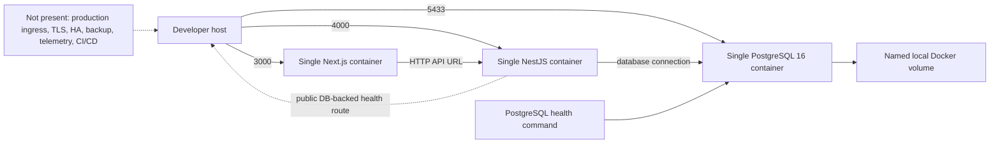

Manual `docker compose`, build, migration, seed, test, and PowerShell validation procedures support local acceptance. Development values, published ports, source maps, full build context, and demo bootstrap must not be promoted unchanged to production.

# Chapter 5 — Target Deployment Models

| Model | Primary ownership | Isolation/scaling direction | Backup/support/release responsibility |
|---|---|---|---|
| FlowCraft-managed SaaS | FlowCraft operates platform; customer governs users/data/process | Shared or partitioned platform with proven tenant isolation; measured horizontal/vertical scaling | FlowCraft operates backup, restore, DR, platform support and releases; customer approves business cutovers where needed |
| Dedicated tenant cloud | FlowCraft or agreed operator in isolated account/project | Tenant-dedicated data/runtime boundaries and independently sized capacity | Contract-specific FlowCraft/customer split; no implicit shared responsibility |
| Customer cloud | Customer owns cloud landing zone; FlowCraft supplies supported artifacts/guidance | Customer-selected supported topology meeting minimum controls | Customer operates infrastructure; FlowCraft supports application/artifact; joint release and incident boundaries |
| Private cloud | Customer/partner owns private platform | Supported orchestrator/VM and storage design with customer failure domains | Customer/partner infrastructure operations; FlowCraft application support under agreed evidence |
| On-premise | Customer owns facility, platform, network, hardware and operations | Scale and availability constrained by supported customer architecture | Customer backs up, restores, patches platform and executes approved releases; FlowCraft supplies procedures/support |
| Hybrid | Split by declared workload/data/integration boundary | Connectivity, identity, consistency and failure modes designed explicitly | Joint RACI, cross-boundary monitoring, recovery and change coordination |

Development, test, staging, production, and DR are environment purposes, not deployment models. Every chosen combination declares data location, tenant isolation, capacity, support hours, monitoring, backup/recovery objectives, release authority, and evidence custody.

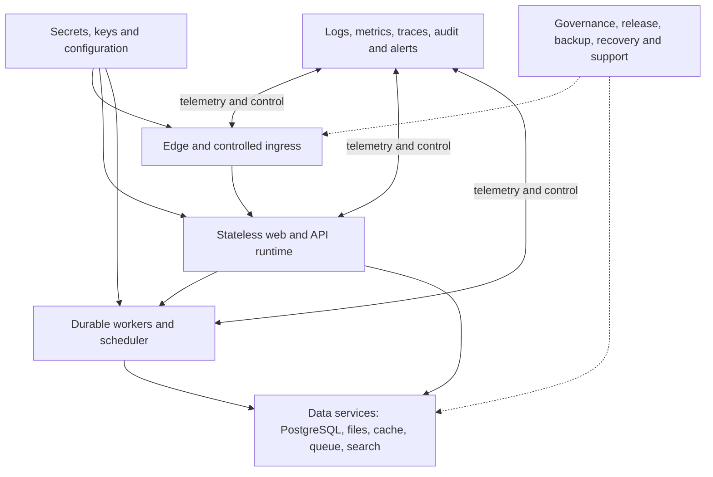

# Chapter 6 — Environment Architecture

| Environment | Data policy | Identity/secrets/access | Availability and operations |
|---|---|---|---|
| Local development | Synthetic/demo; reset allowed by developer procedure | Local isolated values; no production identity or secret | Best effort; local logs; developer-owned |
| Shared development | Synthetic or governed masked data | Shared-dev identities; team secrets; restricted write access | Working-hours support; reset coordinated |
| Test | Repeatable fixtures; reset by test plan | Test-only identities/secrets | Automated evidence target; failures reproducible |
| Integration test | Contract fixtures and simulated partners | Dedicated service test identities/certificates | Dependency telemetry and deterministic replay |
| User acceptance | Representative synthetic/masked business data | Named business testers; production-like roles, non-production credentials | Controlled change; business evidence retained |
| Staging/pre-production | Production-like shape and configuration, never shared production secrets | Restricted operations/release identities | Full smoke, migration, monitoring, backup/restore rehearsal |
| Production | Authoritative customer data | Strong identity, managed secrets, least privilege | Approved service tier, monitoring, support and recovery |
| Disaster recovery | Replicated/restorable authorized production data | Separate but recoverable identity/key plane | Declared readiness and exercise schedule |
| Training/demo | Purpose-built fictional data | Training identities isolated from customer tenants | Resettable; no production integration |
| Sandbox | Synthetic or explicitly approved tenant-isolated copy | Customer-scoped experimental access | No production dependency; quota and expiry |

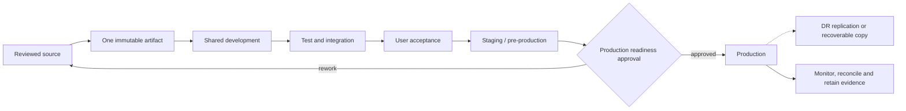

Promotion moves immutable artifacts and reviewed configuration—not databases or hidden changes. Reset policy is explicit per environment. Production-derived data entering non-production is masked or replaced. Network, observability, access, and release evidence become progressively production-like while secrets and identities remain environment-specific.

# Chapter 7 — Runtime Topology

| Component | Target role | Baseline status |
|---|---|---|
| Edge/load balancer | TLS, routing, rate/size/time controls, health-based traffic | Not implemented |
| Web runtime | Stateless Next.js user experience | Single development container |
| API runtime | Stateless NestJS domain API | Single development container |
| Background workers | Durable imports/exports/reports/planning/integration work | Planned; no worker exists |
| Scheduler | Governed timed jobs with singleton/lease rules | Planned |
| PostgreSQL | Authoritative relational store | Single development container |
| Object storage | Tenant-scoped files/exports/backups | Planned; absent |
| Cache | Non-authoritative bounded acceleration/session support where approved | Deferred; absent |
| Queue/event system | Durable job/event delivery | Deferred technology; absent |
| Search | Derived tenant-scoped search when database search is insufficient | Future |
| Reporting/analytics | Governed projections separate from write authority | Future/partial report metadata |
| Monitoring | Collection, correlation, dashboards and alerts | Planned; health/log foundation only |
| Secret/key services | Production secret, key and certificate custody | Planned; absent |

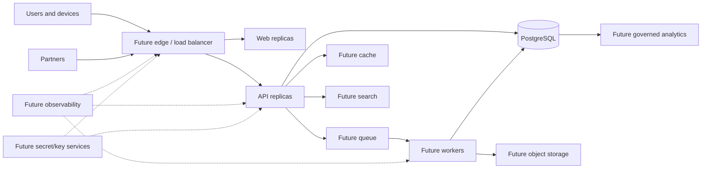

Technology and topology are selected per measured workload, deployment model, support skill, failure domain, data residency, recovery, security, and cost. A conceptual component is not a product dependency until approved and implemented.

# Chapter 8 — Container Architecture

The current API and web Dockerfiles use `node:22-alpine` dependency, builder, and runner stages. They copy root workspace manifests, run `npm install`, copy the complete repository into builders, and copy broad `node_modules` plus built output into runtime images. They set production mode, expose service ports, and run Node/npm commands. They do not declare digest pins, non-root users, health checks, read-only filesystems, capability drops, resource limits, provenance labels, signal wrappers, or image scans. The API has Prisma connect/disconnect lifecycle hooks but bootstrap does not enable framework shutdown hooks.


Target images use controlled base versions/digests, lockfile-faithful installs, minimal production dependencies, non-root UID/GID, explicit ownership, no shell/package manager when unnecessary, read-only root filesystem where feasible, bounded temporary volumes, dropped capabilities, no privilege escalation, CPU/memory/ephemeral limits, startup/readiness/liveness probes, graceful termination, and no Docker socket access. Labels record product, version, commit, build time, source, SBOM and provenance. Runtime configuration is injected; no secret enters a layer or build argument.

# Chapter 9 — Orchestration Direction

No production runtime technology is selected. Compose remains suitable for local development and bounded demonstrations, not production assurance.

| Option | Strengths to evaluate | Constraints to evaluate |
|---|---|---|
| Kubernetes | Broad ecosystem, declarative reconciliation, portability patterns | High operational complexity and skill burden |
| Managed container service | Reduced control-plane operations, cloud integration | Vendor coupling, feature/on-premise limits |
| Nomad | Simpler scheduling model, mixed workloads | Smaller ecosystem and customer skill availability |
| Docker Swarm | Familiar Docker workflow | Ecosystem, roadmap and advanced-control fit |
| Virtual machines | Broad on-premise compatibility and operational familiarity | More host/configuration management, slower scaling |
| Docker Compose | Simple local reproducibility | Weak production HA, policy, rollout and reconciliation evidence |

Selection criteria are supported deployment models, customer skills, availability/recovery tiers, scaling, stateful service integration, security policy, observability, upgrade/rollback, portability, vendor lock-in/exit, automation, support tooling, lifecycle, and total operational cost. Representative proof and failure exercises precede selection.

# Chapter 10 — Network Architecture

Production zones are public edge, web, application, worker, data, management, observability, integration, shop-floor/OT, backup, and DR. Default-deny policies allow documented source, destination, port/protocol, purpose, owner, environment, inspection, and expiry. Database, management, secret, telemetry administration, and backup endpoints are private.

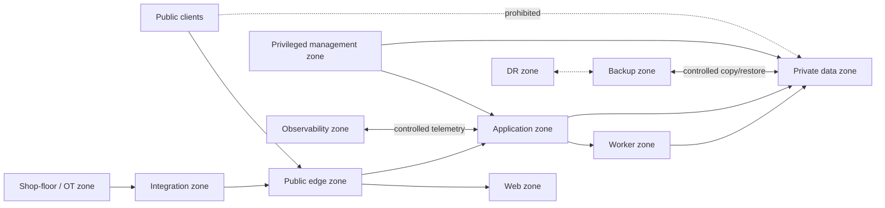

Ingress uses controlled DNS, TLS, allowed routes, request policy, and health routing. Egress is allowlisted for required registries, identity, integrations, telemetry, updates, and time/DNS dependencies, with proxy/logging where appropriate. Administrative access uses strong identity, approved bastion or zero-trust access, time bounds, and audit. Hybrid/OT connectivity fails safely and never creates direct internet-to-PLC or external-to-database paths.

# Chapter 11 — Ingress, Load Balancing, and Traffic Management

No production reverse proxy, ingress, API gateway, TLS termination, WAF, or load balancer exists. Target ingress terminates or passes through approved TLS, validates host/path/method/header/body limits, applies rate and abuse controls, sets/removes trusted headers, and routes web/API/partner traffic only to ready instances.

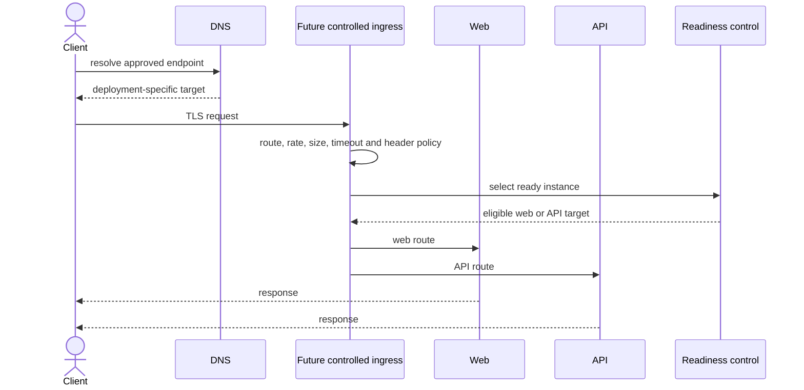

Sticky sessions are avoided through externalized reviewed session state; if temporarily required they are bounded and failover-tested. Retries occur only for safe/idempotent operations and respect end-to-end deadlines. Maintenance mode is explicit, tenant-aware where required, and never masks failed migrations. Blue-green and canary are target strategies, not current features. Tenant routing cannot substitute for backend tenant authorization.

# Chapter 12 — Configuration Management

Current configuration uses environment variables, `.env` examples, Compose substitutions/fallbacks, Prisma environment loading, and a build-time public web API URL. There is no schema-driven production validation, feature-flag service, drift detector, promotion workflow, or configuration audit. Development examples and fallbacks are not approved production defaults.

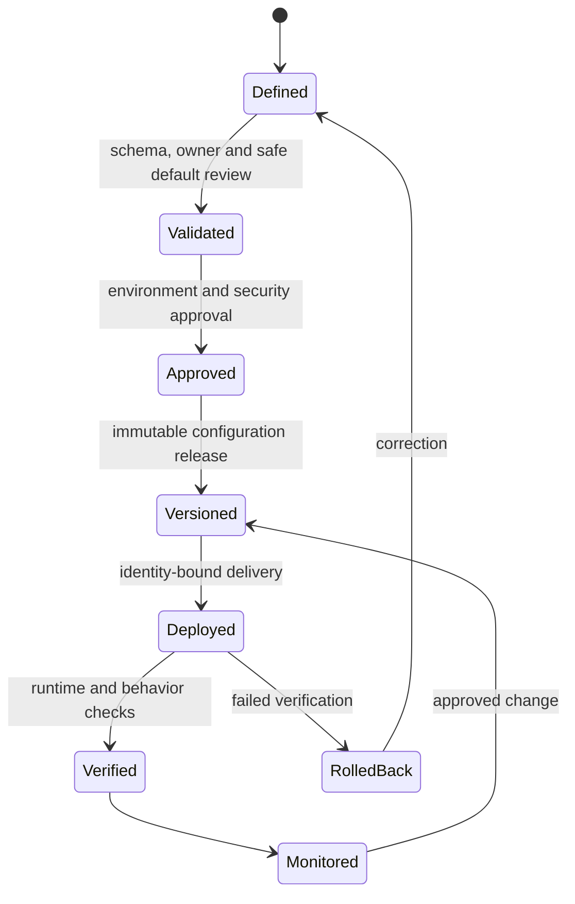

Configuration is typed, documented, classified, versioned, environment-scoped, validated before startup, and separated from secrets. Unknown/unsafe/missing production values fail closed. Deployment settings, product feature flags, and tenant business configuration have distinct ownership/lifecycle. Feature flags declare owner, purpose, default, environments, dependencies, expiry, security impact, telemetry, and removal. Drift between declared and actual state is detected, reviewed, and corrected through the controlled source; emergency changes are captured immediately and reconciled. Rollback restores a known compatible configuration version.

# Chapter 13 — Secrets, Keys, and Certificate Operations

FCSB-005 requires managed custody, separation, least privilege, rotation, revocation, and audit. No production secrets manager, KMS/HSM, or certificate manager is implemented. Current environment variables and development fallbacks are a local mechanism only.

Production operations select no vendor in this draft. A secret/key/certificate record has owner, purpose, environment, consuming workload, classification, storage reference, creation/activation, expiry, rotation window, dependencies, access policy, audit destination, backup/recovery rule, revocation, and compromise playbook. Workloads retrieve short-lived or mounted material through their own identity; operators do not copy values into tickets, shell history, images, logs, or configuration repositories.

Rotation supports overlap and consumer reload without uncontrolled outage. Emergency change revokes compromised material, issues replacements, invalidates sessions/integrations, verifies every consumer, and preserves evidence. Certificate issuance validates identity/name/purpose; renewal and expiry alerts have multiple horizons and owners. Signing/encryption key rollover preserves bounded historical verification. Recovery protects key availability without weakening custody or creating plaintext copies. Provider outage procedures cover cached validity, fail-closed decisions, controlled break glass, recovery priority, and post-event reconciliation.

# Chapter 14 — Database Operations

Current PostgreSQL is one Alpine container with a named local volume, a host-published development port, a health command, environment-configured credentials, and one application connection URL. There is no evidenced runtime/migration/reporting/backup identity separation, TLS, pooler, managed service, HA, backup job, query observability, or maintenance automation.

Production roles separate application DML, migration DDL, read-only reporting, backup/restore, monitoring, and time-limited DBA. Schema ownership is not held by the runtime user. Network access is private and allowlisted; external tools and users never write tables directly. TLS, credential rotation, connection budgets/pooling, statement/transaction timeouts, and emergency access are selected per topology.

Operations track connections, transaction age, locks/deadlocks, slow queries, query plans, table/index/storage/WAL growth, replication state where applicable, checkpoint/vacuum/analyze behavior, bloat, statistics freshness, failed jobs, and capacity headroom. Index changes use measured plans and write cost. Archiving/partitioning follows FCSB-003 evidence and restore implications. Maintenance windows, emergency actions, and configuration changes have approval, backup/recovery context, verification, and audit.

# Chapter 15 — Migration and Schema Change Operations

Three accepted Prisma migrations are committed and immutable. The repository exposes manual development migration commands; API container startup does not run migrations. Production migration execution is a distinct authorized release step, never an uncontrolled side effect of replica startup.

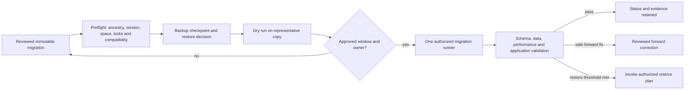

Preflight verifies exact artifact/schema/migration ancestry, target environment, database version, backups, free storage/WAL, lock/runtime estimates, active workload, feature compatibility, and monitoring. Expand-and-contract is preferred: add compatible structures; deploy dual-compatible code; backfill in restartable bounded batches; validate/reconcile; switch reads/writes; later remove only through a new reviewed migration. Long work uses checkpoints, throttling, observable progress, cancellation safety, and lock budgets.

Rollback is not assumed when data changed. A forward fix is preferred when safe; restore is an authorized business/operations decision based on lost work, recovery objectives, migration effect, and reconciliation. Customer approval is required where responsibility or outage/data impact demands it. Failure freezes dependent rollout, preserves logs/status, assesses partial application, and follows the tested recovery path.

# Chapter 16 — Seed and Bootstrap Operations

The current Prisma 6 configuration points the standard seed command to the idempotent TypeScript seed. It upserts or skips duplicates, creates a development tenant/admin/reference/demo foundation, prints a completion summary, and creates no operational stock balances. Re-running is tested for idempotency. It is a development seed, not a production provisioning contract.

Production bootstrap is a separate reviewed workflow: create tenant and mandatory reference/configuration records; establish a unique bootstrap administrator through a one-time, short-lived delivery; require immediate enrollment/rotation; assign minimum roles; audit every step; and verify no demo records or known defaults. Environment admission rejects development bootstrap values.

Reference data has owner, source/version, compatibility, idempotency key, and reconciliation. Demo/training data is allowed only in isolated non-production environments or by explicit customer-approved production exception. Tenant provisioning supports resume/retry, detects partial state, and compensates safely rather than deleting authoritative records. Re-run and rollback behavior are tested; bootstrap completion produces evidence and transfers ownership to named administrators.

# Chapter 17 — High Availability Architecture

No high-availability implementation exists. Current web, API, and database are single instances; the named volume is one local persistence point. Target HA is deployment-model and service-tier specific.

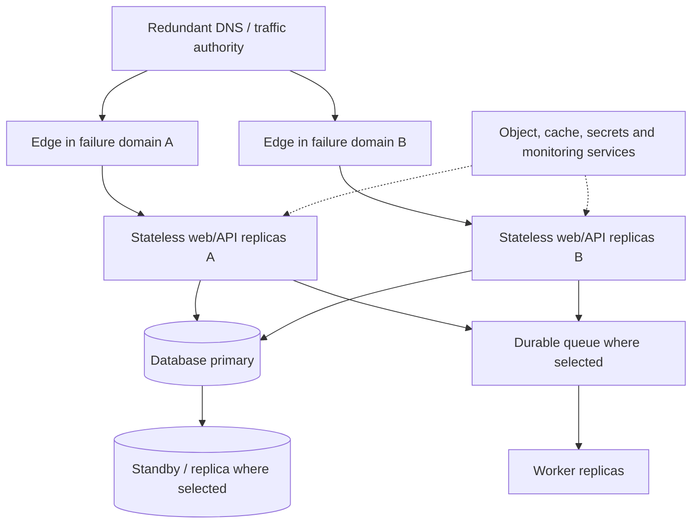

Edge, web, API, workers, database, queue, object storage, cache, secret services, and monitoring each declare redundancy, failure domains, state ownership, quorum, health, failover authority, recovery time, data loss behavior, and single points. Stateless sessions enable replica routing; durable state uses technology-supported replication and fencing to avoid split brain. Queue/cache/object designs account for duplicate delivery, stale data, and consistency.

HA does not replace backup or DR. Customer-managed deployments may accept different constraints, but deviations are explicit risks with supported minimums and tested procedures. Monitoring/control planes also require recovery paths so failures remain visible.

# Chapter 18 — Resilience and Fault Handling

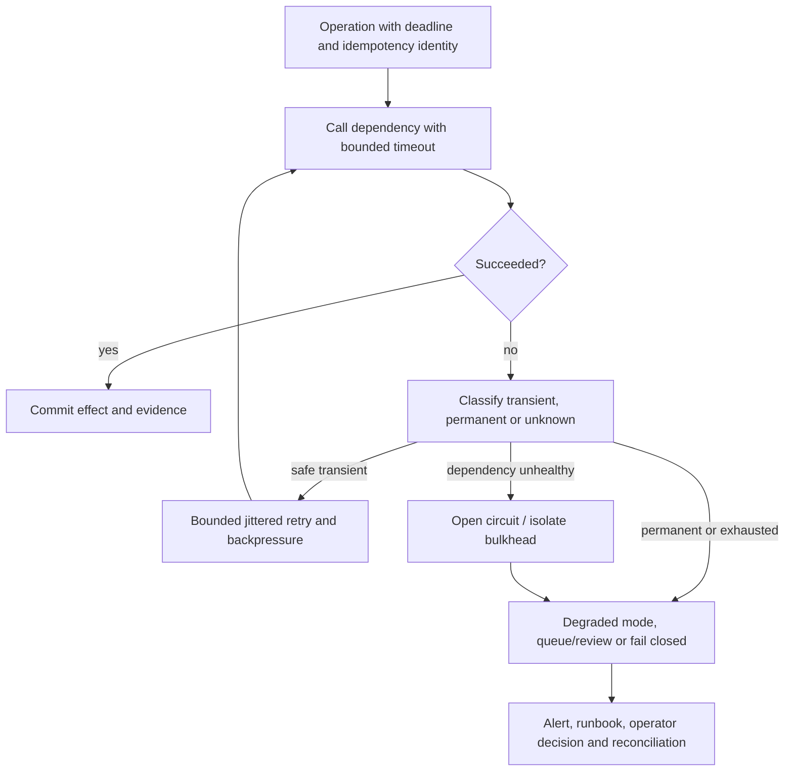

Timeouts are shorter than caller deadlines and owned end to end. Retries are bounded, jittered, observable, and limited to idempotent/safely deduplicated work. Circuit breakers stop amplifying failure; bulkheads isolate tenants/workloads/dependencies; backpressure sheds or queues noncritical work before saturation. Graceful degradation is explicitly authorized—read-only, deferred export, queued integration, or maintenance mode—while posting, approval, security, and safety-adjacent operations fail closed when authority is uncertain.

Database unavailable prevents authoritative writes; storage unavailable stops file-dependent completion; queue unavailable uses bounded intake or disables async submission; partner failure preserves local state and reconciliation identity. Partial effects enter a known state with operator tooling, not ambiguous retries. Every recovery records timeline, lost/deferred work, replay/reconciliation, and verification.

# Chapter 19 — Backup Architecture

No automated backup, WAL archive, immutable copy, retention policy, or backup monitoring is evidenced. A local named Docker volume is persistence, not backup.

```mermaid
flowchart LR
  PG[("PostgreSQL full/base backup and WAL") ] --> ENC["Encrypted backup pipeline"]
  OBJ["Future objects/files"] --> ENC
  CFG["Versioned configuration and IaC"] --> CAT["Backup catalog"]
  SEC["Approved secret/key recovery material"] --> CUST["Separated protected custody"]
  AUD["Audit/security evidence"] --> ENC
  ENC --> COPY1["Primary backup repository"]
  ENC --> COPY2["Immutable/offline or isolated copy"]
  COPY1 --> CAT
  COPY2 --> CAT
  CAT --> VERIFY["Automated integrity checks"]
  VERIFY --> RESTORE["Scheduled restore tests"]
```

Backup scope includes database base/full and logical copies where justified, WAL/PITR stream, objects/files, configuration/IaC, audit evidence, and separately governed secret/key recovery. Schedule and retention derive from service tier, change rate, legal/contract review, storage cost, and restore need—no universal duration is invented. Backups are encrypted, access-separated, monitored, cataloged by source/environment/time/version/key, protected from production compromise, and periodically checked.

Owners monitor job completion, age, size/anomaly, catalog consistency, storage health, encryption/key availability, immutability/replication, and restore-test freshness. Tenant-specific restore capability is assessed against shared-schema references, global data, audit and cross-tenant isolation; a backup label does not imply safe tenant extraction.

# Chapter 20 — Restore Architecture

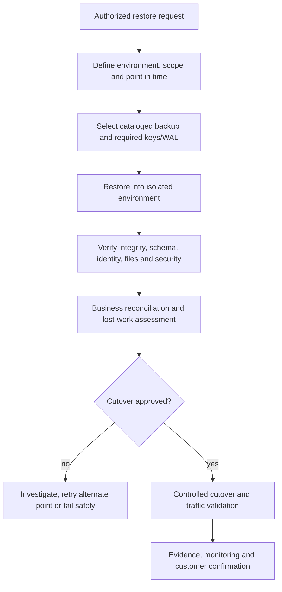

A restore request records incident/change, requester, authorizer, reason, scope, target point, data class, tenant/customer, expected RPO/RTO, and cutover authority. Physical restore recreates a whole cluster/instance; logical restore may recover selected objects but carries referential, sequence, audit, authorization, and performance risks. Point-in-time restore combines a valid base with WAL and a verified timeline.

Restores first occur in an isolated network with production-equivalent versions and protected identities. Verification covers checksums, schema/migrations, counts/control totals, tenant boundaries, users/roles, financial/inventory reconciliation, files, audit continuity, application smoke, performance, and malware/compromise concerns. Failed restore preserves evidence and selects another recovery point/procedure. Partial or tenant-level restore is not promised until designed and tested; shared data may require export/re-import or compensating domain operations. Customer approval and communication follow the responsibility model.

# Chapter 21 — Disaster Recovery Architecture

No DR site, replication, failover automation, or exercise evidence exists. DR strategy is selected by service tier and deployment model: active-active, active-passive, warm standby, cold standby, or backup-only recovery. Each has different consistency, complexity, cost, data-conflict, failback, and operational-skill implications; none is universal.

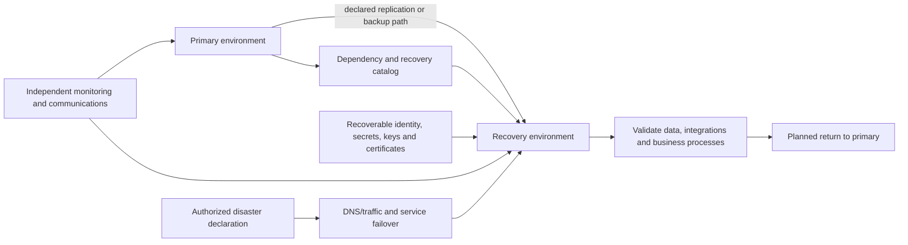

RPO and RTO are approved per service tier/process after business impact and feasibility analysis. Dependency maps cover DNS, identity, secrets/keys, database, objects, queue, integrations, telemetry, network, support, vendors, and customer prerequisites. DR procedures define declaration authority, communication, replication/fencing, traffic change, data validation, reconciliation, partner coordination, security, degraded functions, and return-to-primary.

Exercises include technical restore/failover and business participation; results measure objectives, gaps, manual dependencies, lost work, and corrective actions. Customer-managed obligations for secondary capacity, connectivity, licensing, backup copies, staff, and testing are explicit.

# Chapter 22 — Business Continuity

Business continuity prioritizes critical processes and acceptable degraded modes before technology restoration. Process owners classify identity/access, order capture, procurement, receiving, warehouse issue/receipt, production execution, quality holds, shipment, invoicing/payment, inventory reconciliation, and financial close by maximum tolerable disruption, data dependency, manual fallback, and restoration sequence.

Read-only access, controlled offline forms, queued order capture, manual warehouse/production logs, and delayed close may be valid only when approved, secured, numbered, time-bounded, and reconciled. Manual operation never bypasses safety, quality release, payment approval, tenant confidentiality, or immutable evidence. Decision authority activates/deactivates continuity mode and communicates scope, expected duration, limitations, and data-entry responsibilities.

After recovery, owners sequence backlog entry, deduplicate, preserve original timestamps/source, post through normal domain controls, reconcile stock/production/customer/supplier/financial effects, resolve conflicts, and sign off. FCSB-007 must define manufacturing-specific degraded operation and recovery without making ERP responsible for machine safety.

# Chapter 23 — Observability Architecture

Current foundations are the database-backed API health route, PostgreSQL Compose health command, application audit records with trace IDs, and standard framework/container output. There is no liveness/readiness split, structured log standard, metrics platform, distributed tracing, centralized storage, dashboards, SLO system, or production monitoring.

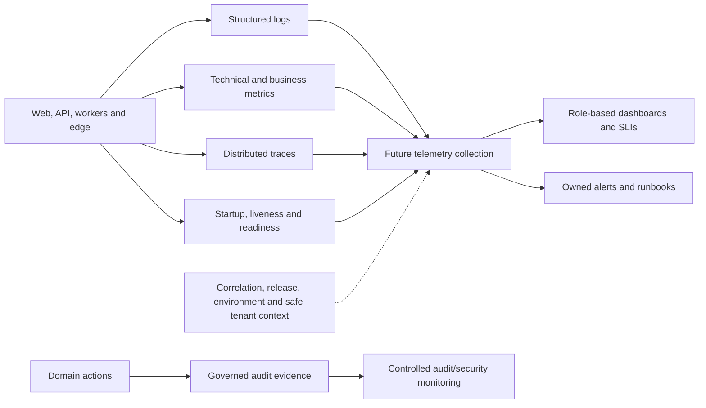

SLIs measure user-visible availability, latency, correctness/freshness, durable job age, integration success, and recovery—not merely process uptime. SLOs and error budgets are service-tier decisions supported by measured baselines; none are asserted here. Health endpoints separate minimal liveness from dependency-aware readiness and restricted diagnostics. Business metrics reveal stuck approvals, imports, postings, integrations and reconciliation failures without exposing sensitive tenant data.

Telemetry carries service/version/environment, outcome, duration, correlation/trace IDs and safe tenant context. Access, retention, sampling, aggregation cardinality, and cost are governed. Audit remains distinct and may require more durable/tamper-resistant custody.

# Chapter 24 — Monitoring and Alerting

Alert categories cover availability, latency, errors, saturation, database, storage, queue/job, backup, certificate, secret, security, integration, business-process failure, tenant isolation, audit pipeline, and release health. Each alert has service/owner, condition and rationale, severity, routing, deduplication/grouping, dependencies, suppression/maintenance rule, runbook, escalation, test, and review cadence.

Severity reflects customer/business/security impact and urgency rather than raw metric magnitude. Alerts page only actionable conditions; dashboards/tickets handle lower urgency. Routing reaches service/domain/security/customer contacts according to responsibility. Suppression is time-bounded, approved, visible, and cannot hide unrelated failure. Release markers and configuration changes correlate with alerts.

Synthetic tests, fault injection where safe, expired-test certificates, failed backup simulations, and runbook exercises verify end-to-end delivery. Alert acknowledgement and resolution evidence distinguish symptom silencing from root-cause correction. No production alerting or on-call platform currently exists.

# Chapter 25 — Operational Logging

Operational logs are structured events with timestamp, level, service/version, environment, event code, outcome, duration, correlation/trace/span IDs, route/operation, dependency, safe principal reference, and safe tenant context. Levels have consistent meanings: error requires action or failed outcome; warn indicates degraded/risk condition; info records meaningful lifecycle; debug/trace are restricted and normally disabled or sampled in production.

Credentials, tokens, private material, connection strings, full personal/business payloads, and unbounded request/response bodies are prohibited. Identifiers are minimized or pseudonymized according to support need. Logging failure must not corrupt business transactions, but loss of required audit/security evidence may fail closed for high-risk operations or trigger immediate alert according to FCSB-005.

Local troubleshooting uses bounded container/process output. Target centralization provides transport buffering, access control, tenant-safe search, retention/tiering, integrity, clock normalization, release/config markers, and cost/cardinality limits. Sampling never removes errors, security events, audit-required actions, or rare business failures without approved alternative. Security/audit copies remain distinct from mutable application logs. Log access and exports are themselves monitored and audited.

# Chapter 26 — Incident and Problem Management

Operations aligns with FCSB-005 preparation, detection, triage, containment, eradication, recovery, evidence, communication, and review without inventing legal notification deadlines.

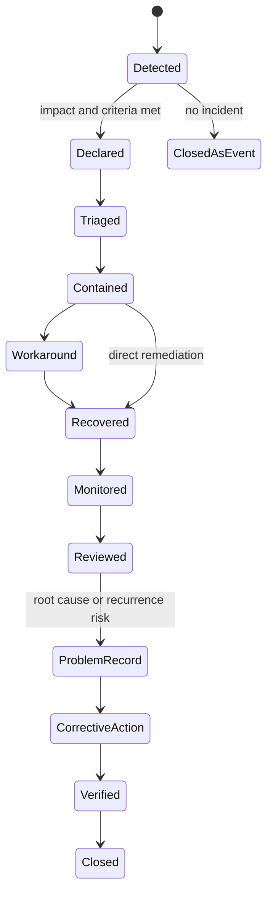

An incident record names commander, operations/security/domain/customer leads, severity, affected tenants/services/processes, timeline, hypotheses/evidence, decisions, communication, workaround, recovery, reconciliation, and exit criteria. Command authority prevents conflicting changes. Containment favors business/data safety; workaround is documented debt, not closure.

Problem management analyzes root and contributing causes across design, process, tooling, training, vendor and control. Known errors record symptoms, safe workaround, risk, owner and expiry. Corrective actions have priority, target, test and effectiveness review. Trend analysis groups recurrence and near misses. Closure requires service stability, business/data reconciliation, customer/owner confirmation where required, evidence preservation, and tracked residual risk.

# Chapter 27 — On-Call and Support Operations

The target support model has service desk/intake, application support, platform/database/network specialists, domain owners, Security, vendors, and incident command. Service hours and response targets depend on service tier and contract; none are asserted. On-call exists only where an owned production tier requires it and must have scheduling, escalation, coverage, fatigue controls, handover, tooling access, and tested alert routes.

Support access is named, MFA-protected, approved, scoped to tenant/environment/purpose, time-limited, monitored, and revoked. Remote troubleshooting minimizes data and uses safe diagnostic packages; customer-managed access requires customer authorization and preserves customer operational control. Developers have no standing production privilege. Break-glass follows FCSB-005.

Runbooks include trigger, prerequisites, authority, safety/security cautions, exact observable steps, decision points, expected output, rollback/stop, escalation, communication, reconciliation and evidence. Knowledge articles are versioned against product/deployment versions. Shift/customer handover records current state, risks, active changes/incidents, deferred work and owner.

# Chapter 28 — Release Management

The repository evidences commits, feature branches, merge commits, and tags through `v0.4-dba004-merged`; there is no CI/CD pipeline, artifact registry, automated promotion, changelog service, or rollback automation. Tags are valuable source milestones but do not alone prove deployed artifact identity or environment state.

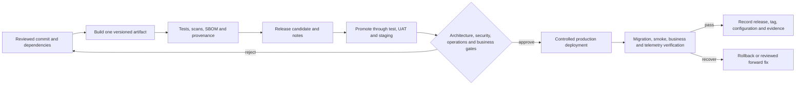

Every release has immutable artifact version/digest, source commit/tag, dependency/base versions, migration range, configuration/flag compatibility, notes, known risks, approvals, deployment strategy/window, smoke/business tests, monitoring plan, rollback/forward-fix plan, support handover, and customer communication. The same artifact is promoted; environment configuration remains separate. Feature flags decouple activation only when their lifecycle and rollback semantics are proven. Release evidence records actual artifact, config, migration status, operator/automation identity, timestamps, tests, alerts, and final decision.

# Chapter 29 — Deployment Strategies

| Strategy | Appropriate use | Key constraints |
|---|---|---|
| In-place | Small customer-managed installs with accepted outage and tested restore | Highest interruption/rollback risk; strict backup and compatibility |
| Rolling | Stateless backward-compatible replicas | Old/new versions coexist; schema, sessions and workers must interoperate |
| Blue-green | Fast traffic switch and environment verification | Double capacity/state coordination; migrations must be compatible |
| Canary | Measured exposure to subset of traffic/tenants | Requires routing, telemetry, stop criteria and representative cohort |
| Shadow | Validate read/compute behavior without authoritative effects | Sensitive-data controls; suppress writes/external side effects |
| Feature flag | Separate deployment from controlled activation | Flag drift/debt, dual paths and data compatibility |
| Maintenance window | Stateful/incompatible or customer-coordinated change | Clear downtime, continuity, restore and communication |

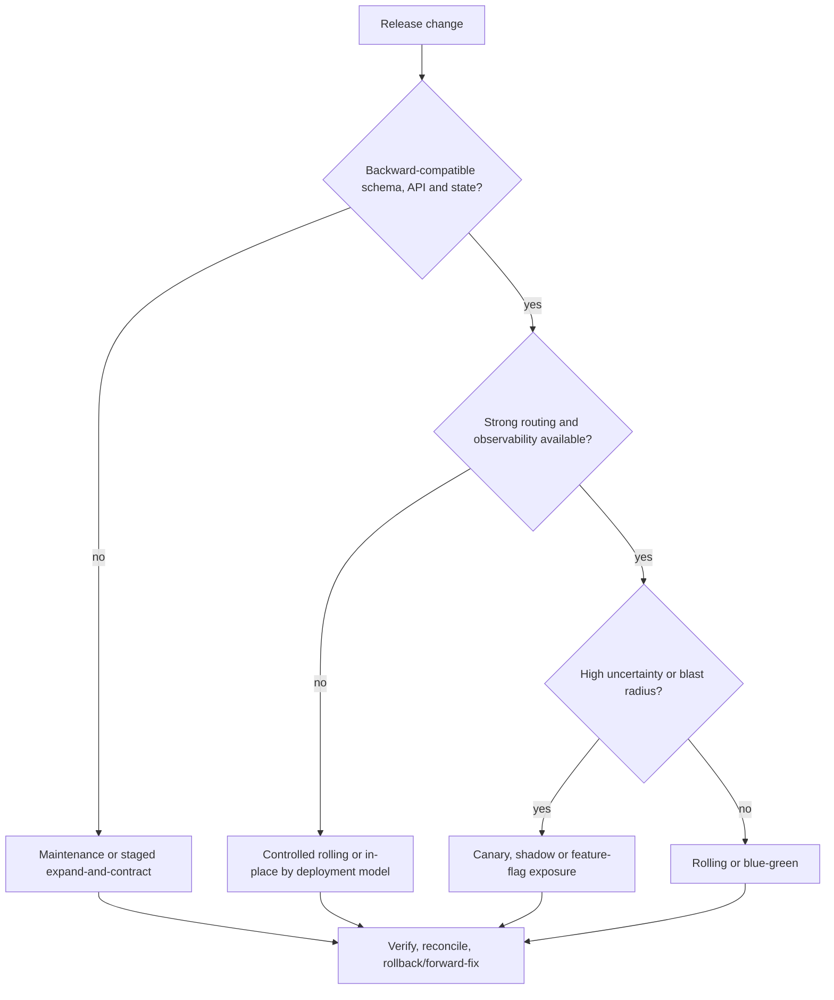

Workers need drain/lease/version handling; sessions need cross-version validity or controlled reauthentication; scheduled jobs must not duplicate; database changes follow Chapter 15. Customer-managed installs receive supported paths, prerequisites, checks and evidence rather than assumptions about platform automation.

# Chapter 30 — Patch and Vulnerability Operations

Patch scope includes OS/host, base image, Node/runtime, npm dependencies, PostgreSQL, orchestration/infrastructure, ingress, telemetry, backup/secret services, and third-party integrations. Current npm audit history is limited dependency evidence; no production patch program exists.

Each finding/patch records affected inventory/versions, exposure, severity/exploitability, business/security impact, vendor guidance, owner, deadline/exception, test, rollout cohort/window, backup/recovery, verification and evidence. Base images and dependencies are rebuilt into a new immutable artifact rather than mutated silently. Database/infrastructure patches test client, extension, replication, backup, migration and performance compatibility.

Emergency patches accelerate approval but retain independent review, artifact identity, testing proportional to urgency, monitoring, rollback/forward-fix, communication, and retrospective. Exceptions are time-bounded with compensating controls and risk acceptance. Customer notification and responsibility follow contract/deployment model, with no invented universal notice period.

# Chapter 31 — Capacity and Performance Operations

No production capacity or performance claim is supported. Capacity modeling begins with workload scenarios: concurrent/active users, request mix and peaks, tenants/organizations, master/transaction/ledger/audit growth, integrations, imports/exports, reports, files, MRP/planning runs, retention, and recovery workload.

Resource dimensions include web/API/worker CPU and memory, database connections/CPU/memory/IOPS/storage/WAL, object capacity/throughput, network bandwidth/latency, queue depth/age, cache/search footprint, telemetry volume, backup duration and restore bandwidth. Budgets define user-visible latency, job completion, posting correctness/freshness, batch windows and headroom per service tier after measurement.

Load tests use representative data shape, tenant distribution, authorization, concurrency, long histories, failures and background work. Soak, spike, stress, recovery and migration tests complement averages. Scaling thresholds have signal, sustain period, cool-down, maximum, dependency budget and operator override. Forecasts compare growth and lead times; capacity review precedes major customer/module/integration launches. FCSB-023 will deepen performance architecture without retroactively validating untested numbers.

# Chapter 32 — Operational Responsibility Model

Legend: **A** accountable, **R** responsible, **C** consulted, **I** informed. `FC` means FlowCraft; `CU` customer; `SP` approved service/implementation partner. Contracts and runbooks must refine every shared cell.

| Activity | FlowCraft-managed SaaS | Dedicated tenant cloud | Customer-managed cloud | On-premise | Hybrid |
|---|---|---|---|---|---|
| Infrastructure | FC A/R; CU I | FC A/R or agreed SP; CU C | CU A/R; FC C | CU A/R; FC I | FC/CU shared A/R by boundary |
| Network | FC A/R; CU C | FC A/R; CU C | CU A/R; FC C | CU A/R | Shared by zone/link |
| OS/host | FC A/R | FC or SP A/R | CU A/R | CU A/R | Boundary owner A/R |
| Container runtime | FC A/R | FC or SP A/R | CU A/R; FC C | CU A/R; FC C | Boundary owner A/R |
| Application deployment | FC A/R; CU I | FC A/R; CU C | CU R; FC A/C | CU R; FC A/C per support | Joint release R; named A |
| Database | FC A/R | FC or agreed operator A/R | CU A/R; FC C | CU A/R; FC C | Data-location owner A/R |
| Backup | FC A/R; CU C | Named operator A/R | CU A/R | CU A/R | Each data owner A/R; joint catalog |
| Restore | FC R; CU A/C for business cutover | Joint A/R by agreement | CU A/R; FC C | CU A/R; FC C | Joint R; data owner A |
| Disaster recovery | FC A/R; CU participates | Named operator A/R; CU C | CU A/R; FC C | CU A/R; FC C | Joint plan; named incident A |
| Secrets | FC A/R | Named operator A/R | CU A/R; FC specifies | CU A/R; FC specifies | Boundary owner A/R |
| Certificates | FC A/R | Named operator A/R | CU A/R; FC C | CU A/R; FC C | Endpoint owner A/R |
| Monitoring | FC A/R | FC/SP A/R; CU receives | CU A/R; FC supports app telemetry | CU A/R; FC supports app telemetry | Shared signals; named alert A |
| Incident response | FC A/R; CU C/I | Joint; FC or CU named A | CU A; FC R/C for application | CU A; FC C/R for application | Joint command with declared A |
| Patching | FC A/R | Named operator A/R | CU A/R platform; FC R application artifact | CU A/R platform; FC R application artifact | Component owner A/R |
| Security review | FC A/R; CU assurance C | Joint C; operator A/R | CU A; FC R for application evidence | CU A; FC R for application evidence | Joint, boundary-specific A |
| Data migration | FC R; CU/domain A | FC R; CU A/C | Joint R; CU A | Joint R; CU A | Joint plan; source/target owners A |
| Customization support | FC R for supported seams; CU A for business use | Same plus tenant operator C | CU A; FC C/R within support policy | CU A; FC C/R within support policy | Package owner R; customer A |

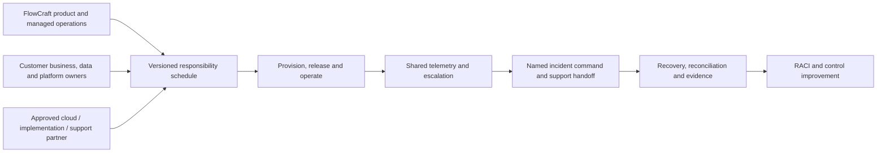

# Chapter 33 — Production Readiness and Acceptance

Production readiness is a governed decision, not a build status. Gates require:

- approved application, data, integration, security, deployment and relevant domain architecture;
- isolated production environment, network, identities, secrets/keys/certificates and controlled ingress;
- immutable artifacts, configuration validation, migration/seed/bootstrap plans and actual release evidence;
- backup completion plus successful restore/reconciliation, approved RPO/RTO/DR plan and exercised responsibilities;
- liveness/readiness, logs/metrics/traces/audit, dashboards, alerts, tested routing, runbooks and on-call/support handover;
- representative capacity/load/recovery evidence and documented limits;
- vulnerability closure/accepted exceptions, image/dependency evidence and independent penetration-test disposition;
- rehearsed data migration, control totals, tenant/organization isolation, financial/inventory reconciliation and rollback/forward-fix;
- user acceptance, business continuity, customer communication, service/RACI acceptance and sign-off.

Each gate records status, owner, evidence URI/version, test date/environment, exception/expiry and approver. A successful application build or 76 development tests cannot substitute for operational evidence. Readiness expires when material architecture, workload, deployment model, security boundary, recovery mechanism, or responsibility changes.

# Chapter 34 — Decisions, Approval, and Roadmap

## Deployment and operations decision register

| Decision ID | Decision | Status | Rationale / condition | Owner |
|---|---|---|---|---|
| FCSB6-ADR-001 | Docker Compose is a development topology and is not approved as the production architecture. | Approved | Current Compose lacks production availability, security, recovery and operations evidence. | Architecture Board |
| FCSB6-ADR-002 | Production runtime/orchestration technology remains unselected. | Deferred | Selection depends on deployment models, customer skills, service tiers and proof. | Architecture Board / Operations |
| FCSB6-ADR-003 | One immutable artifact is built once and promoted across environments. | Approved | Prevents environment-specific rebuild drift. | Release Engineering |
| FCSB6-ADR-004 | Environment separation is mandatory across production, non-production and DR data, identity, secret, network and access. | Approved | Reduces blast radius and unauthorized reuse. | Operations / Security |
| FCSB6-ADR-005 | Production secrets and bootstrap identities cannot use development examples or fallbacks. | Approved | Current defaults are development-only. | Security / Operations |
| FCSB6-ADR-006 | The production database is private and never directly public or partner-accessible. | Approved | Domain APIs own validation, authorization and audit. | Data / Network Operations |
| FCSB6-ADR-007 | Production ingress requires TLS, controlled routing, request policy and health-based targets. | Approved | No production ingress exists today. | Network / Security Operations |
| FCSB6-ADR-008 | Production application containers run as non-root with bounded capabilities/resources. | Approved | Current Dockerfiles do not declare a runtime user or limits. | Platform Operations |
| FCSB6-ADR-009 | Accepted migrations remain immutable and execute as one controlled release step. | Implemented | Migration immutability is evidenced; production execution automation is not. | Data / Release Engineering |
| FCSB6-ADR-010 | Expand-and-contract is preferred for incompatible schema changes. | Approved | Supports mixed-version rollout, backfill and safer recovery. | Data Architecture |
| FCSB6-ADR-011 | A backup is not accepted until restore and business consistency are tested. | Approved | Storage copies alone do not prove recoverability. | Data Operations / Business Owner |
| FCSB6-ADR-012 | RPO and RTO are service-tier and business-process decisions. | Approved | No unsupported universal targets are permitted. | Business Continuity / Operations |
| FCSB6-ADR-013 | HA architecture varies by deployment model and approved service tier. | Approved | SaaS, customer cloud and on-premise constraints differ. | Operations Architecture |
| FCSB6-ADR-014 | Monitoring, actionable alerting and named response ownership precede production. | Approved | Current health/log foundation is insufficient. | Operations / Security |
| FCSB6-ADR-015 | Centralized structured logs and cross-signal correlation are required for supported production. | Approved | Distributed diagnosis and release verification need shared context. | Observability Owner |
| FCSB6-ADR-016 | Application, operational, security and audit logs have distinct policy and custody. | Approved | Different purpose, access, retention and integrity apply. | Operations / Security / Audit |
| FCSB6-ADR-017 | Every production release has tested rollback or reviewed forward-fix/recovery plan. | Approved | Database/data changes may make binary rollback unsafe. | Release Authority |
| FCSB6-ADR-018 | Customer-managed responsibilities are explicit in RACI, support policy and runbooks. | Approved | Shared responsibility cannot be inferred. | Product Operations / Customer |
| FCSB6-ADR-019 | Capacity and scalability claims require representative measured evidence. | Approved | No production workload evidence exists. | Performance / Operations |
| FCSB6-ADR-020 | DR exercises are mandatory for any service tier claiming disaster recovery. | Approved | Documentation alone cannot validate recovery. | Business Continuity / Operations |
| FCSB6-ADR-021 | Production go-live cannot be approved solely from application build or test success. | Approved | Readiness includes security, recovery, observability, support and business evidence. | Production Acceptance Board |
| FCSB6-ADR-022 | Infrastructure-as-code and CI/CD are target directions; implementation/platform remain Open. | Proposed | Versioned automation is required, but no platform exists. | Platform / Release Engineering |
| FCSB6-ADR-023 | Queue, cache, object storage, search and worker technology selection remains Deferred. | Deferred | Choose from operational workload and domain evidence. | Architecture Board |

## Operations control matrix

| Control ID | Operations domain | Control objective | Current status | Target control | Owner | Evidence | Testing method | Priority |
|---|---|---|---|---|---|---|---|---|
| FOC-001 | Environment separation | Separate production from non-production | Not implemented | Separate accounts/projects, data, identities, secrets, networks and approvals | Operations / Security | Local Compose only | Cross-environment access and drift review | P0 |
| FOC-002 | Release artifacts | Promote one immutable artifact | Not implemented | Versioned digest, provenance and controlled registry promotion | Release Engineering | Manual Docker build and Git tags | Digest equality across environments | P0 |
| FOC-003 | Image scanning | Detect vulnerable/misconfigured images | Not implemented | Image/SBOM/dependency scan with policy and exceptions | Security / Release | No scanner evidence | Seeded vulnerable image and gate test | P0 |
| FOC-004 | Non-root containers | Prevent root runtime privilege | Not implemented | Dedicated non-root UID/GID and filesystem ownership | Platform Operations | [API Dockerfile](../../apps/api/Dockerfile) | Runtime identity and write-path test | P0 |
| FOC-005 | Containers | Bound resource consumption | Not implemented | CPU, memory, process and ephemeral-storage requests/limits | Platform Operations | No Compose limits | Saturation and eviction/restart test | P0 |
| FOC-006 | Network segmentation | Limit lateral and external reach | Not implemented | Default-deny zones and approved ingress/egress paths | Network / Security | Flat development Compose network | Connectivity matrix and bypass test | P0 |
| FOC-007 | Ingress TLS | Protect production traffic in transit | Not implemented | Managed TLS, approved certificates and route policy | Network / Security | Development HTTP only | Protocol, certificate and routing test | P0 |
| FOC-008 | Database privacy | Keep authoritative data service private | Development risk | Private endpoint, least-privilege roles and no host-public production port | Data / Network Operations | [Compose topology](../../docker-compose.yml) | External access and role negative tests | P0 |
| FOC-009 | Configuration | Reject missing/unsafe production configuration | Not implemented | Typed startup validation, safe defaults and environment admission | Application / Operations | Environment-variable foundation | Invalid/missing/unknown configuration tests | P0 |
| FOC-010 | Secret rotation | Rotate and revoke production secrets | Not implemented | Managed custody, workload identity, overlap and audit | Security / Operations | Environment variables only | Scheduled/emergency rotation exercise | P0 |
| FOC-011 | Certificate renewal | Renew before expiry and recover compromise | Not implemented | Inventory, automated renewal, alerts, rollover and revocation | Security / Network Operations | No certificate manager | Expiry and compromise simulation | P0 |
| FOC-012 | Migration preflight | Detect unsafe migration conditions | Manual foundation | Automated ancestry/version/space/lock/backup preflight | Data / Release Engineering | [Prisma configuration](../../prisma.config.ts) | Representative dry run and failed-preflight test | P0 |
| FOC-013 | Backup | Preserve recoverable authoritative data | Not implemented | Encrypted monitored database/file/audit/config backup catalog | Data Operations | Named volume only | Job failure, integrity and catalog tests | P0 |
| FOC-014 | Restore testing | Prove backup usability | Not implemented | Scheduled isolated restore plus application/business reconciliation | Data / Business owners | No restore evidence | Timed full restore exercise | P0 |
| FOC-015 | Recovery | Support approved point-in-time objective | Not implemented | WAL/PITR capture, retention, monitoring and timeline procedure | Data Operations | No WAL archive evidence | Multi-point recovery test | P0 |
| FOC-016 | Disaster recovery | Verify declared recovery architecture | Not implemented | Owned DR plan, dependency recovery and exercises | Business Continuity / Operations | No DR site/process evidence | Technical and business exercise | P0 |
| FOC-017 | Health | Expose minimal service health | Partial | Separate startup, liveness, readiness and restricted diagnostics | Application / Operations | [Health endpoint](../../apps/api/src/health/health.controller.ts) | Dependency and false-positive health tests | P0 |
| FOC-018 | Readiness | Route traffic only to capable instances | Not implemented | Dependency-aware readiness and ingress removal | Application / Platform | DB-backed health route only | Database/dependency degradation test | P0 |
| FOC-019 | Liveness | Restart only irrecoverably stuck instances | Not implemented | Dependency-independent liveness and restart policy | Application / Platform | No app container probe | Deadlock/event-loop and DB-outage differentiation | P0 |
| FOC-020 | Logging | Centralize safe structured operational logs | Not implemented | Schema, collection, access, retention and correlation | Observability Owner | Framework/container output | Search, redaction, loss and access tests | P0 |
| FOC-021 | Metrics | Measure service and business health | Not implemented | Technical/business metrics with cardinality and ownership | Observability / Domain | No metrics dependency | Signal accuracy and load test | P0 |
| FOC-022 | Tracing | Follow work across boundaries | Not implemented | Correlated distributed tracing with sampling/security policy | Observability Owner | Audit trace-ID foundation only | Cross-service trace completeness test | P1 |
| FOC-023 | Alerting | Notify actionable production failure | Not implemented | Severity, deduplication, routes, escalation, runbook and tests | Operations / Security | No alert platform | End-to-end alert exercise | P0 |
| FOC-024 | Support | Provide accountable response coverage | Not implemented | Service-tier on-call schedule and escalation | Service Operations | No on-call evidence | Paging, acknowledgement and handover drill | P0 |
| FOC-025 | Runbooks | Make critical operations repeatable | Partial manual docs | Versioned executable procedures with stop/recovery/evidence | Service owners | README and implementation commands | Unfamiliar-operator exercise | P0 |
| FOC-026 | Release approvals | Require independent production approvals | Not implemented | Architecture/security/operations/business gates | Release Authority | Manual Git milestone practice | Approval bypass and evidence audit | P0 |
| FOC-027 | Deployment | Recover from failed release | Not implemented | Tested rollback, forward-fix and database recovery criteria | Release / Data Operations | No automated rollback | Failure injection and recovery rehearsal | P0 |
| FOC-028 | Patch management | Maintain supported secure components | Not implemented | Inventory, risk-based patch, test, rollout and exceptions | Operations / Security | npm audit history only | Patch campaign sampling | P1 |
| FOC-029 | Capacity testing | Validate workload limits and headroom | Not implemented | Scenario model, load/soak/failure tests and forecasts | Performance / Operations | No production load evidence | Representative capacity test | P0 |
| FOC-030 | Support access | Restrict privileged troubleshooting | Not implemented | Named MFA-protected time-limited tenant/environment access | Security / Support | No production support access design | Grant, expiry and audit test | P0 |
| FOC-031 | Data masking | Keep sensitive production data out of non-production | Not implemented | Synthetic or verified masking pipeline | Data Governance / Privacy | No masking automation | Field sampling and re-identification review | P0 |
| FOC-032 | Acceptance | Block unready production deployment | Not implemented | Evidence-backed readiness register and exception expiry | Production Acceptance Board | Development builds/tests only | Gate completeness and stale-evidence audit | P0 |
| FOC-033 | Bootstrap | Prevent demo/default production provisioning | Partial development | Separate production provisioning, one-time admin and audit | Identity / Tenant Operations | Idempotent development seed | Re-run, default rejection and ownership transfer test | P0 |
| FOC-034 | Continuity | Reconcile manual/degraded work after recovery | Not implemented | Approved continuity modes, controlled records and reconciliation | Business Continuity / Domain owners | No continuity runtime/process evidence | Process tabletop and backlog replay test | P1 |

## Operational risk register

| Risk ID | Asset/service | Risk | Current condition | Impact | Target mitigation | Owner | Residual-risk direction |
|---|---|---|---|---|---|---|---|
| FOR-001 | PostgreSQL | Single database instance failure | One development container/volume | Total data-service outage and potential loss | Service-tier HA plus tested backup/restore | Data Operations | Reduce |
| FOR-002 | API | Single API instance failure | One Compose container | API outage | Ready replicas and health-based routing where tier requires | Platform Operations | Reduce |
| FOR-003 | Web | Single web instance failure | One Compose container | User access outage | Ready replicas and controlled ingress where tier requires | Platform Operations | Reduce |
| FOR-004 | Database network | Database host port exposure | Development port published to host | Unauthorized reach or misconfiguration if reused | Private production endpoint and firewall policy | Network / Data Operations | Eliminate |
| FOR-005 | Containers | Root container runtime | Dockerfiles declare no non-root user | Increased container/host impact | Non-root minimal runtime and capability controls | Platform Operations | Reduce |
| FOR-006 | Images | Mutable base images | Tag-pinned Alpine images, no digest/provenance | Unreproducible/vulnerable releases | Controlled pins, scanning, SBOM and provenance | Release Engineering | Reduce |
| FOR-007 | Configuration | Development secrets | Fallbacks/examples exist for local use | Credential compromise and shared access | Production admission, managed secrets and rotation | Security / Operations | Eliminate |
| FOR-008 | Data | No automated backup | Named volume only | Permanent data loss | Encrypted monitored cataloged backups | Data Operations | Reduce |
| FOR-009 | Recovery | Untested restore | No restore evidence | Backup unusable or inconsistent | Regular isolated restore/reconciliation | Data / Business owners | Minimize |
| FOR-010 | Service continuity | No DR capability | No secondary site/plan/exercise | Extended outage/data loss | Tiered DR design and exercise | Business Continuity | Reduce |
| FOR-011 | Diagnostics | No centralized logs | Local framework/container output | Slow/failed diagnosis and evidence loss | Structured central collection and access | Observability Owner | Reduce |
| FOR-012 | Service health | No metrics | No metrics platform/instrumentation | Saturation/failure remains invisible | SLIs and owned technical/business metrics | Observability Owner | Reduce |
| FOR-013 | Distributed diagnosis | No tracing | Trace IDs only in audit foundation | Cross-boundary latency/failure ambiguity | Correlated traces with sampling policy | Observability Owner | Reduce |
| FOR-014 | Response | No alerting | No production alert routes | Users discover incidents first | Tested actionable alerting | Service Operations | Reduce |
| FOR-015 | Support | No on-call model | No schedule/escalation evidence | Delayed or ownerless response | Service-tier support and escalation | Service Operations | Reduce |
| FOR-016 | Database schema | Manual migration error | Manual development commands | Partial schema/outage/data inconsistency | One authorized runner, preflight, dry run and evidence | Data / Release Engineering | Reduce |
| FOR-017 | Database availability | Long-running migration lock | No production lock budget/procedure | Blocking, timeout and outage | Expand/contract, batching, lock monitoring and abort criteria | Data Operations | Reduce |
| FOR-018 | Storage | Storage exhaustion | No production growth monitoring | Database/file outage and failed recovery | Forecasts, alerts, headroom and archival | Data / Platform Operations | Reduce |
| FOR-019 | Edge/integration | Certificate expiry | No certificate inventory/alerts | Traffic/integration outage | Automated renewal, alerts and rollover drills | Security / Network Operations | Reduce |
| FOR-020 | External dependency | Dependency outage | No circuit/degraded-mode evidence | Authentication or process disruption | Timeouts, bulkheads, continuity and vendor runbooks | Service / Integration owners | Reduce |
| FOR-021 | Production and backups | Ransomware | No immutable backup/segmentation/DR evidence | Widespread data and service loss | Least privilege, isolation, immutable copy and exercises | Security / Operations | Minimize |
| FOR-022 | Customer deployment | Customer-managed misconfiguration | Responsibility/baseline not operationalized | Security, outage and support failure | Supported baseline, validation, RACI and evidence | Customer / Product Operations | Reduce |
| FOR-023 | Application/runtime | Unsupported customization | Flexible platform and customer deployment options | Upgrade, isolation and recovery failure | Governed packages, compatibility and support policy | Product Governance / Customer | Reduce |
| FOR-024 | Capacity | Capacity surprise | No representative production tests | Latency, outage and missed business windows | Workload model, testing, thresholds and forecasts | Performance / Operations | Reduce |
| FOR-025 | Release/data | Release rollback failure | No automated/tested release recovery | Extended outage or inconsistent data | Compatible rollout, forward-fix and tested restore criteria | Release / Data Operations | Minimize |

## Open decisions

1. Select supported runtime/orchestration patterns for SaaS, customer cloud and on-premise after representative proofs.
2. Define service tiers, SLI/SLO/error-budget method, RPO/RTO, support hours and business restoration priorities.
3. Select ingress, DNS, certificate, secrets/key, telemetry, alerting, backup and artifact-registry capabilities without vendor claims in this draft.
4. Define CI/CD and IaC platforms, identity, approvals, evidence, drift and emergency-change workflow.
5. Decide production PostgreSQL hosting, HA/failover, pooling, maintenance, backup/PITR and tenant-restore support by deployment model.
6. Select queue/worker, object storage, cache, search and scheduler only after operational workload requirements exist.
7. Approve configuration schema, feature-flag governance and build-time versus runtime web configuration strategy.
8. Define log/metric/trace/audit schemas, retention, tenant context, access, cost and security monitoring handoff.
9. Define supported version/upgrade/patch matrices and end-of-support policy for customer-managed platforms.
10. Reconcile contractual RACI, assurance evidence, DR exercise and customer communication for each commercial deployment offer.

## Approval roles

| Role | Approval focus | Draft state |
|---|---|---|
| Architecture Board | Deployment models, target boundaries, technology deferrals and cross-volume consistency | Pending |
| Security Architecture | Operationalization of FCSB-005, network, identity, secret/key, logging and support access | Pending |
| Operations Architecture | Topology, environments, HA, resilience, observability, support and readiness | Pending |
| Data Operations / Architecture | Database, migrations, backup, restore, PITR, DR consistency and capacity | Pending |
| Release Engineering | Immutable artifacts, CI/CD/IaC direction, promotion, deployment and recovery | Pending |
| Business Continuity / Domain Owners | Process criticality, RPO/RTO, degraded modes, reconciliation and acceptance | Pending |
| Product / Customer Operations | Supported deployment offers, RACI, runbooks, patching and lifecycle | Pending |
| Production Acceptance Board | Consolidated evidence, exceptions, customer sign-off and go-live decision | Pending |

## Approval conditions

1. Reviewers accept the current development-only baseline and do not reinterpret target controls as implemented.
2. Every P0 control and High operational risk receives owner, milestone, evidence type and exception authority.
3. Deployment-model RACI is reconciled with security, contracts, support and customer capability.
4. Database migration, backup/restore, DR, observability, incident, release and production-readiness procedures are exercised in a production-like environment before go-live.
5. Tool/vendor choices remain Open/Deferred until requirements, proof, support, security, residency, cost and exit are evaluated.
6. Controlled FEAPB/FEOM/EOR sources are reconciled when available; material conflicts return to Architecture Board decision.

## Required work before FCSB-007

- Define manufacturing process criticality, shift/calendar windows, acceptable degraded operation, data freshness, recovery sequence and shop-floor/OT responsibility inputs.
- Establish the runtime seams for future planning jobs, imports/exports, production reporting, integration/device gateways and authoritative Inventory/Finance posting without selecting unsupported technology.
- Provide capacity-test methodology for BOM/routing expansion, MRP/planning, production orders, material issue/completion, genealogy, quality and maintenance workloads.
- Define manufacturing-specific observability, alerts, runbooks, continuity forms, backlog replay and reconciliation evidence.
- Preserve FCSB-005 rule that ERP cannot become machine-safety authority and no direct internet-to-PLC path exists.

## Required work before production

- Resolve the Chapter 33 readiness gates with current production-like evidence and approved expiring exceptions only.
- Implement isolated environments, immutable artifacts, controlled configuration/secrets, non-root hardened runtime, private database, TLS ingress and least-privilege operations.
- Implement and test database change, backup/restore/PITR, selected HA/DR, business continuity, security monitoring, incident/on-call and customer support procedures.
- Complete representative load/capacity/recovery tests, vulnerability/image/supply-chain checks, penetration-test disposition, data migration/reconciliation and support handover.
- Approve service tier, RACI, customer obligations, maintenance/patch lifecycle, communication, known limitations and final go-live authority.

FCSB-006 supplies the operating envelope and evidence model for FCSB-007; FCSB-007 supplies manufacturing process/workload/continuity requirements back into that envelope. Later performance, mobile/offline, AI, governance and domain volumes refine controls but cannot claim availability, scale or recoverability without FCSB-006 evidence.

## Version history

| Version | Date | Status | Change |
|---|---|---|---|
| 1.0 Draft | 2026-07-16 | Architecture Review Draft | Initial evidence-based deployment and operations architecture, decisions, controls, risks, RACI and production gates |

## Repository evidence references

- [FCSB Series Index](./FCSB-Series-Index.md)
- [FCSB Volume 1](./FCSB-Volume-1-Executive-and-Business-Architecture.md)
- [FCSB Volume 2](./FCSB-Volume-2-Application-and-Platform-Architecture.md)
- [FCSB Volume 3](./FCSB-Volume-3-Enterprise-Data-and-Information-Architecture.md)
- [FCSB Volume 4](./FCSB-Volume-4-Integration-Architecture.md)
- [FCSB Volume 5](./FCSB-Volume-5-Security-and-Trust-Architecture.md)
- [Repository overview](../../README.md)
- [DBA-002 implementation report](../implementation/DBA-002-foundation-implementation.md)
- [DBA-003 implementation report](../implementation/DBA-003-enterprise-structure-implementation.md)
- [DBA-004 implementation report](../implementation/DBA-004-enterprise-master-data-implementation.md)
- [Root workspace configuration](../../package.json)
- [API workspace configuration](../../apps/api/package.json)
- [Web workspace configuration](../../apps/web/package.json)
- [Docker Compose development topology](../../docker-compose.yml)
- [API Dockerfile](../../apps/api/Dockerfile)
- [Web Dockerfile](../../apps/web/Dockerfile)
- [Prisma configuration](../../prisma.config.ts)
- [API bootstrap](../../apps/api/src/main.ts)
- [Application module composition](../../apps/api/src/app.module.ts)
- [Health endpoint](../../apps/api/src/health/health.controller.ts)
- [Prisma lifecycle service](../../apps/api/src/prisma/prisma.service.ts)
- [Current Prisma schema](../../apps/api/prisma/schema.prisma)
- [Current idempotent seed](../../apps/api/prisma/seed.ts)
- [Web build configuration](../../apps/web/next.config.ts)
- [Foundation tests](../../apps/api/test/foundation.spec.ts)
- [Organization tests](../../apps/api/test/organization.spec.ts)
- [Master-data tests](../../apps/api/test/master-data.spec.ts)

## Known evidence limitations

The repository contains no production environment, orchestration, ingress/TLS/load balancer, multi-instance service, autoscaling, background worker, queue, cache, object storage, search, centralized logs, metrics, tracing, SIEM, alerting, on-call platform, automated backup/restore/PITR, DR site, immutable backup, managed secrets/keys/certificates, IaC, CI/CD, artifact registry/signing, deployment automation, production patch process, runbook automation, penetration-test report, or production capacity result. Docker development defaults and host ports are not production design. The accepted 76 tests and build history validate application milestones, not operational readiness. Controlled FEAPB and related sources are not standalone repository files and require reconciliation before approval.
