# FlowCraft Solution Blueprint

## Volume 7 — Manufacturing Solution Architecture

| Document control | Value |
|---|---|
| Document code | FCSB-007 |
| Version | 1.0 Draft |
| Status | Architecture Review Draft |
| Approval status | Pending Architecture Board, Manufacturing, Finance, Inventory, Quality, Maintenance, Security, and Operations Review |
| Last updated | 2026-07-16 |
| Related milestones | DBA-002 Platform Foundation; DBA-003 Enterprise Structure; DBA-004 Enterprise Master Data; manufacturing architecture gate before Finance, Inventory, Quality, Maintenance, planning, and execution implementation |
| Dependencies | FCSB-001 through FCSB-006; current Item, UOM, plant, warehouse, traceability-master, organization, EOR, workflow, audit, transaction scaffold, test, migration, and deployment evidence |
| Next planned volume | FCSB-008 — Knowledge Graph and Governed AI Architecture |

This draft defines a target manufacturing operating model. It does not establish implementation, production readiness, capacity, optimization, machine safety, or operation of the planned manufacturing capabilities.

## Status vocabulary

| Status | Meaning in this volume |
|---|---|
| Implemented | Directly evidenced in the accepted repository baseline through `v0.4-dba004-merged`. |
| Partial | A relevant master/platform scaffold exists, but manufacturing behavior is incomplete. |
| Approved | Architecture direction proposed for board approval; runtime may not exist. |
| Planned | Required target capability not implemented in the current baseline. |
| Proposed | Design direction requiring detailed domain design and evidence. |
| Open | Material business or technology decision remains unresolved. |
| Deferred | Deliberately assigned to a later volume/milestone. |
| Future | Optimization, integration or intelligence direction outside the near runtime baseline. |

# Chapter 1 — Purpose and Scope

FCSB-007 defines the manufacturing operating model that coordinates demand, product/engineering definition, planning, materials, capacity, production execution, quality, maintenance, costing, Inventory, Finance, traceability, shop-floor integration, analytics, and continuity. Its audience is the Architecture Board; Manufacturing, Planning, Engineering, Sales, Procurement, Inventory, Warehouse, Quality, Maintenance and Finance owners; Security/Operations; product/engineering/test teams; implementation partners; and customer manufacturing leaders.

Scope includes discrete, repetitive, process/continuous, batch, job-shop, engineer/project-to-order, assembly, packaging, mixed trading/manufacturing and maintenance-support scenarios. It specifies domain authority, lifecycle, effective dating, approvals, traceability, corrections, and cross-domain contracts. Detailed ledgers/posting remain in later Inventory/Finance volumes; MES execution in FCSB-018; Quality and Maintenance depth in FCSB-019/020; AI/FKG in FCSB-008; common transaction/document/workflow semantics in FCSB-009/010/011.

[FCSB-001](./FCSB-Volume-1-Executive-and-Business-Architecture.md) provides business intent; [FCSB-002](./FCSB-Volume-2-Application-and-Platform-Architecture.md) modular/runtime boundaries; [FCSB-003](./FCSB-Volume-3-Enterprise-Data-and-Information-Architecture.md) data authority; [FCSB-004](./FCSB-Volume-4-Integration-Architecture.md) contracts; [FCSB-005](./FCSB-Volume-5-Security-and-Trust-Architecture.md) trust/SoD; [FCSB-006](./FCSB-Volume-6-Deployment-and-Operations-Architecture.md) recoverability/operations. Manufacturing architecture must be approved before code so BOM/routing identity, planning authority, stock/GL boundaries, quality/maintenance constraints, reversals, costing and genealogy cannot diverge across modules.

# Chapter 2 — Manufacturing Architecture Executive Summary

The current foundation includes enterprise/plant/organization scope, warehouses/locations, cost/profit centers, Item strategy/replenishment/costing/tracking fields, UOM and effective-dated conversions, batch/serial masters, stock statuses, Business Partners, Digital DNA, EOR metadata, versioned workflow definitions, audit, number series, generic transaction/link scaffolds, REST/UI foundations and development deployment. EOR codes such as BOM, routing, work center, production plan/order-like records, material issue, production entry, quality inspection and maintenance work order are registrations only; no corresponding governed manufacturing runtime is evidenced.

The planned model governs demand-to-supply: Sales/forecast/service/stock/project/maintenance demand feeds MPS/MRP; Engineering releases effective product structures/routings; Planning proposes supply and capacity; approved production orders freeze exact revisions; Inventory reserves/issues/receives; Production records execution; Quality controls hold/release; Maintenance constrains resources; Costing calculates manufacturing effects; Finance posts authorized journals; genealogy links inputs, process, outputs and customers.

Current maturity is master-data/platform foundation. Planned capabilities cover core masters, planning, order execution, stock/Finance requests, quality/maintenance integration and costing. MES/PLC/IoT, APS, OEE, AI planning and digital twins are Future. Production safety remains with engineered machine/safety systems.

# Chapter 3 — Manufacturing Principles

1. Every demand signal has one governed source identity, owner, priority, due date and version.
2. Planning coordinates material, capacity, labor, machine, quality, maintenance and Finance constraints without silently overriding their owners.
3. Manufacturing never updates stock balances directly; Inventory posts immutable movements.
4. Manufacturing never writes GL/journals directly; Finance validates and posts accounting requests.
5. Posted production effects are immutable; corrections/reversals are linked, authorized and traceable.
6. BOM, formula/recipe, routing and product revision are versioned, approved, scoped and effective-dated; historical truth remains resolvable.
7. Planning proposals are not execution authority; orders require firming/approval/release.
8. Quality status constrains material/output release; Quality owns hold/release decisions.
9. Maintenance state constrains machine/resource availability; Maintenance owns asset state.
10. ERP is not machine-safety authority and cannot bypass physical/PLC safety controls.
11. High-impact reprioritization requires impact analysis, independent approval, communication and recovery plan.
12. Prefer governed configuration and metadata to customer-specific source changes.
13. Build traceability into identities/effects rather than reconstructing it from reports.
14. Costing uses authoritative quantities, rates, versions and posted effects.
15. One governed model supports discrete, repetitive, batch, continuous/process and hybrid behavior through typed specialization.
16. Semi-finished goods are fully planned, stocked, costed and traceable where the operating model requires.
17. AI may advise but cannot autonomously approve, release, post, or execute high-impact rescheduling.

# Chapter 4 — Current Manufacturing Foundation

| Foundation | Evidence-backed state | Manufacturing limitation |
|---|---|---|
| Item | Strategy MTS/MTO/ATO/ETO/CTO/HYBRID; replenishment, valuation/costing, tracking, planning quantities, shelf/lead time, warehouse/supplier and manufacturing/quality flags | No BOM/routing/revision/planning/execution relationship |
| UOM/conversion | Tenant/global and item-specific effective-dated conversions with positive-factor validation | No production quantity-conversion runtime |
| Organization | Group through plant/department/team/location; effective access; cost/profit centers | Production line/work center/machine/labor/calendar absent |
| Warehouse | Plant/location/branch/type/hierarchy and default stock status | No stock balance, reservation or movement ledger |
| Batch/serial | Company/item identity, dates/status and informational current location | No genealogy or transactional custody history |
| Stock status | Availability flags and approval-to-release marker | No Quality inspection/release runtime |
| EOR | Manufacturing-related codes, fields/relations capability metadata | Registration is not domain model/API/runtime |
| Workflow/audit | Versioned published workflow definitions; audited governed master writes | No manufacturing workflow-instance/execution runtime |
| Transactions | Company-scoped generic document with JSON payload and links | Legacy scaffold lacks typed manufacturing invariants, tenant/plant scope and ledgers |
| UI/API | Master-data and organization pages/routes | No production planning/order/shop-floor/dashboard UI |

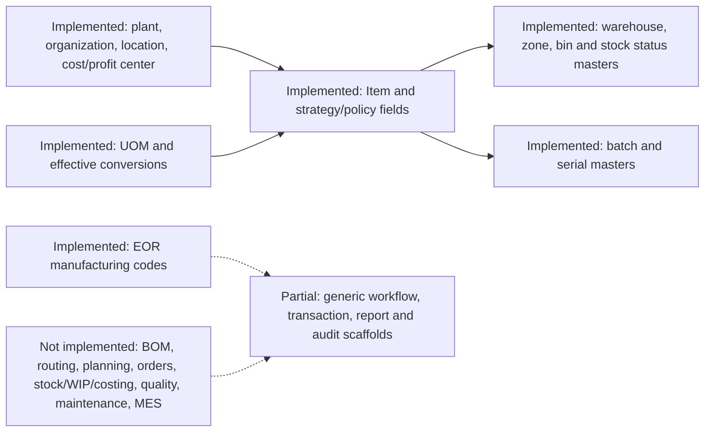

The accepted tests cover selected strategy/tracking/UOM/warehouse/batch/serial/scope rules, not end-to-end manufacturing. Seeded manufacturing departments, roles, object codes, warehouses and representative Items are development/reference data, not runtime evidence.

# Chapter 5 — Target Manufacturing Architecture

| Layer | Responsibility | Status |
|---:|---|---|
| 1. Demand | Sales, forecast, service, project, stock and dependent demand | Planned |
| 2. Product and Engineering Definition | Item revision, BOM/formula/recipe, routing, change | Planned; Item foundation implemented |
| 3. Planning | MPS, MRP, pegging, proposals and exceptions | Planned |
| 4. Capacity | Calendars, labor/resources, RCCP/CRP | Planned |
| 5. Production Order Management | Firm, approve, release, hold, close and correct | Planned |
| 6. Material and Inventory | Availability, reservation, issue, receipt, transfer and ledger | Planned Inventory authority; masters exist |
| 7. Shop-Floor Execution | Dispatch, progress, consumption/output capture | Planned; MES/terminal Future |
| 8. Quality | Inspection, hold, release, NCR/CAPA | Planned; status masters exist |
| 9. Maintenance | Asset availability, downtime, work and calibration | Planned |
| 10. Costing and Finance | Estimates, WIP, variances and journal requests | Planned |
| 11. Traceability and Analytics | Genealogy, recall, yield/OEE/reporting | Planned/Future |
| 12. Integration and AI | Partners, devices, optimization and advice | Future |

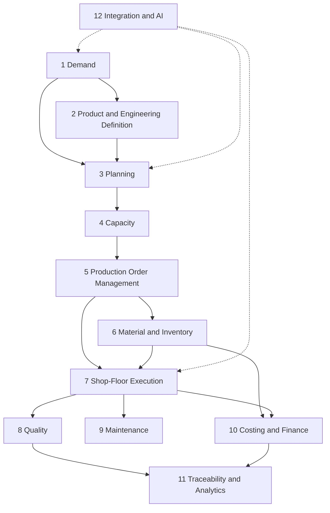

# Chapter 6 — Manufacturing Operating Models

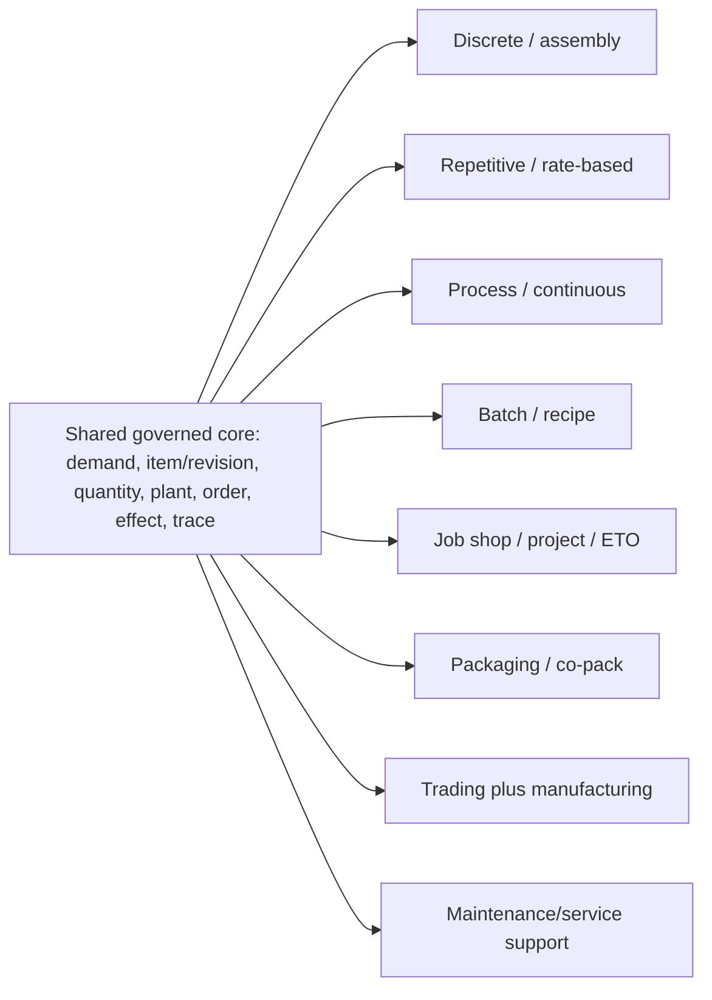

Discrete/assembly uses countable units, BOM components, routing operations and serial/batch outputs. Repetitive uses production rates, line schedules, backflush options and short-cycle reporting. Process/continuous uses formulas, streams, campaign conditions, yields and co-/by-products; batch manufacturing adds vessel/batch-size/recipe execution. Job shop/ETO uses project/customer pegging, unique revisions and flexible routings. Packaging transforms bulk/semi-finished outputs through pack specifications. Trading plus manufacturing allows purchase/resale and manufacture per item/site. Maintenance/service manufacturing consumes spares/tools/labor without becoming a production order unless an approved refurbish/remanufacture process requires it.

All share tenant/company/plant scope, UOM precision, effective definitions, demand/supply identity, lifecycle/approval, material and cost effects, audit and genealogy. Specialized fields never hide inside ungoverned payloads where they affect authority.

# Chapter 7 — Manufacturing Strategies

| Strategy | Decision basis | Planning/execution implication |
|---|---|---|
| MTS | Forecast/stock service, stable repeat demand | Plan to stock; safety/reorder/MPS; customer allocation at fulfillment |
| MTO | Confirmed customer demand | Peg supply/order to demand; change/cancellation impact explicit |
| ATO | Stocked modules, configured final assembly | Plan modules; configure/release final assembly from order |
| ETO | Engineering work required per demand | Project/customer change and revision gates precede release |
| CTO | Rule-based configuration from approved options | Validate configuration, derive structure/routing, retain exact resolution |
| HYBRID | Mixed stock/order/configuration or plant policy | Strategy resolved by item/site/demand rule with traceable override |
| JIT | Synchronized pull with reliable flow | Small/repeated replenishment, lead/quality risk visibility |
| Kanban-supported | Visual/electronic pull for bounded loops | Card/container identity, WIP limits, replenishment signal and audit |
| Campaign | Setup/allergen/color/material-family economics | Sequence related batches with cleaning/changeover constraints |
| Repetitive rate | Stable line production by rate | Line/calendar rate, backflush policy, periodic reconciliation |
| Continuous flow | Continuous inputs/outputs | Time/quantity capture, mass balance, shutdown/startup and process state |

Item currently accepts the first six and replenishment JIT/Kanban fields; that validation does not implement their runtime. Strategy may vary by plant/customer/project only through a future approved policy, never by silent user convention.

# Chapter 8 — Manufacturing Organization Model

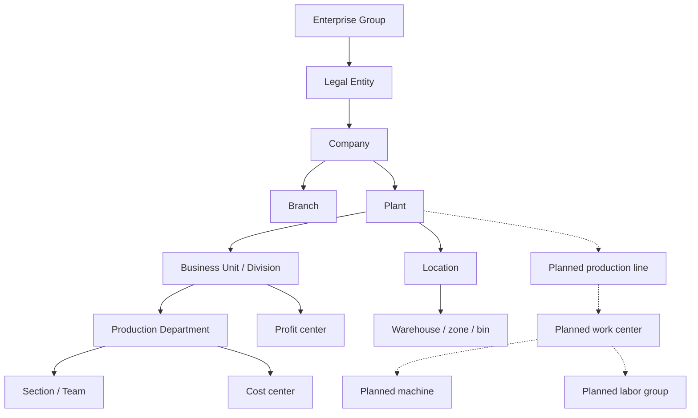

Implemented enterprise hierarchy and access scope govern plant visibility and responsibility. Planned production line, work center, machine and labor group are typed operational resources linked to plant/location, cost center and organization node where useful. A warehouse holds material; it is not a work center. Cost center accumulates responsibility/cost; profit center supports business performance; neither substitutes for physical resource identity. Cross-company/intercompany production uses explicit demand, transfer and Finance contracts.

# Chapter 9 — Item Manufacturing Classification

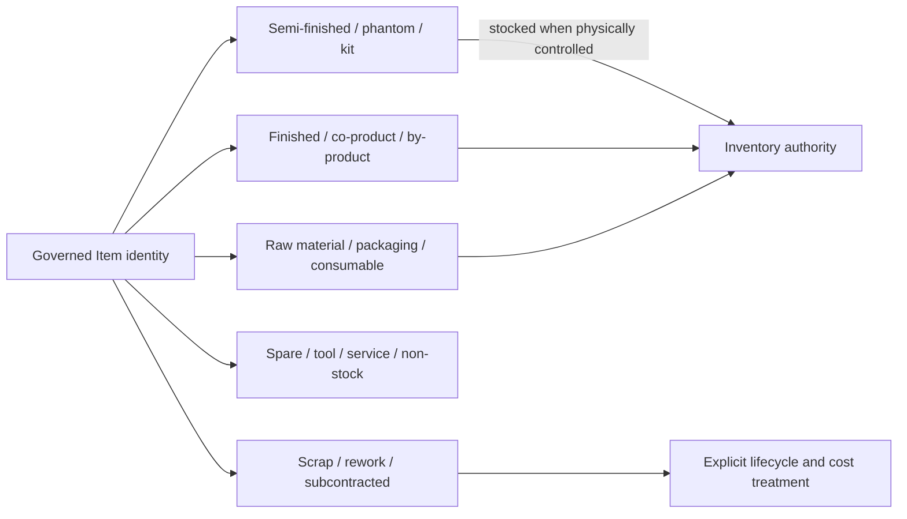

Raw material is purchased/consumed input; semi-finished is a planned intermediate with its own supply, inventory, genealogy and cost when stocked; finished good is saleable output; packaging is product/transport material; consumable is expensed/consumed without product identity where policy allows; spare supports Maintenance; tool is capacity/qualification-controlled and may be non-consumable; service is non-stock work; co-product has intentional joint value; by-product is secondary output; scrap is governed loss/material disposition; rework item represents recoverable output where separate identity is needed; phantom explodes through without stocked order; non-stock does not create on-hand; subcontracted item/operation invokes Procurement/partner flow.

Classification is approved, effective, plant-applicable and consistent with stock/purchase/sales/manufacture/tracking/quality/costing flags. Changes assess open structures/orders, stock, cost, quality and reporting. Current free-form `itemType`/category fields are foundations; detailed lifecycle validation is Planned.

# Chapter 10 — Product Structure Architecture

The target product-structure family comprises discrete BOM, process formula/recipe, pack specification, kit, phantom BOM, alternate BOM, site-specific BOM, customer-specific BOM, Engineering BOM, Manufacturing BOM and Service BOM. A structure has immutable identity, item/product revision, version, type, tenant/company, plant/site/customer applicability, base/batch quantity and UOM, status, approval, effective interval, alternates, yield/scrap/rounding policy, owner, source change, and audit.

Engineering BOM expresses design intent; Manufacturing BOM expresses approved build/consume intent and records derivation. Formula/recipe governs proportions/process parameters and scaling; pack specification governs packaging levels/components; Service BOM supports asset service parts; kit groups fulfillment/assembly components. Alternate/site/customer structures never overwrite the global version and require deterministic selection rules. Only one unambiguous approved effective structure may resolve for a given order context, or release fails closed.

# Chapter 11 — BOM and Formula Governance

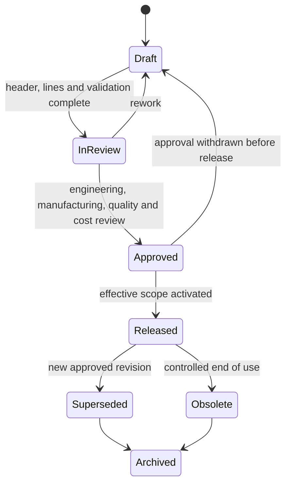

Header owns output item/revision, structure type, plant/customer applicability, base/batch size, output UOM, yield and dates. Lines own component, quantity/UOM, scrap factor, issue method, operation link, effective dates, substitute group, alternate priority, co-/by-product role, rounding and traceability. Formula scaling preserves ratios while applying density/potency/rounding rules approved by domain design; it cannot hide material imbalance.

Validation detects cycles, duplicate/overlapping applicability, invalid UOM conversion, quantity/sign, expired/blocked components, impossible date ranges, phantom/co-product rules and missing approvals. Released versions are immutable. Order release resolves and stores exact header/line revisions and quantities; later master change does not rewrite history.

# Chapter 12 — Engineering Change and Revision Control


ECR records problem/opportunity, affected objects, requester and evidence. ECO authorizes exact changes, owner, implementation basis, effective point and approvals. Revision is business identity; version is a controlled representation of that revision. Supersession/obsolescence retains history and prevents new use without erasing existing orders/genealogy.

Impact covers open planned/released orders, component/finished stock, substitutions, supplier/purchase demand, customer commitments/configuration, routing/capacity, quality plans/specifications, cost estimates/standard cost, labels/documents, integrations and training. Existing orders are grandfathered, reworked or cancelled only by explicit disposition. Audit links request, order, revisions, approvals and affected records.

# Chapter 13 — Routing and Operation Architecture

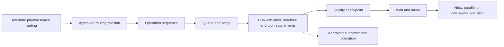

A routing is item/revision, plant, production model, quantity range, version/status/effective interval and approved operation graph. An operation has immutable identity, sequence, predecessors, parallel/overlap rule, queue/setup/run/wait/move time basis, fixed/variable components, labor skill/crew, machine/work-center capability, tool, quality checkpoint, subcontract details, expected yield/standard loss, reporting method, cost driver and alternate resource/routing.

Times and quantities carry units and scaling basis. Parallel/overlap cannot violate material/quality precedence. Plant-specific routings reference available calendars/resources. Release stores exact routing/operation revision. No routing, operation, work-center or subcontract execution model currently exists.

# Chapter 14 — Work Centers, Machines, Tools, and Production Lines

A work center is a planning and costing resource group within a plant; a machine is a maintainable physical asset; a production line is an ordered or networked set of resources; a tool is a controlled reusable production resource. These identities must not be collapsed. Each target record carries tenant/company/plant scope, code, lifecycle state, capabilities, calendar assignment, capacity units, efficiency basis, cost-center relationship and effective dates. Machines additionally carry maintenance authority references; tools carry availability, inspection and calibration state.

Resource groups support finite or infinite planning, pooled or individual capacity, alternate qualification and simultaneous labor/machine requirements. A routing operation requests capabilities and quantities; approved assignment resolves them to eligible resources. Maintenance owns machine availability, Quality owns calibration/quality release, and Planning consumes those states without overwriting them. No target resource can be scheduled merely because its master record exists.

# Chapter 15 — Calendars, Shifts, Labor, and Skills

Plant calendars define working/non-working dates and timezone. Shift patterns define intervals, breaks, crews and effective dates. Resource calendars overlay planned maintenance, approved downtime and exceptions. Labor requirements use skill/qualification rather than named people until dispatch; personally identifiable workforce data remains outside manufacturing planning unless explicitly governed.

Capacity is calculated from calendar time, resource count, demonstrated efficiency and approved availability. Overtime, extra shifts, temporary labor and subcontracting are scenarios until independently approved. Qualification expiry or a safety restriction makes a worker/resource ineligible; planning cannot waive it. Labor actuals are production evidence, while payroll and human-resource records remain outside this volume.

# Chapter 16 — Manufacturing Demand Architecture

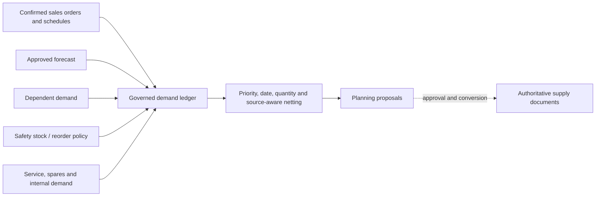

Every demand line retains source type/id/line, item/revision/configuration, plant/location, quantity/UOM, need date, priority class, customer/project where allowed, firming state and cancellation/fulfilment trail. Forecast and sales-order consumption must be time-bucketed and traceable; the same need must never be counted twice. Long-term customer delivery schedules and partial deliveries are first-class, versioned commitments rather than free-text notes.

Planning proposals are recommendations, not reservations, movements, orders, quality releases or journal entries. Conversion requires current-source validation, authorization and an idempotency key. Current FlowCraft has sales/purchase/stock flags and policy attributes but no governed demand ledger or planning runtime.

# Chapter 17 — Sales-to-Manufacturing Integration

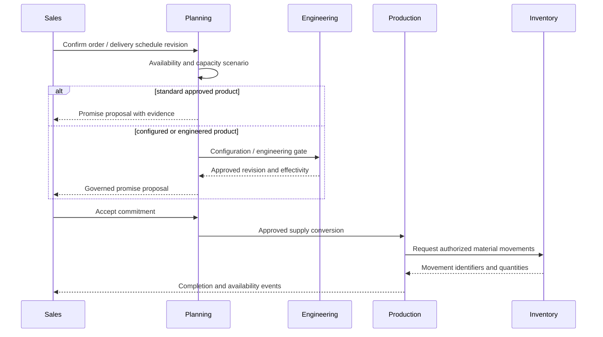

Sales owns the customer commitment; Planning owns feasibility analysis and supply proposals; Engineering owns configuration/revision approval; Production owns execution evidence; Inventory owns stock authority. Available-to-promise and capable-to-promise results expose assumptions, horizon, exclusions, confidence and timestamp. They do not silently edit sales dates.

Make-to-order and engineer-to-order preserve sales-line/project/configuration pegging through order, genealogy and cost. Make-to-stock aggregates approved demand subject to policy. Delivery schedule revisions recalculate impact without deleting prior commitments. Partial production and partial delivery update remaining quantities independently.

# Chapter 18 — Forecast Architecture

Forecasts are versioned by scenario, item/family, plant/market, bucket, UOM, quantity and confidence. Workflow states are Draft, Submitted, Approved, Superseded and Closed; only approved versions feed the plan. Sources may include commercial consensus, history, promotions and approved statistical output, but source lineage and manual overrides remain visible.

Forecast consumption rules define backward/forward windows, customer/channel segmentation, order class and bucket behavior. Bias, absolute error and value-add metrics are reported by horizon; they never become automatic authority to alter demand. ML forecasts are advisory, explainable and reproducible from a governed snapshot. FlowCraft currently has no forecast model or service.

# Chapter 19 — Master Production Schedule

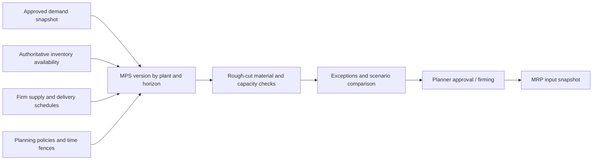

The MPS governs selected finished and critical semi-finished items by plant, bucket and horizon. A version records demand/supply/inventory snapshots, planning parameters, time fences, frozen/firm/planned quantities, author, approvals and supersession. Inside the frozen fence, change requires explicit exception approval and impact evidence. Outside it, proposals may be regenerated without altering firm authoritative supply.

Scenario comparison includes service, inventory, material, capacity, cost and risk impacts. The accepted schedule is auditable; unpublished simulations remain isolated. MPS approval does not create inventory or financial postings.

# Chapter 20 — Material Requirements Planning

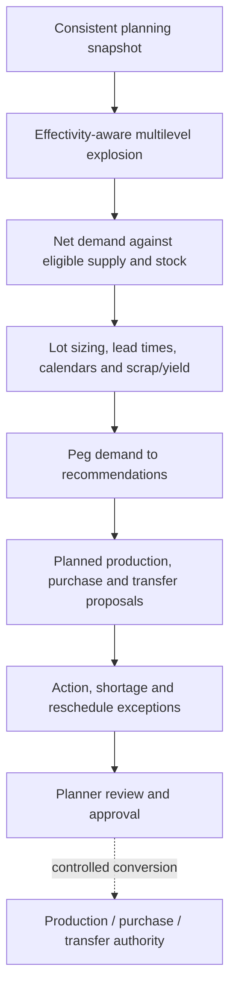

MRP explodes the exact approved BOM/formula revision applicable to the need date, preserving units, alternates, co-/by-products and plant effectivity. Netting reads authoritative on-hand status, reservations, quality disposition, firm orders, expected receipts and allocations. Batch/serial shelf life, non-nettable stock, quarantine and location eligibility matter; a numeric balance alone is insufficient.

Runs are reproducible by snapshot id, parameter set, algorithm version, start/end time and operator. Outputs retain pegging from recommendation to every demand and BOM path. Low-level codes or equivalent graph ordering detect cycles. Regeneration and net-change behavior must converge to the same governed answer for the same inputs. Planning proposals never post stock or ledger entries.

# Chapter 21 — Material Planning Policies

Policies include lot-for-lot, fixed quantity, order multiples, minimum/maximum, reorder point, economic order quantity, Kanban, JIT and manual review. Existing item replenishment values are useful foundation attributes, but target policy needs plant/location scope, effective dates, horizon, safety stock/time, lead-time components, service target, yield/scrap allowance, fence and exception tolerances.

Substitution and alternates require eligibility, priority, quantity/UOM conversion, effectivity, customer/regulatory constraints and approval. Phantom assemblies explode without a production order only when explicitly modeled. Kanban cards/loops require unique identity, container quantity, source/sink, maximum cards and lost-card controls. Policy changes are simulated before approval and do not retroactively rewrite firm orders.

# Chapter 22 — Capacity Planning

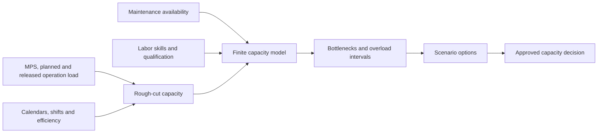

Capacity demand distinguishes setup, run, labor, machine, tool and subcontract load with units and overlap rules. Supply is time-phased by resource/calendar/shift and excludes approved maintenance, quality blocks and restrictions. Rough-cut planning tests the MPS at resource-family level; detailed planning uses operation-level eligibility and finite constraints.

Options—sequence changes, alternate resources, overtime, added shifts, lot split, subcontract or promise change—remain proposals with cost/service/risk impacts. Maintenance alone authorizes equipment availability; Quality governs qualification/calibration constraints; Production confirms actual performance. Capacity utilization above 100% may be shown as overload, never normalized away.

# Chapter 23 — Detailed Scheduling and Dispatch

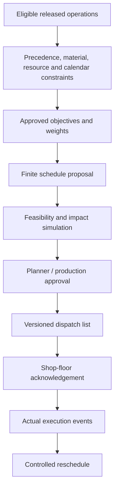

Scheduling operates on released or explicitly eligible firm operations. Hard constraints include precedence, approved routing, material/quality availability, machine/tool/labor eligibility, calendars, maintenance downtime and frozen commitments. Soft objectives—lateness, setup, WIP, utilization, energy or cost—are explicit, weighted and reported. No opaque optimizer may silently override a hard constraint.

A published schedule is versioned; dispatch lists reference it and record acknowledgement. Start/end actuals do not rewrite planned history. Manual sequencing requires reason and impact capture. Algorithmic suggestions expose infeasibilities and assumptions; Production approves dispatch within its authority.

# Chapter 24 — Urgent Demand and Reprioritization

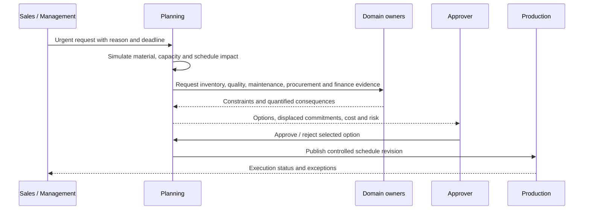

Urgency is not authorization. The request identifies sponsor, customer/business consequence, required date, priority class and expiry. Impact analysis names displaced orders, shortages, overtime/subcontract implications, quality or maintenance constraints, promise changes and cost exposure. The authorized approver is determined by thresholds and affected domains.

Every reprioritization retains before/after schedule versions, approvals, notifications and outcome. Safety, quality, legal and maintenance restrictions cannot be waived by commercial urgency. Emergency manual execution is reconciled to authoritative records through a controlled exception, never hidden.

# Chapter 25 — Material Shortage Management


A shortage case records item/revision, plant, need date, missing eligible quantity, affected orders/customers, source evidence, severity, owner and status. Physical quantity cannot be presumed available when quarantined, expired, allocated, wrong revision/location or awaiting inspection. Pegging makes consequence visible across multiple levels.

Resolution occurs through authoritative domains: Procurement expedites or sources; Inventory transfers/allocates; Quality dispositions held material; Engineering approves substitutions/redesign; Planning reschedules; Sales governs customer commitments. Root-cause classification and recurrence metrics support prevention. Closing a case requires verified recovery or accepted residual risk, not merely dismissal of the alert.

# Chapter 26 — Production Order Architecture

A production order is the governed authorization to manufacture a defined item/revision/configuration, quantity/UOM, plant, dates and costing object using frozen product-structure and routing snapshots. It carries source demand/pegging, order type, priority, lot-splitting relationship, responsible organization, status, reservation policy and exception flags. Semi-finished goods use the same first-class order model; they are not hidden lines inside a finished-good order.

The order snapshot preserves approved BOM/formula, components and alternates, co-/by-products, routing/operations, resources/capabilities, quality plan, yield/scrap standards and costing basis. Later master-data changes do not silently mutate released work. Re-baselining requires impact analysis, authorization and a new snapshot revision. Number-series allocation, workflow and audit reuse implemented foundations, but a registered `PRODUCTION_ORDER`/`WORK_ORDER` enterprise object is not an implementation.

# Chapter 27 — Production Order Lifecycle and Controls

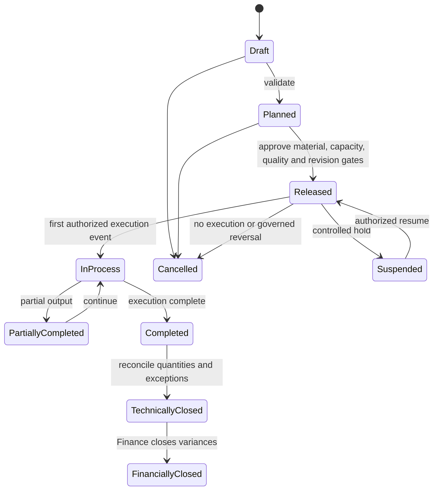

Transition guards check authorization, current item/BOM/routing approvals, plant scope, material status, resource availability, required quality plan, dates and unresolved holds. Release creates reservations/requests through Inventory rather than editing on-hand. Suspension prevents new execution while preserving evidence. Cancellation after movement or production requires domain-owned reversal/correction documents.

Technical close confirms no expected production execution remains and records accepted exceptions. Financial close belongs to Finance after WIP and variance reconciliation. Reopening is exceptional, reasoned and independently approved. All commands carry optimistic concurrency and idempotency keys.

# Chapter 28 — Material Issue, Consumption, and Backflush

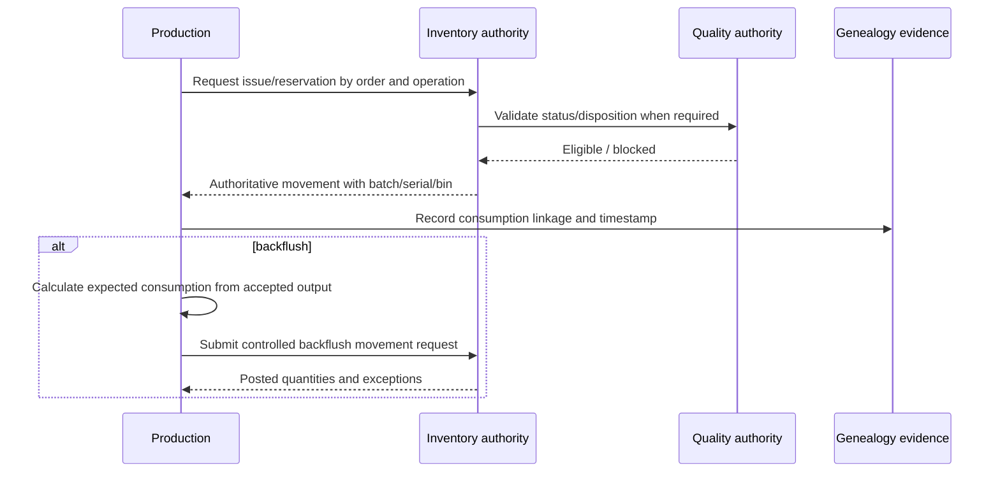

Issue, return, transfer-to-WIP and consumption are Inventory-owned movements referenced by production order/operation. Production supplies purpose and actual-use evidence but never adjusts stock balances directly. Quantity, UOM, source warehouse/bin, stock status, batch/serial, effectivity, reservation and reason are preserved. Negative stock and quality-held use follow explicit policy and approval; defaults cannot conceal violations.

Backflush is an approved item/operation policy, not a shortcut around traceability. It calculates from accepted completion quantity, exact structure snapshot, yield/scrap and previously posted actuals; variances become exceptions. Batch/serial selection remains authoritative and idempotent. Current FlowCraft has batch/serial masters but no stock ledger, reservation, issue or consumption runtime.

# Chapter 29 — Production Confirmation and Completion


Confirmations can be operation-level, quantity-level or milestone-based and record good, scrap, rework and pending-inspection quantities separately. Partial completion is first-class; remaining and completed quantities never collapse. Output receipt captures warehouse/bin/status and batch/serial through Inventory authority. Quality status may keep output unavailable even after physical receipt.

Co-products carry planned allocation basis and independent quantities; by-products carry recovery/disposal treatment. Corrections reference the original event and use reversal/replacement, preserving immutable history. Duplicate offline messages are rejected by idempotency key. Production completion is not a financial journal and cannot financially close an order.

# Chapter 30 — WIP, Scrap, Rework, Yield, and Variance

WIP is a derived and reconciled state from issued materials, accepted operations, received outputs and Finance-owned valuation—not a freely editable balance. Physical WIP location/status remains Inventory authority; production stage/order/operation remains Production evidence; monetary WIP remains Finance authority. Reconciliation exposes differences instead of forcing the domains to agree by mutation.

Scrap events record item/material/output, quantity/UOM, order/operation, batch/serial where relevant, reason taxonomy, cause, disposition, recoverable value and approvals. Rework may create a controlled route/order linked to the original genealogy and quality nonconformance. Yield is reported against the exact standard and denominator, separating startup, process, material and quality loss. Variances include material quantity/price, labor, machine, overhead, yield, mix, substitution and routing; Finance owns recognized accounting values.

# Chapter 31 — Manufacturing Quality Architecture

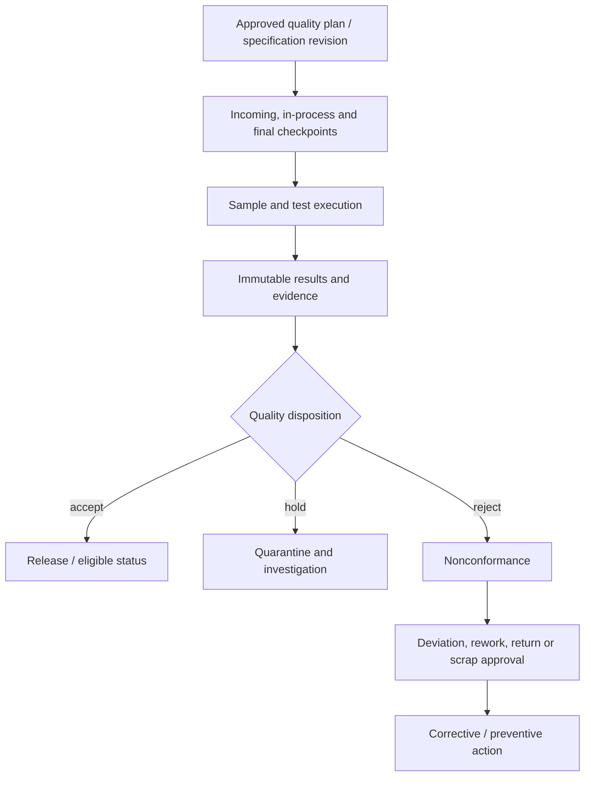

Quality owns specifications, sampling plans, inspection execution, results, nonconformance, deviation and hold/release decisions. Production can request inspection and report evidence but cannot release material. Inventory enforces Quality disposition on movement/availability. Plans are item/revision/supplier/process/plant scoped and effective-dated; order release snapshots the applicable revision.

Results preserve method, characteristic, limits, unit, instrument/calibration reference, sample identity, analyst and timestamp. Electronic signatures and segregation apply by risk. Current models include item quality flags, batch quality status and stock-status approval flags, but no inspection, specification, NCR or CAPA runtime.

# Chapter 32 — Maintenance and Production Availability

```mermaid
sequenceDiagram
  participant M as Maintenance
  participant P as Planning
  participant X as Production
  participant Q as Quality
  M->>M: Plan preventive / corrective work and downtime
  M-->>P: Authoritative resource availability window
  P->>P: Recalculate capacity and schedule impact
  P-->>X: Feasible schedule proposal
  X->>M: Breakdown / condition evidence
  M->>Q: Calibration or quality-impact notification
  Q-->>X: Product/process disposition if required
  M-->>P: Approved return-to-service state
```

Maintenance owns asset hierarchy, preventive plans, work requests/orders, downtime, condition and return-to-service. Production reports breakdown/context and obeys restrictions; Planning consumes availability. Quality owns calibration disposition and product-impact review where equipment failure may affect conformity. A resource is schedulable only when capability, maintenance and quality states all permit it.

Meters, failure codes, parts demand, technician skills, permits and work evidence remain linked to the maintainable asset. Maintenance material movements use Inventory authority and maintenance costs use Finance authority. Registered maintenance enterprise-object codes do not imply runtime implementation.

# Chapter 33 — Inventory and Warehouse Integration

Manufacturing requests reservations, issues, returns, WIP transfers, output receipts, co-/by-product receipts and scrap movements; Inventory validates and posts them. Warehouses, zones, bins, stock statuses, batch and serial masters already provide useful scope and identity, but no stock ledger/on-hand authority is implemented. Target movements are immutable, balanced, company/plant/location aware, idempotent and traceable to the production event.

Staging, line-side supply, supermarkets, Kanban replenishment and WIP locations are modeled explicitly. Availability respects owner, location, status, quality, batch/serial, expiry, revision/configuration and reservations. Cycle counting and warehouse corrections never rewrite production evidence; reconciliation links the correction. Manufacturing must not infer on-hand from transaction-document JSON payloads.

# Chapter 34 — Inventory, Production, Quality, and Finance Boundaries

```mermaid
flowchart LR
  PROD["Production\nexecution facts"] -->|movement requests| INV["Inventory\nquantity and location authority"]
  QUAL["Quality\nhold and release authority"] -->|eligibility/disposition| INV
  MAINT["Maintenance\nasset availability authority"] -->|resource state| PROD
  INV -->|valued movement facts| FIN["Finance\nGL, WIP and journal authority"]
  PROD -->|labor, machine, yield and order facts| FIN
  FIN -->|recognized costs and variances| REP["Governed reporting"]
  INV --> REP
  PROD --> REP
  QUAL --> REP
```

| Domain | Owns | Does not own |
|---|---|---|
| Production | orders, operations, confirmations, execution evidence | on-hand balances, quality release, asset availability, GL journals |
| Inventory | reservations, movements, locations, quantity balances | production status, quality disposition, manufacturing cost recognition |
| Quality | inspection, hold/release, deviation and nonconformance | stock movement, production sequencing, journal posting |
| Maintenance | asset/work availability and maintenance execution | production confirmation, material balance, quality release |
| Finance | valuation policy, WIP accounting, journals and recognized variance | physical movement, shop-floor quantity, quality decision |
| Planning | demand/supply/capacity scenarios and proposals | authoritative orders, movements, releases or postings |

Cross-domain commands are explicit, authorized and idempotent; events carry source identity, schema/version and correlation. A consuming failure is retried/reconciled without double posting. The generic `TransactionDocument` scaffold is not accepted as the long-term authority for any boundary above.

# Chapter 35 — Product Costing and Manufacturing Accounting

```mermaid
flowchart BT
  MAT["Material quantities × governed valuation"] --> COST["Cost estimate / roll-up version"]
  LAB["Labor time × approved rate"] --> COST
  MACH["Machine time × approved rate"] --> COST
  SUB["Subcontract services"] --> COST
  OVR["Overhead bases and rates"] --> COST
  COP["Co-/by-product allocation or credit"] --> COST
  COST --> SIM["Simulation and comparison"]
  SIM --> APP["Finance approval"]
  APP --> STD["Effective standard / governed estimate"]
  ACT["Actual execution and inventory facts"] --> VAR["WIP and variance calculation"]
  STD --> VAR
  VAR --> GL["Finance-owned journals"]
```

Cost estimates are versioned by item/revision, plant, lot size, currency, valuation date, structure/routing snapshots and purpose. Roll-up preserves material, subcontract, labor, machine and overhead elements; semi-finished cost is visible, not flattened beyond auditability. Co-/by-product allocation basis is explicit. Circular structures and missing rates block approval or produce clearly incomplete simulations.

Finance owns rates, valuation policy, standard activation, WIP recognition, variance settlement and journals. Manufacturing supplies quantities/times and Planning may simulate cost, but neither posts the ledger. Existing item `standardCost`, cost-center master and generic amount/currency transaction fields are foundations only; no product-costing or GL integration runtime exists.

# Chapter 36 — Batch, Serial, and Material Genealogy

```mermaid
flowchart LR
  SUP["Supplier batch / received serial"] --> COMP["Component inventory identity"]
  COMP --> ISSUE["Production issue / consumption event"]
  ISSUE --> OP["Order and operation execution"]
  OP --> OUT["Output batch / serial"]
  OUT --> CO["Co-product / by-product identities"]
  OUT --> SHIP["Customer shipment linkage"]
  TEST["Inspection and test evidence"] --> OP
  MACH["Machine, tool, operator and parameter evidence"] --> OP
  REV["Item, BOM, formula and routing revisions"] --> OP
  OUT --> RECALL["Forward / backward trace and recall scope"]
```

Genealogy is an immutable many-to-many graph: consumed batches/serials and quantities link through order/operation events to produced batches/serials, co-/by-products, rework and scrap. It also references approved product/routing revisions, resources, quality evidence and timestamps. Splits, merges, substitutions, returns and corrections preserve lineage rather than replacing it.

Backward trace identifies all inputs and process evidence for an output; forward trace finds all outputs, stock and customer deliveries affected by an input. Access is company-scoped and export is audited. Existing batch and serial identity are foundations; genealogy, stock movements and customer-shipment linkage are not implemented.

# Chapter 37 — Shop-Floor, MES, Edge, IoT, Analytics, and Reporting

```mermaid
flowchart LR
  ERP["FlowCraft governed manufacturing authority"] <-->|versioned commands and events| MES["MES / shop-floor execution"]
  MES <-->|store-and-forward messages| EDGE["Plant edge gateway"]
  EDGE <-->|approved adapters| PLC["PLC / machine / sensor"]
  MES --> EVID["Execution evidence store"]
  EDGE --> EVID
  EVID --> KPI["OEE, yield, WIP, schedule and quality reporting"]
  EVID --> AI["Advisory analytics / anomaly proposals"]
  AI -. "human review; no safety authority" .-> ERP
```

Integration contracts define source authority, version, correlation/idempotency, ordering, timestamps/timezone, UOM, quality flags, acknowledgement, retry, dead-letter handling and reconciliation. Edge operation supports bounded offline buffering, signed configuration, device identity and replay protection. PLC/sensor connections are adapters behind a governed gateway; the ERP never becomes a real-time safety controller. Safety interlocks, emergency stops and certified machine control remain in appropriate industrial control systems.

Shop-floor terminals expose only authorized work, material, instruction, quality and reporting functions with offline conflict handling. OEE definitions make planned production time, availability, performance and quality denominators explicit. Dashboards are read models, not authorities. AI may forecast, detect anomaly or suggest schedule/maintenance actions with lineage, confidence and drift monitoring; it cannot release quality, move inventory, operate machinery, post finance, or bypass approvals. No MES, edge, PLC, IoT, OEE or AI manufacturing runtime currently exists, and this blueprint makes no technology/vendor selection.

# Chapter 38 — Decisions, Approval, and Roadmap

## Manufacturing architecture decision register

The status vocabulary is restricted to **Implemented**, **Approved**, **Proposed**, **Open**, and **Deferred**. “Approved” means architecture direction accepted for this blueprint, not software delivered. “Implemented” is used only where repository evidence supports the statement.

| ID | Decision | Status | Rationale / consequence |
|---|---|---|---|
| MFG-ADR-001 | Planning proposals are not execution authority. | Approved | Conversion must validate authorization and create an owning-domain document. |
| MFG-ADR-002 | Inventory owns stock movements and on-hand truth. | Approved | Production requests movement; it never writes balances. |
| MFG-ADR-003 | Finance owns journals and the general ledger. | Approved | Manufacturing facts are inputs, not journal authority. |
| MFG-ADR-004 | Quality owns release and hold decisions. | Approved | Production and Planning consume disposition without overriding it. |
| MFG-ADR-005 | Maintenance owns machine availability. | Approved | Scheduling consumes approved availability windows. |
| MFG-ADR-006 | Production orders reference approved, effective BOM/formula and routing revisions. | Proposed | Release snapshots exact approved definitions. |
| MFG-ADR-007 | Posted production effects are immutable. | Proposed | Audit and genealogy require append-only effects. |
| MFG-ADR-008 | Corrections use linked reversal/correction effects. | Proposed | Original evidence remains resolvable. |
| MFG-ADR-009 | Historical BOM and routing versions remain resolvable. | Proposed | Orders, costing, genealogy and audit depend on old definitions. |
| MFG-ADR-010 | Make-to-order demand is pegged to supply. | Proposed | Customer/project/configuration identity remains traceable. |
| MFG-ADR-011 | Urgent reprioritization requires impact analysis and approval. | Approved | Urgency cannot bypass domain constraints or hide displacement. |
| MFG-ADR-012 | Partial delivery schedules are first-class. | Approved | Remaining quantities and commitment revisions must be explicit. |
| MFG-ADR-013 | Semi-finished goods are fully planned, stocked and traceable. | Approved | They use first-class items, orders, stock and genealogy. |
| MFG-ADR-014 | Co-products and by-products are modeled explicitly. | Proposed | Quantity, genealogy and cost treatment cannot be inferred from notes. |
| MFG-ADR-015 | Scrap and rework are separate governed effects. | Proposed | Their approvals, genealogy, disposition and costing differ. |
| MFG-ADR-016 | Production safety remains outside ERP authority. | Approved | Certified control systems and operating procedures retain safety control. |
| MFG-ADR-017 | MES and PLC integrations never write ERP tables directly. | Approved | Versioned APIs/events preserve controls and reconciliation. |
| MFG-ADR-018 | Cost estimates and released standard costs are versioned. | Proposed | Finance approval and historical resolution are mandatory. |
| MFG-ADR-019 | AI cannot autonomously approve, release, post or reschedule high-impact production. | Approved | AI remains advisory with human/domain authorization. |
| MFG-ADR-020 | APS technology remains unselected. | Deferred | Constraint model, scale and integration contracts must precede selection. |
| MFG-ADR-021 | Manufacturing implementation begins only after dependent Finance and Inventory boundaries are approved. | Approved | Quantity, valuation, posting and reversal contracts are prerequisites. |

## Open decisions

| ID | Decision needed | Status | Required evidence / approvers |
|---|---|---|---|
| MFG-OPEN-001 | Choose the first manufacturing operating model and pilot plant. | Open | Product/process profile, volume, regulatory constraints; Management, Production, Engineering. |
| MFG-OPEN-002 | Define planning horizons, time fences and firming thresholds. | Open | Demand volatility, lead times and service policy; Planning, Sales, Production. |
| MFG-OPEN-003 | Define reservation, negative-stock and quality-held-use policy. | Open | Inventory architecture and control assessment; Inventory, Quality, Finance. |
| MFG-OPEN-004 | Select standard-cost versus actual-cost scope and close cadence. | Open | Finance architecture and reporting requirements; Finance, Production. |
| MFG-OPEN-005 | Decide backflush eligibility by item/operation/tracking class. | Open | Traceability, control and shop-floor evidence; Production, Inventory, Quality, Finance. |
| MFG-OPEN-006 | Define genealogy retention and recall-performance targets. | Open | Regulatory/customer obligations and volume model; Quality, IT/Operations, Management. |
| MFG-OPEN-007 | Define offline shop-floor recovery objective and conflict policy. | Open | Plant connectivity assessment and failure exercises; Production, IT/Operations. |
| MFG-OPEN-008 | Set build/buy evaluation criteria for APS, MES and edge capabilities. | Open | Approved functional/nonfunctional requirements and market assessment; IT/Operations, Planning, Production, Management. |

## Manufacturing capability matrix

“Registered only” means the Enterprise Object Registry contains a code but no domain runtime is present. Priorities are architectural delivery order, not a commitment date.

| Capability ID | Capability | Business owner | Current status | Target maturity | Key dependencies | Authoritative domain | Priority |
|---|---|---|---|---|---|---|---|
| MFG-CAP-001 | Item manufacturing strategy | Engineering | Implemented foundation | Governed plant-effective policy | Item, company, UOM, access | Master Data | P0 |
| MFG-CAP-002 | BOM | Engineering | Registered only | Versioned/effective and approved | Item revisions, UOM, workflow | Engineering | P0 |
| MFG-CAP-003 | Formula | Engineering | Not implemented | Scalable formula with yield and co-products | Item revisions, UOM, quality | Engineering | P0 |
| MFG-CAP-004 | Revision | Engineering | Not implemented | Resolvable item/product/process revision | Workflow, audit, effectivity | Engineering | P0 |
| MFG-CAP-005 | Routing | Engineering | Registered only | Versioned operation graph | Work centers, calendars, quality | Engineering | P0 |
| MFG-CAP-006 | Work center | Production | Registered only | Capability/capacity resource group | Plant, cost center, calendar | Production | P0 |
| MFG-CAP-007 | Machine | Maintenance | Not implemented | Maintainable, schedulable asset | Work center, maintenance, quality | Maintenance | P1 |
| MFG-CAP-008 | Calendar | Planning | Not implemented | Plant/resource effective calendar | Plant, timezone, shifts | Planning | P0 |
| MFG-CAP-009 | Labor | Production | Not implemented | Skill/crew capacity requirement | Skills, shifts, identity controls | Production | P1 |
| MFG-CAP-010 | Forecast | Sales | Not implemented | Versioned consensus forecast | Item hierarchy, customers, workflow | Sales | P1 |
| MFG-CAP-011 | MPS | Planning | Not implemented | Approved, time-fenced master schedule | Demand, inventory, capacity | Planning | P0 |
| MFG-CAP-012 | MRP | Planning | Not implemented | Reproducible pegged multilevel plan | BOM, demand, inventory, supply | Planning | P0 |
| MFG-CAP-013 | RCCP | Planning | Not implemented | MPS resource-family feasibility | MPS, routing, calendars | Planning | P1 |
| MFG-CAP-014 | CRP | Planning | Not implemented | Detailed operation capacity plan | Orders, routing, resources | Planning | P1 |
| MFG-CAP-015 | Scheduling | Planning | Not implemented | Versioned finite schedule/dispatch | CRP, material, maintenance, quality | Planning | P1 |
| MFG-CAP-016 | Production order | Production | Registered only | Snapshot-based governed execution order | BOM, routing, demand, number series | Production | P0 |
| MFG-CAP-017 | Material reservation | Inventory | Not implemented | Status/location-aware reservation | Stock ledger, demand, batches/serials | Inventory | P0 |
| MFG-CAP-018 | Material issue | Inventory | Registered only | Immutable production-linked movement | Stock ledger, reservation, order | Inventory | P0 |
| MFG-CAP-019 | Backflush | Production | Not implemented | Controlled calculated consumption | Completion, BOM snapshot, inventory | Inventory | P1 |
| MFG-CAP-020 | Completion | Production | Registered only | Partial/idempotent output confirmation | Order, quality, inventory | Production | P0 |
| MFG-CAP-021 | WIP | Finance | Not implemented | Quantity/value reconciliation | Inventory movements, production, GL | Finance | P0 |
| MFG-CAP-022 | Scrap | Production | Not implemented | Reasoned, approved, traceable effect | Quality, inventory, costing | Production | P0 |
| MFG-CAP-023 | Rework | Quality | Not implemented | Governed route/order with genealogy | NCR, routing, production order | Quality | P1 |
| MFG-CAP-024 | Yield | Production | Not implemented | Standard-versus-actual yield analysis | Formula/BOM, completions, scrap | Production | P1 |
| MFG-CAP-025 | Batch traceability | Quality | Batch identity implemented | End-to-end consumption/output graph | Stock ledger, genealogy, orders | Quality | P0 |
| MFG-CAP-026 | Serial traceability | Quality | Serial identity implemented | End-to-end unit genealogy | Stock ledger, genealogy, orders | Quality | P0 |
| MFG-CAP-027 | Co-product | Production | Not implemented | Explicit planned and actual output | Formula/BOM, inventory, costing | Production | P1 |
| MFG-CAP-028 | By-product | Production | Not implemented | Explicit recovery/disposal output | Formula/BOM, inventory, costing | Production | P1 |
| MFG-CAP-029 | Quality inspection | Quality | Registered only | Plan-driven results and disposition | Specifications, samples, workflow | Quality | P0 |
| MFG-CAP-030 | Quality hold | Quality | Foundation status flags only | Enforced disposition across stock/use | Inspection, stock status, inventory | Quality | P0 |
| MFG-CAP-031 | Maintenance availability | Maintenance | Registered only | Authoritative time-phased resource state | Asset/work order, calendars | Maintenance | P1 |
| MFG-CAP-032 | Standard cost | Finance | Item field only | Versioned Finance-approved standard | Cost roll-up, rates, currency | Finance | P0 |
| MFG-CAP-033 | Actual cost | Finance | Not implemented | Reconciled order actual cost | Movements, time, rates, GL | Finance | P1 |
| MFG-CAP-034 | Variance | Finance | Not implemented | Element-level recognized variance | Standard/actual cost, close | Finance | P1 |
| MFG-CAP-035 | Subcontracting | Procurement | Item flag only | Operation/external-supply lifecycle | Routing, purchase, logistics, quality | Procurement | P1 |
| MFG-CAP-036 | Kanban | Planning | Policy value only | Governed loops/cards and replenishment | Stock ledger, locations, policy | Inventory | P2 |
| MFG-CAP-037 | Long-term schedule | Sales | Not implemented | Versioned customer delivery schedule | Sales orders, demand, workflow | Sales | P0 |
| MFG-CAP-038 | Partial delivery | Sales | Not implemented | First-class commitment/remaining balance | Schedule, production, shipping | Sales | P0 |
| MFG-CAP-039 | Urgent reprioritization | Planning | Not implemented | Impacted, approved schedule change | Scheduling, workflow, notifications | Planning | P1 |
| MFG-CAP-040 | Material shortage | Planning | Not implemented | Pegged cross-domain case resolution | MRP, inventory, procurement | Planning | P0 |
| MFG-CAP-041 | OEE | Production | Not implemented | Governed denominator and loss analytics | Shop-floor events, downtime, quality | Production | P2 |
| MFG-CAP-042 | MES | Production | Not implemented | Contracted execution integration | Orders, events, identity, edge | Production | P2 |
| MFG-CAP-043 | Shop-floor terminal | Production | Not implemented | Authorized offline-capable execution UI | MES/API, identity, instructions | Production | P2 |
| MFG-CAP-044 | AI planning | Planning | Not implemented | Explainable advisory scenarios | Governed data, evaluation, approvals | Planning | P3 |

## Manufacturing risk register

Residual-risk direction describes the intended movement after mitigation; it is not a claim that control effectiveness has been tested.

| Risk ID | Manufacturing area | Risk | Current condition | Impact | Target mitigation | Owner | Residual-risk direction |
|---|---|---|---|---|---|---|---|
| MFG-RSK-001 | Product structure | Wrong BOM | No BOM runtime or approval control | Wrong material, cost or output | Version/effectivity workflow, release snapshot, comparison | Engineering | Down |
| MFG-RSK-002 | Process definition | Wrong routing | No routing runtime | Invalid sequence, capacity or cost | Approved routing revisions and eligibility gates | Engineering | Down |
| MFG-RSK-003 | Engineering | Stale revision | Item has effective dates but no revision model | Obsolete product/process execution | ECR/ECO, supersession and open-order disposition | Engineering | Down |
| MFG-RSK-004 | Units | Incorrect UOM conversion | Effective-dated validation exists; manufacturing use absent | Quantity, yield and cost error | Dimension-aware conversion, snapshot and test controls | Master Data | Down |
| MFG-RSK-005 | Material planning | Material shortage | No demand/MRP/reservation runtime | Missed production and customer delay | Pegged MRP, eligible-stock netting, shortage cases | Planning | Down |
| MFG-RSK-006 | Capacity | Capacity overload | No time-phased resource model | Impossible plans and lateness | RCCP/CRP, explicit overload and approved scenarios | Planning | Down |
| MFG-RSK-007 | Equipment | Machine breakdown | No asset availability runtime | Downtime, scrap and missed schedule | Maintenance authority, condition and recovery integration | Maintenance | Down |
| MFG-RSK-008 | Quality | Quality hold | Status flags exist without inspection/disposition runtime | Ineligible material used or shipped | Quality-owned hold/release enforced by Inventory | Quality | Down |
| MFG-RSK-009 | Materials | Expired material | Batch expiry identity exists; no movement eligibility | Quality failure and waste | Shelf-life netting, issue gate and FEFO policy | Inventory | Down |
| MFG-RSK-010 | Traceability | Batch genealogy gap | Batch master exists; no consumption/output graph | Recall scope unknown | Immutable many-to-many genealogy and reconciliation | Quality | Down |
| MFG-RSK-011 | Traceability | Serial duplication | Company uniqueness exists; offline integration absent | Identity collision and false history | Central uniqueness, device idempotency and conflict handling | Inventory | Down |
| MFG-RSK-012 | Consumption | Backflush error | Not implemented | Wrong component stock and WIP | Snapshot calculation, delta control and exception review | Production | Down |
| MFG-RSK-013 | Consumption | Over-consumption | No governed issue/consumption controls | Stock loss and adverse variance | Tolerance, reason, approval and reconciliation | Inventory | Down |
| MFG-RSK-014 | Consumption | Under-consumption | No governed issue/consumption controls | False stock/WIP and trace gap | Completion gate, expected-vs-actual exception | Production | Down |
| MFG-RSK-015 | Loss | Scrap manipulation | No scrap event/approval runtime | Hidden loss and misstated cost | Reason taxonomy, evidence, thresholds and segregation | Production | Down |
| MFG-RSK-016 | Rework | Rework concealment | No rework/NCR linkage | Quality and cost history lost | Quality-approved rework route with genealogy | Quality | Down |
| MFG-RSK-017 | WIP | WIP mismatch | No stock ledger, production or GL runtime | Quantity/value disagreement | Three-domain reconciliation and controlled close | Finance | Down |
| MFG-RSK-018 | Costing | Cost variance misstatement | Standard-cost field only | Wrong margin, inventory or GL | Versioned standards, actual facts and Finance close | Finance | Down |
| MFG-RSK-019 | Scheduling | Production reprioritization abuse | No impact workflow | Hidden customer displacement or unsafe pressure | Expiring request, simulation, approval and audit | Management | Down |
| MFG-RSK-020 | Customer service | Customer delay | Long-term/partial schedules not implemented | Missed commitment and trust loss | First-class schedules, pegging and governed notice | Sales | Down |
| MFG-RSK-021 | Completion | Duplicate completion | No completion runtime/idempotency | Duplicate stock, genealogy and cost | Idempotency key, uniqueness and reconciliation | Production | Down |
| MFG-RSK-022 | Security | Cross-tenant production access | Company scoping foundation exists; runtime absent | Data exposure or unauthorized action | Mandatory scope predicates, access tests and audit | IT/Operations | Down |
| MFG-RSK-023 | Shop floor | Shop-floor offline data loss | No offline contract | Missing quantities and trace evidence | Durable store-and-forward, acknowledgements and replay | IT/Operations | Down |
| MFG-RSK-024 | Industrial integration | PLC/device compromise | No device integration architecture implemented | False data or unauthorized control path | Device identity, gateway isolation, signed config, monitoring | IT/Operations | Down |
| MFG-RSK-025 | Safety | Unsafe ERP command | No runtime; boundary could be designed incorrectly | Injury, equipment or product harm | ERP has no safety authority; certified controls enforce safety | Management | Down |
| MFG-RSK-026 | Costing | Incorrect co-product allocation | No co-product/costing runtime | Misstated product and inventory cost | Approved allocation method/version and Finance review | Finance | Down |
| MFG-RSK-027 | Forecast | Forecast bias | No forecast governance | Excess/short inventory and poor service | Versioning, consensus, bias metrics and overrides | Sales | Down |
| MFG-RSK-028 | Planning | MRP explosion performance | No implementation/volume benchmark | Late or incomplete plan | Graph validation, partitioning, observability and benchmark | IT/Operations | Down |
| MFG-RSK-029 | Scheduling | Long-running schedule job | No solver/technology selected | Stale schedule and blocked decisions | Time budget, cancel/checkpoint, fallback and job isolation | IT/Operations | Down |
| MFG-RSK-030 | Extensibility | Unsupported customer customization | Generic JSON scaffolds could be overused | Upgrade failure and control bypass | Governed extension points, compatibility and approval | IT/Operations | Down |

## Manufacturing responsibility matrix

R = Responsible, A = Accountable, C = Consulted, I = Informed. `A/R` combines accountability and execution where segregation is not required; operating procedures may add stricter segregation.

| Activity | Sales | Planning | Production | Inventory | Warehouse | Quality | Maintenance | Engineering | Finance | Procurement | IT/Operations | Management |
|---|---|---|---|---|---|---|---|---|---|---|---|---|
| Forecast | A/R | C | I | I | I | I | I | C | C | C | C | I |
| MPS | C | A/R | C | C | I | C | C | C | C | C | I | I |
| BOM approval | I | C | C | C | I | C | I | A/R | C | C | I | I |
| Routing approval | I | C | C | I | I | C | C | A/R | C | C | I | I |
| Production-order release | I | R | A | C | I | C | C | C | I | C | I | I |
| Material issue | I | I | R | A | R | C | I | I | I | I | I | I |
| Material substitution | C | C | C | R | I | C | I | A | C | C | I | I |
| Completion | I | I | A/R | C | C | C | I | I | I | I | I | I |
| Scrap approval | I | I | R | C | C | A | I | C | C | I | I | I |
| Rework approval | I | I | R | C | I | A | I | C | C | I | I | I |
| Quality release | I | I | C | C | I | A/R | I | C | I | I | I | I |
| Machine availability | I | C | C | I | I | C | A/R | C | I | I | I | I |
| Cost release | I | C | C | C | I | I | I | C | A/R | C | I | I |
| Urgent reprioritization | R | R | C | C | C | C | C | C | C | C | I | A |
| Shortage resolution | C | A | C | R | R | C | I | C | C | R | I | I |
| Customer delay communication | A/R | C | I | I | I | I | I | I | I | I | I | C |
| Production close | I | I | R | C | C | C | I | I | A | I | I | I |
| Variance review | I | C | R | C | I | C | I | C | A/R | C | I | I |

## Approval roles

| Approval scope | Required role(s) | Evidence required |
|---|---|---|
| Architecture acceptance | Management, Enterprise Architecture, Production, Planning | Chapter review, decisions, unresolved conditions |
| Product/process definition | Engineering; Quality where characteristics change | Approved revision, impact analysis, validation |
| Planning publication | Planning; Production for dispatch feasibility | Snapshot, exceptions, material/capacity impact |
| Inventory effects | Inventory/Warehouse per movement policy | Valid request, eligibility, batch/serial/location evidence |
| Quality disposition | Quality | Inspection/nonconformance evidence and signature |
| Resource availability | Maintenance; Quality for calibration impact | Work/condition record and return-to-service decision |
| Cost/financial effects | Finance | Approved rates/policy, reconciliation and posting evidence |
| Urgent reprioritization | Management or delegated threshold owner plus affected domain owners | Before/after impact and displaced commitments |
| Integration go-live | IT/Operations plus every authoritative domain affected | Contract, security, resilience, reconciliation and rollback tests |

## Approval conditions

Volume 7 is suitable for architecture review when reviewers confirm that current-state statements match the repository; target statements do not imply delivery; domain authority boundaries agree with Volumes 2, 4, 5 and 6; the 21 decisions and eight open decisions have named owners; and no vendor/technology or safety-control authority has been selected by implication.

Approval of this blueprint does **not** authorize manufacturing coding. Coding starts only after Inventory movement/on-hand and Finance valuation/posting/reversal contracts are approved, the first pilot operating model is selected, aggregate/root boundaries and cross-domain APIs/events are specified, nonfunctional targets are quantified, security/privacy/threat reviews are accepted, and an incremental delivery/test/migration plan exists.

## Required work before manufacturing coding

1. Approve Inventory reservation, movement, on-hand, status, batch/serial and reversal authority contracts.
2. Approve Finance standard/actual cost, WIP, variance, journal and financial-close contracts.
3. Select pilot plant, production model, product families, traceability class and regulatory/customer constraints.
4. Produce item-revision, BOM/formula, routing/operation, resource/calendar and production-order logical models with invariants.
5. Define demand/MPS/MRP snapshots, pegging, time fences, policy and proposal-conversion contracts.
6. Define Quality and Maintenance integration gates without duplicating their authority.
7. Define state machines, permissions, number series, idempotency, concurrency, audit, correction and retention controls.
8. Establish volume/performance/recovery objectives and representative datasets for deep structures, schedules and genealogy.
9. Threat-model tenant isolation, shop-floor identity, offline replay, integration and privileged approval paths.
10. Define migration/coexistence and reconciliation for any existing operational records; no generic transaction payload becomes the system of record.
11. Design acceptance tests for every invariant, boundary, failure/retry path and RACI approval.
12. Obtain architecture, domain-owner, security and operational-readiness approval before implementation backlog activation.

## Required work before FCSB-008

Before **FCSB-008 — Knowledge Graph and Governed AI Architecture**, approve canonical manufacturing identities and lineage semantics; define permitted analytical projections and freshness/quality indicators; classify sensitive production, workforce, customer and device data; specify AI advisory-only boundaries, evaluation, explanation, override, drift and rollback requirements; and identify which manufacturing facts may enter a knowledge graph without becoming a competing authority.

## Manufacturing delivery roadmap

| Stage | Outcome | Entry dependency | Exit evidence |
|---|---|---|---|
| 0 — Boundary approval | Inventory, Finance, Quality, Maintenance and Production contracts agreed | Volume 7 review | Signed decisions and API/event ownership |
| 1 — Engineering foundation | Revisions, BOM/formula, routing, resources and calendars governed | Stage 0 | Lifecycle, effectivity, audit and scale tests |
| 2 — Planning foundation | Demand, schedules, MPS/MRP, pegging, shortage and capacity scenarios | Stage 1 plus inventory read model | Reproducible run and proposal-authority tests |
| 3 — Production execution | Orders, issues, confirmations, partial completion, scrap/rework and WIP facts | Stages 1–2 plus movement contracts | Idempotency, correction, reconciliation and scope tests |
| 4 — Quality, maintenance and costing integration | Enforced dispositions/availability and Finance-owned cost/close | Stage 3 | Cross-domain failure, approval and close tests |
| 5 — Genealogy and shop floor | Recall-grade trace plus resilient terminal/MES/edge contracts | Stage 3 and nonfunctional approval | Trace completeness, offline replay, security and recovery tests |
| 6 — Advanced advisory planning | Evaluated optimization/AI scenarios without expanded authority | Stable governed facts and FCSB-008 | Benchmark, explanation, drift and human-approval evidence |

Each stage is independently releasable behind explicit feature/access controls. No stage is a calendar commitment, and later-stage technology selection remains outside this blueprint.

## Repository evidence reviewed

This architecture was grounded in the repository state on branch `docs/flowcraft-solution-blueprint`, including:

- Prisma schema and three migration directories covering foundation, enterprise structure and master data.
- Item/UOM/plant/location/warehouse/zone/bin/batch/serial/stock-status services, validation and accepted tests.
- Enterprise Object Registry seed entries for manufacturing, quality and maintenance object codes.
- Workflow definition/version, audit, number-series, organization-access and Digital DNA foundations.
- Generic transaction, report, layout and customization scaffolds and their current authority limitations.
- Web routes/pages for implemented master-data areas and package/workspace scripts.
- Git history and blueprint Volumes [1](./FCSB-Volume-1-Executive-and-Business-Architecture.md), [2](./FCSB-Volume-2-Application-and-Platform-Architecture.md), [3](./FCSB-Volume-3-Enterprise-Data-and-Information-Architecture.md), [4](./FCSB-Volume-4-Integration-Architecture.md), [5](./FCSB-Volume-5-Security-and-Trust-Architecture.md), and [6](./FCSB-Volume-6-Deployment-and-Operations-Architecture.md).

## Current-versus-target statement

**Currently implemented:** company/tenant-scoped enterprise and organization foundations; plants, locations, warehouses/zones/bins; items and manufacturing/replenishment/tracking attributes; effective-dated UOM conversions; batch and serial identities; stock-status policy attributes; workflow/audit/number-series foundations; Enterprise Object Registry metadata; and relevant master-data web/API/test coverage.

**Registered or scaffolded, not manufacturing runtime:** manufacturing/quality/maintenance enterprise object codes and generic transaction/report/layout/customization infrastructure. Registration, route naming or a JSON payload does not constitute a BOM, MRP, production, inventory-ledger, costing, quality, maintenance, MES or genealogy implementation.

**Target/planned:** every manufacturing capability described beyond those foundations, including revision-controlled engineering, planning, capacity, scheduling, execution, movement integration, WIP/cost, quality/maintenance integration, genealogy, shop-floor/MES/edge, OEE and governed AI assistance.

## Limitations and manual-review notes

- This is a logical solution architecture, not executable design, schema, API contract, migration plan, capacity benchmark, safety case or legal/regulatory assessment.
- Repository inspection establishes code evidence, not production operational effectiveness; runtime configuration and real production data were deliberately not inspected or reproduced.
- Capability maturity, priorities and residual-risk direction require domain-owner validation against the pilot plant and customer obligations.
- Mermaid diagrams are semantic architecture views and require visual review in the documentation renderer used for approval.
- APS, MES, PLC/edge, message transport, optimization and AI technology remain intentionally unselected.
- ERP commands and AI outputs have no machine-safety authority. Plant safety engineers must validate the final industrial-control boundary independently.

## Version history

| Version | Date | Status | Change |
|---|---|---|---|
| 0.7.0 | 2026-07-16 | Proposed | Initial FCSB-007 Manufacturing Solution Architecture review draft. |

## Final approval record

| Role | Name | Decision | Date | Conditions / notes |
|---|---|---|---|---|
| Executive sponsor / Management | _To be assigned_ | Open | — | Confirm scope, priority and pilot. |
| Enterprise Architecture | _To be assigned_ | Open | — | Confirm domain boundaries and series alignment. |
| Planning owner | _To be assigned_ | Open | — | Confirm planning policies and authority. |
| Production owner | _To be assigned_ | Open | — | Confirm operating models and execution controls. |
| Inventory/Warehouse owner | _To be assigned_ | Open | — | Confirm movement/on-hand boundary. |
| Quality owner | _To be assigned_ | Open | — | Confirm disposition and genealogy requirements. |
| Maintenance owner | _To be assigned_ | Open | — | Confirm asset-availability boundary. |
| Engineering owner | _To be assigned_ | Open | — | Confirm revision/product/process governance. |
| Finance owner | _To be assigned_ | Open | — | Confirm costing/WIP/GL boundary. |
| IT/Operations and Security | _To be assigned_ | Open | — | Confirm integration, isolation, resilience and safety boundary. |
