# FlowCraft Solution Blueprint

## Volume 8 — Knowledge Graph and Governed AI Architecture

| Document control | Value |
|---|---|
| Document code | FCSB-008 |
| Version | 1.0 Draft |
| Status | Architecture Review Draft |
| Approval status | Pending Architecture Board, Data Governance, Security, Privacy, AI Governance, Manufacturing, Finance, Inventory, and Operations Review |
| Last updated | 2026-07-16 |
| Related milestones | DBA-002 Platform Foundation; DBA-003 Enterprise Structure; DBA-004 Enterprise Master Data; governed semantic and AI architecture gate before FCSB-009 through FCSB-013 and any AI implementation |
| Dependencies | FCSB-001 through FCSB-007; current EOR, Digital DNA, audit, identity, permission, organization, workflow, report, transaction-link, master-governance, test, migration, dependency, and deployment evidence |
| Next planned volume | FCSB-009 — Universal Transaction Framework |

This volume is a conceptual target architecture. It does not establish a FlowCraft Knowledge Graph (FKG), graph/vector store, embedding, semantic search, retrieval-augmented generation (RAG), model, copilot, agent, tool-execution, evaluation, monitoring, or production AI runtime.

## Status vocabulary

| Status | Meaning in this volume |
|---|---|
| Implemented | Direct repository evidence exists through accepted release `v0.4-dba004-merged`. |
| Registered metadata only | EOR or configuration metadata names a capability without delivering its runtime. |
| Partial/scaffolded | A related platform shape exists, but governed semantic/AI behavior is incomplete. |
| Planned | Required target capability is not implemented. |
| Future | Longer-horizon capability dependent on approved foundations and evidence. |
| Conceptual target | Architecture direction requiring design, selection, implementation, and validation. |

# Chapter 1 — Purpose and Scope

FCSB-008 defines how FlowCraft Business OS may connect authoritative enterprise facts into governed semantic context and use that context for safe, evidence-linked AI assistance. Its audience is the Architecture Board; Data and AI Governance; Security; Privacy/Legal; Manufacturing, Finance, Inventory, Sales, Procurement, Quality and Maintenance owners; Engineering; Operations; Internal Audit; implementation partners; and customer governance teams.

Scope includes semantic identity, knowledge representation, ontology/taxonomy, provenance, temporal knowledge, ingestion, permission-aware search/retrieval, embeddings, RAG, prompts/policies, model abstraction, copilots, agents, controlled tools, human approval, memory, evaluation, monitoring, threat/privacy controls, domain use cases and continuity. Model/provider/product selection, legal conclusions, production training, operational ledger replacement, machine control, safety control and autonomous authority are out of scope.

[FCSB-001](./FCSB-Volume-1-Executive-and-Business-Architecture.md) establishes product intent; [FCSB-002](./FCSB-Volume-2-Application-and-Platform-Architecture.md) application boundaries; [FCSB-003](./FCSB-Volume-3-Enterprise-Data-and-Information-Architecture.md) data authority; [FCSB-004](./FCSB-Volume-4-Integration-Architecture.md) contracts; [FCSB-005](./FCSB-Volume-5-Security-and-Trust-Architecture.md) trust; [FCSB-006](./FCSB-Volume-6-Deployment-and-Operations-Architecture.md) operations; and [FCSB-007](./FCSB-Volume-7-Manufacturing-Solution-Architecture.md) manufacturing authority and AI limits. FCSB-009 through FCSB-013 will define transactions, documents, workflow runtime, Studio, and reporting/analytics semantics that FKG and AI may consume but never supersede. Later Finance, Inventory, Sales, Procurement, Manufacturing Execution, Quality, Maintenance, Mobile, Security and Governance volumes remain authoritative for their domains.

Governed architecture must precede AI coding because identity, source authority, scope, permission, purpose, evidence, approval, action risk, evaluation and disablement cannot be safely retrofitted after models or agents gain enterprise access.

# Chapter 2 — Executive Summary

The implemented baseline provides EOR objects, fields, relationships, owner modules and capability flags; Digital DNA for selected stable identities; tenant/company/branch/organization scope; normalized roles and permissions; audit records with trace IDs and redacted snapshots; versioned workflow definitions; report/layout/custom-field metadata; generic transaction links; governed master-data changes, duplicates, imports and exports; REST/UI foundations; PostgreSQL/Prisma; and 76 accepted API source tests.

`supportsAi` flags and references to FKG are metadata or roadmap signals only. The repository contains no graph/RDF/property-graph/vector database, embedding service, semantic search, RAG, model gateway/provider integration, prompt platform, copilot, agent, AI memory, AI tool execution, evaluation, monitoring, red-team, OCR, voice, digital twin, or automated knowledge-extraction runtime.

The target direction projects authorized domain facts into a non-authoritative FKG with stable identity, provenance, temporal validity and permission tags. Retrieval is filtered for the requesting identity and purpose before context assembly. Replaceable models receive minimized evidence; factual answers cite authorized sources and disclose confidence/as-of time. Any action passes deny-by-default tool policy, permission and segregation-of-duties checks, validation, required human approval and a domain API. FlowCraft remains fully operational when AI is disabled or unavailable.

# Chapter 3 — Knowledge and AI Principles

1. Operational domain systems of record remain authoritative; FKG and AI never become competing ledgers.
2. The knowledge graph projects and connects facts; it does not replace domain databases, authorization, workflow or audit.
3. AI never bypasses authentication, tenant/company/organization scope, permissions, segregation of duties, workflow or approval.
4. AI never directly writes Finance/Inventory ledgers, releases Quality holds, overrides Maintenance state, controls machinery or owns safety.
5. Enterprise factual output is evidence-linked with provenance, citations, confidence and relevant as-of time.
6. Retrieval is purpose-bound and permission-filtered at object, field, relationship, document and citation level.
7. Tenant isolation is mandatory for graph, index, embedding, cache, prompt, response, memory, evaluation and telemetry paths.
8. Sensitive data is minimized, classified and redacted; embeddings are not presumed anonymous.
9. High-impact actions require accountable human/domain approval and post-action verification.
10. AI identities, tools and actions use least privilege, short scope, explicit budgets, expiration and revocation.
11. Models/providers are replaceable; no domain invariant is embedded solely in a model or provider.
12. Prompts, policies, ontologies, mappings, evaluations and model routes are versioned and auditable.
13. Production use follows evaluation evidence, risk acceptance, monitoring, rollback and incident readiness.
14. Authority uncertainty fails closed; degraded AI must not weaken ordinary controls.
15. AI-generated content is visibly distinguishable from authoritative or human-approved content.
16. Every knowledge relationship has a source, owner, derivation, validity and correction lifecycle.
17. Semantic identity uses stable governed identifiers; Digital DNA is preferred where implemented and applicable.
18. No hidden autonomous memory or undisclosed cross-session context is permitted.
19. Customer data is not used for external or shared model training without an explicit approved basis and contract.
20. Local and cloud AI obey equivalent governance, evaluation, isolation and audit obligations.
21. AI is advisory unless a narrowly approved tool action exists through the governed action gateway.

# Chapter 4 — Current Semantic and AI Baseline

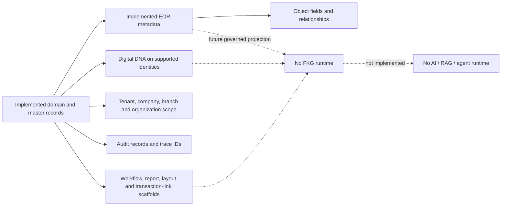

| Baseline area | Evidence-backed state | Limitation for knowledge/AI |
|---|---|---|
| EOR | Global object code, type/category/family, owner module, table/API hints, capability flags, version; object fields and typed relationship metadata | Registry is not a graph, ontology, lineage engine or authorization service |
| Digital DNA | Generated immutable identifier for supported object types; schema uniqueness on covered records | Coverage is incomplete; it does not encode tenant permission or record version |
| Identity/scope | JWT guard refreshes active user/role/permission state; tenant/company/branch context; organization access levels and descendants | Several preserved legacy scaffolds use broader role/JWT checks and `any`; universal field/relationship enforcement is absent |
| Audit | Tenant/company/branch/object/record/Digital DNA, old/new JSON, actor, trace ID, source and time; credential-like keys redacted | No cryptographic immutability, production AI audit schema or automatic universal coverage |
| Workflow | Tenant/object-scoped definitions, versions, effective dates, publish permissions and immutable published versions | Workflow-instance/orchestration runtime is not implemented |
| Reports/layout/customization | Company-scoped definitions and JSON metadata | They are scaffolds, not a governed semantic layer or natural-language reporting runtime |
| Transactions/links | Company-scoped generic document and parent/child links | JWT-only legacy controller and open payloads are not semantic/action authority |
| Master governance | Duplicate checks, change requests, import/export metadata, audit and tenant/company/organization controls | No automated knowledge extraction, entity resolution or AI governance runtime |
| Runtime/dependencies | NestJS, Next.js, Prisma, PostgreSQL and development Compose | No graph/vector/model/AI dependency, service or container |

Manufacturing EOR registrations and `supportsAi: true` on some organization/master objects express metadata capability only. Current JSON fields carry flexible configuration or payloads; they are not prompts, embeddings, AI memory or provenance envelopes.

# Chapter 5 — Target Knowledge and AI Architecture

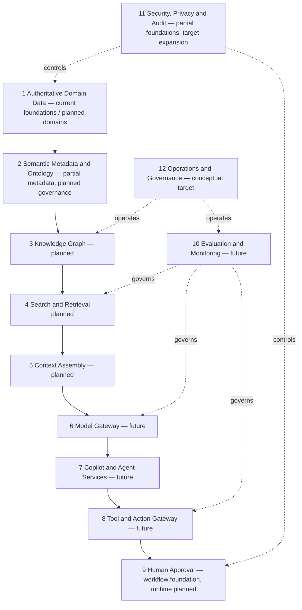

The layers are separable so a search/index/model/vendor can be replaced without moving domain authority. Each boundary carries tenant, subject/service identity, purpose, policy version, source/provenance, trace/correlation and classification. Domain APIs remain the only path to authoritative changes. Read projections, retrieval indexes and FKG may be rebuilt from governed sources and reconciled; prompts or model output cannot reconstruct missing authoritative history.

# Chapter 6 — FlowCraft Knowledge Graph Purpose

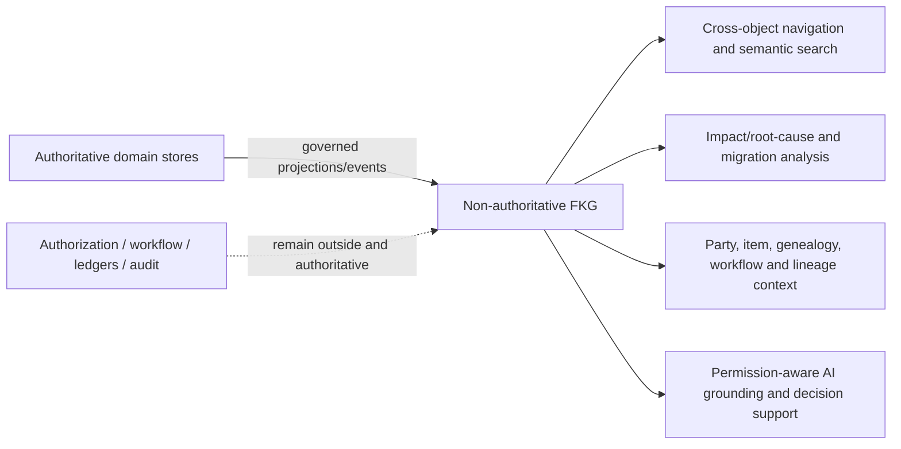

FKG connects customer, supplier, item, organization, document, transaction, workflow, approval, manufacturing genealogy, reporting and lineage context. It supports navigability, impact analysis, root-cause reasoning, traceability, AI grounding, decision support and migration reconciliation where source evidence exists.

FKG is not the system of record, authorization authority, accounting or Inventory ledger, workflow runtime, audit replacement, safety system, or uncontrolled universal copy. A graph edge does not grant access or prove causation. Derived knowledge must name its method/confidence and remain correctable from source.

# Chapter 7 — Knowledge Representation Model

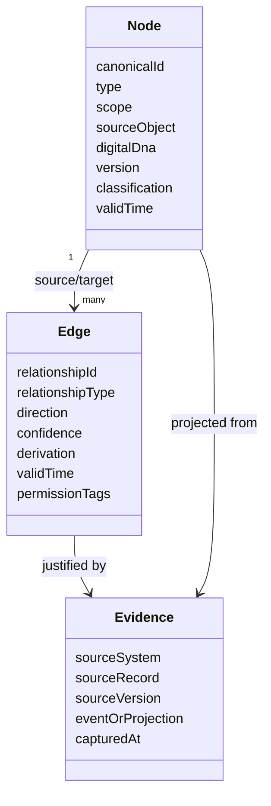

A node represents a governed semantic identity; an edge represents a typed, directed relationship. Both carry tenant/company/organization scope, temporal validity, provenance, source system/object, version, classification, permission tags and evidence links. Confidence applies to derived/asserted knowledge, never as a substitute for authoritative status.

Conceptual options remain open: relational graph projections favor reuse and transactional simplicity; a property graph favors traversal and rich edge properties; RDF/semantic graphs favor formal vocabularies and interoperability; a hybrid can separate canonical semantics from workload-specific projections. No graph technology or representation standard is selected before query, scale, governance, portability and operating evidence is approved.

# Chapter 8 — Semantic Identity Architecture

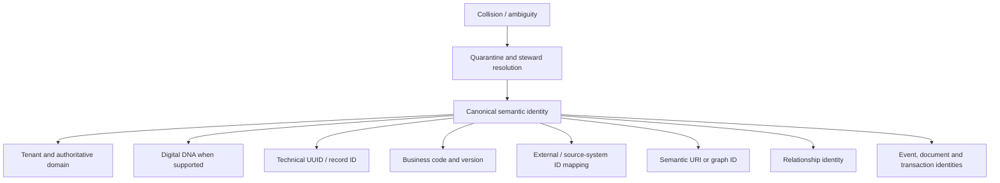

Canonical identity is a governed tuple, not a guessed label: tenant, authoritative domain/object type, stable source identity and version where required. Digital DNA is preferred for covered FlowCraft business identities; technical UUID remains necessary for persistence and tenancy; business codes are aliases with their own validity; external IDs require source mappings. Semantic URI/graph identifiers must be deterministic or registry-issued and must not leak sensitive tenancy.

Relationship, event, document and transaction identities are independently addressable so provenance/corrections can reference exact facts. Collision or ambiguous entity resolution is quarantined for a Data Steward; the system never merges tenants or records from similarity alone. Superseded identities retain redirects/mappings without erasing historical evidence.

# Chapter 9 — Ontology Architecture

```mermaid
flowchart LR
  OWN["Domain owner proposes terms"] --> STEW["Data Steward validates semantics and mappings"]
  STEW --> SEC["Security / Privacy classification review"]
  SEC --> BOARD["Ontology governance approval"]
  BOARD --> VER["Versioned enterprise ontology release"]
  VER --> MAP["Domain/source mappings and validation"]
  MAP --> USE["Graph, search, reporting and AI use"]
  USE --> OBS["Compatibility and quality evidence"]
  OBS --> CHG["Extend, deprecate or supersede"]
  CHG --> OWN
```

The target ontology portfolio includes domain, enterprise, manufacturing, Finance, Inventory, party, organization, process, document, event, security and AI-policy ontologies. Domain owners own meaning; Data Stewards curate terms/mappings; Architecture governs cross-domain consistency; Security/Privacy classify access; AI Governance controls AI-policy semantics.

Every ontology release has identifier, version, owner, status, effective dates, change rationale, compatibility declaration, validation rules and mappings. Extensions use governed namespaces and cannot redefine core terms silently. Deprecation preserves resolvability; mappings identify exact, narrower, broader or transformed meaning. No ontology repository, reasoner or validation runtime currently exists.

# Chapter 10 — Taxonomy and Classification Architecture

Controlled taxonomies cover object families, item/organization/document/transaction/manufacturing types, risk, data sensitivity, criticality, AI usage, action risk, model risk and knowledge confidence. Terms have stable code, label, definition, owner, parent, allowed context, effective interval, synonyms, status and version. Free-text labels never become policy controls.

AI use classification separates informational, analytical, generative, recommendational, simulative, assistive-action, controlled-execution and prohibited-authority behavior. Action/model risk determines data, approval, evaluation, monitoring and tool restrictions. Knowledge confidence distinguishes source-authoritative, verified projection, approved derivation, unverified inference and disputed knowledge; it cannot downgrade a domain prohibition.

Taxonomy changes follow proposal, steward review, affected-domain/security/privacy review, approval, publication, mapping/migration and adoption monitoring. Customer extensions remain namespaced and cannot weaken core authority or isolation rules.

# Chapter 11 — Knowledge Relationship Governance

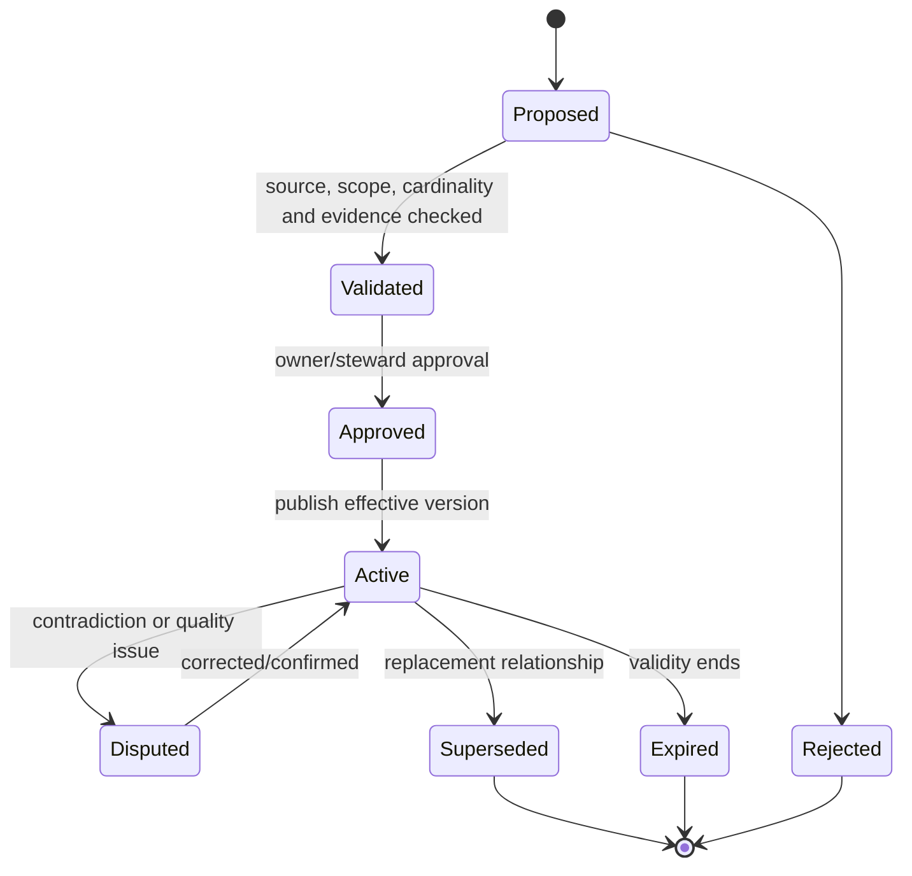

Each relationship type defines owner, authoritative source, source/target types, direction, cardinality, scope, validity, derivation, confidence, approval, evidence and deletion/supersession behavior. An instance carries relationship identity, tenant/company constraints, source version and timestamps. Cross-tenant relationships are prohibited. Cross-company relationships require a permitted enterprise context and source authorization on both ends.

Authoritative relationships are projected from a domain record; derived relationships state algorithm/rule version and confidence. Deletion from a source triggers a governed tombstone/retention decision rather than silent graph disappearance. Relationship inference cannot expand access: a user authorized for one node is not automatically authorized for connected nodes or edge facts.

# Chapter 12 — Knowledge Provenance and Lineage

```mermaid
flowchart LR
  SRC["Source record + version + Digital DNA"] --> EVT["Approved event or projection"]
  EVT --> GE["Graph node / edge + transformation"]
  GE --> RET["Authorized retrieval result IDs"]
  RET --> CTX["Context package + policy/prompt version"]
  CTX --> MOD["Model/provider/version invocation"]
  MOD --> OUT["AI output + citations/confidence"]
  OUT --> HUM["Human decision / approval"]
  HUM --> TOOL["Governed tool call"]
  TOOL --> DOM["Final authoritative domain effect"]
  DOM --> AUD["Audit, trace and reconciliation"]
```

The provenance envelope records source system/object/record/version, Digital DNA where present, actor/service identity, tenant/company/organization, captured/effective time, transformation/mapping version, ontology/taxonomy version, retrieval/query/result IDs, prompt/policy/model/provider versions, context hash, tool plan/calls/results, approval result and final domain-effect identity. Citations reference authorized retrievable evidence, not merely URLs or model prose.

Lineage must survive retry, fallback and correction. An answer can cite a derived graph path only when every edge has evidence and the requesting user can access the cited facts. Model logs alone do not prove correctness; reconciliation follows the chain back to authoritative records.

# Chapter 13 — Temporal Knowledge Architecture

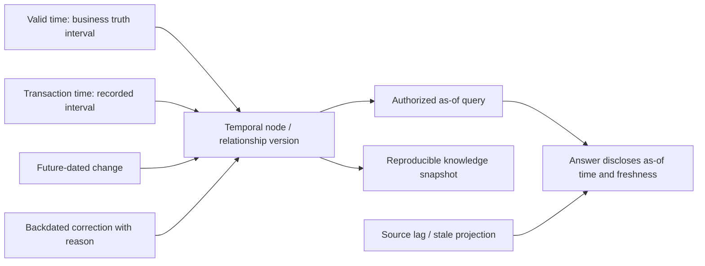

Valid time describes when a fact applies; transaction time describes when FlowCraft learned or stored it. Nodes/edges retain historical versions, supersession and effective intervals. Future changes do not contaminate current answers. Backdated corrections append new knowledge/provenance and preserve what prior answers saw.

Retrieval supplies an explicit as-of timestamp and permitted temporal horizon. Context records source freshness and projection lag; stale or temporally contradictory facts are surfaced or excluded under policy. Knowledge snapshots support reproducible evaluation and decision reconstruction. Every enterprise answer states relevant as-of time, and refuses authority-sensitive advice when freshness is insufficient.

# Chapter 14 — FKG Data Ingestion Direction

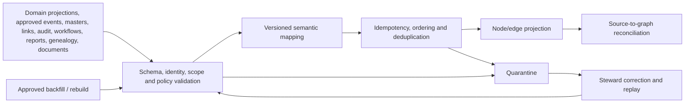

Sources include governed domain projections/events, master changes, transaction relationships, audit references, workflow context, integration lineage, reporting metadata, manufacturing genealogy, and authorized documents/attachments. Direct uncontrolled database scraping is prohibited because it bypasses contracts, scope, classification and change semantics.

Each ingestion contract defines schema/version, identity, source authority, validation, mapping, idempotency, ordering, retry/backoff, deduplication, reconciliation, quarantine, backfill, rebuild, deletion/retention and recovery objectives. Rebuilds use repeatable checkpoints and do not erase unresolved disputes. Documents require malware/content classification, ACLs and extraction evidence before indexing; automated extraction remains future.

# Chapter 15 — Knowledge Graph Security

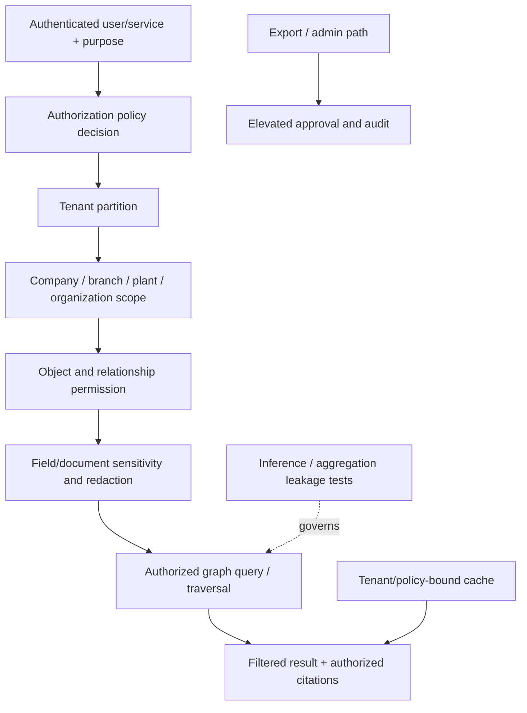

Graph security combines tenant isolation; company/branch/plant/organization scope; object permission; field, edge and document sensitivity; purpose; and policy version. Index-time filtering minimizes exposure but never replaces query/result/citation authorization. Administrative access is separately privileged, time-bounded and audited. Export requires scope revalidation and data-handling controls.

Inference and aggregation can reveal restricted facts even when individual properties are hidden, so traversal depth, counts, neighborhood disclosure and derived relationships require leakage testing. Embeddings, indexes and caches are tenant/policy isolated; cross-tenant retrieval is prohibited. Redaction occurs before external processing and is provenance-recorded. Current scope/permission foundations do not constitute graph security runtime.

# Chapter 16 — AI Capability Classification

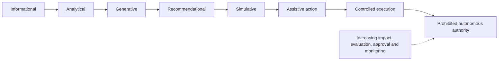

| Category | Typical risk and data | Approval/audit/evaluation | Allowed examples / boundary |
|---|---|---|---|
| Informational | Low; authorized published facts | Session audit and retrieval/citation tests | Explain an approved term/report |
| Analytical | Low–material; operational aggregates | Owner-approved metrics, numerical/permission tests | Trend or relationship analysis |
| Generative | Variable; source documents/facts | Visible AI label, citation and content review | Draft narrative, note or report |
| Recommendational | Material decision influence | Human review, alternatives/impact, domain benchmark | Replenishment or reconciliation suggestion |
| Simulative | Material scenario inputs | Explicit assumptions, feasibility and comparison validation | Capacity/schedule/cash-flow scenario |
| Assistive action | Draft object through a tool | Permission, schema, dry run and confirmation | Create a draft proposal only |
| Controlled execution | Approved narrow domain command | High evaluation, human/domain approval, SoD, idempotency, monitoring | Pre-approved low-ambiguity action through API |
| Prohibited autonomous action | Ledger, safety, privilege or release authority | Not permitted | Direct posting, stock movement, quality/production release, machine control |

Domain and risk tier further restrict each category. Classification is based on possible effect, not friendly wording or model confidence.

# Chapter 17 — AI-Readable, AI-Writable, and AI-Prohibited Objects

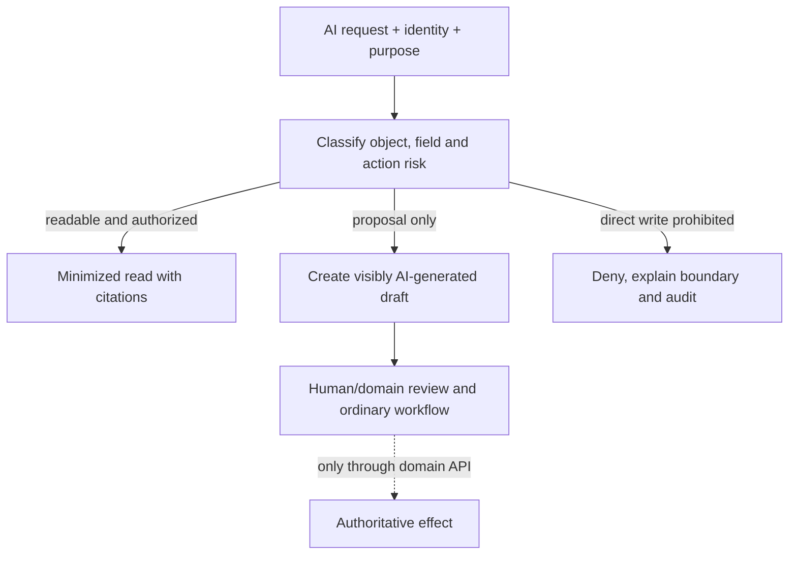

| Access class | Examples | Governing rule |
|---|---|---|
| AI-readable | Approved master data, authorized reports, workflow status, approved manufacturing definitions, non-sensitive operational summaries | Existing user/service permission, purpose, field/relationship sensitivity, minimization and citations |
| AI-writable through governed proposal only | Draft report/note/workflow proposal/forecast/schedule scenario/purchase suggestion/explanation/classification/transaction | AI label, proposal identity, schema validation, owner review; draft has no authority |
| AI-prohibited direct write | Posted journal, Inventory movement, payment/Quality/production release, user privilege, tenant scope, audit record, machine/safety command, approved standard cost, final legal/regulatory submission | Deny by policy; only authoritative domain processes and accountable humans may act |

Readable does not mean exportable or trainable. A proposed draft cannot inherit approval from the requesting user, and AI cannot approve its own output.

# Chapter 18 — Permission-Aware Retrieval Architecture

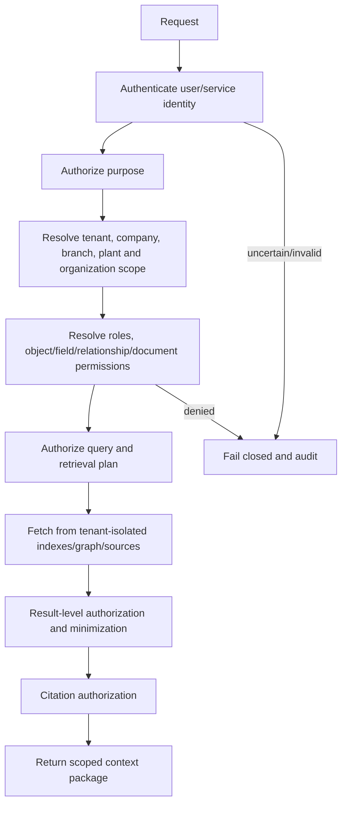

The retrieval decision binds authenticated identity, tenant, company, branch, plant, organization access, roles, permissions, declared purpose, object/field/edge rules, document ACL and policy version. Query rewriting cannot introduce inaccessible sources. Result authorization runs after retrieval because ranking/traversal may surface facts not evident in the initial query.

Context minimizes data to the task. Citation authorization ensures a user can open or understand supporting evidence without leakage. Cached results are keyed by tenant, subject/policy/scope and source versions. Service identities are separately authorized; impersonation/delegation is explicit and auditable.

# Chapter 19 — Semantic Search Architecture

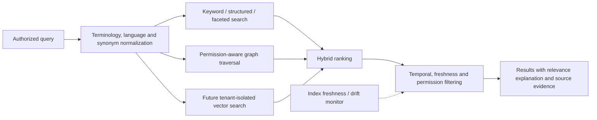

Search supports keyword, structured filters, graph paths, facets and—only when implemented—vector similarity/hybrid ranking. Business vocabularies, multilingual synonyms and object aliases are versioned. Ranking features and weights are testable and must not elevate inaccessible or stale content. Results explain matched terms/relationships/source freshness without exposing restricted scoring features.

Vector search, embeddings and semantic-ranking runtime are not implemented. Stale-index detection compares source checkpoints and blocks authority-sensitive answers beyond approved freshness. Relevance evaluation uses representative tenant-safe queries and explicit permission-leakage tests.

# Chapter 20 — Embedding Architecture Direction

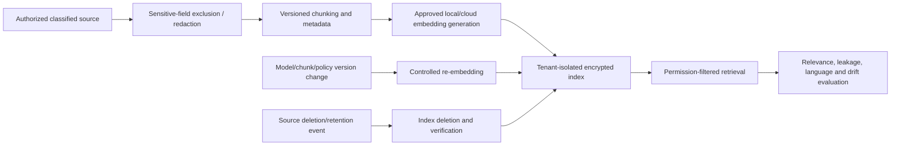

An embedding record references source/chunk identity, tenant, ACL/policy tags, source/model/chunking versions, language, classification, creation/effective time and deletion state. Chunking preserves semantic boundaries and citation offsets. Sensitive fields are excluded or redacted before generation; encryption, cache/storage isolation and provider retention controls apply. Embeddings are personal/confidential data when their source is and are not treated as anonymous.

Re-embedding is triggered by source, model, chunking, ontology, language or policy change and remains reconcilable. Deletion propagates to indexes, caches and evaluation sets with verification/legal-hold handling. Drift, quality, cost and cross-language behavior are evaluated. No embedding model, service or vector database is selected or implemented.

# Chapter 21 — Governed RAG Architecture

```mermaid
sequenceDiagram
  participant U as User
  participant A as Authentication / policy
  participant R as Governed retrieval
  participant C as Context assembler
  participant M as Model gateway
  participant V as Output validator
  U->>A: 1 request
  A->>A: 2 authenticate; 3 classify purpose; 4 resolve permission
  A->>R: 5 authorized query rewrite
  R->>R: 6 hybrid retrieval; 7 result authorization
  R->>C: 8 authorized results and provenance
  C->>M: 9 policy-bound context and prompt
  M-->>V: 10 model output
  V->>V: 11 validate; 12 citations; 13 risk classify
  V-->>U: 14 human review or response
  V->>A: 15 immutable audit envelope
```

RAG is an evidence delivery pipeline, not a permission shortcut or correctness guarantee. Query rewriting is constrained by authorized purpose. Retrieval and citations are independently authorized; context assembly records source IDs/versions and contradictions; prompt policy specifies response limits; model output is checked for schema, citation support, sensitive content, unsafe claims and action intent.

High-risk or insufficiently grounded responses route to human review or refusal. The audit record links request, policy, retrieval snapshot, context, model, validation and response. No RAG runtime currently exists.

# Chapter 22 — Context Assembly Architecture

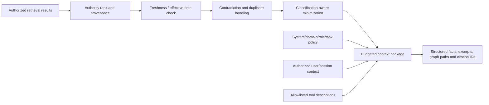

The assembler balances context/token budget against relevance, authority, freshness and risk. It separates structured facts, document excerpts, graph paths, user/session context, policy context and tool descriptions. Duplicate facts are collapsed with all source references; contradictions are retained and flagged, not resolved by model preference. Future/effective dates are explicit.

Every element retains tenant, ACL, classification and citation identity. The assembler cannot broaden source permissions or include a tool because a model requests it. Truncation decisions are logged, and insufficient evidence causes qualification or refusal rather than unsupported completion.

# Chapter 23 — Prompt and Policy Architecture

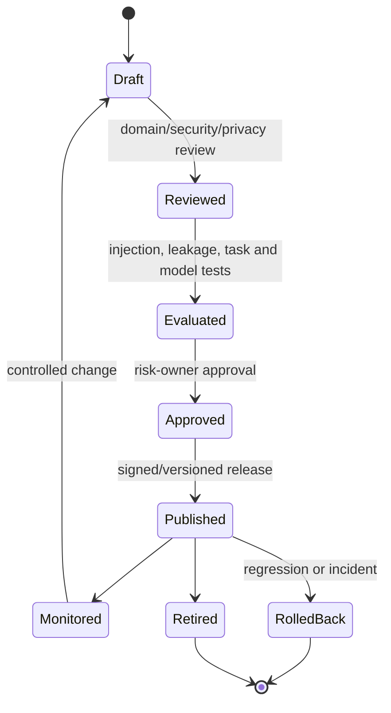

Controlled configuration separates system policy, domain policy, role policy, task templates, output schema and tool policy. Every artifact has owner, version, change reason, compatible models, parameters, classification, evaluation evidence, approval, effective interval and rollback target. Runtime records exact versions.

Prompt-injection resistance uses instruction hierarchy, untrusted-content delimiting, minimal context, allowlisted tools and output validation; prompts alone are not security controls. Customer customization is namespaced, policy-checked and cannot override core authority, privacy or tenant rules. Prompts are reviewable controlled configuration—not undisclosed developer text or hidden memory.

# Chapter 24 — Model Gateway Architecture

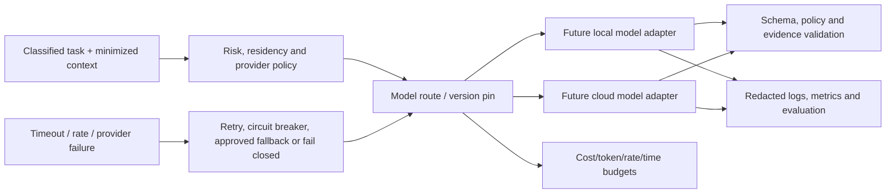

The target gateway abstracts providers/models, classifies task/risk, enforces residency and data-sharing policy, routes to eligible local/cloud adapters, pins versions, budgets tokens/cost/rate, sets timeout/retry/circuit-breaker behavior, redacts logs and applies evaluation gates. A fallback must be approved for the same task/data/risk; switching models cannot silently weaken controls or change answer authority.

Request records include model route, version, provider region/configuration class, policy/evaluation versions, input/output hashes, latency/cost and refusal/failure—not unminimized secrets. No provider or model is selected and no gateway exists.

# Chapter 25 — Local versus Cloud AI Architecture

| Criterion | Local direction | Cloud direction | Hybrid selection rule |
|---|---|---|---|
| Data control/residency | Greater direct custody; still requires isolation and access controls | Contract, region, retention and transfer controls required | Classification and customer/residency policy govern |
| Privacy/confidentiality | Reduces external transfer; model/runtime can still leak | Minimize/redact and prohibit unapproved training/retention | Use least exposure consistent with evaluated quality |
| Cost | Hardware/capacity and operations cost | Usage/egress and commitment cost | Approved unit economics and denial-of-wallet limits |
| Latency/offline | Potential low latency/offline; capacity-bound | Network/provider dependent | Workload SLO and continuity need |
| Quality/model choice | Limited by approved hardware/operations | Broader managed choices, external lifecycle | Domain evaluation—not popularity—governs |
| Availability/scale | FlowCraft/customer operates redundancy | Provider dependency and quotas | Tested fallback/degraded path required |
| Updates/support | Controlled but operationally intensive | Faster provider changes require version controls | Pin, evaluate and approve every material change |

Hybrid routing uses data classification, residency, task risk, required capability, latency, availability, cost, hardware, support and evaluation. Equivalent permission, provenance, audit, monitoring, incident, deletion and training restrictions apply. Offline local AI cannot gain broader scope because centralized policy is unreachable; it uses bounded signed policy or disables the function.

# Chapter 26 — Copilot Architecture

```mermaid
flowchart TB
  USER["Authorized human"] --> SHELL["Copilot shell: identity, purpose, scope and conversation controls"]
  SHELL --> EXEC["Executive Copilot"]
  SHELL --> FIN["Finance Copilot"]
  SHELL --> INV["Inventory / Procurement / Sales Copilots"]
  SHELL --> MFG["Manufacturing / Quality / Maintenance Copilots"]
  SHELL --> ADM["Administrator / Reporting / Migration Copilots"]
  EXEC --> R["Permission-aware retrieval"]
  FIN --> R
  INV --> R
  MFG --> R
  ADM --> R
  SHELL --> PROP["Visible draft / recommendation only"]
  PROP --> HUM["Human ownership and governed action path"]
```

| Copilot | Purpose and read scope | Proposed output | Prohibited action | Human owner / evaluation focus |
|---|---|---|---|---|
| Executive | Authorized cross-domain summaries | Cited narrative, risk/questions | Commit, approve, disclose restricted detail | Management; factuality, access, decision bias |
| Finance | Authorized reports/reconciliations | Explanation, draft reconciliation | Post journal/payment/standard cost | Finance; numerical/citation accuracy |
| Inventory | Stock/availability when implemented | Shortage/slow-moving suggestion | Move/adjust/reserve stock | Inventory; quantity/status correctness |
| Procurement | Supplier/purchase context | Draft sourcing/lead-time analysis | Create/approve order or supplier status | Procurement; supplier evidence/bias |
| Sales | Customer/order/demand context | Demand/risk narrative and draft note | Change price/credit/commitment | Sales; privacy, forecast/customer-risk quality |
| Manufacturing | Approved definitions/plans/execution facts | MRP/schedule/cost explanation/scenario | Release production, move stock, control machine | Manufacturing; feasibility/safety boundaries |
| Quality | Authorized quality evidence | Trend/root-cause hypothesis | Release hold or disposition | Quality; traceability/false-cause risk |
| Maintenance | Asset/work evidence | Failure/spares recommendation | Override availability or command equipment | Maintenance; failure prediction and safety |
| Administrator | Metadata/configuration context | Draft configuration/change impact | Change privilege/tenant/audit | Platform owner; policy/scope correctness |
| Reporting | Approved semantic/report metadata | Draft report/query/narrative | Invent measures or bypass row security | Reporting owner; metric/numerical correctness |
| Implementation/Migration | Approved mappings/import evidence | Mapping/reconciliation suggestion | Commit migration/destructive merge | Data Steward; mapping/completeness |

Every copilot has explicit owner, use-case/risk tier, read policy, proposal formats, prohibited actions, evaluation set and audit. None is implemented.

# Chapter 27 — Agent Architecture

```mermaid
stateDiagram-v2
  [*] --> Registered
  Registered --> Authorized: owner, purpose, tools, scope, budget and expiry approved
  Authorized --> Planning: bounded execution plan
  Planning --> AwaitingApproval: checkpoint / material action
  AwaitingApproval --> Executing: human approval
  AwaitingApproval --> Revoked: reject / expire
  Executing --> Observing: tool result and verification
  Observing --> Planning: next bounded step
  Observing --> Completed: objective satisfied
  Executing --> Halted: error, budget, policy or kill switch
  Authorized --> Revoked
  Halted --> [*]
  Revoked --> [*]
  Completed --> [*]
```

An agent has non-user identity, owner, purpose, allowed tools/objects/actions, tenant/company/organization scope, time/cost/token/step budgets, memory policy, approval checkpoints, execution plan, tool-call audit, error/retry policy, expiry, revocation and kill switch. Delegated user context is separately recorded; service and user identities never collapse. Tool calls are reauthorized at execution time.

A copilot collaborates with a present human; an agent performs a bounded multi-step objective; a workflow executes approved deterministic business state; a background job runs scheduled system processing; an autonomous system pursues goals without checkpoints. Calling a workflow/job an agent does not grant model discretion. Unbounded autonomous enterprise authority and hidden memory are prohibited.

# Chapter 28 — Tool and Action Gateway

```mermaid
sequenceDiagram
  participant AI as Copilot / Agent
  participant G as Tool gateway
  participant P as Policy / permission / SoD
  participant H as Human approver
  participant D as Authoritative domain API
  participant A as Audit / reconciliation
  AI->>G: Proposal + tool + schema payload + risk
  G->>P: Policy, identity, scope, permission and SoD check
  P-->>G: Permit constraints or deny
  G->>G: Validate, dry run, limits and idempotency
  alt human approval required
    G->>H: Evidence, impact, alternatives and expiry
    H-->>G: Approve / modify / reject
  end
  G->>D: Authorized domain command
  D-->>G: Domain effect ID / validation result
  G->>A: Tool call, approval, effect and verification
  G-->>AI: Sanitized result
```

The gateway is the only approved AI action path. A tool registry defines owner, domain API, input/output JSON schemas, action risk, required permission/SoD/approval, tenant scope, dry-run support, idempotency/transaction identity, limits, timeout, reversibility/correction semantics, validation and disablement. Tools are deny-by-default and cannot expose raw database writes.

Confirmation binds the human to exact payload/evidence and expires on material source change. Reversal is a domain correction, never model-driven data erasure. Duplicate calls reuse idempotency identity. Tool output is untrusted input to subsequent model steps and must be schema/policy validated. No AI tool gateway exists.

# Chapter 29 — Human-in-the-Loop Architecture

```mermaid
flowchart LR
  PROP["AI proposal"] --> RISK["Risk / threshold / SoD classification"]
  RISK --> PACK["Evidence, citations, confidence, alternatives and impact"]
  PACK --> REV["Qualified human review"]
  REV -->|reject| END["Close with reason"]
  REV -->|modify| REVAL["Revalidate changed proposal"]
  REV -->|approve| DUAL{"Dual control required?"}
  DUAL -->|yes| APP2["Independent second approval"]
  DUAL -->|no| ACT["Governed domain action"]
  APP2 --> ACT
  ACT --> VERIFY["Post-action verification and notification"]
  EXP["Expiry / delegation / escalation"] -. governs .-> REV
```

Review thresholds depend on domain, value, quantity, sensitivity, reversibility, customer effect and uncertainty. High-impact actions always require accountable domain approval; selected actions require dual control. Reviewers receive sources, explanation, confidence limits, alternatives, affected records, impact, policy and expiry—not a bare “approve” button.

Rejection, modification, delegation and escalation are recorded. Modification invalidates prior model/tool validation where payload or evidence changes. Approval expires when time/source/policy changes. Post-action verification reconciles the domain effect and alerts owners to mismatch. AI cannot approve its own proposal or impersonate an approver.

# Chapter 30 — AI Memory Architecture

```mermaid
flowchart TB
  NONE["No memory — default"] --> SES["Session memory — bounded conversation"]
  SES --> PREF["User preference memory — explicit/controllable"]
  SES --> TASK["Task memory — objective, plan and evidence"]
  TASK --> CASE["Case memory — governed business record"]
  ENT["Enterprise knowledge — FKG/source governed, not model memory"] --> SES
  PROH["Prohibited memory: secrets, hidden profiles, cross-tenant context, unapproved sensitive data"] --> DENY["Block / delete / incident review"]
```

No memory is the default. Session memory expires with the bounded interaction; user preferences require transparent ownership and correction; task memory is scoped to an approved objective; case memory is an explicit governed domain record; enterprise knowledge remains source/FKG data rather than opaque model state. Every category defines owner, consent where applicable, scope, encryption, retention, deletion, tenant isolation, review/correction, source, confidence and expiry.

Prohibited memory includes hidden autonomous memory, credentials, unapproved personal/sensitive profiles, cross-tenant context, model-inferred facts treated as authority and indefinite raw prompts/responses. Retrieval of memory rechecks current permissions. Provider-side retention/training is not memory governance and must be contractually controlled.

# Chapter 31 — AI Evaluation Architecture

```mermaid
flowchart LR
  USE["Approved use case and risk tier"] --> DATA["Versioned tenant-safe golden datasets"]
  DATA --> OFF["Offline task, retrieval and safety evaluation"]
  OFF --> RED["Injection, leakage, tool and isolation adversarial tests"]
  RED --> HUM["Domain human acceptance"]
  HUM --> GATE{"Risk thresholds met?"}
  GATE -->|no| FIX["Revise / reject / defer"]
  GATE -->|yes| SHADOW["Controlled shadow/pilot"]
  SHADOW --> PROD["Production release approval"]
  PROD --> REG["Continuous regression evaluation"]
  REG --> FIX
```

Evaluation covers retrieval relevance/recall, groundedness, citation correctness, hallucination, permission and tenant leakage, harmful action, tool selection/payload/idempotency, numerical correctness, manufacturing-plan validity, Finance explanation accuracy, bias, robustness, prompt injection, regression and human acceptance. Domain-specific benchmarks preserve as-of source snapshots and expected evidence, not just preferred prose.

Golden datasets are classified, access-controlled, representative and separated from unrestricted provider training. Metrics have risk-tier thresholds, confidence intervals where useful and failure examples. Provider/model/prompt/policy/retrieval/tool changes trigger scoped regression. No AI capability is production-ready without approved evaluation evidence; no evaluation platform currently exists.

# Chapter 32 — AI Monitoring and Model Risk

```mermaid
flowchart LR
  INV["Model and use-case inventory: owner, provider, version, risk tier"] --> MON["Quality, groundedness, drift, cost, latency, refusal and tool-error monitoring"]
  MON --> FEED["User feedback, security events and incidents"]
  FEED --> TRI["Triage against approved thresholds"]
  TRI -->|healthy| CONT["Continue and periodic review"]
  TRI -->|degraded| LIMIT["Limit use / fallback / human-only mode"]
  TRI -->|unsafe| ROLL["Disable and rollback model/prompt/policy/tool"]
  ROLL --> INC["Incident response and evidence preservation"]
  INC --> REVAL["Correct, re-evaluate, approve or retire"]
  REVAL --> INV
```

The inventory records use case, model/provider/version, owner, risk tier, data classes/residency, prompts/policies/tools, evaluation, approval and retirement state. Monitoring measures task performance, retrieval/model drift, groundedness/citation, failures/refusals, cost/latency, tool errors, leakage/security events, user feedback and action outcomes without creating excessive sensitive telemetry.

Thresholds route to warning, constrained mode, fallback, rollback, disablement or incident. Rollback includes model route, prompt, policy, ontology/mapping, retrieval index and tool configuration where applicable. Retirement revokes access, handles retained data and preserves decision evidence. Current operational monitoring does not include model risk runtime.

# Chapter 33 — AI Security and Threat Model

```mermaid
flowchart LR
  A["Adversary / compromised source or provider"] --> PI["Direct or indirect prompt injection"]
  A --> POI["Poisoned document / graph edge / model supply chain"]
  A --> ID["Stolen user, service or agent identity"]
  PI --> EX["Exfiltration / tenant leakage / citation spoofing"]
  POI --> BAD["Hallucinated authority / biased or unsafe advice"]
  ID --> TOOL["Malicious or duplicate tool call"]
  TOOL --> DOM["Attempted ledger, privilege or machine effect"]
  GUARD["Isolation, content trust labels, least privilege, schemas, approval, evaluation and monitoring"] -. blocks .-> EX
  GUARD -. blocks .-> BAD
  GUARD -. blocks .-> DOM
  WALLET["Denial of service / denial of wallet"] --> LIMIT["Quotas, budgets, rate/circuit controls"]
```

Threats include direct/indirect prompt injection, data exfiltration, tenant leakage, model inversion, membership inference, poisoned documents/edges, malicious tools, over-permissioned agents, secret/training leakage, model/dependency/provider compromise, denial of service/wallet, hallucinated authority, citation spoofing, unsafe machine advice and social engineering.

Mitigations combine data/source trust labels, content isolation, instruction hierarchy, per-source/result authorization, tenant partitions, minimization/redaction, least-privilege identities, deny-by-default tools, schemas/idempotency, human approval, signed/versioned configuration, dependency/provider assurance, adversarial evaluation, monitoring, budgets, kill switches and incident response. No single prompt or model refusal is a security boundary.

# Chapter 34 — Privacy, Confidentiality, and Data Residency

Personal/employee data, financial data, manufacturing secrets, supplier pricing, customer contracts, machine telemetry, prompts/responses, embeddings and derived profiles are classified according to their sources and use. Data minimization limits fields, records, time range and retention; redaction/pseudonymization is applied before model transfer where it still supports the approved task. Embeddings and model outputs may retain sensitive meaning and are governed accordingly.

Provider review covers processing purpose, regions/transfers, subprocessors, retention/deletion, incident notice, security, audit, customer controls and prohibition of unapproved training. Local processing does not remove privacy/security obligations. Legal holds and deletion requests propagate through source, projection, index, cache, memory, logs and evaluation datasets with evidence and exceptions approved under applicable policy.

Residency and cross-border rules are customer/jurisdiction-specific decisions requiring Privacy/Legal review; this volume makes no legal conclusion. Customer configuration can tighten policy but cannot authorize unrestricted training, cross-tenant learning or hidden retention.

# Chapter 35 — Manufacturing Knowledge and AI Architecture

```mermaid
flowchart LR
  MFG["Authoritative manufacturing definitions and future execution facts"] --> FKG["Permission-aware, provenance-rich manufacturing knowledge"]
  FKG --> EX["BOM/routing/MRP/capacity/cost explanation"]
  FKG --> SIM["Shortage/schedule scenario and anomaly proposal"]
  FKG --> QM["Quality root-cause / maintenance recommendation"]
  FKG --> GEN["Genealogy, recall and work-instruction retrieval"]
  EX --> HUM["Planner / engineer / production human decision"]
  SIM --> HUM
  QM --> HUM
  GEN --> HUM
  DENY["No production release, Quality change, Maintenance override, Inventory move, Finance post, PLC or safety control"] -. constrains .-> HUM
```

Target use cases include BOM/routing knowledge, demand context, MRP/shortage/capacity explanation, schedule simulation, Quality root-cause hypotheses, Maintenance/spares suggestions, genealogy/recall navigation, cost-variance explanation, operator assistance, approved work-instruction retrieval, production anomaly proposals and energy/resource suggestions. Each cites exact approved revisions, as-of state, assumptions and impacted authoritative objects.

AI may explain, compare, simulate and draft a proposal. It cannot release production; change Quality status; override Maintenance restriction; move/reserve Inventory; post Finance; control a PLC/device; bypass work instructions or safety. FCSB-007 authority boundaries govern. Because BOM/MRP/production/genealogy runtimes are themselves planned, these AI uses are future dependencies, not current capability.

# Chapter 36 — Finance, Inventory, Sales, Procurement, Quality, and Maintenance AI

| Domain use case | Authoritative source | Allowed output | Prohibited action | Approval and evaluation |
|---|---|---|---|---|
| Finance explanation/reconciliation | Future Finance ledgers, approved reports/policies | Cited variance/explanation and draft reconciliation | Journal/payment/close/standard-cost posting | Finance owner; numerical, period, citation and SoD tests |
| Cash-flow forecast suggestion | Approved Finance/Sales/Procurement facts | Scenario with assumptions/confidence | Treasury commitment/payment | Treasury/Finance approval; backtesting and stress cases |
| Inventory shortage/slow-moving analysis | Future Inventory ledger/status/reservations plus demand | Explanation and draft replenishment/disposition suggestion | Movement, adjustment, reservation or release | Inventory approval; quantity/status/expiry tests |
| Sales demand/customer-risk analysis | Approved sales/customer/credit context | Forecast/risk summary and draft communication | Price, credit, commitment or customer classification change | Sales/domain approval; privacy, bias and forecast tests |
| Procurement/supplier analysis | Approved suppliers, orders, receipts and Quality evidence | Lead-time/risk recommendation and draft sourcing option | Supplier approval/block, purchase order or payment | Procurement/Quality approval; evidence/bias tests |
| Quality trend/root-cause assistance | Approved specs, inspections, NCR and genealogy | Hypothesis, evidence path and draft investigation | Hold/release/deviation/final disposition | Quality approval; traceability and false-causation tests |
| Maintenance failure/spares suggestion | Approved asset/work/condition and Inventory facts | Recommendation with uncertainty and impact | Availability override, work close or machine command | Maintenance approval; false-positive/safety tests |

Generic transaction/report JSON cannot substitute for an authoritative ledger or approved semantic measure. Domain AI waits for the relevant volumes and implementation evidence.

# Chapter 37 — AI Operations, Incident Response, and Continuity

```mermaid
flowchart LR
  HEALTH["Graph / retrieval / model / provider / tool health"] --> DEC{"Within policy?"}
  DEC -->|yes| AI["Governed AI service"]
  DEC -->|retrieval/vector/graph outage| NOG["Authoritative source/manual navigation; no unsupported answer"]
  DEC -->|model/provider outage| FB["Approved local/cloud fallback or AI unavailable"]
  DEC -->|unsafe/cost/security event| KILL["Kill switch: model, use case, agent and tool disablement"]
  KILL --> MAN["Core FlowCraft remains operational without AI"]
  FB --> MAN
  NOG --> MAN
  KILL --> IR["Incident response, evidence preservation, notification and reconciliation"]
  IR --> RB["Prompt/policy/model/index/tool rollback"]
  RB --> EVAL["Re-evaluate and approve before restoration"]
```

Failure plans cover model/provider, graph, vector/retrieval and policy/evaluation dependencies. Degraded mode never fabricates context or weakens permission. Approved provider failover or local fallback must satisfy the same data/risk policy; otherwise the AI function refuses while ordinary domain UI/API/workflows continue. Kill switches operate by model, provider, tenant, use case, agent and tool, with independently authorized operational access.

Incident handling covers detection, containment, identity/tool revocation, prompt/policy/model/index rollback, evidence preservation, affected-tenant/user notification under approved procedures, cost anomaly control, security/privacy escalation, domain-effect reconciliation and recovery approval. Manual alternatives are documented and exercised. FlowCraft must remain operational without AI.

# Chapter 38 — Decisions, Approval, and Roadmap

## Knowledge and AI architecture decision register

Decision statuses are restricted to **Implemented**, **Approved**, **Proposed**, **Open**, and **Deferred**. Approved means architecture direction accepted for this review draft, not runtime delivery.

| ID | Decision | Status | Consequence |
|---|---|---|---|
| KAI-ADR-001 | Operational domain stores remain authoritative. | Approved | Graph, retrieval and AI cannot become competing records. |
| KAI-ADR-002 | FKG is non-authoritative and rebuildable from governed sources. | Approved | Derived knowledge reconciles to source and cannot post effects. |
| KAI-ADR-003 | Digital DNA is the preferred stable semantic identifier where available. | Implemented | Current immutability/uniqueness foundation is reused; tenant/domain/version remain explicit. |
| KAI-ADR-004 | Graph access is permission filtered at query, result and citation levels. | Proposed | Traversal cannot imply authorization. |
| KAI-ADR-005 | Embeddings never bypass source permissions. | Approved | Index metadata and retrieval enforce current source access. |
| KAI-ADR-006 | Cross-tenant vector or graph retrieval is prohibited. | Approved | Indexes, caches and evaluation remain tenant isolated. |
| KAI-ADR-007 | Factual enterprise AI outputs require provenance and authorized citations. | Approved | Unsupported answers qualify/refuse and preserve as-of time. |
| KAI-ADR-008 | AI cannot directly write ledgers. | Approved | Finance domain APIs and approvals retain authority. |
| KAI-ADR-009 | AI cannot directly move or adjust Inventory. | Approved | Inventory domain owns quantity/location effects. |
| KAI-ADR-010 | AI cannot release Quality holds. | Approved | Quality owns disposition. |
| KAI-ADR-011 | AI cannot override Maintenance state. | Approved | Maintenance owns asset availability. |
| KAI-ADR-012 | AI cannot control PLCs or machine safety. | Approved | Certified industrial/safety controls remain outside ERP AI. |
| KAI-ADR-013 | High-impact actions require accountable human approval. | Approved | Thresholds, SoD, evidence and post-verification apply. |
| KAI-ADR-014 | Service and agent identities are separate from user identities. | Proposed | Delegation is explicit, bounded and revocable. |
| KAI-ADR-015 | Prompts and policies are versioned controlled configuration. | Proposed | Review, evaluation, publication, audit and rollback are required. |
| KAI-ADR-016 | Model and provider choice remains abstracted. | Approved | Domain policy cannot depend on one model/provider. |
| KAI-ADR-017 | Customer data is not used for model training without an explicit approved basis. | Approved | Contract, purpose, scope and Privacy/Legal review govern. |
| KAI-ADR-018 | Hidden autonomous memory is prohibited. | Approved | Memory must be visible, scoped, correctable and expiring. |
| KAI-ADR-019 | AI tool access is deny-by-default. | Approved | Only registered, scoped, reauthorized tools are exposed. |
| KAI-ADR-020 | Tool calls require schemas and action-risk classification. | Proposed | Validation, idempotency, limits, approval and audit are deterministic. |
| KAI-ADR-021 | Production AI requires approved evaluation and monitoring evidence. | Approved | No use case bypasses risk-tier release gates. |
| KAI-ADR-022 | FlowCraft remains functional when AI is unavailable. | Approved | AI is disableable; ordinary domain paths remain primary. |
| KAI-ADR-023 | Graph, vector and model technologies remain unselected. | Deferred | Selection follows requirements, evaluation and operational evidence. |
| KAI-ADR-024 | AI-generated content is visibly identified. | Approved | Users can distinguish drafts/advice from source and approval. |
| KAI-ADR-025 | AI incidents use security and operational incident processes. | Approved | Evidence, containment, notification, reconciliation and recovery are integrated. |

## Open decisions

| ID | Decision needed | Status | Required evidence and approvers |
|---|---|---|---|
| KAI-OPEN-001 | Select the first low-risk pilot use case and tenant/customer profile. | Open | Business value, data classification and Tier 0/1 evaluation; Domain Owner, AI Governance, Security, Privacy. |
| KAI-OPEN-002 | Choose conceptual graph representation and persistence approach. | Open | Query/workload/portability/operations benchmark; Architecture, Data Governance, Operations. |
| KAI-OPEN-003 | Define canonical semantic URI/identifier format and Digital DNA coverage gaps. | Open | Collision/migration/version analysis; Data Governance, Architecture, domain owners. |
| KAI-OPEN-004 | Define graph/vector physical tenant-isolation pattern. | Open | Threat model, scale, deletion and recovery tests; Security, Architecture, Operations. |
| KAI-OPEN-005 | Define approved local/cloud processing and residency profiles. | Open | Customer/jurisdiction, contract, quality/cost evidence; Privacy/Legal, Security, Operations, Management. |
| KAI-OPEN-006 | Define prompt/response/embedding retention and deletion targets. | Open | Classification, legal hold and support needs; Privacy/Legal, Data Governance, Security. |
| KAI-OPEN-007 | Define model/tool risk thresholds and dual-control rules. | Open | Domain impact and SoD analysis; AI Governance, domain owners, Internal Audit. |
| KAI-OPEN-008 | Establish quantitative evaluation/release/rollback thresholds. | Open | Representative golden datasets and incident tolerance; AI Product Owner, domain owners, AI Governance. |
| KAI-OPEN-009 | Decide customer AI configuration and opt-in/disablement model. | Open | Product, contract, support and isolation design; Management, Privacy/Legal, Security, Architecture. |
| KAI-OPEN-010 | Select graph, vector, model, evaluation and monitoring technologies. | Deferred | Approved requirements and evidence from preceding decisions; Architecture Board. |

## AI use-case risk tiers

| Tier | Examples | Data restrictions | Evaluation | Approval | Monitoring | Human involvement | Tool access |
|---|---|---|---|---|---|---|---|
| Tier 0 — No AI authority / informational | Controlled glossary lookup, static help | Public/internal approved content only; no sensitive personalization | Retrieval, citation and access tests | Domain content owner | Availability, stale source and access events | User interprets response | None |
| Tier 1 — Low-risk assistive | Draft narrative, report explanation, authorized search | Minimized authorized data; no high-impact inference | Groundedness, citation, leakage, task regression | Domain Owner and AI Product Owner | Quality, cost, latency, feedback | Human remains author/decision maker | Read-only retrieval; draft storage where approved |
| Tier 2 — Material recommendation | Reconciliation, shortage, supplier or root-cause suggestion | Domain-classified data; sensitive fields tightly controlled | Domain accuracy, bias, robustness, alternatives/impact | Domain Owner, AI Governance; Security/Privacy as classified | Drift, recommendation outcomes, overreliance | Qualified human reviews every recommendation | Read-only plus proposal creation if approved |
| Tier 3 — Controlled action proposal | Draft transaction or bounded tool proposal | Exact scoped records; no prohibited objects | Tool selection/schema/idempotency, SoD, harmful-action and end-to-end tests | Domain approver plus tool/risk approval; dual control where required | Every tool call/effect, failure and reconciliation | Mandatory approval before effect and post-verification | Allowlisted gateway only; dry run and limits |
| Tier 4 — Prohibited autonomous authority | Ledger posting, stock/Quality/production release, privilege or machine/safety control | Not permitted for autonomous AI | Tested as deny/refusal boundary | Cannot be approved as autonomous AI | Denial attempts and incidents | Authoritative human/domain process required | None; policy-enforced denial |

## AI capability matrix

Priorities express architectural sequence, not a delivery date. “Foundation only” never means an AI capability exists.

| Capability ID | Capability | Domain owner | Current status | AI risk tier | Read scope | Proposed output/action | Human approval | Key dependencies | Priority |
|---|---|---|---|---|---|---|---|---|---|
| KAI-CAP-001 | Enterprise semantic search | Data Governance | Not implemented | Tier 1 | Authorized enterprise sources | Cited search results | Content owner for release | FKG, ontology, retrieval security | P0 |
| KAI-CAP-002 | Object relationship navigation | Data Governance | EOR metadata foundation only | Tier 0 | Authorized EOR/source relationships | Evidence-linked graph path | No action approval | Identity, FKG, edge policy | P0 |
| KAI-CAP-003 | Impact analysis | Domain Owner | Partial manual metadata context | Tier 2 | Authorized dependency/lineage graph | Impact hypothesis and affected objects | Domain Owner | FKG, provenance, temporal graph | P1 |
| KAI-CAP-004 | Root-cause analysis | Domain Owner | Not implemented | Tier 2 | Authorized events/facts | Ranked evidence-linked hypotheses | Domain Owner | Provenance, domain facts, evaluation | P2 |
| KAI-CAP-005 | Report explanation | Reporting | Report definitions only | Tier 1 | Authorized report/result/measure metadata | Cited narrative | User owns interpretation | Semantic measures, RAG, numerical tests | P1 |
| KAI-CAP-006 | Natural-language reporting | Reporting | Not implemented | Tier 2 | Authorized governed semantic layer | Draft query/report | Report owner before publication | FCSB-013, query policy, evaluation | P2 |
| KAI-CAP-007 | Dashboard narrative | Reporting | Dashboard scaffold only | Tier 1 | Authorized dashboard facts | Time-bound cited narrative | User review | Governed metrics, freshness, RAG | P2 |
| KAI-CAP-008 | Master-data duplicate suggestion | Data Steward | Exact/rule duplicate foundation only | Tier 2 | Scoped master records | Candidate match with evidence | Data Steward | Entity resolution, privacy, merge controls | P1 |
| KAI-CAP-009 | Master-data classification suggestion | Data Steward | Not implemented | Tier 2 | Authorized master attributes/taxonomy | Draft classification/confidence | Data Steward | Taxonomy, evaluation, change workflow | P1 |
| KAI-CAP-010 | Migration mapping suggestion | Data Steward | Import mapping scaffold only | Tier 2 | Approved source/target metadata and samples | Draft mapping/transformation | Data Steward | Migration controls, ontology, evaluation | P1 |
| KAI-CAP-011 | Workflow recommendation | Workflow Owner | Definitions implemented; runtime absent | Tier 2 | Authorized workflow/context | Draft route/step recommendation | Workflow Owner | FCSB-011, policy, outcome evidence | P2 |
| KAI-CAP-012 | Approval summary | Domain Owner | Approval scaffolds only | Tier 1 | Authorized request/evidence | Cited summary and unresolved issues | Approver decides | Workflow runtime, retrieval, citation | P1 |
| KAI-CAP-013 | Finance explanation | Finance | Ledger runtime not implemented | Tier 2 | Future authorized Finance facts | Cited explanation | Finance user/owner | FCSB-014, semantic measures, numerical tests | P2 |
| KAI-CAP-014 | Reconciliation assistance | Finance | Not implemented | Tier 2 | Future ledgers and source evidence | Draft reconciling items | Finance Owner | Finance authority, provenance, evaluation | P2 |
| KAI-CAP-015 | Cash-flow forecast suggestion | Finance | Not implemented | Tier 2 | Future approved Finance/Sales/Procurement facts | Scenario with assumptions | Finance/Treasury | Domain runtimes, backtesting | P3 |
| KAI-CAP-016 | Inventory shortage explanation | Inventory | Inventory ledger absent | Tier 2 | Future on-hand/status/reservations/demand | Cited shortage explanation | Inventory/Planning | FCSB-015, MRP, freshness | P2 |
| KAI-CAP-017 | Slow-moving stock analysis | Inventory | Not implemented | Tier 2 | Future inventory/movement/demand facts | Candidate list and rationale | Inventory Owner | Inventory ledger, aging policy | P2 |
| KAI-CAP-018 | Replenishment suggestion | Inventory | Item policy values only | Tier 2 | Future inventory/demand/supply | Draft recommendation | Inventory/Planning | Ledger, planning, policy, simulation | P2 |
| KAI-CAP-019 | Sales demand analysis | Sales | Not implemented | Tier 2 | Future authorized sales/forecast context | Forecast/demand narrative | Sales Owner | FCSB-016, forecast data, bias tests | P2 |
| KAI-CAP-020 | Customer-risk summary | Sales | Master/credit foundations only | Tier 2 | Authorized customer/credit/order context | Cited risk summary | Sales/Credit Owner | Sales/Finance domains, privacy/bias tests | P2 |
| KAI-CAP-021 | Procurement recommendation | Procurement | Not implemented | Tier 2 | Future supplier/order/stock/quality facts | Sourcing/lead-time option | Procurement Owner | FCSB-017, supplier evidence | P2 |
| KAI-CAP-022 | Supplier-risk summary | Procurement | Supplier master foundation only | Tier 2 | Authorized supplier/performance/quality facts | Cited risk summary | Procurement/Quality | Supplier performance, bias controls | P2 |
| KAI-CAP-023 | BOM explanation | Engineering | EOR registration only | Tier 1 | Future approved BOM/revision | Cited structure explanation | Engineering for use | Manufacturing runtime, FKG | P2 |
| KAI-CAP-024 | MRP explanation | Planning | Not implemented | Tier 2 | Future MRP snapshot/pegging | Explain recommendation/exception | Planner | MRP runtime, provenance, numerical tests | P3 |
| KAI-CAP-025 | Schedule simulation | Planning | Not implemented | Tier 2 | Future orders/resources/material constraints | Non-authoritative scenario | Planning/Production | Scheduling runtime, feasibility evaluation | P3 |
| KAI-CAP-026 | Capacity analysis | Planning | Not implemented | Tier 2 | Future routing/calendar/resource load | Bottleneck explanation/scenario | Planning/Production | Capacity runtime, time/UOM validation | P3 |
| KAI-CAP-027 | Shortage-resolution suggestion | Planning | Not implemented | Tier 2 | Future shortage/pegging/supply context | Ranked resolution options | Affected domain owners | MRP, Inventory, Procurement, Quality | P3 |
| KAI-CAP-028 | Quality root-cause suggestion | Quality | EOR registration/status flags only | Tier 2 | Future inspections/NCR/genealogy | Hypotheses/evidence paths | Quality Owner | Quality runtime, genealogy, causality tests | P3 |
| KAI-CAP-029 | Maintenance recommendation | Maintenance | EOR registration only | Tier 2 | Future asset/work/condition history | Failure/spares recommendation | Maintenance Owner | Maintenance runtime, safety evaluation | P3 |
| KAI-CAP-030 | Genealogy search | Quality | Batch/serial identity only | Tier 1 | Future authorized genealogy | Backward/forward trace path | No action approval | Inventory/production movements, FKG | P2 |
| KAI-CAP-031 | Recall impact analysis | Quality | Not implemented | Tier 2 | Future genealogy/stock/customer shipment | Affected scope proposal | Quality/Management | Genealogy completeness, Sales/Inventory | P3 |
| KAI-CAP-032 | Cost-variance explanation | Finance | Standard-cost field only | Tier 2 | Future standard/actual/WIP facts | Cited variance breakdown | Finance Owner | Manufacturing costing and GL | P3 |
| KAI-CAP-033 | Operator assistant | Production | Not implemented | Tier 2 | Authorized released work/instructions | Guidance and issue escalation | Operator/Production | MES/terminal, safety boundary, offline controls | P3 |
| KAI-CAP-034 | Work-instruction retrieval | Engineering | Not implemented | Tier 1 | Approved effective instructions only | Cited current instruction | Production owner for release | Document control, revision, permissions | P2 |
| KAI-CAP-035 | OCR suggestion | Data Steward | Not implemented | Tier 2 | Approved classified documents | Draft extracted fields/confidence | Qualified reviewer | Document store, extraction/evaluation | P3 |
| KAI-CAP-036 | Voice assistant | AI Product Owner | Not implemented | Tier 2 | Minimized authorized session context | Spoken assistive response/draft | Human confirmation | Identity, privacy, noisy-environment tests | P3 |
| KAI-CAP-037 | AI agent | AI Governance | Not implemented | Tier 3 | Purpose/tool-scoped authorized objects | Bounded multi-step proposals/actions | Mandatory checkpoints | Agent identity, gateway, kill switch, evaluation | P3 |
| KAI-CAP-038 | AI-generated draft transaction | Domain Owner | Not implemented | Tier 3 | Exact authorized source facts | Visibly labeled draft | Domain approver | FCSB-009/010, schemas, workflow | P2 |
| KAI-CAP-039 | Controlled tool action | Domain Owner | Not implemented | Tier 3 | Minimum command context | Authorized domain API command | Required by risk/SoD | Tool gateway, idempotency, audit | P3 |
| KAI-CAP-040 | Local AI | Operations | Not implemented | Varies | Policy-eligible local data | Model response through gateway | Use-case approval | Runtime, hardware, security, evaluation | P3 |
| KAI-CAP-041 | Cloud AI | Operations | Not implemented | Varies | Policy/residency-eligible minimized data | Model response through gateway | Use-case/provider approval | Contract, privacy, gateway, evaluation | P3 |
| KAI-CAP-042 | Model routing | Architecture | Not implemented | Tier 2 | Classified task/context metadata | Eligible model route | Route-policy approval | Model inventory, gateway, evaluation | P2 |
| KAI-CAP-043 | Prompt management | AI Product Owner | Not implemented | Tier 2 | Controlled policy/task configuration | Versioned published prompt/policy | Domain/Security/AI Governance | Repository, evaluation, rollback | P1 |
| KAI-CAP-044 | AI evaluation | AI Governance | Not implemented | Tier 1 | Classified golden datasets/telemetry | Release/rollback evidence | AI Governance/domain sign-off | Evaluation harness, datasets, thresholds | P0 |
| KAI-CAP-045 | AI monitoring | Operations | Not implemented | Tier 1 | Minimized model/use-case telemetry | Alerts, rollback/incident trigger | Operations/AI Governance | Inventory, metrics, incident integration | P0 |

## AI risk register

Residual-risk direction is the intended movement after target controls; it is not evidence that controls are implemented or effective.

| Risk ID | AI/knowledge area | Risk | Current condition | Impact | Target mitigation | Owner | Residual-risk direction |
|---|---|---|---|---|---|---|---|
| KAI-RSK-001 | Generation | Hallucination | No AI runtime/evaluation | False enterprise decision | Grounded retrieval, validation, citation, qualification/refusal and domain tests | AI Product Owner | Down |
| KAI-RSK-002 | Provenance | Incorrect citation | No RAG/citation runtime | False trust and failed audit | Source/result/citation authorization and entailment checks | Data Governance | Down |
| KAI-RSK-003 | Retrieval | Stale context | No projection/freshness runtime | Decision uses obsolete state | Source checkpoints, as-of disclosure and fail-closed freshness thresholds | Data Governance | Down |
| KAI-RSK-004 | Isolation | Cross-tenant leakage | Current domain scoping; no graph/vector controls | Severe confidentiality breach | Physical/logical partitions, policy binding and adversarial isolation tests | Security | Down |
| KAI-RSK-005 | Authorization | Permission bypass | Current guards uneven across legacy scaffolds | Unauthorized data/action | Per-source/query/result/citation/tool authorization; deny by default | Security | Down |
| KAI-RSK-006 | Privacy | Sensitive-field leakage | Audit redaction exists; AI path absent | Confidential/personal data disclosure | Classification, minimization, field policy, redaction and output DLP review | Privacy/Legal | Down |
| KAI-RSK-007 | Prompt security | Prompt injection | No prompt/model runtime | Policy manipulation or exfiltration | Instruction hierarchy, content isolation, minimal context, tool schemas and tests | Security | Down |
| KAI-RSK-008 | Retrieval security | Indirect prompt injection | Documents are not ingested today | Malicious source controls model/tool | Trust labels, quarantine, content delimiting and adversarial evaluation | Security | Down |
| KAI-RSK-009 | Knowledge ingestion | Poisoned document | No document AI pipeline | False facts or malicious instructions | Source approval, malware/content checks, provenance and correction workflow | Data Governance | Down |
| KAI-RSK-010 | Knowledge graph | Poisoned graph edge | EOR relationships are metadata only | Misleading traversal/decision | Owned relationship lifecycle, evidence, confidence and dispute controls | Data Governance | Down |
| KAI-RSK-011 | Embeddings | Embedding leakage | No embeddings | Semantic recovery of restricted data | Exclusion/redaction, isolation, encryption, ACL metadata and deletion | Privacy/Legal | Down |
| KAI-RSK-012 | Provider | Model-provider retention | No provider selected | Unapproved storage/reuse | Contract, zero/minimum retention profile, region and audit review | Privacy/Legal | Down |
| KAI-RSK-013 | Data use | Training-data misuse | No training integration | Customer/IP/privacy harm | Explicit approved basis, opt-in/contract, provenance and prohibition enforcement | Privacy/Legal | Down |
| KAI-RSK-014 | Agents | Over-permissioned agent | No agent runtime | Broad unauthorized effects | Separate identity, least privilege, scope/budget/expiry and revocation | Security | Down |
| KAI-RSK-015 | Tools | Unauthorized tool call | No tool gateway | Domain-control bypass | Deny-by-default registry, reauthorization, SoD and approval | Domain Owner | Down |
| KAI-RSK-016 | Tools | Duplicate tool action | No AI action runtime | Duplicate transaction/effect | Idempotency/transaction identity, confirmation binding and reconciliation | Engineering | Down |
| KAI-RSK-017 | Finance | Financial misstatement | Finance runtime/AI absent | Incorrect reporting/posting | AI no ledger writes; numerical evaluation and Finance approval | Finance | Down |
| KAI-RSK-018 | Inventory | Inventory misstatement | Inventory ledger/AI absent | Wrong availability/movement | Inventory authority, freshness/quantity tests and no direct writes | Inventory | Down |
| KAI-RSK-019 | Quality | Quality-release error | Quality runtime/AI absent | Nonconforming product use/release | AI cannot release; Quality approval and denial tests | Quality | Down |
| KAI-RSK-020 | Manufacturing | Unsafe production recommendation | Manufacturing runtime/AI absent | People/equipment/product harm | Safety boundary, qualified review, approved instructions and safety testing | Production | Down |
| KAI-RSK-021 | Industrial control | PLC command risk | No device/AI integration | Unsafe machine behavior | No AI/ERP safety authority; isolated gateway and policy denial | Security | Down |
| KAI-RSK-022 | Fairness | Biased recommendation | No AI evaluation | Unequal or poor supplier/customer/user decisions | Representative evaluation, protected-data limits, explanation and human review | AI Governance | Down |
| KAI-RSK-023 | Explainability | Explainability failure | No AI runtime | User cannot challenge/validate advice | Evidence paths, assumptions, alternatives, confidence and refusal | AI Product Owner | Down |
| KAI-RSK-024 | Model risk | Model drift | No model inventory/monitoring | Quality/safety degradation | Version inventory, benchmarks, drift thresholds and rollback | AI Governance | Down |
| KAI-RSK-025 | Retrieval | Retrieval drift | No search/vector runtime | Relevant facts omitted/misranked | Golden queries, index/source monitoring and ranking regression | Data Governance | Down |
| KAI-RSK-026 | Cost | Cost runaway | No model/provider use | Denial of wallet/budget breach | Tenant/use-case budgets, quotas, rate limits, alerts and kill switch | Operations | Down |
| KAI-RSK-027 | Continuity | Provider outage | No provider dependency today | AI feature unavailable | Approved fallback or AI-off manual/domain path | Operations | Down |
| KAI-RSK-028 | Continuity | Local-model failure | No local model | Degraded/unavailable assistance | Health checks, capacity controls, fallback and ordinary-operation path | Operations | Down |
| KAI-RSK-029 | Memory | Hidden memory | No AI memory runtime | Undisclosed profiling/leakage | No-memory default, visible categories, retention/consent/correction | Privacy/Legal | Down |
| KAI-RSK-030 | Lifecycle | Incomplete deletion | No graph/vector/AI stores | Retained restricted/customer data | Propagated tombstones, cache/index/evaluation purge and verification | Data Governance | Down |
| KAI-RSK-031 | Audit | Audit gap | Current audit lacks AI envelope | Irreconstructible answer/action | End-to-end trace across retrieval/model/approval/tool/domain effect | Internal Audit | Down |
| KAI-RSK-032 | Prompt governance | Unreviewed prompt change | No prompt platform | Silent behavior/control regression | Versioned publish workflow, evaluation, approval and rollback | AI Product Owner | Down |
| KAI-RSK-033 | Supply chain | Model supply-chain compromise | No model artifacts selected | Backdoor, leakage or unsafe output | Provenance, integrity, approved sources, scanning/evaluation and revocation | Security | Down |
| KAI-RSK-034 | Fraud | AI-generated fraud | No generative runtime | Deceptive documents/instructions | Visible labeling, approval/SoD, anomaly detection and non-authority | Finance | Down |
| KAI-RSK-035 | Human factors | User overreliance | No AI user controls | Advice accepted without validation | Training, uncertainty, sources, alternatives and high-risk approval | Management | Down |
| KAI-RSK-036 | Governance | Regulatory/customer-policy mismatch | No AI policy profiles | Contract/legal/customer breach | Configurable stricter profiles and Privacy/Legal/customer review | AI Governance | Down |

## AI responsibility matrix

R = Responsible, A = Accountable, C = Consulted, I = Informed. `A/R` combines responsibility/accountability where approved; deployment procedures may require stricter segregation.

| Activity | Business User | Domain Owner | Data Steward | AI Product Owner | AI Governance | Security | Privacy/Legal | Architecture | Engineering | Operations | Internal Audit | Management |
|---|---|---|---|---|---|---|---|---|---|---|---|---|
| AI use-case approval | C | R | C | R | A | C | C | C | I | I | I | C |
| Data-source approval | I | A | R | C | C | C | C | C | I | I | I | I |
| Ontology approval | I | R | R | C | C | C | C | A | I | I | I | I |
| Prompt approval | C | A | C | R | R | C | C | C | I | I | I | I |
| Model approval | I | C | I | R | A | C | C | C | C | C | I | I |
| Evaluation approval | C | R | C | R | A | C | C | C | C | I | I | I |
| Tool approval | I | A | I | C | R | R | C | C | C | C | C | I |
| Production release | I | C | I | R | A | C | C | C | R | R | I | I |
| Access review | I | R | C | I | C | A/R | C | I | I | C | C | I |
| Monitoring | C | C | C | R | C | C | C | I | C | A/R | I | I |
| Incident response | I | C | C | C | R | A | C | C | R | R | I | I |
| Model rollback | I | C | I | R | A | C | I | C | R | R | I | I |
| Knowledge correction | C | A | R | C | C | C | C | C | R | I | I | I |
| Customer AI configuration | C | A | C | R | C | C | C | C | R | C | I | I |
| High-risk action approval | I | A/R | I | C | C | C | C | I | I | I | C | I |
| AI retirement | I | C | C | R | A | C | C | C | R | R | I | I |

## Approval roles

| Approval scope | Required accountable roles | Minimum evidence |
|---|---|---|
| Volume architecture | Architecture Board, Data Governance, AI Governance and affected Domain Owners | Decision/risk review, authority boundaries and open-decision owners |
| Data/knowledge source | Domain Owner and Data Steward; Security/Privacy where classified | Source authority, scope, mapping, provenance, retention and reconciliation |
| Ontology/taxonomy | Architecture and Data Governance | Version, definitions, compatibility, validation and migration |
| Model/provider/route | AI Governance, Security, Privacy/Legal and Operations | Contract/residency, evaluation, supply chain, continuity and cost controls |
| Prompt/policy | Domain Owner and AI Product Owner; Security/Privacy as applicable | Versioned configuration, adversarial/domain tests and rollback |
| Tool/action | Domain Owner and Security; AI Governance | Schema, permission/SoD, risk tier, dry run, idempotency, approval and reversal |
| Production AI use case | AI Governance and Domain Owner; Operations release owner | Approved evaluation, monitoring, incident, disablement and user readiness |
| High-risk individual action | Accountable domain approver(s) under SoD/threshold policy | Exact evidence/payload, impact, alternatives, expiry and post-verification |

## Approval conditions

FCSB-008 may enter Architecture Review only when current-state claims are reconciled to repository evidence, domain owners accept that FKG/AI are non-authoritative, Data/Security/Privacy/AI Governance approve identity/provenance/isolation principles, later-volume owners confirm no boundary is pre-empted, and all open decisions have owners and evidence plans. Approval does not select technology or authorize coding.

Any production AI approval additionally requires an approved use case/risk tier, source/permission contracts, threat/privacy assessment, representative evaluation with failure evidence, operational monitoring/rollback/kill switch, manual alternative, user training, incident/reconciliation procedure and accountable domain acceptance.

## Required work before any AI coding

1. Select a Tier 0 or tightly bounded Tier 1 pilot and define value, users, sources, prohibited behavior and success/failure thresholds.
2. Approve canonical semantic identities, Digital DNA coverage rules, ontology/taxonomy ownership and relationship/provenance envelopes.
3. Define tenant/company/organization/object/field/edge/document/citation authorization contracts and leakage tests.
4. Define ingestion, mapping, idempotency, temporal, reconciliation, quarantine, rebuild, retention and deletion contracts.
5. Classify all pilot data; approve privacy/residency/provider/training/retention constraints and customer configuration.
6. Specify prompt/policy/model/tool configuration schemas, versioning, approval, evaluation, rollback and audit.
7. Establish model/use-case/agent/tool inventories and separate service identities with least-privilege delegation/revocation.
8. Build representative, classified golden datasets and tests for retrieval, citation, numerical/domain accuracy, leakage, injection, bias and harmful actions.
9. Define model/provider/graph/vector selection criteria without embedding technology assumptions in domain contracts.
10. Define monitoring, cost budgets, incident severity, evidence preservation, kill switches, degraded/manual paths and recovery approval.
11. Approve domain API action boundaries, tool schemas, risk tiers, SoD, human checkpoints, idempotency and reconciliation before any tool execution.
12. Complete Architecture, Domain, Data, AI Governance, Security, Privacy/Legal, Operations and Internal Audit readiness review.

## Required work before FCSB-009

Before **FCSB-009 — Universal Transaction Framework**, define canonical transaction/document/event identity, source authority, lifecycle/status, effect versus proposal, linkage, version/correction, tenant/company scope, Digital DNA applicability, provenance, permission tags and AI-readable/proposal/prohibited classifications. Specify how transaction relationships project to FKG without becoming authority and how AI-generated draft transactions remain visibly unposted until ordinary validation, workflow, approval and domain posting.

## Relationship to later volumes

| Later volume | FCSB-008 dependency / boundary |
|---|---|
| FCSB-009 Universal Transaction Framework | Authoritative transaction identity/effects and AI-draft separation |
| FCSB-010 Universal Document Framework | Document versions, ACLs, extraction/citation and AI-generated labeling |
| FCSB-011 Workflow Runtime Architecture | Human approval, escalation, expiry, delegation and SoD checkpoints |
| FCSB-012 FlowCraft Studio Architecture | Governed ontology/prompt/policy/tool configuration and promotion |
| FCSB-013 Reporting and Analytics Architecture | Measures, semantic queries, narrative and analytical authority |
| FCSB-014 through FCSB-020 | Domain sources, permissions, prohibitions, evaluation and action ownership |
| FCSB-022 Mobile and Offline Architecture | Bounded offline retrieval/advice, policy freshness and memory controls |
| FCSB-023 Performance and Scalability Architecture | Graph/search/model workloads, budgets, benchmarks and isolation at scale |
| FCSB-024/025 Product Governance/Roadmap | AI lifecycle, compatibility, packaging, support, investment and retirement |

## Delivery roadmap

| Stage | Outcome | Entry gate | Exit evidence |
|---|---|---|---|
| 0 — Governance foundation | Decisions, risk tiers, source/action boundaries and owners approved | FCSB-008 review | Signed decision/open-issue register and RACI |
| 1 — Semantic contracts | Identity, ontology, provenance, temporal and permission schemas | Stage 0 | Contract tests, example mappings and threat/privacy review |
| 2 — Rebuildable knowledge projection | Non-authoritative tenant-isolated FKG/search pilot | Stage 1 | Reconciliation, deletion, isolation, freshness and recovery evidence |
| 3 — Read-only governed retrieval | Permission-aware search/context with citations | Stage 2 | Retrieval/citation/leakage evaluation and operational controls |
| 4 — Tier 0/1 assistance | Replaceable model gateway and low-risk copilot | Stage 3 | Domain evaluation, monitoring, labeling, rollback and manual path |
| 5 — Tier 2 recommendations | Material domain advice/simulation | Stable domain sources | Domain benchmark, human acceptance, bias/impact monitoring |
| 6 — Tier 3 proposals/tools | Narrow approved tool actions | FCSB-009–013 and domain APIs/workflows | SoD, approval, idempotency, correction and incident exercises |

Stages are independently gated, reversible and disableable. Stage sequence is not a delivery date and does not authorize Tier 4 autonomous authority.

## Repository evidence reviewed

Evidence inspected for this volume includes:

- [Repository overview](../../README.md), root/API/web/shared package manifests, lockfile and development Docker topology.
- [Current Prisma schema](../../apps/api/prisma/schema.prisma), [seed](../../apps/api/prisma/seed.ts) and the three accepted migration directories.
- EOR models/services/controllers/DTOs, object codes, fields, relationships, owner modules and capability flags.
- Digital DNA generation/immutability; audit fields, trace IDs and recursive credential-key redaction.
- JWT authentication, current-state role/permission refresh, tenant/company/branch context and organization-scope enforcement.
- Master-data registry/service, duplicate/change/import/export governance and JSON metadata boundaries.
- Workflow definitions/publication, report/layout/customization scaffolds and generic transaction/link behavior.
- Current web routes/components and all 76 declared API tests across foundation, organization and master data.
- [DBA-002](../implementation/DBA-002-foundation-implementation.md), [DBA-003](../implementation/DBA-003-enterprise-structure-implementation.md) and [DBA-004](../implementation/DBA-004-enterprise-master-data-implementation.md) implementation reports.
- Git history and tags through `v0.4-dba004-merged`, plus FCSB Volumes 1–7.
- Repository-wide references and dependency search for FKG, graph, vector, embeddings, semantic search, RAG, models, prompts, copilots, agents, OCR, voice and AI runtimes.

## Current-versus-target statement

**Implemented foundation:** EOR object/field/relationship metadata, owner/capability flags; Digital DNA for supported identities; tenant/company/branch and organization scope; roles/permissions; audit/trace foundations; workflow definitions; report/layout/customization and transaction-link scaffolds; governed master data; PostgreSQL/Prisma/NestJS/Next.js; development Docker; 76 accepted source tests.

**Registered metadata only or partial/scaffolded:** EOR `supportsAi` flags and AI/FKG roadmap references; generic relationship, report, workflow, transaction and JSON configuration shapes. These do not implement ontology, graph traversal, semantic security, AI context, orchestration or actions.

**Planned/future/conceptual target:** FKG, ontology runtime, knowledge ingestion/provenance/temporal projection, semantic/vector/hybrid search, embeddings, RAG, model gateway/providers/local runtime, prompts/policies, copilots, agents/tools/memory, evaluation/monitoring/red-team, OCR/voice, manufacturing/domain AI and production AI audit. No current runtime claim is made for any of these.

## Known limitations and manual-review recommendations

- This is logical architecture, not executable schema/API, provider contract, model card, data-protection/legal assessment, safety case or technology selection.
- Repository source inspection proves code presence, not production control effectiveness; no customer/production data or external provider configuration was inspected.
- EOR object codes and `supportsAi` are future-readiness metadata, and EOR relationships lack the full provenance/temporal/security lifecycle proposed here.
- Several legacy report/layout/customization/transaction paths use broad roles/JWT checks and open `any`/JSON payloads; they must not be exposed to AI without typed contracts and uniform scope enforcement.
- Controlled standalone FEAPB/UMF/UFT/FOST/FKG source documents are absent and require reconciliation before approval.
- Graph/vector/model/provider/evaluation/monitoring technology and quantitative performance/quality thresholds remain intentionally open.
- Privacy/Legal must assess actual jurisdictions, customer contracts, training/retention and cross-border processing; no unsupported legal conclusion is offered.
- Security, domain owners and plant safety engineers must independently review prompt/tool/device and unsafe-advice boundaries.
- Mermaid diagrams require visual review in the approval renderer even after syntax/fence validation.

## Version history

| Version | Date | Status | Change |
|---|---|---|---|
| 1.0 Draft | 2026-07-16 | Proposed | Initial FCSB-008 Knowledge Graph and Governed AI Architecture review draft. |

## Final approval record

| Role | Name | Decision | Date | Conditions / notes |
|---|---|---|---|---|
| Architecture Board | _To be assigned_ | Open | — | Confirm series/domain alignment and open technology decisions. |
| Data Governance | _To be assigned_ | Open | — | Confirm identity, ontology, provenance and knowledge ownership. |
| AI Governance | _To be assigned_ | Open | — | Confirm tiers, evaluation, monitoring and action boundaries. |
| Security | _To be assigned_ | Open | — | Confirm isolation, threat model, identities and tools. |
| Privacy/Legal | _To be assigned_ | Open | — | Confirm data use, retention, residency and provider constraints. |
| Manufacturing / Quality / Maintenance | _To be assigned_ | Open | — | Confirm advisory, safety and release boundaries. |
| Finance / Inventory | _To be assigned_ | Open | — | Confirm ledger/movement and approval prohibitions. |
| Operations | _To be assigned_ | Open | — | Confirm continuity, cost, monitoring, rollback and kill switches. |
| Internal Audit | _To be assigned_ | Open | — | Confirm trace, SoD, approval and evidence expectations. |
| Management | _To be assigned_ | Open | — | Confirm risk appetite, pilot and accountability. |
