# FlowCraft Solution Blueprint

## Volume 9 — Universal Transaction Framework

| Document control | Value |
|---|---|
| Document code | FCSB-009 |
| Version | 1.0 Draft |
| Status | Architecture Review Draft |
| Approval status | Pending Architecture Board, Data Governance, Finance, Inventory, Procurement, Sales, Manufacturing, Quality, Maintenance, Security, Integration, and Operations Review |
| Last updated | 2026-07-16 |
| Related milestones | DBA-002 Platform Foundation; DBA-003 Enterprise Structure; DBA-004 Enterprise Master Data; transaction architecture gate before operational Finance, Inventory, Procurement, Sales, Manufacturing, Quality, Maintenance, Project, Service, and integration runtimes |
| Dependencies | FCSB-001 through FCSB-008; current generic transaction/link, EOR, number-series, workflow-definition, approval-schema, audit, Digital DNA, scope, master-data, report/layout/customization, test, migration, dependency, and deployment evidence |
| Next planned volume | FCSB-010 — Universal Document Framework |

This volume defines a conceptual common transaction contract. It does not establish operational procurement, sales, Inventory, Finance, manufacturing, Quality, Maintenance, project, payment, posting, workflow-instance, event/outbox, reversal/correction, attachment, signature, archival, concurrency, or AI transaction runtime.

## Status vocabulary

| Status | Meaning in this volume |
|---|---|
| Implemented foundation | Directly evidenced platform behavior through accepted release `v0.4-dba004-merged`. |
| Generic scaffold only | Preserved broad schema/API shape without the typed controls required here. |
| Registered metadata only | EOR/type code exists without operational aggregate/runtime. |
| Partial | A related control exists but does not cover universal transactions. |
| Planned | Required target capability is not implemented. |
| Future | Later capability dependent on domain volumes or technology decisions. |
| Conceptual target | Architecture direction requiring detailed design, implementation and acceptance evidence. |

# Chapter 1 — Purpose and Scope

FCSB-009 defines the common architectural contract every FlowCraft business transaction follows while preserving one authoritative owning domain and its invariants. Its audience is the Architecture Board; Data Governance; Finance, Inventory, Procurement, Sales, Manufacturing, Quality, Maintenance, Project and Service owners; Security; Integration; Operations; Internal Audit; Engineering; implementation partners; and customer process owners.

Scope includes identity, type/family registry, scoped headers, typed lines/schedules/allocations/distributions, relationships, lifecycle/status/action/date semantics, quantity/UOM/currency/price/tax/amount controls, workflow/approval, domain posting requests/effects, consistency, idempotency/concurrency, correction/reversal, history/evidence, events, import/migration, reporting, extensions and AI-generated drafts. Detailed domain accounting/tax/legal rules, one physical universal schema, workflow/runtime technology, event/queue technology, file/signature implementation and production capacity claims are out of scope.

[FCSB-001](./FCSB-Volume-1-Executive-and-Business-Architecture.md) supplies business intent; [FCSB-002](./FCSB-Volume-2-Application-and-Platform-Architecture.md) modular boundaries; [FCSB-003](./FCSB-Volume-3-Enterprise-Data-and-Information-Architecture.md) authority/history; [FCSB-004](./FCSB-Volume-4-Integration-Architecture.md) contracts; [FCSB-005](./FCSB-Volume-5-Security-and-Trust-Architecture.md) trust/SoD; [FCSB-006](./FCSB-Volume-6-Deployment-and-Operations-Architecture.md) operations; [FCSB-007](./FCSB-Volume-7-Manufacturing-Solution-Architecture.md) manufacturing boundaries; and [FCSB-008](./FCSB-Volume-8-Knowledge-Graph-and-Governed-AI-Architecture.md) semantic/AI proposal controls.

FCSB-010 through FCSB-013 will define documents, workflow instances, Studio publication and reporting/analytics. Later Finance, Inventory, Sales, Procurement, Manufacturing Execution, Quality, Maintenance, Project/Service and Mobile volumes specialize this framework and retain authority. Transaction architecture must precede those runtimes so identifiers, effects, dates, corrections, relationships, retries, scope and evidence do not diverge irreconcilably.

# Chapter 2 — Executive Summary

The repository preserves a `TransactionDocument` scaffold with company, module, enum kind, document number, one status, amount/currency and JSON payload; parent/child links; approval schema; minimal Journal models; EOR transaction codes; number-series, workflow-definition and audit foundations; and report/layout/customization metadata. Its controller is JWT-only, accepts `any`, derives one company from the user and exposes untyped creation/linking. There are no transaction lines, tenant/branch/plant/organization scope on the document, typed action DTOs, status dimensions, version token, idempotency, posting/effect, correction/reversal or domain runtime.

The target framework combines stable identity and common semantic contracts with typed domain-owned aggregates. Common lifecycle/action/date/currency/UOM/relationship/evidence rules prevent fragmentation; domain APIs enforce business invariants. Approval does not post, posting does not approve, completion does not necessarily financially close. Transactions request Inventory and Finance effects; those domains validate and post their own immutable movements/journals. Corrections/reversals append linked history.

Strong consistency applies within an aggregate and whenever accepting a command must atomically protect its invariant/idempotency/outbox record. Cross-domain effects use explicit requests, results and reconciliation rather than direct writes. AI may propose a visibly labeled draft through the governed action gateway; after acceptance it is an ordinary draft subject to all controls. Current maturity remains generic scaffold/platform foundation; all universal/domain transaction runtime is planned.

# Chapter 3 — Transaction Framework Principles

1. Every transaction has exactly one authoritative owning domain.
2. Common structure standardizes contracts but never replaces domain invariants or typed aggregates.
3. Transaction identity is stable; transaction numbers are human references, not primary keys.
4. Posted domain effects are immutable and separately identified.
5. Drafts are mutable only under permission, validation and optimistic concurrency.
6. Correction, cancellation and reversal preserve the original record and historical truth.
7. Inventory owns stock quantity, status and location effects; Finance owns journals and ledger effects.
8. Quality owns disposition; Maintenance owns asset availability.
9. Workflow coordinates state/approval but does not own domain truth or effects.
10. Approval is not posting; posting is not approval.
11. Completion/technical close does not necessarily mean financial close.
12. Created, document, transaction, posting/accounting, tax, effective, due and completion dates are distinct.
13. Currency, exchange-rate, amount, quantity and UOM precision/rounding are explicit and reproducible.
14. Idempotency is mandatory for retryable commands and integration messages.
15. Optimistic concurrency is the default for mutable transactions; lock exceptions are narrow.
16. Cross-domain direct table writes are prohibited; domain APIs enforce invariants.
17. Audit supports accountability but does not replace transaction/effect/status/approval history.
18. JSON cannot hide authoritative quantities, monetary values, identities, statuses or effect references.
19. Posted/accepted transactions cannot be deleted; retention uses archive/legal-hold policy.
20. Relationships are typed, directional, scoped, auditable and coverage-aware.
21. External/imported transactions retain source-system identity, batch and mapping lineage.
22. High-risk actions require segregation of duties, evidence and accountable approval.
23. Events describe committed facts through versioned schemas; they are not commands disguised as facts.
24. AI can create proposals/drafts only and cannot approve or directly post/move/release/override authority.

# Chapter 4 — Current Transaction Baseline

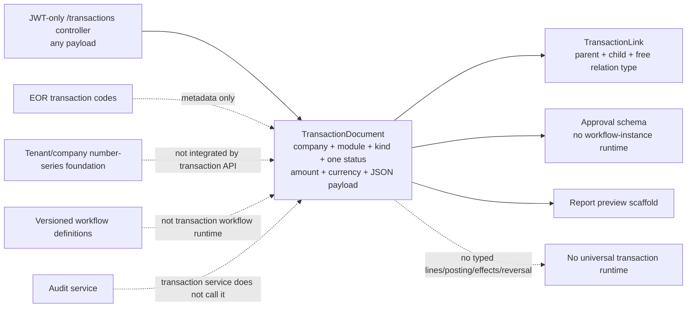

| Evidence | Current state | Framework gap |
|---|---|---|
| `TransactionKind` | 25 enum values across purchasing, sales, manufacturing, quality, maintenance and journal concepts | Enum is not a governed type registry or runtime |
| `TransactionDocument` | CUID, company, module/kind, document number, string status, decimal amount, currency string, JSON payload, creator/timestamps | No tenant/branch/plant/org, typed lines/dates/rates/totals/version/effects/correction/archive |
| `TransactionLink` | Unique parent/child/type and upsert duplicate suppression | Free type; no same-company/scope, direction/cardinality, coverage, provenance or permission validation |
| Controller/service | JWT; list by company; open `any` create; link endpoint | No object permission, DTO/schema/domain validation, audit, idempotency or concurrency |
| Approval schema | Rules/steps/request/history linked to generic document | No controller/service/runtime, delegation/escalation/SoD or separation from posting |
| Journal schema | Header/lines and company number uniqueness | No Finance service/posting/period/balance/reversal runtime |
| Number series | Tenant/company/branch/object; serializable atomic increment; audit; permissions | Not invoked by generic transaction creation; transaction numbers can be supplied directly |
| Workflow definitions | Tenant/object/version/effective dates; immutable publication | No workflow instances or transaction transition orchestration |
| Audit/Digital DNA | Rich append-only service shape and Digital DNA on supported master/organization types | Transaction service does not audit; transaction Digital DNA is unsupported |
| Organization/master foundations | Tenant/company/branch/plant/org masters, UOM/currency/items/warehouses/partners | Generic transaction does not enforce their scope/effectivity/status rules |

No transaction-specific accepted tests are present; the 76 source tests cover foundation, organization and master data, including number-series concurrency and published-workflow immutability.

# Chapter 5 — Target Universal Transaction Architecture

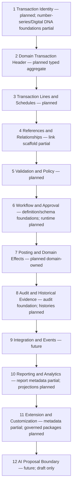

“Universal” means common semantic interfaces, required controls and reusable components—not one universal persistence table. Each domain owns aggregates, commands and effects, implementing shared identity/scope/date/money/quantity/history contracts. Domain-specific lines and states may extend the common contract without weakening it. Interfaces expose typed commands/results/events; JSON is limited to governed non-authoritative extension data.

# Chapter 6 — Transaction Family Model

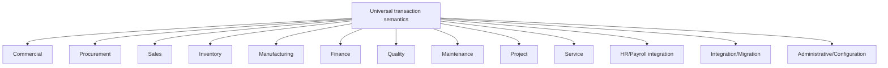

Families share identity, ownership, scope, action, lifecycle, date, relationship, audit and integration semantics. Procurement/Sales specialize parties, prices, schedules and fulfilment; Inventory specializes movement/location/tracking; Manufacturing specializes material/operation/output; Finance specializes journal/subledger/period/currency; Quality and Maintenance retain disposition/asset authority; Project/Service specialize work/resource/billing; HR/Payroll is integration-only until its domain exists; migration/admin use controlled non-posting or configuration effects.

A family never authorizes another domain’s effects. A goods receipt may be procurement-owned while requesting an Inventory receipt and Finance accrual; its aggregate records request/result identities, not foreign-table mutations.

# Chapter 7 — Transaction Type Registry

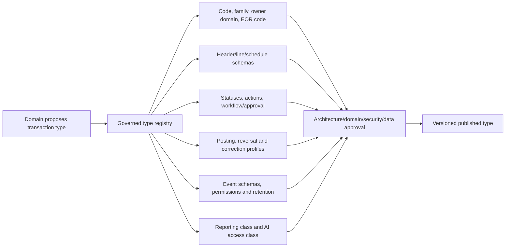

The registry target stores transaction type code, family, owning domain, EOR code, header/line/schedule schema identities, number-series policy, allowed status dimensions/actions, workflow/approval policy, posting/effect profile, reversal/correction policy, event schema versions, permissions, retention, reporting classification and AI read/proposal/prohibited class. It also records version/effectivity, compatibility and implementation endpoint.

Current `TransactionKind`, EOR codes and object capability flags are inputs only. They do not form a complete registry and may disagree in naming (`PURCHASE_REQUEST` versus EOR `PURCHASE_REQUEST`, `GRN` versus `GOODS_RECEIPT`, `WORK_ORDER` ambiguity). Reconciliation is required before publication; no complete registry runtime exists.

# Chapter 8 — Transaction Identity Architecture

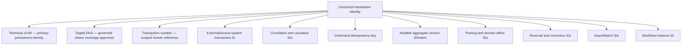

Technical UUID is the stable primary identity. A generated transaction number is unique only in its defined tenant/company/branch/type/fiscal scope and is never a foreign-key substitute. Digital DNA may provide a durable semantic reference after transaction coverage/immutability rules are approved; current service types do not include transactions. External/source IDs are namespaced by source and retained for duplicate prevention/lineage.

Correlation groups a business interaction; causation points to the initiating command/event. Idempotency identifies retry-equivalent commands. Version identifies mutable state. Posting/effect, reversal/correction, batch/import and workflow identities are independent so each lifecycle can be audited and retried without conflation.

# Chapter 9 — Transaction Scope Architecture

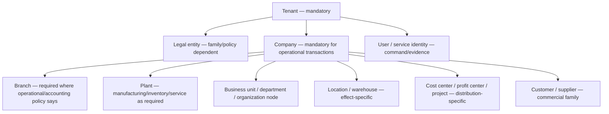

Tenant is always explicit. Company is mandatory for operational/financial transactions; legal entity, branch, plant, business unit, department, organization node, location/warehouse, cost/profit center, project and party requirements are declared by type/family/action. Scope values are authoritative typed references and validated for compatible tenancy, company, effectivity and user organization access.

Procurement/Sales require supplier/customer and commercial company/legal context; Inventory requires company and movement locations, optionally plant/branch; Manufacturing requires company/plant and production organization; Finance requires company/legal entity, period and distributions; Quality/Maintenance require company/plant/site/asset context; project/service require project/customer/resource scope. Actor/service identity is evidence, not business scope.

# Chapter 10 — Universal Header Contract

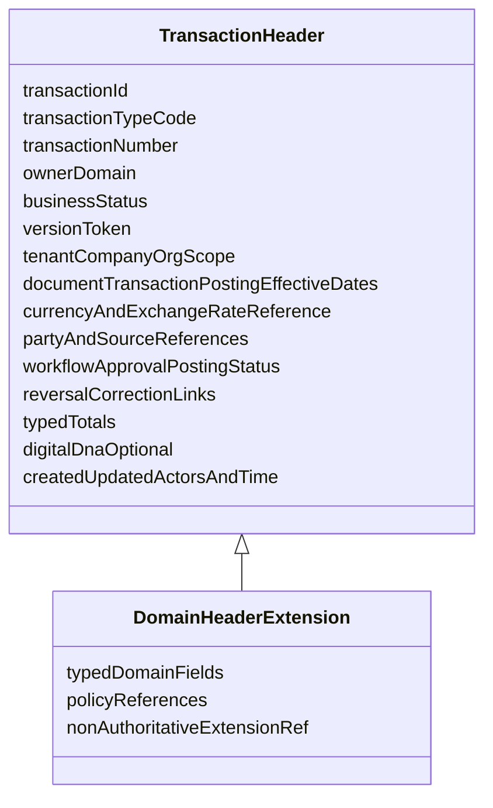

Universal fields are transaction ID/type/number/owner, version, tenant/company and required organization scope, distinct dates, transaction currency and exact exchange-rate reference, party/source/reference/description, responsible owner, workflow/approval/posting statuses, reversal/correction links, typed total components, audit actors/timestamps and Digital DNA when approved. Status is multidimensional as Chapter 15 defines.

Domain extensions add typed legal/commercial/manufacturing/quality/maintenance/project fields and type-specific invariants. Total amounts are stored in typed decimal columns/value objects with currency/rounding basis, not only JSON. Mutable edits increment the version token. A header cannot impersonate a line ledger or domain effect.

# Chapter 11 — Universal Line Contract

Each typed transaction line has immutable line ID and stable line number; item/service/account/resource identity; description; transaction/base quantity with UOM/conversion; unit price/currency; tax/discount/charge components; base/tax/net amounts; required warehouse/location/bin and batch/serial references; cost/profit center and project distributions; source/parent/schedule identities; multidimensional status; fulfilled/reversed quantities; and a governed extension reference.

Not every family uses every field. Procurement/Sales lines specialize commercial price/tax/schedule semantics; Inventory lines specialize source/target location/status/tracking; Manufacturing lines specialize component/operation/output; Finance lines specialize account/debit/credit/distribution; Quality/Maintenance/Project/Service lines use typed domain concepts. Inapplicable fields are absent rather than null-driven universal behavior. Authoritative values cannot live only in extension JSON.

# Chapter 12 — Line, Schedule, Allocation, and Distribution Model

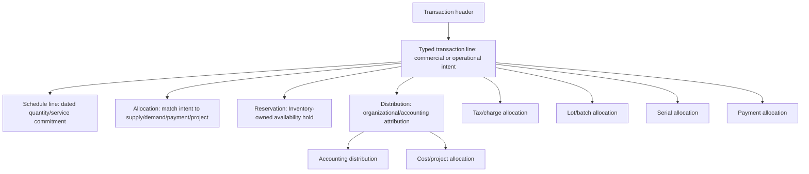

A line states what is transacted. A schedule states when/how much is expected. An allocation links quantities or amounts to another source/target. A reservation is an Inventory-owned effect, not just an allocation row. A distribution assigns financial/organizational responsibility. Accounting, cost, tax, lot/batch, serial, project and payment allocations have distinct identities/invariants and totals.

These concepts must not be collapsed into one polymorphic line table with ambiguous columns. Each records source, quantity/amount/UOM/currency as applicable, validity/status, created/reversed coverage and domain owner. Coverage cannot exceed eligible source remaining quantity/amount except by explicit domain policy.

# Chapter 13 — Transaction Relationship Model

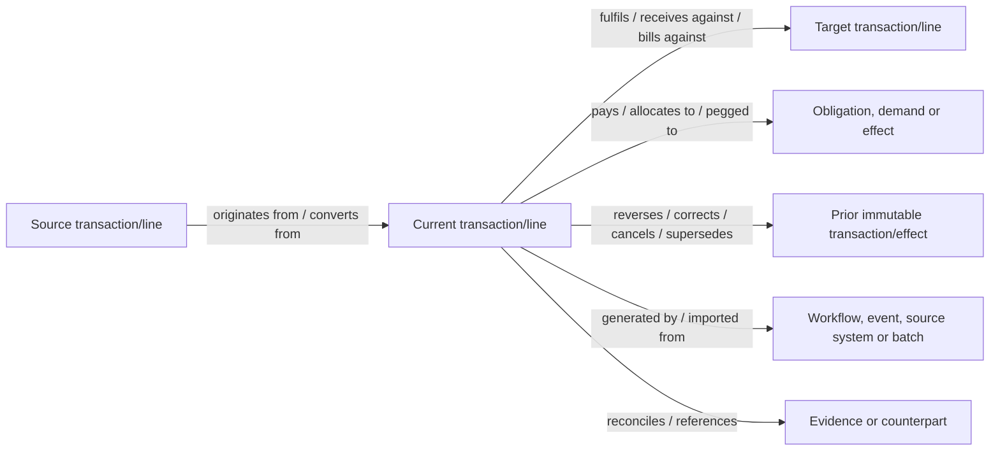

Relationship types include originates-from, fulfils, receives-against, bills-against, pays, reverses, corrects, cancels, supersedes, converts-from/to, references, allocates-to, pegged-to, generated-by, reconciles and imported-from. Each type defines direction, source/target types, header/line cardinality, allowed lifecycle, quantity/amount coverage, validity, provenance, owner and permissions.

Relationships are separately identified and auditable. Cross-tenant links are prohibited; cross-company links require an approved intercompany type and access on both sides. Link creation validates current source/target versions and remaining coverage. The current free-text `TransactionLink` is a scaffold only.

# Chapter 14 — Transaction Lifecycle Model

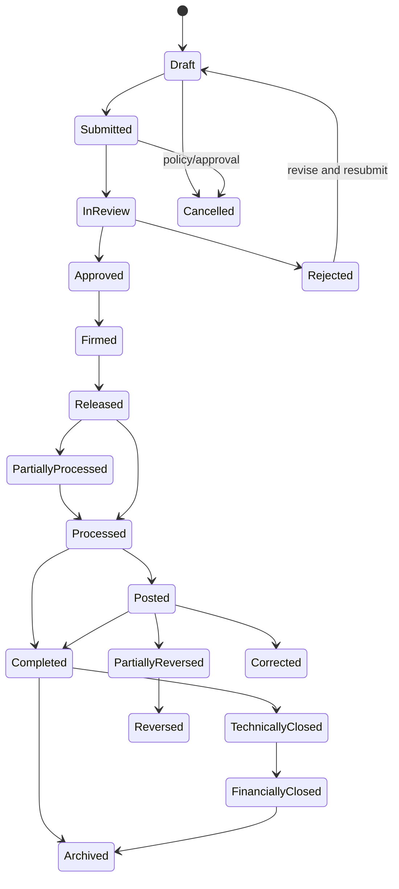

Not every type uses every state. A published type declares its business state machine and transition guards. Rejected may be revised into a new version; released/processed/posted states restrict edits. Partial processing/reversal retains remaining coverage. Correction links a replacement/delta while preserving original effects. Technical close confirms business execution; financial close is Finance-owned reconciliation/settlement.

Cancellation is allowed only before prohibited effects or through domain-specific undo processes. Archive affects active visibility/retention, never historical existence. State history is append-only.

# Chapter 15 — Status Architecture

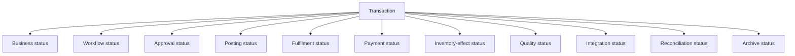

One string cannot safely represent business progression, workflow/approval, posting, fulfilment, payment, Inventory/Quality effect, integration, reconciliation and archive. Each dimension has its own controlled vocabulary, owner, transitions, version/effective time and history. Derived display status may summarize dimensions but is never authority.

For example, a receipt can be business-completed while Quality-held, Inventory-posted, Finance-pending and integration-acknowledged. Domain policy defines valid combinations and blocks contradictory transitions.

# Chapter 16 — Command and Action Architecture

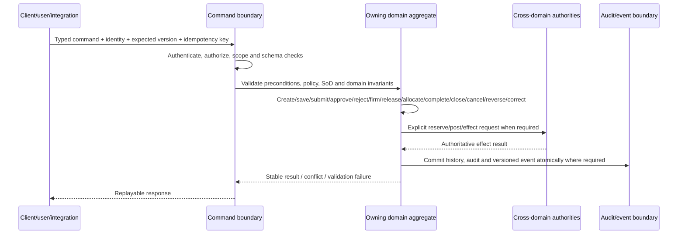

Commands include create, save, submit, approve, reject, firm, release, allocate, reserve, post, complete, close, cancel, reverse, correct, reopen, archive, export, import and retry. The type registry defines required permission, scope, allowed states, preconditions, validation, idempotency, expected version, SoD/approval, effects, audit and emitted event.

Command endpoints accept explicit DTO/schema types; mass assignment is prohibited. A retry command resumes an identified failed operation and cannot invent a new effect. Reopen is exceptional and cannot edit posted history. Export/import are authorized data operations, not lifecycle shortcuts.

# Chapter 17 — Validation Architecture

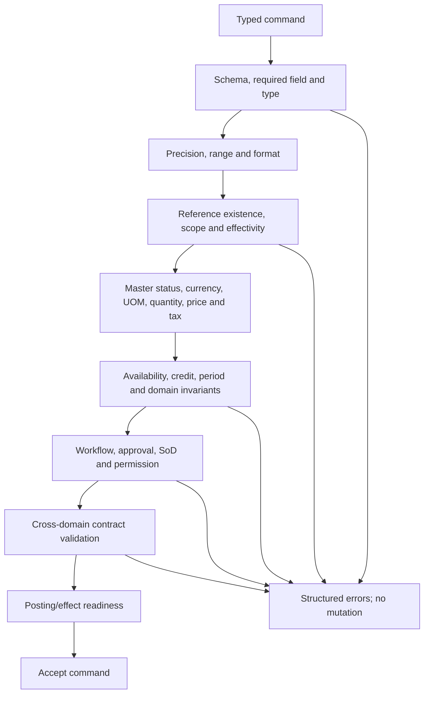

Validation layers are schema, required/type, precision, reference existence, tenant/company/organization consistency, effective dates, master status, currency/rate, UOM/conversion, quantity/tolerance, price/discount/tax, availability, credit, period status, workflow/approval/SoD, domain invariant, cross-domain contract and posting readiness. Validation uses the same authoritative policies for UI, API, import and AI draft paths.

Failures are structured by field/line/rule/source and do not partially mutate. Cross-line/header totals and relationship coverage are validated. Posting revalidates volatile conditions such as period, stock/quality, rate policy and source version rather than trusting earlier approval.

# Chapter 18 — Transaction Date Architecture

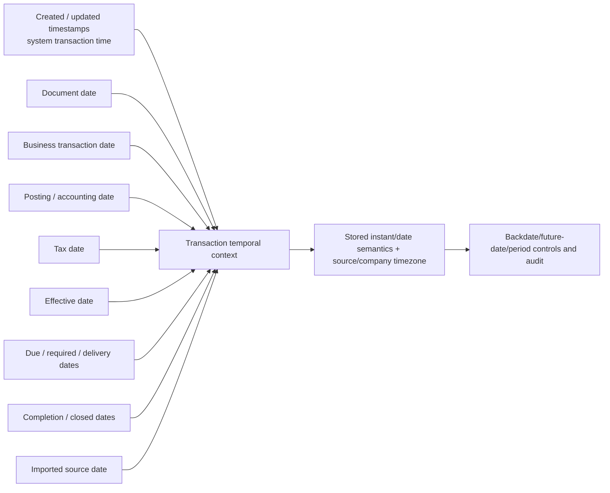

Timestamps are stored as instants with timezone context; business dates may be date-only under company/legal policy. Document date reflects source document; transaction date reflects business occurrence; posting/accounting date selects ledger period; tax/effective dates follow domain policy; due/required/delivery dates govern commitments; completion/closed dates are transition results; imported source date preserves lineage.

Backdating/future dating requires permission, reason, open period and source/effect revalidation. Dates are never silently defaulted to hide missing source data. Reversal behavior states whether original or current period/date is used, subject to Finance/domain policy.

# Chapter 19 — Currency and Monetary Architecture

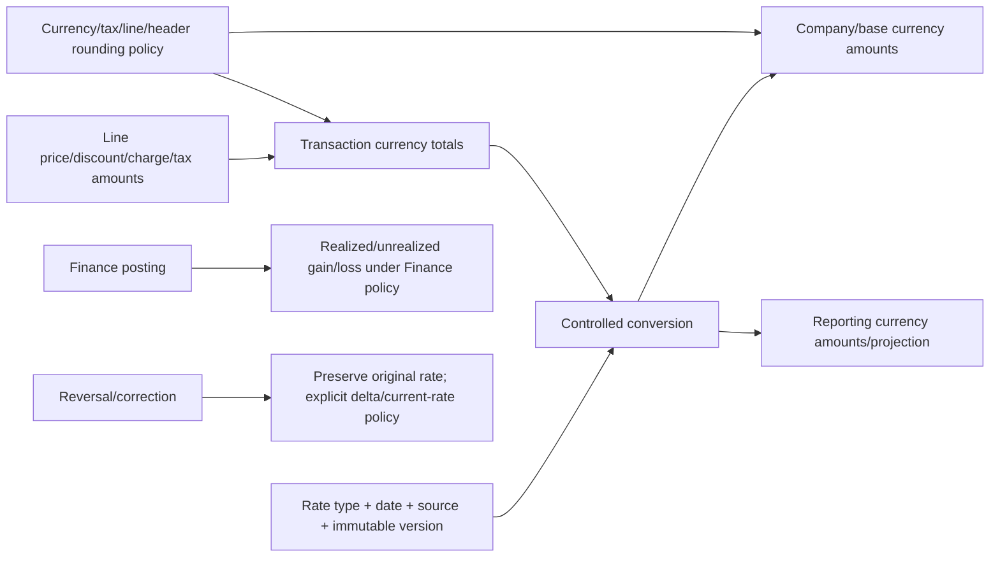

Monetary values carry currency, decimal precision and rounding policy. A transaction captures transaction currency plus exact exchange-rate type/date/source/version; converted base/reporting amounts are reproducible. Line and header totals reconcile under explicit rounding/residual allocation. Tax rounding is independently governed.

Manual rate/price overrides require permission, reason and thresholds. Historical rates and original monetary components are never overwritten. Finance owns gain/loss, accounting currency and reversal-rate policy. Existing versioned exchange rates are a foundation; generic transaction currency string/amount are insufficient and no Finance posting runtime exists.

# Chapter 20 — Quantity and UOM Architecture

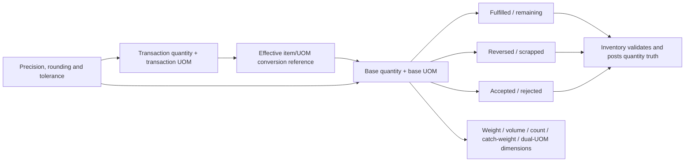

Transaction and base quantities are stored with their UOMs and exact effective conversion reference/factor, precision and rounding. Remaining equals governed ordered/base quantity less eligible fulfilment/cancellation/reversal according to domain rules; it is not an editable field. Accepted, rejected and scrapped quantities remain distinct.

Weight, volume, count, catch weight and dual UOM require explicit direction, tolerance and reconciliation. Current effective-dated UOM conversions are a foundation; Inventory owns posted quantity truth, batch/serial/location movement and availability. Generic JSON cannot carry authoritative quantities.

# Chapter 21 — Pricing, Discount, Tax, and Charge Architecture

Commercial lines preserve unit price, price basis/source, price-list/version/effective date, quantity break, transaction/base currency amounts, discount/surcharge/freight/landed-cost components, tax code/category/base/rate/amount, inclusive/exclusive behavior, withholding direction and line/header allocation. Every manual override records old/new value, reason, permission and approval threshold.

Price, discount, charge and tax are typed components with stable identities and calculation order. Rounding policy defines per-line versus header behavior and residual allocation. Posted documents retain historical inputs/results; later master changes do not recalculate them silently. Landed cost and withholding are domain-specific distributions, not generic amount flags. Current price-list/tax masters are foundations only; no pricing, tax determination or tax posting runtime is implemented, and this volume makes no accounting/tax/legal conclusion.

# Chapter 22 — Workflow and Approval Boundary

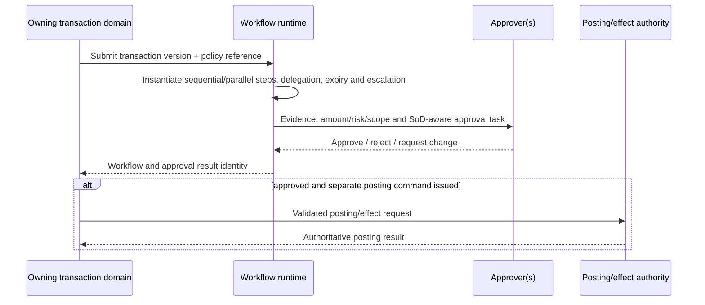

Workflow definition describes routing; workflow instance records one execution. Approval request/step/approver, sequential/parallel behavior, delegation, escalation, expiry, rejection, resubmission, matrix thresholds, evidence and SoD are explicit. Digital signature is future and requires identity/evidence policy.

Workflow coordinates but does not own the transaction/effects. Approval binds exact transaction version and becomes stale after material edit/source change. Approval does not post; posting revalidates authority/readiness. Current versioned definitions and approval schema are foundations, but no workflow/approval-instance runtime is evidenced.

# Chapter 23 — Posting Architecture

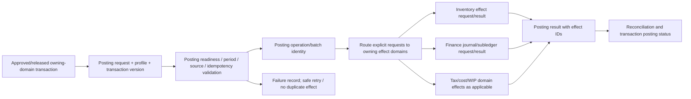

Posting request identifies transaction/version, posting profile/version, actor, dates, idempotency and expected effects. Posting validation rechecks status, approval, scope, period, source coverage, totals and domain readiness. Each effect domain returns immutable effect identity/status or structured failure. The owning transaction derives posting status from results and reconciles partial failure.

There is no universal service with permission to update all domain tables. Reusable orchestration can coordinate typed domain requests but cannot own their invariants. Retry reuses identities; compensation is a domain correction/reversal, not blind rollback. No universal posting engine exists.

# Chapter 24 — Inventory Effect Boundary

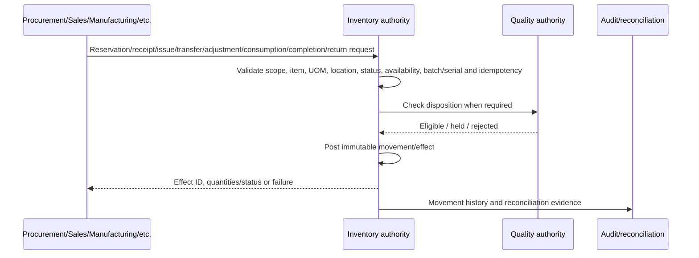

Transactions request reservations, receipts, issues, transfers, adjustments, consumption, production completion/output, returns, batch/serial movement, stock-status changes and reversals. Inventory owns validation and immutable movement/on-hand truth. A requesting transaction never edits stock balance, location, batch/serial custody or status directly.

Requests carry exact source transaction/line/version, source/target location/status, quantity/UOM/conversion, batch/serial, posting/effective date, reason and idempotency. Reversal references original movement and follows eligibility/current-state rules. Current warehouse/batch/serial/stock-status masters are foundations; no Inventory ledger/movement runtime exists.

# Chapter 25 — Finance Effect Boundary

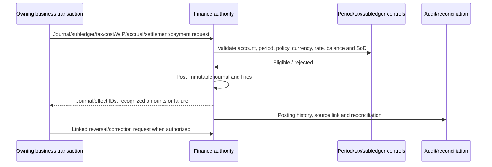

Finance owns journal requests/results, journals/lines, subledger, tax/cost/WIP/accrual/settlement/payment effects, period control, financial reversal/correction and reconciliation. Transactions provide authoritative business facts and request accounting effects; they never write journal lines. Journals balance and preserve exact source, posting/accounting date, currency/rate, account/distribution and effect identities.

The current `JournalEntry`/`JournalLine` schema is a preserved data shape without a posting service, period control, balance validation, workflow, reversal or audit runtime. It must not be described as operational Finance.

# Chapter 26 — Quality and Maintenance Boundaries

Quality inspection requests, holds/releases, nonconformance and deviations are Quality-owned transactions/effects. Other transactions consume current disposition and may request inspection, but cannot release a hold or overwrite results. Inventory enforces disposition on availability/movement; Production/Sales/Procurement retain their own status dimensions.

Maintenance requests/work orders, asset availability, downtime and calibration state are Maintenance authority. Production/planning/service transactions consume that state and may create a request, but cannot override restriction or return-to-service. EOR/type enum registrations for inspection/maintenance work do not implement these runtimes.

# Chapter 27 — Transaction Consistency Architecture

```mermaid
flowchart TB
  CMD["Command"] --> AGG["Owning aggregate ACID boundary"]
  AGG --> STRONG["Strong consistency: identity, scope, version, invariants, idempotency, local history"]
  STRONG --> OUT["Transactional outbox record — planned"]
  OUT --> EVT["Versioned event / cross-domain request"]
  EVT --> DOM["Other domain aggregate validates and commits its effect"]
  DOM --> RESP["Effect result event"]
  RESP --> REC["Owning transaction reconciliation"]
  FAIL["Partial failure / timeout"] --> RETRY["Idempotent retry"]
  FAIL --> SAGA["Explicit saga/compensation where business-approved"]
  RETRY --> DOM
  SAGA --> REC
```

Strong consistency is required for: creating/updating one aggregate with expected version; claiming idempotency; generating/assigning a unique number under its policy; changing lifecycle plus local history; accepting relationship/allocation coverage; posting one domain effect plus its history/outbox; and preventing duplicate payment/completion/posting. Related records inside one domain transaction use ACID.

Cross-domain business flows use eventual consistency with explicit request/result states, outbox/inbox identities, retries and reconciliation. Sagas coordinate, but compensation invokes approved domain reversal/correction—not direct rollback. Partial failure remains visible. No production outbox, queue, event bus or saga runtime exists and no technology is selected.

# Chapter 28 — Idempotency Architecture

```mermaid
flowchart TD
  REQ["Retryable command + idempotency key"] --> SCOPE["Bind tenant, actor/client, command type and target"]
  SCOPE --> LOOK["Lookup idempotency record"]
  LOOK -->|none| CLAIM["Atomically claim key + request hash"]
  CLAIM --> EXEC["Execute command/effect"]
  EXEC --> SAVE["Store stable result/effect IDs"]
  SAVE --> RESP["Return response"]
  LOOK -->|same hash completed| REPLAY["Replay stored response"]
  LOOK -->|same hash in progress| WAIT["Return in-progress/retry contract"]
  LOOK -->|different hash| CON["409 conflict; audit misuse"]
  EXEC -->|recoverable failure| FAIL["Recorded failure/retry ownership"]
```

An idempotency record binds key, tenant, client/user/service, command/action, target, normalized request hash, state, result/effect identities, response, created/expiry time and audit trace. Expiry never permits duplication of permanently unique effects; posting/payment/completion keys may be retained with transaction history. A reused key with different payload is conflict.

Imports use source/batch/row identity; integrations use message ID; postings/completions/payments use domain operation identity. Retry ownership defines which component may resume. Current transaction link upsert and seed idempotency are narrow examples only; there is no universal command idempotency runtime.

# Chapter 29 — Concurrency Architecture

```mermaid
sequenceDiagram
  participant C1 as Editor/command A
  participant C2 as Editor/command B
  participant D as Domain aggregate
  C1->>D: Read version 7
  C2->>D: Read version 7
  C1->>D: Update with expectedVersion 7
  D-->>C1: Commit version 8
  C2->>D: Update with expectedVersion 7
  D-->>C2: 409 conflict + current version metadata
  C2->>C2: Refresh, compare and intentionally retry
```

Optimistic concurrency is default for mutable headers, lines, schedules and configuration: command carries expected version; update atomically matches it; conflict never overwrites silently. Pessimistic row/advisory locks are exceptions for short scarce-resource operations such as number issuance, reservation allocation or posting claim when optimistic retry cannot protect the invariant.

Number series already uses a serializable transaction/atomic increment. Target reservation/posting concurrency defines lock order, bounded transaction time, deadlock detection/retry and unique constraints. Long-running validation/import/posting jobs operate through checkpoints and never hold database locks while waiting on people/external systems.

# Chapter 30 — Correction, Cancellation, and Reversal Architecture

```mermaid
sequenceDiagram
  participant U as Authorized user/domain
  participant T as Original transaction
  participant E as Domain effect authority
  participant H as History/audit
  U->>T: Request cancel/correct/reverse with reason and scope
  T->>T: Validate lifecycle, period, downstream coverage, approval and SoD
  alt mutable draft edit
    T->>H: Append version/field history
  else unposted cancellation/void
    T->>H: Append cancellation status; preserve record
  else posted reversal
    T->>E: Request linked opposite/neutralizing effect
    E-->>T: Reversal effect ID
    T->>H: Link original and reversal
  else correction/replacement
    T->>E: Post approved delta/reversal as required
    T->>H: Link correction, supersession or replacement
  end
```

Edit changes a mutable draft version. Correction appends a delta/replacement after acceptance. Cancellation stops eligible future processing without deleting. Reversal creates linked opposite/neutralizing domain effects. Void is a narrowly governed invalidation before effect or a domain-specific legal/accounting construct. Supersession replaces future authority while retaining prior history. Reopening enables a controlled next action but never edits posted effects.

Credit/debit notes, returns, stock reversals and journal reversals are typed domain transactions. They preserve source coverage, dates/rates/period policy, approval and effect identities. Cancellation after posting is prohibited unless realized through approved reversal/correction. Original records are never deleted.

# Chapter 31 — Audit and Historical Truth

```mermaid
flowchart LR
  TX["Transaction aggregate"] --> FH["Field/version history"]
  TX --> SH["Status/action history"]
  TX --> AH["Workflow/approval history"]
  TX --> PH["Posting/effect history"]
  TX --> RH["Relationship/coverage history"]
  TX --> IH["Integration/import history"]
  TX --> CH["Correction/reversal history"]
  FH --> AUD["Audit event: actor, reason, before/after, trace ID, Digital DNA where applicable"]
  SH --> AUD
  AH --> AUD
  PH --> AUD
  RH --> AUD
  IH --> AUD
  CH --> AUD
  AUD --> RET["Retention, access, export and evidence controls"]
```

Domain history stores business facts: immutable versions/effects, status transitions, approvals, postings, relationships, integrations and corrections. Audit records who/what/why/where/when, before/after where safe, trace/correlation and request source. Audit does not replace those typed histories or prove transaction correctness by itself.

Every action has actor/service/delegation, reason where required, exact transaction/version, source/evidence and result. Sensitive snapshots are minimized/redacted. Retention, legal hold and access/export are type/domain/classification controlled. Digital DNA can be recorded after approved transaction coverage. The current AuditService is a useful foundation but is not invoked by the generic transaction service and lacks universal database-level immutability evidence.

# Chapter 32 — Notes, Attachments, and Evidence

A note has identity, transaction/line target, author, timestamp, internal/external classification, visibility/ACL, version and retention. Supporting evidence includes attachment, certificate, image, signature and generated output with file identity, content hash, type/size, owner/source, version, classification, malware-scan state, encryption/storage reference, ACL, retention/legal hold and redaction state.

Files are never trusted based only on extension. Access to a transaction does not automatically grant every attachment. Replacement creates a new version; deletion follows retention/legal hold and preserves evidence metadata. Generated output is labeled and linked to exact template/data versions. Electronic signature and AI extraction are future. FCSB-010 owns full universal document architecture; this volume defines only transaction linkage/evidence requirements. No attachment/signature service exists.

# Chapter 33 — Event and Integration Architecture

```mermaid
flowchart LR
  COMMIT["Committed transaction change"] --> OUT["Transactional outbox record — planned"]
  OUT --> EVT["Versioned fact event: Created / Submitted / Approved / Released / Posted / PartiallyFulfilled / Completed / Reversed / Corrected / Cancelled / Closed / Failed"]
  EVT --> DEL["Delivery with message identity, ordering key and retry"]
  DEL --> CON["Authorized consumer inbox/deduplication"]
  CON --> ACT["Consumer domain validates and commits"]
  ACT --> ACK["Result/effect event"]
  ACK --> REC["Source reconciliation"]
  REPLAY["Controlled replay from retained event/outbox"] --> CON
```

Each event includes event ID/type/schema version, tenant/company/scope, occurred/recorded time, actor/service, correlation/causation, source transaction/type/version, changed status, relationship/effect IDs, classification and trace. Payload is minimal and typed; consumers retrieve authorized detail as needed. Ordering is defined per aggregate/effect key, not assumed globally.

Delivery retry and replay are idempotent. Failed/dead-letter states are observable/reconcilable. Events are committed facts, while cross-domain requests are commands with their own schemas/results. No production outbox, broker, queue or event bus exists and no technology is selected.

# Chapter 34 — Import and Migration Architecture

```mermaid
flowchart LR
  SRC["Source system transaction + source ID/date/status"] --> BATCH["Controlled import batch and mapping version"]
  BATCH --> TRIAL["Trial import / dry run"]
  TRIAL --> VAL["Type, scope, master, date, amount/UOM, relationship and duplicate validation"]
  VAL --> CLASS["Open / historical / opening-balance treatment"]
  CLASS --> LOAD["Typed domain command or historical import path"]
  LOAD --> LINK["Source lineage, attachment links and legacy status mapping"]
  LINK --> REC["Totals/counts/effects reconciliation"]
  REC --> SIGN["Domain/Data/Finance/Inventory sign-off as applicable"]
  VAL --> Q["Quarantine and correction"]
  CUT["Cutover, delta freeze and rollback/forward plan"] --> LOAD
```

Migration records source system/transaction ID, import batch/row, mapping/version, source dates/status, validation, actor and result. Trial import uses the same typed domain validation without effects. Open transactions enter current lifecycle under approved mapping; historical transactions use a controlled non-operational history path; opening balances require Finance/Inventory-specific authority and reconciliation, never generic posting.

Duplicate prevention binds source identity and business matching. Attachment linkage preserves source metadata. Cutover defines freeze/delta, counts/totals/relationships, exception ownership, rollback/forward strategy and sign-off. Current master import metadata does not implement transaction migration, binary attachments, opening balances or operational posting.

# Chapter 35 — Reporting and Analytical Projection

```mermaid
flowchart LR
  TX["Authoritative typed transactions and effects"] --> ORM["Operational read model"]
  TX --> HIST["Status/relationship/posting histories"]
  ORM --> VIEW["Governed reporting views"]
  HIST --> VIEW
  VIEW --> SNAP["As-of snapshot"]
  VIEW --> FACT["Future fact tables and dimensions"]
  VIEW --> KPI["Fulfilment, posting and reconciliation metrics"]
  KPI --> DRILL["Authorized drill-down to source/effect IDs"]
  FACT --> AI["Future cited AI narrative"]
  AI -. "non-authoritative" .-> DRILL
```

Operational read models/reporting views project authoritative headers, lines, schedules, effects and histories without becoming write authority. Snapshots support reproducible as-of reports. Future facts/dimensions preserve source IDs, transaction/effect dates, status history and reconciliation state. Metrics define numerator/denominator, currency/UOM and temporal grain.

Drill-down respects scope/permissions and reaches source/effect evidence. AI narrative is visibly generated, citation-backed and non-authoritative. Current report definitions/preview over generic documents are scaffolds; no governed transaction semantic/reporting projection is implemented.

# Chapter 36 — Extension and Customization Architecture

```mermaid
flowchart TB
  EXT["Proposed custom field/line/type/status/action/validation/workflow/output/event/integration/plugin"] --> NS["Customer/domain namespace"]
  NS --> VAL["Schema, compatibility, authority, isolation and security validation"]
  VAL --> TEST["Domain, migration, performance and rollback tests"]
  TEST --> APP["Domain/Architecture/Security/Data approval"]
  APP --> PUB["Versioned published package"]
  PUB --> RUN["Constrained extension points"]
  CORE["Core IDs, invariants, scope, typed amounts/quantities, immutable effects"] -. "cannot override" .-> RUN
  RUN --> MON["Usage, compatibility and rollback evidence"]
```

Extensions may add governed custom fields/line fields, transaction types, statuses/actions, validations, workflows, outputs, events, integrations or plugins through versioned published packages. Core identifiers, ownership, tenant isolation, permissions, date/money/UOM semantics, domain invariants, posting/effect authority, immutable history and audit cannot be disabled or overridden. Authoritative amount/quantity/status/effect data cannot exist only in JSON.

Extension status/action must map to compatible core semantics; custom posting delegates to approved domain APIs. Packages declare dependencies/compatibility, data migration, tests, security, approval, rollout and rollback. Customer-specific forks require product/architecture governance and cannot silently bypass upgrade/control contracts.

# Chapter 37 — AI-Generated Transaction Architecture

```mermaid
sequenceDiagram
  participant AI as Governed AI
  participant G as Tool/action gateway
  participant U as User/domain owner
  participant D as Owning domain API
  participant E as Inventory/Finance/Quality/Maintenance authorities
  AI->>G: Labeled draft proposal + proposal ID + citations/confidence
  G->>G: Permission, scope, SoD, schema and risk checks
  G->>U: Exact draft, evidence, impact and expiry
  U-->>G: Reject / modify / confirm
  G->>D: Create ordinary draft via typed command + idempotency
  D-->>G: Draft transaction ID/version and validation result
  Note over D,E: Ordinary workflow, approval, release and posting controls continue
  D->>E: Domain effect request only after authorized commands
  E-->>D: Effect result
```

An AI proposal has proposal identity, AI label, sources/citations, confidence/limitations, requesting identity/purpose, transaction type, exact proposed fields/lines and policy/model versions. The gateway validates permission, scope, schema, SoD and risk; a user confirms the exact payload. The domain API creates a normal draft with idempotency/audit. Modification requires revalidation.

AI cannot create a posted authoritative transaction, approve its draft, post Finance, move Inventory, release Quality or override Maintenance. After acceptance, the draft has no AI privilege and follows ordinary validation/workflow/approval/effect controls. Correction/reversal remains domain-owned. When AI is unavailable, normal manual transaction operation continues. No AI transaction-generation runtime exists.

# Chapter 38 — Transaction Security and Threat Model

```mermaid
flowchart LR
  A["External/insider/integration/AI adversary"] --> IDOR["IDOR, cross-tenant access, privilege escalation"]
  A --> INPUT["Mass assignment; amount/UOM/currency/tax/status tampering"]
  A --> REPLAY["Duplicate/replay/race/deadlock abuse"]
  A --> BYPASS["Approval/posting/reversal/cancellation bypass"]
  A --> FILE["Export leakage / attachment malware"]
  A --> SPOOF["Integration spoofing / AI-generated or insider fraud"]
  GUARD["Typed DTOs, scoped permission/SoD, version/idempotency, domain validation, immutable effects, audit and reconciliation"] -. mitigates .-> IDOR
  GUARD -. mitigates .-> INPUT
  GUARD -. mitigates .-> REPLAY
  GUARD -. mitigates .-> BYPASS
  SEC["File controls, signed/versioned contracts, monitoring and incident response"] -. mitigates .-> FILE
  SEC -. mitigates .-> SPOOF
```

Threats include IDOR, cross-tenant access, privilege escalation, mass assignment, record/effect tampering, duplicates/replay, race conditions, status/amount/UOM/currency/tax manipulation, approval/posting bypass, reversal abuse, export leakage, malware, integration spoofing, AI-generated fraud, insider fraud and audit tampering.

Controls combine current-state identity refresh with target object/action/organization scope, typed allowlisted DTOs, source/reference validation, expected versions, idempotency, unique constraints/lock policy, SoD and evidence-bound approval, domain-owned posting, immutable history/effects, restricted export/file scanning, signed/versioned integration schemas, audit/reconciliation, monitoring and incident response. The generic transaction/link API lacks many of these controls and must not be production authority.

# Chapter 39 — Transaction Capability and Risk Model

## Transaction capability matrix

“Registered/scaffold only” means a code or generic schema shape exists without typed operational behavior. Priorities are architectural sequence, not delivery dates.

| Capability ID | Capability | Owner domain | Current status | Target maturity | Dependencies | Authority | Priority |
|---|---|---|---|---|---|---|---|
| UTX-CAP-001 | Transaction type registry | Architecture/Data Governance | Enum and EOR metadata only | Versioned governed registry | EOR reconciliation, schemas, permissions | Registry metadata; domains own behavior | P0 |
| UTX-CAP-002 | Universal header | Architecture | Generic scaffold only | Shared typed contract with domain headers | Identity, scope, dates, status dimensions | Owning domain | P0 |
| UTX-CAP-003 | Universal lines | Architecture | Not implemented | Typed common/domain line contracts | Header, item/service/account masters | Owning domain | P0 |
| UTX-CAP-004 | Schedule lines | Sales/Procurement/Planning | Not implemented | First-class dated quantity commitments | Lines, dates, UOM | Owning domain | P1 |
| UTX-CAP-005 | Allocations | Domain Owner | Not implemented | Typed coverage-aware allocation aggregates | Relationships, quantity/amount controls | Allocation-owning domain | P1 |
| UTX-CAP-006 | Distributions | Finance/Domain Owner | Not implemented | Typed accounting/cost/project distributions | Cost/profit centers, Finance contracts | Finance for accounting; domain otherwise | P1 |
| UTX-CAP-007 | Source references | Data Governance | Generic payload/link partial | Typed header/line source identity and lineage | Identity, registry, migration | Owning domain | P0 |
| UTX-CAP-008 | Parent-child relationships | Data Governance | Generic `TransactionLink` scaffold | Typed directional/coverage-aware relations | Relationship registry, scope, permissions | Source/target domains | P0 |
| UTX-CAP-009 | Transaction numbering | Platform | Implemented number-series foundation | Type-integrated scoped issuance | Number-series policy, fiscal context | Platform allocation; domain assignment | P0 |
| UTX-CAP-010 | Digital DNA | Data Governance | Implemented for selected masters only | Approved transaction semantic identity | Coverage/immutability decision | Data Governance / owning domain | P1 |
| UTX-CAP-011 | Draft lifecycle | Domain Owner | Free status string only | Versioned mutable aggregate lifecycle | Header/lines, permissions, concurrency | Owning domain | P0 |
| UTX-CAP-012 | Approval | Domain Owner | Schema/definition foundations only | Instance, SoD, evidence and version binding | FCSB-011, roles, workflow | Domain approver | P0 |
| UTX-CAP-013 | Release | Domain Owner | Not implemented | Guarded domain transition | Approval, availability/policy checks | Owning domain | P0 |
| UTX-CAP-014 | Posting | Finance/Inventory/Domain Owner | Not implemented | Orchestrated typed domain-effect requests | Effect APIs, idempotency, periods | Effect-owning domains | P0 |
| UTX-CAP-015 | Partial fulfilment | Sales/Procurement/Inventory | Not implemented | Coverage and remaining-balance history | Schedules, relationships, effects | Owning fulfilment domain | P0 |
| UTX-CAP-016 | Completion | Domain Owner | Registered codes only | Typed guarded completion | Fulfilment/effect reconciliation | Owning domain | P0 |
| UTX-CAP-017 | Technical close | Domain Owner | Not implemented | Reconciled no-further-business-action close | Completion/exceptions | Owning domain | P1 |
| UTX-CAP-018 | Financial close | Finance | Not implemented | Finance-owned settlement/period close | Finance runtime, reconciliation | Finance | P1 |
| UTX-CAP-019 | Cancellation | Domain Owner | Permission code/free status only | Effect-aware preserved cancellation | Lifecycle, relationships, approval | Owning domain | P0 |
| UTX-CAP-020 | Correction | Domain Owner | Not implemented | Linked delta/replacement transaction | History, effect APIs, approval | Owning/effect domains | P0 |
| UTX-CAP-021 | Reversal | Finance/Inventory/Domain Owner | Not implemented | Linked immutable opposite/neutralizing effects | Original effects, periods/status, SoD | Effect-owning domains | P0 |
| UTX-CAP-022 | Idempotency | Platform/Domain Owner | Link upsert and seed patterns only | Command/effect/import/message framework | Identity store, request hashes | Command/effect-owning domain | P0 |
| UTX-CAP-023 | Concurrency | Platform/Domain Owner | Number-series concurrency only | Version tokens plus narrow locks | Aggregate versions, lock policy | Owning domain | P0 |
| UTX-CAP-024 | Audit | Security/Domain Owner | Audit service foundation; transaction unused | Universal action/effect trace plus domain histories | Audit integration, history models | Domain history + Security audit | P0 |
| UTX-CAP-025 | Attachments | Document Management | Not implemented | Classified versioned evidence links | FCSB-010, storage, malware scan | Document/evidence owner | P2 |
| UTX-CAP-026 | Notes | Owning domain | Not implemented | ACL/classified versioned notes | Identity, retention, document contract | Owning domain | P1 |
| UTX-CAP-027 | Events | Integration | Not implemented | Versioned committed fact schemas | FCSB-004, outbox, identity | Event-producing domain | P1 |
| UTX-CAP-028 | Outbox | Platform/Integration | Not implemented | Transactional per-domain outbox/inbox | Event contracts, workers, operations | Event-producing domain | P1 |
| UTX-CAP-029 | Import | Data Migration/Domain Owner | Master import metadata only | Typed trial/operational transaction import | Type schemas, duplicate controls | Owning domain | P1 |
| UTX-CAP-030 | Migration | Data Migration | Not implemented | Historical/open/opening-balance controlled migration | Mapping, reconciliation, cutover | Domain/Data/Finance/Inventory | P1 |
| UTX-CAP-031 | Reporting projection | Reporting | Generic report preview scaffold | Reconciled non-authoritative read models | Typed transactions/effects/history | Source domains | P1 |
| UTX-CAP-032 | AI draft | AI Governance/Domain Owner | Not implemented | Labeled cited proposal to ordinary draft | FCSB-008, tool gateway, schemas | Owning domain after acceptance | P3 |
| UTX-CAP-033 | Purchase requisition | Procurement | EOR/enum registration only | Typed request lifecycle | Supplier/item/org, workflow | Procurement | P1 |
| UTX-CAP-034 | Purchase order | Procurement | EOR/enum registration only | Typed commercial/schedule aggregate | Requisition/RFQ, supplier, pricing | Procurement | P1 |
| UTX-CAP-035 | Goods receipt | Procurement | EOR/enum registration only | Typed receipt requesting Inventory/Quality effects | PO, Inventory, Quality | Procurement; Inventory effects | P1 |
| UTX-CAP-036 | Supplier invoice | Finance/Procurement | EOR/enum registration only | Matched AP invoice/subledger request | PO/receipt, tax, Finance | Finance | P1 |
| UTX-CAP-037 | Sales quotation | Sales | EOR/enum registration only | Versioned priced offer | Customer, price/tax, workflow | Sales | P1 |
| UTX-CAP-038 | Sales order | Sales | EOR/enum registration only | Typed schedule/commitment aggregate | Quote, customer/credit, availability | Sales | P1 |
| UTX-CAP-039 | Delivery | Sales/Warehouse | EOR/enum registration only | Typed fulfilment requesting Inventory issue | Sales order, Inventory, Quality | Sales; Inventory effects | P1 |
| UTX-CAP-040 | Customer invoice | Finance/Sales | EOR/enum registration only | AR invoice/subledger request | Delivery/order, tax, Finance | Finance | P1 |
| UTX-CAP-041 | Inventory transfer | Inventory | EOR registration only | Immutable source/target movement | Inventory ledger, locations, tracking | Inventory | P1 |
| UTX-CAP-042 | Inventory adjustment | Inventory | EOR registration only | Approved reasoned adjustment movement | Count/evidence, valuation, SoD | Inventory; Finance valuation | P1 |
| UTX-CAP-043 | Production order | Manufacturing | EOR work-order registration only | Snapshot-based production aggregate | FCSB-007/018, BOM/routing/planning | Manufacturing | P2 |
| UTX-CAP-044 | Material issue | Inventory/Manufacturing | EOR/enum registration only | Production-linked Inventory issue | Production order, stock ledger | Inventory effects; Production purpose | P2 |
| UTX-CAP-045 | Production completion | Manufacturing | EOR production-entry registration only | Partial output confirmation/effect request | Production order, Quality, Inventory | Manufacturing; Inventory receipt | P2 |
| UTX-CAP-046 | Quality inspection | Quality | EOR/enum registration only | Plan/result/disposition transaction | Quality specs, samples, workflow | Quality | P2 |
| UTX-CAP-047 | Maintenance work order | Maintenance | EOR/enum registration only | Asset/work/availability aggregate | Asset, calendar, spares, labor | Maintenance | P2 |
| UTX-CAP-048 | Journal | Finance | Legacy schema only | Balanced period-controlled immutable journal | Chart, periods, currency, posting | Finance | P1 |
| UTX-CAP-049 | Payment | Finance | EOR/enum registration only | Authorized allocation/settlement/bank effect | AP/AR, treasury, SoD, Finance | Finance | P2 |

## Transaction risk register

Residual-risk direction describes the intended movement after target mitigation, not implemented control effectiveness.

| Risk ID | Transaction area | Risk | Current condition | Impact | Target mitigation | Owner | Residual-risk direction |
|---|---|---|---|---|---|---|---|
| UTX-RSK-001 | Data model | Generic JSON misuse | Core scaffold accepts open payload | Hidden/unvalidated authoritative facts | Typed headers/lines/effects; JSON only governed non-authoritative extension | Architecture | Down |
| UTX-RSK-002 | Identity | Duplicate transaction | Company/document number unique only | Duplicate obligation/fulfilment | UUID/source identity, scoped numbering, idempotency and duplicate policy | Domain Owner | Down |
| UTX-RSK-003 | Posting | Duplicate posting | No posting/idempotency runtime | Duplicate stock/journal effects | Effect operation ID, atomic claim, uniqueness and response replay | Finance/Inventory | Down |
| UTX-RSK-004 | Payment | Duplicate payment | Payment code only | Financial loss/fraud | Payment idempotency, bank/reference uniqueness, SoD and reconciliation | Finance | Down |
| UTX-RSK-005 | Security | Cross-tenant transaction access | Document has company only; JWT-only controller | Confidentiality/integrity breach | Explicit tenant scope, object/organization permission and IDOR tests | Security | Down |
| UTX-RSK-006 | Scope | Wrong company or plant | Generic API derives company; plant absent | Misstated ownership/effects | Typed mandatory scope and relationship/effect compatibility validation | Domain Owner | Down |
| UTX-RSK-007 | Dates | Wrong transaction date | Only created/updated dates modeled | Wrong period/tax/commitment | Distinct date contract, source/effective/period validation and reasoned override | Domain Owner | Down |
| UTX-RSK-008 | Finance | Closed-period posting | No period runtime | Financial misstatement | Finance-owned period check at posting and controlled adjustment period | Finance | Down |
| UTX-RSK-009 | Currency | Currency-rate error | Currency string/amount only | Wrong valuation/margin/ledger | Exact rate type/date/source/version, precision and Finance validation | Finance | Down |
| UTX-RSK-010 | Quantity | UOM error | UOM masters exist; transaction use untyped | Wrong stock/cost/fulfilment | Effective conversion snapshot, dimension and tolerance validation | Inventory/Data Steward | Down |
| UTX-RSK-011 | Quantity | Quantity precision error | No typed transaction quantity | Accumulated stock/amount mismatch | UOM-specific precision/rounding and base reconciliation | Inventory | Down |
| UTX-RSK-012 | Commercial | Price manipulation | Amount/payload freely supplied | Revenue/cost leakage | Price-source/version, override permission/reason/threshold and audit | Sales/Procurement | Down |
| UTX-RSK-013 | Tax | Tax error | Tax masters only | Misstatement/noncompliance | Typed tax components, approved determination/posting and review | Finance | Down |
| UTX-RSK-014 | Approval | Approval bypass | Generic transaction route lacks permission/approval enforcement | Unauthorized commitment/effect | Version-bound workflow/SoD and posting readiness checks | Domain Owner | Down |
| UTX-RSK-015 | Segregation | SoD conflict | Role foundations; no transaction SoD engine | Fraud/self-approval | Action-specific conflict rules, dual control and access review | Security/Internal Audit | Down |
| UTX-RSK-016 | Lifecycle | Status manipulation | Free string status | Bypassed validation/effects | Controlled multidimensional transitions through commands only | Domain Owner | Down |
| UTX-RSK-017 | Fulfilment | Partial-fulfilment mismatch | No lines/schedules/coverage | Over/under delivery/billing | Typed coverage relationships and remaining-balance reconciliation | Sales/Procurement | Down |
| UTX-RSK-018 | Allocation | Incorrect allocation | No allocation model | Wrong payment/cost/stock/project attribution | Typed allocation types, coverage totals and approval | Domain Owner | Down |
| UTX-RSK-019 | Reversal | Reversal abuse | No reversal framework | Concealed fraud/history distortion | Original-effect eligibility, SoD, reason, linked immutable reversal | Finance/Inventory | Down |
| UTX-RSK-020 | Cancellation | Cancellation after posting | Free status permits unsafe interpretation | Orphaned stock/journal effects | Prohibit direct cancellation; require linked domain reversal/correction | Domain Owner | Down |
| UTX-RSK-021 | Relationships | Lost source relationship | Free links/JSON references | Broken trace and matching | Typed mandatory source/line links, coverage and immutable history | Data Governance | Down |
| UTX-RSK-022 | Audit | Missing audit | Transaction service does not call AuditService | Untraceable changes/fraud | Domain histories plus universal audit integration and completeness tests | Internal Audit | Down |
| UTX-RSK-023 | Concurrency | Concurrent edit | No version token | Lost update/stale approval | Expected-version optimistic concurrency and approval invalidation | Engineering | Down |
| UTX-RSK-024 | Database | Deadlock | Only number-series concurrency defined | Failed/stalled operations | Lock order, short transactions, detection/retry and metrics | Operations | Down |
| UTX-RSK-025 | Posting | Long-running posting | No job/orchestration framework | Locks, timeout and partial effects | Checkpointed operation, bounded locks, status/retry/reconciliation | Operations | Down |
| UTX-RSK-026 | Integration | Integration replay | No event/inbox runtime | Duplicate command/effect | Message identity, inbox deduplication, idempotency and replay controls | Integration | Down |
| UTX-RSK-027 | Migration | Import duplication | Master import only | Duplicate open/history/effects | Source/batch/row identities, trial import and reconciled sign-off | Data Steward | Down |
| UTX-RSK-028 | Evidence | Attachment malware | No attachment service | Compromise/data loss | Quarantine, scan, type/content controls and isolated storage | Security | Down |
| UTX-RSK-029 | AI | AI-generated fraud | No AI transaction runtime | Deceptive/unauthorized transaction | Visible draft label, citations, human confirmation, SoD and domain controls | AI Governance | Down |
| UTX-RSK-030 | Extension | Unauthorized extension | Open JSON/customization scaffolds | Core-control bypass | Versioned packages, allowlisted points, approval/tests/rollback | Architecture | Down |
| UTX-RSK-031 | Reporting | Reporting mismatch | Generic preview over document scaffold | Wrong operational/management view | Reconciled typed projections, as-of rules and drill-down | Reporting | Down |
| UTX-RSK-032 | Reconciliation | Inventory/Finance reconciliation mismatch | Neither effect runtime implemented | Quantity/value divergence | Shared source/effect IDs, explicit statuses and exception reconciliation | Finance/Inventory | Down |
| UTX-RSK-033 | Domain authority | Quality or Maintenance override | Registrations only; generic payload could imply state | Unsafe/nonconforming operation | Read-only authority consumption and domain API enforcement | Quality/Maintenance | Down |

## Transaction responsibility matrix

R = Responsible, A = Accountable, C = Consulted, I = Informed. `A/R` combines roles only where an approved operating model permits it.

| Activity | Requester | Business Owner | Domain Processor | Approver | Finance | Inventory | Quality | Maintenance | Data Steward | Security | Integration | Operations | Internal Audit | Management |
|---|---|---|---|---|---|---|---|---|---|---|---|---|---|---|
| Create draft | R | A | R | I | I | I | I | I | C | I | I | I | I | I |
| Validate | C | A | R | C | C | C | C | C | C | C | I | I | I | I |
| Submit | R | A | R | I | I | I | I | I | I | I | I | I | I | I |
| Approve | I | C | C | A/R | C | C | C | C | I | C | I | I | I | I |
| Release | I | A | R | C | I | C | C | C | I | I | I | I | I | I |
| Allocate | I | A | R | C | C | C | I | I | C | I | I | I | I | I |
| Reserve | I | C | C | I | I | A/R | C | I | I | I | I | I | I | I |
| Post Inventory effect | I | I | C | I | I | A/R | C | I | I | I | I | C | I | I |
| Post Finance effect | I | I | C | I | A/R | C | I | I | I | I | I | C | I | I |
| Complete | I | A | R | C | I | C | C | C | I | I | I | I | I | I |
| Close | I | R | R | C | A | C | C | C | I | I | I | I | I | I |
| Cancel | R | A | R | C | C | C | C | C | I | I | I | I | I | I |
| Reverse | I | C | R | A | A/R | A/R | C | C | I | C | I | I | C | I |
| Correct | R | A | R | C | C | C | C | C | C | I | I | I | I | I |
| Import | I | A | R | C | C | C | C | C | R | C | R | C | I | I |
| Reconcile | I | A | R | I | R | R | C | C | C | I | C | I | C | I |
| Configure transaction type | I | R | C | C | C | C | C | C | R | C | C | I | I | A |
| Approve extension | I | R | C | C | C | C | C | C | C | R | C | C | C | A |
| Review audit | I | C | I | I | C | C | C | C | I | C | I | I | A/R | I |
| Resolve incident | I | C | R | I | C | C | C | C | C | A | R | R | C | I |

## Transaction type examples

These are target specializations, not claims that the named runtimes exist. “Registration only” refers to enum/EOR metadata where present.

| Transaction type | Owning domain | Header | Lines | Key relationships | Main statuses | Posting effects | Reversal/correction | Current status |
|---|---|---|---|---|---|---|---|---|
| Purchase Requisition | Procurement | Requester, need date, org/project, priority | Item/service, quantity/UOM, estimated amount | Originates demand; converts to RFQ/PO | Draft, Submitted, Approved, Rejected, Converted, Closed | None; planning/commitment only | Cancel remaining; correct before conversion | Registration only |
| Request for Quotation | Procurement | Suppliers, response window, terms | Requested item/service/schedule | From requisition; to supplier quotations | Draft, Issued, PartiallyResponded, Closed, Cancelled | None | Cancel/extend; supersede issue | Registration only |
| Purchase Order | Procurement | Supplier, currency, terms, delivery scope | Item/service, price/tax, schedules | From requisition/quotation; received/invoiced against | Draft, Approved, Released, PartiallyFulfilled, Completed, Closed | Requests commitments; later receipt/Finance effects | Change/cancel remaining; return/credit for effects | Registration only |
| Goods Receipt | Procurement | Supplier, receiving site/date, PO | Received/accepted/rejected quantities, batch/serial | Receives against PO; source for invoice/inspection | Draft, Posted, QualityPending, Completed, Reversed | Inventory receipt; possible accrual request | Return/reversal linked to original movement | Registration only (`GRN` enum/EOR goods receipt) |
| Supplier Invoice | Finance | Supplier, invoice/date/due, currency/rate | Charges/tax/account/distribution, matched coverage | Bills against PO/receipt; paid by payment | Draft, Matched, Approved, Posted, PartiallyPaid, Paid | AP/subledger, tax and journal | Debit/credit note or Finance reversal | Registration only; no AP runtime |
| Supplier Payment | Finance | Payee, bank/payment method/date/currency | Invoice allocations, fees/withholding | Pays supplier invoices; bank settlement | Draft, Approved, Released, Settled, Reconciled, Reversed | Payment/subledger/journal/bank effect | Stop/void before settlement; linked reversal after | `PAYMENT` registration only |
| Sales Quotation | Sales | Customer, validity, currency, commercial terms | Item/service, price/tax, delivery options | From inquiry; converts to sales order | Draft, Submitted, Approved, Accepted, Rejected, Expired | None | Revise/supersede; no posted reversal | Registration only |
| Sales Order | Sales | Customer, credit, currency, delivery/billing scope | Item/service, price/tax, schedules | From quotation; fulfilled by delivery/invoice | Draft, Approved, Released, PartiallyFulfilled, Completed, Closed | Commitment; requests reservations as policy | Cancel remaining; return/credit downstream effects | Registration only |
| Delivery | Sales | Customer, ship-from/to, date/carrier | Shipped quantities, warehouse/bin, batch/serial | Fulfils order; source for customer invoice | Draft, Released, Shipped, Delivered, Completed, Reversed | Inventory issue; possible cost effect | Return/reverse Inventory movement and coverage | `DELIVERY_NOTE` registration only |
| Customer Invoice | Finance | Customer, invoice/due/date, currency/rate | Billed goods/services, tax/account/distribution | Bills order/delivery; paid by receipt | Draft, Approved, Posted, PartiallyPaid, Paid, Reversed | AR/subledger, tax and journal | Credit/debit note or Finance reversal | `SALES_INVOICE` registration only; no AR runtime |
| Customer Receipt | Finance | Customer/payer, bank/method/date/currency | Invoice allocations, deductions/fees | Pays customer invoices; bank reconciliation | Draft, Approved, Settled, Reconciled, Reversed | Receipt/subledger/journal/bank effect | Void before settlement; linked reversal after | `RECEIPT` registration only |
| Inventory Receipt | Inventory | Company/plant/warehouse/date/reason | Item, quantity/UOM, location/status, batch/serial | From purchase/production/return/import source | Draft, Validated, Posted, Reversed | Immutable Inventory movement/on-hand | Linked Inventory reversal | Not implemented; finished-goods/goods-receipt codes only |
| Inventory Issue | Inventory | Source warehouse/date/reason/recipient | Item, quantity/UOM, bin/status, batch/serial | To production/sales/maintenance/project source | Draft, Reserved, Posted, Reversed | Immutable Inventory issue | Linked return/reversal | Not implemented; material/spares issue registrations only |
| Inventory Transfer | Inventory | Source/target site/warehouse/date | Item, quantity/UOM, source/target bin/status, tracking | References request; may have in-transit receipt | Draft, Released, InTransit, Received, Posted, Reversed | Linked source/target Inventory movements | Reverse eligible movement or return transfer | EOR registration only |
| Inventory Adjustment | Inventory | Site/date/reason/count reference | Item/location/status/tracking quantity delta | Reconciles count/investigation | Draft, Approved, Posted, Reversed | Inventory movement and Finance valuation request | Linked opposite adjustment with reason | EOR registration only |
| Production Order | Manufacturing | Item/revision, plant, quantity, dates, source demand | Components, operations, outputs/co-products | Pegged to demand; uses BOM/routing; source for issues/completions | Draft, Planned, Released, InProcess, Completed, Closed | Requests reservations/issues/receipts/cost facts | Cancel unexecuted; reverse/correct effects separately | Work-order registration only |
| Material Issue | Inventory | Production order/operation, warehouse/date | Component quantity/UOM, bin/status, batch/serial | Issues against production order/operation | Draft, Reserved, Posted, Reversed | Inventory issue/consumption movement | Return/reverse linked movement | Registration only |
| Production Completion | Manufacturing | Order/operation, plant, report date | Good/scrap/rework/co-product quantities, tracking | Completes order/operation; generates receipts/quality request | Draft, Reported, QualityPending, Accepted, Posted, Corrected | Inventory receipt request and production/cost facts | Reverse/correct confirmation and domain effects | Production-entry registration only |
| Scrap | Manufacturing/Quality | Order/operation/site/reason | Material/output quantity/UOM/tracking/disposition | From production/quality event; may create recovery | Draft, Reported, Approved, Posted, Closed | Inventory scrap movement; cost fact | Correct/reverse with Quality/Inventory evidence | Not implemented |
| Rework | Quality/Manufacturing | Source NCR/output, route/order, owner | Operations/material/quantity and acceptance criteria | Corrects nonconforming output; preserves genealogy | Draft, Approved, Released, InProcess, Completed, Closed | Material/output movements and cost facts | Cancel unexecuted; correct/reverse effects | Not implemented |
| Quality Inspection | Quality | Plan/spec revision, source transaction/batch/serial | Sample/characteristic/result/unit/limits | Requested by receipt/production; leads to disposition | Draft, InProgress, Completed, Reviewed, Closed | Quality evidence; no stock movement itself | Correct result through controlled version | Registration only |
| Quality Disposition | Quality | Inspection/NCR, affected scope, reason | Accepted/held/rejected/rework/scrap quantities | Acts on inspection/material/output; informs Inventory | Draft, Approved, Released/Held/Rejected, Closed | Quality state; Inventory enforces status effect | Linked revised disposition with approval | Not implemented |
| Maintenance Request | Maintenance | Asset/site/requester/priority/symptom | Requested service/inspection and evidence | Generates maintenance work order | Draft, Submitted, Triaged, Approved, Converted, Closed | No direct stock/Finance effect | Cancel/supersede before conversion | Registration only |
| Maintenance Work Order | Maintenance | Asset/site/type/schedule/availability | Tasks, labor, spares, meter, findings | From request/plan; uses Inventory and costs | Draft, Planned, Released, InProcess, Completed, Closed | Spares issue request, downtime/availability and cost facts | Cancel unexecuted; correct work/effects separately | Registration only |
| Journal Entry | Finance | Company, posting date/period, source, memo | Account, debit/credit, currency, cost/profit/project | Generated by subledger/source transaction; reverses journal | Draft, Approved, Posted, Reversed | Authoritative GL journal | Linked reversal/correction journal | Legacy schema only; no posting runtime |
| Bank Transfer | Finance/Treasury | Source/target account, value date, currency/rate | Transfer amount, fees, bank references | Settles between accounts; reconciles bank statement | Draft, Approved, Released, Settled, Reconciled, Reversed | Treasury/bank and journal effects | Cancel pre-release; bank/Finance reversal after | Not implemented |
| Asset Acquisition | Finance/Asset Management | Asset/vendor/date/capitalization policy | Asset components, cost/tax/distributions | From PO/receipt/invoice; creates asset value | Draft, Approved, Capitalized, Posted, Closed | Asset subledger and journal | Credit/disposal/correction under asset policy | Not implemented |
| Project Time Entry | Project | Project/resource/period/approver | Date, hours/UOM, activity, cost/bill rates | Allocates to task; source for cost/billing | Draft, Submitted, Approved, Posted, Corrected | Project cost and possible billing/Finance request | Correct/reverse approved time with linked entry | Not implemented |
| Service Work Order | Service | Customer/site/equipment/SLA/schedule | Tasks, labor, parts, expenses, outcomes | From service request; parts issue; billing source | Draft, Scheduled, Released, InProcess, Completed, Closed | Inventory parts request, service/billing/cost facts | Cancel unexecuted; return/correct/bill adjustment | Not implemented |

## Current-versus-target maturity

**Implemented foundations:** tenant/company/branch/organization masters and scoped access services; EOR codes/fields/relationships/capability flags; number-series atomic issuance; Digital DNA for supported non-transaction identities; versioned published workflow definitions; audit/trace service; currency/exchange-rate, UOM, item, warehouse, party, batch/serial, cost/profit-center and master-governance foundations.

**Generic scaffold/registered metadata only:** `TransactionDocument`, `TransactionLink`, `TransactionKind`, approval rule/request/history schema, Journal models, transaction EOR codes, report/layout/customization JSON. These do not establish typed domain transactions, effects, posting, workflow instances, corrections or ledgers.

**Planned/future/conceptual:** all capability rows beyond the stated foundations, including typed operational families, Finance/Inventory/Quality/Maintenance authority runtimes, outbox/events, attachments/signatures, migrations, projections, universal idempotency/concurrency and AI draft tooling.

# Chapter 40 — Decisions, Approval, and Roadmap

## Universal transaction decision register

Decision status is restricted to **Implemented**, **Approved**, **Proposed**, **Open**, and **Deferred**. Approved is architecture direction for review, not software delivery.

| ID | Decision | Status | Consequence |
|---|---|---|---|
| UTX-ADR-001 | Every transaction has one authoritative owning domain. | Approved | Shared services cannot blur business authority. |
| UTX-ADR-002 | Universal structure does not replace domain invariants or typed aggregates. | Approved | Common contracts compose with specialization. |
| UTX-ADR-003 | Generic JSON is not authoritative for core amounts, quantities, statuses or effects. | Approved | Typed fields/value objects and schemas are mandatory. |
| UTX-ADR-004 | Transaction numbers are not primary keys. | Approved | Stable UUID identity is separate from scoped human references. |
| UTX-ADR-005 | Posted effects are immutable. | Approved | Updates/deletes are replaced by linked corrections/reversals. |
| UTX-ADR-006 | Corrections and reversals preserve original records. | Approved | Historical truth and source/effect linkage remain resolvable. |
| UTX-ADR-007 | Workflow approval and posting are separate. | Approved | Both bind exact versions and revalidate independently. |
| UTX-ADR-008 | Inventory owns stock effects. | Approved | Transactions request; Inventory validates/posts movements. |
| UTX-ADR-009 | Finance owns journal and ledger effects. | Approved | Transactions request; Finance validates/posts journals. |
| UTX-ADR-010 | Quality owns disposition. | Approved | Other domains consume but cannot overwrite hold/release. |
| UTX-ADR-011 | Maintenance owns asset availability. | Approved | Other domains consume but cannot override restrictions. |
| UTX-ADR-012 | Idempotency is mandatory for retryable commands. | Proposed | Key/hash/result identities prevent duplicate effects. |
| UTX-ADR-013 | Optimistic concurrency is default for mutable transactions. | Proposed | Expected-version conflict prevents lost updates. |
| UTX-ADR-014 | Accepted or posted transactions cannot be deleted. | Approved | Archive/retention never erases business/effect history. |
| UTX-ADR-015 | Cross-domain direct table writes are prohibited. | Approved | Typed domain APIs/events are required. |
| UTX-ADR-016 | Transaction relationships are typed, coverage-aware and auditable. | Proposed | Free links cannot be authoritative. |
| UTX-ADR-017 | Transaction, posting and effect identities are separate. | Approved | Independent retry/reconciliation/history are possible. |
| UTX-ADR-018 | Transaction dates have distinct governed meanings. | Approved | Document/business/posting/tax/effective dates cannot collapse. |
| UTX-ADR-019 | Currency and UOM precision, rate/conversion and rounding are controlled. | Approved | Results remain reproducible and reconcilable. |
| UTX-ADR-020 | External lineage is mandatory for imported transactions. | Approved | Source/batch/row/mapping prevent duplicate/lost provenance. |
| UTX-ADR-021 | Transaction events use versioned schemas. | Proposed | Consumers can validate compatibility and replay safely. |
| UTX-ADR-022 | Analytics/reporting projections are non-authoritative. | Approved | Drill-down/reconciliation return to source transactions/effects. |
| UTX-ADR-023 | Extensions cannot disable core controls. | Approved | IDs, scope, invariants, typed values and authority remain protected. |
| UTX-ADR-024 | AI produces labeled drafts/proposals only. | Approved | Acceptance creates an ordinary controlled draft. |
| UTX-ADR-025 | AI cannot autonomously post, approve, move stock, release Quality or override Maintenance. | Approved | Domain authority and accountable human controls remain intact. |
| UTX-ADR-026 | The current generic transaction scaffold is not the final Universal Transaction Framework. | Approved | It requires containment/migration or replacement, not endorsement as authority. |

## Open decisions

| ID | Decision needed | Status | Required evidence and approvers |
|---|---|---|---|
| UTX-OPEN-001 | Select first operational transaction family/type and pilot company. | Open | Business priority, controls, data and integration profile; Management and Domain Owner. |
| UTX-OPEN-002 | Define physical shared-versus-domain schema composition. | Open | Aggregate/query/migration/performance evidence; Architecture, Engineering, Data Governance. |
| UTX-OPEN-003 | Approve transaction Digital DNA coverage and format. | Open | Identity/immutability/migration analysis; Data Governance and domain owners. |
| UTX-OPEN-004 | Define canonical status/action vocabularies and extension constraints. | Open | Domain lifecycle comparison; Architecture and domain owners. |
| UTX-OPEN-005 | Define posting orchestration ownership and cross-domain failure policy. | Open | Inventory/Finance/API consistency/recovery scenarios; affected domain owners and Operations. |
| UTX-OPEN-006 | Define idempotency retention and conflict semantics by command/effect. | Open | Retry/duplicate/regulatory/volume analysis; Engineering, Security, domain owners. |
| UTX-OPEN-007 | Define approval/SoD thresholds and workflow-instance contract. | Open | Domain risk matrix and FCSB-011; Security, Internal Audit, domain owners. |
| UTX-OPEN-008 | Define event/outbox/inbox operational requirements and select technology later. | Deferred | FCSB-004 contracts, throughput/recovery evidence; Integration, Architecture, Operations. |
| UTX-OPEN-009 | Define attachment/evidence storage, signing and retention with FCSB-010. | Deferred | Classification/legal/volume/security needs; Document owner, Security, Privacy/Legal. |
| UTX-OPEN-010 | Define coexistence/migration for legacy `TransactionDocument`, links, approvals and journals. | Open | Data inventory, authoritative-use assessment and reconciliation plan; Data Governance and domains. |

## Approval roles

| Approval scope | Required accountable roles | Minimum evidence |
|---|---|---|
| Framework architecture | Architecture Board, Data Governance and all effect/domain owners | Decisions, aggregate/authority boundaries, open-decision plan |
| Transaction type | Owning Domain Owner; Architecture/Data Governance | Typed schemas, lifecycle/actions, permissions, effects, correction/events/tests |
| Inventory effects | Inventory Owner | Movement/reservation/status/tracking/idempotency/reversal contracts |
| Finance effects | Finance Owner | Journal/subledger/period/currency/tax/cost/reversal/reconciliation contracts |
| Quality/Maintenance boundaries | Quality and Maintenance owners | Disposition/availability state and integration contracts |
| Workflow/SoD | Domain Owner, Security and Internal Audit | Version-bound approval, delegation/escalation, conflict controls |
| Integration/events | Integration and Operations; producing/consuming domains | Schemas, ordering, retries, replay, reconciliation and recovery |
| Extensions | Domain Owner, Architecture, Security and Data Governance | Compatibility, invariants, tests, migration, publication and rollback |
| Production release | Domain Owner and Operations | Functional/security/concurrency/recovery/migration/reconciliation acceptance |

## Approval conditions

FCSB-009 may enter Architecture Review when current-state evidence and limitations are accepted; every domain confirms its authority; Finance/Inventory/Quality/Maintenance boundaries align with later volumes; the 26 decisions and ten open decisions have owners; legacy scaffold treatment is explicit; and no technology or unsupported tax/accounting/legal behavior is implied.

Approval of this blueprint does not authorize operational coding. Coding starts only after the selected type has approved aggregate/schema, commands, permissions/scope, lifecycle/status dimensions, dates, money/UOM, relationships, workflow/SoD, effects, correction/reversal, idempotency/concurrency, histories/events, migration and acceptance tests.

## Required work before operational transaction coding

1. Select the pilot type/family and identify authoritative domain owner, users, volumes, integrations and current/legacy records.
2. Reconcile `TransactionKind` and EOR codes/names/owner modules with a versioned type registry proposal.
3. Define aggregate/root/header/line/schedule/allocation/distribution schemas and invariants; prohibit authoritative JSON.
4. Define tenant/company/branch/plant/organization/party scope and object/action/field/relationship permissions.
5. Define status dimensions, command state machines, dates, currency/rate/rounding, quantity/UOM/tolerance and relationship coverage.
6. Define workflow-instance, approval/SoD, version-binding, delegation/escalation/expiry and posting-readiness contracts.
7. Approve Inventory/Finance/Quality/Maintenance request/result/effect ownership and reconciliation boundaries.
8. Define idempotency, expected-version concurrency, unique constraints, lock order, retry/deadlock and long-running job behavior.
9. Define correction/cancellation/reversal, immutable histories, audit completeness, retention/archive/legal hold and evidence linkage.
10. Define versioned API/event/outbox/inbox contracts, failure/replay, observability, incident and recovery behavior without selecting technology prematurely.
11. Assess legacy `TransactionDocument`, `TransactionLink`, approval and Journal data; design coexistence/backfill/cutover/reconciliation and forward migrations.
12. Build acceptance tests for tenant/organization isolation, IDOR, mass assignment, invariants, totals/coverage, duplicate/replay, concurrency, SoD, effects, reversal and failure recovery.
13. Obtain Architecture, Data, Domain, Finance, Inventory, Security, Integration, Operations and Internal Audit approval.

## Required work before FCSB-010

Before **FCSB-010 — Universal Document Framework**, approve transaction-to-document identity/cardinality, document number versus transaction number, source/evidence/reference relationships, document versions/status/output, line rendering, attachment/note ACL/classification, generated output provenance, signature needs, correction/supersession, retention/legal hold, import linkage and AI-generated content labels. A document may evidence or communicate a transaction but cannot silently become its posting/effect authority.

## Relationship to later volumes

| Later volume | FCSB-009 dependency / specialization |
|---|---|
| FCSB-010 Universal Document Framework | Documents, attachments, outputs, signatures and evidentiary lifecycle |
| FCSB-011 Workflow Runtime Architecture | Instances, tasks, approvals, delegation, escalation, timers and SoD |
| FCSB-012 FlowCraft Studio Architecture | Governed type/schema/action/validation/extension packages |
| FCSB-013 Reporting and Analytics Architecture | Semantic measures, projections, snapshots, drill-down and reconciliation |
| FCSB-014 Finance Solution Architecture | Journals, subledgers, periods, tax, settlement, payment and close authority |
| FCSB-015 Inventory and Warehouse Architecture | Movements, reservations, availability, valuation and tracking authority |
| FCSB-016/017 Sales/Procurement | Commercial orders, schedules, fulfilment, billing/sourcing specializations |
| FCSB-018–020 Manufacturing/Quality/Maintenance | Execution, disposition and asset-availability specializations |
| FCSB-021 Project and Service | Work/time/resource/cost/billing transaction specializations |
| FCSB-022 Mobile and Offline | Offline command identity, sync/conflict and bounded evidence capture |
| FCSB-023 Performance and Scalability | Workload/locking/posting/import/event benchmarks and scale evidence |
| FCSB-024/025 Governance/Roadmap | Compatibility, packaging, release, support and investment sequence |

## Delivery roadmap

| Stage | Outcome | Entry gate | Exit evidence |
|---|---|---|---|
| 0 — Decisions and containment | Legacy scaffold classified/non-authoritative; ownership agreed | FCSB-009 review | Approved decisions, data inventory and RACI |
| 1 — Shared semantic contracts | Identity, scope, dates, money/UOM, status/action/history schemas | Stage 0 | Contract examples and invariant tests |
| 2 — First domain aggregate | One typed non-posting transaction lifecycle | Stage 1 | Isolation, permission, validation, concurrency and audit tests |
| 3 — Workflow and relationships | Approval/SoD and source/coverage lifecycle | FCSB-010/011 contracts | Version-binding, rejection/resubmit and relationship tests |
| 4 — Domain effects | Inventory/Finance requests/results and reconciliation | Effect-domain approval | Duplicate/partial failure/reversal/period tests |
| 5 — Integration/migration/reporting | Events/outbox, coexistence/import and projections | Stable domain behavior | Replay/cutover/reconciliation/as-of evidence |
| 6 — Extensions and AI drafts | Governed packages and proposal-to-draft path | FCSB-008/012 and tool gateway | Control-preservation, evaluation, rollback and outage tests |

Stages are independently gated and do not represent calendar commitments. No later stage may bypass an earlier authority/control gate.

## Repository evidence reviewed

This volume was grounded in:

- [Repository overview](../../README.md), root/API/web/shared manifests, lockfile and development Docker topology.
- [Prisma schema](../../apps/api/prisma/schema.prisma), [seed](../../apps/api/prisma/seed.ts) and all three accepted migrations.
- `TransactionKind`, `TransactionDocument`, `TransactionLink`, Approval, NumberSeries, AuditLog, ChartOfAccount and Journal schema shapes, constraints and indexes.
- Transaction controller/service DTO absence, JWT-only protection, `any`/JSON creation, company filtering and link upsert behavior.
- EOR transaction object codes, owner modules, capability flags and generated permission metadata.
- Number-series permissions, tenant/company/branch checks, serializable increment and audit; workflow-definition version/publication behavior.
- Audit/trace/redaction and Digital DNA coverage; authentication, permission and tenant/company/organization-scope services.
- Master-data governance, reports/layouts/customization, web routes and all 76 declared foundation/organization/master-data tests.
- [DBA-002](../implementation/DBA-002-foundation-implementation.md), [DBA-003](../implementation/DBA-003-enterprise-structure-implementation.md) and [DBA-004](../implementation/DBA-004-enterprise-master-data-implementation.md) reports.
- Git history/tags through `v0.4-dba004-merged` and FCSB Volumes 1–8.
- Repository/dependency searches confirming no outbox, queue/event bus, universal idempotency, posting, reversal/correction, attachment/signature or AI transaction runtime.

## Known limitations and manual-review recommendations

- This is logical architecture, not executable schema/API/event contract, accounting/tax/legal specification, migration plan, performance benchmark or technology selection.
- Source inspection proves code presence, not production data/control effectiveness; no customer or production transaction data was inspected.
- The current generic transaction/link/approval/Journal shapes require data-use assessment before removal, containment or migration; this volume makes no destructive recommendation.
- Transaction type examples require each domain owner to refine lifecycle, fields, posting, correction and statutory/customer rules.
- Workflow, event bus/queue/outbox, attachment/storage/signature and archival technologies remain intentionally unselected.
- Markdown/Mermaid rendering must be reviewed in the approval renderer; diagrams are semantic rather than physical designs.
- Finance, Inventory, Quality, Maintenance, Security and Internal Audit should independently validate effect, SoD, reversal and fraud controls.
- No application builds/tests are required for this documentation-only change; accepted source-test evidence was inspected rather than reinterpreted as transaction-runtime coverage.

## Version history

| Version | Date | Status | Change |
|---|---|---|---|
| 1.0 Draft | 2026-07-16 | Proposed | Initial FCSB-009 Universal Transaction Framework architecture review draft. |

## Final approval record

| Role | Name | Decision | Date | Conditions / notes |
|---|---|---|---|---|
| Architecture Board | _To be assigned_ | Open | — | Confirm shared-versus-domain boundary and controlled roadmap. |
| Data Governance | _To be assigned_ | Open | — | Confirm identities, schemas, relationships, lineage and history. |
| Finance | _To be assigned_ | Open | — | Confirm journal/period/tax/payment/reversal authority. |
| Inventory | _To be assigned_ | Open | — | Confirm movement/reservation/quantity/tracking authority. |
| Procurement and Sales | _To be assigned_ | Open | — | Confirm commercial type, schedule and fulfilment semantics. |
| Manufacturing, Quality and Maintenance | _To be assigned_ | Open | — | Confirm execution/disposition/availability boundaries. |
| Security and Internal Audit | _To be assigned_ | Open | — | Confirm permissions, SoD, fraud, audit and retention controls. |
| Integration and Operations | _To be assigned_ | Open | — | Confirm consistency, retry/replay, resilience and incident operations. |
| Management | _To be assigned_ | Open | — | Confirm pilot, risk appetite and domain accountability. |
